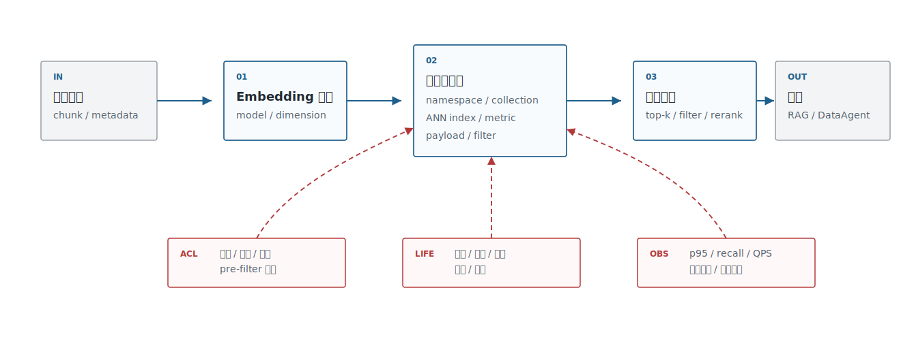
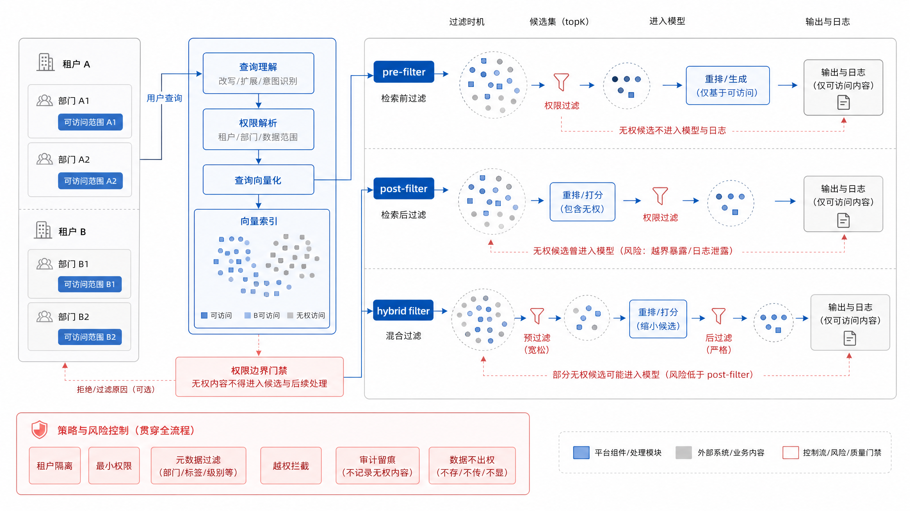

# 第18章 向量数据库与索引算法

---

向量数据库承接 RAG 中的检索执行。Embedding 生成、答案判断、权限裁决和血缘解释仍由其他组件负责。向量库接收向量、metadata 和索引参数，在权限、延迟、召回质量和成本之间做工程折中。如果平台团队一上来只问“Milvus、Qdrant、pgvector、Weaviate 选哪个”，就已经跳过了更重要的问题：数据规模多大，查询是否需要强过滤，是否多租户，是否要求事务一致性，是否能接受索引重建窗口，是否需要和传统搜索合并。

向量库事故通常不会以“数据库坏了”的形式出现。更常见的是业务用户看到一段无权文档的影子，DataAgent 召回了过期字段，客服助手引用了旧制度，或者模型升级后同一个问题突然命中另一批 chunk。排障时团队才发现，向量记录里没有源文档版本，metadata 里缺少部门权限，索引没有绑定 embedding 模型，检索日志只保存了最终答案。系统看起来在正常返回结果，实际已经失去可解释性。

这也是向量库和普通缓存的区别。缓存错了可以清掉，向量索引错了会影响召回、引用、评测和审计。一个文档解析修复后，旧 chunk 是否仍在索引里；一个字段权限变化后，旧向量是否还带着旧 ACL；一个 embedding 模型升级后，新 query 是否还在打旧索引；一个租户删除数据后，评测样本和重排缓存是否同步清理。这些问题都落在向量库生命周期里，而不是单纯的 ANN 算法选择。

企业语义检索还要面对成本压力。维度越高，内存和存储越贵；top-k 越大，重排和上下文组装越重；metadata filter 越复杂，召回和延迟越难兼顾；索引副本越多，灰度和回滚越稳，但成本也会上升。HNSW、IVF、PQ、DiskANN 等路线不是抽象算法名，而是把召回率、p95、内存、构建时间和运维能力放到同一张账单里做取舍。

本章讨论向量数据库、ANN 索引、HNSW、元数据过滤、多租户权限和向量库选型。读者需要把向量库看成知识基础设施：它保存向量，也保存版本、权限、来源、过滤条件和回放证据。选型不是找一个“最强”数据库，而是找一个能在当前规模、权限要求、运维能力和成本边界下稳定支撑企业检索的平台组件。

---

## 18.1 向量库平台定位

企业向量库应作为平台组件管理，不能停留在某个应用的私有缓存。知识库、客服、法务、DataAgent、推荐去重都可能共享 embedding 服务和向量索引能力，但它们的权限、更新频率和质量目标不同。平台层要提供统一的写入契约、查询契约、版本契约和观测指标。

DataAgent 对向量库的要求和普通知识库不同。字段、指标、SQL 示例、报表截图和业务术语经常来自不同系统，更新频率也不同；字段级权限和租户隔离要进入 metadata filter；同一个业务问题还可能同时检索语义层、历史 SQL、数据质量规则和指标血缘。因此 DataAgent 的向量库更接近语义层候选索引，按普通文档索引处理会漏掉口径、字段和权限约束。

如果这层边界没有设计清楚，事故通常不会表现成“向量库故障”，而会表现成更难追查的业务错误。一个常见路径是：某个部门的制度片段因为 metadata 缺少 `department_id` 被写入共享 collection，检索时又只做 post-filter，服务日志和 trace 里已经记录了无权候选；模型即使没有把内容完整说出来，候选片段也已经进入了不可见用户的排障链路。另一个路径是索引没有绑定 embedding 模型版本，模型升级后新旧向量混在一起，召回结果突然偏向历史样例，DataAgent 生成 SQL 时沿用了过期字段。平台层的职责，是把这些风险提前变成 schema、过滤、版本和观测约束。

讨论选型前，先要像表18-1 一样划清向量库的职责边界，尤其要写清楚它“不负责什么”。否则团队很容易把 embedding 生成、权限系统、答案正确性和数据血缘都塞给向量库。

*表18-1：向量库在企业平台中的职责。来源：本书整理。*

| 职责 | 说明 | 不负责什么 |
|---|---|---|
| 向量索引 | 管理 embedding、metric、index type、namespace、版本 | 不负责生成 embedding |
| metadata 过滤 | 按租户、部门、权限、生效时间、文档状态过滤 | 不替代统一权限系统 |
| 近似检索 | 在延迟和召回之间折中 | 不保证最终答案正确 |
| 生命周期治理 | 重建、双写、灰度、回滚、压缩和归档 | 不替代数据血缘与审计 |
| 观测与成本 | 记录 QPS、p95、召回、过滤命中、索引大小 | 不解释业务语义错误 |

职责边界确定后，平台负责人才能做选型判断。这里关注“什么时候该建设共享平台、什么时候可以用轻量方案”，不单纯比较数据库品牌。中小规模、强 SQL/事务/元数据需求的场景，通常可以先用 pgvector 起步；当多个业务共享索引、大规模检索和高 QPS 成为主要矛盾时，再评估 Milvus、Qdrant 或 Vespa。是否建设统一向量平台，也不取决于技术偏好，而取决于多个业务是否共同需要 embedding、索引、权限、评测和回滚。单应用试点没有必要提前平台化，但一旦知识库、DataAgent 和客服助手开始共用索引能力，就要把 collection、版本和过滤字段纳入统一治理。

安全和成本是选型时最容易被低估的两条线。安全上，高风险场景不允许无权候选进入模型、日志或 trace，因此 pre-filter 通常比 post-filter 更稳。成本上，维度、索引类型、过滤策略、top-k 和 reranker 都会影响内存和延迟，不能只看向量库标称 QPS。最小治理要求也要提前写清：每个索引都应记录 embedding 模型版本、chunk 策略、metadata schema、构建时间、评测结果和回滚窗口。

先定义平台边界，再把边界转成投入决策。没有这个顺序，团队很容易一上来讨论 Milvus 或 pgvector，却没有说清楚谁负责索引版本、权限过滤和回滚。放到图 18-1 的平台位置中看，向量库的核心接口是带着 metadata、权限、版本和指标完成可治理检索，而不是简单存一条向量。



*图18-1：向量库在企业 Agent 平台中的位置。来源：本书自绘。Alt text：分层图中向量库位于嵌入服务之下、RAG 与知识助手之上，存储向量与元数据并对外提供带权限过滤的检索接口，标出其"可检索知识存储"职责。*

平台化之后，这些能力还要能像图 18-2 那样被运维和治理界面管理。多租户、collection、索引版本、过滤字段和观测指标如果都散落在各应用配置文件里，向量库就很难成为共享平台能力。


*图18-2：企业向量库多租户控制台。来源：产品界面截图。Alt text：控制台界面展示按租户划分的集合列表、向量规模、索引类型与权限配置，体现向量库以租户为单位做隔离与配额管理。*

## 18.2 ANN 索引算法谱系

向量检索的核心难点是规模。少量向量可以精确计算相似度；百万、千万、亿级向量就要用 Approximate Nearest Neighbor，牺牲一点召回换取可接受的延迟和成本。Milvus、Qdrant、Weaviate、Vespa、pgvector 等系统暴露的索引名称不同，但底层取舍大体围绕图索引、倒排聚类、量化压缩和磁盘索引展开。

理解 ANN 时，先用表18-2 建立共同的算法语言，比直接给出唯一答案更重要。HNSW、IVF、PQ、磁盘索引和精确检索分别对应不同的内存、构建、召回和延迟取舍。

*表18-2：ANN 索引算法谱系。来源：本书整理。*

| 算法路线 | 直觉 | 优势 | 代价 |
|---|---|---|---|
| HNSW | 构建多层近邻图，查询时沿图搜索 | 召回和延迟表现稳定，工程生态成熟 | 内存占用较高，构建参数影响明显 |
| IVF | 先把向量聚类到桶，再在少量桶内搜索 | 大规模数据可控，适合配合压缩 | 需要训练聚类中心，参数不当会漏召回 |
| PQ/SQ 量化 | 用低比特表示近似向量 | 节省内存和存储 | 分数精度下降，需要重排或精排补偿 |
| DiskANN / 磁盘索引 | 用磁盘和缓存承载更大索引 | 降低内存压力 | 延迟抖动、冷热数据和硬件配置更敏感 |
| 精确索引 | 暴力或数据库原生精确距离计算 | 结果可解释，适合小规模 baseline | 数据量大时不可扩展 |

企业不必在第一天追求最复杂的索引。更可靠的路线是小规模数据用精确或 HNSW 建 baseline，拿内部 query 集测 recall@k 和 p95；规模上来后再评估 IVF/PQ、分片、磁盘索引和冷热分层。索引参数不是一次性配置，它会和 embedding 模型、维度、metadata 过滤、top-k、reranker 一起变化。

内部 query 集要来自真实任务，不能临时写几十个自然语言问题充数。向量库的召回错误往往只在边界问题上暴露：字段名相似但含义不同、合同条款编号相近、制度版本相互覆盖、用户问题同时带时间和权限约束。HNSW 的 `ef_search` 调高后召回可能改善，但 p95 和内存也会上升；IVF 的聚类桶设置不当时，热门问题看起来正常，长尾实体却会漏召回；量化压缩节省成本，却可能让相近指标或相似条款的分数顺序颠倒。这些取舍不能靠默认参数判断，必须用带标签的 query 集和失败样例回放来确认。

选型讨论应从召回、内存、构建时间和延迟开始，而不应停留在算法名。图 18-3 的索引谱系把这些取舍放在同一张图里，方便团队先对齐问题，再讨论具体实现。


*图18-3：ANN 索引算法谱系图。来源：本书自绘。Alt text：树状谱系把 ANN 索引分为基于图（HNSW）、基于量化（IVF-PQ）、基于树/哈希等分支，每个叶子标注召回、延迟、内存特征，展示索引家族关系。*

## 18.3 主流向量库技术选型

主流向量库的差异不只在索引算法。pgvector 的优势是和 PostgreSQL 数据、事务、SQL 权限靠得近；Milvus 更偏大规模向量基础设施；Qdrant 强调 payload/filter 和服务化向量检索；Weaviate 提供 schema、向量化模块和 GraphQL/REST 能力；Vespa 更像搜索与推荐平台，适合复杂 ranking；Chroma 更适合原型和轻量开发。

表18-3 回到企业约束比较工具路线，并延续前面的职责边界和索引取舍。这里不讨论“谁最好”，而是判断谁更适合当前规模、权限模型、运维能力和 mini-platform 的演进阶段。

*表18-3：主流向量库路线取舍表。来源：本书整理。*

| 方案 | 优势 | 代价 | 适用场景 | mini-platform 选择 |
|---|---|---|---|---|
| pgvector | 和 PostgreSQL 结合紧密，SQL、事务、权限和元数据管理简单 | 超大规模和复杂 ANN 能力不如专门向量库 | 中小规模知识库、DataAgent 字段检索、团队已有 PostgreSQL | 默认 baseline，适合 Project 13 起步 |
| Milvus | 面向大规模向量检索，索引类型和分布式能力丰富 | 运维组件更多，治理成本较高 | 大规模知识库、多业务共享向量平台 | 作为大规模候选进入 benchmark |
| Qdrant | payload filtering 和服务化 API 友好，易做多租户过滤 | 需要额外管理数据库与业务系统的一致性 | 多租户 RAG、权限过滤强的场景 | 作为服务化候选进入 benchmark |
| Weaviate | schema、模块化向量化、检索 API 完整 | 与既有数据平台集成需要评估 | 快速构建语义搜索和知识应用 | 作为产品化候选调研 |
| Vespa | 搜索、推荐、ranking 表达力强 | 学习曲线和部署复杂度高 | 大规模搜索推荐、复杂排序、多阶段 ranking | 作为高级搜索平台候选 |

选型时不要只问“支持 HNSW 吗”。还要追问：metadata filter 在 ANN 前后如何执行，过滤会不会严重降低召回；索引重建能否不停服；租户隔离是 namespace、collection、partition 还是业务字段；备份恢复是否覆盖向量和 metadata；查询日志能否追溯到用户、索引版本和候选列表。

对企业平台来说，轻量方案和专用向量库之间没有固定答案。早期如果数据量不大、团队已有 PostgreSQL 运维经验，pgvector 往往能更快把事务、权限和备份纳入同一套体系；当索引规模、写入吞吐、多业务隔离和重建窗口成为主要矛盾时，专用向量库才会显示优势。选型评审应要求候选方案跑同一批数据、同一批 query、同一套 filter 和同一套回滚流程，不能拿各自最漂亮的演示结果对比。

还有一个容易忽略的问题：向量库和企业现有搜索系统的关系。很多公司已经有 Elasticsearch、OpenSearch、OLAP 搜索或数据目录检索，向量库不一定要替代它们。更常见的路线是混合检索：关键词检索负责编号、字段、专有名词和精确条件，向量检索负责语义相似和模糊表达，reranker 再统一排序。若团队直接把所有检索迁到向量库，短期看起来架构简单，长期会在精确匹配、权限过滤和可解释性上付出代价。

混合检索的工程难点在合并结果。BM25 找到的是精确词和编号，向量召回找到的是语义近邻，数据目录可能返回字段和指标对象。平台需要统一候选 ID、来源、分数、权限和证据片段，再交给 reranker 或规则排序。否则前端看到的是几路结果拼接，Trace 里也解释不清某个证据为什么排在前面。向量库选型时，要看它能否和这些已有系统组成稳定链路，而不只是看单库召回。

因此，向量库选型要和检索链路一起评估。一个方案即使单独 recall 很高，如果难以接入 BM25、数据目录、权限服务和引用校验，也未必适合企业平台。反过来，一个轻量方案只要能稳定支撑混合检索、metadata filter、版本化和回滚，第一版就足够使用。

## 18.4 元数据过滤与多租户权限

向量库中的 metadata 是企业检索的安全边界之一。Qdrant 文档把 filtering 放在向量搜索概念里，Azure AI Search 支持向量搜索和过滤组合，这说明企业搜索需要把“相似度最近”和“是否允许看到”一起处理。同一个 query 在不同用户、部门、租户、时间点下应返回不同候选。

metadata 设计可以扩展，但表18-4 里的最小字段集合不能缺少租户、权限、来源、版本和索引治理信息；否则向量库很快会变成无法审计的共享缓存。

*表18-4：metadata 字段设计。来源：本书整理。*

| 字段 | 用途 | 示例 |
|---|---|---|
| `tenant_id` | 租户隔离 | `tenant-a` |
| `acl` | 角色或部门权限 | `finance_manager` |
| `source_type` | 文档、字段、工单、图片 | `policy` |
| `source_version` | 文档版本 | `v3` |
| `effective_at` | 生效时间过滤 | `2026-01-01` |
| `index_version` | 索引治理 | `kb-hr-v7` |

权限过滤有三种常见策略。Pre-filter 在向量搜索前过滤候选集合，安全性强，但过滤太窄可能影响 ANN 召回。Post-filter 在检索后过滤，召回稳定，但可能让模型或服务看到无权候选。Hybrid filter 把租户、密级等硬边界前置，把状态、时间等软条件后置。高风险场景应优先 pre-filter，宁可召回少一些，也不要泄露候选。

这里要看候选何时被系统看见。post-filter 如果只在返回给 LLM 前执行，应用层也许看不到无权内容，但检索服务、重排服务、trace、错误日志和离线评测样本可能已经接触过这些候选。金融、法务、人力和跨租户场景中，硬边界应进入检索条件本身，至少要保证无权向量不会进入后续排序和日志。对状态、时间、标签这类软条件，可以根据召回质量做 hybrid filter，但要记录每次查询实际使用了哪些过滤字段，避免排障时只看到一个 top-k 结果。

过滤策略还会改变产品体验。权限过滤后候选为空时，系统不能简单回答“没有找到相关内容”，因为真实含义可能是“当前权限下没有可见证据”。对于 DataAgent，这两种提示会引导用户采取完全不同的动作：前者让用户换问法，后者让用户申请权限或切换数据域。向量库返回的结果里应包含过滤命中、被过滤计数和空结果原因，前端和 Runtime 才能给出正确恢复路径。

图 18-4 中 pre-filter、post-filter 和 hybrid filter 的差异，最好让安全和平台团队一起确认：哪些边界必须在检索前生效，哪些条件可以在召回后参与排序和过滤。



*图18-4：metadata filter 与多租户权限边界。来源：本书自绘。Alt text：检索请求带租户与权限标签进入向量库，过滤条件在 ANN 搜索阶段一同生效（而非先召回后过滤），箭头标出无权数据在检索时即被排除。*

## 18.5 索引生命周期治理

索引生命周期比建库更重要。Embedding 模型升级、chunk 策略变化、文档解析修复、权限字段变化、索引参数调整，都会让索引需要重建。平台要把索引当成版本化资产，不能当成一次性缓存。

索引生命周期需要按表18-5 拆成阶段管理，这样“重建索引”才会从一次性运维动作变成可评估、可灰度、可回滚的发布流程。

*表18-5：索引生命周期阶段。来源：本书整理。*

| 阶段 | 关键动作 | 质量门禁 |
|---|---|---|
| 构建 | 编码文档、写入向量、写入 metadata、记录 lineage | 维度、metric、model version 一致 |
| 离线评测 | 用 query 集测 recall、MRR、filter hit、latency | 不低于 baseline，失败样例可解释 |
| 双写灰度 | 新旧索引同时接收更新，shadow query 对比 | 候选差异、权限差异可追踪 |
| 切流 | 小流量到全量逐步切换 | p95、错误率、引用命中率稳定 |
| 回滚 | 保留旧索引和旧模型服务 | 回滚命令和数据快照可用 |
| 归档 | 下线旧索引，保留审计信息 | 查询日志和版本元数据可追溯 |

向量库 benchmark 不能只测查询延迟。构建时间、双写成本、切流风险和回滚窗口同样是企业选型指标。

索引治理还要处理“数据已经变了，索引还没变”的灰区。权限字段变更后，旧索引里的 chunk 可能仍带着旧 ACL；文档解析器修复表格错误后，旧 chunk 仍然保留错误行列；embedding 模型升级后，相同 query 在新旧索引上的候选排序可能不同。生产系统不能把这些变化都解释成用户问题或模型波动，而要把 source hash、parser version、chunk strategy、embedding model、index parameter 和 ACL schema 写进索引版本。这样出现问题时，团队才能回答是文档源变了、解析变了、向量变了，还是过滤条件变了。

生命周期治理还要给“部分重建”留接口。企业知识库很少能停机全量重建：某个部门上传新制度、某个合同模板修订、某个字段权限变化，都只影响一部分 source。平台应支持按 source、tenant、collection 或 index_version 局部重建，并在双写期间比较新旧候选差异。没有局部重建能力，团队要么长期容忍旧索引，要么频繁做高风险全量切换。

局部重建还要和删除语义配合。用户删除一份文档，不代表只从对象存储里删文件；对应 chunk、向量、倒排索引、reranker 缓存、评测样本和报告引用都可能继续存在。权限撤回也是同样问题：业务系统里角色已经变化，旧向量仍带着旧 ACL，就会在检索时制造灰区。向量库接口需要把 `delete_by_source`、`delete_by_acl` 和 `rebuild_by_source` 做成平台能力，不能让每个应用自己清理。

mini-platform 的 `infra/vectorstore/` 当前还是占位，后续可以先定义统一接口：`upsert(chunks, embeddings, metadata)`、`search(query_embedding, filters, top_k)`、`delete_by_source(source_id)`、`build_index(index_version)`、`evaluate(index_version, query_set)`。先把接口稳定下来，再适配 pgvector、Qdrant 或 Milvus。

## 18.6 工程实践：嵌入模型微调 + 向量库 benchmark

Ch17 讨论微调和重排，本章把它和向量库放进同一个 benchmark。企业需要评估的是组合效果：某个 embedding 模型配某个索引类型，在某个 metadata filter 下，能否以可接受成本召回正确证据。

```yaml
experiment: vectorstore_benchmark
query_set: data/eval/enterprise_queries.jsonl
models:
  - name: bge-m3-baseline
  - name: bge-m3-finetuned
stores:
  - provider: pgvector
    index: hnsw
  - provider: qdrant
    index: hnsw
metrics:
  quality: [recall@10, mrr@10, ndcg@10]
  system: [p50_latency_ms, p95_latency_ms, qps, index_size_mb]
  governance: [filter_hit_rate, acl_violation_count, rebuild_time_min]
```

图 18-5 中的向量库 benchmark 报告也要沿用这个思路：质量指标、系统指标和治理指标要放在同一页。企业选型既要看 recall，也要看延迟、过滤、重建和回滚。

benchmark 还要覆盖写入和更新路径。很多向量库在静态数据集上表现很好，一旦遇到高频增量写入、批量删除、权限字段更新和低峰重建，延迟和召回都会变化。企业选型时应把“白天读、夜间重建、实时写入、紧急删除”这类运行节奏放进测试脚本。否则上线后才发现索引构建占满资源，RAG 查询在业务高峰期抖动，运维团队只能临时扩容。


*图18-5：向量库 benchmark 报告总览。来源：本书自绘。Alt text：报告页对比多个向量库在召回率、P95 延迟、写入吞吐、内存占用上的指标曲线，并标注不同索引参数下的取舍点。*

## 18.7 向量检索的运行回放

向量库上线后，平台要能回放一次检索为什么返回这些候选。回放材料至少包括 query 文本、embedding 模型版本、索引版本、过滤条件、top-k、reranker 版本和最终被引用的 chunk。若只保存最终答案，团队无法判断错误来自向量召回、元数据过滤、重排还是回答生成。

多租户过滤尤其要进入回放。企业检索常见事故不是完全查不到，而是召回了用户无权访问的候选，随后在日志、prompt 或调试界面泄露。向量库应把权限过滤作为查询条件的一部分记录下来，而不是在结果返回后由应用层临时删除。这样第38章的 Trace 才能证明无权内容没有进入模型上下文。

回放记录还要保留“被过滤掉的计数”，而不是只保存最终候选。比如一次查询在权限过滤前有 80 个候选，过滤后只剩 3 个，用户看到的答案质量差，根因可能是权限过窄、metadata 写错，或者文档没有入库。没有过滤前后的数量和原因，团队会误以为 embedding 模型召回差。对 DataAgent 来说，这个差异还会影响澄清策略：系统应该提示“当前权限下证据不足”，而不是生成一个看似完整的答案。

索引重建也要留版本。文档切分、embedding 模型、维度、归一化策略和元数据 schema 任一变化，都会改变召回结果。生产环境应支持新旧索引并行一段时间，用同一组 query 比较召回差异，再决定切流。否则一次看似普通的重建，可能让 RAG 和 DataAgent 同时出现质量波动。

版本迁移期间还要处理写入一致性。用户在灰度窗口上传新文档，旧索引和新索引是否都写入；某份文档在灰度期间被撤回，两个索引是否都删除；评测用的是哪个索引版本，线上回答又用了哪个版本。这些问题不写清楚，灰度就会变成“随机命中新旧数据”。较稳妥的做法是用组合版本记录 embedding、chunk、parser、metadata schema 和索引参数，并把写入、查询和评测都绑定到组合版本。

## 18.8 索引选型的生产判断

向量索引选型不能只看 benchmark 排名。企业场景更关心索引能否在数据持续更新、权限过滤、多租户隔离和低峰重建中保持稳定。HNSW、IVF、DiskANN 等索引路线各有适用条件，但最终要落到数据规模、更新频率、过滤复杂度、召回要求和运维能力。一个在公开数据集上召回率很高的索引，如果无法支持高频增量更新，放到企业知识库里可能反而不合适。

评估索引时要把过滤条件纳入测试。很多企业检索不是“从全库找最相似文档”，而是在租户、部门、权限、文档类型、时间范围和业务域过滤后再检索。若索引库对元数据过滤支持较弱，就会出现两种坏结果：先过滤再检索导致召回不足，先检索再过滤导致结果被权限过滤清空。测试时应使用真实权限分布和文档分布，而不是只用平均查询。

索引生命周期也影响选型。增量写入、批量删除、重建、压缩、冷热分层和备份恢复都要提前验证。尤其是删除，不能只从业务库删除文档，还要处理向量索引、倒排索引、缓存和摘要。向量库是 RAG 链路的一部分，不是独立存储产品。索引选型如果没有和第20章的证据链、第27章的 Memory、以及第38章的 Trace 打通，后续很难解释一次检索为什么返回这些内容。

## 18.9 向量检索的质量回放

向量检索质量不能只通过人工感觉判断。一次检索结果应该能回放查询文本、query rewrite、embedding 模型版本、索引版本、过滤条件、召回候选、rerank 分数和最终进入上下文的片段。若回答错误，团队需要知道是文档没有入库、chunk 切分不当、向量召回漏掉、rerank 排错，还是上下文组装时被截断。没有这些中间证据，RAG 调优就会退化成反复改切分长度和 top_k。

质量回放还要服务版本比较。更换 embedding 模型、调整 chunk 策略或重建索引后，同一批查询的召回集合会变化。平台应当比较旧版本和新版本的命中文档、片段位置、证据覆盖率和回答质量，而不是只看平均相似度。对高风险知识库，还要抽查被新版本排除的旧证据，判断它们是噪声还是被错误丢弃。

这一节的重点是把向量数据库从“黑盒检索组件”变成“可诊断的知识基础设施”。Agent 平台依赖它提供事实证据，用户也会基于这些证据做业务判断。只要检索证据不可回放，后续生成层再稳，也无法建立可信回答。

质量回放也能减少无效调参。没有回放时，团队遇到错误回答往往先改 prompt、加 top-k 或换模型；有了回放后，可能会发现正确文档根本没有入库，或者进入了候选但被权限过滤，或者进入上下文前被摘要阶段截断。不同根因对应不同修复动作。把这些证据固定下来，RAG 调优才会从经验尝试变成工程诊断。

## 18.10 向量库的容量与成本治理

向量库上线后，容量增长通常比团队预期更快。文档版本、切分副本、多模型 embedding、多租户索引、评测样本和缓存都会占用存储。若没有治理，团队会在召回质量下降或成本突然升高时才开始清理。更稳妥的方式是从一开始就记录每个向量的来源、版本、租户、业务域、过期策略和引用状态。

成本治理不能简单删除低频文档。低频文档可能是关键合规证据，也可能只在事故复盘时使用。平台应把内容分成热知识、温知识和冷证据：热知识进入在线索引，温知识可以降低副本或使用较慢索引，冷证据保留原文和元数据，在需要时再进入检索链路。这样既能控制成本，也不会破坏证据完整性。

向量库治理还要和文档生命周期打通。文档撤回、权限变化、合同到期、政策替换时，索引也要同步更新。只更新业务库而忘记向量索引，是 RAG 系统常见的安全和质量风险。向量库在平台里不是附属缓存，而是需要发布、回滚和审计的数据基础设施。

容量治理最终也会影响召回质量。为了省成本盲目压缩向量、合并索引或降低副本，可能让低频但关键的文档更难被召回。平台应把成本调整纳入回归评测，确认压缩前后关键问题仍能命中证据。这样成本优化才不会悄悄牺牲可信回答。

成本治理还要给业务一个可解释的选择。高频知识库可以使用更高副本、更快索引和 reranker；低频归档证据可以保留原文、metadata 和冷索引，在需要时再进入在线检索；临时项目知识可以设置过期时间，到期后转入归档或删除。这样平台不是简单限制存储，而是把成本、响应速度和证据完整性变成可讨论的策略。

因此，向量库的运维指标不应只看存储和 QPS，还要看索引版本、召回覆盖、删除延迟和权限过滤后的空结果比例。这些指标能更早暴露知识基础设施的问题。

## 本章小结

向量库的价值不在存放向量本身，而在于把语义候选检索做成可扩展、可治理、可回滚的平台能力。HNSW、IVF、PQ 等算法路线要和召回、成本、延迟一起评估；metadata 过滤、多租户权限、索引版本、重建和 benchmark 也要放进同一套生命周期。

向量库负责候选检索，不负责 embedding 生成，也不负责最终业务判断。ANN 参数需要和 embedding 模型、维度、过滤策略、top-k、reranker 一起调优。高风险场景中，metadata filter 是权限边界的一部分，通常应优先采用 pre-filter。

索引版本是生产资产。模型、chunk 策略或权限过滤方式变化时，应通过重建、双写或灰度完成迁移，而不是把新旧向量混在同一个空间里。


## 参考文献

- pgvector: https://github.com/pgvector/pgvector
- Milvus Index Documentation: https://milvus.io/docs/index.md
- Qdrant Filtering: https://qdrant.tech/documentation/search/filtering/
- Weaviate Documentation: https://weaviate.io/developers/weaviate
- Vespa Approximate Nearest Neighbor Search: https://docs.vespa.ai/en/nearest-neighbor-search.html
- Azure AI Search Vector Search: https://learn.microsoft.com/en-us/azure/search/vector-search-overview
