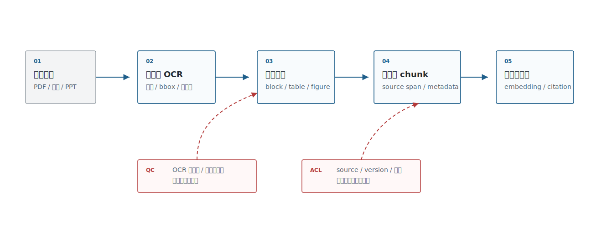
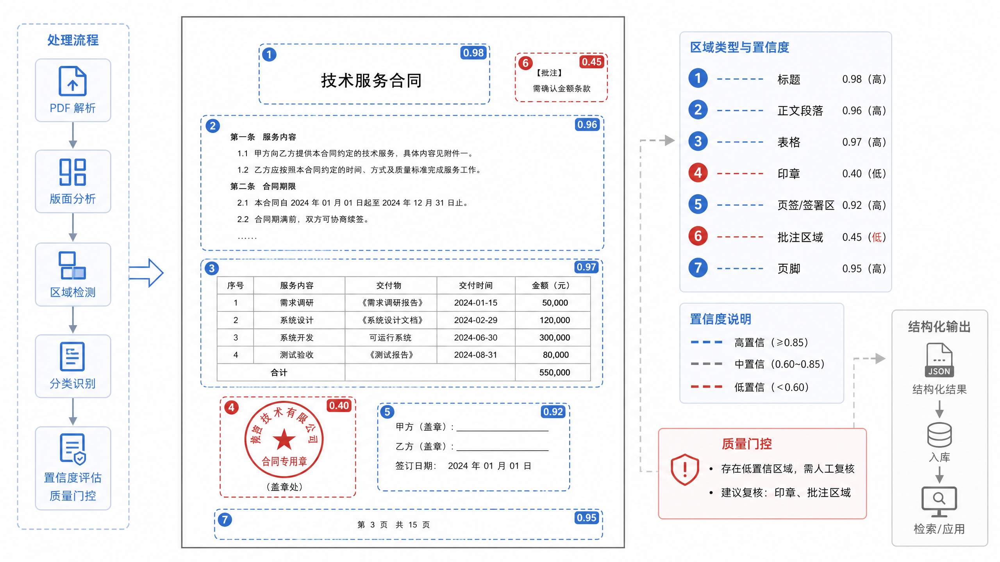
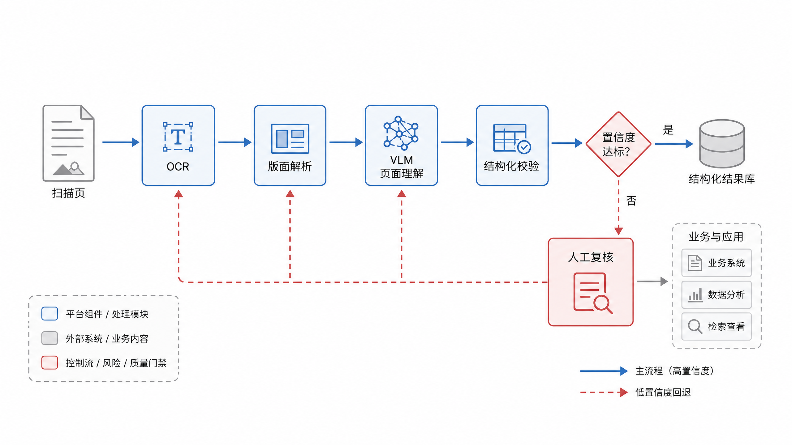
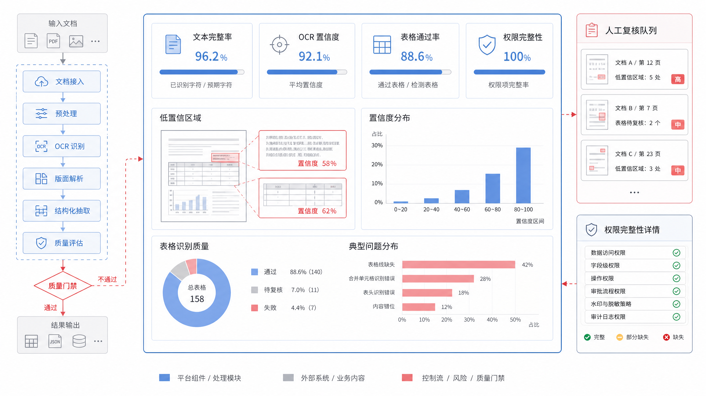

# 第19章 文档解析与多模态 OCR

---

很多 RAG 失败发生在文档解析阶段，而非模型回答阶段。合同页眉页脚混进正文，表格被按行打散，扫描件漏掉印章，PDF 的两栏文本顺序错乱，PPT 截图里的指标没有 OCR 出来。向量库和 reranker 无法修复这些底层噪声。它们只能在已经被解析出来的内容里排序，不能找回被漏掉的表格单元格，也不能知道一段文字原本来自脚注、附件还是扫描批注。

企业知识大量沉在版式复杂的 PDF、表格、截图和扫描件里。制度文档看似是文本，实际上有目录、页眉、脚注和修订记录；合同看似是条款，实际上有附件、跨页表格、印章和签署页；财务报表看似是数字，实际上指标口径常写在表头、图例和脚注里；运维截图看似只是图片，实际上包含告警、时间戳、服务名和人工标注。解析系统如果把这些材料统一压成一段 Markdown，下游模型会得到“可读文本”，却失去可复核证据。

DataAgent 对解析质量尤其敏感。一个报表截图里的“净销售额”如果被 OCR 成“销售额”，后续 schema linking 可能连到错误指标；一个跨页表格如果丢掉表头，SQL 生成器会拿到数值，却不知道单位、期间和适用范围；一个合同金额如果没有页码和 bbox，法务或财务复核时就无法回到原文。很多团队把这些问题归因于“模型幻觉”，实际根因在更前面的解析产物不完整。

文档解析与多模态 OCR 的工程边界，落在几个具体问题上：表格、多栏、印章和扫描噪声如何处理；传统 OCR、版面分析和 VLM 解析各自适合什么场景；解析结果如何保留页码、区域、表格结构、权限和版本；质量门禁如何判断哪些内容可以自动进入索引，哪些必须进入人工复核。解析链路做不好，后续的 embedding、RAG、GraphRAG 和 EvidenceRef 都会建立在不可靠材料上。本章讨论文档解析、OCR、版面分析、VLM 解析、表格还原和证据可溯源。读者需要把“识别出文字”与“生成可用知识资产”区分开：前者只是把页面变成文本，后者还要让每个 chunk、表格和字段都能回到来源、权限、坐标和解析版本。只有先把文档变成可检索、可引用、可审计的结构化对象，企业知识工程才有可靠底座。

---

## 19.1 企业文档解析挑战

企业文档不是纯文本集合。制度、合同、发票、报表、PPT、看板截图、手写巡检单、邮件附件混在一起，格式、权限和证据要求都不一样。unstructured、LlamaParse、PyMuPDF、PaddleOCR、Marker、Nougat、Donut、Qwen-VL 这类工具解决的是不同层的问题，选型时要先分清它们所在的环节。文档解析的选型应从表19-1 这类失败后果倒推。工具功能表只能说明“能做什么”，失败后果才能说明“错了以后会影响谁”。选型评审最好先拿真实文档做失败复盘。合同团队关心金额、日期、条款编号和签章；财务团队关心表格行列、单位、期间和汇总关系；知识库团队关心标题层级、段落顺序和引用页码；安全团队关心 ACL、源文件版本和日志留存。不同角色对“解析成功”的定义不同，平台要把这些要求汇到同一份数据契约里。

*表19-1：企业文档解析的典型失败模式。来源：本书整理。*

| 失败模式 | 表现 | 下游影响 |
|---|---|---|
| 文本顺序错误 | 双栏 PDF、页眉页脚、脚注进入正文 | chunk 语义混乱，RAG 引用错位 |
| 表格结构丢失 | 单元格合并、表头层级、跨页表格被打散 | DataAgent 找不到指标口径，合同金额无法校验 |
| OCR 漏识别 | 印章、手写、低清扫描件、截图字体 | 证据缺失，召回不到关键字段 |
| 版面语义丢失 | 标题、章节、图表、批注没有层级 | 引用缺少页码和区域，无法复核 |
| 权限和来源缺失 | 解析结果没有 source、版本、ACL | 检索越权，审计无法追踪 |

失败模式明确后，平台负责人要做文档分流，而非把所有文件都自动入库。制度和手册可以先自动解析，因为它们通常版式稳定、复核成本可控；合同、票据和审计材料则要设置质量门禁和人工复核，因为一个金额、日期或条款识别错误就可能影响业务判断。复杂截图和图表可以引入 VLM，但 VLM 输出只能作为候选解释，金额、日期、条款和指标仍要回到 OCR、规则和结构化校验。解析质量对 ROI 的影响也要前置评估：解析错误会一路放大到 embedding、RAG 和 GraphRAG，很多时候先修解析比反复调 prompt 更有效。

安全边界同样不能后置。原文、页面图片、OCR 文本、chunk 和 trace 都可能含敏感信息，ACL 必须从源文档继承，而不能等到检索阶段再补。早期上线的最低门槛是：chunk 能回到页码和 bbox，表格有结构，低置信区域可进入复核队列，解析版本可追踪。达不到这些条件的材料，不应进入高风险回答链路。文档解析的基本原则是先控制失败后果，再选择自动化程度。否则系统会把解析错误包装成“检索质量差”或“模型幻觉”，排障成本会高很多。回到图 19-1 的 RAG 前置链路，原始文件进入向量库之前，需要先完成解析、结构化、质量门禁和权限继承。

实际项目里，最容易被低估的是“看起来解析成功”的错误。合同中一个跨页表格如果被拆成两段，付款条件和违约责任可能分别落进不同 chunk；制度文档的页眉如果反复进入正文，检索结果会被重复标题污染；报表截图里的小字注释如果没有识别，DataAgent 会拿到指标数值却丢掉口径限定。系统层面看到的只是入库任务成功、向量数量正常、RAG 有返回，业务层面却会得到无法复核的答案。因此解析阶段需要把失败模式显式记录下来，而非把所有文件都当作普通文本吞进去。



*图19-1：企业文档解析流水线。来源：本书自绘。Alt text：横向流水线依次为文件接入、格式识别、版面分析/OCR、结构还原（表格/标题/段落）、分块入库，箭头表示原始文档逐步转为带结构的可检索对象。*

同一条流水线落到图 19-2 中的不同文档类型上，还要配置不同解析策略和复核要求。制度文档、合同、票据、看板截图不应该共用同一套固定切分逻辑。这类分流最好在文件接入时就发生。上传入口可以要求用户选择文档类型、业务域、敏感等级和用途；平台根据这些信息选择解析器、质量门禁和复核路径。合同进入合同解析策略，票据进入票据字段校验，看板截图进入视觉理解和指标确认，普通制度进入文本和标题层级解析。文件一旦被错误分流，后续再靠模型判断会更难，也更难解释为什么某个文档没有进入索引。


*图19-2：企业文档类型矩阵。来源：本书自绘。Alt text：矩阵以"版式复杂度"和"是否扫描件"为轴，把合同、报表、手册、截图、票据等文档类型落入不同象限，各象限标注推荐的解析方式。*

## 19.2 文档结构与版面语义

文档解析要输出结构化结果。一个可用的解析结果至少包含页面、区域、标题层级、段落、表格、图片、脚注、页码、坐标和来源版本。RAG 的引用证据最好能回到“第几页、第几个区域、哪个表格单元格”，而非一段拼接文本。这些结构可以像表19-2 那样拆成稳定对象，为后续 chunk、embedding、引用高亮和质量门禁提供统一数据契约。

*表19-2：解析对象的数据结构。来源：本书整理。*

| 对象 | 必要字段 | 用途 |
|---|---|---|
| Document | `source_id`、`source_version`、`acl`、`file_hash` | 版本、权限、审计 |
| Page | `page_no`、`width`、`height`、`rotation` | 页码引用、坐标换算 |
| Block | `block_type`、`bbox`、`reading_order` | chunk、视觉检索、引用高亮 |
| Table | `rows`、`cols`、`header`、`cell_bbox` | DataAgent、合同、票据 |
| Figure | `caption`、`image_ref`、`ocr_text` | 多模态检索、截图问答 |
| Chunk | `chunk_id`、`text`、`source_span`、`metadata` | embedding 和 RAG |

表里的对象用于保留可复核路径，而非为了让数据模型看起来完整。如果一个答案引用了合同里的付款条款，系统要能定位到原始 PDF 的页码和区域；如果 DataAgent 使用了报表截图里的指标，系统要能说明 OCR 识别结果来自哪个图表区域。缺少这条路径，RAG 只能把不可验证的文本交给模型。页码和 bbox 是生产证据的一部分，不能只作为界面高亮信息处理。审计人员复核答案时，通常不会接受“来自某份合同的某段文本”这种模糊来源；业务用户也需要知道引用内容来自正文、脚注、附件还是扫描件批注。bbox 能把 chunk、OCR 文字、表格单元格和页面截图重新连起来，后续做引用高亮、人工复核、低置信区域标注，或对比不同解析器版本，都要依赖这个坐标。只保留纯文本会让系统在上线早期显得轻便，但争议答案、合规审计和解析回归都会暴露证据链缺口。

DataAgent 场景尤其依赖表格和版面。很多指标口径写在报表脚注、表格表头、图例和截图批注中，并不在正文里。解析系统如果只输出连续文本，后续 schema linking 会把“销售额”“净销售额”“含税销售额”混在一起；保留单元格、页码、图表标题和字段来源后，DataAgent 才能把自然语言问题链接到可信指标。因此，页面结构要作为解析产物保留下来。图 19-3 中的标题、段落、表格、图表和页码坐标，都会影响后续 chunk、embedding、引用高亮和人工复核。页面结构也会影响 chunk 策略。标题和正文可以按章节切分，表格要保留行列关系，图表说明要和对应图片绑定，脚注和批注要跟主文建立引用关系。若解析阶段没有这些对象，后续 chunk 只能按长度切，检索时就会把表头、数据和备注拆散。很多“chunk 大小怎么调”的争论，其实应该在版面结构阶段解决。



*图19-3：PDF 页面结构解析示意。来源：本书自绘。Alt text：一页 PDF 被识别为标题、正文段落、表格、图、页眉页脚等区块，每个区块标注边界框与阅读顺序，体现版面分析还原文档结构。*

## 19.3 文档解析工具链选型

工具链选型要按文档类型和证据要求来做。PyMuPDF 适合做 PDF 文本、页面和坐标的底层处理；unstructured 适合把多格式文档切成 elements；LlamaParse 适合面向 LLM/RAG 的文档解析服务；PaddleOCR 和 PP-Structure 适合中文 OCR、表格和版面；Marker/Nougat 更偏学术论文、公式和 Markdown 化；VLM 适合复杂页面理解和视觉问答，但成本和稳定性要单独评估。对表19-3 中这些工具做取舍时，要沿用前面定义的数据契约：工具能不能输出页码、坐标、表格结构、权限继承和低置信标记，比“演示效果好不好”更重要。

*表19-3：文档解析工具链取舍表。来源：本书整理。*

| 方案 | 优势 | 代价 | 适用场景 | mini-platform 选择 |
|---|---|---|---|---|
| PyMuPDF + 规则 | 可控、轻量、坐标信息清晰 | 复杂版面和 OCR 需要额外组件 | 可复制文本 PDF、内部制度、简单合同 | 默认底层 PDF 适配器 |
| unstructured | 多格式 element 抽取生态成熟 | 输出质量依赖文档类型和策略配置 | 知识库批量导入、格式多样的企业文档 | 作为通用 parser provider |
| LlamaParse | 面向 LLM/RAG 的解析体验好 | SaaS/服务成本、数据出域需要评估 | 快速试点、复杂 PDF、表格较多文档 | 作为可选 provider |
| PaddleOCR/PP-Structure | 中文 OCR、版面和表格能力强 | 部署和调参成本较高 | 扫描件、票据、中文表格、图片文档 | 作为私有化 OCR provider |
| VLM 解析 | 能处理截图、图表和复杂视觉语义 | 成本高、可重复性和格式稳定性较弱 | 看板截图、巡检图片、复杂页面理解 | 只进入高价值场景，不做默认解析 |

选型时要做小样本评测，不能只看工具演示。每类文档抽 30-100 份，评估文本完整率、表格结构、标题层级、页码坐标、OCR 置信度、解析耗时和人工复核比例。解析工具链一旦进入生产，就要像模型一样版本化：parser version、prompt version、OCR model version、layout strategy 都会影响后续索引。评测样本要刻意包含脏数据：扫描歪斜、低分辨率截图、跨页表格、双栏排版、盖章遮挡、手写批注、附件目录和历史版本模板。每一类样本都要记录期望输出：文本顺序是否正确，表格是否保留行列关系，页码和坐标是否能回到原文，低置信区域是否被标出。这样选型才会从“哪个工具看起来聪明”转向“哪个工具在本企业文档上可控”。解析评测还要分业务等级。普通制度文档可以接受少量格式损失，只要引用能回到页码；合同和票据需要金额、日期、主体和条款编号准确；报表截图需要保留指标名、单位、期间和图例；审计材料则要保留附件、批注和签署信息。把所有文档放进同一个平均准确率里，会掩盖高风险材料的失败。平台应该按文档类型给出不同通过线，避免低风险文档的好成绩抵消高风险文档的错误。

工具链也要考虑数据出域和复核成本。合同、财务单据、人事材料通常不适合直接送到外部解析服务；即使使用 SaaS，也要有脱敏、访问审批和结果留存策略。私有化 OCR 成本更高，但在敏感文档、高批量处理和长期运营中更容易做版本控制。选型评审不能只比较一次解析价格，还要比较人工复核比例、失败样例处理、模型升级后的回归成本，以及是否能把解析结果稳定交给后续 RAG。

## 19.4 多模态 OCR 与 VLM 解析

OCR 把图像中的文字转出来，版面模型识别区域和阅读顺序，VLM 进一步理解页面里的图表、截图和视觉关系。三者是流水线里的不同层，不是互斥方案。合同金额、票据日期、报表指标这类字段，更适合用 OCR+规则+结构化校验；截图问答、缺陷图片相似、复杂页面描述，可以引入 VLM，但输出应作为候选解释，而非直接作为事实。

表19-4 的重点是边界，而非能力排名。OCR、版面模型、VLM 和结构化校验应协同工作，单一模型很难替代整条解析流水线。

*表19-4：OCR、版面模型与 VLM 的边界。来源：本书整理。*

| 能力 | 输入 | 输出 | 适合任务 | 风险 |
|---|---|---|---|---|
| OCR | 图片、扫描页、截图 | 文本和位置 | 发票、合同、截图文字 | 低清、手写、旋转和印章影响大 |
| 版面解析 | PDF 页面、截图 | block、table、figure、reading order | chunk、引用、表格抽取 | 复杂版式容易排序错 |
| VLM 解析 | 图片、页面、图表 | 描述、问答、区域解释 | 看板截图、图表理解、视觉检索 | 成本高，结果可能不稳定 |
| 结构化校验 | OCR/VLM 输出 + 规则 | 字段、置信度、错误标记 | 金额、日期、编号、指标 | 规则维护成本 |

质量门禁也要沿着能力边界设计：文字识别看置信度，版面解析看阅读顺序和坐标，VLM 输出看可复核证据，结构化字段看规则校验结果。VLM 在这里更适合做补充理解，而非事实源头。它可以解释截图中的布局、识别图表和文本之间的关系，也可以在复杂页面上给出候选区域；但金额、日期、合同编号、指标值这类字段仍然要回到 OCR 文本、坐标、规则校验和必要的人工复核。否则系统会把“模型看懂了页面”误当成“字段已经被验证”。在高风险文档里，VLM 输出应保留为可复核的候选解释，并和原图区域绑定，避免直接覆盖结构化字段。

VLM 输出还要保留提示词和图像版本。截图裁剪、分辨率压缩、提示词变化都会影响解释结果；如果只保存最终文字，后续无法判断错误来自图像质量、模型理解，还是字段校验缺失。比较稳妥的方式是把 VLM 结果作为 `visual_observation` 写入解析产物，并记录来源页面、bbox、模型版本和置信说明，再由规则或人工复核决定它能否进入结构化字段。

在 DataAgent 场景中，VLM 更适合处理“图表在说什么”，不适合直接决定“数据应该怎么查”。例如销售看板截图可以帮助系统识别图表标题、异常区域和筛选条件，但最终指标口径仍要回到语义层；巡检图片可以帮助系统定位设备状态，但维修结论仍要回到工单和人工确认。这样前端可以展示视觉证据，后端也不会把视觉解释当成权威字段。落到图 19-4 的流水线上，VLM 负责补充视觉理解，金额、日期、编号和指标则必须回到可验证字段与规则校验。



*图19-4：OCR 与 VLM 协作路径。来源：本书自绘。Alt text：流程显示常规文本走 OCR 快速识别，复杂版面或图文混排转交 VLM 理解，结果合并后统一输出，箭头标出按难度分流到两条解析路径。*

## 19.5 解析流水线与质量门禁

文档解析流水线要有质量门禁。门禁的目标不在追求完美，而在判断哪些文档可以自动进入索引，哪些需要人工复核，哪些只能作为低置信候选。企业平台可以把每个文档解析成 `parsed_document.json`，再生成 chunk、embedding 和引用索引。
```json
{
  "source_id": "contract-2026-001",
  "parser": "pymupdf+paddleocr",
  "parser_version": "2026-06-baseline",
  "pages": 18,
  "quality": {
    "ocr_confidence_avg": 0.93,
    "table_parse_pass_rate": 0.86,
    "low_confidence_blocks": 7,
    "requires_review": true
  },
  "artifacts": {
    "structured_json": "s3://.../parsed.json",
    "page_images": "s3://.../pages/",
    "chunks": "s3://.../chunks.jsonl"
  }
}
```

质量门禁最终要落成表19-5 这样的可执行检查项，把“解析是否成功”拆成文本、表格、坐标、权限和低置信区域，而非只看任务是否跑完。门禁的结果还要进入运营流程。低置信区域不能只在 JSON 里留下一个数字，而应形成待复核队列：哪个文档、哪一页、哪个区域、哪种错误、谁复核、复核后是否触发重建索引。解析器升级时，也要用同一批样本做回归对比，观察表格结构、阅读顺序、坐标映射和引用命中是否变好。这样解析流水线才会从一次性导入工具变成持续改进的知识生产环节。

上线后的解析系统还要支持例外处理。某些历史扫描件可能永远达不到自动入库阈值，但仍然具有业务价值；某些合同附件只允许特定角色查看，不能因为解析失败就绕过权限；某些低置信字段可以进入候选索引，却不能用于自动回答。平台要把这些例外写成状态，而非让运营人员在线下表格里记录。文档状态、复核结论和索引状态保持一致，后续 RAG 和 DataAgent 才能知道哪些证据可以直接使用，哪些只能提示用户打开原文确认。这类状态还会反向约束索引准入：未复核的低置信表格不应进入字段索引，权限不完整的文档不应进入向量库，缺少页码和坐标的 chunk 不应支持高风险引用。

*表19-5：解析质量门禁。来源：本书整理。*

| 门禁 | 指标 | 处理策略 |
|---|---|---|
| 文本完整率 | 可复制文本 + OCR 覆盖率 | 低于阈值进入人工复核 |
| 表格结构 | 表头识别、行列一致、跨页表格连接 | 失败时不进入 DataAgent 字段索引 |
| 坐标可追溯 | chunk 能否映射回页码和 bbox | 不可追溯则禁止用于高风险回答 |
| 权限完整性 | source、ACL、版本是否齐全 | 缺失则不写入向量库 |
| 低置信区域 | OCR/VLM 置信度和规则校验失败数 | 标记红色控制流，要求复核 |

mini-platform 后续可以新增 `infra/document_parser/`，输出统一的 `ParsedDocument`。Ch20 的 RAG 不直接吃原始 PDF，而是吃 `ParsedDocument` 产生的 chunk 和 citation spans。这样文档解析、向量索引和答案引用才有清晰边界。`ParsedDocument` 还应携带状态。`parsed` 只表示解析完成，`review_required` 表示需要人工确认，`approved_for_search` 表示可以进入普通检索，`approved_for_high_risk_answer` 表示可以支撑高风险回答。不同状态对应不同索引和回答策略。这样低置信文档仍能被人找到，却不会被模型直接用于财务、法务或合规结论。质量门禁的输出也不应该只是一条“解析完成”的任务状态。图 19-5 中的平台团队还要看到低置信区域、表格失败、权限缺失和是否需要人工复核。



*图19-5：文档解析质量报告。来源：本书自绘。Alt text：报告页展示字符识别率、表格还原准确率、版面顺序正确率等指标，并列出失败样本缩略图，体现解析质量可量化、可抽检。*

解析质量报告还应进入日常运营，而非只在导入当天查看。知识库负责人需要看到哪些文档反复低置信、哪些模板最容易解析失败、哪些部门上传的扫描件需要重新规范；平台团队需要看到 parser 升级后召回质量是否下降，低置信队列是否积压，人工复核是否成为瓶颈。若这些信号没有沉淀，文档解析会变成一次性搬运任务，后续 RAG 和 DataAgent 出错时只能在下游补救。

运营视角还要关注“解析成功但不能用”的材料。比如一个合同被成功转成文本，但缺少页码和坐标；一个表格被转成 Markdown，但合并单元格语义丢失；一个截图被 VLM 描述得很完整，但没有结构化字段和置信度。任务状态显示成功，知识库却不能把它用于高风险回答。质量报告应把这类材料单独列出来，提示它们只能做低风险检索或人工查看。

## 19.6 文档解析结果的回放边界

文档解析进入 Agent 链路后，平台要能说明一段文本、一个表格或一个金额字段来自原文的哪一页、哪个区域、哪个解析版本。否则 RAG 或 DataAgent 引用了解析结果，业务用户却无法回到原始证据。解析产物应保留页面坐标、块类型、置信度、OCR 引擎版本和人工修正记录。表格解析尤其需要谨慎。很多财务表、合同附件和运营报表的含义来自行列关系、合并单元格和页眉页脚。若只把表格拍平成文本，模型可能读到字段，却丢掉单位、期间或适用范围。更稳的做法是同时保留结构化表格、原始页面截图和文本摘要，让后续检索和报告都能回到证据。解析失败也要可运营。低置信度页面、倾斜扫描、遮挡印章、手写批注和跨页表格，都应进入失败样例库。平台不需要一开始解决所有版式，但要知道哪些文档不能自动进入高风险回答。对合同、票据和审计材料，低置信度解析应触发人工复核，而非让模型根据残缺文本补全结论。

## 19.7 OCR 质量控制的分层标准

文档解析质量不能只用“识别准确率”概括。企业文档通常包含表格、页眉页脚、印章、批注、脚注、扫描噪声和跨页结构，单个字符识别正确并不代表文档可以进入 RAG。更有用的质量标准应当分层：文本层看字符和段落，版面层看标题、表格、列表和阅读顺序，语义层看字段、实体、金额、日期和条款，证据层看解析结果能否回到原页和坐标。质量门禁也要按用途区分。普通知识检索可以接受少量格式损失，但合同审查、财务票据和监管文件不能丢表格结构和关键字段。对于高风险文档，解析结果进入知识库前应当经过字段校验、页码对齐和抽样人工复核。若系统无法判断某段表格或印章的含义，应当把不确定性保留下来，而非生成一段看似完整的自然语言摘要。OCR 质量控制还需要记录解析版本。模型、规则、版面检测器和后处理逻辑变化后，同一份文档的 chunk 和 EvidenceRef 可能不同。若后续回答引用了旧解析结果，平台必须能找到当时的解析版本。否则用户指出证据页不一致时，团队无法判断是解析变化、索引变化还是生成错误。

## 19.8 解析产物进入知识库的边界

文档解析不是把 PDF 变成 Markdown 就结束。进入知识库前，平台要决定哪些内容用于检索，哪些内容只作为证据，哪些内容需要脱敏，哪些内容不应进入模型上下文。页眉页脚、目录、重复水印和扫描噪声通常不适合作为检索正文；合同金额、个人信息和内部编号可能需要保留证据但限制可见范围；表格和图注则需要保留结构，不能压成一段普通文本。解析产物还要与权限系统对齐。同一份文档里，不同章节可能属于不同敏感等级，不能只按文件级权限处理。比如一份审计报告的结论页可以给业务负责人阅读，底稿和个人信息页只能给审计团队阅读。若解析时丢掉页码和区域信息，后续就很难做细粒度权限裁剪。文档解析的输出格式应当服务后续 RAG、Trace 和审计，而非只追求文本完整。对于早期平台，可以先把文档解析产物分成正文片段、结构化字段、证据坐标和风险标签四类。正文片段用于检索，结构化字段用于过滤和校验，证据坐标用于回答溯源，风险标签用于权限和脱敏。这个分层简单，但足以避免许多解析结果直接入库带来的问题。

## 19.9 人工复核与解析样本库

文档解析系统需要人工复核，但复核不应停留在逐页纠错。更有效的方式是把复核结果沉淀成样本库，覆盖常见版式、异常扫描、复杂表格、跨页段落、低质量图片和高风险字段。每次更换 OCR 模型、版面分析器或后处理规则，都用样本库做回归，确认新版本没有破坏旧文档。这样人工复核才会变成工程资产，而非一次性修稿。样本库还应保留失败类型。表格错列、段落顺序错误、金额识别错误、页码丢失、印章误识别、标题层级错误，是不同问题。后续调优时，团队要知道模型改善了哪类问题，又引入了哪类问题。若所有失败都被写成“解析不准”，系统很难持续进步。对于进入 RAG 的文档，人工复核可以先聚焦证据密度高的位置：标题、表格、金额、条款、结论段和引用页。并不是所有文字都需要同等精度，但支撑回答的证据必须可靠。解析样本库的价值就在于把这种取舍显式化。

复核结果还应回写到解析策略。某类表格长期错列，就应调整表格识别或后处理；某类扫描件经常失败，就应在上传阶段提示重新扫描；某类文档不适合自动解析，就应要求人工整理后入库。解析质量治理的目标，是让重复错误在流程里逐步减少，而不是让复核人员长期在同一类页面上返工。这也要求解析系统保存原始文件、解析版本和人工修订记录。没有这些记录，后续很难解释同一份文档为什么在不同时间生成了不同证据片段。

## 19.10 解析发布与复核运营

解析器升级和索引发布一样，都会改变下游证据。OCR 模型、版面检测器、表格后处理、VLM prompt、Markdown 转换规则和 chunk 生成策略任一变化，都可能让同一份文档产生不同的文本、表格和坐标。若平台只在解析任务成功后覆盖旧结果，后续 RAG 引用会突然换页、DataAgent 字段候选会变化，人工复核也无法判断新旧证据哪个更可信。因此解析产物要按版本发布，不能只按文件覆盖。

发布前的回归集应覆盖真实困难材料：跨页表格、双栏 PDF、盖章合同、扫描歪斜页面、低分辨率截图、带批注的制度、附件目录和历史模板。每次解析器升级后，要比较文本顺序、表格行列、页码坐标、低置信区域、字段抽取和引用命中。对高风险文档，平均准确率不足以说明问题，必须单独检查金额、日期、合同主体、条款编号、指标口径和签章区域。新版本如果提升普通段落识别，却破坏合同附件表格，就不能直接进入生产。

复核运营要有状态机。一个文档可能处于 `parsed`、`review_required`、`reviewed`、`approved_for_search`、`approved_for_high_risk_answer`、`rejected` 等状态。普通检索可以使用 `approved_for_search` 的材料，高风险回答需要更高门槛；被拒绝的材料可以保留原文和失败原因，但不能进入自动回答链路。状态变化要触发对应动作：批准后写入向量库，修订后重建 chunk，拒绝后从候选索引移除，重新上传后重新评估。只有这样，解析质量门禁才会真正约束 RAG，而不是停留在报告页。

人工复核也要分层。业务专家不应被迫检查所有字符，他们更适合确认表格含义、合同责任、指标口径和低置信字段；平台团队负责解析器版本、坐标映射、入库状态和回归样本；安全或合规团队负责权限继承、敏感区域和留存策略。复核界面应把原图、解析文本、bbox、表格结构、OCR 置信度和下游影响放在一起，让复核人知道自己确认的是哪一类风险。

解析发布还要和第20章的 RAG 评测、第38章的 Trace 连接。一次回答引用了某个 chunk，Trace 中应能看到它来自哪个 parser version、哪次人工复核、哪个页面区域、何时进入索引。用户指出引用页不对时，团队才能判断是解析器升级造成坐标变化，还是索引仍在使用旧 chunk。早期平台可以先把这些信息写进 `ParsedDocument` 和 chunk metadata，后续再把复核队列和发布记录做成独立运营界面。

## 19.11 解析事故复盘与下游影响评估

文档解析事故往往在下游才被发现。用户看到引用页不对、表格金额错列、合同条款缺失、图表解释与原图不一致时，问题可能已经经过了解析、chunk、索引、检索和生成多个环节。复盘时不能只问“RAG 为什么答错”，要先把证据链拆开：原始文件是否正确，解析版本是否变化，页码和 bbox 是否保留，表格结构是否被压平，chunk 是否来自最新索引，回答是否引用了低置信区域。只有逐段定位，团队才能判断该修 parser、chunker、retriever、reranker，还是回答模板。

复盘材料应固定下来。一次解析事故至少要保存原文件哈希、解析版本、解析任务 ID、chunk ID、索引版本、回答 Trace、用户反馈和修复动作。若事故来自表格错列，还要保留原图、解析表格和人工修订后的结构；若事故来自权限错误，还要保留文档 ACL、chunk ACL 和当次用户角色；若事故来自 VLM 描述误读，还要保留图像区域和模型输出。没有这些材料，团队很容易在下游 Prompt 上反复修补，却没有消除上游解析缺陷。

下游影响评估要覆盖 RAG、DataAgent 和报告生成。一个解析器升级看似只影响知识库，实际可能改变引用页、实体抽取、语义层字段候选和报告 EvidenceRef。发布前应抽样检查高频文档、高风险模板和近期被用户引用过的材料，确认新版解析不会让旧回答失去依据。若影响范围较大，可以采用双版本索引：新解析结果先进入灰度索引，线上回答继续使用旧索引；当回归样本和人工复核通过后，再切换默认版本。

解析事故还应进入样本库。每一次错页、错表、错字段、错权限都可以变成后续 parser 发布的回归样本。样本要记录失败类型和修复状态，避免下一次升级重新引入同类问题。长期看，解析质量依赖持续积累困难样本、明确人工复核边界、把下游事故反向写回解析流水线，单次模型替换无法解决所有版式问题。这样文档解析才真正成为知识工程的一部分，不会停留在知识库导入前的一次性预处理。

事故复盘还要区分影响等级。错别字和段落顺序问题可能只影响普通检索体验；金额、日期、合同主体、权限标签和页码坐标错误，会直接影响高风险回答和审计。平台可以把事故分成普通修复、索引重建、人工复核和暂停引用几类，避免所有解析问题都进入同一条处理队列。

解析团队还要把事故复盘结果写回上传规范。若同一部门反复上传倾斜扫描件，问题不应只由 OCR 模型承担；若某类历史模板长期无法稳定解析，应该在入库前要求人工整理或标注风险；若某些图表截图经常被误读，应限制它们进入自动回答，只允许作为人工查看材料。这样解析治理才能覆盖文件产生、上传、解析、入库和引用的完整路径。

这类前置治理能减少后续返工，也能让文档生产团队理解哪些材料适合进入自动化知识链路。

## 19.12 OCR 质量门禁与人工抽检

OCR 进入 Agent 平台后，质量门禁要按文档类型设计。合同、发票、扫描报表、截图、手写批注、图片型 PDF 的错误形态不同。合同更怕金额、日期和主体识别错；发票更怕税号和金额错；报表更怕表格结构和列名错；截图更怕上下文区域缺失。若所有文档都用同一条 OCR 成功率判断，平台会高估高风险材料的可用性。

人工抽检应和 OCR 置信度结合。低置信度字段、关键金额、审批意见、客户名称、法律条款、跨页表格，都应进入抽检候选。抽检结果不只用于当前文档，还要回写解析器评测、版面规则、字段校验和知识库 metadata。若某类扫描件长期失败，应在上传阶段提示用户更换格式或走人工录入，而不是继续把低质量文本送入 RAG。

OCR 质量门禁还要影响下游回答。材料未通过门禁时，Agent 可以说明文档解析质量不足，给出可读页码或请求人工确认；通过门禁但关键字段被人工修正时，回答应引用修正后的字段和修正记录。这样 OCR 不再是隐藏在知识库前面的预处理步骤，而是证据链中可检查的一环。

## 19.13 解析产物的业务验收样本

OCR 和文档解析的验收样本应来自真实业务材料。合同、发票、制度、报表、扫描件、截图和邮件附件的错误类型不同，通用 OCR 准确率不能说明下游 Agent 是否能使用。业务验收应检查段落结构、表格边界、页码、标题层级、印章签名、金额字段、日期字段和附件关系。若这些结构丢失，后续 RAG 或报告生成即使能读到文字，也很难引用正确证据。

解析产物要和业务任务绑定。合同审阅关注条款、主体、金额和期限；财务报销关注票据字段、发票真伪和附件完整性；制度问答关注版本、生效日期和适用范围；DataAgent 报告关注表格标题、单位和指标口径。不同任务使用不同验收样本，才能判断解析器是否适合进入对应链路。把所有文档都用同一个准确率衡量，会掩盖高风险字段的错误。

早期平台可以建立少量代表性样本包。每个样本包保存原文件、解析结果、人工标注、失败原因、修复记录和适用任务。解析器升级、OCR 模型切换、版面模型调整、文件格式新增时，都要回放这些样本。这样文档解析会从一次性导入能力，变成可持续验证的知识入口。

## 19.14 解析策略变更的样本回放

OCR 与解析策略升级前，应先明确会影响哪些下游证据。一次版面模型升级可能让段落切分更准确，却改变 chunk 边界；一次表格抽取优化可能提升列识别，却让跨页表格的页码引用发生漂移；一次 VLM 辅助解析可能补出图片说明，也可能把装饰性图形解释成业务事实。对 Agent 平台来说，解析变更的验收要落到检索片段、引用页码、字段值、表格结构和人工复核记录上，单个 OCR 分数无法说明这些证据仍能支撑原有业务回答。

样本回放要覆盖高频材料和高风险材料。高频材料包括制度、产品手册、常用报表、FAQ 和培训文档，它们决定日常问答体验；高风险材料包括合同、发票、审计底稿、审批附件和客户证明，它们决定是否允许自动引用。每次解析策略变更后，平台应比较旧解析结果、新解析结果、人工标注和下游回答样本。若 chunk 边界变化导致原 citation span 失效，索引可以重建，但历史回答需要保留旧解析版本。若字段值变化来自人工标注修正，应把修正记录写入 EvidenceRef，避免系统在下一轮索引时把人工修正覆盖掉。

回放结果还要参与入库决策。解析置信度不足、页码缺失、表格结构不完整或关键字段冲突的文档，不应直接进入自动回答索引。平台可以把它们降级为“可搜索但需人工确认”的材料，或者只允许作为原文附件展示。这样做会降低可回答问题数量，但能减少错误证据进入生产链路。对于业务团队而言，解析策略变更的发布说明也要清楚：哪些文档类型质量提高，哪些材料仍需人工整理，哪些旧索引需要重建，哪些回答样本需要重新验收。文档解析只有和样本回放、证据版本和入库策略连在一起，才能成为可治理的知识入口。

## 19.15 版式变更的解析回归

企业文档的版式会持续变化。合同模板增加新条款，报销单调整字段位置，扫描件从黑白变成彩色，供应商 PDF 修改页眉页脚，监管表格增加附注列，这些变化都会影响 OCR 和版面解析。解析链路如果只在上线时验证一次，后续知识库会慢慢积累错位表格、漏读字段和错误段落，RAG 或 DataAgent 再把这些内容当作证据使用，问题会被放大到回答层。

版式变更回归要保存原始文件和解析产物。每次模板变化后，团队应抽取代表样本，比较文本块、表格结构、页码、标题层级、图片说明、关键字段和置信度变化。对合同、票据、审计材料和政策文件，还要检查引用位置是否仍能回到原始页。若解析产物只保存纯文本，后续很难判断错误来自 OCR、分块、向量化还是模型理解。解析证据应保留到足以复现下游问题。

回归样本要按文档类型分层。固定模板文档可以用字段级校验，重点看金额、日期、客户、编号和审批结果；半结构化报告要看标题、表格和图注；扫描件要看旋转、模糊、印章遮挡和手写批注；多语言材料要看字符集和段落顺序。不同文档类型使用同一套质量阈值，会让某些风险被掩盖。平台应让每类文档有自己的解析门禁和人工抽检比例。

早期可以先建立“版式变更触发回归”的规则。只要模板版本、供应商来源、扫描渠道或文件类型发生变化，就触发固定样本回放。回放结果写入知识库发布记录，并关联到第20章 RAG 证据链和第38章 Trace。这样 OCR 不再是一次性预处理步骤，而是知识工程中持续维护的证据生产过程。

## 19.16 OCR 纠错样本与版式回归

OCR 质量问题往往出现在版式细节里。扫描件倾斜、表格跨页、印章遮挡、手写批注、页眉页脚混入正文、金额列错位，都会让后续检索和回答产生错误证据。平台不能只看 OCR 字符准确率，还要维护版式回归样本，检查解析结果是否保留页码、表格结构、坐标、字段关系和置信度。

纠错样本要从真实失败中来。用户框选错误区域、人工修正字段、审核退回报告、RAG 引用错页，都应回收到 OCR 样本库。每条样本要保留原图、解析版本、错误位置、人工修正、影响的下游回答和修复状态。若只保存修正后的文本，团队无法判断问题来自图像预处理、版面分析、表格识别还是后处理规则。

早期可以把高风险文档分成合同、制度、发票、报表和截图五类，每类维护少量版式样本。OCR 模型、解析器或后处理规则变化时，先回放这些样本，再允许新结果进入知识库。这样 OCR 不再是一次性导入步骤，而是知识工程和 RAG 证据链的前置质量门禁。

## 19.17 解析样本的业务复核机制

OCR 与文档解析进入生产后，新增能力不能只看功能是否可用，还要看运行证据能否被不同角色复用。平台需要把版式类型、字段位置、置信度、人工修订、下游引用和回放结果记录成稳定字段，并和发布单、Trace、评测样本以及事故记录关联起来。这样一次线上问题发生后，团队可以沿着同一组事实判断影响范围、责任归属和修复顺序，而不是在模型日志、业务日志和人工说明之间来回拼接。

这类证据还要服务相邻章节的能力。它和第18章向量库、第20章 RAG 和第21章知识工程相连：上游能力提供输入假设，下游能力使用执行结果，治理能力负责保存证据和复审结论。若这些材料没有统一编号和版本，章节里讨论的工程能力在生产中会被拆散。业务 owner 只能看到用户投诉，平台 owner 只能看到系统错误，安全或合规团队只能看到事后说明，最后很难判断问题到底来自数据、模型、工具、流程还是组织责任。

生产环境中常见的风险包括表格跨页丢列、页眉进入正文、签章被识别成业务字段、低置信度内容进入检索。这些问题在演示阶段不明显，因为演示通常只覆盖成功路径；上线后，用户会带来边界问题、重复请求、权限变化和长时间运行状态。平台团队应把失败样本纳入发布节奏，记录哪些样本需要阻断发布，哪些样本可以通过降级处理，哪些样本需要业务 owner 接受剩余风险。

解析样本库应由业务和数据团队共同维护，不能只由 OCR 工具输出决定。这份记录不需要复杂，但要包含时间、版本、owner、样本、处置动作和下次复查条件。没有这些字段，复盘会停留在口头经验；有了这些字段，平台才能把一次问题转成后续发布、评测和培训材料。

早期平台可以从少量高风险场景开始。先选择调用量高、业务影响大或涉及敏感数据的路径，要求每次变更都留下证据包，再逐步推广到普通场景。这样章节里的能力不会停留在概念层，而会成为可运行、可解释、可退回的工程系统。

## 19.18 解析质量与知识入库的分离验收

文档解析质量和知识入库质量要分开验收。OCR 或 VLM 能正确识别版式，并不代表内容适合进入知识库；知识库能检索到片段，也不代表片段适合被模型引用。平台需要先验收解析结果是否保留结构、字段、表格和页码，再验收入库后的 chunk、元数据、权限和引用方式。

分离验收可以减少责任混淆。解析错误应回到 OCR 策略和人工抽检；切分错误应回到知识处理流水线；引用错误应回到 RAG 和生成层；权限错误应回到数据治理。若所有问题都被称为“知识库效果不好”，团队会很难判断应该修模型、修解析、修索引还是修权限。

早期可以为重要文档保留两组样本：解析样本和入库样本。解析样本看版式和字段，入库样本看检索和引用。两组样本之间记录文档版本和处理策略。这样第19章可以自然连接第18章向量库、第20章 RAG 和第21章知识工程。

## 本章小结

文档解析是 RAG 和知识工程的底座。企业不能把 PDF 当纯文本处理，也不能把 VLM 输出直接当事实。更可靠的做法是保留版面结构、页码坐标、表格关系、权限和解析版本，再用质量门禁决定哪些内容可以进入索引。解析链路的成熟度取决于证据能否复核。输出中应包含 page、block、table、figure、chunk 和 citation span；OCR、版面解析、VLM 与结构化校验各有边界，不能互相替代。解析结果也必须版本化，否则索引重建、引用复核和故障回放都无法追踪。早期实现可以先覆盖 PDF 与表格文档的主路径。把页码、坐标、块类型、权限、文件哈希和解析器版本写进 metadata，并把失败样例留给人工复核。等证据链稳定后，再处理跨页表格、复杂版面和图文混排内容。

## 参考文献

- unstructured partitioning: https://docs.unstructured.io/open-source/core-functionality/partitioning

- LlamaParse documentation: https://docs.llamaindex.ai/en/stable/llama_cloud/llama_parse/

- PyMuPDF documentation: https://pymupdf.readthedocs.io/

- PaddleOCR documentation: https://paddlepaddle.github.io/PaddleOCR/

- ColPali paper: https://arxiv.org/abs/2407.01449
