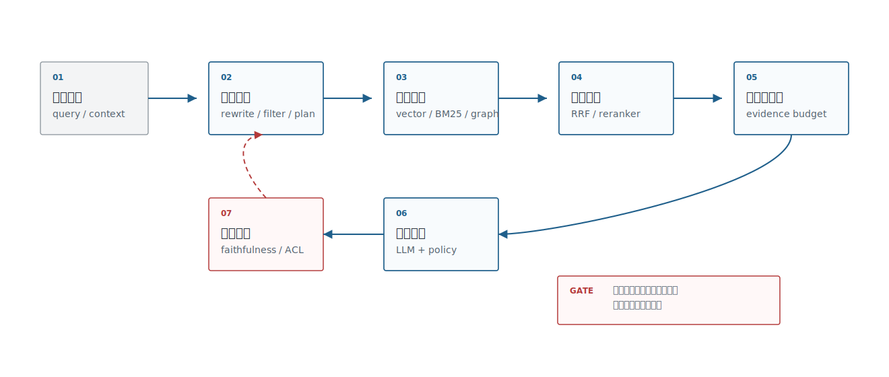
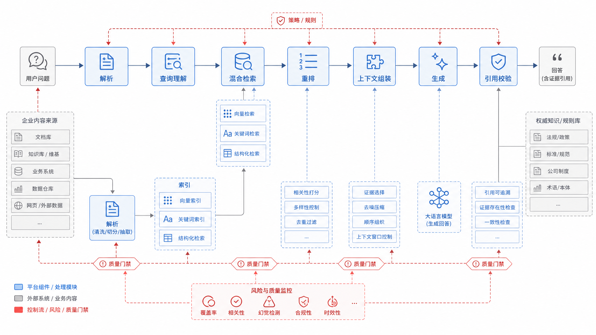
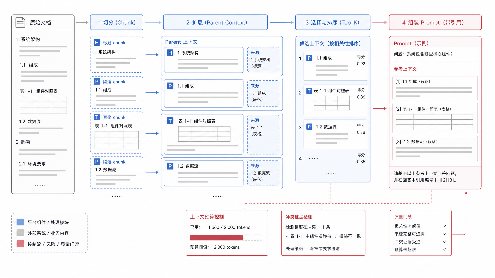

# 第20章 RAG 工程与高级检索

---

RAG 容易做出演示，却很难做到企业要求的“答案有据、引用可查、错了能定位”。生产链路要同时处理 chunk、召回、重排、多跳检索、引用校验和检索质量评估。这里把 RAG 视为一条证据工程链路：先决定证据如何被切分和组装，再决定如何召回、排序、追问和校验。

制度问答助手试运行时，用户问“供应商合同超过 200 万需要谁审批”。系统召回了采购制度里的相似段落，却漏掉了金额阈值在附件表里的说明，最后给出一个看似有引用、实际缺证据的答案。模型没有凭空编造，问题发生在检索链路：chunk 切分、表格解析、召回、重排和引用校验都没有把关键证据带回来。

企业 RAG 不能简化为“向量库 + prompt”。它需要把用户问题转成可检索意图，从多种索引里召回候选，做权限过滤、排序融合、上下文组装、引用校验，再把证据交给 LLM。任何一个环节出问题，最终都会表现成“模型胡说”。

RAG 的演示很容易成功，因为用户常问的几个问题可以被少量文档覆盖。生产环境困难得多：文档格式混杂，表格和附件承载关键条件，权限决定哪些段落可见，制度会更新，用户问题还会跨多个文件。模型最后给出的一句话，背后其实是一条证据链。证据链任何位置断掉，都会表现成“答案有引用但仍然错”。

企业 RAG 的核心工作不是把文档塞进向量库，而是管理证据。文档如何解析、chunk 如何切、标题和表格如何保留、召回如何融合关键词和向量、重排如何处理权限、上下文如何组装、引用如何校验，都需要工程决策。只要其中一个环节粗糙，模型就会在缺证据的地方补全。

一个制度问答事故往往能暴露完整问题。用户问审批阈值，系统召回了正文里“重大采购需审批”的段落，却漏掉附件表里的金额和角色；回答看起来有出处，实际缺少决定性证据。修复时如果只改 Prompt，让模型“更谨慎”，效果有限。真正要改的是解析、切分、召回、重排和引用校验。

## 20.1 RAG 工程体系

企业 RAG 至少包含六个层次：文档解析、索引构建、查询理解、候选召回、排序与过滤、答案生成与引用。Azure AI Search 的混合检索、LlamaIndex 和 LangChain 的 retriever 组件、Ragas 的评估指标都指向同一个工程结论：生产 RAG 要评估整条检索链路和证据可信度，不能把问题压到某个 prompt 上。

chunk、混合检索、多跳和可信回答，都可以放回图 20-1 的分层链路里定位：文档解析、索引、检索、重排、上下文组装、生成和引用校验分别承担不同责任。



*图20-1：企业 RAG 工程体系。来源：本书自绘。Alt text：分层图含离线侧（解析、分块、嵌入、入库）与在线侧（查询改写、混合检索、重排、引用校验、生成），两侧通过向量库衔接，展示 RAG 的完整工程组成。*

有了层次，还要像表20-1 一样把每层变成工程接口。生产 RAG 的排障通常就是沿着输入、输出和质量风险逐层定位。

*表20-1：RAG 链路职责分解。来源：本书整理。*

| 环节 | 输入 | 输出 | 质量风险 |
|---|---|---|---|
| 文档解析 | PDF、网页、PPT、图片 | chunk、表格、citation span | 文本顺序错、表格丢失 |
| 索引构建 | chunk、metadata、embedding | 向量索引、关键词索引 | 权限缺失、版本混用 |
| 查询理解 | 用户问题、会话上下文 | query rewrite、filter、子问题 | 改写过度、权限条件丢失 |
| 候选召回 | query、filter、top-k | 文档候选、字段候选 | 召回漏、相似但不可答 |
| 排序融合 | 多路候选 | reranked evidence | 正确证据排序靠后 |
| 生成与引用 | evidence、prompt、policy | 答案、引用、拒答 | 幻觉、引用不支持答案 |

有了链路职责，平台负责人要讨论的重点会从“用哪个 RAG 框架”转向表20-2 里的判断：哪些环节要做成共享能力，哪些风险必须作为上线门槛。

RAG 的故障也要按这条链路拆开看。用户看到“模型编了答案”，背后可能是解析阶段把表格拆坏，索引阶段漏写权限字段，检索阶段只召回了相似但无答案的 chunk，重排阶段把关键证据排到第十一位，上下文组装阶段又把表头丢掉。末端的 LLM 只是把前面链路的缺陷表现出来。生产排障如果只改 prompt，会把问题压回到模型层，下一批文档或下一类问题还会重复出错。

平台负责人做 RAG 决策时，应先判断它是不是共享能力。只要多个业务都依赖文档解析、索引、重排和引用校验，就应平台化；单个问答应用可以先轻量实现，不必一开始建完整 RAG 中台。检索路线也不能只上向量检索。企业知识库、DataAgent 和合规问答经常依赖编号、字段名、合同条款和错误码，关键词检索、向量检索和重排通常要配合使用。高风险场景不应允许无引用回答；普通知识助手即使允许无引用，也应明确标记低置信或无来源。

多跳检索也不是越早越好。只有问题天然跨实体、跨文档、跨指标时，才需要拆成多跳；简单 FAQ 被过度拆解，反而会扩大问题范围，引入无关证据。第一版最小上线门槛应放在更基础的链路上：权限过滤、引用覆盖、引用一致性检查、拒答策略和失败样例回放。缺少这些能力时，复杂检索策略只会让错误更难定位。

chunk 解决证据单元，混合检索解决召回，多跳检索解决复杂问题，可信回答解决证据是否支持结论。换成图 20-2 的企业流程语言，RAG 是一组可检查的证据处理步骤；业务负责人可以沿着这些步骤检查每个环节是否可观测、可审计、可回放。



*图20-2：企业 RAG 证据生产线。来源：本书自绘。Alt text：横向流水线从用户问题出发，经检索得到候选片段、重排筛选、附带来源标注，最终生成带引用的答案，箭头强调每个结论都挂上可追溯的证据片段。*

## 20.2 Chunk 策略与上下文组装

Chunk 是 RAG 的基本生产单元。切得太小，语义不完整；切得太大，召回不准、上下文浪费、引用不精确。企业 chunk 策略要从文档结构出发，而不是固定每 500 字切一段。标题层级、表格、FAQ、合同条款、代码块、字段说明都应该有不同策略。

chunk 策略要像表20-2 一样，在“召回精度、上下文完整性、引用精度”三者之间做取舍。团队不需要寻找永久策略，而要为不同文档类型建立默认策略和例外策略。

*表20-2：chunk 策略取舍表。来源：本书整理。*

| 方案 | 优势 | 代价 | 适用场景 | mini-platform 选择 |
|---|---|---|---|---|
| 固定长度 chunk | 实现简单，适合 baseline | 容易切断语义和表格 | 快速试点、纯文本文档 | 仅作 baseline |
| 结构化 chunk | 保留标题、段落、表格和页码 | 依赖文档解析质量 | 制度、合同、手册、报告 | 默认策略 |
| Parent-child chunk | 小 chunk 召回，大 parent 提供上下文 | 索引和组装复杂度增加 | 长文档、章节层级清晰文档 | 高价值知识库使用 |
| Small-to-big | 先召回小证据，再扩展邻近上下文 | 需要 source span 和邻接关系 | 需要精确引用又需要上下文的场景 | 作为高级策略 |

策略确定后，工程重点会转向上下文组装：即使召回的是小 chunk，生成答案时也可能需要 parent section、表头或相邻段落。没有 source span 和邻接关系，small-to-big 只会变成临时拼接。

上下文组装要有预算意识。LLM 上下文越多，未必越可靠；混入相似但不可回答的材料会增加幻觉风险。企业系统应把 evidence 分成“直接支持答案”“背景材料”“冲突材料”“不可用材料”，并在 prompt 中明确引用规则：只基于直接证据回答，证据不足时拒答或请求澄清。

chunk 边界要跟文档类型一起设计。合同条款可以按条、款、项切分，但付款条件常常需要把定义条款和附件表格一起带回；制度问答适合保留标题路径，因为同一句“十五个工作日内”在报销、采购和审批制度里含义不同；技术 runbook 则要避免把命令、前置条件和回滚步骤切开。好的 chunk 策略会让被召回的证据足够小、可引用，同时又能找回回答问题所需的上下文。均匀切分只是最容易实现的方案，通常不是最适合企业文档的方案。

图 20-3 画出的正是 chunk 与上下文组装的核心矛盾：召回单元要足够小，生成上下文又要足够完整。small chunk、parent context、citation span 和 token budget 必须一起设计，不能各自优化。



*图20-3：chunk 与上下文组装示意。来源：本书自绘。Alt text：文档被切成带重叠的片段，检索命中的片段连同相邻上下文、标题路径一起组装进 Prompt，示意分块粒度与上下文窗口的关系。*

## 20.3 混合检索与排序融合

Embedding 擅长语义相似，BM25 擅长关键词和专有名词。企业检索往往需要二者结合。Azure AI Search 的 hybrid search 使用 BM25 和向量检索并行召回，再用 Reciprocal Rank Fusion 融合结果；这类路线适合内部系统，因为字段名、编号、合同条款、产品型号和错误码都可能依赖关键词精确命中。

表20-3 中检索路线的风险边界也要提前说清。纯向量、纯关键词、RRF 和 reranker 都能工作，但它们失败的方式不同，评测集也要覆盖这些失败方式。

*表20-3：检索路线对比。来源：本书整理。*

| 路线 | 优势 | 风险 |
|---|---|---|
| 纯向量检索 | 语义召回强，适合口语化问题 | 专有名词、编号、字段名可能漏召回 |
| 纯关键词检索 | 精确词、编号、错误码表现好 | 同义表达和口语化问题召回弱 |
| 混合检索 + RRF | 兼顾语义和关键词，工程解释性较好 | 参数、去重、融合策略需要评估 |
| 混合检索 + reranker | 前排证据质量更好 | 延迟和成本增加 |

在企业知识库里，混合检索更接近默认能力。编号、字段名、条款号、错误码需要关键词；口语化问题、同义表达、业务别名需要向量。

混合检索的收益来自互补，也来自可解释。只用向量时，“销售额口径”可能召回很多语义相近的指标说明，却漏掉字段名 `net_sales_amount`；只用关键词时，用户问“客户实际花了多少钱”又可能找不到“实收金额”。企业场景里的问题经常同时含有自然语言、实体名、编号、时间和字段名，单一路线很难稳定覆盖。把 BM25、向量召回和 reranker 的候选列表都记录下来，还能帮助团队判断是召回漏了、融合错了，还是重排把正确证据压低了。

RRF 的优势是简单稳定：不同检索器分数不可比，但排名可以融合。生产系统还要做去重、权限过滤、source diversity 和 query intent 分流。比如 DataAgent 的字段检索应该偏向 schema 文档和历史 SQL，合规问答应该偏向制度和合同，客服问答应该偏向历史工单和 runbook。

DataAgent 的 RAG 还要服务 NL2SQL 和分析动作。检索结果里如果包含字段解释、指标口径、样例 SQL、数据质量规则和权限约束，生成 SQL 前就能减少误表、误字段和误口径。这里的可信回答需要说明 SQL 为什么这样写、引用了哪些口径、哪些字段有权限执行。

这也意味着 RAG 不能只服务最终自然语言回答。很多企业把 RAG 放在回答生成前一步，导致前面的 Planner、SQL 生成器和工具选择仍然缺上下文。更合理的做法，是让检索结果在任务早期就进入决策链路：先帮助系统识别业务实体、指标口径和可用工具，再辅助生成 SQL 或 API 参数，最后才用于答案引用。这样 RAG 才能从“给模型补资料”变成“给任务链路补证据”。

## 20.4 查询理解与多跳检索

用户问题经常包含多个检索意图。它可能包含时间范围、权限条件、业务实体、比较关系、隐含指标和多跳依赖。查询理解要把自然语言转成检索计划，而不是改写成一个更长的问题。

查询理解最好像表20-4 一样拆成几种可独立实现的能力。这样做的好处是可以逐项评估：改写有没有引入偏差，filter 有没有丢权限条件，多跳拆解有没有扩大问题范围。

*表20-4：查询理解能力。来源：本书整理。*

| 能力 | 示例 | 输出 |
|---|---|---|
| Query rewrite | “报销多久到账”改写为“费用报销付款周期” | 改写 query |
| Metadata filter | “华东区今年” | `region=华东`、`year=2026` |
| HyDE | 先生成假想答案再检索 | synthetic document query |
| 多跳拆解 | “合同续约和付款风险一起看” | 子问题 + 合并策略 |
| Schema linking | “高客单门店” | 指标、维度、字段候选 |

这些能力不应全部默认打开。简单 FAQ 可能只需要 query rewrite；DataAgent 通常需要 schema linking；跨合同、客户、风险事件的问题才需要多跳拆解。

多跳检索要有停止条件。系统不能无限拆问题，也不能把所有中间结果塞进上下文。更稳的做法是先生成检索计划，执行每一步后检查证据是否足够；如果缺少关键实体、时间或权限条件，先澄清；如果证据冲突，输出冲突来源，不要强行总结。

查询理解还要保留原始问题和改写结果之间的关系。过度改写会把用户限定条件抹掉，例如把“华东区今年新签客户的续约风险”改成泛化的“客户续约风险”，后续检索再准确也回答错了对象。生产系统应把 filter 抽取、子问题拆解、schema linking 和澄清问题都记录下来，并允许评测人员回放每一步。这样才能判断多跳检索是在补证据，还是在扩大问题范围。

查询理解失败时，系统应优先澄清，而不是假装理解。时间范围、地区、指标口径、客户类型和权限边界如果没有解析出来，继续检索会得到看似相关但不可用的证据。澄清问题也要写入 trace，因为它说明系统在哪一步选择了保守处理。对业务用户来说，一次明确的澄清通常比一个自信但错口径的答案更可接受。

多跳检索必须用图 20-4 的状态机思路限制复杂度。每一跳都应有输入、证据检查和停止条件；证据不足时要澄清或拒答，而不是继续扩展上下文。


*图20-4：多跳检索状态机。来源：本书自绘。Alt text：状态机含"提出子问题、检索、判断是否够答、继续追问或收敛生成"等节点，循环边表示在证据不足时多轮检索，直到满足回答条件。*

## 20.5 可信回答与证据溯源

企业 RAG 的目标是让答案能被证据支持。流畅的文字不够，可信回答至少要满足三件事：引用可定位，答案和引用一致，权限和时间有效。Ragas 这类评估框架把 context precision、context recall、faithfulness 等指标拆开，是因为“检索到了好材料”和“模型忠实使用材料”属于两个不同问题。

可信回答要落成表20-5 的门禁项，并承接前面的 chunk、检索和查询理解：前面每一步都可能生成证据，输出前必须检查证据是否能支撑答案。

*表20-5：可信回答门禁。来源：本书整理。*

| 门禁 | 检查方式 | 失败处理 |
|---|---|---|
| 引用覆盖 | 每个关键结论是否有 citation | 缺引用则拒答或降级 |
| 引用一致 | 答案是否被引用文本支持 | 标记 hallucination risk |
| 权限有效 | 引用 source 是否对用户可见 | 移除证据并重新生成 |
| 时间有效 | 制度、合同、价格是否仍生效 | 提示版本或请求人工确认 |
| 冲突证据 | 是否存在互相矛盾的材料 | 展示冲突并避免单边结论 |

RAG 评估因此要同时看答案分数、引用覆盖、引用一致、权限有效和冲突证据，这些指标都需要结构化日志与可回放链路支持。

引用校验要检查的是“这句话是否由这段证据支持”，而不是“答案旁边有没有链接”。常见错误包括引用了一段相关背景，却用它支持没有出现过的结论；引用的是旧版本制度，却回答了当前规则；引用片段包含条件限制，答案却省略了条件。更严格的实现会把答案拆成 claim，逐条匹配引用证据和生效时间。评估人员看到失败样例时，也要能回放 query、候选、重排分数、上下文和生成结果，避免把所有问题都归为幻觉。

可信回答还需要产品层面的降级策略。证据不足时，系统可以拒答、要求补充条件、返回可读原文、转人工复核，或者只给出“可能相关材料”；但不能在低置信状态下继续生成确定性结论。很多企业 RAG 的问题不在于没有召回，而在于没有把“不够答”作为一种正常结果设计出来。只要拒答和澄清路径清楚，用户会更容易理解系统边界，运营团队也能从这些失败样例里持续补齐文档、chunk 和评测集。

mini-platform 的 `core/rag/` 可以先实现一个最小接口：`retrieve(query, filters)`、`rerank(query, candidates)`、`assemble_context(candidates, budget)`、`generate_answer(context)`、`verify_citations(answer, context)`。这比一开始接十个 RAG 框架更重要，因为它把平台边界固定下来。

```json
{
  "answer": "出差返回后应在十五个工作日内提交报销申请。",
  "citations": [
    {
      "chunk_id": "travel-policy#p12#c03",
      "page": 12,
      "span": "返回后十五个工作日内提交申请",
      "source_version": "v3"
    }
  ],
  "confidence": "high",
  "fallback": null
}
```

引用校验最终要像图 20-5 一样进入产品界面，不能停留在后台日志里的一个分数。运营、审计或人工复核界面里应该能看到答案、证据、权限和一致性状态。


*图20-5：可信回答引用校验界面。来源：产品界面截图。Alt text：界面中每条结论旁标注来源片段链接，鼠标悬停可高亮原文出处，未找到支撑的句子被标红提示，体现答案逐句可校验。*

## 20.6 RAG 证据链的运行标准

RAG 的可信度取决于证据链，而不是只取决于最终回答。一次回答至少要保留用户问题、查询改写、检索条件、召回文档、rerank 结果、上下文裁剪、模型回答和引用片段。若答案被用户质疑，平台要能解释为什么这些片段进入上下文，为什么其他片段没有进入，以及模型回答中哪些句子来自哪些证据。只有最终答案和引用链接是不够的。

证据链还要区分“可引用”和“被引用”。有些片段被检索到，但模型没有使用；有些片段进入上下文，但只提供背景；有些片段直接支持结论。平台如果把所有上下文都标成引用，会让用户误以为答案有充分依据。更好的做法是让回答中的关键结论绑定 EvidenceRef，并标出证据强度。证据不足时，回答应当明确说明缺口，而不是用流畅语言补齐。

RAG 证据链需要和第18章的向量检索、第19章的文档解析、第38章的 Trace 对齐。检索层负责说明证据从哪里来，解析层负责说明证据在原文中的位置，Trace 负责说明证据如何进入模型上下文。三者缺一项，用户看到的引用就只是展示效果，不是工程证据。

## 20.7 检索失败的诊断路径

RAG 失败不能简单归类为“没搜到”。常见失败至少包括知识未入库、文档解析丢失、chunk 切分破坏语义、query rewrite 偏离原意、向量召回漏掉、关键词召回过窄、rerank 排序错误、权限过滤过严、上下文窗口截断和生成层忽略证据。每一种失败对应不同修复方式，不能都通过增加 top_k 解决。

诊断时应先复现检索输入。用户原始问题经过改写后可能已经改变重点，尤其是多轮对话中省略主语、时间和指标时。接着查看过滤条件和权限裁剪，确认候选空间没有被错误缩小。然后比较召回候选和 rerank 结果，判断问题发生在召回还是排序。最后检查上下文组装，确认关键证据没有被截断或被低价值片段挤出窗口。

检索失败样本应当进入评测集，并保留失败阶段标签。这样下一次调整 embedding、chunk、rerank 或 query rewrite 时，团队可以看到哪类失败被修复，哪类失败被引入。RAG 工程的成熟度不在于堆叠多少检索技巧，而在于能否把失败拆成可定位、可修复、可回归的工程问题。

## 20.8 RAG 与工具调用的边界

RAG 适合回答基于文档和知识的事实问题，但不适合承担实时状态查询、写操作和权限强相关动作。用户问“这份政策怎么解释”可以走 RAG；用户问“我的订单现在到哪一步”应当调用业务系统；用户要求“把这份合同发给客户”必须进入工具和审批链路。把这些任务都放进知识库，会让系统用静态文本回答动态问题，也会绕开业务系统的权限和审计。

边界判断可以看三个信号。问题需要实时数据时，优先工具调用；问题需要改变外部状态时，必须工具调用；问题需要引用稳定文档时，优先 RAG。混合场景也很常见，例如先用 RAG 解释政策，再用工具查询当前订单是否符合政策条件。此时平台要把两类证据分开：文档证据说明规则，工具证据说明事实。最终回答需要同时引用两者，不能把工具结果伪装成文档结论。

这种边界会影响平台设计。RAG 检索结果应进入 EvidenceRef，工具调用结果应进入 Tool Call Trace，二者在报告层再汇合。若边界不清，后续第36章的报告和第38章的诊断都无法判断一个结论来自知识、数据还是外部系统。

## 20.9 RAG 上线后的运营指标

RAG 上线后，团队应持续观察证据覆盖率、无答案率、引用点击、用户追问、人工纠正和知识更新延迟。回答满意度有用，但它不能解释问题发生在哪里。证据覆盖率下降，可能是新知识未入库；无答案率上升，可能是 query rewrite 过窄；用户频繁追问出处，可能是引用表达不清。运营指标要能指向具体链路。

知识更新延迟尤其重要。政策、产品说明、合同模板和内部流程变化后，RAG 系统如果仍引用旧版本，会比直接拒答更危险。平台应记录知识从提交、解析、入库、索引到可检索的时间，并对高风险知识设置更新 SLA。这样业务团队才能知道知识库是否适合承担正式问答入口。

运营指标还要能触发动作。证据覆盖率下降时补索引或改召回，知识更新延迟升高时检查解析和发布队列，用户频繁追问出处时改引用展示和证据绑定。指标如果不能对应处理动作，就只能作为汇报材料。

RAG 团队也要定期清理知识源。过期政策、重复文档和低质量扫描件会持续污染召回结果。知识库越大，越需要明确入库、更新和退役责任。

知识源清理要留下记录。某份文档为什么下线、由谁确认、影响哪些回答样本，都应能在后续复盘中查到。

RAG 的评测也要覆盖链路，而不仅看最终答案。召回阶段有没有拿到黄金段落，重排是否把关键证据放到前面，权限过滤是否误删或漏放，生成阶段是否只引用已给证据，这些都需要单独记录。否则团队只知道答案错了，却不知道该修索引、修解析还是修模型。

上线后还要观察用户追问。大量追问“依据在哪里”“这个政策是不是最新版”“能不能给出处”，说明证据呈现不足；大量无结果问题，可能是知识覆盖不足，也可能是查询理解失败。RAG 运营要把这些信号回写到文档治理和评测集中。

RAG 与工具调用也要分清。检索适合提供证据和上下文，工具适合执行受控动作或查询实时系统。把实时库存、审批状态和权限判断都塞进文档，会让知识库承担它不该承担的责任。RAG 越工程化，边界越需要清楚。

RAG 上线后还要处理文档生命周期。制度废止、附件更新、版本冲突、临时通知过期，都会让检索结果出现旧证据。平台需要记录文档版本、发布时间、适用范围和失效状态，并在召回时优先选择当前有效材料。若旧文档仍然能被检索，模型很可能把历史规则解释成当前规则。

权限过滤也不能放在生成之后。用户没有权限看到的段落，不应进入上下文；否则即使最终回答没有直接泄露，模型也可能用敏感信息影响推理。RAG 的权限应在召回、重排和引用阶段都生效，并在 Trace 中记录过滤原因。这样安全团队才能判断系统是没检到，还是检到了但被正确拦截。

表格和图片资料需要单独验收。很多企业制度的关键条件藏在附件表、扫描件、流程图和注释里。纯文本 chunk 会丢掉单元格关系和版面语义，最后表现成“召回了文件但漏掉条件”。解析质量要进入 RAG 评测，而不是默认文档入库就可用。

RAG 的回答策略也要分级。证据充足时可以直接回答；证据不完整时应说明缺口；证据冲突时应要求用户选择版本或转人工；完全没有证据时应拒答并给出检索范围。把这些状态统一写成“根据资料可知”，会掩盖检索链路的真实质量。

当 RAG 被多个 Agent 共用后，平台还要建立知识资产负责人。谁负责文档更新，谁处理用户反馈，谁确认版本冲突，谁决定某类材料下线，这些都不属于模型团队单独职责。没有运营责任，知识库会随着时间变旧，RAG 的可信度也会自然下降。

RAG 的上下文组装要控制证据密度。把太多段落塞给模型，关键证据会被稀释；只给最相似的一两段，又容易漏掉限定条件。平台可以根据问题类型选择组装策略：事实问答需要少量高置信证据，制度判断需要正文和附件同时出现，归因分析可能需要多来源证据并列。上下文不是越长越好，而是要让模型看到足以回答的问题材料。

引用校验应在生成后再做一次。模型给出的引用位置是否存在，引用内容是否支持结论，答案中是否出现未被证据支持的扩展，都可以自动检查一部分。检查失败时，系统可以要求模型重写、降级为“未找到充分证据”，或交给人工复核。这个步骤会增加一点延迟，但能显著减少带引用的错误答案。

用户反馈是 RAG 运营的重要来源。用户点击“引用不对”“文档过期”“没有回答我的问题”，比单纯点赞点踩更有价值。反馈应回到文档解析、chunk、召回、重排和生成评测中，而不是只作为满意度指标。长期看，反馈能告诉团队知识库缺什么、哪些文档容易误导模型、哪些问题需要工具而不是检索。

RAG 还要处理多语言和术语差异。企业文档可能同时包含中文制度、英文供应商材料、缩写、别名和历史名称。查询理解阶段要把用户语言映射到文档术语，同时保留原问题。若只靠向量相似度，常见缩写和组织内部黑话会降低召回质量。

当 RAG 承接高风险场景时，平台应允许“证据不足”成为正常输出。用户可能不喜欢无答案，但业务更不能接受没有证据的确定结论。把拒答、澄清和证据缺口设计成产品状态，是企业 RAG 区别于演示系统的重要标志。

## 本章小结

RAG 工程可以按证据工程建设。Chunk、混合检索、RRF、reranker、多跳检索和引用校验都服务于同一个目标：让答案建立在可检索、可追踪、可复核的证据上。企业平台应把 RAG 做成链路，而不是把问题直接塞给模型。

这条链路从解析、索引、检索、排序、组装、生成一路走到校验。Chunk 策略要跟文档结构和引用需求绑定，混合检索要同时照顾专有名词、编号、字段名和语义表达，可信回答还要检查引用覆盖、引用一致、权限、时间和冲突证据。

RAG 的工程难点通常不在于能否检索到内容，而在候选证据是否足以支撑最终回答。企业场景里，同一个问题可能同时涉及制度版本、合同条款、业务术语和权限边界。系统必须说明用了哪些片段、为什么这些片段有权使用、答案中的哪些句子由它们支撑，以及哪些问题应拒答或澄清。

第一版 RAG 不宜追求复杂链式推理，应先把解析、索引、检索、重排、引用和回放链路打通。每次回答都能追到 chunk、文档版本和权限策略后，再叠加 query rewrite、多跳检索或 GraphRAG。


## 参考文献

- Azure AI Search Hybrid Search: https://learn.microsoft.com/en-us/azure/search/hybrid-search-overview
- Azure AI Search Reciprocal Rank Fusion: https://learn.microsoft.com/en-us/azure/search/hybrid-search-ranking
- LangChain Parent Document Retriever: https://python.langchain.com/docs/how_to/parent_document_retriever/
- LlamaIndex Query Transformations: https://docs.llamaindex.ai/
- Ragas Metrics: https://docs.ragas.io/
