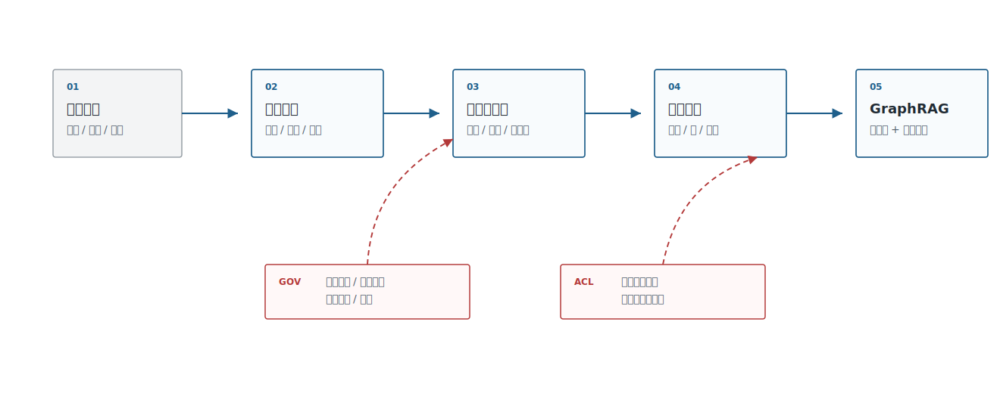
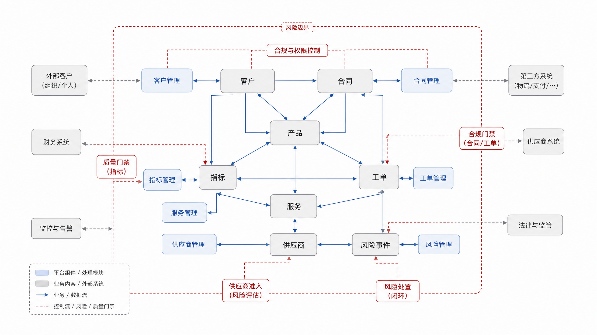
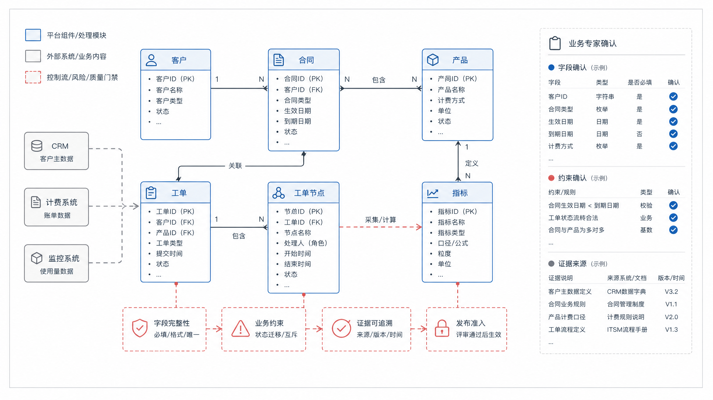
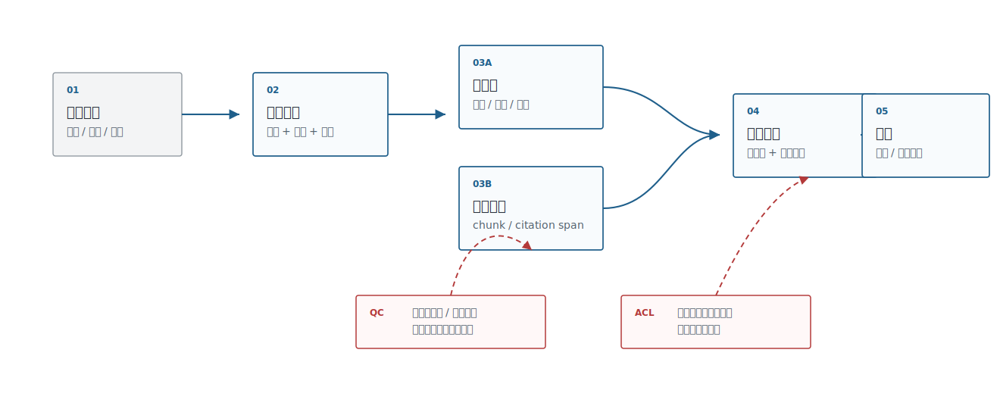
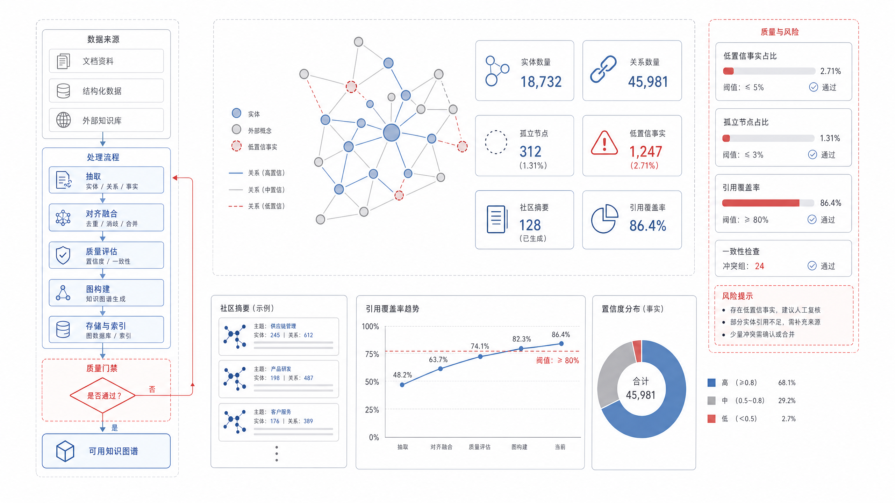

# 第21章 知识工程：本体、抽取与知识图谱

---

RAG 擅长从文档里找证据，但企业里很多问题不只是找一段相似文本。采购负责人问“这个供应商最近的质量问题会影响哪些合同”，答案要经过供应商、批次、缺陷、合同、产品线和交付计划；法务负责人问“这份合同的自动续费条款关联哪些责任”，答案要经过条款、附件、审批意见和历史模板；DataAgent 用户问“这个指标异常会影响哪些下游报表”，答案要经过指标、字段、表、血缘和报表使用方。单纯把这些材料切成 chunk，再交给向量检索，通常只能找到局部证据，无法稳定组织关系链。

问题出在企业知识的形态上。文档里有条款，系统里有客户主键，数据目录里有字段，工单里有事件，业务人员脑子里还有别名和规则。它们互相指向，却不天然形成一张可查询的关系网。向量检索可以找到“看起来相关”的片段，但它不知道两个客户是否同属一个集团，也不知道某个字段是否已经被新口径替换，更不知道一条风险事件是否影响某条合同义务。知识工程要做的事，是把这些实体、概念、关系、约束和证据显式表达出来。

这件事听起来像“建知识图谱”，但生产难点不在图数据库本身。难点在本体怎么定、事实从哪里来、同名实体如何消歧、抽取结果谁复核、权限如何从原文传到节点和边、历史版本如何保留。图谱一旦错连，GraphRAG 会沿着错误关系生成结构完整的错误解释，比普通 RAG 的一段错误引用更有迷惑性。平台团队因此要把知识工程当成数据资产治理，而不是一个回答增强插件。

对 DataAgent 来说，知识工程还承担另一层任务：把指标、字段、报表、业务对象和文本证据连起来。语义层可以解释“这个指标怎么算”，知识图谱可以解释“这个指标影响哪些对象、被哪些流程使用、和哪些风险事件相关”。两者结合后，系统才有机会同时回答口径问题和关系问题。比如“华东区毛利异常是否和某批供应商延迟有关”，需要先定位指标和 SQL，再沿供应商、订单、交付和异常事件关系展开证据。

本章讨论知识工程、本体建模、信息抽取、实体链接、知识图谱和 GraphRAG。读者需要判断一个问题何时只需要文档 RAG，何时需要图谱关系推理；也需要理解本体、抽取、链接、图存储和治理如何连成一条工程链路。最终目标不是做一张漂亮的节点图，而是让企业知识可以被 Agent 查询、引用、审计和回滚。

---

## 21.1 企业知识工程定位

知识工程不是给 RAG 加一个“知识图谱插件”。它是一套把业务语义显式化的工程方法：本体定义对象和关系，抽取流程从文档和系统中生成事实，实体链接把别名和重复对象对齐，图数据库提供关系查询，GraphRAG 把图结构和文本证据一起交给 LLM。

讨论知识工程时，先要像表 21-1 一样把 RAG、语义层、知识图谱和 GraphRAG 分开，避免把所有“知识增强”都混成一个方案。不同能力处理的对象不同，擅长的问题也不同。

这个区分能减少很多无效建设。制度问答出错，原因可能是解析质量和引用不足，直接上图谱只会增加维护负担；指标口径混乱，优先要修语义层和数据目录，图谱只能补关系和影响分析；跨合同、客户、供应商和风险事件的追问，才真正需要图结构。平台负责人要先判断问题对象，再决定技术投入。

*表21-1：RAG、语义层与知识图谱的边界。来源：本书整理。*

| 能力 | 主要对象 | 擅长问题 | 不擅长问题 |
|---|---|---|---|
| 文档 RAG | chunk、文档、引用 | “制度怎么说”“合同条款在哪里” | 复杂关系、全局聚合、实体消歧 |
| DataAgent 语义层 | 指标、维度、表字段、SQL | “这个指标怎么计算”“查哪些表” | 非结构化关系和开放文本证据 |
| 知识图谱 | 实体、关系、事件、规则 | “哪些对象相互影响”“关系链是什么” | 无证据文本的开放生成 |
| GraphRAG | 图结构 + 文本证据 | “跨文档、跨实体的综合回答” | 本体和抽取质量差时会放大错误 |

能力边界决定平台投入顺序：普通制度问答不一定需要图谱；DataAgent 的指标口径通常先进入语义层；只有当问题开始依赖实体关系、影响链路和跨文档综合时，知识图谱才成为核心资产。表 21-2 进一步落到平台负责人关心的投入、维护和安全边界上。

也要警惕把所有知识问题都推向图谱。图谱适合稳定实体、明确关系和需要追踪影响链路的问题；如果业务对象还没有统一主键、文档来源频繁变化、关系定义每个团队都不同，过早建设图谱只会制造新的维护负担。许多制度问答先把解析、chunk、引用和权限做好就够了；许多指标问题先进入语义层和数据目录更合适。知识工程的判断标准应放在关系建模能否降低错误、提高复核效率，并被业务 owner 长期维护上，而不是技术名词本身是否先进。

*表21-2：平台负责人知识工程决策要点。来源：本书整理。*

| 决策问题 | 推荐判断 |
|---|---|
| 是否现在做知识图谱 | 当问题涉及实体关系、影响分析、跨文档综合和长期治理时值得做；普通制度问答先用 RAG。 |
| 是否上 GraphRAG | 图谱、本体、抽取质量和证据链稳定后再上；图错时 GraphRAG 会更有说服力地错。 |
| 谁来维护本体 | 必须有业务 owner 和平台 owner，不能交给算法或单个应用团队独自维护。 |
| 安全边界在哪里 | 节点、边、证据和社区摘要都要有权限，文档 ACL 不能覆盖全部风险。 |
| 最小上线门槛 | 每条事实有来源、证据、置信度、抽取器版本、复核状态和生命周期。 |

图 21-1 拆成本体、抽取、实体链接、图存储、GraphRAG 和治理几层后也能看到：GraphRAG 只是消费知识资产的一种方式，前面几层质量不稳，后面的回答会更有结构地出错。



*图21-1：企业知识工程技术栈。来源：本书自绘。Alt text：自下而上分层，数据源、信息抽取、本体/实体链接、知识图谱存储、GraphRAG 检索、上层应用，箭头表示文本逐层加工为可推理的知识资产。*

换成图 21-2 的资产地图视角，企业知识会从文档扩展到客户、合同、指标、字段、服务、风险事件，以及它们之间的关系。知识工程启动会要先讨论这张范围图。



*图21-2：集团型企业知识资产地图。来源：本书自绘。Alt text：地图按业务域（销售、供应链、财务、人事等）划分，标出各域的核心实体与跨域关系，展示集团知识资产的整体分布与连接点。*

## 21.2 本体建模与业务语义层

本体是知识工程的骨架。它定义企业关心哪些实体、关系、属性和约束。没有本体，LLM 抽取会变成“每批文档抽出一套不同字段”；没有业务语义层，知识图谱会变成孤立节点集合，无法服务 DataAgent、RAG 和流程自动化。

本体的第一版不追求一次性覆盖所有业务，但要保证表 21-3 中每个实体、关系、属性、约束和证据都有可维护的字段。

本体建模要从一个真实问题开始。比如合同风险场景，先问“复核人员需要沿着哪些对象查下去”：合同、客户、产品、条款、审批意见、风险类型和生效时间。再问这些对象之间有哪些稳定关系：客户签署合同，合同包含条款，条款约束产品，审批意见确认例外，风险类型关联处理流程。只有这些对象和关系能被业务人员解释、被系统记录、被审计复核，才适合进入第一版本体。

如果一开始就追求“大而全”的企业知识图谱，模型抽取会很快失控。每个团队都能提出自己的实体和关系，字段名看起来都合理，合到一起却没有统一主键、生命周期和权限标签。更稳的路线是先选择一个高价值场景，把实体、关系、证据和版本做完整，再逐步扩展。表 21-3 的最小对象，就是为了把这个起点压到可维护范围内。

*表21-3：企业本体最小对象。来源：本书整理。*

| 对象 | 示例 | 关键字段 |
|---|---|---|
| Entity Type | 客户、合同、产品、指标、服务、工单、风险事件 | 名称、别名、业务主键、来源系统 |
| Relation Type | 签署、归属、依赖、影响、违反、相似 | 方向、基数、置信度、证据来源 |
| Attribute | 合同金额、客户等级、服务负责人 | 数据类型、单位、有效期 |
| Constraint | 一个合同必须归属一个客户 | 校验规则、异常处理 |
| Evidence | 文档片段、SQL、系统记录、人工标注 | source、page、span、timestamp |

这些对象共同回答一个问题：图谱里的事实为什么可信。如果只有实体和关系，没有证据、约束和来源，GraphRAG 只是把不可验证的文本换成不可验证的图。

本体建模要从业务问题反推，而不是从图数据库语法出发。法务关心合同条款、风险类型和审批意见；运维关心服务、依赖、事故和变更；DataAgent 关心指标、字段、表和口径。每个本体对象都要能回答：谁维护，来自哪里，用在哪些问题，错误会造成什么影响。

DataAgent 需要的知识图谱不一定一开始很大，但要把关键业务对象连起来：指标依赖哪些字段，字段属于哪些表，表来自哪些数据域，指标被哪些报表和业务流程使用，口径变更会影响哪些历史 SQL。这样 DataAgent 在生成查询前可以做影响分析和口径解释，而不是只靠 prompt 记住业务语义。

本体的变更流程要和代码、数据模型一样严肃。新增一个实体类型，可能意味着抽取器、图数据库 schema、权限规则、评估样本和下游工具都要更新；修改一条关系的方向，可能让已有路径查询含义变化；合并两个概念，可能影响历史事实和引用。比较稳妥的做法是为本体设置版本、评审、迁移和弃用机制，业务 owner 负责语义正确性，平台 owner 负责接口和治理，数据 owner 负责来源系统和主键一致性。没有这个流程，本体很快会变成另一份没人敢改的共享配置。

表 21-4 中的本体建模路线也要承接前面的业务问题反推原则：冷启动可以文档驱动，但长期治理要回到业务对象和关系边界。

*表21-4：本体建模取舍表。来源：本书整理。*

| 方案 | 优势 | 代价 | 适用场景 | mini-platform 选择 |
|---|---|---|---|---|
| 文档驱动抽取 | 启动快，能覆盖历史文档 | 本体容易漂移，事实一致性弱 | 早期探索、知识库增强 | 作为冷启动输入 |
| 业务对象驱动本体 | 结构稳定，便于治理和权限 | 初期需要业务专家参与 | 合同、客户、指标、服务等核心资产 | 默认路线 |
| 关系优先建模 | 适合依赖分析和影响分析 | 容易忽略属性和证据 | 运维、供应链、风险传播 | 作为场景扩展 |
| OWL/RDF 标准建模 | 语义表达严谨，标准生态完整 | 学习和工程成本更高 | 合规、跨组织数据交换 | 先调研，不作为默认实现 |

对 mini-platform 来说，结论很明确：不应该从完整 OWL/RDF 体系起步，而应该先把业务对象、关系、证据和版本治理做扎实，再按合规或跨组织交换需求引入标准语义技术。

图 21-3 中的本体建模协作方式也要和这个原则一致。schema 不应由算法团队闭门设计，而应由业务 owner、数据 owner、平台团队共同确认对象、关系、约束和证据。



*图21-3：企业本体建模工作坊白板。来源：本书自绘。Alt text：白板上用便签和连线标注核心实体（客户、合同、产品）及其关系（签订、包含、关联），体现业务与技术共同梳理本体的协作过程。*

## 21.3 信息抽取与实体链接

信息抽取把文本、表格和系统记录转成实体与关系。传统 NER/RE、规则、LLM 抽取、VLM 页面理解都可以参与，但企业系统更关心抽取结果的可验证性。每条事实最好带证据、置信度、来源、抽取器版本和复核状态。

对比表 21-5 中的抽取路线时，重点仍然是可验证性。规则、传统模型、LLM、VLM 和人工审核可以按事实风险和文档形态组合使用，不必互斥。

抽取路线的选择要看事实风险。供应商名称、合同编号、产品型号这类结构相对稳定的字段，可以先用规则和词典建立高精度基线；复杂条款、风险描述和跨段落关系，适合让 LLM 生成候选，再由规则和人工复核收口；票据、扫描合同和报表截图，则需要 VLM 或版面解析补充页面结构。把所有事实都交给同一种模型，通常会在低风险场景浪费成本，在高风险场景留下不可解释错误。

抽取系统还要接受“暂不入图”的状态。置信度低、证据不完整、权限无法继承、实体链接冲突的事实，可以进入待复核队列，而不是直接写入生产图谱。这样做会牺牲一部分自动化速度，却能避免错误关系扩散到 GraphRAG、DataAgent 和报告生成链路里。

*表21-5：信息抽取路线。来源：本书整理。*

| 路线 | 优势 | 风险 |
|---|---|---|
| 规则和词典 | 可解释、稳定、成本低 | 覆盖率低，维护成本上升 |
| 传统 NER/RE | 适合固定实体类型和批量文本 | 需要标注数据，跨领域迁移有限 |
| LLM 抽取 | 启动快，能处理复杂语义 | 幻觉、格式漂移、成本和一致性问题 |
| VLM 抽取 | 适合票据、截图、页面布局 | 低置信和视觉误判需要复核 |
| 人工审核 | 高风险事实质量高 | 成本高，吞吐有限 |

事实 JSON 必须保留 `evidence`、`confidence`、`extractor` 和 `review_status`。没有这些字段，抽取路线再先进也无法进入企业治理。

实体链接是知识图谱能否工作的关键。`阿里云`、`Alibaba Cloud`、`aliyun` 可能是同一供应商；`KA 客户` 和 `战略客户` 在某些业务线同义，在另一些业务线不是。实体链接要结合名称、别名、业务主键、来源系统、上下文和人工确认，embedding 相似度只能提供候选。

实体链接的错误比抽取漏召回更危险。漏掉一条关系，系统最多少回答一部分；把两个不同客户、供应商或指标错误合并，图谱会把无关事实连在一起，GraphRAG 还会沿着这条错误路径生成看似完整的解释。相反，如果同一个实体被拆成多个节点，影响分析和风险聚合又会漏掉关键链路。因此实体链接需要保留候选、分数、判定依据和人工复核状态，高风险实体还应采用“先候选、后确认”的写入策略。

```json
{
  "subject": {"type": "Contract", "id": "contract-2026-001"},
  "predicate": "belongs_to",
  "object": {"type": "Customer", "id": "customer-8842"},
  "evidence": {
    "source_id": "contract-2026-001",
    "page": 1,
    "span": "甲方：华东分公司"
  },
  "confidence": 0.91,
  "extractor": "llm-extractor-v2",
  "review_status": "approved"
}
```

图 21-4 中实体链接的关键路径也是如此：名称相似只是候选来源，最终还要结合业务主键、来源系统、上下文证据和人工确认，避免把同名客户、同名产品或相似指标误合并。


*图21-4：实体链接与消歧流程。来源：本书自绘。Alt text：流程从文本中识别实体提及，到候选实体生成、上下文消歧、链接到知识库唯一 ID，箭头标出同名实体如何被消歧到正确节点。*

## 21.4 图数据库与 GraphRAG 架构

图数据库提供关系存储和查询能力，Neo4j、NebulaGraph 等都可以承载企业知识图谱。GraphRAG 要让图结构参与检索、聚合、路径解释和社区摘要，而不是简单把图谱塞进 prompt。Microsoft GraphRAG 的思路把文档抽取成图、做社区发现和摘要，再支持 global/local search；Neo4j 的 GraphRAG 生态强调图查询与向量检索结合。这些路线都指向同一个结论：图和向量是互补关系。

GraphRAG 检索要像表 21-6 一样拆成几种模式，团队才能按问题类型选路径。global search 和图查询都不是默认答案，是否使用取决于问题粒度、实体定位和证据要求。

*表21-6：GraphRAG 检索模式。来源：本书整理。*

| 模式 | 做法 | 适合问题 |
|---|---|---|
| Local search | 从实体出发找邻居、路径和证据 | 某客户、某合同、某服务的局部关系 |
| Global search | 基于社区摘要或全局主题回答 | 跨部门、跨文档、整体趋势问题 |
| Vector + Graph | 向量先找候选实体/文档，再沿图扩展 | 用户问题表达模糊但目标实体可定位 |
| Graph + Text evidence | 图路径给结构，文档 chunk 给证据 | 高风险回答、需要引用的综合问题 |

生产系统通常会组合这些模式：向量先定位候选实体，图谱扩展关系，文本证据提供引用。高风险回答尤其要保留末端文本证据，图路径只能说明结构，不能单独作为结论。

GraphRAG 的风险在于“图错了会更有说服力”。一条错误关系如果进入图谱，LLM 可能沿着它生成结构化但错误的解释。因此 GraphRAG 返回结果必须包含事实、证据和置信度，节点路径本身不应被当成结论。

还有一种风险是结构化幻觉。系统可能检索到一条真实路径，却把路径上的关系解释成更强的因果关系；也可能把社区摘要中的概括性描述当成单个实体的事实。GraphRAG 的回答应区分“图中存在关系”“证据文本支持结论”“模型基于关系做出的推断”三类内容。对高风险问题，图路径只能作为组织线索，最终结论仍要回到文本证据、事实置信度和生效时间。

图 21-5 中的 GraphRAG 链路分为向量召回、图扩展、文本证据和答案生成几步。图路径提供结构，文本 chunk 提供证据，两者都要带权限和版本信息。



*图21-5：GraphRAG 检索架构。来源：本书自绘。Alt text：查询同时走向量检索找相关片段和图谱遍历找关联实体，两路结果融合后送入生成，箭头表示 GraphRAG 把语义相似与关系推理结合。*

## 21.5 知识资产治理

知识图谱上线后，治理工作会很快超过抽取本身。实体会合并和拆分，关系会过期，合同会变更，指标口径会调整，业务术语会改名。知识资产治理要回答：谁拥有本体，谁审核事实，哪些关系可被 Agent 使用，哪些事实过期，哪些答案引用了这条事实。

治理要像表 21-7 一样拆成可检查项，并承接前面所有内容：本体要版本化，事实要有来源，节点和边要有权限，Agent 使用图谱要可追踪。

*表21-7：知识资产治理检查项。来源：本书整理。*

| 治理项 | 要求 |
|---|---|
| 本体版本 | entity type、relation type、属性和约束可版本化 |
| 事实来源 | 每条事实有 source、evidence、extractor 和 reviewer |
| 权限边界 | 图节点和边继承业务系统 ACL 或单独配置 |
| 生命周期 | 新增、更新、失效、合并、拆分都有审计 |
| 质量评估 | 抽取准确率、链接准确率、冲突率、孤立节点率可观测 |
| Agent 使用 | 哪些工具、RAG 流程和 DataAgent 查询使用了图谱要可追踪 |

工程实践上，后续可以实现一个小型 GraphRAG 知识图谱构建实验：从合同和客户资料中抽取客户、合同、产品、风险条款，写入图数据库，构建实体到文档 chunk 的引用，再让 RAG 同时返回图路径和文本证据。当前仓库尚未包含该实验，本章只给出报告设计。

图 21-6 中 Project 14 的报告也要服务治理，而不是只展示漂亮的节点关系图。它应该同时展示本体版本、抽取质量、实体链接质量、图谱规模、失败样例和 GraphRAG 回答引用。



*图21-6：GraphRAG 知识图谱构建报告。来源：本书自绘。Alt text：报告页展示抽取的实体数、关系数、消歧准确率、孤立节点比例等指标，并列出低置信关系待人工复核，体现图谱构建质量可量化。*

## 21.6 本体变更与语义层协同

本体不是一次建模后长期不变的知识图。业务组织、产品分类、合同条款、指标口径和风险类型都会变化，本体也要随之发布新版本。本体变更如果没有和语义层协同，DataAgent 会出现两类问题：知识图谱已经使用新分类，问数语义层仍按旧维度解释；或者语义层指标已经改口径，知识图谱中的实体关系仍指向旧定义。

协同方式可以从变更影响分析开始。新增实体类型、合并概念、拆分关系、废弃属性时，平台应列出受影响的抽取规则、GraphRAG 查询、语义层指标、报告模板和评测样本。对于高风险变更，应先在影子图中运行，比较旧图和新图在典型问题上的路径、证据和回答差异。只有差异可解释，才适合进入生产。

本体变更还要保留历史兼容。用户追溯半年前的报告时，需要看到当时使用的本体版本和关系定义，而不是被自动映射到当前版本。第38章的 Trace 应记录本体版本，报告中的 EvidenceRef 也应能回到当时的实体和关系。知识工程的可治理性，取决于这些版本证据是否完整。

## 21.7 GraphRAG 的适用边界

GraphRAG 适合需要关系推理和多跳证据的问题，例如“某个供应商影响哪些产品线”“某条政策关联哪些合同条款”“某个指标异常可能影响哪些下游报表”。但它不适合替代所有 RAG。普通定义查询、简单文档问答和单段证据检索，用向量检索和重排往往更直接。把所有知识都强行图谱化，会带来建模、抽取和维护成本。

GraphRAG 的关键是证据路径。系统不能只返回“因为 A 关联 B，所以结论 C”，还要展示实体、关系、来源文档和抽取置信度。关系来自人工维护、规则抽取还是模型抽取，可信度不同；同一关系如果被多个来源支持，也要能合并展示。没有证据路径，图推理很容易变成另一种形式的幻觉。

生产系统还要处理图谱不完整。缺实体、缺关系、抽取置信度低或权限不允许访问关系时，GraphRAG 应降级为普通检索或提出澄清，而不是补全一条看似合理的路径。知识图谱越强，越要明确它不知道什么。这样 DataAgent 才能把知识工程能力用于增强证据，而不是制造更复杂的错误。

## 21.8 抽取质量与人工校验

知识图谱的质量取决于抽取质量。实体识别、关系抽取、属性归一、实体链接和冲突合并都会引入错误。模型抽取看起来效率高，但它会把不确定关系写成确定边；规则抽取稳定，但覆盖范围有限；人工维护可靠，但成本高。生产系统通常需要三者结合，而不是押注单一路线。

人工校验应聚焦高价值关系。不是每条低风险关系都需要逐条审核，但影响指标口径、合同义务、供应商风险、客户身份和合规判断的关系必须有校验流程。校验结果要写回图谱版本，保留校验人、时间、依据和适用范围。未校验关系可以参与候选召回，但不应直接支撑高风险结论。

抽取质量还要进入评测。平台可以保留一批标注好的实体和关系样本，覆盖常见文档类型、歧义实体、跨文档关系和错误候选。每次更新抽取模型、规则或本体，都跑这批样本。这样知识图谱不会因为一次模型升级在局部变好、在关键关系上退化。

## 21.9 知识资产的权限与审计

知识工程容易忽略权限。文档有权限，不代表抽取出的实体和关系可以全局可见。某个客户和合同条款的关系、某个供应商和风险事件的关系、某个员工和组织调整的关系，可能比原文片段更敏感。平台应把权限标签从文档传递到实体、关系和图查询结果，而不是只在原文检索时过滤。

GraphRAG 的审计也要比普通 RAG 更细。一次回答可能经过多个实体和多条关系，系统需要记录路径、来源、权限裁剪和被排除的关系。用户质疑结论时，团队要能解释为什么这条路径可见，为什么另一条路径不可见。没有路径级审计，知识图谱越复杂，复盘越困难。

知识资产还要有退役机制。过期政策、失效合同、废弃本体类目和低置信度抽取关系，都不能长期留在生产图谱中。退役不一定删除历史证据，但要停止参与新回答，并保留历史版本供审计。知识工程的目标不是把所有关系都留下来，而是让可用知识始终处于可解释、可权限控制、可回滚的状态。

## 21.10 知识工程的产品化边界

知识工程进入 Agent 平台后，不能只作为后台建模项目存在。业务用户会通过 DataAgent 看到它的结果：回答引用了哪个概念、走了哪条关系、为什么认为两个实体相关。产品层需要把这些证据表达清楚，同时隐藏不必要的图数据库细节。用户不需要知道 Cypher 查询，但需要知道结论来自哪些文档、实体和关系。

产品化边界还包括运营入口。业务专家应能提交术语修正、实体合并、关系纠错和过期知识反馈；数据或知识工程团队负责审核并发布。若所有修正都只能通过工程师改规则，知识图谱会很快落后于业务变化。一个可运营的知识工程系统，应把专家反馈、版本发布、评测回归和 Trace 复盘连成闭环。

这也是知识工程与第33章语义层的共同点：它们都不是一次性建模，而是持续维护的业务语义资产。区别在于语义层服务问数和指标口径，知识图谱服务实体关系和多跳证据。两者协同，DataAgent 才能同时回答“这个指标怎么算”和“这个异常可能关联哪些对象”。

因此，知识工程的验收不应只看图谱规模，而要看实体、关系、证据、权限和版本能否一起支撑可回放回答。

这也是它进入生产链路的底线。

知识工程还有一个很现实的运营问题：谁来处理用户反馈。业务用户在 DataAgent 回答里发现实体合并错误、关系过期或证据引用不对时，反馈不能只进入产品工单。它应能定位到本体版本、抽取器版本、实体链接候选和证据来源，再由对应 owner 处理。否则知识图谱上线后只会越积越脏，GraphRAG 回答看起来越来越完整，事实却越来越难维护。

这类反馈也要进入回归样本。下一次更新抽取器或本体时，平台应确认同类错误没有再次出现。

## 本章小结

知识工程把隐藏在文本、字段和人员经验里的业务语义显式表达出来。RAG 负责找到文档证据，知识图谱负责组织实体与关系，GraphRAG 则把图路径和文本证据结合起来，服务复杂问答、影响分析和多跳解释。

这类系统的难点通常不在图数据库语法，而在本体设计、抽取口径、实体链接、证据保留、权限边界和生命周期管理。本体应从业务问题反推，LLM 抽取结果要带证据、置信度、版本和复核状态。GraphRAG 也不能只返回结构化路径，还要给出可复核文本证据，避免把抽取错误包装成确定事实。


## 参考文献

- Microsoft GraphRAG: https://microsoft.github.io/graphrag/
- Neo4j GraphRAG documentation: https://neo4j.com/docs/neo4j-graphrag-python/current/
- NebulaGraph documentation: https://docs.nebula-graph.io/
- W3C RDF: https://www.w3.org/RDF/
- W3C OWL: https://www.w3.org/OWL/
- DataHub Glossary: https://datahubproject.io/docs/glossary/
