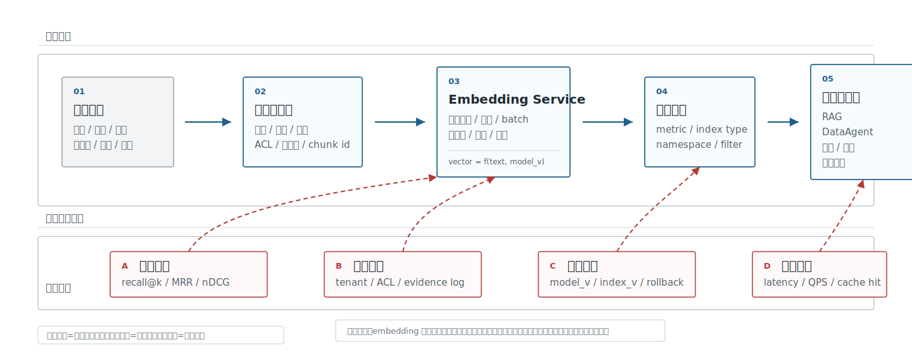
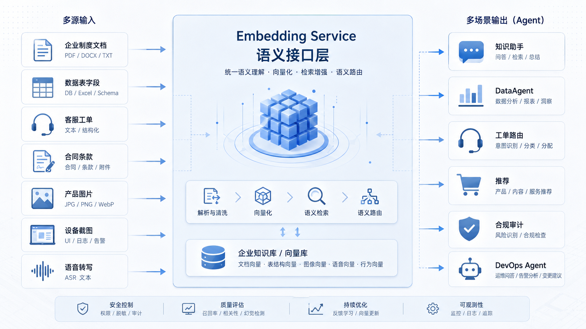
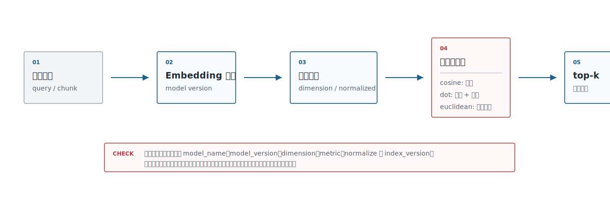
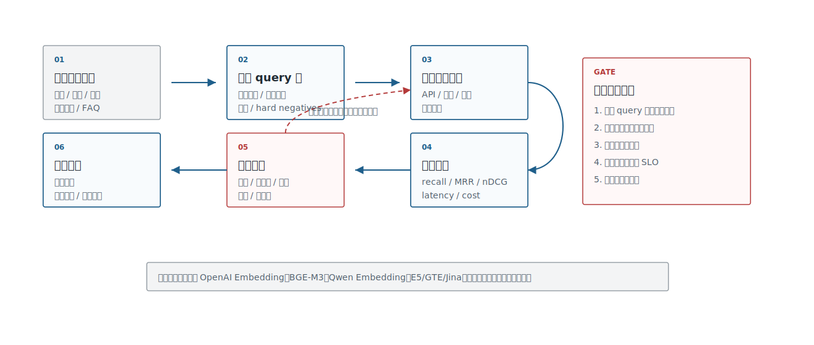
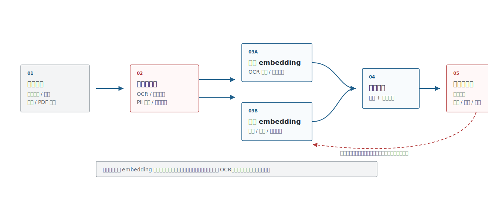
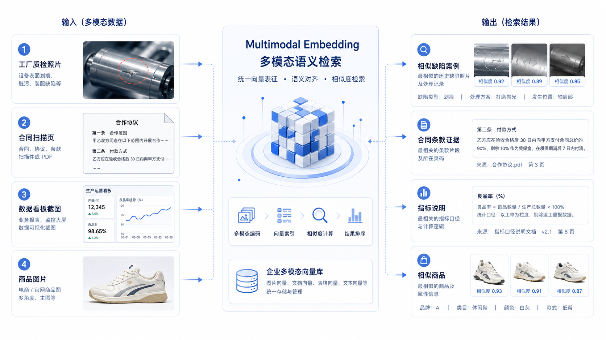
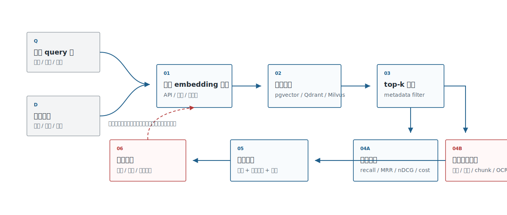

# Ch.16 嵌入模型

> **状态**：v0.5 初稿
> **本章目标**：读者读完后，能够判断企业场景是否需要嵌入模型，解释向量相似度在检索系统里的工程含义，并设计一份可复现的 embedding 选型与评估方案。
> **适合读者**：AI 平台负责人、架构师、数据智能工程师、AI 应用开发者、安全 / 合规负责人。
> **关联章节**：Ch.15 元数据、血缘、契约与指标；Ch.18 向量数据库与索引算法；Ch.20 RAG 工程与高级检索。
> **mini-platform 关联**：`mini-platform/infra/vectorstore/`；计划项目 `mini-platform/projects/13-embedding-vector-benchmark/`。当前仓库还没有完整 Project 13，本章先给出实验契约与报告格式。

**本章阅读路径**

| 读者 | 建议重点 |
|---|---|
| AI 平台负责人 / CTO | 先看场景风险分层、模型路线取舍和评估报告结论，判断 embedding 是否值得平台化投入。 |
| 架构师 | 重点看向量记录契约、相似度度量、模型版本和索引版本如何绑定。 |
| 数据智能工程师 | 重点看 DataAgent schema linking、字段注释、指标口径和历史 SQL 如何进入 embedding 评估。 |
| AI 应用开发者 | 重点看 provider 选型、batch/cache、benchmark 输入输出和上线检查清单。 |
| 安全 / 合规负责人 | 重点看数据出域、权限过滤、审计字段、敏感图片和高风险场景人工复核。 |

企业做 RAG、DataAgent、客服 Agent 或多模态检索时，第一反应常常是选向量数据库。更早需要决定的其实是 embedding：什么内容要被表示成向量，谁来生成向量，向量能解决哪部分问题，哪些问题必须交给关键词检索、权限系统、重排模型或人工复核。

从业界产品看，embedding 已经进入企业搜索和 Agent 平台的基础设施层。Azure AI Search 把向量检索、混合检索和过滤检索放在同一个搜索体系里；Google Vertex AI Vector Search 用向量索引支撑语义搜索、推荐和生成式 AI 应用；Amazon Bedrock Knowledge Bases 把文档切分、embedding 生成、向量库写入和 RAG 检索编排成托管流程。这些产品路线并不完全相同，但都把 embedding 当成“把业务内容接入大模型应用”的中间层，而不是一个独立的模型玩具。

本章沿着五个问题展开：企业里哪些场景先用 embedding，向量相似度到底怎么算，文本 embedding 模型怎样选，多模态 embedding 能补什么短板，以及企业如何建立自己的评估框架。

## 嵌入模型的企业应用场景

企业里最常见的问题不是“没有数据”，而是同一件事在不同系统里有不同表达。员工会用口语问“出差回来多久要报销”，制度文档写的是“返回后十五个工作日内提交申请”；业务分析师会说“高客单门店”，数据仓库里可能是 `avg_order_value_store_segment`；现场照片、票据扫描件和看板截图里还会出现无法直接用文本字段描述的信息。这些表达之间如果没有稳定映射，RAG、DataAgent 和客服 Agent 都会在第一步检索上出错。

Embedding 在这里提供的是语义候选能力：把自然语言问题、制度片段、字段说明、合同条款、图片说明等内容放进一个可检索的表示空间。它不直接保证答案正确，但可以把“可能相关”的证据、字段、案例或图片先找出来。表 16-1 按这个视角展开：企业常见入口并不是七八套孤立方案，而是同一层语义候选能力进入不同业务流程后的分工。

**表 16-1：企业 embedding 的典型业务入口**

| 业务入口 | 真实输入 | embedding 找什么 | 下游系统 |
|---|---|---|---|
| 企业知识库 | 员工的口语化问题、制度文档、操作手册 | 相关制度片段、FAQ、引用证据 | 知识助手、HR/财务助手 |
| 客服和工单 | 新工单描述、历史工单、处理记录、质检标签 | 相似故障、相似根因、相似处理方案 | 客服 Agent、工单路由、质检 |
| DataAgent | 业务问题、指标口径、字段注释、SQL 示例 | 指标、维度、表字段、历史查询样例 | NL2SQL、ChatBI、语义层 |
| 法务和合规 | 合同条款、审批意见、风险标签 | 相似条款、相似风险、历史处理意见 | 法务 Agent、合规审计 |
| 商品和运营 | 标题、类目、评论、图片、运营笔记 | 相似商品、重复 SKU、相似评论簇 | 推荐、去重、运营工作台 |
| 研发和运维 | 错误栈、Issue、Runbook、发布记录 | 相似事故、修复方案、依赖变更 | DevOps Agent、研发助手 |
| 多模态巡检 | 设备照片、质检图片、截图、OCR 文本 | 相似缺陷、相似页面、相关说明 | 质检 Agent、现场巡检助手 |

表里的下游系统各不相同，但 embedding 在这些场景里的职责是一致的：先找候选，而不是直接做决策。客服场景先找相似处理记录，DataAgent 先找字段和指标解释，法务场景先找相似条款，RAG 场景先找可引用文档。后面能不能回答、能不能执行动作，还要看权限过滤、重排、引用校验、工具调用和人工审批。

对 DataAgent 来说，embedding 的第一批高价值对象不是长文档，而是语义层资产：指标口径、维度说明、字段注释、表关系、历史 SQL、业务术语和报表截图。用户问“高客单门店的复购趋势”时，系统要先把“高客单”链接到指标定义，把“门店”链接到维度，把“复购趋势”链接到可计算字段，再交给 NL2SQL 或分析 Agent。这个链路里 embedding 负责候选，语义层和执行引擎负责约束。

从平台负责人视角看，下一步不是继续扩业务入口，而是给这些入口分风险。表 16-2 用风险档位替代“场景热度”，因为同样是语义检索，不同场景对错误的容忍度完全不同。

**表 16-2：企业 embedding 场景的风险分层**

| 风险档位 | 场景 | 质量目标 | 平台要求 |
|---|---|---|---|
| 低风险高频检索 | 制度问答、产品手册、FAQ、内部百科 | 高召回、低延迟、低成本 | API 模型或轻量开源模型可先建 baseline |
| 中风险业务辅助 | 工单、DataAgent schema linking、研发运维 | 候选准确、错误可分析、结果可回放 | 需要内部评测集、hard negatives、reranker |
| 高风险合规场景 | 合同、财务、法务、安全审计 | 权限正确、证据充分、可复核 | 私有化、审计、字段级权限、人工复核优先 |

表 16-2 先把讨论从模型强弱拉回风险边界。同一个 embedding 模型，在员工制度问答里可能已经够用，在合同审查里可能只能做第一阶段召回。企业平台要写清楚使用边界：embedding 返回的是候选，不是事实本身；相似条款不是风险判定；相似工单不是根因确认；相似字段也不是 SQL 执行授权。

有了风险分层，平台决策才不会停留在“embedding 是否有用”。表 16-3 继续回答三个投入问题：在哪些边界内引入，是否值得平台化，什么时候必须增加治理和人工复核。

**表 16-3：平台负责人 embedding 决策要点**

| 决策问题 | 推荐判断 |
|---|---|
| 是否先接商业 API | 非敏感知识库和 PoC 可以先用 API 建质量 baseline；敏感合同、财务、人事数据要优先评估私有化。 |
| 是否马上微调 | 先建立内部 query 集和 hard negative，再决定是否微调；没有评测集时微调结论不可复现。 |
| 是否单独建设 embedding 平台 | 多业务共享知识库、DataAgent、客服、法务时值得平台化；单应用低频检索可先轻量接入。 |
| 是否引入多模态 embedding | 有票据、截图、巡检照片、报表页面等视觉证据时引入；纯文本知识库不必提前复杂化。 |
| 最小上线门槛 | 有权限过滤、模型版本、索引版本、召回评测、失败样例和人工复核边界。 |

三步连起来，就是后面讨论模型、向量库和评估时反复使用的判断顺序：先看 embedding 能接入哪些业务入口，再按错误风险分层，最后决定平台化投入和上线门槛。回到图 16-1 的企业能力链路，可以看到 embedding 只是其中一段：它从业务内容生成语义表示，上线还要经过索引、权限、评测和应用编排。



**图 16-1：企业 embedding 能力链路**

如果图 16-1 关注单条能力链路，图 16-2 关注的就是平台横截面。文档、图片、语义层资产和业务应用之间需要一层稳定语义接口，embedding 的平台价值也主要体现在这里。



**图 16-2：企业级 Agent 平台中的语义接口层**

## 向量表示与相似度计算

Embedding 模型输出的是一组浮点数。对工程团队来说，可以把它理解成内容的“语义指纹”：相似内容在向量空间里更接近，不相似内容距离更远。OpenAI 的 embeddings 文档把它用于衡量文本相关性，Google 的 embeddings 文档也把 embedding 解释为固定维度的数值向量。这个定义听起来简单，但它会影响索引设计、版本管理、权限过滤和线上排障。

表 16-4 列出工程上最常见的三种相似度度量。选择哪一种不是数学偏好，而是要和模型输出、归一化策略、索引创建参数保持一致。

**表 16-4：常见向量相似度度量对比**

| 度量 | 直觉 | 常见用法 | 工程注意点 |
|---|---|---|---|
| Cosine similarity | 比较向量方向 | 文本语义检索、相似案例、知识库问答 | 向量是否归一化要在模型服务和向量库中保持一致 |
| Dot product | 方向和长度一起参与 | 很多 embedding API 和向量库支持 | 不同模型、不同归一化策略不能混用 |
| Euclidean distance | 比较几何距离 | 聚类、传统机器学习、少量检索任务 | 高维空间中距离直觉容易失效 |

这些度量最终会落到图 16-3 这条很短但很关键的计算链路上：原始内容先进入模型服务生成向量，再由向量库按统一 metric 计算相似度，最后返回候选。排障时也应沿这条链路检查模型版本、归一化、metric 和索引版本是否一致。



**图 16-3：向量生成与相似度计算链路**

如果向量都已经归一化，cosine similarity 和 dot product 在排序上通常会接近；如果没有归一化，长度会影响排序结果。企业系统不要只在代码里写 `similarity="cosine"`，还要记录模型是否输出归一化向量、索引创建时使用的度量、查询时是否二次归一化。否则模型升级或向量库迁移时，分数变化很难解释。

几个工程事实值得提前写进平台契约:

**同一索引不能混用不同模型的向量。** 模型 A 和模型 B 生成的向量不在同一个空间。文档向量用旧模型，查询向量用新模型，线上表现可能明显变差。正确做法是把 `model_name`、`model_version`、`dimension` 和 `index_version` 放进索引元数据，模型升级时新建索引或做双写灰度。

**维度是成本变量。** 高维向量会增加存储、内存、索引构建时间和查询延迟。Cohere 的 embedding 文档支持通过 `output_dimension` 调整输出维度，相当于把质量与成本的折中显式交给调用方。开源模型也一样，不能只看离线分数，还要看吞吐、GPU/CPU 成本和索引体积。

**向量相似不等于可回答。** 用户问“报销超期怎么处理”，系统可能召回“报销额度”“审批权限”这类相近材料，但它们不能支持最终答案。成熟 RAG 通常会把 embedding 作为第一阶段召回，再叠加关键词检索、metadata filter、reranker 和引用校验。

**权限必须在向量外显式处理。** 向量空间不会自动理解某个用户是否能看某份合同、某张报表或某条员工信息。租户、部门、角色、文档状态、生效时间必须作为 metadata 进入索引。Azure AI Search 的 filtered vector search 就是这类需求的产品化体现：向量负责相似，过滤字段负责访问边界。

一个生产级 embedding record 至少要能支撑追责、回滚和重建。

```json
{
  "source_id": "policy-2026-hr-001",
  "chunk_id": "policy-2026-hr-001#p12#c03",
  "content_type": "text",
  "text_hash": "sha256:...",
  "embedding": [0.014, -0.031],
  "model_name": "bge-m3",
  "model_version": "2026-embedding-baseline",
  "dimension": 1024,
  "normalized": true,
  "metric": "cosine",
  "index_version": "kb-hr-v7",
  "metadata": {
    "tenant_id": "tenant-a",
    "department": "hr",
    "acl": ["hr", "finance_manager"],
    "source_version": "v3",
    "effective_at": "2026-01-01",
    "created_at": "2026-06-03"
  }
}
```

这份记录的价值在事故发生后才会显出来。当业务方质疑某条回答时，平台团队要能回答：用了哪个模型、哪版索引、哪批文档、什么权限过滤、召回了哪些 chunk、最终引用了哪些证据。缺少这些字段，embedding 系统就会变成一个难以复盘的黑盒。

## 文本嵌入模型选型

文本 embedding 选型不建议从“排行榜第一”开始。MTEB 这样的 benchmark 很有价值，它能把模型放在统一任务集上比较；但企业要上线的是自己的制度、合同、商品、工单、字段注释和业务术语。公开榜单只能提供候选，不能替代内部评测。

第一轮候选可以覆盖表 16-5 里的四条路线。这里先比较路线，不急着比较具体模型，是因为商业 API、开源私有化、国产生态和行业专用模型背后的组织约束完全不同。

**表 16-5：文本 embedding 模型路线取舍表**

| 方案 | 优势 | 代价 | 适用场景 | mini-platform 选择 |
|---|---|---|---|---|
| 商业 API，如 OpenAI Embedding、Cohere Embed、Voyage | 接入快、稳定性好、文档和 SDK 完整，适合作为第一条质量 baseline | 需要评估数据出域、单价、配额、供应商锁定和跨区域合规 | 快速 PoC、非敏感知识库、跨语言知识库、SaaS 优先团队 | 作为可选 provider，用于非敏感数据的基线评测 |
| 开源通用模型，如 BGE-M3、E5、GTE、Jina Embeddings | 可私有化、可控性强，便于长期沉淀平台能力 | 需要推理服务、模型评测、资源调度、版本治理和日常运维 | 中文/多语言知识库、客服工单、字段说明、长期平台能力建设 | 作为默认私有化候选，优先进入 benchmark |
| 国产生态模型，如 Qwen3 Embedding | 便于进入国产模型链路，与国产 LLM、私有云和国产硬件生态更容易协同 | 要关注版本更新节奏、推理适配、长文本成本和生态成熟度 | 国内企业、私有云、国产化要求较强的组织 | 作为国产生态候选，与默认私有化模型并行评测 |
| 行业专用模型，如金融、医疗、法务、客服方向定制模型 | 可能提升垂域术语、行业表达和专业语料的召回表现 | 迁移成本、透明度、授权边界和评测成本更高，泛化能力需要单独验证 | 专业术语密集、错误成本高、已有行业语料积累的场景 | 不作为默认模型，只在垂域评测显著胜出时纳入场景模型 |

BGE-M3 的模型卡强调 multi-lingual、multi-functionality、multi-granularity，适合作为中文和多语言企业知识库的开源 baseline。Qwen3 Embedding 系列强调多语言能力，适合已经采用 Qwen 模型体系的团队做本地化评估。OpenAI Embedding 的优势是接入快、文档完整、服务稳定，适合作为第一条 SaaS baseline。Cohere 的 embedding 文档把 query 和 document 区分为不同 `input_type`，这个细节很适合写进企业规范：用户问题和被检索文档不是同一种文本，模型服务要明确它们的角色。

路线确定后，再进入表 16-6 的选型维度，把“模型强不强”拆成可评估的问题。这样团队讨论的就不是排行榜名次，而是语言覆盖、部署边界、成本、版本治理这些会影响上线的条件。

**表 16-6：文本 embedding 模型选型维度**

| 维度 | 要问的问题 | 影响 |
|---|---|---|
| 语言和术语 | 中文、英文、跨语言、行业缩写、内部黑话是否覆盖 | 召回质量和 hard negative 难度 |
| 文本长度 | 制度、合同、字段说明、表格转写是否超出模型有效长度 | chunk 策略和长文档召回 |
| 部署方式 | API、私有云、离线环境、国产硬件是否支持 | 数据合规、运维成本、上线周期 |
| 向量维度 | 维度、是否可降维、是否归一化 | 存储、内存、索引重建、延迟 |
| 推理性能 | batch、并发、CPU/GPU 成本、p95 延迟 | 在线查询和离线重建速度 |
| 生态能力 | 是否有 reranker、sentence-transformers、TEI、向量库适配 | 工程集成成本 |
| 版本治理 | 模型升级是否可控、是否能保留旧索引回滚 | 线上稳定性 |

这些维度会直接影响第一轮候选池。表 16-7 采用的候选组织方式更稳：每条路线至少选一个代表模型，用同一套内部评测集跑出来，而不是一开始就押注单一模型。

**表 16-7：第一轮 embedding 候选模型**

| 候选 | 定位 | 使用方式 |
|---|---|---|
| OpenAI Embedding | SaaS baseline | 非敏感知识库先跑质量和延迟基线 |
| BGE-M3 | 开源私有化 baseline | 中文制度、客服工单、字段说明的主力候选 |
| Qwen3 Embedding | 国产生态候选 | 与 Qwen LLM、国产推理环境一起评估 |
| E5/GTE/Jina | 对照组 | 验证公开模型路线是否足够，避免单模型偏见 |

候选表不是最终结论。它的价值在于保证评测覆盖不同路线：SaaS baseline 用来给质量上限做参照，私有化 baseline 用来评估长期平台能力，国产生态候选用来评估部署协同，对照组用来避免单模型偏见。

把前面的路线、维度和候选池连起来，图 16-4 的选型流程就不再是“选一个最强模型”，而是先用业务风险和部署边界筛路线，再用内部评测集比较候选，最后给不同场景分层结论。这套流程不鼓励“全公司一个模型打到底”。



**图 16-4：文本 embedding 模型选型流程**

最终选型报告也应该像表 16-8 这样保持分层，而不是只给一个模型名。

**表 16-8：文本 embedding 选型报告的分层结论**

| 场景 | 推荐结论写法 |
|---|---|
| 普通知识库 | 选择召回质量和延迟都稳定的模型，先保证引用证据能进 top-k |
| 敏感数据 | 优先选择可私有化、可审计、可长期维护的模型 |
| 业务术语密集场景 | 先补术语表、字段注释和 hard negatives，再决定是否微调 |
| 高风险问答 | embedding 只做第一阶段召回，必须配合 reranker、引用校验和人工复核 |

这一节的观点很直接：企业选 embedding 模型不是采购一个“语义搜索能力”，而是在建立一条持续迭代的检索基线。模型会更新，文档会变化，业务术语也会变化。没有内部评测集，任何模型结论都会很快过期。

## 多模态嵌入与视觉检索

多模态 embedding 把文本、图片、截图、扫描页等内容放进可比较的语义空间。CLIP 是经典起点，证明了图像和自然语言可以通过对比学习对齐；SigLIP 改进了图文预训练目标；ColPali 把页面作为视觉对象处理，适合视觉丰富的文档检索。Cohere Embed v4 也把图片 embedding 和可调输出维度放进产品文档，说明企业文档检索正在从“纯文本 chunk”走向“文本、图片、页面版面共同参与”。

多模态 embedding 主要补传统流水线的短板：当关键信息藏在页面布局、图像相似性或截图上下文里时，纯文本检索往往不够。表 16-9 同时列出场景和上线前控制，是为了避免把多模态检索理解成单纯的“以图搜图”。

**表 16-9：多模态 embedding 的企业场景与上线控制**

| 场景 | 传统问题 | 多模态 embedding 的作用 | 上线前控制 |
|---|---|---|---|
| 质检巡检 | 缺陷照片很难靠文字描述完整 | 用图片找相似缺陷、供应商批次和历史处理单 | 图片权限、拍摄规范、误判复核 |
| 合同和票据 | OCR 能抽字，但印章、版式、表格关系容易丢 | 用页面图像找相似条款、金额区域、审批痕迹 | 页码引用、金额校验、人工复核 |
| 数据看板截图 | 用户只给截图，不知道指标字段名 | 将截图和指标说明、报表文档、字段注释对齐 | 截图脱敏、版本识别、字段映射 |
| 商品检索 | 图片、标题、评论分别表达相似性 | 图文联合召回相似商品、替代品和重复 SKU | 类目过滤、库存价格约束 |
| 设备运维 | 现场照片和故障描述不一致 | 找相似设备状态、维修记录和 Runbook | 设备权限、时间地点、低质量图片处理 |

多模态检索不能替代文档解析。合同里的金额、票据里的日期、报表里的指标仍然需要 OCR、表格解析、规则校验和业务系统数据确认。更稳的架构是：OCR 和版面解析提供可引用、可校验的结构化内容；多模态 embedding 提供视觉相似、版面相似和图文相关的候选召回。

因此多模态检索更适合按图 16-5 拆成两条互补路径：OCR/解析负责生成可引用文本和结构化字段，多模态 embedding 负责生成视觉相似候选。两条路径最后要在证据校验和人工复核处汇合。



**图 16-5：多模态检索数据流**

企业落地时，容易踩两个坑。第一个是把截图、票据和巡检照片直接进入共享索引，结果把客户姓名、地址、金额、设备编号一起扩散到检索系统。第二个是把视觉相似当成业务等价：两张缺陷图相似，不代表根因相同；两页合同版式相似，不代表条款风险相同。多模态 embedding 在生产里更适合做候选生成器，最终判断仍要依赖业务规则、结构化字段、引用证据和人工复核。

落到需求访谈时，还要反过来问业务里到底有没有图 16-6 这类视觉证据：截图、票据、巡检照片、看板页面是否真的影响检索和判断。如果没有，企业就不必过早引入多模态 embedding。



**图 16-6：企业多模态检索场景**

## 企业级嵌入模型评估框架

企业评估 embedding，不是为了给模型排一个总榜，而是为了决定某个业务场景能不能上线，代价是否可接受，出了问题能不能复盘。公开 benchmark 可以帮团队筛候选，真正上线前必须有内部 query 集。

表 16-10 中的五类对象构成一个最小可用评估集。它们共同定义了“什么算找对”，也让不同模型、不同索引和不同过滤策略具备可比性。

**表 16-10：embedding 评估集的基本对象**

| 对象 | 内容 | 示例 |
|---|---|---|
| Query | 真实用户问题、改写问题、口语化问题、跨语言问题 | “出差回来后多久必须提交报销？” |
| Golden docs | 应该被召回的文档、chunk、字段说明或页面区域 | `travel-policy#p12#c03` |
| Hard negatives | 语义相近但不能回答问题的材料 | 报销额度制度、审批权限说明 |
| Metadata filter | 部门、租户、权限、时间、文档状态 | `department=finance` |
| Judgment | 相关、部分相关、不相关；是否支持最终答案 | `relevant / partial / irrelevant` |

指标也要像表 16-11 这样分层看。只看 recall@10 很容易让团队误判，因为候选进了 top-10 不代表最终回答引用了正确证据；质量、延迟、成本和权限都要进入同一份报告。

**表 16-11：企业 embedding 评估指标**

| 指标 | 看什么 | 适合谁看 |
|---|---|---|
| recall@k | 正确证据是否进入前 k 个候选 | 检索工程师、架构师 |
| MRR | 正确证据是否排得靠前 | 检索工程师 |
| nDCG | 多个相关结果的排序质量 | 评测负责人 |
| answer citation hit rate | 最终回答是否引用正确证据 | RAG 负责人、业务 Owner |
| p50/p95 latency | 查询延迟是否可接受 | 平台负责人 |
| cost/query | 单次查询或千次查询成本 | CTO、平台负责人 |
| index size / rebuild time | 存储、灾备、升级成本 | 架构师、运维 |
| permission violation rate | 是否召回无权访问内容 | 安全/合规负责人 |

评估报告还要覆盖表 16-12 这些上线前工程检查项。这里不需要写成很长的审计文档，但必须让平台负责人知道“能不能上线”和“出了问题怎么退回去”。

**表 16-12：embedding 上线前工程检查项**

| 检查项 | 要确认的内容 | 常见失败 |
|---|---|---|
| 权限过滤 | query 和召回结果都经过租户、部门、角色、文档状态过滤 | 先召回后过滤导致无权内容进入日志或 trace |
| 模型版本 | 文档向量、查询向量、索引版本使用同一模型空间 | 查询模型升级后旧索引未重建 |
| 索引重建 | 有全量重建、增量更新、失败续跑和回滚计划 | 文档更新后索引版本混乱 |
| 成本口径 | 区分离线建库成本、在线查询成本、reranker 成本 | 只看 embedding 单价，忽略重排和重建 |
| 可观测性 | 记录 query、top-k、过滤条件、引用证据、latency 和模型版本 | 线上质量下降时无法复盘 |
| 人工复核 | 高风险场景有审批、拒答和申诉入口 | 合同、财务、合规问答被当成自动结论 |

这套评估可以固化成 mini-platform 的 Project 13。当前 `mini-platform/infra/vectorstore/__init__.py` 还是占位，本章先把后续 demo 的输入、配置、运行命令和报告结构设计清楚。

```text
mini-platform/projects/13-embedding-vector-benchmark/
├── README.md
├── requirements.txt
├── run.sh
├── data/
│   ├── docs/
│   │   ├── travel-policy.md
│   │   ├── reimbursement-guide.md
│   │   └── product-quality-faq.md
│   └── evals/
│       └── retrieval_queries.jsonl
├── configs/
│   ├── openai.yaml
│   ├── bge_m3.yaml
│   └── qwen3_embedding.yaml
├── reports/
│   └── embedding_benchmark.md
└── src/
    ├── embed.py
    ├── index.py
    ├── retrieve.py
    └── evaluate.py
```

评测样例可以这样写：

```json
{
  "query_id": "q-001",
  "query": "出差回来后多久必须提交报销？",
  "golden_chunk_ids": ["travel-policy#p12#c03"],
  "hard_negative_chunk_ids": ["reimbursement-guide#p02#c01"],
  "metadata_filter": {
    "department": "finance"
  },
  "risk_level": "medium"
}
```

配置文件不只写模型名，还要写清楚维度、归一化、batch、索引度量和费用口径。

```yaml
provider: local
model_name: BAAI/bge-m3
model_version: 2026-embedding-baseline
dimension: 1024
normalized: true
metric: cosine
batch_size: 32
top_k: 10
cost:
  unit: local_gpu_hour
  estimate: manual
index:
  backend: qdrant
  collection: enterprise_policy_benchmark
  version: kb-hr-v7
```

运行入口保持简单：

```bash
cd mini-platform/projects/13-embedding-vector-benchmark
./run.sh --config configs/bge_m3.yaml --top-k 10
```

报告应该输出分数，也要输出失败样例。对企业来说，失败样例往往比平均分更有价值：它能告诉团队问题在模型、chunk、OCR、权限过滤、字段注释，还是 query 改写。图 16-7 中 Project 13 的实验数据流也要围绕这个原则设计：同一批 query、golden docs、hard negatives 和 metadata filter 同时进入多个模型/索引组合，避免“模型 A 用一批题、模型 B 用另一批题”的不可比问题。



**图 16-7：embedding benchmark 数据流**

在这种数据流之上，企业内部报告才适合输出表 16-13 这样的分层结论。

**表 16-13：embedding benchmark 报告结论示例**

| 结论项 | 示例 |
|---|---|
| 默认模型 | BGE-M3 在中文制度问答中召回稳定，适合作为私有化 baseline |
| SaaS baseline | OpenAI Embedding 延迟和稳定性较好，适合非敏感知识库快速上线 |
| 高风险场景 | 合同和财务问答必须增加 reranker、引用校验和人工复核 |
| 主要失败原因 | “高客单”“账期”“返利”这类业务词需要补术语表和 hard negatives |
| 下一步 | 扩充评测集，加入表格型文档和多模态截图检索 |

上线后，评估不应该停止。每次模型升级、chunk 策略调整、向量库迁移、文档重建，都要重新跑 benchmark，并保留旧模型和旧索引的回滚路径。企业平台要沉淀的不是某个模型名，而是“每次语义检索变更都可评估、可解释、可回滚”的机制。

## 参考资料

- Azure AI Search vector search overview：[https://learn.microsoft.com/en-us/azure/search/vector-search-overview](https://learn.microsoft.com/en-us/azure/search/vector-search-overview)
- Azure AI Search hybrid search overview：[https://learn.microsoft.com/en-us/azure/search/hybrid-search-overview](https://learn.microsoft.com/en-us/azure/search/hybrid-search-overview)
- Google Vertex AI Embeddings APIs overview：[https://cloud.google.com/vertex-ai/generative-ai/docs/embeddings](https://cloud.google.com/vertex-ai/generative-ai/docs/embeddings)
- Google Vertex AI Vector Search overview：[https://cloud.google.com/vertex-ai/docs/vector-search/overview](https://cloud.google.com/vertex-ai/docs/vector-search/overview)
- Amazon Bedrock Knowledge Bases overview：[https://docs.aws.amazon.com/bedrock/latest/userguide/knowledge-base.html](https://docs.aws.amazon.com/bedrock/latest/userguide/knowledge-base.html)
- Amazon Bedrock Knowledge Bases supported models and vector stores：[https://docs.aws.amazon.com/bedrock/latest/userguide/knowledge-base-supported.html](https://docs.aws.amazon.com/bedrock/latest/userguide/knowledge-base-supported.html)
- OpenAI Embeddings guide：[https://platform.openai.com/docs/guides/embeddings](https://platform.openai.com/docs/guides/embeddings)
- BGE-M3 model card：[https://huggingface.co/BAAI/bge-m3](https://huggingface.co/BAAI/bge-m3)
- Qwen3 Embedding model card：[https://huggingface.co/Qwen/Qwen3-Embedding-8B](https://huggingface.co/Qwen/Qwen3-Embedding-8B)
- MTEB leaderboard：[https://huggingface.co/spaces/mteb/leaderboard](https://huggingface.co/spaces/mteb/leaderboard)
- Cohere Embeddings docs：[https://docs.cohere.com/docs/embeddings](https://docs.cohere.com/docs/embeddings)
- Cohere Embed Multimodal v4：[https://docs.cohere.com/changelog/embed-multimodal-v4](https://docs.cohere.com/changelog/embed-multimodal-v4)
- OpenAI CLIP：[https://openai.com/index/clip/](https://openai.com/index/clip/)
- SigLIP paper：[https://arxiv.org/abs/2303.15343](https://arxiv.org/abs/2303.15343)
- ColPali paper：[https://arxiv.org/abs/2407.01449](https://arxiv.org/abs/2407.01449)
