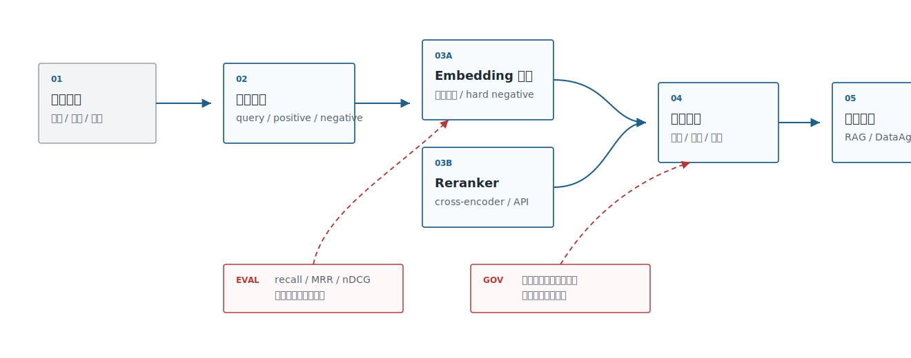
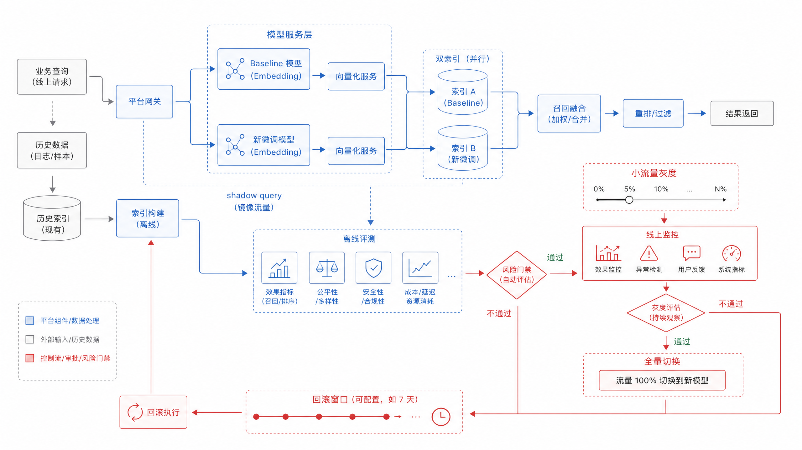
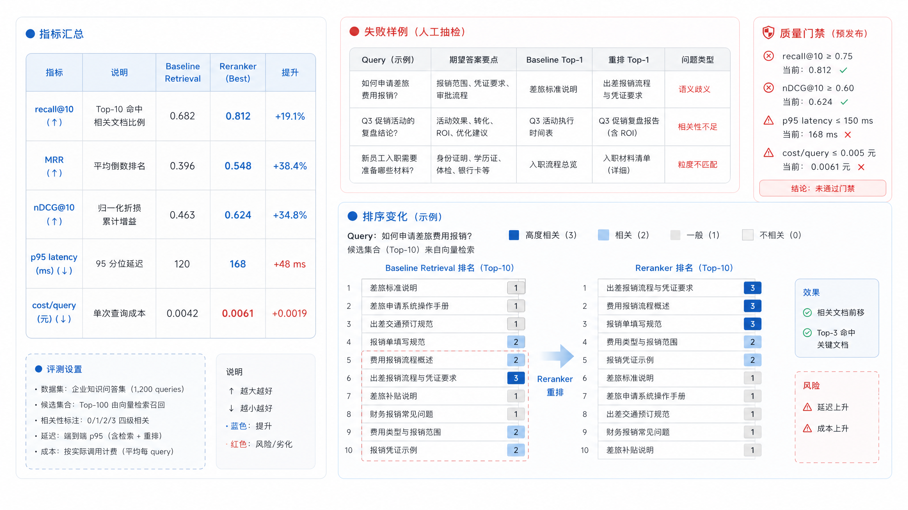

# Ch.17 嵌入微调与重排

> **状态**：v0.2 初稿
> **本章目标**：读者读完后，能够判断企业检索是否需要微调 embedding，设计对比学习样本和 hard negative 流程，并把 reranker 放进可评估、可回滚的检索链路。
> **适合读者**：AI 平台负责人、架构师、数据智能工程师、AI 应用开发者、安全 / 合规负责人。
> **关联章节**：Ch.16 嵌入模型；Ch.18 向量数据库与索引算法；Ch.20 RAG 工程与高级检索。
> **mini-platform 关联**：`mini-platform/core/rag/`、`mini-platform/core/eval/`、`mini-platform/infra/vectorstore/`；计划项目 `mini-platform/projects/13-embedding-vector-benchmark/`。

**本章阅读路径**

| 读者 | 建议重点 |
|---|---|
| AI 平台负责人 / CTO | 看“是否值得微调”和“是否优先重排”的判断边界，避免把训练当成默认投入。 |
| 架构师 | 看微调后双索引、shadow query、reranker 插槽和权限过滤顺序。 |
| 数据智能工程师 | 看 schema linking、指标别名、历史 SQL 与 hard negative 如何构造样本。 |
| AI 应用开发者 | 看样本形态、reranker 请求记录、评测报告和上线检查。 |
| 安全 / 合规负责人 | 看训练样本来源、敏感候选出域、重排服务部署边界和人工复核。 |

Ch.16 解决的是“先选一个可用 embedding baseline”。企业真正上线后，很快会遇到第二层问题：公开模型能召回大部分常见问题，但在内部术语、字段别名、合同条款、工单根因和长尾业务表达上会出错。零售企业的员工问“KA 门店坏账风险”，财务制度里写的是“大客户应收账款逾期”；业务分析师问“团购转化”，指标库里写的是 `group_buying_paid_ratio`。这类错不一定靠换更大的模型解决，往往需要领域样本、hard negative、reranker 和持续评测一起工作。

Embedding 微调和重排不是一个“模型增强开关”。微调改变向量空间，影响索引重建、版本回滚和线上稳定性；重排增加第二阶段计算，影响延迟、成本和解释链路。本章把它们放在企业检索平台里讨论，而不是只讲训练脚本。

## 领域语义适配需求

企业需要领域适配，通常不是因为模型“不懂中文”，而是因为企业内部同时存在几套语言。第一套是业务口径，例如销售团队说“战略客户”，CRM 里记录的是 `tier_a_account`。第二套是系统命名，例如分析师说“团购转化”，指标平台里可能是 `group_buying_paid_ratio`。第三套是现场表达，例如一线人员说“页面闪退”，研发日志里写的是 `SIGABRT`。公开 embedding 模型可以给出语义近邻，但它不知道这些表达在当前企业里哪些可以互相替换，哪些只是主题相似。

因此，领域适配不要从“训练一个企业模型”开始，而要先识别语言错配出现在哪里。读表 17-1 时，可以把触发信号、线上表现和优先动作连起来判断：问题是该补语义资产、补样本，还是进入训练和重排。

**表 17-1：领域语义适配的触发信号**

| 触发信号 | 典型表现 | 优先动作 |
|---|---|---|
| 内部术语召回弱 | 用户问题和文档字段不共词，top-k 常漏掉正确 chunk | 先补术语表、字段注释和 query 改写样本 |
| hard negative 混淆 | top-k 里经常出现“看起来相关但不能回答”的材料 | 构造 query-positive-negative 三元组，训练或重排 |
| 长尾业务表达多 | 客服、研发、门店输入很口语化，公开语料覆盖不足 | 从真实日志和历史工单抽样，做小规模评测集 |
| 合规场景证据要求高 | top-k 命中不够，必须把正确证据排在前几位 | 优先引入 reranker 和引用校验，再考虑微调 |
| 多语言或跨系统别名 | 中英文缩写、系统字段、业务别名交叉出现 | 建立别名词表、schema linking 样本和跨语言评测 |

这些触发信号还不能直接推出“应该微调”。平台团队需要继续把检索错误分成四类：召回不到、召回到了但排序靠后、召回了相似但不能回答的材料、召回结果被权限过滤后不足。只有第一类和部分第二类适合用 embedding 微调解决；第三类通常需要 reranker、规则和证据校验；第四类是权限与索引治理问题，不应该用训练来掩盖。

平台负责人的第一轮决策也应该沿着表 17-2 的顺序展开。它不是模型选型，而是把“是否值得训练”放到错误归因、样本条件、合规边界和回滚能力里判断。

**表 17-2：平台负责人微调与重排决策要点**

| 决策问题 | 推荐判断 |
|---|---|
| 是否先微调 embedding | 只有当错误稳定、样本可标注、baseline 可复现时才微调；否则先补术语、字段说明和 query 改写。 |
| 是否先上 reranker | 正确证据已经进入 top-k 但排序靠后时，优先上 reranker，风险和回滚成本低于改 embedding 空间。 |
| 是否允许外部 reranker | 非敏感知识库可以评估 API；合同、财务、人事、客户资料要优先私有化或做脱敏候选。 |
| 是否能进入生产 | 必须有 hard negative、失败样例、索引回滚、模型版本和候选日志。 |
| 何时停止投入 | 如果错误来自文档解析、权限过滤或 chunk 切分，继续训练 embedding 只会掩盖问题。 |

这样的决策顺序很重要：先判断错误类型，再判断样本是否足够，最后才判断用微调还是重排。否则团队很容易把文档解析、权限过滤、chunk 切分的问题错误地归因给 embedding 模型。回到图 17-1 的检索链路，边界会更清楚：微调影响第一阶段向量召回，重排影响候选排序，权限和引用校验则属于平台控制面。



**图 17-1：嵌入微调与重排在检索链路中的位置**

链路边界确定之后，样本治理就不能只是训练脚本旁边的临时文件。图 17-2 里的每一条用于微调或重排的样本，都要能追溯到真实 query、业务场景、正负样本、权限范围和复核状态。


**图 17-2：企业语义适配样本工作台**

## 对比学习与样本构造

Embedding 微调首先要定义企业关心的相似关系，而不是简单多喂一些公司文档。sentence-transformers 的训练文档把模型、数据集、loss、训练参数和 evaluator 拆成训练组件；常见检索训练会使用 pairs、triplets 或带标签的相关性样本。企业更应该先把样本定义清楚，再讨论训练资源。

表 17-3 列出的样本形态并不多，它们和上一节的错误归因是一一对应的：召回不到时需要正样本 pair，排序混淆时需要 hard negative，重排评估时需要多级相关性，冷启动时才考虑伪标签。

**表 17-3：检索微调样本形态**

| 样本形态 | 示例 | 适合任务 | 风险 |
|---|---|---|---|
| 正样本 pair | “报销多久到账” ↔ “财务付款周期说明” | FAQ、制度问答、字段别名 | 太容易的正样本会让模型学不到边界 |
| 三元组 | query、正确 chunk、相似但错误 chunk | 合同、工单、DataAgent schema linking | negative 质量差会引入错误偏好 |
| 多级相关性 | 相关、部分相关、不相关 | reranker 训练和评估 | 标注成本更高，需要一致性检查 |
| 伪标签样本 | LLM 或历史点击生成的候选标签 | 冷启动、无标注场景 | 必须抽样人工复核，防止模型放大旧系统偏差 |

样本形态越复杂，越需要业务复核。伪标签可以帮冷启动，但不能替代人工判断；多级相关性适合训练 reranker，但如果标注标准不一致，最终只会把噪声训练进模型。

Hard negative 是企业微调里最值钱的样本。它不是随机不相关文档，而是“很像正确答案，但业务上不能支持回答”的材料。报销额度制度不是报销时限，合同续约通知不是自动续费风险，字段 `customer_level` 不是 `customer_risk_grade`。如果 negative 太容易，模型只学会粗粒度主题；如果 negative 本身标错，模型会把正确路径打歪。

表 17-4 将 hard negative 的来源分开，是因为负样本不能只靠 LLM 批量生成。最可靠的 negative 通常来自真实失败的 top-k，因为它直接暴露了当前模型已经混淆的边界。

**表 17-4：hard negative 的来源与处理**

| 来源 | 获取方式 | 使用建议 |
|---|---|---|
| baseline top-k 错误 | 用现有 embedding 检索，人工标出相似但不可用结果 | 最优先，直接来自真实失败模式 |
| BM25 高分错误 | 关键词命中但语义不支持答案的文档 | 适合处理共词误导 |
| 同类字段或同类条款 | 同一表、同一合同模板、同一业务流程内的相邻对象 | 适合 DataAgent 和法务场景 |
| LLM 生成近似问题 | 让 LLM 改写 query，再检索出混淆项 | 只能做候选，不能免人工复核 |

这几类来源可以组合使用，但优先级不同。线上失败样例优先，业务相邻对象其次，LLM 生成只能补候选池。否则 hard negative 会看起来很丰富，实际却没有覆盖企业真正的错误分布。

样本进入训练前要先进入数据治理流程。每条样本至少记录 `query_id`、`positive_id`、`negative_id`、`labeler`、`source`、`scenario`、`acl_scope`、`created_at` 和 `review_status`。这样做看起来繁琐，但它决定模型升级后能不能解释“为什么这个模型把某类字段排前了”。

DataAgent 的 hard negative 要特别谨慎。字段名相似不代表可替换，`customer_level`、`customer_segment`、`customer_risk_grade` 都可能出现在客户主题下，但它们对应的业务含义、权限边界和 SQL 计算完全不同。用于训练或重排的 negative 应该带上表、字段、指标、SQL 示例和业务口径，否则模型可能学到“主题相近即可召回”的错误偏好。

到了标注会，团队需要图 17-3 这种能把错误来源和修复动作对齐的工作底稿。横向看错误来源，纵向看修复动作，才能把“继续训练”“补字段说明”“改 chunk”“加权限过滤”分开讨论，而不是把所有失败都推给 embedding 模型。


**图 17-3：hard negative 错误分析矩阵**

## 嵌入模型微调路线

企业微调要从低风险路线开始。第一步通常不是训练，而是把检索系统变得可诊断：固定一批真实 query，补齐 golden docs，标出 hard negatives，记录失败原因。只有当错误稳定复现，且业务团队能解释“什么是正确相似、什么是危险相似”时，微调才有意义。

一个成熟的企业路线通常分四个阶段，表 17-5 则把这些阶段背后的取舍压缩成可比较的路线。

第一阶段是 **检索基线和数据补强**。先用 Ch16 选出的 baseline 模型跑内部 query 集，把失败样例按业务场景拆开。很多问题在这一阶段就能解决：字段注释太短，就补字段说明；制度文档缺少别名，就补术语表；客服工单缺根因标签，就补结构化标签；DataAgent 找不到指标，就把指标口径、历史 SQL 和表血缘写进语义层。这个阶段不改变模型，因此回滚成本最低。

第二阶段是 **小规模监督对比学习**。当团队已经有几百到几千条稳定样本，可以用 sentence-transformers 这类生态做 pairs、triplets 或 ranking loss 训练。训练样本不追求大而杂，而要覆盖最常见的业务混淆：同主题不同口径、同字段不同含义、同合同不同条款、同故障不同根因。训练后必须重新编码文档向量并构建新索引，不能把新 query 向量打到旧索引上。

第三阶段是 **场景化适配和版本治理**。如果企业已经有私有化 embedding 模型服务，可以进一步评估 LoRA、adapter 或继续预训练式的轻量适配。但这一步要非常克制：它会增加模型发布、推理服务、向量重建、A/B 测试和安全审计复杂度。只有在客服、法务、DataAgent schema linking 等明确高价值场景持续受益时，才值得进入长期维护。

第四阶段是 **与 reranker 和检索策略联合优化**。微调解决的是“候选能不能进来”和“向量空间是否更懂业务边界”；reranker 解决的是“候选进来后谁排在前面”。如果正确材料已经进入 top-50，只是排序靠后，优先加 reranker 往往更稳；如果正确材料长期进不了 top-k，才考虑微调 embedding。企业上线评审要看组合效果，而不是只看训练 loss；表 17-5 进一步比较了这几条路线的优势、代价和适用边界。

**表 17-5：嵌入微调路线取舍表**

| 方案 | 优势 | 代价 | 适用场景 | mini-platform 选择 |
|---|---|---|---|---|
| 不微调，只补 query 改写、术语表和 metadata | 风险低、上线快、不需要重建模型能力 | 对深层语义混淆改善有限 | baseline 刚建立、错误主要来自语料缺失或字段说明不足 | 默认第一阶段，先建立可复现评测集 |
| 用 sentence-transformers 做小规模对比学习 | 工程生态成熟，适合 pairs/triplets 和 hard negatives | 需要样本治理、训练环境和索引重建 | 内部术语、工单、schema linking 有稳定错误样例 | 作为实验路线，不直接进入生产默认 |
| 用 LoRA/adapter 做轻量适配 | 训练成本相对可控，便于版本化 | 部署复杂度高于纯 embedding baseline | 有私有化模型和推理平台基础的团队 | 作为后续扩展，不在本章实现 |
| 不改 embedding，引入 reranker | 不改变向量空间，回滚简单，常能显著改善前排排序 | 增加二阶段延迟和成本 | 正确证据已进 top-k，但排序靠后 | mini-platform 优先实现 reranker 插槽 |

微调路线要有明确退出条件。数据补强后如果 recall@10 已经满足业务阈值，就没有必要进入训练；小规模对比学习如果只提升平均分、却让高风险场景变差，就不能上线；引入 reranker 如果 p95 延迟超过交互要求，也要回到检索候选数量和模型大小上重新折中。

企业微调的上线门槛应该高于普通模型替换。模型版本变化意味着文档向量、query 向量和索引空间都变了。生产上不要把新模型直接写进旧索引。更稳的流程是：新模型离线编码一份新索引，离线评测通过后做 shadow query，再做小流量灰度，最后保留旧索引回滚窗口。

图 17-4 把训练、重建索引、shadow query、灰度和回滚放在同一条链上，是为了提醒团队：embedding 微调不是模型团队的孤立动作，而是检索平台的一次版本变更。



**图 17-4：embedding 微调版本灰度流程**

## 重排模型架构位置

Reranker 的位置在召回之后、答案生成之前。第一阶段 embedding 或混合检索负责从百万级文档里找出几十到几百个候选；reranker 逐个判断 query 和候选内容的匹配程度，把真正支持回答的证据排到前面。sentence-transformers 的 Retrieve & Re-Rank 文档把 bi-encoder 用于高效召回、cross-encoder 用于重排；Cohere Rerank 这类商业 API 也遵循同样的二阶段思路。表 17-6 之所以拆开召回、重排和答案生成前过滤，是为了避免把 reranker 误用成权限系统或坏 chunk 的补救工具。

**表 17-6：召回与重排的职责边界**

| 环节 | 输入规模 | 模型形态 | 主要目标 | 常见指标 |
|---|---|---|---|---|
| 第一阶段召回 | 全量文档、字段、工单 | embedding、BM25、混合检索 | 正确候选不要漏 | recall@k、latency、filter hit rate |
| 第二阶段重排 | top-50 或 top-100 候选 | cross-encoder、reranker API、轻量 LLM judge | 正确证据尽量排前 | MRR、nDCG、answer citation hit |
| 答案生成前过滤 | top-3 到 top-10 | 规则、权限、引用校验 | 不把不可用证据交给 LLM | policy violation、citation coverage |

Reranker 不应该变成“万能纠错器”。如果正确文档没有进入第一阶段 top-k，重排没有机会修复；如果 chunk 切坏了，reranker 只能在坏候选里排序；如果权限过滤放在 reranker 后面，模型可能已经看到了用户无权访问的内容。平台契约要规定：权限过滤必须在召回和重排之间可配置，敏感场景优先 pre-filter；重排请求本身也要记录 query、candidate ids、model version 和分数。

```json
{
  "query_id": "q-2026-0617-00031",
  "retrieval_index": "policy-kb-v7",
  "retrieval_top_k": 80,
  "reranker": "bge-reranker-large",
  "reranker_version": "2026-06-baseline",
  "candidates": [
    {"chunk_id": "travel-policy#p12#c03", "retrieval_score": 0.74, "rerank_score": 0.91},
    {"chunk_id": "expense-limit#p02#c01", "retrieval_score": 0.78, "rerank_score": 0.21}
  ]
}
```

## 标注评测与版本治理

微调和重排能不能上线，取决于评测闭环。一个可用的企业评测集要覆盖真实 query、golden docs、hard negatives、权限过滤、业务场景标签和失败原因。评测报告不能只给平均分，还要给“哪些场景变好、哪些场景变坏、成本和延迟变成多少”，表 17-7 的上线检查项也应该围绕这些问题展开。

**表 17-7：嵌入微调与重排上线检查项**

| 检查项 | 要求 |
|---|---|
| 样本治理 | 所有训练样本有来源、标注人、复核状态和权限范围 |
| 离线质量 | recall@k、MRR、nDCG 至少和 baseline 对比，输出失败样例 |
| 线上成本 | reranker p95 延迟、QPS、token/请求成本可观测 |
| 版本隔离 | embedding 模型、reranker、索引、chunk 策略分别有版本号 |
| 回滚策略 | 旧模型和旧索引保留到新版本稳定后再下线 |
| 数据合规 | 敏感候选是否会发送给外部 reranker 必须显式审批 |

mini-platform 的 Project 13 可以把 Ch16 的 embedding benchmark 扩展成“微调 + 重排”报告：同一批 query，对比 baseline embedding、微调 embedding、baseline+reranker、微调+reranker 四种组合。报告输出不只包含分数，还要包含失败样例和版本元数据，这样平台负责人才能判断能不能上线，工程师也能定位下一轮该修模型、修索引，还是修文档解析。

```bash
cd mini-platform/projects/13-embedding-vector-benchmark
./run.sh --config configs/rerank_benchmark.yaml --top-k 80 --rerank-top-k 10
```

评测报告不能停在一行分数。图 17-5 这种页面把不同组合的质量、延迟、成本、失败样例和版本信息放在一起，平台负责人才有依据决定上线、灰度或回滚。



**图 17-5：重排评测报告页面**

## 本章小结

Embedding 微调适合解决稳定、可标注、可复现的领域语义问题；reranker 适合在正确候选已经进入 top-k 时提升前排证据质量。两者都不应该绕开样本治理、权限审计和版本回滚。企业平台的做法是先建立 baseline，再用 hard negatives 找到真实边界，最后把微调、重排、索引和 chunk 策略放进同一份评测报告。

### 关键结论

- 微调前先确认错误类型：召回不到、排序靠后、候选不可用、权限过滤不足，对应的修复手段不同。
- Hard negative 是企业检索适配的核心资产，要有来源、复核和版本记录。
- Reranker 是二阶段排序组件，不是权限系统，也不是坏 chunk 的补救工具。
- 新 embedding 模型必须新建索引或双写灰度，不能混进旧向量空间。

### 上线检查清单

- [ ] 是否有内部 query 集、golden docs 和 hard negatives？
- [ ] 微调模型、reranker、索引、chunk 策略是否分别版本化？
- [ ] 敏感场景是否确认 reranker 的部署边界和数据出域风险？
- [ ] 是否输出失败样例，而不只是输出平均分？
- [ ] 是否保留旧模型和旧索引的回滚窗口？

### 参考资料

- Sentence Transformers Training Overview: https://www.sbert.net/docs/sentence_transformer/training_overview.html
- Sentence Transformers Losses: https://www.sbert.net/docs/package_reference/sentence_transformer/losses.html
- Sentence Transformers Retrieve & Re-Rank: https://www.sbert.net/examples/sentence_transformer/applications/retrieve_rerank/README.html
- Cohere Rerank: https://docs.cohere.com/docs/reranking-with-cohere
- BAAI bge-reranker model cards: https://huggingface.co/BAAI
