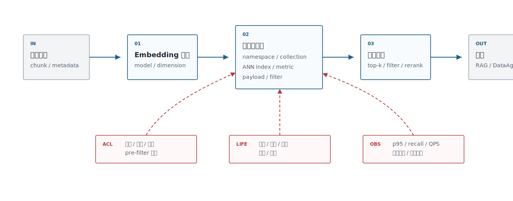
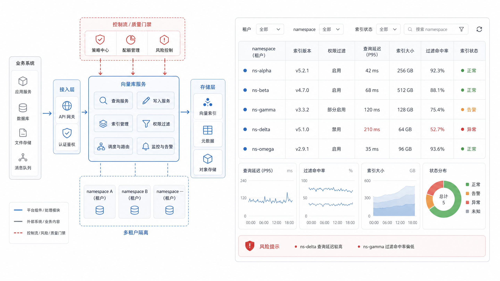
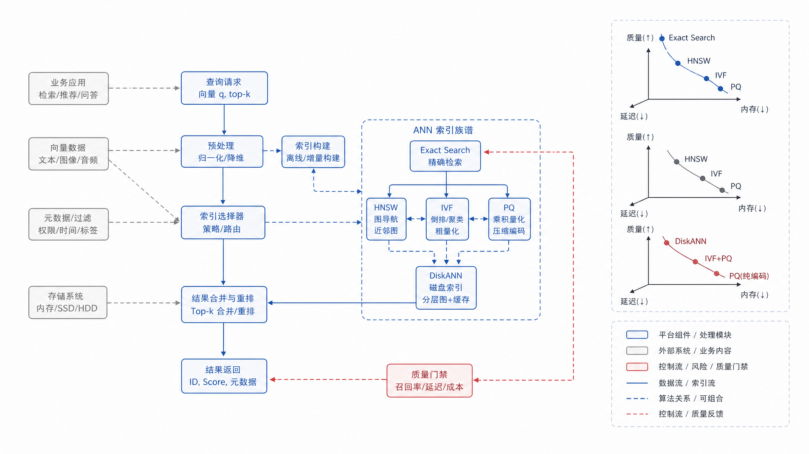
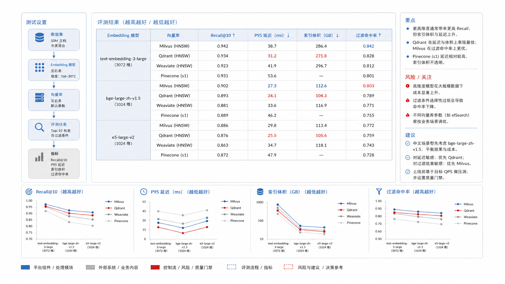

# Ch.18 向量数据库与索引算法

> **状态**：v0.2 初稿
> **本章目标**：读者读完后，能够解释向量库在企业 Agent 平台中的位置，比较 ANN 索引与主流向量数据库，并设计可治理的索引生命周期和 benchmark。
> **适合读者**：AI 平台负责人、架构师、数据智能工程师、AI 应用开发者、安全 / 合规负责人。
> **关联章节**：Ch.16 嵌入模型；Ch.17 嵌入微调与重排；Ch.20 RAG 工程与高级检索。
> **mini-platform 关联**：`mini-platform/infra/vectorstore/`；计划项目 `mini-platform/projects/13-embedding-vector-benchmark/`。

**本章阅读路径**

| 读者 | 建议重点 |
|---|---|
| AI 平台负责人 / CTO | 看向量库是共享平台还是应用私有组件，以及 pgvector、Milvus、Qdrant 等路线的投入差异。 |
| 架构师 | 看 ANN 索引、metadata filter、多租户、索引生命周期和回滚。 |
| 数据智能工程师 | 看 DataAgent 字段检索、指标检索和权限过滤对向量库的要求。 |
| AI 应用开发者 | 看 provider 选择、索引参数、查询契约和 benchmark 指标。 |
| 安全 / 合规负责人 | 看租户隔离、pre-filter/post-filter、查询日志和无权候选泄露风险。 |

向量数据库不是 RAG 的全部，也不是 embedding 的替代品。它更像企业语义检索的执行层：接收向量、metadata 和索引参数，在权限、延迟、召回质量和成本之间做工程折中。如果平台团队只问“Milvus、Qdrant、pgvector、Weaviate 选哪个”，就已经跳过了更重要的问题：数据规模多大，查询是否需要强过滤，是否多租户，是否要求事务一致性，是否能接受索引重建窗口，是否需要和传统搜索合并。

## 向量库平台定位

企业向量库首先是平台组件，不是某个应用的私有缓存。知识库、客服、法务、DataAgent、推荐去重都可能共享 embedding 服务和向量索引能力，但它们的权限、更新频率和质量目标不同。平台层要提供统一的写入契约、查询契约、版本契约和观测指标。

DataAgent 对向量库的要求和普通知识库不同。字段、指标、SQL 示例、报表截图和业务术语经常来自不同系统，更新频率也不同；字段级权限和租户隔离必须进入 metadata filter；同一个业务问题还可能同时检索语义层、历史 SQL、数据质量规则和指标血缘。因此 DataAgent 的向量库不是“文档索引”，而是语义层候选索引。

讨论选型前，先要像表 18-1 一样划清向量库的职责边界，尤其要写清楚它“不负责什么”。否则团队很容易把 embedding 生成、权限系统、答案正确性和数据血缘都塞给向量库。

**表 18-1：向量库在企业平台中的职责**

| 职责 | 说明 | 不负责什么 |
|---|---|---|
| 向量索引 | 管理 embedding、metric、index type、namespace、版本 | 不负责生成 embedding |
| metadata 过滤 | 按租户、部门、权限、生效时间、文档状态过滤 | 不替代统一权限系统 |
| 近似检索 | 在延迟和召回之间折中 | 不保证最终答案正确 |
| 生命周期治理 | 重建、双写、灰度、回滚、压缩和归档 | 不替代数据血缘与审计 |
| 观测与成本 | 记录 QPS、p95、召回、过滤命中、索引大小 | 不解释业务语义错误 |

职责边界确定后，平台负责人才能做表 18-2 这类选型判断。这里关注的是“什么时候该建设共享平台、什么时候可以用轻量方案”，而不是单纯比较数据库品牌。

**表 18-2：平台负责人向量库决策要点**

| 决策问题 | 推荐判断 |
|---|---|
| 先用 pgvector 还是专门向量库 | 中小规模、强 SQL/事务/元数据需求先用 pgvector；多业务共享、大规模和高 QPS 再评估 Milvus/Qdrant/Vespa。 |
| 是否建设统一向量平台 | 多个业务都需要 embedding、索引、权限、评测和回滚时建设；单应用 PoC 不必提前平台化。 |
| 最关键的安全问题 | 不允许无权候选进入模型、日志或 trace；高风险场景优先 pre-filter。 |
| 最关键的成本问题 | 维度、索引类型、过滤策略、top-k、重排都会影响内存和延迟，要联合评估。 |
| 最小治理要求 | 每个索引有模型版本、chunk 策略、metadata schema、构建时间、评测结果和回滚窗口。 |

先定义平台边界，再把边界转成投入决策。没有这个顺序，团队很容易一上来讨论 Milvus 或 pgvector，却没有说清楚谁负责索引版本、权限过滤和回滚。放到图 18-1 的平台位置中看，向量库的核心接口就不是“存一条向量”，而是带着 metadata、权限、版本和指标完成可治理检索。



**图 18-1：向量库在企业 Agent 平台中的位置**

平台化之后，这些能力还要能像图 18-2 那样被运维和治理界面管理。多租户、collection、索引版本、过滤字段和观测指标如果都散落在各应用配置文件里，向量库就很难成为共享平台能力。



**图 18-2：企业向量库多租户控制台**

## ANN 索引算法谱系

向量检索的核心难点是规模。少量向量可以精确计算相似度；百万、千万、亿级向量就要用 Approximate Nearest Neighbor，牺牲一点召回换取可接受的延迟和成本。Milvus、Qdrant、Weaviate、Vespa、pgvector 等系统暴露的索引名称不同，但底层取舍大体围绕图索引、倒排聚类、量化压缩和磁盘索引展开。

理解 ANN 时，先用表 18-3 建立共同的算法语言，比直接给出唯一答案更重要。HNSW、IVF、PQ、磁盘索引和精确检索分别对应不同的内存、构建、召回和延迟取舍。

**表 18-3：ANN 索引算法谱系**

| 算法路线 | 直觉 | 优势 | 代价 |
|---|---|---|---|
| HNSW | 构建多层近邻图，查询时沿图搜索 | 召回和延迟表现稳定，工程生态成熟 | 内存占用较高，构建参数影响明显 |
| IVF | 先把向量聚类到桶，再在少量桶内搜索 | 大规模数据可控，适合配合压缩 | 需要训练聚类中心，参数不当会漏召回 |
| PQ/SQ 量化 | 用低比特表示近似向量 | 节省内存和存储 | 分数精度下降，需要重排或精排补偿 |
| DiskANN / 磁盘索引 | 用磁盘和缓存承载更大索引 | 降低内存压力 | 延迟抖动、冷热数据和硬件配置更敏感 |
| 精确索引 | 暴力或数据库原生精确距离计算 | 结果可解释，适合小规模 baseline | 数据量大时不可扩展 |

企业不要在第一天追求最复杂的索引。最稳的路线是小规模数据用精确或 HNSW 建 baseline，拿内部 query 集测 recall@k 和 p95；规模上来后再评估 IVF/PQ、分片、磁盘索引和冷热分层。索引参数不是一次性配置，而是和 embedding 模型、维度、metadata 过滤、top-k、reranker 一起调的系统变量。

选型会真正需要讨论的，往往不是算法名，而是“召回、内存、构建时间、延迟”这些取舍。图 18-3 的索引谱系能帮助团队对齐这些取舍。



**图 18-3：ANN 索引算法谱系图**

## 主流向量库技术选型

主流向量库的差异不只在索引算法。pgvector 的优势是和 PostgreSQL 数据、事务、SQL 权限靠得近；Milvus 更偏大规模向量基础设施；Qdrant 强调 payload/filter 和服务化向量检索；Weaviate 提供 schema、向量化模块和 GraphQL/REST 能力；Vespa 更像搜索与推荐平台，适合复杂 ranking；Chroma 更适合原型和轻量开发。

表 18-4 回到企业约束比较工具路线，并延续前面的职责边界和索引取舍。这里的重点不是“谁最好”，而是谁更适合当前规模、权限模型、运维能力和 mini-platform 的演进阶段。

**表 18-4：主流向量库路线取舍表**

| 方案 | 优势 | 代价 | 适用场景 | mini-platform 选择 |
|---|---|---|---|---|
| pgvector | 和 PostgreSQL 结合紧密，SQL、事务、权限和元数据管理简单 | 超大规模和复杂 ANN 能力不如专门向量库 | 中小规模知识库、DataAgent 字段检索、团队已有 PostgreSQL | 默认 baseline，适合 Project 13 起步 |
| Milvus | 面向大规模向量检索，索引类型和分布式能力丰富 | 运维组件更多，治理成本较高 | 大规模知识库、多业务共享向量平台 | 作为大规模候选进入 benchmark |
| Qdrant | payload filtering 和服务化 API 友好，易做多租户过滤 | 需要额外管理数据库与业务系统的一致性 | 多租户 RAG、权限过滤强的场景 | 作为服务化候选进入 benchmark |
| Weaviate | schema、模块化向量化、检索 API 完整 | 与既有数据平台集成需要评估 | 快速构建语义搜索和知识应用 | 作为产品化候选调研 |
| Vespa | 搜索、推荐、ranking 表达力强 | 学习曲线和部署复杂度高 | 大规模搜索推荐、复杂排序、多阶段 ranking | 作为高级搜索平台候选 |

选型时不要只问“支持 HNSW 吗”。更重要的是：metadata filter 是否在 ANN 前后如何执行，过滤会不会严重降低召回；索引重建能否不停服；租户隔离是 namespace、collection、partition 还是业务字段；备份恢复是否覆盖向量和 metadata；查询日志能否追溯到用户、索引版本和候选列表。

## 元数据过滤与多租户权限

向量库中的 metadata 是企业检索的安全边界之一。Qdrant 文档把 filtering 放在向量搜索概念里，Azure AI Search 支持向量搜索和过滤组合，这说明企业搜索不能只做“相似度最近”。同一个 query 在不同用户、部门、租户、时间点下应返回不同候选。

metadata 设计可以扩展，但表 18-5 里的最小字段集合不能缺少租户、权限、来源、版本和索引治理信息；否则向量库很快会变成无法审计的共享缓存。

**表 18-5：metadata 字段设计**

| 字段 | 用途 | 示例 |
|---|---|---|
| `tenant_id` | 租户隔离 | `tenant-a` |
| `acl` | 角色或部门权限 | `finance_manager` |
| `source_type` | 文档、字段、工单、图片 | `policy` |
| `source_version` | 文档版本 | `v3` |
| `effective_at` | 生效时间过滤 | `2026-01-01` |
| `index_version` | 索引治理 | `kb-hr-v7` |

权限过滤有三种常见策略。Pre-filter 在向量搜索前过滤候选集合，安全性强，但过滤太窄可能影响 ANN 召回。Post-filter 在检索后过滤，召回稳定，但可能让模型或服务看到无权候选。Hybrid filter 把租户、密级等硬边界前置，把状态、时间等软条件后置。高风险场景应优先 pre-filter，宁可召回少一些，也不要泄露候选。

图 18-4 中 pre-filter、post-filter 和 hybrid filter 的差异，最好让安全和平台团队一起确认：哪些边界必须在检索前生效，哪些条件可以在召回后参与排序和过滤。


**图 18-4：metadata filter 与多租户权限边界**

## 索引生命周期治理

索引生命周期比建库更重要。Embedding 模型升级、chunk 策略变化、文档解析修复、权限字段变化、索引参数调整，都会让索引需要重建。平台必须把索引当成版本化资产，而不是一次性缓存。

索引生命周期需要按表 18-6 拆成阶段管理，这样“重建索引”才会从一次性运维动作变成可评估、可灰度、可回滚的发布流程。

**表 18-6：索引生命周期阶段**

| 阶段 | 关键动作 | 质量门禁 |
|---|---|---|
| 构建 | 编码文档、写入向量、写入 metadata、记录 lineage | 维度、metric、model version 一致 |
| 离线评测 | 用 query 集测 recall、MRR、filter hit、latency | 不低于 baseline，失败样例可解释 |
| 双写灰度 | 新旧索引同时接收更新，shadow query 对比 | 候选差异、权限差异可追踪 |
| 切流 | 小流量到全量逐步切换 | p95、错误率、引用命中率稳定 |
| 回滚 | 保留旧索引和旧模型服务 | 回滚命令和数据快照可用 |
| 归档 | 下线旧索引，保留审计信息 | 查询日志和版本元数据可追溯 |

这也是向量库 benchmark 不能只测查询延迟的原因。构建时间、双写成本、切流风险和回滚窗口同样是企业选型指标。

mini-platform 的 `infra/vectorstore/` 当前还是占位，后续可以先定义统一接口：`upsert(chunks, embeddings, metadata)`、`search(query_embedding, filters, top_k)`、`delete_by_source(source_id)`、`build_index(index_version)`、`evaluate(index_version, query_set)`。先把接口稳定下来，再适配 pgvector、Qdrant 或 Milvus。

## 工程实践：嵌入模型微调 + 向量库 benchmark

Ch17 讨论微调和重排，本章把它和向量库放进同一个 benchmark。企业真正关心的是组合效果：某个 embedding 模型配某个索引类型，在某个 metadata filter 下，能否以可接受成本召回正确证据。

```yaml
experiment: vectorstore_benchmark
query_set: data/eval/enterprise_queries.jsonl
models:
  - name: bge-m3-baseline
  - name: bge-m3-finetuned
stores:
  - provider: pgvector
    index: hnsw
  - provider: qdrant
    index: hnsw
metrics:
  quality: [recall@10, mrr@10, ndcg@10]
  system: [p50_latency_ms, p95_latency_ms, qps, index_size_mb]
  governance: [filter_hit_rate, acl_violation_count, rebuild_time_min]
```

图 18-5 中的向量库 benchmark 报告也要沿用这个思路：质量指标、系统指标和治理指标必须放在同一页，因为企业选型不是只选 recall 最高的库，也不是只选延迟最低的库。



**图 18-5：向量库 benchmark 报告总览**

## 本章小结

向量库的价值不是“存向量”，而是把语义候选检索做成可扩展、可治理、可回滚的平台能力。算法上要理解 HNSW、IVF、PQ 等路线的成本和召回取舍；工程上要把 metadata 过滤、多租户权限、索引版本、重建和 benchmark 放在同一套生命周期里。

### 关键结论

- 向量库负责候选检索，不负责 embedding 生成，也不负责最终业务判断。
- ANN 参数必须和 embedding 模型、维度、过滤策略、top-k、reranker 一起评估。
- Metadata filter 是企业权限边界的一部分，高风险场景优先 pre-filter。
- 索引版本是生产资产，模型或 chunk 策略变化时要重建或双写灰度。

### 上线检查清单

- [ ] 是否记录 `model_version`、`dimension`、`metric` 和 `index_version`？
- [ ] 是否有 metadata filter 的安全策略和性能评测？
- [ ] 是否有双写、shadow query、切流和回滚流程？
- [ ] 是否比较过质量、延迟、成本和过滤命中率？
- [ ] 是否有索引重建和备份恢复 runbook？

### 参考资料

- pgvector: https://github.com/pgvector/pgvector
- Milvus Index Documentation: https://milvus.io/docs/index.md
- Qdrant Filtering: https://qdrant.tech/documentation/search/filtering/
- Weaviate Documentation: https://weaviate.io/developers/weaviate
- Vespa Approximate Nearest Neighbor Search: https://docs.vespa.ai/en/nearest-neighbor-search.html
- Azure AI Search Vector Search: https://learn.microsoft.com/en-us/azure/search/vector-search-overview
