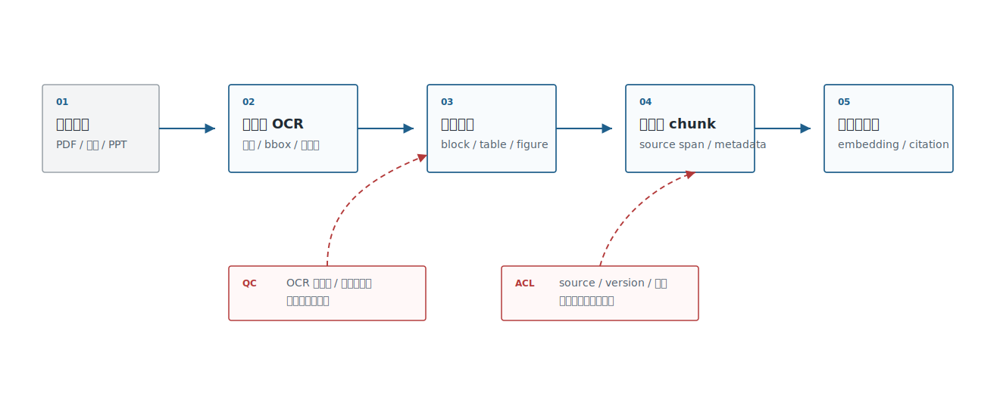
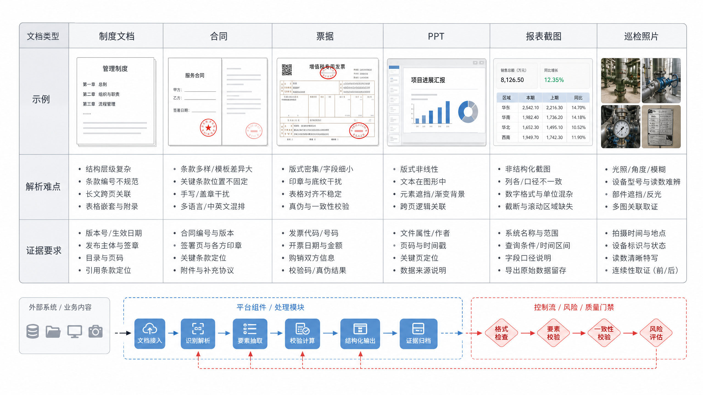

# Ch.19 文档解析与多模态 OCR

> **状态**：v0.2 初稿
> **本章目标**：读者读完后，能够设计企业文档解析流水线，区分 OCR、版面解析、结构化抽取和 VLM 解析的边界，并建立解析质量门禁。
> **适合读者**：AI 平台负责人、架构师、数据智能工程师、AI 应用开发者、安全 / 合规负责人。
> **关联章节**：Ch.16 嵌入模型；Ch.18 向量数据库与索引算法；Ch.20 RAG 工程与高级检索。
> **mini-platform 关联**：`mini-platform/core/rag/`、`mini-platform/infra/metadata/`；计划模块 `mini-platform/infra/document_parser/`。

**本章阅读路径**

| 读者 | 建议重点 |
|---|---|
| AI 平台负责人 / CTO | 看哪些文档值得自动解析，哪些必须人工复核，以及解析质量如何影响 RAG 投入回报。 |
| 架构师 | 看 ParsedDocument、页面坐标、表格结构、citation span 和质量门禁。 |
| 数据智能工程师 | 看报表截图、表格、字段口径和 DataAgent 证据链如何从解析结果进入语义层。 |
| AI 应用开发者 | 看工具链取舍、解析对象结构和质量报告字段。 |
| 安全 / 合规负责人 | 看扫描件、合同、票据、截图中的敏感信息、权限继承和低置信人工复核。 |

很多 RAG 失败不是模型不会回答，而是文档从一开始就被解析坏了。合同页眉页脚混进正文，表格被按行打散，扫描件漏掉印章，PDF 的两栏文本顺序错乱，PPT 截图里的指标没有 OCR 出来。向量库和 reranker 无法修复这些底层噪声。企业知识工程要先把“文档变成可检索、可引用、可审计的结构化对象”，再谈 embedding 和 RAG。

## 企业文档解析挑战

企业文档不是纯文本集合。制度、合同、发票、报表、PPT、看板截图、手写巡检单、邮件附件混在一起，格式、权限和证据要求都不一样。unstructured、LlamaParse、PyMuPDF、PaddleOCR、Marker、Nougat、Donut、Qwen-VL 这类工具解决的是不同层的问题，不能简单替换。

文档解析的选型应该从表 19-1 这类失败后果倒推，而不是从工具功能表开始。每一种失败都会沿着 embedding、RAG、DataAgent 和审计链路继续放大。

**表 19-1：企业文档解析的典型失败模式**

| 失败模式 | 表现 | 下游影响 |
|---|---|---|
| 文本顺序错误 | 双栏 PDF、页眉页脚、脚注进入正文 | chunk 语义混乱，RAG 引用错位 |
| 表格结构丢失 | 单元格合并、表头层级、跨页表格被打散 | DataAgent 找不到指标口径，合同金额无法校验 |
| OCR 漏识别 | 印章、手写、低清扫描件、截图字体 | 证据缺失，召回不到关键字段 |
| 版面语义丢失 | 标题、章节、图表、批注没有层级 | 引用缺少页码和区域，无法复核 |
| 权限和来源缺失 | 解析结果没有 source、版本、ACL | 检索越权，审计无法追踪 |

失败模式明确后，平台负责人要按表 19-2 做分流：哪些文档可以自动入库，哪些文档必须复核，哪些能力只适合做候选。

**表 19-2：平台负责人文档解析决策要点**

| 决策问题 | 推荐判断 |
|---|---|
| 是否所有文档都自动解析 | 不建议。制度和手册可自动入库，合同、票据、审计材料要设置质量门禁和复核。 |
| 是否直接用 VLM 解析 | 复杂截图和图表可以引入 VLM，但金额、日期、条款、指标仍要 OCR、规则和结构化校验。 |
| 解析质量如何影响 ROI | 解析错误会放大到 embedding、RAG 和 GraphRAG；先修解析通常比后面调 prompt 更划算。 |
| 安全边界在哪里 | 原文、页面图片、OCR 文本、chunk 和 trace 都可能含敏感信息，ACL 必须从源文档继承。 |
| 最小上线门槛 | chunk 可回到页码和 bbox，表格有结构，低置信区域可复核，解析版本可追踪。 |

文档解析的基本原则是先控制失败后果，再选择自动化程度。否则系统会把解析错误包装成“检索质量差”或“模型幻觉”，排障成本会高很多。回到图 19-1 的 RAG 前置链路，原始文件不能直接进入向量库，必须先经过解析、结构化、质量门禁和权限继承。



**图 19-1：企业文档解析流水线**

同一条流水线落到图 19-2 中的不同文档类型上，还要配置不同解析策略和复核要求。制度文档、合同、票据、看板截图不应该共用同一套固定切分逻辑。



**图 19-2：企业文档类型矩阵**

## 文档结构与版面语义

文档解析要输出的不只是 `text`，还应该输出结构。一个可用的解析结果至少包含页面、区域、标题层级、段落、表格、图片、脚注、页码、坐标和来源版本。RAG 的引用证据最好能回到“第几页、第几个区域、哪个表格单元格”，而不是只回到一段拼接文本。

这些结构需要像表 19-3 那样拆成稳定对象，给后续 chunk、embedding、引用高亮和质量门禁提供统一数据契约。

**表 19-3：解析对象的数据结构**

| 对象 | 必要字段 | 用途 |
|---|---|---|
| Document | `source_id`、`source_version`、`acl`、`file_hash` | 版本、权限、审计 |
| Page | `page_no`、`width`、`height`、`rotation` | 页码引用、坐标换算 |
| Block | `block_type`、`bbox`、`reading_order` | chunk、视觉检索、引用高亮 |
| Table | `rows`、`cols`、`header`、`cell_bbox` | DataAgent、合同、票据 |
| Figure | `caption`、`image_ref`、`ocr_text` | 多模态检索、截图问答 |
| Chunk | `chunk_id`、`text`、`source_span`、`metadata` | embedding 和 RAG |

表里的对象不是为了数据建模好看，而是为了保留可复核路径。如果一个答案引用了合同里的付款条款，系统要能定位到原始 PDF 的页码和区域；如果 DataAgent 使用了报表截图里的指标，系统要能说明 OCR 识别结果来自哪个图表区域。没有这个路径，RAG 就只是把不可验证的文本交给模型。

DataAgent 场景尤其依赖表格和版面。很多指标口径不是写在正文里，而是在报表脚注、表格表头、图例和截图批注中。解析系统如果只输出连续文本，后续 schema linking 会把“销售额”“净销售额”“含税销售额”混在一起；如果能保留单元格、页码、图表标题和字段来源，DataAgent 才能把自然语言问题链接到可信指标。

因此，页面结构不能只在解析器内部短暂存在。图 19-3 中的标题、段落、表格、图表和页码坐标，都会影响后续 chunk、embedding、引用高亮和人工复核。


**图 19-3：PDF 页面结构解析示意**

## 文档解析工具链选型

工具链选型要按文档类型和证据要求来做。PyMuPDF 适合做 PDF 文本、页面和坐标的底层处理；unstructured 适合把多格式文档切成 elements；LlamaParse 适合面向 LLM/RAG 的文档解析服务；PaddleOCR 和 PP-Structure 适合中文 OCR、表格和版面；Marker/Nougat 更偏学术论文、公式和 Markdown 化；VLM 适合处理复杂页面理解和视觉问答，但成本和稳定性要单独评估。

对表 19-4 中这些工具做取舍时，要沿用前面定义的数据契约：工具能不能输出页码、坐标、表格结构、权限继承和低置信标记，比“演示效果好不好”更重要。

**表 19-4：文档解析工具链取舍表**

| 方案 | 优势 | 代价 | 适用场景 | mini-platform 选择 |
|---|---|---|---|---|
| PyMuPDF + 规则 | 可控、轻量、坐标信息清晰 | 复杂版面和 OCR 需要额外组件 | 可复制文本 PDF、内部制度、简单合同 | 默认底层 PDF 适配器 |
| unstructured | 多格式 element 抽取生态成熟 | 输出质量依赖文档类型和策略配置 | 知识库批量导入、格式多样的企业文档 | 作为通用 parser provider |
| LlamaParse | 面向 LLM/RAG 的解析体验好 | SaaS/服务成本、数据出域需要评估 | 快速 PoC、复杂 PDF、表格较多文档 | 作为可选 provider |
| PaddleOCR/PP-Structure | 中文 OCR、版面和表格能力强 | 部署和调参成本较高 | 扫描件、票据、中文表格、图片文档 | 作为私有化 OCR provider |
| VLM 解析 | 能处理截图、图表和复杂视觉语义 | 成本高、可重复性和格式稳定性较弱 | 看板截图、巡检图片、复杂页面理解 | 只进入高价值场景，不做默认解析 |

选型时要做小样本评测，而不是只看工具演示。每类文档抽 30-100 份，评估文本完整率、表格结构、标题层级、页码坐标、OCR 置信度、解析耗时和人工复核比例。解析工具链一旦进入生产，就要像模型一样版本化：parser version、prompt version、OCR model version、layout strategy 都会影响后续索引。

## 多模态 OCR 与 VLM 解析

OCR 把图像中的文字转出来，版面模型识别区域和阅读顺序，VLM 进一步理解页面里的图表、截图和视觉关系。三者不是互斥关系，而是流水线里的不同层。合同金额、票据日期、报表指标这类字段，最好用 OCR+规则+结构化校验；截图问答、缺陷图片相似、复杂页面描述，可以引入 VLM，但要把输出当成候选解释，不要直接当成事实。

表 19-5 的重点是边界，而不是能力排名。OCR、版面模型、VLM 和结构化校验应该协同工作，不能用一个模型替代整条解析流水线。

**表 19-5：OCR、版面模型与 VLM 的边界**

| 能力 | 输入 | 输出 | 适合任务 | 风险 |
|---|---|---|---|---|
| OCR | 图片、扫描页、截图 | 文本和位置 | 发票、合同、截图文字 | 低清、手写、旋转和印章影响大 |
| 版面解析 | PDF 页面、截图 | block、table、figure、reading order | chunk、引用、表格抽取 | 复杂版式容易排序错 |
| VLM 解析 | 图片、页面、图表 | 描述、问答、区域解释 | 看板截图、图表理解、视觉检索 | 成本高，结果可能不稳定 |
| 结构化校验 | OCR/VLM 输出 + 规则 | 字段、置信度、错误标记 | 金额、日期、编号、指标 | 规则维护成本 |

质量门禁也要沿着能力边界设计：文字识别看置信度，版面解析看阅读顺序和坐标，VLM 输出看可复核证据，结构化字段看规则校验结果。

落到图 19-4 的流水线上，VLM 负责补充视觉理解，金额、日期、编号和指标则必须回到可验证字段与规则校验。


**图 19-4：OCR 与 VLM 协作路径**

## 解析流水线与质量门禁

文档解析流水线要有质量门禁。门禁不是为了追求完美，而是为了知道哪些文档可以自动进入索引，哪些需要人工复核，哪些只能作为低置信候选。企业平台可以把每个文档解析成 `parsed_document.json`，再生成 chunk、embedding 和引用索引。

```json
{
  "source_id": "contract-2026-001",
  "parser": "pymupdf+paddleocr",
  "parser_version": "2026-06-baseline",
  "pages": 18,
  "quality": {
    "ocr_confidence_avg": 0.93,
    "table_parse_pass_rate": 0.86,
    "low_confidence_blocks": 7,
    "requires_review": true
  },
  "artifacts": {
    "structured_json": "s3://.../parsed.json",
    "page_images": "s3://.../pages/",
    "chunks": "s3://.../chunks.jsonl"
  }
}
```

质量门禁最终要落成表 19-6 这样的可执行检查项，把“解析是否成功”拆成文本、表格、坐标、权限和低置信区域，而不是只看任务是否跑完。

**表 19-6：解析质量门禁**

| 门禁 | 指标 | 处理策略 |
|---|---|---|
| 文本完整率 | 可复制文本 + OCR 覆盖率 | 低于阈值进入人工复核 |
| 表格结构 | 表头识别、行列一致、跨页表格连接 | 失败时不进入 DataAgent 字段索引 |
| 坐标可追溯 | chunk 能否映射回页码和 bbox | 不可追溯则禁止用于高风险回答 |
| 权限完整性 | source、ACL、版本是否齐全 | 缺失则不写入向量库 |
| 低置信区域 | OCR/VLM 置信度和规则校验失败数 | 标记红色控制流，要求复核 |

mini-platform 后续可以新增 `infra/document_parser/`，输出统一的 `ParsedDocument`。Ch20 的 RAG 不直接吃原始 PDF，而是吃 `ParsedDocument` 产生的 chunk 和 citation spans。这样文档解析、向量索引和答案引用才有清晰边界。

质量门禁的输出也不应该只是一条“解析完成”的任务状态。图 19-5 中的平台团队还要看到低置信区域、表格失败、权限缺失和是否需要人工复核。


**图 19-5：文档解析质量报告**

## 本章小结

文档解析是 RAG 和知识工程的底座。企业不能把 PDF 当纯文本，也不能把 VLM 输出直接当事实。更稳的做法是保留版面结构、页码坐标、表格关系、权限和解析版本，并用质量门禁决定哪些内容能进入索引。

### 关键结论

- RAG 失败经常发生在解析阶段，解析质量要在 embedding 前治理。
- 文档解析输出应包含 page、block、table、figure、chunk 和 citation span。
- OCR、版面解析、VLM 和结构化校验各有边界，不能互相替代。
- 解析结果必须版本化，否则索引重建和引用复核无法追踪。

### 上线检查清单

- [ ] 每个 chunk 是否能回到原始页码和区域？
- [ ] 表格、图片、页眉页脚是否有明确处理策略？
- [ ] OCR/VLM 低置信区域是否进入人工复核？
- [ ] source、ACL、版本和 file hash 是否写入 metadata？
- [ ] 是否有解析质量报告和失败样例？

### 参考资料

- unstructured partitioning: https://docs.unstructured.io/open-source/core-functionality/partitioning
- LlamaParse documentation: https://docs.llamaindex.ai/en/stable/llama_cloud/llama_parse/
- PyMuPDF documentation: https://pymupdf.readthedocs.io/
- PaddleOCR documentation: https://paddlepaddle.github.io/PaddleOCR/
- ColPali paper: https://arxiv.org/abs/2407.01449
