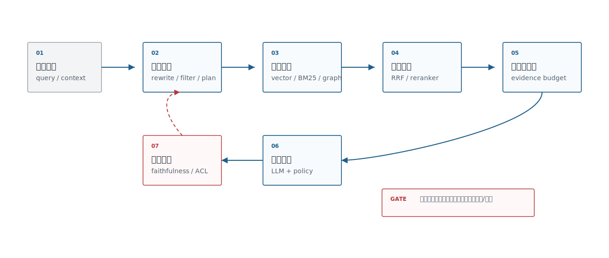
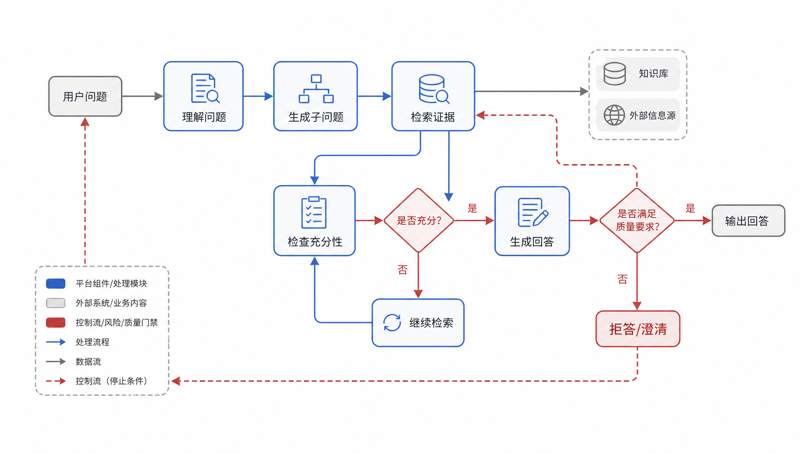
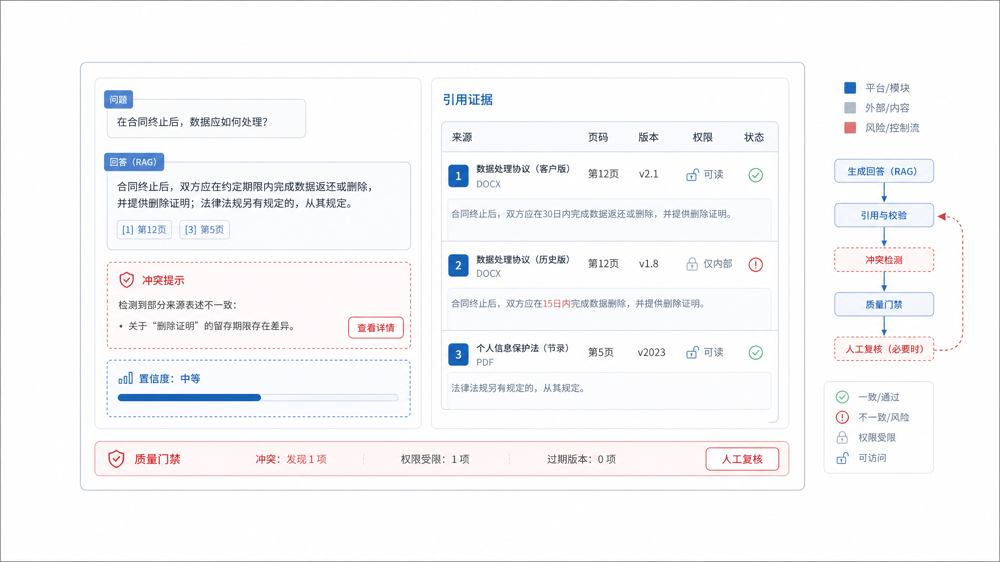

# Ch.20 RAG 工程与高级检索

> **状态**：v0.2 初稿
> **本章目标**：读者读完后，能够设计企业 RAG 检索链路，配置 chunk、混合检索、排序融合、多跳检索和证据溯源，并建立可信回答门禁。
> **适合读者**：AI 平台负责人、架构师、数据智能工程师、AI 应用开发者、安全 / 合规负责人。
> **关联章节**：Ch.16 嵌入模型；Ch.18 向量数据库与索引算法；Ch.19 文档解析与多模态 OCR；Ch.21 知识工程。
> **mini-platform 关联**：`mini-platform/core/rag/`、`mini-platform/core/eval/`。

**本章阅读路径**

| 读者 | 建议重点 |
|---|---|
| AI 平台负责人 / CTO | 看 RAG 是否能作为平台能力复用，以及可信回答的上线门槛。 |
| 架构师 | 看解析、索引、检索、重排、上下文组装、引用校验的接口边界。 |
| 数据智能工程师 | 看 DataAgent 如何把 schema linking、混合检索和证据溯源结合起来。 |
| AI 应用开发者 | 看 chunk 策略、RRF、query rewrite、多跳状态和引用 JSON。 |
| 安全 / 合规负责人 | 看权限过滤、拒答、冲突证据、引用一致性和敏感 trace。 |

RAG 不是“向量库 + prompt”。企业 RAG 是一条证据生产线：把用户问题转成可检索意图，从多种索引里召回候选，做权限过滤、排序融合、上下文组装、引用校验，再把证据交给 LLM。任何一个环节出问题，最终都会表现成“模型胡说”。

## RAG 工程体系

企业 RAG 至少包含六个层次：文档解析、索引构建、查询理解、候选召回、排序与过滤、答案生成与引用。Azure AI Search 的混合检索、LlamaIndex 和 LangChain 的 retriever 组件、Ragas 的评估指标都指向同一个工程结论：生产 RAG 要看端到端检索质量和证据可信度，不能只盯某个 prompt。

本章后面的 chunk、混合检索、多跳和可信回答，都可以先放回图 20-1 的分层链路里定位：文档解析、索引、检索、重排、上下文组装、生成和引用校验分别承担不同责任。



**图 20-1：企业 RAG 工程体系**

有了层次，还要像表 20-1 一样把每层变成工程接口。生产 RAG 的排障通常就是沿着输入、输出和质量风险逐层定位。

**表 20-1：RAG 链路职责分解**

| 环节 | 输入 | 输出 | 质量风险 |
|---|---|---|---|
| 文档解析 | PDF、网页、PPT、图片 | chunk、表格、citation span | 文本顺序错、表格丢失 |
| 索引构建 | chunk、metadata、embedding | 向量索引、关键词索引 | 权限缺失、版本混用 |
| 查询理解 | 用户问题、会话上下文 | query rewrite、filter、子问题 | 改写过度、权限条件丢失 |
| 候选召回 | query、filter、top-k | 文档候选、字段候选 | 召回漏、相似但不可答 |
| 排序融合 | 多路候选 | reranked evidence | 正确证据排序靠后 |
| 生成与引用 | evidence、prompt、policy | 答案、引用、拒答 | 幻觉、引用不支持答案 |

有了链路职责，平台负责人的问题就不是“用哪个 RAG 框架”，而是表 20-2 里的这些判断：哪些环节要做成共享能力，哪些风险必须作为上线门槛。

**表 20-2：平台负责人 RAG 决策要点**

| 决策问题 | 推荐判断 |
|---|---|
| 是否把 RAG 做成平台能力 | 只要多个业务共享文档解析、索引、重排、引用校验，就应平台化；单问答应用可先轻量实现。 |
| 是否只上向量检索 | 企业知识库、DataAgent、合规问答通常不够，编号、字段名、合同条款需要关键词和混合检索。 |
| 是否允许无引用回答 | 高风险场景不允许；普通知识助手也应标记无引用或低置信。 |
| 何时引入多跳检索 | 只有问题天然跨实体、跨文档、跨指标时引入；简单 FAQ 不应复杂化。 |
| 最小上线门槛 | 有权限过滤、引用覆盖、引用一致性检查、拒答策略和失败样例回放。 |

这就是本章后续内容的导航：chunk 解决证据单元，混合检索解决召回，多跳检索解决复杂问题，可信回答解决证据是否支持结论。换成图 20-2 的企业流程语言，RAG 不是一个模型调用，而是一条证据生产线；业务负责人可以沿着这条线检查每个环节是否可观测、可审计、可回放。


**图 20-2：企业 RAG 证据生产线**

## Chunk 策略与上下文组装

Chunk 是 RAG 的基本生产单元。切得太小，语义不完整；切得太大，召回不准、上下文浪费、引用不精确。企业 chunk 策略要从文档结构出发，而不是固定每 500 字切一段。标题层级、表格、FAQ、合同条款、代码块、字段说明都应该有不同策略。

chunk 策略要像表 20-3 一样，在“召回精度、上下文完整性、引用精度”三者之间做取舍。它不是让团队选一个永久策略，而是为不同文档类型建立默认策略和例外策略。

**表 20-3：chunk 策略取舍表**

| 方案 | 优势 | 代价 | 适用场景 | mini-platform 选择 |
|---|---|---|---|---|
| 固定长度 chunk | 实现简单，适合 baseline | 容易切断语义和表格 | 快速 PoC、纯文本文档 | 仅作 baseline |
| 结构化 chunk | 保留标题、段落、表格和页码 | 依赖文档解析质量 | 制度、合同、手册、报告 | 默认策略 |
| Parent-child chunk | 小 chunk 召回，大 parent 提供上下文 | 索引和组装复杂度增加 | 长文档、章节层级清晰文档 | 高价值知识库使用 |
| Small-to-big | 先召回小证据，再扩展邻近上下文 | 需要 source span 和邻接关系 | 需要精确引用又需要上下文的场景 | 作为高级策略 |

策略确定后，工程重点会转向上下文组装：即使召回的是小 chunk，生成答案时也可能需要 parent section、表头或相邻段落。没有 source span 和邻接关系，small-to-big 只会变成临时拼接。

上下文组装要有预算意识。LLM 上下文不是越多越好，混入相似但不可回答的材料会增加幻觉风险。企业系统应把 evidence 分成“直接支持答案”“背景材料”“冲突材料”“不可用材料”，并在 prompt 中明确引用规则：只基于直接证据回答，证据不足时拒答或请求澄清。

图 20-3 画出的正是 chunk 与上下文组装的核心矛盾：召回单元要足够小，生成上下文又要足够完整。small chunk、parent context、citation span 和 token budget 必须一起设计，不能各自优化。


**图 20-3：chunk 与上下文组装示意**

## 混合检索与排序融合

Embedding 擅长语义相似，BM25 擅长关键词和专有名词。企业检索往往需要二者结合。Azure AI Search 的 hybrid search 使用 BM25 和向量检索并行召回，再用 Reciprocal Rank Fusion 融合结果；这类路线适合内部系统，因为字段名、编号、合同条款、产品型号和错误码都可能依赖关键词精确命中。

表 20-4 中检索路线的风险边界也要提前说清。纯向量、纯关键词、RRF 和 reranker 都能工作，但它们失败的方式不同，评测集也要覆盖这些失败方式。

**表 20-4：检索路线对比**

| 路线 | 优势 | 风险 |
|---|---|---|
| 纯向量检索 | 语义召回强，适合口语化问题 | 专有名词、编号、字段名可能漏召回 |
| 纯关键词检索 | 精确词、编号、错误码表现好 | 同义表达和口语化问题召回弱 |
| 混合检索 + RRF | 兼顾语义和关键词，工程解释性较好 | 参数、去重、融合策略需要评估 |
| 混合检索 + reranker | 前排证据质量更好 | 延迟和成本增加 |

在企业知识库里，混合检索更接近默认能力，而不是向量检索效果不好时的补丁。编号、字段名、条款号、错误码需要关键词；口语化问题、同义表达、业务别名需要向量。

RRF 的价值在于简单稳定：不同检索器分数不可比，但排名可以融合。生产系统还要做去重、权限过滤、source diversity 和 query intent 分流。比如 DataAgent 的字段检索应该偏向 schema 文档和历史 SQL，合规问答应该偏向制度和合同，客服问答应该偏向历史工单和 runbook。

DataAgent 的 RAG 不只是回答“文档怎么说”，还要服务 NL2SQL 和分析动作。检索结果里如果包含字段解释、指标口径、样例 SQL、数据质量规则和权限约束，生成 SQL 前就能减少误表、误字段和误口径。这里的可信回答不是一段自然语言，而是“SQL 为什么这样写、引用了哪些口径、哪些字段有权限执行”。

## 查询理解与多跳检索

用户问题经常不是一个检索请求。它可能包含时间范围、权限条件、业务实体、比较关系、隐含指标和多跳依赖。查询理解要把自然语言转成检索计划，而不是随便改写成一个更长的问题。

查询理解最好像表 20-5 一样拆成几种可独立实现的能力。这样做的好处是可以逐项评估：改写有没有引入偏差，filter 有没有丢权限条件，多跳拆解有没有扩大问题范围。

**表 20-5：查询理解能力**

| 能力 | 示例 | 输出 |
|---|---|---|
| Query rewrite | “报销多久到账”改写为“费用报销付款周期” | 改写 query |
| Metadata filter | “华东区今年” | `region=华东`、`year=2026` |
| HyDE | 先生成假想答案再检索 | synthetic document query |
| 多跳拆解 | “合同续约和付款风险一起看” | 子问题 + 合并策略 |
| Schema linking | “高客单门店” | 指标、维度、字段候选 |

这些能力不应全部默认打开。简单 FAQ 可能只需要 query rewrite；DataAgent 通常需要 schema linking；跨合同、客户、风险事件的问题才需要多跳拆解。

多跳检索要有停止条件。系统不能无限拆问题，也不能把所有中间结果塞进上下文。更稳的做法是先生成检索计划，执行每一步后检查证据是否足够；如果缺少关键实体、时间或权限条件，先澄清；如果证据冲突，输出冲突来源而不是强行总结。

多跳检索必须用图 20-4 的状态机思路限制复杂度。每一跳都应有输入、证据检查和停止条件；证据不足时要澄清或拒答，而不是继续扩展上下文。



**图 20-4：多跳检索状态机**

## 可信回答与证据溯源

企业 RAG 的目标是让答案能被证据支持，而不是让回答看起来流畅可信。可信回答至少要满足三件事：引用可定位，答案和引用一致，权限和时间有效。Ragas 这类评估框架把 context precision、context recall、faithfulness 等指标拆开，是因为“检索到了好材料”和“模型忠实使用材料”不是一回事。

可信回答要落成表 20-6 的门禁项，并承接前面的 chunk、检索和查询理解：前面每一步都可能生成证据，最后必须检查证据是否能支撑答案。

**表 20-6：可信回答门禁**

| 门禁 | 检查方式 | 失败处理 |
|---|---|---|
| 引用覆盖 | 每个关键结论是否有 citation | 缺引用则拒答或降级 |
| 引用一致 | 答案是否被引用文本支持 | 标记 hallucination risk |
| 权限有效 | 引用 source 是否对用户可见 | 移除证据并重新生成 |
| 时间有效 | 制度、合同、价格是否仍生效 | 提示版本或请求人工确认 |
| 冲突证据 | 是否存在互相矛盾的材料 | 展示冲突并避免单边结论 |

RAG 评估因此不能只看答案分数。引用覆盖、引用一致、权限有效和冲突证据都需要结构化日志与可回放链路支持。

mini-platform 的 `core/rag/` 可以先实现一个最小接口：`retrieve(query, filters)`、`rerank(query, candidates)`、`assemble_context(candidates, budget)`、`generate_answer(context)`、`verify_citations(answer, context)`。这比一开始接十个 RAG 框架更重要，因为它把平台边界固定下来。

```json
{
  "answer": "出差返回后应在十五个工作日内提交报销申请。",
  "citations": [
    {
      "chunk_id": "travel-policy#p12#c03",
      "page": 12,
      "span": "返回后十五个工作日内提交申请",
      "source_version": "v3"
    }
  ],
  "confidence": "high",
  "fallback": null
}
```

引用校验最终要像图 20-5 一样产品化，而不是停留在后台日志里的一个分数。运营、审计或人工复核界面里应该能看到答案、证据、权限和一致性状态。



**图 20-5：可信回答引用校验界面**

## 本章小结

RAG 工程可以按证据工程来建设。Chunk、混合检索、RRF、reranker、多跳检索和引用校验都服务于同一个目标：让答案建立在可检索、可追踪、可复核的证据上。企业平台要把 RAG 做成链路，而不是把问题直接塞给模型。

### 关键结论

- RAG 不是向量库加 prompt，而是解析、索引、检索、排序、组装、生成和校验的完整链路。
- Chunk 策略要跟文档结构和引用需求绑定，不能只按固定长度切。
- 混合检索适合企业场景，因为专有名词、编号、字段名和语义表达都重要。
- 可信回答要检查引用覆盖、引用一致、权限、时间和冲突证据。

### 上线检查清单

- [ ] 是否有结构化 chunk 和 citation span？
- [ ] 是否同时评估向量、关键词、混合检索和 reranker？
- [ ] 是否有 query rewrite、filter 和多跳检索的日志？
- [ ] 是否能证明答案被引用证据支持？
- [ ] 是否有拒答、澄清和人工复核路径？

### 参考资料

- Azure AI Search Hybrid Search: https://learn.microsoft.com/en-us/azure/search/hybrid-search-overview
- Azure AI Search Reciprocal Rank Fusion: https://learn.microsoft.com/en-us/azure/search/hybrid-search-ranking
- LangChain Parent Document Retriever: https://python.langchain.com/docs/how_to/parent_document_retriever/
- LlamaIndex Query Transformations: https://docs.llamaindex.ai/
- Ragas Metrics: https://docs.ragas.io/
