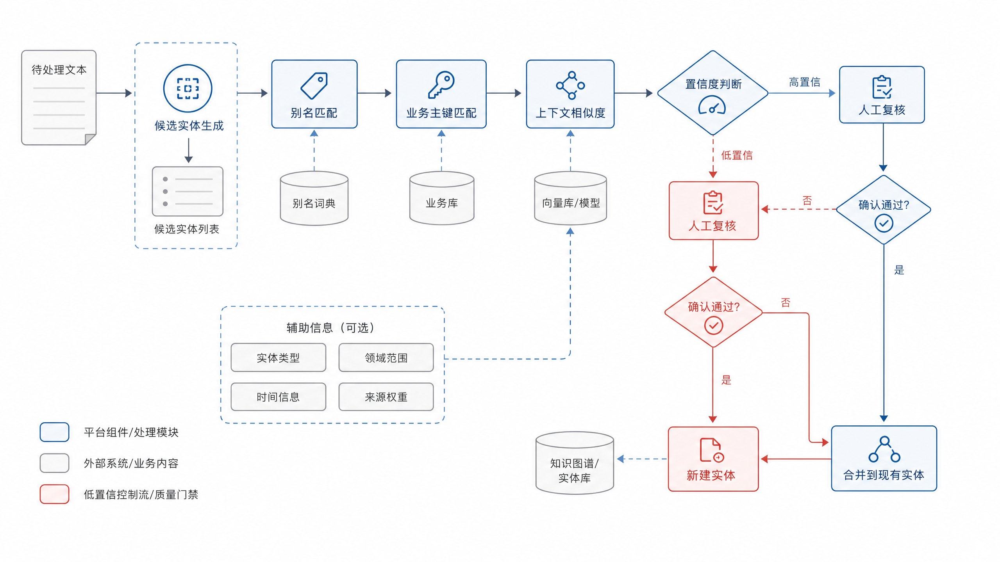
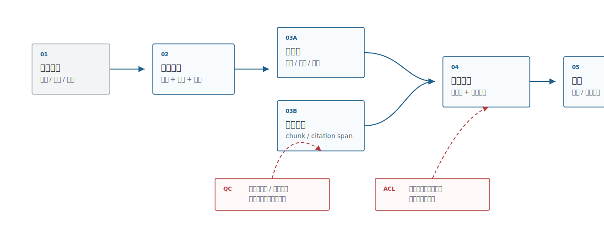

# Ch.21 知识工程：本体、抽取与知识图谱

> **状态**：v0.2 初稿
> **本章目标**：读者读完后，能够解释企业知识工程与 RAG 的边界，设计本体、抽取、实体链接和 GraphRAG 架构，并建立知识资产治理流程。
> **适合读者**：AI 平台负责人、架构师、数据智能工程师、AI 应用开发者、安全 / 合规负责人。
> **关联章节**：Ch.15 元数据、血缘、契约与指标；Ch.20 RAG 工程与高级检索；Ch.33 语义层工程。
> **mini-platform 关联**：`mini-platform/infra/metadata/`、`mini-platform/core/rag/`；计划项目 `mini-platform/projects/14-graphrag-kg-builder/`。

**本章阅读路径**

| 读者 | 建议重点 |
|---|---|
| AI 平台负责人 / CTO | 看知识工程何时值得投入，避免把 GraphRAG 当成 RAG 的默认升级。 |
| 架构师 | 看本体、抽取、实体链接、图数据库、GraphRAG 和证据链边界。 |
| 数据智能工程师 | 看知识图谱如何连接语义层、指标、字段、业务实体和 DataAgent。 |
| AI 应用开发者 | 看事实 JSON、GraphRAG 检索模式和知识资产治理检查项。 |
| 安全 / 合规负责人 | 看事实来源、人工复核、节点/边权限、事实过期和审计追踪。 |

RAG 擅长从文档里找证据，但企业很多问题不是“哪段文字相关”，而是“哪些实体、关系、规则和业务口径共同构成答案”。客户属于哪个集团，合同约束哪些产品，指标依赖哪些字段，事故影响哪些服务，供应商和缺陷批次有什么关联。这些问题需要知识工程：把业务对象、关系、约束和证据沉淀成可治理的知识资产。

## 企业知识工程定位

知识工程不是给 RAG 加一个“知识图谱插件”。它是一套把业务语义显式化的工程方法：本体定义对象和关系，抽取流程从文档和系统中生成事实，实体链接把别名和重复对象对齐，图数据库提供关系查询，GraphRAG 把图结构和文本证据一起交给 LLM。

讨论知识工程时，先要像表 21-1 一样把 RAG、语义层、知识图谱和 GraphRAG 分开，避免把所有“知识增强”都混成一个方案。不同能力处理的对象不同，擅长的问题也不同。

**表 21-1：RAG、语义层与知识图谱的边界**

| 能力 | 主要对象 | 擅长问题 | 不擅长问题 |
|---|---|---|---|
| 文档 RAG | chunk、文档、引用 | “制度怎么说”“合同条款在哪里” | 复杂关系、全局聚合、实体消歧 |
| DataAgent 语义层 | 指标、维度、表字段、SQL | “这个指标怎么计算”“查哪些表” | 非结构化关系和开放文本证据 |
| 知识图谱 | 实体、关系、事件、规则 | “哪些对象相互影响”“关系链是什么” | 无证据文本的开放生成 |
| GraphRAG | 图结构 + 文本证据 | “跨文档、跨实体的综合回答” | 本体和抽取质量差时会放大错误 |

能力边界决定平台投入顺序：普通制度问答不一定需要图谱；DataAgent 的指标口径通常先进入语义层；只有当问题开始依赖实体关系、影响链路和跨文档综合时，知识图谱才成为核心资产。表 21-2 进一步落到平台负责人关心的投入、维护和安全边界上。

**表 21-2：平台负责人知识工程决策要点**

| 决策问题 | 推荐判断 |
|---|---|
| 是否现在做知识图谱 | 当问题涉及实体关系、影响分析、跨文档综合和长期治理时值得做；普通制度问答先用 RAG。 |
| 是否上 GraphRAG | 图谱、本体、抽取质量和证据链稳定后再上；图错时 GraphRAG 会更有说服力地错。 |
| 谁来维护本体 | 必须有业务 owner 和平台 owner，不能只交给算法或单个应用团队。 |
| 安全边界在哪里 | 节点、边、证据和社区摘要都要有权限，不能只给文档做 ACL。 |
| 最小上线门槛 | 每条事实有来源、证据、置信度、抽取器版本、复核状态和生命周期。 |

这些能力边界再往前走，才会变成表 21-2 里的平台投资判断。知识工程不是默认升级路径，只有当业务问题确实需要关系建模和长期治理时才值得做。图 21-1 拆成本体、抽取、实体链接、图存储、GraphRAG 和治理几层后也能看到：GraphRAG 只是消费知识资产的一种方式，前面几层质量不稳，后面的回答会更有结构地出错。


**图 21-1：企业知识工程技术栈**

换成图 21-2 的资产地图视角，企业知识就不再只是文档，还包括客户、合同、指标、字段、服务、风险事件和它们之间的关系。知识工程启动会首先要讨论的，正是这张范围图。


**图 21-2：集团型企业知识资产地图**

## 本体建模与业务语义层

本体是知识工程的骨架。它定义企业关心哪些实体、关系、属性和约束。没有本体，LLM 抽取会变成“每批文档抽出一套不同字段”；没有业务语义层，知识图谱会变成孤立节点集合，无法服务 DataAgent、RAG 和流程自动化。

本体的第一版不追求一次性覆盖所有业务，但要保证表 21-3 中每个实体、关系、属性、约束和证据都有可维护的字段。

**表 21-3：企业本体最小对象**

| 对象 | 示例 | 关键字段 |
|---|---|---|
| Entity Type | 客户、合同、产品、指标、服务、工单、风险事件 | 名称、别名、业务主键、来源系统 |
| Relation Type | 签署、归属、依赖、影响、违反、相似 | 方向、基数、置信度、证据来源 |
| Attribute | 合同金额、客户等级、服务负责人 | 数据类型、单位、有效期 |
| Constraint | 一个合同必须归属一个客户 | 校验规则、异常处理 |
| Evidence | 文档片段、SQL、系统记录、人工标注 | source、page、span、timestamp |

这些对象共同回答一个问题：图谱里的事实为什么可信。如果只有实体和关系，没有证据、约束和来源，GraphRAG 只是把不可验证的文本换成不可验证的图。

本体建模要从业务问题反推，而不是从图数据库语法出发。法务关心合同条款、风险类型和审批意见；运维关心服务、依赖、事故和变更；DataAgent 关心指标、字段、表和口径。每个本体对象都要能回答：谁维护，来自哪里，用在哪些问题，错误会造成什么影响。

DataAgent 需要的知识图谱不一定一开始很大，但要把关键业务对象连起来：指标依赖哪些字段，字段属于哪些表，表来自哪些数据域，指标被哪些报表和业务流程使用，口径变更会影响哪些历史 SQL。这样 DataAgent 在生成查询前可以做影响分析和口径解释，而不是只靠 prompt 记住业务语义。

表 21-4 中的本体建模路线也要承接前面的业务问题反推原则：冷启动可以文档驱动，但长期治理要回到业务对象和关系边界。

**表 21-4：本体建模取舍表**

| 方案 | 优势 | 代价 | 适用场景 | mini-platform 选择 |
|---|---|---|---|---|
| 文档驱动抽取 | 启动快，能覆盖历史文档 | 本体容易漂移，事实一致性弱 | 早期探索、知识库增强 | 作为冷启动输入 |
| 业务对象驱动本体 | 结构稳定，便于治理和权限 | 初期需要业务专家参与 | 合同、客户、指标、服务等核心资产 | 默认路线 |
| 关系优先建模 | 适合依赖分析和影响分析 | 容易忽略属性和证据 | 运维、供应链、风险传播 | 作为场景扩展 |
| OWL/RDF 标准建模 | 语义表达严谨，标准生态完整 | 学习和工程成本更高 | 合规、跨组织数据交换 | 先调研，不作为默认实现 |

对 mini-platform 来说，结论很明确：不应该从完整 OWL/RDF 体系起步，而应该先把业务对象、关系、证据和版本治理做扎实，再按合规或跨组织交换需求引入标准语义技术。

图 21-3 中的本体建模协作方式也要和这个原则一致。schema 不应由算法团队闭门设计，而应由业务 owner、数据 owner、平台团队共同确认对象、关系、约束和证据。


**图 21-3：企业本体建模工作坊白板**

## 信息抽取与实体链接

信息抽取把文本、表格和系统记录转成实体与关系。传统 NER/RE、规则、LLM 抽取、VLM 页面理解都可以参与，但企业系统更关心抽取结果的可验证性。每条事实最好带证据、置信度、来源、抽取器版本和复核状态。

对比表 21-5 中的抽取路线时，重点仍然是可验证性。规则、传统模型、LLM、VLM 和人工审核不是互斥选择，而是按事实风险和文档形态组合使用。

**表 21-5：信息抽取路线**

| 路线 | 优势 | 风险 |
|---|---|---|
| 规则和词典 | 可解释、稳定、成本低 | 覆盖率低，维护成本上升 |
| 传统 NER/RE | 适合固定实体类型和批量文本 | 需要标注数据，跨领域迁移有限 |
| LLM 抽取 | 启动快，能处理复杂语义 | 幻觉、格式漂移、成本和一致性问题 |
| VLM 抽取 | 适合票据、截图、页面布局 | 低置信和视觉误判需要复核 |
| 人工审核 | 高风险事实质量高 | 成本高，吞吐有限 |

这也是后面的事实 JSON 必须保留 `evidence`、`confidence`、`extractor` 和 `review_status` 的原因。没有这些字段，抽取路线再先进也无法进入企业治理。

实体链接是知识图谱能否工作的关键。`阿里云`、`Alibaba Cloud`、`aliyun` 可能是同一供应商；`KA 客户` 和 `战略客户` 在某些业务线同义，在另一些业务线不是。实体链接要结合名称、别名、业务主键、来源系统、上下文和人工确认。不能只靠 embedding 相似度。

```json
{
  "subject": {"type": "Contract", "id": "contract-2026-001"},
  "predicate": "belongs_to",
  "object": {"type": "Customer", "id": "customer-8842"},
  "evidence": {
    "source_id": "contract-2026-001",
    "page": 1,
    "span": "甲方：某集团华东分公司"
  },
  "confidence": 0.91,
  "extractor": "llm-extractor-v2",
  "review_status": "approved"
}
```

图 21-4 中实体链接的关键路径也是如此：名称相似只是候选来源，最终还要结合业务主键、来源系统、上下文证据和人工确认，避免把同名客户、同名产品或相似指标误合并。



**图 21-4：实体链接与消歧流程**

## 图数据库与 GraphRAG 架构

图数据库提供关系存储和查询能力，Neo4j、NebulaGraph 等都可以承载企业知识图谱。GraphRAG 的核心不是“把图谱塞进 prompt”，而是让图结构帮助检索、聚合、路径解释和社区摘要。Microsoft GraphRAG 的思路把文档抽取成图、做社区发现和摘要，再支持 global/local search；Neo4j 的 GraphRAG 生态强调图查询与向量检索结合。这些路线说明，图和向量是互补关系。

GraphRAG 检索要像表 21-6 一样拆成几种模式，团队才能按问题类型选路径。不是所有问题都需要 global search，也不是所有问题都应该先走图查询。

**表 21-6：GraphRAG 检索模式**

| 模式 | 做法 | 适合问题 |
|---|---|---|
| Local search | 从实体出发找邻居、路径和证据 | 某客户、某合同、某服务的局部关系 |
| Global search | 基于社区摘要或全局主题回答 | 跨部门、跨文档、整体趋势问题 |
| Vector + Graph | 向量先找候选实体/文档，再沿图扩展 | 用户问题表达模糊但目标实体可定位 |
| Graph + Text evidence | 图路径给结构，文档 chunk 给证据 | 高风险回答、需要引用的综合问题 |

生产系统通常会组合这些模式：向量先定位候选实体，图谱扩展关系，文本证据提供引用。高风险回答尤其要保留最后一步文本证据，而不能只展示图路径。

GraphRAG 的风险在于“图错了会更有说服力”。一条错误关系如果进入图谱，LLM 可能沿着它生成结构化但错误的解释。因此 GraphRAG 返回结果必须包含事实、证据和置信度，不能只给节点路径。

图 21-5 中的 GraphRAG 链路分为向量召回、图扩展、文本证据和答案生成几步。图路径提供结构，文本 chunk 提供证据，两者都要带权限和版本信息。



**图 21-5：GraphRAG 检索架构**

## 知识资产治理

知识图谱上线后，最大工作不是继续抽取，而是治理。实体会合并和拆分，关系会过期，合同会变更，指标口径会调整，业务术语会改名。知识资产治理要回答：谁拥有本体，谁审核事实，哪些关系可被 Agent 使用，哪些事实过期，哪些答案引用了这条事实。

治理要像表 21-7 一样拆成可检查项，并承接前面所有内容：本体要版本化，事实要有来源，节点和边要有权限，Agent 使用图谱要可追踪。

**表 21-7：知识资产治理检查项**

| 治理项 | 要求 |
|---|---|
| 本体版本 | entity type、relation type、属性和约束可版本化 |
| 事实来源 | 每条事实有 source、evidence、extractor 和 reviewer |
| 权限边界 | 图节点和边继承业务系统 ACL 或单独配置 |
| 生命周期 | 新增、更新、失效、合并、拆分都有审计 |
| 质量评估 | 抽取准确率、链接准确率、冲突率、孤立节点率可观测 |
| Agent 使用 | 哪些工具、RAG 流程和 DataAgent 查询使用了图谱要可追踪 |

工程实践上，Project 14 可以实现一个小型 GraphRAG 知识图谱构建：从合同和客户资料中抽取客户、合同、产品、风险条款，写入图数据库，构建实体到文档 chunk 的引用，再让 RAG 同时返回图路径和文本证据。

```bash
cd mini-platform/projects/14-graphrag-kg-builder
./run.sh --config configs/contracts_graphrag.yaml
```

图 21-6 中 Project 14 的报告也要服务治理，而不是只展示漂亮的节点关系图。它应该同时展示本体版本、抽取质量、实体链接质量、图谱规模、失败样例和 GraphRAG 回答引用。


**图 21-6：GraphRAG 知识图谱构建报告**

## 本章小结

知识工程把企业业务语义从隐含文本和系统字段里显式化。RAG 可以找文档证据，知识图谱可以组织实体关系，GraphRAG 把二者结合起来服务复杂问答和影响分析。难点通常不在图数据库语法，而在本体、抽取、实体链接、证据、权限和生命周期治理。

### 关键结论

- 知识工程不是 RAG 插件，而是业务语义资产化工程。
- 本体要从业务问题反推，不能只从图数据库结构出发。
- LLM 抽取必须带证据、置信度、版本和复核状态。
- GraphRAG 要同时返回图路径和文本证据，避免结构化幻觉。

### 上线检查清单

- [ ] 是否定义了 entity type、relation type、属性和约束？
- [ ] 每条事实是否有证据、来源、抽取器版本和复核状态？
- [ ] 实体链接是否结合业务主键、别名、上下文和人工复核？
- [ ] 图节点和边是否有权限与生命周期？
- [ ] GraphRAG 输出是否包含引用证据，而不只是图路径？

### 参考资料

- Microsoft GraphRAG: https://microsoft.github.io/graphrag/
- Neo4j GraphRAG documentation: https://neo4j.com/docs/neo4j-graphrag-python/current/
- NebulaGraph documentation: https://docs.nebula-graph.io/
- W3C RDF: https://www.w3.org/RDF/
- W3C OWL: https://www.w3.org/OWL/
- DataHub Glossary: https://datahubproject.io/docs/glossary/
