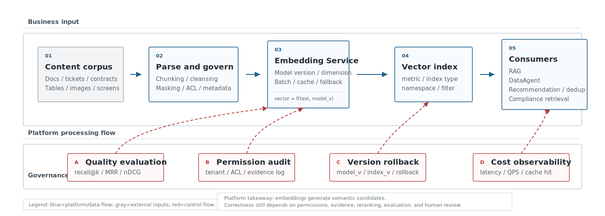
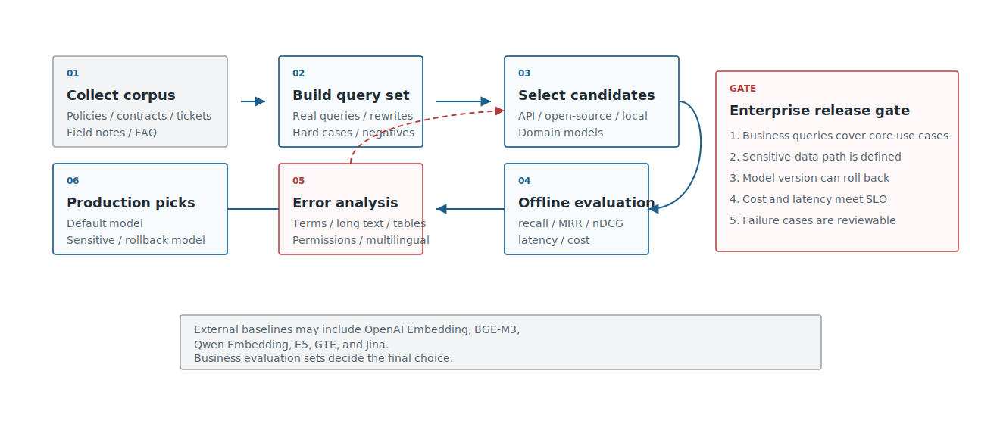
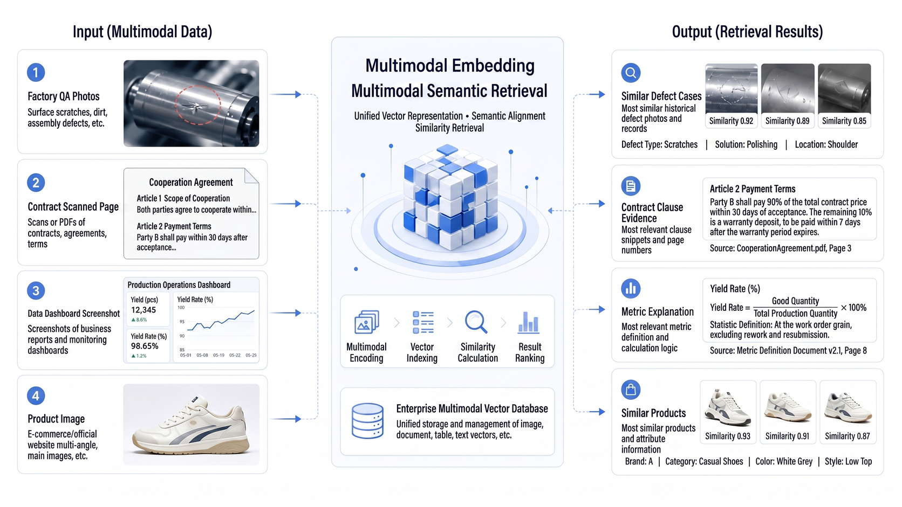

# Chapter 16 Embedding Models

---

When enterprises build RAG, DataAgent, customer-service Agents, or multimodal retrieval, the first instinct is often to choose a vector database. The earlier decision is embedding: which content should become vectors, who generates those vectors, which problems vectors can solve, and which problems must still be handled by keyword retrieval, access control, reranking, or human review.

Major cloud products have already placed embedding inside the infrastructure layer of search and Agent platforms. Azure AI Search puts vector search, hybrid search, and filtered search in one search system. Google Vertex AI Vector Search uses vector indexes to support semantic search, recommendations, and generative AI applications. Amazon Bedrock Knowledge Bases turn document chunking, embedding generation, vector-store writes, and RAG retrieval into a managed workflow. These product paths differ, but they all treat embedding as the middle layer that connects business content to large-model applications, not as a standalone model toy.

Embedding determines whether enterprise knowledge can be recalled accurately. An employee asks, "How long do I have to submit expenses after a trip?" while the policy says, "submit the application within fifteen working days after return." An analyst asks for "high-ticket stores," while the warehouse field may be `avg_order_value_store_segment`. A legal user asks about "auto-renewal risk," while the contract says "renewal clause." These expressions are related to a person, but they may not be close enough in a model's vector space. If an off-the-shelf embedding model does not understand internal terms, field aliases, and metric relationships, relevant material falls lower in the result list, and later RAG, NL2SQL, and report generation inherit the error.

The value of embedding is also easy to overstate. It represents text, code, images, and structured semantics as retrievable vectors, then finds candidate evidence, candidate fields, or candidate images. It does not decide whether a fact is true, whether a user has permission, whether a citation is valid, or whether a business action should run. A similar clause is not a legal conclusion. A similar ticket is not a confirmed root cause. A similar field does not authorize SQL execution. Enterprise platforms should place embedding at candidate recall, then close the loop with metadata filters, rerankers, semantic-layer constraints, rule validation, and human review.

This chapter covers embedding models, vector representation, similarity metrics, multimodal embedding, model selection, and recall evaluation. The engineering question goes beyond which model to call. Teams first need to decide whether the business scenario deserves embedding, which similarity metric and text model fit the risk level, when multimodal retrieval is needed, and how an internal benchmark proves that recall quality is stable.

Many embedding incidents are not caused by low model scores. A policy answer recalls an expired document because the index lacks effective-date filtering. DataAgent chooses the wrong field because field comments omit business aliases. Contract retrieval misses a clause because PDF parsing mixed headers, footers, and body text into one chunk. A customer-service similar-ticket recommendation crosses a permission boundary because the vector index lacks tenant and department metadata. The model is only one part of these incidents; the fix may sit in parsing, permissions, chunking, index versioning, or evaluation samples.

Embedding should therefore be launched from a replayable recall chain, not from a model call. Each retrieval should record query, model version, index version, filter conditions, candidate list, reranker result, final citations, and user feedback. When a business team questions an answer, the platform can then tell whether the candidate was never recalled, recalled but ranked too low, ranked correctly but ignored by generation, or removed by permission filtering. Without that chain, an embedding system becomes a vector database that RAG and DataAgent teams cannot explain.

---

## 16.1 Enterprise Use Cases for Embedding Models

The common enterprise problem is expression mismatch. Employees use conversational questions, policies use formal clauses, analysts use business nicknames, warehouses use field names, and images or screenshots carry information that text fields cannot describe. Without a stable mapping across those forms, RAG, DataAgent, and customer-service Agents fail at the first retrieval step.

Embedding provides semantic candidate generation. It maps natural-language questions, policy fragments, field descriptions, contract clauses, image captions, and screenshots into a searchable representation space. It does not guarantee the answer, but it can first find evidence, fields, cases, or images that may be relevant. In an enterprise knowledge base, embedding recalls policy snippets, FAQs, and citations before the knowledge assistant writes an answer. In customer service, it finds similar faults, root causes, and handling plans before an Agent or routing system makes a decision. DataAgent uses it to recall metric definitions, dimension descriptions, field comments, SQL examples, and business terms before NL2SQL or analysis execution. Legal, compliance, product operations, DevOps, and multimodal inspection follow the same pattern: embedding finds candidates, while later systems apply rules, permissions, citations, and review.

For DataAgent, the first high-value embedding targets are not long documents but semantic layer assets: metric definitions, dimension explanations, field comments, table relations, historic SQL, business terms, and report screenshots. When a user asks "What is the repurchase trend for high ticket stores?" embedding first maps "high ticket" to metric definitions, "store" to dimension, "repurchase trend" to computable fields, then passes this to NL2SQL or analysis agents. Embedding provides candidates; semantic layer and execution engines provide constraints.

From a platform leader's perspective, the next step is risk stratification. Policy Q&A, product manuals, FAQs, and internal wikis are low-risk, high-frequency retrieval paths. They need high recall, low latency, and low cost, and can often start with a commercial API or a lightweight open-source baseline. Tickets, DataAgent schema linking, and DevOps assistance sit in the middle: candidates must be accurate, errors must be analyzable, and results must be replayable, so they need internal evaluation sets, hard negatives, and rerankers. Contracts, finance, legal, and security audits are high-risk compliance scenarios. They require access correctness, evidence sufficiency, auditability, private deployment where needed, field-level permissions, and human review.

This risk boundary matters more than model popularity. The same embedding model may be adequate for employee policy Q&A while serving only as a first-stage recall model in contract review. Enterprise platforms should state the boundary plainly: embedding returns candidates, not facts; similar clauses are not risk judgments; similar tickets are not root-cause confirmations; similar fields are not SQL-execution approvals.

With that boundary in place, platform decisions become practical. Non-sensitive knowledge bases and pilots can use commercial APIs to establish a quality baseline. Sensitive contracts, finance, and HR data should evaluate private deployment early. Fine-tuning should wait until the team has internal query sets and hard negatives; without an evaluation set, tuning results cannot be reproduced. A dedicated embedding platform becomes worthwhile when multiple teams share knowledge bases, DataAgent, customer service, and legal retrieval. A single low-frequency application can start with lighter integration. Multimodal embedding should appear only when receipts, screenshots, inspection photos, dashboards, or scanned pages affect the business chain.

These steps repeat throughout model, vector-store, and evaluation work: identify the business entry point, stratify by error risk, then decide on platform investment and launch criteria. Returning to Figure 16-1's enterprise capability chain, embedding is one segment. It generates semantic representations from business content, but production still needs indexing, permissions, evaluation, and application orchestration.



*Figure 16-1: Enterprise embedding capability chain. Source: original diagram by the authors. Alt text: A horizontal chain runs from document/query input, embedding model encoding, vector indexing, similarity retrieval, to result return. Arrows show raw content becoming searchable after embedding.*

Production teams also need to split "business content" into manageable objects. Policy documents need release versions and effective dates. Field comments need owners and business aliases. Historic SQL needs execution-success records and data domains. Report screenshots need source systems and masking status. The embedding service only encodes these objects; it cannot add governance metadata afterward. The richer the object metadata, the easier it is to constrain vector retrieval by permission, time, tenant, and quality gate. Thin metadata turns search results into a list of candidates that look related but cannot be used.

If Figure 16-1 focuses on a single capability chain, Figure 16-2 shows the platform cross-section. A stable semantic interface layer is required between documents, images, semantic-layer assets, and business applications. Embedding's platform value is primarily here.


*Figure 16-2: Semantic interface layer in enterprise-level Agent platforms. Source: original diagram by the authors. Alt text: The layered diagram shows embedding services as the semantic interface layer, connecting downward to vector databases and document sources, and upward providing unified vectorization and retrieval interfaces for Agents such as RAG and knowledge assistants.*

---

## 16.2 Vector Representations and Similarity Computations

Embedding models output sets of floating-point numbers. For engineering teams, these can be understood as semantic fingerprints: similar content is closer in vector space, dissimilar content is farther away. OpenAI's embeddings docs use them to measure text relevance; Google's embeddings docs describe embeddings as fixed-dimension numerical vectors. Although this sounds simple, it influences index design, version control, access filtering, and online debugging.

Table 16-1 lists the three most common similarity metrics in engineering. The choice is not a matter of math preference. It must stay consistent with model output, normalization strategy, and index creation parameters.

*Table 16-1: Comparison of common vector similarity metrics. Source: compiled by the authors.*

| Metric | Intuition | Typical Use | Engineering Notes |
|---|---|---|---|
| Cosine similarity | Compares vector directions | Text semantic search, similar cases, knowledge QA | Normalize vectors consistently between model service and vector store |
| Dot product | Accounts for direction and length | Supported by many embedding APIs and vector libraries | Mixing different models or normalization strategies breaks results |
| Euclidean distance | Compares geometric distances | Clustering, classical ML, some retrieval tasks | Distance intuition weakens in high-dimensional spaces |

These metrics eventually come down to the short but high-risk pipeline illustrated in Figure 16-3: raw content is encoded to vectors via model service, vector store computes similarity with a unified metric, and candidates are returned. For debugging, verify model version, normalization, metric, and index version consistency along this chain.


*Figure 16-3: Vector generation and similarity computation pipeline. Source: original diagram by the authors. Alt text: The left side shows text tokenized and encoded to a vector; the right side shows query-vector similarity computation with index vectors and sorting.*

If vectors are normalized, cosine similarity and dot product rankings closely align; if not, vector length affects ranking. Enterprise systems should record more than `similarity="cosine"` in code. They should also record whether the model outputs normalized vectors, the metric used during index creation, and whether queries are normalized at runtime. Otherwise, model upgrades or vector-store migrations cause unexplained score shifts.

Several engineering facts should be part of the platform contract:

**Do not mix vectors from different models in the same index.** Vectors from model A and model B lie in different vector spaces. Using old-model document vectors with new-model query vectors degrades performance. Correct practice is to store `model_name`, `model_version`, `dimension`, and `index_version` in index metadata and create a new index or dual-write during upgrades.

**Dimensionality impacts cost.** High-dimensional vectors increase storage, memory, index construction time, and query latency. Cohere embeddings let users adjust output dimension via `output_dimension`, explicitly trading off quality and cost. Open-source models share similar trade-offs; offline quality scores alone are insufficient without throughput, hardware cost, and index size considerations.

**Vector similarity is not answer correctness.** Users querying "How to handle overdue reimbursements?" may get back similar materials like "reimbursement limits" or "approval authorities," which do not directly answer the query. Mature RAG systems combine embedding recall with keyword search, metadata filtering, reranking, and citation verification.

**Access control must be explicitly enforced outside vectors.** The embedding space does not encode who can view which contract, report, or employee record. Tenant, department, role, document state, and effective date must be stored as metadata in the index. Azure AI Search's filtered vector search productizes this pattern: vectors handle similarity, and filter fields handle access boundaries.

A production-grade embedding record must at minimum support auditing, rollback, and rebuilding.

```json
{
  "source_id": "policy-2026-hr-001",
  "chunk_id": "policy-2026-hr-001#p12#c03",
  "content_type": "text",
  "text_hash": "sha256:...",
  "embedding": [0.014, -0.031],
  "model_name": "bge-m3",
  "model_version": "2026-embedding-baseline",
  "dimension": 1024,
  "normalized": true,
  "metric": "cosine",
  "index_version": "kb-hr-v7",
  "metadata": {
    "tenant_id": "tenant-a",
    "department": "hr",
    "acl": ["hr", "finance_manager"],
    "source_version": "v3",
    "effective_at": "2026-01-01",
    "created_at": "2026-06-03"
  }
}
```

This record's value appears when incidents arise. When business teams question a particular answer, the platform team must explain which model, which index version, which document batch, what filters, which chunks were recalled, and which evidence was cited. Without fields like these, embedding systems turn into opaque black boxes that are hard to audit.

Index upgrades should follow the same record. Model-version changes, chunk-strategy changes, normalization changes, and metadata changes all make old and new scores hard to compare. Production systems often need dual-write or shadow indexes: the old index continues serving traffic, the new index is evaluated with the same queries and hard negatives, and traffic shifts only after recall, permissions, and latency meet the gate. Otherwise, a routine model upgrade can make DataAgent field linking, knowledge-base citation, and similar-ticket retrieval drift at the same time.

---

## 16.3 Text Embedding Model Selection

Text embedding selection should not start by picking the "top-ranked" model. Benchmarks like MTEB are valuable because they compare models on unified tasks; but enterprises deploy on their own policies, contracts, products, tickets, field notes, and jargon. Public leaderboards offer candidates, not substitutes for internal evaluation.

The first candidate pool can cover the four routes in Table 16-2. This section compares routes rather than models, because commercial APIs, open-source private deployment, domestic ecosystems, and industry-specialized models have very different organizational constraints.

*Table 16-2: Trade-offs of text embedding model routes. Source: compiled by the authors.*

| Approach | Advantages | Cost | Applicable Scenarios | Mini-platform Choice |
|---|---|---|---|---|
| Commercial APIs (OpenAI Embedding, Cohere Embed, Voyage) | Fast integration, stability, complete docs and SDKs, suitable for initial baseline | Must evaluate data leakage, unit cost, quotas, vendor lock-in, cross-region compliance | Rapid PoCs, non-sensitive KB, multilingual KB, SaaS-first teams | Optional provider for non-sensitive baseline evaluation |
| Open-source general models (BGE-M3, E5, GTE, Jina) | Private deployment, strong control, facilitates long-term platform capability | Requires inference service, model evaluation, resource orchestration, version governance, daily ops | Chinese/multilingual KB, customer tickets, field explanations, long-term platform building | Default private deployment candidate, prioritized in benchmark |
| Domestic ecosystem models (Qwen3 Embedding) | Easier integration into domestic model ecosystems, private cloud, hardware ecosystems | Monitor version updates, inference adaptation, long-text costs, ecosystem maturity | Domestic enterprises, private clouds, strong localization requirements | Domestic candidate, evaluated alongside default private baseline |
| Industry-specific models (finance, healthcare, legal, customer service) | May improve domain terminology, industry expressions, professional corpora recall | Higher migration cost, transparency, licensing boundaries, evaluation cost; generalization requires verification | Terminology-intensive, high-cost errors, established domain corpora | Not default; included only if domain-specific evaluation significantly favors |

The BGE-M3 model card describes multi-lingual, multi-functional, multi-granular capabilities, which makes it a reasonable open-source baseline for Chinese and multilingual enterprise knowledge bases. Qwen3 Embedding describes multilingual support and fits teams already using Qwen LLMs for localized evaluation. OpenAI Embedding's advantages are quick integration, full documentation, and stable service, making it a useful first SaaS baseline. Cohere differentiates queries and documents by input_type, a detail worth codifying: user questions differ from searchable documents, and model services must distinguish these roles.

Once routes are settled, go to Table 16-3's selection criteria, breaking "Is the model strong?" into evaluable questions. Teams can then discuss language coverage, deployment boundaries, cost, and version governance, the factors that affect production use, instead of debating leaderboard ranks.

*Table 16-3: Text embedding model selection dimensions. Source: compiled by the authors.*

| Dimension | Questions to Ask | Impact |
|---|---|---|
| Language & terminology | Are Chinese, English, cross-lingual, industry acronyms, internal slang covered? | Recall quality and hard negative difficulty |
| Text length | Do policies, contracts, field notes, or table transcriptions exceed model effective length? | Chunking strategy and long document recall |
| Deployment | Support for API, private cloud, offline, domestic hardware? | Data compliance, operational cost, deployment cycle |
| Vector dimensions | Vector dimensions, reducibility, normalization? | Storage, memory, index rebuilding, latency |
| Inference performance | Batch size, concurrency, CPU/GPU cost, p95 latency? | Online queries and offline rebuilding speed |
| Ecosystem | Support for rerankers, sentence-transformers, TEI, vector store adapters? | Engineering integration cost |
| Version governance | Controlled model upgrades? Ability to keep old index and rollback? | Online stability |

These dimensions directly shape the first candidate pool. A safer practice is to choose at least one representative model per route and run all candidates on the same internal evaluation set. OpenAI Embedding can serve as a SaaS baseline for non-sensitive knowledge bases. BGE-M3 can serve as an open-source private baseline for Chinese policies, customer tickets, and field notes. Qwen3 Embedding can represent the domestic ecosystem, especially when the surrounding LLM and inference stack already use Qwen. E5, GTE, or Jina can act as control models to avoid single-model bias. The candidate pool is not the final verdict; it ensures that evaluation covers SaaS quality references, long-term private deployment, ecosystem fit, and public-model baselines.

Connecting routes, dimensions, and candidate pool forms the selection process in Figure 16-4. This process is not "pick the strongest model." It filters by business risk and deployment constraints, compares candidates internally, then stratifies conclusions by scenario. This approach discourages "one model for every enterprise use case."



*Figure 16-4: Text embedding model selection process. Source: original diagram by the authors. Alt text: The decision flow starts from language and terminology coverage, data sensitivity, and latency/cost requirements. It filters API or private models and ends with evaluation baselines, showing constraint-based selection.*

Final selection reports should maintain stratified conclusions as in Table 16-4 instead of ending with a single model name.

*Table 16-4: Stratified conclusions in text embedding selection reports. Source: compiled by the authors.*

| Scenario | Recommended Conclusion Wording |
|---|---|
| General knowledge bases | Select models stable in recall and latency, ensure cited evidence appears in top-k first |
| Sensitive data | Prefer private, auditable models with long-term maintainability |
| Terminology-intensive cases | Supplement terminology lists, field notes, hard negatives before deciding on tuning |
| High-risk Q&A | Embedding only serves first-stage recall; must pair with reranker, citation verification, and human review |

Enterprises do not buy semantic search capability by selecting one embedding model. They build a retrieval baseline that keeps evolving. Models update, documents change, and business terms shift. Without internal evaluation sets, today's model-selection conclusion expires quickly.

Internal evaluation sets should evolve with business language. New products, organization changes, metric-definition changes, and contract-template updates can all make old queries and golden documents stale. The platform should keep sampling from failed sessions, manual search logs, DataAgent schema-linking failures, and customer-service escalations, then convert those examples into hard negatives and regression cases. Embedding selection then becomes part of retrieval-quality operations rather than a yearly model-procurement discussion.

---

## 16.4 Multimodal Embeddings and Visual Retrieval

Multimodal embeddings place text, images, screenshots, and scanned pages in a comparable semantic space. CLIP is the classic starting point, showing that images and natural language can align through contrastive learning. SigLIP improved image-text pretraining objectives. ColPali treats pages as visual objects, which suits visually rich document retrieval. Cohere Embed v4 adds image embeddings and adjustable output dimensions, reflecting the enterprise shift from pure text chunks to retrieval that includes text, images, and page layout.

Multimodal embeddings primarily fill gaps in traditional pipelines. When key information lies in page layout, image similarity, or screenshot context, pure text retrieval often falls short. Table 16-5 lists scenarios and launch controls to avoid treating multimodal retrieval as simple image search.

*Table 16-5: Enterprise scenarios and launch controls for multimodal embedding. Source: compiled by the authors.*

| Scenario | Traditional Problem | Role of Multimodal Embedding | Pre-launch Control |
|---|---|---|---|
| Quality & inspection | Defect photos hard to fully describe in text | Use images to find similar defects, supplier batches, historical cases | Image permissions, shooting standards, false positive review |
| Contracts and receipts | OCR extracts text but seals, layout, tables are lost | Find similar clauses, monetary areas, approval markings by page image | Page references, amount verification, manual review |
| Dashboard screenshots | Users submit only screenshots, unknown metric names | Align screenshots with metric descriptions, report docs, field notes | Screenshot desensitization, version recognition, field mapping |
| Product search | Image, title, and comments capture different similarities | Joint image-text recall for similar products, substitutes, duplicates | Category filters, stock and price constraints |
| Equipment maintenance | On-site photos inconsistent with fault descriptions | Find similar equipment states, repair records, runbooks | Equipment permissions, time/location, poor image handling |

Multimodal retrieval cannot replace document parsing. Contract amounts, receipt dates, dashboard metrics still require OCR, table parsing, rule verification, and business system data confirmation. A safer architecture splits the work: OCR and layout parsing produce verifiable, structured content; multimodal embedding generates visual similarity, layout similarity, and text-image related candidates.

Hence multimodal retrieval is better approached as two complementary streams in Figure 16-5: OCR/parsing produces referenceable text and structured fields; multimodal embedding produces visual similarity candidates. Both meet at evidence verification and manual review.


*Figure 16-5: Multimodal retrieval data flow. Source: original diagram by the authors. Alt text: Images and text are separately encoded into a shared vector space for cross-modal retrieval. Arrows show image-to-image and text-to-image search sharing the same vector index.*

Enterprise deployments often fall into two traps. First, directly indexing screenshots, receipts, and inspection photos spreads sensitive fields like customer names, addresses, amounts, and device IDs into the retrieval system. Second, treating visual similarity as business equivalence: two similar defect images do not imply the same root cause; page layout similarity does not imply identical clause risk. Multimodal embedding is better as a candidate generator; final judgments rely on business rules, structured fields, cited evidence, and manual review.

During requirements interviews, ask whether visual evidence like Figure 16-6 affects retrieval and decisions: do screenshots, receipts, inspection photos, or dashboard pages change the outcome? If not, the platform does not need multimodal embedding early.

If visual evidence is needed, the platform should design collection rules first. Inspection photos need equipment IDs, shooting angles, time, and location. Receipt images need masking rules and amount validation. Dashboard screenshots need report versions and metric definitions. Contract scans need page numbers and original-file references. Without this metadata, multimodal embedding can only find content that looks similar; it cannot support responsibility assignment. The launch gate for visual retrieval should include permissions, citations, versions, and human review, the same as text retrieval.



*Figure 16-6: Enterprise multimodal retrieval scenarios. Source: original diagram by the authors. Alt text: The figure lists quality inspection, contract screenshots, product images, and ticket photos, with labels showing the retrieval problems solved by image embeddings.*

---

## 16.5 Enterprise Embedding Model Evaluation Framework

Enterprise embedding evaluation is not about ranking models overall but deciding if a business scenario is deployable, costs are acceptable, and failures can be audited. Public benchmarks help filter candidates, but internal query sets are mandatory pre-launch.

Table 16-6 defines five minimal evaluation-set objects. Together, they define what counts as correct retrieval and enable comparison across models, indexes, and filters.

*Table 16-6: Basic objects in embedding evaluation sets. Source: compiled by the authors.*

| Object | Content | Example |
|---|---|---|
| Query | Real user questions, reformulations, colloquial, cross-language | "How soon must expenses be submitted after business travel?" |
| Golden docs | Documents, chunks, field notes, or page areas that should be recalled | `travel-policy#p12#c03` |
| Hard negatives | Semantically close but cannot answer | Reimbursement limit policy, approval authority description |
| Metadata filter | Department, tenant, permissions, time, document status | `department=finance` |
| Judgment | Relevant, partially relevant, irrelevant; whether supports final answer | `relevant / partial / irrelevant` |

Metrics should also be viewed hierarchically as in Table 16-7. Focusing only on recall@10 can mislead because candidates in top-10 are not guaranteed to support final answer citation; quality, latency, cost, and access control must be reported together.

*Table 16-7: Enterprise embedding evaluation metrics. Source: compiled by the authors.*

| Metric | What It Reflects | Suitable Audience |
|---|---|---|
| recall@k | Whether correct evidence is in top-k candidates | Retrieval engineers, architects |
| MRR | Whether correct evidence ranks earlier | Retrieval engineers |
| nDCG | Ordering quality for multiple relevant results | Evaluation managers |
| answer citation hit rate | Whether final answer cites correct evidence | RAG managers, business owners |
| p50/p95 latency | Query latency acceptability | Platform leaders |
| cost/query | Cost per query or per thousand queries | CTO, platform leaders |
| index size / rebuild time | Storage, DR, upgrade costs | Architects, Ops |
| permission violation rate | Whether unauthorized content is recalled | Security, compliance officers |

Evaluation reports should also cover the engineering checkpoints in Table 16-8. The goal is not to write a long audit document. The goal is to let platform owners decide whether the capability can launch and how it rolls back when quality declines.

*Table 16-8: Engineering checkpoints before embedding launch. Source: compiled by the authors.*

| Checkpoint | Confirm | Common Failures |
|---|---|---|
| Access filtering | Queries and recalls filtered by tenant, department, role, doc state | Recall then filter allows unauthorized content leaking to logs/traces |
| Model versions | Document vectors, query vectors, index versions share one model space | Query model upgraded but old index not rebuilt |
| Index rebuilding | Full rebuild, incremental update, failure recovery, rollback plans exist | Chaos in index versions post document updates |
| Cost accounting | Distinguish offline build cost, online query cost, reranker cost | Only embedding unit price watched, ignoring rerank and rebuild |
| Observability | Record query, top-k, filters, cited evidence, latency, model version | Cannot audit when production quality declines |
| Manual review | High-risk scenarios have approval, rejection, appeal interfaces | Contract, finance, compliance Q&A treated as fully automatic conclusions |

This evaluation framework can be solidified as mini-platform Project 13. Currently `mini-platform/infra/vectorstore/__init__.py` is a placeholder. This chapter clarifies inputs, configs, run commands, and report structure for subsequent demos.

```text
mini-platform/projects/13-embedding-vector-benchmark/
├── README.md
├── requirements.txt
├── run.sh
├── data/
│   ├── docs/
│   │   ├── travel-policy.md
│   │   ├── reimbursement-guide.md
│   │   └── product-quality-faq.md
│   └── evals/
│       └── retrieval_queries.jsonl
├── configs/
│   ├── openai.yaml
│   ├── bge_m3.yaml
│   └── qwen3_embedding.yaml
├── reports/
│   └── embedding_benchmark.md
└── src/
    ├── embed.py
    ├── index.py
    ├── retrieve.py
    └── evaluate.py
```

Sample evaluation queries can be like:

```json
{
  "query_id": "q-001",
  "query": "How soon must expenses be submitted after business travel?",
  "golden_chunk_ids": ["travel-policy#p12#c03"],
  "hard_negative_chunk_ids": ["reimbursement-guide#p02#c01"],
  "metadata_filter": {
    "department": "finance"
  },
  "risk_level": "medium"
}
```

Config files should specify model name, dimension, normalization, batch size, index metric, and cost accounting.

```yaml
provider: local
model_name: BAAI/bge-m3
model_version: 2026-embedding-baseline
dimension: 1024
normalized: true
metric: cosine
batch_size: 32
top_k: 10
cost:
  unit: local_gpu_hour
  estimate: manual
index:
  backend: qdrant
  collection: enterprise_policy_benchmark
  version: kb-hr-v7
```

Run command remains simple:

```bash
cd mini-platform/projects/13-embedding-vector-benchmark
./run.sh --config configs/bge_m3.yaml --top-k 10
```

Reports should output scores and failure cases. For enterprises, failure cases are often more useful than averages: they reveal problems in models, chunking, OCR, filtering, field notes, or query reformulation. Figure 16-7's Project 13 dataflow design follows this principle. The same query sets, golden documents, hard negatives, and filters are evaluated across multiple model/index combinations, avoiding a comparison where model A uses one dataset and model B uses another.


*Figure 16-7: Embedding benchmark data flow. Source: original diagram by the authors. Alt text: The evaluation process starts from labeled queries, runs candidate model encoding and retrieval, computes recall@k and latency, and outputs a comparison report. Arrows show multiple models evaluated on the same dataset.*

Upon this dataflow, internal reports fit stratified conclusions like in Table 16-9.

*Table 16-9: Example conclusions from embedding benchmark reports. Source: compiled by the authors.*

| Conclusion | Example |
|---|---|
| Default model | BGE-M3 shows stable recall in Chinese policy Q&A, suitable as private baseline |
| SaaS baseline | OpenAI Embedding has good latency and stability, suitable for quick launch of non-sensitive KB |
| High-risk scenarios | Contracts and finance Q&A must add reranker, citation verification, and manual review |
| Main failure causes | Business terms like "high ticket," "payment terms," "rebates" need terminology lists and hard negatives |
| Next steps | Expand eval sets, add table-type documents and multimodal screenshot retrieval |

Evaluation should not stop post-launch. Every model upgrade, chunk policy change, vector-store migration, or document rebuild should rerun the benchmark and preserve rollback paths to older models and indexes. Enterprise platforms need a mechanism that makes every semantic-retrieval change evaluable, explainable, and reversible, rather than a commitment to one model name.

## 16.8 Quality Operations After Embedding Launch

Embedding quality does not stay stable by itself after launch. Documents update, business terms change, permission policies move, and user phrasing evolves as the product becomes familiar. The platform should treat embedding as an operated retrieval capability, not a one-time model-selection result. Model upgrades, chunk-strategy changes, index rebuilds, and permission-filter changes can all alter recall results.

Quality operations should keep failure cases. User downvotes, manual corrections, wrong citations, and failed SQL field linking should become queries, golden documents, and hard negatives. Without hard negatives, embedding easily ranks materials that are semantically close but wrong for the business. "Rebate" and "discount" may look close in text while belonging to different finance definitions. "East China region" and "eastern warehouse-distribution region" both sound regional but refer to different organizational dimensions.

Permission filtering also belongs in evaluation. Many teams measure recall@k but never check whether top-k contains content the user cannot access. Enterprise retrieval must distinguish pre-filtered recall from recall-then-filter. Pre-filtering is safer but may reduce recall; recall-then-filter can expose sensitive candidates into logs, traces, or model context. High-risk scenarios should first ensure unauthorized content never enters model context, then use rerankers, terminology lists, and query rewriting to improve quality.

Embedding cost also grows after launch. Online query cost, offline rebuild cost, reranker cost, and index storage cost should be tracked separately. If teams look only at the unit price of an embedding API, they underestimate full rebuilds, dual-version operation, and multi-tenant isolation. The cost-governance work in Chapter 41 should include these dimensions so retrieval-quality improvement does not become an unexplained long-term bill.

Evaluation records should carry forward into later version reviews. When a retrieval quality regression occurs, the team should be able to compare model version, chunk strategy, index version, filter policy, query distribution, and failure samples. That evidence prevents vague explanations such as "the model became worse" and points the fix toward parsing, metadata, term dictionaries, hard negatives, reranking, or permissions.

## Chapter Recap

Embedding models decide whether knowledge, documents, and multimodal materials can enter a searchable semantic space. Public leaderboards are useful candidate sources, but enterprise scenarios still need comparison across language coverage, domain terms, vector dimensions, index cost, latency, and private-deployment constraints.

Multimodal embedding fits screenshots, receipts, reports, and layout-heavy material, but it still needs OCR, layout structure, business validation, and citation checks. It should generate candidates rather than replace document parsing or human review.

Benchmarks should compare candidates with the same queries, golden documents, hard negatives, and filter conditions. Model, chunk, index, and vector-store changes must be evaluable, explainable, and reversible. A long-term solution should rest on evaluation sets, evidence chains, and version-migration processes instead of a single model name.

The long-term value of embedding comes from steady operations. Teams need to absorb failure samples, update business terminology, remove expired documents, rebuild indexes, and explain score changes. In the platform roadmap, embedding should be read together with vector stores, knowledge-base governance, RAG, and the DataAgent semantic layer. Model encoding is only the first step; the vector store provides retrieval and filtering, the knowledge base provides source and version control, RAG provides citation and answer generation, and DataAgent links metrics and fields to executable queries. If any layer is thin, users experience it as an Agent finding the wrong material.

Embedding teams therefore cannot stop at model serving. They need to maintain metadata with data-governance teams, business terms and hard negatives with domain experts, recall regression sets with evaluation teams, and permission tests with security teams. Only then can similarity in vector space become trustworthy candidates in business systems.

Recall failure should become a first-class event. Downvotes, rejected citations, manually selected replacement documents, and failed SQL field links should enter the evaluation pool instead of disappearing as one-off session feedback. Accumulating these failures lets the embedding system evolve with business language. The more specific the failure cases are, the clearer the next change to model, index, chunking, metadata, or reranking becomes.

---

## References

- Azure AI Search vector search overview: [https://learn.microsoft.com/en-us/azure/search/vector-search-overview](https://learn.microsoft.com/en-us/azure/search/vector-search-overview)
- Azure AI Search hybrid search overview: [https://learn.microsoft.com/en-us/azure/search/hybrid-search-overview](https://learn.microsoft.com/en-us/azure/search/hybrid-search-overview)
- Google Vertex AI Embeddings APIs overview: [https://cloud.google.com/vertex-ai/generative-ai/docs/embeddings](https://cloud.google.com/vertex-ai/generative-ai/docs/embeddings)
- Google Vertex AI Vector Search overview: [https://cloud.google.com/vertex-ai/docs/vector-search/overview](https://cloud.google.com/vertex-ai/docs/vector-search/overview)
- Amazon Bedrock Knowledge Bases overview: [https://docs.aws.amazon.com/bedrock/latest/userguide/knowledge-base.html](https://docs.aws.amazon.com/bedrock/latest/userguide/knowledge-base.html)
- Amazon Bedrock Knowledge Bases supported models and vector stores: [https://docs.aws.amazon.com/bedrock/latest/userguide/knowledge-base-supported.html](https://docs.aws.amazon.com/bedrock/latest/userguide/knowledge-base-supported.html)
- OpenAI Embeddings guide: [https://platform.openai.com/docs/guides/embeddings](https://platform.openai.com/docs/guides/embeddings)
- BGE-M3 model card: [https://huggingface.co/BAAI/bge-m3](https://huggingface.co/BAAI/bge-m3)
- Qwen3 Embedding model card: [https://huggingface.co/Qwen/Qwen3-Embedding-8B](https://huggingface.co/Qwen/Qwen3-Embedding-8B)
- MTEB leaderboard: [https://huggingface.co/spaces/mteb/leaderboard](https://huggingface.co/spaces/mteb/leaderboard)
- Cohere Embeddings docs: [https://docs.cohere.com/docs/embeddings](https://docs.cohere.com/docs/embeddings)
- Cohere Embed Multimodal v4: [https://docs.cohere.com/changelog/embed-multimodal-v4](https://docs.cohere.com/changelog/embed-multimodal-v4)
- OpenAI CLIP: [https://openai.com/index/clip/](https://openai.com/index/clip/)
- SigLIP paper: [https://arxiv.org/abs/2303.15343](https://arxiv.org/abs/2303.15343)
- ColPali paper: [https://arxiv.org/abs/2407.01449](https://arxiv.org/abs/2407.01449)
