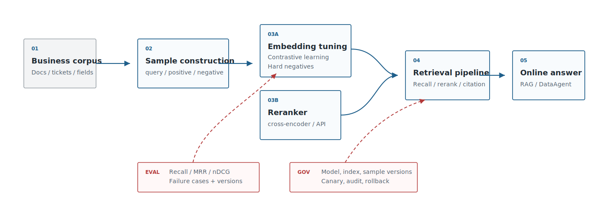
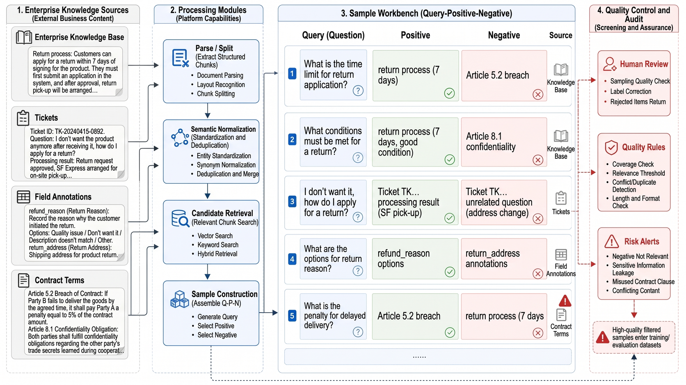
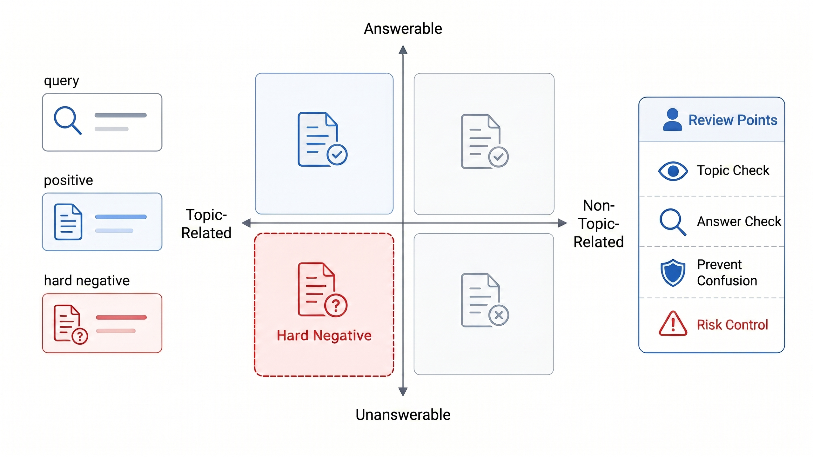
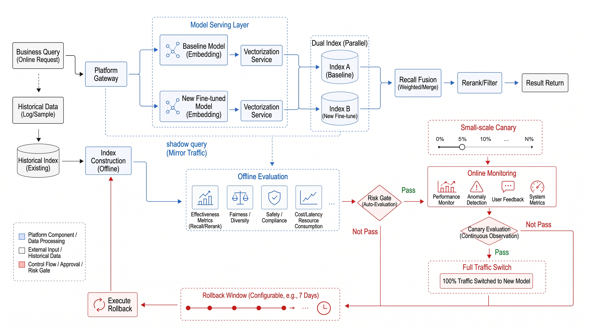
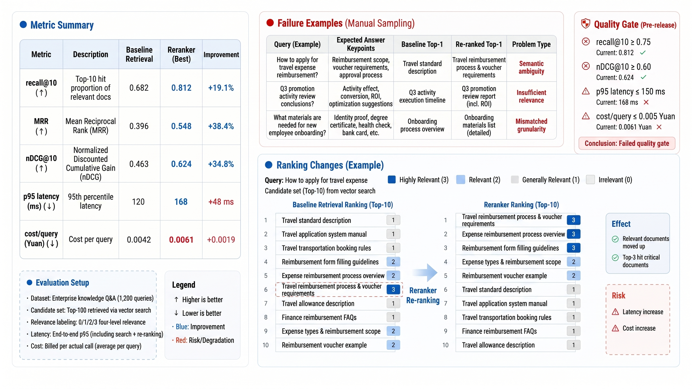

# Chapter 17 Embedding Fine-tuning and Reranking

---

Chapter 16 addressed the first question: choosing a usable embedding baseline. After launch, teams quickly meet the next layer of problems. Public models recall most high-frequency questions, yet fail on internal terminology, field aliases, contract clauses, ticket root causes, and long-tail business expressions. A retail employee may ask about "KA store bad debt risk," while the finance policy uses "major-customer accounts receivable overdue." A business analyst may ask about "group-buying conversion," while the metric platform stores it as `group_buying_paid_ratio`. These expressions point to one another inside the business, but they may not be close enough in a general embedding space.

The failure is often invisible during demos. Demo questions usually come from document titles, FAQs, or field descriptions, so the baseline performs well. Real users bring colloquial phrases, abbreviations, historical names, and system field names. Retrieval then drifts toward materials that look topically related but cannot answer the question. In DataAgent, this is especially dangerous: `customer_level`, `customer_segment`, and `customer_risk_grade` all belong to customer data, but confusing them can generate the wrong SQL path. Legal and compliance retrieval has the same problem. Renewal notices, automatic-renewal clauses, and service-expiration reminders look close but cannot replace one another.

Replacing the embedding model with a larger one may help, but it often postpones diagnosis. Retrieval failure may come from document parsing, chunking, missing field descriptions, permission filtering, query rewrite drift, or a vector space that does not understand enterprise semantics. Training cannot fix the first several categories and can even hide them. Platform teams should first expose failure samples: whether the correct material entered top-k, whether it ranked low, why an incorrect candidate looked similar, and whether permission filtering left enough evidence. Fine-tuning and reranking are worth the cost only when the bottleneck truly sits in semantic matching or ranking.

Embedding fine-tuning and reranking change the engineering shape of the retrieval pipeline. Fine-tuning changes the vector space, which affects index rebuilding, rollback, and online stability. Reranking adds second-stage computation, affecting latency, cost, and interpretability. A training script that runs successfully is only the beginning. The hard part is release: the new model needs a new document index, old and new indexes cannot be mixed, gray release must compare candidate differences for the same queries, and rollback must return to the previous index. Reranking has its own production risks: service timeout, external API data boundary, and too many candidates pushing p95 latency up.

## 17.1 Domain semantic adaptation requirements

Enterprises require domain adaptation not usually because the model "doesn't understand Chinese," but because multiple vocabularies coexist internally. The first vocabulary is business terminology; for example, the sales team may say "strategic customer," while CRM records it as `tier_a_account`. The second vocabulary is system naming; analysts might say "group-buy conversion," whereas the metrics platform uses `group_buying_paid_ratio`. The third vocabulary is frontline expressions; frontline staff may say "page crash," but the development logs capture it as `SIGABRT`. Public embedding models can provide semantically close neighbors but do not know which expressions can be interchanged within the enterprise context and which are only thematically similar.

Therefore, domain adaptation should not start from "training an enterprise model" but rather from identifying where language mismatches occur. When reading Table 17-1, one can assess the triggers, online performance, and priority actions together: Is the issue about supplementing semantic assets, adding samples, or proceeding to training and reranking?

*Table 17-1: Trigger Signals for Domain Semantic Adaptation. Source: Compiled by this book.*

| Trigger Signal               | Typical Manifestation                                                                 | Priority Action                                              |
|-----------------------------|--------------------------------------------------------------------------------------|--------------------------------------------------------------|
| Weak recall of internal terms | User queries and document fields have no overlapping vocabulary; top-k often misses correct chunks | First supplement terminology dictionaries, field annotations, and query rewriting samples |
| Hard negative confusion     | Top-k results often include "seemingly relevant but unanswerable" materials          | Construct query-positive-negative triplets for training or reranking |
| Diverse long-tail business expressions | Customer service, development, and store inputs are very colloquial; public corpora lack sufficient coverage | Sample real logs and historical tickets to build small-scale evaluation sets |
| High evidence requirements in compliance scenarios | Top-k hits are insufficient; correct evidence must rank in the top results          | Prioritize adding a reranker and citation verification, then consider fine-tuning |
| Multilingual or cross-system aliases | Cross occurrences of Chinese-English abbreviations, system fields, and business aliases | Establish alias dictionaries, schema linking samples, and cross-language evaluations |

These trigger signals alone do not directly imply "fine-tuning is required." Platform teams should further classify retrieval errors into four types: not recalled at all, recalled but ranked low, recalled similar but unanswerable materials, and insufficient results after permission filtering. Only the first and some of the second type are suitable for embedding fine-tuning; the third type generally requires rerankers, rules, and evidence verification; the fourth type is a permissions and index governance issue that should not be masked by training. The platform leader's initial decision should also follow the sequence in Table 17-2. This is not about model selection, but about placing "whether training is worthwhile" within error attribution, sample availability, compliance boundaries, and rollback capability.

*Table 17-2: Key Decision Points for Embedding Fine-Tuning and Reranking by Platform Leaders. Source: Compiled by this book.*

| Decision Question              | Recommended Judgment                                                                                   |
|-------------------------------|------------------------------------------------------------------------------------------------------|
| Whether to fine-tune embeddings first | Only fine-tune when errors are stable, samples can be annotated, and baseline reproduction is possible; otherwise, first supplement terminology, field descriptions, and query rewriting |
| Whether to deploy reranker first | If correct evidence is in top-k but ranked low, prioritize adding a reranker as it poses lower risk and rollback cost than altering embedding space |
| Whether to allow external reranker | For non-sensitive knowledge bases, API assessment is possible; contracts, finance, HR, and customer information should prioritize privatization or candidate desensitization |
| Whether to deploy to production  | Must have hard negatives, failure cases, index rollback, model versioning, and candidate logs                                  |
| When to stop investment         | If errors come from document parsing, permission filtering, or chunking, continuing embedding training only masks problems          |

This decision sequence is high-risk: first identify error types, then assess sample sufficiency, and finally decide on fine-tuning vs. reranking. Otherwise, teams can easily misattribute issues from document parsing, permission filtering, or chunking to embedding models. Returning to the retrieval pipeline shown in Figure 17-1, boundaries become clearer: fine-tuning affects the first-stage vector recall, reranking affects candidate sorting, and permissions plus citation verification belong to platform control.



*Figure 17-1: Position of embedding fine-tuning and reranking in the retrieval pipeline. Source: Drawn by this book. Alt text: The retrieval pipeline proceeds sequentially through query encoding, vector recall (handled by embedding model), reranking (handled by reranker), and returns top-k results, showing fine-tuning applies to recall, reranking applies to precision sorting in two distinct stages.*

Once the pipeline boundary is defined, sample governance can no longer be a temporary file beside the training script. Every sample used for fine-tuning or reranking in Figure 17-2 must be traceable to the real query, business scenario, positive and negative samples, permission scope, and review status.



*Figure 17-2: Enterprise semantic adaptation sample workbench. Source: Drawn by this book. Alt text: The interface partitions showing query list, positive samples, hard negative annotation list, annotation progress on the right, and sample quality statistics, demonstrating the manual workflow transforming online logs into training samples.*
## 17.2 Contrastive learning and sample construction

Embedding fine-tuning first requires defining the similarity relationships that matter to the enterprise, instead of simply feeding the model more company documents. The training documentation for sentence-transformers breaks down the model, dataset, loss, training parameters, and evaluator into training components; common retrieval training often uses pairs, triplets, or labeled relevance samples. Enterprises should clarify their sample definitions before discussing training resources.

The sample forms listed in Table 17-3 are not numerous and correspond one-to-one with the error attributions from the previous section: positive sample pairs are needed when recall is low, hard negatives when ranking is confused, multi-level relevance for re-ranking evaluation, and pseudo-labels only when addressing cold starts.

*Table 17-3: Retrieval fine-tuning sample types. Source: compiled by this book.*

| Sample Type        | Example                                  | Suitable Tasks                 | Risks                                       |
|--------------------|------------------------------------------|-------------------------------|---------------------------------------------|
| Positive sample pair | "How long does reimbursement take?" ↔ "Financial payment cycle explanation" | FAQ, policy Q&A, field aliasing | Too easy positive samples may prevent model from learning boundaries |
| Triplets            | query, correct chunk, similar but incorrect chunk | Contracts, tickets, DataAgent schema linking | Poor quality negatives introduce wrong preferences |
| Multi-level relevance | Relevant, partially relevant, irrelevant | Re-ranker training and evaluation | Higher annotation cost, requires consistency checks |
| Pseudo-label samples | Candidates generated by LLM or historical clicks | Cold start, unlabeled scenarios | Must sample for manual review to prevent bias reinforcement |

The more complex the sample type, the more business review is needed. Pseudo-labels help cold start but cannot replace manual judgment; multi-level relevance suits re-ranker training but inconsistent labeling only trains noise into the model. Hard negatives are the most valuable samples for enterprise fine-tuning. They are not random unrelated documents, but materials that "look very similar to the correct answer but are business-wise wrong." For example, reimbursement amount rules are not reimbursement time limits, contract renewal notices are not automatic renewal risks, the field `customer_level` is not `customer_risk_grade`. If negatives are too easy, the model learns only coarse topic distinctions; if negatives are mislabeled, the model distorts the correct prediction path.

Table 17-4 separates the sources of hard negatives because negatives cannot rely solely on batch generation by LLMs. The most reliable negatives usually come from real top-k failure cases, as they directly reveal boundaries the current model confuses.

*Table 17-4: Sources and handling of hard negatives. Source: compiled by this book.*

| Source               | Acquisition Method                                      | Usage Recommendation                         |
|----------------------|--------------------------------------------------------|----------------------------------------------|
| Baseline top-k errors | Retrieval using existing embeddings, manually label visually similar but unusable results | Highest priority, directly from real failure modes |
| BM25 high-score errors | Keyword matches but semantically unsupported documents | Suitable for handling co-word confusion      |
| Similar fields or clauses | Adjacent objects in the same table, contract template, or business process | Suitable for DataAgent and legal scenarios   |
| LLM-generated near-queries | Have LLM rewrite queries, then retrieve confusing items | Only candidate generation, manual review required |

These sources can be combined but with different priorities. Online failure samples come first, then business adjacent objects, and LLM generation only supplements the candidate pool. Otherwise, hard negatives may appear abundant but do not cover the enterprise's real error distribution. Samples must undergo data governance before entering training. Each sample should record at least `query_id`, `positive_id`, `negative_id`, `labeler`, `source`, `scenario`, `acl_scope`, `created_at`, and `review_status`. This may seem cumbersome, but it determines whether model upgrades can explain "why this model ranked a certain field higher."

Special caution is needed for DataAgent hard negatives. Similar field names do not imply interchangeability; `customer_level`, `customer_segment`, and `customer_risk_grade` may all appear under the customer theme, but their business implications, permission boundaries, and SQL computations are completely different. Negatives used for training or re-ranking should include table, field, metric, SQL examples, and business definitions; otherwise, the model may learn the flawed preference of "just similar topic is enough for retrieval."

In annotation meetings, the team needs a working draft like Figure 17-3 that aligns error sources and repair actions. Looking horizontally at error sources and vertically at repair actions allows separating "continue training," "add field description," "fix chunk," and "add permission filtering" discussions-instead of blaming all failures on the embedding model.



*Figure 17-3: Hard negative error analysis matrix. Source: drawn by this book. Alt text: The matrix categorizes hard negatives along dimensions such as "semantically similar but irrelevant" and "textually similar but semantically unrelated," with typical examples in each cell to help locate types of hard negatives.*
## 17.3 Embedding model fine-tuning strategies

Enterprise fine-tuning should start with low-risk approaches. The first step is usually not training, but making the retrieval system diagnosable: fix a batch of real queries, supplement golden documents, mark hard negatives, and record failure reasons. Fine-tuning only makes sense when errors can reproduce stably and the business team can explain "what is correct similarity and what is dangerous similarity." A mature enterprise strategy typically has four stages. Table 17-5 compresses the trade-offs behind these stages into comparable pathways.

The first stage is **Retrieval Baseline and Data Augmentation**. Use the baseline model chosen in Chapter 16 to run internal query sets and break down failure cases according to business scenarios. Many problems are resolved here: if field descriptions are too short, add field explanations; if policy documents lack aliases, add a glossary; if customer service tickets miss root cause tags, add structured tags; if DataAgent cannot find metrics, write metric definitions, historical SQL, and table lineage into the semantic layer. This stage does not change the model, so rollback costs are minimal.

The second stage is **Small-scale Supervised Contrastive Learning**. When the team has several hundred to thousands of stable samples, they can use ecosystems like sentence-transformers for pair, triplet, or ranking loss training. Training samples should not be large but must cover the most common business confusions: same topic but different measurement standards, same field but different meanings, same contract but different clauses, same fault but different root causes. After training, document vectors must be re-encoded and a new index rebuilt; new query vectors cannot be searched on the old index.

The third stage is **Scenario-specific Adaptation and Version Governance**. If the enterprise already has a private embedding model service, it can further evaluate LoRA, adapters, or continued pretraining for lightweight adaptation. But this step requires great restraint: it increases complexity in model release, inference services, vector rebuilding, A/B testing, and security audits. Only when high-value scenarios such as customer service, legal, or DataAgent schema linking clearly benefit long-term is it worth entering maintenance.

The fourth stage is **Joint Optimization with Reranker and Retrieval Strategies**. Fine-tuning addresses "whether candidates enter" and "whether the vector space better understands business boundaries"; rerankers address "who ranks higher after candidates enter." If correct materials are already in the top 50 but ranked low, adding a reranker is often more stable; if correct materials rarely enter the top-k, consider embedding fine-tuning. Enterprise launch reviews should consider combined performance, more than training loss. Table 17-5 further compares the advantages, costs, and applicable boundaries of these routes.

*Table 17-5: Trade-offs of Embedding Fine-tuning Approaches. Source: compiled in this book.*

| Strategy | Advantages | Cost | Applicable Scenarios | mini-platform Preference |
|---|---|---|---|---|
| No fine-tuning; only supplement query rewriting, glossaries, and metadata | Low risk, fast deployment, no need to rebuild model capabilities | Limited improvement on deep semantic confusions | Baseline just established, errors mainly from missing corpus or insufficient field description | Default stage one, first establish reproducible evaluation set |
| Use sentence-transformers for small-scale contrastive learning | Mature engineering ecosystem, suitable for pairs/triplets and hard negatives | Requires sample curation, training environment, and index rebuilding | Stable error samples in internal terms, service tickets, schema linking | Experimental route, not directly production default |
| Use LoRA/adapter for lightweight adaptation | Relatively controllable training cost, convenient for versioning | Deployment complexity higher than pure embedding baseline | Teams with private models and inference platform foundation | Subsequent extension, not implemented in this chapter |
| No embedding change; introduce reranker | Does not change vector space, simple rollback, often significantly improves top ranking | Increases two-stage latency and cost | Correct evidence already in top-k but ranked low | mini-platform prioritizes implementing reranker slot |

Fine-tuning strategies must have clear exit criteria. If recall@10 meets business thresholds after data augmentation, training is unnecessary; if small-scale contrastive learning only improves average scores but worsens high-risk scenarios, it should not be deployed; if introducing a reranker causes p95 latency above interaction requirements, reconsider candidate recall size and model complexity.

The threshold for enterprise fine-tuning deployment should be higher than ordinary model replacement. Model version changes mean document vectors, query vectors, and the index space all change. In production, do not write a new model directly into an old index. A safer process is: offline encode a new index with the new model, run offline evaluation, conduct shadow queries, then low-traffic canary release, finally retain the old index for rollback.

Figure 17-4 places training, index rebuilding, shadow queries, canary rollout, and rollback in a single sequence to remind teams: embedding fine-tuning is not an isolated model team action but a version change across the retrieval platform.



*Figure 17-4: Embedding Fine-tuning Version Canary Workflow. Source: drawn by this book. Alt text: The process from new embedding model small-traffic release, regression evaluation against baseline, gradual ramp-up, to abnormal rollback; arrows indicate volume control based on evaluation results.*

## 17.4 Reranker model placement

The reranker is positioned after retrieval and before answer generation. The first-stage embedding or hybrid retrieval is responsible for selecting dozens to hundreds of candidates from millions of documents; the reranker evaluates the match between the query and each candidate individually, pushing the truly supportive evidence to the top. The sentence-transformers Retrieve & Re-Rank documentation uses a bi-encoder for efficient retrieval and a cross-encoder for reranking; commercial APIs like Cohere Rerank follow the same two-stage paradigm. Table 17-6 separates retrieval, reranking, and pre-answer filtering to avoid misusing the reranker as an access control system or a fix for faulty chunks.

*Table 17-6: Division of Responsibilities Between Retrieval and Reranking. Source: Compiled by the Author.*

| Stage                | Input Scale                     | Model Type                                    | Primary Goal                      | Common Metrics                  |
|----------------------|--------------------------------|-----------------------------------------------|----------------------------------|--------------------------------|
| First-Stage Retrieval | Full documents, fields, tickets | Embedding, BM25, Hybrid Retrieval             | Avoid missing correct candidates | recall@k, latency, filter hit rate |
| Second-Stage Rerank   | Top-50 or top-100 candidates   | Cross-encoder, reranker API, lightweight LLM judge | Rank correct evidence higher     | MRR, nDCG, answer citation hit  |
| Pre-Answer Filtering  | Top-3 to Top-10                | Rules, access control, citation verification  | Prevent invalid evidence from reaching LLM | policy violation, citation coverage |

The reranker should not become a "universal error corrector." If the correct document is missing from the first-stage top-k, reranking cannot fix it; if a chunk is badly segmented, the reranker can only reorder among poor candidates; if access filtering occurs after reranking, the model may have already seen content the user is unauthorized to access. Platform contracts must require access filtering to be configurable between retrieval and reranking, with sensitive scenarios prioritizing pre-filtering. The rerank request itself should also record the query, candidate IDs, model version, and scores.

```json
{
  "query_id": "q-2026-0617-00031",
  "retrieval_index": "policy-kb-v7",
  "retrieval_top_k": 80,
  "reranker": "bge-reranker-large",
  "reranker_version": "2026-06-baseline",
  "candidates": [
    {"chunk_id": "travel-policy#p12#c03", "retrieval_score": 0.74, "rerank_score": 0.91},
    {"chunk_id": "expense-limit#p02#c01", "retrieval_score": 0.78, "rerank_score": 0.21}
  ]
}
```

## 17.5 Annotation evaluation and version governance

Whether fine-tuning and reranking can be deployed depends on the evaluation feedback loop. A usable enterprise evaluation dataset must cover real queries, golden documents, hard negatives, permission filtering, business scenario labels, and failure reasons. The evaluation report should provide an average score and indicate "which scenarios improved, which worsened, and how cost and latency changed." The deployment checklist in Table 17-7 should also revolve around these issues.

*Table 17-7: Deployment Checklist for Embedding Fine-Tuning and Reranking. Source: Compiled by the author.*

| Check Item      | Requirements                                                                 |
|-----------------|------------------------------------------------------------------------------|
| Sample Governance | All training samples have provenance, annotator, review status, and permission scope |
| Offline Quality | Compare recall@k, MRR, nDCG at minimum with baseline, output failure cases    |
| Online Cost     | Observability of reranker p95 latency, QPS, and token/request cost            |
| Version Isolation | Embedding model, reranker, index, and chunk strategy have separate version numbers |
| Rollback Strategy | Keep old models and old indexes until new version stabilizes before decommissioning |
| Data Compliance | Sensitive candidates sent to external rerankers must have explicit approval   |

Mini-platform's Project 13 can extend the embedding benchmark from Chapter 16 into a "Fine-Tuning + Reranking" report: for the same batch of queries, compare four combinations-baseline embedding, fine-tuned embedding, baseline + reranker, and fine-tuned + reranker. The report output should include scores and failure cases and version metadata. This way, the platform lead can determine whether the model is ready for deployment, and engineers can pinpoint whether the next iteration should fix the model, the index, or document parsing.

```bash
cd mini-platform/projects/13-embedding-vector-benchmark
./run.sh --config configs/rerank_benchmark.yaml --top-k 80 --rerank-top-k 10
```

Evaluation reports must not stop at a single metric score. A dashboard like Figure 17-5 presents quality, latency, cost, failure cases, and version information together for different combinations, giving the platform lead a solid basis to decide on deployment, canary release, or rollback.



*Figure 17-5: Reranking evaluation report page. Source: Created by the author. Alt text: The report page displays before-and-after reranking comparisons of recall@k, nDCG, and latency charts along with individual case differences, demonstrating quality improvement and cost trade-offs introduced by reranking.*

## 17.6 Hard negatives and business sample governance

Hard negatives should become a managed dataset instead of a training byproduct. Each sample needs provenance, permission scope, business scenario, annotator, review state, and the retrieval version that exposed the error. This makes it possible to ask whether a new model fixes the same business confusion or merely improves aggregate scores.

For DataAgent, hard negatives often involve field and metric boundaries. `customer_level`, `customer_segment`, and `customer_risk_grade` may all sound close, but they drive different permissions and SQL paths. Samples should therefore include field definitions, source tables, example SQL, and the reason the negative is unsafe. Business reviewers need to approve these distinctions before they enter training or reranking evaluation.

## 17.7 Production boundary for reranker rollout

A reranker should enter production as a versioned service with explicit latency, cost, and privacy limits. The platform must record which candidates were sent to the reranker, which model version scored them, and which scores affected final evidence. For sensitive materials, candidate text may need masking, private deployment, or a rule that reranking happens only after permission filtering.

The rollout boundary is practical: if p95 latency exceeds the interaction budget, reduce the first-stage candidate count, use a lighter reranker, cache repeated query pairs, or restrict reranking to high-risk scenarios. If the correct evidence is absent from the first-stage candidates, reranking is the wrong fix; the team should return to parsing, chunking, indexing, query rewriting, or embedding adaptation.

## 17.8 Evaluation closed loop for embedding fine-tuning

Fine-tuning evaluation should connect offline metrics, online samples, and failure review. A release report should include recall@k, MRR, nDCG, citation hit rate, p95 latency, reranker cost, permission-filter effects, and representative failures. Average improvement is insufficient if legal, finance, HR, or DataAgent schema-linking cases regress.

The closed loop starts with online failure samples, turns them into reviewed positives and hard negatives, runs offline evaluation, performs shadow queries, and then enters canary. After launch, new failures feed the next sample batch. This process prevents training from becoming a one-time model exercise detached from production retrieval behavior.

## 17.9 Coordination with index lifecycle

Embedding fine-tuning changes the vector space, so it must be coordinated with index lifecycle management from Chapter 18. New query vectors should not search an old index, and old document vectors should not mix with new vectors. The safe path is to build a new index, run offline evaluation, compare shadow queries, gradually switch traffic, and keep the old index during the rollback window.

Index lifecycle also affects rollback. If a fine-tuned model underperforms after launch, reverting only the model service is not enough; the platform must also route queries back to the previous index, chunk strategy, and reranker combination. Version numbers should therefore cover embedding model, index, chunk strategy, reranker, and evaluation dataset.

## 17.10 Cost boundary of fine-tuning benefits

Fine-tuning has a cost boundary. Training consumes annotation, compute, review, index rebuilding, canary, monitoring, and rollback effort. If errors come from document parsing, missing metadata, weak permission filters, or unstable chunks, embedding training produces limited value and may hide the real defect. The platform should invest when failures are stable, samples are available, and business value justifies the release burden. For many first-version systems, terminology dictionaries, field descriptions, query rewriting, hybrid retrieval, and reranking provide clearer returns than changing the embedding space. Fine-tuning becomes attractive only after the baseline is measurable and the remaining errors are genuinely semantic.

## 17.11 Production validation and online feedback return

Before fine-tuning or reranking reaches production, the platform needs a validation path. The first step is offline regression: run the same query set across combinations of old embedding, old index, new embedding, new index, old reranker, and new reranker, then compare top-k candidates, citation hits, wrong candidates, and permission-filter effects. The second step is shadow query: copy real online requests into the new path without returning results to users, recording candidate differences and latency changes. The third step is small-traffic canary with low-risk knowledge bases or internal users, while Trace records the important differences between the old path and the new path. Only then should traffic increase by knowledge base, tenant, or task type.

Production validation cannot rely on averages. Contract, finance, HR, and DataAgent schema-linking cases may not tolerate regression even if overall recall improves. The release report should list both improved and worsened samples and explain whether each regression is acceptable. A customer-service FAQ moving from top-8 to top-2 is useful, but a contract renewal clause moving from top-1 to top-7 may block release if the wrong candidate changes legal responsibility. The platform review should allow local rollback: one knowledge base can enable a new reranker while another stays on the old one; low-risk Q&A can use fine-tuned embedding while high-risk contract search remains on baseline plus human review.

Online feedback should return carefully. A user clicking a citation does not prove it is correct, and no click does not prove it is wrong. The platform can collect clicks, copied citations, manual citation edits, downvotes, report-review rejections, and incident samples into a candidate pool, but samples should be reviewed before entering training. The value of feedback return is that the sample pool follows real use, not that the model blindly learns user behavior. If users repeatedly change citations for one field, the field description may be weak or query rewrite may be drifting. If policy answers are often rejected, the system may need document versions and effective dates before it needs more embedding training. When production validation and feedback return are connected, fine-tuning becomes continuous retrieval engineering instead of a one-off training experiment.

## 17.12 Release ledger and ownership

After embedding fine-tuning or reranking goes live, it should enter a retrieval release ledger. The ledger records the embedding model, reranker, index version, chunk strategy, evaluation-set version, rollout scope, rollback window, and business owner. Its purpose is to make retrieval quality changes explainable. When a RAG answer cites the wrong evidence, the platform should be able to reconstruct the vector space, reranker, permission filter, and context-assembly rule that were active at the time. Otherwise teams tend to blame the generation model while the retrieval chain has already changed.

The ledger should also record ownership. The data team owns document source, permission, and deletion events. The knowledge-engineering team owns chunking, index construction, and metadata. The model team owns embedding and reranking. Business teams own labeling and risk acceptance. The platform team owns rollout, Trace, and rollback. With this split, online feedback does not all fall onto the model team. An outdated citation may require a document-version fix. A confusing field explanation may require business wording. Correct evidence ranked too low points more directly to reranking or embedding.

The ledger also limits unnecessary fine-tuning. When quality drops, first check what changed: index rebuild, chunk rule, permission filter, query rewrite, or reranker version. If these changes are not recorded, more training may hide the defect. The first platform version can keep the ledger light, using structured Markdown or configuration files for each release and rollback, then later connect it to the release system. If it can answer what changed, who was affected, and how to return to the previous version, it is already more reliable than scattered release notes.

## 17.13 Replay samples for retrieval changes

Embedding adaptation, reranking, and index cutover all need replay samples. The set should not contain only easy FAQ queries. It should cover field disambiguation, metric definitions, same-name documents, old policy versions, permission boundaries, unanswerable questions, and incident samples. Each sample should preserve the query, expected evidence, hard negatives that must not appear, permission context, business domain, risk level, and the prior online failure reason. When a new embedding model or reranker is released, the team can see which real problems improved and which new risks appeared.

Replay should compare candidate changes alongside final answers. The report should show old top-k, new top-k, order before and after reranking, candidates removed by permission filtering, chunks that entered context, final citations, and answer quality. Moving the correct document from rank eight to rank two is a real gain. Pushing an unauthorized document near the top, even if a later filter blocks it, is still a risk worth recording. Many retrieval incidents live in candidates that almost reached the model, so release review should not inspect only the final context sent to the LLM.

Online feedback should be reviewed before it enters the replay set. Clicks, copies, follow-up questions, and downvotes are signals, not labels. The platform can collect them as candidate samples, then ask business or knowledge-engineering reviewers to identify the cause: outdated document, unclear field description, bad chunking, overly strict permission filter, or weak embedding match. Only reviewed samples should enter evaluation and training. That keeps fine-tuning and reranking pointed at the right failure modes. The replay set will keep changing with the business, so it should be treated as a quality asset for the retrieval platform, not as an attachment to one release.

## 17.14 Vector store migration and index version review

Vector store migration should compare more than retrieval latency and storage cost. In enterprise knowledge chains, vector stores carry index versions, metadata filtering, permission isolation, hybrid retrieval, and recall evidence. If migration only moves vectors, filtering semantics, ranking behavior, or index-building parameters may be lost. Users experience this as unstable Agent retrieval, while the actual cause may be HNSW parameters, sharding policy, metadata types, or rerank interfaces.

Migration review should keep comparison samples for old and new indexes. Each sample should include query, user role, filter condition, top-k documents, scores, rerank result, citation hit, and permission result. If candidates change after migration, the team should decide whether the change is acceptable. If permission-filter order changes, unauthorized documents must not enter model context. If score distribution changes, thresholds and degradation prompts may need adjustment. Vector store migration should enter production only after this comparison.

Index versions also need lifecycle management. New document ingestion, chunk-strategy changes, embedding-model upgrades, and metadata rebuilds should all create index versions. Old indexes should be archived or deleted after parallel operation ends, but only after confirming whether historical reports, Trace, and evaluation samples still need references. Vector store governance aims to make retrieval explainable and replayable while improving speed.

## 17.15 Stop conditions for fine-tuning projects

Embedding fine-tuning projects need explicit stop conditions. Teams often respond to unstable retrieval quality by collecting more samples, training again, and tuning more parameters without asking whether the current knowledge base and task design can support further gains. If document versions are confused, field descriptions are missing, permission filters are wrong, or chunk strategy keeps changing, more fine-tuning only pushes these defects into the vector space. Short-term metrics may improve while long-term debugging becomes harder.

Stop conditions can be defined along three lines. The first is quality: high-risk samples must not regress, core task samples must reach the release threshold, and unanswerable samples must not be forced into false matches. The second is cost: index rebuild, reranking latency, sample maintenance, and rollback cost must be justified by business value. The third is governance: model version, index version, sample version, and permission policy must be recorded and replayable. If any of these conditions is missing, release should pause and return to document governance, sample governance, or product boundary design instead of another training run.

This discipline also protects engineering attention. Embedding models and rerankers are important parts of the retrieval chain, but they are not the answer to every retrieval failure. A failure may come from query rewrite, catalog quality, evidence assembly, permission filtering, or final answer generation. Release review should locate the failing stage first and decide whether fine-tuning is the right intervention. Model work should serve platform quality instead of masking governance gaps.

## 17.16 Release discipline for retrieval experiments

Embedding, reranking, and hybrid retrieval experiments can become complex quickly. Teams try new losses, hard-negative sets, rerankers, RRF weights, and metadata filters. If those experiments cannot be traced back to the online chain, the team ends with higher offline scores and unclear production risk. Every retrieval experiment should record its purpose, sample version, model version, index version, parameters, cost, latency, and representative failures.

Experiment reports should keep counterexamples. Showing only the largest improvements makes reviewers overestimate the benefit. Each report should include samples that improved, samples that worsened, and samples whose scores barely changed but whose business risk is high. High-risk samples include contract clauses, permission boundaries, finance metrics, HR policies, and DataAgent schema linking. If those samples regress, an average nDCG gain should not be enough for release.

Release discipline also requires reproducibility. Training data, negative-sample construction, evaluation scripts, index-building parameters, and reranker configuration need versions. A notebook result is not production evidence. A configuration earns canary eligibility only when the same run can be repeated in CI or a release pipeline. Model and platform teams can then discuss one evidence package instead of defending separate scripts.

Retrieval experiments should have exit records as well. When an experiment is dropped, the team should state why: cost, latency, high-risk regression, unclear permission filtering, or a simpler chunking change providing the same gain. Recording failed experiments prevents the same work from being repeated months later. A mature retrieval platform turns useful experiments into release candidates and stops weak directions early.

## 17.17 Cross-team review of retrieval quality

After embedding fine-tuning and reranking enter production, quality review should not belong only to the model team. A wrong citation may come from document versioning, chunk boundaries, query rewriting, metadata filtering, permission trimming, reranker thresholds, or answer generation. If review looks only at model scores, every defect becomes another training request. A better review decomposes each failed sample across the retrieval chain: whether the user question was rewritten correctly, whether candidate evidence was recalled, whether the right evidence was removed by permission policy, whether reranking changed the order, whether context assembly truncated the evidence, and whether the final answer used the evidence.

Cross-team review needs shared material. Model teams need samples and scores. Knowledge-engineering teams need document versions, chunks, metadata, and index state. Data-governance teams need permission and deletion records. Business owners need to judge whether the evidence matches the business definition. Platform teams need Trace, latency, cost, and rollback records. Each review should produce three kinds of conclusions: samples that require model work, samples that require knowledge-asset repair, and samples that require product-boundary or permission-policy changes. The next improvement cycle can then act on the right layer.

The review cadence should connect to release cadence. Model upgrades, index rebuilds, large knowledge-base updates, permission-policy changes, and DataAgent semantic-layer changes should all trigger retrieval-quality sampling. Low-risk knowledge bases may use monthly review. High-risk contract, finance, compliance, and DataAgent schema-linking workloads should run review after each release. The results should enter replay sets, release ledgers, and business acceptance material, giving the next release an evidence base.

A first platform version can start with a light operating habit. Each week, sample online failures, manually changed citations, returned reports, and incident cases. Label the failing stage and owner. Before each release, replay the latest high-risk samples. After each release, inspect worsened samples and user corrections. This mechanism will not make retrieval perfect at once, but it tells the team which layer should repair each defect. Long-term enterprise retrieval quality comes from this repeated diagnosis and review, not from one fine-tuning score.

## 17.18 Copyright and sensitive-information review for fine-tuning samples

Embedding fine-tuning and reranker training collect queries, document passages, clicks, human labels, and hard negatives. Inside an enterprise, these materials are often treated as ordinary training data, but they may contain customer names, contract text, internal projects, employee information, and copyrighted passages. If samples enter a long-term training set, later models, evaluation, and migration inherit the risk. Retrieval-quality optimization needs sample compliance review.

Review should happen before samples enter the training set. The platform should inspect sample source, authorization scope, masking status, retention period, export scope, and deletion method. User queries can keep semantic intent while removing personal identifiers and sensitive fields. Document passages can keep reference ids and structure labels while limiting raw-text exposure. Human labels should record annotator and allowed use. Samples can then improve quality without spreading sensitive information through training assets.

Sample compliance also affects model migration. If the training set contains passages limited to one tenant, the fine-tuned model should not be shared with other tenants. If samples come from restricted documents, evaluation reports should not be exported freely. If a user requests deletion, the platform needs to know which training samples, evaluation samples, and index versions are affected. Without these records, compliance response becomes hard.

A first version can create data cards for retrieval fine-tuning samples. Each data card records source, scope, masking method, owner, retention period, deletion entry, and sharing level. Retrieval optimization in Chapter 17 then connects to Chapter 50 security governance and Chapter 52 compliance audit, avoiding quality gains built on uncontrolled samples.

## 17.19 Compliance review for fine-tuning samples

Embedding fine-tuning and reranker training bring enterprise samples into model optimization. Samples may contain customer names, contract clauses, internal policies, approval comments, and user queries. Even if the training goal is only better ranking, samples still need compliance review. The platform should confirm source, masking method, authorization scope, retention time, and deletion path. Online failure samples should not flow directly into training sets.

Compliance review should be evaluated together with sample value. Some samples improve retrieval quality but contain sensitive fields, so they can enter training after masking, field substitution, or structural feature extraction. Some samples contain outdated definitions or disputed facts and should not become positive examples. Some samples come from human rulings and can be valuable labels, but they need ruling owner and applicable scope. Training data quality affects both model behavior and later audit.

A first version can give fine-tuning samples admission states: candidate, masked, authorized, trained, deletion required, and retired. Each state records sample source, purpose, data domain, and owner. Embedding fine-tuning then becomes an auditable retrieval-quality process instead of a shortcut around data governance.

## 17.20 Retrieval retesting after embedding fine-tuning

When retrieval retesting after embedding fine-tuning reaches production, the platform needs a shared evidence standard for training samples, negative samples, recall set, online query, permission filtering, index version, and rollback model. This standard is not paperwork for its own sake. It lets business, platform, data, security, and operations teams discuss the same facts. Without this material, incident review depends on memory and personal judgment. With it, the team can see which inputs were valid, which actions executed, which artifacts can still be used, and which results need correction or withdrawal.

This evidence should connect to Chapter 16 on embedding models, Chapter 18 on vector stores, and Chapter 20 on RAG. The upstream chapters provide the capability base, downstream chapters consume the runtime result, and this chapter explains how the middle layer is verified. If a capability looks complete inside one chapter but cannot enter Trace, Eval, release records, or the compliance evidence package, the production system still has a break in the chain. Readers should treat cross-chapter interfaces as engineering contracts, not as a reading order.

Common risks include offline metrics improving while online recall declines, popular queries improving while long-tail queries regress, and permission-filter samples missing after tuning. A successful demo rarely exposes these problems because demo samples are usually clean, short, and direct. Real business traffic brings stale data, abnormal input, permission changes, user withdrawal, budget limits, and long-running state. If the platform does not turn those situations into samples and ledgers, later scenarios will hit the same class of issues again.

Offline metrics improving while online recall declines should be turned into a tracked review item when it appears repeatedly. The operating record should at least state owner, version, sample, affected scope, action, and review time. It does not need to become a long process report, but it must be clear enough for a later maintainer to understand the decision. For high-risk capability, the record should also state which conditions allow wider use and which failures require degradation or withdrawal.

A first version can build this habit in a few representative scenarios. It is better to make high-traffic, high-risk, externally visible paths solid first, then copy the sample, ledger, and review method to related capabilities in other chapters. This makes the chapter read like engineering guidance: it explains how the capability is integrated, validated, operated, and retired.

## Chapter Recap

Embedding fine-tuning is the right tool for addressing stable, labelable, and reproducible domain-specific semantic gaps; reranking is the right tool for improving the quality of top-ranked evidence when the correct candidates have already made it into the top-k. Neither approach should be pursued while bypassing sample governance, access auditing, or version rollback. The standard enterprise platform workflow is: establish a baseline first, use hard negatives to locate the true performance boundary, and then consolidate fine-tuning, reranking, indexing, and chunking strategies into a single evaluation report.

- Before fine-tuning, confirm the error type-failure to recall, low ranking, unavailable candidates, or insufficient access filtering-because each calls for a different fix.
- Hard negatives are a core asset for enterprise retrieval adaptation; they must carry provenance, review records, and version history.
- A reranker is a second-stage ranking component, not an access-control system and not a remedy for poorly constructed chunks.
- A new embedding model requires a fresh index or a dual-write gray release; it must never be mixed into an existing vector space.

- [ ] Do you have an internal query set, golden docs, and hard negatives?
- [ ] Are the fine-tuned model, reranker, index, and chunking strategy each versioned independently?
- [ ] For sensitive scenarios, have you confirmed the reranker's deployment boundary and the risk of data leaving the trust boundary?
- [ ] Are failure cases surfaced in output, instead of only aggregate scores?
- [ ] Is a rollback window maintained for the previous model and previous index?

## References

- Sentence Transformers Training Overview: https://www.sbert.net/docs/sentence_transformer/training_overview.html

- Sentence Transformers Losses: https://www.sbert.net/docs/package_reference/sentence_transformer/losses.html

- Sentence Transformers Retrieve & Re-Rank: https://www.sbert.net/examples/sentence_transformer/applications/retrieve_rerank/README.html

- Cohere Rerank: https://docs.cohere.com/docs/reranking-with-cohere

- BAAI bge-reranker model cards: https://huggingface.co/BAAI
