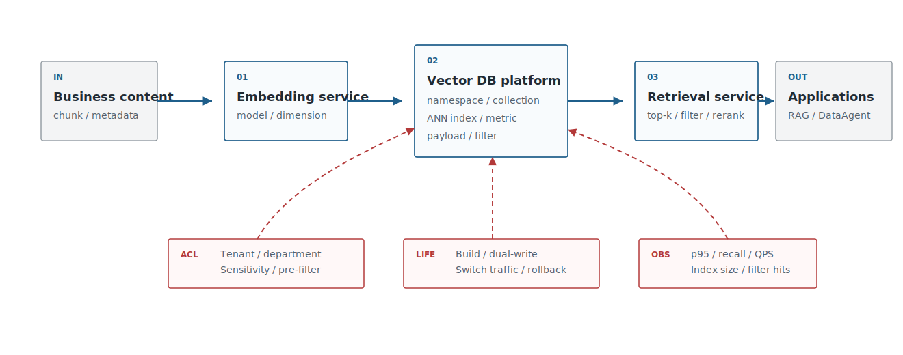
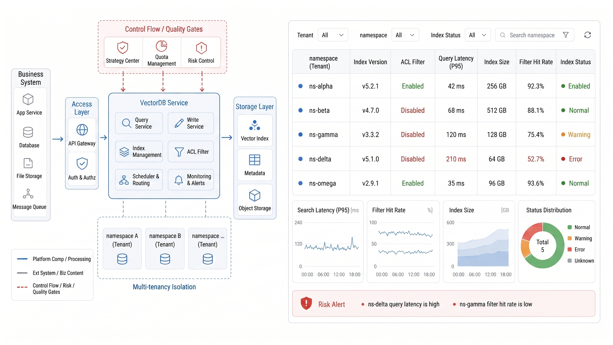
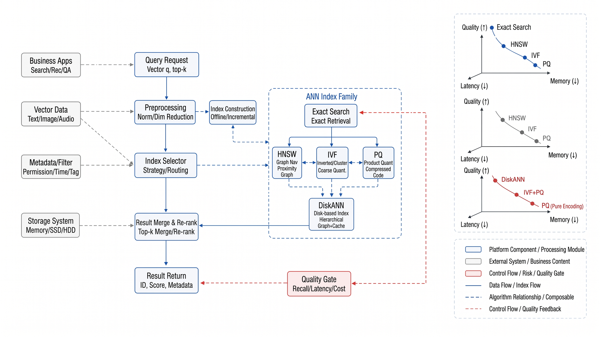
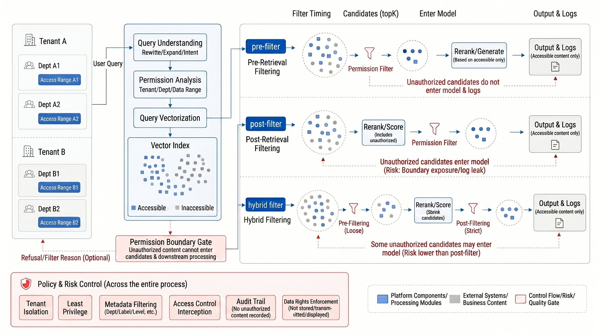
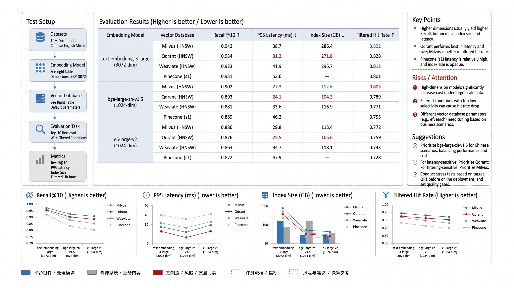

# Chapter 18 Vector Databases and Indexing Algorithms

---

This chapter discusses vector databases and indexing algorithms, focusing on platform boundaries, ANN trade-offs, metadata filtering, multi-tenant permissions, and vector library selection. A vector library is more than a "place to store vectors"; it must simultaneously satisfy fast approximate nearest neighbor search, correct metadata filtering, and multi-tenant access isolation-often these requirements conflict. This chapter reviews trade-offs in ANN indexes such as HNSW and IVF, explains why metadata filtering and permissions must be enforced during retrieval rather than after, and provides criteria for selecting mainstream vector libraries.

Vector databases are not the entirety of RAG, nor are they a replacement for embeddings. They function more like the execution layer for enterprise semantic search: receiving vectors, metadata, and index parameters, and making engineering trade-offs among permissions, latency, recall quality, and cost. If the platform team only asks "Which one to choose: Milvus, Qdrant, pgvector, or Weaviate," they have already skipped over more important questions: How large is the data scale? Does the query require strong filtering? Is multi-tenancy needed? Is transactional consistency required? Can an index rebuilding window be tolerated? Is it necessary to integrate with traditional search?

## 18.1 Positioning of the Vector Store Platform

An enterprise vector store is first and foremost a platform component-not a private cache for a single application. Knowledge bases, customer service, legal, DataAgent, recommendation deduplication, and others may all share embedding services and vector indexing capabilities, but their permissions, update frequencies, and quality targets differ. The platform layer must provide unified write contracts, query contracts, version contracts, and observability metrics.

The vector store requirements for DataAgent differ from those of a typical knowledge base. Fields, metrics, SQL examples, report screenshots, and business terminology often come from different systems, and their update cycles vary. Field-level permissions and tenant isolation need to be enforced through metadata filters. The same business query may simultaneously retrieve results from semantic layers, historical SQL, data quality rules, and metric lineage. Therefore, the DataAgent's vector store is not a "document index," but rather a candidate index for the semantic layer.

If this boundary is not clearly designed, incidents usually do not manifest as "vector store failures" but as harder-to-trace business errors. A common scenario: a policy fragment from a department is written to a shared collection because the metadata lacks a `department_id`. During retrieval, only post-filtering is applied, so unauthorized candidates have already been logged in service traces and logs. Even if the model does not output all content verbatim, those candidate fragments have entered the troubleshooting chain for invisible users. Another scenario: the index lacks binding to an embedding model version. After a model upgrade, new and old vectors mix, causing recall results to skew toward historical samples; DataAgent ends up generating SQL with obsolete fields. The platform's responsibility is to proactively transform these risks into schema, filtering, versioning, and observability constraints.

Before discussing technology selection, it is essential to clearly delineate the vector store's responsibility boundaries as shown in Table 18-1, especially noting what it *is not* responsible for. Without this clarity, teams often mistakenly assign embedding generation, permission systems, answer correctness, and data lineage responsibilities to the vector store.

*Table 18-1: Responsibilities of the vector store within an enterprise platform. Source: Compiled by this book.*

| Responsibility           | Description                                                               | Not Responsible For                     |
|--------------------------|---------------------------------------------------------------------------|---------------------------------------|
| Vector Indexing          | Managing embeddings, metrics, index types, namespaces, versions           | Not responsible for generating embeddings |
| Metadata Filtering       | Filtering by tenant, department, permissions, effective time, document state | Does not replace a unified permissions system |
| Approximate Retrieval    | Balancing latency and recall                                               | Does not guarantee final answer correctness |
| Lifecycle Governance     | Rebuilding, dual writes, gradual rollout, rollback, compression, archiving| Not a substitute for data lineage and auditing |
| Observability & Cost     | Recording QPS, p95 latency, recall, filter hit rates, index size           | Does not explain business semantic errors  |

Once the responsibility boundaries are defined, platform leaders can make technology selection judgments like those in Table 18-2. The focus is on *when to build a shared platform versus when a lightweight solution suffices*, rather than purely comparing database brands.

*Table 18-2: Key considerations for platform leaders deciding on vector stores. Source: Compiled by this book.*

| Decision Question                      | Recommended Approach                                                                                         |
|--------------------------------------|-------------------------------------------------------------------------------------------------------------|
| Use pgvector first or specialized vector store? | Use pgvector for small-to-medium scale with strong SQL/transaction/metadata needs; evaluate Milvus/Qdrant/Vespa for large-scale, multi-business shared use and high QPS. |
| Build a unified vector platform?      | Build when multiple businesses require embeddings, indexing, permissions, evaluation, and rollback; for single-application PoC, platformization is not required initially. |
| Most high-risk security concern?       | Prevent unauthorized candidates from entering the model, logs, or traces; prioritize pre-filtering for high risk scenarios. |
| Most high-risk cost concern?            | Dimension, index type, filtering policy, top-k, and re-ranking affect memory and latency; evaluate jointly. |
| Minimum governance requirements?      | Each index must have model version, chunk strategy, metadata schema, build time, evaluation results, and rollback window. |

Define the platform boundaries first, then translate those boundaries into investment decisions. Without this sequence, teams easily start discussing Milvus versus pgvector without clarifying responsibilities for index versioning, permission filtering, and rollback. Placed in the platform stack shown in Figure 18-1, the vector store's core interface is not "store a vector," but rather controlled retrieval with metadata, permissions, versioning, and metrics.



*Figure 18-1: Position of the vector store within the enterprise Agent platform. Source: Illustration by this book. Alt text: The layered diagram shows the vector store located below embedding services and above RAG and knowledge assistants, storing vectors and metadata while providing retrieval interfaces with permission filtering. It shows its "searchable knowledge storage" responsibility.*

After platformization, these capabilities must also be manageable through operations and governance interfaces as shown in Figure 18-2. If tenant management, collection configuration, index versioning, filtering fields, and observability metrics are scattered across individual application config files, it becomes difficult for the vector store to become a shared platform capability.



*Figure 18-2: Multi-tenant console for enterprise vector store. Source: Product interface screenshot. Alt text: The console interface displays collections grouped by tenant with vector sizes, index types, and permissions configuration, illustrating tenant-level isolation and quota management in the vector store.*
## 18.2 ANN Index Algorithm Taxonomy

The core challenge of vector retrieval is scale. A small number of vectors can be accurately compared for similarity; but when dealing with millions, tens of millions, or billions of vectors, Approximate Nearest Neighbor (ANN) methods must be used, sacrificing some recall for acceptable latency and cost. Systems like Milvus, Qdrant, Weaviate, Vespa, pgvector, etc., expose different index names, but their underlying trade-offs generally revolve around graph indexes, inverted clustering, quantization compression, and disk-based indexes.

When understanding ANN, it is more important to first establish a common algorithmic vocabulary with Table 18-3 than to directly provide a single answer. HNSW, IVF, PQ, disk indexes, and exact search correspond respectively to different trade-offs in memory, construction, recall, and latency.

*Table 18-3: ANN Index Algorithm Taxonomy. Source: Compiled by this book.*

| Algorithm Family | Intuition | Advantages | Costs |
|---|---|---|---|
| HNSW | Build multi-layer proximity graphs, search by traversing the graph | Stable recall and latency performance, mature engineering ecosystem | High memory usage, parameters significantly impact construction |
| IVF | Cluster vectors into buckets, then search within a few buckets | Scalable to large datasets, suitable to use with compression | Requires training clustering centroids, improper parameters cause recall loss |
| PQ/SQ Quantization | Represent approximate vectors with few bits | Saves memory and storage | Score precision decreases, requires re-ranking or exact reranking |
| DiskANN / Disk-based Index | Use disk and cache to support larger indexes | Reduces memory pressure | Latency jitter, more sensitive to hot/cold data and hardware |
| Exact Index | Bruteforce or DB-native exact distance computation | Interpretable results, suitable for small-scale baselines | Not scalable for large data volumes |

Enterprises should not pursue the most complex index on day one. The safest path is to use exact search or HNSW to build a baseline for small-scale data, measure recall@k and p95 latency on internal query sets, then evaluate IVF/PQ, sharding, disk indexes, and hot-cold tiering as scale increases. Index parameters are not a one-time configuration but system variables to tune alongside embedding models, dimension, metadata filtering, top-k, and rerankers.

Internal query sets must come from real tasks, not ad hoc sets of several dozen natural language questions. Vector database recall errors usually surface only on boundary cases: similar field names with different meanings, contract clause numbering closely spaced, overlapping policy versions, user queries with both time and permission constraints. Increasing HNSW's `ef_search` parameter may improve recall but also increase p95 latency and memory. Improper IVF cluster bucket settings may look fine on popular queries but miss recall on long-tail entities. Quantization compression saves cost but may reorder scores for close metrics or similar clauses. These trade-offs cannot be judged by default parameters; they must be validated with labeled query sets and failure case playback.

The real discussion in selection is often not about algorithm names but the trade-offs between recall, memory, build time, and latency. The taxonomy diagram in Figure 18-3 helps teams align on these trade-offs.



*Figure 18-3: ANN Index Algorithm Taxonomy. Source: Drawing by this book. Alt text: A tree-shaped taxonomy divides ANN indexes into graph-based (HNSW), quantization-based (IVF-PQ), tree/hash-based branches; each leaf is labeled with recall, latency, and memory characteristics, showing family relationships among indexes.*
## 18.3 Mainstream Vector Database Technology Selection

The differences among mainstream vector databases go beyond just indexing algorithms. pgvector's advantage lies in its close integration with PostgreSQL data, transactions, and SQL permission management; Milvus is more geared toward large-scale vector infrastructure; Qdrant emphasizes payload/filtering and service-oriented vector search; Weaviate offers schema, vectorization modules, and GraphQL/REST capabilities; Vespa resembles a search and recommendation platform suited for complex ranking; Chroma is better suited for prototyping and lightweight development.

Table 18-4 returns to the comparison of tools based on enterprise constraints, continuing the themes of responsibility boundaries and indexing trade-offs discussed earlier. The focus here is not on "which is best," but on which is better suited to the current scale, permission model, operational capabilities, and stage in mini-platform evolution.

*Table 18-4: Trade-off table of mainstream vector database options. Source: compiled for this book.*

| Solution | Advantages | Costs | Suitable Scenarios | Mini-platform Selection |
|---|---|---|---|---|
| pgvector | Tight integration with PostgreSQL; simple SQL, transactions, permissions, and metadata management | Lags behind specialized vector DBs in ultra-large scale and complex ANN capabilities | Small to medium-sized knowledge bases, DataAgent field search, teams with existing PostgreSQL | Default baseline; suitable for Project 13 startup |
| Milvus | Geared for large-scale vector search; rich index types and distributed capabilities | More complex operational components; higher governance costs | Large-scale knowledge bases, multi-business shared vector platforms | Candidate for benchmarking large-scale |
| Qdrant | Friendly payload filtering and service-oriented API; easy multi-tenant filtering | Requires extra management of consistency between database and business systems | Multi-tenant RAG, scenarios demanding strong permission filtering | Candidate for service-oriented benchmarking |
| Weaviate | Comprehensive schema, modular vectorization, and search APIs | Needs evaluation for integration with existing data platforms | Rapid semantic search and knowledge applications | Candidate for product-level research |
| Vespa | Strong expressiveness in search, recommendation, and ranking | High learning curve and deployment complexity | Large-scale search/recommendation, complex sorting, multi-stage ranking | Candidate as an advanced search platform |

When choosing, don't just ask "Does it support HNSW?" More important considerations include: where metadata filtering happens relative to ANN search and whether filtering severely reduces recall; whether index rebuilding can happen without downtime; tenant isolation at namespace, collection, partition, or business field level; whether backup and restore cover both vectors and metadata; and if query logs can be traced to users, index versions, and candidate lists.

For enterprise platforms, there is no fixed answer between lightweight solutions and specialized vector databases. In early stages, if data volume is modest and the team already has PostgreSQL operational experience, pgvector often enables faster unification of transactions, permissions, and backups into one system. Specialized vector databases begin to show advantages only when index scale, write throughput, multi-business isolation, and rebuild windows become major bottlenecks. Selection evaluation should require candidate solutions to run the same data batch, the same query batch, the same filter set, and the same rollback process-more than compare their respective best demos.
## 18.4 Metadata Filtering and Multi-Tenant Permissions

Metadata in vector databases is one of the key security boundaries for enterprise search. The Qdrant documentation places filtering within the vector search concept, and Azure AI Search supports combining vector search with filtering. This indicates that enterprise search cannot rely only on "nearest similarity." The same query should return different candidates depending on the user, department, tenant, or time.

Metadata design can be extended, but the minimal field set in Table 18-5 must include tenant, permissions, source, version, and index governance information; otherwise, the vector database quickly becomes an un-auditable shared cache.

*Table 18-5: Metadata field design. Source: Compiled for this book.*

| Field            | Purpose                          | Example       |
|------------------|---------------------------------|---------------|
| `tenant_id`      | Tenant isolation                | `tenant-a`    |
| `acl`            | Role or department permissions | `finance_manager` |
| `source_type`    | Document, field, ticket, image | `policy`      |
| `source_version` | Document version               | `v3`          |
| `effective_at`   | Effective date filtering       | `2026-01-01`  |
| `index_version`  | Index governance               | `kb-hr-v7`    |

There are three common strategies for permission filtering. Pre-filtering filters candidate sets before vector search, offering strong security, but overly narrow filtering can hurt ANN recall. Post-filtering filters after retrieval, stabilizing recall but risking exposing unauthorized candidates to models or services. Hybrid filtering places hard boundaries such as tenant and classification upfront, while soft conditions like status or time are applied later. In high-risk scenarios, pre-filtering should be prioritized-even if it reduces recall-to avoid candidate leakage.

The key here is not terminology but when the system sees the candidates. If post-filtering is applied only before returning results to the LLM, the application layer may not see unauthorized content, but the retrieval service, reranking service, tracing, error logs, and offline evaluation samples might have already accessed these candidates. In financial, legal, HR, and cross-tenant scenarios, hard boundaries must be incorporated into the retrieval conditions themselves to at least ensure unauthorized vectors do not proceed to subsequent ranking or logging. For soft conditions like status, time, or tags, hybrid filtering can be used based on recall quality, but every query must record exactly which filters were applied to avoid only seeing a final top-k during troubleshooting.

Figure 18-4 illustrates the differences between pre-filter, post-filter, and hybrid filter. It is best for security and platform teams to jointly confirm which boundaries must be enforced during retrieval and which conditions can participate in ranking and filtering after recall.



*Figure 18-4: Metadata filtering and multi-tenant permission boundaries. Source: Drawn for this book. Alt text: Retrieval requests bearing tenant and permission tags enter the vector database, with filtering conditions applied during the ANN search phase (not recalled first then filtered). Arrows indicate unauthorized data is excluded during retrieval.*
## 18.5 Index Lifecycle Management

The index lifecycle is more important than just creating a database. Upgrades to embedding models, changes in chunking strategies, document parsing fixes, permission field updates, and index parameter adjustments all require rebuilding the index. The platform must treat the index as a versioned asset, not a disposable cache.

The index lifecycle should be managed in stages as outlined in Table 18-6. This way, "rebuilding an index" transforms from a one-off maintenance task into an evaluable, gradual, and rollback-capable release process.

*Table 18-6: Index lifecycle stages. Source: Compiled for this book.*

| Stage       | Key Actions                                               | Quality Gate                                   |
|-------------|-----------------------------------------------------------|-----------------------------------------------|
| Build       | Encode documents, write vectors, write metadata, record lineage | Ensure consistency in dimensions, metrics, model versions |
| Offline Evaluation | Test recall, MRR, filter hit rate, latency using query set | No worse than baseline; failed examples must be explainable |
| Dual Write Gray Release | Accept updates on both old and new indexes simultaneously; shadow query comparison | Candidate differences and permission differences are traceable |
| Traffic Switching | Gradually shift from small to full traffic             | Stable p95 latency, error rates, and reference hit rates   |
| Rollback    | Retain old index and old model service                    | Rollback commands and data snapshots are available        |
| Archive     | Decommission old index while retaining audit information  | Query logs and version metadata are traceable              |

This also explains why vector database benchmarks cannot focus solely on query latency. Build time, dual-write cost, traffic shifting risk, and rollback windows are equally important enterprise selection criteria.

Index management must also handle the "data has changed but the index hasn't" gray zone. After permission field changes, chunks in the old index may still carry outdated ACLs; after document parser fixes table errors, old chunks still contain incorrect rows and columns; after embedding model upgrades, candidate rankings for the same query may differ between old and new indexes. Production systems cannot treat these changes merely as user issues or model fluctuations. Instead, source hash, parser version, chunk strategy, embedding model, index parameters, and ACL schema must all be recorded in the index version. This allows the team to pinpoint whether issues stem from document source changes, parsing changes, vector changes, or filtering condition changes.

Currently, the mini-platform's `infra/vectorstore/` is just a placeholder. Moving forward, a unified interface can first be defined with methods like:
`upsert(chunks, embeddings, metadata)`,
`search(query_embedding, filters, top_k)`,
`delete_by_source(source_id)`,
`build_index(index_version)`,
`evaluate(index_version, query_set)`.

The goal is to stabilize the API before adapting backends like pgvector, Qdrant, or Milvus.
## 18.6 Engineering Practice: Embedding Model Fine-tuning + Vector Store Benchmark

Chapter 17 discussed fine-tuning and re-ranking; this chapter combines them with vector stores into a unified benchmark. What enterprises truly care about is the combined effect: whether a certain embedding model paired with a certain index type, under a given metadata filter, can retrieve the correct evidence at an acceptable cost.

```yaml
experiment: vectorstore_benchmark
query_set: data/eval/enterprise_queries.jsonl
models:
  - name: bge-m3-baseline
  - name: bge-m3-finetuned
stores:
  - provider: pgvector
    index: hnsw
  - provider: qdrant
    index: hnsw
metrics:
  quality: [recall@10, mrr@10, ndcg@10]
  system: [p50_latency_ms, p95_latency_ms, qps, index_size_mb]
  governance: [filter_hit_rate, acl_violation_count, rebuild_time_min]
```

The vector store benchmark report in Figure 18-5 follows the same approach: quality metrics, system metrics, and governance metrics must all be presented on the same page, because enterprise selection is more than about choosing the library with the highest recall, nor just the one with the lowest latency.



*Figure 18-5: Overview of the vector store benchmark report. Source: drawn by the author. Alt text: The report page compares multiple vector stores across metrics such as recall rate, P95 latency, write throughput, and memory usage, marking tradeoff points under different index parameters.*

## 18.7 Runtime replay for vector retrieval

Vector retrieval needs runtime replay because a failed answer may come from retrieval, filtering, reranking, context assembly, or permissions. Each retrieval call should record query text, rewritten query, embedding model, index version, filters, top-k candidates, candidate scores, reranker version, final selected evidence, and user permission context. Without these fields, teams can only see the final answer and cannot locate where the evidence chain broke.

Replay is especially important after index rebuilds. The same query should be runnable against old and new indexes with identical filters, so reviewers can compare candidate lists, permission effects, and ranking changes. This turns "the new index feels worse" into concrete case review.

## 18.8 Production judgment for index selection

Index selection should be driven by production constraints rather than default database settings. HNSW may work well for medium-sized collections with strong recall requirements, but memory cost grows quickly. IVF and quantization may reduce cost for larger collections, but they require careful evaluation on long-tail queries and close-score candidates. Disk-based indexes can lower memory pressure but introduce latency jitter that affects interactive Agents.

The decision should use real query sets, real filters, and real permission scopes. A configuration that performs well without metadata filtering may fail once tenant, department, status, and effective-time filters are applied. For enterprise platforms, recall under filters is often more important than raw ANN speed.

## 18.9 Quality replay for vector retrieval

Quality replay links retrieval cases to evaluation datasets. When a user reports that DataAgent cited the wrong field or policy, the platform should convert that run into a replay case with the original query, expected evidence, observed candidates, missing evidence, and repair label. Over time, these cases become the regression set for embedding models, index parameters, chunking changes, and reranker versions.

The replay result should distinguish recall misses, rank misses, permission-filter losses, stale index entries, and unsupported answer generation. This classification prevents teams from repeatedly tuning the vector database for failures caused by parsing or semantic-layer defects.

## 18.10 Capacity and cost governance for vector stores

Vector store cost depends on dimension, collection size, index type, replica count, metadata filters, top-k, reranking candidate count, write frequency, and rebuild cadence. A shared platform should expose storage, memory, QPS, p95 latency, rebuild time, and query cost by tenant or business line. Otherwise one high-volume knowledge base can consume resources that affect unrelated Agent applications.

Capacity planning also needs lifecycle rules. Expired documents should be removed or archived, old index versions should stay only through the rollback and audit window, and low-value collections should use cheaper index settings. This is how the vector store becomes an operating platform rather than an ever-growing cache.

## Chapter Recap

The value of a vector database lies not in merely "storing vectors," but in building a scalable, governable, and rollback-capable platform for semantic candidate retrieval. Algorithmically, it is important to understand the cost and recall trade-offs of approaches like HNSW, IVF, and PQ; from an engineering perspective, metadata filtering, multi-tenant permissions, index versioning, rebuilding, and benchmarking must be managed within a unified lifecycle.

- The vector database is responsible for candidate retrieval, not for embedding generation or final business decisions.
- ANN parameters must be evaluated together with the embedding model, dimension, filtering strategy, top-k settings, and reranker.
- Metadata filtering forms part of the enterprise security boundary; pre-filtering is prioritized in high-risk scenarios.
- Index versions are production assets; when the model or chunking strategy changes, rebuilding or dual-writing with gradual rollout is required.

Checklist:
- [ ] Are `model_version`, `dimension`, `metric`, and `index_version` recorded?
- [ ] Are there security policies and performance evaluations for metadata filtering?
- [ ] Are dual-writing, shadow queries, traffic shifting, and rollback processes in place?
- [ ] Have quality, latency, cost, and filter hit rates been compared?
- [ ] Is there a runbook for index rebuilding and backup recovery?
## References

- pgvector: https://github.com/pgvector/pgvector
- Milvus Index Documentation: https://milvus.io/docs/index.md
- Qdrant Filtering: https://qdrant.tech/documentation/search/filtering/
- Weaviate Documentation: https://weaviate.io/developers/weaviate
- Vespa Approximate Nearest Neighbor Search: https://docs.vespa.ai/en/nearest-neighbor-search.html
- Azure AI Search Vector Search: https://learn.microsoft.com/en-us/azure/search/vector-search-overview
