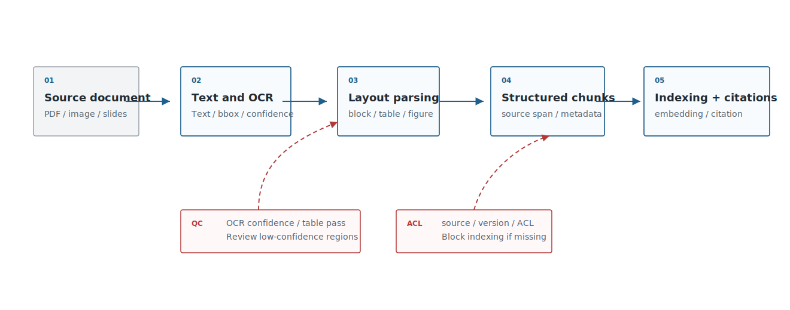
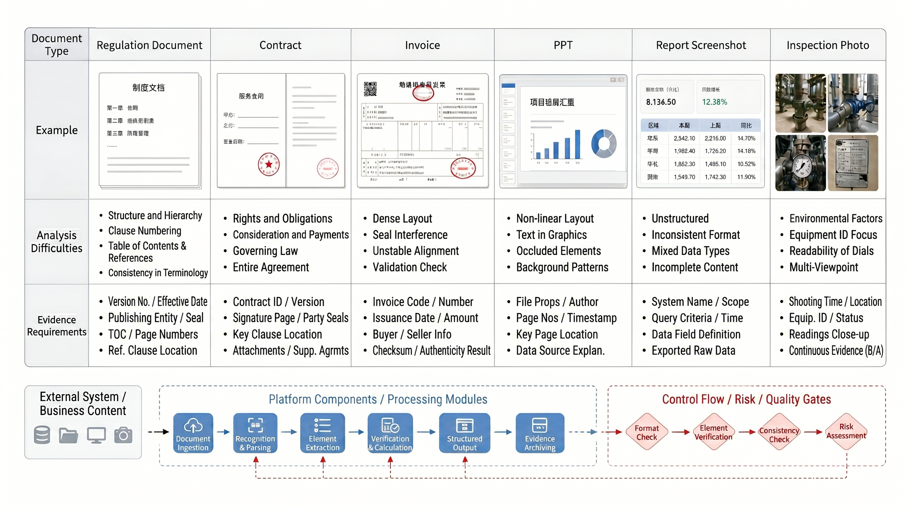
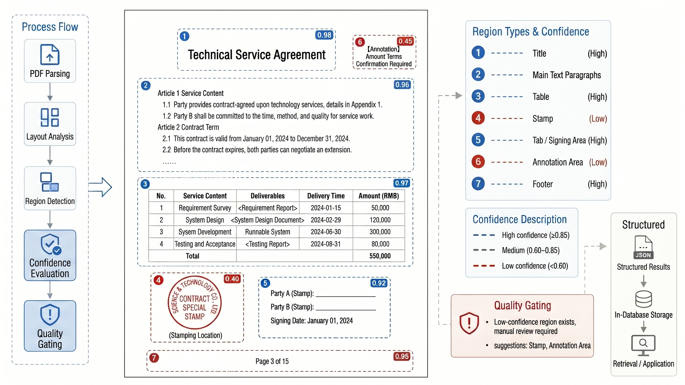
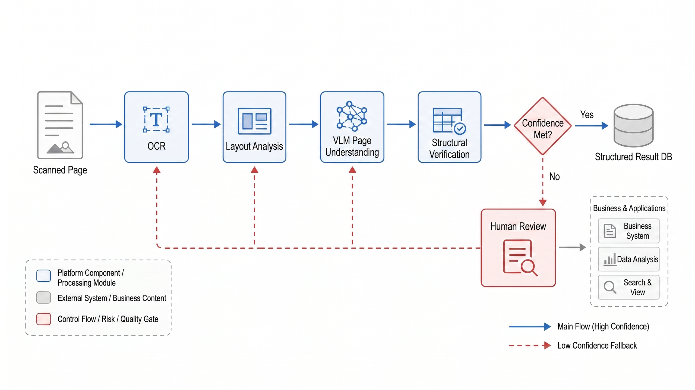
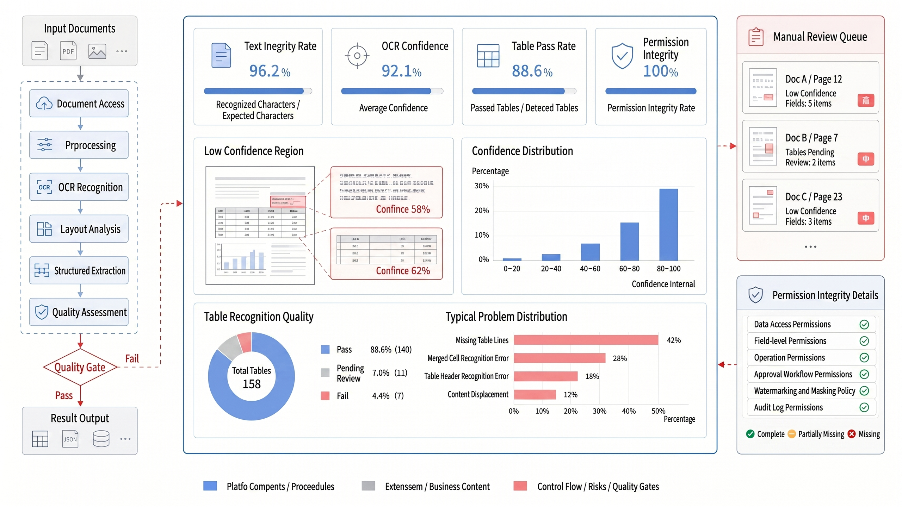

# Chapter 19 Document Parsing and Multimodal OCR

---

This chapter discusses document parsing and multimodal OCR, explaining how PDFs, tables, screenshots, and scanned documents are transformed into structured objects that are searchable, citable, and auditable. Enterprise knowledge is largely locked within complex-layout documents, and the quality of parsing directly determines whether downstream Retrieval-Augmented Generation (RAG) can provide traceable citations. This chapter analyzes typical parsing challenges such as tables, multi-column layouts, and stamps, compares the applicable boundaries of traditional OCR, layout analysis, and Vision-Language Model (VLM) parsing, and explains how parsing pipelines use quality gates to ensure outputs can be cited and audited.

Many failures in RAG (Retrieval-Augmented Generation) are not due to the model being unable to answer, but because the documents were corrupted during initial parsing. Contract headers and footers get mixed into the main text, tables get fragmented row by row, scanned copies miss seals, the reading order of text in double-column PDFs gets scrambled, and key metrics in PPT screenshots fail OCR recognition. Vector databases and rerankers cannot fix these underlying noise issues. Enterprise knowledge engineering must first transform "documents into searchable, citable, and auditable structured objects" before discussing embeddings and RAG.

## 19.1 Challenges of Enterprise Document Parsing

Enterprise documents are more than collections of plain text. Policies, contracts, invoices, reports, PPTs, dashboard screenshots, handwritten inspection forms, and email attachments coexist, each with different formats, permissions, and evidential requirements. Tools like unstructured, LlamaParse, PyMuPDF, PaddleOCR, Marker, Nougat, Donut, and Qwen-VL address issues at different layers and cannot be simply swapped out. Choosing a document parsing solution should start by reasoning backward from the failure consequences listed in Table 19-1, instead of beginning with a tool feature comparison. Each type of failure will amplify downstream effects along the embedding, RAG, DataAgent, and audit chains.

*Table 19-1: Typical failure modes of enterprise document parsing. Source: compiled by this book.*

| Failure Mode       | Manifestation                                               | Downstream Impact                                   |
|--------------------|-------------------------------------------------------------|----------------------------------------------------|
| Incorrect text order | Two-column PDFs, headers/footers, footnotes merged into main text | Semantic confusion in chunks, RAG referencing errors |
| Lost table structure | Merged cells, hierarchical headers, and multi-page tables broken apart | DataAgent fails to locate metric definitions, contract amounts cannot be verified |
| OCR omissions       | Stamps, handwriting, low-resolution scans, screenshot fonts | Missing evidence, failure to recall key fields       |
| Lost layout semantics | Titles, chapters, charts, annotations lack hierarchy       | References lack page numbers and regions, no verification possible |
| Missing permissions and provenance | Parsing results lack source, version, ACL             | Unauthorized retrieval, inability to trace audits   |

Once failure modes are clearly identified, platform owners should steer using the triage in Table 19-2: which documents can be ingested automatically, which require manual review, and which capabilities serve only as candidates.

*Table 19-2: Key decision points for document parsing by platform owners. Source: compiled by this book.*

| Decision Question                | Recommended Judgment                                                                                  |
|--------------------------------|-----------------------------------------------------------------------------------------------------|
| Should all documents be parsed automatically? | Not recommended. Policies and manuals can be ingested automatically; contracts, invoices, and audit materials should have quality gates and review. |
| Should VLM be used directly for parsing? | VLM can help with complex screenshots and charts, but amounts, dates, clauses, and metrics still require OCR, rules, and structured validation. |
| How does parsing quality affect ROI?       | Parsing errors amplify through embedding, RAG, and GraphRAG; fixing parsing upstream usually pays off more than tweaking prompts later. |
| Where is the security boundary?             | Original text, page images, OCR text, chunks and traces may contain sensitive info; ACL must be inherited from the source document. |
| What is the minimum launch threshold?      | Chunks must map back to page numbers and bounding boxes, tables need structure, low-confidence areas require review, and parsing versions must be traceable. |

The fundamental principle for document parsing is to first control failure consequences, then choose the automation level. Otherwise, the system will package parsing errors as "poor retrieval quality" or "model hallucinations," greatly increasing troubleshooting cost. Returning to the RAG upstream chain in Figure 19-1, raw files must not enter vector stores directly; they must first pass parsing, structuring, quality gates, and permission inheritance.

In real projects, the most underestimated errors are those where "parsing appears successful." For example, a contract's multi-page table split into two chunks may separate payment terms and breach liabilities; repeated headers creeping into policy document main text pollute retrieval results; small footnotes in report screenshots missed by OCR lead DataAgent to retain metric values but lose their limiting definitions. System-level logs only show ingestion tasks succeeded, vector count normal, RAG returns present-but business users get unverifiable answers. Therefore the parsing stage must explicitly record failure modes instead of treating all files as plain text.



*Figure 19-1: Enterprise document parsing pipeline. Source: drawn by this book. Alt text: A horizontal pipeline from file intake, format recognition, layout analysis/OCR, structural reconstruction (tables/titles/paragraphs), chunking and ingestion; arrows show raw documents progressively transformed into structured searchable objects.*

The same pipeline applied to different document types in Figure 19-2 requires configuring distinct parsing strategies and review requirements. Policy documents, contracts, invoices, and dashboards should not share a fixed, uniform chunking logic.



*Figure 19-2: Enterprise document type matrix. Source: drawn by this book. Alt text: A matrix weighted by "layout complexity" and "scanned or not," placing contracts, reports, manuals, screenshots, invoices into quadrants, with recommended parsing approaches labeled for each quadrant.*
## 19.2 Document Structure and Layout Semantics

Document parsing should output more than just `text`-it should output structure. A usable parsing result contains at minimum: pages, regions, heading levels, paragraphs, tables, figures, footnotes, page numbers, bounding coordinates, and source version. The attribution evidence in a RAG system should ideally trace back to "page N, region M, table cell X" instead of to a spliced block of text. These structural elements need to be decomposed into stable objects, as shown in Table 19-3, to provide a uniform data contract for downstream chunking, embedding, citation highlighting, and quality gates.

*Table 19-3: Data structures for parsed objects. Source: compiled by the authors.*

| Object | Required Fields | Purpose |
|---|---|---|
| Document | `source_id`, `source_version`, `acl`, `file_hash` | Versioning, permissions, auditing |
| Page | `page_no`, `width`, `height`, `rotation` | Page-number references, coordinate conversion |
| Block | `block_type`, `bbox`, `reading_order` | Chunking, visual retrieval, citation highlighting |
| Table | `rows`, `cols`, `header`, `cell_bbox` | DataAgent, contracts, invoices |
| Figure | `caption`, `image_ref`, `ocr_text` | Multimodal retrieval, screenshot Q&A |
| Chunk | `chunk_id`, `text`, `source_span`, `metadata` | Embedding and RAG |

The objects in this table exist not to make the data model look elegant, but to preserve a verifiable audit trail. If an answer cites a payment clause in a contract, the system must be able to pinpoint the page number and region in the original PDF. If a DataAgent uses a metric from a report screenshot, the system must be able to state which chart region the OCR result came from. Without this trail, RAG is simply handing unverifiable text to the model.

Page numbers and bounding boxes are not supplementary display hints for UI highlighting-they are part of the evidentiary record. When auditors review an answer, they will generally not accept a vague attribution like "a passage from some contract." Business users also need to know whether the cited content comes from the body text, a footnote, an appendix, or a handwritten annotation on a scanned document. Bounding boxes reconnect chunks, OCR text, table cells, and page screenshots; every subsequent operation-citation highlighting, manual review, low-confidence region flagging, or comparing outputs across different parser versions-depends on these coordinates. Retaining only plain text may make the system feel lightweight in the early stages of deployment, but it destroys the evidence chain when answers are disputed, compliance audits are conducted, or parsing regressions need to be investigated.

The DataAgent scenario is especially dependent on tables and layout. Many metric definitions are not stated in the body text but appear in report footnotes, table headers, chart legends, and screenshot annotations. If the parsing system outputs only continuous text, downstream schema linking will conflate "revenue," "net revenue," and "revenue including tax." Only when cell boundaries, page numbers, chart titles, and field provenance are preserved can a DataAgent reliably map a natural-language question to a trustworthy metric. Document page structure therefore cannot exist only transiently inside the parser. The headings, paragraphs, tables, figures, and page-coordinate information shown in Figure 19-3 all affect downstream chunking, embedding, citation highlighting, and manual review.



*Figure 19-3: Illustration of PDF page structure parsing. Source: original illustration by the authors. Alt text: A single PDF page is identified as distinct blocks-headings, body paragraphs, tables, figures, and headers/footers-each annotated with a bounding box and reading-order index, demonstrating how layout analysis reconstructs document structure.*
## 19.3 Document Parsing Toolchain Selection

Toolchain selection must be based on document types and evidence requirements. PyMuPDF is suitable for low-level handling of PDF text, pages, and coordinates; unstructured excels at splitting multi-format documents into elements; LlamaParse is tailored for LLM/RAG-oriented document parsing services; PaddleOCR and PP-Structure are strong in Chinese OCR, tables, and layout analysis; Marker/Nougat focus more on academic papers, formulas, and Markdown conversion; VLM is suitable for complex page understanding and visual Q&A, but its cost and stability need separate evaluation. When choosing among the tools in Table 19-4, it is important to adhere to the previously defined data contract: whether the tool can output page numbers, coordinates, table structure, permission inheritance, and low-confidence flags is more high-risk than how good the demonstration looks.

*Table 19-4: Trade-offs of Document Parsing Toolchains. Source: Compiled by the author.*

| Solution                        | Advantages                              | Costs                                   | Applicable Scenarios                            | mini-platform Selection                      |
|--------------------------------|---------------------------------------|-----------------------------------------|------------------------------------------------|----------------------------------------------|
| PyMuPDF + Rules                | Controllable, lightweight, clear coordinate info | Complex layouts and OCR require additional components | Selectable text PDFs, internal policies, simple contracts | Default low-level PDF adapter                |
| unstructured                  | Mature ecosystem for multi-format element extraction | Output quality depends on document types and strategy configuration | Bulk import for knowledge bases, diverse corporate documents | General-purpose parser provider               |
| LlamaParse                    | Good parsing experience for LLM/RAG    | SaaS/service cost, data egress risks to consider | Rapid PoCs, complex PDFs, documents with many tables | Optional provider                             |
| PaddleOCR/PP-Structure        | Strong Chinese OCR, layout, and table capabilities | High deployment and tuning cost         | Scanned documents, invoices, Chinese tables, image-based docs | Private cloud OCR provider                    |
| VLM Parsing                   | Handles screenshots, charts, complex visual semantics | High cost, lower reproducibility and format stability | Dashboard screenshots, inspection images, complex page understanding | Only for high-value use cases, not default   |

Sample testing during selection is high-risk-do not rely only on tool demos. Evaluate 30-100 documents per category for text completeness, table structure, heading hierarchy, page number coordinates, OCR confidence, parsing latency, and human review rate. Once a parser toolchain enters production, it must be versioned like models: parser version, prompt version, OCR model version, and layout strategies all impact downstream indexing.

Test samples should not be limited to pristine files. They should intentionally include scanned crooked pages, low-resolution screenshots, multi-page tables, double-column layouts, stamped or obscured areas, handwritten annotations, attachment directories, and historical templates. For each category, record expected outputs: whether text order is correct, if table row-column relationships are preserved, if page numbers and coordinates correspond to the original, and whether low-confidence regions are flagged. Only through this can selection move from "which tool looks smarter" to "which tool is controllable on this company's documents."
## 19.4 Multimodal OCR and VLM Parsing

OCR extracts text from images, layout models recognize regions and reading order, and VLM further understands charts, screenshots, and visual relationships on the page. These three are not mutually exclusive but different layers in a pipeline. Fields like contract amounts, invoice dates, and report metrics are best handled with OCR + rules + structured validation; screenshot Q&A, defect image similarity, and complex page descriptions can incorporate VLM, but the output should be treated as candidate interpretations, not direct facts.

Table 19-5 shows the boundaries, not a ranking of capabilities. OCR, layout models, VLM, and structured validation should work collaboratively-no single model can replace the entire parsing pipeline.

*Table 19-5: Boundaries between OCR, Layout Models, and VLM. Source: Compiled by the author.*

| Capability      | Input                  | Output                              | Suitable Tasks                   | Risks                                |
|-----------------|------------------------|-----------------------------------|---------------------------------|------------------------------------|
| OCR             | Images, scanned pages, screenshots | Text + positions                 | Invoices, contracts, screenshot text | Low resolution, handwriting, rotation, stamps impact accuracy |
| Layout Parsing  | PDF pages, screenshots | blocks, tables, figures, reading order | Chunking, citations, table extraction | Complex layouts often cause ordering errors |
| VLM Parsing     | Images, pages, charts  | Descriptions, Q&A, region explanations | Dashboard screenshots, chart understanding, visual search | High cost, results may be unstable  |
| Structured Validation | OCR/VLM output + rules | Fields, confidence, error flags | Amounts, dates, IDs, metrics    | Rule maintenance cost              |

Quality gates should be designed along these capability boundaries: text recognition relies on confidence scores, layout parsing checks reading order and coordinates, VLM outputs require verifiable evidence, structured fields depend on rule validation results. VLM here serves as supplemental understanding, not as the factual source. It can explain screenshot layouts, recognize relationships between charts and text, and propose candidate regions on complex pages. But amounts, dates, contract numbers, and metric values must revert to OCR text, coordinates, rules, and necessary manual review. Otherwise, the system risks mistaking "the model understands the page" for "the field has been verified." In high-risk documents, VLM output should remain a verifiable candidate interpretation linked to original image regions, never directly overriding structured fields. As shown in the pipeline of Figure 19-4, VLM is responsible for supplementing visual comprehension, while amounts, dates, IDs, and metrics must return to validated fields and rule checks.



*Figure 19-4: OCR and VLM collaboration pipeline. Source: Author's own illustration. Alt text: The flowchart shows regular text routed to fast OCR recognition, complex layouts or mixed text and images handed to VLM for understanding. Results merge for unified output, with arrows indicating division into two parsing paths based on difficulty.*
## 19.5 Parsing Pipeline and Quality Gates

Document parsing pipelines need quality gates. The purpose of the gates is not to pursue perfection, but to determine which documents can automatically enter the index, which require manual review, and which can only serve as low-confidence candidates. Enterprise platforms can parse each document into a `parsed_document.json`, then generate chunks, embeddings, and citation indices.

```json
{
  "source_id": "contract-2026-001",
  "parser": "pymupdf+paddleocr",
  "parser_version": "2026-06-baseline",
  "pages": 18,
  "quality": {
    "ocr_confidence_avg": 0.93,
    "table_parse_pass_rate": 0.86,
    "low_confidence_blocks": 7,
    "requires_review": true
  },
  "artifacts": {
    "structured_json": "s3://.../parsed.json",
    "page_images": "s3://.../pages/",
    "chunks": "s3://.../chunks.jsonl"
  }
}
```

The quality gate should ultimately translate into executable checks like those in Table 19-6, breaking down "whether parsing succeeded" into text, tables, coordinates, permissions, and low-confidence areas, instead of looking only at whether the task finished. The gate results must also be integrated into operational workflows. Low-confidence areas should more than leave a number in the JSON - they should form a review queue: which document, which page, which region, what error type, who reviews it, and whether a review triggers index rebuilding. When upgrading parsers, the same sample batch should be tested for regression comparisons, checking if table structures, reading order, coordinate mappings, and citation hits improve. Only in this way will the parsing pipeline evolve from a one-off import tool to a knowledge production process with continuous improvement.

Post-launch parsing systems also need to support exception handling. Some historical scans may never meet the auto-ingest threshold but still hold business value; some contract attachments allow only certain roles to view and cannot bypass permission due to parsing failure; some low-confidence fields can enter candidate indices but cannot be used for automatic answers. The platform should record these exceptions as states instead of having operators keep offline spreadsheets. Document state, review verdicts, and index status remain synchronized, so downstream RAG and DataAgent can know which evidence can be used directly and which requires prompting users to consult the originals. These states also impose constraints back onto the index admission: unrevised low-confidence tables should not enter field indices; documents with incomplete permissions should not enter the vector store; chunks lacking page numbers and coordinates should not support high-risk citations.

*Table 19-6: Parsing Quality Gates. Source: Compiled by this book.*

| Gate           | Metric                              | Handling Strategy                      |
|----------------|-----------------------------------|--------------------------------------|
| Text Completeness | Copyable text + OCR coverage      | Below threshold enters manual review |
| Table Structure | Header recognition, row/column consistency, multi-page table linkage | Failures excluded from DataAgent field index |
| Coordinate Traceability | Whether chunks map back to page number and bbox | Prohibited for high-risk answers if untraceable |
| Permission Integrity | Source, ACL, version completeness | Not written to vector store if missing |
| Low-Confidence Areas | OCR/VLM confidence and rule check fails | Marked red in control flow, requires review |

The mini-platform can later add `infra/document_parser/` to output a unified `ParsedDocument`. Chapter 20's RAG consumes chunks and citation spans generated from `ParsedDocument` instead of the raw PDF. This creates a clear boundary among document parsing, vector indexing, and answer citation. The quality gate output should not be just a task status stating "parsing completed." As shown in Figure 19-5, the platform team must also see low-confidence areas, table failures, missing permissions, and review requirements.



*Figure 19-5: Document Parsing Quality Report. Source: Illustrated by this book. Alt text: The report page displays metrics such as character recognition rate, table restoration accuracy, and layout reading order correctness, alongside thumbnails of failed samples, demonstrating that parsing quality is quantifiable and randomly checkable.*

## 19.6 Replay boundary for document parsing results

Parsing results must be replayable. A chunk used in an answer should link back to parser version, source file hash, page number, bounding box, table structure, OCR confidence, and review state. When a parser is upgraded, the platform should replay the same document sample set and compare text order, table reconstruction, coordinate mapping, and citation hit rate.

Replay is also the boundary between parser defects and retrieval defects. If the source table was split incorrectly, vector search may retrieve a plausible but incomplete chunk. The repair should happen in parsing and chunking, not in prompts or rerankers. Keeping parser artifacts and page images makes this diagnosis possible.

## 19.7 Layered standards for OCR quality control

OCR quality control should be layered by document risk. Low-risk policies can enter the index if text completeness, page mapping, and permission inheritance pass. Contracts, invoices, audit materials, and regulated documents need stricter checks on amounts, dates, signatures, seals, tables, and low-confidence regions. Screenshot-based metrics need chart region verification and business owner review when values drive decisions. The platform should avoid a single global OCR threshold. A 93 percent average confidence may be acceptable for a manual, but unsafe for an invoice amount or contract date. Quality gates should combine confidence, field type, page region, document category, and downstream use.

## 19.8 Boundary for parsed artifacts entering the knowledge base

Parsed artifacts should enter the knowledge base only after source, version, ACL, page mapping, and quality state are present. Chunks without page numbers cannot support high-risk citations. Tables without row-column structure should not enter metric or contract indices. Documents with incomplete permissions should remain outside the vector store until the ACL is resolved.

Some artifacts can still be useful as low-confidence candidates. The system may allow them for internal review or exploratory search while blocking them from automatic answers. This state needs to be explicit in metadata, so RAG and DataAgent know whether evidence can be cited, needs review, or should be excluded.

## 19.9 Human review and parsing sample library

Human review should focus on low-confidence regions, high-value documents, and parser regression samples. Reviewers need to see the original page, parsed text, table structure, OCR confidence, and downstream impact. Their verdicts should update the sample library, not remain in comments or tickets. A parsing sample library is the long-term asset for improving OCR and VLM pipelines. It should include representative documents, expected outputs, known hard cases, parser versions, review verdicts, and regression results. This library lets the team compare PyMuPDF, PaddleOCR, VLM parsing, or service providers with the same evidence set.

## 19.10 Parser release and review operations

Parser upgrades change downstream evidence in the same way index releases do. OCR models, layout detectors, table post-processing, VLM prompts, Markdown conversion rules, and chunk generation strategies can all produce different text, tables, and coordinates for the same document. If the platform simply overwrites old parsing results after a successful task, RAG citations may move to different pages, DataAgent field candidates may change, and reviewers will not know which evidence version to trust. Parsed artifacts therefore need versioned releases, with file-level overwrites reserved for low-risk drafts.

The regression set for release should contain the difficult documents that the enterprise actually owns: multi-page tables, two-column PDFs, stamped contracts, skewed scans, low-resolution screenshots, annotated policies, appendix directories, and historical templates. After every parser upgrade, the platform should compare reading order, table structure, page coordinates, low-confidence regions, field extraction, and citation hit rate. For high-risk documents, an average accuracy score is not enough. Amounts, dates, parties, clause numbers, metric definitions, and signature areas need separate checks. A version that improves ordinary paragraphs but damages contract appendix tables should not enter production.

Review operations need an explicit state machine. A document may be `parsed`, `review_required`, `reviewed`, `approved_for_search`, `approved_for_high_risk_answer`, or `rejected`. Ordinary retrieval can use material approved for search, while high-risk answers require stricter approval. Rejected documents may keep their source file and failure reason, but they should not enter automatic answer paths. State changes should trigger corresponding actions: approval writes to the vector store, revision rebuilds chunks, rejection removes candidates from indexes, and re-upload restarts evaluation. This is how parsing quality gates constrain RAG in practice.

Human review should also be layered. Business experts should not inspect every character. They are better placed to confirm table meaning, contractual responsibility, metric definitions, and low-confidence fields. Platform teams own parser versions, coordinate mapping, indexing state, and regression samples. Security and compliance teams own permission inheritance, sensitive regions, and retention rules. The review interface should show the original page, parsed text, bounding boxes, table structure, OCR confidence, and downstream impact together, so the reviewer knows which risk is being confirmed.

Parser release should connect to Chapter 20's RAG evaluation and Chapter 38's Trace. If an answer cites a chunk, the trace should show parser version, review verdict, page region, and ingestion time. When a user says a citation points to the wrong page, the team can determine whether a parser upgrade changed coordinates or the index still uses an old chunk. A first release can store this information in `ParsedDocument` and chunk metadata before building a dedicated review console.

## 19.11 Parsing Incident Review and Downstream Impact Assessment

Document parsing incidents are often discovered downstream. A user may see the wrong cited page, a table amount placed in the wrong column, a missing contract clause, or a chart explanation that does not match the source image. By that point, the content has passed through parsing, chunking, indexing, retrieval, and generation. Review should not start by asking why RAG answered incorrectly. It should first split the evidence chain: whether the source file was correct, whether parser version changed, whether page number and bbox were preserved, whether table structure was flattened, whether the chunk came from the latest index, and whether the answer cited a low-confidence region. Segment-by-segment diagnosis tells the team whether to repair parser, chunker, retriever, reranker, or answer template.

Incident material should be standardized. A parsing incident should keep source file hash, parser version, parsing task ID, chunk ID, index version, answer Trace, user feedback, and repair action. If the issue comes from table misalignment, keep the source image, parsed table, and manually corrected structure. If it comes from permission mismatch, keep document ACL, chunk ACL, and the user's role at query time. If it comes from a VLM description error, keep the image region and model output. Without these materials, teams tend to patch downstream prompts while the upstream parsing defect remains.

Downstream impact assessment should cover RAG, DataAgent, and report generation. A parser upgrade may look like a knowledge-base change, but it can alter citation pages, entity extraction, semantic-layer field candidates, and report EvidenceRef. Before release, sample high-frequency documents, high-risk templates, and materials recently cited by users, then check that the new parsing result does not invalidate old answers. If impact is broad, use dual-version indexing: the new parsing result enters a canary index while online answers keep using the old index. Switch the default version only after regression samples and human review pass.

Parsing incidents should also enter the sample library. Every wrong page, table, field, or permission case can become a regression sample for future parser releases. Samples should record failure type and repair status so the next upgrade does not reintroduce the same defect. Over time, parsing quality improves through hard-sample accumulation, clear human review boundaries, and downstream incidents flowing back into the parsing pipeline. Document parsing then becomes part of knowledge engineering and stops being a one-time preprocessing step before knowledge-base import.

Incident review should also grade impact. Typos and paragraph-order issues may affect ordinary search experience. Errors in amounts, dates, contract parties, permission tags, and page coordinates can affect high-risk answers and audit. The platform can classify incidents into ordinary repair, index rebuild, human review, and citation pause, so every parsing defect does not enter the same queue.

The parsing team should also write incident findings back into upload standards. If the same department repeatedly uploads skewed scans, the OCR model should not carry the whole burden. If a historical template remains hard to parse, the ingestion process should require manual preparation or a risk label before indexing. If chart screenshots are often misread, they should be blocked from automatic answers and kept for human viewing. This extends parsing governance across file creation, upload, parsing, ingestion, and citation instead of leaving all errors to downstream RAG.

This upstream governance reduces repeated repair work and teaches document-producing teams which materials are suitable for automated knowledge pipelines. It also gives platform teams a concrete reason to reject weak inputs before they become retrieval defects. A rejection at upload time is often cheaper and clearer than a disputed answer weeks later.

Incident review should include downstream owners as well. Knowledge-base owners know which documents are used frequently. DataAgent owners know which parsed fields enter SQL or report generation. Compliance owners know which pages need stronger evidence before citation. When these owners review the same parsing incident, the repair can be scoped correctly: ordinary documentation defects may wait for the next parser release, while errors in contract amounts or audit evidence may require immediate citation pause and index rebuild. This division keeps the parser backlog from mixing low-risk cleanup with production blockers.

## 19.12 OCR Quality Gates And Human Sampling

After OCR enters an Agent platform, quality gates should be designed by document type. Contracts, invoices, scanned reports, screenshots, handwritten notes, and image-based PDFs fail in different ways. Contracts are sensitive to wrong amounts, dates, and parties. Invoices are sensitive to tax IDs and totals. Reports are sensitive to table structure and column names. Screenshots are sensitive to missing surrounding context. A single OCR success rate overstates readiness for high-risk material.

Human sampling should combine with OCR confidence. Low-confidence fields, key amounts, approval comments, customer names, legal clauses, and cross-page tables should enter sampling candidates. Sampling results should not serve only the current document. They should return to parser evaluation, layout rules, field validation, and knowledge-base metadata. If one scanned-document class keeps failing, the upload flow should ask users for a better format or human entry instead of sending low-quality text into RAG.

OCR gates should also affect downstream answers. When material fails the gate, the Agent can state that parsing quality is insufficient, show readable page references, or ask for human confirmation. When material passes the gate but key fields were corrected by a person, the answer should cite corrected fields and correction records. OCR then becomes an inspectable part of the evidence chain instead of hidden preprocessing.

## 19.13 Business acceptance samples for parsed artifacts

OCR and document parsing acceptance samples should come from real business materials. Contracts, invoices, policies, reports, scans, screenshots, and email attachments fail in different ways. A generic OCR accuracy score does not show whether downstream Agents can use the result. Business acceptance should check paragraph structure, table boundary, page number, heading hierarchy, stamp and signature, amount field, date field, and attachment relationship. If these structures are lost, later RAG or report generation may read the text but still cite the wrong evidence.

Parsed artifacts should be tied to business tasks. Contract review cares about clauses, parties, amount, and term. Finance reimbursement cares about invoice fields, authenticity, and attachment completeness. Policy Q&A cares about version, effective date, and scope. DataAgent reports care about table title, unit, and metric definition. Each task needs its own acceptance samples. A single accuracy number across all documents hides errors in high-risk fields.

A first platform version can keep a small set of representative sample packs. Each pack stores original file, parsed result, human label, failure reason, fix record, and applicable task. Parser upgrades, OCR model switches, layout-model changes, and new file formats should replay these samples. Document parsing then becomes a continuously verified knowledge entry point instead of a one-time import capability.

## 19.14 Sample replay for parser policy changes

Before an OCR or parser policy upgrade, the team should identify which downstream evidence may change. A layout-model upgrade may improve paragraph segmentation while shifting chunk boundaries. A table-extraction adjustment may improve column detection while moving cross-page table references. A VLM-assisted parser may add useful image descriptions, but it can also turn decorative graphics into false business statements. For an Agent platform, acceptance is not a single OCR score. It is whether retrieval chunks, page references, field values, table structure, and human review records still support the business answers that users rely on.

Sample replay should cover both frequent materials and high-risk materials. Frequent materials include policies, product manuals, recurring reports, FAQs, and training documents; they shape daily question answering. High-risk materials include contracts, invoices, audit workpapers, approval attachments, and customer certificates; they determine whether automated citation is allowed. After each parser-policy change, the platform should compare old parse output, new parse output, human labels, and downstream answer samples. If changed chunk boundaries invalidate an old citation span, the index can be rebuilt, but historical answers should keep the old parser version. If a field value changes because a reviewer corrected it, the correction record should become part of EvidenceRef so the next indexing run does not overwrite human work.

Replay results should also decide knowledge-base admission. Documents with weak parser confidence, missing pages, incomplete table structure, or conflicting high-risk fields should not enter the automatic-answer index directly. The platform can downgrade them to searchable material that requires human confirmation, or expose them only as original-file attachments. This reduces answer coverage, but it keeps weak evidence out of production paths. Parser release notes for business owners should state which document classes improved, which still need manual cleanup, which old indexes require rebuilding, and which answer samples require renewed acceptance. Document parsing becomes governable only when parser replay, evidence versions, and admission policy are treated as one operating path.

## 19.15 Parsing regression after layout changes

Enterprise document layouts keep changing. Contract templates add clauses, reimbursement forms move fields, scans shift from black and white to color, vendor PDFs change headers and footers, and regulatory forms add note columns. Each change can affect OCR and layout parsing. If the parsing pipeline is validated only at launch, the knowledge base slowly accumulates misaligned tables, missed fields, and broken paragraphs. RAG or DataAgent may then treat those artifacts as evidence, pushing the error into the answer layer.

Layout regression should preserve source files and parsed artifacts. After each template change, teams should replay representative samples and compare text blocks, table structure, page numbers, heading hierarchy, image captions, key fields, and confidence changes. For contracts, invoices, audit material, and policy documents, review should also confirm that references still return to the original page. If parsed output keeps only plain text, later teams cannot tell whether a failure came from OCR, chunking, vectorization, or model interpretation. Parsing evidence should be rich enough to reproduce downstream problems.

Regression samples should be layered by document type. Fixed-template documents can use field-level checks for amount, date, customer, identifier, and approval result. Semi-structured reports need checks for headings, tables, and captions. Scanned files need checks for rotation, blur, stamps, and handwritten notes. Multilingual documents need checks for character set and paragraph order. A single quality threshold across all document types hides risk. Each type should have its own parsing gate and human sampling ratio.

A first version can define a rule that layout changes trigger regression. Any change in template version, vendor source, scanning channel, or file type triggers fixed-sample replay. The replay result enters the knowledge-base release record and links to the RAG evidence chain in Chapter 20 and Trace in Chapter 38. OCR then becomes a maintained evidence-production process in knowledge engineering, not a one-time preprocessing step.

## 19.16 OCR correction samples and layout regression

OCR quality issues often sit in layout details. Skewed scans, cross-page tables, stamps covering text, handwritten notes, headers mixed into body text, and shifted amount columns can all create wrong evidence for retrieval and answers. The platform should not inspect character accuracy alone. It should keep layout regression samples that check page number, table structure, coordinates, field relationships, and confidence.

Correction samples should come from real failures. User region correction, manual field repair, rejected reports, and RAG citations to the wrong page should return to the OCR sample library. Each sample should keep original image, parser version, error location, human correction, affected downstream answer, and fix state. If the platform stores only corrected text, the team cannot tell whether the failure came from image preprocessing, layout analysis, table recognition, or post-processing rules.

A first version can group high-risk documents into contracts, policies, invoices, reports, and screenshots, then maintain a small layout sample set for each group. When the OCR model, parser, or post-processing rule changes, these samples replay before new output enters the knowledge base. OCR then becomes a quality gate for knowledge engineering and RAG evidence, not a one-time ingestion step.

## 19.17 Business review for parsing samples

After OCR and document parsing reaches production, a successful demo is not enough evidence. The platform needs stable fields for layout type, field position, confidence, human correction, downstream citation, and replay result, and those fields should connect to release records, Trace, evaluation samples, and incident notes. When a production issue appears, teams can follow one set of facts to understand scope, ownership, and repair order instead of stitching together model logs, business logs, and verbal explanations.

This evidence also connects the surrounding chapters. It links to Chapter 18 on vector stores, Chapter 20 on RAG, and Chapter 21 on knowledge engineering: upstream capabilities provide assumptions, downstream capabilities consume the result, and governance capabilities preserve evidence and review decisions. If these materials do not share identifiers and versions, the production system splits apart. Business owners see user complaints, platform owners see system errors, and security or compliance teams see explanations written after the fact. That separation makes it hard to decide whether the issue came from data, model behavior, tool contracts, workflow state, or organizational ownership.

Common production risks include cross-page tables losing columns, headers entering body text, seals being interpreted as business fields, and low-confidence content entering retrieval. These risks are less visible during demos because demos usually exercise the successful path. Production users bring boundary cases, repeated requests, permission changes, and long-running state. The platform team should turn such failures into release samples. Some samples should block launch, some can be handled by degradation, and some require the business owner to accept the remaining risk with a review date.

The parsing sample library should be maintained by business and data teams together instead of being decided only by OCR output. The record can stay compact, but it should include time, version, owner, sample, action, and the next review condition. Without those fields, review remains informal experience. With them, one production issue can become material for later releases, evaluation suites, and training.

A first platform version can start with a small set of high-risk paths. Choose flows with high traffic, high business impact, or sensitive data, require an evidence package for each change, and then expand the practice to ordinary scenarios. This keeps the capability at the engineering level: runnable, explainable, and recoverable.
## 19.18 Separate acceptance for parsing quality and knowledge ingestion

Parsing quality and knowledge-ingestion quality should be accepted separately. OCR or VLM may recognize layout correctly, but that does not mean the content is ready for a knowledge base. A knowledge base may retrieve a passage, but that does not mean the passage is safe for model citation. The platform should first verify whether parsing preserves structure, fields, tables, and page numbers, then verify chunking, metadata, permission, and citation after ingestion.

Separate acceptance reduces responsibility confusion. Parsing errors go back to OCR strategy and human sampling. Chunking errors go back to the knowledge-processing pipeline. Citation errors go back to RAG and generation. Permission errors go back to data governance. If all issues are called poor knowledge-base quality, the team cannot tell whether to fix the model, parser, index, or permission policy.

A first version can keep two sample sets for important documents: parsing samples and ingestion samples. Parsing samples inspect layout and fields. Ingestion samples inspect retrieval and citation. The two sets share document version and processing policy. Chapter 19 then connects naturally to vector stores, RAG, and knowledge engineering.

## Chapter Recap

Document parsing is the foundation of RAG and knowledge engineering. Enterprises cannot treat PDFs as plain text, nor take VLM outputs directly as facts. A more reliable approach is to preserve layout structure, page coordinates, table relationships, access control, and parsing versions, while using quality gates to decide which content enters the index.

- RAG failures often occur during parsing; parsing quality must be managed before embedding.
- Document parsing output should include page, block, table, figure, chunk, and citation spans.
- OCR, layout parsing, VLM, and structured validation each have distinct boundaries and cannot replace one another.
- Parsing results must be versioned; otherwise, index reconstruction and citation verification cannot be traced.

- [ ] Can each chunk be traced back to the original page and region?
- [ ] Are there clear handling strategies for tables, images, headers, and footers?
- [ ] Are low-confidence OCR/VLM areas subjected to manual review?
- [ ] Are source, ACL, version, and file hash recorded in metadata?
- [ ] Is there a parsing quality report and failure case log?
## References

- unstructured partitioning: https://docs.unstructured.io/open-source/core-functionality/partitioning

- LlamaParse documentation: https://docs.llamaindex.ai/en/stable/llama_cloud/llama_parse/

- PyMuPDF documentation: https://pymupdf.readthedocs.io/

- PaddleOCR documentation: https://paddlepaddle.github.io/PaddleOCR/

- ColPali paper: https://arxiv.org/abs/2407.01449
