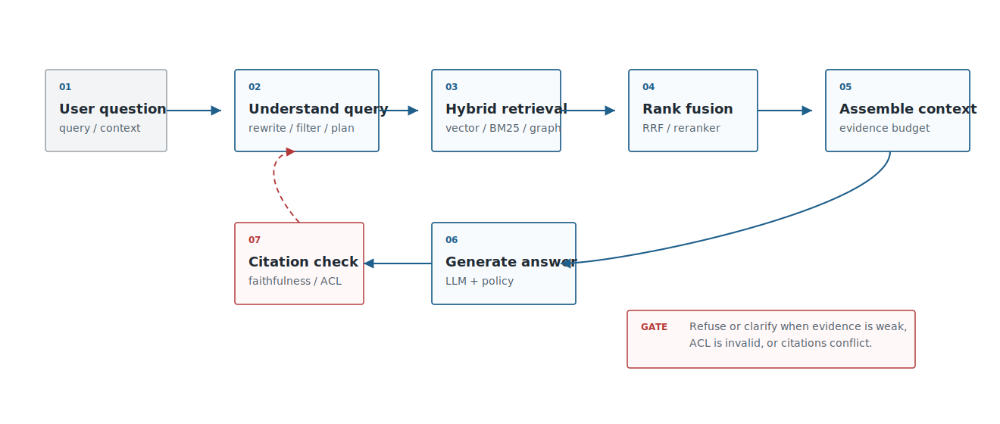
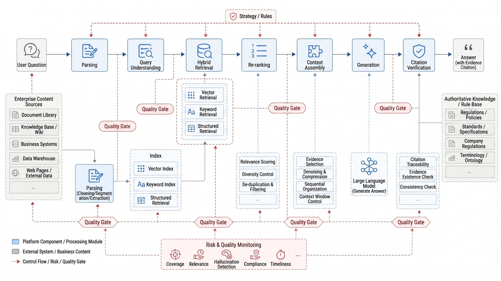
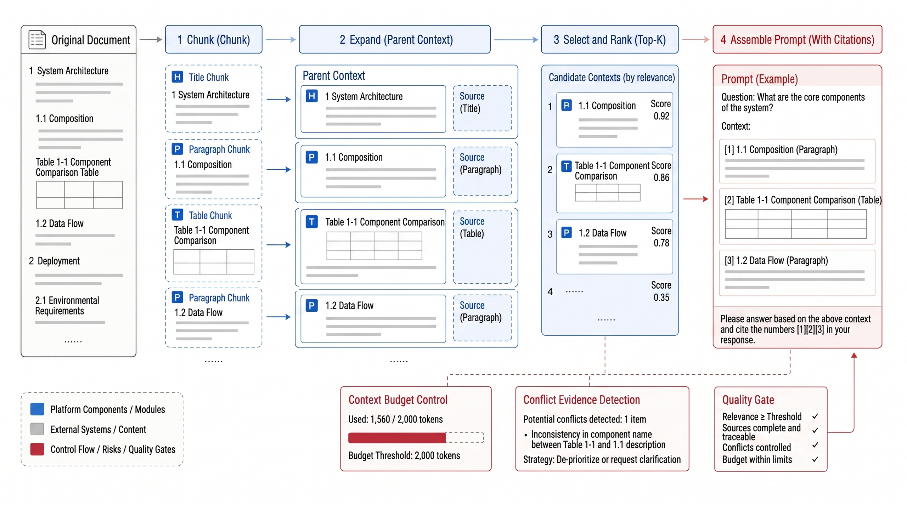
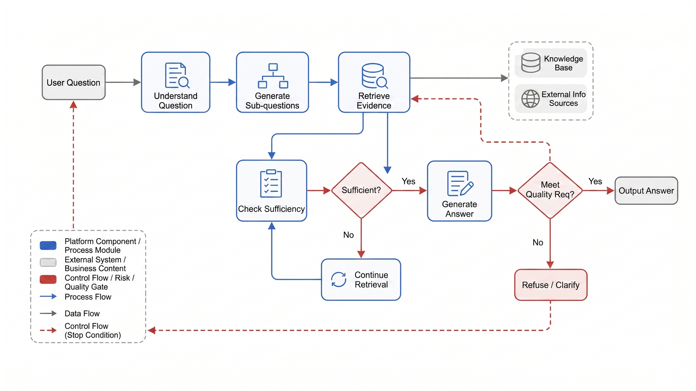
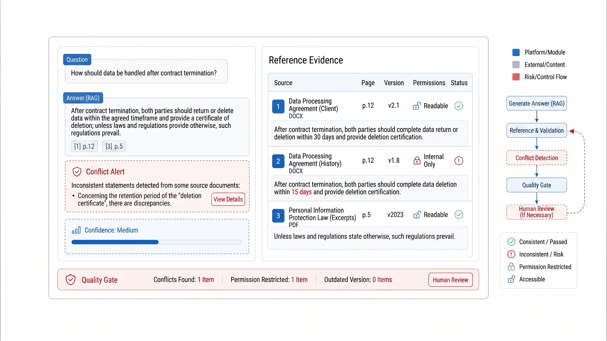

# Chapter 20 RAG Engineering and Advanced Retrieval

---

This chapter discusses RAG engineering and advanced retrieval techniques, covering chunking, recall, re-ranking, multi-hop retrieval, citation verification, and retrieval quality evaluation in a production pipeline. RAG can easily produce a working demo, but enterprise use requires evidence-backed answers, verifiable citations, and practical error localization. This chapter treats RAG as an engineering pipeline: chunking and context assembly, hybrid vector and keyword retrieval, query planning and multi-hop retrieval, citation verification, and measurable retrieval quality.

Enterprise RAG is an evidence production pipeline. It converts user questions into retrievable intents, retrieves candidates from multiple indexes, applies permission filtering, ranks and fuses candidates, assembles context, verifies citations, and only then hands evidence to the LLM. If any step in this chain fails, the user will usually experience the failure as a wrong model answer.

## 20.1 RAG Engineering System

Enterprise RAG consists of at least six layers: document parsing, index construction, query understanding, candidate retrieval, ranking and filtering, and answer generation with citation. Azure AI Search's hybrid retrieval, the retriever components of LlamaIndex and LangChain, and the evaluation metrics in Ragas all point to the same engineering conclusion: building production-grade RAG requires attention to end-to-end retrieval quality and evidence credibility, instead of focusing on a single prompt. The later topics in this chapter-chunks, hybrid retrieval, multi-hop, and trustworthy answering-can all be situated within the layered chain shown in Figure 20-1: document parsing, indexing, retrieval, re-ranking, context assembly, generation, and citation verification each bear different responsibilities.



*Figure 20-1: Enterprise RAG Engineering System. Source: Author. Alt text: The layered diagram shows offline components (parsing, chunking, embedding, ingestion) and online components (query rewriting, hybrid retrieval, re-ranking, citation verification, generation), connected via a vector store to present the complete RAG engineering stack.*

With this layering in place, each layer must be converted into engineering interfaces as shown in Table 20-1. Troubleshooting production RAG is usually done by tracing inputs, outputs, and quality risks layer-by-layer.

*Table 20-1: RAG Pipeline Responsibility Breakdown. Source: Author.*

| Stage            | Input                              | Output                            | Quality Risks                     |
|------------------|----------------------------------|---------------------------------|----------------------------------|
| Document Parsing | PDF, web pages, PPT, images      | chunks, tables, citation spans  | Text order errors, table loss    |
| Index Construction | chunks, metadata, embeddings    | vector indexes, keyword indexes | Missing permissions, version mix-up |
| Query Understanding | user question, conversation context | query rewrite, filter, sub-questions | Over-rewriting, lost permission constraints |
| Candidate Retrieval | query, filter, top-k            | document candidates, field candidates | Recall misses, similar but unanswerable |
| Ranking & Fusion  | multi-route candidates            | reranked evidence               | Correct evidence ranked too low  |
| Generation & Citation | evidence, prompt, policy       | answer, citations, refusals     | Hallucinations, unsupported citations |

With pipeline responsibilities clarified, the platform lead's question shifts from "which RAG framework to use?" to the considerations in Table 20-2: which stages should become shared capabilities and which risks must be treated as launch gates. Failures in RAG should also be decomposed along this chain. When a user sees a "model made up an answer," the root cause might be a broken table parsing, missing permission fields in indexing, recall only of similar but irrelevant chunks, true evidence ranked at #11, and missing table headers in context assembly. The final LLM just manifests faults in earlier pipeline stages. Debugging by only tweaking the prompt pushes the problem back into the model layer, causing recurring errors on future documents or question types.

*Table 20-2: Platform Lead's RAG Decision Points. Source: Author.*

| Decision Question                    | Recommended Judgment                                             |
|------------------------------------|-----------------------------------------------------------------|
| Should RAG be built as a platform capability? | Any multiple business sharing document parsing, indexing, re-ranking, or citation verification should use a platform approach; isolated Q&A applications can use a lightweight implementation. |
| Should only vector search be used? | Enterprise knowledge bases, DataAgent, and compliance Q&A often need keyword and hybrid retrieval for numbering, field names, and contract clauses. |
| Is citation-free answering allowed? | Not in high-risk scenarios; normal knowledge assistants should mark answers without citations or with low confidence. |
| When to introduce multi-hop retrieval? | Only when questions naturally span multiple entities, documents, or metrics; simple FAQs should not be complicated. |
| Minimal launch gates                | Permission filtering, citation coverage, citation consistency checks, refusal policies, and replay of failure cases. |

This serves as the roadmap for the rest of this chapter: chunks solve evidence unitization, hybrid retrieval improves recall, multi-hop retrieval solves complex reasoning, and trustworthy answering verifies evidence supports the conclusion. Put in Figure 20-2's enterprise process language, RAG is a model call, and an evidence production line; business leads can verify observability, auditability, and replayability at every stage.



*Figure 20-2: Enterprise RAG Evidence Production Line. Source: Author. Alt text: The horizontal pipeline starts from user questions, proceeds through retrieval of candidate chunks, re-ranking and filtering with source annotations, ultimately generating an answer with citations. Arrows emphasize that every conclusion is traceable to its evidence fragments.*
## 20.2 Chunk Strategy and Context Assembly

A chunk is the basic production unit in RAG. Cutting chunks too small results in incomplete semantics; cutting them too large causes imprecise retrieval, wasted context, and inaccurate citations. For enterprises, chunking strategies should start from the document structure instead of fixed-length segments every 500 characters. Different strategies should apply to heading levels, tables, FAQs, contract clauses, code blocks, and field descriptions. Chunk strategies must balance "retrieval accuracy, context integrity, and citation precision," as shown in Table 20-3. This is not about choosing a permanent strategy but about establishing default and exception strategies for different document types.

*Table 20-3: Trade-offs in Chunk Strategies. Source: Compiled by this book.*

| Strategy               | Advantages                          | Costs/Drawbacks                  | Applicable Scenarios                 | mini-platform Choice           |
|------------------------|-----------------------------------|--------------------------------|------------------------------------|-------------------------------|
| Fixed-length chunk      | Simple implementation, good baseline | Easily breaks semantics and tables | Rapid PoC, plain text documents      | Baseline only                 |
| Structured chunk        | Preserves headings, paragraphs, tables, page numbers | Depends on document parsing quality | Policies, contracts, manuals, reports | Default strategy              |
| Parent-child chunk      | Small chunks for retrieval, large parent for context | Increased indexing and assembly complexity | Long documents with clear chapter hierarchy | Used for high-value knowledge bases |
| Small-to-big           | Retrieve small evidence first, then expand adjacent context | Requires source spans and adjacency relations | Scenarios needing precise citations and context | Advanced strategy             |

Once the strategy is set, engineering focuses on context assembly: even if retrieval returns small chunks, the answer generation may require parent sections, table headers, or adjacent paragraphs. Without source spans and adjacency relationships, small-to-big just becomes temporary stitching. Context assembly must be budget-aware. More LLM context is not always better; mixing in similar but non-answerable material raises hallucination risks. Enterprise systems should categorize evidence into "directly supports answer," "background material," "conflicting material," and "unusable material," and clearly define citation rules in prompts: answer only based on direct evidence, reject or ask for clarification if evidence is insufficient.

Chunk boundaries must be designed alongside document types. Contract clauses can be split by article, clause, and item, but payment terms often require returning defined terms and appendix tables together; policy Q&A benefits from keeping heading paths because the same phrase like "within fifteen working days" means different things in reimbursement, procurement, and approval policies; technical runbooks should avoid splitting commands, prerequisites, and rollback steps. Good chunking doesn't cut text more evenly but makes retrieved evidence small and citable enough, while recovering the context needed to answer questions.

Figure 20-3 illustrates the core contradiction in chunking and context assembly: retrieval units must be small enough, yet context for generation must be complete enough. Small chunks, parent context, citation spans, and token budget must be designed together, not optimized independently.



*Figure 20-3: Illustration of chunking and context assembly. Source: drawn by this book. Alt text: A document is split into overlapping chunks; retrieved hits are assembled with adjacent context and heading paths into the prompt, illustrating the relationship between chunk granularity and context window.*
## 20.3 Hybrid Retrieval and Ranking Fusion

Embedding-based retrieval excels at semantic similarity, while BM25 is strong at keywords and proper nouns. Enterprise search often requires a combination of both. Azure AI Search's hybrid search performs BM25 and vector retrieval in parallel, then uses Reciprocal Rank Fusion (RRF) to merge results. This approach suits internal systems well because field names, IDs, contract clauses, product models, and error codes often rely on precise keyword matches. The risk boundaries of each retrieval approach summarized in Table 20-4 should be clarified upfront. Pure vector, pure keyword, RRF, and reranker methods all work, but they fail differently. Evaluation sets need to cover these failure modes accordingly.

*Table 20-4: Comparison of Retrieval Approaches. Source: Compiled by this book.*

| Approach               | Advantages                                  | Risks                                  |
|------------------------|---------------------------------------------|----------------------------------------|
| Pure Vector Retrieval   | Strong semantic recall, good for conversational queries | Proper nouns, IDs, field names may be missed |
| Pure Keyword Retrieval  | Accurate for exact terms, IDs, error codes | Poor recall for synonyms and colloquial expressions |
| Hybrid Retrieval + RRF  | Balances semantics and keywords; easier to interpret engineering-wise | Parameters, deduplication, and fusion strategies require tuning |
| Hybrid Retrieval + Reranker | Higher quality top-ranking evidence           | Increased latency and cost             |

In enterprise knowledge bases, hybrid retrieval is more the default capability instead of a fallback when vector retrieval performs poorly. IDs, field names, clause numbers, and error codes require keyword search; conversational queries, synonymous expressions, and business aliases require vector search. The benefits of hybrid retrieval come from complementarity and interpretability. With vector retrieval alone, "sales metric" might recall many semantically similar metric descriptions but miss the field name `net_sales_amount`; with keywords alone, a user query like "how much did the customer actually pay" may fail to find "actual received amount." Enterprise queries often simultaneously contain natural language, entity names, IDs, dates, and field names-making a single approach unstable to sufficiently cover them all. Logging candidate lists from BM25, vector retrieval, and reranker also helps teams diagnose whether misses come from recall, fusion, or reranking suppressing correct evidence.

RRF's value lies in simplicity and stability: scores from different retrievers are not directly comparable, but rankings can be fused. Production systems must also handle deduplication, access control filtering, source diversity, and query intent routing. For example, DataAgent's field retrieval should prioritize schema documents and historical SQL queries, compliance Q&A should emphasize policies and contracts, while customer support Q&A should favor historical tickets and runbooks.

DataAgent's RAG does more than answer "what the document says"-it also serves NL2SQL and analytic actions. If retrieval results include field explanations, metric definitions, example SQL, data quality rules, and permission constraints, error-prone table, field, and metric mismatches can be reduced before SQL generation. Trusted answers here are a natural language snippet and "why the SQL is written this way, which definitions are referenced, and which fields have execution privileges."
## 20.4 Query Understanding and Multi-Hop Retrieval

User queries often are not simple retrieval requests. They may include time ranges, permission conditions, business entities, comparative relations, implicit metrics, and multi-hop dependencies. Query understanding involves transforming natural language into a retrieval plan, instead of merely rewriting it into a longer question.

It is best to break down query understanding into several independently implementable capabilities, as shown in Table 20-5. The advantage of this approach is that each component can be evaluated separately: checking whether rewriting introduces bias, verifying if filters lose permission constraints, and ensuring multi-hop decomposition does not enlarge the question scope unnecessarily.

*Table 20-5: Query Understanding Capabilities. Source: compiled by the author.*

| Capability       | Example                         | Output                          |
|------------------|--------------------------------|--------------------------------|
| Query rewrite    | Rewrite "When does reimbursement arrive?" as "expense reimbursement payment cycle" | Rewritten query                |
| Metadata filter  | "East China region this year"  | `region=East China`, `year=2026` |
| HyDE             | Generate a hypothetical answer first, then retrieve | Synthetic document query       |
| Multi-hop decomposition | "Look at contract renewal and payment risks together" | Sub-questions + merge strategy |
| Schema linking   | "Stores with high customer unit price" | Metric, dimension, field candidates |

These capabilities should not all be enabled by default. Simple FAQs may only need query rewriting; a DataAgent typically requires schema linking; questions spanning contracts, customers, and risk events need multi-hop decomposition. Multi-hop retrieval requires stopping conditions. The system must not decompose the problem infinitely or cram all intermediate results into the context. A safer approach is to first generate a retrieval plan, then after executing each step verify if the evidence is sufficient; if high-risk entities, time, or permission constraints are missing, clarify first; if evidence conflicts, output the conflict sources instead of forcibly summarizing.

Query understanding must preserve the relationship between the original query and rewritten results. Excessive rewriting may erase user constraints-for example, changing "renewal risks of new customers signed this year in East China region" into a generic "customer renewal risks" will cause subsequent retrieval to, no matter how precise, answer the wrong subject. Production systems should record filter extraction, sub-question decomposition, schema linking, and clarifications, and allow evaluators to replay each step. Only then can it be judged whether multi-hop retrieval supplements evidence or unnecessarily enlarges the question scope. Multi-hop retrieval complexity must be constrained using the state machine approach in Figure 20-4. Each hop should have inputs, evidence checks, and stopping conditions; when evidence is insufficient, clarifications or refusals should be issued instead of continuing to expand context.



*Figure 20-4: Multi-Hop Retrieval State Machine. Source: author's own drawing. Alt text: The state machine includes nodes such as "propose sub-questions," "retrieve," "judge if sufficient answer," "continue querying or converge and generate," with loops representing multi-turn retrieval when evidence is insufficient until answering conditions are met.*
## 20.5 Trustworthy Answers and Evidence Traceability

The goal of enterprise RAG is to produce answers that are supported by evidence-more than answers that sound plausible. A trustworthy answer must satisfy at least three requirements: citations are locatable, the answer is consistent with its citations, and both access permissions and temporal validity are confirmed. Evaluation frameworks such as Ragas decompose metrics like context precision, context recall, and faithfulness precisely because "retrieving good material" and "the model faithfully using that material" are two different things. Trustworthy answers must clear the quality gates listed in Table 20-6, which build on every preceding stage-chunking, retrieval, and query understanding. Each earlier stage may contribute evidence; the final stage must verify that the evidence actually supports the answer.

*Table 20-6: Quality gates for trustworthy answers. Source: compiled by the authors.*

| Gate | Verification method | Failure handling |
|---|---|---|
| Citation coverage | Does every key claim have a citation? | Refuse to answer or downgrade if citations are missing |
| Citation consistency | Is the answer supported by the cited text? | Flag as hallucination risk |
| Permission validity | Is the cited source visible to this user? | Remove the evidence and regenerate |
| Temporal validity | Are the policies, contracts, or prices still in effect? | Surface the version and prompt for human confirmation |
| Conflicting evidence | Do any sources contradict one another? | Present the conflict and avoid one-sided conclusions |

RAG evaluation therefore cannot focus solely on answer-level scores. Citation coverage, citation consistency, permission validity, and conflicting-evidence detection all require structured logs and a replayable pipeline. Citation verification checks whether a specific claim is supported by a specific piece of evidence-more than whether a link appears next to the answer. Common failures include citing a relevant background passage to support a conclusion that never appeared in that passage; citing an outdated policy version to answer a question about current rules; and omitting the conditions stated in the cited excerpt when reproducing the conclusion. More rigorous implementations decompose the answer into individual claims and match each claim against its citation and the citation's effective date. When evaluators encounter failure cases, they must be able to replay the query, candidates, reranking scores, context, and generated output in order to avoid attributing every problem to hallucination.

Trustworthy answers also require a product-level fallback strategy. When evidence is insufficient, the system may refuse to answer, request additional context, return the readable source text, escalate to human review, or surface "potentially relevant material"-but it must not continue generating confident conclusions from a low-confidence evidence base. The problem with many enterprise RAG deployments is not a failure to retrieve anything; it is the failure to treat "not enough to answer" as a valid, designed outcome. When the refusal and clarification paths are clearly defined, users more readily understand the system's boundaries, and the operations team can use these failure cases to continuously fill gaps in documentation, chunking, and evaluation sets.

The `core/rag/` module of the mini-platform can start with a minimal interface: `retrieve(query, filters)`, `rerank(query, candidates)`, `assemble_context(candidates, budget)`, `generate_answer(context)`, and `verify_citations(answer, context)`. This is more important than wiring up ten RAG frameworks from day one, because it fixes the platform boundary early.

```json
{
  "answer": "Expense reimbursement requests must be submitted within fifteen business days of returning from a business trip.",
  "citations": [
    {
      "chunk_id": "travel-policy#p12#c03",
      "page": 12,
      "span": "submit the request within fifteen business days of returning",
      "source_version": "v3"
    }
  ],
  "confidence": "high",
  "fallback": null
}
```

Citation verification must ultimately be surfaced as a product feature-as shown in Figure 20-5-instead of remaining a score buried in backend logs. The operations dashboard, audit interface, and human-review UI should all display the answer, its evidence, permission status, and consistency state.



*Figure 20-5: Citation verification UI for trustworthy answers. Source: product UI screenshot. Alt text: The interface annotates each conclusion with a link to the source excerpt; hovering shows the original passage in context; sentences without supporting evidence are highlighted in red, making every sentence of the answer independently verifiable.*

## 20.6 Runtime standard for the RAG evidence chain

The RAG evidence chain should record the original question, rewritten query, filters, retrieval routes, candidate lists, reranker scores, context assembly, generated answer, citations, refusal reason, and reviewer feedback. These records allow teams to replay whether the failure came from parsing, indexing, retrieval, reranking, context assembly, generation, or citation verification.

For DataAgent, this evidence chain also connects to SQL and semantic-layer decisions. If retrieval supplies an outdated metric definition, the downstream NL2SQL may be syntactically correct but semantically wrong. Logging evidence before generation gives the platform a concrete boundary for evaluation and repair.

## 20.7 Diagnostic path for retrieval failures

Retrieval failures should be classified before fixes are chosen. If the correct evidence never appears in top-k, inspect parsing, chunking, embeddings, hybrid retrieval, and filters. If the evidence appears but ranks low, inspect reranking and fusion. If the evidence is present but absent from the prompt, inspect context assembly and token budget. If the answer contradicts the evidence, inspect generation and citation verification. This classification prevents overfitting prompts to upstream defects. A prompt can make a response sound more cautious, but it cannot restore a missing table header, an expired policy version, or a candidate filtered out by a bad ACL.

## 20.8 Boundary between RAG and tool calls

RAG supplies evidence from documents and knowledge assets. Tool calls execute actions, queries, or state changes through controlled APIs. Mixing the two creates risk: a model may treat retrieved text as executable instruction, or a tool result may be cited as if it were a document policy. The platform should clearly label retrieval evidence, tool output, and generated reasoning in Trace.

DataAgent often uses both. It may retrieve metric definitions, call a semantic-layer API, execute SQL, and then cite report evidence. Each output needs its own source type, freshness, permission state, and verification method. RAG should support tool use, but it should not become a hidden action channel.

## 20.9 Operating metrics after RAG launch

After launch, RAG should be operated with quality, reliability, and governance metrics. Useful metrics include citation coverage, unsupported-claim rate, context recall, retrieval latency, reranker cost, refusal rate, human escalation rate, permission-filter hit rate, parser regression rate, and repeated user dispute themes. These metrics should feed sample construction. Unsupported claims become citation-verification samples; retrieval misses become query-evidence pairs; repeated disputes become documentation or semantic-layer fixes. A production RAG system improves through this operating loop, not through occasional prompt rewrites.

## 20.10 RAG release gates and evidence feedback

RAG release quality should not be judged by fluent answers alone. A release gate should cover offline evaluation, shadow traffic, human review, and online feedback. Offline evaluation checks whether golden questions hit the right evidence. Shadow traffic compares old and new retrieval chains on the same requests. Human review verifies that high-risk answers are actually supported by citations. Online feedback turns user disputes and incidents into the next evaluation set. Skipping any of these stages pushes unknown risk to production users.

The pre-release sample set should be organized by failure type. Parser failures test tables, appendices, and page coordinates. Recall failures test vector search, keyword search, and filters. Reranking failures test whether correct evidence reaches the top positions. Generation failures test whether the model uses evidence faithfully. Permission samples test whether restricted material stays out of context. This structure makes the report actionable. A good aggregate score does not prove that high-risk failure types passed.

Shadow traffic needs to preserve evidence differences. The old and new chains may both generate answers, yet rely on different candidates, citation versions, or refusal reasons. The platform should compare candidate lists, citation coverage, permission filtering, conflicting evidence, and pre-generation context instead of only comparing final text. A shorter new answer with stronger citations may be acceptable. A more complete answer with weak citations should delay rollout. For DataAgent, the comparison must also check whether retrieval changed the metrics, fields, or filters used in SQL generation.

Evidence feedback should become routine operations. When users mark a citation as wrong, a document as outdated, an answer as missing a condition, or a question as unanswered, the system should store the original question, retrieval plan, candidate evidence, final citations, and feedback label together. The operations team then classifies the repair location: add documentation, fix parsing, adjust chunks, broaden the query, tune the reranker, add a refusal rule, or route the task to tool calling. Feedback without classification becomes a satisfaction chart; classified feedback improves the RAG chain.

High-risk scenarios also need release freezing. During policy updates, contract template changes, permission-model changes, parser upgrades, or index rebuilds, the platform can temporarily restrict automatic answers and allow only source retrieval or human review. A freeze is a production control, not a failure. It tells the user that the evidence chain is in a change window and the system will not issue confident conclusions from unstable material. A first platform version can start with simple gates: answers that fail citation verification are not published, answers without permission-filter records are not published, and insufficient evidence must lead to refusal or clarification.

## 20.11 Evidence Quality Ledger and Repair Ownership

After RAG goes live, it needs an evidence quality ledger. The ledger records user disputes, human rejections, citation errors, no-answer cases, permission blocks, and outdated-document events. Each event should be assigned to a responsibility layer: parsing, indexing, recall, reranking, permission, generation, or product display. This tells the operations team whether to add documents, fix parsing, adjust retrieval, or change citation presentation. Without a layered ledger, every issue collapses into "RAG quality is poor," and teams usually respond by changing prompts or raising top-k.

Repair ownership should also be explicit. Business owners confirm policies and definitions. Knowledge-engineering teams own parsing and chunking. Platform teams own retrieval, reranking, permission filters, and Trace. Model teams own generation strategy and citation verification. Product teams show evidence status to users. When a citation is marked as an old version, the repair is not to ask the model to sound more current. The team should inspect document version, index publish time, retrieval path, and citation verification. Once the ledger connects these responsibilities, RAG quality improvement becomes routine operations instead of occasional incident work.

## 20.12 RAG Failure Diagnosis And Evidence Recovery

After RAG launch, failure diagnosis should separate retrieval failure, evidence failure, and generation failure. Retrieval failure means relevant material never entered the candidate set. Common causes include over-aggressive query rewriting, overly strict metadata filters, vector-space mismatch, fragments that are too small, or missing business terms. Evidence failure means candidate material exists but citations do not support the answer, often because paragraph boundaries are wrong, table structure is lost, document versions are mixed, or permissions changed. Generation failure means evidence is correct but the answer overstates, omits constraints, or merges sources into a wrong conclusion. These failures require different repairs and should not be grouped as poor RAG quality.

The platform should return failure samples to evaluation sets. Whenever a user downvotes, an editor changes an answer, an approver rejects a result, or support marks an answer untrustworthy, the platform should preserve the question, retrieved candidates, final citations, model answer, human correction, and failure class. Sensitive material can be stored as masked summaries and evidence fingerprints, but enough information must remain to replay retrieval and citation. Evaluation should then check more than answer similarity: whether citations exist, whether they are accessible, whether conclusions are supported by citations, and whether permission filtering is correct.

Evidence recovery should also affect content governance. If many failures come from one document type, document structure or parsing rules need repair. If failures come from the same business terms, terminology lists, hard negatives, or query rewriting need work. If failures cluster after permission changes, the knowledge base, vector index, and permission system are out of sync. RAG is not a standalone generation chain. It connects document governance, retrieval, citation, answer generation, and user feedback. A production platform should make every failure return to one of these links instead of adding more prompt rules.

## 20.13 User-visible evidence chains

The RAG evidence chain eventually has to be understandable to the user. Keeping chunk ids, retrieval scores, and document versions only in backend logs is not enough. Users need to know which materials support the answer, whether those materials are outdated, whether they were trimmed, and whether important scope is missing. The interface does not need to expose every internal detail, but it should make evidence state clear: the answer cites the 2025 policy version, the approval attachment was not found, or the result covers only domestic business lines. These signals help users decide whether the answer can be used.

Evidence visibility should also vary by role. Business users care about conclusion support and next steps. Reviewers care about version, permission, and human-review records. Platform engineers care about retrieved candidates, reranking scores, and context truncation. A production RAG system often needs several evidence views: a reader view, a review view, and a debugging view. They should all point to the same Trace and EvidenceRef records while showing different levels of detail. Maintaining separate evidence stores for each view creates contradictions during review.

When evidence is insufficient, the system should provide a recovery path. Missing documents can trigger a request to upload material or broaden the retrieval scope. Conflicting documents can require a metric or policy version choice. Missing permission can show an access request path. Outdated evidence can suggest a knowledge-base refresh. This is more useful than a generic refusal, and it turns user feedback into knowledge-engineering work. RAG maturity is measured by behavior under weak evidence as much as by answer fluency under clean evidence.

## 20.14 Knowledge freeze windows and release stability

RAG knowledge bases change often: new policies, retired appendices, contract-template updates, FAQ edits, recalculated permission labels, parser upgrades, and index rebuilds. If these changes hit production at the same time, users cannot tell whether answer changes came from content, index behavior, or generation. High-risk knowledge domains need freeze windows. During a freeze, the platform can restrict automatic answers or route answers to human review until document versions, index versions, and permissions stabilize again.

A freeze is not service shutdown. Users can still retrieve source documents, read already published material, submit questions, and request review. The system simply avoids issuing confident conclusions while evidence is unstable. On the day a compliance policy changes, for example, RAG can say that the policy is under release review and provide source-document entry points instead of summarizing old and new policy differences as a final answer. This trades some immediacy for lower risk of spreading an unverified interpretation.

Freeze windows need trigger and release conditions. Triggers can include high-risk document batches, parser upgrades, permission-model changes, failed index rebuilds, or broad citation-verification regression. Release conditions should include completed parsing, successful index build, passing key samples, complete permission-filter records, and human spot checks. Without release conditions, freeze becomes permanent caution. Without freeze, knowledge change pushes unverified risk to users.

Release stability should also cover historical answers. Answers generated before the freeze should not be rewritten silently. Drafts generated during the freeze should carry a state marker. New answers after the freeze should record the knowledge version and index version they used. When users revisit the same question, they should know which answer used old knowledge and which one used reviewed new knowledge. RAG trust comes from this version discipline, not from always producing the newest prose.

## 20.15 Degradation and evidence completion under weak evidence

A RAG system should define behavior for weak evidence as carefully as it defines clean answers. Weak evidence appears when retrieval covers only part of the question, cited documents are stale, snippets conflict, a required attachment is missing, the user lacks permission, or the retrieved material is related but does not contain the decision basis. If the model still produces a complete conclusion, users cannot tell which parts are supported and which parts are inferred. Enterprise RAG should treat weak evidence as a formal answer state, not as an incidental backend error.

Degradation should match the evidence gap. If documents are missing, the system can request an upload or route the task to human evidence completion. If versions are stale, it can offer an old-version answer or ask the user to wait for refresh. If evidence conflicts, it can show the conflict sources, ask for a version choice, or request review. If permission blocks retrieval, it can show an access request path. If evidence supports only part of the question, it can answer that scope and refuse unsupported extension. These actions are more useful than a generic refusal and more trustworthy than forcing a complete answer. The user should see where the system stopped, what is missing, and who can supply the next piece of evidence.

Evidence completion should feed knowledge engineering. A newly uploaded file, a reviewer-supplied policy explanation, or a marked authoritative snippet should not serve only the current answer without a record. The platform should store evidence source, permission, applicable scope, expiry, and owner, then decide whether it belongs in the knowledge base, sample set, or temporary session context. If a supplemental document has not passed parsing and permission checks, it can support the current human-reviewed task, but it should not become global knowledge automatically. This keeps one temporary repair from polluting the long-term index.

A first RAG version can add weak-evidence states to the answer protocol: `insufficient_evidence`, `conflicting_evidence`, `stale_evidence`, `permission_blocked`, and `partial_coverage`. The frontend can show different actions for each state. Trace can record the evidence gap. Knowledge-engineering teams can review frequent gaps in batches. Over time, the platform learns which questions need missing documents, which need better chunking, which need retrieval changes, and which should become tool calls. With this discipline, RAG becomes an evidence system that can manage uncertainty instead of an answer generator that works only when retrieval is clean.

## 20.16 Review workflow for disputed RAG answers

After RAG goes live, the hardest feedback is often not an explicit system error. Users may say the answer is plausible but does not match the accepted interpretation. The dispute may come from an old document that still appears in retrieval, multiple policy interpretations, a missing applicability condition, or generation that extends local evidence into a general conclusion. The platform should not route every dispute back to prompt tuning. It should separate evidence issues, interpretation issues, and wording issues, then assign them to knowledge engineering, business owners, and product teams.

A dispute review needs the full record. The review package should include the user question, original answer, cited snippets, uncited candidates, retrieval filters, permission context, document version, and human ruling. Keeping only the final rewrite loses the material needed for diagnosis. If a reviewer changes the answer to say that it applies only to East China, the platform still needs to know why the original answer missed that condition. Retrieval may have failed to recall the regional clause, reranking may have pushed it down, or generation may have ignored a qualifier. Each cause leads to a different repair.

Disputes should move into executable states. Missing evidence becomes a document or field completion task. Existing evidence with poor ranking becomes a retrieval or reranking sample. Conflicting evidence becomes an interpretation ruling. Overstated wording becomes a response-template or validation rule issue. Once the fix is complete, the sample should enter the regression set instead of closing only a support ticket. The next similar question can then test the new version against the same evidence and ruling.

A first version can keep the review workflow lightweight. The answer page can expose fixed feedback entries such as citation does not support conclusion, missing key material, inconsistent interpretation, and permission concern. The backend binds those entries to Trace and EvidenceRef. Weekly reviews can focus on disputes that affect official reports, policy interpretation, or approval recommendations. RAG quality then moves from scattered user comments into a traceable evidence-governance process.

## 20.17 User presentation of RAG evidence chains

After RAG reaches production, a successful demo is not enough evidence. The platform needs stable fields for cited passage, document version, retrieval score, permission filtering, generated summary, and user feedback, and those fields should connect to release records, Trace, evaluation samples, and incident notes. When a production issue appears, teams can follow one set of facts to understand scope, ownership, and repair order instead of stitching together model logs, business logs, and verbal explanations.

This evidence also connects the surrounding chapters. It links to Chapter 18 on vector stores, Chapter 19 on OCR, and Chapter 38 on Trace: upstream capabilities provide assumptions, downstream capabilities consume the result, and governance capabilities preserve evidence and review decisions. If these materials do not share identifiers and versions, the production system splits apart. Business owners see user complaints, platform owners see system errors, and security or compliance teams see explanations written after the fact. That separation makes it hard to decide whether the issue came from data, model behavior, tool contracts, workflow state, or organizational ownership.

Common production risks include citations appearing trustworthy while coming from stale documents, users being unable to judge answer basis, and permission filtering leaving too little evidence. These risks are less visible during demos because demos usually exercise the successful path. Production users bring boundary cases, repeated requests, permission changes, and long-running state. The platform team should turn such failures into release samples. Some samples should block launch, some can be handled by degradation, and some require the business owner to accept the remaining risk with a review date.

RAG products should show evidence to users while keeping a replayable retrieval chain in the backend. The record can stay compact, but it should include time, version, owner, sample, action, and the next review condition. Without those fields, review remains informal experience. With them, one production issue can become material for later releases, evaluation suites, and training.

A first platform version can start with a small set of high-risk paths. Choose flows with high traffic, high business impact, or sensitive data, require an evidence package for each change, and then expand the practice to ordinary scenarios. This keeps the capability at the engineering level: runnable, explainable, and recoverable.
## Chapter Recap

RAG engineering can be built as evidence engineering. Chunking, hybrid retrieval, RRF, rerankers, multi-hop retrieval, and citation verification all serve the same goal: ensuring answers are based on retrievable, traceable, and verifiable evidence. Enterprise platforms should treat RAG as a chain of processes, instead of simply feeding questions directly to the model.

- RAG is more than vector database plus prompt; it is a complete pipeline of parsing, indexing, retrieval, ranking, assembly, generation, and verification.
- Chunking strategies must align with document structure and citation requirements, more than fixed-length splits.
- Hybrid retrieval suits enterprise scenarios because proper nouns, codes, field names, and semantic expressions all matter.
- Trusted answers require checks for citation coverage, citation consistency, permissions, time validity, and conflicting evidence.

- [ ] Are there structured chunks and citation spans?
- [ ] Are vector retrieval, keyword search, hybrid retrieval, and reranker evaluated simultaneously?
- [ ] Are query rewriting, filtering, and multi-hop retrieval logged?
- [ ] Can it be demonstrated that answers are supported by cited evidence?
- [ ] Is there a path for refusal, clarification, and human review?
## References

- Azure AI Search Hybrid Search: https://learn.microsoft.com/en-us/azure/search/hybrid-search-overview

- Azure AI Search Reciprocal Rank Fusion: https://learn.microsoft.com/en-us/azure/search/hybrid-search-ranking

- LangChain Parent Document Retriever: https://python.langchain.com/docs/how_to/parent_document_retriever/

- LlamaIndex Query Transformations: https://docs.llamaindex.ai/

- Ragas Metrics: https://docs.ragas.io/
