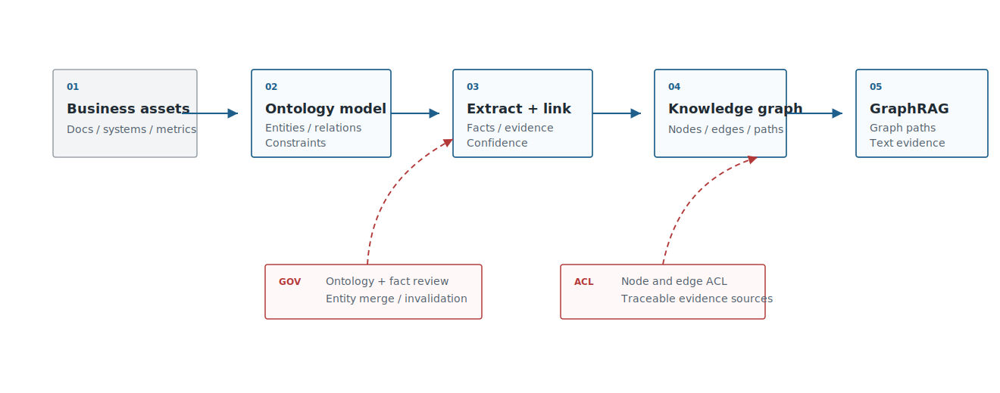
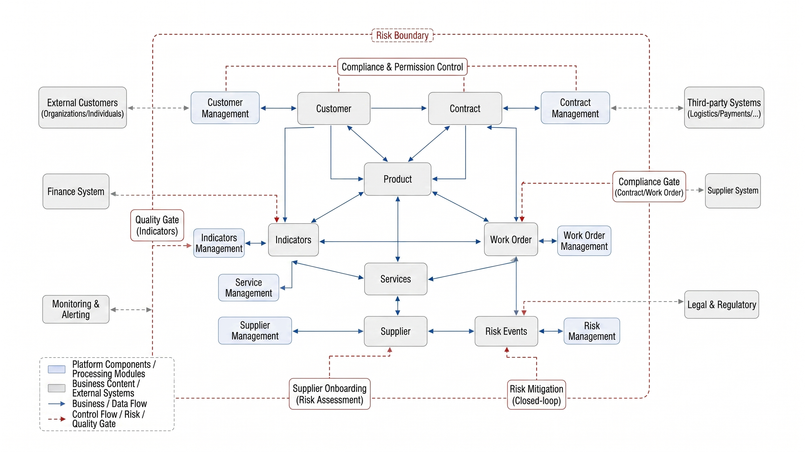
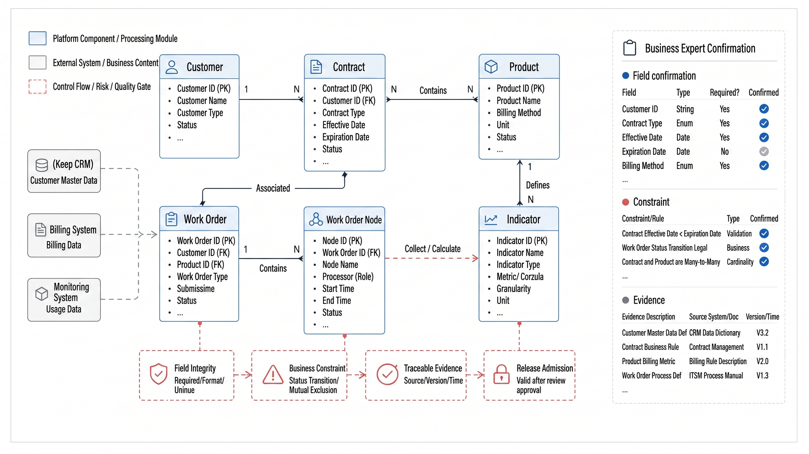
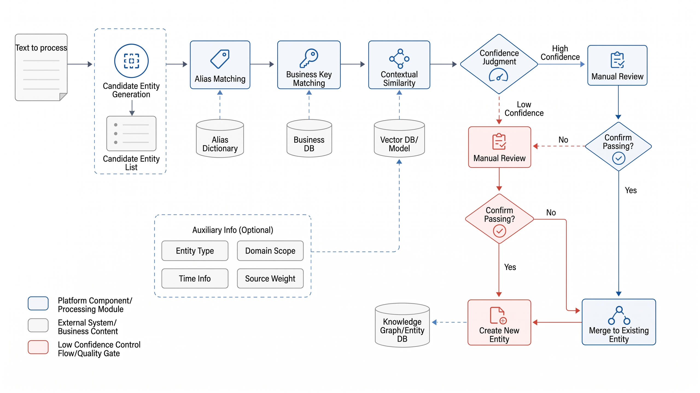
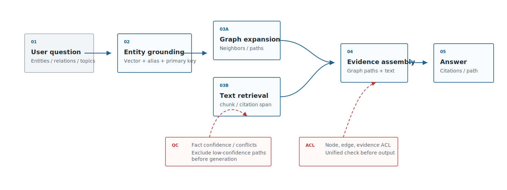
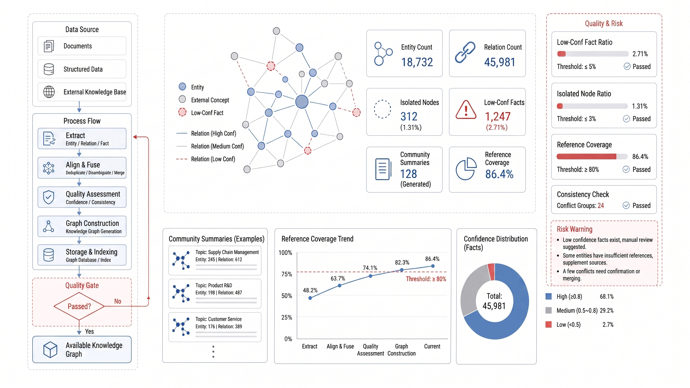

# Chapter 21 Knowledge Engineering: Ontologies, Extraction, and Knowledge Graphs

---

This chapter discusses ontologies, extraction, and knowledge graphs in knowledge engineering. It explains how conceptual models, entity relationships, GraphRAG, and knowledge asset governance complement pure vector retrieval. While vector retrieval excels at finding similar snippets, it struggles to answer questions requiring relational reasoning, such as "Which contracts are associated with this supplier, and which contracts trigger which risks?" This chapter clarifies how ontologies build conceptual models for business, how information extraction and entity linking transform text into structured relationships, and how GraphRAG integrates knowledge graphs with vector retrieval.

RAG excels at finding evidence within documents, but many enterprise questions are not simply "which text segments are relevant," but rather "which entities, relationships, rules, and business definitions together form the answer." Which group does a client belong to? Which products are constrained by a contract? Which fields do metrics depend on? Which services are affected by an incident? What is the relationship between suppliers and defective batches? These questions require knowledge engineering: distilling business entities, relationships, constraints, and evidence into governable knowledge assets.

## 21.1 Positioning Enterprise Knowledge Engineering

Knowledge engineering is not simply adding a "knowledge graph plugin" to RAG. It is a systematic engineering approach to explicitly represent business semantics: ontologies define objects and relationships; extraction processes generate facts from documents and systems; entity linking aligns aliases and duplicates; graph databases support relational queries; GraphRAG combines graph structures with textual evidence to feed the LLM.

When discussing knowledge engineering, it is important to clearly separate RAG, semantic layers, knowledge graphs, and GraphRAG as shown in Table 21-1, to avoid conflating all "knowledge enhancement" solutions into one. Each capability handles different objects and excels at different problems.

*Table 21-1: Boundaries of RAG, Semantic Layers, and Knowledge Graphs. Source: Compiled from this book.*

| Capability           | Primary Objects                         | Good At                                     | Not Good At                         |
|---------------------|----------------------------------------|---------------------------------------------|-----------------------------------|
| Document RAG        | Chunks, documents, citations           | "What does the policy say?""Where is the contract clause?" | Complex relationships, global aggregation, entity disambiguation |
| DataAgent Semantic Layer | Metrics, dimensions, table fields, SQL | "How is this metric calculated?""Which tables to query?" | Unstructured relationships and open-text evidence |
| Knowledge Graph     | Entities, relationships, events, rules | "Which objects affect each other?""What is the relation chain?" | Open generation without evidence text |
| GraphRAG            | Graph structure + textual evidence     | "Cross-document, cross-entity comprehensive answers" | Poor ontology and extraction quality amplifies errors |

These capability boundaries determine the order of platform investment: basic policy Q&A may not require a graph; DataAgent metrics usually enter the semantic layer first; only when questions start to rely on entity relations, impact chains, and cross-document synthesis does the knowledge graph become a core asset. Table 21-2 further breaks this down into investment, maintenance, and security concerns for platform leaders.

Be cautious not to push all knowledge problems onto graphs. Graphs suit stable entities, well-defined relationships, and questions requiring impact tracking; if business objects lack unified keys, document sources frequently change, and relationship definitions vary by team, premature graph building only adds maintenance burden. Many policy Q&A needs are met by good parsing, chunking, citation, and access controls; many metric questions fit better in semantic layers and data catalogs. The criteria for knowledge engineering are not technological sophistication but whether relation modeling reduces errors, improves review efficiency, and gains long-term business owner buy-in.

*Table 21-2: Key Decision Points for Platform Leaders in Knowledge Engineering. Source: Compiled from this book.*

| Decision Question          | Recommended Judgment                                                           |
|---------------------------|--------------------------------------------------------------------------------|
| Whether to build a knowledge graph now | Worth it if questions involve entity relations, impact analysis, cross-document synthesis, and long-term governance; otherwise start with RAG for general policy Q&A. |
| Whether to deploy GraphRAG | Only after graph, ontology, extraction quality, and evidence chain are stable; errors in graphs become more convincingly wrong in GraphRAG. |
| Who maintains the ontology | Must involve both business owner and platform owner; cannot rely solely on algorithms or single application teams. |
| Where is the security boundary | Nodes, edges, evidence, and community summaries all require permissions; ACLs only on documents are insufficient. |
| Minimum launch threshold    | Each fact must have source, evidence, confidence, extractor version, review status, and lifecycle. |

Figure 21-1 breaks down the technology stack into ontology, extraction, entity linking, graph storage, GraphRAG, and governance layers, showing that GraphRAG is only one way to consume knowledge assets - poor quality upstream causes more structured errors downstream.



*Figure 21-1: Enterprise Knowledge Engineering Technology Stack. Source: Self-drawn for this book. Alt text: Layered bottom-up-data sources, information extraction, ontology/entity linking, knowledge graph storage, GraphRAG retrieval, upper-layer applications; arrows show how text is processed stepwise into inferable knowledge assets.*

From the asset map perspective in Figure 21-2, enterprise knowledge is no longer just documents but includes customers, contracts, metrics, fields, services, risk events, and their interrelations. Starting knowledge engineering begins with discussing this scope map.



*Figure 21-2: Knowledge Asset Map of a Group Enterprise. Source: Self-drawn for this book. Alt text: Map segmented by business domains (sales, supply chain, finance, HR, etc.), marking core entities and cross-domain relationships, showing the overall distribution and connection points of group knowledge assets.*
## 21.2 Ontology Modeling and Business Semantic Layer

An ontology is the backbone of knowledge engineering. It defines which entities, relationships, attributes, and constraints the enterprise cares about. Without an ontology, LLM extraction ends up producing "a different set of fields for each batch of documents"; without a business semantic layer, knowledge graphs become isolated collections of nodes that cannot serve DataAgent, RAG, or process automation.

The first version of the ontology does not aim to cover all business areas at once, but it must ensure that every entity, relationship, attribute, constraint, and piece of evidence listed in Table 21-3 has maintainable fields.

*Table 21-3: Minimal Enterprise Ontology Objects. Source: Compiled by the authors.*

| Object          | Example                                     | Key Fields                           |
|-----------------|---------------------------------------------|------------------------------------|
| Entity Type     | Customer, Contract, Product, Metric, Service, Work Order, Risk Event | Name, Alias, Business Key, Source System |
| Relation Type   | Signed, Belongs to, Depends on, Affects, Violates, Similar | Direction, Cardinality, Confidence, Evidence Source |
| Attribute       | Contract Amount, Customer Level, Service Owner | Data Type, Unit, Validity Period   |
| Constraint      | A contract must belong to one customer      | Validation Rule, Exception Handling |
| Evidence        | Document snippet, SQL, System log, Manual annotation | Source, Page, Span, Timestamp      |

Together, these objects answer one question: Why is the fact in the graph trustworthy? If there are only entities and relations, but no evidence, constraints, or provenance, GraphRAG simply replaces unverifiable text with an unverifiable graph.

Ontology modeling must be driven by business problems, not by graph database syntax. Legal cares about contract clauses, risk types, and approval opinions; operations care about services, dependencies, incidents, and changes; DataAgent cares about metrics, fields, tables, and definitions. Each ontology object must be able to answer: Who maintains it, where does it come from, which problems is it used for, and what impact do errors cause?

The knowledge graph needed by DataAgent may not be large initially, but it must link key business objects: which fields metrics depend on, which tables those fields belong to, which data domains tables come from, which reports and business processes use the metrics, and which historical SQL queries are affected by definition changes. This enables DataAgent to perform impact analysis and explain definitions before generating queries, rather than relying solely on prompts to remember business semantics.

Ontology change management must be as rigorous as code or data model changes. Adding a new entity type may require updating extractors, graph database schema, access control rules, evaluation samples, and downstream tools. Changing the direction of a relationship can alter the meaning of existing path queries. Merging two concepts can affect historical facts and references. A prudent approach is to establish versioning, review, migration, and deprecation mechanisms for the ontology. Business owners are responsible for semantic correctness; platform owners are responsible for interfaces and governance; data owners are responsible for source systems and key consistency. Without this process, the ontology quickly becomes a shared configuration that no one dares to change.

The ontology modeling roadmap in Table 21-4 also follows the preceding principle of business-driven design: cold start can be document-driven, but long-term governance must return to business objects and relationship boundaries.

*Table 21-4: Ontology Modeling Trade-offs. Source: Compiled by the authors.*

| Approach                | Advantages                        | Cost                              | Applicable Scenarios        | mini-platform Choice        |
|-------------------------|---------------------------------|----------------------------------|----------------------------|-----------------------------|
| Document-Driven Extraction | Fast startup, covers historical documents | Ontology drifts easily, weak fact consistency | Early exploration, knowledge base enhancement | Used as cold start input     |
| Business-Object Driven Ontology | Stable structure, easier governance and access control | Requires business experts early on | Core assets: contracts, customers, metrics, services | Default approach            |
| Relationship-First Modeling | Suitable for dependency and impact analysis | May ignore attributes and evidence | Operations, supply chain, risk propagation | Used as scenario extension   |
| OWL/RDF Standard Modeling | Rigorous semantic expression, complete standard ecosystem | Higher learning and engineering cost | Compliance, cross-organization data exchange | Investigate first, not default |

For a mini-platform, the conclusion is clear: do not start with a full OWL/RDF system. Instead, first build solid business entities, relations, evidence, and version governance, then introduce standard semantic technologies as needed for compliance or cross-organization exchange.

The collaborative ontology modeling method in Figure 21-3 should also follow this principle. The schema should not be designed behind closed doors by the algorithm team, but co-confirmed by business owners, data owners, and platform teams on objects, relationships, constraints, and evidence.



*Figure 21-3: Enterprise Ontology Modeling Workshop Whiteboard. Source: Drawn by the authors. Alt text: The whiteboard uses sticky notes and lines to label core entities (Customer, Contract, Product) and their relationships (Signed, Contains, Related), illustrating the collaborative process between business and technology to define the ontology.*
## 21.3 Information Extraction and Entity Linking

Information extraction converts text, tables, and system records into entities and relations. Traditional NER/RE, rule-based methods, LLM extraction, and VLM page understanding can all contribute, but enterprise systems care more about the verifiability of extraction results. Each fact should ideally include evidence, confidence, source, extractor version, and review status.

When comparing extraction approaches in Table 21-5, the emphasis remains on verifiability. Rules, traditional models, LLMs, VLMs, and human review are not mutually exclusive choices, but are combined according to fact risk and document format.

*Table 21-5: Information Extraction Approaches. Source: compiled by the author.*

| Approach           | Advantages                      | Risks                                    |
|--------------------|--------------------------------|------------------------------------------|
| Rules and Dictionaries | Explainable, stable, low cost   | Low coverage, increasing maintenance cost |
| Traditional NER/RE  | Suitable for fixed entity types and bulk text | Requires labeled data, limited cross-domain transfer |
| LLM Extraction     | Quick to start, handles complex semantics | Hallucination, format drift, cost and consistency issues |
| VLM Extraction     | Suitable for invoices, screenshots, page layouts | Low confidence and visual misjudgments require review |
| Human Review       | High quality for high-risk facts | High cost, limited throughput            |

This explains why the later fact JSON must retain `evidence`, `confidence`, `extractor`, and `review_status` fields. Without these, even the most advanced extraction pipeline cannot enter enterprise governance.

Entity linking is high-risk for knowledge graph functionality. `Alibaba Cloud`, `Aliyun`, and `Ali Cloud` may represent the same provider; "key account customer" and "strategic customer" may be synonyms in some business lines but not others. Entity linking must combine names, aliases, business keys, source systems, context, and human confirmation. It cannot rely solely on embedding similarity.

Entity linking errors are more dangerous than extraction omissions. Missing one relation causes under-answering by the system; wrongly merging two distinct customers, suppliers, or metrics causes unrelated facts to connect, and GraphRAG may generate seemingly coherent explanations following this incorrect path. Conversely, splitting one entity into multiple nodes affects analysis and risk aggregation by missing high-risk links. Therefore, entity linking should retain candidates, scores, decision basis, and human review status. For high-risk entities, a "candidate first, confirm later" write strategy should be adopted.

```json
{
  "subject": {"type": "Contract", "id": "contract-2026-001"},
  "predicate": "belongs_to",
  "object": {"type": "Customer", "id": "customer-8842"},
  "evidence": {
    "source_id": "contract-2026-001",
    "page": 1,
    "span": "Party A: East China Branch"
  },
  "confidence": 0.91,
  "extractor": "llm-extractor-v2",
  "review_status": "approved"
}
```

The key pathway for entity linking in Figure 21-4 follows the same principle: name similarity is only a candidate source, final confirmation must combine business keys, source systems, contextual evidence, and human review to avoid incorrectly merging same-name customers, products, or similar metrics.



*Figure 21-4: Entity Linking and Disambiguation Process. Source: drawn by the author. Alt text: The process starts with identifying entity mentions in text, generating candidate entities, context disambiguation, and linking to a unique knowledge base ID. Arrows show how same-name entities are disambiguated to the correct node.*
## 21.4 Graph Databases and GraphRAG Architecture

Graph databases provide relationship storage and query capabilities; Neo4j, NebulaGraph, and similar systems can all serve as the backbone of an enterprise knowledge graph. The core idea of GraphRAG is not to "stuff the graph into a prompt," but to let the graph structure assist with retrieval, aggregation, path explanation, and community summarization. Microsoft GraphRAG extracts documents into a graph, performs community detection and summarization, and then supports global and local search; Neo4j's GraphRAG ecosystem emphasizes combining graph queries with vector retrieval. These two approaches both demonstrate that graphs and vectors are complementary, not competing.

GraphRAG retrieval should be decomposed into several distinct modes, as shown in Table 21-6, so that teams can route queries by problem type. Not every question warrants a global search, and not every question should pass through graph queries first.

*Table 21-6: GraphRAG retrieval modes. Source: compiled by the authors.*

| Mode | Approach | Suited for |
|---|---|---|
| Local search | Start from an entity and traverse neighbors, paths, and evidence | Localized relationships for a specific customer, contract, or service |
| Global search | Answer based on community summaries or global themes | Cross-department, cross-document, or trend-level questions |
| Vector + Graph | Vector search identifies candidate entities/documents; the graph then expands relationships | Queries expressed vaguely by the user but pointing to a locatable target entity |
| Graph + Text evidence | Graph paths supply structure; document chunks supply evidence | High-stakes answers and synthesis questions that require citations |

Production systems typically combine these modes: vector search first locates candidate entities, the knowledge graph expands relationships, and text evidence provides citations. High-stakes answers in particular must retain the final text-evidence step rather than presenting only graph paths.

The principal risk with GraphRAG is that **a wrong graph is more persuasive than no graph at all**. If an erroneous relationship enters the knowledge graph, the LLM may follow it to produce a structurally coherent but factually incorrect explanation. GraphRAG responses must therefore include facts, evidence, and confidence scores-more than node paths.

A second risk is **structured hallucination**. The system may retrieve a real path yet interpret the relationships along that path as stronger causal connections than they actually are; it may also treat a generalized description from a community summary as a fact about a specific entity. GraphRAG answers should clearly distinguish three categories of content: "a relationship exists in the graph," "the evidence text supports this conclusion," and "the model has inferred this from the relationship." For high-stakes questions, graph paths should serve only as an organizing framework; final conclusions must still be grounded in text evidence, factual confidence scores, and effective timestamps.

The GraphRAG pipeline shown in Figure 21-5 consists of several stages: vector recall, graph expansion, text evidence retrieval, and answer generation. Graph paths provide structure; text chunks provide evidence; both must carry access-control and version metadata.



*Figure 21-5: GraphRAG retrieval architecture. Source: original illustration by the authors. Alt text: A query fans out simultaneously to vector retrieval for relevant passages and to graph traversal for related entities; the two result streams are merged before being passed to generation, with arrows illustrating how GraphRAG combines semantic similarity with relational reasoning.*
## 21.5 Knowledge Asset Governance

After a knowledge graph goes live, the main task is not to continue extraction but to govern it. Entities will merge and split, relationships will expire, contracts will change, metric scopes will adjust, and business terminologies will be renamed. Knowledge asset governance must answer: who owns the ontology, who reviews facts, which relationships can be used by Agents, which facts are expired, and which answers reference those facts.

Governance should be broken down into verifiable items as shown in Table 21-7, absorbing all previous content: ontologies must be versioned; facts must have sources; nodes and edges must have permissions; Agent usage of the graph must be traceable.

*Table 21-7: Knowledge Asset Governance Checklist. Source: Compiled by the author.*

| Governance Item | Requirements |
|---|---|
| Ontology Versioning | Entity types, relation types, attributes, and constraints can be versioned |
| Fact Source | Each fact has source, evidence, extractor, and reviewer |
| Permission Boundaries | Graph nodes and edges inherit business system ACL or have separate configuration |
| Lifecycle Management | Creation, update, deprecation, merge, and split have audit trails |
| Quality Evaluation | Extraction accuracy, linking accuracy, conflict rate, and orphan node rate are observable |
| Agent Usage | Which tools, RAG processes, and DataAgent queries use the graph must be traceable |

In engineering practice, Project 14 can implement a small GraphRAG knowledge graph builder: extracting customers, contracts, products, and risk clauses from contracts and customer data, writing them into a graph database, constructing references from entities to document chunks, and enabling RAG to simultaneously return graph paths and textual evidence.

```bash
cd mini-platform/projects/14-graphrag-kg-builder
./run.sh --config configs/contracts_graphrag.yaml
```

The report in Figure 21-6 for Project 14 should also serve governance purposes rather than only displaying a pretty node-relationship graph. It should simultaneously show ontology versions, extraction quality, entity linking quality, graph scale, failure examples, and GraphRAG answer citations.



*Figure 21-6: GraphRAG Knowledge Graph Construction Report. Source: Author's own. Alt text: The report page shows indicators such as the number of extracted entities, number of relations, disambiguation accuracy, proportion of orphan nodes, etc., and lists low-confidence relations awaiting manual review, reflecting quantifiable graph construction quality.*

## 21.6 Ontology changes and semantic-layer coordination

Ontology changes affect downstream extraction, graph queries, permissions, and DataAgent reasoning. When an entity type, relation type, or constraint changes, the platform should assess affected extractors, graph schema, semantic-layer mappings, evaluation samples, and answer templates. Business owners approve semantic meaning; platform owners manage interfaces and rollout; data owners confirm source keys and lineage.

Chapter 33's semantic layer and the knowledge graph should coordinate rather than duplicate definitions. Metrics, dimensions, and table fields usually belong in the semantic layer; entity relationships, contract links, service dependencies, and evidence-backed facts belong in the graph. DataAgent can combine them when a question needs both metric calculation and relationship explanation.

## 21.7 Applicability boundary for GraphRAG

GraphRAG is useful when questions rely on entities, relationships, impact chains, or cross-document synthesis. It is unnecessary for simple policy Q&A where structured chunks and citations already provide reliable answers. It is risky when ontology quality, extraction accuracy, and permission boundaries are immature, because errors in a graph can make generated answers look more coherent than the evidence supports.

The production boundary should be explicit. Use GraphRAG for supplier-contract-risk chains, service dependency analysis, incident impact tracing, and metric lineage explanations. Keep ordinary document lookup on RAG until relation modeling clearly reduces errors or review effort.

## 21.8 Extraction quality and human verification

Extraction quality should be measured by entity accuracy, relation accuracy, linking accuracy, orphan node rate, conflict rate, and evidence coverage. Average extraction accuracy is insufficient if high-risk relation types, such as contract liability or customer ownership, remain unreviewed. Facts should carry confidence, evidence, extractor version, and review status.

Human verification should focus on high-impact facts, low-confidence relations, entity merges, and ontology changes. Reviewed facts become training and regression samples for extraction. Rejected facts should also be retained as negative samples so future extractors do not repeat the same mistakes.

## 21.9 Permission and audit for knowledge assets

Knowledge graphs introduce permission problems beyond document ACLs. Nodes, edges, evidence snippets, community summaries, graph paths, and derived explanations may each expose sensitive information. A user allowed to read a public supplier profile may still be unauthorized to see litigation risk edges or contract amount evidence.

The platform should evaluate permissions before graph traversal, before evidence expansion, and before answer generation. Audit logs should record the user, query, graph version, traversed entities, returned edges, cited evidence, and masking policy. This allows incident review when a relationship leak occurs through a seemingly harmless graph answer.

## 21.10 Product boundary for knowledge engineering

Knowledge engineering should start with a narrow product boundary. A first release may cover a few entity types, a few relation types, and a small set of high-value questions. It should prove extraction quality, review workflow, permission control, and answer citation before expanding to a full enterprise graph.

The product boundary also prevents premature OWL/RDF-first design. Standards are useful when cross-organization exchange, formal reasoning, or compliance demands them, but many enterprise teams first need stable business keys, evidence, lifecycle, and governance. Once those basics are in place, standard semantic technologies can be introduced deliberately instead of becoming an early modeling burden.

## Chapter Recap

Knowledge engineering makes enterprise business semantics explicit from implicit text and system fields. RAG can find document evidence, knowledge graphs can organize entity relationships, and GraphRAG combines both to support complex Q&A and impact analysis. The challenges usually lie not in graph database syntax, but in ontology design, extraction, entity linking, evidence, permissions, and lifecycle governance.

- Knowledge engineering is more than a RAG plugin; it is a business semantic assetization project.
- Ontologies must be derived from business questions, also from graph database structures.
- LLM extraction must include evidence, confidence, version, and review status.
- GraphRAG should return both graph paths and textual evidence to avoid structured hallucinations.

- [ ] Are entity types, relation types, attributes, and constraints defined?
- [ ] Does each fact have evidence, source, extractor version, and review status?
- [ ] Does entity linking combine business keys, aliases, context, and human review?
- [ ] Do graph nodes and edges have permission and lifecycle management?
- [ ] Does GraphRAG output include cited evidence, more than graph paths?
## References

- Microsoft GraphRAG: https://microsoft.github.io/graphrag/
- Neo4j GraphRAG documentation: https://neo4j.com/docs/neo4j-graphrag-python/current/
- NebulaGraph documentation: https://docs.nebula-graph.io/
- W3C RDF: https://www.w3.org/RDF/
- W3C OWL: https://www.w3.org/OWL/
- DataHub Glossary: https://datahubproject.io/docs/glossary/
