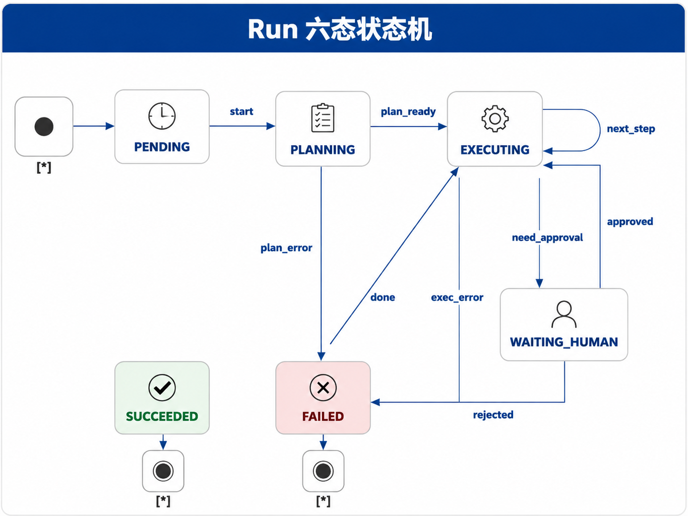
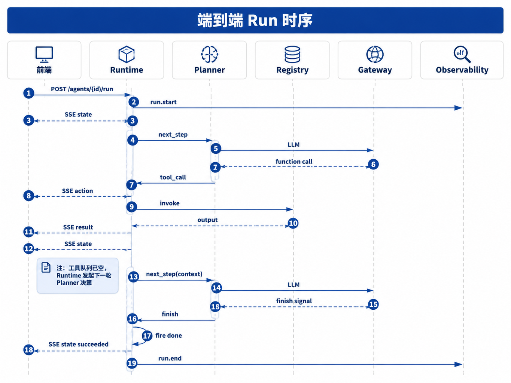

# 第22章 Agent Runtime

---

Agent Runtime 定义企业 Agent 的执行契约。一次任务通常是一条可暂停、可恢复、可审计的链路：模型规划步骤，Runtime 执行工具，前端展示进度，审计系统还原每次动作。没有 Runtime，长任务刷新页面后很难续跑，工具调用失败后也难以判断该重试、人工审批还是终止。本章以 Run、Step、Tool Call 三个对象为主线，展开 Run 六态、SSE 事件流、检查点、失败分类和 mini-platform 中的实现边界。用户通过 DataAgent 发起一个经营分析任务：先查上周销售数据，再定位异常 SKU，必要时生成一份说明并发起人工确认。前端只看到进度从“规划中”变成“执行中”，但后台已经经历了多轮模型判断、SQL 工具调用、结果校验和可能的审批等待。

如果平台只把这次交互当作聊天消息，很多问题无法处理。用户刷新页面后任务从哪里继续？SQL 工具超时后是重试还是终止？模型说“任务完成”时，工具队列是否真的清空？审批挂起 48 小时后，原来的上下文还能不能恢复？这些问题都属于 Runtime，Prompt 或 Planner 单独解决不了。Agent Runtime 的职责，是把一次用户任务变成一条可观察、可恢复、可审计的 Run。Planner 提议下一步，Registry 找到工具，Gateway 调模型，Console 展示进度；Runtime 负责把这些组件串成一条受控执行链。Agent Runtime 是很多企业试点走向生产时才真正意识到的缺口。聊天原型可以把用户输入、模型输出和工具结果放在同一个会话里；生产任务却会跨越多轮规划、多个工具、审批等待、外部系统超时和用户离开页面后的恢复。没有 Runtime，一次看似普通的经营分析就会变成一串无法复盘的异步动作。

Runtime 要回答的是“这次任务当前处于什么状态，下一步由谁负责，失败后如何恢复”。如果平台只关心“模型下一句说什么”，就无法管理长任务、工具副作用和人工审批。Run、Step 和 Tool Call 的分层让平台能分别管理任务生命周期、推理决策和副作用。用户刷新页面、服务重启、工具超时或人工审批延迟时，系统仍能回到同一个 run_id 上继续，而非重新生成一个近似任务。企业里最危险的做法是让每个 Agent 应用自己写执行循环。一个应用把工具失败当成重试，另一个应用直接终止；一个应用把审批写在前端，另一个应用写在后端；日志字段也各不相同。试点阶段看不出问题，审计、SLO 和事故复盘时会发现平台没有统一事实来源。

## 22.1 Runtime 的对象模型

### 22.1.1 Run / Step / Tool Call 的必要性

Runtime 最容易出错的地方，是把会话、推理轮次和工具调用混成一个对象。会话面向 UI，回答“用户在哪个聊天窗口里”；Run 面向任务，回答“一次可审计任务从哪里开始、到哪里结束”；Step 面向推理轮次，回答“Planner 第几次决定下一步”；Tool Call 面向副作用，回答“哪个工具被谁用什么参数执行，结果是什么”。财务分析、客服工单、合同审阅这类任务都可能跨多个系统。只记录会话 ID，审计员无法知道第 3 次工具调用是否经过审批；把每次工具调用都当成新任务，又无法在人审等待后恢复原任务。Run / Step / Tool Call 分层，是为了同时满足任务级 SLA、推理轨迹和副作用审计。

*表22-1：Run、Step 与 Tool Call 的职责边界。来源：本书整理。*

| 对象 | 代表什么 | 主要字段 | 典型用途 |
|---|---|---|---|
| Run | 一次可审计任务 | `run_id`, `agent_id`, `input`, `context`, `state` | SLA、检查点、审批、审计 |
| Step | Planner 的一轮决策 | `run_id`, `step_index`, `planner_output` | 组织多轮规划和工具反馈 |
| Tool Call | 一次实际工具执行 | `tool_call_id`, `tool`, `args`, `status`, `output` | 回放、幂等、错误分类 |

这三个对象的关系很简单：一次 Run 包含多轮 Step；一轮 Step 可以产生零次、一次或多次 Tool Call。Planner 只提出 Tool Call 意图，执行动作必须由 Runtime 通过 Registry 完成。

### 22.1.2 `/run` 请求契约

一次 `POST /agents/{agent_id}/run` 对应一个 Run。长任务等待审批时仍使用同一个 `run_id`，不要新开聊天窗口或创建新的任务 ID。
```json
{
  "input": "上周华东区销售下滑的主要 SKU 是什么？",
  "context": {
    "user_id": "u-ops-001",
    "tenant_id": "demo-retail",
    "scope": ["sales_region:east"]
  },
  "options": {
    "idempotency_key": "optional-client-key",
    "max_steps": 20
  }
}
```

`context` 要原样传给 Policy 和工具层。`idempotency_key` 用于客户端重试，避免重复执行发邮件、创建工单、写数据库这类有副作用的动作。`max_steps` 是死循环保护的一部分，防止模型在同一类工具调用中反复尝试。

### 22.1.3 Runtime 与相邻组件

Runtime 不替代 Planner、Tool Registry 或 Policy。它的职责是推进 Run 状态、执行已授权工具、推送事件、写检查点，并在失败时选择恢复路径。

*表22-2：Runtime 与相邻组件的分工。来源：本书整理。*

| 组件 | Runtime 做什么 | 组件自身负责什么 |
|---|---|---|
| Planner | 调用 `next_step()`，接收结构化决策 | 生成下一步计划，不直接执行工具 |
| Tool Registry | 按工具名和版本查找 handler | 管理工具 schema、版本和描述 |
| Policy | 在高风险动作前请求裁决 | 鉴权、审批策略、风险判断 |
| Memory | 读取或写入 Planner 可见上下文 | 长短期记忆、摘要、检索片段 |
| Console | 推送状态与审批事件 | 展示进度、接收人工审批回调 |

业界常把 Agent 能力拆成规划、记忆、工具使用等模块 (Wang et al. 2024)。Runtime 是连接这些模块的执行层，负责让它们按照同一条任务生命周期运行，避免各组件各自推进状态。把 Runtime 下放给每个业务 Agent 看似灵活，实际会很快失控。一个团队把工具超时当成失败，另一个团队把同样的超时重试三次；一个团队在前端断线后重跑任务，另一个团队从检查点恢复；安全团队想查同类高风险工具调用时，却发现每个 Agent 的日志字段都不同。Runtime 平台化的价值正在这里：它把状态、事件、错误码和恢复语义固定下来，让业务 Agent 只关心任务逻辑。

---

## 22.2 Run 六态状态机

### 22.2.1 状态定义

Run 六态是 Runtime 对外暴露的生命周期。编排框架内部可以有更多节点和子图，但 Console、SLA、告警、检查点和审计应以 Run 六态为准。

*表22-3：Run 六态的含义与典型迁移。来源：本书整理。*

| 状态 | 含义 | 典型迁移 |
|---|---|---|
| `pending` | Run 已创建，尚未开始规划 | `start` |
| `planning` | Planner 正在生成下一步决策 | `plan_ready`, `plan_error` |
| `executing` | Runtime 正在执行工具，或准备进入下一轮规划 | `next_step`, `done`, `need_approval`, `exec_error` |
| `waiting_human` | 执行被有意暂停，等待人工审批或回调 | `approved`, `rejected` |
| `succeeded` | Planner 已结束，且没有未完成 Tool Call | 终态 |
| `failed` | 不可恢复错误、审批拒绝、取消或重试耗尽 | 终态 |

`waiting_human` 表示 Runtime 明确进入暂停状态，不是任务卡死。合规场景里，审批等待时间通常要单独统计，不能简单算入模型或工具执行延迟。这点对长任务很关键。审批等待可能持续数小时甚至数天，但 Runtime 仍要保留原 Run 的身份、上下文和检查点。否则审批通过后重新创建任务，既会丢失之前的工具结果，也会让审计链断成两段。同一个 `run_id` 贯穿等待、审批、恢复和最终导出，业务责任和技术执行才能对齐。普通聊天后端只需要保存一段问答；Runtime 还要说明任务在哪个状态暂停、哪个工具已经执行、哪个审批仍在等待，以及恢复后从哪里继续。

### 22.2.2 迁移图



*图22-1：Run 六态状态机。来源：本书自绘。Alt text：状态机包含 pending、planning、executing、waiting_human、succeeded、failed 六个节点，箭头表示从创建、规划、执行、人工等待到成功或失败的合法迁移。*

图 22-1 的关键规则是：终态只能由 Runtime 触发。模型可以在文本中说“任务完成”，Planner 也可以返回结束意图，但 Runtime 还要确认工具队列为空、审批已完成、失败已处理，才能进入 `succeeded`。

### 22.2.3 与编排图状态的区别

第25章会讨论 Planner 和编排模式。编排图状态属于 Planner 内部实现，例如某个 LangGraph 节点、子图或路由分支。Run 六态属于平台契约，对前端、审计和告警可见。两者不应混用。如果把内部编排节点直接暴露给前端，用户会看到大量与业务无关的技术状态；如果把 Run 六态折叠进 Planner 内部，Runtime 又无法独立处理取消、审批、重试和恢复。因此，内部编排可以复杂，对外生命周期必须稳定。

---

## 22.3 执行循环与事件流

### 22.3.1 主循环

Runtime 的主循环可以先压缩成四步来看：创建 Run、调用 Planner、执行工具、依据结果继续规划或进入终态。先把这条最短路径看清楚，后面的重试、审批和回放机制才有锚点。
```text
create run -> planning
while run is not terminal:
  planner_output = planner.next_step(context)
  if planner_output asks for tools:
      validate policy and tool schema
      emit action event
      execute tool through registry
      emit result event
      update checkpoint
  elif planner_output asks to finish and no tool is pending:
      mark succeeded
  elif approval is required:
      mark waiting_human
  else:
      classify error and recover or fail
```

这段伪代码里有两个边界：Planner 只返回决策，不驱动状态机；工具调用必须先经过 schema 校验、权限判断和幂等控制，再进入执行器。主循环还要避免把“模型继续想一想”变成无限执行。每一轮 Step 都应消耗预算：模型调用次数、工具调用次数、总耗时和上下文长度都要计入同一个 Run。预算的作用是给失败设置边界。没有预算的 Runtime 很容易在工具参数反复修正、检索结果不满足条件或 Planner 犹豫不决时陷入循环。

### 22.3.2 端到端时序



*图22-2：端到端 Run 时序。来源：本书自绘。Alt text：时序图展示客户端、Runtime、Planner、Tool Registry 和模型网关之间的调用顺序，从 /run 请求到状态迁移、工具调用、事件流推送和最终返回。*

图 22-2 展示 Runtime 视角的执行链。ReAct 把推理和行动组织成交错轨迹 (Yao et al. 2023)，工程上则需要把“行动”落成 Tool Call 记录，并把“观察”落成工具结果事件。OpenAI Agents SDK 的流式运行项也区分工具调用和工具返回事件 (OpenAI n.d.)，前端与审计系统因此能看到执行过程，而非只看到一段最终回复。

### 22.3.3 SSE 事件

聊天模型的 token 流只能说明模型正在生成文本，不能证明系统执行了哪个工具。Agent SSE 应至少包含三类事件。

*表22-4：Agent SSE 事件类型。来源：本书整理。*

| 事件 | 含义 | 关键字段 |
|---|---|---|
| `state` | Run 状态变化或终态 | `run_id`, `state`, `step_index`, `answer` |
| `action` | 即将执行工具 | `tool_call_id`, `tool`, `version`, `args` |
| `result` | 工具执行结束 | `tool_call_id`, `status`, `output`, `error` |
| `approval_request` | 进入人工等待 | `approval_id`, `title`, `artifact_ref`, `requested_actions` |

`action` 与 `result` 必须成对出现。只有 `action` 没有 `result`，审计时就无法证明副作用是否发生。进入 `waiting_human` 时，Runtime 还要推送审批事件，Console 再把人工回调传回 Runtime。
```text
event: state
data: {"run_id":"run-8f3a","state":"planning","step_index":0}

event: action
data: {"run_id":"run-8f3a","tool_call_id":"tc-1","tool":"sql_executor","args":{"sql":"..."}}

event: result
data: {"run_id":"run-8f3a","tool_call_id":"tc-1","status":"succeeded","output":{"rows":[...]}}

event: state
data: {"run_id":"run-8f3a","state":"succeeded","answer":"华东区下滑 Top3 SKU 为..."}
```

SSE 使用 `text/event-stream`，事件格式和断线重连语义由 HTML Living Standard 定义 (WHATWG n.d.)。客户端断线后应带 `Last-Event-ID` 重连，服务端从事件日志或检查点继续推送，不能重新发起一次会产生副作用的 `/run`。

### 22.3.4 Trace 与 `run_id`

Runtime 还要把执行过程写入 Trace 系统。一次任务可能经过前端、Runtime、LLM Gateway、Tool Registry 和外部 SQL 服务。排查“慢在哪一步”时，需要用同一个 trace-id 串起这些服务的 span。`run_id` 与 trace-id 的用途不同。`run_id` 面向业务任务，用于 Console、审批、检查点和审计导出；trace-id 面向可观测性，用于性能分析、调用拓扑和告警。两者可以在 Observability 层建立映射，但不宜合并成一个字段，否则业务恢复语义会受到采样、过期和链路重建策略影响。分布式 Trace 可沿用 W3C `traceparent` 头和 OpenTelemetry 规范 (W3C 2021; OpenTelemetry n.d.)。排查事故时，这两个 ID 会一起出现。客服同事拿到的是 `run_id`，能定位用户看到的任务；SRE 拿到 trace-id，能定位慢调用和错误 span。两者映射清楚，团队才能从用户反馈走到系统调用，再从系统调用回到业务任务。

---

## 22.4 检查点与恢复

### 22.4.1 检查点保存内容

检查点是 Run 的可重启快照。进程崩溃、发布重启或节点迁移后，新进程读取检查点，应该能从最近的合法状态继续，不应要求用户重新提问。

*表22-5：Runtime 检查点的必要字段。来源：本书整理。*

| 类别 | 字段 | 为什么需要 |
|---|---|---|
| Runtime 状态 | `run_id`, `state`, `step_index`, `history` | 恢复状态机与迁移历史 |
| 请求上下文 | `input`, `context`, `options` | 保持权限、租户和任务语义 |
| 工具记录 | 未完成调用、已完成结果引用、错误码 | 避免重复副作用，重建 Planner 输入 |
| Memory 引用 | 会话 key、摘要、检索片段引用 | 防止 Planner 恢复后丢失上下文 |
| 事件位置 | 最后发送的 SSE event id | 支持断线后增量推送 |

只保存 `state=executing` 不够。比如经营分析任务已经拿到 SQL 结果，Pod 在下一轮规划前重启；如果检查点没有保存工具结果和 Memory 引用，Planner 恢复后可能重新选表或重算指标，导致恢复前后口径不一致。

### 22.4.2 何时写检查点

企业默认应在三类时机写入检查点：状态迁移成功后，Tool `result` 落盘后，进入或离开 `waiting_human` 时。写入过疏会放大崩溃窗口，写入过密会增加存储压力。高 QPS 短任务可以评估采样策略，但有副作用的工具调用结果不应跳过。存储上可以分两层。在线状态存 Redis 或其他低延迟 KV，TTL 对齐 Run 上限；审计归档存 PostgreSQL 或对象存储，采用追加写，便于回放和导出。本地开发可以用 SQLite 或文件目录模拟。

### 22.4.3 恢复流程

恢复流程也要受状态机约束。否则系统很容易在重试时重复执行副作用工具，或把已经进入人工审批的 Run 错误地拉回自动执行。

1. 根据 `run_id` 加载最近检查点，确认状态不是终态。
2. 重放状态历史和 Tool Call 结果引用，重建 Planner 可见上下文。
3. 如果状态是 `waiting_human`，等待 Console 回调，不自动继续执行。
4. 如果有未完成工具调用，先查询幂等键对应的执行状态，再决定补推 `result` 事件、重试或失败。
5. 客户端断线重连时，根据 `Last-Event-ID` 只推送未收到的事件。

LangGraph 等框架也会持久化图执行状态 (LangChain n.d.)。本书强调的区别是：Runtime 检查点以平台 `run_id` 为主键，服务的是 `/run` 契约和 Run 六态，不绑定某个编排框架内部节点名称。恢复流程最怕两件事：不知道工具是否执行过，又把同一动作重新执行了一次。因此，写操作工具必须与检查点一起设计幂等语义。创建工单、发邮件、写审批记录这类动作，执行前要带 `idempotency_key`，执行后要保存工具侧返回的业务 ID。恢复时先查询这个业务 ID 或幂等键，不要直接再次调用工具。还有一类恢复问题来自事件顺序。工具结果已经落盘，但 SSE 还没推到前端；或者前端已经收到 `action`，服务端在写 `result` 前重启。事件日志需要和检查点一起设计，至少保证同一个 `tool_call_id` 的 `action`、`result` 和状态迁移可以按顺序补发。否则用户界面会显示任务卡住，审计侧却能看到工具已经执行，两边对不上。

---

## 22.5 失败分类、超时与取消

### 22.5.1 错误码与恢复策略

Runtime 不能把所有失败都简单重试。模型超时、工具不可用、参数错误、上下文过长、策略拒绝和死循环的责任方不同，恢复路径也不同。

*表22-6：Runtime 失败分类与恢复策略。来源：本书整理。*

| 失败类型 | `code` | 默认处理 |
|---|---|---|
| 模型超时 | `MODEL_TIMEOUT` | 限次重试，必要时切换备用模型 |
| 工具不可用 | `TOOL_UNAVAILABLE` | 幂等场景重试，非幂等场景查询执行状态 |
| 工具参数错误 | `TOOL_ARGUMENT_INVALID` | 把 schema 错误反馈给 Planner，最多重试固定次数 |
| 上下文超长 | `CONTEXT_OVERFLOW` | 压缩历史，裁剪低优先级片段，或失败返回 |
| 死循环 | `LOOP_DETECTED` | 立即失败，记录重复参数摘要 |
| 策略拒绝 | `POLICY_DENIED` | 进入人工审批或失败 |
| 工具未注册 | `TOOL_NOT_FOUND` | 反馈 Planner 修正，仍失败则终止 |

参数错误通常不应立刻终止 Run。比如 Planner 生成 SQL 工具参数时漏掉 `tenant_id`，Registry 可以把 schema 错误写入 `result` 事件，再作为下一轮 Planner 输入。超过重试预算后，Runtime 才触发失败迁移。相反，策略拒绝和死循环不能盲目重试，否则会增加风险或拖垮共享资源。

### 22.5.2 三档超时

Runtime 至少需要三档超时：Run 总超时、Tool Call 超时和 LLM 请求超时。Run 超时决定整次任务是否进入失败或异步队列；Tool Call 超时决定是否按幂等键重试；LLM 超时交给 Gateway 的模型路由和重试策略处理。审批等待通常单独配置 `approval_timeout_s`，不直接等同于模型或工具超时。这三档超时不能写成一个全局配置。Run 总超时面向用户承诺和业务流程，可能是几分钟、几小时，甚至跨天；Tool Call 超时面向外部系统和幂等语义，通常要按工具类型配置；LLM 请求超时面向模型服务稳定性，更多由网关和模型路由处理。把它们合并以后，系统会出现两类问题：长任务被模型超时误杀，或者短工具因为 Run 总时长很长而迟迟不失败。超时结果也要进入状态和事件流。用户看到“任务失败”不够，前端和审计都需要知道是模型超时、工具超时、审批超时还是 Run 总超时。只有错误码清楚，后续评测才能区分模型能力问题、工具稳定性问题和流程设计问题。

### 22.5.3 取消语义

取消可以由用户、Console 或上游流程触发。取消后 Runtime 应停止未开始的工具队列，尽力取消进行中的调用，写入 `failed` + `RUN_CANCELLED`，并记录 `cancelled_at`。本书不把 `cancelled` 建成第七个 Runtime 状态，是为了保持 Run 六态稳定；如果未来单独建模取消态，状态机、SSE、检查点和前端展示必须同步更新。取消不是简单删除任务。已经执行的工具调用可能产生外部副作用，例如创建工单、发送邮件、写入审批记录或触发数据导出。Runtime 只能停止后续动作，并尽力把进行中的调用标记为取消请求；对于已经完成的动作，要通过补偿步骤或人工处理关闭风险。取消事件必须写入 trace，否则复盘时无法判断用户是在结果生成前取消，还是在外部动作执行后才取消。

---

## 22.6 Runtime 的代码边界

### 22.6.1 Runtime 的实现入口

Part V 各章共用 `projects/multi-agent-workflow/` 演示 Run 六态、Registry 工具调用、Handoff 和 `waiting_human`。`core/runtime/` 是平台模块，读代码可以从状态机、模型对象和主循环开始。
```text
mini-platform/core/runtime/
├── state_machine.py
├── run_models.py
├── run_loop.py
├── handoff_tool.py
├── approval.py
├── checkpoint.py
└── stub_planner.py

projects/multi-agent-workflow/
├── run.py
└── README.md
```

运行方式如下。
```bash
cd mini-platform
python3 projects/multi-agent-workflow/run.py start
python3 projects/multi-agent-workflow/run.py approve
```

自动化验证可以运行：
```bash
pytest tests/test_multi_agent_workflow_run.py tests/test_runtime.py -q
```

读这段实现时，不建议先从演示入口看起。更可靠的顺序是先看 `state_machine.py`，确认六态和迁移；再看 `run_models.py`，理解 RunContext 和 ToolCallRecord；然后看 `run_loop.py`，把状态迁移、工具执行、检查点和审批恢复串起来。这样读代码时不会把样例业务步骤误认为 Runtime 的通用能力。

### 22.6.2 Runtime 示例范围与后续演进

本章示例覆盖状态机、RunLoop、Registry invoke、SSE 事件、检查点和人工审批。生产版本还需要补 HTTP `/run` 服务、OpenTelemetry span、三档超时、持久化事件日志、分布式锁、工具幂等和审计导出。本章示例已经覆盖 Run 六态、Tool Call 执行、检查点、SSE、人工审批和基础日志，但这些能力距离生产还有一段距离。Run 六态需要和 HTTP API、SSE、检查点保持一致；Tool Call 执行还要补权限、幂等、超时和熔断；检查点不能长期停留在文件或轻量存储，应进入在线状态存储和审计归档；SSE 要支持 Last-Event-ID 和事件日志，才能处理断线重连；人工审批要接 Console、Policy 和工单系统；可观测性也要从基础日志扩展到 trace-id、span、指标和告警。

早期 Runtime 不必一次实现所有生产能力，但不能缺少三个底线：状态机不能被模型文本绕过，Tool Call 必须有 `action` / `result` 成对记录，检查点必须能恢复 Planner 可见上下文。如果只能选一个验收场景，建议选择“工具执行后进程重启”。这个场景会同时检验状态机、Tool Call 记录、检查点、幂等和 SSE 重连：恢复后不应重复执行工具，前端应继续看到后续事件，最终状态应与未重启时一致。

---

## 22.7 Runtime 的资源隔离与并发控制

Runtime 进入生产环境后，最容易被低估的是资源隔离。开发环境里，一个 Run 通常由单个用户触发，工具调用也比较少；上线后，同一租户可能同时发起多轮对话、批量任务和后台重试，不同租户之间还会争用模型配额、工具连接池、数据库查询资源和消息队列。Runtime 如果只维护状态机，不维护资源边界，就会出现一个长任务拖慢整个平台的情况。资源隔离至少要覆盖四个层面。第一是租户和用户级别的并发限制，避免单个调用方占满执行队列。第二是工具级别的限流，例如 CRM、工单、数据库和文件解析服务的调用能力不同，不能使用同一套重试策略。第三是模型级别的预算控制，把上下文长度、输出 token、重试次数和并发请求纳入同一个预算。第四是 Run 级别的超时与取消，确保用户取消任务后，后台工具调用、流式输出和临时文件都能被清理。

并发控制还要考虑幂等。用户刷新页面、前端重连、审批回调重放、队列消费者重启，都可能导致同一个 Step 被提交多次。Runtime 需要为 Tool Call、审批事件和恢复动作设计幂等键，不能简单依赖“上一次没有报错”。如果一个扣减库存、发送邮件或创建工单的工具被重复调用，事后很难通过模型解释弥补。对 Runtime 来说，幂等是把 Agent 从演示系统推进到业务系统的必要条件，不是附加能力。

## 22.8 事件重放与状态修复

Runtime 的状态不应只存在于内存对象里。长任务、人工审批、工具回调和前端断线都会让一次 Run 跨越多个进程生命周期。更稳妥的做法是把关键状态变化记录成事件：Run 创建、Step 开始、工具请求、工具结果、模型输出、审批挂起、审批恢复、取消、失败和完成。检查点保存的是可恢复快照，事件日志保存的是状态为什么变成这样。两者缺一不可。事件重放可以服务两类场景。第一类是事故复盘，团队需要知道某次错误回答前后发生了什么，而非只看最终消息。第二类是状态修复，系统重启后可以从最近检查点加载上下文，再用后续事件补齐状态。如果发现事件和快照不一致，Runtime 应当进入修复流程，而非继续执行。修复流程可以是自动回滚到安全状态，也可以是把 Run 标记为需要人工处理。

这套机制会增加存储和实现成本，但它把 Runtime 的责任讲清楚了：Runtime 还涉及调用模型和工具的循环，也是 Agent 行为的账本。第38章的 Trace 可以在事件之上做诊断视图，第30章的 HITL 可以把审批事件接入恢复链路，第39章的评测可以从失败事件中抽样。没有事件重放，平台只能看到一次运行的表面结果，很难建立可信的运行治理。

## 22.9 Runtime 与队列系统的分工

长任务通常需要队列，但队列不能替代 Runtime。队列负责调度执行单元、控制并发和处理消费者失败；Runtime 负责保存任务语义、状态迁移、工具结果和用户可见进度。若把业务状态只放在队列消息里，消息过期、重试或死信后，平台就很难恢复用户看到的任务状态。若 Runtime 不知道队列执行到了哪一步，也无法给前端稳定反馈。比较清晰的分工是：Runtime 创建 Run 和 Step，队列只接收可执行 Step 的引用；Worker 执行后把结果写回 Runtime，由 Runtime 决定下一步状态。队列重试时使用 Step 的幂等键，Worker 不直接推进业务状态。这样即使 Worker 崩溃，Runtime 仍然能知道 Step 处于等待、执行中、失败、可重试或需要人工处理。

这套分工还方便后续扩展。低风险同步任务可以不进队列，高耗时解析、批量工具调用和报告生成可以异步执行，高风险写操作可以等待审批后再投递。Runtime 是统一语义层，队列是执行基础设施。把两者分开，系统才不会因为技术组件变化而破坏 Agent 的状态模型。Runtime 还要向前端暴露稳定进度，而非暴露内部队列细节。用户需要知道任务正在解析、等待工具、等待审批、生成报告还是失败恢复，不需要知道消息在哪个 topic 或由哪个 Worker 处理。前端状态越稳定，后端越容易演进。这个边界也是平台化的重要标志。稳定进度也能减少重复提交。用户看到任务处于可理解状态，就不需要刷新页面或重新发起同一请求；后端也能通过 run_id 和 idempotency_key 把重连、重试和恢复归并到同一次 Run。

这类体验细节最终会影响系统负载。越多重复提交和不明状态，Runtime 越难判断真实用户意图，也越容易触发重复工具调用。因此，Runtime 的 API 设计要把状态查询、事件订阅和取消操作作为基础能力。前端不应通过重复发起任务来确认进度，外部系统也不应通过重放请求来探测任务是否完成。稳定的控制接口能减少很多看似偶发的运行问题。这些接口也让客服和运维能够介入同一次 Run，而非要求用户重新描述问题。

Runtime 的状态机要服务真实故障。模型输出异常、工具超时、用户取消、审批挂起、外部系统部分成功，都会让任务进入不同恢复路径。若只有 running 和 failed 两个状态，平台无法区分可重试失败、业务拒绝、人工等待和系统取消。事件流也不是前端动画。SSE 事件承载的是可回放的运行记录：Planner 做了什么决定，工具何时开始和结束，审批为什么挂起，最终产物在哪里。前端用它展示进度，审计系统用它还原过程，评测系统也可以用它分析失败模式。把 Runtime 做成平台能力后，Agent 应用会更轻。应用负责定义任务和工具，Runtime 负责执行语义、状态、检查点、超时和事件。这个分工能让不同业务共享同一套恢复和审计能力，而非各自维护一套脆弱的执行脚本。

Runtime 上线后，平台要持续观察状态分布。大量 Run 停在 waiting_human，说明审批责任或通知链路有问题；大量 Run 因 max_steps 终止，说明 Planner 或工具反馈设计不合理；大量 Run 被用户取消，说明前端进度和预期管理不足。这些状态是平台运行质量的直接信号，不应被当作普通日志噪声。取消和超时也要做成显式语义。用户点击取消后，已经执行的工具是否需要补偿，排队中的任务是否移除，已生成 artifact 是否保留，都要由 Runtime 决定。工具超时后，系统不能只返回 failed，而要判断是否可重试、是否可能部分成功、是否需要人工确认。

检查点保存的内容要足够恢复，又不能无节制保存敏感信息。Planner 可见上下文、工具结果摘要、artifact 引用、审批状态和错误分类通常需要保存；大体量原始数据和敏感明细应放在受控存储中，通过引用恢复。恢复设计如果只追求方便，会把 Runtime 变成新的数据泄露面。Runtime 还要给开发者提供可调试入口。一次 Run 的状态机、事件流、工具调用和检查点应能在控制台里按时间线查看。没有这个入口，开发者只能在日志里拼接线索，业务团队也无法理解任务为何暂停或失败。当 Runtime 稳定后，企业可以把不同 Agent 的执行语义统一起来。客服、DataAgent、合同审阅和报告生成共享状态、事件、审批和恢复机制，业务差异体现在工具和策略上。这样的复用能降低每个新 Agent 的上线风险。

Run 对象还要承载租户和业务上下文。相同用户在不同租户、项目或角色下发起任务，权限和工具范围可能完全不同。Runtime 不能只记录 user_id，还要记录当时的组织、角色、策略版本和数据范围。这样审批、审计和回放才不会脱离上下文。事件顺序需要严格处理。SSE 推送可能因为网络抖动重连，前端可能收到重复事件，后台也可能重放历史事件。Runtime 应为每个事件分配递增序号，并让客户端按序应用。没有事件序号，前端时间线会偶发错乱，用户看到的状态也可能和后端不一致。工具执行的幂等键应由 Runtime 管理。模型不适合决定某次写操作是否重复，业务应用也不应各自实现幂等。Runtime 可以基于 run_id、tool_call_id、工具名和业务幂等字段生成键，并把键传给工具层。这样客户端重试、服务重启或事件重放都不会轻易造成重复副作用。

长任务还要有保活和清理策略。等待审批的 Run 可以保留更久，失败终止的 Run 可以按审计要求归档，用户取消的 Run 需要清理队列和临时 artifact。没有清理策略，Runtime 数据会持续膨胀；清理过早，又会破坏审计和恢复。Runtime 的接口稳定后，很多平台能力才能叠加。成本归因、SLO、HITL、Trace、评测样本回放和安全审计都依赖同一条 Run 记录。把 Runtime 做扎实，比在每个 Agent 中添加局部功能更能支撑长期演进。Runtime 的数据库设计也要支持审计查询。按 run_id 查单次任务，按用户查历史动作，按工具查调用记录，按状态查长时间挂起任务，都是常见需求。若早期只按聊天会话存一段 JSON，后续这些查询会很困难。对象模型在存储层也要保持清楚。

状态修复工具需要谨慎开放。生产环境里难免出现 Run 卡在中间态、事件重复、工具回调丢失等问题。平台可以提供管理员修复入口，但每次修复都要记录原因、操作者、修改前后状态和影响范围。手工修复没有记录，会破坏 Runtime 作为事实来源的可信度。Runtime 与队列的关系也要明确。同步请求适合启动任务和返回 run_id，真正执行应进入队列或后台 worker。队列可以承载重试、优先级和限流，Runtime 负责状态推进。把长任务绑在 HTTP 请求上，用户断线或网关超时后就很难恢复。多租户 Runtime 还要做资源隔离。一个租户大量提交长任务，不应占满所有 worker；高风险任务等待审批，也不应阻塞低风险只读任务。队列、并发和预算按租户和任务类型配置，才能支撑平台级运行。

## 22.10 Runtime 上线门禁与运行复盘

Runtime 上线前需要一组门禁，防止它只在演示链路里成立。第一项门禁是状态一致性。HTTP API、SSE 事件、检查点、数据库记录和前端展示必须使用同一组 Run 状态和错误码，不能出现后端显示 `waiting_human`、前端显示 `running`、审计记录显示 `failed` 的情况。第二项门禁是副作用控制。每个写工具都要有幂等键、超时、补偿说明和 Tool Call 记录；没有这些材料的工具只能留在沙箱或只读模式。第三项门禁是恢复验证。至少要跑进程重启、队列重放、审批超时、用户取消和工具部分成功这几类样例，确认 Runtime 能给出稳定状态。

运行复盘要看状态分布。大量 Run 卡在 `waiting_human`，可能说明审批人找不到、通知失败或责任配置不清；大量 Run 因工具超时失败，可能说明工具池容量或重试策略有问题；大量 Run 被用户取消，可能说明前端没有讲清进度或任务耗时超过预期；大量 Run 达到 `max_steps`，通常指向 Planner 循环或工具反馈不足。把这些状态当作普通错误日志，会错过平台改进机会。Runtime 是 Agent 平台的运行账本，状态分布就是它的健康信号。

门禁还要约束调试入口。控制台可以让工程师查看事件、检查点、工具调用和错误码，但不能随意修改 Run 状态。确实需要手工修复时，平台必须记录操作者、原因、修改前状态、修改后状态和影响范围。否则 Runtime 会失去事实来源地位。早期 Runtime 可以功能简单，但它的事实链必须可靠：Run 从哪里来，执行了什么，为什么停下，谁恢复过，最终产物在哪里，都要能回放。

## 22.11 租户级配额与恢复演练

Runtime 进入多租户环境后，还要把配额和恢复演练做成常规运行动作。配额不应只限制模型 token，还要覆盖并发 Run 数、后台 Worker、工具连接池、单租户排队长度、长任务保留时间和审批挂起数量。这样一个租户的批量报告、文件解析或异常重试，才不会挤占其他租户的交互式任务。配额策略也要允许分层：高优先级只读查询可以保留更低延迟，低优先级批处理可以排队，高风险写操作可以等待审批后再占用执行资源。

恢复演练要用真实状态组合。平台可以定期构造几类样例：工具执行后进程重启、审批回调重复送达、队列消息超时后重放、用户取消时工具已经部分成功、检查点与事件日志出现顺序差异。演练结果要记录到 Runtime 台账中，说明哪些状态可以自动修复，哪些状态需要人工介入，哪些工具缺少幂等或补偿能力。没有演练，团队只能在事故中第一次验证恢复路径；有了演练，Runtime 的状态机、事件日志、队列和工具契约会持续保持一致。

## 22.12 Runtime 并发控制与事件重放

Runtime进入生产后，最容易被低估的是并发控制。一个用户可能在同一任务里连续点击重试、刷新页面、补充条件或取消执行；多个工具可能并行返回结果；审批人可能在模型继续生成时改变状态；迟到的 token 或工具结果可能在 Run 已经结束后到达。若 Runtime 没有明确的事件顺序、幂等键和状态锁，前端看到的任务状态、后端记录的 Run 状态和工具实际执行状态会逐渐分裂。

并发控制要落实到事件模型。每个 Run 需要稳定的 `run_id`、`event_id`、`seq`、状态版本和幂等键。用户重试应创建可追踪的新尝试，取消应记录来源和确认结果，工具回调应检查当前 Run 状态，审批结果应和等待节点绑定。迟到事件不能直接写入最终答案，而要进入可审计的丢弃或补偿路径。这样第47章的前端 reducer、第38章的 Trace、第39章的 Eval 才能用同一段事件历史复原任务。

事件重放是 Runtime 可运维的基础。事故复盘时，团队应能从事件日志重建 Run 的状态变化：何时创建任务，何时选择工具，何时进入等待，何时失败或恢复，哪些事件被丢弃，哪些动作由人工确认。重放不一定重新执行工具，尤其不能重放写操作；它需要重放状态机和决策证据。只有事件重放成立，Runtime 才能支撑长任务、断线恢复、人工审批和多端协作，而不是只管理一次模型调用。

## 22.13 Runtime 运行账本与容量信号

Runtime 需要自己的运行账本。账本记录 Run 类型、状态分布、平均步骤数、工具调用数、等待时长、人工接管、取消原因、重试次数和失败阶段。没有这份账本，平台只能看到模型调用量和工具错误率，看不到任务为什么变慢、为什么挂起、为什么重复执行。Runtime 是 Agent 的任务骨架，它的运营指标应和模型、工具、前端、Trace 分开统计。

容量信号也应从 Runtime 发出。长任务积压、等待审批过多、同一工具调用排队、取消率升高、重试次数异常，都说明平台容量或流程存在问题。模型服务可能还很空闲，但 Runtime 已经因为人工审批、外部系统限流或工具超时出现堆积。若只看模型和 GPU 指标，团队会错过任务层拥塞。

运行账本要进入发布和复盘。新 Planner 策略上线后，步骤数是否增加；新工具接入后，等待和重试是否上升；新 UI 发布后，取消和重复提交是否变化；新审批规则上线后，挂起时长是否可接受。Runtime 账本把这些变化放在同一张任务视图里，帮助团队判断 Agent 能力扩展是否真正可运营。

## 22.14 Runtime 状态模型的兼容演进

Runtime 状态模型上线后，不宜频繁改动。Run 状态、事件类型、检查点字段、错误码和恢复动作都会被前端、Trace、Eval、HITL 和运维系统依赖。若状态模型变化没有兼容策略，旧任务可能无法回放，前端可能显示错误状态，评测样本也无法对齐历史结果。Runtime 是 Agent 平台的运行骨架，状态变更要按接口演进处理。

兼容演进需要版本字段。每个 Run 应记录 runtime_schema_version，事件也要能说明由哪个版本产生。新增状态时，平台要定义旧客户端如何显示；删除或合并状态时，要定义历史 Run 如何解释；新增错误码时，要说明 Planner、HITL 和前端是否需要新恢复动作。这样状态模型可以扩展，同时不破坏已经产生的运行证据。

早期平台可以先保持状态集合小而稳定，把复杂差异放进 reason code 和 metadata。只有当现有状态无法表达真实恢复动作时，再新增状态。这个纪律会让 Runtime 更容易被多个 Agent 复用，也能减少上线后“状态看起来成功，业务实际失败”的问题。

## 22.15 Runtime 变更发布与回放验收

Runtime 变更不能只看接口测试通过。状态机、事件顺序、检查点字段、队列重试和前端事件订阅相互耦合，任何一处变化都可能影响旧 Run 的恢复和新 Run 的可解释性。比较稳妥的发布方式，是先把变更拆成三类：只影响内部实现的变更、影响事件和检查点契约的变更、影响用户可见状态和恢复动作的变更。第一类可以通过单元测试和压测进入灰度；第二类需要用历史事件回放验证；第三类还要让前端、客服、运维和审计视图一起验收。

回放验收要使用真实失败样本，而非只跑成功路径。平台可以从 Trace 中抽取几类 Run：工具超时后恢复、审批挂起后继续、用户取消后清理、队列重复投递、模型输出异常、检查点缺字段。新版本 Runtime 在这些样本上应产生相同或更清楚的状态结论。若新版本改变了错误分类或恢复动作，发布记录要说明原因，并同步更新第39章的评测样本和第42章的 SLO 口径。这样 Runtime 的演进才有证据，不能依赖开发者对状态机的直觉。

灰度期间还要观察任务层指标。新 Runtime 版本上线后，如果平均 Step 数、等待时长、取消率、人工接管率或重复工具调用上升，即使接口没有报错，也说明状态推进或前端反馈可能发生了偏差。回滚策略也要提前定义：正在运行的 Run 继续用旧解释器，还是按新版本恢复；已经写入的新事件能否被旧版本读取；回滚后前端如何展示中间状态。Runtime 是整个平台的运行事实来源，发布纪律应接近数据库 schema 演进，不应按普通业务代码发布。

## 22.16 Runtime 运行争议的裁定材料

Runtime 上线后，很多争议不会表现为代码异常，而会表现为“任务到底有没有完成”。用户可能认为 Agent 已经给出答案，业务系统却没有执行动作；前端显示任务成功，工具调用实际返回部分失败；审批人点了同意，Runtime 却因为超时进入取消；模型输出了完成语句，但最后一个 Step 没有写入 artifact。此时裁定依据不能来自某个界面，也不能来自模型文本，而应回到 Runtime 运行事实。

裁定材料要包含一条 Run 的完整证据链。至少包括用户输入、Planner 决策、Step 序列、工具调用参数、工具返回、检查点、审批事件、取消事件、错误码、最终状态、用户可见消息和 artifact 写入记录。若争议涉及业务副作用，还要补充外部系统的确认结果，例如订单状态、工单状态、报告发布状态或权限变更记录。Runtime 的价值就在于把这些材料按时间顺序放在一起，让团队能判断任务是成功、失败、部分完成、等待恢复，还是需要人工重新裁定。

运行争议还要区分责任边界。Planner 选错工具，修复入口在策略和 Tool Registry；工具返回不一致，修复入口在工具契约和幂等设计；前端状态误导用户，修复入口在事件订阅和展示文案；审批超时导致任务取消，修复入口在 HITL 策略和通知链路；模型输出完成但 Runtime 未结束，修复入口在状态机和终态判定。把责任边界说清楚，复盘才不会落回“模型不稳定”这类无效结论。

早期平台可以为高风险 Run 建立争议包导出能力。争议包不需要暴露全部内部日志，但要提供可审核的时间线、关键输入输出、状态变化、证据引用和脱敏后的错误信息。客服、业务 owner、审计和平台团队看到同一份材料，才能对外解释一致。Runtime 因此承担执行和事实记录两类职责，支撑企业 Agent 发生争议时的裁定过程。

## 22.17 Runtime 资源隔离与并发控制

Agent Runtime 同时承载短问答、长报告、工具写操作、文件解析和评测批跑时，资源隔离会决定平台是否稳定。若所有 Run 使用同一个队列和同一组 worker，长任务会拖慢短任务，高成本任务会挤占普通查询，评测批跑也可能影响线上用户。Runtime 需要按任务类型、租户、风险等级和资源预算做并发控制。

并发控制包含限流，也包含排队、拒绝、异步转移和人工审批。平台要定义哪些任务可以排队，哪些任务需要立即拒绝，哪些任务可以转异步，哪些任务需要人工审批。每个 Run 应记录预估成本、队列、优先级、超时、取消策略和恢复方式。用户刷新页面或重复提交时，Runtime 也要通过幂等键识别同一任务，避免创建多个消耗资源的 Run。

早期可以建立四类队列：交互查询、异步报告、高风险审批任务和批量评测。每类队列有独立并发、超时和告警。Trace 记录队列等待时间和执行时间，成本治理章节再按业务线归因。这样 Runtime 的稳定性不再只依赖 worker 数量，而来自清楚的任务分级和资源承诺。

## 22.18 Runtime 运行证据的跨场景复用

Runtime进入生产后，新增能力不能只看功能是否可用，还要看运行证据能否被不同角色复用。平台需要把Run 状态、事件序列、资源配额、恢复动作、取消原因和 owner记录成稳定字段，并和发布单、Trace、评测样本以及事故记录关联起来。这样一次线上问题发生后，团队可以沿着同一组事实判断影响范围、责任归属和修复顺序，而不是在模型日志、业务日志和人工说明之间来回拼接。

这类证据还要服务相邻章节的能力。它和第25章 Planner、第38章 Trace 和第42章 SLO相连：上游能力提供输入假设，下游能力使用执行结果，治理能力负责保存证据和复审结论。若这些材料没有统一编号和版本，章节里讨论的工程能力在生产中会被拆散。业务 owner 只能看到用户投诉，平台 owner 只能看到系统错误，安全或合规团队只能看到事后说明，最后很难判断问题到底来自数据、模型、工具、流程还是组织责任。

生产环境中常见的风险包括不同场景各自定义状态、取消动作没有记录、恢复后缺少幂等证明、队列积压被误判为模型问题。这些问题在演示阶段不明显，因为演示通常只覆盖成功路径；上线后，用户会带来边界问题、重复请求、权限变化和长时间运行状态。平台团队应把失败样本纳入发布节奏，记录哪些样本需要阻断发布，哪些样本可以通过降级处理，哪些样本需要业务 owner 接受剩余风险。

Runtime 证据应成为平台公共资产，支撑排障、容量规划和发布复审。这份记录不需要复杂，但要包含时间、版本、owner、样本、处置动作和下次复查条件。没有这些字段，复盘会停留在口头经验；有了这些字段，平台才能把一次问题转成后续发布、评测和培训材料。

早期平台可以从少量高风险场景开始。先选择调用量高、业务影响大或涉及敏感数据的路径，要求每次变更都留下证据包，再逐步推广到普通场景。这样章节里的能力不会停留在概念层，而会成为可运行、可解释、可退回的工程系统。

## 22.19 Runtime 事件模型的兼容承诺

Runtime 事件模型一旦被前端、Trace、Eval、计费和合规共同使用，就不能随意改字段。事件字段的增加、删除、重命名和语义变化都会影响下游系统。平台需要给事件模型建立兼容承诺：哪些字段稳定，哪些字段实验中，哪些字段将在某个版本废弃，旧事件如何被读取，新旧字段如何共同存在。

兼容承诺可以降低平台演进成本。没有承诺时，每个上层系统都要猜测 Runtime 字段含义，升级后容易出现前端时间线断裂、评测样本无法回放、成本归因丢失或审计证据缺字段。有了承诺，Runtime 团队可以在发布前通知依赖方，给出迁移窗口和回放样本。

早期可以把事件模型当作公共 API。每次变更都要说明影响对象、迁移方式、回放样本和废弃时间。这样 Runtime 不再只是执行器，而是整个平台事实记录的来源。

## 本章小结

Runtime 把一次 Agent 交互变成可观察、可恢复、可审计的 Run。Run、Step 和 Tool Call 分别对应任务、推理轮次和实际工具执行，不能混用。六态状态机是平台对外契约，编排图状态只属于 Planner 的内部实现。`succeeded` 只能由 Runtime 判定，模型文本或 Planner 的结束意图不能直接决定终态。Agent SSE 也不能只有 token 流，必须用 `state`、`action`、`result` 和审批事件表达真实执行链。检查点要保存状态、上下文、工具结果、Memory 引用和事件位置。只有这些信息完整，Runtime 才能支持恢复、断线重连、审计回放和后续评测。

## 参考文献

Wang, L., Ma, C., Feng, X., et al. (2024). A survey on large language model based autonomous agents. *Frontiers of Computer Science*, 18(6), 186345. [https://doi.org/10.1007/s11704-024-40231-1](https://doi.org/10.1007/s11704-024-40231-1)

Yao, S., Zhao, J., Yu, D., et al. (2023). ReAct: Synergizing reasoning and acting in language models. *ICLR*. [https://arxiv.org/abs/2210.03629](https://arxiv.org/abs/2210.03629)

OpenAI. (n.d.). *Streaming*. OpenAI Agents SDK. [https://openai.github.io/openai-agents-python/streaming/](https://openai.github.io/openai-agents-python/streaming/)

WHATWG. (n.d.). *HTML Living Standard: Server-sent events*. [https://html.spec.whatwg.org/multipage/server-sent-events.html](https://html.spec.whatwg.org/multipage/server-sent-events.html)

OpenTelemetry. (n.d.). *Tracing API*. [https://opentelemetry.io/docs/specs/otel/trace/api/](https://opentelemetry.io/docs/specs/otel/trace/api/)

W3C. (2021). *Trace Context*. [https://www.w3.org/TR/trace-context/](https://www.w3.org/TR/trace-context/)

LangChain. (n.d.). *Persistence*. LangGraph. [https://docs.langchain.com/oss/python/langgraph/persistence](https://docs.langchain.com/oss/python/langgraph/persistence)
