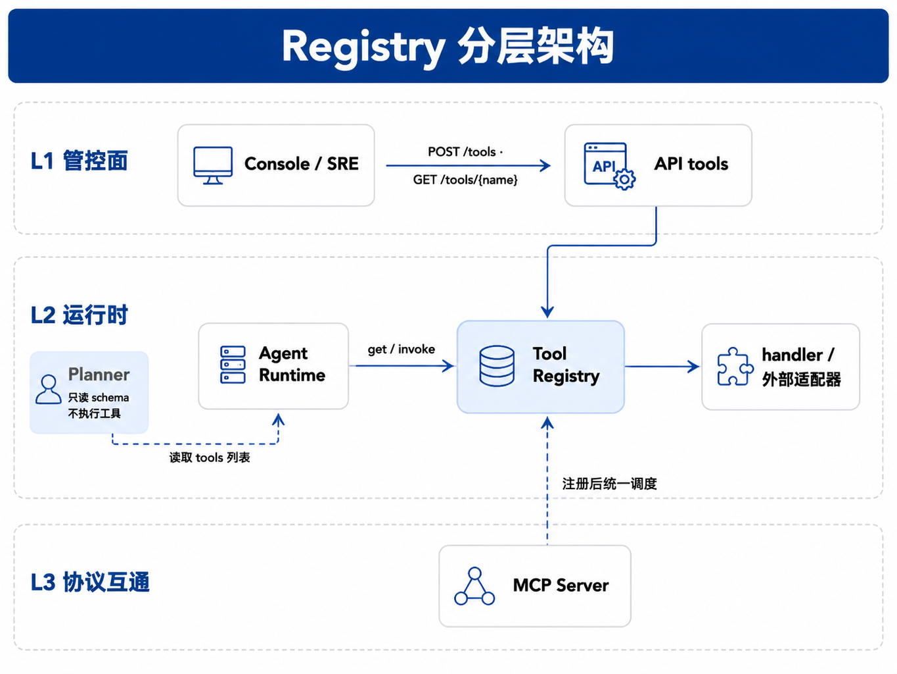
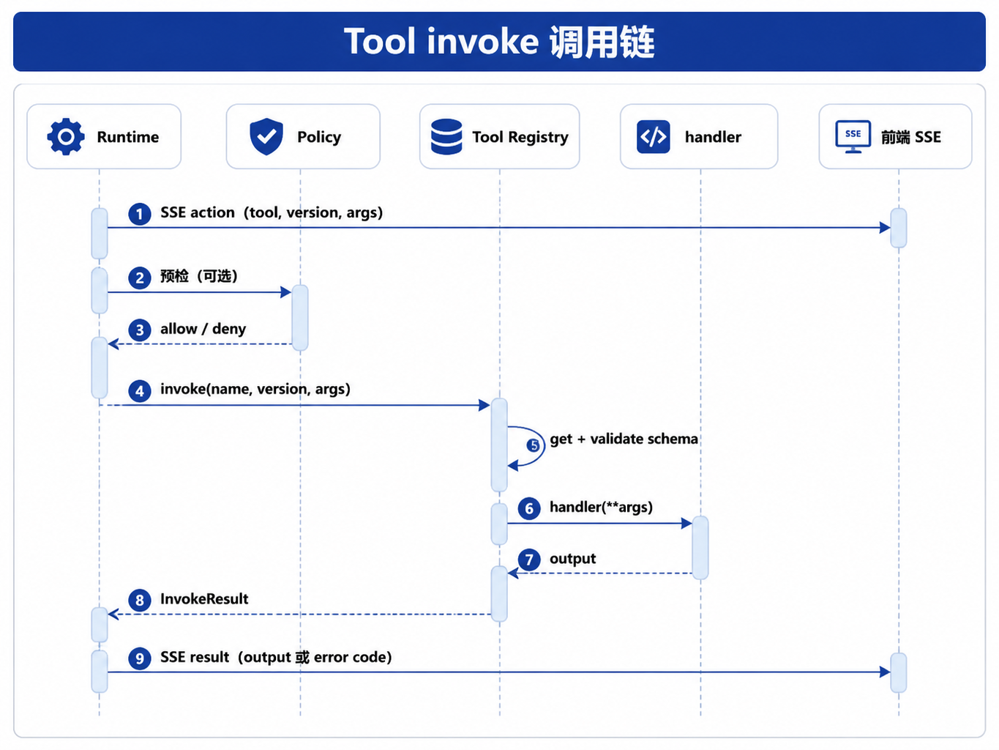

# 第23章 Tool Registry & Function Calling

---

工具是 Agent 产生真实副作用的出口。每个工具都需要明确的能力描述、参数 schema、风险等级和权限策略，不能让模型随意调用任意函数。本章把 Tool Registry 与 Function Calling 放在同一条调用链中讨论：工具描述、参数校验、权限策略、审计记录和 Runtime 调用边界怎样配合，工具多版本共存与审计记录又怎样支撑安全可控的调用。第22章 讲 Runtime 如何推进一次 Run：Planner 给出下一步，Runtime 发出 `action`，工具执行后再返回 `result`。这条链路还缺一个前置约束：模型说要调用 `sql_executor`，平台怎么知道这个工具是否存在？参数里的 `tenant_id` 由谁校验？该执行 `v1` 还是 `v2`？执行失败后，错误又该如何返回给 Planner？如果每个 Agent 工程各自 `import` 工具、各自校验参数、各自记日志，版本、权限与审计都会失控。Tool Registry 把企业里的工具变成平台统一管理的能力：先注册，再按版本解析，调用前校验参数，再通过统一入口执行。

Function Calling 解决模型侧问题：让模型用 JSON 表达“我要调用哪个工具、参数是什么”。API 请求中的 `tools` 数组通常使用 JSON Schema 描述参数形状 (OpenAI n.d.)。文献中也常称 tool use 或 tool calling (Li 2025; Qu et al. 2025)：模型产出调用意图后，由应用侧执行，并将 tool result 写回 Planner 上下文。Tool Registry 解决平台侧问题：这个调用能不能执行、该执行哪个版本、参数是否合法、错误如何分类。二者在 Runtime 的 `executing` 阶段汇合：Planner 把 Registry 导出的 schema 交给模型，模型返回参数后，Registry 仍要在调 handler 之前做强制校验；模型输出不能替代平台校验 (OpenAI n.d.; OpenAI 2024)。先固定几个术语。Function Calling、tool calling 与 tool use 指模型经 API 产出调用意图；Tool Call 指 Runtime 记录并执行的一次工具调用（第22章）；Tool Registry 指通过 `register` / `invoke` 管理 ToolSpec 的平台注册中心；注册即调用 `register(spec)` 将工具规格写入 Registry。

一家多业务线企业 DataAgent 问「华东区下滑 SKU」时，Runtime 已进入 `executing` 并打出 `action` 事件。平台必须确保调用的是 `sql_executor@v1` 而非未注册的 `v9`，也要在缺少 `tenant_id` 时返回 `TOOL_ARGUMENT_INVALID`，避免 SQL 落到错误租户。Registry 用工具注册、版本解析、参数校验与统一 `invoke` 入口处理这些约束。这条调用链的讨论从 Registry 在平台分层中的位置开始，再进入 ToolSpec、schema 校验、版本治理、运行时调用链和 mini-platform 的最小实现。

工具调用是 Agent 从“回答问题”进入“改变系统状态”的入口。模型生成一个函数名和参数只是开始，真正的风险发生在平台决定是否执行时。工具是否存在、参数是否合法、调用者是否有权限、这次执行是否会产生副作用、失败后能否重试，都要在 Tool Registry 和 Runtime 之间被明确处理。Function Calling 让模型输出工具参数变得方便，也容易制造错觉：仿佛有了 schema，调用就安全了。实际生产里，schema 只能约束字段类型和少量枚举，不能判断用户是否有权查看客户明细，也不能判断某次退款是否重复执行。Registry 要把工具描述、版本、风险等级、权限策略、幂等要求和审计字段放在一起，供 Runtime 执行前校验。一个常见事故是工具版本漂移。某个团队升级了 `sql_executor`，新增参数 `data_scope`，旧 Agent 仍按旧 schema 调用；另一个 Agent 使用了供应商封装的同名工具，审计日志却只记录工具名。出问题后，团队无法判断执行的是哪个版本、使用了什么参数、由谁授权。Registry 的价值就在于把这些信息收敛成平台可查的事实。

## 23.1 Registry 在平台 API 分层中的位置

第2章将平台 API 分为三层：L1 资源管理（管控面，面向运维与 Console 的配置与发布接口）、L2 运行时（数据面）、L3 协议互通（MCP、A2A 等）。Registry 横跨 L1 与 L2：运维与 Console 通过 L1 注册工具；Runtime 在 L2 按 `(name, version)` 解析并 `invoke`。简单说，注册发生在管控面，调用发生在运行时。

### 23.1.1 平台级 Registry 的必要性

若没有平台级 Registry，每个 Agent 工程各自 `import` 工具模块，会遇到三类典型问题：

1. 重复实现：十个 Agent 各写一遍“调 HR API”的鉴权与重试，行为不一致。
2. 审计断裂：合规要求证明“某次 Run 调用了哪个版本的 SQL 工具、参数是否含 `tenant_id`”，硬编码 import 难以统一记录调用日志和审计信息。
3. 版本漂移：语义层升级后 `sql_executor` 从 `v1` 迁到 `v2`，部分 Agent 仍 pin 到旧版 handler，统计指标定义与第33章语义层不一致。

Registry 把工具变成平台托管的可复用能力：有描述、有 schema、有版本、有统一入口，供多个 Agent 与多个 `projects/` 复用。这层统一入口的价值，往往要到事故复盘时才会显出来。一个销售分析 Agent 如果绕过 Registry 直连 SQL 客户端，另一个财务 Agent 通过封装工具访问同一张表，两边的租户过滤、字段脱敏和错误码就可能不一致。等到某次查询返回了不该出现的客户明细，团队需要同时查应用日志、数据库日志、模型上下文和前端导出记录，才能知道是哪条链路漏了校验。Registry 不是为了让调用多绕一层，它把工具发现、参数契约、版本选择和审计证据压到同一个入口。

### 23.1.2 Registry 在平台链路中的位置



*图23-1：Registry 分层架构。来源：本书自绘。Alt text：分层图含 ToolSpec 注册层、检索/版本层、权限策略层、调用执行层，Runtime 通过 Registry 接口调用工具，体现工具注册到调用的分层结构。* 图中虚线表示：Planner 不执行工具，只读取 Registry 导出的 OpenAI `tools` 定义或等价 schema；MCP 工具需要先注册为 ToolSpec，Runtime 后续仍按 `action` → `invoke` → `result` 流程执行（第24章展开）。

### 23.1.3 与相邻组件的边界

下表概括 Registry 与相邻组件的分工。读表时可记住一条主线：Registry 管「工具能不能被找到、参数合不合法、handler 怎么调」；Run 推进、模型推理、权限终审分别由 Runtime、Planner、Policy 负责。

*表23-1：Registry 与 Runtime、Planner 等相邻组件的职责边界。来源：本书整理。*

| 组件                     | Registry 做什么                  | Registry 不做什么                                   |
| ---------------------- | ----------------------------- | ----------------------------------------------- |
| Runtime（第22章）     | 被 Runtime 调用 `get` / `invoke` | 不驱动 Run 六态、不发 SSE                                   |
| Planner（第25章）     | 提供 tools 列表与 schema           | 不代替模型推理                                         |
| Policy（第50章）      | 记录调用来源与风险元数据                 | 鉴权在 `invoke` 之前由 Policy 拦截；Registry 假定调用已通过 Policy，不做最终权限判定 |
| LLM Gateway（第45章） | 提供可导出的工具 schema                 | 传 `tools` 给模型是 Gateway/Planner 职责               |
| MCP（第24章）         | 存储 MCP 工具的 ToolSpec 与路由信息   | 不实现 JSON-RPC 传输，也不复制 MCP Server 的实现本身          |

### 23.1.4 工具调用需要守住的三条治理线

企业落地时，Registry 的问题通常不在“能不能调通”，而在调用路径是否仍然可审计、可校验、可回滚。下面三条治理线需要在设计阶段就固定下来。

#### Registry 不承载业务实现
实现可以在 `tools/`、`handlers/` 或外部 HTTP 服务；Registry 存的是 ToolSpec，即描述、schema 以及如何路由到 handler。把业务逻辑全塞进 Registry 类，会让 Registry 承担过多业务职责，难以测试和复用。

#### Function Calling 只产生调用意图
OpenAI 文档明确：API 不会替开发者执行函数；模型只生成符合 schema 的参数 JSON，执行在应用侧 (OpenAI n.d.)。若把模型输出直接当最终结果，就跳过了鉴权、校验与审计。

#### 注册面和调用面分开
用 `POST /tools` 的 REST 形态在 Run 主循环里逐次注册，会拖垮延迟；Run 时应只做 L2 的 `get` / `invoke`，注册走管控面异步流程。

---

## 23.2 ToolSpec 与能力注册模型

平台侧用 ToolSpec 描述一种可调用能力。它与第22章 Tool Call 记录中的 `tool` + `version` 字段一一对应：Runtime 收到 Planner 提议后，用这两个字段向 Registry 解析。

### 23.2.1 ToolSpec 字段

*表23-2：ToolSpec 字段的字段说明。来源：本书整理。*

| 字段                  | 说明                      | 生产扩展项        |
| ------------------- | ----------------------- | ------------------------ |
| `name`              | 稳定工具名，如 `sql_executor`  | 租户前缀 `tenant:tool`       |
| `version`           | 语义化或顺序版本，如 `v1`、`1.0.0` | 灰度标签 `canary`            |
| `description`       | 给模型与人类读的用途说明            | 多语言描述                    |
| `parameters_schema` | JSON Schema 对象，描述参数     | 与 OpenAI `strict` 对齐 (OpenAI 2024) |
| `handler`           | 可调用对象（示例为 Python 函数） | HTTP/gRPC 适配器            |

`description` 会进入 Function Calling 的 `tools` 定义，直接影响模型何时选这个工具 (OpenAI n.d.)；写得含糊会导致「该调 SQL 时去调邮件」。工具描述要写给模型，也要写给人。只写“执行查询”会让模型在任何数据问题上都倾向调用它；只写“发送消息”则无法区分通知、审批和外部联系。更稳的写法是把适用场景、禁止场景和副作用说清楚，例如“只读查询销售汇总，不返回客户手机号，不执行写入”。这些约束不能完全依赖自然语言执行，但它们能减少模型误选工具，也能让审核人判断 schema 和 policy 是否匹配。

### 23.2.2 注册与检索 API

参考实现（`core/registry/tool_registry.py`）提供三个核心操作：

*表23-3：Registry 注册与检索 API 各方法的作用。来源：本书整理。*

| 方法                    | 作用                                    |
| --------------------- | ------------------------------------- |
| `register(spec)`      | 写入 `(name, version)` 主键；重复注册失败，避免静默覆盖 |
| `get(name, version)`  | 检索 spec；未找到抛 `TOOL_NOT_FOUND`         |
| `list_versions(name)` | 返回某工具的全部版本，供 Agent 配置页与治理             |
```python
@dataclass(frozen=True)
class ToolSpec:
    name: str
    version: str
    description: str
    parameters_schema: dict[str, Any]
    handler: Callable[..., Any]
```

### 23.2.3 注册流程（管控面 → 运行时）

1. SRE / 平台工程师提交 ToolSpec（YAML / PR）至 L1 API 或配置仓库。
2. L1 调用 `register(spec)` 写入 Registry。
3. Agent 配置页调用 `list_versions("sql_executor")` 并 pin 版本（如 `v1`）。

企业实践中，注册入口常见形态包括：Git 仓库存 YAML、Console「上架工具」表单，或 CI 从 `tools/` 包自动发布。本章示例用内存 `register` 模拟注册生效后的状态。

### 23.2.4 handler 放在哪里

*表23-4：工具 handler 几种部署方式的形态与适用场景。来源：本书整理。*

| 部署方式          | handler 形态                           | 适用           |
| ------------- | ------------------------------------ | ------------ |
| 进程内函数         | `Callable`                           | 单机示例、轻量工具 |
| 同集群 HTTP      | Registry 内持 URL，invoke 时发请求          | 多数微服务工具      |
| MCP / 外部 SaaS | 适配器把 MCP `tools/call` 封装为统一 `invoke` | 第24章        |

无论 handler 最终落在进程内函数、同集群 HTTP 还是 MCP 适配器，Registry 只要求 `invoke` 语义一致：先校验参数，再做路由，最后返回结构化 output 或抛出 `RegistryError`。这条约束比部署位置本身更关键。

---

## 23.3 Function Calling Schema 与参数校验

Function Calling (OpenAI n.d.) 是指在 Chat Completions 等 API 的 `tools` 参数中声明可供模型调用的函数；模型在回复中产出 `tool_calls`，其中 `function.arguments` 为 JSON 字符串。平台须将该 JSON 解析为 dict，再交给 Registry。解析、校验和执行是三个动作，Registry 仍须在 `invoke` 前按 schema 强制校验参数。

### 23.3.1 OpenAI tools 的结构

一项工具定义通常包含 (OpenAI n.d.)：

*表23-5：OpenAI tools 长什么样的字段说明。来源：本书整理。*

| 字段                     | 含义                                      |
| ---------------------- | --------------------------------------- |
| `type`                 | 固定为 `function`                          |
| `function.name`        | 与 `ToolSpec.name` 对齐                    |
| `function.description` | 触发条件说明                                  |
| `function.parameters`  | JSON Schema 描述参数对象                      |
| `function.strict`（可选）  | 为 `true` 时启用 Structured Outputs 级约束 (OpenAI 2024) |

`mini-platform` 提供 `to_openai_tool(spec)`，用于从 `ToolSpec` 生成上述结构（`core/registry/openai_tools.py`）。这样 Planner 或 Gateway 看到的工具定义，和 Registry 实际执行前要校验的 schema 才能保持同源。

### 23.3.2 JSON Schema 的边界

JSON Schema 是一种用 JSON 描述 JSON 文档结构的规范 (JSON Schema 2020)：有哪些字段、类型是什么、哪些必填。Function Calling 的 `parameters` 实际上就是“参数对象”的 schema。OpenAI Structured Outputs 的严格模式会进一步约束 schema：对象通常需要设置 `additionalProperties: false`，并让 `required` 覆盖所有属性 (OpenAI 2024)，这能降低模型生成多余字段或漏字段的概率，但它仍只约束模型输出格式，还不能替代平台侧校验。本书示例实现的 `to_openai_tool(spec, strict=True)` 只演示如何在 OpenAI `tools` 定义中加入 `strict: true`，并在顶层对象缺失时补充 `additionalProperties: false`；它不是完整的生产级 strict schema 生成器。生产实现还应校验 `required` 是否覆盖全部属性、递归处理嵌套对象，并在 `invoke` 前继续执行 Registry 参数校验。本书示例实现的校验器实现 JSON Schema 子集（`object` / 标量类型 / `required` / `additionalProperties`），无第三方依赖；生产可换完整校验库，但校验时机不变：必须在 handler 之前。

参数校验最容易被轻视，因为 Function Calling 看起来已经让模型输出了“合法 JSON”。生产里更常见的错误是业务上危险的合法 JSON：缺少租户过滤、时间范围过大、导出字段包含 PII，或者把 `region` 写成用户无权访问的区域。JSON Schema 负责形状，Policy 负责权限，handler 负责业务执行，三者各有位置。Registry 至少要拦住形状不对的调用，并把业务风险字段留给 Policy 做进一步判断。

!!! warning "无论是否 strict，invoke 前必须校验"
    即使模型请求已开启 Function Calling 或 `strict: true`，Registry 仍须在调用 handler 之前执行 `validate_parameters`。模型输出只能作为提议，不能替代平台 schema 强制执行（见 §6 常见问题 3）。

### 23.3.3 与 Runtime 的分工

表 23-6 把一次工具调用拆成从模型到 handler 的几个阶段，说明 Registry 与 Runtime 各自负责什么、失败时由谁处理。

*表23-6：工具调用各阶段 Registry 与 Runtime 的分工及失败处理。来源：本书整理。*

| 阶段                          | 谁负责               | 失败时                          |
| --------------------------- | ----------------- | ---------------------------- |
| 把 tools 列表交给模型              | Planner + Gateway | 模型不可用                        |
| 解析 `tool_calls` JSON        | Planner / Runtime | `plan_error` 等               |
| `get(name, version)`        | Registry          | `TOOL_NOT_FOUND`             |
| 按 schema 校验 `args`          | Registry          | `TOOL_ARGUMENT_INVALID`      |
| 执行 handler                  | Registry（路由）      | handler 异常 → Runtime 按 §5 分类 |
| 写 SSE `result`、是否将错误反馈给 Planner | Runtime           | 同 Step ≤3 次（第22章）           |

读表时请抓住一条原则：模型只能提出符合 schema 的参数，平台必须强制执行 schema (OpenAI n.d.; OpenAI 2024)。调研表明，工具学习已成为 LLM Agent 的核心范式之一，但幻觉参数、错误选工具仍是主要失败模式 (Li 2025; Qu et al. 2025; Shen 2024)。Qu et al. (2025) 将工具学习流程概括为四阶段：任务规划 → 工具选择 → 工具调用 → 响应生成 (Qu et al. 2025)。本书的对应关系如下：前两个阶段主要在 Planner（第25章）与 Gateway 完成；工具调用阶段由 Runtime 发 `action`、Registry 执行 `invoke`（见 图 23-2）；响应生成阶段由 Planner 读取 `result` 再产出面向用户的答案。Registry 负责第三阶段的执行与校验，不替代 Planner 做推理。

### 23.3.4 参数错误对 Planner 的反馈（与第22章的关系）

下面用一个具体场景串起 第22章 与本节的分工。Planner 为 `sql_executor` 生成的参数若缺少 `tenant_id`，Registry 在 `invoke` 时抛出 `TOOL_ARGUMENT_INVALID`，并附带 `validation_errors` 列表。Runtime 将其写入 `result` 事件，不把整个 Run 标为 `failed`，而是在同一 Step 内再次调用 Planner（把错误作为下一轮 Planner 输入，让模型修正参数）；超过 3 次仍失败再进入 `failed`（第22章 §5）。这样用户看到的是业务可理解的纠错，避免直接暴露底层校验错误或 Python 异常栈。

---

## 23.4 版本治理与多版本共存

工具与 API 一样需要版本管理。主键为 `(name, version)`：同名不同版本可并存，Agent 或 Run 配置决定实际解析哪一版。

### 23.4.1 多版本管理的必要性

行业场景示例：`sql_executor@v1` 直连旧宽表；`v2` 改查第33章语义层指标。财务与供应链 Agent 迁移节奏不同，平台须允许 `v1` / `v2` 同时在线，按 Agent 配置 pin 版本，不应全局强制 latest。实战项目 `registry_setup.py` 中同时注册 `sql_executor`（内置只读 示例 handler）与 `mcp_db_query_sales`（第24章 MCP 桥接工具），便于对照“平台内置工具”和“L3 协议接入工具”在 Registry 中的命名、版本与审计区分。二者语义相近，但来源与治理路径不同，生产不应混为一谈。

### 23.4.2 Agent 的版本选择

*表23-7：Agent 选择工具版本的几种策略及其优势与风险。来源：本书整理。*

| 策略            | 做法                                  | 优势      | 风险        |
| ------------- | ----------------------------------- | ------- | --------- |
| Pin 版本    | Agent manifest 写 `sql_executor: v1` | 可审计、可复现 | 须人工推动升级   |
| 默认 latest | Registry 记录 `default_version`       | 升级省力    | 行为突变、统计指标定义漂移 |
| 灰度        | 按 `tenant_id` 路由 v2                 | 稳妥演进    | 路由逻辑复杂    |

企业推荐：生产 Agent pin 版本；实验 Agent 可用 latest；灰度期用配置中心切换。第4章最小建设路径「YAML 注册 + 简单版本号 → 多版本灰度」在本章落地为 `list_versions` + 配置项；多版本并存时 Runtime 经图 23-1 中的 Registry 按 Agent 配置解析 `(name, version)`。版本 pin 还关系到答案复现。DataAgent 生成一份经营报告后，三个月后用户追问“当时为什么得出这个结论”，平台必须能还原当时使用的工具版本、schema、语义层版本和结果摘要。如果工具默认走 latest，报告生成时的 `sql_executor` 和复盘时的 `sql_executor` 可能已经不是同一个行为。版本治理看似增加配置成本，实际是在为审计、回滚和用户申诉保留可复现路径。

### 23.4.3 版本与 Function Calling 暴露

把多个版本同时暴露给模型（如 `sql_executor_v1` / `sql_executor_v2` 两个 `name`）容易造成模型选错。生产默认：对模型只暴露一个逻辑名，版本由 Agent 配置或 Runtime 在 `invoke` 前解析；实验环境才考虑让 Planner 显式传版本或多 name 暴露。第25章 编排模式会进一步讨论 Planner 如何持有工具视图。

### 23.4.4 版本下架与风险登记

版本下架前应先检查 `list_versions` 与 Agent 配置引用，确认没有生产 Agent 仍在使用旧版。工具 schema 出现破坏性变更时，应提升主版本，并为旧版保留只读或兼容窗口。注册信息还应包含 `owner`、`risk_level`（写操作 / 读操作）等字段，供第50章的 Policy 使用；本章示例暂未实现这部分。

---

## 23.5 运行时调用链：从 Runtime 到 handler

这一节把第22章和本章接起来，重点看一次 Tool Call 在 `executing` 状态里怎样从 `action` 走到 handler，再回到 `result`。只要这条链路清楚，前面的 schema、版本和错误码设计才有落点。

### 23.5.1 时序



*图23-2：Tool invoke 调用链。来源：本书自绘。Alt text：调用链从 Runtime 发起，经 Registry 做参数校验、权限检查、版本选择，到 handler 执行并返回结果或错误码，箭头标出每一步的校验关卡。*

Policy 拒绝时 Runtime 可能进入 `waiting_human` 或 `failed`（第22章），不会调用 Registry。通过后 Registry 负责「工具存在、参数合法、handler 可执行」。

### 23.5.2 invoke 语义

`ToolRegistry.invoke(name, version, args)` 的步骤：

1. `get(name, version)` → 未注册则 `TOOL_NOT_FOUND`。
2. `validate_parameters(schema, args)` → 失败则 `TOOL_ARGUMENT_INVALID`（含 `validation_errors`）。
3. 调用 `handler(args)` → 返回 `InvokeResult(output=...)`。

错误类型统一继承 `RegistryError`，并携带 `code`、`message` 和 `details`。Runtime 再把这些字段映射到第22章的 `result` 事件和后续恢复策略，而非直接把底层异常栈抛给用户。

### 23.5.3 错误码对照

*表23-8：工具调用各类错误码的原因、Runtime 状态与恢复方式。来源：本书整理。*

| 失败来源 / Registry `code` | 典型原因              | Runtime 状态     | 恢复              |
| ----------------------- | ----------------- | -------------- | --------------- |
| `TOOL_NOT_FOUND`        | 名或版本未注册、Agent 配置错 | 保持 `executing` | 反馈 Planner 或失败  |
| `TOOL_ARGUMENT_INVALID` | 缺必填、类型错、多余字段      | 保持 `executing` | 反馈 Planner ≤3 次 |
| `TOOL_UNAVAILABLE`      | handler 内下游不可达（如 MCP transport 超时） | 按 第22章 §5     | 重试 / 熔断 / `failed`（第24章；示例进程内 MCP 通常不触发） |
| handler 未捕获异常（非 Registry code） | 下游超时、业务错误         | 按 第22章 §5     | 重试 / `failed`   |

Masterman et al. (2024) 在综述里强调，推理、规划和 tool calling 需要分阶段设计，工具执行可靠性与消息过滤同样重要 (Masterman et al. 2024)。放到平台实现里，Registry 正是 tool calling 阶段真正落地的位置。

### 23.5.4 与第24章 MCP 的关系

MCP Server 对外暴露 `tools/list` 与 `tools/call` (Model Context Protocol 2024)。平台做法：在 L1 将 MCP 工具注册为 ToolSpec（保存 spec 与路由信息，不复制 Server 实现），handler 内部走 MCP 客户端，避免 Runtime 到处直接调用 MCP Server。这样 第22章的 Tool Call 记录与 Trace 仍只有一条 `invoke` 语义。

---

## 23.6 Tool Registry 与 RunLoop 调用

Part V 统一实战项目 `projects/multi-agent-workflow/` 经 RunLoop 调用 Registry：Handoff、SQL、MCP、报告工具均在 `build_workflow_registry()` 中注册。Registry 错误码与 schema 校验的独立单测见 `tests/test_registry.py`。

### 23.6.1 Registry 示例运行方式

如果要看 Registry 和 RunLoop 的最小调用链，可以直接在 `mini-platform` 根目录执行下面的命令。这样既能看到运行态事件，也能顺手验证基础单测。
```bash
python3 projects/multi-agent-workflow/run.py start
pytest tests/test_registry.py -q
```

其中 `tests/test_registry.py` 覆盖 `TOOL_NOT_FOUND`、`TOOL_ARGUMENT_INVALID`、`to_openai_tool` 等 Registry 基础行为。运行环境以 `mini-platform/pyproject.toml` 为准，当前要求 Python 3.11 及以上。

### 23.6.2 Registry 实现入口
```
mini-platform/core/registry/
├── __init__.py
├── tool_registry.py      # ToolSpec、register / get / list_versions / invoke
├── schema_validate.py    # parameters JSON Schema 子集校验
├── openai_tools.py       # to_openai_tool(spec) → OpenAI tools 项
└── errors.py             # TOOL_NOT_FOUND、TOOL_ARGUMENT_INVALID

projects/multi-agent-workflow/lib/
└── registry_setup.py     # build_workflow_registry()：handoff / sql / MCP / report

projects/multi-agent-workflow/
├── run.py                # RunLoop + Registry 全链
└── README.md

tests/test_registry.py    # Registry 能力与错误码单测
```

读码顺序最好先从 Registry 本体开始，再回到运行时主循环。比较顺手的一条路径是 `tool_registry.py` → `schema_validate.py` → `registry_setup.py` → `run_loop.py`（`_execute_pending_tool`）。

### 23.6.3 Registry 调用示例

下面这段代码节选自 `projects/multi-agent-workflow/lib/registry_setup.py`，目的是让读者先抓住注册接口长什么样。完整的 handler 和 MCP 注册逻辑都在同一个文件里，读到这里再回源文件会更顺。
```python
def sql_executor_handler(query: str, tenant_id: str) -> dict[str, object]:
    """模拟只读 SQL 查询。"""
    return {
        "rows": [{"sku": "SKU-A", "sales": 3200, "delta": -12}],
        "query": query,
        "tenant_id": tenant_id,
    }

registry.register(ToolSpec(
    name="sql_executor",
    version="v1",
    description="执行只读 SQL（示例固定行）",
    parameters_schema={
        "type": "object",
        "properties": {
            "query": {"type": "string"},
            "tenant_id": {"type": "string"},
        },
        "required": ["query", "tenant_id"],
        "additionalProperties": False,
    },
    handler=sql_executor_handler,
))
```

运行方式如下。SSE 输出可以用来观察 Registry 经 RunLoop 形成的 `action` → `invoke` → `result` 链路。
```bash
cd mini-platform
python3 projects/multi-agent-workflow/run.py start
```

SSE 输出中可见 `"tool": "handoff"`、`"tool": "mcp_db_query_sales"`、`"tool": "render_report"` 等 Tool Call 记录。Registry 亦注册了 `sql_executor`，但 Part V 主链 Data 阶段走 MCP 桥接工具 `mcp_db_query_sales`，便于对照第24章注册路径；`sql_executor` 可通过 `tests/test_registry.py` 单独验证。Registry 错误码单测不依赖 RunLoop：
```bash
pytest tests/test_registry.py -q
```

### 23.6.4 Registry 示例覆盖与缺口

mini-platform 已经覆盖 Registry 的主链路：`tool_registry.py` 提供 ToolSpec 注册、检索与版本列举，`schema_validate.py` 提供参数校验子集，`errors.py` 定义结构化错误码，`openai_tools.py` 负责导出 Function Calling 所需的 tools 定义。实战项目 `projects/multi-agent-workflow/run.py` 会通过 RunLoop 调用 Registry，`tests/test_registry.py` 可以单独验证错误码与参数校验。第24章还会把 MCP Server 暴露的工具注册进同一套 Registry，说明外部协议工具不应绕过平台工具目录。这些覆盖仍然是教学级骨架，不是完整管控面。生产系统还需要 L1 HTTP `POST /tools`、持久化存储、租户命名空间、Policy 预检、完整 JSON Schema 校验库，以及工具注册、调用、下架的审计和血缘。这里保留缺口，是为了让读者看到 Registry 的边界：它先统一运行时调用，再逐步补齐企业治理能力，而非一开始就把工具市场、审批流和权限中心全部塞进同一个类里。

### 23.6.5 Registry 接入后最容易出问题的四个位置

#### Agent 硬编码工具 import
现象：每个 Agent 仓库复制 SQL 客户端，升级语义层后只有部分 Agent 跟进。修复：工具唯一入口改为 Registry；Agent 配置只声明 `tool` + `version`。

#### schema 与 handler 参数漂移
现象：YAML 里 `parameters_schema` 已加 `tenant_id`，handler 函数签名未改，校验通过但业务仍漏租户。修复：工具注册 CI 对比 schema 与 handler 签名；单测对 `invoke` 做必填字段用例。

#### 把模型输出当已校验参数
现象：开启 Function Calling 后不再做 Registry 校验，幻觉字段传入 SQL 拼接。修复：无论是否 `strict`，`invoke` 前必须 `validate_parameters` (OpenAI n.d.; OpenAI 2024)。

#### 多版本同时暴露给模型
现象：模型在 `v1`/`v2` 间随机选择，统计指标日环比对不上。修复：对模型暴露稳定逻辑名；版本由 Agent 配置 pin，或 Planner 显式解析后再 `invoke`。

---

## 23.7 Tool Registry 的治理运营

Tool Registry 上线后，平台要管理的重点落在工具的生命周期，工具列表只是其中一部分。一个工具从实验进入生产，至少会经历注册、评审、灰度、版本升级、废弃和下线。每个阶段都要保留 schema、handler、权限策略、风险等级、负责人和测试样例。否则工具数量增加后，Planner 看到的是一堆名字相似、行为不明的能力。工具版本尤其容易被低估。函数签名改一个字段，模型可能仍按旧示例调用；handler 改一条默认过滤条件，历史 Run 的结果就无法复现。生产平台应要求不兼容变更升版本，旧版本保留一段回滚窗口，并在 Trace 中记录实际调用的 `(name, version)`。这样事故复盘时，团队能判断问题来自模型选择、schema 变化还是工具实现。

工具描述也需要运营。描述写得太宽，模型会在不该使用时调用；描述写得太窄，模型又可能漏掉正确工具。好的工具描述应说明能力边界、输入约束、禁止场景和返回语义。示例也要定期清理，避免把过期业务规则教给模型。第8章的结构化输出和本章的 ToolSpec 应一起维护。Registry 还要服务安全和成本。高风险工具应默认不可见，只有满足用户角色、租户、数据域和审批条件时才暴露给 Planner。高成本工具应带配额和预算标签，避免模型在循环中反复调用。工具治理做到这一步，Function Calling 才从模型能力变成企业平台能力。

## 23.8 工具治理的运行节奏

Tool Registry 上线后，治理工作不会因为工具注册完成而结束。工具会新增参数、调整返回结构、改变错误码，也会因为外部系统升级而出现行为变化。平台需要把工具当成可发布能力管理，而非静态清单。每个工具至少要有负责人、版本、适用场景、权限要求、风险等级、测试样本和下线策略。运行节奏可以按发布前、运行中和下线后三个阶段组织。发布前关注 schema、权限、错误码和回归样本；运行中关注调用量、失败率、超时、重试、人工介入和异常业务影响；下线后关注是否还有 Agent 依赖旧版本，历史 Trace 是否仍能解释旧调用。对于高风险写操作，还要定期演练失败恢复，例如重复提交、部分成功、外部系统超时和补偿动作。

这类治理最好写成制度化流程，而非依赖开发者记忆。工具负责人修改 schema 时，应触发受影响 Agent 的回归；Runtime 发现某个工具失败率升高时，应能自动降级或停止暴露给 Planner；安全团队调整权限策略时，应能看到哪些工具和业务流程受到影响。Tool Registry 的价值正是在这里：它把工具从模型可调用的函数，提升为平台可治理的能力。

## 23.9 工具调用的业务语义保护

工具调用的参数校验只能保证格式正确，不能保证业务语义正确。比如 `customer_id` 是合法字符串，不代表当前用户可以操作这个客户；`amount` 是正数，不代表这笔退款符合财务规则；`send_email` 参数完整，也不代表邮件应该发送。企业 Agent 平台需要在工具层加入业务语义保护，把权限、状态、审批和幂等纳入调用前检查。业务语义保护应尽量靠近工具执行端。模型和 Planner 可以给出调用意图，Registry 可以提供 schema 和风险标签，但最终执行前仍要由 handler 或领域服务确认业务规则。这样可以避免模型绕过规则，也可以复用企业已有的领域约束。对于写操作，工具返回值也应包含业务状态，不能只返回成功或失败。比如“已创建工单但等待审批”“请求重复但返回已有工单”“外部系统接受请求但尚未完成处理”，这些状态都会影响 Runtime 的下一步决策。工具调用还要避免把业务语义藏在 Prompt 里。Prompt 可以提醒模型不要越权，但不能作为权限依据；Prompt 可以说明何时发送邮件，但不能替代审批流程。真正可靠的系统会把这些约束放进 ToolSpec、Policy、Runtime 和 handler 的组合里。这样 Planner 选择工具时能看到风险，Runtime 执行时能控制状态，Trace 复盘时能看到责任边界。

## 23.10 工具资产的清理与分级

工具越多，Agent 的能力不一定越强。过多工具会占用上下文，增加误选概率，也会让权限和测试成本上升。Tool Registry 需要定期清理工具资产：长期无人维护、调用失败率高、被新工具替代、缺少负责人或无法提供审计证据的工具，应进入冻结或下线流程。工具下线前要检查依赖它的 Agent、Prompt、评测样本和历史 Trace，避免直接破坏运行链路。

分级同样重要。只读查询工具、内部分析工具、外部写操作工具、涉及资金或合同的工具，不应使用同一套暴露和审批策略。只读工具可以扩大试点范围，写操作工具必须绑定幂等、审批和补偿，高敏工具还要限制模型自主选择。分级结果应写入 ToolSpec，供 Planner、Runtime、Guardrails 和前端共同使用。工具治理的长期目标，是让平台知道每个工具能做什么、谁负责、风险在哪里、出了问题怎么恢复。只有做到这一点，Function Calling 才能从模型能力变成企业系统能力。工具治理还要进入日常运营。哪些工具调用失败率高，哪些工具经常触发权限拒绝，哪些工具被模型频繁误选，哪些工具产生了高成本或高风险副作用，都应该进入看板。这些数据能反过来改写工具描述、参数 schema 和 Planner 策略。

工具描述要为模型服务，也要为人服务。描述过短，模型难以选择；描述过长，成本增加且容易混淆；缺少反例，模型会在相似场景里误用。平台团队应把工具描述当作可测试资产，而非开发者随手写的注释。最终，Registry 的职责是让“可调用”变成“可治理”。模型可以提出调用意图，但执行权属于 Runtime 和 Policy。这个边界越清楚，企业越敢把 Agent 接入真实业务系统。工具注册前应有准入评审。平台要确认工具是否幂等、是否有副作用、是否支持超时和取消、是否能返回结构化错误、是否记录审计字段。一个只能返回字符串错误的工具，会让 Planner 无法判断下一步；一个没有幂等键的写操作，会让重试变成风险。

参数 schema 要写出业务约束。字段类型为 string 只是最低要求，真正有价值的是枚举、范围、格式、互斥关系和来源限制。例如 `tenant_id` 不应由模型自由填写，而应由 Runtime 从上下文注入；导出行数需要上限；金额字段需要单位和币种。schema 越贴近业务，工具越不容易被误用。工具返回值也需要契约。成功时返回哪些字段，失败时如何分类，部分成功如何表达，是否包含可展示给用户的信息，都要清楚。否则 Planner 只能把工具返回当作文本继续猜，前端也无法稳定渲染进度和结果。高风险工具要绑定审批策略。发送邮件、创建工单、导出明细、修改业务状态，不能只靠模型选择工具。Registry 中的风险等级应驱动 Policy 和 HITL，Runtime 在执行前根据上下文决定是否暂停等待人工。这样审批责任和工具定义才能保持一致。

工具下线同样需要流程。旧版本不再使用时，要知道哪些 Agent 仍在引用，哪些历史 Run 需要回放，哪些评测样本依赖旧行为。没有下线流程，Registry 会堆积过期工具，模型选择空间变大，误用概率也会上升。工具描述的质量会直接影响 Planner。描述只写“查询数据库”，模型无法判断它适合经营指标、明细导出还是元数据查询；描述写得过宽，模型会在不该调用时调用；描述缺少失败条件，模型会在权限不足时反复尝试。Registry 应把工具描述、适用场景、禁止场景和示例一起维护，并通过评测样本检查模型选择是否稳定。工具权限要同时看调用者和任务。用户有权查看销售汇总，不代表当前任务可以导出明细；Agent 有权调用邮件工具，不代表可以发送含敏感数据的报告。Policy 在执行前需要读取 Run 上下文、工具风险等级、参数内容和用户角色，做一次动作级授权。授权结果也应写入 Trace。

工具执行结果要避免把内部错误直接给模型。数据库连接串、堆栈、供应商返回的敏感字段，都可能通过错误消息进入上下文。工具层应把内部错误转成安全的结构化错误，同时保留内部日志供工程排查。模型只需要知道错误类型和可恢复建议，不需要看到所有细节。Registry 还可以记录工具健康状态。某个工具处于维护、错误率高、延迟异常或配额耗尽时，Planner 应少用或不用它。若模型仍然把任务交给不可用工具，Runtime 会反复失败。把健康状态纳入工具发现，可以让 Agent 更接近真实系统运行。多版本共存需要明确默认版本。新版本上线后，哪些 Agent 自动升级，哪些保持旧版本，哪些需要通过评测后再切换，都要由 Registry 管理。否则工具团队以为已经升级，业务 Agent 仍在调用旧版本；或者旧 Agent 意外使用新版本，产生不兼容结果。

工具调用还要考虑人类可读性。审批页面、审计报告和事故复盘都需要解释一次调用的业务含义。工具名和参数不能只服务机器，也要能让审批人理解“这次动作会做什么”。这会影响命名、字段说明和风险描述。Registry 可以为工具提供测试沙箱。开发者注册新工具后，先用模拟上下文、模拟用户和标准参数跑通校验，再允许进入生产候选。沙箱还能测试错误返回、超时、幂等和权限拒绝。没有沙箱，工具问题会在真实 Run 中暴露，用户体验和审计都会受影响。工具发现也要控制数量。模型一次看到几十个相似工具，会增加误选概率和 token 成本。平台可以根据任务、租户、权限和上下文筛选候选工具，只把相关工具暴露给 Planner。候选集越干净，工具调用越稳定。

工具的业务 Owner 要清楚。技术团队维护 handler，不代表能解释业务语义；业务 Owner 负责说明工具适用场景、风险和输出含义。审批人看到高风险工具调用时，也需要知道业务责任人是谁。Registry 中保存 Owner 信息，有助于运营和事故处理。对外部工具还要有供应商风险记录。SaaS API 的 SLA、限流、数据处理协议和区域要求，都会影响 Agent 使用范围。工具看起来只是一个函数，背后可能是外部系统。Registry 把这些信息记录下来，Policy 才能在高风险任务中做正确限制。

工具调用还要支持影子验证。新工具或新版本上线前，可以让 Planner 在 Trace 中记录“如果启用会选择什么工具和参数”，但真实执行仍走旧版本。运行一段时间后，平台比较影子结果和真实结果，判断描述、schema 和权限策略是否足够稳定。影子验证能降低工具升级风险，尤其适合写操作、外部 API 和高成本查询。工具治理也要处理组合风险。单个工具可能只是只读查询，和导出工具、邮件工具连在一起后，就可能形成数据外泄路径。Registry 不能只给每个工具单独打风险等级，还要让 Policy 看到同一个 Run 内的工具序列。某些组合需要审批，某些组合需要脱敏，某些组合应直接禁止。工具越多，组合风险越重要。

最后，工具文档要和真实行为保持一致。工具描述写着只返回汇总，实际 handler 返回明细；描述写着不会写数据库，实际为了缓存写入状态，这些都会误导 Planner 和审批人。平台可以定期用测试调用比对工具描述、schema 和返回样例，把不一致作为治理问题处理。工具审计还要记录“未执行”的调用。Planner 提出了某个高风险工具，Policy 拒绝了它，或审批人驳回了它，这些事件同样有价值。它们能说明平台成功阻断了风险，也能帮助工具 Owner 发现描述误导、权限配置过严或用户需求没有合适工具承接。只记录成功执行，会让治理看起来比真实情况简单。Registry 的运营还要看工具覆盖缺口。用户频繁要求某类动作，Planner 却只能绕远路调用多个工具，说明平台缺少合适的复合工具或语义接口。工具治理不是只限制风险，也要持续补齐高价值能力。只有风险控制和能力供给同时推进，业务团队才不会绕开 Registry 自己集成。

## 23.11 工具目录复审与低价值工具清理

Tool Registry 会随着业务试点快速膨胀。早期为了验证场景，团队可能注册很多相似工具：多个查询工具、多个导出工具、多个通知工具、多个只读包装器。进入生产后，目录需要定期复审，否则 Planner 会面对越来越多含义接近、权限不同、维护状态不清的工具。工具过多会同时增加选择成本、越权风险和误调用风险。

复审时，平台应查看真实调用记录、错误率、owner、权限范围、schema 稳定性、审计字段和下游依赖。长期无人调用的工具可以先冻结新调用，再和业务 owner 确认是否下线；功能重叠的工具应合并或明确边界；高错误率工具要暂停进入新 Agent；缺少审计字段或回滚路径的写工具不能继续扩大使用范围。工具目录清理不应只追求数量减少，更要让剩余工具的语义清楚、责任清楚、恢复路径清楚。

低价值工具清理还要反馈给 Planner 和评测。工具被合并或下线后，Planner 的工具视图、示例、评测样本和失败恢复策略都要更新。否则模型仍可能在旧工具描述中学习到已经废弃的路径。Registry 是 Agent 能力的入口，目录质量会直接影响计划质量和安全边界。把复审写成固定运营动作，才能避免工具生态从“能力丰富”变成“选择混乱”。

## 23.12 ToolSpec 示例库与复用治理

ToolSpec 需要示例库。只给模型一个 schema，往往不足以让 Planner 稳定选择工具；只给开发者一段接口说明，也不足以让业务团队理解工具边界。示例库应包含典型调用、错误调用、权限拒绝、参数缺失、写操作审批、降级路径和回滚结果。示例越接近真实任务，模型和人越容易理解工具的使用范围。

示例库也要治理复用。一个工具从客服场景复用到财务场景时，参数、权限和风险等级可能变化；一个只读工具扩展成写工具时，审批和审计要求会变化。平台不能让业务团队复制旧示例后直接上线新场景。复用前要确认 ToolSpec 版本、适用任务、不可用场景、样本覆盖和 owner。

示例库还会影响评测。工具选择错误、参数错误、权限错误，都可以回写成新示例。这样 Tool Registry 会逐步沉淀工具使用经验，登记职责也有了可持续更新的样本来源。长期看，好的 ToolSpec 示例库会减少 Prompt 中的解释负担，也会减少 Planner 在相似工具之间摇摆。

## 23.13 工具调用结果的证据分级

Tool Registry 不只管理工具入口，也要管理工具返回结果的证据等级。某些工具返回事实记录，例如订单状态、库存数量、审批结果；某些工具返回候选结果，例如搜索列表、推荐动作、相似文档；还有一些工具返回执行状态，例如任务已提交、等待审批、已取消。不同结果不能被模型当成同等可信的事实，否则 Agent 会把候选当结论，把执行中状态当完成状态。

工具返回 schema 应标明结果类型、数据时间、权限范围、是否可引用、是否可写入报告、是否需要人工确认。Runtime 接到结果后，把这些字段写入 Trace 和 Artifact。Planner 再决定下一步：直接解释、继续查证、请求确认、进入审批或停止。这样工具结果会进入平台证据链，而不是被模型读成一段普通文本。

早期可以先区分三类结果：authoritative、candidate、status。权威结果可以进入报告事实段，候选结果需要进一步选择或复核，状态结果只能驱动任务流转。这个分级很小，但能减少工具调用后的误解释，尤其是候选结果被写成确定结论的问题。

## 23.14 工具变更的兼容发布

工具变更比普通 API 变更更敏感，因为模型会依据工具描述、参数 schema 和历史示例选择动作。一个字段改名、默认值变化、返回单位调整或错误码变化，都可能让 Planner 继续生成合法调用，却得到不同业务结果。Tool Registry 应把工具变更拆成兼容变更和破坏性变更。新增可选字段、补充描述、增加更细错误码，通常可以灰度；删除字段、改变含义、扩大权限范围、把只读改成写操作，都必须创建新版本，并重新跑工具选择和风险审批样本。

兼容发布要保留旧版本的运行能力。正在运行的 Run 应继续使用创建时绑定的工具版本，历史 Trace 回放也应能找到当时的 schema 和返回解释。新版本进入生产前，可以先进入影子模式：Planner 可以在 Trace 中记录它是否会选择新工具和新参数，但真实执行仍走旧版本。影子记录能暴露两个问题：模型是否因为描述变化而过度选择新工具，业务参数是否因为 schema 变化而偏离原来的约束。只有这些样本稳定后，才适合让新版本进入小流量真实执行。

下线旧版本也需要证据。平台要确认没有活跃 Agent 仍绑定旧版本，历史 Run 能继续解释，评测样本已迁移，审批页面能展示新旧差异，相关业务 owner 已确认行为变化。工具下线如果只看调用量，容易忽略长周期任务、审计回放和案例复盘。Registry 作为能力入口，必须保存足够的版本历史，让工具能升级，也能解释过去的动作。这样工具生态才能增长，而不会把旧接口和新语义混在一起。

## 23.15 工具退役与替代路由

工具治理除了注册和调用，还包括退役。企业里很多工具会随着业务系统升级、权限策略变化、供应商接口调整或数据契约变化而失效。若 Registry 只增加工具、不管理退役，Planner 会看到越来越多相似入口，用户也会在不知情的情况下触发旧接口。工具退役不是简单删除一条记录，它要处理历史 Run、评测样本、Prompt 示例、权限策略和替代路径。

退役前应先判断工具是否仍被运行链路使用。平台可以查看最近调用量、失败率、使用租户、关联 Agent、评测样本、历史 artifact 和审计记录。若工具仍被历史证据引用，可以停止新调用，但保留工具说明和返回样例；若工具被某些高风险流程使用，要先完成替代工具的影子验证；若工具只是低价值重复入口，可以在目录复审后直接下线。不同退役方式要对应不同通知和观察窗口。

替代路由要写进 ToolSpec 和 Planner 策略。旧工具下线后，Planner 需要知道什么任务改用新工具，哪些参数需要重命名，哪些错误码改变，哪些权限需要重新申请。Runtime 也要处理正在运行的任务：已经进入 `executing` 的工具调用是否继续执行，排队中的调用是否重路由，失败后是否允许用新工具重试。没有这些规则，工具退役会变成一次隐蔽的业务流程变更。

早期可以为每个工具增加生命周期状态：候选、可用、限制使用、冻结、退役。状态变化都要进入 Trace 和评测样本。这样工具目录不会越用越乱，Planner 也不会在旧接口和新接口之间摇摆。Tool Registry 的价值不只在于让模型会调用工具，也在于让工具生命周期能被平台治理。

## 23.16 工具异常的补偿与用户承诺

工具调用一旦产生副作用，错误处理就不能只返回失败消息。创建工单、发送邮件、更新 CRM、提交审批、导出报表、修改配置，这些动作即使部分失败，也可能已经改变外部系统状态。平台需要在 ToolSpec 中声明副作用级别、幂等键、补偿动作、可重试条件和用户可见承诺。没有这些字段，Runtime 很难判断失败后该重试、回滚、转人工，还是提示用户检查外部系统。

补偿设计要按动作类型区分。读操作失败可以重试或降级；幂等写操作可以用同一个 key 重放；非幂等写操作需要先查询外部状态，再决定是否补偿；外部通知类动作通常需要记录接收者和发送结果；审批类动作需要保留审批状态和撤回路径。工具开发者不能只提供 handler，还要提供失败语义。否则平台会把所有错误都变成通用异常，用户看到的状态也会失真。

用户承诺应与工具状态一致。若系统告诉用户“已提交审批”，平台必须能证明审批记录已经创建；若只完成了草稿保存，文案就不能写成已提交。前端、报告层和 Trace 都应引用同一份工具结果状态。早期可以把工具结果分为成功、部分成功、可重试失败、不可重试失败、待人工确认和补偿中。这个状态集虽然简单，但能让工具调用从黑盒动作变成可治理的业务过程。

## 23.17 工具契约的变更审查

工具注册与函数调用进入生产后，平台需要把 ToolSpec、参数 schema、幂等键、权限范围、错误码、补偿动作和调用样本放进统一证据口径。证据口径会减少事后解释成本，让业务、平台、数据、安全和运营团队能够围绕同一组事实讨论问题。没有这些材料，故障发生后只能凭经验判断；有了这些材料，团队可以知道哪些输入有效、哪些动作已经执行、哪些产物可以继续使用、哪些结果需要撤回。

这类证据应和第24章 MCP、第25章 Planner 和第50章安全连起来。上游章节提供能力基础，下游章节使用运行结果，本章则负责说明中间环节如何被验证。若某个能力只在本章看起来完整，却无法进入 Trace、Eval、发布记录或合规证据包，生产系统仍然会出现断点。读者在实现时应把章节之间的接口看成工程契约，而不是阅读顺序上的相邻关系。

常见风险包括工具字段改名导致模型继续传旧参数、写操作没有补偿、错误码过粗导致无法恢复。这些问题通常不会在一次成功演示中暴露，因为演示样本往往干净、短小、路径明确。真实业务会带来旧数据、异常输入、权限变化、用户撤回、预算限制和长时间运行状态。平台如果没有把这些情况纳入样本和台账，后续扩展场景时就会重复遇到同类问题。

工具 owner 应把 schema 变更和样本回放绑定，避免工具目录变成静态文档。执行记录至少要说明 owner、版本、样本、影响范围、处置动作和复查时间。记录不需要写成流程报告，但要足够让后来者理解当时的判断。对于高风险能力，还应说明哪些条件满足后才能扩大使用，哪些条件失败时必须降级或撤回。

落地时可以先选择少量代表场景建立这种习惯。实践上，应先把高频、高风险、外部可见的路径做扎实，再把样本、台账和复盘方式复制到其他能力中。这样做能让能力说明落到接入、验证、运营和退出，而不是停留在概念描述。

## 本章小结

Tool Registry 是能力调用的中枢。工具实现可以分散在不同服务里，但注册、版本、参数契约、权限和审计要在 Registry 中统一。Function Calling 只让模型按 JSON Schema 提议调用，真正的校验、执行、错误结构化和 Trace 写入仍由 Registry 与 Runtime 承担。生产环境中，`(name, version)` 应作为工具版本治理的主键，Agent 运行时宜 pin 到明确版本，避免 `latest` 让统计口径或副作用行为漂移。`TOOL_NOT_FOUND`、`TOOL_ARGUMENT_INVALID` 等错误也要结构化返回，由 Runtime 写入 `result`，再决定是否反馈给 Planner。MCP 工具和 HTTP 工具都应收敛为 ToolSpec。这样可以保持第22章的事件、状态和审计模型不变，也能把外部协议适配限制在 L3，而非让每种工具协议各自定义一套运行语义。

## 参考文献

OpenAI. (n.d.). *Function calling*. OpenAI API documentation. [https://developers.openai.com/api/docs/guides/function-calling](https://developers.openai.com/api/docs/guides/function-calling)

OpenAI. (n.d.). *How to call functions with chat models*. OpenAI Cookbook. [https://developers.openai.com/cookbook/examples/how_to_call_functions_with_chat_models](https://developers.openai.com/cookbook/examples/how_to_call_functions_with_chat_models)

OpenAI. (2024). *Introducing Structured Outputs in the API*. [https://openai.com/index/introducing-structured-outputs-in-the-api/](https://openai.com/index/introducing-structured-outputs-in-the-api/)

JSON Schema. (2020). *JSON Schema: A Media Type for Describing JSON Documents*. Draft 2020-12. [https://json-schema.org/draft/2020-12/json-schema-core](https://json-schema.org/draft/2020-12/json-schema-core)

Li, X. (2025). A review of prominent paradigms for LLM-based agents: Tool use, planning (including RAG), and feedback learning. In *Proceedings of COLING 2025*. arXiv:2406.05804. [https://arxiv.org/abs/2406.05804](https://arxiv.org/abs/2406.05804)

Qu, C., Dai, S., Wei, X., Cai, H., Wang, S., Yin, D., Xu, J., & Wen, J.-R. (2025). Tool learning with large language models: A survey. *Frontiers of Computer Science*, 19(8), 198343. [https://doi.org/10.1007/s11704-024-40678-2](https://doi.org/10.1007/s11704-024-40678-2) （预印本：[https://arxiv.org/abs/2405.17935](https://arxiv.org/abs/2405.17935)）

Shen, Z. (2024). LLM with tools: A survey. arXiv:2409.18807. [https://arxiv.org/abs/2409.18807](https://arxiv.org/abs/2409.18807)

Masterman, T., Besen, S., Sawtell, M., & Chao, A. (2024). The landscape of emerging AI agent architectures for reasoning, planning, and tool calling: A survey. arXiv:2404.11584. [https://arxiv.org/abs/2404.11584](https://arxiv.org/abs/2404.11584)

Model Context Protocol. (2024). *Specification* (2024-11-05). [https://modelcontextprotocol.io/specification/2024-11-05](https://modelcontextprotocol.io/specification/2024-11-05)

Patil, S. G., Zhang, T., Kulkarni, N., & Leask, M. (2023). Gorilla: Large language model connected with massive APIs. arXiv:2305.15334. [https://arxiv.org/abs/2305.15334](https://arxiv.org/abs/2305.15334)
