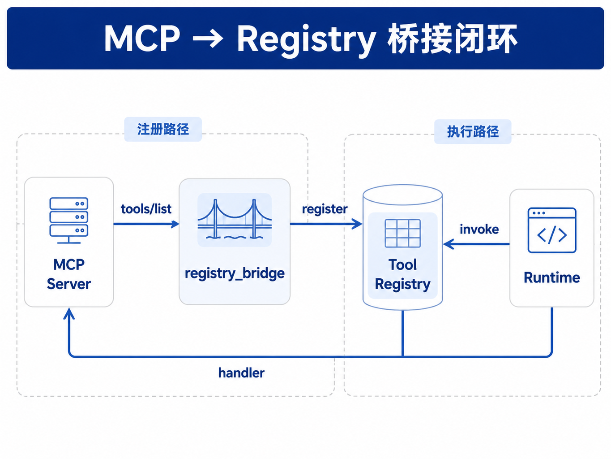

# 第24章 MCP 与企业工具生态

---

MCP 提供了一套让模型接入外部工具与数据的开放协议，但企业不能直接把任意 MCP Server 接进生产，仍需经过自己的 Registry 做权限、审计和风险分级。Host、Client、Server、Tools、Resources 和企业 Registry 分属不同边界，混在一起会让工具治理失控。后续重点放在 Host/Client/Server 的架构与部署、Tools/Resources/Prompts 三类能力，以及 MCP 与企业内部 Registry 如何衔接而非互相替代。第23章把工具收敛到 Tool Registry：按 `(name, version)` 注册、做 schema 校验、统一 `invoke`。企业里的存量能力却常常散落在各团队的 HTTP 服务、脚本库与供应商 SaaS 里。如果每个接入方各自写适配，很快又会回到“一 Agent 一集成”的老路。Registry 管平台内统一命名、版本与校验；MCP 管进程和服务边界上的协议。集成路径始终是“发现、注册、invoke”，不能用 MCP 替代 Registry。外部能力要以统一协议暴露，平台也不能为每个 Server 各写一遍 HTTP 客户端。执行与审计仍应走第22章的 `action` → `invoke` → `result`。发现由 L1 或 MCP Client 的 `tools/list` 完成，不进入 Run 主循环。Model Context Protocol（MCP）是 Anthropic 等推动的开放协议，用统一的 JSON-RPC 语义暴露 Tools、Resources、Prompts，让 Host 上的 Client 以同样方式连接多个 Server (Anthropic 2024; Model Context Protocol 2024)。在本书的平台分层中，MCP 属于 L3 接入标准：外部 Server 按 MCP 暴露能力，平台侧 Client 拉取 `tools/list`，再注册进 Registry，Runtime 仍走第22章与第23章的统一调用链。与面向 Agent 互操作的 A2A 等协议对照阅读见第29章 (Google 2024)。术语约定如下。MCP 指 Model Context Protocol，即 L3 协议层的 JSON-RPC 标准；Host 指承载用户会话并编排 LLM 与 Client 的应用进程，本平台中可理解为 Runtime + Planner；Client 代表 Host 连接 Server、转发 `tools/list` 与 `tools/call`；Server 指暴露 Tools、Resources、Prompts 的独立进程或服务。

一家多业务线企业把「销售宽表只读查询」封装为独立 MCP Server 后，DataAgent、财务 Agent 与运维脚本可以共用同一服务，审计与版本治理仍留在 Registry 层。关键边界有三处：MCP 在 L3 的位置、Tools / Resources / Prompts 的分工，以及 MCP 工具进入 Tool Registry 的方式。这些边界对应五个设计面：协议层位置、Host / Client / Server 架构、三类能力、企业接入治理，以及 Registry 调用链中的落点。MCP 解决的是工具和资源如何以统一协议暴露给模型应用，但它不会自动解决企业治理问题。企业内部已经有权限、网络隔离、审计、数据分级和工具版本管理，任何 MCP Server 进入生产前都要被这些机制接管。否则，协议统一了，风险却从分散脚本变成分散 Server。

把 MCP 直接等同于 Tool Registry 是常见误解。MCP 让外部能力更容易被发现和调用，Registry 则负责企业内部命名、版本、权限、风险等级和审计。一个 MCP Server 可以提供多个工具或资源，但平台仍要决定哪些租户能看见、哪些工具需要审批、哪些输出要脱敏、哪些调用可以进入高风险流程。集成路径通常从试点开始。开发者先用 MCP 接入一个数据库、文件系统或 SaaS 工具，模型很快能完成演示；生产评审时，安全团队会问连接凭证在哪里、Server 跑在哪个网络域、日志是否进入 Trace、调用失败是否可重放。若这些问题没有答案，MCP 只是把集成速度提高了，并没有让工具进入平台。

## 24.1 MCP 在平台协议分层中的位置

第2章将 L3 协议互通定义为跨系统、跨平台的标准接口层。MCP 当前最典型的生态位，是让 LLM 应用（Host）以标准方式使用外部数据与工具（Server），避免在每个 Agent 项目里复制 HTTP 客户端 (Anthropic 2024)。

### 24.1.1 与 Registry、Runtime 的关系

下表概括 MCP 与 Registry、Runtime 在 L2 / L3 的分工：

*表24-1：MCP 各层组件与 Registry、Runtime 的关系。来源：本书整理。*

| 层次 | 组件 | MCP 相关职责 |
|------|------|--------------|
| L2 运行时 | Runtime | 不变：发 `action`、调 Registry `invoke`、写 `result` |
| L2 运行时 | Tool Registry | 存储 MCP 工具注册后的 `ToolSpec` + handler |
| L3 协议 | MCP Client | `tools/list`、`tools/call`、传输（stdio / Streamable HTTP） |
| L3 协议 | MCP Server | 暴露工具实现、可选 Resources/Prompts |

Host 内 Runtime、Registry 与 MCP Client 的关系见 图 23-1（Registry 架构）与 图 24-1（MCP 桥接闭环）；Client 可连接多个 MCP Server（Sidecar 或共享服务，见下文部署拓扑）。企业接入 MCP 时，首要判断是接入后能否继续遵守原来的运行边界，而非连接是否连接。Runtime 不应该因为工具来自 MCP，就绕过第22章的 Run 状态、Tool Call 记录和错误分类；Registry 也不应该因为 MCP Server 已经有 `inputSchema`，就放弃平台侧命名、版本和风险登记。MCP 解决跨进程工具发现和调用；企业平台还要解决谁能调用、调用什么版本、结果进入哪些日志、失败如何回放。

### 24.1.2 MCP 接入的四个硬约束

企业接入 MCP 时，风险通常出现在四个判断上：MCP 是否被放错层、Runtime 是否绕开 Registry、Resources 是否替代了检索系统、Server 侧是否缺少审计。把这四个问题先讲清，后面的 Host、Client、Server 部署才不会变成“能连上就算集成”。

#### MCP 不替代 Tool Registry
Registry 管平台内统一命名、版本与校验；MCP 管进程和服务边界上的协议。正确路径是 MCP 工具先注册进 Registry，再由 Runtime 通过 Registry 调用。

#### Run 主循环不直连 MCP Server
每次 Tool Call 都新建 MCP 连接会导致延迟与连接风暴。应注册为 Registry handler，连接池与熔断在 Client 层复用。

直连会破坏责任归属。Runtime 如果自己拿着 MCP Client 调 Server，工具调用就不再经过 Registry 的版本选择和 schema 校验，Trace 中也很难还原“模型看到了哪个工具定义、实际调用了哪个 Server、失败时走了哪条恢复策略”。当同一个 Server 被多个 Agent 共用时，这种绕行尤其危险：一个 Agent 升级了工具参数，另一个 Agent 仍按旧 schema 调用，错误会落在 Server 日志里，而平台侧只看到一次含糊的工具失败。

#### Resources 不替代 RAG
MCP Resources 提供可读 URI 与快照（第24章 §3）；企业级检索、权限与索引仍在第20章 RAG 与向量库。二者可并存：RAG 负责“搜”，Resource 负责“读某一已知文档版本”。

#### Server 侧审计必须留下
MCP 只规范协议，不自带企业 IAM。Server 侧须记录调用方身份、`tenant_id`、工具名、参数摘要、结果摘要与 `run_id`；平台 Trace 与之关联（第38章）。谁可以 `tools/call` 哪类工具，仍须落到第50章 Policy 与网络隔离。

---

## 24.2 Host / Client / Server 架构与部署

MCP 规范定义 Host、Client、Server 三类角色 (Model Context Protocol 2024)。Host 承载用户会话并编排 LLM 与工具调用，在本书平台里可以对应 DataAgent Runtime 或更上层的应用进程。Client 代表 Host 连接一个或多个 Server，负责 `tools/list`、`tools/call` 和传输层细节。Server 是独立进程或服务，对外暴露 Tools、Resources 与 Prompts，例如只读数据库查询服务 `mcp-db`。这三个角色不能混在一起实现。Host 负责业务会话和运行状态，Client 负责协议连接，Server 负责能力暴露；边界越清楚，后续做连接池、租户隔离、审计关联和 Server 熔断时越容易落地。

### 24.2.1 传输方式

MCP 生产部署时先区分「本地进程」与「远程服务」。本地 Server 通常使用 stdio；远程 Server 应优先采用 MCP 规范中的 Streamable HTTP（2025-03-26 起的主流远程传输）。旧版 HTTP+SSE 可作为兼容路径，或作为 Streamable HTTP 内的服务器消息流机制理解，不宜在新文档中把「SSE / HTTP」写成生产远程传输的主名称。

*表24-2：MCP 几种传输方式适用的场景与注意事项。来源：本书整理。*

| 传输 | 场景 | 注意 |
|------|------|------|
| stdio | 本地子进程、IDE 插件、开发机工具 | 容器内需明确子进程生命周期，避免僵尸进程 |
| Streamable HTTP | 远程 MCP Server、K8s 部署、多 Host 共享 | 须配置 TLS、鉴权、超时、body 大小限制与网关路由 |
| HTTP+SSE（兼容） | 对接 2024-11-05 规范遗留端点 | 仅作兼容；新部署优先 Streamable HTTP |
| 进程内（示例） | 教学与单测 | `tools/mcp_db/` 采用；只模拟 method/params 分发，不代表生产传输层 |

本章示例为降低依赖，使用进程内 `McpDbClient → McpDbServer` 调用；生产实现应替换为官方 SDK 的 stdio 或 Streamable HTTP transport，并保留 Runtime → Registry → handler → MCP Client 的调用边界。传输方式会影响故障形态。stdio Server 失败时，问题常出在子进程生命周期、标准输入输出阻塞和容器重启；远程 HTTP Server 失败时，问题常出在鉴权、网关超时、body 过大、连接池耗尽和区域网络策略。平台如果把这些错误都包装成普通工具失败，Planner 只会重复尝试同一个调用。更好的做法是把 transport 超时、Server 业务错误、schema 不一致和权限拒绝分开记录，Runtime 才能选择重试、熔断、反馈 Planner 或转人工。一次典型的 `tools/list` 与 `tools/call` 交互步骤如下：

*表24-3：MCP 一次通信的步骤、方向与说明。来源：本书整理。*

| 步骤 | 方向 | 说明 |
| --- | --- | --- |
| 1 | Host → Client | 连接 Server（stdio / Streamable HTTP） |
| 2 | Client → Server | `tools/list` → 工具定义数组 |
| 3 | Host → Client | `tools/call(name, args)` |
| 4 | Client → Server | JSON-RPC 请求 |
| 5 | Server → Client | `content` + 可选 `structuredContent` |
| 6 | Client → Host | 归一化结果供 Registry handler 返回 |

每次 `tools/call` 都应记录 `tenant_id`、调用方身份和参数摘要，并把这些信息和第38章的 Trace、合规导出链路接起来。协议只负责传消息，本身并不能替代审计存储。

### 24.2.2 部署拓扑

- Sidecar：每个 Agent Pod 边车连接固定 MCP Server，适合强隔离租户。
- 共享服务：平台运维统一部署 `mcp-db`，多 Host 通过 Client 连接，须配额与熔断。
- 容器/宿主机：`mini-platform` 示例实现用 `sys.path` 兼容两者；生产 Config 中写清 Server 基址或 stdio 命令行。

### 24.2.3 JSON-RPC 消息语义

MCP 建立在 JSON-RPC 2.0 消息模型之上 (Model Context Protocol 2024)，完整报文包含 `jsonrpc: "2.0"`、`id`，以及 `method` / `params` 或 `result` / `error`。初学时不必死记字段表，先抓住下面三条主线更重要，后续再回头看完整规范也不会乱。

1. 发现：`tools/list` → 得到工具数组（名、描述、`inputSchema`）。
2. 执行：`tools/call` → 传入 `name` 与 `arguments` 对象。
3. 生命周期：连接建立时通过 `initialize` 交换协议版本与能力，生产 Client SDK 会封装；本章参照 (Model Context Protocol 2024) 2024-11-05 规范语义，远程传输以 Streamable HTTP 为准（2025-03-26 修订）。

`mini-platform` 里的 `McpDbServer.handle_jsonrpc()` 只模拟 method/params 分发，返回的是业务对象，不是完整 JSON-RPC envelope，也没有实现 `initialize` 握手。这个示例适合离线对照规范理解流程，不适合直接当成生产 MCP 报文形态。

### 24.2.4 Host 内多 Client 管理

一个 Host 常同时连接多个 Server（数据库、文档、工单），平台应在 Host 内维护 Client 池。Client 池至少处理四件事：按 Server 实例复用连接，避免每次 Tool Call 都握手；注册 Registry 时给工具名前缀，如 `mcp_db_`、`mcp_docs_`，避免与内置工具冲突；某个 Server 连续失败时，临时从 `tools/list` 缓存中摘除并触发熔断；按租户限制并发 `tools/call`，防止共享 Server 被单个 Agent 拖垮。这些逻辑不适合散落在每个 Agent 里。它们属于 Host 侧运行治理，和第22章的 Run 状态、第23章的 Registry 版本以及第38章的 Trace 关联在一起。Agent 只应看到可用工具和调用结果，不应感知底层连接是否重建、是否被熔断、是否切换了 Server 实例。

---

## 24.3 Tools、Resources、Prompts 三类能力

MCP 把能力分成三类：Tools 用来执行动作，Resources 用来读取带 URI 的对象，Prompts 用来复用提示模板 (Model Context Protocol 2024)。先把这三类分清楚，后面的接入和治理边界才不会混。

### 24.3.1 Tools

- 与第23章 Function Calling 对齐：有 `name`、`description`、`inputSchema`。
- 执行走 `tools/call`，返回 `content`（文本/图像等）与可选 `structuredContent` (Qu et al. 2025)。
- 企业默认：写操作 Tools 须幂等键 + Policy 审批（第30章）。

### 24.3.2 Resources

- 通过 URI 标识只读对象，如 `sales://report/2025Q1`。
- Client `resources/read` 拉取快照，适合「已知路径读文件」，不适合开放式语义检索。
- 与第20章 RAG：RAG 解决找文档，Resource 解决读指定版本。

### 24.3.3 Prompts

- Server 暴露命名提示模板，Host 可参数化实例化。
- 平台可把 Prompts 纳入 Prompt 模板管理（第8章），与 Agent 配置绑定，避免运营在 Server 与 Console 两处维护冲突版本。

三类能力在平台中的典型落点如下：

*表24-4：Tools、Resources、Prompts 三类能力的用途与平台落点。来源：本书整理。*

| 能力 | 典型用途 | 平台落点 |
|------|----------|----------|
| Tools | SQL、工单、邮件 | Registry + Runtime |
| Resources | 制度 PDF、指标快照 | 缓存 + 权限 URI |
| Prompts | 标准分析步骤 | Prompt 仓库 |

本章示例聚焦 Tools；Resources/Prompts 作为生产扩展项处理。关键结论：默认只有 Tools 经 `register_mcp_tools` 进入 Registry 并由 Runtime `invoke`；Resources 更适合 Memory/RAG 或带权限的 URI 读取；Prompts 进入 Prompt 模板仓库（第8章），避免与 Server 侧模板双源维护。这三类能力如果混用，后续治理会很麻烦。把 Resource 当 Tool，会让一次只读文档读取也进入副作用审计链，增加不必要的审批；把 Tool 当 Resource，又可能绕过动作权限和幂等检查；把 Prompt 留在 MCP Server 内部，运营团队在平台 Console 里就看不到真实模板版本。企业应在接入阶段就给每个能力定归属：可执行动作进 Registry，只读对象进带权限的资源读取或 RAG，提示模板进统一 Prompt 仓库。

### 24.3.4 行业场景：三类能力配合一次问数

运营总监问「华东区 SKU 为何下滑」时，典型分工是：

1. Tools：`query_sales` 拉结构化销量（本章示例）。
2. Resources：`policy://pricing/2025Q2` 读取当季定价制度 PDF 快照，供 Planner 解释「是否降价导致」。
3. Prompts：Server 暴露 `monthly_sales_review` 模板，保证 Reviewer Agent 输出固定章节（摘要、根因、行动项）。

三类能力在平台中的典型落点见上表；Planner 分别经 Tools / Resources / Prompts 取数后汇总回答。三类能力不必塞进同一个 MCP Server，关键是 Host 侧统一发现与权限模型，再汇入 Registry 或 Memory（Prompts 进 Prompt 仓库）。

### 24.3.5 直连 HTTP 与 MCP Server 的接入选择

接入存量系统时，可在直连 HTTP 与经 MCP Server 暴露之间取舍，下表对比四个维度：

*表24-5：直连 HTTP API 与经 MCP Server 暴露的多维对比。来源：本书整理。*

| 维度 | 直连企业内部 HTTP API | 经 MCP Server 暴露 |
|------|----------------------|-------------------|
| 接入成本 | 每个 Agent 写客户端 | 一次 Server，多 Host 复用 |
| 契约 | OpenAPI / 私有 | MCP `inputSchema` + JSON-RPC (Hou et al. 2024) |
| 生态 | 无标准工具发现 | `tools/list` 可自动注册 |
| 适用 | 强定制、极低延迟内部调用 | 跨团队、跨工具、需 IDE/多 Host 复用 |

企业在存量只读数仓场景里更适合选 MCP，因为复用面广；对毫秒级交易风控，通常还会保留 gRPC 直连，不再额外包一层 MCP Server。这个取舍也适用于团队边界。跨团队共享、需要标准发现、需要被 IDE 或多个 Host 复用的能力，适合先封装成 MCP Server，再进入 Registry；只有单一业务内部、延迟极端敏感、接口已经稳定受控的调用，才适合继续直连。不要因为 MCP 是新协议就把所有 HTTP API 包一遍，也不要因为直连更快就让每个 Agent 重复维护客户端。判断标准应回到复用范围、治理成本、延迟预算和审计要求。一条实用规则是：先问这个接入未来会不会被第二个 Host 使用。如果答案是否定的，MCP 未必值得；如果答案是肯定的，标准发现和统一注册通常会很快抵消早期封装成本。这个判断应写入接入评审记录，方便后续复盘，记录里也应说明为何没有选择直连。

## 24.4 企业接入：身份、网络与审计

MCP 进入企业生产后，至少要把三件事说清楚：谁可以连、流量怎么走、事后如何查。后面这一节就是围绕这三个问题展开。

### 24.4.1 身份与租户

- Server 须校验调用方租户与 scope（与第22章 `context` 原样传递一致）。
- 不宜把长期密钥写在 Host 环境变量里裸传；优先短期令牌 + 轮换（第50章）。
- 多租户场景可为每个租户部署独立 Server 实例，或在 Server 内做行级隔离，取决于数据敏感级。

身份设计不能停在“请求里带了 tenant_id”。生产系统应从用户会话、Agent 配置和工具策略三处交叉确认租户与权限：用户是否属于该租户，Agent 是否被授权使用该工具，工具本身是否允许访问目标数据域。任何一处不一致，都应在 Registry handler 进入 MCP Client 前被拒绝。这样做会让接入流程多一道校验，但能避免 Server 端只根据模型传来的参数做隔离，把安全边界交给不可信输入。

### 24.4.2 网络

- 生产禁用公网无鉴权 MCP 端点。
- K8s 内用 Service + NetworkPolicy 限制只有 Runtime 命名空间可访问 `mcp-db`。
- 出站代理场景需为 JSON-RPC 配置超时与 body 大小上限，防止大结果拖垮 Run（第22章 `tool_timeout`）。

网络边界还要考虑结果体大小。很多 MCP Server 一开始只返回几行样例数据，上线后却可能返回完整文档、长报表或大段日志。若网关和 Client 没有限制 body 大小，单次 `tools/call` 就可能把 Run 的上下文、前端流式通道和审计存储一起拖慢。平台应把“结果摘要”和“原始大对象”分开：Tool Result 中保留可展示摘要和 artifact URI，大对象进入受权限控制的对象存储或资源读取链路。

### 24.4.3 审计

- 每次 `tools/call` 写 Tool Call 记录：`tool_call_id`、参数摘要、Server 实例 ID、延迟。
- MCP Server 日志与平台 Trace 用同一 `run_id` 关联（第38章）。
- 合规导出须能证明「哪次 Run 经 MCP 调了哪张表」。

审计链要能两头对上。平台 Trace 能说明“哪个 Run 调用了哪个 ToolSpec”，Server 日志要能说明“哪个请求实际访问了哪个后端资源”。如果两边只靠自然语言日志关联，事故复盘会很慢；更可靠的做法是让 Registry handler 把 `run_id`、`tool_call_id` 和内部 `request_id` 作为结构化字段传给 MCP Client，再由 Server 原样写入访问日志。这样即使 Server 聚合了多个 tool，也能定位到具体能力和具体调用。

### 24.4.4 Server 聚合与拆分

聚合 Server 与按工具拆分 Server 的取舍，应放到故障影响面和运维复杂度中判断。每个工具单独部署 MCP Server，故障半径小，权限边界清楚，但实例数量、发布流程和健康检查都会增加；多个 tool 聚合到同一个 Server，运维简单，适合只读数据库、指标查询和轻量查询工具，但单点故障会影响一组能力。经营分析 DataAgent 可以采用聚合只读 DB Server，同时让制度文档和指标说明继续走 RAG 或 Resources 读取，避免把“查表”和“读文档”强行塞进同一个 Server。拆分标准不应只看代码目录，而要看数据域、权限等级、调用频率和事故影响。访问客户明细、触发导出和发送通知的工具不应与普通只读查询混在一个宽权限 Server 里；同一数据域内的多种只读查询可以聚合，以减少连接和运维成本。这个判断应写入接入评审记录，后续 Server 变更时才能解释为什么合并或拆分。

### 24.4.5 合规与数据驻留

跨境业务须明确 MCP Server 进程与数据落点：`tools/call` 的参数与结果是否出境、日志是否含 PII。若 Server 运行在境外 SaaS，即使 Host 在国内，也可能触发合规审查。平台应在 L1 注册工具时标注数据域（如 `cn-north` / `eu`），Policy 据此拒绝跨域调用。数据驻留还包括调试链路。很多团队只检查业务结果是否出境，却忽略了 MCP Client 日志、Server 访问日志、错误堆栈和 trace 采样。一次失败的 `tools/call` 可能把完整参数写入错误日志，其中包含客户 ID、SQL 条件或文档 URI。生产接入时要明确哪些字段可以记录原文，哪些只能记录哈希或摘要，哪些日志必须留在同一区域。否则，合规风险往往会从排障和监控系统泄出，而非正常调用链路泄出。

---

## 24.5 MCP Server 与 Tool Registry 的集成

集成时要守住一个边界：Runtime 只认 Registry，MCP 只是 handler 的一种实现来源。这样协议层的变化才不会直接渗到运行时主循环里。

!!! warning "MCP 不替代 Registry"
    生产 Runtime 不应直接调用 MCP Server。MCP 工具须先注册为 ToolSpec，再由 Registry `invoke`；审计与版本治理仍走第22章/第23章 统一模型。

### 24.5.1 集成步骤

1. 发现：Client `tools/list` 拉取 Server 工具目录。
2. 映射：为每个 MCP 工具生成平台内唯一 `name`（建议前缀 `mcp_db_` 避免冲突）。
3. 注册：`parameters_schema` 取自 MCP `inputSchema`，handler 内部调 `client.call_tool`。
4. 健康检查：L1 周期性 `tools/list` 或 ping，失败则从 Agent 工具视图摘除并告警。
5. 执行：Runtime `registry.invoke` → handler → MCP Client → Server。

参考实现：`tools/mcp_db/registry_bridge.py` 的 `register_mcp_tools()`。示例 handler 仅返回 MCP `structuredContent` 供 `invoke` 使用；生产应保留 `content` 与 `structuredContent` 的完整映射，供 Trace 与前端展示。



*图24-1：MCP → Registry 桥接闭环。来源：本书自绘。Alt text：外部 MCP Server 暴露的工具先经企业 Registry 登记、打风险等级、加权限策略，再供 Runtime 调用，调用结果回流审计，箭头构成接入到治理的闭环。*

### 24.5.2 错误处理

*表24-6：MCP 各类错误场景的平台侧处理方式。来源：本书整理。*

| 场景 | 平台侧处理 |
|------|------------|
| Server 不可达 / transport 超时 | Registry handler 包装为 `TOOL_UNAVAILABLE`（`core/registry/errors.py` 已定义；示例进程内 Server 通常不触发），Runtime 按 第22章 重试策略处理 |
| MCP 返回业务错误 | 写入 Tool Call `error.details`，由 Runtime 决定是否将错误反馈给 Planner |
| `inputSchema` 与 Server 实参不一致 | 注册 CI 或健康检查阶段发现；变更须升 Registry 版本 |

错误处理的关键是保留异常分类，不能把所有异常都翻译成“工具失败”。`TOOL_ARGUMENT_INVALID` 说明 Planner 还有机会修正参数；`TOOL_UNAVAILABLE` 说明下游暂时不可用，应走重试或熔断；权限拒绝则不应反馈给模型继续尝试，而应直接结束或转人工。MCP Server 自己返回的业务错误也要保留原始分类，否则 Runtime 只能靠字符串猜测下一步。企业接入 MCP 时，应把 Server 错误码映射成平台错误码，并在映射表变更时同步升级 ToolSpec 版本。

### 24.5.3 版本迁移与灰度接入

MCP Server 一旦进入企业平台，就不再只是一个工具进程，而是共享能力的发布对象。Server 侧修改 `inputSchema`、返回结构、鉴权方式或资源 URI 语义，都会影响已经注册到 Registry 的 ToolSpec。平台不能默认 `tools/list` 每次返回的都是兼容版本；更稳的做法是把 MCP 工具注册结果固化成平台内版本，先进入影子模式，再切换到生产。灰度接入可以分四步。第一步是发现和快照：Client 拉取 `tools/list` 后生成候选 ToolSpec，但不立即暴露给 Planner。第二步是静态校验：检查 name、description、inputSchema、返回结构、风险等级、租户范围和 Server 身份。第三步是影子调用：用回放样本或合成样本调用新 Server，把结果与旧版本对比，只记录 Trace，不影响真实 Run。第四步才是发布：把新版本加入 Registry，按 Agent、租户或业务线逐步放量。

这套流程看起来比直接连接 MCP Server 慢，但它解决的是生产稳定性。很多事故应按“能返回，但语义变了”：字段名从 `customer_id` 改成 `account_id`，金额单位从元变成分，错误码从字符串变成对象，或者默认查询范围从本租户变成全局理解，不能停留在 Server 完全不可用。若这些变化直接进入 Planner，模型可能继续生成看似合理的动作，Trace 却很难解释为什么同一条问题在两天内走出不同结果。因此，MCP 接入评审要记录三类版本。`server_version` 说明能力提供方发布了什么，`tool_spec_version` 说明平台登记了什么，`registry_version` 说明某个 Agent 实际可见什么。三者不必同时变化，但必须能互相追溯。回滚时，平台回滚的是 Registry 可见版本，而非临时要求 Server 团队撤回代码。

### 24.5.4 失败恢复与降级策略

MCP 失败不应全部交给 Planner 猜。平台侧至少要区分四类失败：连接失败、协议失败、业务失败和策略失败。连接失败包括 Server 不可达、连接池耗尽、网关超时；协议失败包括 JSON-RPC envelope 不合法、schema 不匹配、返回结构缺字段；业务失败包括下游数据库报错、文件不存在、查询为空；策略失败包括租户不匹配、scope 不足、风险等级不允许。这四类失败对应不同恢复动作。连接失败可以重试、切换副本或熔断 Server；协议失败通常不能重试，应摘除新版本并告警；业务失败可以把错误反馈给 Planner，由 Planner 调整参数或结束任务；策略失败必须停止当前动作，必要时进入第30章的人工审批或拒绝链路。若平台只返回一个“tool failed”，Planner 可能在权限拒绝后继续尝试变体，也可能在协议不兼容时反复生成新参数，造成成本和风险同时放大。

对用户可见的降级也要提前设计。只读查询类 MCP Server 不可用时，可以提示“当前数据工具不可用，保留问题并稍后重试”；文档 Resource 不可读时，可以降级为只基于已缓存证据回答，并明确证据不完整；高风险写工具失败时，不能自动改走备用写入路径，应把状态停在可复核位置。MCP 的价值在于标准接入，但生产系统的可靠性来自这些失败后的确定行为。

---

## 24.6 RunLoop 中的 MCP 数据库工具桥接

MCP 实现位于 `tools/mcp_db/`；`build_workflow_registry()` 通过 `register_mcp_tools()` 将其注册为 `mcp_db_query_sales@v1`，Data Agent 阶段经 RunLoop → Registry `invoke` 调用。MCP 协议与 Registry 桥接的独立单测见 `tests/test_mcp_db.py`。

### 24.6.1 MCP 示例运行方式

如果想看最小可运行链路，可以直接在 `mini-platform` 根目录执行下面的命令。这个例子展示的是 MCP 数据库工具如何先注册进 Registry，再进入 RunLoop。
```bash
python3 projects/multi-agent-workflow/run.py start
pytest tests/test_mcp_db.py -q
```

SSE 输出中应包含 `"tool": "mcp_db_query_sales"`。`tests/test_mcp_db.py` 覆盖 `tools/list`、`tools/call`、Registry 注册与 `invoke`。运行环境以 `mini-platform/pyproject.toml` 为准，当前要求 Python 3.11 及以上。

### 24.6.2 MCP 实现入口
```
mini-platform/tools/mcp_db/
├── __init__.py
├── server.py           # McpDbServer：tools/list、tools/call
├── client.py           # McpDbClient：进程内 JSON-RPC
└── registry_bridge.py  # register_mcp_tools → ToolRegistry

projects/multi-agent-workflow/lib/
└── registry_setup.py   # build_workflow_registry() 内 register_mcp_tools(...)

projects/multi-agent-workflow/
├── run.py              # Data Agent 阶段触发 MCP Tool Call
└── README.md

tests/test_mcp_db.py    # MCP + Registry 单测
```

`server.py` 模拟 MCP 只读库工具 `query_sales`；实战项目在 Data Agent 阶段经 Registry 统一 `invoke`，与第22章 事件模型一致。这个示例链路的边界要读清楚。它验证的是“协议工具先桥接到 Registry，再进入 RunLoop”的链路，不验证远程传输、TLS、短期令牌、连接池和 Server 进程管理。生产落地时，`McpDbClient` 应被替换为官方 SDK 或企业封装 Client，`McpDbServer` 应接真实只读账号和审计日志；但 Runtime、Registry 和 Tool Call 记录的边界不应改变。换传输层可以，治理路径不能变。

### 24.6.3 MCP 调用示例

下面这组命令用来观察 MCP 工具在完整 Handoff 链中的调用位置。读者需要重点核对 `action`、`result` 和 Registry 注册名怎样对应起来；脚本跑通只能说明链路可执行，还不能证明治理字段已经对齐。
```bash
cd mini-platform
python3 projects/multi-agent-workflow/run.py start
```

SSE 输出中含 Data Agent 对 `mcp_db_query_sales` 的 `action` / `result` 事件。MCP 协议与 Registry 的单测如下。
```bash
pytest tests/test_mcp_db.py -q
```

注册完成后，平台里的工具名会变成 `mcp_db_query_sales@v1`，并与内置 `sql_executor` 并存。这样做的目的，是把协议来源、版本边界和审计记录都分清楚。

### 24.6.4 MCP 桥接示例范围与后续演进

本章示例覆盖的是 MCP 与 Registry 的最小桥接：`server.py` 模拟 `tools/list` 与 `tools/call`，`client.py` 负责调用，`registry_bridge.py` 把 MCP 工具注册成平台 ToolSpec，`multi-agent-workflow/run.py` 在实战项目里触发 invoke，`tests/test_mcp_db.py` 验证 MCP 与 Registry 的基本协作。它足以说明协议工具进入平台的路径：先发现工具，再注册工具，再由 Runtime 通过 Registry 调用，而非在 Agent 代码里直接发 JSON-RPC。生产化缺口也必须说清楚。本章没有实现远程 stdio / Streamable HTTP 传输、transport 超时后的 `TOOL_UNAVAILABLE` 端到端熔断、Resources / Prompts 全能力、健康检查与自动摘除、租户鉴权和网络策略，也没有实现第二个 `mcp_docs` Server。后续扩展时，应优先补远程传输、健康检查、熔断和租户隔离，再扩展更多 MCP 能力；否则 Server 数量增加以后，问题会从“能不能调通”转成“故障是否可定位、权限是否可解释、成本是否可归因”。

### 24.6.5 MCP 接入后最容易出问题的四个位置

#### 跳过 Registry 直连 MCP
现象：Runtime 在 Run 主循环直接 JSON-RPC，工具版本与审计体系分裂。修复：一律 `register_mcp_tools` 后只 `invoke`。

#### MCP 工具名与内置工具冲突
现象：`query_sales` 与旧 handler 同名，注册覆盖。修复：平台名加前缀 `mcp_db_` 或租户命名空间。

#### inputSchema 与 Server 校验不一致
现象：Registry 校验通过但 Server 拒绝。修复：注册 CI 对比双方 schema；变更升版本。

#### 容器内 stdio Server 僵尸进程
现象：Pod 重启后旧子进程仍占用端口。修复：Host 管理子进程生命周期，或改用 Streamable HTTP 远程 Server。

### 24.6.6 运行故障排查

运行故障排查可以按调用链从前往后看。若出现 `ValueError: region and tenant_id are required`，通常是 MCP 调用缺少必填参数，应对照 `inputSchema` 与 Registry schema；若出现 `KeyError: unknown tool`，先执行 `tools/list` 核对 Server 是否真的暴露该工具。`ValueError: unsupported method` 往往说明 Client 调用了示例 Server 未实现的 JSON-RPC 方法，需要回到 `handle_jsonrpc` 和官方规范确认 method 名称。Registry 侧的 `TOOL_NOT_FOUND` 更常见于注册或版本配置问题，应确认 `register_mcp_tools` 是否执行、Agent 配置里引用的工具名和版本是否一致。生产 Server 超时应定位到 MCP Client 日志、网关日志和第22章的重试策略，不能只看 Planner 的最终错误文本。MCP 故障排查的原则是先分清 schema、注册、传输、Server 业务错误和权限拒绝，再决定重试、熔断、降级或转人工。

---

企业接入 MCP 时，应把 Host、Client、Server 的责任分清。Host 承载用户体验和模型调用，Client 负责协议通信，Server 暴露工具和资源。身份、权限和审计不能散落在三者之间，需要有平台统一策略。MCP Server 的生命周期也要管理。谁发布、谁升级、谁撤下、兼容性如何测试、失败时如何降级，这些都要写进 Registry 或交付流程。外部 Server 更新接口后，模型可能仍能生成调用，但执行结果已经变了。MCP 的价值在于降低集成成本。企业要补上的，是生产系统需要的控制面。两者配合时，工具生态可以扩展得更快；缺少控制面时，工具接得越多，审计和权限越难收口。

MCP 接入还要考虑运行位置。Server 跑在开发者本机、业务内网、平台集群或供应商环境中，身份、网络和审计要求完全不同。生产环境通常不应让 Agent 直接连接个人机器上的 MCP Server，也不应让外部 Server 持有长期高权限凭证。资源类能力尤其需要权限控制。一个 MCP Resource 可能暴露文件、数据库 schema、知识库段落或运行日志。它看起来只是“上下文”，但进入模型后会影响推理，也可能泄露敏感信息。平台要像管理工具一样管理资源可见性，并记录哪些资源被送入上下文。MCP 的开发体验可以很轻，生产接入不能轻。试点阶段允许快速连接，进入共享平台前要完成工具描述、schema 校验、风险分级、凭证管理、网络策略、审计字段和失败恢复。这个门槛目的在于避免协议扩展成新的影子集成层，拖慢开发只是手段之一。

平台还要处理多个 MCP Server 的命名冲突。不同团队可能都提供 `query_database`、`search_docs` 或 `send_message`。Registry 应给工具建立企业级命名和版本，模型看到的描述也要避免相似工具互相干扰。否则 Server 越多，Planner 越难稳定选择。MCP 生态会持续变化，企业适配层要保持可替换。只要 Registry 和 Runtime 接口稳定，底层 Server 可以升级、迁移或替换；若业务 Agent 直接依赖某个 Server 的私有行为，长期维护成本会回到每个应用里。MCP Server 的凭证管理要与企业密钥系统连接。Server 调用数据库、SaaS 或内部 API 时，不应把凭证写在本地配置或环境变量中长期无人管理。平台可以通过短期令牌、服务身份和密钥轮换控制访问。这样 Server 被撤下或迁移时，权限也能同步收回。

审计日志要跨过协议层。一次 MCP 工具调用从 Host 发起，经 Client 到 Server，再访问后端系统。只在 Server 里记日志，平台看不到用户和 Run；只在 Host 里记日志，又看不到后端执行结果。企业接入时需要把 run_id、tool_call_id、用户身份和后端响应关联起来，形成完整链路。MCP 资源和工具还要区分可信等级。企业内部经过治理的数据服务，和外部公开网页抓取工具，不应以同样权重进入 Planner。Registry 可以给不同 Server 标注来源、维护团队、数据等级和风险等级，让 Planner 和 Policy 在选择时使用这些信息。Server 部署方式也影响可用性。单进程本地 Server 适合开发，生产环境需要健康检查、并发控制、超时、重启和版本发布。若某个关键工具只靠一个无状态脚本提供，Agent 任务会在高峰时不稳定。协议统一之后，服务工程仍然要补齐。

MCP 的生态优势在于连接器复用。企业可以利用社区 Server 快速接入常见系统，但每个 Server 都要经过代码审查、权限收敛和运行验证。外部工具越方便，准入越要清楚。否则平台会在不知不觉中接入大量无人负责的能力。从长期看，MCP 会让工具供应更丰富，企业 Registry 会让工具使用更可控。两者分工明确后，开发团队可以快速试验，平台团队可以稳定接管生产。这个节奏比争论“用不用 MCP”更重要。MCP 的调试体验也要纳入平台。开发者需要看到 Host 发出的请求、Server 返回的工具列表、参数校验结果和后端错误。生产调试还要关联 run_id 和 tool_call_id。没有统一调试入口，MCP 问题会在 Host、Client、Server 和后端系统之间来回定位。

MCP Server 的权限范围应尽量窄。一个 Server 只服务数据库查询，就不应同时拥有文件读写和消息发送能力；一个面向只读问答的 Server，不应持有写权限凭证。把能力拆细，会增加注册工作，但能降低被误用或被注入攻击后的影响范围。协议升级要做兼容性测试。MCP 规范、SDK 和 Server 实现都可能变化，工具 schema、资源返回和错误格式也可能随之变化。企业适配层应固定版本，并在升级前跑关键工具回归。否则一次 SDK 升级可能改变模型看到的工具描述。对于第三方 MCP Server，平台还要做供应链审查。代码来源、依赖包、网络访问、日志行为和凭证使用都需要检查。连接工具的便利性不能替代安全审查，尤其是 Server 能访问企业数据时。

MCP 接入还要设计隔离环境。开发者调试 Server 时，可以使用模拟数据和低权限账号；预发环境使用脱敏数据和受限工具；生产环境才连接真实系统。若开发和生产共用同一个 Server 或凭证，调试行为可能影响真实数据，也会让审计范围变得模糊。Server 返回的资源也要做大小和类型限制。一个资源读取接口如果能一次返回整库 schema、完整日志或大文件内容，会迅速膨胀上下文，也可能绕过数据分级。平台应在 MCP 适配层限制返回大小、字段范围和媒体类型，并把大对象转成 artifact 引用。这样模型拿到的是可控上下文，而非无限制的数据通道。在组织协作上，MCP Server 最好有明确维护团队。Server 失效、接口变更、凭证过期、依赖升级，都需要有人响应。没有维护团队的 Server 可以用于个人试验，但不应进入生产工具目录。工具生态开放，不等于生产责任可以开放。

## 24.7 MCP Server 准入复审

MCP Server 进入生产目录后，应定期复审。复审要看工具是否仍有人维护，schema 是否和 Registry 一致，凭证是否按期轮换，健康检查是否稳定，错误码是否还能映射到 Runtime 恢复策略，资源返回是否遵守大小和权限限制。外部 Server 还要检查依赖更新、供应链风险和网络访问范围。若某个 Server 长期无人使用，可以先冻结再下线；若它被多个 Agent 依赖，就要补发布窗口和回滚计划。MCP 的接入速度越快，复审机制越要稳定，否则工具生态会逐渐积累成无人负责的生产风险。

## 24.8 协议互操作的失败恢复边界

MCP 接入企业平台后，失败恢复要覆盖协议层、工具层和平台治理层。协议层可能出现连接中断、Server 版本不兼容、schema 解析失败、资源 URI 失效；工具层可能出现超时、权限拒绝、外部系统限流、返回结构变化；治理层可能出现凭证过期、Server 未通过准入、调用审计缺字段。若这些失败都被包装成“工具调用失败”，Runtime 无法判断该重试、降级、切换 Server，还是把任务挂起给人工处理。

平台应为 MCP Server 定义标准错误分类。连接类错误可以短暂重试，schema 类错误要阻断并通知 Server owner，权限类错误要提示用户申请或换路径，外部系统限流要交给网关和队列处理，审计缺字段要暂停高风险动作。错误分类还应进入 Trace。一次 Agent Run 调用 MCP 工具失败后，复盘材料要能说明失败发生在 Host、Client、Server、网络、凭证、工具实现还是下游系统。没有这层分解，MCP 会把外部生态的复杂度全部压到 Agent 对话里。

协议互操作还要设定平台边界。MCP 可以降低工具接入成本，但企业平台仍然要掌握身份、权限、审计、准入和回滚。Server 不能自行决定哪些租户可见、哪些字段可返回、哪些写操作可执行；这些判断应由 Tool Registry、Policy Engine 和 Runtime 共同完成。MCP Server owner 负责能力实现和版本说明，平台团队负责准入、路由、凭证和审计。边界写清后，MCP 才能作为工具生态的接入方式，而不会绕开企业 Agent 平台的治理规则。

## 24.9 MCP 生态工具的供应商与社区风险

MCP 让工具接入速度变快，也把供应商和社区风险带进平台。一个社区 Server 可能更新很快，但缺少长期维护承诺；一个供应商 Server 可能功能完整，但日志、凭证和网络访问不满足企业审计；一个内部团队写的 Server 可能解决当前问题，却没有版本、测试和 owner。平台不能只看 Server 是否能跑通，还要看它能否长期进入生产目录。

准入材料应包含代码来源、依赖清单、维护团队、版本策略、网络出口、凭证方式、日志字段、错误码和回滚方式。外部 Server 要检查是否会把数据发往不可控地址，是否记录敏感字段，是否允许企业固定版本。内部 Server 要检查是否有测试样本、发布记录和 on-call 责任。若这些材料缺失，Server 可以进入实验环境，但不应进入生产 Agent。

生态治理还要支持替换。某个 Server 下线、供应商变更、社区项目停更时，平台要知道哪些 Agent 受影响，哪些 ToolSpec 可以切到替代实现，哪些任务需要降级。MCP 的价值在于让工具生态更开放；企业平台的责任，是让开放生态进入可审计、可替换、可回滚的边界。

## 24.10 MCP 工具目录的运行复审

MCP Server 接入后，工具目录需要定期复审。工具名称、参数 schema、资源 URI、认证方式、权限范围和返回字段都会随着外部系统变化。若目录长期不复审，Agent 可能继续调用已经变更的接口，或者把旧参数传给新服务。MCP 的便利性来自协议统一，风险也来自统一入口把多个外部系统暴露给模型。

复审要覆盖实际调用记录。平台应查看哪些 MCP 工具被频繁调用，哪些经常超时，哪些返回字段过大，哪些被策略拒绝，哪些出现权限争议。调用很少但权限很高的工具，需要确认是否仍应开放；调用频繁但失败率高的工具，需要修 schema、错误码或重试策略；返回敏感字段的工具，需要改成引用或受控视图。工具数量本身没有太多意义，复审要判断每个工具是否仍适合被 Agent 使用。

早期可以按月生成 MCP 运行摘要：工具调用量、失败原因、权限拒绝、平均延迟、返回大小、owner 和最近变更时间。摘要进入 Tool Registry 复审流程，和第23章的工具治理、第30章的人工审批、第38章的 Trace 连接起来。这样 MCP 接入会从“能连上”进入“能被平台治理”的阶段。

## 24.11 MCP 接入的灰度发布与撤回

MCP Server 的接入应支持灰度和撤回。一个 Server 即使通过了 `tools/list` 和单次 `tools/call`，也还没有证明它适合进入生产 Agent。灰度前要确认 Server owner、版本、认证方式、网络位置、日志字段、错误分类和数据域。然后把工具注册为生产候选，只对内部租户、低风险任务或只读场景开放。灰度期间，平台重点观察连接失败、schema 不一致、返回过大、权限拒绝、错误码无法映射和用户结果质疑。若这些问题集中出现，应该撤回 Registry 可见性，不应要求 Planner 在对话中自行避开该工具。

撤回要保留任务证据。已经开始的 Run 是否继续、是否转入人工处理、是否返回可重试状态，需要由 Runtime 决定；Registry 只负责把新调用入口关闭。Trace 中要记录撤回原因、受影响工具版本、受影响 Agent 和替代路径。若 MCP Server 提供的是只读查询，可以降级到缓存或提示稍后重试；若提供的是写操作，撤回后不应切到未经审批的备用路径。灰度和撤回的边界写清后，MCP 才能被当作平台能力发布，不能停留在临时接入的外部工具状态。

这套发布纪律也能帮助生态治理。外部 Server、供应商 Server 和内部团队 Server 的变化节奏不同，平台不可能假设它们都按同一标准发布。Registry 层的灰度、冻结、撤回和替代路径，把外部变化转化为平台可管理的运行状态。这样 MCP 的标准化接入优势可以保留，同时不会把外部 Server 的发布风险直接传给用户任务。

## 24.12 MCP 工具退化的替代路径

MCP 工具进入生产后，退化不一定来自协议错误。Server 仍然能响应，工具 schema 也没有变化，但后端系统限流、凭证权限收紧、供应商 API 改版、资源返回字段减少，都可能让工具结果质量下降。Planner 看到的是同一个工具名，用户看到的是任务结果变差。若平台只监控连接成功率，就会漏掉这类退化。

替代路径要在接入时设计。只读查询工具可以降级到缓存、静态报表或人工查询；写操作工具可以转入 HITL 或暂停执行；资源读取工具可以返回 artifact 引用和延迟刷新状态；外部供应商工具可以切到内部 Server 或限制到低风险租户。替代路径不能由模型临场猜测，应写入 Registry 的能力元数据和 Runtime 的恢复策略。这样工具退化时，系统知道该继续、降级、挂起还是拒绝。

退化复盘要看业务影响。一个低频工具失败可能只影响个别任务，一个高权限写工具退化则可能造成错误动作或审批积压。平台应记录工具退化时间、受影响 Agent、替代路径、未完成 Run、用户可见提示和后续修复。若退化来自供应商或社区 Server，复盘还要判断是否需要固定版本、替换实现或收紧准入条件。

早期可以给每个生产 MCP 工具增加两个字段：`degradation_mode` 和 `replacement_path`。前者说明异常时允许怎样降级，后者说明替代能力、人工处理或暂停策略。字段简单，但能让 MCP 工具从“能调用”进入“能退化运行”的状态，也能和第22章 Runtime、第30章 HITL、第38章 Trace 形成一致的恢复语义。

## 24.13 MCP Server 的租户级准入策略

MCP Server 进入企业平台后，准入不能只按 Server 维度判断。一个 Server 可能同时暴露多个工具、资源和 Prompt，有些能力适合所有租户，有些能力只适合特定业务域，有些能力只能在审批后使用。若平台把整个 Server 一次性加入默认候选集，Planner 可能在不合适的租户或任务中选择它，带来权限、成本和数据出域风险。

租户级准入要把 Server 能力拆开看。每个能力都应声明适用租户、身份映射、可访问资源、网络边界、调用预算、审计字段和禁用条件。对于只读资源，可以开放更宽；对于写操作、外部 API 和数据导出，要限制租户、角色和审批策略。MCP Client 在调用前应从 Registry 获取租户可见能力，而不是直接相信 Server 自己的能力声明。

准入策略还要支持快速撤回。某个租户发现 Server 返回字段超出授权范围，平台应能只撤回该租户的某个工具，而不是关闭整个 Server；某个供应商接口临时不稳定，也应能按能力降权或移出候选集。撤回动作要写入 Trace 和工具目录，让 Planner 知道该能力为什么不可用。

早期可以为 MCP 能力建立租户级 allowlist。allowlist 不需要复杂，但要包含租户、能力、权限、预算、owner 和复审时间。这样 MCP 接入会更适合企业多租户环境，也能和第45章网关、第23章 Tool Registry 形成一致治理。

## 24.14 MCP Server 的租户级准入

MCP 把外部工具、资源和提示模板暴露给 Agent 平台，也把外部系统的风险带进运行链路。企业接入 MCP Server 时，不能只验证协议是否连通，还要做租户级准入。不同租户可能拥有不同数据边界、工具权限、审计要求和网络策略。同一个 MCP Server 对一个租户可以开放只读资源，对另一个租户可能需要禁止，或者只允许经过审批的工具调用。

准入材料应包含能力清单、数据域、认证方式、可调用工具、资源类型、返回内容结构、审计字段、错误语义和 owner。平台将这些信息转成 ToolSpec、Policy Engine 规则和 Trace 字段。若 MCP Server 只能返回非结构化文本，或者无法说明工具副作用，就不适合作为高风险生产工具。协议兼容只是第一步，平台准入要看它能否被治理。

早期可以把 MCP Server 分成三类：开发调试、内部只读、生产可写。开发调试只允许沙箱；内部只读需要身份、审计和资源范围；生产可写需要幂等、补偿、审批和样本回放。这样 MCP 生态能接入企业平台，同时不会绕过第23章工具注册和第50章安全边界。

## 24.15 MCP 接入后的运行责任

MCP 接入进入生产后，新增能力不能只看功能是否可用，还要看运行证据能否被不同角色复用。平台需要把Server owner、工具权限、调用日志、版本变更、失败回执和替代路径记录成稳定字段，并和发布单、Trace、评测样本以及事故记录关联起来。这样一次线上问题发生后，团队可以沿着同一组事实判断影响范围、责任归属和修复顺序，而不是在模型日志、业务日志和人工说明之间来回拼接。

这类证据还要服务相邻章节的能力。它和第23章工具注册、第29章协议互操作和第50章安全相连：上游能力提供输入假设，下游能力使用执行结果，治理能力负责保存证据和复审结论。若这些材料没有统一编号和版本，章节里讨论的工程能力在生产中会被拆散。业务 owner 只能看到用户投诉，平台 owner 只能看到系统错误，安全或合规团队只能看到事后说明，最后很难判断问题到底来自数据、模型、工具、流程还是组织责任。

生产环境中常见的风险包括接入后无人维护 Server、工具 schema 变更未通知平台、外部工具失败没有降级。这些问题在演示阶段不明显，因为演示通常只覆盖成功路径；上线后，用户会带来边界问题、重复请求、权限变化和长时间运行状态。平台团队应把失败样本纳入发布节奏，记录哪些样本需要阻断发布，哪些样本可以通过降级处理，哪些样本需要业务 owner 接受剩余风险。

MCP 能力进入平台后，应按生产工具管理，而非只按协议示例管理。这份记录不需要复杂，但要包含时间、版本、owner、样本、处置动作和下次复查条件。没有这些字段，复盘会停留在口头经验；有了这些字段，平台才能把一次问题转成后续发布、评测和培训材料。

早期平台可以从少量高风险场景开始。先选择调用量高、业务影响大或涉及敏感数据的路径，要求每次变更都留下证据包，再逐步推广到普通场景。这样章节里的能力不会停留在概念层，而会成为可运行、可解释、可退回的工程系统。

## 本章小结

MCP 是 L3 协议，Registry 是 L2 能力中枢。生产集成应按发现、注册、invoke 的路径推进：先识别 MCP Server 暴露的 Tools、Resources 和 Prompts，再把可执行能力映射为企业平台里的 ToolSpec。Tools、Resources 和 Prompts 的职责不同。企业问数场景通常以 Tools 为主，Resources 用于读取已知 URI，Prompts 更适合封装可复用模板。协议本身不提供企业 IAM、网络隔离和审计语义，生产接入时必须补齐这些边界。示例实现可以用进程内 Server/Client 讲清语义。上线时应替换为 stdio 或 Streamable HTTP，并使用真实数据库只读账号、Registry 版本管理和 Runtime Trace。

## 参考文献

Anthropic. (2024). *Introducing the Model Context Protocol*. [https://www.anthropic.com/news/model-context-protocol](https://www.anthropic.com/news/model-context-protocol)

Model Context Protocol. (2024). *Specification* (2024-11-05). [https://modelcontextprotocol.io/specification/2024-11-05](https://modelcontextprotocol.io/specification/2024-11-05)

Model Context Protocol. (n.d.). *Architecture overview*. [https://modelcontextprotocol.io/docs/concepts/architecture](https://modelcontextprotocol.io/docs/concepts/architecture)

Qu, C., et al. (2025). Tool learning with large language models: A survey. *Frontiers of Computer Science*, 19(8), 198343. [https://doi.org/10.1007/s11704-024-40678-2](https://doi.org/10.1007/s11704-024-40678-2)

Hou, X., et al. (2024). Large language models for software engineering: A systematic literature review. arXiv:2404.06393. [https://arxiv.org/abs/2404.06393](https://arxiv.org/abs/2404.06393) （工具集成与企业边界讨论）

Google. (2024). *Agent2Agent (A2A) protocol*（预告互操作方向，与 MCP 对照阅读）. [https://developers.googleblog.com/en/a2a-a-new-era-of-agent-interoperability/](https://developers.googleblog.com/en/a2a-a-new-era-of-agent-interoperability/)
