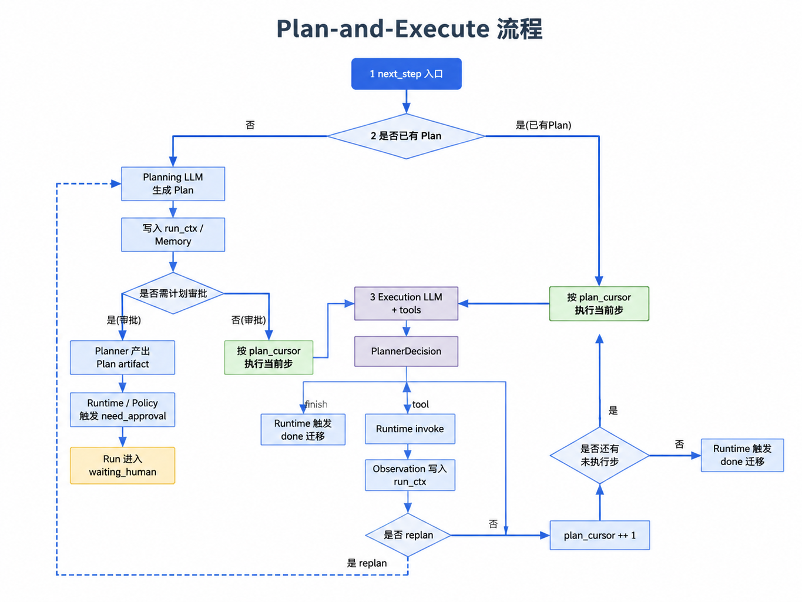

# 第25章 Planner 与编排模式

---

Planner 负责判断“下一步做什么”，但不执行工具；Runtime 负责推进 Run 状态、调用 Registry、推送事件和写检查点。这个边界看似简单，却决定了 Agent 是否可控。DataAgent 问数任务可以很好地暴露 Planner 的职责：它要读取上下文、工具历史和用户目标，产出下一步决策，再交给 Runtime 执行和记录。第22章说明 Runtime 怎样推进一次 Run，第23章说明工具怎样登记为 ToolSpec。这里还缺一个角色：谁在每一轮 Step 中读取上下文、工具历史和用户任务，并决定下一步该调用哪个工具，还是应该结束？

以 DataAgent 问数为例。用户问“上周华东区销售下滑的主要 SKU 是什么”。Runtime 负责状态和执行，Registry 负责工具定义和调用。Planner 需要判断：先查区域编码，还是直接查销售明细；SQL 失败后是修正参数，还是改走语义层；结果足够时是否可以生成最终回答。如果把规划和执行都写进 RunLoop，每个业务 Agent 都会复制一套 Prompt、工具选择和错误修复逻辑。版本一升级，行为很容易漂移。更可靠的做法是让 Planner 只返回结构化决策，Runtime 决定是否执行、如何执行、如何记录和如何恢复。这个拆分也让团队更容易定位问题。SQL 参数错了，先看 Planner 是否生成了错误 `args`；工具拒绝执行，先看 Registry schema 和 Policy；任务停在人工审批，先看 Runtime 状态和审批回调。边界不清时，问题往往被笼统归因成“模型不稳定”，排查会变得很粗。

Planner 章节容易写成算法清单，但企业关心的是责任边界。一个问数任务失败时，业务方不需要知道内部用了 ReAct 还是状态图；他们需要知道任务是否还在执行、哪个工具失败、是否需要补权限、是否能恢复。Planner 的模式选择要服务这些问题，而非为了展示框架能力。Planner 是 Agent 中最容易被神化的部分。看起来它在“思考下一步”，实际生产系统更关心它输出的决策是否受控、能否解释、失败后如何恢复。Planner 可以决定下一步调用哪个工具、是否请求澄清、是否结束任务，但它不应该绕过 Runtime 直接执行动作。

DataAgent 问数能很好地说明这个边界。用户问“华东区销售为什么下降”，Planner 可能先查指标口径，再查区域编码，然后生成 SQL，最后组织解释。每一步都只是提议。Runtime 要检查工具权限、执行 SQL、记录结果、处理失败，并把观察结果交回 Planner。若 Planner 自己执行工具，状态、权限和审计都会分散。Planner 的质量也不能只看最终答案。它是否过早调用强模型，是否在 SQL 失败后反复重试，是否在证据不足时仍然结束任务，是否把澄清问题推给用户，都影响生产体验。评测 Planner 时，要看它在不同状态下的动作选择，而非只看一轮输出是否聪明。

## 25.1 Planner 只提议，不执行

### 25.1.1 Planner 决定下一步

Planner 的输入来自三处：用户任务和租户上下文，Registry 提供的工具视图，Runtime 与 Memory 保存的历史。它的输出应该是一个小而明确的决策对象，而非直接调用工具。

*表25-1：Planner 的输入与输出。来源：本书整理。*

| 类别 | 内容 | 说明 |
|---|---|---|
| 输入 | `input`, `context`, `step_index` | 来自 `/run` 请求和 RunContext |
| 输入 | tools schema, tool version | 来自 Tool Registry |
| 输入 | Tool Call 结果、错误、Memory 片段 | 来自 Runtime 检查点和 Memory |
| 输出 | `finish`, `answer` | Planner 认为任务可结束 |
| 输出 | `tool`, `version`, `args` | Planner 提议一次 Tool Call |

工具视图不应由 Planner 自己 import handler。Planner 看到的 schema 必须和 Registry 执行前校验的 schema 同源，否则模型看到一套字段，执行器校验另一套字段，错误会很难复现。Planner 输入还应控制规模。把全量工具、完整会话和所有文档片段都塞给模型，看似信息充分，实际会降低工具选择稳定性。Runtime 和 Memory 应把当前 Run 所需的最小上下文交给 Planner，工具列表也应按租户、权限和工作流状态裁剪。例如一个经营分析 Agent 同时登记了 SQL、图表、邮件、工单和知识库工具。用户只是问“为什么华东区销量下降”，Planner 此时不应看到邮件发送和工单创建工具。等报告草稿生成并进入发布流程后，Runtime 再根据状态开放发布类工具，并由 Policy 决定是否进入 HITL。工具列表随状态变化，比在 Prompt 里反复提醒“不要乱发邮件”可靠得多。

### 25.1.2 PlannerDecision 承担握手语义

平台需要一个稳定的数据结构来表达单步决策，`PlannerDecision` 就承担这个作用。它的意义不在于写一个 dataclass，而在于把“Planner 提议了什么”与“Runtime 实际执行了什么”彻底分开。
```python
from dataclasses import dataclass
from typing import Any

@dataclass(frozen=True)
class PlannerDecision:
    finish: bool
    answer: str | None = None
    tool: str | None = None
    version: str | None = None
    args: dict[str, Any] | None = None
```

`finish=True` 只表示 Planner 认为可以结束，Runtime 还要确认没有未完成 Tool Call，才能触发 `done` 进入 `succeeded`。`tool` 和 `args` 也只是提议，Runtime 必须先做 Policy、schema、幂等和超时控制，再经 Registry 执行。

### 25.1.3 提议与执行分离

提议与执行分离带来三个直接收益：副作用只出现在 Runtime 的 `action` / `result` 事件里，审计链完整；工具错误可以作为 Observation 回到 Planner，让它修正下一步；Planner 模式可以替换，而 Runtime 的状态机、SSE、检查点和工具治理不需要重写。常见错误是让 Planner 直接调用 SQL 或 HTTP 工具。这样做会绕过 Registry 的版本、权限和错误分类，Trace 里也会出现“有结果、无 action”的断档。另一个错误是把 Planner 当成业务应用代码，在每个 Agent 里写不同的 if/else。Planner 应该提供可复用的编排模式，业务差异通过 Agent 配置、工具白名单和 Prompt 模板表达。还有一种更隐蔽的错误：Planner 在 Prompt 中描述了工具限制，但 Runtime 没有硬校验。模型通常会遵守限制，直到某个边界案例失效。生产系统不能把“模型应该不会这么做”当作安全设计，限制要落到 Registry、Policy 和 Runtime 的执行路径上。

---

## 25.2 ReAct：边观察边行动

### 25.2.1 适合探索性任务

ReAct 把推理和行动交错起来：模型先判断下一步动作，Runtime 执行工具，再把工具结果作为观察反馈给 Planner。Yao 等人提出的 ReAct 范式强调 Thought、Action、Observation 的循环 (Yao et al. 2023)。在企业平台里，Thought 不一定展示给用户，Action 应落成 Tool Call，Observation 必须来自真实工具输出或结构化错误。运营问数通常适合 ReAct。用户的问题一开始并不完全清楚，Planner 需要边查边修正：先确认区域口径，再查 SKU 排名，再根据结果决定是否补查库存或毛利。路径无法完全预先写死，ReAct 的逐步反馈比一次性计划更自然。

### 25.2.2 单轮机制

把 ReAct 放进平台以后，每轮 `next_step()` 大致会走五步。下面这个顺序既是实现路径，也是后面排查循环、超时和参数修复问题时的最小观察单元。

1. Runtime 把用户任务、历史 Tool Call、Memory 片段和可用工具交给 Planner。
2. Planner 经 Gateway 调用模型，附带 tools schema。
3. 模型返回工具调用意图或最终答案。
4. Planner 解析成 `PlannerDecision`。
5. Runtime 根据决策执行工具、进入人工审批、继续下一轮或结束。

如果 Registry 返回 `TOOL_ARGUMENT_INVALID`，Runtime 不应马上失败。它可以把错误写入 `result`，再调用 Planner 生成新的参数。相反，如果 Runtime 检测到同一工具同一参数反复出现，应该触发循环保护，而非继续让 Planner 试下去。

### 25.2.3 优势与代价

*表25-2：ReAct 的优势与代价。来源：本书整理。*

| 维度 | 优势 | 代价 |
|---|---|---|
| 任务适配 | 适合探索性、多跳、信息不完整的任务 | 步数不可预估 |
| 成本 | 每步只解决一个局部问题 | 多步会累计延迟和 token |
| 可观测性 | Tool Call 轨迹能解释任务路径 | Thought 草稿不宜直接外显 |
| 恢复 | 单步错误可局部修正 | 需要 `max_steps` 和循环检测 |

ReAct 的关键在 Runtime 边界，而不在模型“自由发挥”。工具从 Registry 来，动作由 Runtime 执行，结果写入检查点，失败按错误码分类。缺少这些边界，ReAct 很快会变成不可控循环。实际落地时，ReAct 最常见的失败是反复修同一个错误。比如模型连续三次生成同一条缺少租户过滤的 SQL，只是换了空格和字段顺序。Runtime 应对工具参数做规范化摘要，超过重复阈值后停止，而非继续烧 token。另一个常见失败是“口头完成”：模型生成了总结，但最后一次工具调用还没返回。终态仍然只能由 Runtime 判断。还有一种失败来自观察信息不完整。Planner 看到 SQL 返回空集，可能会直接总结“没有销售下滑”。但空集也可能意味着表选错、日期过滤错或权限过滤过严。Runtime 可以把工具错误和数据质量信号一并反馈给 Planner，例如“查询成功但结果为空，且过滤条件包含新上线的渠道字段”。这类 Observation 越结构化，Planner 越容易修正。

---

## 25.3 Plan-and-Execute：先规划后执行

### 25.3.1 适合事前可审计任务

Plan-and-Execute 先生成一份计划，再逐步执行。它适合强合规、路径相对清楚、需要事前审计的任务。例如财务关账助手在查数前要先说明会查哪些表、用什么过滤条件、生成哪些报告；审批人批准计划后，Runtime 才允许执行。计划对象本身是 artifact。它可以进入检查点、审批台和审计导出。审批通过后，Planner 按 `plan_cursor` 逐步吐出 `PlannerDecision`，Runtime 仍按第22章的规则执行工具。

### 25.3.2 两阶段机制

Plan 阶段不应执行工具。Planner 只根据任务、工具摘要和策略生成结构化计划。
```json
{
  "steps": [
    {"id": 1, "goal": "解析华东区 region_code", "tool_hint": "sql_executor"},
    {"id": 2, "goal": "查询 SKU 销售排名", "tool_hint": "sql_executor"},
    {"id": 3, "goal": "汇总自然语言答案", "tool_hint": null}
  ]
}
```

Execute 阶段才按计划逐步生成 Tool Call 提议。如果 Observation 推翻了计划前提，例如区域编码不存在，Planner 可以 Replan，但 Replan 也要写入 `planner_output`，方便审计。



*图25-1：Plan-and-Execute 流程。来源：本书自绘。Alt text：流程先由 Planner 生成多步计划，再逐步执行；遇到错误或前提不成立时回到重规划，箭头展示先规划后执行和 ReAct 边想边做的区别。*

### 25.3.3 与 ReAct 的适用边界

*表25-3：ReAct 与 Plan-and-Execute 的取舍。来源：本书整理。*

| 维度 | ReAct | Plan-and-Execute |
|---|---|---|
| 计划可见性 | 分散在每轮 Step | 先生成完整计划 |
| 人工审批 | 常按工具或 artifact 审批 | 可对计划先审批 |
| 任务类型 | 探索性问数、多跳未知 | 路径清楚、强合规、需预审计 |
| 风险 | 可能绕路或循环 | 计划错误会影响后续步骤 |
| 默认建议 | 数据探索和一般 Agent | 财务、法务、跨系统高风险任务 |

Plan-and-Execute 不是默认更好的选项。对探索性任务，它可能先生成一个看似完整但很快过时的计划，后续频繁 Replan，成本更高。对需要预审计的任务，它的价值很大，因为计划可以先被人和系统检查。计划也要有版本和 schema。自由文本计划很容易被执行阶段误读，例如“查询重点 SKU”到底是按销售额、销量还是毛利排序。结构化计划至少要写清步骤目标、工具提示、输入依赖和完成条件。计划进入审批时，审批人需要看到可执行、可追责的流程 artifact，而非模型的自然语言想法。财务场景尤其适合这种做法。关账助手可以先生成计划：读取哪些科目、对账哪些维度、生成哪些差异表、哪些步骤需要人工确认。审批人批准计划和权限边界，不审批模型临场生成的一段解释。执行阶段如果某一步失败，Planner 可以只重规划剩余步骤，避免推翻整条 Run。

---

## 25.4 状态图与 Run 状态的映射

LangGraph 等框架用有向图表达复杂 Agent 工作流：节点是函数、模型调用或工具封装，边是条件路由。状态图适合多分支、子图复用、复杂 HITL 闸口和节点级回放。但它仍然是 Planner 内部实现，不能替代 Run 六态。平台对外只需要稳定表达 Run 的状态：`planning`、`executing`、`waiting_human`、`succeeded`、`failed` 等。图内节点名如 `fetch_schema`、`reflect_sql`、`rerank_tools` 不应直接暴露给 Console 和工单系统。否则一旦替换框架或重构节点，前端和审计报表都会被实现细节拖住。选择状态图可以遵循一个简单判断：如果任务只是单 Agent ReAct 或线性 Plan-and-Execute，用 RunLoop 加 `planner.mode` 足够；如果同一 Run 内有多个 Planner 角色、可复用子图、多个 HITL 闸口或节点级 A/B，才考虑显式 StateGraph；如果流程主要由人任务和系统任务组成，外部 BPM 可以负责闸口和 SLA，LLM 推理仍应留在 Planner 节点里。

### 25.4.1 映射原则

状态图内部可以很复杂，但对外暴露的状态映射必须克制。否则产品界面、审计报表和告警系统都会被内部节点名绑住，后续一改图结构就跟着动。

- 图进入模型规划节点，对外可以仍是 `planning` 或 `executing`。
- 图产出 Tool Call，对外变成 Runtime 的 `action`。
- 图进入人工中断，对外变成 `waiting_human`。
- 图内反思和重排，对外通常仍是 `executing`，详细信息进入 Trace。

这条映射层是工程工作，不能停留在文档说明。没有映射层，框架状态和产品状态会分裂，后续很难做 SLA、回放和告警。状态图的另一个风险是过度建模。很多团队一开始就把每个判断都画成节点，最后图很漂亮，调试却更难。判断是否需要状态图，可以用一个标准：如果节点状态不需要被复用、回放或单独评测，就先不要把它提升成图节点。普通 Python 分支加清晰日志可能更合适。状态图的价值在可复用的复杂路径。例如合规审查中，普通报告走一条线，涉及个人信息走脱敏子图，涉及竞品表述走法务复核子图。这类路径有明确复用价值，适合建图。相反，两个 if 分支就能表达的工具选择，不必为了框架一致性强行画图。

---

## 25.5 Planner 与 Runtime 的接口

### 25.5.1 Planner 的实现入口

mini-platform 里有两条路径。`projects/multi-agent-workflow/lib/planner.py` 是实战项目使用的 `MultiAgentPlanner`，按 `active_agent_id` 产出 Handoff、Tool Call 或 FINISH。`core/planner/` 则提供通用 Planner 接口、ReAct / Plan-and-Execute 的规则示例和 `create_planner(config)` 工厂，后续可以接入真实 Gateway。
```text
mini-platform/core/planner/
├── base.py
├── config.py
├── react_planner.py
├── plan_execute.py
└── planner.py

projects/multi-agent-workflow/lib/
└── planner.py
```

读码时最好先确认接口，再看具体模式，最后再回到运行时主循环。一个顺手的顺序是先看 `base.py` 理解 `PlannerDecision`，再看 `react_planner.py` 和 `plan_execute.py`，最后回到 `run_loop.py` 看决策怎样交给 Registry 执行。

### 25.5.2 配置示例

Planner 模式更适合写进 Agent 配置，由平台在发布、灰度和回放时统一读取。若把它写死在 Prompt 里，运行记录很难说明一次决策究竟来自配置、模型能力还是提示词里的临时限制。
```yaml
agent_id: demo-data-agent
planner:
  mode: react
  model: gpt-4o
  tools:
    - name: sql_executor
      version: v2
runtime:
  max_steps: 20
  run_timeout_s: 900
```

Plan-and-Execute 模式通常还会再带上计划模型、执行模型、Replan 上限和计划审批开关。把这些参数显式写进配置，比让业务团队在 Prompt 里隐式约定更容易治理。
```yaml
planner:
  mode: plan_execute
  planning_model: gpt-4o-mini
  execution_model: gpt-4o
  max_replan: 2
  plan_requires_approval: true
  plan_schema: plans/finance_v1.json
```

切换 `planner.mode` 应视为 Agent 新版本，需要重新评测。不能在同一个 `run_id` 中途从 ReAct 切到 Plan-and-Execute，否则检查点、评测和审计都很难解释。配置还应记录默认工具版本。Planner 如果每次从 Registry 拿“最新版”工具，同一个问题在两天后可能走不同 schema。Run 启动时应把工具版本 pin 到检查点中，后续 Step 使用同一套工具视图，除非重新创建 Run。评测也要按模式拆开。ReAct 要重点看步数、循环率、工具参数修复成功率和最终答案质量；Plan-and-Execute 要看计划可读性、计划审批通过率、Replan 频率和计划执行偏差；状态图要看节点映射、分支覆盖和恢复一致性。把所有模式混在一个平均分里，会掩盖具体问题。

失败样本也应按模式归因。ReAct 失败可能是工具列表过大，Plan-and-Execute 失败可能是计划 schema 太松，状态图失败可能是节点状态没有正确折叠到 Run。归因不同，修复动作完全不同。Planner 的质量评审不能只看最终回答。它还要看决策路径是否短、工具选择是否稳定、失败后是否能改正，以及是否始终遵守“提议由 Planner、执行由 Runtime”的边界。这些证据都应能从 Trace 和检查点中还原。若只能看到最终答案，看不到 Planner 如何走到答案，系统仍然停留在聊天接口阶段；平台化 Planner 应让每一步决策都能被复盘、被约束、被替换。

工具视图裁剪也应进入发布评审。同一个 Agent 在不同状态下看到的工具列表不同：问数阶段只需要语义层、SQL 和图表工具；报告发布阶段才需要通知、邮件或工单工具；进入审批状态后，Planner 甚至不应继续看到发布工具，直到 Runtime 收到合法审批回调。工具视图如果过宽，Prompt 再强调“不要调用高风险工具”也只是软约束。更可靠的做法是让 Runtime 根据状态、租户、用户角色和 Policy 生成当轮工具视图，再把这个视图的版本写入检查点。Planner 评测还要覆盖“应该停下”的样本。很多评测只统计任务是否完成，容易奖励过度行动的 Planner。生产样本里应包含权限不足、口径歧义、证据不足、工具连续失败和需要人工审批的任务，期望结果可能是追问、拒答、转人工或失败退出。一个合格 Planner 还涉及更会调用工具，也要知道什么时候不能继续调用工具。

### 25.5.3 Planner 发布前的复盘要求

Planner 相关验收不应只看“能不能完成任务”，还要看边界是否守住。表 25-6 因此同时覆盖计划质量、工具选择、重试边界、成本放大和回放证据。

*表25-4：Planner 上线前的检查项。来源：本书整理。*

| 检查项 | 判断标准 |
|---|---|
| Planner 不执行工具 | 代码路径中没有 Registry `invoke` 或工具 handler 调用 |
| 工具视图同源 | Planner 看到的 schema 来自 Registry |
| 失败可反馈 | `TOOL_ARGUMENT_INVALID` 等错误能进入下一轮 Planner 输入 |
| 循环可终止 | 配置 `max_steps`、参数摘要和重复调用阈值 |
| 模式可版本化 | `planner.mode`、模型、工具版本进入 Agent manifest |
| 状态可映射 | 内部图状态折叠到 Run 六态和 SSE |

验收时要故意放入几类反例。第一类是参数错误，例如缺少 `tenant_id`、时间范围格式错误、SQL 字段不存在，观察 Planner 能否根据结构化错误修正，避免重复生成同一组参数。第二类是权限拒绝，例如用户无权查看客户明细，观察 Planner 是否停止或转人工，不能尝试绕过策略。第三类是空结果和数据质量告警，观察 Planner 是否能区分“业务上没有数据”和“查询条件、口径或权限可能有问题”。这些反例比普通成功样本更能说明 Planner 是否守住平台边界。Trace 也要参与验收。一个合格 Run 应能看到每轮 `PlannerDecision`、对应的 `action`、Registry 返回的 `result`、错误码、重试次数和最终状态。若 Trace 中出现工具已经执行但没有 `action` 事件，说明 Planner 或业务代码绕过了 Runtime；若同一参数反复出现却没有循环保护，说明 Runtime 没有把 Planner 失败收敛到可控状态；若 `finish=True` 时仍有未完成工具，说明终态判断被 Planner 接管了。这些都应在发布前拦截。

早期验收可以选三个任务：探索性问数走 ReAct，计划审批任务走 Plan-and-Execute，复杂分支任务用状态图。三类任务共用同一个 Runtime 和 Registry。如果三类任务都能产出一致的 `state`、`action`、`result`、检查点和错误码，Planner 层才具备可替换性。这条边界也是后续引入 LangGraph 或其他框架的前提。框架可以替换 Planner 内部实现，但不能改变外层的 Run 契约。只要这个边界稳定，平台团队可以逐步试验更复杂的编排模式，而不影响已经上线的工具治理和审计链路。早期不需要追求所有模式都完美。更现实的目标是：默认 ReAct 能稳定问数，Plan-and-Execute 能覆盖一个需要计划审批的场景，状态图只用于确实有复用价值的复杂流程。这样章节里的设计能落到代码和评测，而非停在概念对比。

---

### 25.5.4 Planner 决策的可回放要求

Planner 的生产价值不在于生成一份看起来合理的计划，而在于每一步选择都能被复盘。一次 Run 结束后，平台至少要能还原当时的用户目标、Planner 可见的上下文、候选工具列表、被选中的工具、被放弃的替代动作，以及 Planner 为什么结束任务。若只能看到最终 Tool Call，排障时就无法判断错误来自计划、工具、权限还是模型理解。可回放并不要求把完整 prompt 永久保存。生产系统通常要在隐私、成本和审计之间取舍。更稳的做法是保存结构化摘要：Planner 输入摘要、工具候选版本、关键上下文引用、决策 JSON、错误码和 trace span。涉及敏感数据时，原文可以进入短期加密存储，长期审计只保留哈希、字段名、数据域和引用 ID。这样既能复盘决策，又不会把所有业务文本永久写进日志。成本放大也要进入 Planner 评审。ReAct 模式容易在工具失败时多轮试探，Plan-and-Execute 容易在初始计划错误时整条链路偏航。上线前应给每个 Agent 设定 `max_steps`、单 Run 工具调用上限、Planner LLM 调用上限和失败后降级策略。若 Planner 连续两次选择同一失败工具，Runtime 应能停止循环并反馈明确原因，而非继续消耗 token。

Planner 与第26章增强机制的边界也要写清。第25章的 Planner 负责选择下一步动作，第26章的 Reflexion、Self-Refine 和 ToT 只是提高某一步决策质量的附加机制。增强机制不能绕过本章定义的可回放要求；每一次额外推理都应写入 trace，否则平台会看到“只有一步计划”，实际却已经发生多次模型调用。

## 25.6 Planner 成本与重试边界

Planner 的生产风险常来自错误决策被循环放大。一个 ReAct 循环如果每次都选择相似工具、拿到相似观察结果，再继续推理，就会快速消耗模型预算和工具配额；Plan-and-Execute 也有类似问题，初始计划一旦过大，执行阶段每个子任务都可能触发新的模型调用、检索和工具访问。Planner 设计必须把成本看成状态的一部分，而非运行结束后才统计。

成本控制可以从三个位置进入。生成计划前，Planner 要根据任务类型、用户权限和业务价值确定最大步骤数、最大工具调用数和最大重试次数。执行过程中，Runtime 要把已消耗预算反馈给 Planner，让后续决策知道剩余空间。任务失败后，重试策略要区分可恢复错误和不可恢复错误：网络超时可以重试，权限拒绝不应重试，参数缺失应转入澄清，业务规则冲突应进入人工处理。

重试还要避免改变语义。用户要求“查询上月华东收入”，第一次 SQL 因资源超限失败，系统可以缩小执行策略或要求用户收窄条件，但不能自动改成“查询最近七天收入”。Planner 的重试应该保留原始意图，并在每次改写时记录原因。这个记录会进入第38章的 Trace，也会成为第39章评测 Planner 的依据。没有这层约束，Planner 看似更会“自我修复”，实际是在悄悄改任务。

## 25.7 计划冻结与可回放执行

在高风险任务中，Planner 生成的计划需要在执行前被冻结。冻结的含义是把当前版本作为审计对象保存下来：每一步要调用什么能力、需要哪些输入、预期产生什么输出、失败后如何处理。计划仍然可以变更，但变更要生成新的计划版本，并说明触发原因。这样审批人、开发者和事故复盘人员才能区分“原计划如此”和“执行中发生调整”。可回放执行要求 Planner 决策和 Runtime 状态之间有稳定映射。计划中的每个节点应当对应一个或多个 Step，Step 中保存工具调用、模型调用和观察结果。回放时，平台不一定重新执行外部动作，但应当能按原顺序展示决策、证据和状态迁移。对于涉及写操作的任务，回放还要标记哪些动作已经提交、哪些动作只是模拟、哪些动作被取消或补偿。这种设计会让 Planner 从“聪明的模型提示”变成“可审计的控制面”。读者在实现早期时不必做复杂图执行引擎，但至少要保存计划版本、步骤映射和变更记录。否则 Planner 章节和 Runtime 章节会脱节：前者讨论推理模式，后者讨论状态机，却没有一条可追溯的执行链把两者连起来。

## 25.8 Planner 的评测样本设计

Planner 不能只用最终答案评测。一个任务即使最终完成，计划也可能走了高成本、低可控或不可审计的路径。评测样本应当覆盖计划合理性、工具选择、步骤数量、重试策略、人工介入和失败恢复。对于同一用户问题，可以允许多个正确计划，但每个计划都要满足预算、权限和证据要求。评测时还要记录反例。比如用户要求查询数据，Planner 却选择发送邮件；用户问题缺少关键条件，Planner 却直接执行；工具返回权限拒绝后，Planner 继续重试；计划中出现无法回放的自由文本步骤。这些反例比单纯成功率更能暴露生产风险。平台可以把反例进入第39章的评测集，并在 Planner 发布时做回归。Planner 的成熟度不在于能生成多复杂的计划，而在于能在约束下做稳定决策。早期系统可以先用固定策略和少量模型决策结合，等 Trace、工具治理和评测稳定后，再逐步扩大模型自主规划范围。

Planner 评测还应关注计划解释。用户和审批人不需要看到完整推理过程，但需要知道计划为什么选择这些步骤、哪些动作有风险、哪些步骤可以取消。简短、可审计的计划说明，能让 Planner 决策进入人工复核和事故复盘，而非停留在模型内部。编排模式选择要回到任务结构。ReAct 适合边观察边调整的任务，Plan-and-Execute 适合步骤相对稳定的任务，状态图适合审批、恢复和多角色协作。没有哪种模式天然适合所有 Agent。Planner 成本也要进入设计。每一次重新规划都会消耗 token 和时间，复杂任务还可能触发更多工具调用。平台可以为不同任务设定最大步数、重试次数和预算，避免 Planner 在错误路径上越走越远。

最终，Planner 应被当作可替换的决策组件。只要它和 Runtime 的接口稳定，企业就可以在不同场景里使用规则、LLM、状态图或混合策略。稳定接口比某个单一规划算法更重要。Planner 的输入要受控。它看到的上下文、Memory、工具历史和系统策略，决定了下一步动作。若上下文里混入未授权数据，Planner 即使不直接泄露，也可能据此选择错误工具。Runtime 应在调用 Planner 前准备干净的上下文包，并记录每一部分来源。

Planner 的输出也要小而明确。让模型返回一大段推理文本，再由代码解析动作，会增加不稳定性。更稳的方式是让 Planner 输出 FINISH、ASK_CLARIFICATION 或 TOOL_CALL 等有限决策，并把工具名、参数、置信信息和停止原因结构化。这样 Runtime 才能校验和执行。任务中途的计划变更要可见。用户补充条件、工具失败、权限拒绝、数据质量异常，都会让 Planner 改变路线。平台应记录变更前后的计划和触发原因，后续复盘才能判断 Planner 是合理调整，还是被错误上下文带偏。Planner 还要学会“不做”。证据不足时请求澄清，权限不足时停止，预算不足时降级，工具失败多次后交给人工，这些都比继续生成动作更可靠。评测 Planner 时，应把这些停止决策纳入高分样本，而非只奖励完成任务。

当平台支持多种 Planner 后，选择本身也要治理。规则 Planner 成本低且稳定，LLM Planner 灵活但波动大，状态图适合可枚举流程。不同任务可以使用不同 Planner，但它们都应遵守同一 Runtime 接口和审计格式。Planner 评测可以从轨迹样本开始。给定用户问题、可用工具、上下文和历史观察，期望 Planner 输出下一步动作。样本中需要同时有正常路径，也要有权限不足、数据缺失、工具失败和用户问题含糊的情况。这样评测才能发现 Planner 是否会在应该澄清时贸然执行，或者在应该结束时继续消耗步骤。计划冻结适合高风险任务。比如合同审阅、外部邮件发送或批量数据导出，Planner 可以先生成计划，由用户或审批人确认后再执行。执行阶段若需要偏离计划，应重新申请确认或记录原因。计划冻结会降低灵活性，但能提高可审计性，适合动作后果较大的流程。

Planner 与 Memory 的关系也要限制。历史偏好可以帮助选择报告格式，却不能覆盖当前任务目标和权限策略。若用户过去常看华东区域，当前问题没有明确区域时，Planner 可以提出澄清，而非自动套用旧偏好。Memory 应提供线索，不应替 Planner 做业务假设。多模型 Planner 也值得考虑。低风险任务可以用便宜模型做下一步判断，高风险或复杂任务再切到强推理模型。模型切换由 Runtime 或网关控制，并记录原因。这样既能控制成本，也能让复杂任务获得更好规划能力。Planner 的失败经常是连续小偏差累积的结果：第一次选表不准，第二次修正方向错误，第三次仍然尝试类似 SQL，最后给出含糊解释。Trace 要把这些小偏差保存下来，评测和调试才有材料。只看最终答案，会漏掉规划链路里的早期问题。

Planner 的上下文窗口要有预算。工具说明、历史步骤、用户输入、Memory 和检索结果都会挤占窗口。上下文过长同时增加成本，也会让模型忽略关键约束。Runtime 可以为 Planner 准备结构化摘要，把必要状态保留，把可通过引用恢复的大对象移出 Prompt。澄清问题需要产品设计支持。Planner 判断信息不足时，前端要展示具体问题，并保留当前 Run 状态。用户补充后，任务从同一个 run_id 继续，而非新建会话。这样澄清才是流程的一部分，不会打断审计链路。Planner 还要能利用工具健康信息。某个工具错误率高或处于维护时，Planner 应选择替代路径或提示等待，而非继续调用。工具健康来自 Registry 和观测系统，进入 Planner 上下文后，决策会更贴近生产状态。

在复杂任务中，Planner 可以输出中间计划给用户确认。用户确认后，后续执行更可预期；用户发现计划理解错了，也能提前纠正。计划可见性会稍微增加交互成本，但能减少长任务跑完后才发现方向错误。Planner 还要处理用户目标变化。长任务执行过程中，用户可能补充新条件、撤销部分要求或发现最初问题问错了。Runtime 应允许 Planner 接收变更事件，并判断是继续当前 Run、创建子任务，还是取消后重开。目标变化如果只靠新聊天消息表达，审计链路会断裂。计划评审也能帮助团队发现工具缺口。Planner 经常绕远路，原因可能是缺少合适工具或语义层入口，而不是模型推理能力不足。定期查看失败计划和冗长计划，可以反向推动 Registry 和数据平台补能力。Planner 的运行记录因此也是平台路线图输入。

## 25.9 Planner 运行台账与策略回滚

Planner 上线后需要运行台账。台账应记录 Agent 版本、Planner 模式、模型版本、工具视图版本、最大步数、预算上限、重试策略、计划冻结开关、评测集版本和上线负责人。每次 Planner 行为变化，都应能回答：是模型换了、工具 schema 换了、Memory 注入变了、策略阈值变了，还是评测样本新增了。没有这份台账，线上出现“这次怎么走了另一条路径”时，团队很难定位原因。

运行台账还要记录高风险决策样本。比如 Planner 在证据不足时继续执行、在权限拒绝后继续重试、在预算接近上限时仍然扩展计划、在用户澄清后没有更新 Frame，这些样本都应进入复盘。复盘时要看当时 Planner 可见的上下文、工具健康状态、错误码、已消耗预算和最终 Run 状态。只看最终答案，很难发现 Planner 在早期已经偏离了正确路径。

策略回滚要比模型回滚更细。Planner 行为可能由提示词、工具视图裁剪、重试阈值、预算上限、计划冻结规则、Memory 注入规则共同决定。若一次发布后失败率升高，平台不一定要回退整个 Agent。可以先关闭某类自动重试，收紧工具视图，恢复上一个计划冻结策略，或把某些任务从 LLM Planner 切回规则 Planner。回滚动作要写入台账，并触发对应评测样本，确认问题是否收敛。

早期可以把 Planner 台账做成发布记录的一部分。每次发布前保存配置、样本结果和预期行为变化；发布后抽样查看成功、失败、澄清、拒答和人工接管的 Run；出现事故时，把事故样本加入回归集。这样 Planner 的演进会沿着证据推进，而不是靠经验判断“新策略更聪明”。长期看，Planner 的可信度来自可回放决策和可回滚策略，而不是一次计划生成得多完整。

## 25.10 Planner 复盘样本与策略迁移

Planner 的质量复盘要从任务路径开始，而非只看最终答案。一次失败可能来自拆解过细导致成本膨胀，也可能来自跳过必要审批、过早选择工具、在观察结果不足时继续推理，或者在工具失败后进入无意义重试。复盘样本应保存用户目标、计划版本、每一步观察、工具选择、跳过的候选工具、预算消耗、失败阶段和最终处置。只有这些材料完整，团队才能判断 Planner 应该调整任务拆解、工具排序、停止条件，还是交给 Runtime 增加状态保护。

策略迁移也需要分阶段。Planner 从 ReAct 切到 Plan-and-Execute，或者从单一 Prompt 策略切到状态图策略时，不能直接替换全部流量。平台可以先选择只读任务、低风险查询和内部用户，比较计划步数、工具调用成功率、人工确认次数、用户等待时间和成本。若新策略在简单任务上更慢，说明它可能过度规划；若在复杂任务上更省成本，说明它可能更好地压缩了无效重试。评估时要同时看成功率和路径质量，避免把“回答正确但过程不可审计”的任务当作成功。

Planner 的迁移边界还要和组织责任匹配。平台团队维护策略框架和运行参数，业务团队提供任务样本和不可跳过的审批规则，安全团队确认高风险动作的计划约束，评测团队维护回归集。若 Planner 策略由单个团队私自调整，工具权限、审批责任和成本预算都会变得不稳定。把复盘样本和迁移节奏写进运行台账后，Planner 才能从实验型提示词变成可演进的平台能力。

## 25.11 Planner 与业务策略的边界

Planner 不能替代业务策略。它可以选择下一步工具、判断是否需要澄清、决定是否继续尝试，但不能自行改变价格规则、审批规则、客户优先级或合规要求。业务策略应由规则、配置、语义层或 Policy Engine 提供，Planner 只在这些边界内组织任务。若把业务策略写进 Prompt，后续审计和变更都会变得困难。

边界材料要进入 Planner 上下文。可用工具、不可跳过的审批、预算上限、任务风险等级、数据可见范围、当前工具健康状态，都应以结构化方式提供给 Planner。这样 Planner 做出的计划才和生产状态一致。若这些信息只存在文档里，模型很容易生成看似合理但违反平台规则的计划。

业务策略变化后，要重新跑 Planner 样本。价格规则变化、审批门槛变化、工具权限变化、数据域变化，都可能改变最优计划。评测时不只看任务是否完成，还要看计划是否遵守新策略、是否增加不必要步骤、是否把用户引向错误路径。Planner 的聪明程度，最终要服从业务边界和平台证据。

## 25.12 Planner 策略的灰度与回滚

Planner 策略上线要支持灰度。任务拆解、工具选择、重试次数、澄清时机、成本预算和停止条件都会影响用户体验和系统成本。一个新的策略可能让复杂任务完成率提高，也可能让简单任务变慢，或者让工具调用次数上升。Planner 变更不能只看少量成功案例，需要在真实任务分布上观察。

灰度时应保留旧策略和新策略的差异记录。平台可以对同一批历史样本离线回放，再对小流量真实任务启用新策略。记录内容包括计划步骤数、工具调用数、失败类型、人工介入、token 成本、执行耗时和最终用户接受情况。若新策略在高风险任务上增加自动动作，灰度范围应更小，并要求 HITL 和 Guardrails 记录完整。

回滚也要可执行。Planner 策略变更后，正在运行的任务是否继续用旧计划、是否重新规划、是否需要用户确认，都要提前定义。否则回滚时会出现一半任务按旧策略执行、一半任务按新策略恢复的混乱状态。Planner 控制的是任务方向，它的发布纪律应接近业务流程变更，而不是普通提示词修改。

## 25.13 Planner 失败样本的分层治理

Planner 失败不能只按“回答错了”归类。更有用的做法是按失败发生的位置分层：目标理解错误、任务拆解错误、工具选择错误、参数构造错误、观察结果解释错误、停止条件错误、审批边界错误、预算控制错误。每一层对应的修复方式不同。目标理解错误可能需要更好的澄清问题；工具选择错误可能需要修改 ToolSpec 描述和候选集裁剪；观察解释错误可能需要结构化结果和证据分级；停止条件错误则需要 Runtime 给 Planner 更明确的失败状态。

分层样本要保留 Planner 当时看到的材料。包括用户原始问题、上下文摘要、Memory 命中、可见工具列表、工具健康、策略版本、已消耗预算、上一轮观察和最终状态。没有这些材料，团队会把所有问题都归因于模型能力，最后只会换模型或改 Prompt。真正的 Planner 治理应能回答：模型是否看到了错误工具，是否缺少必要证据，是否被旧 Memory 误导，是否在工具失败后缺少可执行恢复路径。

这类样本还要回流到平台建设。若很多失败来自工具选择，说明 Registry 描述和候选裁剪需要调整；若很多失败来自任务拆解过细，说明 Planner 预算和计划冻结规则需要收紧；若很多失败来自审批遗漏，说明 Policy 和 HITL 信息没有进入 Planner 上下文。Planner 不是孤立算法，它暴露的是平台能力之间的接口问题。把失败样本分层治理，才能让 Planner 从单次调参进入持续演进。

## 25.14 Planner 策略漂移的周期校准

Planner 策略会随着平台环境变化发生漂移。工具增加后，原本稳定的候选集可能变得拥挤；Memory 覆盖更多历史任务后，旧偏好可能影响新场景；成本策略调整后，Planner 可能倾向更短但证据不足的路径；安全策略收紧后，原先可自动执行的步骤需要审批。若团队只在上线时评测 Planner，几个月后同一策略可能已经不适合新的平台边界。

周期校准应同时看离线样本和线上运行。离线样本用来比较策略版本在固定任务上的计划差异，重点看步骤数、工具选择、审批触发、预算消耗和停止条件。线上运行用来观察真实任务分布，重点看用户澄清率、人工接管率、工具重试、计划中断、成本异常和最终接受情况。两类证据结合，才能判断策略漂移来自任务变化、工具变化、Memory 变化，还是模型路由变化。

校准时不要只追求完成率。Planner 如果通过增加步骤和工具调用提高完成率，可能把成本和等待时间转嫁给用户；如果通过减少探索降低成本，可能错过必要证据；如果过度依赖 Memory，可能把旧任务的结论带入新上下文。校准结论应明确写成策略动作：收紧候选工具、增加澄清、调整预算、冻结计划、加入审批，或把某类任务迁移到 Plan-and-Execute。

早期可以每月对高频任务做一次 Planner 策略校准。材料包括固定样本回放、线上抽样 Trace、失败分层统计和成本分布。若校准发现策略已经偏离预期，不必马上换模型，先检查 Registry、Memory、Runtime 状态和 HITL 信息是否仍按设计进入 Planner 上下文。这样 Planner 治理会贴近平台事实，而不是变成反复改提示词。

## 25.15 计划执行前的用户承诺校验

Planner 生成计划后，平台还要检查这个计划对用户意味着什么。用户提出“帮我生成经营分析报告”，可能只期待草稿；用户提出“把结果发给团队”，则涉及导出、接收者、权限和审批。Planner 如果只拆步骤，不校验用户承诺，后续 Runtime 很容易在执行中才发现缺少授权或关键字段。计划执行前应把动作分为只读分析、草稿生成、内部发布、外部发送和写入系统几类，并决定哪些需要确认。

承诺校验要使用结构化计划。每个 Step 应标注输入来源、工具、输出形态、副作用、权限需求、人工确认点和失败处理方式。若计划包含高风险动作，Runtime 应在提交工具前生成确认卡片或进入 HITL；若计划只生成草稿，用户界面应明确草稿状态，避免用户误以为已经发布。这样 Planner 的“聪明”不会越过平台的责任边界。

早期可以把承诺校验接到第30章的人工介入机制。Planner 输出计划，Policy Engine 标记风险，Runtime 决定是否继续、确认、挂起或拒绝。Trace 保存计划版本、确认动作和执行结果。这样的链路让用户知道系统准备做什么，也让平台知道哪一步真正改变了业务状态。

## 25.16 Planner 与执行预算的共同治理

Planner 决定任务拆解方式，也间接决定执行预算。一个计划拆成十个工具步骤，和拆成三个工具步骤，成本、延迟、失败面和用户等待体验都会不同。生产平台不能只评价计划是否合理，还要评价计划是否在预算内完成。预算包括模型 token、工具调用次数、数据扫描量、人工审批次数、重试次数和用户等待时间。

预算治理要发生在执行前。Planner 生成计划后，Runtime 可以先估算资源：哪些步骤需要大模型，哪些需要查询数据，哪些可能触发 Python 沙箱，哪些需要人工确认。若预算超过任务等级，系统可以要求用户缩小范围、转异步、拆成多个任务，或请求审批。这样高成本计划不会直接进入执行队列，也不会在执行一半时才因为配额耗尽失败。

预算还要进入复盘。若某类计划经常超支，团队要判断是 Planner 拆分过细、工具返回过大、重试策略过宽，还是用户入口没有限制范围。早期可以为 Planner 增加 `estimated_cost`、`budget_class` 和 `budget_decision` 字段。成本治理、SLO 和用户承诺就能在计划阶段对齐，而不是等执行后才结算。

## 25.17 计划变更的运行审计

Planner进入生产后，新增能力不能只看功能是否可用，还要看运行证据能否被不同角色复用。平台需要把初始计划、观察结果、计划变更、预算消耗、停止原因和人工确认记录成稳定字段，并和发布单、Trace、评测样本以及事故记录关联起来。这样一次线上问题发生后，团队可以沿着同一组事实判断影响范围、责任归属和修复顺序，而不是在模型日志、业务日志和人工说明之间来回拼接。

这类证据还要服务相邻章节的能力。它和第22章 Runtime、第26章增强工作流和第30章 HITL相连：上游能力提供输入假设，下游能力使用执行结果，治理能力负责保存证据和复审结论。若这些材料没有统一编号和版本，章节里讨论的工程能力在生产中会被拆散。业务 owner 只能看到用户投诉，平台 owner 只能看到系统错误，安全或合规团队只能看到事后说明，最后很难判断问题到底来自数据、模型、工具、流程还是组织责任。

生产环境中常见的风险包括计划频繁改写但用户不知情、重试吞掉预算、停止条件只存在于 Prompt。这些问题在演示阶段不明显，因为演示通常只覆盖成功路径；上线后，用户会带来边界问题、重复请求、权限变化和长时间运行状态。平台团队应把失败样本纳入发布节奏，记录哪些样本需要阻断发布，哪些样本可以通过降级处理，哪些样本需要业务 owner 接受剩余风险。

Planner 审计应记录计划如何变化，以及哪些变化需要用户或人工 reviewer 承认。这份记录不需要复杂，但要包含时间、版本、owner、样本、处置动作和下次复查条件。没有这些字段，复盘会停留在口头经验；有了这些字段，平台才能把一次问题转成后续发布、评测和培训材料。

早期平台可以从少量高风险场景开始。先选择调用量高、业务影响大或涉及敏感数据的路径，要求每次变更都留下证据包，再逐步推广到普通场景。这样章节里的能力不会停留在概念层，而会成为可运行、可解释、可退回的工程系统。

## 本章小结

Planner 负责判断下一步，Runtime 负责执行和治理，二者通过 `PlannerDecision` 握手。ReAct 适合探索性、多跳和信息不完整的任务，但必须配置步数、循环检测和工具边界。Plan-and-Execute 更适合路径清楚、需要事前审计或计划审批的任务。状态图可以作为 Planner 内部实现，但不能替代 Run 六态和平台检查点。Planner 模式也应配置化、版本化，并进入评测和回滚流程。否则同一个任务在不同版本 Planner 下产生的行为差异，很难被审计或复现。

## 参考文献

Wang, L., Ma, C., Feng, X., et al. (2024). A survey on large language model based autonomous agents. *Frontiers of Computer Science*, 18(6), 186345. [https://doi.org/10.1007/s11704-024-40231-1](https://doi.org/10.1007/s11704-024-40231-1)Yao, S., Zhao, J., Yu, D., et al. (2023). ReAct: Synergizing reasoning and acting in language models. *ICLR*. [https://arxiv.org/abs/2210.03629](https://arxiv.org/abs/2210.03629)Qu, C., Dai, S., Wei, X., Cai, H., Wang, S., Yin, D., Xu, J., & Wen, J.-R. (2025). Tool learning with large language models: A survey. *Frontiers of Computer Science*, 19(8), 198343. [https://doi.org/10.1007/s11704-024-40678-2](https://doi.org/10.1007/s11704-024-40678-2)OpenAI. (n.d.). *Function calling*. OpenAI API documentation. [https://developers.openai.com/api/docs/guides/function-calling](https://developers.openai.com/api/docs/guides/function-calling)LangChain. (n.d.). *LangGraph persistence*. [https://docs.langchain.com/oss/python/langgraph/persistence](https://docs.langchain.com/oss/python/langgraph/persistence)Masterman, T., Besen, S., Sawtell, M., & Chao, A. (2024). The landscape of emerging AI agent architectures for reasoning, planning, and tool calling: A survey. [https://arxiv.org/abs/2404.11584](https://arxiv.org/abs/2404.11584)
