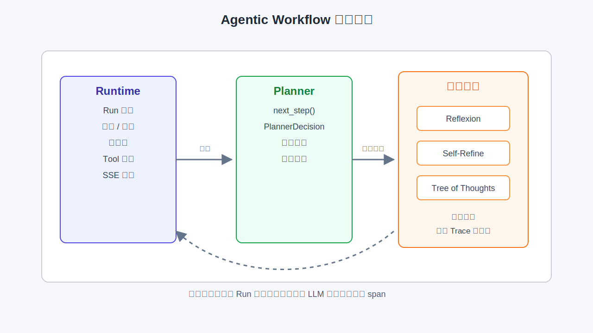

# 第26章 Agentic Workflow

---

Agentic Workflow 的增强机制要有明确工程约束。Reflexion、Self-Refine、ToT 等方法可以提高复杂任务质量，也会放大 token 成本与延迟。企业更适合把它们做成按场景启用、可关闭、可计量的局部能力，而不是默认打开。它们叠加在第25章 Planner 之上，价值要通过任务质量、成本和延迟一起验证。

第25章把 Planner 定位为 Runtime 的决策接口：在 `planning` 态调用 `next_step()`，产出 FINISH 或 Tool Call 提议，但不执行工具。ReAct 与 Plan-and-Execute 回答的是“一步接一步怎么编排”。第25章没有回答另一个问题：

当模型选错时间窗口、工具参数报错、或终稿文案过不了品牌审核时，平台是否允许 Planner 在同一 Run 内额外反思、润色报告或分支搜索？这些能力写死在各 Agent 应用里，还是由平台统一开关、计量与审计？

本章所说的 Agentic Workflow，是在第25章编排模式之上，把 Reflexion、Self-Refine、ToT 等能力拆成可关闭、可计量的局部增强，避免让 Agent 进入无边界的自主循环。它们叠加在第25章模式之上，不替代 Runtime 状态机。

一家多业务线企业的 DataAgent 在第25章已默认 `planner.mode=react`：用户问华东 SKU 下滑时，Planner 交替推理与调 SQL。上线后运营反馈两类问题：一是模型偶发选错时间窗口，希望失败后自动反思再试；二是对外报告文案需要多轮润色才能过品牌审核。平台若把这类能力写死在 Agent 应用里，每个团队会各自实现“反思循环”，成本与审计口径无法统一。更可控的做法是提供平台级增强开关：默认关闭，按 Agent 配置按需启用，且所有额外 LLM 轮次仍计入 Step，受 `max_steps` 与 Gateway 配额约束。

下文先说明它与第25章 Planner 的关系，再分别讨论 Reflexion、Self-Refine、Tree of Thoughts、AutoGPT 类范式，以及 `core/planner/` 中应如何收敛这些增强机制。

Agentic Workflow 的吸引力在于让模型自我检查、改写、分支搜索，似乎能把复杂任务做得更好。企业生产环境需要更冷静地看待这些机制。每增加一轮反思或搜索，就增加延迟、成本和不可预测性；若没有开关、预算和审计，这些增强能力会把一次简单任务变成难以解释的长链路。

Reflexion、Self-Refine 和 Tree of Thoughts 适合的任务并不相同。报告草稿可以反复润色，SQL 生成失败后可以有限重试，合规审批则不能让模型在没有新证据的情况下自我说服。平台要先判断任务是否允许多轮自修，再决定是否启用增强策略。

一个常见误区是把这些方法写死在业务 Agent 里。客服 Agent、DataAgent、合同 Agent 各自实现一套反思和重试，最后成本不可控、日志不可比、失败也无法复盘。更稳的方式是把增强策略放在 Planner 之上，由 Runtime 记录每次额外推理和工具调用，让平台能按场景启停。

## 26.1 Agentic Workflow 在 Planner 之上的增强边界

Agentic Workflow 在本书中指：在 Planner 决策环内或环外，为提升任务质量而引入的额外推理结构，例如反思轨迹、输出自我修订、思维树搜索。它们与第25章的编排模式正交：编排模式决定“先规划再执行还是边想边做”；Workflow 增强决定“单步决策是否允许内部多轮 LLM 或并行候选”。



*图26-1：Agentic Workflow 增强边界。来源：本书自绘。Alt text：图中展示 Runtime、Planner 和增强机制三层边界；Reflexion、Self-Refine 和 Tree of Thoughts 位于 Planner 内部，默认关闭，并把额外 LLM 调用计入 Trace 与预算。*

### 26.1.1 Planner 与 Workflow 增强的分工

表 26-1 从核心问题、配置项、与 Runtime 关系等维度对比第25章与本章。编排模式决定步骤结构，Workflow 增强决定单步决策是否允许额外 LLM 轮次。

*表26-1：Planner 编排模式与 Agentic Workflow 增强机制的分工。来源：本书整理。*

| 维度 | 第25章 编排模式 | 第26章 Agentic Workflow |
| --- | --- | --- |
| 核心问题 | 下一步做什么工具调用 | 当前步/当前答案是否值得再推理 |
| 典型配置 | `planner.mode`: `react` / `plan_and_execute` | `enhancement.reflexion` 等布尔开关 |
| 与 Runtime 关系 | 每 Step 一次 `next_step()` | 可能在一次 `planning` 内多次调 Gateway，或 Step 间插入 refine 阶段 |
| 默认策略 | 生产 Agent 必须显式选 mode | 全部增强默认关闭 |
| 审计单位 | Step + Tool Call | 额外 LLM 调用须写入 Trace span（第38章） |

Agentic Workflow 增强叠加在第25章 Planner 与第22章 Runtime 之上，不改变 Run 六态（图 22-1）：Reflexion、Self-Refine、ToT 封装在 Planner 内部，Runtime 只看见本轮 `next_step` 耗时变长、`llm_call_count` 可能增加。

这个边界看起来细，但决定了系统能否运营。增强机制一旦绕过 Runtime 状态机，SSE 上就看不到中间状态，检查点也不知道 Planner 内部已经跑了几轮；用户取消任务时，后台可能还在继续反思或搜索分支；成本统计也只看到一个 Step，却看不到背后多次 Gateway 调用。把增强机制限制在 Planner 内部，并把额外调用写成 Trace span，是为了保留统一的取消、预算、回放和计费口径。

### 26.1.2 计量口径（三个计数器）

平台建议区分三个计数器，避免「Reflection 是否推进 Step」产生歧义。`step_index` 只记录 Runtime 完成一轮 `planning` → `executing` 闭环的次数，受第22章 `max_steps` 硬约束；`llm_call_count` 记录 Reflection、Refine、ToT 评估等额外 Gateway 调用，每次都要有独立 Trace span；`tool_call_count` 只统计 Registry `invoke` 的成功路径，Reflection 里的 LLM 调用不能算作 Tool Call。

Reflection 默认计入 `llm_call_count`；是否同时推进 `step_index` 由平台策略配置，建议与第22章 `max_steps` 合并预算。这样做的好处是排障时能看清成本来自哪里：是 Planner 多跑了几轮 LLM，还是工具真的被重复调用。没有这三个计数器，增强机制上线后很容易出现“步骤数没变但成本翻倍”的现象。

### 26.1.3 Workflow 增强机制的适用条件

企业落地时常见风险集中在三类机制冲突上：

#### 把 Agentic Workflow 当成更高级的 Planner mode
`react` 与 `plan_and_execute` 是互斥或可组合的编排策略；Reflexion 可与 ReAct 同时开启。失败反思后再进入下一轮 ReAct，不应替换成第四种 mode。

#### 开启 Reflexion 后放任无限重试
生产必须绑定 `max_reflection_rounds`、`max_steps`（第22章）与 Gateway 预算；否则一次 SQL 语法错误可能触发数十次反思，拖垮共享 Gateway。

#### 在每次 Tool Call 前跑满 ToT 深度搜索
Tree of Thoughts 的 branching factor 与 depth 乘积是指数成本；企业场景宜限定为高风险写操作前或离线报告生成，不适合作为默认问数路径。

---

## 26.2 Reflexion

Reflexion（反思）让 Agent 在任务失败或收到工具错误后，回顾自身轨迹（Thought / Action / Observation），生成自然语言反思摘要，再注入后续 Planner 上下文以改进下一步 (Shinn et al. 2023)。与简单“把 error 字符串反馈给 Planner”不同，Reflexion 要求模型总结“哪里错了、下次应避免什么”，实证上在 AlfWorld、HotPotQA 等任务上提升成功率 (Shinn et al. 2023)。

### 26.2.1 行业场景

DataAgent 调用 `sql_executor` 返回 `TOOL_ARGUMENT_INVALID`：模型把「上周」写成了不存在的 `last_week()` 函数。Runtime 将 `result` 事件写入 Run 历史；若仅把原始错误 JSON 反馈给 Planner，模型可能再次幻觉同名函数。开启 Reflexion 后，Planner 在 同一 Step 或下一 Step 的 planning 入口 先调一次 Reflection LLM（不计 Tool Call），产出：

> 「应用库内日期应用 `date_trunc('week', current_date - interval '7 days')`，勿发明 UDF。」

该摘要进入 Working Memory（第27章）。生产实现建议写入时设置 `metadata["source"]="reflection"`，便于与 Tool `result` 区分。本章示例还没有接入 RunLoop 增强环，Working Memory 只随 Tool Call 追加。随后 Planner 再调用常规模型产出 `next_step`。

Reflexion 在 `next_step` 内部插入，不改变 Run 六态（与 图 22-2 同一 Run 循环）：

1. RunLoop 调用 `next_step(run_ctx)`。
2. 若上一轮 Tool failed 且 `reflexion` 开启 → Gateway `reflect(trajectory, error)` → 摘要 append 到 Working Memory。
3. Gateway `plan(messages + tools)` → `tool_call` 或 `finish`。
4. 返回 `PlannerDecision` → RunLoop 在 `executing` 态 `invoke` Registry。

Reflexion 不替代 Tool 重试：Runtime 仍按第22章分类 `TOOL_ARGUMENT_INVALID` 是否反馈 Planner；Reflexion 只改善反馈 Planner 内容的质量。

Reflexion 最适合处理“模型可以自己修正”的错误，例如参数格式、时间表达、工具选择或查询条件遗漏；它不适合处理权限不足、下游系统故障和业务规则冲突。权限拒绝时继续反思，只会让模型尝试绕过限制；数据库不可用时继续反思，也不能让服务恢复。平台应把触发条件写得很窄：只有当错误类型说明“换一种参数或计划可能成功”时，才允许 Reflexion 介入。

Reflexion 与普通重试的分界在错误假设上。重试假设外部环境可能恢复，反思假设上一轮计划本身有问题。把两者混在一起，会让系统在服务不可用时反复“反思”，或者在参数明显错误时只做机械重试。生产实现应先看错误类型，再决定动作：语法、字段、时间窗口一类错误可以进入 Reflexion；超时、限流、权限和策略拒绝应走 Runtime 的重试、降级、结束或人工确认。

### 26.2.2 生产参数

Reflexion 相关配置应从保守默认值起步，按需逐 Agent 开启。`enhancement.reflexion` 默认关闭，只允许在通过评测和审批的 Agent 上打开；`max_reflection_rounds` 可以先设为 2，限制单次 Run 内的反思 LLM 调用上限；`reflect_on` 应只覆盖 `tool_error`、`empty_result` 这类可修正错误，慎用 `always`；`include_tool_output` 需要结合 PII 策略决定，默认允许用于只读、已脱敏工具结果，高风险工具输出应只传摘要。

这些参数的目的不是让 Agent “更聪明”，而是限制增强循环的作用范围。生产环境最怕没有上限的自我修正：一次 SQL 字段错误可以反思，两次仍失败就应停止或转人工；一次空结果可以调整时间范围，权限拒绝不能通过反思继续试探。

### 26.2.3 Reflexion 的适用条件

Reflexion 不能等同于人工 Reviewer Agent。它仍是同一 Agent 的自我批评，没有独立审批链；涉及合规否决时，应进入第30章的 `waiting_human` 状态，不能靠 Reflexion 绕过。

---

## 26.3 Self-Refine

Self-Refine 让模型迭代改进自己的输出：生成初稿 → 同一模型（或更强模型）提出批评 → 修订 → 直至满足停止条件 (Madaan et al. 2023)。典型用于 无工具或工具已结束后的答案润色，如报告摘要、邮件草稿、JSON 结构修正。

### 26.3.1 与 Reflexion 的差异

下表对比 Reflexion 与 Self-Refine 的输入、目标与典型时机；二者可叠加，但触发条件与风险不同：

*表26-2：Reflexion 与 Self-Refine 的差异对比。来源：本书整理。*

| 对比维度 | Reflexion | Self-Refine |
| --- | --- | --- |
| 输入 | 失败轨迹 + 环境反馈 | 模型自身上一版输出 |
| 目标 | 改进行动 / 工具参数 | 改进文本或结构化答案 |
| 典型时机 | Tool `failed` 或结果为空 | `finish=true` 之前或之后 |
| 风险 | 重复错误工具调用 | 过度润色导致事实漂移 |

行业场景中，SQL 结果正确但运营要求「结论须含同比、环比各一句」。Planner 已 `finish` 且 answer 仅含环比；开启 `enhancement.self_refine` 时，Planner 在提交最终 `PlannerDecision(finish=True)` 前运行 Refine 子循环（最多 `max_refine_iterations` 次），每轮将当前 answer 与品牌 checklist 一并送 Gateway，直至 critic 标记 `pass` 或达上限。Self-Refine 只能改表达，不能改写 tool output 中的事实数字（如销售额、同比环比）。

Self-Refine 在 Planner 内部形成 draft → critic → revise 闭环，通过后才向 Runtime 提交 FINISH（critic 须 `pass` 或达 `max_refine_iterations`）。

事实锚定是 Self-Refine 的底线：critic prompt 应要求输出不得 contradict tool outputs，否则模型可能为了流畅度改写数字。平台宜在 refine 阶段注入只读的 Tool Call 摘要（第27章 Working Memory），而非允许模型重新发起 SQL。

Self-Refine 的产品价值通常体现在报告、邮件和结构化摘要，不是重新求解问题。它可以让答案更清楚，也可以让 JSON 输出更符合 schema，但它不能改变证据。若 refine 阶段为了表达顺畅把“环比下降 12%”改成“明显下降约一成”，在经营分析或合规报告里就已经丢失了可复核性。生产系统应把可改写区域和不可改写事实分开，必要时让 critic 只返回问题清单，再由确定性模板组合最终文本。

一个可操作的边界是把输出拆成“事实槽位”和“表达槽位”。事实槽位来自 Tool Result 或 EvidenceRef，只能复制、排序或引用；表达槽位可以调整语气、段落顺序和提示语。Self-Refine 只处理表达槽位，不能重新计算事实槽位。自动润色可以存在，但不能让模型在最后一步改掉前面已经审计过的数字。

### 26.3.2 配置要点

- `enhancement.self_refine`：默认 `false`。
- `max_refine_iterations`：建议 `1-3`；报告类 Agent 可至 `5`，须配 Eval（第39章）。
- `refine_target`：`answer` | `plan`（Plan-and-Execute 下可 refine 计划文本，再执行）。
- 与 Structured Outputs（第8章）结合：critic 输出 JSON `{ "pass": bool, "issues": [...] }`，便于自动化测试。

---

## 26.4 Tree of Thoughts

Tree of Thoughts（ToT） 将推理展开为 搜索树：每个节点是一种「部分解或中间思路」，由模型生成多个候选，再用启发式或 LLM 评估值选择扩展分支，直至找到可执行方案或最终答案 (Yao et al. 2023)。第8章 在 提示层 介绍 ToT 与 Self-Consistency 作为 单次补全的结构；本章在 Agent 层 讨论：ToT 何时作为 Planner 内部搜索，而非普通 CoT。

### 26.4.1 与第8章的分工

ToT 可在提示层、Planner 层、Runtime 层分别出现，下表说明各层职责边界：

*表26-3：自我校验在本章与第8章结构化输出层的分工。来源：本书整理。*

| 层级 | 职责 | 本章 / 第8章 |
| --- | --- | --- |
| 提示层 | 单次请求内 `n` 个 sample、投票 | 第8章 Self-Consistency |
| Planner 层 | 多 Step 间保留分支、回溯、剪枝 | 本章 ToT |
| Runtime 层 | 只执行 已选分支 上的 Tool Call | 第22章 不变 |

自动改价高风险场景：自动改价 Agent 在写入 `price_update` 工具前，Planner 用 ToT 生成三种定价策略分支，用 评估模型 打分（合规、毛利、竞品），仅将最高分分支的第一条 Tool Call 交给 Runtime。未选中分支 不得 产生副作用，这是与 AutoGPT「边想边做」的关键差别。

!!! warning "未选中分支不得执行工具"
    ToT 搜索在 Planner 内完成；只有 最终选中分支 可产出一条 `PlannerDecision`（含 Tool Call）。未选中分支不得调用 Registry `invoke`。

### 26.4.2 ToT 参数与成本

ToT 的 branching factor 与 depth 乘积决定 token 成本；下表给出生产建议默认值：

*表26-4：Tree of Thoughts 各参数的含义与成本相关的生产建议。来源：本书整理。*

| 参数 | 含义 | 生产建议 |
| --- | --- | --- |
| `enhancement.tree_of_thoughts` | 总开关 | 默认 `false` |
| `tot_branching` | 每节点候选数 | `3` 以内 |
| `tot_depth` | 最大深度 | `2-3` |
| `tot_evaluator` | `llm` / `rule` | 写操作前用 `rule`+Policy 双检 |
| `tot_budget_tokens` | 单 Run ToT  token 上限 | 与 Gateway 配额联动 |

ToT 搜索完成后，仅 选中分支 产生 Tool Call；未选中分支在 Planner 内存中剪枝（`tot_branching` × `tot_depth` 须受 Gateway 配额约束，第38章）。

ToT 的 并行候选 会放大 Gateway QPS；平台应对 `enhancement.tree_of_thoughts` 做 租户级配额 与告警（第38章）。

ToT 还要避免把搜索过程包装成确定结论。多个候选分支只是模型探索，尚未经过业务验证；未选中分支不应出现在最终答案里，也不应写入长期 Memory。对于价格、权限、合同和合规类任务，分支评估最好结合规则和 Policy，不能只让另一个 LLM 打分。这样 ToT 才能成为受控决策辅助，避免把高风险判断交给模型自评。

因此，ToT 的默认位置应是离线分析、报告草案或高风险动作前的有限评估，不应成为每次普通对话的固定前置步骤。普通问数场景更需要稳定、低延迟和可解释的工具链；只有当候选方案之间存在真实取舍，且评估收益足以覆盖额外成本时，ToT 才值得打开。

---

## 26.5 AutoGPT 类范式的生产化边界

AutoGPT 及同类开源项目（BabyAGI、AgentGPT 等）推广了目标分解、自主循环、长期记忆和工具链的任务叙事：给 Agent 一个高层目标，它自行拆任务、搜网页、写文件、再设新目标。原型演示效果直观，但企业 DataAgent 平台若照搬，常遇到以下结构性问题 (Significant Gravitas 2023; Wang et al. 2024)：

### 26.5.1 AutoGPT 类范式的生产风险

1. 目标漂移（goal drift）
   无外部验收时，Agent 为「完成子目标」不断扩展 scope（再查竞品、再写博客），与用户原始问数无关。生产须 Run 级 input 与 max_steps 硬边界（第22章），不能使用无限 `while True`。

2. 副作用不可控
   AutoGPT 类循环常默认每轮都可调工具。企业要求 Policy 前置（第50章）、写操作 HITL（第30章）、Tool Registry 版本 pin（第23章）。完全自主与这三者冲突。

3. 成本与延迟不可预测
   自主循环缺少 Step 预算与 token 预算，一次「研究型」任务可消耗百万 token。平台应把 Reflexion、Self-Refine、ToT 全部计量，并纳入 FinOps（第46章）。

4. 记忆污染
   长期把未验证中间结论写入 Memory（第27章），会在后续 Run 中被检索放大错误。AutoGPT 式「什么都记」违背企业可删除、可审计的要求。

5. 评估与回放缺失
   自主 Agent 难以回答「为何上周给了错误口径」。Run、Step、Tool Call 与 Trace（第22章、第38章）是合规底线，不是可选项。

### 26.5.2 增强循环的运行约束

将 AutoGPT 类范式降维为 Planner 增强时，下表列出平台必须满足的运行约束：

*表26-5：增强机制进入生产前应满足的运行约束。来源：本书整理。*

| 约束 | 说明 |
| --- | --- |
| 有界 Run | `max_steps`、Run 超时、取消 API |
| 增强默认关 | `PlannerEnhancementFlags` 全 `false` |
| 显式启用 | Agent YAML 逐开关 + 审批记录 |
| 副作用网关 | Registry + Policy；ToT 仅选中分支执行 |
| 记忆治理 | 长期记忆带来源与时间戳；支持删除（第27章） |
| 可观测 | 每次 reflect / refine / tot_eval 独立 span |
| 人机协同 | 高风险仍 `waiting_human`，非自主到底 |

AutoGPT 类范式适合个人实验与原型；企业级平台更适合把它拆成可配置、可关闭、可计量的 Planner 增强，例如 Reflexion、Self-Refine、ToT 等局部能力，而不是采用默认自主循环。Runtime 仍然负责六态和审计模型。

企业可以使用自主循环，但不能把自主循环设为默认执行模型。可上线的做法通常是把“自主”拆成几个受控片段：计划可以多想一次，失败可以反思一次，报告可以精修一次，高风险写操作可以做有限分支评估。每个片段都有触发条件、预算、停止条件和审计记录。这样系统仍然能获得复杂任务上的质量收益，但不会把一次普通问数变成不可预测的长任务。

这套处理方式也便于组织管理。平台团队可以为每类增强机制设默认预算，业务团队只申请自己需要的开关，评测团队用相同样本比较“不开增强”和“开启增强”的差异。若质量提升不明显，就关闭；若成本上涨但投诉下降明显，再进入更大范围灰度。增强机制不再是某个 Agent 作者的 prompt 技巧，而是可评估、可回滚的平台能力。

---

## 26.6 Planner 增强模式的运行边界

`mini-platform/core/planner/config.py` 已定义 `PlannerEnhancementFlags`，但只包含三个布尔开关；`reflect()`、`refine_answer()`、`tot_search()` 等子循环尚未接入 RunLoop。本节区分示例实现与生产接口草案。

### 26.6.1 Planner 增强的实现入口

```
mini-platform/core/planner/
├── __init__.py              # create_planner、PlannerEnhancementFlags、PlannerConfig
├── config.py                # PlannerEnhancementFlags（三布尔开关）
├── react_planner.py         # 第25章 ReAct 规则示例
├── plan_execute.py          # 第25章 Plan-and-Execute 规则示例
└── planner.py               # create_planner 工厂

# 目标接口：
# enhancements.py            # reflexion / self_refine / tot 子模块
```

增强能力默认关闭；`RunLoop` 不感知 Reflexion 内部细节，只读取 `PlannerDecision` 与变长的 planning 耗时。

当前示例已实现的开关位于 `core/planner/config.py`：

```python
@dataclass
class PlannerEnhancementFlags:
    """Agentic Workflow 增强开关；生产默认全 False。"""

    reflexion: bool = False
    self_refine: bool = False
    tree_of_thoughts: bool = False
```

生产实现时，宜将 `max_reflection_rounds`、`max_refine_iterations`、`tot_branching`、`tot_depth`、`tot_budget_tokens` 等上限加入 `PlannerConfig`，并在 `next_step` 内显式计入 `llm_call_count`、token budget 与 Trace span。

### 26.6.2 增强机制的发布门禁

Agentic Workflow 的上线门禁不能只看“回答变好了吗”。增强机制会改变 Run 的成本、延迟、可解释性和取消语义，因此发布时要同时看质量收益和运行代价。一个可执行的发布门禁至少包含四类证据：离线评测是否显示目标任务质量提升，线上灰度是否控制住 p95 延迟和 token 成本，Trace 是否能完整展开每次 reflect、refine、tot_eval，失败时是否能稳定退出而不是继续自我循环。

发布顺序也应分层。第一步在离线样本上打开增强机制，比较不开启和开启后的差异；第二步在影子模式记录额外 LLM 调用，不改变用户可见结果；第三步只对低风险 Agent 和少量租户灰度；第四步才允许业务线按配置启用。任何阶段只要出现成本失控、取消失败、事实漂移或审批绕过，就应回滚到基础 Planner。

增强机制还需要清楚的退出条件。Reflexion 连续两次不能修复同一类工具参数错误，就应停止并返回可解释失败；Self-Refine 多轮仍不能通过 critic，就应提交带问题标记的草稿或转人工；ToT 分支评分差异很小，说明模型没有稳定偏好，应降级为保守方案，而不是强行选一个分支。退出条件比增强策略本身更重要，因为它决定系统是否会在不确定时停下来。

### 26.6.3 失败恢复与人工接管

增强机制失败后的恢复路径必须回到 Runtime，而不是停留在 Planner 内部。用户取消 Run 时，Planner 内部正在进行的 reflection、refine 或 ToT 评估都应收到取消信号，停止后续 Gateway 调用，并把当前 Run 标记为 cancelled 或 failed。若取消只中断外层 Runtime，内部增强循环继续运行，前端会看到任务已经结束，后台却仍在消耗 token，Trace 也会出现无法解释的尾部调用。

对于 DataAgent 这类分析任务，失败恢复可以按风险分层处理。只读查询失败，允许 Reflexion 调整字段名、时间窗口或过滤条件；报告表达不达标，允许 Self-Refine 修改段落结构；高风险写操作前 ToT 评估失败，则不能自动换路径执行，应进入人工确认。这样增强机制只扩大“可修正问题”的处理空间，不扩大 Agent 的执行权限。

人工接管时，平台应把增强过程压缩成可读证据，而不是把所有模型思考原文暴露给用户。Reviewer 需要看到的是：系统尝试了几轮，错误类型是什么，哪些工具被调用，哪些分支被放弃，最终为什么停下。过度暴露中间推理既增加阅读负担，也可能泄露策略提示词；完全不暴露又无法复核。更稳的做法是记录完整 Trace，前端展示结构化摘要，审计人员在必要时再查看详细 span。

### 26.6.4 增强开关配置示例

运行环境：本章代码基线尚未实现独立增强子循环。下面的命令用于验证「增强关闭时 Run 边界稳定」：

```bash
cd mini-platform
pytest tests/test_multi_agent_workflow_run.py tests/test_runtime.py -q
python3 projects/multi-agent-workflow/run.py start   # 观察未开启 reflexion 的完整 Run
```

`PlannerEnhancementFlags` 定义见 `core/planner/config.py`。

Agent 配置示例（管控面 YAML，目标形态）：

```yaml
planner:
  mode: react
  enhancement:
    reflexion: true
    self_refine: false
    tree_of_thoughts: false
    max_reflection_rounds: 2
```

下面的片段展示目标接线关系。当前 `RunLoop` 构造时还需要注入 `registry`（第23章），且 Reflexion 子循环尚未接入，因此它只用于说明配置与调用关系：

```python
from core.planner import PlannerConfig, PlannerEnhancementFlags, create_planner
from core.runtime import RunLoop

config = PlannerConfig(
    enhancements=PlannerEnhancementFlags(reflexion=True),
)
# 实际使用时需要：registry = build_workflow_registry() 或等价 ToolRegistry
loop = RunLoop(planner=create_planner(config))  # 缺 registry → TypeError
loop.run(agent_id="data-agent", user_input="...", context={"tenant_id": "retail-demo"})
```

### 26.6.5 增强机制的开关边界与后续演进

*表26-6：增强机制各项能力在本章示例中的覆盖情况。来源：本书整理。*

| 能力 | 说明 | 示例覆盖 |
| --- | --- | --- |
| `PlannerEnhancementFlags` 三布尔开关 | 配置入口已定义 | ✓ |
| Reflexion / Self-Refine / ToT 子循环 | `enhancements.py` | ☐ |
| 与 `max_steps` / `llm_call_count` 联动 | 计量与截断 | ☐ |
| Trace 细分 span | `planner.reflect` / `planner.refine` / `planner.tot` | ☐ |
| Gateway 预算 | 租户级 token / 调用上限 | ☐ |
| ToT 仅选中分支执行 | 未选中分支无 Tool Call | ☐ |
| 检查点含 enhancement 状态 | 与第27章 联调 | ☐ |

### 26.6.6 增强循环失效时先收敛哪条链路

#### Reflexion 与 Tool 重试双计数爆炸
现象：`TOOL_ARGUMENT_INVALID` 先触发 Registry 反馈 Planner，再触发 Reflexion，随后又触发模型重试，单 Step 内出现 6 次 Gateway 调用。修复：Reflexion 受 `max_reflection_rounds` 约束；与第22章 反馈 Planner 上限合并配置。

这类问题通常不是单个参数写错，而在于两个恢复机制互相不知道对方存在。Runtime 把工具错误反馈给 Planner，Reflexion 修正计划，Gateway 看到的却是连续多次模型调用。实现时应把恢复动作放到同一个预算对象下：一次工具失败最多触发一次反思，反思后仍失败则按 Runtime 策略结束、降级或转人工。

#### Self-Refine 改写 SQL 结论
现象：润色后 answer 中数字与 `sql_executor` 结果不一致。修复：critic 约束「数字必须引用 tool output」；Eval 抽检（第39章）。

修复时不要只在 prompt 里加一句“不要改数字”。更可靠的做法是把数字、指标版本和 EvidenceRef 锁成结构化字段，让 refine 阶段只处理解释文字。最终渲染时由模板把事实字段和表达字段合成答案。这样即使模型想把数字写得更顺，也没有机会覆盖证据字段。

#### ToT 并行分支均执行工具
现象：三个分支都调了 `price_update`，造成三重写。修复：Runtime 只执行 Planner 最终提交的一条 Tool Call；ToT 搜索在 Planner 内完成，分支仅为内存对象。

ToT 的分支应被当成候选计划，不是候选执行。所有候选分支都可以被模型或规则评分，但只有被选中的分支能生成 `PlannerDecision`。如果团队希望比较多个真实执行结果，就不应使用 ToT，而应设计显式的实验、沙箱或审批流程。

#### 把 AutoGPT 式自主循环接进 RunLoop
现象：Planner 内部 `while not done` 无 Step 边界，SSE 长时间无 `state` 更新。修复：任何增强子循环须 yield Step 边界 或限制为 planning 态内可观测子 span，禁止绕过 `max_steps`。

用户体验也会受影响。前端如果长时间只显示“思考中”，用户无法判断系统是在检索、执行工具、等待审批，还是陷入循环。增强子循环至少要写 Trace span，并在必要时通过事件流暴露阶段状态；否则一次看似聪明的自主规划，会变成无法取消、无法解释、无法计费的黑箱任务。

---

增强策略上线前，必须用任务级指标证明价值。准确率提高了多少，延迟增加多少，成本增加多少，失败率是否下降，人工复核是否减少，都要放在一起看。只看少量成功案例，很容易高估自我修正的收益。

这些方法还要有停止条件。连续两次修订没有改善、工具返回同类错误、证据没有变化、预算接近上限时，Planner 应停止自我循环，转向澄清、人工复核或失败返回。没有停止条件，Agentic Workflow 会把不确定性包装成“仍在努力”。

生产系统需要的是可控增强，而不是默认复杂化。把增强能力做成可配置、可计量、可审计的策略后，团队才能在高价值任务中使用它，在低价值任务中关闭它。

Reflexion 类机制要区分错误来源。工具返回权限不足时，反思再多也不能绕过权限；数据质量未通过时，模型自我修正只会编造解释；报告措辞不清时，自我修订才可能有效。平台应把增强策略绑定到错误类型，而不是所有失败都自动进入反思。

Self-Refine 适合产物类任务，但也要保存修订轨迹。报告从草稿到终稿改了哪些结论，是否删除了证据，是否加入了未经验证的建议，都需要可比对。否则用户只看到最终稿，无法判断模型是在改善表达，还是改变了事实。

Tree of Thoughts 会放大成本和延迟，适合少数高价值推理任务。企业使用时可以限制分支数量、深度和评估器，并把每个分支的选择理由写入 Trace。若分支搜索不可见，失败后很难知道模型为什么选择某条路径。

增强策略还会影响用户体验。系统长时间显示“思考中”，用户不知道它是在检索、重试、修订还是卡住。前端应把关键状态展示出来，让用户可以取消、降级或转人工。复杂工作流不能只存在后台。

这些方法的组织落点是策略库。平台团队维护可复用策略，业务团队选择哪些任务启用，评测团队验证收益，财务团队观察成本。这样 Agentic Workflow 才会成为受控能力，而不是各应用随意添加的推理循环。

增强策略要和业务价值绑定。低价值分类任务多跑三轮反思，节省不了人工，成本却明显增加；高价值投研报告多做一次证据核对，可能减少严重误判。平台可以按任务价值、风险等级和用户身份决定增强深度，让复杂推理用在值得用的地方。

自我评价器也需要评测。很多工作流让模型判断自己的答案是否足够好，但模型自评可能偏乐观，也可能过度保守。企业可以用人工标注样本检查自评器：哪些错误它能发现，哪些错误它会放过，哪些正确答案会被误判。未经评测的自评器，不能作为发布门禁。

分支搜索要有证据合并策略。多个分支各自引用不同资料、生成不同 SQL 或给出不同归因时，最终答案不能只挑语言最顺的一支。平台要根据证据、执行结果、权限和评估分数选择，必要时把分歧展示给用户或人工。否则 ToT 会把复杂性藏在最终生成里。

增强工作流还会影响 SLO。用户对交互式问答的等待容忍度有限，对批量报告可以接受更长时间。平台应把增强策略和任务类型绑定，前端也要展示预计耗时。用户知道系统正在做证据核对或报告修订，比盯着未知加载状态更容易接受。

从运维角度看，增强策略需要独立开关。某个策略导致成本暴涨或错误率上升时，平台应能按租户、任务或 Agent 关闭它，而不是回滚整个应用。策略开关、版本和命中记录进入 Trace 后，事故复盘才能定位到具体增强机制。

最终，Agentic Workflow 的成熟标志不是流程越来越复杂，而是每一层复杂度都有收益证据。没有收益证据的反思、搜索和修订，应默认关闭。

增强策略要避免互相叠加失控。一个任务同时启用反思、重写、投票和分支搜索，可能质量只提升一点，成本却成倍增加。平台应定义策略组合，禁止业务应用随意叠加。每个组合都要有适用场景、预算和评测报告。

自我修订还要保护证据引用。模型改写报告时，可能把原本有证据的表述改成更流畅但无证据的判断。修订器应保留引用和数据来源，或者在改写后重新校验证据。表达改善不能牺牲可追溯性。

增强流程中的中间结果要选择性保存。全部保存会增加存储和隐私压力，完全不保存又无法复盘。平台可以保存策略版本、关键分支摘要、最终选择理由和失败信息，把大文本放入受控 artifact。这样既能审计，又不会让日志膨胀。

业务团队需要知道增强策略带来的体验变化。某个报告任务启用深度修订后耗时从 20 秒变成 2 分钟，如果前端没有异步和通知设计，用户会认为系统变慢。策略启用前，应同步产品交互和 SLO。

增强策略还要区分同步和异步体验。短交互中，最多允许一次快速自检；长报告、批量评测和复杂分析可以进入后台队列，使用更深的修订和搜索。把所有增强都放在同步请求里，会让用户等待不可控，也容易触发网关超时。Runtime 应根据任务类型把增强流程安排到合适执行模式。

模型自我修正还需要外部信号。没有新证据、没有工具结果、没有评测器反馈时，让模型反复重写，收益通常很低。平台应优先让模型基于新的观察修正，而不是基于同一上下文不断生成不同说法。这个原则能减少无效 token，也能让修订更可解释。

复杂工作流的配置应进入版本管理。启用哪些策略、最大循环次数、评估器模型、停止条件和预算，都要有版本。某次报告质量变化时，团队要能知道是模型升级导致，还是增强策略配置变化导致。没有版本记录，Agentic Workflow 会成为难以排查的黑盒。

策略收益需要按任务保留历史曲线。某个自我修订策略刚上线时提升明显，随着 Prompt、模型和数据变化，收益可能下降，成本却继续存在。平台应定期比较启用和未启用策略的样本表现，确认它仍然值得保留。策略长期无人复盘，就会变成隐藏的成本来源。

增强策略的评审材料应保留典型成功和失败样本。成功样本说明它在哪些任务上值得启用，失败样本说明它在哪些场景会浪费成本或改变结论。业务团队看到样本后，更容易理解为什么某些任务开启深度修订，另一些任务保持简单执行。

这类复盘能帮助团队及时关闭低收益策略。

保留这些曲线后，团队可以按证据决定保留、收紧或关闭策略。

策略复盘还要和业务反馈一起看，确认用户是否真正减少返工。

## 本章小结

第25章讨论步骤结构，第26章讨论是否启用反思、精炼和分支搜索，两者是正交关系。Reflexion 改善失败后的反馈质量，Self-Refine 改善终稿质量，ToT 在受控搜索下选择策略；这些增强都应默认关闭，由任务类型、风险等级和评测结果决定是否启用。

AutoGPT 类完全自主运行会冲击 Run 边界、Policy、HITL 和审计。企业平台更适合把这类能力拆成可计量增强，用 `PlannerEnhancementFlags` 统一开关。Runtime 六态不变，检查点中记录 enhancement 与 Memory 状态，所有增强 LLM 调用都要独立可观测，并受 Gateway 与 `max_steps` 双重约束。


## 参考文献

Shinn, N., Cassano, F., Gopinath, R., Narasimhan, K., & Yao, S. (2023). Reflexion: Language agents with verbal reinforcement learning. *NeurIPS*. arXiv:2303.11366. [https://arxiv.org/abs/2303.11366](https://arxiv.org/abs/2303.11366)

Madaan, A., Tandon, N., Gupta, P., et al. (2023). Self-Refine: Iterative refinement with self-feedback. *NeurIPS*. arXiv:2303.17651. [https://arxiv.org/abs/2303.17651](https://arxiv.org/abs/2303.17651)

Yao, S., Yu, D., Zhao, J., et al. (2023). Tree of Thoughts: Deliberate problem solving with large language models. *NeurIPS*. arXiv:2305.10601. [https://arxiv.org/abs/2305.10601](https://arxiv.org/abs/2305.10601)

Significant Gravitas. (2023). *AutoGPT*. GitHub. [https://github.com/Significant-Gravitas/AutoGPT](https://github.com/Significant-Gravitas/AutoGPT)

Wang, L., Ma, C., Feng, X., et al. (2024). A survey on large language model based autonomous agents. *Frontiers of Computer Science*, 18(6), 186345. [https://doi.org/10.1007/s11704-024-40231-1](https://doi.org/10.1007/s11704-024-40231-1)

Yao, S., Zhao, J., Yu, D., et al. (2023). ReAct: Synergizing reasoning and acting in language models. *ICLR*. arXiv:2210.03629. [https://arxiv.org/abs/2210.03629](https://arxiv.org/abs/2210.03629)

Li, X. (2025). A review of prominent paradigms for LLM-based agents: Tool use, planning (including RAG), and feedback learning. In *Proceedings of COLING 2025*. arXiv:2406.05804. [https://arxiv.org/abs/2406.05804](https://arxiv.org/abs/2406.05804)

Masterman, T., Besen, S., Sawtell, M., & Chao, A. (2024). The landscape of emerging AI agent architectures for reasoning, planning, and tool calling: A survey. arXiv:2404.11584. [https://arxiv.org/abs/2404.11584](https://arxiv.org/abs/2404.11584)
