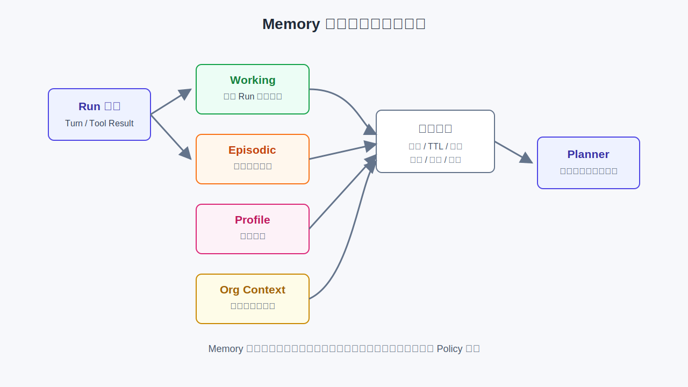

# 第27章 Memory 系统

---

Agent Memory 不能简单理解为“把历史对话塞回 Prompt”，也不能把企业知识库换一个名字后归到 Memory 名下。它要解决的是：一次 Run 如何恢复上下文，用户长期偏好如何安全复用，企业组织口径如何稳定注入，以及哪些信息应该进入 RAG、哪些应该进入 Memory。本章把 Memory 分成 Working、Episodic、Profile 和 Org Context 四类，说明它们的生命周期、权限边界、压缩策略和 mini-platform 中的实现现状。

第22章要求检查点能重建 Planner 可见上下文。否则进程重启后，Planner 可能忘记上一步 SQL 已经返回，重新选表、重复调用工具，甚至得到和重启前不同的答案。第25章又说明，Planner 每轮决策都依赖历史 Tool Call、错误和 Memory 片段。Memory 因此属于 Runtime 可恢复性的基础能力。

一个 DataAgent 场景能说明问题。用户先问“上周华东区销售下滑的主要 SKU 是什么”，系统查出结果；接着用户追问“那华北呢”，Planner 必须记得上一轮的时间范围、指标口径和比较方式。下周同一用户回来，系统可能知道她偏好“表格 + 同比”。但“华东区包含哪些门店”属于企业组织上下文，不应和用户偏好混在一起。

如果把这些信息全部塞进 Prompt，很快会碰到上下文长度和隐私问题。如果全部交给 RAG，又会把用户私有对话、组织主数据和文档知识混在同一个检索空间里。本章的目标，是把这些记忆分层。

Memory 的难点不在“记住”，而在“该记什么、记多久、谁能看、什么时候失效”。一个生产 Agent 如果永远记住用户说过的每一句话，看似聪明，实际会带来隐私、误用和过期风险。相反，如果每次都从零开始，长任务和多轮问答又会退化成一次性聊天。平台要在这两端之间建立可控的记忆层。

一次完整问数会同时用到多层记忆。第一轮，用户指定“上周华东区”，Working 记录时间范围和区域条件；SQL 工具返回结果后，Working 保存结果摘要和 `result_ref`。第二轮，用户只说“华北呢”，Planner 从 Working 中恢复上一轮指标和时间范围，只替换区域条件。第三轮，用户确认“以后这类问题都用同比表格”，系统把这句话作为 Profile 候选，而不是立即永久写入。几天后，组织主数据调整了区域定义，Org Context 的版本更新，旧的区域口径自动失效。这四步分别对应不同记忆层，不能混在一起。

Memory 容易被误解成“把更多历史塞进 Prompt”。企业 Agent 真正需要的记忆，是可恢复、可授权、可过期的上下文管理。一次 Run 的工作记忆、用户长期偏好、组织规则和知识库证据，生命周期和权限完全不同。混在一起会让模型看见不该看的信息，也会让错误上下文长期污染后续任务。

DataAgent 的追问场景很典型。用户先问华东销售下滑，再追问华北，系统需要记住时间范围、指标口径和上一轮分析意图；用户下周再次打开系统时，不一定应该自动复用这段上下文。短期工作记忆可以进入检查点，长期用户偏好需要明确写入准入，企业制度则更适合放在 RAG 或组织上下文里。

Memory 也会制造安全风险。用户一次性上传的客户名单不能被系统永久记住；某次人工修正的口径不能自动变成全公司规则；过期的组织政策也不能因为曾经写入记忆而继续影响回答。记忆系统越强，写入、读取、压缩和删除策略越重要。

## 27.1 Memory 的四层模型

### 27.1.1 四类记忆

Memory 至少要分成四类。Working Memory 服务当前 Run 或当前会话，保存最近用户输入、Planner 决策和工具结果。Episodic Memory 保存历史任务片段，例如某次分析的成功路径或用户曾确认过的口径。Profile 保存用户长期偏好。Org Context 保存企业组织、指标、权限和流程口径。



*图27-1：Memory 生命周期与治理边界。来源：本书自绘。Alt text：图中展示 Run 输入写入 Working、Episodic、Profile 和 Org Context 四类记忆，并通过来源、TTL、删除、权限、版本和审计进入治理动作，Planner 只按需读取最小上下文。*

*表27-1：四类 Memory 的边界。来源：本书整理。*

| 类型 | 生命周期 | 典型内容 | 主要风险 |
|---|---|---|---|
| Working | Run 或会话级 | 最近消息、Tool 结果、Planner 可见上下文 | 过长、恢复不完整 |
| Episodic | 跨 Run | 历史任务片段、成功路径、人工修正 | 跨用户污染、过期 |
| Profile | 跨会话 | 用户偏好、常用格式、语言风格 | PII、删除请求 |
| Org Context | 组织级 | 区域定义、指标口径、审批规则 | 版本漂移、权限错配 |

这四类信息的读取顺序也不同。Org Context 通常先进入系统上下文，Working Memory 保证当前任务连续，Episodic 按需检索，Profile 只注入与当前任务相关的偏好。不能把它们合并成一个“记忆向量库”。

四类记忆还对应不同的责任方。Working 主要由 Runtime 管，Episodic 和 Profile 需要用户、业务和合规共同决定晋升规则，Org Context 则应来自主数据、语义层或组织配置。把责任方分清，后续的删除、审计和版本更新才有落点。

### 27.1.2 Memory 与 Runtime 的关系

Runtime 写检查点时，至少要保存 Working Memory 快照。否则恢复后只知道 `state=executing`，却不知道 Planner 已看过哪些工具结果。对长任务和 HITL 来说，审批通过后的恢复尤其依赖这份快照。

Memory 也不应直接执行工具或触发状态迁移。它给 Planner 组装上下文，给 Runtime 提供恢复材料，给审计提供当时注入了哪些上下文的证据。写入、读取、删除和晋升都应经过平台 API，不能让某个 Agent 私下维护一份本地记忆。

一次正常运行中，Memory 的路径应该很清楚：用户输入进入 Working，Planner 读取 Working 和必要的 Org Context，工具结果由 Runtime 写回 Working，检查点保存 Working 快照。任务结束后，系统可以从 Working 中提取候选 Episodic，但是否晋升要由策略决定。这样短期连续性和长期学习不会混在同一个写入动作里。

这条路径还有一个好处：审计可以还原“模型当时知道什么”。当用户质疑某个回答时，平台要拿出 SQL 和文档引用，也要说明当次 Run 注入了哪些 Working 条目、哪些用户偏好、哪个组织口径版本。如果 Memory 是散落在各 Agent 代码里的私有变量，这种还原几乎做不到。

### 27.1.3 Memory 分层对职责混用的约束

第一类误用是把 Memory 当成聊天历史。聊天历史只是 Working Memory 的一种输入，不能承担用户画像、组织口径和长期任务经验。

第二类误用是把 Memory 当成 RAG。RAG 通常处理企业文档和知识库，强调引用来源；Memory 处理用户和任务上下文，强调权限、删除和恢复。两者可以协作，但不应混用索引和权限模型。

第三类误用是让模型自己决定永久记住什么。长期记忆晋升必须经过 PII、权限和用户确认策略。模型可以建议，但平台要决定是否写入。

第四类误用是只做“加记忆”，不做“删记忆”。用户离职、租户下线、组织调整、合规删除请求都会要求系统清理部分记忆。如果 Memory API 没有删除和导出能力，越早上线长期记忆，后续迁移成本越高。

---

## 27.2 Working Memory 与检查点

### 27.2.1 保存当前 Run 的可见上下文

Working Memory 保存当前 Run 或会话的短期上下文。它不需要永久保存所有内容，但要保证 Planner 能继续工作。典型字段包括角色、内容、时间戳、来源、工具调用 ID 和摘要。

```python
from core.memory import MemoryMessage, MessageRole, MemoryStore

store = MemoryStore()
wm = store.get_working("run-demo")
wm.append(MemoryMessage(
    role=MessageRole.USER,
    content="华东 SKU 下滑？",
    metadata={"source": "user_input"},
))
wm.append(MemoryMessage(
    role=MessageRole.TOOL,
    content='{"rows":[{"sku":"A001","delta":-0.12}]}',
    metadata={"source": "tool_result", "tool_call_id": "tc-1"},
))

snapshot = wm.snapshot()
restored = store.get_working("run-demo-restored")
restored.restore(snapshot)
```

mini-platform 当前实现的是最小 Working Memory：`append`、`snapshot`、`restore` 和按消息条数截断。生产系统还需要 token 级窗口、摘要、结果引用和按来源过滤。

### 27.2.2 检查点必须包含 Working Memory

只保存状态机不够。假设经营分析 Run 已经执行 SQL，工具返回了某个 SKU 的销售下降结果，Pod 在报告生成前重启。如果检查点没有 `working_snapshot`，恢复后的 Planner 可能重新查数，甚至因为新数据到达而得到不同结果。用户看到的是同一个 Run，系统内部却换了一条事实链。

因此，检查点 payload 至少应包含：

```python
checkpoint_payload = {
    "run_id": run_ctx.run_id,
    "state": sm.state.value,
    "step_index": run_ctx.step_index,
    "tool_calls": [...],
    "working_snapshot": wm.snapshot(),
}
```

Working Memory 不应存大型工具结果。10 万行 CSV、长 PDF、完整日志应放对象存储或结果表，Working 只保存 sample、摘要、schema、行数、hash 和 `result_ref`。Planner 仍能恢复上下文，模型窗口也不会被中间结果撑爆。

Working 的内容还要区分“给模型看”和“给审计看”。模型只需要当前任务相关的摘要、样例和错误；审计可能需要原始工具结果引用、hash 和执行时间。两者都可以从同一检查点关联，但不应该全部注入 Prompt。

---

## 27.3 长期记忆、用户画像与组织上下文

### 27.3.1 Episodic 与 Profile

Episodic Memory 保存“某次任务发生过什么”，Profile 保存“某个用户长期偏好什么”。二者容易混淆。用户上次确认“华东区按门店所属大区统计”是一次任务事实，可能进入 Episodic；用户经常要求“输出表格并加同比”是偏好，可能进入 Profile。

长期记忆不能直接从对话自动写入。更可靠的流程是：候选提取、去重合并、敏感信息检查、用户确认或策略批准、版本化写入。拒绝、修改和删除都要有记录。否则 Memory 会越积越脏，模型还会把临时判断当成长期事实。

例如用户说“以后都给我表格”，可以作为候选 Profile；用户说“这次临时用上月口径”，不应晋升为长期偏好；用户在一次错误分析中纠正了指标定义，可能应进入 Episodic，但只有在确认它不是一次性例外后才长期保存。Memory 晋升要按治理流程处理，不能交给文本抽取直接落库。

### 27.3.2 Org Context

Org Context 属于企业上下文，不属于个人记忆。区域定义、指标口径、审批链、主数据版本、权限域都应按组织和版本管理。它的更新频率和权限边界与用户 Profile 完全不同。

例如“华东区包含哪些门店”应来自组织主数据或语义层版本，而不是某个用户的历史提问。Planner 组装上下文时，应先注入组织口径，再拼 Working 窗口，然后按需检索 Episodic。这样能避免用户私有记忆污染企业定义。

Org Context 还需要失效机制。组织调整、指标重命名、区域合并后，旧记忆不能继续默认生效。Memory API 应返回版本和有效期，让 Trace 能记录当次回答使用的组织口径。

Org Context 与语义层关系很近，但关注点不同。语义层定义指标、维度和 SQL 生成口径；Org Context 负责把当前组织、权限、审批链和业务术语注入 Planner。DataAgent 生成 SQL 时应以语义层为准，生成解释和审批路径时则会同时用到 Org Context。

---

## 27.4 Memory 与 RAG 的分工

RAG 和 Memory 都会把外部信息放进上下文，但它们不是同一件事。RAG 面向文档、知识库、表结构和政策，强调引用来源和可追溯事实。Memory 面向用户、任务和运行上下文，强调连续性、恢复、偏好和组织口径。

*表27-2：Memory 与 RAG 的区别。来源：本书整理。*

| 维度 | Memory | RAG |
|---|---|---|
| 主要对象 | 用户、Run、任务经验、组织口径 | 文档、知识库、表结构、政策 |
| 权限边界 | 用户、租户、组织、Run | 文档权限、知识域、密级 |
| 引用要求 | 需要记录注入来源，不一定展示 citation | 通常要求 citation |
| 删除要求 | 用户删除、租户清理、过期失效 | 文档下架、索引更新 |
| 典型风险 | 跨用户污染、长期记忆错误 | 检索噪声、权限错配 |

两者应协作。例如 DataAgent 先从 Org Context 得到指标口径，再用 RAG 检索指标说明文档，然后用 Working Memory 保留本轮 SQL 结果。回答时，文档依据来自 RAG，当前任务连续性来自 Memory。不要让 RAG 索引用户私人对话，也不要让 Memory 承担文档检索的职责。

边界一旦模糊，常见事故是“私有记忆被公开引用”。例如某个用户在对话里上传了未发布的经营数据，如果这段对话被当成 RAG 文档索引，另一个用户可能通过相似问题检索到它。Memory 必须先按用户、租户和 Run 做隔离，再考虑向量召回。

---

## 27.5 上下文超长治理

Memory 最常见的工程问题是上下文膨胀。多轮对话、工具结果、检索片段、用户偏好和组织口径叠在一起，很快超过模型窗口。单纯把历史交给模型总结并不可靠，因为摘要可能改写数字、丢失证据或混淆版本。

更可靠的做法是分层裁剪。Working 保留最近用户意图、最后成功工具结果、关键错误和当前计划；大型工具结果改存引用；Episodic 检索设置 top-k 和租户过滤；Profile 只注入和任务相关的偏好；Org Context 只注入当前任务需要的口径。关键数值、SQL、审批意见和 artifact hash 不应由 LLM 摘要改写。

mem0 强调从对话中抽取、合并并检索长期记忆 (Chhikara et al. 2025)。Letta 继承 MemGPT 的主存和外存分页思路，把模型上下文内外的存储显式区分 (Packer et al. 2023)。这些思路对平台有启发，但企业落地时仍要把供应商 SDK 包在 adapter 后面。删除、导出、租户隔离和审计不能由黑盒长期记忆决定。

上下文治理也要纳入评测。测试集除了最终答案，还要检查是否使用了过期记忆、是否把 Profile 当成事实、是否把 RAG 文档当成用户偏好、是否在删除后仍召回旧片段。Memory 相关 bug 往往不是语法错误，问题通常出在“用了不该用的信息”。

评测样本也应覆盖多轮过程，而不是只给单轮问答打分。比如第一轮用户要求按华东区统计，第二轮只说“换成华北”，第三轮删除了个人偏好，第四轮组织口径版本升级。这样的样本能检查 Working、Profile 和 Org Context 是否各自按规则生效。单轮样本很容易让 Memory 看起来可用，却暴露不了跨轮污染和过期口径问题。

---

## 27.6 Memory 与 Runtime 的读写接口

### 27.6.1 Working Memory 的实现入口

当前 `core/memory/` 实现的是最小 Working Memory。实战项目 Run 链中，`RunContext.working_memory` 会在 Tool Call 后追加消息，`RunLoop._save_checkpoint` 会写入 `working_snapshot`。Episodic、Profile、Org、promotion 和 token 级滑窗仍属于生产扩展目标。

```text
mini-platform/core/memory/
├── __init__.py
├── working.py
└── store.py

core/runtime/
├── run_models.py
└── run_loop.py
```

### 27.6.2 Memory 运行验证

在 `mini-platform` 根目录可以跑实战项目，并查看检查点。

```bash
cd mini-platform
python3 projects/multi-agent-workflow/run.py start
```

检查点位于 `projects/multi-agent-workflow/.checkpoints/<run_id>.json`，其中 `working_snapshot` 包含用户消息和工具消息。生产版应扩展为 token 级窗口、结果引用、删除 API、晋升 API 和组织上下文版本记录。

### 27.6.3 Memory 接入 Runtime 前的设计问题

Memory 接入 Runtime 前至少要回答五个问题，这些问题决定它是运行时能力，还是只是在 Prompt 里追加一段历史。

*表27-3：Memory 接入 Runtime 前验证项。来源：本书整理。*

| 验收项 | 检查问题 |
|---|---|
| 恢复 | 检查点是否包含足以重建 Planner 上下文的 Working Snapshot |
| 隔离 | Episodic 和 Profile 是否按用户、租户、组织过滤 |
| 删除 | 用户删除和租户清理是否能覆盖长期记忆 |
| 过期 | Org Context 是否有版本和失效机制 |
| 上下文预算 | 是否限制 Tool 结果、RAG 片段和 Memory 片段的总量 |

第一版可以先把 Working Memory 和检查点做扎实。长期记忆和用户画像如果没有删除、确认和审计能力，宁可先不上线，也不要让系统悄悄“永久记住”用户对话。

实战验收可以设计两个场景：一个是 Pod 重启后继续生成报告，验证 `working_snapshot` 能恢复 Planner 上下文；另一个是用户删除偏好后再次提问，验证 Profile 不再被注入。前者证明 Memory 支撑运行时恢复，后者证明长期记忆受治理约束。

生产版接口可以按四组能力演进。第一组是 Working API，提供 append、window、snapshot、restore。第二组是长期记忆 API，提供 propose、approve、merge、delete。第三组是组织上下文 API，提供 get_org_context、version、invalidate。第四组是审计 API，提供本次 Run 注入了哪些记忆、来自哪个版本、是否被用户删除过。接口分组清楚，后续接 mem0、Letta 或自研向量库都更容易。

Memory 还要有配额。一个用户长期使用 Agent 后，Profile、Episodic 和 Working 快照都会增长；没有配额，系统会把历史噪声越积越多。配额可以按用户、租户、记忆类型和有效期设置。超过配额时，系统应优先淘汰过期、低置信度、无引用来源的条目，而不是简单删除最近记录。

配额之外，还要给记忆条目保留来源和置信度。来自用户确认的偏好、来自组织配置的口径、来自模型抽取的候选项，可信等级不同，删除和覆盖规则也不同。一个常见做法是让 Profile 条目带 `source=confirmed_by_user` 或 `source=model_suggested`，让 Org Context 带 `source=semantic_layer` 和版本号。Planner 读取时可以优先使用高置信条目；审计回放时也能解释某条记忆为什么被注入，而不是只看到一段看似合理的上下文。

Memory 的变更也应进入发布流程。新增一种记忆类型、改变 Profile 晋升策略、调整 Org Context 失效时间，都会影响模型可见上下文。比较稳的做法是把策略版本写入 Trace，并用回归集检查旧问题是否因为新策略而改变答案。Memory 不是静态配置，它会持续影响 Agent 行为，因此需要像 Prompt、工具 schema 和语义层一样纳入版本管理。

Memory 的用户体验也要克制。系统不需要向用户展示所有记忆，但应在关键场景说明“我根据你之前确认的口径继续分析”，并提供查看和删除入口。这样用户知道系统为什么记得，也知道如何纠正它。不可见、不可删、不可解释的长期记忆，很难进入企业生产环境。

第一版还应避免把长期记忆做成默认开启。可以先只在内部用户或低风险场景启用 Profile 候选，要求用户确认后才写入；Episodic 只保存成功任务的摘要和证据引用，不保存原始敏感文本；Org Context 只从受控配置读取。这样 Memory 能先服务连续性和恢复，再逐步扩展到个性化和组织学习。

这不是保守，主要是减少返工。长期记忆一旦写入大量错误偏好、过期口径或敏感片段，后续清理会比补功能更难。先把 Working、检查点、删除和导出做稳定，再开放自动晋升，才符合企业系统的演进顺序。

---

### 27.6.4 Memory 的污染控制与评测证据

Memory 上线后最难处理的问题是“记错了还一直生效”，“记不住”反而更容易治理。一次错误偏好、过期组织规则或被提示注入污染的事实，如果写入长期记忆，后续 Run 会反复继承这个错误。企业平台必须把 Memory 写入视为受治理动作，而不是普通上下文拼接。写入前要判断来源、置信度、过期时间、租户边界和删除责任；写入后要能通过 trace 找到这条记忆来自哪次 Run。

不同记忆的审批强度应不同。Working Memory 属于当前 Run 的执行状态，可以随检查点保存；Episodic Memory 记录某次任务经验，应带时间戳和来源；Profile Memory 影响用户偏好，最好由用户或管理员确认；Org Context 涉及组织制度和业务口径，不能由单次对话直接写入。把这几类记忆混在一个向量库里，会让删除、纠错和权限隔离都变得困难。

Memory 的评测也不能只看命中率。平台要同时观察三类指标：该记住的信息是否被正确使用，不该记住的信息是否被过滤，过期或撤销的信息是否停止生效。对 DataAgent 来说，指标口径、用户筛选习惯、历史报告偏好都可能进入记忆，但它们必须服从第33章语义层和第50章权限策略。用户上次看过华东区域，不代表这次可以绕过权限继续查看华东明细。

删除能力要在第一版就设计。企业用户会要求清除个人偏好，管理员会要求撤销错误组织上下文，合规团队会要求删除特定数据主体相关记录。若 Memory 只支持追加，不支持定位、失效和删除，它迟早会成为审计风险。最小可用实现也应保留 `memory_id`、来源 Run、写入时间、作用域和过期策略，后续才能接入更完整的治理流程。

## 27.7 Memory 写入准入与生命周期

Memory 的写入不能由模型自由决定。模型可以提出“这条信息值得记住”的候选，但平台必须通过准入规则判断是否落库。准入规则至少要看信息来源、用户授权、敏感等级、可验证性和有效期。用户临时说“这次先按华东区看”，不等于平台可以把“用户只关注华东区”写成长期画像；审批人临时允许一次越权查看，也不等于后续 Run 可以复用这条权限上下文。

长期记忆需要明确生命周期。偏好类信息可以设置较长有效期，但也要允许用户查看和删除；任务经验类信息应当绑定场景和版本，避免旧流程污染新流程；组织上下文要跟随制度、权限和数据域变化而更新。过期策略不能只按时间删除，还要按依赖关系失效。比如语义层指标下线后，引用该指标的历史问答经验就不能继续指导新任务。

删除同样重要。用户撤回授权、组织权限调整、合规要求清理数据时，Memory 系统必须能定位相关记录并停止检索。只在数据库里删除文本还不够，向量索引、缓存、摘要、评测样本和 Trace 可见范围都要同步处理。对于已进入审计记录的内容，平台可以保留不可变证据，但需要限制后续使用。Memory 的生产价值来自可控复用，而不是无差别积累。

## 27.8 Memory 污染的检测与修复

Memory 污染通常表现为逐步积累的偏差，而不是一次明显故障。模型把一次性上下文写成长久偏好，把错误回答摘要成经验，把未验证假设写入用户画像，或者把其他租户的相似问题误检索进当前任务，都会改变后续决策。污染发生后，系统可能仍然给出流畅回答，因此仅靠用户投诉很难及时发现。

检测 Memory 污染需要结合 Trace 和评测。平台可以抽样检查记忆命中后的回答变化：同一问题在不使用 Memory、使用候选 Memory、使用生产 Memory 三种条件下有什么差异。若 Memory 让回答偏离权限、口径或用户意图，就应标记为污染候选。对于高价值任务，还可以要求模型在使用长期记忆时输出 MemoryRef，说明引用了哪条记忆以及它影响了哪一步决策。

修复污染要分层进行。错误文本可以删除或降权，错误摘要需要重新生成，错误画像需要用户或管理员确认，错误检索规则需要调整召回和过滤策略。修复后还要回放受影响样本，确认问题没有以另一种形式出现。Memory 系统如果没有这套治理，只会让 Agent 看起来更“懂用户”，却把错误经验长期固化在平台里。

## 27.9 Memory 与用户控制面

Memory 系统如果只在后台运行，用户很难建立信任。用户应当能看到系统记住了哪些长期偏好、哪些内容来自历史任务、哪些组织上下文由管理员维护。并非所有记忆都要完整展示，但至少要提供可解释入口，让用户能够纠正、删除或限制使用。否则当 Agent 给出“过于了解我”的回答时，用户无法判断这是合理复用还是越界推断。

用户控制面还要区分个人记忆和组织记忆。个人偏好可以由用户修改，组织上下文应由数据或业务负责人维护，任务经验则可能需要平台团队审核后再沉淀。三类记忆若混在一起，用户删除个人偏好时可能误删共享规则，管理员更新组织规则时也可能覆盖个人设置。Memory 章节需要把这些治理边界提前讲清楚。

在第一版产品中，可以先提供简单的记忆查看和关闭能力：哪些 Run 使用了 Memory，引用了哪类 Memory，用户能否对某条记忆标记“不再使用”。这个入口不一定复杂，但它能把 Memory 从黑盒能力变成可治理能力。

用户控制面也能降低误用成本。用户发现记忆错误后，如果只能重新解释一遍，系统可能继续从旧记忆中召回错误信息；如果用户能直接标记错误记忆，平台就能把它从检索、摘要和评测样本中排除。Memory 的可控性越强，用户越愿意允许系统复用历史上下文。

这类控制面不需要在第一版做得复杂。只要能展示记忆来源、使用记录和停用入口，就能显著降低黑盒感，并为后续更细粒度的记忆治理留下接口。

Memory 的评审要看四个问题：谁写入，谁能读，保存多久，如何纠错。没有写入准入，噪声会积累；没有读取权限，敏感信息会扩散；没有过期策略，旧上下文会误导模型；没有纠错流程，错误记忆会反复出现。

上下文压缩也要保留可追溯性。把多轮对话压成摘要可以节省 token，但摘要本身会丢信息或引入解释。重要任务需要保存原始事件和摘要版本，出问题时能回到源记录。

Memory 与 RAG 的分工越清楚，系统越稳定。RAG 管企业知识和证据，Memory 管任务上下文、偏好和组织使用习惯。两者互相补充，但不能互相替代。

Working Memory 应和 Run 生命周期绑定。任务结束后，哪些内容只用于审计，哪些可以作为用户偏好候选，哪些必须立即丢弃，需要明确规则。若所有上下文都默认长期保存，系统会积累大量敏感和过期信息。

长期记忆的写入最好采用“建议-确认”模式。模型可以发现用户常用地区、指标或报告格式，但写入前应说明来源和用途，必要时由用户确认。自动写入看似智能，实际会把偶然行为固化成偏好，后续回答也难以解释。

组织上下文要由组织维护，而不是从个人对话中自然生长。公司指标口径、审批规则、品牌语气和安全策略应来自正式资产库。个人在一次对话中纠正模型，最多生成反馈样本，不能直接覆盖组织规则。

Memory 污染需要检测信号。用户频繁纠正同一偏好、某类任务突然引用旧信息、不同用户看到相互矛盾的组织规则，都可能说明记忆写入或读取出了问题。平台应提供查看、删除和纠正入口，让用户能管理影响自己的记忆。

在高风险场景中，Memory 应宁可少用。合同审阅、财务分析、权限判断和合规建议更依赖当前证据和正式规则，不能让历史偏好改变结论。Memory 可以帮助体验连续，但不应替代证据和策略。

Memory 读取也要有解释能力。系统使用了哪些偏好、哪些历史任务、哪些组织上下文，应该能在调试视图里看到。用户未必需要每次都看到这些细节，但当回答受历史影响时，平台要能说明来源。否则用户会觉得系统“莫名其妙地记住了什么”。

压缩策略要分层。短期任务摘要可以保留问题、已执行工具、关键结果和未完成事项；长期偏好摘要只保存稳定选择；组织上下文则应引用正式规则。把所有内容压成一段自然语言摘要，会丢失权限、时间和证据边界。结构化压缩比一段漂亮摘要更适合生产系统。

Memory 删除要真正生效。用户要求删除偏好或敏感信息时，平台要清理主存储、索引、缓存和下游副本，并记录删除结果。若 Memory 已进入训练数据或评测样本，还要有额外处理流程。企业用户会关心删除是否可证明，而不是界面上是否不再显示。

跨设备和跨渠道使用 Memory 时，身份一致性很重要。同一个用户在网页、即时通讯、移动端和 API 中使用 Agent，平台要判断哪些记忆可共享，哪些只属于某个渠道或组织空间。身份合并错误会导致偏好串号，严重时会造成数据泄露。

Memory 评测要覆盖污染场景。给系统注入错误偏好、过期规则、恶意上下文或冲突记忆，观察它是否会盲目使用。只有经过这些测试，团队才知道 Memory 是否会在长期运行中放大错误。没有污染测试，记忆系统越用越久，风险越难发现。

把 Memory 做好后，用户会感到系统更连续，但平台仍要保持克制。每次使用记忆都应有明确理由，能不用时就不用，能用当前证据解决时就不要依赖历史。连续体验和业务可信之间，需要以后者为先。

Memory 的 schema 要稳定。偏好、任务摘要、组织规则引用、用户画像和历史 artifact 不能都存成一段文本。结构化字段能让平台做权限、过期和纠错；纯文本记忆只能靠模型理解，难以治理。早期可以字段少，但类型要清楚。

长期记忆还要支持冲突处理。用户偏好可能变化，组织规则可能更新，不同来源的记忆也可能互相矛盾。平台应按来源可信度、更新时间和适用范围选择，而不是把所有记忆拼进上下文。冲突无法自动解决时，应请求用户确认或引用正式规则。

Memory 与评测集之间要隔离。评测时如果模型读取了历史答案或用户偏好，分数会失真。评测环境应使用受控 Memory，或者明确记录哪些记忆参与了评测。这样不同版本结果才可比较。

运营上，Memory 应有可视化管理。用户能查看和删除个人偏好，管理员能查看组织上下文版本，平台团队能看到写入量、读取量和命中后的影响。没有管理界面，记忆系统会变成难以解释的黑盒。

Memory 还要区分显式和隐式记忆。用户主动保存的偏好可信度较高，系统从行为中推断的偏好可信度较低。读取时应优先使用显式记忆，隐式记忆只作为提示，并在影响重要结果前请求确认。这样既保留连续体验，也避免系统把偶然行为当作长期规则。

记忆命中后的效果要可评估。平台可以比较使用记忆和不使用记忆的任务完成率、用户修正次数和投诉情况。若某类记忆经常导致用户纠正，就应降低权重或改变写入规则。Memory 不是越多越好，真正有帮助的记忆才应留下。

## 本章小结

Memory 是平台子系统，不等于聊天历史，也不等于 RAG。Working Memory 必须进入检查点，否则 Runtime 恢复后 Planner 会丢失任务上下文。Episodic、Profile 和 Org Context 的作用域、权限和更新频率不同，不能混存在同一类存储里。

RAG 负责文档和知识引用，Memory 负责任务连续性、用户偏好和组织口径。长期记忆上线前，应先解决删除、隔离、版本和审计，再考虑自动晋升。否则记忆越丰富，越容易把过期偏好、越权信息或错误经验带入新的 Run。


## 参考文献

Wang, L., Ma, C., Feng, X., et al. (2024). A survey on large language model based autonomous agents. *Frontiers of Computer Science*, 18(6), 186345. [https://doi.org/10.1007/s11704-024-40231-1](https://doi.org/10.1007/s11704-024-40231-1)

Chhikara, P., Khant, P., Yadav, P., et al. (2025). mem0: Building production-ready AI agents with scalable long-term memory. [https://arxiv.org/abs/2504.19437](https://arxiv.org/abs/2504.19437)

Packer, C., Wooders, S., Lin, K., et al. (2023). MemGPT: Towards LLMs as operating systems. [https://arxiv.org/abs/2310.08560](https://arxiv.org/abs/2310.08560)

Letta. (n.d.). *Letta documentation*. [https://docs.letta.com/](https://docs.letta.com/)

Zhang, Z., Wang, Y., Fang, C., et al. (2024). A survey on the memory mechanism of large language model-based agents. [https://arxiv.org/abs/2404.13501](https://arxiv.org/abs/2404.13501)

LangChain. (n.d.). *Persistence*. LangGraph. [https://docs.langchain.com/oss/python/langgraph/persistence](https://docs.langchain.com/oss/python/langgraph/persistence)
