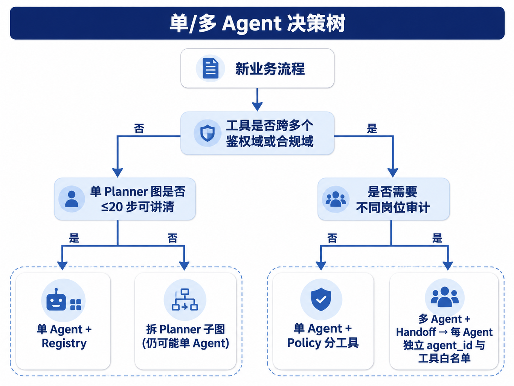
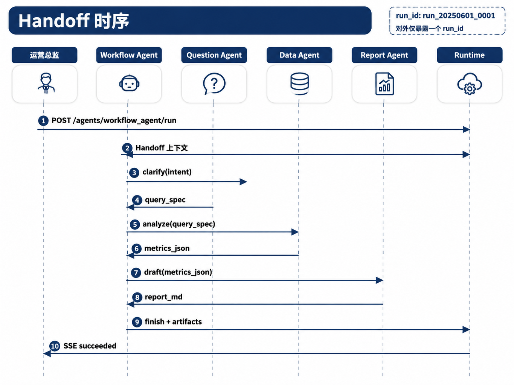

# 第28章 多 Agent 协作

---

多 Agent 的核心价值，是把不同职责、权限和交付物放进同一个可审计的 Run 中。一个 DataAgent 可以完成查询、解释和报告草稿；任务一旦涉及澄清、查数、报告生成、合规复核和外部供应商能力，单一 Agent 往往会承担过大的 Prompt、工具权限和责任边界。平台化多 Agent 设计要回答六个问题：何时拆分、如何分工、如何 Handoff、如何发现能力、如何处理冲突、如何落到 mini-platform。

第25章讨论的是单 Agent 内部的编排，Planner 可以用 ReAct、Plan-and-Execute 或状态图来决定下一步工具调用。第26章讨论的是单 Agent 如何自我修正。它们解决的是“一个 Agent 如何把任务做完”。本章的问题不同：当任务天然跨越多个专业角色时，平台如何让多个 Agent 协作，同时保持统一的状态、审批和审计。

以一次经营分析为例。运营负责人输入“解释华东区 Q1 毛利下滑，并给出可执行建议”。如果全部交给一个 Agent，它要澄清指标口径、执行 SQL、生成报告，还要判断哪些结论需要合规复核。演示环境里这条路径可以跑通，生产环境里问题会集中暴露：SQL 工具权限被报告生成逻辑共享，Prompt 中混入过多角色要求，报告草稿和查数证据难以分开审计，合规复核也很难插入到正确位置。

更可靠的方式是把任务放在一个外层 Workflow Run 中。Workflow Agent 负责接收用户输入并选择下一步角色；Question Agent 澄清口径；Data Agent 调用语义层或 SQL 工具；Report Agent 生成报告；Reviewer 或 Policy 决定是否需要人工确认。这些角色在同一个 `run_id` 下完成五段处理过程，而不是各自启动 `/run` 的五个服务。Runtime 仍然维护六态、检查点、Tool Call 和审批。Handoff 负责把控制权和上下文交给下一位参与者。

多 Agent 不应成为默认架构。它会增加路由、通信、检查点、观测和失败恢复成本。拆分只有在换来清晰的权限隔离、组织分工或并行专长时才值得。平台要把“多个 Agent”收进契约，否则它很容易退化成松散的模型群聊。

多 Agent 协作常被包装成多个角色一起讨论，企业平台更关心的是责任如何拆分。一个 Agent 可以承担经营分析、报告撰写和合规检查，但一旦它同时拥有查询、解释、审批和外部发送权限，风险会集中到一个 Prompt 和一组工具上。拆成多个 Agent 的意义，是把职责、权限和交付物拆开，并让它们仍然处在同一个可审计 Run 中。

经营分析场景能说明拆分价值。分析 Agent 负责查询和归因，报告 Agent 负责组织材料，合规 Agent 负责检查敏感字段和发布要求。它们的工具权限、输入材料和输出对象都不同。若协作只停留在聊天消息互相转发，最终仍然无法说明哪个 Agent 做了什么决定、谁批准了外发内容、哪个产物进入了业务流程。

多 Agent 不应成为复杂度的默认答案。单一 Agent 能完成、权限简单、失败后果低的任务，拆分会增加状态、通信和调试成本。只有当任务天然跨专业角色、工具权限或责任边界时，多 Agent 才有生产价值。

## 28.1 何时需要多 Agent

判断是否拆分，先看单 Agent 是否已经过载。所谓过载，不只表现为模型回答变慢，更常见的是一个 Agent 同时背负多个不同责任：它需要使用互不相关的工具，需要在不同权限域之间切换，需要写出不同形态的交付物，或需要让不同团队分别对中间结果负责。只要这些边界仍能用单 Planner、清晰的 Tool Registry 和状态图表达，就不必急着拆分。

*表28-1：单 Agent 与多 Agent 的选择信号。来源：本书整理。*

| 判断维度 | 单 Agent 更合适 | 多 Agent 更合适 |
|---|---|---|
| 工具权限 | 工具属于同一鉴权域 | SQL、报告、外部 SaaS 权限不同 |
| Prompt 角色 | 一个系统提示可覆盖任务 | 澄清、查数、撰写、复核需要不同提示 |
| 审计责任 | Tool Call 回放即可说明过程 | 不同团队要对不同中间产物负责 |
| 并行需求 | 步骤天然串行 | 多个数据源、区域或外部 Agent 可并行 |
| 交付形态 | 最终只需一个回答 | 需要报告、附件、审批意见或外部 artifact |

单 Agent 足够的典型场景，是一次只读查询加简短解释。例如用户问“上周华东销售额 Top 10 SKU 是什么”，Planner 选表、生成 SQL、执行查询并解释即可。拆成 Question Agent、SQL Agent、Report Agent 只会增加路径长度。

多 Agent 更适合跨角色的任务。例如同一个经营分析需要 Data Agent 访问仓库，Report Agent 访问文档渲染器，Reviewer 只能读草稿和证据，不能直连 PII 表。此时拆分的价值在于把工具白名单、输出格式和责任边界分开，而不是增加架构层数。



*图28-1：单/多 Agent 决策树。来源：本书自绘。Alt text：决策树从单 Agent 是否过载、是否需要专长分工、是否需要并行等问题分支，引向保持单 Agent 或拆分多 Agent 的结论。*

还要区分多 Agent 与 Agentic Workflow。第26章中的反思、搜索和自我修正可以发生在一个 Agent 内。多 Agent 则意味着平台中出现多个 `agent_id`，每个 Agent 有独立配置、工具权限和输入输出契约。前者提升单任务质量，后者对齐组织边界和权限边界。

多 Agent 设计要避免把它理解成“多个模型自由讨论”。生产平台不能让 Agent 绕过 Runtime 互相发送任意消息。每一次交接都要能关联 `run_id`、`step_index`、输入 payload、输出结果和失败原因。否则看似灵活，实际会破坏审计链。

还要避免用多 Agent 掩盖工具治理问题。如果 SQL 工具 schema 经常漂移、指标定义没有版本、报告模板不稳定，拆出更多 Agent 只会让问题分散到更多位置。多 Agent 之前，至少要先有稳定的 Tool Registry、语义层版本和 Trace。否则每个 Agent 都会用自己的理解修补缺口，最终得到一条看似协作、实际不可复现的任务链。

---

## 28.2 角色分工

多 Agent 设计的第一步是定角色。角色命名本身不重要，关键是让每个 Agent 的输入、输出、工具权限和责任范围足够窄。一个好的角色设计，应该让业务方能说清“这一步由谁负责”，让平台能说清“这一步允许调用哪些工具”。

*表28-2：常见 Agent 角色与职责边界。来源：本书整理。*

| 角色 | 主要职责 | 典型输出 | 工具权限 |
|---|---|---|---|
| Workflow / Router | 接收任务，选择下一位 Agent | `handoff` 目标、路由原因 | 路由表、Agent Catalog |
| Question / Clarifier | 澄清口径和缺失槽位 | `query_spec` | 低风险知识检索 |
| Data / Executor | 执行查数和事实生成 | SQL 结果、指标 JSON、证据引用 | 语义层、SQL、只读数据工具 |
| Report / Synthesizer | 生成报告草稿 | Markdown、PPT 大纲、摘要 | 文档渲染、模板 |
| Reviewer / Policy | 质量与合规检查 | 通过、退回、人工审批请求 | 规则、评测器、审批接口 |

Router 和 Planner 经常被混在一起。Router 选择“由哪个 Agent 处理”，Planner 选择“当前 Agent 调哪个工具”。一个 Workflow Agent 可以内置轻量 Router，而 Data Agent 内部仍然有自己的 Planner。这样能避免一个全局 Planner 同时理解所有工具和所有角色，也能让 Data Agent 的规划逻辑保持聚焦。

角色切分后，对外仍然应该只有一个入口。用户看到的是一个经营分析 Agent 或 DataAgent，而不是手动选择五个子 Agent。内部角色可以在调试界面展示，但业务入口要稳定。对用户来说，平台要交付的是一次可追踪任务，不是一组需要自己编排的组件。



*图28-2：Handoff 时序。来源：本书自绘。Alt text：时序图展示主 Agent 完成部分任务后，把任务上下文与状态打包交接给专长 Agent，后者处理完再交回，箭头标出交接点与上下文传递。*

在 Run 六态上，多 Agent 切换不应改变状态模型。`planning` 表示当前活跃 Agent 正在决策，`executing` 表示当前 Agent 正在调用工具或发起 Handoff，`waiting_human` 表示 Reviewer 或 Policy 要求人工审批，`succeeded` 表示 Workflow 汇总完成。检查点中需要额外记录 `active_agent_id` 和 Handoff 栈，使恢复后知道控制权停在哪个角色。

角色设计还要控制“共享知识”的边界。Report Agent 需要知道 Data Agent 输出的指标和证据，但不需要知道数据库连接细节；Reviewer 需要看到报告草稿、引用和风险标签，但不需要拥有报告写权限；Workflow Agent 需要知道每个 Agent 的能力和状态，但不应继承所有子 Agent 的工具白名单。把这些边界写进 AgentSpec，比在 Prompt 里反复提醒“不要访问某些工具”可靠得多。

在组织协作中，角色还对应责任人。Data Agent 的指标错误应能追溯到数据团队维护的语义层或查询工具；Report Agent 的表述问题应能追溯到报告模板和生成策略；Reviewer 的退回应能追溯到规则版本或审批意见。多 Agent 平台如果不能把技术角色映射到组织责任，就很难进入经营流程。

---

## 28.3 Handoff 契约

Handoff 是结构化的控制权转移。它不能停在把用户原话转发给另一个 Agent，也不能让另一个 Agent 新开任务。平台应把 Handoff 实现为特殊 Tool Call：Runtime 记录调用，Policy 可以拦截，检查点可以恢复，Trace 可以回放。

*表28-3：Handoff 最小字段。来源：本书整理。*

| 字段 | 说明 |
|---|---|
| `from_agent_id` | 转出方 |
| `to_agent_id` | 转入方 |
| `handoff_id` | 唯一 ID，写入 Tool Call 记录 |
| `payload` | 下一 Agent 可见的结构化上下文 |
| `reason` | 路由原因，用于排错和审计 |
| `return_policy` | 是否允许完成后返回上级 Agent |

payload 的粒度要控制好。Question Agent 输出的 `query_spec` 可以按值传递，因为它通常只是指标、时间、区域和过滤条件。Data Agent 输出的大结果不应整包塞进 Handoff，而应写入 Memory、对象存储或结果表，再把 `result_ref`、schema、样例和 hash 传给 Report Agent。这样可以压低检查点体积，也能避免中间 Agent 修改原始结果。

复杂流程会需要 Handoff 栈。例如 Report Agent 写草稿时发现口径不完整，可以把控制权退回 Question Agent 补槽；补完后再回到 Report Agent。栈深度必须有上限，并与 `max_steps` 联动。否则 A 到 B、B 又到 A 的循环会把 Run 拖到超时才失败。

内部 Handoff 与外部 Agent 委托也要分清。内部 Handoff 只需要根据 `agent_id` 找到平台配置；外部委托要经过第29章的 A2A、Agent Card、TLS、mTLS 和出站 Policy。二者在 Runtime 眼里都可以是一次 Tool Call，但适配层和安全要求不同。

Handoff 的错误也要结构化。目标 Agent 不存在、payload 不符合 schema、目标队列超时、租户不匹配、返回结果无法解析，都应有明确错误码和恢复策略。Workflow Agent 可以根据错误类型决定澄清、重试、降级或失败。如果只把错误写成自然语言，后续的重试、告警和统计都会变得困难。

幂等性是 Handoff 的另一个基础要求。Runtime 重试一次 Handoff 时，不能让目标 Agent 重复写报告、重复创建工单或重复发起外部调用。`handoff_id`、`idempotency_key` 和 payload hash 应一起进入 Tool Call 记录。这样即使进程在 Handoff 后崩溃，恢复时也能判断这次交接是否已经被目标 Agent 接收。

---

## 28.4 路由与能力发现

Workflow Agent 的路由不应依赖模型临场猜测。生产系统通常采用混合路由：规则先挡住高确定性路径，分类模型处理自然语言变体，Agent Catalog 提供候选能力和权限过滤，低置信度则交给 Question Agent 澄清。

*表28-4：路由策略的适用边界。来源：本书整理。*

| 策略 | 适合场景 | 主要风险 |
|---|---|---|
| 规则路由 | 高确定关键词、固定流程 | 覆盖不足 |
| 分类模型 | 用户表达多样、标签稳定 | 需要评测和置信度阈值 |
| Agent Card / Catalog 匹配 | Agent 数量多、能力经常变 | 元数据漂移 |
| 混合路由 | 企业生产常态 | 实现和测试成本较高 |

Agent Catalog 是路由的基础设施。每个 Agent 至少要声明 `agent_id`、能力描述、输入输出 schema、工具白名单、SLA、租户范围和版本。Router 先按租户和权限过滤，再按任务意图选择候选，然后写入 `route_label`、候选列表、最终 `chosen_agent_id` 和路由原因。

路由失败时，平台要有明确降级路径。没有候选 Agent 时进入澄清；目标 Agent 超时后按幂等键重试；队列过长时可以选择备份 Agent 或返回可解释的延迟；模型路由置信度低时禁止直接访问 SQL。低置信度仍然直连数据工具，是多 Agent 系统中最容易造成权限事故的路径之一。

路由本身也需要评测。可以把历史用户问题、期望 Agent、拒绝路由样本和边界样本组成测试集，每次修改规则或 AgentSpec 后跑回归。评测不只看选对率，还要看高风险错路由。例如“帮我写一份销售复盘”可以进入 Report Agent，但“按客户手机号查销售明细”即使带有“销售”关键词，也不能绕过权限直接进入 Data Agent。

当 Agent 数量增加后，Catalog 的维护成本会超过路由算法本身。过期 Agent、重复能力、没有 owner 的 Agent、长期失败的外部 Agent，都应从候选集中剔除或降权。否则 Router 会在一堆看似可用的 Agent 中选择，实际命中的是没人维护的旧能力。

Router 还要把“拒绝路由”当成一等结果。用户问题缺少时间范围、指标口径不明确、请求跨越租户权限、目标 Agent 不在当前环境启用时，更合适的动作通常是返回澄清或拒绝，不要勉强选择一个 Agent。许多生产事故并非模型完全看不懂问题，而是系统在低置信度时仍然选择了一个看似接近的能力。对 DataAgent 来说，这类错误可能直接变成错误 SQL 或越权查询。

路由输出也应该进入 Trace，而不只在日志里打印。Trace 中至少保留候选 Agent、过滤原因、最终选择、路由置信度、路由规则版本和 Catalog 版本。这样当用户质疑“为什么没有调用报告 Agent”时，平台可以解释是工具白名单过滤、租户权限过滤，还是分类模型判断错误。路由是多 Agent 的入口决策，缺少可见性会让后续排错非常困难。

---

## 28.5 冲突仲裁与一致性

多 Agent 一旦并行，冲突就会出现。两个 Data Agent 可能对同一 SKU 返回不同数字，Report Agent 可能把毛利写成 GMV，Reviewer 可能退回报告中的结论，两个 Agent 还可能同时写同一个工单。平台不能把这些问题交给末端 LLM “综合一下”。

冲突处理要先定义权威源。财务数字应以语义层和版本化数据集为准；文档结论应保留来源和时间戳；报告终稿应只有一个写者；Reviewer 可以打标和退回，但不应静默覆盖正文。并行结果合并前，Workflow Agent 应检查 metric id、semantic layer 版本、时间范围、过滤条件和 artifact hash。

*表28-5：冲突类型与处理方式。来源：本书整理。*

| 冲突类型 | 检测信号 | 处理方式 |
|---|---|---|
| 事实冲突 | 同一 `query_spec` 返回不同指标 | 使用权威源或进入人工仲裁 |
| 口径冲突 | metric、时间或过滤条件不一致 | 退回 Data Agent 重新生成 |
| 叙事冲突 | Reviewer 与 Report 结论相反 | 记录批注并要求修订 |
| 资源冲突 | 同一 artifact 被多个 Agent 写入 | 单写者原则和乐观锁 |
| Handoff 环 | 相同 payload 在 Agent 间反复传递 | 栈深度和 payload hash 检测 |

一致性契约要写进平台，而不能只写进 Prompt。Handoff payload 应带 `semantic_layer_version`；Registry 工具应支持 `idempotency_key`；Run 内事件按 `step_index` 排序；外部 Agent 返回结果时记录 `external_task_id` 和 artifact hash。这样第38章的 Trace 回放才能看到每个 Agent 当时拿到了什么、做了什么、返回了什么。

并行协作尤其要避免“平均答案”。如果两个 Data Agent 返回不同数字，Report Agent 不应把两个数字揉成一个看似中立的结论；如果 Reviewer 指出合规风险，Workflow Agent 也不应因为报告语言流畅就继续发布。平台要允许输出“不一致，无法自动完成”，这比生成一个自信但错误的报告更符合企业系统要求。

冲突数据还可以反过来改进系统。高频口径冲突说明语义层定义不清；高频 Reviewer 退回说明报告模板或提示词不稳；高频 Handoff 环说明路由边界不清。多 Agent 的价值之一，是让这些问题在 Trace 和指标中显性化，避免所有错误都被压进一个黑盒 Agent 的最终回答。

---

## 28.6 多 Agent 协作的运行边界

本章实战项目位于 `projects/multi-agent-workflow/`。它用同一个 `run_id` 完成 Workflow、Data、Report 与审批链路，Handoff 作为 `handoff@v1` Tool Call 执行，检查点保存 `active_agent_id` 与 `handoff_stack`。这不是完整生产 Router，也没有接入外部 A2A Agent，但足以展示平台内多 Agent 的最小工作流。

```text
mini-platform/
├── projects/multi-agent-workflow/lib/
│   ├── registry_setup.py
│   └── planner.py
├── core/runtime/
│   ├── run_loop.py
│   └── handoff_tool.py
└── projects/multi-agent-workflow/
    ├── run.py
    └── README.md
```

运行方式如下。

```bash
cd mini-platform
python3 projects/multi-agent-workflow/run.py start
python3 projects/multi-agent-workflow/run.py approve
```

预期事件流中应看到 `handoff`、`active_agent_id` 切换、Data 阶段的 `mcp_db_query_sales` 调用、报告生成后的 `waiting_human`，以及审批通过后的 `approval_result`。如果每个子 Agent 都各自启动 `/run`，审批、恢复和回放都会断裂，这与本章设计相违背。

第一版生产化可以按四个步骤推进。先把内部 Handoff 做成 Tool Call，并让检查点能恢复 `active_agent_id`。再建立 Agent Catalog 和工具白名单，让 Router 有可审计的候选集。随后补齐路由评测、冲突检测和 Handoff 环检测。外部 A2A Agent 可以放到这些基础稳定之后再接入，因为外部协议会引入认证、出站脱敏、超时嵌套和供应商版本管理。

这个顺序很重要。许多团队会先接外部 Agent，再回头补内部状态和审计，结果是外部任务能跑，但无法解释、无法取消、无法恢复。先把内部 Handoff 做成可测的最小工作流，能让后续协议接入都落在同一个 Runtime 模型里。

验收时可以设计三类用例。第一类是正常链路：Workflow 到 Data 到 Report 到审批，确认 `run_id` 始终不变。第二类是恢复链路：在 Handoff 后杀掉进程，确认检查点恢复到正确的 `active_agent_id`。第三类是失败链路：构造目标 Agent 不存在、payload schema 错误和 Handoff 环，确认系统给出结构化错误，不能无限等待。

上线后还要看运行指标。Handoff 次数异常升高，说明 Router 可能在多个 Agent 之间来回摇摆；Question Agent 命中率突然升高，可能是上游输入变模糊或路由规则过期；Reviewer 退回率升高，可能是 Report Agent 模板漂移；单次 Run 的 cross-agent payload 变大，可能是 Data Agent 把大结果直接塞进 Handoff。把这些指标放进第38章的观测体系，才能让多 Agent 从“能跑”走向“能运营”。

---

## 28.7 多 Agent 协作的生产边界

多 Agent 协作最容易被误用成“多几个角色一起聊天”。生产系统里，角色不是人格设定，而是责任边界。一个 DataAgent 负责查询和分析，一个 Reviewer Agent 负责证据检查，一个 Workflow Agent 负责审批推进，它们之间必须通过 Handoff 契约交换结构化状态。若只是把上一个 Agent 的自然语言回答转给下一个 Agent，链路很快会丢失权限、证据和错误分类。

共享状态要足够少。多 Agent 系统如果共享完整上下文，会出现两个问题：敏感信息扩散到不需要的角色，错误假设在多个 Agent 之间互相强化。更稳的方式是按任务交接最小化传递：目标、已完成步骤、证据引用、待处理问题、允许调用的工具和当前风险等级。具体原始数据仍通过受控引用读取，不能随消息自由复制。

冲突仲裁要落到平台，而不是让模型互相说服。两个 Agent 给出不同结论时，平台应先看证据链、工具结果、权限和评测规则；只有开放式判断才进入模型裁判或人工复核。比如一个 Agent 认为毛利下滑来自价格，一个 Agent 认为来自履约延迟，系统应能回到 SQL、Python 分析和图表证据，而不是让两个 Agent 再进行一轮辩论。

多 Agent 的可观测性也要分层。Run 级 trace 记录整体任务，Agent span 记录角色决策，Tool Call 记录实际副作用。这样事故发生时，平台能判断是路由错把任务交给了错误 Agent，还是 Handoff 丢了字段，还是下游工具返回了错误结果。没有这三层记录，多 Agent 只会把单 Agent 的问题放大。

## 28.8 共享状态与责任边界

多 Agent 协作最容易失控的地方是共享状态。每个 Agent 都能读写同一份上下文时，短期看协作更顺畅，长期看责任会变得模糊：一个 Agent 修改了任务目标，另一个 Agent 基于修改后的目标执行工具，最终错误很难归因。生产系统不应把共享状态设计成一块所有角色都能随意编辑的黑板，而应区分任务上下文、协作消息、工具结果、审批状态和最终产物。

共享状态需要写入权限。Planner Agent 可以更新计划，执行 Agent 可以追加工具观察，审核 Agent 可以改变审批状态，但不应直接覆盖原始用户意图。若确实需要改写任务目标，系统要生成新的任务版本，并记录发起者、依据和影响范围。这样做看起来比单一上下文复杂，但它让多 Agent 的协作从“互相聊天”变成“受控移交”。

责任边界也要体现在 Trace 中。每个 Agent 的输入、输出、可见上下文和调用工具都要能单独回放。出现错误时，平台应能判断是路由 Agent 分配错角色，专业 Agent 判断错业务规则，还是执行 Agent 调错工具。没有这种边界，多 Agent 系统只是在单 Agent 外面套了一层角色名，出了问题仍然只能归咎于模型。

## 28.9 Handoff 失败的恢复策略

Handoff 失败不只是消息没有送达。更常见的问题是接收方 Agent 无法理解交接内容、缺少必要权限、拿不到上游证据，或者接收到的任务目标和自身能力不匹配。一个销售线索分析 Agent 把任务交给合同审查 Agent 时，如果只传递“请继续处理”，接收方无法判断要审查哪份合同、基于哪个客户、需要遵守什么审批边界。

平台应当把 Handoff 设计成结构化契约。交接内容至少包括任务目标、当前状态、已完成步骤、未完成步骤、证据引用、权限上下文、失败历史和期望输出。接收方如果发现契约不完整，应当拒绝接收并返回可修复原因，而不是猜测执行。拒绝接收也要进入 Runtime 状态机，避免任务在多个 Agent 之间反复转发。

恢复策略可以分为三类。上下文缺失时，回到上游 Agent 补齐证据；权限不足时，转入 HITL 或降级为只读建议；能力不匹配时，交给路由 Agent 重新选择角色。无论采用哪种恢复方式，都要保存原始 Handoff 和修复后的 Handoff。这样第38章的诊断才能看出协作失败发生在哪一次移交，而不是只看到最终回答失败。

## 28.10 多 Agent 的最小可用形态

多 Agent 不应成为默认架构。很多任务用单 Agent 加清晰工具链就能完成，强行拆分角色只会增加 Handoff、状态同步和审计成本。进入多 Agent 前，团队应当确认任务确实存在角色专业性、权限差异或并行处理需求。例如一个任务需要数据分析、合同审查和客户沟通三种能力，且三者由不同责任团队维护，多 Agent 才有明确价值。

最小可用形态可以从两个 Agent 开始：一个负责计划和路由，一个负责专业执行。路由 Agent 不直接操作高风险工具，执行 Agent 只处理明确边界内的任务。所有交接都通过结构化 Handoff，所有结果都回到 Runtime 汇总。这个形态虽然简单，但能验证角色边界、共享状态和 Trace 是否足够。

当两个 Agent 的边界稳定后，再引入更多专业 Agent。不要一开始就设计复杂组织结构，否则系统还没证明价值，就先承担了协作复杂度。多 Agent 的工程判断，关键是让角色减少复杂度，而不是制造复杂度。

多 Agent 还需要退出条件。如果路由长期把任务交给同一个执行 Agent，或者 Handoff 失败率高于单 Agent 的工具调用失败率，说明拆分没有带来收益。平台应定期比较单 Agent 和多 Agent 在成本、延迟、错误定位和人工介入上的差异。只有数据证明角色拆分改善了责任边界或处理质量，才值得继续扩展。

退出条件同样要进入设计文档。某个专业 Agent 可以被合并回主流程，某类 Handoff 可以改成普通工具调用，某个协作角色也可以只在高风险场景启用。多 Agent 架构应允许收缩，而不是只能继续膨胀。

这种可收缩性会让团队更愿意试验多 Agent。试验失败后能回到简单架构，平台才不会被早期角色划分长期绑定。

收缩时也要保留历史 Trace 的解释能力。旧 Run 里出现过的 Agent 角色、Handoff 事件和共享状态，仍然需要能被审计和回放。架构可以简化，历史证据不能丢失。

多 Agent 的运行指标应包含路由准确率、Handoff 拒绝率、重复协作次数、人工仲裁次数和最终任务完成率。指标长期不能优于单 Agent 链路时，应优先简化，而不是继续增加角色。

这条原则能防止协作架构变成新的复杂度来源。

Handoff 契约是多 Agent 协作的核心。交接内容要包含任务目标、已使用证据、已完成动作、未解决问题、权限范围和期望产物。缺少这些信息，下游 Agent 会重新猜测上下文，协作质量反而下降。

冲突仲裁也要提前设计。两个 Agent 给出不同结论时，是由规则决定、由更高权限 Agent 判断，还是进入人工复核，都要有明确路径。否则多 Agent 只会产生更多看似合理但互相矛盾的答案。

生产中的多 Agent 协作最终仍要回到 Runtime。共享状态、事件流、审批和 Trace 统一后，多个 Agent 才是在同一任务里分工；没有这些平台能力，它们只是多个聊天机器人互相调用。

多 Agent 的共享状态要有写入规则。分析 Agent 写入的中间结论、报告 Agent 生成的草稿、合规 Agent 给出的驳回意见，都可能影响后续动作。平台需要区分事实、假设、建议和审批结果，不能把所有消息都当作同等可信上下文。

路由器也要可解释。任务为什么交给某个 Agent，是因为领域、权限、负载、成本，还是用户偏好，应写入 Trace。若路由器只返回一个目标 Agent，失败后无法判断是路由错误、目标 Agent 能力不足，还是上下文交接不完整。

多 Agent 协作中的权限应取交集或按任务授权，而不是简单相加。一个 Agent 有查数权限，另一个 Agent 有外发权限，并不代表组合后可以查询敏感数据再外发。Handoff 时必须重新计算目标 Agent 可见信息和可执行动作。

协作失败要有退出路径。目标 Agent 不可用、交接信息不足、多个 Agent 互相退回、结论冲突无法仲裁时，Runtime 应停止循环并给出人工入口。没有退出路径，多 Agent 系统容易把责任在多个角色之间来回传递。

组织上，多 Agent 往往对应多个团队。数据团队维护分析 Agent，内容团队维护报告 Agent，安全团队维护合规 Agent。平台需要统一发布和回归机制，避免一个 Agent 升级后破坏整条协作链。

多 Agent 的消息格式要标准化。一个 Agent 输出自然语言段落，另一个 Agent 很难稳定消费；若输出包含任务状态、证据引用、产物链接、风险等级和待办项，下游 Agent 才能继续工作。协作消息既是给模型看的上下文，也是给 Runtime 和审计看的结构化记录。

能力发现不能只靠描述相似度。某个 Agent 声称自己能做财务分析，还要看它拥有的数据权限、工具权限、当前负载、版本状态和评测结果。路由器选择 Agent 时，应把这些运行信息纳入判断。否则系统会把任务分配给“描述上合适、实际上不可用”的 Agent。

多 Agent 中的人类角色也要明确。某些交接需要业务负责人确认，某些冲突需要数据负责人仲裁，某些外发需要合规审批。人工并不是协作失败后的最后补丁，而是某些流程的正常参与者。Runtime 应把人类节点和 Agent 节点放在同一条状态链里。

共享 Memory 要谨慎。多个 Agent 共享任务上下文可以提高效率，但共享长期记忆会扩大污染范围。分析 Agent 的临时假设，不应被报告 Agent 当作事实长期保存；合规 Agent 的驳回意见，也要标明适用产物和时间。共享状态越多，类型标注越重要。

多 Agent 的成本也会快速上升。每个交接都可能触发模型调用、工具调用和上下文传递。平台需要统计每个角色的成本和贡献，识别哪些 Agent 真正减少了风险，哪些只是增加了流程。没有成本和质量数据，多 Agent 很容易变成复杂演示。

企业落地时，可以先从少数固定协作链开始。比如“分析 Agent 生成结果，报告 Agent 组织材料，合规 Agent 检查外发”，比开放式 Agent 群聊更容易治理。固定链路跑稳后，再逐步增加动态路由和能力发现。

多 Agent 的评测要覆盖团队协作，而不是只评单个角色。分析 Agent 独立表现好，报告 Agent 独立表现好，不代表交接后报告能正确引用分析结果。评测样本应包含交接信息、冲突结论、权限差异和人工审批，观察整条链路是否完成任务。

Agent 间通信要防止 Prompt Injection 横向传播。一个 Agent 从不可信文档中读到恶意指令，不能把它作为系统级要求传给另一个 Agent。Handoff 契约应区分不可信证据、模型结论和平台指令。下游 Agent 只能把上游输出当作受限输入，而不是无条件服从。

多 Agent 架构也要避免责任稀释。最终报告错误时，不能让每个 Agent 都说自己只是中间环节。Run 记录要说明每个 Agent 的职责、输入、输出和审批状态，最终产物由哪个 Agent 或哪个人确认。责任清楚，协作才敢进入生产。

在组织推广时，多 Agent 可以先服务后台流程。比如分析、复核、生成报告草稿，比直接面向外部客户风险低。后台流程积累足够 Trace 和评测后，再考虑外部交互。这样的渐进路线能减少复杂协作带来的上线风险。

多 Agent 还要处理版本组合。分析 Agent 升级了，报告 Agent 仍按旧输出理解；合规 Agent 新增检查项，旧报告模板没有对应字段。协作链里的每个 Agent 都有版本，平台需要记录一次 Run 使用的组合。版本组合清楚后，回归和回滚才可执行。

## 本章小结

多 Agent 的价值来自职责、权限和组织分工，不来自模型数量。Router 选择 Agent，Planner 选择工具，两者属于不同层级。Handoff 应作为同一 `run_id` 内的结构化 Tool Call，而不是让子 Agent 各自启动独立任务。

Agent Catalog、工具白名单和路由 Trace 是多 Agent 可治理的前提。并行协作还需要冲突检测和权威源策略，尤其在多个 Agent 同时生成事实、建议或业务动作时，平台不能让模型凭语气合并矛盾结论。


## 参考文献

Li, G., et al. (2024). CAMEL: Communicative agents for "mind" exploration of large language model society. *NeurIPS*. arXiv:2303.17760. [https://arxiv.org/abs/2303.17760](https://arxiv.org/abs/2303.17760)

Qian, C., et al. (2024). ChatDev: Communicative agents for software development. arXiv:2307.07924. [https://arxiv.org/abs/2307.07924](https://arxiv.org/abs/2307.07924)

Google. (2025). *Agent2Agent (A2A) Protocol*. [https://google.github.io/A2A/](https://google.github.io/A2A/)

Microsoft. (n.d.). *AutoGen*. [https://microsoft.github.io/autogen/](https://microsoft.github.io/autogen/)

Wu, Q., et al. (2024). AutoGen: Enabling next-gen LLM applications via multi-agent conversation. arXiv:2308.08155. [https://arxiv.org/abs/2308.08155](https://arxiv.org/abs/2308.08155)

OpenAI. (2024). *Swarm*. [https://github.com/openai/swarm](https://github.com/openai/swarm)

Hong, S., et al. (2024). MetaGPT: Meta programming for a multi-agent collaborative framework. *ICLR*. arXiv:2308.00352. [https://arxiv.org/abs/2308.00352](https://arxiv.org/abs/2308.00352)

Wang, L., et al. (2024). A survey on large language model based autonomous agents. *Frontiers of Computer Science*, 18(6), 186345. [https://doi.org/10.1007/s11704-024-40231-1](https://doi.org/10.1007/s11704-024-40231-1)

Model Context Protocol. (2024). *Specification* (2024-11-05). [https://modelcontextprotocol.io/specification/2024-11-05](https://modelcontextprotocol.io/specification/2024-11-05)

Yao, S., et al. (2023). ReAct: Synergizing reasoning and acting in language models. arXiv:2210.03629. [https://arxiv.org/abs/2210.03629](https://arxiv.org/abs/2210.03629)
