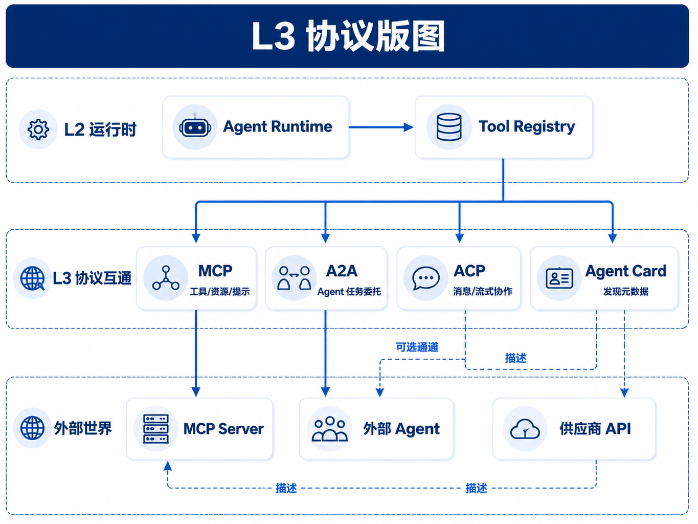
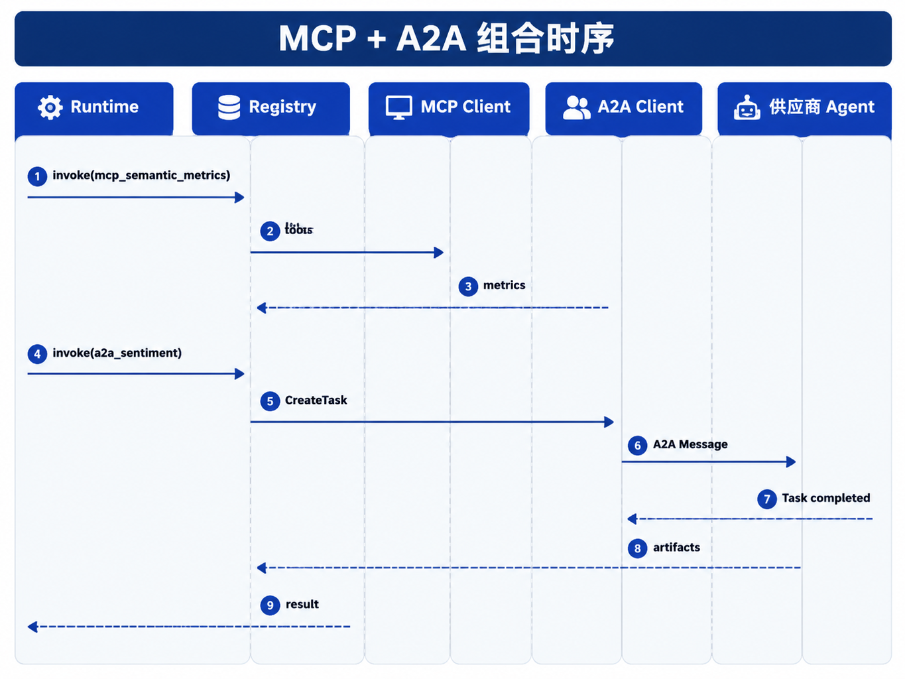

# 第29章 Agent 协议与标准

---

第24章已经说明 MCP 如何把工具和资源暴露给模型，第28章讨论了平台内部 Agent 之间的 Handoff。真实企业平台还会遇到第三类问题：外部供应商、其它云上的 Agent、桌面端工具、内部 API 网关和模型供应商工具接口，都可能要求接入同一个 Agent 平台。

舆情分析是典型场景。内部 Data Agent 能通过语义层查询销量，外部供应商提供一个舆情监测 Agent，只暴露 A2A endpoint 和 Agent Card。业务希望在同一份经营报告里同时看到销量下滑和舆情变化。平台不能让 Runtime 直接调用供应商 endpoint，也不能把 A2A Task 当成一个无审计的 HTTP 请求。正确做法是把外部 Agent 导入 L1 Catalog，经 A2A adapter 注册成内部 ToolSpec 或 Handoff 目标；Runtime 仍然只看到一次 Registry `invoke`，Trace 仍然记录 `run_id`、输入、输出、外部 task id 和 artifact hash。

这正是协议层的定位。协议解决跨边界互操作，平台内核解决运行时状态、权限、检查点、审计和恢复。MCP、A2A、Agent Card、ACP 可以并存，但它们都不应该绕过 Registry 直接触发企业副作用。

协议问题在演示环境里常常显得很简单。开发者拿到一个 MCP Server，模型能列出工具；拿到一个 A2A endpoint，远端 Agent 能返回任务状态；拿到一个 Agent Card，平台能读出名称、描述和 skill。演示到这里往往已经足够。但生产环境真正关心的是下一层问题：谁批准这个外部能力进入默认路由，远端工具调用失败时是否可重试，外部 Agent 生成的 artifact 能否作为内部证据，远端返回的字段是否触碰客户数据，协议版本升级后旧 Run 如何回放。只要这些问题没有答案，协议连通就只是网络连通，不是平台集成。

一次真实的协议事故通常不是“调不通”，而是“调通了但失控”。例如某供应商 Agent 的 Agent Card 中新增了一个 `send_report` skill，适配器自动刷新后把它暴露给 Planner；Planner 在生成经营报告时把这个 skill 当作普通发布动作调用，结果报告被发到了外部系统。事后排查发现，A2A endpoint、认证和 schema 都是正确的，问题出在能力准入：外部声明被直接当成内部权限，缺少 owner、风险等级、审批策略和发布环境隔离。这个例子说明，协议适配层的第一职责不是把所有能力接进来，而是把外部能力翻译成企业内部可以治理的对象。

协议还会放大版本管理问题。内部工具升级时，平台可以要求灰度、回滚和变更记录；外部协议能力升级时，变更可能来自供应商、云平台或桌面端插件。一个 MCP tool 的参数名变化、一个 Agent Card 的 auth 字段变化、一个 A2A Task 的状态枚举新增，都可能让旧适配器误判结果。企业平台需要把协议快照保存下来：某次 Run 使用的是哪张 Agent Card、哪个 MCP tool schema、哪个 adapter 版本、哪条出站策略。没有快照，历史回答就会依赖当前远端状态，审计时无法复现。

因此，本章讨论协议时，不把重点放在“哪个协议会赢”，而放在“协议进入企业平台后由谁接管责任”。MCP 适合工具和资源，A2A 适合远端 Agent 委托，Agent Card 适合能力发现，ACP 更偏持续消息协作。它们解决的对象不同，但进入企业平台后都要经过相同的内核：Registry 登记能力，Policy 判断是否允许，Runtime 管理状态，Trace 记录证据，Catalog 负责 owner 和生命周期。协议层越开放，平台内核越要稳。

---

## 29.1 协议版图

Agent 平台通常可以分成三层：L1 管控面，L2 Runtime，L3 协议互通。L3 是一组按协作对象划分的适配层，不是单一协议。对工具和资源，用 MCP；对远程 Agent 委托，用 A2A；对能力发现，用 Agent Card；对持续消息和事件协作，可以观察 ACP 或映射到内部 Event Bus；对模型函数调用，则由 Gateway 和 Registry 导出 schema。



*图29-1：L3 协议版图。来源：本书自绘。Alt text：分层版图把 MCP、A2A、Agent Card、内部 Registry 按职责层叠放置，箭头标出它们的衔接点。*

*表29-1：主要 Agent 协议的对象与平台接入方式。来源：本书整理。*

| 协议或机制 | 主要对象 | 典型用途 | 平台接入方式 |
|---|---|---|---|
| MCP | 工具、资源、Prompt 模板 | SQL 工具、文件资源、企业系统操作 | 适配为 ToolSpec，handler 内调用 MCP Client |
| A2A | 远程 Agent | 委托供应商 Agent 或跨组织 Agent | 适配为外部 Agent Tool 或 Handoff 目标 |
| Agent Card | Agent 元数据 | 发现 endpoint、skills、认证方式 | 导入 L1 Catalog，生成 AgentSpec |
| ACP | Agent 间消息或事件 | 持续协作、事件广播 | 映射到内部 Event Bus 或异步 Tool |
| 模型 tools API | 模型函数调用 | OpenAI、Anthropic 工具调用 | Registry 导出 schema，Runtime 仍走 Registry |

读表时先判断协作对象。数据库查询不应包装成 A2A Agent；供应商完整分析服务也不应勉强塞进 MCP `tools/call`。协议选错后，权限、超时和审计模型都会变形。

协议适配还要遵守几个硬边界：Runtime 不 import 协议 Client，只认 Registry；外部能力只注册一条入口，避免同一副作用同时通过 MCP 和 A2A 被调用；Policy 在出站调用之前执行，不能因为对方提供“标准协议”就跳过租户、密级和 PII 检查。

协议层最容易失控的地方，是把“互通”理解成“直连”。一个外部 Agent 能说自己支持 A2A，并不表示它可以直接进入生产网络；一个 MCP Server 能返回工具 schema，也不表示这些工具已经符合企业的权限模型。平台需要在协议和内部调用之间加一层明确的适配边界，把外部能力转换成内部可治理对象。

这个边界还决定了故障归因。Runtime 看到的是内部 ToolSpec 和 Tool Call；协议适配层负责连接失败、认证失败、远端状态异常和版本不兼容；L1 Catalog 负责能力上架、停用和 owner。三层分清后，事故复盘才能判断是平台路由错、适配层错，还是供应商能力错。

接入评审时，可以要求每个外部协议能力回答五件事：它代表的真实业务动作是什么，失败和超时如何表达，是否会产生外部副作用，哪些数据会出站，谁负责版本和事故。回答不清的能力可以留在实验环境，不宜进入生产 Planner 的候选集。这样协议层既能保留开放性，又不会把企业平台变成一张无边界的工具网络。

协议适配还要处理“部分成功”。外部 Agent 可能已经生成报告但没有回调状态，MCP tool 可能执行了写操作但网络响应超时，ACP 消息可能被对方接收却没有确认。企业 Runtime 如果只按本地 HTTP 成功或失败更新状态，就会误判真实副作用。适配层需要把远端 task id、幂等键、artifact hash 和补偿动作记录下来，让后续恢复时知道是重试、查询远端状态、撤销动作，还是转人工处理。

协议带来的安全审查也更细。内部工具通常有固定网络位置和 owner，外部协议能力可能来自 SaaS、桌面端、本地 MCP Server 或合作伙伴环境。接入前要判断认证方式、数据驻留区域、日志留存、供应商员工访问、错误信息是否包含敏感数据，以及对方是否支持删除和审计请求。协议标准能统一接口形态，却不会替企业完成这些供应商风险判断。

对平台研发来说，最容易漏掉的是测试数据。协议适配器要有自己的契约测试：Agent Card 解析、schema 变更、认证失败、超时、远端取消、artifact 下载失败、重复回调、旧版本回放。业务集成测试只证明某一次场景跑通，契约测试才能证明适配层在协议边界变化时仍可控。把这些测试放进发布门禁后，协议接入才不会变成“供应商改一次，平台救一次”。

本章后半部分讨论各协议时，读者可以反复用这个视角检查：该协议负责哪类对象，进入企业后被映射成什么内部对象，调用前由谁授权，调用后由谁留证，出错时由谁恢复。只要这条链路完整，协议越多也不会把平台拖向混乱；链路断开时，哪怕只接一个协议，也可能形成新的治理盲区。

---

## 29.2 MCP 的位置

MCP 的核心对象是工具、资源和 Prompt 模板。它适合把外部能力标准化成可发现、可调用、可描述的工具目录。IDE 读取仓库、本地桌面工具、企业 SQL 查询服务、工单系统和只读文档资源，都适合通过 MCP 暴露给 Agent。

在本书平台里，MCP 不直接进入 Runtime。MCP Server 的 tool 先通过适配层注册为 ToolSpec。Planner 选择工具后，Runtime 调用 Registry；handler 内部再用 MCP Client 发起 `tools/call`。这样 MCP 传输方式、Server 升级和连接管理都留在协议适配层，RunLoop 不需要知道 stdio、Streamable HTTP 或其它传输细节。

这个间接路径会多一层代码，但换来清晰责任。MCP Server 挂了，适配层负责健康检查和错误翻译；ToolSpec 版本变了，Registry 负责发布和回滚；用户权限不足，Policy 在调用前拦截；远端返回 artifact，Runtime 只接收已登记的引用。若 Runtime 直接持有 MCP Client，这些责任会散落在每个 Agent 应用里，后续很难统一审计。

MCP 接入还要考虑工具描述对模型的影响。很多 MCP Server 会把工具说明写得很宽，例如“可访问企业文档”“可执行查询”“可管理任务”。这些描述如果原样进入模型上下文，Planner 可能把只读能力理解成写能力，也可能把测试环境工具当成生产工具。适配器应把外部描述改写成内部 ToolSpec：明确资源范围、动作类型、风险等级、输入 schema、输出 schema 和可见租户。模型看到的工具越清楚，越不容易在规划阶段走错路径。

协议适配层还应保存远端工具的原始声明。内部 ToolSpec 是治理后的版本，原始 MCP schema 则是供应商或外部服务当时提供的事实。事故复盘时，团队需要比较两者：适配层是否错误解释了 schema，远端是否在未通知的情况下变更了字段，内部策略是否漏掉了新增参数。没有原始声明，平台只能看到自己加工后的版本，无法判断问题来自外部还是内部。

在多协议共存的企业里，去重也很重要。同一个外部能力可能同时以 MCP tool、A2A Agent 和模型 tools API 暴露。若平台把它们都放进 Planner 候选集，模型可能通过不同入口触发同一副作用，审计系统也会看到三种名字。Catalog 应把这些入口合并到同一个能力资产下，明确首选协议、备用协议和禁用协议。这样协议多样性不会变成能力重复。

协议治理还需要下线流程。外部供应商合同到期、MCP Server 长期无人维护、Agent Card 多次刷新失败、某个远端能力发生安全事故，都应触发停用或降级。停用时，平台要保留历史 Run 的回放信息，同时从生产 Planner 候选集中移除该能力；测试环境可以继续保留 stale 状态用于排查。协议资产有生命周期，平台才知道何时接入、何时观察、何时扩大使用、何时退出。

```text
MCP Server tool
    -> adapter snapshot
    -> ToolSpec(name, version, schema)
    -> Runtime action
    -> Registry invoke
    -> MCP Client tools/call
    -> result
```

MCP 接入时最容易忽视的是版本快照。`tools/list` 会随着 Server 发布而变化，但历史 Run 需要可复现。如果供应商把 `query_sales(region)` 改成 `query_sales(regions)`，平台不能让旧 Run 在回放时突然匹配新 schema。L1 应在注册时保存 tool 列表快照，Server 升级走新的 ToolSpec 版本，而不是覆盖 `v1`。

MCP 也不适合处理所有协作。长时异步 Agent 委托、跨组织任务状态、外部 Agent 的能力声明和持续多方消息，不属于 MCP 的强项。遇到这些需求，应看 A2A、Agent Card 或内部 Event Bus，不要把一切都做成一个巨大 MCP tool。

MCP 的安全边界也要具体落地。stdio 适合本地开发和 sidecar 场景，但在 Kubernetes 中要处理进程生命周期、stdout/stderr 污染和容器权限。Streamable HTTP 更适合远程 Server，但要处理 TLS、鉴权、请求体大小、超时和重试。无论哪种传输，MCP Server 都不应直接暴露公网数据库能力，通常应通过企业 API 网关或受控服务访问后端系统。

resources 和 prompts 也要分开治理。只读资源可以作为 Memory 或上下文加载器进入 Planner，但要记录 URI、etag 和访问时间；Prompt 模板可以由合规或品牌团队维护，但不应让远端 Prompt 在 Run 中无版本替换本地系统提示。MCP 提供的是分发机制，不是内容治理本身。

---

## 29.3 A2A 与 Agent Card

A2A 解决的是 Agent 与 Agent 之间的任务委托。它的对象是一段可能有状态、有进度、有 artifact 的工作，而不是函数调用。内部平台把任务交给外部舆情 Agent、法律审查 Agent 或行业知识 Agent 时，A2A 比 MCP 更贴近语义。

平台接入 A2A 时，外层 Run 仍然存在。A2A Task 只是 Run 中的一次外部 Tool Call 或异步 Handoff。Trace 应记录委托输入、外部 task id、状态变化、返回 artifact、超时策略和供应商版本。若 A2A Task 需要用户补充材料，可以映射到平台 `waiting_human` 或一个子表单；若外部 Task 超时，外层 Run 应能取消、重试或降级。

*表29-2：A2A Task 与平台 Run 的映射。来源：本书整理。*

| A2A 概念 | 平台映射 | 设计要求 |
|---|---|---|
| Task | Tool Call 或外部 Handoff | 记录 `external_task_id` |
| Message | 出站 payload 或返回内容 | 出站前经过 Policy 脱敏 |
| Task 状态 | `executing`、`waiting_human`、`failed` 等 | 外层 Run 与外部 Task 超时要嵌套 |
| Artifact | 结果引用或报告附件 | 保存 hash、来源和版本 |

Agent Card 属于发现层，不承担执行职责。它描述 Agent 的名称、版本、endpoint、skills、认证方式和能力限制。L1 导入 Card URL 后，应校验 schema、认证信息、网络访问范围和版本，再映射为内部 AgentSpec。Router 使用内部 AgentSpec，避免每次临场读取远端 Card。

Agent Card 的生产风险在于声明与实际能力可能漂移。供应商可能修改 endpoint、删除某个 skill、变更认证方式，或者 Card 临时不可访问。平台应 pin `etag` 或版本，定期刷新并标记 stale；刷新失败不应立即删除旧 Spec。启用外部 Agent 前，还应跑第41章的冒烟评测，确认 Card 声明的能力确实可用。

Card 导入还应留下原始文档和解析结果。原始 Card 说明供应商当时声明了什么，解析后的 AgentSpec 说明平台最终允许使用什么。两者不一定完全一致：平台可能屏蔽某些 skill，替换认证方式，或把只读能力和写操作拆成不同入口。保留这两个版本，后续排查“供应商说支持、平台却没路由”的问题会容易很多。

导入 Card 时还要防 SSRF。L1 不应允许任意内网 URL、私有网段或跳转链路被访问。比较稳的做法是 URL allowlist、静态 egress proxy、禁止私有网段解析，并把密钥引用放在 Secret 管理中，而不是写进 Card 文本。

A2A 的超时设计要和外层 Run 绑定。外部 Task 如果最长需要 30 分钟，外层 Run 就不能只给 5 分钟；如果外层 Run 被用户取消，A2A Client 也要向远端传播取消信号，或至少把远端 task 标记为 orphan 并进入补偿流程。否则用户看到任务失败，供应商端却继续运行，后续返回的 artifact 也没有地方接收。

外部 Agent 的输出也不能直接进入最终答案。平台至少要校验 artifact 类型、大小、hash、来源和密级；对自然语言结论，还要明确它是外部供应商生成还是内部 Report Agent 汇总。涉及经营、财务或合规的报告，应保留外部 Agent 的原始返回引用，让审计能回到供应商输出，而不是只看到内部改写后的句子。

---

## 29.4 ACP 与事件协作

ACP 关注持续消息和事件协作。它适合表达多个 Agent 围绕一个会话或事件流追加消息的场景，例如报告草稿生成后，品牌 Agent、法务 Agent 和数据 Agent 都订阅同一条审阅线程。与 A2A 相比，ACP 更像持续会话或消息总线；与 MCP 相比，它不是工具调用协议。

企业平台通常已经有内部 Event Bus。ACP 适配层的合理位置，是把外部消息转换成内部事件 envelope，再由 L2 Event Bus、Policy 和 Runtime 决定是否触发后续动作。禁止 ACP 消息直接触发 `invoke`，否则外部消息就会绕过权限和审计。

*表29-3：互通需求与协议选择。来源：本书整理。*

| 需求 | 首选方式 | 说明 |
|---|---|---|
| 调用外部 SQL 或文件工具 | MCP | 工具目录和 schema 清晰 |
| 委托外部 Agent 完整分析 | A2A + Agent Card | 有任务状态和 artifact |
| 内部多 Agent 审阅报告 | 平台 Event Bus | 受内部 Policy 和审计控制 |
| 对外同步持续协作消息 | ACP 或 Event Bus adapter | 适合事件流，不适合作为执行入口 |
| 模型侧函数调用 | Registry 导出 tools schema | 不绕过企业工具治理 |

ACP 的成熟度和生态仍在变化。本书把它作为可观察方向，不建议放入第一批生产依赖。第一版平台应先把内部 Event Bus、异步 Tool、HITL 和 Trace 做稳，再考虑把 ACP 作为边界适配。

事件协作还有一个常见陷阱：把事件当命令。`report.ready` 可以通知品牌 Agent 或 Reviewer 读取报告，但不应默认触发发布、删除或外部发送。有副作用的动作仍应回到 Registry Tool，并经过 Policy。事件表达“发生了什么”，命令表达“要做什么”。两者混在一起，权限和回放都会变得模糊。

如果确实需要外部消息驱动内部 Run，平台也应先把消息转换成受控请求。转换过程需要校验租户、签名、幂等键、事件时间和 payload schema，然后由 Runtime 创建或推进 Run。不能让外部 ACP 消息直接调用内部函数。

---

## 29.5 协议组合场景

协议组合并不罕见。同一次经营分析 Run 中，Question Agent 可以先澄清 `query_spec`，Data Agent 经 MCP 调语义层取指标，Workflow 经 A2A 委托外部舆情 Agent，Report Agent 汇总销售和舆情，再通过内部 Event Bus 通知 Reviewer。Runtime 看到的仍是一串 `action`、`invoke`、`result` 和可能的 `waiting_human`。



*图29-2：MCP + A2A 组合时序。来源：本书自绘。Alt text：时序图展示一个 Agent 经 A2A 接收外部任务，内部再用 MCP 调用工具完成，结果沿 A2A 返回。*

组合场景的工程要点，是每一段边界都要有明确归属。MCP 调用记录 tool name、schema version 和资源 etag；A2A 委托记录 external task id、供应商版本和 artifact hash；内部 Event Bus 记录 topic、tenant、run_id 和订阅方。这样报告出错时，平台可以定位是语义层指标错、外部舆情 Agent 错、还是 Report Agent 汇总错。

模型供应商的 tools API 也应放在这个版图中。OpenAI Function Calling、Anthropic tool_use 或 hosted tools 负责让模型表达工具调用意图；只要副作用触及企业系统，实际执行仍应回到 Registry 和 Policy。模型 API 的便捷性不能替代企业权限系统。

组合场景还要求统一观测。MCP 调用失败、A2A Task 超时、Agent Card stale、内部 Event Bus 投递延迟，都应在同一条 Run Trace 中可见。否则一份报告卡住时，SRE 只能在多个系统日志之间猜测。协议适配层应把远端错误转换成稳定的内部错误类型，同时保留原始错误摘要和远端请求 ID。

版本也是组合场景的核心变量。同一次 Run 可能同时依赖 MCP tool version、Agent Card etag、A2A endpoint version、语义层 version 和报告模板 version。报告产物如果不记录这些版本，后续就无法复现“当时为什么得到这个答案”。协议互通越多，版本固定越重要。

协议组合还会带来数据出境问题。Data Agent 通过 MCP 取得的内部指标，是否可以传给外部 A2A Agent，需要由 Policy 在出站前判断。判断依据不应只看字段名，还要看租户、密级、脱敏状态、用户角色和外部供应商合同范围。对于不能出境的数据，平台可以传递聚合后的摘要、脱敏样本或完全拒绝外部委托。协议标准不会替企业做这些判断。

另一个需要提前设计的是结果归属。外部 A2A Agent 返回的舆情结论，内部 Report Agent 可以引用和重写，但不能把供应商结论伪装成内部事实。报告中可以记录“外部舆情 Agent 返回了如下趋势”，并在 Trace 中保留 artifact 引用。供应商输出要可追溯，内部平台承担的责任也要边界清楚。

---

## 29.6 协议接入与 Registry 收敛

当前 `mini-platform/core/protocol/` 只实现最小 `ProtocolAdapter`，用于把协议来源归一化为 Registry 调用。第24章的 MCP 数据工具通过 `tools/mcp_db/registry_bridge.py` 注册到 Registry；Part V 基准 Run 链走 `registry_setup.py`、`register_mcp_tools` 和 `Registry invoke`，尚未接入完整的 A2A、Agent Card 或 ACP adapter。

```text
mini-platform/core/protocol/
├── __init__.py
└── adapter.py

# 生产扩展目标：
# mcp_adapter.py
# a2a_adapter.py
# agent_card.py
# acp_adapter.py
```

依赖方向必须保持清楚：`protocol` 可以注册 ToolSpec 到 `registry`，`runtime` 只依赖 `registry`，不得直接依赖 `protocol`。如果 RunLoop 直接 import MCP Client 或 A2A Client，协议升级、传输切换和供应商替换都会污染 Runtime。

当前可运行的最小代码如下。

```python
from core.protocol import ProtocolAdapter, ProtocolKind
from core.registry import ToolRegistry
from tools.mcp_db import McpDbClient, register_mcp_tools

registry = ToolRegistry()
register_mcp_tools(registry, McpDbClient())

adapter = ProtocolAdapter(registry)
output = adapter.invoke_tool(
    ProtocolKind.MCP,
    "query_sales",
    {"region": "华东", "tenant_id": "demo-tenant"},
)
```

生产扩展可以按顺序推进。第一步，把 MCP Server 的 `tools/list` 快照注册为版本化 ToolSpec，并补齐 TLS、超时、body 大小和租户 ACL。第二步，增加 Agent Card 导入，生成 AgentSpec，并加入 SSRF 防护和 stale 检测。第三步，实现 A2A adapter，将外部 Task 映射为异步 Tool Call，记录 external task id 和 artifact hash。第四步，再考虑 ACP 或外部 Event Bus 适配，且只允许它进入内部事件系统。

协议适配层应尽量无 LLM 可测。MCP 用 mock Server 返回固定 tool list；Agent Card 用 fixture JSON 验证字段映射；A2A 用 mock Task 生命周期验证 submitted、working、completed、failed；ACP 用事件 envelope 验证 tenant、run_id 和 Policy 拦截。协议层越可测试，Runtime 越不需要知道外部世界的复杂性。

上线前还应做故障演练。MCP Server 返回 schema 不兼容、Agent Card URL 超时、A2A Task 卡在 working、外部 Agent 返回超大 artifact、ACP 消息重复投递，这些都应有测试用例。协议适配层如果只测成功路径，第一批生产事故通常会发生在远端变更或网络抖动时。

采购和准入流程也应使用同一套证据。供应商声称支持 MCP 或 A2A 时，平台不能停在白皮书和演示视频，而要拿到可运行 endpoint、Agent Card、认证方式、版本策略、错误码、超时行为和日志字段。平台团队可以用固定测试 Run 验证这些能力，再决定是否允许进入 Catalog。这样协议支持从“口头兼容”变成“可回放的接入记录”。

对内部团队也一样。一个新 MCP Server 或内部 Agent 想进入生产 Catalog，应先提交 ToolSpec 或 AgentSpec、owner、SLA、权限范围、回滚方式和最小评测集。通过后才允许 Router 选择它。没有 owner 的能力，即使功能看起来有用，也不应进入默认路由。

准入失败也要有明确状态。能力可以停留在 `draft`、`disabled` 或 `stale`，供开发和测试环境使用，但不能进入生产候选集。团队试验不必被阻断，业务 Run 也不会命中未经验证的外部协议能力。

准入记录应保存测试时间、测试环境、负责人和失败原因，后续复测才能判断问题是否已经关闭。

第一版不必追求协议覆盖完整。比较合理的路线是先把内部 Registry、MCP 工具接入和 Agent Card 导入做稳，再选择一个低风险外部 Agent 做 A2A 试点。ACP 或复杂多方协作可以放到内部 Event Bus 可靠后再扩展。协议层的成熟度要跟平台治理能力同步，不要被行业热词牵着走。

运维上还要给协议能力设置 owner 和停用路径。外部 Agent 合同到期、MCP Server 长期失败、Card 多次刷新异常、供应商安全事件发生时，L1 应能一键禁用对应 AgentSpec 或 ToolSpec，并让 Router 立即停止选择它。禁用不是删除：历史 Run 仍要保留当时使用的版本和证据，新的 Run 则不能再命中该能力。

协议适配层要避免把供应商 SDK 形态泄漏到平台模型里。A2A SDK、MCP SDK、ACP 实现都会变化，但内部 ToolSpec、AgentSpec、Run 状态和 Trace schema 应保持稳定。只要这条边界守住，平台就可以替换供应商、升级协议或回滚适配器，而不需要重写 Runtime。

验收时可以用一组最小但完整的用例。MCP 用例验证 tool 快照、schema 校验、租户 ACL 和 replay；Agent Card 用例验证导入、刷新、stale 标记、SSRF 防护和禁用；A2A 用例验证长任务、取消、超时、artifact hash 和外部 task id；事件用例验证重复投递和幂等处理。每个用例都应在 Trace 中留下可读证据。协议章节如果只展示调用成功，不验证这些边界，很难支撑真实采购和生产接入。

---

## 29.7 协议接入的企业验收口径

协议接入的验收标准不是“两个系统能互相发消息”，而是跨系统后仍然保留企业平台的身份、权限、审计和恢复语义。MCP 解决工具和资源如何暴露，A2A 解决 Agent 之间如何发现和交互，ACP 类事件协议解决协作过程如何表达。它们进入企业平台时，都不能绕过 Runtime、Registry、Policy 和 Trace。

协议适配层要承担翻译责任。外部 Agent Card 描述的是能力，进入平台后要映射为可治理的 AgentSpec；外部 MCP Tool 描述的是工具输入，进入平台后要映射为 ToolSpec、风险等级和调用策略；外部事件描述的是协作状态，进入平台后要映射为 Run 状态、Handoff 记录和可观测 span。若只是保存原始协议报文，平台很难做权限判断，也很难在事故后回放。

互操作还会带来版本风险。外部协议升级后，字段含义、认证方式和错误码都可能变化。企业应把协议适配器作为独立版本管理对象，不能让业务 Agent 直接依赖某个外部 SDK 的隐式行为。每次升级至少要回归三类样例：能力发现是否一致，工具调用是否仍受策略约束，失败事件是否能映射到平台错误码。

安全边界要默认收紧。外部 Agent 提供的能力声明不能直接等于可调用权限，外部工具描述也不能直接进入模型可见工具列表。平台应先按租户、数据域和风险等级过滤，再把允许的能力暴露给 Planner。协议互操作的价值是减少集成成本，不是扩大默认信任范围。

## 29.8 协议互操作的落地约束

协议互操作不能只看字段能否对齐。企业系统接入 MCP、A2A 或内部事件协议时，还要处理身份、权限、审计、网络边界、版本兼容和错误语义。两个协议都叫 `tool`，并不代表它们承担相同责任；一个协议把工具描述给模型，另一个协议把任务交给远端 Agent，风险面完全不同。平台需要在接入层把这些差异显式化，而不是用一个通用适配器全部吞掉。

落地时可以把协议适配分成三层。第一层是传输和认证，解决连接方式、凭证交换、租户隔离和请求签名。第二层是能力描述，解决工具、Agent Card、事件类型和参数 schema 的映射。第三层是运行治理，解决调用超时、错误码、审计日志、审批触发和版本下线。很多演示系统只做第二层，因此能展示“模型调用外部能力”，但一到生产就卡在权限和审计上。

协议互操作还要保留原始语义。适配器可以把外部协议转换成平台内部 ToolSpec 或 Run 事件，但不能丢掉来源协议、版本、远端能力声明和安全限制。否则当远端 Agent 行为变化、MCP Server 升级或内部工具下线时，平台无法判断影响范围。协议章节需要把这一点讲清楚：标准协议降低的是接入成本，不是治理成本。企业平台仍然要承担最终的运行责任。

## 29.9 A2A 与 MCP 的组合边界

A2A 和 MCP 经常同时出现，但它们解决的是不同问题。MCP 更适合把工具、数据源和企业系统暴露给模型或 Agent Runtime；A2A 更适合描述 Agent 之间的能力发现、任务委派和状态协作。把两者混用时，平台要避免让远端 Agent 直接绕过本地 Tool Registry。远端 Agent 可以声明它需要某类能力，但本地平台仍应决定具体工具、权限和审计方式。

一个常见组合是：本地 Agent 通过 A2A 找到具备合同审查能力的远端 Agent，远端 Agent 在自己的环境中通过 MCP 调用合同库和规则库。这个链路需要两套边界。本地平台要审计任务委派、输入数据和返回结果；远端平台要审计工具调用和内部数据访问。如果本地平台把原始敏感数据直接发给远端 Agent，又无法验证远端 MCP 工具链，就会产生跨域泄漏风险。

因此，协议组合应当默认最小授权。能传结构化任务摘要，就不要传完整原始文档；能返回证据引用，就不要返回未经脱敏的中间数据；能通过本地工具完成的动作，就不要交给远端 Agent 执行。协议互操作的目标不是把所有能力连成一张无边界网络，而是在明确责任的前提下减少重复建设。

## 29.10 协议接入的测试基线

协议接入需要专门测试，不能只靠一次调用成功。测试基线应覆盖认证失败、权限不足、schema 不兼容、远端超时、版本变化、重复请求、取消请求和错误码映射。对于 A2A，还要测试远端 Agent 拒绝任务、返回部分结果、要求补充信息和能力声明变化。对于 MCP，还要测试工具列表变化、参数校验失败和资源访问受限。

测试时要保留原始协议消息和平台内部事件的映射。这样当适配器出问题时，团队能判断是外部协议行为变化，还是内部 ToolSpec、Runtime 或 Policy 映射错误。协议标准会继续演进，平台不能假设当前字段永远稳定。版本兼容测试应成为接入层发布的一部分。

企业协议接入的底线，是外部能力不能绕过本地治理。无论远端使用哪种标准，进入本地 Runtime 后都必须带上租户、用户、权限、风险等级和审计标识。协议越开放，这条底线越重要。

协议接入还应设置观察期。新接入的 MCP Server 或远端 Agent 先在低风险场景运行，观察调用失败率、错误码质量、权限拒绝、延迟和版本变化。观察期内不应暴露高风险写操作，也不应让 Planner 自由组合未知能力。等适配器、Trace 和回归样本稳定后，再扩大能力范围。

观察期结束后，也要保留健康检查和版本探测。外部协议服务可能在平台不知情的情况下升级能力声明或改变错误语义，定期探测能尽早发现兼容性变化。

协议健康检查应进入平台看板，而不是只在接入脚本里执行。这样运维和业务团队才能及时知道某个外部能力是否适合继续暴露给 Agent。

看板还应显示协议版本和能力变更时间。远端服务升级后，平台可以先收紧暴露范围，再根据回归结果恢复 Planner 可见能力。

协议治理还要保留联系人和责任团队。外部服务异常时，平台团队需要知道由谁确认版本、谁处理权限、谁决定是否下线。没有责任信息，标准协议也会变成难以运维的外部依赖。

责任信息进入 Registry 后，协议接入才具备持续运营基础。

协议治理还应有运营节奏。平台团队可以每月检查外部能力的健康状态、schema 变更、调用失败、权限命中和 owner 是否仍有效；安全团队检查出站数据和供应商风险；业务团队确认能力是否仍被真实场景使用。长期无人使用、频繁失败或缺少 owner 的协议能力，应从默认候选集中移除。这样协议生态会保持可控，而不是随着试点累积变成无法清理的连接堆。

## 本章小结

MCP、A2A、Agent Card 和 ACP 解决的是不同层次的互通问题。MCP 更适合工具和资源，A2A 更适合外部 Agent 委托，Agent Card 用于能力发现，ACP 更偏事件协作；它们不能互相替代。企业平台引入这些协议时，最容易犯的错误是只验证“能不能调通”，却没有把版本、权限、owner、错误码、超时、artifact 和审计证据纳入准入流程。

外部协议应停留在 L3 适配层。Runtime 仍通过 Registry 执行能力调用，Agent Card 导入、A2A 长任务和 MCP tool 版本漂移都要纳入 L1 管控和 Trace。只要副作用触及企业系统，就必须经过 Registry、Policy 和审计。这样做会牺牲一点接入速度，但能换来更稳定的内部模型：协议可以升级，供应商可以替换，Runtime、Run 状态和 Trace schema 不必跟着重写。


## 参考文献

Model Context Protocol. (2024). *Specification* (2024-11-05). [https://modelcontextprotocol.io/specification/2024-11-05](https://modelcontextprotocol.io/specification/2024-11-05)

Anthropic. (2024). *Introducing the Model Context Protocol*. [https://www.anthropic.com/news/model-context-protocol](https://www.anthropic.com/news/model-context-protocol)

Google. (2025). *Agent2Agent (A2A) Protocol*. [https://google.github.io/A2A/](https://google.github.io/A2A/)

IBM. (2025). *Agent Communication Protocol (ACP)*. [https://github.com/i-am-bee/agent-communication-protocol](https://github.com/i-am-bee/agent-communication-protocol)

OpenAI. (n.d.). *Function calling*. [https://developers.openai.com/api/docs/guides/function-calling](https://developers.openai.com/api/docs/guides/function-calling)

Anthropic. (2024). *MCP SDK*. [https://github.com/modelcontextprotocol/python-sdk](https://github.com/modelcontextprotocol/python-sdk)

Google. (2025). *A2A Python SDK*. [https://github.com/google/A2A](https://github.com/google/A2A)

Wu, Q., et al. (2024). AutoGen: Enabling next-gen LLM applications via multi-agent conversation. arXiv:2308.08155. [https://arxiv.org/abs/2308.08155](https://arxiv.org/abs/2308.08155)
