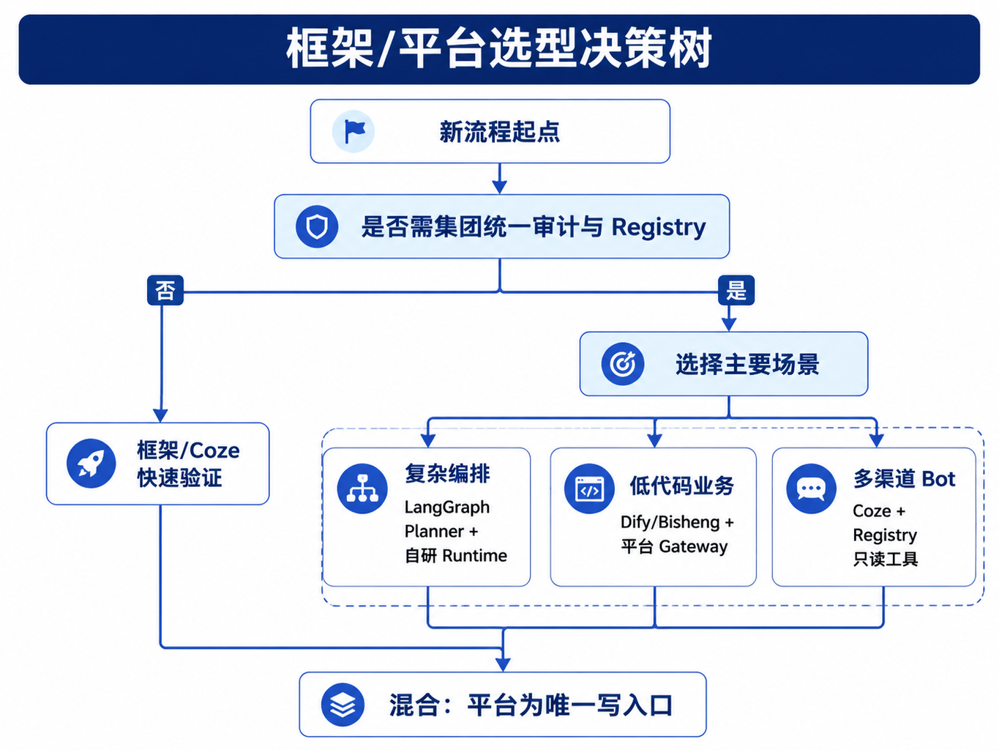

# 第31章 框架横向对标

---

前面几章已经用 `mini-platform` 自底向上搭建了 Runtime、Tool Registry、MCP 适配、多 Agent Handoff 和 HITL。企业里的业务团队往往同时使用多套工具：用 Dify 搭知识库问答，用 Coze 发布活动 Bot，或在 notebook 里用 LangGraph 做 SQL 分析实验。技术委员会此时要判断的是每个工具承担哪一层责任，而非“哪个工具最强”。已有 Dify 时，企业仍要确认 Runtime 由谁负责；LangGraph 做了 Planner 图，也要确认 Run 六态由谁兜底；Coze Bot 面向用户入口，还要确认企业数据库和写操作是否经过统一治理。只看功能清单，这些产品都能“跑 Agent”；进入生产治理后，它们覆盖的层次并不相同。

这里采用一个判断标准：框架和应用平台可以提高试验和交付速度，但生产写操作、工具版本、审批、审计和多租户边界必须回到企业平台。框架如果能接入统一 Runtime、Registry、Policy 和 Trace，就是加速器；如果只能在自己的运行时里闭环，就会变成新的生产孤岛。这个判断并不否定现成工具。企业如果完全从零写 Planner、Console、Bot 渠道和知识库，很容易拖慢业务试点。真正要避免的是层次错位：用低代码平台承担集团级审计，用 notebook 工具定义生产权限，用 Bot 插件直连核心数据库。这些做法在试点阶段看起来省事，进入生产后会把风险集中到最难排查的位置。

框架选型最容易被功能清单带偏。LangGraph 能画状态图，AutoGen 能组织多 Agent 对话，CrewAI 能把角色和任务写得很直观，Dify 和 Coze 能让业务团队快速搭出应用。技术评审如果只比较节点类型、插件数量和界面体验，很快会得出“每个产品都能做”的结论。真正的差异在生产责任：谁拥有工具权限，谁保存 Run 状态，谁处理审批超时，谁导出审计包，谁在事故后能回放一次任务。

企业通常不会只选一种路线。数据团队可能继续用 LangGraph 做复杂分析流，业务运营可能用低代码平台做活动助手，平台团队维护统一 Runtime 和 Registry，安全团队接管策略和审计。这种混合不是问题，问题是边界没有写清楚。一个框架可以作为 Planner 实现，一个低代码平台可以作为入口，一个供应商 Bot 可以作为渠道；但写操作、数据权限、审批和 Trace 必须回到企业底座。本章的目标，是给读者一套选型时可执行的问法。先问这个工具处在哪一层，再问它能否接入企业 Runtime；先问工具调用是否能强制走 Registry，再问界面是否好用；先问日志是否能回到 Trace，再问它是否支持更多 Agent 模式。只有层次清楚，框架才会成为加速器，而不会成为第二套平台。

---

## 31.1 框架、平台与应用的职责分层

### 31.1.1 框架、平台和应用

框架是嵌入业务代码的开发库，例如 LangGraph 的图、AutoGen 的多 Agent 对话、CrewAI 的角色和任务。平台是企业统一的运行和治理层，例如 `/run`、Run 六态、Tool Registry、Policy、HITL、Trace 和 Console。应用是面向岗位或业务流程的 Agent，例如 DataAgent、客服助手、经营分析 Workflow Agent。

*表31-1：框架、平台、应用三层的职责。来源：本书整理。*

| 层次 | 解决什么问题 | 典型产物 | 主要维护方 |
|---|---|---|---|
| 框架 | 怎样组织 Planner、工具、角色和多 Agent 流程 | LangGraph graph、CrewAI crew、AutoGen chat | 应用或数据团队 |
| 平台 | 怎样统一运行、治理、审计和恢复 | `/run`、Registry、Policy、Trace、Console | 平台团队 |
| 应用 | 怎样服务具体岗位和流程 | DataAgent、客服 Agent、报告 Agent | 业务线与平台团队 |

这三层可以共存，但职责不能互相偷换。框架可以作为 Planner 的实现，低代码平台可以作为业务入口或运营台；凡是会改变业务状态的动作，都要经过企业 Runtime 和 Registry。

### 31.1.2 进入生产环境的约束

生产写操作必须经过平台 Policy 和 Registry。无论 Planner 来自 LangGraph、CrewAI 还是自研代码，发送邮件、写工单、执行 SQL、修改主数据这类动作都不能散落在框架内部。框架状态也不能替代 Run 六态。LangGraph 的节点、Dify 的 Workflow 实例、Coze 的 Bot 会话可以映射到 `run_id`；对外 SLA、审批、检查点和审计仍以 Run 为准。低代码应用平台如果作为生产入口，就要接入企业 Gateway、Registry 和 Trace。否则，企业会同时维护多套权限、多套日志、多套工具连接和多套回滚方式。

### 31.1.3 低代码平台之外的运行责任

买了 Dify 并不等于有第22章的 Runtime。Dify 有自己的运行时和 Workflow，但它是否符合企业的多租户、IAM、审批、审计和工具版本要求，需要逐项验证。LangGraph 也不能让团队跳过 Tool Registry。开发环境里直接定义 `tools=[]` 没有问题；生产环境必须把工具登记为版本化资产，统一鉴权、审计和灰度。每个业务线自由选择一个框架，并不等于技术多样性。框架可以多样，平台接口必须统一。否则，业务越多，治理成本越高。

评审框架时，先别看功能宣传，而要追问三个问题：它是否能被包进企业 `/run`；工具调用是否能强制走 Registry；状态和日志是否能进入 Trace 和 Export Bundle。把这三个问题说清楚，再讨论开发体验和生态插件才有意义。若答案含糊，说明该框架还停留在实验层或应用层，暂时不应承担平台级运行责任。这个判断也能保护业务团队。业务团队可以继续使用熟悉的工具做原型，不必等平台所有能力都完美；平台团队则通过统一接口逐步接管高风险部分。成熟的混合架构会把低风险创新留在框架里，把生产责任收回平台内核；框架治理不应被处理成一次性替换。

对标框架时，还要看组织能力。自研平台需要长期维护 Runtime、Registry、Console、评估、权限和部署；采购或采用开源框架可以加快起步，但要接受它的运行模型、扩展边界和升级节奏。团队如果没有足够平台工程能力，盲目自研会拖慢业务；团队如果有强治理要求，却把生产权限交给低代码应用，也会在规模化后付出代价。选型结论应来自组织能力和风险约束，而非偏好。

混合架构通常分三步落地。第一步，让业务团队保留现有框架做低风险场景，同时把工具调用接入企业 Registry；第二步，把高风险动作、审批、Trace 和 Export Bundle 收回统一 Runtime；第三步，再逐步统一 Console、评估和运营报表。这个顺序比“一次性替换所有工具”更现实，也能让业务线在迁移中保持产出。供应商产品也需要验收标准。它是否支持企业 IAM，是否能导出完整执行日志，是否能禁用内置工具直连，是否支持私有化或数据不出域，是否能映射到企业审批流程，是否允许平台侧接入自定义评估。产品演示里通常看不到这些问题，合同和试点阶段必须逐项验证。框架对标的输出不应是一张排名表，而应是一张责任地图。哪些能力留在框架，哪些进入平台，哪些由供应商承担，哪些由内部团队补齐。责任地图越清楚，后续引入新框架、新业务应用或新供应商时越容易复用判断。

责任地图还要随着阶段变化更新。试点阶段，框架可以承担更多运行细节，因为风险范围小、用户少、数据可控；生产阶段，工具权限、审批、审计和 SLO 要逐步迁回企业平台；规模化阶段，接入、评估、成本和合规也要统一运营。若团队把试点阶段的责任划分固化下来，平台会在第二、第三个场景开始失控。技术委员会评审时，可以要求每个方案给出“失败后谁处理”。LangGraph 子图执行失败，谁能恢复 Run；Dify 工作流调用了外部 API，谁能导出审计；Coze Bot 命中敏感字段，谁能拦截和复盘；内部 Runtime 调度异常，谁承担 SLO。这个问题比“支持多少节点”更能暴露架构边界。

框架采用也要保留退出路径。某个低代码平台适合当前业务入口，但未来可能因为数据边界、成本、私有化或审计要求被替换。只要工具、状态、日志和产物都能映射到企业平台，退出成本就可控；如果核心业务逻辑和权限都锁在单一产品里，迁移会变成重新建设。选型时把退出路径写清，是对未来平台演进负责。

---

## 31.2 开源框架的使用边界

### 31.2.1 LangGraph

LangGraph 的核心是有向图、状态对象和 checkpointer。它适合表达复杂分支、循环、反思和人工中断。DataAgent 的 Planner 可以用 LangGraph 定义“选表、生成 SQL、执行、反思、修正”的子图；子图内部状态丰富，但对外仍应折叠成 Runtime 的 `planning`、`executing`、`waiting_human`、`succeeded` 或 `failed`。推荐用法是把 LangGraph 放在 Planner 层，不让它成为独立生产入口。`thread_id` 映射 `run_id`，图节点工具调用转到企业 Registry，`interrupt()` 映射到 `waiting_human`。这样团队保留 LangGraph 的表达力，同时保住企业平台的工具治理和审计边界。这种嵌入方式也降低了替换成本。Planner 图随着任务演进反复调整，外层 Runtime 的事件、错误码、审批和检查点保持不变。业务团队看到的是同一个 Agent 应用，平台团队看到的是同一条运行链路，框架变化不会直接影响审计和 SLO。
```python
# 概念示例：LangGraph 作为 Planner 插件，非独立 Run
def next_step(ctx: PlannerContext) -> PlannerOutput:
    graph = build_sql_graph(registry=ctx.registry)
    thread_id = ctx.run_id
    for event in graph.stream(ctx.input, config={"thread_id": thread_id}):
        emit_to_runtime_sse(event)  # 折叠为 state / action / result
    return graph.get_final_output()
```

### 31.2.2 AutoGen

AutoGen 强在多 Agent 对话、代码执行和研究探索。它适合 Lab 阶段快速验证多个角色如何协作，也适合原型阶段试验 GroupChat 或 Swarm 风格的任务分解。但生产里，自由群聊会带来 token 成本、工具调用边界和审计难题。生产落地时，应把 AutoGen 实验收敛成显式 Handoff 契约。Agent 之间不应无限聊天，而应通过第28章的 Handoff Tool 交接任务、输入 schema 和返回结果。多 Agent 的原型结论可以保留，自由对话不能直接进入生产 Runtime。例如实验阶段可以让“分析师 Agent”和“报告 Agent”在 AutoGen 中自由讨论，观察它们怎样拆解问题。进入生产时，则应把这种讨论结果沉淀为两个明确步骤：DataAgent 返回结构化指标和证据，Report Agent 根据这些输入生成草稿。中间是否需要人审，由 Runtime 和 Policy 决定。

### 31.2.3 CrewAI

CrewAI 的 Role / Task / Crew 抽象适合表达岗位分工，和第28章多 Agent 的叙事比较接近。业务团队容易用它描述“数据分析师、报告撰写者、复核者”这类角色链。它更适合作为角色配置或 Planner 组织方式，不适合替代企业 Runtime。Crew 的角色、目标和工具白名单可以导出为平台 AgentSpec；执行时仍由 RunLoop 管状态、Registry 管工具、Policy 管审批。这种用法让业务人员仍能用角色语言描述流程，工程侧则避免引入第二套运行时。角色配置是业务资产，RunLoop 是平台资产；两者分开后，角色变化不会破坏状态机和工具审计。

---

## 31.3 应用平台的使用边界

### 31.3.1 Dify

Dify 适合快速搭建 Workflow、RAG、知识问答和内部应用。它的优势在可视化编排、自托管和插件生态。企业可以把 Dify 用作早期实验环境或某些业务入口：业务团队先搭 Workflow，成熟后把核心能力迁移到平台 `agent_id`，或者让 Dify 节点调用企业 `POST /agents/{id}/run`。这里的边界是 Dify 节点不能绕开企业数据和工具治理。市场部 Workflow 需要真实库存时，应调用 Registry 暴露的只读 API，不要在 Dify 插件里直连数据库。发布类动作应走第30章的 `waiting_human`，仅靠 UI 人工节点无法承担生产审批责任。

### 31.3.2 Coze

Coze 适合快速发布营销、客服和轻量 Bot，尤其适合多渠道触达。它的风险在于数据驻留、插件权限和内部系统连接。Coze 插件可以作为企业 Registry 的 HTTP facade，携带 `tenant_id`、`user_id` 和 scope，由平台判断是否放行。对于边缘 Bot，推荐只开放只读或低风险工具。敏感写操作、主数据修改、批量外发和含个人信息的查询应回到企业 Runtime 和 HITL。这并不影响 Coze 的价值。它适合承担触达和交互入口，例如活动咨询、门店问答、轻量客服。只要插件边界清楚，业务团队可以用 Coze 快速验证用户入口，而不必让它承担企业核心运行时职责。边缘 Bot 的成功标准也应和平台一致：用户身份能传回平台，工具调用能追踪到 Registry，重要动作能进入审批，日志能和企业 Trace 合并。只有合并到平台链路，试点才有机会走向长期运营；做不到这些，就应限定在低风险场景。

### 31.3.3 Bisheng

Bisheng 偏企业和政企部署，常用于知识库、流程编排和国产模型组合。它可以作为知识管控、流程 UI 或本地化部署基座，但仍要评估是否能对齐企业 `run_id`、Trace、Policy 和 Export Bundle。在政企场景里，一个可行做法是：Bisheng 管知识库和部分流程审批 UI，执行节点通过 HTTP 调企业 Workflow Agent Run；Bisheng 实例 ID 与 `run_id` 建映射，写入 Observability，便于统一搜索和回放。

---

## 31.4 能力矩阵与选型

能力矩阵不应变成产品打分表。它的作用是帮助团队看清哪些能力属于框架强项，哪些属于平台底座。

*表31-2：mini-platform 与主流框架/平台的能力对照。来源：本书整理。*

| 能力 | mini-platform | LangGraph | AutoGen | CrewAI | Dify | Coze | Bisheng |
|---|---|---|---|---|---|---|---|
| Run 六态 + SSE | 强 | 可包装 | 弱 | 弱 | 可集成 | 弱 | 可集成 |
| Tool Registry + 版本 | 强 | 需适配 | 需适配 | 需适配 | 可集成 | 可集成 | 可集成 |
| MCP / A2A 适配 | 强 | 部分 | 部分 | 弱 | 部分 | 部分 | 部分 |
| 多 Agent Handoff | 强 | 可表达 | 可表达 | 强 | 可表达 | 可表达 | 可表达 |
| HITL `waiting_human` | 强 | 可映射 | 可映射 | 可扩展 | 可集成 | 弱 | 可集成 |
| 引擎/业务双检查点 | 强 | 部分 | 弱 | 弱 | 弱 | 弱 | 部分 |
| Policy / 租户隔离 | 强 | 弱 | 弱 | 弱 | 可集成 | 可集成 | 可集成 |
| Trace / 合规回放 | 强 | 需集成 | 需集成 | 弱 | 可集成 | 弱 | 可集成 |
| 低代码 Console | 弱 | 弱 | 弱 | 弱 | 强 | 强 | 强 |
| 快速 Bot 上线 | 弱 | 弱 | 部分 | 部分 | 强 | 强 | 部分 |

这张矩阵的结论很清楚：框架强在 Planner 和原型，低代码平台强在入口和运营，企业平台强在治理和运行契约。没有哪一类工具天然覆盖全部能力。图 31-1 可以这样读：只读、低风险、上线压力大的任务，可以先用 Dify 或 Coze；要写企业系统、涉及审批和审计的任务，必须走统一 Runtime；已经有 LangGraph 原型的团队，应把它收编为 Planner，而非另起一套生产运行时。



*图31-1：框架/平台选型决策树。来源：本书自绘。Alt text：决策树从团队工程能力、治理与多租户要求、上线时间压力等问题分支，引向自研、采购或混合三条路线。*

还要把团队能力放进判断。强平台团队可以自研内核并接入多个框架；强业务运营但弱工程团队可以先用低代码平台做只读场景；强数据科学团队可以先用 LangGraph 做 Planner 原型，再由平台团队收编工具和运行契约。选型不应写成产品排名，而应落到组织约束下的工程组合。

---

## 31.5 自研、采购与混合

### 31.5.1 适合自研的能力范围

自研适合平台内核：统一 `/run`、Run 六态、Tool Registry、MCP/A2A 适配、Policy、HITL、Trace、Export Bundle 和与 ERP、语义层的深度集成。这些能力直接影响合规、SLA、审计和成本，通常不适合让每个业务团队或每个低代码平台各做一套。自研的代价也很明确：需要平台团队、SRE、测试体系和持续维护。选择自研不能停留在“看起来更可控”，它应来自明确的生产边界需求，尤其是单个业务应用无法兜住的权限、审计、恢复和合规要求。

### 31.5.2 适合采购的场景边界

采购或托管适合快速入口和标准场景：营销 Bot、活动页、标准 RAG 知识问答、非核心只读助手、运营台和部分流程 UI。这些场景关注上线速度和业务配置能力，使用 Dify、Coze 或 Bisheng 可以减少重复造轮子。采购时要问清楚数据驻留、IAM、日志导出、工具权限、审批集成、模型路由和 SLA。产品功能丰富不等于可以进入生产核心链路。采购失败通常源于定位错误，而不一定是产品不可用。低代码平台适合做实验入口；如果把它当成集团唯一运行时，却没有统一工具权限和审计导出，后续每个接口都会变成例外。采购合同里也要写清数据归属、日志导出、插件审批、SLA 和退出机制，否则试点成功后迁回统一平台会更困难。

### 31.5.3 混合路线中的主从关系

多数企业最终会走混合路线：平台内核自研或深度定制；Planner 嵌入 LangGraph 或 CrewAI；Console 自研、采购或集成低代码 UI；边缘 Bot 用 Coze 发布，但写操作回平台；实验阶段用 AutoGen，成熟后迁移到 `agent_id`。混合路线要先定主从关系。低代码平台可以是流量入口，但不能拥有另一套生产工具权限。框架可以负责 Planner 图，但不能拥有不可审计的工具执行链。所有改变业务状态的动作，最终都要落到企业 Runtime 和 Registry。

一个典型混合拓扑是：Coze Bot 或 Dify Workflow 接收用户请求，经 API Gateway 调用企业 Runtime；Runtime 调 Planner，Planner 可以使用 LangGraph；需要工具时统一走 Registry；需要审批时进入 `waiting_human`；最终 Trace 和 Export Bundle 回到企业观测和合规系统。这样每一层都发挥优势，也不会把责任边界打散。混合架构落地时，顺序也很重要。先统一工具入口，再统一运行事件，然后统一 Console 和运营体验。工具入口最靠近风险，必须先收口；运行事件决定能否追踪和恢复，可以第二步做；Console 体验可以逐步整合，不应为了统一 UI 而推迟工具治理。

---

## 31.6 迁移路径与采购问题

### 31.6.1 三步收编

已有框架或低代码平台不必推倒重来，可以按风险顺序逐步收编。先把框架内部工具调用改成调用 Registry HTTP API，让工具定义、版本、权限和审计先统一起来。随后把框架或低代码运行事件折叠成 Run 六态和 `state` / `action` / `result` 事件。最后再把写操作、HITL、Export Bundle 和高风险审批迁回企业 Runtime。这个顺序能先解决最危险的问题：工具绕开治理。运行时和 Console 可以逐步统一，但工具和权限不应拖到后面。

### 31.6.2 采购评估的核心问题

采购 Dify、Coze、Bisheng 或评估内部平台时，可以直接围绕 Part V 能力提问：

- 是否支持稳定 `run_id`，并能导出 Run 级日志？
- 工具调用能否强制走企业 Central Registry？
- MCP Server 或插件工具是否有版本登记？
- 人工审批是引擎级挂起，还是 UI 上的假按钮？
- 检查点能否恢复 Planner 完整上下文？
- Trace 能否导出合规回放包？
- 低代码 Workflow 写 ERP 时是否强制经过 Policy？

这些问题比“支持多少节点”“有没有内置知识库”更关键。节点和知识库决定搭建速度，运行契约决定能否进生产。内部自研平台也要回答同样的问题。自研不自动等于可治理；如果没有稳定 `run_id`、没有工具版本、没有审批检查点、没有导出包，它和一个未受控框架没有实质区别。选型评审应把供应商产品和内部平台放到同一张能力表里看，不能默认自研天然合格。

### 31.6.3 与 mini-platform 基准链路的关系

`projects/multi-agent-workflow/` 已经覆盖第22章至第30章的主链路：同一 `run_id` 内，从 RunLoop、Registry、Planner、Handoff 到 `waiting_human` 和 approve/resume。评估框架时，可以把这条链路当成接入基准：外部框架能否进入同一个 Run、同一个 Registry、同一个审批和同一个检查点。LangGraph 可以替换 Planner 实现；CrewAI 可以贡献角色配置；Dify 可以调用企业 `/run`；Coze 可以作为边缘 Bot 入口。但 `core/runtime` 和 `core/registry` 仍是平台内核，不能被这些框架直接替代。如果一个外部框架无法接入这个基准链路，至少要说明缺口由谁补。是由平台适配层补事件映射，还是由供应商提供日志导出，还是由业务放弃该场景的生产上线。缺口不一定意味着不能用，但必须在试点前写清楚。本章采用的核心标准是：不要问“哪个框架最好”，要问“它在企业 Agent 平台里承担哪一层责任”。责任边界清楚，框架越多越能加速；责任边界不清楚，框架越多越难治理。在早期落地中，可以先选一个只读场景和一个写操作场景做对照。只读场景验证框架接入速度，写操作场景验证 Registry、Policy、HITL 和 Trace 是否能收口。两个场景都跑通，混合架构才算成立；这个标准比单纯比较产品功能更可靠。

---

## 31.7 框架选型后的治理接管

框架选型结束后，真正困难的是治理接管。很多团队在原型阶段用 LangGraph、Dify 或 Coze 很快做出 demo，上线时才发现工具权限、日志导出、审批挂起和成本分摊没有统一口径。平台团队不能要求业务团队完全放弃这些工具，但必须规定哪些能力可以留在框架里，哪些能力要迁回企业底座。最先接管的是工具执行。只要工具会访问企业数据、触发写操作或产生对外通知，就应经过统一 Registry 和 Policy。框架可以保留 Planner 图、节点编排和 UI 入口，但工具调用必须落到企业审计链路里。第二步接管运行事件，把框架内部状态映射为 Run 六态、Tool Call 和 Handoff 事件。第三步再整合 Console、发布流程和运营看板。

采购评估也要围绕退出机制展开。产品试点成功后，数据、日志、prompt、插件配置、评测样本和用户反馈能否导出，决定了企业是否被锁定在单一平台里。合同里应写清数据驻留、日志保留、插件审批、SLA、私有化能力和迁移接口。否则试点越成功，后续统一平台越困难。混合路线要保留一个主运行时。低代码平台可以做入口，开源框架可以做 Planner，商业 Copilot 可以嵌入业务系统，但改变业务状态的动作必须回到企业 Runtime。只要出现两个都能独立执行工具、独立审批、独立审计的运行时，平台治理就会分裂。第22章到第30章定义的能力，正是为了避免这种分裂。

## 31.8 采购、自研与混合路线的迁移策略

框架选型不是一次性决策。企业通常会从低风险场景开始，用开源框架或商业平台快速做出试点；当试点进入生产，身份、权限、审计、成本、SLO 和工具治理会逐渐压到平台层。此时如果没有迁移策略，团队要么被早期框架绑定，要么推倒重来。更稳妥的做法是在试点阶段就约定哪些能力可以替换，哪些状态必须沉淀到企业自己的控制面。迁移策略可以先抓住三个接口。第一是 Agent 定义接口，包括角色、工具、Prompt、策略和模型配置。第二是运行记录接口，包括 Run、Step、Tool Call、Trace 和 Artifact。第三是治理接口，包括权限、审批、评测、发布和回滚。只要这三类信息能从外部框架导出或映射到平台内部对象，后续从采购平台迁到自研 Runtime，或者从单一框架迁到混合架构，就不会完全断链。混合路线也需要主从关系。企业可以同时使用 LangGraph、Dify、MCP Server 和内部 Runtime，但不能让每个系统各自维护身份、工具、日志和审批。平台应当明确哪一层是最终事实来源：工具目录归 Tool Registry，运行账本归 Runtime，评测样本归 Eval，权限归企业 IAM 或数据权限系统。其他框架可以作为执行器或开发体验层接入，但不能反过来吞掉治理责任。

## 31.9 框架选型的组织约束

技术能力相近时，组织约束往往决定选型结果。一个小团队如果没有平台工程能力，强行自研 Runtime 会拖慢业务试点；一个大型企业如果已经有复杂权限和审计要求，完全依赖低代码平台又可能无法进入核心流程。选型时要看团队能长期维护什么，而非看 Demo 中哪个框架更快。组织约束包括开发者结构、运维职责、数据治理成熟度和采购流程。业务团队主导的试点更适合低代码平台，但需要平台团队提前给出安全边界；平台团队主导的共享能力更适合沉淀 Registry、Runtime 和 Eval，但要给业务团队保留快速迭代入口。若企业内部已经有统一网关、IAM、数据目录和可观测平台，Agent 框架应优先适配这些基础设施，而非另起一套孤立系统。因此，本章要求读者把框架放回平台工程里评估。框架可以加速开发，但不能替代企业对运行责任的接管。只要这个原则清楚，采购、自研和混合路线就可以按阶段组合，而非变成路线之争。

## 31.10 框架引入后的退出机制

框架引入时通常讨论上手速度，很少讨论退出机制。企业平台需要提前回答：如果框架停止维护、商业条款变化、性能达不到要求，或者安全审计不通过，已有 Agent、工具、Trace 和评测样本能否迁出。没有退出机制，早期试点越成功，后续迁移越困难。退出机制不要求一开始就完全抽象所有能力，但要保留核心资产。Prompt、工具定义、评测样本、运行日志、用户反馈和业务流程图，应尽量存放在企业可控仓库或平台中，而非只存在某个框架的私有配置里。对于无法导出的能力，要在选型时明确风险，并限制它进入核心流程。框架章节因此要提醒读者：采用框架不是问题，放弃治理主权才是问题。只要核心资产可迁移，企业就能在不同阶段组合开源、商业和自研能力；如果核心资产被锁住，平台路线会被早期工具选择牵着走。

退出机制也会反过来影响采购谈判。企业应要求供应商说明数据导出、日志导出、工具定义导出、模型配置导出和账号权限迁移方式。无法导出的部分要明确为风险，并限制在非核心流程中使用。这样采购决策才不会只看功能列表和价格，而能反映长期平台成本。框架选型还要看内部学习成本。一个框架功能强但调试困难、运行记录不透明，可能适合研究团队，却不适合多业务线长期维护。平台团队应把文档、社区、可观测能力和二次开发边界纳入评估。最终选型要留下复盘材料。半年后如果要调整路线，团队需要知道当初为什么选它、哪些假设成立、哪些假设失效。没有复盘材料，框架替换会变成观点争论。

复盘材料应包含试点场景、上线范围、依赖能力、未满足需求和迁移约束，并作为后续平台演进的决策输入，而不是只做采购归档。框架复盘还应记录团队真实使用感受。调试是否顺畅、文档是否可靠、线上问题是否能定位、供应商响应是否及时，都会影响长期维护成本。这些信息往往比功能矩阵更能说明框架是否适合继续扩大使用。当复盘材料持续积累，框架路线就能从一次采购选择，转成可调整的平台策略。

落地时，平台团队可以先选择两个参照场景。一个是只读知识问答，用来验证框架接入速度和业务自助能力；另一个是带写操作或导出的高风险场景，用来验证 Registry、Policy、HITL、Trace 和审计是否能收口。两个场景都跑通，才说明混合架构真正成立。只用低风险场景验收框架，容易高估产品能力。框架对标也要定期复盘。外部产品会升级，内部平台会成熟，业务团队的能力也会变化。去年适合放在低代码平台里的能力，今年可能应该沉淀到统一 Runtime；去年必须自研的能力，今年可能已有可靠托管方案。选型应纳入平台路线图，不能停留在一次性结论。

框架治理还要处理版本漂移。业务团队升级 LangGraph、Dify 插件或 Coze Bot 配置后，平台侧的 ToolSpec、审批策略和 Trace 字段可能没有同步更新。比较稳的方式是把框架版本、应用版本和平台适配器版本一起写入 Run。出问题时，团队能知道是框架升级改变了行为，还是平台策略变了。平台团队也要给业务团队留出试验空间。所有新想法都要求先进入统一 Runtime，会拖慢创新；所有试验都绕过平台，又会积累风险。可以设定清晰分界：只读、低风险、少量用户的原型允许在框架内快速试；接入生产数据、写操作、外部用户或高价值流程时，必须进入平台治理。最终，框架选型应服务交付节奏和治理边界。业务需要快，平台需要稳，两者不是对立关系。边界写清后，框架负责加速表达，平台负责接管责任。

这类责任地图还可以作为采购材料。供应商承诺的能力、企业自己补齐的适配层、仍然存在的风险，都写进同一张表，后续合同、试点和验收才不会各说各话。这份材料也能帮助业务团队理解取舍：为什么某些能力可以继续快速试验，为什么另一些能力进入生产前必须迁回平台。框架使用越多，平台接口越要稳定。只有统一入口稳定，业务团队才敢在上层持续试验。后续迁移、采购和自研决策，也会围绕这个统一入口展开，而非围绕单个工具的短期体验。
这也是框架章节最终要落到平台责任的原因。

## 31.11 框架治理账本与阶段性复审

框架引入后，平台需要一份治理账本。账本记录每个框架或低代码平台承担的责任层：入口、Planner、工具执行、知识库、Console、审批、Trace、评测或导出。它还要记录 owner、版本、接入方式、数据边界、工具边界、日志导出能力、退出条件和复审时间。没有这份账本，企业很容易在半年后发现同一类能力分散在多个产品里：某个团队用 Dify 调工具，另一个团队用 LangGraph 做运行时，第三个团队在 Coze 里维护独立知识库，平台却没有统一运行证据。

阶段性复审要关注三件事。第一，早期假设是否仍然成立。低代码平台如果已经接入生产数据和写操作，就不能继续按试点边界管理；自研 Runtime 如果长期缺少业务使用，也要检查是否建设过度。第二，核心资产是否可迁移。Prompt、工具定义、评测样本、运行日志、用户反馈和审批记录应能导出或映射到平台对象。第三，平台接口是否足够稳定。业务团队愿意在上层试验，前提是下层 `/run`、Registry、Policy 和 Trace 不频繁变化。

复审材料要进入路线图。若某个框架在只读场景里表现很好，但写操作始终无法接入 Policy，它适合继续做入口，不适合进入核心流程；若某个自研能力在多个业务里重复使用，就应沉淀成平台模块；若某个供应商产品日志不透明，后续合同就要补导出和审计条款。框架治理的价值，在于让试验成功后有路可走，失败后能安全退出，同时保留业务试验空间。

早期治理账本可以很朴素：列出框架名称、使用场景、责任层、接入企业底座的接口、不能迁移的资产、当前风险和下次复审日期。只要它能让平台团队看清谁在承担运行责任，业务团队就不会把框架选型误解成一次性采购结论。

## 31.12 试点验收与生产转场

框架试点结束时，验收材料应分成两类。第一类证明业务价值：试点场景解决了什么任务，用户是否持续使用，节省了哪些人工步骤，哪些样本被用户退回，哪些产物进入下游流程。第二类证明生产可接管：工具是否进入 Registry，运行事件是否映射到 Run，日志是否可导出，权限是否沿用企业 IAM，审批是否有真实挂起，成本和 SLO 是否能按租户统计。前一类材料决定试点是否值得继续，后一类材料决定它能否进入生产。很多框架项目失败，原因往往不在 demo 价值本身，而在两个验收口径混在一起：业务看到效果，平台看不到接管证据。

生产转场要有明确闸口。只读、内部、小流量场景可以保留在框架内快速迭代；一旦接入生产数据、外部用户、写操作或高价值流程，就要切到企业底座的工具、状态、审计和发布机制。转场不一定意味着重写应用，可以先加适配层，把框架输出的事件、工具调用和产物登记到平台对象里。若适配成本过高，说明该框架更适合停留在入口或原型层。这个判断应写进复审材料，避免试点成功后被动承担无法治理的生产责任。

## 31.13 框架迁移的组织约束

Agent 框架选型进入生产后，迁移成本往往高于技术验证成本。一个团队从单体 SDK 迁到状态图，从自研 Runtime 接入外部框架，或者从供应商 Agent 迁入企业平台，都会牵动工具 schema、Memory、Trace、评测样本、前端事件和审批状态。若迁移计划只比较框架功能，容易低估组织和数据迁移。

迁移应先固定平台契约。模型调用走网关，工具通过 Registry，Run 状态进入 Trace，评测样本可重放，高风险动作由 HITL 承接。只要这些契约稳定，底层框架可以分阶段替换；若契约没有稳定，框架迁移会变成全链路重写。第一阶段可以把现有 Agent 接入统一观测和成本；第二阶段统一工具和权限；第三阶段再迁移 Planner、Memory 和 Runtime。每个阶段都要交付可见收益，而不是只完成技术栈替换。

组织上，框架迁移需要保留业务连续性。旧 Agent 不能因为新平台建设而突然失去支持，新框架也不能绕过已有审批和安全流程。平台团队要提供兼容适配层，业务团队提供代表任务和验收样本，SRE 确认回滚窗口，安全团队确认高风险动作没有扩大。框架选择最终服务于平台可运维性，而不是服务于某个开发体验偏好。

## 31.14 框架评估的运行样本

框架评估不能只看官方示例。生产评估需要一组运行样本：长任务恢复、工具失败、人工审批、Memory 读取、并发取消、跨端恢复、Trace 导出和成本记录。一个框架如果能快速搭出聊天 Demo，但无法清楚表达 Run 状态和恢复路径，就不适合直接承载企业 Agent 主链路。

运行样本要同时覆盖开发体验和运维责任。开发者关心状态图是否容易写、工具是否容易接、调试是否方便；SRE 关心失败是否可观测、版本是否可回滚、任务是否可中断；安全团队关心权限和审批是否可插入；业务团队关心异常时用户看到什么。框架评估如果只由开发团队完成，会漏掉后续生产责任。

早期可以保留混合路线。核心 Runtime 和治理契约由平台掌握，业务应用可以在局部使用外部框架或 SDK；只要它们遵守模型网关、Tool Registry、Trace、HITL 和 Eval 的接口，就能逐步纳入平台。这样框架选择不会变成一次性押注，也能降低迁移风险。

## 31.15 框架升级对平台契约的影响

Agent 框架升级不能只看功能列表。框架的消息模型、工具调用格式、状态存储、回调事件、错误类型和并发语义都可能变化，这些变化会影响平台契约。若平台已经把框架接入 Runtime、Trace、Eval、Tool Registry 和 Guardrails，升级就不再是单个依赖版本变化，而是一次运行链路变更。

升级前应准备兼容性样本。样本覆盖多轮对话、工具调用、长任务挂起、人工审批、工具失败、重试、取消和 artifact 生成。新框架版本在这些样本上的事件顺序、错误码、状态转换和 Trace 字段应与平台契约一致。若框架改变了内部状态结构，平台要决定是写适配层、冻结旧版本，还是迁移运行数据。直接升级会让旧 Run 无法回放，也会让事故复盘失去上下文。

早期平台可以把框架升级纳入发布门禁：先在影子环境跑样本，再接入低风险 Agent，最后扩大到核心链路。每次升级记录影响模块、迁移脚本、回滚目标和已知差异。这样框架能持续演进，平台契约也不会被外部项目节奏牵着走。

## 31.16 框架能力沉淀为平台资产

框架试点成功后，最容易被忽略的是资产沉淀。一个业务团队用外部框架跑通了 Agent，里面通常会产生 Prompt 模板、工具适配、样本数据、用户反馈、失败 Trace、权限规则和前端交互经验。若这些材料只停留在框架项目里，下一支团队会重新试错，平台也无法形成统一能力。试点结束时，应把可复用材料映射到平台对象：Prompt 进入模板库，工具进入 Registry，失败样本进入 Eval，运行日志进入 Trace，审批规则进入 HITL 和 Policy，前端事件进入统一交互协议。

沉淀过程也要区分可复用和不可复用。某些节点编排只适合特定业务，保留在应用层即可；某些工具契约、状态事件、评测样本和安全策略已经跨场景出现，就应进入平台底座。平台团队不需要把所有框架项目重写成统一实现，但要把反复出现的能力抽出来，减少下一次接入成本。业务团队也能因此受益：新场景可以复用成熟的工具、样本和审计链路，避免从空白项目开始。

资产沉淀还会影响采购判断。供应商或开源框架如果能把运行日志、工具定义、评测样本和 Prompt 版本导出到平台对象，迁移风险就低；如果所有资产都锁在私有控制台里，短期开发体验再好，长期也会形成治理负债。框架选型不能只比较开发效率，还要看试点成果能否沉淀成企业自己的平台资产。这个标准能帮助企业在快试验和长期治理之间保持清楚边界。

## 31.17 框架接入后的责任分工

框架进入企业平台后，责任分工要先写清楚。业务团队通常负责场景、用户流程和验收样本；平台团队负责 Runtime、Registry、Trace、Policy、HITL 和发布门禁；安全团队负责权限、数据出域和高风险动作；供应商或开源框架维护者负责框架自身能力和版本说明。若这些责任没有落到具体接口，项目一旦出问题，各方会把事故归因到“框架不好用”或“模型不稳定”，却很难修复真实缺口。

责任分工应围绕运行链路表达，而不是围绕组织名称表达。工具调用失败时，谁检查 ToolSpec，谁确认外部系统幂等，谁判断是否可以重试；长任务挂起时，谁定义超时，谁通知审批人，谁处理用户取消；框架升级时，谁提供兼容性样本，谁执行影子环境回放，谁批准进入生产。把这些问题写进接入文档，框架试点才不会停在演示层。

对采购场景来说，责任分工还影响合同和验收。若供应商只承诺画布可用，却无法导出运行日志、工具定义、评测样本和错误码，平台团队就要承担后续治理成本；若供应商提供开放接口但业务团队没有准备验收样本，系统仍然无法判断是否适合生产。框架选型应把这些约束前置，让技术评估、采购评估和安全评估使用同一套验收材料。

早期可以为每个框架接入项目建立一页责任矩阵。矩阵不需要很复杂，但要覆盖运行入口、工具注册、状态映射、Trace 字段、评测样本、权限审批、升级回滚和资产沉淀。这样第31章的框架比较会落到可执行接入流程，而不是停留在产品功能清单。企业采用框架的目标，是把试点能力纳入平台治理，而不是让每个业务团队拥有一套孤立运行语义。

## 31.18 框架升级的兼容治理

Agent 框架升级经常带来隐藏风险。一个小版本可能改变工具调用格式、Memory 默认行为、callback 事件、错误类型、重试策略或 streaming 输出。应用层看起来只是依赖版本变化，平台层却可能受到消息契约、Trace 字段、评测样本和安全策略的影响。企业平台不能把框架升级当成普通包升级处理。

兼容治理要先识别平台契约。升级前应列出 Runtime 事件、ToolSpec 映射、Memory 接口、HITL 状态、Trace 字段、错误码和前端消息模型是否受影响。若框架只用于实验场景，升级可以较快；若框架已经支撑生产 Agent，升级必须经过样本回放、影子运行和灰度。框架维护者发布的 changelog 有帮助，但不能替代本地业务样本，因为企业工具和权限策略通常有自己的边界。

早期可以为框架升级设置最小流程：锁定旧版本，建立升级分支，回放核心样本，比较 Trace，检查安全样本，确认回滚路径，再扩大流量。若升级带来新能力，也要先判断它是否应沉淀到平台契约中，而不是让某个应用直接使用。这样框架演进能服务平台能力建设，而不会让生产系统被外部框架节奏牵着走。

## 31.19 框架能力进入平台标准库

框架引入后，团队容易直接使用框架内置组件：Agent executor、Memory、tool wrapper、callback、eval helper。短期看这能加快试点，长期看会形成多套不兼容实现。平台要把经过验证的框架能力沉淀为标准库，而不是让每个应用直接依赖框架内部抽象。标准库负责稳定接口，框架只作为实现来源之一。

进入标准库需要门槛。组件要有清晰输入输出、错误语义、Trace 字段、权限边界、样本测试和版本策略。比如某个框架的 tool wrapper 很方便，但如果无法记录幂等键和补偿状态，就不能直接进入生产标准库；某个 Memory 模块能快速接入，但如果缺少删除和审计能力，就只能用于试点。标准库选择的是可治理能力，不是最丰富的 API。

早期可以建立“候选、试点、标准、退役”四个状态。候选来自框架能力，试点用于单场景验证，标准能力进入平台文档和模板，退役能力保留迁移说明。这样框架价值能被吸收进平台，而不会把平台锁死在某个外部框架的生命周期里。

## 31.20 框架能力迁移的退出条件

Agent 框架能力进入生产后，平台需要把标准接口、依赖版本、替换路径、样本覆盖、已知缺口、迁移成本和退役计划放进统一证据口径。证据口径会减少事后解释成本，让业务、平台、数据、安全和运营团队能够围绕同一组事实讨论问题。没有这些材料，故障发生后只能凭经验判断；有了这些材料，团队可以知道哪些输入有效、哪些动作已经执行、哪些产物可以继续使用、哪些结果需要撤回。

这类证据应和第22章 Runtime、第23章工具注册和第38章 Trace连起来。上游章节提供能力基础，下游章节使用运行结果，本章则负责说明中间环节如何被验证。若某个能力只在本章看起来完整，却无法进入 Trace、Eval、发布记录或合规证据包，生产系统仍然会出现断点。读者在实现时应把章节之间的接口看成工程契约，而不是阅读顺序上的相邻关系。

常见风险包括应用代码绑定框架内部类、升级时 Trace 字段变化、不同团队维护不同封装。这些问题通常不会在一次成功演示中暴露，因为演示样本往往干净、短小、路径明确。真实业务会带来旧数据、异常输入、权限变化、用户撤回、预算限制和长时间运行状态。平台如果没有把这些情况纳入样本和台账，后续扩展场景时就会重复遇到同类问题。

框架能力进入标准库时应同步定义退出条件，避免平台被某个外部生命周期锁住。执行记录至少要说明 owner、版本、样本、影响范围、处置动作和复查时间。记录不需要写成流程报告，但要足够让后来者理解当时的判断。对于高风险能力，还应说明哪些条件满足后才能扩大使用，哪些条件失败时必须降级或撤回。

落地时可以先选择少量代表场景建立这种习惯。实践上，应先把高频、高风险、外部可见的路径做扎实，再把样本、台账和复盘方式复制到其他能力中。这样做能让能力说明落到接入、验证、运营和退出，而不是停留在概念描述。

## 本章小结

框架、平台和应用需要分层看待。LangGraph 适合表达 Planner，AutoGen 适合实验协作，CrewAI 适合角色配置；Dify、Coze、Bisheng 等低代码产品更强在入口、Bot 渠道和知识管理。它们可以进入企业架构，但不应替代 Runtime、Registry、Policy、HITL 和 Trace。选型时，画布和节点体验只能说明开发便利性，不能证明系统具备生产治理能力。只要动作会改变业务状态，最终就应进入企业 Runtime 和 Registry，并接受统一的权限、审计、检查点和回滚约束。混合架构可以存在，底线是运行语义不能被不同框架分裂。

## 参考文献

NIST. (2023). *AI RMF 1.0*. [https://www.nist.gov/itl/ai-risk-management-framework](https://www.nist.gov/itl/ai-risk-management-framework)LangChain. (n.d.). *LangGraph*. [https://docs.langchain.com/oss/python/langgraph/overview](https://docs.langchain.com/oss/python/langgraph/overview)LangChain. (n.d.). *Persistence*. LangGraph. [https://docs.langchain.com/oss/python/langgraph/persistence](https://docs.langchain.com/oss/python/langgraph/persistence)Microsoft. (n.d.). *AutoGen*. [https://microsoft.github.io/autogen/](https://microsoft.github.io/autogen/)Wu, Q., et al. (2024). AutoGen. [https://arxiv.org/abs/2308.08155](https://arxiv.org/abs/2308.08155)CrewAI. (n.d.). *Documentation*. [https://docs.crewai.com/](https://docs.crewai.com/)Dify. (n.d.). *Documentation*. [https://docs.dify.ai/](https://docs.dify.ai/)Coze. (n.d.). *Coze 开放平台文档*. [https://www.coze.cn/docs](https://www.coze.cn/docs)Bisheng. (n.d.). *DataElem Bisheng*. [https://github.com/dataelement/bisheng](https://github.com/dataelement/bisheng)Model Context Protocol. (2024). *Specification*. [https://modelcontextprotocol.io/specification/2024-11-05](https://modelcontextprotocol.io/specification/2024-11-05)
