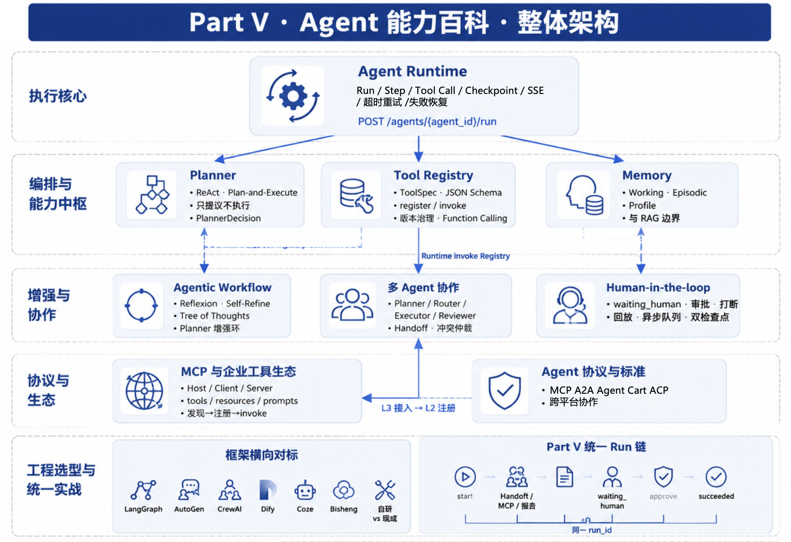

# Part V Agent 能力百科

## 本部分目标

Part V 进入 Agent 平台的运行能力层。这里讨论 Run 状态机、工具注册、MCP、Planner、增强循环、Memory、多 Agent、协议标准、HITL 和框架对标。统一实战项目位于 `mini-platform/projects/multi-agent-workflow/`，第22章至第30章围绕同一个 `run_id` 展开，让读者看到各能力怎样落到一条可审计的执行链路中。

## 本部分章节

| 章 | 主题 | 读完应能回答的问题 |
|---|---|---|
| [第22章 Agent Runtime](ch22-agent-runtime.md) | Run 六态、检查点、失败恢复 | 一个 Agent 任务怎样被创建、推进、暂停、恢复和审计 |
| [第23章 Tool Registry & Function Calling](ch23-tool-registry-function-calling.md) | 工具注册、Schema、版本治理 | 模型为什么不能直接调用任意函数，工具契约怎样进入生产 |
| [第24章 MCP 与企业工具生态](ch24-mcp.md) | MCP host/client/server 与企业接入 | MCP 怎样接入 Registry，而不是绕过平台治理 |
| [第25章 Planner 与编排模式](ch25-planner.md) | ReAct、Plan-and-Execute、状态机 | Planner 应怎样选择下一步动作，哪些编排方式适合生产 |
| [第26章 Agentic Workflow](ch26-agentic-workflow.md) | Reflexion、Self-Refine、ToT | 增强循环怎样受预算、状态和证据约束 |
| [第27章 Memory 系统](ch27-memory.md) | Working、episodic、profile、enterprise context | Memory 应保存什么，不应保存什么，怎样避免污染上下文 |
| [第28章 多 Agent 协作](ch28-agent.md) | Handoff、角色分工、冲突仲裁 | 什么时候需要拆成多个 Agent，怎样保证交接可审计 |
| [第29章 Agent 协议与标准](ch29-agent.md) | MCP、A2A、Agent Card、ACP | 外部 Agent 能力怎样进入平台准入、发现和审计流程 |
| [第30章 Human-in-the-loop 与长任务](ch30-human-in-the-loop.md) | 审批、打断、异步队列、检查点 | 长任务怎样等待人、恢复执行，并保留责任链 |
| [第31章 框架横向对标](ch31.md) | LangGraph、AutoGen、CrewAI、Dify、Coze、Bisheng | 框架、平台和应用各自解决什么问题，企业应怎样选型 |

## 阅读路径

建议先读第22章和第23章，理解 Runtime 与工具契约；再读第24章至第27章，补齐工具生态、规划和上下文能力；最后读第28章至第31章，处理多 Agent、人工介入、协议互通和框架选型。`tests/test_registry.py` 和 `tests/test_mcp_db.py` 可作为工具注册与 MCP 接入的最小验证入口。
