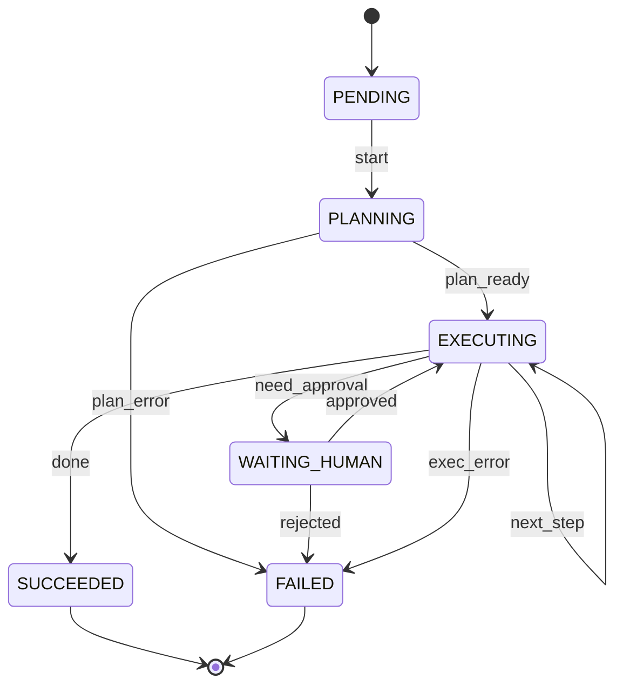
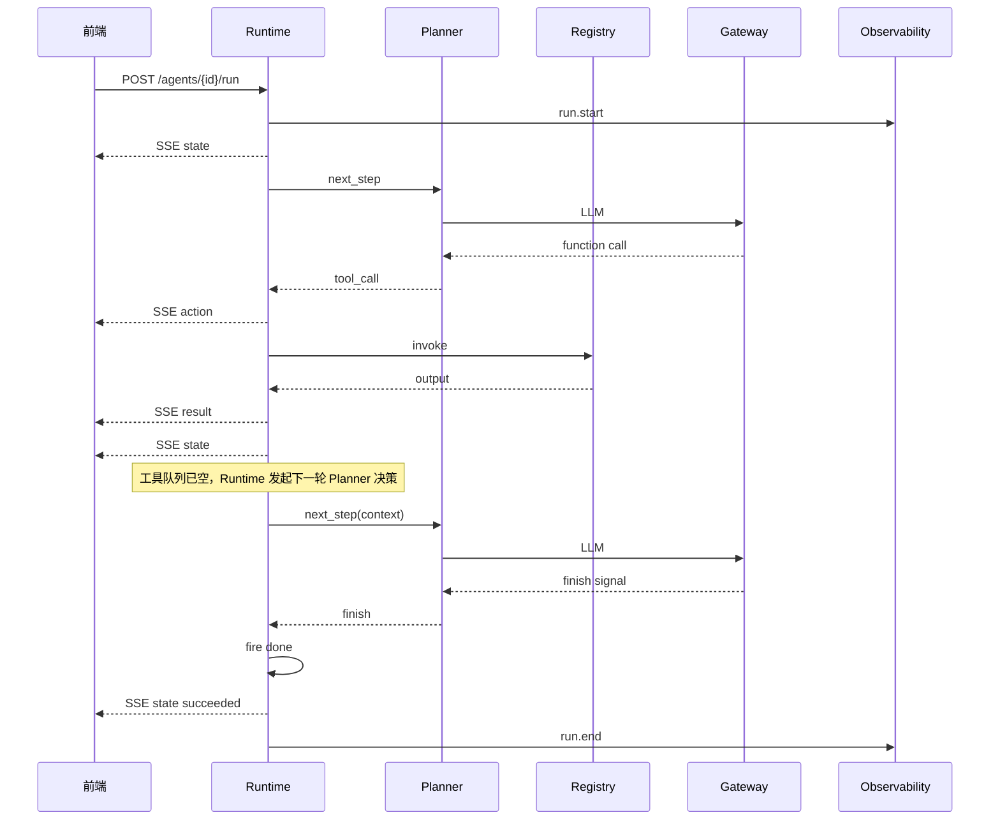

# Ch.22 Agent Runtime

> **本章目标**：读者学完能说明一次 `POST /agents/{agent_id}/run` 涉及的 **Run / Step / Tool Call** 模型、**Run 六态**何时迁移、检查点应持久化哪些字段，并能对照 `mini-platform` 跑通 Part V 实战项目 `projects/multi-agent-workflow/`。  
> **关键议题**：任务执行、状态机、检查点、失败恢复、超时重试  
> **前置阅读**：[Ch.01 §2.2–2.3](../part01-overview/ch01-agent.md)、[Ch.02 §2.2](../part01-overview/ch02-agent.md)、[Ch.04 §2.2](../part01-overview/ch04.md)  
> **估计阅读**：约 90 min（含实战项目）  
> **mini-platform 关联**：`core/runtime/`  
> **实战项目**：`projects/multi-agent-workflow/`（Part V 统一 Run 链；本章 Runtime 概念均在其中）  
> **按角色推荐阅读**：CTO / 平台负责人 ⇒ 章头 + §1–§2 + 本章小结 ｜ 架构师 ⇒ §1–§6 ｜ 工程师 ⇒ 全章 + 运行实战项目

Ch.01 用 **Run 六态**状态机和 `/run` 契约说明了 Agent **怎么跑**。但一次真实问数还会碰到一系列执行层问题：

用户刷新页面后，任务该从哪继续？工具调用失败后，是重试、等人审批，还是直接失败？SQL 还没返回，模型却先说「任务已完成」——平台该怎么判定终态？

若每个工程各自写循环、各自记日志、各自做重试，SLA、审计与恢复都会失控。**Agent Runtime** 的作用，是把一次任务变成可观察、可恢复、可审计的 **Run**：调度状态机、执行 Tool Call、推送 SSE 事件、写检查点，并统一处理超时、重试与取消。

业界将 LLM Agent 的构建概括为规划、记忆、工具使用等模块 [1]。本书把 Runtime 定位为连接这些模块的执行层：Planner（Ch.25）、Tool Registry（Ch.23）、LLM Gateway（Ch.45）围绕 Runtime 被调用，而不是彼此替代。

「山岚集团」运营总监通过 DataAgent 发起问数（Ch.04 时序图）：控制台只见 `planning` → `executing` 的进度。背后则是 Runtime 在维护 `run_id`、推进状态机、记录每次 Tool Call，并在进入 `waiting_human` 暂停或进程重启后从检查点继续。没有 Runtime，多步任务只能退化成无状态的聊天接口，既无法做 SLA，也无法在审计时完整还原执行过程。

从职责上看，Runtime 承担五类平台级能力，且不应下放到单个 Agent 应用里重复实现。下表概括每类能力及其平台化收益：


| 能力  | Runtime 做什么                   | 若不平台化会怎样               |
| --- | ----------------------------- | ---------------------- |
| 调度        | 驱动状态机、调用 Planner / Registry        | 每个 Agent 各写一套循环，行为不一致  |
| 可观测性      | 推送 SSE 事件、上报 Trace span、统计 Run 指标 | 前端与运维无法统一看板            |
| 持久化与恢复    | 保存检查点、支持取消与恢复                       | 长任务只能「重来」，成本与风险陡增      |
| 超时与重试控制   | 统一设置超时、重试上限与死循环熔断                  | 单 Agent 失控拖垮共享 Gateway |
| 上下文传递与审批集成 | 将 `context` 原样传递到工具、对接 Policy / HITL | 权限与审批漏洞                |


本章依次介绍运行时契约（§1）、状态机（§2）与执行循环（§3），检查点（§4）、失败与超时（§5–§6），并以实战项目收束（§7）。

---

### 上下文模型与 `/run` 运行时契约

**本节要回答的问题**：一次 `POST /agents/{agent_id}/run` 在 Runtime 内部对应哪些对象？HTTP 请求、SSE 事件与错误体应包含哪些字段？

Ch.01 给出了语言无关的 `/run` 轮廓。本节定义 Runtime 内部的 **三个一等对象**，并补齐请求、SSE 与错误体字段。关系是：**一次 Run 包含多轮 Step；每轮 Step 可产生零次或多次 Tool Call**。

#### 业务上为什么要三个对象

财务与供应链类 Agent 常在一次问数里连续调用 SQL、工单、邮件三个系统。若只记「会话 ID」，无法回答审计员「第 3 步是谁批准发邮件的」；若把每一步都当成新会话，又无法在人审挂起 48 小时后从同一任务继续。Run / Step / Tool Call 分层，是为了同时满足 **任务级 SLA**、**推理轮次可追溯**，并确保发邮件、写工单这类有副作用的操作不会因重试而重复执行。

#### Run

Run 是一次可审计任务的顶层容器；下表列出 Runtime 为其维护的核心字段：


| 字段                          | 说明                                             |
| --------------------------- | ---------------------------------------------- |
| `run_id`                    | 全局唯一；Trace、检查点、工单均引用                           |
| `agent_id`                  | 路径参数；Agent 配置与默认工具集                            |
| `input`                     | 用户任务描述                                         |
| `context`                   | `user_id`、`tenant_id`、`scope` 等，须原样传递到工具与 Policy |
| `state`                     | 当前六态之一（§2）                                     |
| `created_at` / `updated_at` | 超时与审计                                          |


一次 `POST /agents/{agent_id}/run` 对应 **一个 Run**。等人审批的长任务仍用同一 `run_id`，审批节点、报告生成完成、人工确认等业务里程碑可引用同一个 `run_id`（见 Ch.30），不新开聊天窗口。

#### Step

Step 表示 Planner 的一轮决策；下表说明其与 Run 状态迁移的区别：


| 字段               | 说明                                  |
| ---------------- | ----------------------------------- |
| `step_index`     | 从 0 递增；表示 **Planner 决策轮次**——在 `executing` 下工具队列已空、再次调用 Planner 之前加 1 |
| `planner_output` | 结构化决策摘要：终止信号或拟执行的工具调用（持久化字段，非模型原始 CoT 全文） |
| `state_at_entry` | 进入本 Step 时的 Run 状态                  |


Step 是 **推理轮次** 单位，不等于状态机的一次迁移：同一 `executing` 下可经历多轮 Step（迁移标签 `next_step` 使状态保持 `executing`），每轮可产生新的 Tool Call。

#### Tool Call

Tool Call 是 Runtime 实际执行的一次工具调用；Planner 只提议，不执行：


| 字段                 | 说明                                             |
| ------------------ | ---------------------------------------------- |
| `tool_call_id`     | 单次调用唯一 ID                                      |
| `tool` / `version` | Registry 解析（Ch.23）                             |
| `args`             | schema 校验后的参数                                  |
| `status`           | `pending` / `running` / `succeeded` / `failed` |
| `output` / `error` | 返回体或结构化错误                                      |


Tool Call 由 Runtime **执行**，Planner 只 **提议**。模型经 `tools` / `tool_choice` 产出调用意图 [2]；Runtime 负责鉴权、执行、Tool Call 记录与错误分类。

#### HTTP 请求

```
POST /agents/{agent_id}/run
Content-Type: application/json

{
  "input": "上周华东区销售下滑的主要 SKU 是什么？",
  "context": {
    "user_id": "u-ops-001",
    "tenant_id": "shanlan-retail",
    "scope": ["sales_region:华东"]
  },
  "options": {
    "idempotency_key": "optional-client-key",
    "max_steps": 20
  }
}
```

- `idempotency_key`（可选）：客户端重试时携带，避免重复副作用。
- `max_steps`：与 §5 死循环防护联动。

#### SSE 响应事件

Runtime 通过 SSE 向客户端推送结构化事件。核心三类事件覆盖 Run 进度与 Tool Call 审计；进入 HITL 时还会推送审批类事件（Ch.30 展开）：


| 事件 | 含义 | 典型 `data` 字段 |
| --- | --- | --- |
| `state` | Run 六态切换或终态 | `state`, `run_id`, `step_index`, `active_agent_id`, `answer` |
| `action` | 即将执行工具 | `tool_call_id`, `tool`, `version`, `args` |
| `result` | 工具结束 | `tool_call_id`, `status`, `output` 或 `error` |
| `approval_request` | 进入 `waiting_human` 时的待办（Ch.30） | `approval_id`, `title`, `artifact_ref`, `requested_actions` |

`action` 与 `result` 须成对出现，才能证明副作用是否发生；`approval_request` 只在 Runtime 触发 `need_approval` 迁移后推送，不代表 Run 已结束。


```
event: state
data: {"run_id":"run-8f3a","state":"planning","step_index":0}

event: action
data: {"run_id":"run-8f3a","tool_call_id":"tc-1","tool":"sql_executor","args":{"sql":"..."}}

event: result
data: {"run_id":"run-8f3a","tool_call_id":"tc-1","output":{"rows":[...]}}

event: state
data: {"run_id":"run-8f3a","state":"succeeded","answer":"华东区下滑 Top3 SKU 为 …"}

# 进入 waiting_human 时另见 event: approval_request（Ch.30）；
# 手动 approve 后另见 event: approval_result。完整序列见实战 Demo。
```

#### SSE 设计要点

**流式传输**：一次 Run 可能持续数秒到数分钟。响应须使用 `text/event-stream`，边执行边推送，禁止等全部完成后才返回 body。事件格式（`event:`、`data:`）及断线重连时的 `Last-Event-ID` 由 HTML Living Standard 定义 [3]。

若客户端断线后重连，应带上上次收到的 `Last-Event-ID`。服务端从事件日志或检查点继续推送客户端尚未收到的事件，而不是重新发起一次会产生副作用的 `/run`（详见 §7 常见问题 4）。

**可观察性与分布式 Trace**：除 SSE 外，Runtime 还要把运行过程写入 Trace 系统（Ch.38）。一次问数往往会经过多个进程——例如前端 → Runtime → LLM Gateway → Tool Registry → 外部 SQL 服务。运维排查「慢在哪一步」时，需要用同一个 trace-id 关联这些服务的日志和 span，而不是每个服务各记一套互不相干的 ID。

做法是：在 HTTP 调用链中传递 W3C **`traceparent`** 头 [8]，其内包含 **trace-id**（标识整条分布式 trace）和 **parent span id** 等字段；各服务按 OpenTelemetry 等规范 [7] 上报 span 时沿用同一 trace-id。这样 Ch.38 回放时，能按时间顺序看到 Runtime 事件、Gateway 请求和工具服务调用之间的父子关系。

注意 `run_id` 与 trace-id 分工不同：`run_id` 面向业务（Console 展示、检查点、工单、合规导出）；trace-id 面向可观测性（性能、拓扑、告警）。二者可在 Observability 层建立映射，但不宜合并成一个字段，否则业务重试语义会受到 trace 采样、重建和过期策略影响。

**错误可分类**：若请求在建立 SSE 之前就失败，应返回 JSON 体 `{ "code", "reason", "run_id" }`，且 `code` 与 §5 的恢复策略一一对应。带上 `run_id` 后，告警与工单系统能把用户反馈与平台内记录直接关联。

#### 常见误区

下面几条误区在企业落地时最常见：

**误区 1：把 Agent 的 SSE 当成聊天模型的 token 流。**

聊天接口（如 ChatGPT 网页）推送的多是**模型文本增量**——一个字一个字地显示回复。这对「展示 LLM 说了什么」足够，但**不能单独证明**「系统调用了哪个工具、参数是什么、工具是否执行成功」。而 Agent 的工具调用会产生真实副作用（写库、发邮件、执行 SQL 等）。合规审计通常要求还原完整链条：**谁发起了什么调用 → 实际返回了什么**。

因此 Runtime 的 SSE 除了 `state`（进度）之外，对每次工具调用应发出 **`action`** 与 **`result`** 两条结构化事件（同一 `tool_call_id` 成对）；进入 `waiting_human` 时另发 **`approval_request`**（Ch.30）。若只有 `action` 而没有 `result`，日志里会出现「说过要执行 SQL，却没有 SQL 是否成功」的断档，事后无法证明副作用是否发生，也无法在审计时完整回放这次工具调用。

**误区 2：Run 与会话 ID 混用。**

「会话」多面向 UI（同一聊天窗口、历史消息列表）；「Run」面向**一次可审计的任务**（检查点、审批、工单都挂在 `run_id` 上）。同一聊天会话里，用户完全可以先后发起多个 Run（例如先问库存、再问销量）。把两者当成同一个 ID，会导致检查点覆盖、审批状态串线。

**误区 3：根据 LLM 文本判断任务已完成。**

模型可能在回复里写「任务已完成」，但工具调用尚未返回或尚未执行。若 API 层据此直接进入 `succeeded`，会出现「口头完成、实际未执行」的风险（§7 常见问题 1）。**终态只能由 Runtime 在确认 Planner 发出结束信号且没有未完成的 Tool Call 之后**，触发 `done` 迁移进入 `succeeded`。

#### 与相邻组件的边界

下表概括 Runtime 与相邻组件的分工；读表时可记住一条主线：Runtime 管 Run 推进与 Tool 执行，不替代 Planner 推理或 Registry 解析：


| 组件            | Runtime 职责             | 其它章            |
| ------------- | ---------------------- | -------------- |
| Planner       | `next_step()`，不执行工具    | Ch.25–26       |
| Tool Registry | 解析版本、调 handler         | Ch.23          |
| Memory        | 检查点引用；循环内读写            | Ch.27          |
| Policy        | `action` 前拦截           | Ch.50          |
| Console       | 接收 SSE、`WAITING_HUMAN` | Ch.47–48、Ch.30 |


---

### Run 生命周期状态机

**本节要回答的问题**：一次 Run 有哪些合法状态？在什么条件下触发迁移？Run 六态与 Planner 编排图状态如何区分？

ReAct 将推理与行动交错为可解释轨迹 [4]。企业 Runtime 用**有限状态机**约束其边界，避免仅靠模型自由文本驱动生命周期。下文 **迁移标签**（如 `start`、`plan_ready`、`done`）表示「在当前状态下触发哪条边」；参考实现里用 `AgentStateMachine.fire(label)` 执行迁移，正文统一称 **触发迁移**。

本书将一次 Run 的六个 Runtime 状态统称为 **Run 六态**，与 [Ch.01 §2.3](../part01-overview/ch01-agent.md) 状态图、`core/runtime/state_machine.py` 中 `AgentState` 一致（取消等业务语义经 `failed` + 错误码表达，不单独增加第七个状态）。下表列出各状态含义与典型迁移：


| 状态              | 含义                                      | 典型迁移                                     |
| --------------- | --------------------------------------- | ---------------------------------------- |
| `pending`       | Run 已创建，尚未开始规划                          | `start`                                  |
| `planning`      | Planner 正在生成下一步决策                        | `plan_ready` / `plan_error`              |
| `executing`     | Runtime 正在执行工具，或在工具结果返回后进入下一轮 Planner 决策 | `next_step` / `done` / `need_approval` / `exec_error` |
| `waiting_human` | Runtime 有意暂停，等待人工审批或 Console 回调          | `approved` / `rejected`                  |
| `succeeded`     | Planner 已给出结束信号，且 Runtime 确认没有未完成 Tool Call | 终态                                       |
| `failed`        | 不可恢复错误、审批拒绝、取消或超过重试上限                   | 终态                                       |


#### 迁移图

下图以 Mermaid 状态图展示 Run 六态之间的合法迁移路径：




#### 迁移表

下表将上图中的每条边展开为可查询的迁移记录，便于对照 `state_machine.py`：


| `label`                     | 源 → 目标                        | 触发方                   |
| --------------------------- | ----------------------------- | --------------------- |
| `start`                     | `pending` → `planning`        | Runtime               |
| `plan_ready`                | `planning` → `executing`      | Runtime               |
| `next_step`                 | `executing` → `executing`     | Runtime               |
| `need_approval`             | `executing` → `waiting_human` | Runtime / Policy      |
| `approved`                  | `waiting_human` → `executing` | Console（Ch.30）        |
| `rejected`                  | `waiting_human` → `failed`    | Runtime               |
| `done`                      | `executing` → `succeeded`     | **仅 Runtime**（工具队列已空） |
| `plan_error` / `exec_error` | → `failed`                    | Runtime               |


`core/runtime/state_machine.py` 中的 `DEFAULT_TRANSITIONS` 与本表一致；可运行演示见 §7。

#### 与 Ch.25 编排图状态的区分

Run 六态面向平台对外契约，编排图状态是 Planner 内部实现；下表从三个维度对比二者：


| 维度   | Run 六态      | 编排图状态（Ch.25）             |
| ---- | ----------- | ------------------------ |
| 归属   | 平台 Runtime  | Planner / LangGraph 等图节点 |
| 粒度   | 一次 `/run`   | 图内节点、子图                  |
| 对外暴露 | SSE `state` | 应折叠为 Run 六态              |


SLA、告警与恢复以 **Run 六态** 为准；编排图是 Planner 内部实现细节。

#### 硬规则

1. `succeeded` 仅由 Runtime 判定：Planner 在文本或结构化输出里表示「可以结束」，只代表推理侧的意图；Runtime 还须确认没有处于 `pending` / `running` 的 Tool Call，才允许触发 `done` 迁移。
2. `waiting_human` 是 Runtime 状态，表示执行被有意暂停，正在等待 Console 或人工审批回调；不是系统卡死。审批文案、超时策略属于 Ch.30 的业务层；Runtime 仅在收到 `approved` 或 `rejected` 后触发对应迁移。交互式机器学习研究指出，人应是有控制权的协作者，而不是被动回答问题的标注机 [9]。

---

### 执行循环、事件流与 Tool Call 记录

**本节要回答的问题**：状态机确定「能怎么走」之后，Runtime 在一次 Run 内具体如何驱动循环？Tool Call 记录与 SSE 事件如何对应？

状态机规定「能怎么走」；本节说明 **一次 Run 内怎么走**。

**Tool Call 记录**指 Runtime 为每次工具调用保存并可关联查询的结构化信息（如 `tool_call_id`、参数摘要、结果、耗时）。对外通过 SSE 的 `action` / `result` 暴露，并写入 Trace 与检查点引用。ReAct 论文将一轮推理、一次工具调用、观察结果交错为轨迹 [4]——本书用 Step 组织推理轮次，用上述记录与事件串起一次 Run。

OpenAI Agents SDK 的 `Runner.run_streamed()` 在工程上推送「工具已调用」「工具已返回」等运行项级事件 [5]。这与本节三类 SSE 事件目的一致，便于前端展示进度而非只显示最终一段文字。

#### 执行循环

1. 创建 Run，状态 `pending`，分配 `run_id`，向客户端 SSE 推送 `state`。
2. 触发 `start` 迁移 → `planning`，再推送 `state`。
3. 进入循环，直至 `succeeded` 或 `failed`（**Planner 只返回决策，不驱动状态机；所有迁移由 Runtime 触发**）：
  - 若当前为 `planning`：调用 `Planner.next_step(上下文)`（上下文含 Memory、历史 Tool 结果，见 §4）。若返回 **工具调用**，触发 `plan_ready` 进入 `executing`，经 Policy 后 SSE `action`，再调 Registry 执行。
  - 若当前为 `executing` 且队列中有待执行 Tool Call：执行工具 → SSE `result` → 写入 Tool Call 记录 → 触发 `next_step` 迁移（保持 `executing`）→ 推送 `state`。
  - 若当前为 `executing` 且队列中**没有**待执行 Tool Call：先将 `step_index` 加 1，再调用 `Planner.next_step(上下文)`。若返回 **结束** 且 Runtime 确认没有未完成的 Tool Call，触发 `done` → `succeeded`；若返回新的工具调用，SSE `action` 并继续执行。
  - 若出错，按 §5 决定重试、把错误信息交给 Planner 修正下一步决策、`waiting_human` 或 `failed`。
  - 每次成功的状态迁移应写检查点（§4）；关键步骤向 Observability 上报 span，并向下游 HTTP 调用传递 `traceparent` [7][8]。

#### 时序（突出 Runtime）

下图突出 Runtime 在循环中的中心地位：Planner 只返回决策，所有状态迁移由 Runtime 触发：




#### Tool Call 记录

每条 Tool Call 记录应能独立支撑回放、工单与 SLO 统计；下表列出关键字段：


| 字段                                     | 用途             |
| -------------------------------------- | -------------- |
| `run_id`, `step_index`, `tool_call_id` | 回放与工单          |
| `tool`, `version`                      | 版本治理（Ch.23）    |
| `latency_ms`, `error_code`             | SLO（Ch.42）     |
| `args_hash`                            | 死循环检测（§7 常见问题 2） |


#### 与 Ch.23 / Ch.24 的关系

Runtime 不硬编码工具实现，而是通过 Registry 解析版本并调用 handler。三者在 Run 主循环中的关系如下：

- `Registry.get(name, version)` 解析工具；未注册则 `TOOL_NOT_FOUND`（§5）。  
- MCP 工具注册为 ToolSpec 后，Runtime 仍按同一套 `action` / `result` 流程调度 [10][11]。  
- 参数 schema 校验在调用 handler **之前**完成。校验失败时，Runtime 将 schema 错误写入 `result` 事件，并把该错误作为下一轮 Planner 输入，让 Planner 重新生成工具参数；同一 Step 内最多重试 3 次。

---

### 检查点与持久化

**本节要回答的问题**：Run 在何时写检查点？快照里必须保存哪些字段，才能进程重启后 Planner 不失忆？

Ch.01 要求每次状态切换可恢复。**检查点**就是 Run 在某个时刻的**可重启快照**：进程崩溃、发布重启或节点迁移后，新进程读回快照即可从最近合法状态继续，而不是让用户重新提问。

LangGraph 等框架在图执行的每个 super-step 持久化图状态，并用 `thread_id` 区分不同对话线程 [6]——思路类似。但本书以平台 `run_id` 为主键保存 **Runtime 检查点**，服务的是 HTTP `/run` 契约与 Run 六态，而不是某一编排框架内部的节点名称。

Ch.30 的 **业务检查点**（例如「报告已生成，待总监审批」）是流程里程碑，可引用 `run_id`，但**不能替代** Runtime 检查点里必须保存的 Memory 与 Tool 结果（见下文场景）。

#### 何时写入

检查点写入过疏会放大崩溃窗口，过密则带来写放大；企业默认推荐下表时机：


| 时机                      | 建议  |
| ----------------------- | --- |
| 每次状态迁移成功                | 是   |
| 每次 Tool `result` 落盘     | 是   |
| 进入 / 离开 `waiting_human` | 是   |


#### Payload

检查点 payload 须能重建 Planner 可见的完整上下文；下表列出各类别必填字段：


| 类别     | 字段                                         | 生产  | Demo |
| ------ | ------------------------------------------ | --- | --- |
| Runtime | `run_id`, `state`, `step_index`            | ✓   | ✓   |
| Runtime | `history`（状态迁移序列）                        | ✓   | ☐   |
| 上下文    | `input`, `context`                         | ✓   | ✓   |
| 工具     | 未完成调用 + 已完成结果引用                            | ✓   | ✓   |
| Memory | 会话 key 或片段引用（Ch.27）                        | ✓   | 部分（`working_snapshot`） |


**场景**：山岚某 Run 在 `executing` 时 Pod 重启。若检查点只有 `state=executing` 而无 Memory 与已返回的 SQL 结果，Planner 可能重新选择表或指标定义，导致恢复后的统计结果与重启前不一致。检查点必须能重建 **Planner 可见的完整上下文**（Ch.01 常见问题 3）。

本章 Demo 的 `CheckpointStore` 保存 `run_id`、`state`、`step_index`、`input`、`context`、`tool_calls`、`working_snapshot`（Working Memory）、`active_agent_id`、`handoff_stack` 等字段，**不包含** 状态机 `history`、Tool 结构化 `error` 时间戳与 SSE 事件日志位置。生产实现须按上表 Payload 补齐，否则进程恢复后无法完整重建 Planner 输入（详见 §7.3）。

#### 存储选型建议

- **在线状态存储**：Redis 等，键 `checkpoint:{run_id}`，TTL 对齐 Run 上限。  
- **审计归档存储**：PostgreSQL 追加写（Ch.38）。  
- **本地开发**：SQLite 单文件，路径可配置，兼容容器卷与宿主机目录。

本章不强制具体产品；架构评审时选定并在配置中固定。

#### 恢复流程

1. 根据 `run_id` 加载最近检查点，校验 `state` 非终态。
2. 重放 `history` 与 Tool 结果引用，重建 Planner 上下文（含 Memory）。
3. 若卡在 `waiting_human`，等待 Console 回调 `approved` / `rejected`，不要自动触发 `done`。
4. 恢复后继续 SSE 推送；旧客户端可凭 `Last-Event-ID` 只接收增量事件。

---

### 失败分类与恢复策略

**本节要回答的问题**：各类失败应对应什么错误码、状态走向与恢复策略？取消与前端展示应如何处理？

在 Ch.01 §2.3 基础上补充错误码与责任方。下表按失败模式归纳 `code`、状态走向、恢复策略与责任方：


| 失败模式  | `code`                  | 状态走向                       | 恢复策略                | 责任方                |
| ----- | ----------------------- | -------------------------- | ------------------- | ------------------ |
| 模型超时  | `MODEL_TIMEOUT`         | 保持或 `failed`               | 重试 N 次 → 切模型（Ch.45） | Gateway + Runtime  |
| 工具不可用 | `TOOL_UNAVAILABLE`      | `executing`                | 重试 / 熔断 / 降级        | Runtime            |

进程内 MCP Demo 通常不会触发 `TOOL_UNAVAILABLE`；生产 transport 超时路径见 Ch.24 故障排查。
| 工具参数错 | `TOOL_ARGUMENT_INVALID` | `executing`                | 将错误反馈给 Planner，最多 3 次 | Runtime + Planner  |
| 上下文超长 | `CONTEXT_OVERFLOW`      | `failed` 或压缩               | 压缩历史上下文，或只保留最近相关片段（Memory 滑窗，见 Ch.27） | Runtime + Memory   |
| 死循环   | `LOOP_DETECTED`         | `failed`                   | `args_hash` 重复阈值    | Runtime            |
| 越权    | `POLICY_DENIED`         | `waiting_human` / `failed` | 审批（Ch.30）           | Policy + Runtime   |
| 工具未注册 | `TOOL_NOT_FOUND`        | `executing`                | 反馈 Planner 或失败        | Registry + Runtime |


**示例（参数错误时如何反馈 Planner 并重试）**：Planner 生成 SQL 工具参数缺少必填字段 `tenant_id`，Registry 校验失败，Runtime 不立即把整个 Run 标为 `failed`，而是在 `result` 事件里带上 `TOOL_ARGUMENT_INVALID` 与 schema 提示，并把该错误作为下一轮 Planner 输入，让 Planner 重新生成参数。超过 3 次仍失败，再触发 `exec_error` 迁移进入 `failed`，避免用户看到一堆底层 JSON Schema 报错。

**取消**：`DELETE .../runs/{run_id}` 或 Console 终止 → 停队列、尽力 cancel 进行中调用 [5]、`failed` + `RUN_CANCELLED`、写检查点 `cancelled_at`。取消仍落在 Run 六态中的 `failed`，不另增 Runtime 状态；若未来将 `cancelled` 建模为独立态，须同步更新状态机、迁移表、SSE 与检查点。

!!! note "排错速查"
    | 现象 / `code` | 优先排查 |
    | --- | --- |
    | `MODEL_TIMEOUT` | Gateway 延迟、重试次数、备用模型路由（Ch.45） |
    | `TOOL_ARGUMENT_INVALID` | Registry schema、Planner 重试次数（≤3） |
    | `POLICY_DENIED` | Policy 规则、是否应进入 `waiting_human`（Ch.30） |
    | `LOOP_DETECTED` | `args_hash`、同参重复阈值、`max_steps` |
    | SSE 断线后重复副作用 | `Last-Event-ID` 增量推送、`idempotency_key`、写操作幂等（§7 常见问题 4） |

#### 错误码与前端展示

同一 `code` 在运维侧与前端侧的处理方式不同；下表给出用户可见策略建议：


| `code` 类别                    | 用户可见策略                   |
| ---------------------------- | ------------------------ |
| 可重试（超时、工具暂时不可用）              | 提示「正在重试」，展示剩余次数          |
| 须改参（`TOOL_ARGUMENT_INVALID`） | 展示模型将自动修正，勿暴露原始 schema   |
| 须人工（`POLICY_DENIED`）         | 跳转审批页，保持 `waiting_human` |
| 不可恢复（`LOOP_DETECTED`）        | 明确失败原因 + `run_id` 供工单    |


---

### 超时、重试与取消

**本节要回答的问题**：Run、Tool Call、LLM 三档超时如何配置？哪些场景该重试、哪些该立即失败？

#### 三档超时

超时粒度须与失败恢复策略对齐；下表列出三档超时对象及超时后的默认行为：


| 粒度        | 对象         | 超时后                    |
| --------- | ---------- | ---------------------- |
| Run       | 整次 `/run`  | `failed` 或转异步队列（Ch.30） |
| Tool Call | 单次 handler | 按幂等性重试                 |
| LLM       | Gateway 请求 | 重试 + 备用模型              |


配置项建议：`run_timeout_s`、`tool_timeout_s`、`llm_timeout_s`，可在 Agent 或 `context` 覆盖。

#### 重试原则

并非所有失败都值得自动重试；下表归纳各场景的默认策略：


| 场景                      | 自动重试  | 注意              |
| ----------------------- | ----- | --------------- |
| `MODEL_TIMEOUT`         | 是     | 限次，避免击垮 Gateway |
| `TOOL_UNAVAILABLE`      | 是（幂等） | 写操作要幂等键         |
| `TOOL_ARGUMENT_INVALID` | 是（反馈 Planner） | 计入 Step         |
| `LOOP_DETECTED`         | 否     | 立即 `failed`     |


#### 设计取舍

**取舍 1：同步 Run vs 异步长任务**

下表对比同步 SSE 与异步队列两种长任务承载方式：


| 方案     | 优势       | 代价            | 适用           |
| ------ | -------- | ------------- | ------------ |
| 同步 SSE | 简单、可即时反馈 | 连接占用、网关超时     | 多数问数、<15 min |
| 异步队列   | 适合长时间审批和客户端断线恢复 | 状态查询 API、运维复杂 | 跨日审批、批处理     |


**取舍 2：检查点粒度**

检查点粒度在恢复能力与写放大之间取舍；下表对比两种常见策略：


| 方案                        | 优势    | 代价            |
| ------------------------- | ----- | ------------- |
| 每次状态迁移 + Tool `result`   | 崩溃窗口小 | 写放大           |
| 仅 Step 结束                 | IO 少  | 工具已执行但状态未存的风险 |


企业默认推荐前者；高 QPS 短任务可评估采样检查点。

**审批等待与 Run 超时**：合规场景常将 `waiting_human` 排除在 Run 的总耗时统计之外，或单独设 `approval_timeout_s`（Ch.30）。

---

### 实战项目：Part V Run 链

**本节要回答的问题**：如何用 `mini-platform` 跑通 RunLoop Demo，并对照本章概念读代码？

Part V 各章共用 **`projects/multi-agent-workflow/`**：同一 `run_id` 内演示 Run 六态、Registry 工具调用、Handoff 与 `waiting_human`。`core/runtime/` 为平台模块；读码仍建议从 `state_machine.py` → `run_loop.py` 开始。

#### 运行环境

- **Python**：≥ 3.11
- **启动 Run**：`python3 projects/multi-agent-workflow/run.py start`
- **手动审批**：`python3 projects/multi-agent-workflow/run.py approve`（可省略 `--run-id`，读取上次 `start` 写入的 `.last_run_id`）
- **自动化验证**：`pytest tests/test_multi_agent_workflow_run.py tests/test_runtime.py -q`

#### 3.1 mini-platform 中的实现路径

```
mini-platform/core/runtime/
├── state_machine.py    # Run 六态
├── run_models.py       # RunContext、ToolCallRecord
├── run_loop.py         # Run 主循环 + approve/resume
├── handoff_tool.py     # handoff@v1（Ch.28）
├── approval.py         # ApprovalRequest（Ch.30）
├── checkpoint.py       # 检查点（可选目录持久化）
└── stub_planner.py     # 单测用 Stub

projects/multi-agent-workflow/
├── run.py              # start / approve 子命令
└── README.md
```

#### 3.2 可运行代码与配置

```bash
cd mini-platform
python3 projects/multi-agent-workflow/run.py start
# 另开终端，手动 approve：
python3 projects/multi-agent-workflow/run.py approve
```

预期输出含 `event: state` / `action` / `result`；报告生成后出现 `waiting_human` 与 `approval_request`；`approve` 后见 `approval_result`，终态 `succeeded`。

#### 3.3 生产化 checklist


| 能力 | Demo 覆盖 |
| --- | --- |
| 状态机与合法迁移 | ✓ |
| RunLoop + Registry invoke | ✓（实战项目） |
| SSE 事件流 | ✓ |
| 检查点 + working_snapshot | ✓ |
| `waiting_human` + approve/resume | ✓ |
| HTTP `/run`、OTel、三档超时 | ☐ |


#### 3.4 常见问题

**问题 1：状态机被 LLM 输出绕过**（Ch.01）  
现象：接口看到模型回复「已完成」就置 `succeeded`，但 SQL 工具尚未返回。修复：仅当 Planner 明确 FINISH，且 Runtime 核对 Tool Call 队列已全部 `succeeded` 或失败已处理，才触发 `done` 迁移。

**问题 2：循环检测漏掉语义相同调用**（Ch.01）  
现象：LLM 反复提交仅空格或字段顺序不同的 SQL，字符串比较认为「是新调用」。修复：按工具 schema 归一化参数后计算 `args_hash`，重复超阈值则 `LOOP_DETECTED`。

**问题 3：检查点恢复时上下文被截断**（Ch.01）  
现象：只恢复 `state=executing`，Planner 丢失此前 SQL 结果，重新选表导致统计指标定义不一致。修复：检查点 payload 必须能重建 Planner 可见上下文（§4）。

**问题 4：SSE 断线后盲目重跑**  
现象：用户刷新页面又 POST 一次 `/run`，重复执行已成功的写操作。修复：重连时带 `Last-Event-ID` 或查询原 `run_id` 状态；写操作工具须幂等；客户端用 `idempotency_key` 区分「重试同一任务」与「新任务」。

---

## 本章小结

### 关键结论

1. **Run / Step / Tool Call** 是 Runtime 一等对象；一次 `/run` 一条六态生命周期。
2. **Planner 提议、Runtime 执行**；终态由工具与 Policy 结果判定。
3. **SSE 事件**：`state` 表达 Run 六态进度；`action` 与 `result` 成对记录 Tool Call；进入 `waiting_human` 时另发 `approval_request`（Ch.30）。仅 `action` 无 `result` 无法审计副作用。
4. **检查点** 须可恢复 Memory 与工具历史。
5. **失败可分类、三档超时、可取消** 是生产与 Demo 的本质差别。
6. **Run 六态 ≠ 编排图状态**；对外以 Run 为准。

### 上线检查清单

- 非终态 Run 能否从检查点恢复且 Planner 不失忆？  
- `succeeded` 是否仅在工具链清空后触发？  
- 是否具备 `max_steps` / `args_hash` 防死循环？  
- SSE 断线是否避免重复副作用？  
- `waiting_human` 是否与审批系统打通？

### 本书延伸阅读

- [Ch.23 Tool Registry & Function Calling](ch23-tool-registry-function-calling.md)  
- [Ch.25 Planner 与编排模式](ch25-planner.md)  
- [Ch.30 Human-in-the-loop 与长任务](ch30-human-in-the-loop.md)  
- [Ch.38 Agent Trace 与会话回放](../part07-observability-eval/ch38-trace.md)  
- [Ch.45 vLLM + LiteLLM 模型路由网关](../part08-deployment/ch45-llm.md)  
- `mini-platform/projects/multi-agent-workflow/README.md`

---

## 参考文献

[1] Wang, L., Ma, C., Feng, X., et al. (2024). A survey on large language model based autonomous agents. *Frontiers of Computer Science*, 18(6), 186345. [https://doi.org/10.1007/s11704-024-40231-1](https://doi.org/10.1007/s11704-024-40231-1) （预印本：[https://arxiv.org/abs/2308.11432](https://arxiv.org/abs/2308.11432) ）

[2] OpenAI. (n.d.). *Function calling*. [https://developers.openai.com/api/docs/guides/function-calling](https://developers.openai.com/api/docs/guides/function-calling)

[3] WHATWG. (n.d.). *HTML Living Standard* — Server-sent events. [https://html.spec.whatwg.org/multipage/server-sent-events.html](https://html.spec.whatwg.org/multipage/server-sent-events.html)

[4] Yao, S., Zhao, J., Yu, D., et al. (2023). ReAct: Synergizing reasoning and acting in language models. *ICLR*. arXiv:2210.03629. [https://arxiv.org/abs/2210.03629](https://arxiv.org/abs/2210.03629)

[5] OpenAI. (n.d.). *Streaming*. OpenAI Agents SDK. [https://openai.github.io/openai-agents-python/streaming/](https://openai.github.io/openai-agents-python/streaming/)

[6] LangChain. (n.d.). *Persistence*. LangGraph. [https://docs.langchain.com/oss/python/langgraph/persistence](https://docs.langchain.com/oss/python/langgraph/persistence)

[7] OpenTelemetry. (n.d.). *Tracing API*. [https://opentelemetry.io/docs/specs/otel/trace/api/](https://opentelemetry.io/docs/specs/otel/trace/api/)

[8] W3C. (2021). *Trace Context*. [https://www.w3.org/TR/trace-context/](https://www.w3.org/TR/trace-context/)

[9] Amershi, S., et al. (2014). Power to the people: The role of humans in interactive machine learning. *AI Magazine*, 35(4), 105–120. [https://doi.org/10.1609/aimag.v35i4.2513](https://doi.org/10.1609/aimag.v35i4.2513)

[10] Model Context Protocol. (2024). *Specification* (2024-11-05). [https://modelcontextprotocol.io/specification/2024-11-05](https://modelcontextprotocol.io/specification/2024-11-05)

[11] Anthropic. (2024). *Introducing the Model Context Protocol*. [https://www.anthropic.com/news/model-context-protocol](https://www.anthropic.com/news/model-context-protocol)