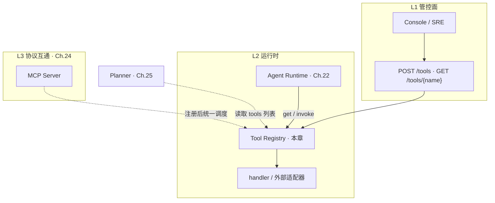
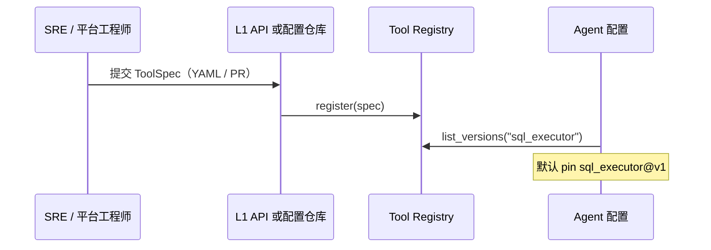
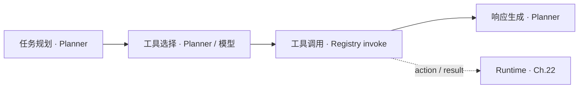
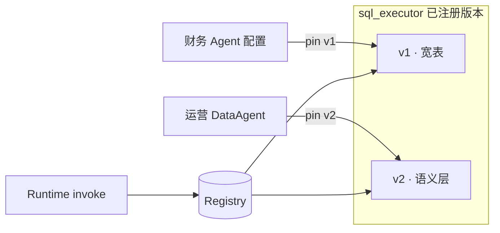
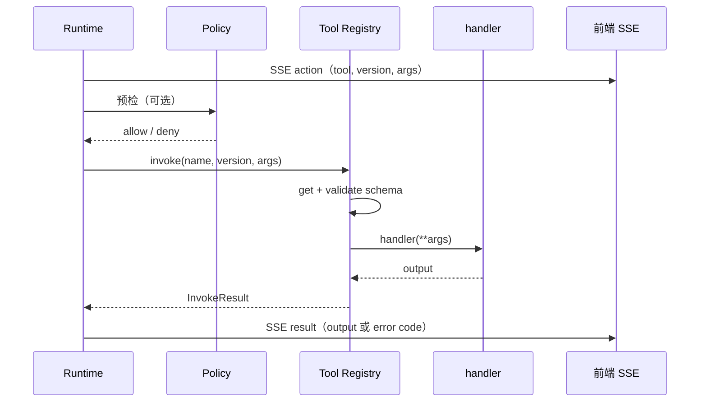

# Ch.23 Tool Registry & Function Calling

> **本章目标**：读者学完能说明 **Tool Registry** 在平台三层 API 中的位置、`ToolSpec` 如何注册与解析、Function Calling 的 JSON Schema 如何与平台校验分工，以及一次 Tool Call 从 Runtime 到 handler 的调用链与错误码；并能对照 `mini-platform` 在 Part V 实战项目 Run 链中观察 Registry `invoke` 与错误码行为。  
> **关键议题**：能力注册、Schema、版本治理、调用契约  
> **前置阅读**：[Ch.22 Agent Runtime](ch22-agent-runtime.md)、[Ch.01 §2.2](../part01-overview/ch01-agent.md)、[Ch.02 §2.2–2.3](../part01-overview/ch02-agent.md)  
> **估计阅读**：约 90 min（含实战项目）  
> **mini-platform 关联**：`core/registry/` · `projects/multi-agent-workflow/lib/registry_setup.py`  
> **实战项目**：`projects/multi-agent-workflow/`（Registry 经 RunLoop 全链调用；单测见 `tests/test_registry.py`）  
> **按角色推荐阅读**：CTO / 平台负责人 ⇒ 章头 + §1 + §4 + 本章小结 ｜ 架构师 ⇒ §1–§5 ｜ 工程师 ⇒ 全章 + 运行实战项目与 Registry 单测

Ch.22 讲 Runtime 如何推进一次 Run：Planner 给出下一步，Runtime 发出 `action`，工具执行后再返回 `result`。但这里还有一个问题没有回答：

模型说要调用 `sql_executor`，平台怎么知道这个工具是否存在？参数里的 `tenant_id` 由谁校验？该执行 `v1` 还是 `v2`？执行失败后，错误又该如何返回给 Planner？

若每个 Agent 工程各自 `import` 工具、各自校验参数、各自记日志，版本、权限与审计都会失控。**Tool Registry** 的作用，是把企业里的工具变成平台统一管理的能力：先注册，再按版本解析，调用前校验参数，最后通过统一入口执行。

**Function Calling** 解决的是模型侧问题：让模型用 JSON 形式表达「我要调用哪个工具、参数是什么」——在 API 请求里附带 `tools` 数组，每项用 **JSON Schema** 描述参数形状 [1][2]。文献中也常称 **tool use**（工具使用）或 **tool calling**（工具调用）[5][6]：模型产出调用意图后，由应用侧执行，并将 tool result 写回 Planner 上下文。**Tool Registry** 解决的是平台侧问题：这个调用能不能执行、该执行哪个版本、参数是否合法、错误如何分类。二者在 Runtime 的 `executing` 阶段汇合：Planner 把 Registry 导出的 schema 交给模型，模型返回参数后，仍须由 Registry 在调 handler **之前**做校验——模型输出不能替代平台侧强制校验 [1][3]。

本章术语：**Function Calling**（及 tool calling / tool use）指模型经 API 产出调用意图；**Tool Call** 指 Runtime 记录并执行的一次工具调用（Ch.22）；**Tool Registry** 指通过 `register` / `invoke` 管理 **ToolSpec** 的平台注册中心；**注册**即调用 `register(spec)` 将工具规格写入 Registry。

「山岚集团」DataAgent 问「华东区下滑 SKU」时，Ch.22 的 Runtime 已进入 `executing` 并打出 `action` 事件。本章要回答的是：平台如何确保调用的是 `sql_executor@v1` 而非未注册的 `v9`？如何在缺少 `tenant_id` 时返回 `TOOL_ARGUMENT_INVALID`，而不是让 SQL 落到错误租户？Registry 通过工具注册、版本解析、参数校验与统一 `invoke` 入口解决这些问题。

本章依次介绍 Registry 的分层位置（§1）、注册模型（§2）、Schema 与校验（§3）、版本治理（§4）、运行时调用链（§5），并以实战项目收束（§6）。

---

### Registry 在平台 API 分层中的位置

**本节要回答的问题**：Tool Registry 在平台里处于哪一层？它与 Runtime、Planner、Policy 各管什么？

Ch.02 将平台 API 分为三层：**L1 资源管理**（管控面，面向运维与 Console 的配置与发布接口）、**L2 运行时**（数据面）、**L3 协议互通**（MCP、A2A 等）。Registry 横跨 L1 与 L2：运维与 Console 通过 L1 注册工具；Runtime 在 L2 按 `(name, version)` 解析并 `invoke`。可以简单记：**注册发生在管控面，调用发生在运行时**。

#### 为什么需要平台级 Registry

若没有平台级 Registry，每个 Agent 工程各自 `import` 工具模块，会遇到三类典型问题：

1. **重复实现**：十个 Agent 各写一遍「调 HR API」的鉴权与重试，行为不一致。
2. **审计断裂**：合规要求证明「某次 Run 调用了哪个版本的 SQL 工具、参数是否含 `tenant_id`」——硬编码 import 难以统一记录调用日志和审计信息。
3. **版本漂移**：语义层升级后 `sql_executor` 从 `v1` 迁到 `v2`，部分 Agent 仍 pin 到旧版 handler，统计指标定义与 Ch.33 语义层不一致。

Registry 把工具变成平台托管的**可复用工具能力**：有描述、有 schema、有版本、有统一入口，供多个 Agent 与多个 `projects/` 复用。

#### 在架构中的位置

下图为 Registry 在 L1 / L2 / L3 中的位置，以及 Runtime、Planner、MCP 如何与之交互：




图中虚线表示：Planner 不执行工具，只读取 Registry 导出的 **OpenAI `tools` 定义** 或等价 schema；MCP 工具需要先注册为 ToolSpec，Runtime 后续仍按 `action` → `invoke` → `result` 流程执行（Ch.24 展开）。

#### 与相邻组件的边界

下表概括 Registry 与相邻组件的分工。读表时可记住一条主线：Registry 管「工具能不能被找到、参数合不合法、handler 怎么调」；Run 推进、模型推理、权限终审分别由 Runtime、Planner、Policy 负责。


| 组件                     | Registry 做什么                  | Registry 不做什么                                   |
| ---------------------- | ----------------------------- | ----------------------------------------------- |
| **Runtime**（Ch.22）     | 被 Runtime 调用 `get` / `invoke` | 不驱动 Run 六态、不发 SSE                                   |
| **Planner**（Ch.25）     | 提供 tools 列表与 schema           | 不代替模型推理                                         |
| **Policy**（Ch.50）      | —                             | 鉴权在 `invoke` **之前**由 Policy 拦截；Registry 假定调用已通过 Policy，但仍可记录调用来源与风险元数据，不做最终权限判定 |
| **LLM Gateway**（Ch.45） | —                             | 传 `tools` 给模型是 Gateway/Planner 职责               |
| **MCP**（Ch.24）         | 存储 MCP 工具的 ToolSpec 与路由信息   | 不实现 JSON-RPC 传输，也不复制 MCP Server 的实现本身          |


#### 常见误区

下面三条误区在企业落地时最常见：

**误区 1：Registry = 工具实现代码库。**  
实现可以在 `tools/`、`handlers/` 或外部 HTTP 服务；Registry 存的是 **ToolSpec**（描述 + schema + 如何路由到 handler）。把业务逻辑全塞进 Registry 类会让 Registry 承担过多业务职责，难以测试和复用。

**误区 2：Function Calling 等于「工具已执行」。**  
OpenAI 文档明确：API **不会**替开发者执行函数；模型只生成符合 schema 的参数 JSON，执行在应用侧 [2]。若把模型输出直接当最终结果，就跳过了鉴权、校验与审计。

**误区 3：L1 与 L2 混用。**  
用 `POST /tools` 的 REST 形态在 Run 主循环里逐次注册，会拖垮延迟；Run 时应只做 L2 的 `get` / `invoke`，注册走管控面异步流程。

---

### ToolSpec 与能力注册模型

平台侧用 **ToolSpec** 描述一种可调用能力。它与 Ch.22 Tool Call 记录中的 `tool` + `version` 字段一一对应：Runtime 收到 Planner 提议后，用这两个字段向 Registry 解析。

#### ToolSpec 字段


| 字段                  | 说明                      | 生产扩展（checklist ☐）        |
| ------------------- | ----------------------- | ------------------------ |
| `name`              | 稳定工具名，如 `sql_executor`  | 租户前缀 `tenant:tool`       |
| `version`           | 语义化或顺序版本，如 `v1`、`1.0.0` | 灰度标签 `canary`            |
| `description`       | 给模型与人类读的用途说明            | 多语言描述                    |
| `parameters_schema` | JSON Schema 对象，描述参数     | 与 OpenAI `strict` 对齐 [3] |
| `handler`           | 可调用对象（Demo 为 Python 函数） | HTTP/gRPC 适配器            |


`description` 会进入 Function Calling 的 `tools` 定义，直接影响模型**何时**选这个工具 [1]；写得含糊会导致「该调 SQL 时去调邮件」。

#### 注册与检索 API

参考实现（`core/registry/tool_registry.py`）提供三个核心操作：


| 方法                    | 作用                                    |
| --------------------- | ------------------------------------- |
| `register(spec)`      | 写入 `(name, version)` 主键；重复注册失败，避免静默覆盖 |
| `get(name, version)`  | 检索 spec；未找到抛 `TOOL_NOT_FOUND`         |
| `list_versions(name)` | 返回某工具的全部版本，供 Agent 配置页与治理             |


```python
@dataclass(frozen=True)
class ToolSpec:
    name: str
    version: str
    description: str
    parameters_schema: dict[str, Any]
    handler: Callable[..., Any]
```

#### 注册流程（管控面 → 运行时）




企业实践中，L1 常见形态是：Git 仓库存 YAML、Console「上架工具」表单、或 CI 从 `tools/` 包自动发布。本章 Demo 用内存 `register` 模拟 L1 生效后的状态。

#### handler 放在哪里


| 部署方式          | handler 形态                           | 适用           |
| ------------- | ------------------------------------ | ------------ |
| 进程内函数         | `Callable`                           | 单机 Demo、轻量工具 |
| 同集群 HTTP      | Registry 内持 URL，invoke 时发请求          | 多数微服务工具      |
| MCP / 外部 SaaS | 适配器把 MCP `tools/call` 封装为统一 `invoke` | Ch.24        |


Registry 只要求 `invoke` 语义一致：**校验参数 → 路由 → 返回结构化 output 或抛 RegistryError**。

---

### Function Calling Schema 与参数校验

**本节要回答的问题**：模型侧如何用 schema 表达「我要调什么工具」？平台侧又必须在哪一步再次校验参数？

**Function Calling**（OpenAI 文档亦称 tool calling [1]）是指在 Chat Completions 等 API 的 `tools` 参数中声明可供模型调用的函数；模型在回复中产出 `tool_calls`，其中 `function.arguments` 为 JSON 字符串。平台须将该 JSON 解析为 dict，再交给 Registry。**解析不等于校验，也不等于执行**——Registry 仍须在 `invoke` 前按 schema 强制校验参数。

#### OpenAI tools 长什么样

一项工具定义通常包含 [1][2]：


| 字段                     | 含义                                      |
| ---------------------- | --------------------------------------- |
| `type`                 | 固定为 `function`                          |
| `function.name`        | 与 `ToolSpec.name` 对齐                    |
| `function.description` | 触发条件说明                                  |
| `function.parameters`  | JSON Schema 描述参数对象                      |
| `function.strict`（可选）  | 为 `true` 时启用 Structured Outputs 级约束 [3] |


`mini-platform` 提供 `to_openai_tool(spec)`，从 `ToolSpec` 生成上述结构（`core/registry/openai_tools.py`），Planner 或 Gateway 可直接拼进请求体。

#### JSON Schema 是什么

**JSON Schema** 是一种用 JSON 描述 JSON 文档结构的规范 [4]：有哪些字段、类型是什么、哪些必填。Function Calling 的 `parameters` 本质是「参数对象」的 schema。

OpenAI Structured Outputs 的严格模式会进一步约束 schema：对象通常需要设置 `additionalProperties: false`，并让 `required` 覆盖所有属性 [3]——这能降低模型生成多余字段或漏字段的概率，但它仍只约束**模型输出格式**，不能替代平台侧校验。

本书 Demo 的 `to_openai_tool(spec, strict=True)` 只演示如何在 OpenAI `tools` 定义中加入 `strict: true`，并在顶层对象缺失时补充 `additionalProperties: false`；**不是**完整的生产级 strict schema 生成器。生产实现还应校验 `required` 是否覆盖全部属性、递归处理嵌套对象，并在 `invoke` 前继续执行 Registry 参数校验。

本书 Demo 的校验器实现 JSON Schema **子集**（`object` / 标量类型 / `required` / `additionalProperties`），无第三方依赖；生产可换完整校验库，但 **校验时机不变**：必须在 handler 之前。

!!! warning "无论是否 strict，invoke 前必须校验"
    即使模型请求已开启 Function Calling 或 `strict: true`，Registry 仍须在调用 handler **之前**执行 `validate_parameters`。模型输出只能作为提议，不能替代平台 schema 强制执行（见 §6 常见问题 3）。

#### 与 Runtime 的分工

一次工具调用从模型到 handler，各组件分工如下：


| 阶段                          | 谁负责               | 失败时                          |
| --------------------------- | ----------------- | ---------------------------- |
| 把 tools 列表交给模型              | Planner + Gateway | 模型不可用                        |
| 解析 `tool_calls` JSON        | Planner / Runtime | `plan_error` 等               |
| `get(name, version)`        | Registry          | `TOOL_NOT_FOUND`             |
| 按 schema 校验 `args`          | Registry          | `TOOL_ARGUMENT_INVALID`      |
| 执行 handler                  | Registry（路由）      | handler 异常 → Runtime 按 §5 分类 |
| 写 SSE `result`、是否将错误反馈给 Planner | Runtime           | 同 Step ≤3 次（Ch.22）           |


读表时请抓住一条原则：**模型「尽量」遵循 schema，平台「必须」强制执行 schema** [2][3]。调研表明，工具学习已成为 LLM Agent 的核心范式之一，但幻觉参数、错误选工具仍是主要失败模式 [5][6][7]。

Qu 等（2025）将工具学习流程概括为四阶段：**任务规划 → 工具选择 → 工具调用 → 响应生成** [6]。本书的对应关系如下：前两个阶段主要在 Planner（Ch.25）与 Gateway 完成；**工具调用**阶段由 Runtime 发 `action`、Registry 执行 `invoke`；**响应生成**阶段由 Planner 读取 `result` 再产出面向用户的答案。Registry 负责第三阶段的执行与校验，不替代 Planner 做推理。




#### 参数错误如何反馈 Planner（与 Ch.22 的关系）

下面用一个具体场景串起 Ch.22 与本节的分工。

Planner 为 `sql_executor` 生成的参数若缺少 `tenant_id`，Registry 在 `invoke` 时抛出 `TOOL_ARGUMENT_INVALID`，并附带 `validation_errors` 列表。Runtime 将其写入 `result` 事件，**不**把整个 Run 标为 `failed`，而是在同一 Step 内**再次调用 Planner**（把错误作为下一轮 Planner 输入，让模型修正参数）；超过 3 次仍失败再进入 `failed`（Ch.22 §5）。这样用户看到的是业务可理解的纠错，而不是底层校验错误或 Python 异常栈。

---

### 版本治理与多版本共存

工具与 API 一样需要版本管理。**主键**为 `(name, version)`：同名不同版本可并存，Agent 或 Run 配置决定实际解析哪一版。

#### 为什么需要多版本

山岚示例：`sql_executor@v1` 直连旧宽表；`v2` 改查 Ch.33 语义层指标。财务与供应链 Agent 迁移节奏不同——平台须允许 **v1 / v2 同时在线**，按 Agent 配置 pin 版本，而不是全局强制 latest。

实战项目 `registry_setup.py` 中同时注册 **`sql_executor`**（内置只读 Demo handler）与 **`mcp_db_query_sales`**（Ch.24 MCP 桥接工具），便于对照「平台内置工具」与「L3 协议接入工具」在 Registry 中的命名、版本与审计区分——二者语义相近，但来源与治理路径不同，生产不应混为一谈。

#### Agent 如何选版本


| 策略            | 做法                                  | 优势      | 风险        |
| ------------- | ----------------------------------- | ------- | --------- |
| **Pin 版本**    | Agent manifest 写 `sql_executor: v1` | 可审计、可复现 | 须人工推动升级   |
| **默认 latest** | Registry 记录 `default_version`       | 升级省力    | 行为突变、统计指标定义漂移 |
| **灰度**        | 按 `tenant_id` 路由 v2                 | 稳妥演进    | 路由逻辑复杂    |


企业推荐：**生产 Agent pin 版本**；实验 Agent 可用 latest；灰度期用配置中心切换。Ch.04 MVP 路径「YAML 注册 + 简单版本号 → 多版本灰度」在本章落地为 `list_versions` + 配置项。




#### 版本与 Function Calling 暴露

把 **多个版本** 同时暴露给模型（如 `sql_executor_v1` / `sql_executor_v2` 两个 `name`）容易造成模型选错。**生产默认**：对模型只暴露一个逻辑名，版本由 Agent 配置或 Runtime 在 `invoke` 前解析；实验环境才考虑让 Planner 显式传版本或多 name 暴露。Ch.25 编排模式会进一步讨论 Planner 如何持有工具视图。

#### 治理检查点

- 下架版本前检查 `list_versions` 与 Agent 配置引用。  
- 工具 schema **破坏性变更**应升主版本，并保留旧版只读窗口。  
- 注册信息含 `owner`、`risk_level`（写操作 / 读操作）供 Policy 使用（Ch.50，本章 Demo ☐）。

---

### 运行时调用链：从 Runtime 到 handler

本节串起 Ch.22 与本章：一次 Tool Call 在 `executing` 态如何从 `action` 走到 handler 再变成 `result`。

#### 时序




Policy 拒绝时 Runtime 可能进入 `waiting_human` 或 `failed`（Ch.22），**不会**调用 Registry。通过后 Registry 负责「工具存在、参数合法、handler 可执行」。

#### invoke 语义

`ToolRegistry.invoke(name, version, args)` 的步骤：

1. `get(name, version)` → 未注册则 `TOOL_NOT_FOUND`。
2. `validate_parameters(schema, args)` → 失败则 `TOOL_ARGUMENT_INVALID`（含 `validation_errors`）。
3. 调用 `handler(**args)` → 返回 `InvokeResult(output=...)`。

错误类型继承 `RegistryError`，带 `code` / `message` / `details`，Runtime 映射到 Ch.22 `result` 与恢复策略。

#### 错误码对照


| 失败来源 / Registry `code` | 典型原因              | Runtime 状态     | 恢复              |
| ----------------------- | ----------------- | -------------- | --------------- |
| `TOOL_NOT_FOUND`        | 名或版本未注册、Agent 配置错 | 保持 `executing` | 反馈 Planner 或失败  |
| `TOOL_ARGUMENT_INVALID` | 缺必填、类型错、多余字段      | 保持 `executing` | 反馈 Planner ≤3 次 |
| `TOOL_UNAVAILABLE`      | handler 内下游不可达（如 MCP transport 超时） | 按 Ch.22 §5     | 重试 / 熔断 / `failed`（Ch.24；Demo 进程内 MCP 通常不触发） |
| handler 未捕获异常（非 Registry code） | 下游超时、业务错误         | 按 Ch.22 §5     | 重试 / `failed`   |


Masterman 等（2024）对 Agent 架构的综述强调：**推理、规划与 tool calling 需分阶段设计**，工具执行可靠性与消息过滤同样重要 [8]；Registry 正是 tool calling 阶段的平台化实现位置。

#### 与 Ch.24 MCP 的关系

MCP Server 对外暴露 `tools/list` 与 `tools/call` [9]。平台做法：在 L1 将 MCP 工具**注册**为 ToolSpec（保存 spec 与路由信息，不复制 Server 实现），handler 内部走 MCP 客户端，而不是让 Runtime 到处直接调用 MCP Server。这样 Ch.22 的 Tool Call 记录与 Trace 仍只有一条 `invoke` 语义。

---

### 实战项目：Tool Registry 与 RunLoop 调用

Part V 统一实战项目 **`projects/multi-agent-workflow/`** 经 RunLoop 调用 Registry：Handoff、SQL、MCP、报告工具均在 `build_workflow_registry()` 中注册。Registry 错误码与 schema 校验的 **独立单测** 见 `tests/test_registry.py`。下文子节编号 **3.1–3.4** 沿用全书工程节惯例。

#### 运行环境

- **Python**：≥ 3.11（见 `mini-platform/pyproject.toml`）
- **工作目录**：在 `mini-platform` 根目录执行 `python3 projects/multi-agent-workflow/run.py start`
- **Registry 单测**：`pytest tests/test_registry.py -q`（覆盖 `TOOL_NOT_FOUND`、`TOOL_ARGUMENT_INVALID`、`to_openai_tool` 等）

#### 3.1 mini-platform 中的实现路径

```
mini-platform/core/registry/
├── __init__.py
├── tool_registry.py      # ToolSpec、register / get / list_versions / invoke
├── schema_validate.py    # parameters JSON Schema 子集校验
├── openai_tools.py       # to_openai_tool(spec) → OpenAI tools 项
└── errors.py             # TOOL_NOT_FOUND、TOOL_ARGUMENT_INVALID

projects/multi-agent-workflow/lib/
└── registry_setup.py     # build_workflow_registry()：handoff / sql / MCP / report

projects/multi-agent-workflow/
├── run.py                # RunLoop + Registry 全链
└── README.md

tests/test_registry.py    # Registry 能力与错误码单测
```

建议读码顺序：`tool_registry.py` → `schema_validate.py` → `registry_setup.py` → `run_loop.py`（`_execute_pending_tool`）。

#### 3.2 可运行代码与配置

以下为 `projects/multi-agent-workflow/lib/registry_setup.py` 的**节选**；完整 handler 与 MCP 注册见同文件。

```python
def sql_executor_handler(query: str, tenant_id: str) -> dict[str, object]:
    """模拟只读 SQL 查询。"""
    return {
        "rows": [{"sku": "SKU-A", "sales": 3200, "delta": -12}],
        "query": query,
        "tenant_id": tenant_id,
    }

registry.register(ToolSpec(
    name="sql_executor",
    version="v1",
    description="执行只读 SQL（Demo 固定行）",
    parameters_schema={
        "type": "object",
        "properties": {
            "query": {"type": "string"},
            "tenant_id": {"type": "string"},
        },
        "required": ["query", "tenant_id"],
        "additionalProperties": False,
    },
    handler=sql_executor_handler,
))
```

**运行实战项目**（观察 Registry 经 RunLoop 的 `action` → `invoke` → `result`）：

```bash
cd mini-platform
python3 projects/multi-agent-workflow/run.py start
```

SSE 输出中可见 `"tool": "handoff"`、`"tool": "mcp_db_query_sales"`、`"tool": "render_report"` 等 Tool Call 记录。Registry 亦注册了 `sql_executor`，但 Part V 主链 Data 阶段走 MCP 桥接工具 **`mcp_db_query_sales`**，便于对照 Ch.24 注册路径；`sql_executor` 可通过 `tests/test_registry.py` 单独验证。

**Registry 错误码单测**（不依赖 RunLoop）：

```bash
pytest tests/test_registry.py -q
```

#### 3.3 生产化 checklist


| 能力                                        | 说明                             | Demo 覆盖 |
| ----------------------------------------- | ------------------------------ | ------- |
| ToolSpec 与 register / get / list_versions | `tool_registry.py`             | ✓       |
| invoke + schema 校验                        | `schema_validate.py`           | ✓（子集）   |
| 结构化错误码                                    | `errors.py`                    | ✓       |
| 导出 OpenAI tools 定义                        | `openai_tools.py`              | ✓       |
| 实战项目中 Registry invoke                 | `multi-agent-workflow/run.py` | ✓       |
| Registry 错误码单测                           | `tests/test_registry.py`         | ✓       |
| L1 HTTP `POST /tools` / 持久化               | 管控面 API + DB                   | ☐       |
| 租户隔离与命名空间                                 | `tenant_id` 进 spec 或路由         | ☐       |
| Policy 预检集成                               | Ch.50                          | ☐       |
| MCP 注册与适配                                 | Ch.24 · `registry_setup.py`    | ✓       |
| 与 RunLoop 接线                              | `run_loop._execute_pending_tool` | ✓       |
| 完整 JSON Schema 校验库                        | 生产级                            | ☐       |
| 工具审计与血缘                                   | 谁注册、谁调用                        | ☐       |


#### 3.4 常见问题

**问题 1：Agent 硬编码工具 import**  
现象：每个 Agent 仓库复制 SQL 客户端，升级语义层后只有部分 Agent 跟进。修复：工具唯一入口改为 Registry；Agent 配置只声明 `tool` + `version`。

**问题 2：schema 与 handler 参数漂移**  
现象：YAML 里 `parameters_schema` 已加 `tenant_id`，handler 函数签名未改，校验通过但业务仍漏租户。修复：工具注册 CI 对比 schema 与 handler 签名；单测对 `invoke` 做必填字段用例。

**问题 3：把模型输出当已校验参数**  
现象：开启 Function Calling 后不再做 Registry 校验，幻觉字段传入 SQL 拼接。修复：无论是否 `strict`，`invoke` 前必须 `validate_parameters` [2][3]。

**问题 4：多版本同时暴露给模型**  
现象：模型在 `v1`/`v2` 间随机选择，统计指标日环比对不上。修复：对模型暴露稳定逻辑名；版本由 Agent 配置 pin，或 Planner 显式解析后再 `invoke`。

---

## 本章小结

### 关键结论

1. **Tool Registry** 是 L1 注册、L2 `get` / `invoke` 的能力中枢；工具实现可分散，契约须在 Registry 统一。
2. **Function Calling** 让模型按 JSON Schema **提议**调用；**Registry** 负责校验与执行，二者不可互换。
3. `(name, version)` 是版本治理主键；生产 Agent 宜 pin 版本，避免 latest 导致统计指标定义漂移。
4. `TOOL_NOT_FOUND` / `TOOL_ARGUMENT_INVALID` 须结构化返回，由 Runtime 写入 `result` 并决定是否将错误反馈给 Planner。
5. **MCP 与 HTTP 工具** 都应注册为 ToolSpec，保持 Ch.22 事件与审计模型不变。

### 上线检查清单

- 生产 Run 是否全部经 Registry `invoke`，无硬编码 bypass？  
- 每个写操作工具是否有 schema 必填项与幂等说明？  
- Agent 配置是否 pin 工具版本，并有下架旧版流程？  
- 参数校验失败反馈 Planner 是否有次数上限，避免死循环？  
- MCP / 外部工具是否已纳入 Registry 统一记录调用日志和审计信息？

### 本书延伸阅读

- [Ch.22 Agent Runtime](ch22-agent-runtime.md)  
- [Ch.24 MCP 与企业工具生态](ch24-mcp.md)  
- [Ch.25 Planner 与编排模式](ch25-planner.md)  
- [Ch.50 Policy 与权限](../part10-security-org/ch50.md)  
- `mini-platform/projects/multi-agent-workflow/README.md`
- `mini-platform/tests/test_registry.py`

---

## 参考文献

[1] OpenAI. (n.d.). *Function calling*. OpenAI API documentation. [https://developers.openai.com/api/docs/guides/function-calling](https://developers.openai.com/api/docs/guides/function-calling)

[2] OpenAI. (n.d.). *How to call functions with chat models*. OpenAI Cookbook. [https://developers.openai.com/cookbook/examples/how_to_call_functions_with_chat_models](https://developers.openai.com/cookbook/examples/how_to_call_functions_with_chat_models)

[3] OpenAI. (2024). *Introducing Structured Outputs in the API*. [https://openai.com/index/introducing-structured-outputs-in-the-api/](https://openai.com/index/introducing-structured-outputs-in-the-api/)

[4] JSON Schema. (2020). *JSON Schema: A Media Type for Describing JSON Documents*. Draft 2020-12. [https://json-schema.org/draft/2020-12/json-schema-core](https://json-schema.org/draft/2020-12/json-schema-core)

[5] Li, X. (2025). A review of prominent paradigms for LLM-based agents: Tool use, planning (including RAG), and feedback learning. In *Proceedings of COLING 2025*. arXiv:2406.05804. [https://arxiv.org/abs/2406.05804](https://arxiv.org/abs/2406.05804)

[6] Qu, C., Dai, S., Wei, X., Cai, H., Wang, S., Yin, D., Xu, J., & Wen, J.-R. (2025). Tool learning with large language models: A survey. *Frontiers of Computer Science*, 19(8), 198343. [https://doi.org/10.1007/s11704-024-40678-2](https://doi.org/10.1007/s11704-024-40678-2) （预印本：[https://arxiv.org/abs/2405.17935](https://arxiv.org/abs/2405.17935)）

[7] Shen, Z. (2024). LLM with tools: A survey. arXiv:2409.18807. [https://arxiv.org/abs/2409.18807](https://arxiv.org/abs/2409.18807)

[8] Masterman, T., Besen, S., Sawtell, M., & Chao, A. (2024). The landscape of emerging AI agent architectures for reasoning, planning, and tool calling: A survey. arXiv:2404.11584. [https://arxiv.org/abs/2404.11584](https://arxiv.org/abs/2404.11584)

[9] Model Context Protocol. (2024). *Specification* (2024-11-05). [https://modelcontextprotocol.io/specification/2024-11-05](https://modelcontextprotocol.io/specification/2024-11-05)

[10] Patil, S. G., Zhang, T., Kulkarni, N., & Leask, M. (2023). Gorilla: Large language model connected with massive APIs. arXiv:2305.15334. [https://arxiv.org/abs/2305.15334](https://arxiv.org/abs/2305.15334)