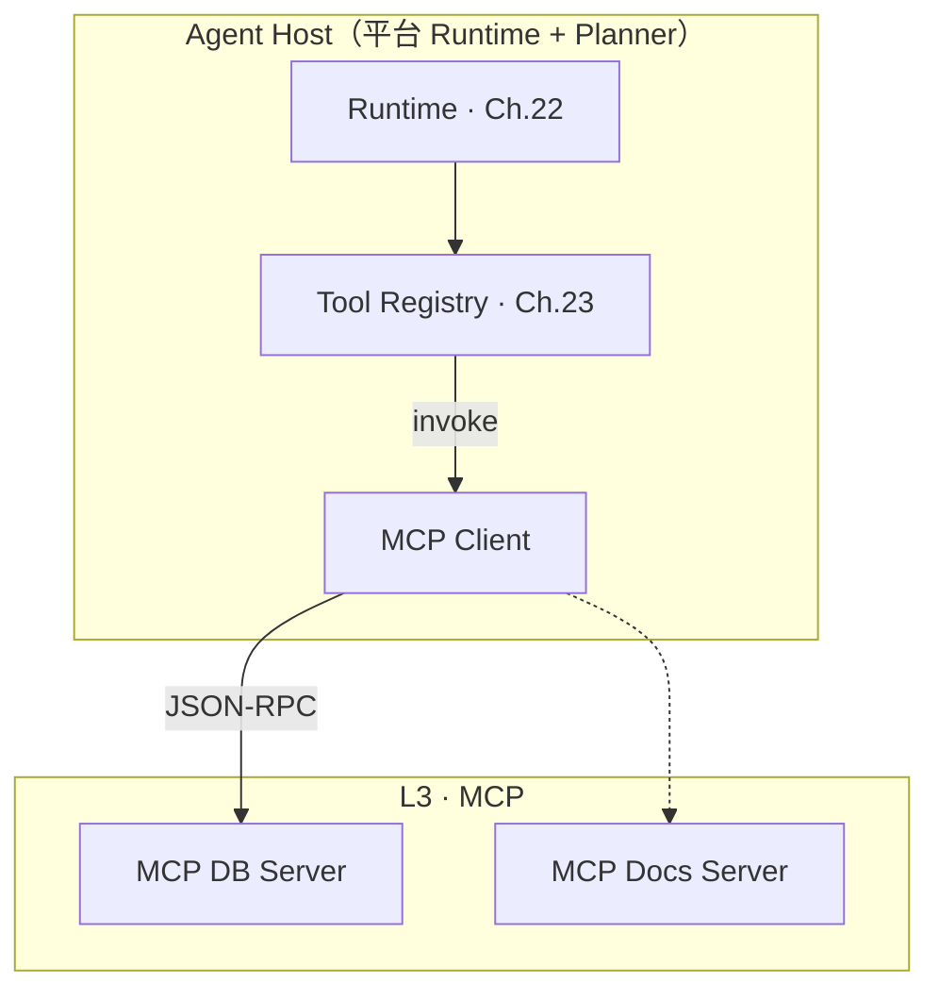
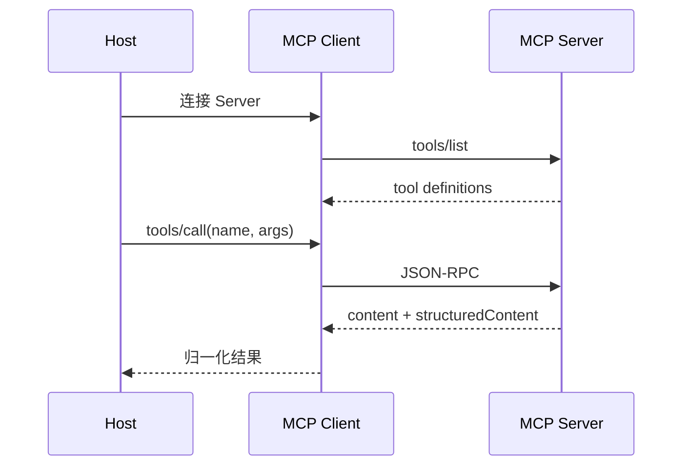
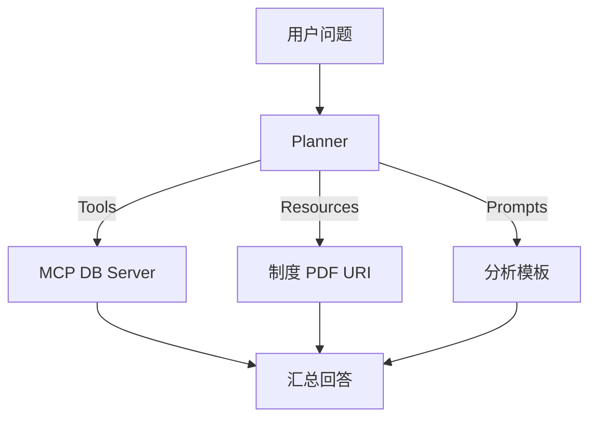
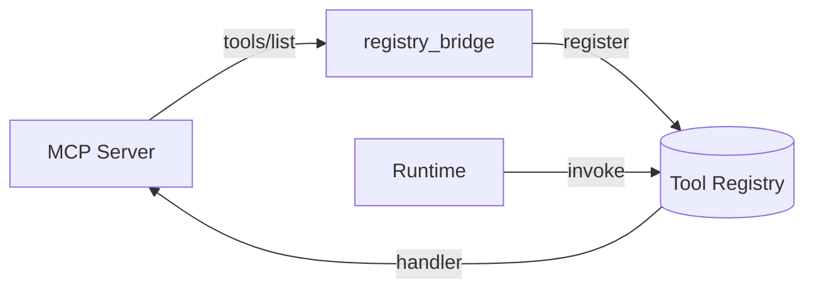

# Ch.24 MCP 与企业工具生态

> **本章目标**：读者学完能说明 **Model Context Protocol（MCP）** 在平台 L3 协议层的位置、Host/Client/Server 拓扑，以及 Tools/Resources/Prompts 三类能力与 Tool Registry 的集成方式，并在 Part V 实战项目 Run 链中观察 MCP 工具经 Registry 的调用。  
> **关键议题**：host-client-server、tools/resources/prompts、企业接入  
> **前置阅读**：[Ch.23 Tool Registry](ch23-tool-registry-function-calling.md)、[Ch.02 §2.3](../part01-overview/zh/ch02-agent.md)  
> **估计阅读**：约 90 min（含实战项目）  
> **mini-platform 关联**：`tools/mcp_db/` · `projects/multi-agent-workflow/lib/registry_setup.py`  
> **实战项目**：`projects/multi-agent-workflow/`（Data Agent 阶段调用 `mcp_db_query_sales@v1`；单测见 `tests/test_mcp_db.py`）  
> **按角色推荐阅读**：CTO / 平台负责人 ⇒ 章头 + §1 + §4 + 本章小结 ｜ 架构师 ⇒ §1–§5 ｜ 工程师 ⇒ 全章 + 运行实战项目与 MCP 单测

Ch.23 把工具收敛到 **Tool Registry**：按 `(name, version)` 注册、做 schema 校验、统一 `invoke`。但企业里的存量能力往往散落在各团队的 HTTP 服务、脚本库与供应商 SaaS 里——若每个接入方各自写适配，很快又会回到「一 Agent 一集成」的老路。

**Registry 管的是平台内统一命名、版本与校验；MCP 管的是进程/服务边界上的协议**——集成路径始终是 **发现 → 注册 → invoke**，而不是用 MCP 替代 Registry。

外部能力要如何以统一协议暴露？平台要不要为每个 Server 各写一遍 HTTP 客户端？**执行与审计**能否仍走 Ch.22 的 `action` → `invoke` → `result`？（**发现**由 L1 或 MCP Client 的 `tools/list` 完成，不属于 Run 主循环。）

**Model Context Protocol（MCP）** 是 Anthropic 等推动的开放协议，用统一的 JSON-RPC 语义暴露 **Tools、Resources、Prompts**，让 **Host** 上的 **Client** 以同样方式连接多个 **Server** [1][2]。对平台而言，MCP 不是替代 Registry，而是 **L3 接入标准**：外部 Server 按 MCP 暴露能力，平台侧 Client 拉取 `tools/list`，再**注册**进 Registry，Runtime 仍走 Ch.22 与 Ch.23 的统一调用链。与面向 Agent 互操作的 A2A 等协议对照阅读见 Ch.29 [6]。

本章术语：**MCP** 指 Model Context Protocol，即 L3 协议层的 JSON-RPC 标准；**Host** 指承载用户会话并编排 LLM 与 Client 的应用进程（本平台即 Runtime + Planner）；**Client** 代表 Host 连接 Server、转发 `tools/list` 与 `tools/call` 的组件；**Server** 指暴露 Tools/Resources/Prompts 的独立进程或服务。

「山岚集团」把「销售宽表只读查询」封装为独立 MCP Server 后，DataAgent、财务 Agent 与运维脚本共用同一服务，审计与版本治理留在 Registry 层统一——本章要回答的是：MCP 在 L3 的位置、三类能力如何分工、以及如何与 Tool Registry 集成。

本章依次介绍 MCP 的分层位置（§1）、架构与部署（§2）、三类能力（§3）、企业接入（§4）、与 Registry 集成（§5），并以实战项目收束（§6）。

---

### MCP 在平台协议分层中的位置

**本节要回答的问题**：MCP 在平台里处于哪一层？它与 Registry、Runtime 各管什么？

Ch.02 将 **L3 协议互通** 定义为跨系统、跨平台的标准接口层。MCP 当前最典型的生态位是：**让 LLM 应用（Host）以标准方式使用外部数据与工具（Server）**，而不是在每个 Agent 项目里复制一遍 HTTP 客户端 [1]。

#### 与 Registry、Runtime 的关系

下表概括 MCP 与 Registry、Runtime 在 L2 / L3 的分工：

| 层次 | 组件 | MCP 相关职责 |
|------|------|--------------|
| L2 运行时 | Runtime | 不变：发 `action`、调 Registry `invoke`、写 `result` |
| L2 运行时 | Tool Registry | 存储 MCP 工具注册后的 `ToolSpec` + handler |
| L3 协议 | MCP Client | `tools/list`、`tools/call`、传输（stdio / Streamable HTTP） |
| L3 协议 | MCP Server | 暴露工具实现、可选 Resources/Prompts |

下图展示 Host 内 Runtime、Registry 与 MCP Client 如何协同，以及 Client 如何连接多个 MCP Server：



#### 常见误区

下面四条误区在企业落地时最常见：

**误区 1：把 MCP 当成「又一个 Tool Registry」。**  
Registry 管的是平台内 **统一命名、版本与校验**；MCP 管的是 **进程/服务边界上的协议**。正确路径是 **MCP → 注册 → Registry → Runtime**。

**误区 2：Run 主循环直连 MCP Server。**  
每次 Tool Call 都新建 MCP 连接会导致延迟与连接风暴。应注册为 Registry handler，连接池与熔断在 Client 层复用。

**误区 3：把 Resources 当 RAG 替代品。**  
MCP Resources 提供可读 URI 与快照（Ch.24 §3）；企业级检索、权限与索引仍在 Ch.20 RAG 与向量库。二者可并存：RAG 负责「搜」，Resource 负责「读某一已知文档版本」。

**误区 4：忽视 Server 侧审计。**  
MCP 只规范协议，不自带企业 IAM。Server 侧须记录调用方身份、`tenant_id`、工具名、参数摘要、结果摘要与 `run_id`；平台 Trace 与之关联（Ch.38）。谁可以 `tools/call` 哪类工具，仍须落 Ch.50 Policy 与网络隔离（§4）。

---

### Host / Client / Server 架构与部署

**本节要回答的问题**：MCP 规范里 Host、Client、Server 各是什么角色？生产环境有哪些传输与部署方式？

MCP 规范定义三类角色 [2]：

| 角色 | 是什么 | 山岚示例 |
|------|--------|----------|
| **Host** | 承载用户会话、编排 LLM 与 Client 的应用 | DataAgent 平台进程 |
| **Client** | 代表 Host 连接 Server，转发 `tools/list`、`tools/call` | 平台内置 `McpDbClient` |
| **Server** | 暴露 Tools/Resources/Prompts 的独立进程或服务 | `mcp-db` 只读查询服务 |

#### 传输方式

MCP 生产部署时先区分「本地进程」与「远程服务」。本地 Server 通常使用 **stdio**；远程 Server 应优先采用 MCP 规范中的 **Streamable HTTP**（2025-03-26 起的主流远程传输）。旧版 **HTTP+SSE** 可作为兼容路径，或作为 Streamable HTTP 内的服务器消息流机制理解，不宜在新文档中把「SSE / HTTP」写成生产远程传输的主名称。

| 传输 | 场景 | 注意 |
|------|------|------|
| **stdio** | 本地子进程、IDE 插件、开发机工具 | 容器内需明确子进程生命周期，避免僵尸进程 |
| **Streamable HTTP** | 远程 MCP Server、K8s 部署、多 Host 共享 | 须配置 TLS、鉴权、超时、body 大小限制与网关路由 |
| **HTTP+SSE（兼容）** | 对接 2024-11-05 规范遗留端点 | 仅作兼容；新部署优先 Streamable HTTP |
| **进程内（Demo）** | 教学与单测 | `tools/mcp_db/` 采用；只模拟 method/params 分发，不代表生产传输层 |

本章 Demo 为降低依赖，使用进程内 `McpDbClient → McpDbServer` 调用；生产实现应替换为官方 SDK 的 stdio 或 Streamable HTTP transport，并保留 Runtime → Registry → handler → MCP Client 的调用边界。

一次典型的 `tools/list` 与 `tools/call` 交互时序如下：



Server 应对每次 `tools/call` 记录 `tenant_id`、调用方身份与参数摘要，供 Ch.38 Trace 与合规导出关联——协议本身不替代审计存储。

#### 部署拓扑

- **Sidecar**：每个 Agent Pod 边车连接固定 MCP Server，适合强隔离租户。  
- **共享服务**：平台运维统一部署 `mcp-db`，多 Host 通过 Client 连接，须配额与熔断。  
- **容器/宿主机**：`mini-platform` Demo 用 `sys.path` 兼容两者；生产 Config 中写清 Server 基址或 stdio 命令行。

#### JSON-RPC 消息语义（读协议文档时的抓手）

MCP 建立在 **JSON-RPC 2.0** 消息模型之上 [2]：完整报文包含 `jsonrpc: "2.0"`、`id`，以及 `method` / `params` 或 `result` / `error`。初学时不必背全表，只需记住三条主线：

1. **发现**：`tools/list` → 得到工具数组（名、描述、`inputSchema`）。  
2. **执行**：`tools/call` → 传入 `name` 与 `arguments` 对象。  
3. **生命周期**：连接建立时通过 `initialize` 交换协议版本与能力——生产 Client SDK 会封装；本章对照 [2] 2024-11-05 规范语义，远程传输以 Streamable HTTP 为准（2025-03-26 修订）。

`mini-platform` 的 `McpDbServer.handle_jsonrpc()` **只模拟 method/params 分发**，返回业务对象而非完整 JSON-RPC envelope，也不实现 `initialize` 握手——便于在无网络环境对照官方规范阅读，**不能**当作生产 MCP 报文形态。

#### Host 内多 Client 管理

一个 Host 常同时连接多个 Server（数据库、文档、工单）。平台应在 Host 内维护 **Client 池**，下表列出四项常见关注点：

|  Concern | 建议 |
|----------|------|
| 连接复用 | 按 Server 实例缓存 Client，避免每次 Tool Call 握手 |
| 工具名冲突 | 注册 Registry 时加前缀（`mcp_db_`、`mcp_docs_`） |
| 熔断 | 某 Server 连续失败后暂时从 `tools/list` 缓存摘除 |
| 配额 | 每租户限制并发 `tools/call`，防止拖垮共享 Server |

---

### Tools、Resources、Prompts 三类能力

**本节要回答的问题**：MCP 除 Tools 外还定义哪些能力？它们在企业问数场景里如何分工？

MCP 不仅定义 **Tools**（可执行、有副作用），还定义 **Resources**（可读数据 URI）与 **Prompts**（可复用提示模板）[2]。

#### Tools

- 与 Ch.23 Function Calling 对齐：有 `name`、`description`、`inputSchema`。  
- 执行走 `tools/call`，返回 `content`（文本/图像等）与可选 `structuredContent` [4]。  
- **企业默认**：写操作 Tools 须幂等键 + Policy 审批（Ch.30）。

#### Resources

- 通过 URI 标识只读对象，如 `sales://report/2025Q1`。  
- Client `resources/read` 拉取快照，适合「已知路径读文件」，不适合开放式语义检索。  
- 与 Ch.20 RAG：**RAG 解决找文档，Resource 解决读指定版本**。

#### Prompts

- Server 暴露命名提示模板，Host 可参数化实例化。  
- 平台可把 Prompts 纳入 **Prompt 模板管理**（Ch.08），与 Agent 配置绑定，避免运营在 Server 与 Console 两处维护冲突版本。

三类能力在平台中的典型落点如下：

| 能力 | 典型用途 | 平台落点 |
|------|----------|----------|
| Tools | SQL、工单、邮件 | Registry + Runtime |
| Resources | 制度 PDF、指标快照 | 缓存 + 权限 URI |
| Prompts | 标准分析步骤 | Prompt 仓库 |

本章 Demo 聚焦 **Tools**；Resources/Prompts 在 checklist 标为生产扩展 ☐。

**关键结论**：默认只有 **Tools** 经 `register_mcp_tools` 进入 Registry 并由 Runtime `invoke`；**Resources** 更适合 Memory/RAG 或带权限的 URI 读取；**Prompts** 进入 Prompt 模板仓库（Ch.08），避免与 Server 侧模板双源维护。

#### 山岚场景：三类能力如何配合一次问数

运营总监问「华东区 SKU 为何下滑」时，典型分工是：

1. **Tools**：`query_sales` 拉结构化销量（本章 Demo）。  
2. **Resources**：`policy://pricing/2025Q2` 读取当季定价制度 PDF 快照，供 Planner 解释「是否降价导致」。  
3. **Prompts**：Server 暴露 `monthly_sales_review` 模板，保证 Reviewer Agent 输出固定章节（摘要、根因、行动项）。

下图展示 Planner 如何分别调用三类能力，再汇总为最终回答：



平台不必把三类能力都塞进同一个 MCP Server；关键是 Host 侧 **统一发现与权限模型**，再汇入 Registry 或 Memory（Prompts 进 Prompt 仓库）。

#### 与「直接 HTTP 集成」的取舍

接入存量系统时，可在直连 HTTP 与经 MCP Server 暴露之间取舍，下表对比四个维度：

| 维度 | 直连企业内部 HTTP API | 经 MCP Server 暴露 |
|------|----------------------|-------------------|
| 接入成本 | 每个 Agent 写客户端 | 一次 Server，多 Host 复用 |
| 契约 | OpenAPI / 私有 | MCP `inputSchema` + JSON-RPC [5] |
| 生态 | 无标准工具发现 | `tools/list` 可自动注册 |
| 适用 | 强定制、极低延迟内部调用 | 跨团队、跨工具、需 IDE/多 Host 复用 |

山岚对 **存量只读数仓** 选 MCP（复用面广）；对 **毫秒级交易风控** 仍保留 gRPC 直连，不通过 MCP Server 适配。

---

### 企业接入：身份、网络与审计

**本节要回答的问题**：MCP 进入企业生产须补齐哪些身份、网络与审计能力？

MCP 进入企业生产须回答三件事：**谁可以连、流量怎么走、事后如何查**。

#### 身份与租户

- Server 须校验调用方 **租户** 与 **scope**（与 Ch.22 `context` 原样传递一致）。  
- 不宜把长期密钥写在 Host 环境变量里裸传；优先短期令牌 + 轮换（Ch.50）。  
- 多租户场景可为每个租户部署独立 Server 实例，或在 Server 内做行级隔离——取决于数据敏感级。

#### 网络

- 生产禁用公网无鉴权 MCP 端点。  
- K8s 内用 Service + NetworkPolicy 限制只有 Runtime 命名空间可访问 `mcp-db`。  
- 出站代理场景需为 JSON-RPC 配置超时与 body 大小上限，防止大结果拖垮 Run（Ch.22 `tool_timeout`）。

#### 审计

- 每次 `tools/call` 写 **Tool Call 记录**：`tool_call_id`、参数摘要、Server 实例 ID、延迟。  
- MCP Server 日志与平台 Trace 用同一 `run_id` 关联（Ch.38）。  
- 合规导出须能证明「哪次 Run 经 MCP 调了哪张表」。

#### 设计取舍

聚合 Server 与按工具拆分 Server 各有取舍，下表供架构评审参考：

| 方案 | 优势 | 代价 |
|------|------|------|
| 每工具一个 MCP Server |  blast radius 小 | 运维实例多 |
| 聚合 Server（多 tool） | 运维简单 | 单点故障影响面大 |
| 仅注册 Tools，Resources 走 RAG | 架构清晰 | 两类接入并存 |

山岚 DataAgent 采用 **聚合只读 DB Server + RAG 文档库** 并存。

#### 合规与数据驻留

跨境业务须明确 **MCP Server 进程与数据落点**：`tools/call` 的参数与结果是否出境、日志是否含 PII。若 Server 运行在境外 SaaS，即使 Host 在国内，也可能触发合规审查。平台应在 L1 注册工具时标注 **数据域**（如 `cn-north` / `eu`），Policy 据此拒绝跨域调用。

---

### MCP Server 与 Tool Registry 的集成

**本节要回答的问题**：如何把 MCP 工具纳入 Registry，使 Runtime 仍只认 `invoke`？

集成的目标是：**Runtime 只认 Registry**，MCP 只是 handler 的一种实现来源。

!!! warning "MCP 不替代 Registry"
    生产 Runtime 不应直接调用 MCP Server。MCP 工具须先注册为 ToolSpec，再由 Registry `invoke`；审计与版本治理仍走 Ch.22 / Ch.23 统一模型。

#### 集成步骤

1. **发现**：Client `tools/list` 拉取 Server 工具目录。  
2. **映射**：为每个 MCP 工具生成平台内唯一 `name`（建议前缀 `mcp_db_` 避免冲突）。  
3. **注册**：`parameters_schema` 取自 MCP `inputSchema`，handler 内部调 `client.call_tool`。  
4. **健康检查**：L1 周期性 `tools/list` 或 ping，失败则从 Agent 工具视图摘除并告警。  
5. **执行**：Runtime `registry.invoke` → handler → MCP Client → Server。

参考实现：`tools/mcp_db/registry_bridge.py` 的 `register_mcp_tools()`。Demo handler 仅返回 MCP `structuredContent` 供 `invoke` 使用；生产应保留 `content` 与 `structuredContent` 的完整映射，供 Trace 与前端展示。

下图概括从 MCP Server 发现到 Registry 注册、再到 Runtime 调用的完整链路：



#### 错误处理

| 场景 | 平台侧处理 |
|------|------------|
| Server 不可达 / transport 超时 | Registry handler 包装为 `TOOL_UNAVAILABLE`（`core/registry/errors.py` 已定义；Demo 进程内 Server 通常不触发），Runtime 按 Ch.22 重试策略处理 |
| MCP 返回业务错误 | 写入 Tool Call `error.details`，由 Runtime 决定是否将错误反馈给 Planner |
| `inputSchema` 与 Server 实参不一致 | 注册 CI 或健康检查阶段发现；变更须升 Registry 版本 |

---

### 实战项目：MCP 数据库工具

MCP 实现位于 `tools/mcp_db/`；`build_workflow_registry()` 通过 `register_mcp_tools()` 将其注册为 **`mcp_db_query_sales@v1`**，Data Agent 阶段经 RunLoop → Registry `invoke` 调用。MCP 协议与 Registry 桥接的 **独立单测** 见 `tests/test_mcp_db.py`。

#### 运行环境

- **Python**：≥ 3.11（见 `mini-platform/pyproject.toml`）
- **运行实战项目**：`python3 projects/multi-agent-workflow/run.py start`（SSE 中含 `"tool": "mcp_db_query_sales"`）
- **MCP 单测**：`pytest tests/test_mcp_db.py -q`（覆盖 `tools/list`、`tools/call`、Registry 注册与 `invoke`）

#### 3.1 mini-platform 中的实现路径

```
mini-platform/tools/mcp_db/
├── __init__.py
├── server.py           # McpDbServer：tools/list、tools/call
├── client.py           # McpDbClient：进程内 JSON-RPC
└── registry_bridge.py  # register_mcp_tools → ToolRegistry

projects/multi-agent-workflow/lib/
└── registry_setup.py   # build_workflow_registry() 内 register_mcp_tools(...)

projects/multi-agent-workflow/
├── run.py              # Data Agent 阶段触发 MCP Tool Call
└── README.md

tests/test_mcp_db.py    # MCP + Registry 单测
```

`server.py` 模拟 MCP 只读库工具 `query_sales`；实战项目在 Data Agent 阶段经 Registry 统一 `invoke`，与 Ch.22 事件模型一致。

#### 3.2 可运行代码与配置

**运行实战项目**（观察 MCP 工具在完整 Handoff 链中的调用）：

```bash
cd mini-platform
python3 projects/multi-agent-workflow/run.py start
```

SSE 输出中含 Data Agent 对 `mcp_db_query_sales` 的 `action` / `result` 事件。

**MCP 协议与 Registry 单测**：

```bash
pytest tests/test_mcp_db.py -q
```

注册后平台工具名为 **`mcp_db_query_sales@v1`**，与内置 `sql_executor` 并存，便于版本与审计区分。

#### 3.3 生产化 checklist

| 能力 | 说明 | 本章 Demo |
|------|------|-----------|
| MCP Server tools/list & call | `server.py` | ✓（进程内） |
| MCP Client | `client.py` | ✓ |
| Registry 桥接注册 | `registry_bridge.py` | ✓ |
| 实战项目中 MCP invoke | `multi-agent-workflow/run.py` | ✓ |
| MCP + Registry 单测 | `tests/test_mcp_db.py` | ✓ |
| `TOOL_UNAVAILABLE` 端到端（transport 超时） | 远程 MCP + 熔断 | ☐ |
| 进程内 MCP + 实战 Run 链 | `test_mcp_db.py` + `multi-agent-workflow/run.py` | ✓ |
| stdio / Streamable HTTP 远程传输 | 官方 SDK 传输层 | ☐ |
| Resources / Prompts | MCP 全能力 | ☐ |
| 健康检查与摘除 | L1 探活 | ☐ |
| 租户鉴权与网络策略 | §4 | ☐ |
| mcp_docs 第二 Server | `tools/mcp_docs/` | ☐ |

#### 3.4 常见问题

**问题 1：跳过 Registry 直连 MCP**  
现象：Runtime 在 Run 主循环直接 JSON-RPC，工具版本与审计体系分裂。修复：一律 `register_mcp_tools` 后只 `invoke`。

**问题 2：MCP 工具名与内置工具冲突**  
现象：`query_sales` 与旧 handler 同名，注册覆盖。修复：平台名加前缀 `mcp_db_` 或租户命名空间。

**问题 3：inputSchema 与 Server 校验不一致**  
现象：Registry 校验通过但 Server 拒绝。修复：注册 CI 对比双方 schema；变更升版本。

**问题 4：容器内 stdio Server 僵尸进程**  
现象：Pod 重启后旧子进程仍占用端口。修复：Host 管理子进程生命周期，或改用 Streamable HTTP 远程 Server。

#### 运行故障排查

| 现象 | 可能原因 | 定位 |
|------|----------|------|
| `ValueError: region and tenant_id are required` | MCP 调用缺必填参数 | 对照 `inputSchema` 与 Registry schema |
| `KeyError: unknown tool` | 工具名错误或 Server 未暴露 | 先跑 `tools/list` 核对名称 |
| `ValueError: unsupported method` | Client 调用了 Demo 未实现的 JSON-RPC 方法 | 对照 `handle_jsonrpc` 与规范 |
| Registry `TOOL_NOT_FOUND` | 未注册或版本/agent 配置错误 | 确认已执行 `register_mcp_tools` |
| 生产 Server 超时（`TOOL_UNAVAILABLE`） | 网络、熔断或 Server 宕机 | MCP Client 日志 + Ch.22 重试策略 |

---

## 本章小结

### 关键结论

1. **MCP 是 L3 协议**，Registry 是 L2 能力中枢；集成路径为 **发现 → 注册 → invoke**。  
2. **Tools / Resources / Prompts** 分工不同；企业问数场景通常 Tools 为主，Resources 补已知 URI 读取。  
3. **生产接入**须补齐身份、网络、审计，协议本身不自带企业 IAM。  
4. **Demo** 用进程内 Server/Client 讲清语义；生产替换为 stdio / Streamable HTTP 与真实数据库只读账号。

### 上线检查清单

- MCP 工具是否全部经 Registry 注册并有版本号？  
- Server 是否强制 `tenant_id` 等隔离参数？  
- 是否有健康检查与 `TOOL_UNAVAILABLE` 重试策略？  
- Trace 是否能关联 `run_id` 与 MCP Server 实例？  

### 本书延伸阅读

- [Ch.23 Tool Registry](ch23-tool-registry-function-calling.md)  
- [Ch.29 Agent 协议与标准](ch29-agent.md)  
- [Ch.20 RAG 工程](../part04-vector-knowledge/ch20-rag.md)  
- `mini-platform/projects/multi-agent-workflow/README.md`
- `mini-platform/tests/test_mcp_db.py`

---

## 参考文献

[1] Anthropic. (2024). *Introducing the Model Context Protocol*. [https://www.anthropic.com/news/model-context-protocol](https://www.anthropic.com/news/model-context-protocol)

[2] Model Context Protocol. (2024). *Specification* (2024-11-05). [https://modelcontextprotocol.io/specification/2024-11-05](https://modelcontextprotocol.io/specification/2024-11-05)

[3] Model Context Protocol. (n.d.). *Architecture overview*. [https://modelcontextprotocol.io/docs/concepts/architecture](https://modelcontextprotocol.io/docs/concepts/architecture)

[4] Qu, C., et al. (2025). Tool learning with large language models: A survey. *Frontiers of Computer Science*, 19(8), 198343. [https://doi.org/10.1007/s11704-024-40678-2](https://doi.org/10.1007/s11704-024-40678-2)

[5] Hou, X., et al. (2024). Large language models for software engineering: A systematic literature review. arXiv:2404.06393. [https://arxiv.org/abs/2404.06393](https://arxiv.org/abs/2404.06393) （工具集成与企业边界讨论）

[6] Google. (2024). *Agent2Agent (A2A) protocol*（预告互操作方向，与 MCP 对照阅读）. [https://developers.googleblog.com/en/a2a-a-new-era-of-agent-interoperability/](https://developers.googleblog.com/en/a2a-a-new-era-of-agent-interoperability/)
