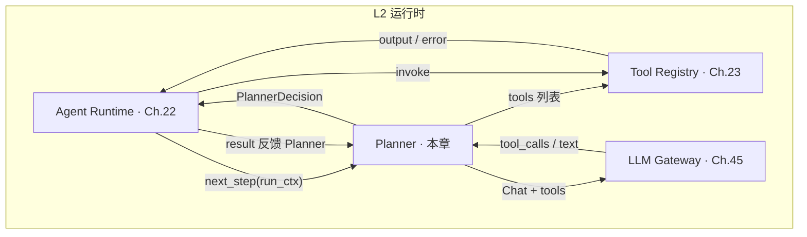
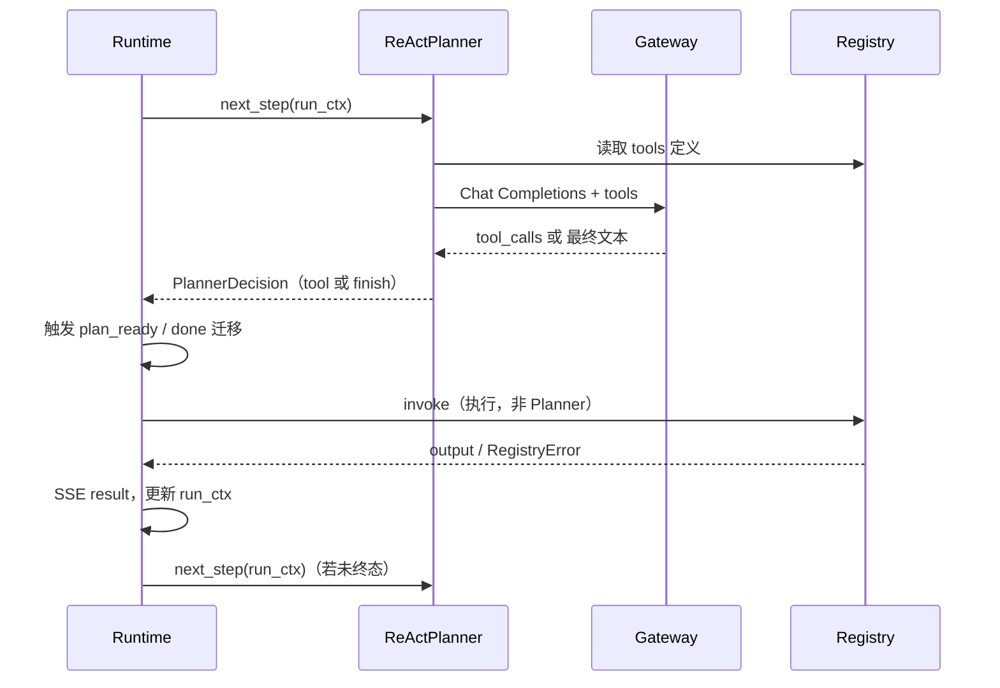
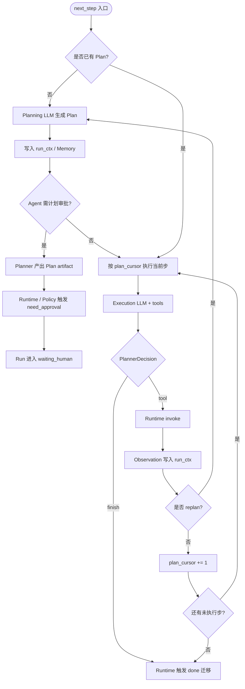
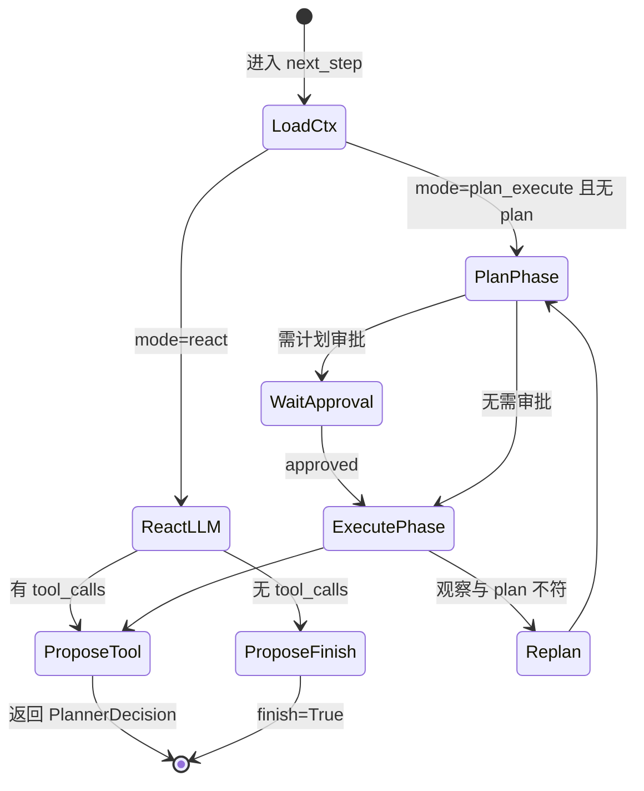

# Ch.25 Planner 与编排模式

> **本章目标**：读者学完能说明 **Planner** 在平台中的职责边界、`ReAct` 与 `Plan-and-Execute` 两种编排模式的适用场景与配置方式，以及编排图内部状态与 [Ch.22 Run 六态](ch22-agent-runtime.md) 的分工；并能对照 `mini-platform` 在 Part V 实战项目 Run 链中观察 `MultiAgentPlanner` 与 `core/planner/` 的接口边界。  
> **关键议题**：ReAct、Plan-and-Execute、状态机、工作流取舍  
> **前置阅读**：[Ch.22 Agent Runtime](ch22-agent-runtime.md)、[Ch.23 Tool Registry & Function Calling](ch23-tool-registry-function-calling.md)、[Ch.01 §2.4](../part01-overview/zh/ch01-agent.md)  
> **估计阅读**：约 85 min（含工程节）  
> **mini-platform 关联**：`core/planner/` · `projects/multi-agent-workflow/lib/planner.py`  
> **实战项目**：`projects/multi-agent-workflow/`（`MultiAgentPlanner` 驱动 Handoff 链；`core/planner/` 提供 ReAct / P&E 规则 Demo）  
> **按角色推荐阅读**：CTO / 平台负责人 ⇒ 章头 + §1 + §5 + 本章小结 ｜ 架构师 ⇒ §1–§5 ｜ 工程师 ⇒ 全章 + 运行实战项目并对照 `planner.py`

Ch.22 讲 Runtime 如何推进一次 Run：维护 Run 六态、发出 SSE 事件、经 Registry 执行工具、写入检查点。Ch.23 把工具注册为可版本化的 **ToolSpec**，并导出 OpenAI Function Calling 所需的 schema。但这里还有一个问题没有回答：

**谁**在每一轮 Step 里根据 Memory、工具历史与用户任务，产出「下一步做什么」的结构化决策？

若把「如何规划」与「如何执行」都写进 `RunLoop`，每个 Agent 会复制一套 LLM 提示与解析代码，版本升级时行为漂移。业界综述将 LLM Agent 的核心能力概括为规划、记忆与工具使用 [1]；ReAct 论文则把 **推理（Reasoning）与行动（Acting）交错** 作为可解释轨迹的基本范式 [2]。本书的 **Planner** 不是「另一个 Runtime」，而是 **只提议、不执行** 的编排决策模块：它调用 LLM、解析 Function Calling 输出、返回 `PlannerDecision`；真正把副作用落到外部系统的，始终是 Runtime 经 Registry 的 `invoke`。

本章术语：**Planner** 指根据上下文产出下一步动作的平台编排模块；**PlannerDecision** 是 Planner 与 Runtime 之间的单步握手结构（`finish` / `tool` / `version` / `args` / `answer`）；**ReAct** 指推理与行动交错的逐步编排模式；**Plan-and-Execute** 指先生成多步计划、再逐步执行的两阶段模式。

「山岚集团」运营总监通过 DataAgent 问「上周华东区销售下滑的主要 SKU 是什么」。控制台只见 [Ch.22](ch22-agent-runtime.md) 的 `planning` → `executing` 进度条；Planner 则在背后反复完成同一件事：读历史 Tool 结果、从 [Ch.23 Registry](ch23-tool-registry-function-calling.md) 拉取 `sql_executor@v2` 的 schema、向 Gateway 发起带 `tools` 的请求、把模型返回的 `tool_calls` 转成平台统一的 `PlannerDecision`。若模型在第一步就选错表，Runtime 不会因此直接 `failed`——Registry 可能返回 `TOOL_ARGUMENT_INVALID`，Runtime 把错误写入 `result` 并 **再次调用 Planner** 修正；若模型在文本里说「任务已完成」，Runtime 也不会轻信，须确认 Tool Call 队列已清空后才触发 `done` 迁移进入 `succeeded`（Ch.22 §2 硬规则）。

本章依次介绍 Planner 职责与边界（§1）、ReAct（§2）与 Plan-and-Execute（§3），编排图状态机与工作流取舍（§4）、模式选型与配置（§5），并以 `core/planner/` 工程实现收束（§6）。

---

### Planner 在平台中的职责与边界

**本节要回答的问题**：Planner 在平台里管什么、不管什么？它与 Runtime、Registry 如何握手？

Ch.01 §2.4 将 Planner 列为八大子系统之一：**根据当前上下文产生下一步动作**，输入为历史 trace 与工具列表，输出为 Function Call 或终止信号。本节把这一句话展开为平台级契约，并明确 Planner **做什么、不做什么**。

#### 业务场景：谁决定「下一步」

山岚财务 Agent 与运营 DataAgent 共用同一 Runtime 与 Registry，但编排策略不同：财务要求「先出三步计划再执行 SQL」，运营则允许「边查边改」。若把两种逻辑都写进 `RunLoop`，每个 Agent 会复制一套 LLM 提示与解析代码，版本升级时行为漂移。平台化做法是把 **「如何规划」** 收敛到 Planner 模块，把 **「如何执行与治理」** 留在 Runtime——与 Ch.02 三层 API 的分工一致。

#### Planner 的三类输入

Planner 每轮 `next_step` 依赖三类输入，下表列出典型字段与来源：

| 输入类别 | 典型字段 | 来源 |
| --- | --- | --- |
| 任务与租户 | `input`、`context.user_id`、`context.tenant_id` | `/run` 请求 |
| 工具视图 | OpenAI `tools` 列表、`default_version` | Registry（Ch.23） |
| 运行历史 | `step_index`、`tool_calls`、Memory 片段 | RunContext、Memory（Ch.27） |


工具视图 **不是** Planner 自己去 `import` handler，而是调用 `to_openai_tool(spec)` 或等价 API，保证模型看到的 schema 与 Registry 校验用的 schema **同源**（Ch.23 §3）。

#### Planner 的两类输出

平台用 **`PlannerDecision`**（`core/planner/base.py`；Ch.22 `stub_planner.py` 另有兼容实现）统一表达单步结果：

| 字段 | 含义 |
| --- | --- |
| `finish` | `True` 表示 Planner 认为可结束 Run（仍须 Runtime 核对 Tool 队列） |
| `tool` / `version` / `args` | 拟执行的一次 Tool Call 提议 |
| `answer` | `finish=True` 时面向用户的最终文案 |


Planner **只返回上述结构**，不调用 Registry、不发 SSE、不触发迁移。Ch.22 执行循环在 `planning` 或 `executing` 态调用 `next_step(run_ctx)`，再根据返回值决定触发 `plan_ready`、`next_step` 或 `done` 等迁移标签。

!!! warning "Planner 不执行工具"
    Planner 只产出 `PlannerDecision`，不得调用 Registry `invoke` 或产生 Tool 副作用。执行、SSE 与 Run 六态迁移均由 Runtime 负责。

#### 与相邻组件的边界

下表概括 Planner 与相邻组件的分工：

| 组件 | Planner 职责 | Planner 不做什么 |
| --- | --- | --- |
| **Runtime**（Ch.22） | 被 Runtime **调用** `next_step` | 不驱动 Run 六态、不写检查点 |
| **Registry**（Ch.23） | **读取** tools 定义 | 不 `invoke`、不校验参数（校验在 invoke 前由 Registry 执行） |
| **Gateway**（Ch.45） | 经 Gateway **调 LLM** | 不管理 API Key、路由与熔断（Gateway 职责） |
| **Memory**（Ch.27） | 读取会话片段构造 prompt | 不持久化检查点（Runtime + Memory 子系统分工） |
| **Policy**（Ch.50） | — | 审批在 Runtime `action` 前；Planner 不应绕过 Policy |


#### 核心原则：Planner 提议，Runtime 执行

Qu 等（2025）将工具学习流程概括为 **任务规划 → 工具选择 → 工具调用 → 响应生成** [3]。本书映射为：前两阶段与响应生成主要在 **Planner + Gateway**；**工具调用** 由 Runtime 发 `action`、Registry `invoke`、再 `result` 反馈 Planner（Ch.23 §3 流程图）。OpenAI 文档亦明确：Function Calling API **不会** 替开发者执行函数 [4]——Planner 拿到的是模型的 **意图 JSON**，不是工具副作用。

这一分工带来 **审计一致**（副作用只出现在 Ch.22 `action`/`result`）、**失败可恢复**（错误反馈与重试由 Runtime 控 `step_index`）、**模式可插拔**（ReAct / Plan-and-Execute / Ch.26 增强环共用 `next_step` 接口）。

#### 常见误区

下面两条误区在企业落地时最常见：

**误区 1：Planner = Agent 应用代码。**  
Agent 应用（`agents/`）组合 Prompt、默认工具集与 `planner.mode`；Planner 模块提供 **可复用的编排算法**，不应嵌入山岚某条业务流程的 if-else。

**误区 2：在 Planner 里直接调 SQL。**  
一旦 Planner 绕过 Registry，Ch.23 的版本治理、schema 校验与 `TOOL_NOT_FOUND` 分类全部失效，Trace 也会出现「有推理、无 action」的断档。

#### 架构位置

下图展示 Planner 在 L2 运行时中与 Runtime、Registry、Gateway 的调用关系：



虚线语义：反馈 Planner 在实现上仍是 Runtime 更新 `RunContext` 后再次调用 `next_step`，不是 Planner 订阅事件总线——Demo 保持同步调用，生产可加队列（Ch.30）。

---

### ReAct：推理与行动交错

**本节要回答的问题**：ReAct 模式如何工作？它适合什么样的问数场景？

**ReAct**（Reason + Act）由 Yao 等提出：让 LLM 在 **Thought → Action → Observation** 循环中交替生成自然语言推理与工具调用，利用观察结果修正后续推理 [2]。OpenAI Function Calling 出现后，Thought 常表现为模型内部的 chain-of-thought [13]，Action 则对应 API 返回的结构化 `tool_calls` [4][5]。本书默认编排模式即 ReAct：**每一 Step 至多提议一次 Tool Call**（或 FINISH），Observation 来自 Registry 经 Runtime 写入的 Tool 结果。

#### 山岚场景：边查边改

运营总监的问题无法一次 SQL 答完：先要确认「华东区」在语义层对应哪个 `region_code`，再查 SKU 排名，最后汇总自然语言答案。ReAct 允许 Planner 在每一步只解决子问题——第一步查维度表，第二步查销售明细，第三步 `finish=True` 并生成 `answer`。若第二步 SQL 因缺少 `tenant_id` 被 Registry 拒绝，Observation 是 `TOOL_ARGUMENT_INVALID`；Planner 在 **同一 Run、同一 Step 重试预算内** 修正参数，而不必重新从第一步开始（Ch.22 §5）。

#### ReAct 单轮机制

1. **组装 prompt**：系统指令 + Memory 滑窗 + 用户 `input` + 历史 Tool Call（含 `args` 与 `output` / `error`）。
2. **附加 tools**：从 Registry 导出 OpenAI 格式定义（Ch.23 `to_openai_tool`）。
3. **调用 Gateway**：`tool_choice="auto"` 或 Agent 配置指定；模型返回 message 与可选 `tool_calls`。
4. **解析为 PlannerDecision**：
   - 有 `tool_calls` → `finish=False`，填 `tool` / `version` / `args`（版本由 Agent 配置 pin，见 Ch.23 §4）。
   - 无 `tool_calls` 且模型给出最终答案 → `finish=True`，填 `answer`。
5. **交还 Runtime**：Runtime 触发 `plan_ready` 或排队下一 Tool Call，**执行** 后再进入下一轮 `next_step`。

ReAct 的 **推理链** 可写入 `step.planner_output`（Ch.22 §1 Step 字段）供审计（生产建议；当前 Demo 检查点未持久化 `thought`）；是否向终端用户展示 Thought，由产品策略决定，不影响 Runtime 状态机。

#### 与 Run 六态的对应

ReAct 模式下，Run 六态与 Planner 行为的对应关系如下：

| Run 状态 | ReAct 中 Planner 的行为 |
| --- | --- |
| `planning` | 首次 `next_step`：通常产生第一个 Tool Call |
| `executing` | Tool 完成后 `next_step`：下一 Tool Call 或 FINISH |
| `waiting_human` | Planner **不被调用**，直至 Runtime 收到 `approved` 后继续 |
| `succeeded` / `failed` | 终态，Planner 不参与 |


注意：`planning` 只出现一次（`start` 迁移后）；此后即便仍在「规划下一步」，Run 状态可保持 `executing`，靠 `next_step` 迁移标签表达「同态多轮 Step」（Ch.22 §2）。

#### ReAct 时序

下图展示 ReAct 模式下 Runtime、Planner、Gateway 与 Registry 的一次完整交互：



#### 优势与代价

| 维度 | ReAct 优势 | ReAct 代价 |
| --- | --- | --- |
| 灵活性 | 观察驱动，适合探索性问数 | 步数不可预估 |
| 成本 | 每步只调一次 LLM，较 Tree-of-Thought 省 | 步数多时 Token 与延迟累加 |
| 可解释性 | Tool 轨迹即 Observation 链 [2] | Thought 可能冗长或泄露内部推理 |
| 失败恢复 | 单步错误可局部修正 | 易陷入重复调用（须 `max_steps`、`args_hash`，Ch.22 §6） |


Li（2025）对 Agent 范式的综述指出：**动态规划** 在不确定环境中表现更好，但需要平台级的循环检测与上下文治理 [6]——这正是 Runtime 与 Planner 分工的理由。

#### 常见误区

下面两条误区在 ReAct 落地时最常见：

**误区 1：一步多个 tool_calls 全部执行。**  
部分模型一次返回多个 `tool_calls`。企业 Runtime 可先 **串行** 执行（简化审计），或支持并行但须每个 call 独立 `tool_call_id`（Ch.22 §3）。Planner 应定义清晰策略并在 `PlannerDecision` 层暴露「单步单工具」或「单步多工具」——本书 Demo 采用 **单步单工具**，与 Stub Planner 行为一致。

**误区 2：Observation 用 LLM 编造。**  
Observation 必须来自 Registry 真实 `output` 或结构化 `error`；把上一轮工具结果从 prompt 里删掉以「节省 Token」会导致 Planner 幻觉进度（Ch.22 常见问题 3 的 Planner 侧表现）。

---

### Plan-and-Execute：先规划后执行

**本节要回答的问题**：Plan-and-Execute 与 ReAct 有何不同？它适合哪些合规与审批场景？

**Plan-and-Execute** 将任务分为两阶段：**Planner 先生成多步计划**（通常纯文本或结构化 JSON），**Executor** 再逐步执行 [7][8]。LangChain 文档中的 Plan-and-Execute Agent 即：Planning LLM 产出步骤列表，Execution LLM（或同一模型）逐步执行并在偏离时重规划 [8]。本书在平台语境下仍保持 **Planner 提议、Runtime 执行**：计划阶段 Planner 可调 LLM 生成 `Plan` 对象；执行阶段 Planner 按 plan 逐步吐出 `PlannerDecision`，Runtime 与 Registry 流程不变。

#### 山岚场景：可审计的三步查数

财务合规要求：任何跨系统查询须 **事先提交计划**（查哪些表、何种过滤条件），总监审批后才允许执行（关系 Ch.30 `waiting_human`）。Plan-and-Execute 适合此场景——计划 JSON 可写入检查点与审计仓，审批挂起时 Run 停在 `waiting_human`，计划内容不丢失。

#### 两阶段机制

**阶段 A — Plan**

1. Planner 调用 **Planning 模型**（可与 Execution 同模型不同 prompt），输入任务与工具 **摘要**（非完整 schema 亦可）。
2. 输出结构化计划，例如：

```json
{
  "steps": [
    {"id": 1, "goal": "解析华东区 region_code", "tool_hint": "sql_executor"},
    {"id": 2, "goal": "查询 SKU 销售排名", "tool_hint": "sql_executor"},
    {"id": 3, "goal": "汇总自然语言答案", "tool_hint": null}
  ]
}
```

3. 计划存入 `RunContext` 扩展字段或 Memory；Runtime **不** 因计划生成而触发 `done`。

**阶段 B — Execute**

1. Planner 维护 `plan_cursor`：当前执行到第几步。
2. 每一步 `next_step` 将 **当前 plan step** 与完整 tools schema 交给 Execution 模型，产出 **单个** Tool Call 或 FINISH。
3. 若 Observation 表明计划前提错误（如 region 不存在），Planner 可进入 **Replan** 分支：仅更新未执行步骤，而非整 Run 重来 [8]。

#### 与 ReAct 对比

两种编排模式在五个维度上的差异如下：

| 维度 | ReAct | Plan-and-Execute |
| --- | --- | --- |
| 计划可见性 | 分散在各 Step | 预先生成完整计划 |
| 人工审批 | 逐步审批成本高 | 可对 **计划** 一次性审批 |
| LLM 调用 | 每步 1 次为主 | Plan 1 次 + 每步 Execute 1 次 |
| 错误传播 | 局部 | 计划阶段错误影响后续步骤 |
| 默认 | 平台 `planner.mode=react` | 高风险 / 合规 Agent 显式开启 |


Ch.01 §2.4 取舍表与此一致：**成本敏感、需预审计用 Plan-and-Execute；结果不可预测、探索性问数用 ReAct** [9]。

#### Plan-and-Execute 流程

下图展示 Plan-and-Execute 从计划生成到逐步执行、可选 Replan 的完整流程：



#### Replan 与 Ch.22 失败策略

计划执行中可能遇到：

- **工具错误**：`TOOL_ARGUMENT_INVALID` → Runtime 反馈 Planner，Planner 在同一 plan step 内修正参数（同 ReAct）。
- **事实错误**：SQL 返回空集且与 plan 假设矛盾 → Planner 触发 **Replan**，生成新 `steps`，`plan_cursor` 归零；Runtime 记录 `planner_output` 中的 replan 原因供审计。
- **不可恢复错误**：`LOOP_DETECTED` → Runtime 触发 `exec_error`，Planner 不再 replan。

#### 优势与生产门槛

Plan-and-Execute 的计划对象是企业 **流程数字化的资产**：可与 BPM、审批流（Ch.30）对接。代价是 **Planning 提示工程** 与 **计划 schema 版本化** 的成本；计划若仅是一段自由文本，Executor 仍可能误解。推荐计划用 **JSON Schema 约束的结构化步骤** [5]，并在 L1 管控面注册 plan template 版本。

**计划审批** 边界：Planner 在 Planning 阶段只产出 **Plan artifact**（步骤列表或结构化 JSON），不执行工具；Execute 阶段按 plan 逐步返回 `PlannerDecision`（每次至多一个 Tool Call 提议）。若企业要求「整段计划须人审」，**不是** Planner 返回特殊「等待审批」决策，而是 Runtime 在收到 Plan artifact 后由 Policy 触发 `need_approval` → `waiting_human`（Ch.30）。审批通过后，Runtime 才允许 Execute 阶段继续逐步 `invoke`。Planner 始终不驱动状态机迁移。

下图中的 `ReturnWait` / `RTApproval` 表示 **Runtime / Policy 侧** 的审批触发，不是 Planner 的一种决策类型。

#### 常见误区

下面三条误区在 Plan-and-Execute 落地时最常见：

**误区 1：计划一次不可变。**  
真实业务中 Observation 常推翻前提；没有 Replan 的 Plan-and-Execute 比 ReAct 更 brittle [8]。

**误区 2：计划阶段调用工具。**  
Plan 阶段应 **零副作用**；若在 Planning 里 `invoke`，审计上无法区分「预审计计划」与「未审批执行」。

**误区 3：把 Executor 做成独立进程且无 Run 上下文。**  
Executor 仍通过 `next_step` 与同一 `run_id` 工作，检查点须含 `plan` 与 `plan_cursor`（§6），否则 Pod 重启后重复执行已完成的 plan step。

---

### 编排图状态机与工作流取舍

**本节要回答的问题**：Run 六态与编排图内部状态是什么关系？何时需要显式 StateGraph？

LangGraph 等框架用 **有向图** 表达 Agent 工作流：节点是函数或 LLM 调用，边是条件路由；图执行有自己的 **内部状态** 与 checkpoint [10][11]。Ch.22 已强调：**Run 六态** 是对外契约，**编排图状态** 是 Planner 实现细节。本节说明二者关系，以及何时用「图编排」、何时用「循环 + 模式配置」即可。

#### 两类状态机

Run 六态与编排图状态在五个维度上的差异如下：

| 维度 | Run 六态（Ch.22） | 编排图状态（本章） |
| --- | --- | --- |
| 所有者 | Agent Runtime | Planner 实现（ReAct / P&E / LangGraph） |
| 粒度 | 一次 `/run` 生命周期 | 图内节点：plan、execute、replan、route… |
| 持久化 | 引擎检查点 `checkpoint:{run_id}` | 图 checkpoint / `thread_id`（框架概念）[10] |
| 对外暴露 | SSE `state` 事件 | **应映射** 到 Run 六态，不另开 API |
| SLA / 告警 | 以 Run 为准 | 仅作 Planner 内部观测 |


山岚 Console 只应展示「规划中了 / 执行中了 / 等人审批」，不应暴露 LangGraph 节点名 `node_fetch_schema`——否则前端与工单系统将绑定某一编排框架的实现细节。

#### 映射原则

Planner 内部状态变化时，由 **Runtime 或 Planner 适配层** 触发 Run 迁移，而非替代 Run 状态机：

- 进入 Planning LLM 调用 → Run 保持或进入 `planning`（通常仅首轮 `start` 后）。
- 产生 Tool Call 提议 → 触发 `plan_ready` 或保持 `executing` 并排队的 `action`。
- Plan-and-Execute 等待总监批计划 → Runtime 触发 `need_approval` → `waiting_human`（Ch.30）。
- 图内「反思」节点（Ch.26）→ 对外仍显示 `executing` 或 `planning`，除非产品明确要细分 SSE。

#### 编排图 vs 简单 RunLoop

三种编排方案在适用场景与代价上的对比如下：

| 方案 | 适用 | 优势 | 代价 |
| --- | --- | --- | --- |
| **RunLoop + `planner.mode`** | 单 Agent、ReAct / P&E | 代码路径短、与 Ch.22 天然对齐 | 复杂分支需写 Python 路由 |
| **显式 StateGraph** | 多分支、子图复用、HITL 多闸口 | 可视化、节点级 checkpoint [11] | 学习成本、须维护映射层 |
| **外部 BPM + Agent 节点** | 跨系统长流程 | 与现有审批 IT 集成 | Agent 步与 BPM 步粒度对齐难 |


Masterman 等（2024）综述指出：新兴 Agent 架构常在 **推理-规划-工具调用** 上分阶段，但生产系统须防止「框架内部状态」与「产品状态」分裂 [12]——映射层是平台工程项，不是可选文档项。

#### 工作流取舍：何时上图

**用 RunLoop + mode 足够：**

- 单 Agent ReAct 问数；
- Plan-and-Execute 步骤线性、审批仅一处；
- 团队规模小，路由逻辑 < 200 行。

**考虑 StateGraph 或外部编排：**

- 同一 Run 内 **多 Planner 角色**（Ch.28 Router / Executor / Reviewer）；
- **条件子图** 复用（如「仅当数据敏感走脱敏分支」）；
- 须 **节点级** 回放与 A/B（Ch.38）。

#### 编排图示意（Planner 内部，非 Run 六态）

下图展示 Planner 内部状态机（ReAct 与 Plan-and-Execute 共用入口），终点均返回 Runtime：



实线终点表示 **返回 Runtime**；Run 六态迁移发生在 Runtime 侧，不在此图内重复绘制。

#### 常见误区

下面三条误区在编排图落地时最常见：

**误区 1：为每个 Agent 复制一张 LangGraph 图。**  
应优先 **平台 Planner 模式 + Agent 配置**；图过大时拆 **子图** 为 Registry 可发现的能力，而非 50 个一次性脚本。

**误区 2：图 checkpoint 替代引擎检查点。**  
仅恢复 LangGraph thread 而丢失 Memory / Tool 历史，仍会 Planner 失忆（Ch.22 §4）。

**误区 3：把 BPMN 当 Planner。**  
BPMN 擅长人任务与系统任务编排；LLM 推理仍应在 Planner 节点内，BPM 负责 **闸口与 SLA**，不要用手写网关替代 `next_step` 里的模型决策。

---

### 编排模式选型与配置

**本节要回答的问题**：山岚三个 Agent 如何选 ReAct 或 Plan-and-Execute？`planner.mode` 如何配置？

本节用山岚三个 Agent 说明 **如何选 ReAct / Plan-and-Execute**，以及 **`planner.mode` 与 Agent manifest** 如何配置。目标：架构评审时 10 分钟内能定模式，而不是 POC 结束后再复盘。

#### 山岚三 Agent 对照

| Agent | 模式 | 典型任务 | 主要风险与缓解 |
| --- | --- | --- | --- |
| 运营 DataAgent | `react` | 探索性问数 | 步数多 → `max_steps`、`args_hash`（Ch.22） |
| 财务关账 | `plan_execute` | 事前计划 + 审批 | 计划错误 → 结构化 schema、Replan 上限 |
| 供应链告警 | `react` + Policy | 读告警、可选工单 | 误写 → `tool_choice`、Ch.50 拦截 |

#### 决策矩阵

按五个判据选择编排模式，下表给出倾向：

| 判据 | 倾向 ReAct | 倾向 Plan-and-Execute |
| --- | --- | --- |
| 是否需要 **事前** 展示全流程 | 否 | 是 |
| 任务结构是否预先可知 | 否 | 是 |
| 是否强合规 / 金融 / 医疗 | 部分 | 是 |
| 是否探索性、多跳未知 | 是 | 否 |
| 人对 **逐步** 介入 | 常见 | 更常见 **计划** 介入 |

#### Agent manifest 配置示例

```yaml
agent_id: shanlan-data-agent
planner:
  mode: react                    # react | plan_execute
  model: gpt-4o                  # 经 Gateway 解析
  max_replan: 0                  # react 忽略
  plan_requires_approval: false
  tools:
    - name: sql_executor
      version: v2
    - name: echo
      version: v1
runtime:
  max_steps: 20
  run_timeout_s: 900
```

Plan-and-Execute 增量字段：

```yaml
planner:
  mode: plan_execute
  planning_model: gpt-4o-mini    # 计划可用轻模型
  execution_model: gpt-4o
  max_replan: 2
  plan_requires_approval: true   # Runtime need_approval
  plan_schema: plans/finance_v1.json
```

#### `core/planner/config.py` 模型

当前 Demo 实现（`core/planner/config.py`）用 dataclass 承载编排模式与增强开关；管控面 YAML 可映射为同名字段：

```python
@dataclass
class PlannerEnhancementFlags:
    reflexion: bool = False
    self_refine: bool = False
    tree_of_thoughts: bool = False


@dataclass
class PlannerConfig:
    """Agent 级 Planner 配置（当前 Demo）。"""

    mode: PlannerMode = PlannerMode.REACT
    max_steps: int = 12
    enhancements: PlannerEnhancementFlags = field(default_factory=PlannerEnhancementFlags)
    default_tool_version: str = "v1"
```

生产 manifest 还可扩展 `planning_model`、`execution_model`、`plan_requires_approval`、`tool_refs` 等字段；真实 LLM 接线见 Ch.45 Gateway。`RunLoop` 构造时注入 `create_planner(config)` 返回的实例。

**版本治理**：切换 `mode` 视为 Agent 新版本，须 Eval（Ch.39）；同一 `run_id` 内禁止换 mode。`tool_refs` 在 Run 启动时向 Registry 解析，构建 **固定** tools 列表（Ch.23 §4 pin 版本）。

#### 常见误区

下面三条误区在模式选型时最常见：

**误区 1：所有 Agent 统一 Plan-and-Execute「显得专业」。**  
探索性问数会卡在过时计划上，Replan 频繁反而更贵。

**误区 2：配置写死在 Prompt 里。**  
`mode`、模型名、审批开关应 **数据驱动**，便于 Console 与 GitOps（Ch.47）。

**误区 3：忽略 Gateway 超时。**  
Plan 阶段 prompt 长、工具多时，单次 LLM 可能超过 `llm_timeout_s`（Ch.22 §6）；应对 Planning 与 Execution 分别设超时。

---

### mini-platform 工程实现：core/planner

**本节要回答的问题**：`core/planner/` 与实战项目中的 `MultiAgentPlanner` 各实现了什么？如何验证 Planner 与 RunLoop 的接口边界？

当前有两条读码路径：

1. **`projects/multi-agent-workflow/lib/planner.py`** — 实战项目使用的 **`MultiAgentPlanner`**（规则驱动，按 `active_agent_id` 产出 Handoff / Tool Call / FINISH），已接入 `projects/multi-agent-workflow/`。
2. **`core/planner/`** — **ReAct / Plan-and-Execute** 规则 Demo 与 `create_planner(config)` 工厂，用于验证通用 Planner 接口；**尚未**接入真实 LLM Gateway。真实 LLM Planner 接线见 Ch.45。

#### 3.1 mini-platform 中的实现路径

```
mini-platform/core/planner/
├── __init__.py           # 导出 create_planner、ReActPlanner、PlanAndExecutePlanner
├── base.py               # PlannerDecision、BasePlanner
├── config.py             # PlannerConfig、PlannerMode、PlannerEnhancementFlags
├── react_planner.py      # ReAct：规则 Demo → PlannerDecision
├── plan_execute.py       # Plan-and-Execute：Plan / cursor / Replan（规则 Demo）
└── planner.py            # create_planner 工厂

projects/multi-agent-workflow/lib/
└── planner.py            # MultiAgentPlanner（实战项目 Run 链）

core/runtime/
├── run_loop.py           # 构造注入 Planner；负责迁移与 invoke
└── stub_planner.py       # 单测用 Stub

projects/multi-agent-workflow/
├── run.py                # MultiAgentPlanner + build_workflow_registry
└── README.md
```

**读码顺序（实战项目）**：`planner.py`（MultiAgentPlanner）→ `run_loop.py` → `run.py`。  
**读码顺序（通用接口）**：`config.py` → `base.py` → `react_planner.py` / `plan_execute.py` → `planner.py`（create_planner）。

#### 3.2 可运行代码与配置

**运行实战项目**（观察 MultiAgentPlanner 驱动 Handoff 与 Tool Call）：

```bash
cd mini-platform
python3 projects/multi-agent-workflow/run.py start
```

SSE 输出中可见 Planner 按 `active_agent_id` 切换后发出的 `handoff`、`mcp_db_query_sales`、`render_report` 等 Tool Call。Registry 亦注册了 `sql_executor`，但 Part V 主链 Data 阶段实际调用 **`mcp_db_query_sales`**（MCP 桥接），`sql_executor` 不在本链路径内。

**验证 MultiAgentPlanner 接线**：

```bash
cd mini-platform
pytest tests/test_multi_agent_workflow_run.py tests/test_runtime.py -q
```

**通用 Planner 接口**（规则 Demo，无 LLM，可用于单测或后续扩展）：

```python
from core.planner import PlannerConfig, PlannerMode, create_planner
from core.runtime import RunLoop
from core.registry import ToolRegistry, ToolSpec

config = PlannerConfig(mode=PlannerMode.REACT, default_tool_version="v1")
planner = create_planner(config)
# 单测场景可注入最小 Registry；实战项目见 build_workflow_registry()
```

`--planner react` / `--planner plan_execute` CLI 与 Gateway 调用属于 **后续扩展目标**；实战项目当前使用 `MultiAgentPlanner`，不使用 `create_planner()`。

#### 3.3 生产化 checklist


| 能力 | 说明 | 本章 Demo |
| --- | --- | --- |
| `BasePlanner.next_step` 接口 | 与 RunLoop 解耦 | ✓ |
| `PlannerConfig` / `create_planner` | mode、max_steps、default_tool_version | ✓（规则驱动） |
| `MultiAgentPlanner` 多 Agent 规则链 | `projects/multi-agent-workflow/lib/planner.py` | ✓ |
| 实战项目 Planner + Registry 接线 | `multi-agent-workflow/run.py` | ✓ |
| `ReActPlanner` / `PlanAndExecutePlanner` | 规则 Demo 产出 PlannerDecision | ✓ |
| Planner 不 invoke | 代码审查项 | ✓ |
| 真实 Gateway / Function Calling | Ch.45 | ☐ |
| `plan_requires_approval` → `waiting_human` | Ch.30 · `render_report` 后暂停 | ✓ |
| Run 检查点含 plan / cursor | 生产 payload | ☐（Demo 内存） |
| `--planner` CLI | run.py 参数 | ☐ |
| LangGraph 映射层（可选） | 节点 → Run 六态 | ☐ |

#### 3.4 常见问题

**问题 1：Planner 内偷偷 `registry.invoke`**  
现象：日志无 `action` 事件却有 SQL 结果，审计失败。修复：invoke 仅出现在 `RunLoop._execute_pending_tool`；静态检查禁止 Planner import handler。

**问题 2：Plan 阶段产生副作用**  
现象：Planning prompt 里模型直接输出 tool_calls 且被错误执行。修复：Planning 请求 **不带 tools** 或 `tool_choice=none`；Execute 阶段再附 tools。

**问题 3：恢复 Run 时 plan_cursor 丢失**  
现象：Pod 重启后重复执行已完成的 plan 步。修复：检查点 payload 含 `_plan` 与 `_plan_cursor`（Ch.22 §4）；与 Memory 一并恢复。

**问题 4：编排图状态直接暴露给前端**  
现象：Console 展示 LangGraph 节点名，换实现后 UI 全碎。修复：SSE 只发 Run 六态；图状态进 Trace 供工程师排查（Ch.38）。

**问题 5：mode 切换未版本化**  
现象：生产 Agent 从 ReAct 改 P&E 后口径突变。修复：Agent manifest 版本 bump + Eval 回归（Ch.39）。

---

## 本章小结

### 关键结论

1. **Planner 只提议、Runtime 执行**；`PlannerDecision` 是二者唯一握手结构，副作用只经 Registry `invoke` 与 Ch.22 SSE。
2. **ReAct** 适合探索性问数：Thought–Action–Observation 交错，默认 `planner.mode=react` [2]。
3. **Plan-and-Execute** 适合事前审计与计划审批：结构化 Plan + Execute + 可选 Replan [8]。
4. **Run 六态 ≠ 编排图状态**；对外 SLA 与 Console 以 Run 为准，图状态须映射折叠（Ch.22 §2）。
5. **模式选型** 看合规、结构可预知性与成本；配置应数据驱动，切换 mode 须 Agent 版本化与 Eval。
6. **`core/planner/`** 提供规则 Demo 版 `ReActPlanner`、`PlanAndExecutePlanner` 与 `create_planner()`；实战项目使用 **`MultiAgentPlanner`** 驱动 Handoff 链，CLI 与 Gateway 为后续目标。

### 上线检查清单

- Planner 代码路径是否 **零** `registry.invoke`？  
- ReAct 是否配置 `max_steps` 与 `args_hash`（Ch.22）？  
- Plan-and-Execute 的 Plan 阶段是否 **无工具副作用**？  
- 检查点是否含 plan / cursor 与 Memory，恢复后 Planner 不失忆？  
- SSE 是否只暴露 Run 六态，而非图节点名？  
- 换 `planner.mode` 是否走 Eval 与 manifest 版本？

### 本书延伸阅读

- [Ch.22 Agent Runtime](ch22-agent-runtime.md) — Run 六态、执行循环、`PlannerDecision`  
- [Ch.23 Tool Registry & Function Calling](ch23-tool-registry-function-calling.md) — tools 定义与 invoke  
- [Ch.26 Agentic Workflow](ch26-agentic-workflow.md) — Reflexion、Self-Refine 等增强环  
- [Ch.28 多 Agent 协作](ch28-agent.md) — Planner / Router / Executor 分工  
- [Ch.30 Human-in-the-loop 与长任务](ch30-human-in-the-loop.md) — `plan_requires_approval`  
- [Ch.45 vLLM + LiteLLM 模型路由网关](../part08-deployment/ch45-llm.md) — Planner 调用的 Gateway  
- `mini-platform/projects/multi-agent-workflow/README.md`
- `mini-platform/projects/multi-agent-workflow/lib/planner.py`

---

## 参考文献

[1] Wang, L., Ma, C., Feng, X., et al. (2024). A survey on large language model based autonomous agents. *Frontiers of Computer Science*, 18(6), 186345. [https://doi.org/10.1007/s11704-024-40231-1](https://doi.org/10.1007/s11704-024-40231-1) （预印本：[https://arxiv.org/abs/2308.11432](https://arxiv.org/abs/2308.11432)）

[2] Yao, S., Zhao, J., Yu, D., et al. (2023). ReAct: Synergizing reasoning and acting in language models. *ICLR*. arXiv:2210.03629. [https://arxiv.org/abs/2210.03629](https://arxiv.org/abs/2210.03629)

[3] Qu, C., Dai, S., Wei, X., Cai, H., Wang, S., Yin, D., Xu, J., & Wen, J.-R. (2025). Tool learning with large language models: A survey. *Frontiers of Computer Science*, 19(8), 198343. [https://doi.org/10.1007/s11704-024-40678-2](https://doi.org/10.1007/s11704-024-40678-2) （预印本：[https://arxiv.org/abs/2405.17935](https://arxiv.org/abs/2405.17935)）

[4] OpenAI. (n.d.). *Function calling*. OpenAI API documentation. [https://developers.openai.com/api/docs/guides/function-calling](https://developers.openai.com/api/docs/guides/function-calling)

[5] OpenAI. (2024). *Introducing Structured Outputs in the API*. [https://openai.com/index/introducing-structured-outputs-in-the-api/](https://openai.com/index/introducing-structured-outputs-in-the-api/)

[6] Li, X. (2025). A review of prominent paradigms for LLM-based agents: Tool use, planning (including RAG), and feedback learning. In *Proceedings of COLING 2025*. arXiv:2406.05804. [https://arxiv.org/abs/2406.05804](https://arxiv.org/abs/2406.05804)

[7] Wang, G., Xi, Z., et al. (2023). Humanoid agents: Platform for simulating human-like generative agents. arXiv:2310.05418. [https://arxiv.org/abs/2310.05418](https://arxiv.org/abs/2310.05418) （Plan-and-solve / 规划-执行类 Agent 早期实践）

[8] LangChain. (n.d.). *Plan-and-Execute agents*. LangGraph / LangChain documentation. [https://python.langchain.com/docs/tutorials/plan-and-execute/](https://python.langchain.com/docs/tutorials/plan-and-execute/)

[9] 本书 Ch.01 §2.4 — ReAct vs Plan-and-Execute 取舍表。 [../part01-overview/zh/ch01-agent.md](../part01-overview/zh/ch01-agent.md)

[10] LangChain. (n.d.). *Persistence*. LangGraph documentation. [https://docs.langchain.com/oss/python/langgraph/persistence](https://docs.langchain.com/oss/python/langgraph/persistence)

[11] LangChain. (n.d.). *Graph API overview*. LangGraph documentation. [https://docs.langchain.com/oss/python/langgraph/graph-api](https://docs.langchain.com/oss/python/langgraph/graph-api)

[12] Masterman, T., Besen, S., Sawtell, M., & Chao, A. (2024). The landscape of emerging AI agent architectures for reasoning, planning, and tool calling: A survey. arXiv:2404.11584. [https://arxiv.org/abs/2404.11584](https://arxiv.org/abs/2404.11584)

[13] Wei, J., et al. (2023). Chain-of-thought prompting elicits reasoning in large language models. *NeurIPS*. arXiv:2201.11903. [https://arxiv.org/abs/2201.11903](https://arxiv.org/abs/2201.11903)
