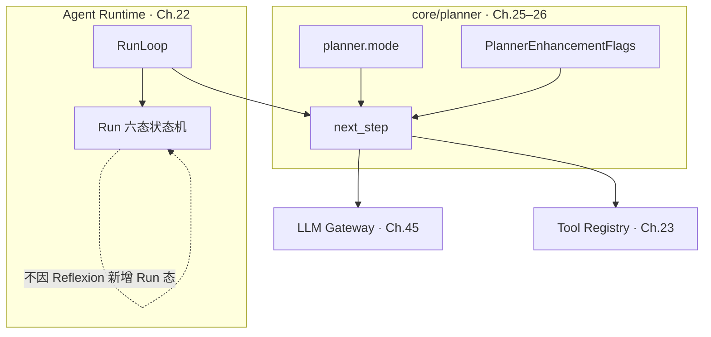
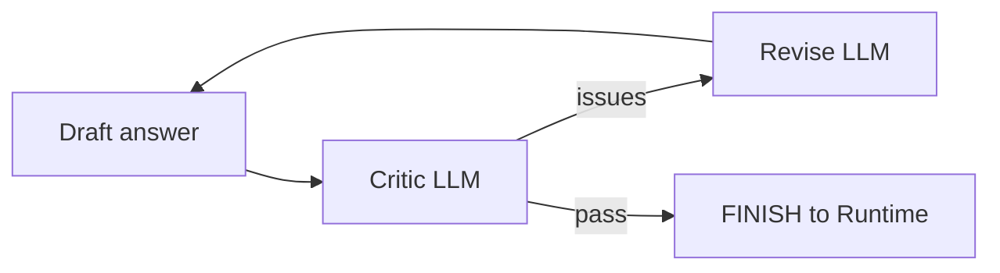
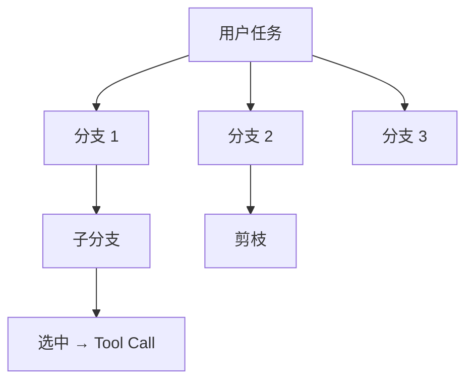

# Ch.26 Agentic Workflow

> **本章目标**：读者学完能区分 **Ch.25 编排模式**（ReAct / Plan-and-Execute）与 **Agentic Workflow 增强环**（Reflexion、Self-Refine、Tree of Thoughts）的适用边界，说明 AutoGPT 类「完全自主」范式为何难以直接进生产，并能在 `mini-platform` 中通过 `PlannerEnhancementFlags` 显式开关增强能力而不破坏 Run 六态。  
> **关键议题**：Reflexion、Self-Refine、Tree of Thoughts、AutoGPT 范式批判  
> **前置阅读**：[Ch.25 Planner 与编排模式](ch25-planner.md)、[Ch.08 结构化输出与提示工程](../part02-model-inference/ch08.md)、[Ch.22 Agent Runtime](ch22-agent-runtime.md)  
> **估计阅读**：约 75 min  
> **mini-platform 关联**：`core/planner/`（与 Ch.25 共用，本章聚焦增强开关）  
> **实战项目**：`projects/multi-agent-workflow/`（增强开关尚未接入实战项目 Run 链；见 `core/planner/config.py`）  
> **按角色推荐阅读**：CTO / 平台负责人 ⇒ 章头 + §1 + §5 + 本章小结 ｜ 架构师 ⇒ §1–§5 ｜ 工程师 ⇒ 全章 + 对照 `PlannerEnhancementFlags` 与实战项目

Ch.25 把 **Planner** 定位为 Runtime 的决策接口：在 `planning` 态调用 `next_step()`，产出 FINISH 或 Tool Call 提议，但不执行工具。ReAct 与 Plan-and-Execute 回答的是「**一步接一步怎么编排**」。但 Ch.25 没有回答另一个问题：

当模型选错时间窗口、工具参数报错、或终稿文案过不了品牌审核时，平台是否允许 Planner **在同一 Run 内额外反思、润色报告或分支搜索**？这些能力写死在各 Agent 应用里，还是由平台统一开关、计量与审计？

本章讨论的 **Agentic Workflow** 指：在 Ch.25 编排模式之上，把 Reflexion / Self-Refine / ToT 等能力拆成 **可关闭、可计量的局部增强**，而不是让 Agent 自主无限循环——它们叠加在 Ch.25 模式之上，而不是替代 Runtime 状态机。

「山岚集团」DataAgent 在 Ch.25 已默认 `planner.mode=react`：问华东 SKU 下滑时，Planner 交替推理与调 SQL。上线后运营反馈两类问题：其一，模型偶发选错时间窗口，希望 **失败后自动反思再试**（Reflexion）；其二，对外报告文案需 **多轮润色** 才能过品牌审核（Self-Refine）。平台若把这类能力写死在 Agent 应用里，每个团队会各自实现「反思循环」，成本与审计口径无法统一。本章给出 **平台级增强开关**：默认关闭，按 Agent 配置按需启用，且所有额外 LLM 轮次仍计入 Step、受 `max_steps` 与 Gateway 配额约束。

本章依次界定与 Ch.25 的边界（§1），介绍 Reflexion（§2）、Self-Refine（§3）、Tree of Thoughts（§4），批判 AutoGPT 类范式并给出生产门槛（§5），并以 `core/planner/` 增强模式收束（§6）。

---

### Agentic Workflow 与 Ch.25 的边界

**本节要回答的问题**：Agentic Workflow 与 Ch.25 编排模式各管什么？二者能否互相替代？

**Agentic Workflow** 在本书中指：在 Planner 决策环内或环外，为提升任务质量而引入的 **额外推理结构**——反思轨迹、输出自我修订、思维树搜索等。它们与 Ch.25 的 **编排模式** 正交：编排模式决定「先规划再执行还是边想边做」；Workflow 增强决定「单步决策是否允许内部多轮 LLM 或并行候选」。

#### 对比表

下表从核心问题、配置项、与 Runtime 关系等维度对比 Ch.25 与 Ch.26。读表时可记住：**编排模式定步骤结构，Workflow 增强定是否允许额外 LLM 轮次**。


| 维度 | Ch.25 编排模式 | Ch.26 Agentic Workflow |
| --- | --- | --- |
| 核心问题 | 下一步做什么工具调用 | 当前步/当前答案是否值得再推理 |
| 典型配置 | `planner.mode`: `react` / `plan_and_execute` | `enhancement.reflexion` 等布尔开关 |
| 与 Runtime 关系 | 每 Step 一次 `next_step()` | 可能在一次 `planning` 内多次调 Gateway，或 Step 间插入 refine 阶段 |
| 默认策略 | 生产 Agent 必须显式选 mode | **全部增强默认关闭** |
| 审计单位 | Step + Tool Call | 额外 LLM 调用须写入 Trace span（Ch.38） |


#### 在架构中的位置

下图展示 Agentic Workflow 增强如何叠加在 Ch.25 Planner 与 Ch.22 Runtime 之上，而不改变 Run 六态：




图中要点：**Reflexion 不会新增 Run 六态**（仍是 `planning` / `executing` 间往返）；增强逻辑封装在 Planner 内部或紧耦合的 helper 中，Runtime 只看见「本轮 `next_step` 耗时变长、Step 计数可能增加」。

#### 计量口径（三个计数器）

平台建议区分三个计数器，避免「Reflection 是否推进 Step」产生歧义：

| 计数器 | 典型计入 | 说明 |
| --- | --- | --- |
| `step_index` | Runtime 每完成一轮 `planning`→`executing` 闭环 | 受 `max_steps` 硬约束 |
| `llm_call_count` | Reflection / Refine / ToT 评估等额外 Gateway 调用 | 须独立 Trace span |
| `tool_call_count` | Registry `invoke` 成功路径 | Reflection LLM **不计** Tool Call |

Reflection 默认计入 `llm_call_count`；是否同时推进 `step_index` 由平台策略配置（建议与 Ch.22 `max_steps` 合并预算）。

#### 常见误区

下面三条误区在企业落地时最常见：

**误区 1：Agentic Workflow = 更高级的 Planner mode。**  
`react` 与 `plan_and_execute` 是互斥（或可组合）的 **编排策略**；Reflexion 可与 ReAct 同时开启——失败反思后再进入下一轮 ReAct，而非替换成第四种 mode。

**误区 2：开启 Reflexion 等于允许无限重试。**  
生产必须绑定 `max_reflection_rounds`、`max_steps`（Ch.22）与 Gateway 预算；否则一次 SQL 语法错误可能触发数十次反思，拖垮共享 Gateway。

**误区 3：ToT 应在每次 Tool Call 前跑满深度搜索。**  
Tree of Thoughts 的 branching factor 与 depth 乘积是 **指数成本**；企业场景宜限定为「高风险写操作前」或「离线报告生成」，而非默认问数路径。

---

### Reflexion

**本节要回答的问题**：Reflexion 在工具失败后做什么？它与 Runtime 将错误反馈给 Planner 有何不同？

**Reflexion**（反思）让 Agent 在任务失败或收到工具错误后，回顾自身轨迹（Thought / Action / Observation），生成 **自然语言反思摘要**，再注入后续 Planner 上下文以改进下一步 [1]。与简单「把 error 字符串反馈给 Planner」不同，Reflexion 显式要求模型总结「我哪里错了、下次应避免什么」，实证上在 AlfWorld、HotPotQA 等任务上提升成功率 [1]。

#### 山岚场景

DataAgent 调用 `sql_executor` 返回 `TOOL_ARGUMENT_INVALID`：模型把「上周」写成了不存在的 `last_week()` 函数。Runtime 将 `result` 事件写入 Run 历史；若仅把原始错误 JSON 反馈给 Planner，模型可能再次幻觉同名函数。开启 Reflexion 后，Planner 在 **同一 Step 或下一 Step 的 planning 入口** 先调一次 **Reflection LLM**（不计 Tool Call），产出：

> 「应用库内日期应用 `date_trunc('week', current_date - interval '7 days')`，勿发明 UDF。」

该摘要进入 Working Memory（Ch.27）；生产实现建议写入时设 `metadata["source"]="reflection"`，便于与 Tool `result` 区分——当前 Demo 未接入 RunLoop 增强环，Working Memory 仅随 Tool Call 追加。随后 Planner 再调用常规模型产出 `next_step`。

#### 与 Runtime 的协作

下面时序图展示 Reflexion 在 Run 主循环中的插入点——发生在 `next_step` 内部，不改变 Run 六态：

```mermaid
sequenceDiagram
    participant Loop as RunLoop
    participant P as Planner + Reflexion
    participant GW as LLM Gateway
    participant Reg as Tool Registry

    Loop->>P: next_step(run_ctx)
    alt 上一轮 Tool failed 且 reflexion 开启
        P->>GW: reflect(trajectory, error)
        GW-->>P: reflection_text
        P->>P: append to working memory
    end
    P->>GW: plan(messages + tools)
    GW-->>P: tool_call or finish
    P-->>Loop: PlannerDecision
    Loop->>Reg: invoke (executing)
```


Reflexion **不替代** Tool 重试：Runtime 仍按 Ch.22 分类 `TOOL_ARGUMENT_INVALID` 是否反馈 Planner；Reflexion 只改善 **反馈 Planner 内容的质量**。

#### 生产参数

Reflexion 相关配置建议如下；生产环境宜从保守默认值起步，按需逐 Agent 开启：


| 参数 | 建议默认 | 说明 |
| --- | --- | --- |
| `enhancement.reflexion` | `false` | Agent 级开关 |
| `max_reflection_rounds` | `2` | 单次 Run 内反思 LLM 调用上限（**生产配置**；当前 Demo 未实现） |
| `reflect_on` | `tool_error`, `empty_result` | 触发条件；慎开 `always` |
| `include_tool_output` | `true` | 反思 prompt 是否含完整 tool output（注意 PII） |


#### 常见误区

**误区：Reflexion = 人工 Reviewer Agent。**  
Reflexion 仍是 **同一 Agent 的自我批评**，无独立审批链；涉及合规否决须走 `waiting_human`（Ch.30），不能靠 Reflexion 绕过。

---

### Self-Refine

**本节要回答的问题**：Self-Refine 与 Reflexion 各解决什么问题？如何避免润色导致事实漂移？

**Self-Refine** 让模型 **迭代改进自己的输出**：生成初稿 → 同一模型（或更强模型）提出批评 → 修订 → 直至满足停止条件 [2]。典型用于 **无工具或工具已结束后的答案润色**，如报告摘要、邮件草稿、JSON 结构修正。

#### 与 Reflexion 的差异

下表对比 Reflexion 与 Self-Refine 的输入、目标与典型时机；二者可叠加，但触发条件与风险不同：


| | Reflexion | Self-Refine |
| --- | --- | --- |
| 输入 | 失败轨迹 + 环境反馈 | 模型自身上一版输出 |
| 目标 | 改进行动 / 工具参数 | 改进文本或结构化答案 |
| 典型时机 | Tool `failed` 或结果为空 | `finish=true` 之前或之后 |
| 风险 | 重复错误工具调用 | 过度润色导致事实漂移 |


山岚场景中，SQL 结果正确但运营要求「结论须含同比、环比各一句」。Planner 已 `finish` 且 answer 仅含环比；开启 `enhancement.self_refine` 时，Planner 在提交最终 `PlannerDecision(finish=True)` 前运行 **Refine 子循环**（最多 `max_refine_iterations` 次），每轮将当前 answer 与品牌 checklist 一并送 Gateway，直至 critic 标记 `pass` 或达上限。**Self-Refine 只能改表达，不得改写 tool output 中的事实数字**（如销售额、同比环比）。

#### Self-Refine 子循环（概念）

Self-Refine 在 Planner 内部形成 draft → critic → revise 闭环，通过后才向 Runtime 提交 FINISH：




**事实锚定**：Refine 的 critic prompt 应要求 **不得 contradict tool outputs**；否则模型可能为流畅度改写数字。平台宜在 refine 阶段注入 **只读** 的 Tool Call 摘要（Ch.27 Working Memory），而非允许模型重新发起 SQL。

#### 配置要点

- `enhancement.self_refine`：默认 `false`。  
- `max_refine_iterations`：建议 `1–3`；报告类 Agent 可至 `5`，须配 Eval（Ch.39）。  
- `refine_target`：`answer` | `plan`（Plan-and-Execute 下可 refine 计划文本，再执行）。  
- 与 **Structured Outputs**（Ch.08）结合：critic 输出 JSON `{ "pass": bool, "issues": [...] }`，便于自动化测试。

---

### Tree of Thoughts

**本节要回答的问题**：ToT 与 Ch.08 提示层 ToT 有何分工？企业场景如何控制搜索成本？

**Tree of Thoughts（ToT）** 将推理展开为 **搜索树**：每个节点是一种「部分解或中间思路」，由模型生成多个候选，再用启发式或 LLM 评估值选择扩展分支，直至找到可执行方案或最终答案 [3]。Ch.08 在 **提示层** 介绍 ToT 与 Self-Consistency 作为 **单次补全的结构**；本章在 **Agent 层** 讨论：ToT 何时作为 Planner 内部搜索，而非普通 CoT。

#### 与 Ch.08 的分工

ToT 可在提示层、Planner 层、Runtime 层分别出现，下表说明各层职责边界：


| 层级 | 职责 | 本章 / Ch.08 |
| --- | --- | --- |
| 提示层 | 单次请求内 `n` 个 sample、投票 | Ch.08 Self-Consistency |
| Planner 层 | 多 Step 间保留分支、回溯、剪枝 | 本章 ToT |
| Runtime 层 | 只执行 **已选分支** 上的 Tool Call | Ch.22 不变 |


山岚 **高风险** 场景：自动改价 Agent 在写入 `price_update` 工具前，Planner 用 ToT 生成三种定价策略分支，用 **评估模型** 打分（合规、毛利、竞品），仅将最高分分支的第一条 Tool Call 交给 Runtime。未选中分支 **不得** 产生副作用——这是与 AutoGPT「边想边做」的关键差别。

!!! warning "未选中分支不得执行工具"
    ToT 搜索在 Planner 内完成；只有 **最终选中分支** 可产出一条 `PlannerDecision`（含 Tool Call）。未选中分支不得调用 Registry `invoke`。

#### ToT 参数与成本

ToT 的 branching factor 与 depth 乘积决定 token 成本；下表给出生产建议默认值：


| 参数 | 含义 | 生产建议 |
| --- | --- | --- |
| `enhancement.tree_of_thoughts` | 总开关 | 默认 `false` |
| `tot_branching` | 每节点候选数 | `3` 以内 |
| `tot_depth` | 最大深度 | `2–3` |
| `tot_evaluator` | `llm` / `rule` | 写操作前用 `rule`+Policy 双检 |
| `tot_budget_tokens` | 单 Run ToT  token 上限 | 与 Gateway 配额联动 |


ToT 搜索完成后，仅 **选中分支** 产生 Tool Call；未选中分支在 Planner 内存中剪枝：




ToT 的 **并行候选** 会放大 Gateway QPS；平台应对 `enhancement.tree_of_thoughts` 做 **租户级配额** 与告警（Ch.38）。

---

### AutoGPT 类范式批判与生产门槛

**本节要回答的问题**：AutoGPT 类「完全自主」范式为何难以直接进生产？平台应如何降维落地？

**AutoGPT** 及同类开源项目（BabyAGI、AgentGPT 等）推广了 **目标分解 + 自主循环 + 长期记忆 + 工具链** 的端到端叙事：给 Agent 一个高层目标，它自行拆任务、搜网页、写文件、再设新目标。Demo 效果直观，但 **企业 DataAgent 平台** 若照搬，常遇到以下结构性问题 [4][5]：

#### 批判要点

1. **目标漂移（goal drift）**  
   无外部验收时，Agent 为「完成子目标」不断扩展 scope（再查竞品、再写博客），与用户原始问数无关。生产须 **Run 级 input + max_steps** 硬边界（Ch.22），而非无限 `while True`。

2. **副作用不可控**  
   AutoGPT 类循环常默认 **每轮都可调工具**。企业要求 **Policy 前置**（Ch.50）、写操作 **HITL**（Ch.30）、Tool Registry **版本 pin**（Ch.23）。完全自主 = 与这三者冲突。

3. **成本与延迟不可预测**  
   自主循环缺少 **Step 预算** 与 **token 预算**，一次「研究型」任务可消耗百万 token。平台须把 Reflexion / Self-Refine / ToT 全部 **计量** 并纳入 FinOps（Ch.46）。

4. **记忆污染**  
   长期把未验证中间结论写入 Memory（Ch.27），会在后续 Run 中被检索放大错误。AutoGPT 式「什么都记」违背企业 **可删除、可审计** 要求。

5. **评估与回放缺失**  
   自主 Agent 难以回答「为何上周给了错误口径」。Run / Step / Tool Call + Trace（Ch.22、Ch.38）是合规底线，不是可选项。

#### 生产门槛（平台 checklist 摘要）

将 AutoGPT 类范式降维为 Planner 增强时，下表列出平台必须满足的生产门槛：


| 门槛 | 说明 |
| --- | --- |
| 有界 Run | `max_steps`、Run 超时、取消 API |
| 增强默认关 | `PlannerEnhancementFlags` 全 `false` |
| 显式启用 | Agent YAML 逐开关 + 审批记录 |
| 副作用网关 | Registry + Policy；ToT 仅选中分支执行 |
| 记忆治理 | 长期记忆带来源与时间戳；支持删除（Ch.27） |
| 可观测 | 每次 reflect / refine / tot_eval 独立 span |
| 人机协同 | 高风险仍 `waiting_human`，非自主到底 |


**结论**：AutoGPT 类范式适合 **个人实验与原型**；山岚级平台应将其 **降维** 为可配置、可关闭、可计量的 **Planner 增强**（拆成 Reflexion / Self-Refine / ToT 等局部能力，而非默认自主循环），由 Runtime 保持 **六态与审计模型** 不变。

---

### mini-platform 工程实现：planner 增强模式

**本节要回答的问题**：当前代码已实现了哪些增强开关？哪些仍是生产接口草案？

当前 `mini-platform/core/planner/config.py` 已定义 `PlannerEnhancementFlags`，但 **只包含三个布尔开关**；`reflect()`、`refine_answer()`、`tot_search()` 等子循环 **尚未** 接入 Demo 执行逻辑。本节区分「当前 Demo」与「生产接口草案」。

#### 3.1 mini-platform 中的实现路径

```
mini-platform/core/planner/
├── __init__.py              # create_planner、PlannerEnhancementFlags、PlannerConfig
├── config.py                # PlannerEnhancementFlags（三布尔开关）
├── react_planner.py         # Ch.25 ReAct 规则 Demo
├── plan_execute.py          # Ch.25 Plan-and-Execute 规则 Demo
└── planner.py               # create_planner 工厂

# 生产扩展目标（当前不存在）：
# enhancements.py            # reflexion / self_refine / tot 子模块
```

**设计原则**：增强能力 **默认关闭**；`RunLoop` 不感知 Reflexion 内部细节，只读取 `PlannerDecision` 与变长的 planning 耗时。

当前 Demo 已实现的开关（`core/planner/config.py`）：

```python
@dataclass
class PlannerEnhancementFlags:
    """Agentic Workflow 增强开关；生产默认全 False。"""

    reflexion: bool = False
    self_refine: bool = False
    tree_of_thoughts: bool = False
```

生产实现时，宜将 `max_reflection_rounds`、`max_refine_iterations`、`tot_branching`、`tot_depth`、`tot_budget_tokens` 等上限加入 `PlannerConfig`，并在 `next_step` 内显式计入 `llm_call_count`、token budget 与 Trace span。

#### 3.2 可运行代码与配置

**运行环境**：本章无独立增强子循环实现。验证「增强关闭时 Run 边界稳定」：

```bash
cd mini-platform
pytest tests/test_multi_agent_workflow_run.py tests/test_runtime.py -q
python3 projects/multi-agent-workflow/run.py start   # 观察未开启 reflexion 的完整 Run
```

`PlannerEnhancementFlags` 定义见 `core/planner/config.py`。

Agent 配置示例（管控面 YAML，**生产目标**）：

```yaml
planner:
  mode: react
  enhancement:
    reflexion: true
    self_refine: false
    tree_of_thoughts: false
    max_reflection_rounds: 2
```

概念接线（增强子循环 **尚未实现**）。以下片段 **不可直接复制运行**：`RunLoop` 构造时 **必须** 注入 `registry`（Ch.23），且 Reflexion 子循环尚未接入；仅示意配置与调用关系：

```python
from core.planner import PlannerConfig, PlannerEnhancementFlags, create_planner
from core.runtime import RunLoop

config = PlannerConfig(
    enhancements=PlannerEnhancementFlags(reflexion=True),
)
# 生产须：registry = build_workflow_registry() 或等价 ToolRegistry
loop = RunLoop(planner=create_planner(config))  # 缺 registry → TypeError
loop.run(agent_id="data-agent", user_input="...", context={"tenant_id": "shanlan-retail"})
```

#### 3.3 生产化 checklist


| 能力 | 说明 | 本章 Demo |
| --- | --- | --- |
| `PlannerEnhancementFlags` 三布尔开关 | 配置入口已定义 | ✓ |
| Reflexion / Self-Refine / ToT 子循环 | `enhancements.py` | ☐ |
| 与 `max_steps` / `llm_call_count` 联动 | 计量与截断 | ☐ |
| Trace 细分 span | `planner.reflect` / `planner.refine` / `planner.tot` | ☐ |
| Gateway 预算 | 租户级 token / 调用上限 | ☐ |
| ToT 仅选中分支执行 | 未选中分支无 Tool Call | 须实现 |
| 检查点含 enhancement 状态 | 与 Ch.27 联调 | ☐ |


#### 3.4 常见问题

**问题 1：Reflexion 与 Tool 重试双计数爆炸**  
现象：`TOOL_ARGUMENT_INVALID` 既触发 Registry 反馈 Planner，又触发 Reflexion，再触发模型重试，单 Step 内 6 次 Gateway。修复：Reflexion 受 `max_reflection_rounds` 约束；与 Ch.22 反馈 Planner 上限合并配置。

**问题 2：Self-Refine 改写 SQL 结论**  
现象：润色后 answer 中数字与 `sql_executor` 结果不一致。修复：critic 约束「数字必须引用 tool output」；Eval 抽检（Ch.39）。

**问题 3：ToT 并行分支均执行工具**  
现象：三个分支都调了 `price_update`，造成三重写。修复：Runtime 只执行 **Planner 最终提交的一条** Tool Call；ToT 搜索在 Planner 内完成，分支仅为内存对象。

**问题 4：把 AutoGPT 式自主循环接进 RunLoop**  
现象：Planner 内部 `while not done` 无 Step 边界，SSE 长时间无 `state` 更新。修复：任何增强子循环须 **yield Step 边界** 或限制为 planning 态内可观测子 span，禁止绕过 `max_steps`。

---

## 本章小结

### 关键结论

1. **Ch.25 编排模式** 与 **Ch.26 Agentic Workflow** 正交：前者定步骤结构，后者定是否反思 / 精炼 / 分支搜索。  
2. **Reflexion** 改善失败后的反馈 Planner 质量；**Self-Refine** 改善终稿质量；**ToT** 在受控搜索下选策略——三者均 **默认关闭**。  
3. **AutoGPT 类完全自主** 与 Run 边界、Policy、HITL、审计冲突；企业应 **降维为可计量增强**，而非默认行为。  
4. **`PlannerEnhancementFlags`** 是平台统一开关；Runtime 六态不变，检查点须含 enhancement 与 Memory 状态。  
5. 所有增强 LLM 调用须 **独立可观测**，并受 Gateway 与 `max_steps` 双重约束。

### 上线检查清单

- 新 Agent 是否默认 `enhancement.* = false`？  
- 开启 Reflexion / ToT 是否有 **租户配额与审批**？  
- Self-Refine 是否锚定 tool output，防止事实漂移？  
- ToT 是否保证 **仅一条** Tool Call 进入 `executing`？  
- 检查点恢复后 Planner 是否不会「失忆」或「重复反思」？

### 本书延伸阅读

- [Ch.25 Planner 与编排模式](ch25-planner.md)  
- [Ch.27 Memory 系统](ch27-memory.md)  
- [Ch.30 Human-in-the-loop 与长任务](ch30-human-in-the-loop.md)  
- [Ch.38 Agent Trace 与会话回放](../part07-observability-eval/ch38-trace.md)  
- [Ch.08 结构化输出与提示工程](../part02-model-inference/ch08.md)  
- `mini-platform/projects/multi-agent-workflow/README.md`
- `mini-platform/core/planner/config.py`

---

## 参考文献

[1] Shinn, N., Cassano, F., Gopinath, R., Narasimhan, K., & Yao, S. (2023). Reflexion: Language agents with verbal reinforcement learning. *NeurIPS*. arXiv:2303.11366. [https://arxiv.org/abs/2303.11366](https://arxiv.org/abs/2303.11366)

[2] Madaan, A., Tandon, N., Gupta, P., et al. (2023). Self-Refine: Iterative refinement with self-feedback. *NeurIPS*. arXiv:2303.17651. [https://arxiv.org/abs/2303.17651](https://arxiv.org/abs/2303.17651)

[3] Yao, S., Yu, D., Zhao, J., et al. (2023). Tree of Thoughts: Deliberate problem solving with large language models. *NeurIPS*. arXiv:2305.10601. [https://arxiv.org/abs/2305.10601](https://arxiv.org/abs/2305.10601)

[4] Significant Gravitas. (2023). *AutoGPT*. GitHub. [https://github.com/Significant-Gravitas/AutoGPT](https://github.com/Significant-Gravitas/AutoGPT)

[5] Wang, L., Ma, C., Feng, X., et al. (2024). A survey on large language model based autonomous agents. *Frontiers of Computer Science*, 18(6), 186345. [https://doi.org/10.1007/s11704-024-40231-1](https://doi.org/10.1007/s11704-024-40231-1)

[6] Yao, S., Zhao, J., Yu, D., et al. (2023). ReAct: Synergizing reasoning and acting in language models. *ICLR*. arXiv:2210.03629. [https://arxiv.org/abs/2210.03629](https://arxiv.org/abs/2210.03629)

[7] Li, X. (2025). A review of prominent paradigms for LLM-based agents: Tool use, planning (including RAG), and feedback learning. In *Proceedings of COLING 2025*. arXiv:2406.05804. [https://arxiv.org/abs/2406.05804](https://arxiv.org/abs/2406.05804)

[8] Masterman, T., Besen, S., Sawtell, M., & Chao, A. (2024). The landscape of emerging AI agent architectures for reasoning, planning, and tool calling: A survey. arXiv:2404.11584. [https://arxiv.org/abs/2404.11584](https://arxiv.org/abs/2404.11584)
