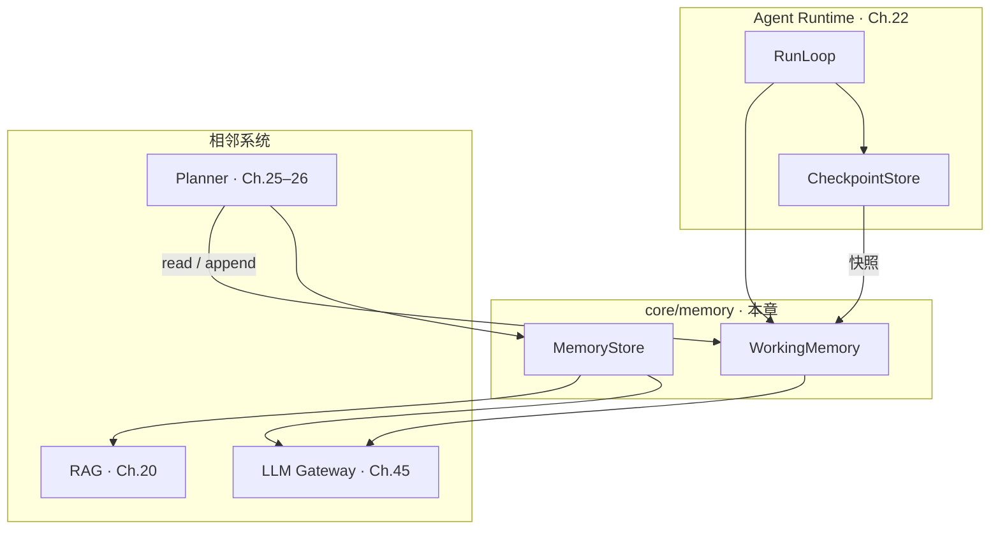
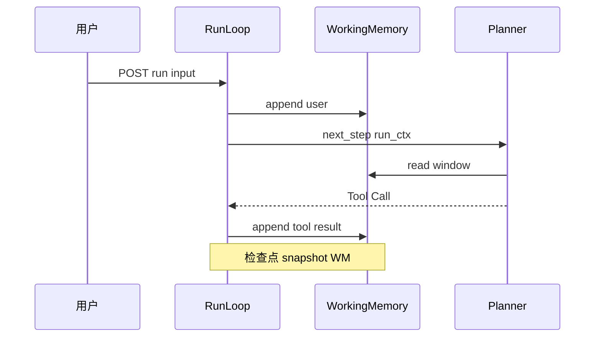
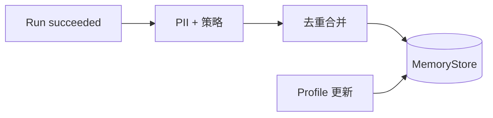
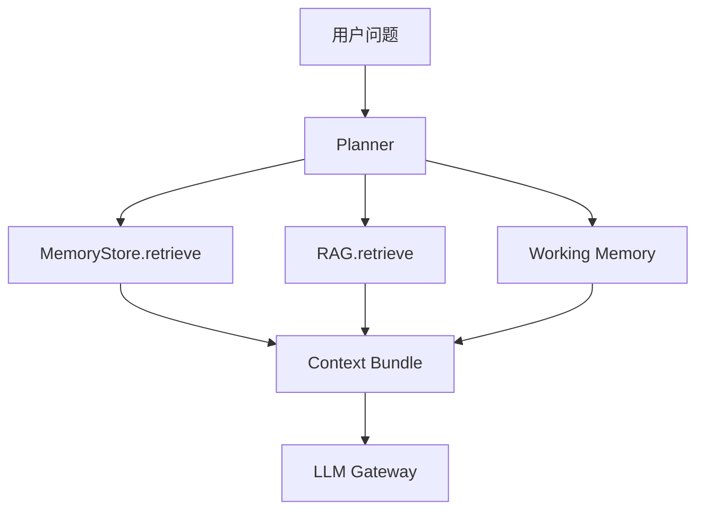

# Ch.27 Memory 系统

> **本章目标**：读者学完能说明 **Memory 子系统** 在 Agent 平台中的职责边界、短期 / 长期 / 用户画像 / 企业上下文四类记忆的存储与检索策略，厘清 Memory 与 RAG（Ch.20）的分工，掌握上下文超长时的滑窗与压缩治理，并对照 `core/memory/` 的 `WorkingMemory` 与 `MemoryStore` 实现检查点恢复所需字段。  
> **关键议题**：短期/长期/用户画像/企业上下文；与 RAG 边界；mem0、Letta 对标  
> **前置阅读**：[Ch.22 Agent Runtime](ch22-agent-runtime.md)、[Ch.20 企业知识库 RAG](../part04-vector-knowledge/ch20-rag.md)、[Ch.26 Agentic Workflow](ch26-agentic-workflow.md)  
> **估计阅读**：约 80 min  
> **mini-platform 关联**：`core/memory/` · `core/runtime/run_models.py`（`working_memory`）  
> **实战项目**：`projects/multi-agent-workflow/`（检查点含 `working_snapshot`；见 `.checkpoints/`）  
> **按角色推荐阅读**：CTO / 平台负责人 ⇒ 章头 + §1 + §5 + 本章小结 ｜ 架构师 ⇒ §1–§6 ｜ 工程师 ⇒ 全章 + 对照实战项目检查点

Ch.22 指出：检查点 payload 必须能 **重建 Planner 可见上下文**——否则进程重启后 Planner「失忆」，会重复选表或重复调用同一工具。但 Ch.22 没有展开：Planner 可见的上下文应如何分层存储、何时写入、何时检索、何时压缩？

业界 Agent 综述将 **Memory** 列为与规划、工具并列的基础模块 [1]；本书将 Memory 实现为平台子系统 **Memory Service**（逻辑模块 `core/memory/`），而不是每个 Agent 应用自管 Redis 键值。

「山岚集团」运营总监与 DataAgent 的多轮问数在同一会话窗口进行：先问华东 SKU，再追问「那华北呢」——Planner 须 **读取上轮已确认的指标口径与时间范围**；跨周再次登录时，系统记得她偏好 **表格 + 同比**（**用户画像**）；而「华东区含哪些门店」属于 **企业上下文**（组织主数据），不应与用户私人偏好混存。若把这些全部塞进 prompt，很快触碰模型上下文上限；若全部交给 RAG，又会把 **私有对话** 与 **企业文档** 混检。本章给出分层记忆模型与工程接口。

本章依次介绍 Memory 职责边界（§1）、短期记忆（§2）、长期记忆与用户画像（§3）、企业上下文记忆（§4）、与 RAG 的边界（§5）、超长治理与 mem0 / Letta 对标（§6），并以 `core/memory/` 工程实现收束（§7）。

---

### Memory 子系统职责与边界

**本节要回答的问题**：Memory 子系统在平台里管什么、不管什么？四类记忆各存什么？

**Memory 子系统** 负责：**写入、检索、压缩、删除** Agent 在 Run 与会话中需要再次可见的信息；**不负责** 工具执行（Runtime）、外部知识库索引（RAG）、模型路由（Gateway）。

#### 四类记忆（本书模型）

下表概括四类记忆的生命周期、典型内容与存储形态；读表时可按「越靠近 Run 越短、越结构化越静态」理解分层：


| 类型 | 生命周期 | 典型内容 | 存储形态 |
| --- | --- | --- | --- |
| **短期（Working）** | 单次 Run 或会话窗口 | 用户轮次、Tool 结果、Reflexion 摘要 | 内存 / Redis；检查点必含 |
| **长期（Episodic）** | 跨 Run、跨天 | 历史任务结论、确认过的口径 | 向量 + 元数据 DB |
| **用户画像（Profile）** | 跨会话、可人工修正 | 展示偏好、常用维度、角色 | 结构化 Profile 表 |
| **企业上下文（Org）** | 租户级、主数据驱动 | 组织架构、区域定义、数据域 | 与 MDM / 语义层同步 |


#### 在架构中的位置

下图展示 Memory 子系统与 Runtime、Planner、RAG 的读写关系：




**读路径**：Planner 在 `planning` 前组装 **context bundle** = Working Memory 滑窗 + 按需检索长期 / 画像 / 企业上下文。**写路径**：Tool `result`、用户新消息、Reflexion 文本写入 Working；Run 成功结束且策略允许时，异步 **promote** 片段到长期存储。

#### 与相邻组件的边界

下表概括 Memory 与相邻组件的分工。读表时可记住一条主线：Memory 管「什么该被 Planner 再次看见」；Run 推进、工具执行、权限终审分别由 Runtime、Registry、Policy 负责。


| 组件 | Memory 做什么 | Memory 不做什么 |
| --- | --- | --- |
| **Runtime** | 检查点序列化 Working 快照 | 不驱动 Run 六态 |
| **Planner** | 提供 `assemble_context(run_ctx)` | 不决定 tool 参数校验 |
| **RAG** | 长期记忆可 **引用** 文档 chunk 来源 | 不替代企业知识库索引 |
| **Policy** | 删除 / 导出须过权限 | 不做鉴权本身 |
| **Checkpoint** | Working 是 payload 核心字段 | 长期记忆不全量进每次检查点 |


#### 常见误区

下面三条误区在企业落地时最常见：

**误区 1：Memory = 向量库。**  
向量检索只是长期记忆的一种实现；Working Memory 以 **有序消息列表** 为主，Profile 以 **结构化 KV** 为主。

!!! warning "Memory 不等于向量库"
    Working / Profile / Org 不应全部塞进向量库。短期记忆用有序消息列表；Profile 用结构化 KV；Episodic 才适合向量检索。

**误区 2：检查点只存 `state=executing`。**  
Ch.22 常见问题 3：缺 Working Memory 会导致恢复后口径漂移；检查点须可还原 **完整 Planner 输入**。

**误区 3：把所有历史对话永久写入长期记忆。**  
噪声与错误结论会被未来 Run 检索放大（Ch.26 AutoGPT 批判）；须 **晋升策略** 与 **TTL / 删除 API**。

---

### 短期记忆

**本节要回答的问题**：Working Memory 存什么、如何与 Run / Step 对齐？检查点恢复的最小充分集是什么？

**短期记忆（Working Memory）** 保持 **当前 Run 或会话** 内 Planner 与 Gateway 所需的 **有序上下文**：用户 `input`、assistant 推理摘要、Tool Call / `result` 对、系统注入的企业上下文指针等。其生命周期 ≤ Run 或 **会话 idle 超时**；是检查点恢复的 **最小充分集**。

下文 §2–§5 先说明 **生产级 Memory 契约**（含 Episodic、Profile、Org 与 token 级滑窗）。当前 `mini-platform` Demo 在 `core/memory/working.py` 只实现 **`append` / `snapshot` / `restore` + `max_messages` 条数截断**，并在 Run 检查点中持久化 `working_snapshot`（§7）。阅读代码时请优先对照 §7「当前 Demo 已实现的接口」，勿将 §3–§5 的生产 API 示例当作可直接运行的 Demo 代码。

#### 消息模型

参考 `core/memory/working.py` 的 `MemoryMessage`，当前 Demo 每条 Working 消息包含以下字段：


| 字段 | 说明 |
| --- | --- |
| `role` | `MessageRole`：`user` / `assistant` / `tool` / `system` |
| `content` | 文本（结构化 Tool 结果建议 JSON 字符串） |
| `metadata` | 扩展字段，如 `source`、`tool_call_id`；生产可加 `token_estimate` 供滑窗预算（Demo 未强制） |

生产模型还可增加 `created_at` 等审计字段；当前 Demo 通过 `metadata` 承载来源与 Tool 对齐信息。


Tool 结果宜 **摘要 + 可展开引用**（大结果集只保留前 N 行 + `result_ref` 指向对象存储），避免 Working Memory 单条撑爆上下文。

#### 与 Run / Step 的关系

下面时序图展示 Working Memory 在 Run 主循环中的 append / read / snapshot 时机：




每个 **Step** 结束后可选 **compact**（合并相邻 tool 消息），但 **不得丢失** 最后一次成功 SQL 的完整口径字段。

#### 会话 vs Run

同一 Console 会话可含多个 Run（Ch.22）。Working Memory 两种策略对比如下：


| 策略 | 行为 | 适用 |
| --- | --- | --- |
| `per_run` | 每 Run 独立 Working；会话历史由长期记忆补充 | 审计严格、任务隔离 |
| `per_session` | 会话内 Run 共享 Working 前缀 | 连续追问体验 |


山岚 DataAgent 默认 **`per_session` 滑窗 + per_run 工具链隔离**：追问继承口径，但 Tool Call 列表按 `run_id` 分段，避免检查点混淆。

---

### 长期记忆与用户画像

**（生产扩展）** 本节描述 Episodic Memory 与 User Profile 的平台契约；当前 Demo 未实现 `retrieve_episodes()` / `get_profile()` 等 API，见 §7 checklist 与 §2 开头的 Demo 边界说明。

**本节要回答的问题**：长期 Episodic 与用户 Profile 如何分工？Run 成功后哪些内容可以晋升到长期存储？

**长期记忆** 保存 **跨 Run 仍应被 recall 的情节性信息**：上周确认过的「华东定义」、用户曾采纳的报告结构。检索通常为 **向量 + 元数据过滤**（`user_id`、`tenant_id`、时间范围）。

**用户画像（Profile）** 是 **显式、低维、可编辑** 的用户模型，与 episodic 向量记忆分工如下：


| | 长期 Episodic | 用户 Profile |
| --- | --- | --- |
| 写入 | Agent 推断 + 用户确认 | 用户设置 / HR 同步 / 运营标注 |
| 检索 | 相似度 + 时间衰减 | 按键读取，无向量 |
| 合规 | 须支持 explain & delete | Console 可直接改 |
| 示例 | 「上次分析用了 W52 口径」 | `chart_type=table`, `metrics=[同比,环比]` |


#### 晋升（promotion）流程

Run `succeeded` 后，**异步 job** 评估是否写入长期记忆：

1. 是否含用户 **显式确认**（「记住这个口径」）？  
2. 是否通过 **PII 扫描**？  
3. 是否与已有 memory **去重**（mem0 类合并 [2]）？

晋升流程从 Run 成功到写入 MemoryStore，Profile 更新走独立路径：




Profile 更新 **不自动** 从单次 Run 推断敏感字段（如职级、薪酬）；须配置 **允许推断字段白名单**。

---

### 企业上下文记忆

**（生产扩展）** 本节描述租户级 Org Memory 的命名空间与刷新策略；当前 Demo 未实现 `org:{tenant_id}:regions` 等 KV 读写，Planner 组装 context 时仍依赖 Run `context` 与 Working Memory。

**本节要回答的问题**：企业 Org 上下文与用户 Profile / Episodic 为何要分命名空间？如何保证组织主数据变更后 Agent 不用旧定义？

**企业上下文** 是 **租户级**、相对静态的知识：区域划分、品牌列表、会计期间定义、数据域 ACL 摘要。来源通常是 **MDM、语义层（Ch.33）、IAM**，而非用户对话。

#### 与 Profile / Episodic 的隔离

四类存储键的作用域与更新频率不同；Planner 组装 context 时须严格按命名空间读取，避免混检：


| 存储键 | 作用域 | 更新频率 |
| --- | --- | --- |
| `org:{tenant_id}:regions` | 租户 | 低 |
| `org:{tenant_id}:metric_defs` | 租户 | 中 |
| `user:{user_id}:profile` | 用户 | 低–中 |
| `user:{user_id}:episodes` | 用户 | 高 |


Planner 组装 context 时 **先注入企业上下文**（system 段），再拼 Working 滑窗，最后 **按需** 检索 episodic——避免用户私有检索污染组织定义。

#### 山岚示例

问「华东区」时，`org:shanlan-retail:regions` 注入：

> 华东区 = 沪浙苏皖赣闽（2024 组织调整版）

该条目 **不** 写入用户 episodic；组织调整时由数据平台 **批量刷新** MemoryStore，并 bump `version` 供审计。

#### 缓存与一致性

企业上下文读多写少，适合 **本地缓存 + TTL**；语义层变更事件（Ch.33）应触发 **失效**，否则 Agent 会用旧区域定义答新问数。

---

### Memory 与 RAG 的边界

**本节要回答的问题**：Memory 与 RAG 都往 Planner prompt 里塞内容，二者在来源、权限与更新上如何分工？（概念对比；Episodic 向量检索等 **生产 API** 见 §3，Demo 未实现。）

**RAG**（Ch.20）索引 **企业文档**：制度 PDF、产品手册、Wiki。**Memory** 索引 **Agent 运行产生的、或用户/组织级结构化记忆**。二者都可能在 Planner prompt 中出现，但 **数据管线、权限模型、更新频率** 不同。

#### 对比表

下表从内容来源、典型查询、错误类型等维度对比 RAG 与 Memory；协作时须 **分 quota、分 cite 规则**：


| 维度 | RAG（Ch.20） | Memory（本章） |
| --- | --- | --- |
| 内容来源 | 文档 ingest | Run 产出、Profile、Org 同步 |
| 典型查询 | 「退货政策是什么」 | 「上次用的口径是什么」 |
| 权限 | 文档 ACL | `user_id` / `tenant_id` / 角色 |
| 更新 | 文档版本、re-index | 晋升 job、Profile 编辑、Org 同步 |
| 错误类型 | 检索错 chunk | 错误结论被 **记住** 并反复 recall |
| 删除 | 文档下架 | GDPR 用户删除、memory 条目 revoke |


#### 协作模式（推荐）

Planner 组装 context bundle 时，Working、MemoryStore 与 RAG 三路检索合并后送 Gateway：




**规则**：  
- 事实性制度问题 **优先 RAG**，并 **cite** 文档版本。  
- 个性化延续 **优先 Memory**（Working + Profile + episodic）。  
- **禁止** 将 RAG chunk 未经审查直接写入长期 episodic（避免 duplicate 与权限泄漏）。

#### 常见误区

下面两条误区在 Memory 与 RAG 边界上最常见：

**误区：用 RAG 存聊天历史。**  
聊天无稳定 `doc_id`、权限随会话变化，且 re-index 成本高；应走 Memory episodic。

**误区：Memory 检索替代 NL2SQL 语义层。**  
表字段含义仍来自语义层（Ch.33）；Memory 只记 **已确认口径**，不记整库 schema。

---

### 上下文超长治理与 mem0、Letta 对标

**本节要回答的问题**：上下文超长时 Memory 子系统有哪些治理手段？mem0、Letta 与本书模型如何对标？

模型上下文有限（即使 128k+，企业仍受 **成本、延迟、注意力稀释** 约束）。Memory 子系统须 **主动治理** Working 与检索结果总 token，而非等到 Gateway 报错。

#### 治理手段

下表列出滑窗、摘要、裁剪等治理手段及其适用层；压缩时须保留最后一次成功 Tool 的关键字段：


| 手段 | 作用 | 适用层 |
| --- | --- | --- |
| **滑窗（sliding window）** | 保留最近 K 条或 K token | Working |
| **摘要压缩（summarize）** | 旧轮次合并为一条 summary | Working |
| **Tool 结果裁剪** | 大表只留 schema + sample | Working |
| **检索 top-k 限制** | episodic / RAG 各 cap | Store |
| **分层注入** | Org 固定小；episodic 动态 | 组装策略 |


超长治理流水线：先估算 token，超阈值则摘要旧轮再滑窗，最后送 Gateway：


压缩 **须保留**：最近一次成功 Tool 的完整关键字段、当前用户原问、进行中的 `tool_call_id` 链。

#### 与 mem0、Letta 对标

**mem0** [2] 强调 **可扩展的长期记忆层**：从对话中提取「记忆条目」、去重合并、向量检索后再注入 prompt——与本书 **Episodic + promotion** 高度同构。差异在于：企业平台须把 mem0 式合并 **纳入租户策略与删除 API**，而非黑盒永久记住。

**Letta**（原 MemGPT [3]）强调 **主存 / 外存分页**——可理解为 **模型上下文内外的两层存储**：Working 相当于 **RAM 中的 core memory**，MemoryStore 相当于 **archival storage**，由 Agent 学习 **何时 `search` / `insert`**。本书在平台层 **显式模块**（`WorkingMemory` / `MemoryStore`）而非完全交给模型自管工具，原因是：**审计、配额、Policy** 需要 deterministic API。若引入第三方 memory SDK，也须包在 adapter 后，**不能**绕过平台删除 / 审计 API。

#### 产品矩阵（能力对照）

下表对比本书 mini-platform 与 mem0、Letta 在 Working 滑窗、晋升、租户隔离等能力上的异同：


| 能力 | 本书 mini-platform | mem0 | Letta |
| --- | --- | --- | --- |
| Working 滑窗 | `working.py` | 会话层 | core memory |
| 长期提取合并 | promotion job | 内置 | archival + 工具 |
| 用户 Profile | `store.py` profile API | 部分支持 | 可配置 persona |
| 企业 Org 上下文 | `store.py` org namespace | 需自建 | 需自建 |
| 检查点恢复 | 与 Ch.22 联调 | 依部署 | 依部署 |
| 租户隔离 | 架构内置（Memory 键与 API 强制 `tenant_id`） | 依部署自行实现 | 依部署自行实现 |


**选型建议**：原型可评估 mem0 / Letta SDK；**山岚级平台** 仍建议 **自研 `core/memory/` 接口**，将 vendor 实现放在 adapter 层，避免 Run 检查点与审计模型被绑死。

---

### mini-platform 工程实现：core/memory

**本节要回答的问题**：当前 Demo 已实现哪些 Memory 接口？哪些属于生产扩展目标？

当前 `core/memory/` **实现最小 Working Memory**；实战项目 Run 链中 `RunContext.working_memory` 在每次 Tool Call 后追加消息，`RunLoop._save_checkpoint` **已写入** `working_snapshot`（持久化于 `projects/multi-agent-workflow/.checkpoints/`）。Episodic / Profile / Org / promotion / token 级滑窗仍属于生产扩展目标。

#### 3.1 mini-platform 中的实现路径

```
mini-platform/core/memory/
├── __init__.py           # WorkingMemory、MemoryStore、MemoryMessage、MessageRole
├── working.py            # append / snapshot / restore（按 max_messages 截断）
└── store.py              # get_working / save_working / delete

core/runtime/
├── run_models.py         # RunContext.working_memory
└── run_loop.py           # _save_checkpoint 含 working_snapshot

projects/multi-agent-workflow/
├── run.py
└── .checkpoints/         # 持久化检查点（含 working_snapshot）
```

#### 当前 Demo 已实现的接口

```python
from core.memory import MemoryMessage, MessageRole, MemoryStore

store = MemoryStore()
wm = store.get_working("run-demo")
wm.append(MemoryMessage(
    role=MessageRole.USER,
    content="华东 SKU 下滑？",
    metadata={"source": "user_input"},
))
wm.append(MemoryMessage(
    role=MessageRole.TOOL,
    content='{"rows":[{"sku":"A001","delta":-0.12}]}',
    metadata={"source": "tool_result", "tool_call_id": "tc-1"},
))

snapshot = wm.snapshot()
restored = store.get_working("run-demo-restored")
restored.restore(snapshot)
```

`WorkingMemory` 当前通过 **`max_messages` 条数截断**，无 token 级 `window()`。`retrieve_episodes()`、`get_profile()`、`get_org_context()`、`promote_from_run()` 与 `assemble_context()` 是 **生产接口建议**，Demo 尚未实现。

#### 3.2 可运行代码与配置

在 `mini-platform` 根目录可快速验证 Working Memory API，或跑通实战项目后查看检查点：

```bash
cd mini-platform
python3 projects/multi-agent-workflow/run.py start
# 检查点：projects/multi-agent-workflow/.checkpoints/<run_id>.json
# 字段 working_snapshot 含 USER / TOOL 消息列表
```

独立验证 `WorkingMemory` API：

```bash
python3 - <<'PY'
from core.memory import MemoryMessage, MessageRole, MemoryStore

store = MemoryStore()
wm = store.get_working("run-demo")
wm.append(MemoryMessage(role=MessageRole.USER, content="test", metadata={}))
print(wm.snapshot())
PY
```

生产检查点契约（实战项目已部分实现）：

```python
checkpoint_payload = {
    "run_id": run_ctx.run_id,
    "state": sm.state.value,
    "step_index": run_ctx.step_index,
    "tool_calls": [...],
    "working_snapshot": wm.snapshot(),  # 生产须含
}
```

#### 3.3 生产化 checklist


| 能力 | 说明 | 本章 Demo |
| --- | --- | --- |
| `WorkingMemory.append` / `snapshot` / `restore` | `working.py` | ✓ |
| `MemoryStore.get_working` / `save_working` / `delete` | `store.py` | ✓ |
| token 级 `window(max_tokens)` | 超长治理 | ☐ |
| 检查点含 `working_snapshot` | 实战项目 · `run_loop._save_checkpoint` | ✓ |
| Episodic / Profile / Org API | `store.py` 扩展 | ☐ |
| `assemble_context` | `assemble.py` | ☐ |
| promote / delete_user_memories | 合规删除 | ☐ |


#### 3.4 常见问题

**问题 1：检查点恢复失忆（Ch.01 / Ch.22）**  
现象：只恢复 `state` 与 `tool_calls`，Planner 丢失 SQL 结果，重新选表。修复：检查点 `working_snapshot` 必存；实战项目已在 `run_loop._save_checkpoint` 写入，跨进程 `approve` 时从 `.checkpoints/` 恢复。

**问题 2：Tool 大结果撑爆 Working**  
现象：一次 10 万行 CSV 写入 `content`，Gateway 413。修复：Tool handler 层 truncate + `result_ref`；Working 只存 sample。

**问题 3：episodic 检索污染**  
现象：检索到另一用户相似问题。修复：`retrieve_episodes` 强制 `user_id` + `tenant_id` 过滤；向量库分区。

**问题 4：Org 上下文过期**  
现象：组织合并后 Agent 仍用旧「华东」定义。修复：`get_org_context` 带 `version`；Console 展示 memory 生效版本。

**问题 5：压缩摘要改写数字**  
现象：summarize 把 `-12%` 写成 `-10%`。修复：摘要 prompt 要求 **数字逐字引用**；关键 metrics 不参与 LLM 摘要，原样保留。

---

## 本章小结

### 关键结论

1. **Memory** 是平台子系统：Working 服务 Run / 会话；Store 服务 Profile、Org、Episodic；**不等于 RAG**。  
2. **检查点** 必须含 Working Memory 快照，否则 Planner 恢复后失忆（Ch.22 常见问题 3）。  
3. **企业 Org 上下文** 与 **用户 Profile / Episodic** 分命名空间，权限与更新频率不同。  
4. **超长治理** 靠滑窗、摘要、检索 cap 组合；压缩不得丢失最后成功 Tool 的关键字段。  
5. **mem0 / Letta** 对标的是长期记忆与分页理念；生产平台宜 **自研接口 + 可选 adapter**，保证租户隔离与删除能力。

### 上线检查清单

- 检查点恢复后 Planner 能否看到 **完整 Working 窗口**？  
- 长期记忆晋升是否有 **用户确认 / PII** 闸门？  
- RAG 与 Memory 检索是否 **分 quota、分 cite 规则**？  
- 是否提供 **按用户删除** memory API？  
- Org 上下文变更是否有 **版本失效** 机制？

### 本书延伸阅读

- [Ch.22 Agent Runtime](ch22-agent-runtime.md)  
- [Ch.20 企业知识库 RAG](../part04-vector-knowledge/ch20-rag.md)  
- [Ch.26 Agentic Workflow](ch26-agentic-workflow.md)  
- [Ch.33 语义层与指标口径](../part06-dataagent/ch33.md)  
- [Ch.38 Agent Trace 与会话回放](../part07-observability-eval/ch38-trace.md)  
- [Ch.50 Policy 与权限](../part10-security-org/ch50.md)  
- `mini-platform/projects/multi-agent-workflow/README.md`

---

## 参考文献

[1] Wang, L., Ma, C., Feng, X., et al. (2024). A survey on large language model based autonomous agents. *Frontiers of Computer Science*, 18(6), 186345. [https://doi.org/10.1007/s11704-024-40231-1](https://doi.org/10.1007/s11704-024-40231-1)

[2] Chhikara, P., Khant, P., Yadav, P., et al. (2025). mem0: Building production-ready AI agents with scalable long-term memory. arXiv:2504.19437. [https://arxiv.org/abs/2504.19437](https://arxiv.org/abs/2504.19437)

[3] Packer, C., Wooders, S., Lin, K., et al. (2023). MemGPT: Towards LLMs as operating systems. arXiv:2310.08560. [https://arxiv.org/abs/2310.08560](https://arxiv.org/abs/2310.08560)

[4] Letta. (n.d.). *Letta documentation* (formerly MemGPT). [https://docs.letta.com/](https://docs.letta.com/)

[5] Zhang, Z., Wang, Y., Fang, C., et al. (2024). A survey on the memory mechanism of large language model-based agents. arXiv:2404.13501. [https://arxiv.org/abs/2404.13501](https://arxiv.org/abs/2404.13501)

[6] Yao, S., Zhao, J., Yu, D., et al. (2023). ReAct: Synergizing reasoning and acting in language models. *ICLR*. arXiv:2210.03629. [https://arxiv.org/abs/2210.03629](https://arxiv.org/abs/2210.03629)

[7] Shinn, N., Cassano, F., Gopinath, R., Narasimhan, K., & Yao, S. (2023). Reflexion: Language agents with verbal reinforcement learning. *NeurIPS*. arXiv:2303.11366. [https://arxiv.org/abs/2303.11366](https://arxiv.org/abs/2303.11366)

[8] LangChain. (n.d.). *Persistence*. LangGraph. [https://docs.langchain.com/oss/python/langgraph/persistence](https://docs.langchain.com/oss/python/langgraph/persistence)
