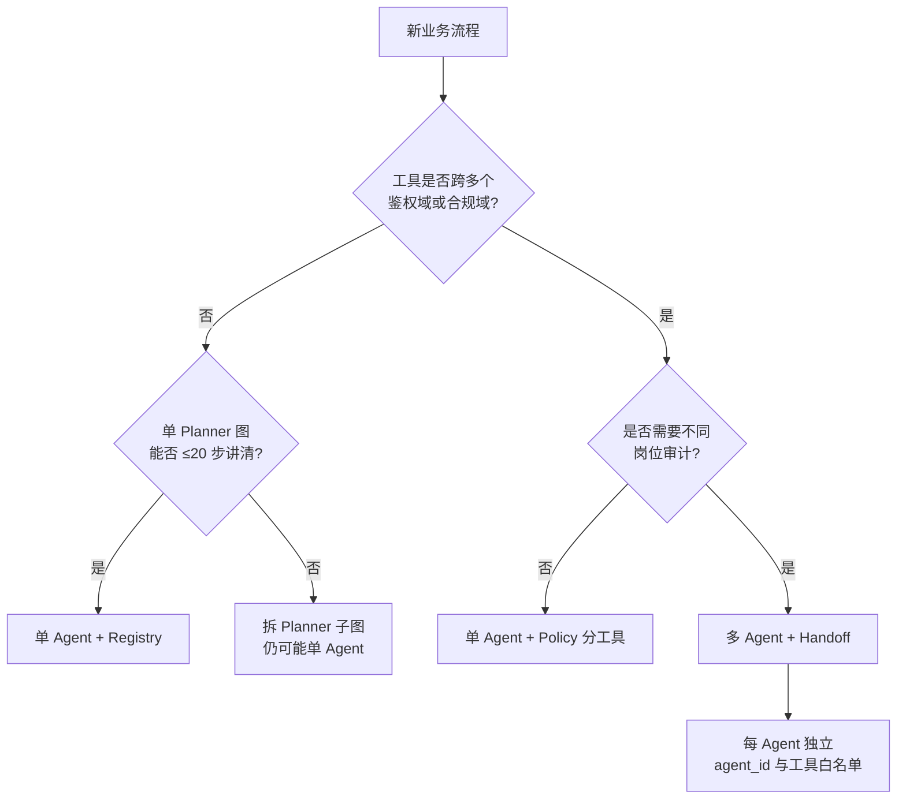
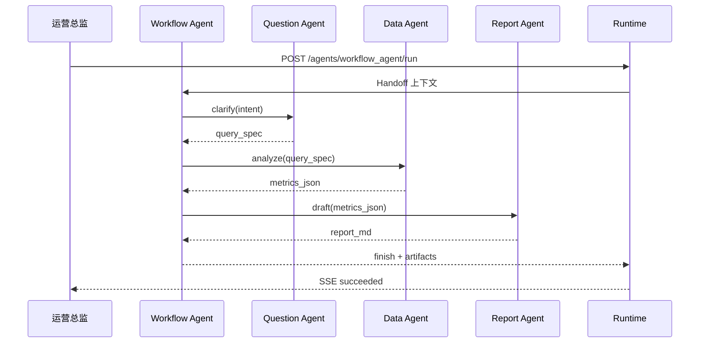
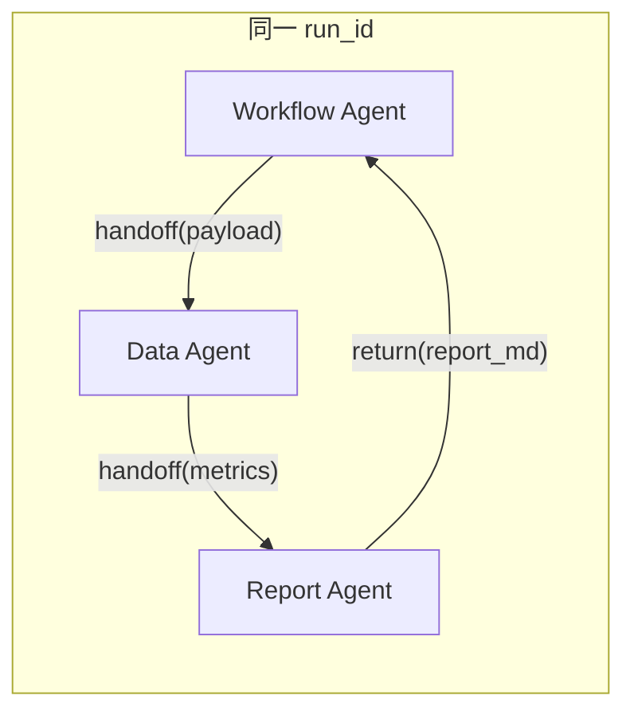
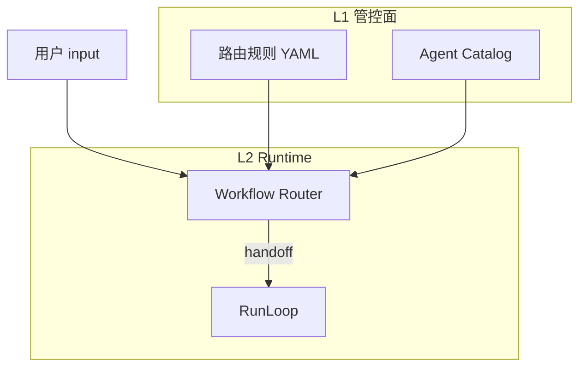
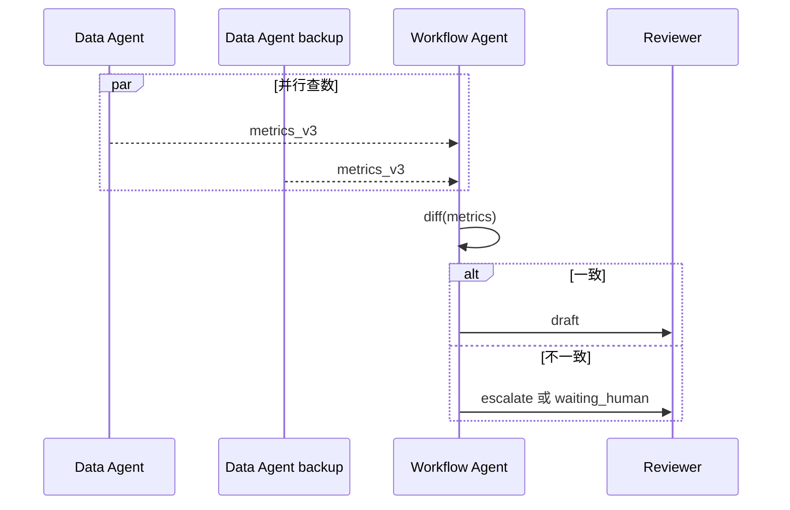

# Ch.28 多 Agent 协作

> **本章目标**：读者学完能说明单 Agent 与多 Agent 的边界、典型角色分工（Router / Planner / Executor / Reviewer）、平台内 Handoff 与任务路由机制，以及冲突仲裁策略；并能对照 `mini-platform` 跑通 `projects/multi-agent-workflow/` 中的「问题→数据→报告」链路。  
> **关键议题**：Planner/Router/Executor/Reviewer；通信协议；Handoff；冲突仲裁  
> **前置阅读**：[Ch.22 Agent Runtime](ch22-agent-runtime.md)、[Ch.25 Planner 与编排模式](ch25-planner.md)、[Ch.26 Agentic Workflow](ch26-agentic-workflow.md)  
> **估计阅读**：约 90 min（含实战项目）  
> **mini-platform 关联**：`projects/multi-agent-workflow/lib/`、`core/runtime/`（Run 六态不变）  
> **实战项目**：`projects/multi-agent-workflow/`  
> **按角色推荐阅读**：CTO / 平台负责人 ⇒ 章头 + §1 + §5 + 本章小结 ｜ 架构师 ⇒ §1–§5 ｜ 工程师 ⇒ 全章 + 运行实战项目

Ch.25 介绍了 ReAct、Plan-and-Execute 等**单 Agent 内**的编排模式；Ch.26 讨论了 Reflexion、Self-Refine 等自我改进范式。但当业务跨越多个专业域——例如「运营提问 → 数据分析师查数 → 报告撰写 → 合规复核」——仍有一个问题没有回答：

**多个具备不同专长与权限的 Agent，如何在同一 `run_id` 下协作，而不各自开独立 Run、破坏审批链与审计？**

单 Agent 往往因此出现工具集膨胀、Prompt 互相污染、责任边界模糊三类问题。业界将多个具备独立目标与能力的 Agent 通过消息或 Handoff 协作称为 **multi-agent system**（多 Agent 系统）[1][2]。Google 的 A2A 协议与 Microsoft AutoGen 等框架均把「Agent 作为可寻址参与者」作为扩展方向 [3][4]。

**多 Agent 不是默认选项。** 本书立场与 Ch.25 一致：能用清晰的状态机 + 单 Planner + Tool Registry 解决的流程，不应为了「架构好看」拆成多个无明确职责的聊天式 Agent。多 Agent 的价值在于 **角色隔离、并行专长、组织对齐**——每个 Agent 对应真实岗位或系统边界，而不是把一次 SQL 查询拆成三个 LLM 互发废话。

「山岚集团」季度经营分析场景：运营总监在 Console 输入「解释华东区 Q1 毛利下滑，并给出可执行建议」。若全部压在一个 DataAgent 上，它既要懂语义层表结构、又要写 Markdown 报告、还要知道哪些结论需法务预审——Prompt 长度、工具权限与审计粒度都难以治理。本章方案：由 **Workflow Agent**（入口 Router）接收任务，Handoff 给 **Question Agent** 澄清意图，再交给 **Data Agent** 执行 SQL，最后 **Report Agent** 生成报告草稿；Run 六态仍由 Ch.22 Runtime 统一驱动，子 Agent 调用是 **Handoff 类型的 Tool Call**，而非各自独立的 `/run` 黑盒。

本章依次讨论何时需要多 Agent（§1）、角色分工（§2）、平台内通信与 Handoff（§3）、任务路由与能力发现（§4）、冲突仲裁与一致性（§5），并以实战项目收束（§6）。

---

### 何时需要多 Agent

**本节要回答的问题**：什么情况下应引入多 Agent？什么情况下单 Agent + Registry 更稳妥？

企业落地 Agent 时，最常见的过度设计是「每个部门一个 Agent、每个 Agent 一个微服务」。判断是否值得引入多 Agent，应看 **职责能否切分、边界能否审计、协作能否契约化**，而不是模型参数或团队人数。

#### 单 Agent 足够的信号

以下情况宜保持 **单 Agent + 强 Registry + 清晰 Planner 图**（Ch.25）。读表时可对照山岚示例，判断当前流程是否命中「单 Agent 足够」的信号：


| 信号 | 说明 | 山岚示例 |
| --- | --- | --- |
| 工具同质 | 步骤共享同一鉴权域与数据口径 | 连续 3 次只读 SQL + 汇总 |
| 无并行专长 | 不需要不同 System Prompt 或模型档位 | 库存查询 + 简单解释 |
| 审计链短 | 一次 Run 内 Tool Call 可完整回放 | 单表 TopN 查询 |
| 组织无对应角色 | 业务方没有「分岗位审批中间产物」需求 | 内部调试 Demo |


Wu et al. 对 LLM Agent 的综述指出，工具使用与规划模块可在一个 Agent 内模块化，而非必须物理拆分 [5]。Ch.22 的 Run / Step / Tool Call 模型已为「一次任务多步推理」提供平台级审计；拆 Agent 应带来 **边际治理收益**，而非重复实现 Runtime。

#### 应多 Agent 的信号

下表列出「值得拆 Agent」的典型信号。若命中多条，多 Agent 的治理收益通常大于拆分成本：


| 信号 | 说明 | 山岚示例 |
| --- | --- | --- |
| 工具权限域不同 | 数据 Agent 可读仓，Report Agent 不可直连 PII 表 | 毛利分析 vs 员工明细 |
| Prompt / 模型需隔离 | 澄清问题与写报告的最佳温度、模型不同 | 快模型路由，强模型写报告 |
| 组织与 SLA 对齐 | 不同子任务由不同团队承担责任 | 数据组对 SQL，品牌组对文案 |
| 并行子任务 | 多路检索可并行再汇总 | 竞品 + 内部销量同时查 |
| 外部 Agent 接入 | 供应商 Agent 通过 A2A/MCP 参与（Ch.29） | 第三方舆情 Agent |


#### 决策流程

下图给出从「新业务流程」到「单 Agent 还是多 Agent」的决策路径。可按鉴权域、Planner 图复杂度与岗位审计需求逐步判断：




#### 与 Ch.26 Agentic Workflow 的边界

下表对比 Agentic Workflow（Ch.26）与多 Agent（本章）的维度差异，避免把「单 Agent 内反思」与「多 Agent 物理拆分」混为一谈：


| 维度 | Agentic Workflow（Ch.26） | 多 Agent（本章） |
| --- | --- | --- |
| 参与者 | 同一 Agent 内的反思 / 搜索策略 | 多个 `agent_id`，各有配置 |
| 通信 | 内存中的轨迹、评分 | Handoff 消息、共享 Run 上下文 |
| 治理 | 步数、循环检测 | 再加 Agent 间契约、路由 ACL |
| 典型用途 | 提高单任务质量 | 对齐组织与权限 |


#### 常见误区

下面三条误区在企业落地多 Agent 时最常见：

**误区 1：多 Agent = 多个 LLM 群聊。** 生产环境不应让 Agent 自由 `@` 彼此而不经 Runtime；否则无法关联 `run_id`、无法做 Policy 拦截。OpenAI Swarm 等 **实验性** 框架强调 **Handoff** 而非永久群聊 [6]——Handoff 是「把控制权交给下一个 Agent」，有明确起点与返回；**不宜**作为生产参考实现，仅作概念对照。

**误区 2：每个 Agent 各自 POST `/run`。** 若子任务各开 Run，父任务无法原子恢复，审批（Ch.30）也无法挂在一个 `run_id` 上。平台推荐：**外层一个 Run**，子 Agent 调用注册为 Tool 或内部 Handoff 步骤。

**误区 3：用多 Agent 掩盖糟糕的 Tool Registry。** 若问题是工具未注册、schema 漂移，拆 Agent 只会把混乱复制多份。先 Ch.23 治理工具，再谈拆分。

---

### 角色分工

**本节要回答的问题**：多 Agent 场景下常见角色有哪些？Router 与 Planner 如何区分？

多 Agent 协作不是「人人全栈」，而是 **按平台能力与企业岗位** 划分角色。本书在 Ch.25 Router / Planner / Executor 基础上，增加 **Reviewer** 与 **Workflow Orchestrator**（工作流编排者），与 `projects/multi-agent-workflow/lib/` 目录结构对齐。

#### 标准角色模型

下表给出平台内常见角色及其与 `mini-platform` 的映射。Router 选 Agent，Planner 选 Tool——二者层级不同：


| 角色 | 职责 | 典型输入 | 典型输出 | mini-platform 映射 |
| --- | --- | --- | --- | --- |
| **Workflow / Router** | 读用户意图，选子 Agent 或子流程 | 用户 `input`、租户 `context` | Handoff 目标、`routing_reason` | `MultiAgentPlanner` + `handoff@v1` |
| **Question / Clarifier** | 消歧、补全缺失槽位 | 模糊问题 | 结构化 `query_spec` | 生产：`question_agent` |
| **Data / Executor** | 调 Registry 工具，产生事实 | `query_spec` | SQL 结果、指标 JSON | 生产：`data_agent` + Registry |
| **Report / Synthesizer** | 生成面向业务的叙述 | 结构化数据 | Markdown / 幻灯片大纲 | 生产：`report_agent` |
| **Reviewer** | 质量与合规检查，可触发 HITL | 报告草稿 | `approve` / `revise` + 批注 | Policy + Ch.30 |


Router 与 Planner 常被混淆：**Router** 决定「下一个由谁处理」（Agent 级）；**Planner** 决定「当前 Agent 内下一步调什么工具」（Tool 级）。Workflow Agent 可内嵌轻量 Router（规则 + 小模型），而把重规划留给 Data Agent 的 Planner。

Part V 实战项目使用 **`MultiAgentPlanner` 规则路由**（按 `active_agent_id` 固定阶段顺序），**不是** LLM Router；生产环境可替换为 Agent Catalog + 混合路由（§3 checklist 标 ☐）。

#### 山岚「问题→数据→报告」角色链

下图展示山岚 Q1 分析场景中，各 Agent 在同一 Run 内的 Handoff 顺序。注意对外仍只有一个 `run_id`：




#### 角色与 Run 六态

多 Agent 切换 **不重置** `run_id`；下表说明 Run 六态在各 Agent 活跃时的对应关系：


| Run 状态 | 多 Agent 场景下谁活跃 | 说明 |
| --- | --- | --- |
| `planning` | 当前活跃 Agent 的 Planner | Handoff 后 `step_index` 递增 |
| `executing` | 当前 Agent 调 Tool 或发起子 Handoff | 子 Handoff 仍算 Tool Call |
| `waiting_human` | Reviewer 或 Policy 要求审批 | Ch.30 |
| `succeeded` | Workflow Agent 汇总产物 | 对外单一 `answer` |


子 Agent 切换 **不重置** `run_id`；在检查点中记录 `active_agent_id` 与 Handoff 栈（§3）。

#### 设计原则

1. **单一对外 Agent**：Console 只暴露 `workflow_agent`；内部 Agent 不对业务用户直接开放 `/run`（可 L1 配置「调试可见」）。
2. **工具最小权限**：Data Agent 注册 `sql_executor`；Report Agent 只有 `doc_renderer`，无 SQL。
3. **Reviewer 可选但可插**：合规场景将 Reviewer 设为 Policy 插件，而非第四个 LLM，以降低成本。
4. **角色文档化**：每个 Agent 在 L1 有 `agent_card`（Ch.29）：能力描述、输入输出 schema、SLA。

---

### 平台内通信与 Handoff

**本节要回答的问题**：多 Agent 在平台内如何通信？Handoff 如何实现可审计、可恢复的控制权转移？

多 Agent 在平台内通信，必须 **可审计、可恢复、可 Policy 拦截**。本书区分三类通道：**Handoff**（控制权转移）、**Tool Call**（同步能力调用）、**Event Bus**（异步通知，Part VII 详述）。

#### Handoff 契约

Handoff 是一次 **结构化的控制权转移**。下表列出最小字段集；Handoff 在 Runtime 中实现为 **特殊 Tool Call**：


| 字段 | 说明 |
| --- | --- |
| `from_agent_id` | 转出方 |
| `to_agent_id` | 转入方 |
| `handoff_id` | 唯一 ID，写入 Tool Call 记录 |
| `payload` | 下一 Agent 可见的上下文（JSON） |
| `reason` | 路由原因，供 Trace 与排错 |
| `return_policy` | `once`（单次）/ `stack`（可返回上级） |

上表为 **生产 Handoff 契约**。实战项目中，Handoff 经 `handoff@v1` 写入 `RunContext.handoff_stack`（字段含 `from_agent_id`、`to_agent_id`、`payload`、`reason`、`run_id`），并切换 `active_agent_id`——**不是** 独立的 `HandoffRecord` 类，见 §6 与 `handoff_tool.py`。


Handoff 在 Runtime 中实现为 **特殊 Tool Call**：`tool=handoff`, `args={to_agent_id, payload}`。Registry 注册 `handoff@v1` handler，内部切换 `active_agent_id` 并调用目标 Agent 的 Planner 入口——而非新 HTTP `/run`。




#### 消息 vs 共享上下文

Handoff payload 可 pass-by-value 或 pass-by-reference。下表对比三种传递方式的适用场景：


| 方式 | 优点 | 风险 | 适用 |
| --- | --- | --- | --- |
| **Pass-by-value** | 审计清晰，检查点自包含 | payload 大时检查点膨胀 | 结构化 `query_spec`、指标 JSON |
| **Pass-by-reference** | 检查点小 | 需 Memory / 对象存储一致 | 大报表、二进制附件 |
| **Shared Memory 键** | 多 Agent 追加写 | 需版本号防覆盖 | Ch.27 长期记忆 |


山岚实战：Question Agent 输出 `query_spec`（小 JSON，pass-by-value）；Data Agent 输出 `metrics_ref:mem://run-8f3a/step-2`（pass-by-reference）；Report Agent 从 Memory 读取，避免 SQL 结果重复写入三次检查点。

#### Handoff 栈与返回

复杂流程允许 **Report Agent 将草稿 Handoff 回 Question Agent 补槽**，形成栈结构。检查点保存：

```
handoff_stack: [
  { "agent": "workflow_agent", "frame": 0 },
  { "agent": "data_agent", "frame": 1 }
]
active_agent_id: "report_agent"
```

`return_policy=stack` 时，子 Agent 完成后 pop 栈并还原上级 Planner 上下文。栈深度应设上限（如 8），与 `max_steps` 联动，防止 Handoff 环。

#### 与 A2A / MCP 的关系（预览）

平台 **内部** Handoff 走 L2 Registry + Runtime；**外部** Agent 走 L3 A2A Client（Ch.29）。对外语义一致：都是「把任务交给另一个参与者」，但外部 Handoff 需 Agent Card 发现 endpoint、TLS 与 mTLS，内部 Handoff 只需 `agent_id` 解析配置。

#### 常见误区

下面三条误区在 Handoff 实现中最常见：

**误区 1：Handoff = 转发用户原话。** 应传递 **结构化 payload**（槽位、表名、口径版本），否则 Data Agent 重复澄清，浪费 Token 与时间。

**误区 2：子 Agent 静默失败。** Handoff 失败须返回 `HANDOFF_TARGET_NOT_FOUND` 等结构化错误（**生产错误码**；当前 Demo 未定义），由 Workflow Agent 决定重试或降级，而非挂起 Run。

**误区 3：跨租户 Handoff。** `context.tenant_id` 必须在 Handoff 边界强制校验；Router 不得把 A 租户任务 Handoff 到 B 租户 Agent 配置。

---

### 任务路由与能力发现

**本节要回答的问题**：Workflow Agent 如何在正确的时间把任务交给正确的 Agent？Agent Catalog 如何支撑能力发现？

Workflow Agent 的核心能力是 **在正确的时间把任务交给正确的 Agent**。路由分两层：**Agent 路由**（选 `agent_id`）与 **Tool 路由**（Ch.23 已在 Registry 完成）。本节聚焦前者。

#### 路由输入

Router 决策依赖以下输入。读表时可对照山岚 Workflow Agent 的默认混合路由策略：


| 输入 | 来源 | 用途 |
| --- | --- | --- |
| 用户 `input` | `/run` 请求 | 意图分类 |
| `context.scope` | 租户、区域、产品线 | ACL 过滤候选 Agent |
| `context.user_id` | 身份 | 岗位路由（运营 vs 财务） |
| 对话历史 / Memory | Ch.27 | 多轮澄清 |
| Agent Catalog | L1 注册表 | 能力发现 |


#### 路由策略

下表对比常见路由策略的优缺点。山岚 Workflow Agent 默认 **混合**：「报告」「ppt」「总结」→ Report Agent；「sql」「指标」「下滑」→ Data Agent；无法分类 → Question Agent。规则表存 L1 Git，变更走 PR：


| 策略 | 机制 | 优点 | 缺点 |
| --- | --- | --- | --- |
| **规则路由** | 关键词、正则、YAML 决策表 | 可预测、可审计 | 意图覆盖有限 |
| **分类模型** | 小模型或 LLM 输出 `route_label` | 灵活 | 需 few-shot 与评测 |
| **Embedding 匹配** | 用户问句 vs Agent Card 描述 | 适合 Agent 数量多 | 需维护向量索引 |
| **混合** | 规则兜底 + 模型提议 | 生产常见 | 实现复杂 |


#### 能力发现：Agent Catalog

每个 Agent 在 L1 注册 **AgentSpec**（与 Ch.29 Agent Card 对齐）。Router 通过 `list_agents(tags=..., tenant=...)` 得候选集，再 scoring：


| 字段 | 说明 |
| --- | --- |
| `agent_id` | 稳定 ID，如 `data_agent` |
| `description` | 自然语言能力说明 |
| `input_schema` / `output_schema` | Handoff payload 形状 |
| `tools_allowlist` | 可用工具名列表 |
| `sla_seconds` | 预期耗时，供路由超时 |
| `tags` | `domain:sales`, `lang:zh` |


外部 Agent 通过 A2A Agent Card URL 拉取等价元数据 [3]。




#### 失败与降级

路由失败时的典型处理如下。低置信度路由应强制走 Question Agent，禁止直连 SQL：


| 错误 | 处理 |
| --- | --- |
| 无候选 Agent | `ROUTE_NO_MATCH`，Question Agent 澄清 |
| 目标 Agent 超时 | 重试 1 次，仍失败则 `failed` + 告警 |
| 目标 Agent 排队过长 | 路由到 `data_agent_backup` 或返回「稍后再试」 |
| 模型路由置信度低 | 强制 Question Agent，禁止直连 SQL |


#### 与 Ch.25 Planner Router 节点

LangGraph 等框架的 **Router 节点** 是图内实现；平台要求 Router 决策写入 Trace：`route_label`, `candidates`, `chosen_agent_id`。编排图 Router 与 Workflow Router **可合并实现**，但对外仍折叠为 Run 六态 SSE。

---

### 冲突仲裁与一致性

**本节要回答的问题**：多 Agent 并行或链式协作时，结论矛盾、重复写、口径不一致如何检测与仲裁？

多 Agent 并行或链式协作时，可能出现 **结论矛盾、重复写、口径不一致**。平台需在 Runtime 层提供仲裁策略，而非依赖「最后一个 LLM 的输出结论」。

#### 典型冲突类型

下表列出多 Agent 场景下常见的冲突类型及其检测信号：


| 类型 | 示例 | 检测信号 |
| --- | --- | --- |
| **事实冲突** | Data Agent A/B 对同一 SKU 销量数字不同 | 同 `query_spec` 不同 `metrics` |
| **口径冲突** | 一个用 GMV，一个用毛利 | schema 中 `metric_type` 缺失 |
| **叙事冲突** | Report 与 Reviewer 结论相反 | Reviewer `revise` |
| **资源冲突** | 两 Agent 同时写同一工单 | 工具层乐观锁失败 |
| **Handoff 环** | A→B→A 无进展 | Handoff 栈 + `args_hash` |


#### 仲裁策略

下表对比不同仲裁策略的适用场景与实现要点。财务与合规场景应 **拒绝自动合并** 矛盾数字：


| 策略 | 适用 | 实现要点 |
| --- | --- | --- |
| **权威源优先** | 数值类 | 指定 Data Agent 连接语义层 Ch.33 为唯一事实源 |
| **时间戳 / 版本优先** | 缓存与仓并存 | payload 带 `semantic_version` |
| **Reviewer 裁决** | 报告与合规 | 第三人 Agent 或规则引擎 |
| **人工仲裁** | 高风险 | 进入 `waiting_human`（Ch.30） |
| **合并而非二选一** | 多源舆情 | Workflow 汇总区段，标注来源 |


#### 一致性契约

1. **语义层 pin 版本**：Handoff payload 必带 `semantic_layer_version`；Report Agent 禁止自行改表名。
2. **幂等 Handoff**：同一 `handoff_id` 重试不产生重复副作用；Registry 工具支持 `idempotency_key`。
3. **单写者原则**：报告终稿仅 Report Agent 写入 `doc_store`；Reviewer 只打标不覆盖正文。
4. **事件顺序**：Run 内 Handoff 与 Tool Call 按 `step_index` 全序；并行子 Run（高级）须 child `run_id` 挂 parent 并 merge 检查点。

#### 冲突仲裁时序

下图展示并行 Data Agent 查数后，Workflow Agent 做 diff 并决定升级或继续 Report 的流程：




#### 观测与治理

- Trace span：`conflict.detected`, `arbitration.policy`, `resolution`  
- 指标：Handoff 失败率、Reviewer 退回率、口径冲突次数  
- 事后：Ch.38 回放须能还原 **每个 Agent 的输入输出**，而非仅最终 `answer`

#### 常见误区

下面这条误区在财务与合规场景尤其危险：

**误区：用更强模型「拍脑袋」合并矛盾数字。** 财务与合规场景应 **拒绝自动合并**，升级人工或标记「数据不一致」章节，否则审计风险极高。

---

### 实战项目：多 Agent 业务流程（问题→数据→报告）

本节配套 `projects/multi-agent-workflow/`：**同一 `run_id`** 经 RunLoop 完成 Handoff 链（`handoff@v1` Tool Call），SSE 输出 `state` / `action` / `result` / `approval_request`（Ch.30），检查点含 `active_agent_id` 与 `handoff_stack`。

!!! warning "多 Agent 不等于多个独立 Run"
    子 Agent 不应各自 POST `/run`。Demo 在同一 `run_id` 下通过 `handoff@v1` 切换 `active_agent_id`。

#### 3.1 mini-platform 中的实现路径

```text
mini-platform/
├── projects/multi-agent-workflow/lib/
│   ├── registry_setup.py   # handoff / sql / MCP / report 工具
│   └── planner.py          # MultiAgentPlanner（按 active_agent_id）
├── core/runtime/
│   ├── run_loop.py         # RunLoop + Handoff 执行
│   └── handoff_tool.py     # handoff@v1 handler
└── projects/multi-agent-workflow/
    ├── run.py              # start / approve
    └── README.md
```

#### 3.2 可运行代码与配置

```bash
cd mini-platform
# 终端 1：启动 Run，Handoff 链结束后在 waiting_human 暂停
python3 projects/multi-agent-workflow/run.py start

# 终端 2：审批通过后继续（可省略 --run-id，读取 .last_run_id）
python3 projects/multi-agent-workflow/run.py approve
```

预期 SSE 中含 `"tool": "handoff"`、`"active_agent_id"` 字段切换，以及 Data 阶段 `"tool": "mcp_db_query_sales"`；报告生成后出现 `waiting_human` 与 `approval_request`；`approve` 后出现 `approval_result`（Ch.30）。

#### 3.3 生产化 checklist


| 能力 | 本章 Demo |
| --- | --- |
| Handoff 作为 Tool Call | ✓ `handoff@v1` |
| `active_agent_id` + handoff_stack 检查点 | ✓ |
| 多 Agent 规则 Planner 链 | ✓ |
| MCP 数据工具（Ch.24） | ✓ `mcp_db_query_sales` |
| Router 规则 / Agent Catalog | ☐（实战项目为 `MultiAgentPlanner` 规则路由，非 LLM Router） |
| 外部 A2A Agent | ☐ |

#### 3.4 常见问题

**问题 1：子 Agent 各开 `/run`，审批无法挂起**  
现象：Report 生成后需总监审批，但 Data 与 Report 分属不同 `run_id`，Console 只能看到两个无关任务。修复：外层单一 `workflow_agent` Run；`render_report` 成功后由 Runtime 触发 `need_approval` 进入 `waiting_human`；`approve` 后将 `active_agent_id` 切回 `workflow_agent` 再执行 `publish_report`。

**问题 2：Handoff payload 塞满 SQL 结果**  
现象：检查点超过 Redis 单键限制，恢复超时。修复：大数据 pass-by-reference；检查点只存 `metrics_ref`。

**问题 3：Router 误把「写报告」路由到 Data Agent**  
现象：Data Agent 无 `render_report` 工具，Run `exec_error`。修复：混合路由 + 低置信度走 Question；Agent Catalog `tools_allowlist` 与路由联动校验。

**问题 4：Handoff 环 A→B→A**  
现象：`max_steps` 耗尽才失败。修复：Handoff 栈深度上限 + `(from_agent,to_agent,payload_hash)` 环检测。

#### 与 Ch.25 编排模式的组合

多 Agent 并不取代 Ch.25 的单 Agent 编排图。下表列出常见 **组合模式** 及其适用场景：


| 模式 | 结构 | 适用 |
| --- | --- | --- |
| **Pipeline** | Workflow → Q → D → R 线性 Handoff | 山岚 Q1 分析报告 |
| **Fan-out / Fan-in** | Workflow 并行 Handoff 多 Data Agent，再汇总 | 多区域对比 |
| **Supervisor** | Workflow 持 Router，子 Agent 无自主再路由 | 强治理 |
| **Hierarchical** | 区域 Workflow 嵌套集团 Workflow | 大型集团 |


Pipeline 最易审计：Handoff 栈深度等于阶段数，Console 时间线更易审计。Fan-out 须 §5 冲突仲裁；Supervisor 与 MetaGPT 式「经理 Agent」类似 [7]，但须避免经理 Agent 绕过 Registry 直连工具。

#### 观测指标（SRE 视角）

平台应为多 Agent Run 额外暴露以下指标。Trace 中每个 Agent 段应带 `agent_id` attribute，与 Ch.38 span 命名对齐：`run.{run_id}.agent.{agent_id}.step.{n}`：


| 指标 | 含义 | 告警阈值示例 |
| --- | --- | --- |
| `handoff_count` | 单次 Run Handoff 次数 | > 10 调查路由 |
| `handoff_latency_ms` | 每次 Handoff 耗时 | p99 > 5s |
| `route_fallback_rate` | 降级到 Question Agent 比例 | 突增说明规则过期 |
| `cross_agent_payload_bytes` | Handoff payload 大小 | 超 256KB 改 ref |


---

## 本章小结

### 关键结论

1. **多 Agent 用于职责、权限与组织对齐**，不是单 Agent 规划能力的默认替代。
2. **Workflow / Question / Data / Report / Reviewer** 是常见角色切分；Router 选 Agent，Planner 选 Tool。
3. **Handoff 是平台内一等 Tool Call**，在同一 `run_id` 下切换 `active_agent_id`，检查点须保存 Handoff 栈。
4. **Agent Catalog + 混合路由** 支撑能力发现；外部 Agent 经 Ch.29 协议接入。
5. **冲突仲裁** 依赖权威数据源、Reviewer 与 HITL，禁止静默合并矛盾事实。

### 上线检查清单

- 业务用户是否只暴露入口 Workflow Agent？  
- 每个 Agent 是否有独立工具白名单与 AgentSpec？  
- Handoff 是否可回放、payload 是否控大小？  
- 是否存在 Handoff 环与并行冲突检测？  
- 子 Agent 是否误用独立 `/run` 破坏审批链？

### 本书延伸阅读

- [Ch.29 Agent 协议与标准](ch29-agent.md)  
- [Ch.30 Human-in-the-loop 与长任务](ch30-human-in-the-loop.md)  
- [Ch.27 Memory 系统](ch27-memory.md)  
- [Ch.33 语义层与指标口径](../part06-dataagent/ch33.md)  
- `mini-platform/projects/multi-agent-workflow/README.md`

---

## 参考文献

[1] Li, G., et al. (2024). CAMEL: Communicative agents for "mind" exploration of large language model society. *NeurIPS*. arXiv:2303.17760. [https://arxiv.org/abs/2303.17760](https://arxiv.org/abs/2303.17760)

[2] Qian, C., et al. (2024). ChatDev: Communicative agents for software development. arXiv:2307.07924. [https://arxiv.org/abs/2307.07924](https://arxiv.org/abs/2307.07924)

[3] Google. (2025). *Agent2Agent (A2A) Protocol*. [https://google.github.io/A2A/](https://google.github.io/A2A/)

[4] Microsoft. (n.d.). *AutoGen*. [https://microsoft.github.io/autogen/](https://microsoft.github.io/autogen/)

[5] Wu, Q., et al. (2024). AutoGen: Enabling next-gen LLM applications via multi-agent conversation. arXiv:2308.08155. [https://arxiv.org/abs/2308.08155](https://arxiv.org/abs/2308.08155)

[6] OpenAI. (2024). *Swarm*. [https://github.com/openai/swarm](https://github.com/openai/swarm)

[7] Hong, S., et al. (2024). MetaGPT: Meta programming for a multi-agent collaborative framework. *ICLR*. arXiv:2308.00352. [https://arxiv.org/abs/2308.00352](https://arxiv.org/abs/2308.00352)

[8] Wang, L., et al. (2024). A survey on large language model based autonomous agents. *Frontiers of Computer Science*, 18(6), 186345. [https://doi.org/10.1007/s11704-024-40231-1](https://doi.org/10.1007/s11704-024-40231-1)

[9] Model Context Protocol. (2024). *Specification* (2024-11-05). [https://modelcontextprotocol.io/specification/2024-11-05](https://modelcontextprotocol.io/specification/2024-11-05)

[10] Yao, S., et al. (2023). ReAct: Synergizing reasoning and acting in language models. arXiv:2210.03629. [https://arxiv.org/abs/2210.03629](https://arxiv.org/abs/2210.03629)
