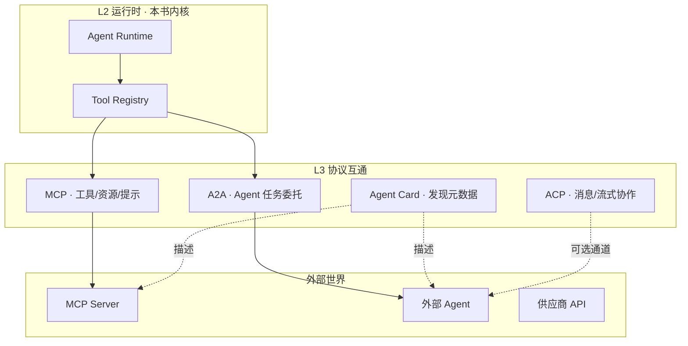
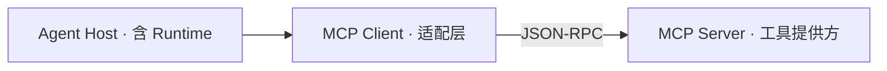
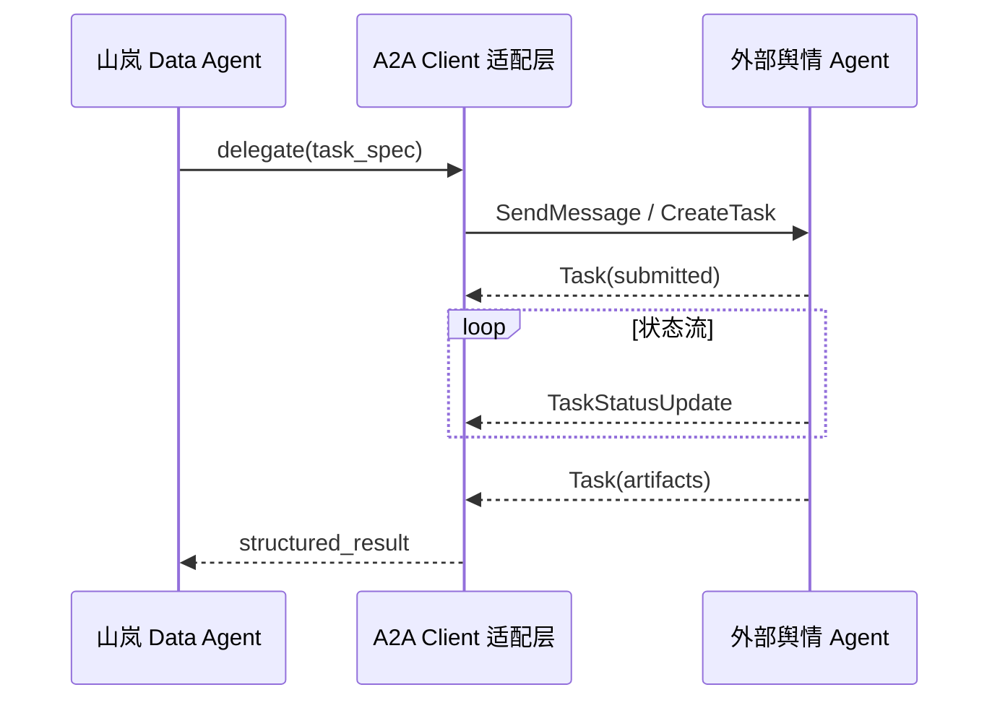
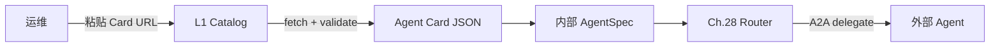
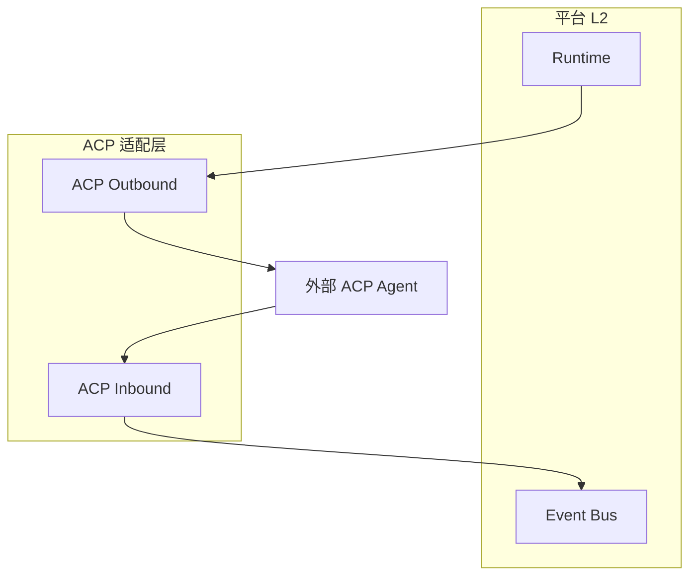
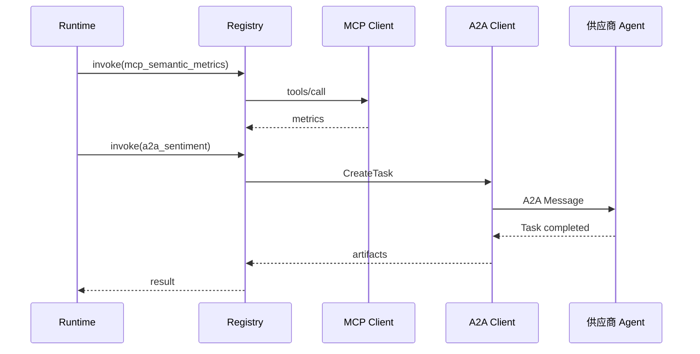

# Ch.29 Agent 协议与标准

> **本章目标**：读者学完能绘制 Agent 互操作协议版图、说明 MCP / A2A / Agent Card / ACP 各自生态位与边界，并能在 `mini-platform` 中定位 **协议适配层** 如何把 L3 协议折叠进 Ch.22 Runtime 与 Ch.23 Registry 的统一调用链。  
> **关键议题**：MCP、A2A、Agent Card、ACP；跨平台协作；协议适配层  
> **前置阅读**：[Ch.24 MCP 与企业工具生态](ch24-mcp.md)、[Ch.28 多 Agent 协作](ch28-agent.md)、[Ch.02 §2.2–2.3](../part01-overview/ch02-agent.md)  
> **估计阅读**：约 90 min（含工程对照）  
> **mini-platform 关联**：`core/protocol/`（协议适配层，本章 §6 展开）  
> **实战项目**：`projects/multi-agent-workflow/`（MCP 经 Ch.24 `registry_bridge` 注册为 ToolSpec，实战 Run 链经 Registry `invoke` 调用；`ProtocolAdapter` 为调用侧扩展，见 §6）
> **按角色推荐阅读**：CTO / 平台负责人 ⇒ 章头 + §1–§2 + 本章小结 ｜ 架构师 ⇒ 全章 ｜ 工程师 ⇒ §5–§6 + 实战项目

Ch.24 深入 **Model Context Protocol（MCP）**：Host–Client–Server 如何把外部工具以 JSON-RPC 暴露给模型 [1][2]。Ch.28 讨论了平台 **内部** Handoff。但当 Agent 需要与 **其它厂商、其它租户、其它云** 上的 Agent 协作时，仅靠内部 `handoff` Tool 不够——仍有一个问题没有回答：

**外部工具、外部 Agent 的能力，如何在不绕过 Registry 与 Policy 的前提下，折叠进 Ch.22 的 `action` → `invoke` → `result` 调用链？**

2025–2026 年，Anthropic 推动 MCP 成为「工具与上下文」事实标准之一；Google 发布 **Agent2Agent（A2A）** 协议 [3]；IBM 等企业提出 **Agent Communication Protocol（ACP）** [4]；各类 **Agent Card**（智能体名片）描述文件用于发现与能力声明元数据 [3]。

**核心立场**：协议解决 **跨边界互操作**；平台 Runtime 仍拥有 Run 六态、检查点与 Policy。L3 协议不应绕过 Registry 直接执行副作用——所有外部能力须 **注册 + 适配 + 审计**，与 Ch.23 对 MCP 工具的要求一致。

!!! warning "协议不是平台内核"
    MCP / A2A / ACP 是 L3 边界适配；Run 六态、检查点与 Policy 仍在 L2 Runtime。Runtime 不应直接 import 协议 Client，只认 Registry `invoke`。

「山岚集团」接入外部「舆情监测 Agent」（供应商 SaaS）：内部 Data Agent 需拉取竞品声量，但供应商只暴露 A2A endpoint 与 Agent Card JSON。平台在 L3 部署 **A2A Client 适配器**，将 `send_task` 映射为 Registry 中的 `external_sentiment@v1` ToolSpec；Runtime 仍发 `action` / `result`，合规仍记 `run_id`。Console 运维在 L1 粘贴 Agent Card URL 完成「上架外部 Agent」。

本章依次给出互操作协议版图（§1）、MCP 的标准生态位（§2）、A2A（§3）、Agent Card（§4）、ACP（§5），并以 mini-platform 协议适配层收束（§6）。

---

### 互操作协议版图总览

**本节要回答的问题**：L3 有哪些互操作协议？它们各自管什么、与 Registry 如何分工？

Agent 平台在 Ch.02 已分为 L1 管控、L2 运行时、L3 协议互通。L3 不是单一协议，而是 **按协作对象分类** 的多协议版图：对 **工具与资源** 用 MCP；对 **对等 Agent** 用 A2A / ACP；对 **发现与元数据** 用 Agent Card；对 **模型** 仍走 OpenAI 兼容 API（Ch.45 Gateway，不在本章展开）。

#### 版图示意

下图为 L3 多协议版图及其与 L2 Runtime、Registry 的关系。读图时可记住：Runtime 只认 `invoke`，协议细节在适配层消化：




#### 协议对照表

下表按「主要对象、传输、典型操作、与 Registry 关系」对比 L3 各协议。选型时可先确定协作对象是工具还是对等 Agent：


| 协议 / 规范 | 主要对象 | 传输 / 格式 | 典型操作 | 与 Registry 关系 |
| --- | --- | --- | --- | --- |
| **MCP** [1] | 工具、资源、Prompt 模板 | JSON-RPC over stdio / Streamable HTTP | `tools/list`, `tools/call` | 注册为 ToolSpec，handler 内调 MCP Client |
| **A2A** [3] | 远程 Agent | HTTP + JSON（Task/Message） | `SendMessage`, 任务状态流 | 注册为 `external_agent` Tool 或 Handoff 目标 |
| **Agent Card** [3] | Agent 元数据 | JSON 文档（Well-known URL） | 能力发现、认证提示 | L1 Catalog 导入，生成 AgentSpec |
| **ACP** [4] | Agent 间消息 | REST / SSE 事件流 | publish/subscribe 式协作 | 适配为内部 Event Bus 或 Tool |
| **OpenAI tools** [6] | 模型函数调用 | Chat Completions API | `tools` 数组 | Registry 导出 schema，非 L3 传输 |


#### 分层原则

1. **Runtime 不感知 JSON-RPC 细节**：只认 `invoke(name, version, args)`。
2. **一个外部能力一种注册**：MCP tool 与 A2A Agent 不重复注册两个入口指向同一副作用。
3. **Agent Card 不是执行协议**：Card 描述「是谁、能做什么」；执行仍走 MCP / A2A / HTTP。
4. **Policy 在适配层之前**：外部调用同样过 Ch.50 鉴权与数据域检查。

#### 演进时间线（简表）

下表列出 2024–2025 年 L3 协议演进的关键节点，供采购与架构评估参考：


| 时间 | 事件 | 影响 |
| --- | --- | --- |
| 2024-11 | MCP 规范 2024-11-05 发布 [1] | 工具互操作基准 |
| 2024-11 | Anthropic MCP 开源公告 [2] | 生态 Server 爆发 |
| 2025 | Google A2A 公开 [3] | Agent–Agent 委托标准化 |
| 2025 | IBM ACP 提案 [4] | 多 Agent 消息模式补充 |


#### 常见误区

下面三条误区在 L3 协议落地时最常见：

**误区 1：选一个协议替代平台。** MCP 不能替代 Runtime 状态机；A2A 不能替代 Tool schema 校验。协议是 **边界适配**，不是 **内核重写**。

**误区 2：L3 直连生产数据库。** 无论 MCP 还是 A2A，外部 Server 应通过企业 API 网关暴露；Runtime 或协议适配层 **不应** 绕过企业 API 网关直接连数据库。

**误区 3：忽略 Agent Card 版本。** Card 与 Agent 实现版本漂移会导致路由到已下线能力；L1 须 pin `card_etag` 或定期刷新。

---

### MCP 的标准生态位

**本节要回答的问题**：在全书协议版图中，MCP 管什么、不管什么？与 Registry 如何标准接线？

Ch.24 已详述 MCP 架构；本节从 **全书协议版图** 角度重申 MCP 的 **标准生态位**：它是 **LLM 应用与工具/上下文提供者** 之间的互操作层，而非 Agent 与 Agent 之间的任务委托层 [1][2]。

#### Host / Client / Server 再述



下表说明 MCP 三角色在本书中的映射：


| 角色 | 本书映射 | 职责 |
| --- | --- | --- |
| **Host** | `RunLoop` + Planner | 决定何时 list/call 工具 |
| **Client** | `core/protocol/mcp_client.py` | 连接管理、协议编解码 |
| **Server** | 企业自建或第三方 | 暴露 tools/resources/prompts |


#### MCP 在 L3 的适用范围

下表列出 MCP 的典型适用场景。MCP 擅长标准化工具目录与只读上下文，不擅长长时 Agent 委托：


| 场景 | 为何用 MCP | 示例 |
| --- | --- | --- |
| 桌面 / IDE 集成 | 本地 stdio，低延迟 | 开发者 Agent 读 repo |
| 标准化工具目录 | `tools/list` 自描述 | 统一 Slack + Jira + SQL |
| 资源只读上下文 | `resources/read` | 拉取当前工单 PDF |
| Prompt 模板分发 | `prompts/get` | 合规免责声明模板 |


#### MCP 不擅长的事

下表对比 MCP 不擅长的场景及更合适的协议：


| 场景 | 原因 | 更合适的协议 |
| --- | --- | --- |
| 长时异步 Agent 对话 | MCP 会话偏请求/响应 | A2A Task 生命周期 |
| 跨组织 Agent 委托 | Server 模型是「能力提供者」非「对等 Agent」 | A2A |
| 复杂多播协作 | 无内置 pub/sub | ACP / 内部 Event Bus |


#### 与 Registry 的标准接线（Ch.23 复习）

```
注册路径：MCP Server tool "query_sales"
    → ToolSpec(name="mcp_query_sales", version="v1", handler=mcp_invoke)
    → Runtime: action { tool: "mcp_query_sales", ... }
    → handler 内部: MCP Client tools/call
    → result 反馈 Planner
```

MCP **capabilities negotiation**（客户端与 Server 握手能力）在适配层完成；Registry 存 **稳定后的** tool 列表快照，避免 Run 中途 list 变化导致 replay 不一致。

#### 企业接入 checklist（协议视角）

- Server 是否 TLS、是否 mTLS 到已知 CA？  
- `tools/call` 是否映射租户 ID 到 Server 侧 ACL？  
- MCP Session 是否与 `run_id` 关联写审计？  
- Server 升级是否走 L1 重新注册 ToolSpec 版本？

#### MCP 传输与部署形态

下表对比 MCP 传输形态及平台注意点。山岚在 Kubernetes 上为每个 MCP Server 部署 **独立 Deployment**；`mcp_adapter` 通过 Cluster DNS 连接，**不** 把 MCP 端口暴露公网：


| 传输 | 场景 | 平台注意点 |
| --- | --- | --- |
| **stdio** | 本地 IDE、sidecar | 容器内进程生命周期与 Run 绑定 |
| **Streamable HTTP** | 远程 MCP Server、K8s、多 Host | TLS、鉴权、超时、body 大小限制 |
| **HTTP+SSE（兼容）** | 对接 2024-11-05 遗留端点 | 仅作兼容；新部署优先 Streamable HTTP |


开发者在宿主机直连时，用 `localhost` 端口转发，检查点路径仍走统一 `CHECKPOINT_DIR` 环境变量（容器卷与宿主机兼容）。

#### resources 与 prompts 的企业用法

除 `tools/call` 外，MCP **resources** 适合只读上下文：当前季度 OKR PDF、门店列表快照。**prompts** 适合合规模板：「对外报告须含免责声明」。平台做法：

1. L1 注册 `mcp_resource` / `mcp_prompt` 为只读 ToolSpec 或 Memory 加载器。  
2. Planner 在 `planning` 阶段按需 `resources/read`，结果写入 Memory 引用，而非塞进 Handoff payload。  
3. 审计记录 resource URI 与 etag，满足「报告基于哪版 OKR」类问题。

---

### A2A

**本节要回答的问题**：A2A 与 MCP 有何不同？外部 Agent 委托如何映射到 Ch.28 内部 Handoff？

**Agent2Agent（A2A）** 是 Google 等推动的 **Agent 与 Agent 之间** 任务与消息互操作协议 [3]。与 MCP 对比：MCP 回答「模型如何调用工具」；A2A 回答 **「Agent A 如何把子任务委托给 Agent B，并跟踪 B 的状态与产物」**。

#### 核心概念

下表列出 A2A 核心概念。Agent Card 用于发现 endpoint 与认证（§4）。**本章操作名（如 `CreateTask`、`SendMessage`、`TaskStatusUpdate`）采用概念模型表述**，不同 SDK 版本命名可能不同，正文 **不是** 可直接调用的 API 契约。


| 概念 | 说明 |
| --- | --- |
| **Task** | 一次委托的工作单元，有 id 与状态机 |
| **Message** | Task 内交换的内容（文本、结构化 parts、artifacts） |
| **Agent Card** | 描述 Agent endpoint、skills、认证（§4） |
| **Client / Remote Agent** | 发起方与执行方 |


#### A2A 任务流（简化）

下图展示山岚 Data Agent 经 A2A Client 委托外部舆情 Agent 的简化时序：




#### 与 Ch.28 Handoff 的映射

下表对比内部 Handoff 与 A2A 对外委托的对应关系。平台策略：**内部** Handoff 走 Registry；**外部** 委托走 A2A Client，但对 Runtime 仍呈现为 **单次 Tool Call** 或 **异步 Tool Call**（长任务时 `status=running`，Ch.30 队列）：


| 内部 Handoff | A2A 对外 |
| --- | --- |
| `handoff(to_agent_id, payload)` | `CreateTask` + Message parts |
| `active_agent_id` 切换 | Task assigned to remote agent |
| 检查点 Handoff 栈 | Task id + 外部 checkpoint 引用 |
| `waiting_human` | Task `input-required` 状态（若协议支持） |


#### 安全与治理

- **身份**：OAuth2 / mTLS，Agent Card 声明 `authentication` schemes [3]  
- **数据域**：出站 Message 须 Policy 脱敏 PII  
- **SLA**：Task 超时与 Ch.22 Run 超时嵌套；外层 Run 等待子 Task 须可取消  
- **审计**：存 `external_task_id` 与 Message hash，供 Ch.38 回放

#### A2A 局限与补充

A2A 仍在快速演进；并非所有供应商实现一致。平台适配层应 **版本探测 + 能力降级**（例如无 streaming 则 polling）。与 ACP 并存时，A2A 偏 **任务委托**，ACP 偏 **持续会话**（§5）。

#### Task 状态与 Run 六态对照

下表映射 A2A Task 状态与平台 Run 状态。嵌套超时：外层 Run `max_run_seconds=3600`，A2A Task `deadline=3300`，预留 300s 做结果合并与 Report 生成——避免外部成功但外层已 `failed` 的 **问题 3**（§6）：


| A2A Task 状态（概念） | 平台 Run 状态 | Console 展示 |
| --- | --- | --- |
| submitted / working | `executing`，Tool `running` | 「外部分析进行中」 |
| input-required | 可映射 `waiting_human` 或子表单 | 「待补充材料」 |
| completed | `executing` → 继续 Planner | 「外部结果已返回」 |
| failed | `exec_error` 或反馈 Planner | 错误详情 + 外部 task id |
| canceled | Cancel 传播至外部 Client | 已取消 |


---

### Agent Card

**本节要回答的问题**：Agent Card 是什么？发现层与执行层如何分工？

**Agent Card** 是描述 Agent **身份、endpoint、能力、认证方式** 的机器可读文档，通常托管在 well-known URL（如 `/.well-known/agent.json`）[3]。它是 **发现层**，不是执行层。L1 导入 Card URL 时须做 **SSRF 防护**（URL allowlist、禁止私有网段、静态 egress proxy），见 §6 常见问题。

#### 典型字段（概念模型）

下表列出 Agent Card 典型字段及其与 L1 Catalog 的映射：


| 字段 | 说明 | L1 Catalog 映射 |
| --- | --- | --- |
| `name` / `version` | Agent 标识 | `agent_id` + 版本 pin |
| `description` | 自然语言说明 | AgentSpec.description |
| `url` | A2A / HTTP endpoint | 路由目标 |
| `capabilities` | streaming、push 等 | 适配层特性开关 |
| `skills` | 技能列表（输入输出模式） | `tags` + schema |
| `authentication` | OAuth、API Key | Secret 引用 |


#### 发现流程

下图展示运维粘贴 Card URL 到 L1 Catalog，Router 经统一 AgentSpec 路由到外部 Agent 的流程：




#### 内外 Agent 统一 Catalog

山岚 **内部** `data_agent` 与 **外部** 舆情 Agent 在 Console 同一列表展示：内部来自 Git 注册 YAML，外部来自 Agent Card 导入。Router 仅看 **统一 AgentSpec**，不关心 Card 来源。

#### 版本与刷新

- Card 变更时 `etag` / `version`  bump；L1 定时 job 刷新或 webhook 通知  
- 刷新失败 **不** 自动删除旧 Spec，标记 `stale` 并告警  
- 评测集（Ch.41）对外部 Agent 做回归，防止 Card 承诺能力与实测不符

#### 与 OpenAPI / JSON Schema 关系

Agent Card 描述 Agent **整体**；单个 skill 的 IO 可嵌 JSON Schema。Tool Registry 的 `parameters_schema` 仍用于 **内部 Tool**；外部 Agent 的输入输出以 Card skills 为准，适配层做 **shape 转换**。

---

### ACP

**本节要回答的问题**：ACP 在协议版图中处于什么位置？与 MCP、A2A 如何组合？

**Agent Communication Protocol（ACP）** 由 IBM 等提出，强调 Agent 之间 **异步消息、事件流、多订阅者** 的协作模式 [4]。在版图中的位置：**MCP 管工具，A2A 管任务委托，ACP 管持续对话式协作**——三者可组合，不应混为一谈。

#### ACP 特征（概念）

下表概括 ACP 的核心特征：


| 特征 | 说明 |
| --- | --- |
| 消息导向 | Agent 发布/订阅主题或会话 |
| 流式 | SSE / WebSocket 推送 partial 更新 |
| 松耦合 | 多 Agent 可同时读取同一事件 |
| 企业集成 | 与现有消息中间件映射 |


#### 适用场景

下表列出 ACP 的典型适用场景：


| 场景 | 为何考虑 ACP |
| --- | --- |
| 多 Agent 围观同一数据刷新 | 仓更新事件广播给 Data + Report Agent |
| 长时协作编审 | 法务、品牌、数据 Agent 同线程追加意见 |
| 与 Kafka 对齐 | 适配层桥接 ACP ↔ 企业 Event Bus |


#### 与平台 Event Bus 的关系

Part VII 可观测与集成章节中的 **平台 Event Bus** 是 L2 内部设施。ACP 适配层职责：

1. 入站：ACP Message → 内部 event envelope（含 `run_id`, `tenant_id`）  
2. 出站：Run `action`/`result` → ACP 通知订阅 Agent（若策略允许）  
3. **不** 让 ACP 绕过 Policy 直接触发 `invoke`




#### 选型建议

下表给出按需求选协议的建议。ACP 规范成熟度低于 MCP / A2A；**本书仅作观察方向，不建议作为第一批生产依赖**——生产应以 **适配层隔离** 实验性接入：


| 需求 | 首选 | 备选 |
| --- | --- | --- |
| 调外部 SQL MCP Server | MCP | — |
| 委托供应商完整分析 Agent | A2A + Agent Card | — |
| 内部多 Agent 并行编审 | 平台 Event Bus | ACP 对外同步 |
| 模型 function call | OpenAI tools via Registry | — |


#### 协议组合案例：山岚舆情分析

以下组合展示 **同一 Run 内多协议并存** 的合理边界：

1. **Question Agent**（内部）澄清 `query_spec` — 无 L3。  
2. **Data Agent** 经 **MCP** 调 `semantic_layer` Server 取指标 — L3 MCP。  
3. **Workflow** 经 **A2A** 委托供应商 **舆情 Agent** — L3 A2A + Agent Card 发现。  
4. **Report Agent**（内部）生成报告 — 无 L3。  
5. 可选：**ACP** 将「报告草稿 ready」事件广播给订阅的 **品牌 Agent** — L3 ACP 或内部 Event Bus。

Runtime 视角：步骤 2、3 均为 `action` → Registry `invoke` → `result`；步骤 3 的 handler 内部是 A2A Client，可能 **异步**（Ch.30），`tool_call_id` 与 `external_task_id` 双写审计。




#### OpenAI / Anthropic 工具 API 在版图中的位置

除 L3 外，**模型供应商 API** 上的 `tools`、`tool_use`、`computer_use` 等属于 **Gateway 层**（Ch.45），不是 Agent–Agent 协议。下表说明其与 Registry 的关系：


| 机制 | 层级 | 与 Registry 关系 |
| --- | --- | --- |
| OpenAI Function Calling [6] | Gateway + Planner | Registry 导出 schema |
| Anthropic tool_use | 同上 | 同上 |
| OpenAI Responses API hosted tools | 供应商托管 | 仅适合无企业副作用场景；触达企业系统仍须 Registry + Policy |


**原则**：只要副作用触及企业系统，就必须 **Registry + Policy**，无论模型 API 是否「内置工具」。

#### 标准成熟度与采购评估

RFP 评估外部 Agent 或 MCP Server 时，可问：


| 问题 | 期望答案 |
| --- | --- |
| 是否提供 MCP 2024-11-05 兼容 Server？ | 是，或 HTTP 桥接 |
| 是否发布 Agent Card / A2A endpoint？ | 是，含 authentication |
| Task 是否可关联客户方 `run_id`？ | 支持 metadata 回传 |
| 是否支持 mTLS？ | 是 |
| 协议版本升级策略？ | 并行 endpoint 或 semver |


---

### mini-platform 工程实现：协议适配层

**本节要回答的问题**：当前 `core/protocol/` 实现了什么？生产扩展目标有哪些？

当前 `mini-platform/core/protocol/` **只实现最小 `ProtocolAdapter`**：将协议来源归一化为 Registry `invoke`（例如 MCP 工具名自动补 `mcp_db_` 前缀）。`mcp_adapter.py`、`a2a_adapter.py`、`agent_card.py`、`acp_adapter.py` 等为 **生产扩展目标**，当前 Demo 尚未实现。

#### 3.1 mini-platform 中的实现路径

```
mini-platform/core/protocol/
├── __init__.py
└── adapter.py              # ProtocolAdapter、ProtocolKind

# 生产扩展目标（当前不存在）：
# mcp_adapter.py、a2a_adapter.py、agent_card.py、acp_adapter.py
# Ch.24 MCP 注册桥接见 tools/mcp_db/registry_bridge.py（已实现，非 protocol/ 目录）
```

**依赖方向**：`protocol → registry`（适配层注册 ToolSpec）；`runtime → registry`；**禁止** `runtime → protocol` 直接 import。

#### 3.2 可运行代码与配置

当前 Demo 用法（可与 Ch.24 MCP 工具联调）：

```python
from core.protocol import ProtocolAdapter, ProtocolKind
from core.registry import ToolRegistry
from tools.mcp_db import McpDbClient, register_mcp_tools

registry = ToolRegistry()
register_mcp_tools(registry, McpDbClient())

adapter = ProtocolAdapter(registry)
output = adapter.invoke_tool(
    ProtocolKind.MCP,
    "query_sales",
    {"region": "华东", "tenant_id": "shanlan-retail"},
)
```

验证 MCP 注册与调用：

- **单测**：`pytest tests/test_mcp_db.py -q`（MCP Client + Registry 桥接）
- **运行实战项目**：`python3 projects/multi-agent-workflow/run.py start`（Data Agent 阶段调用 `mcp_db_query_sales@v1`）

**不要**在运行命令中写不存在的 CLI 参数（如 `--with-mcp-adapter`）；MCP 已在 `build_workflow_registry()` 中注册。

**与 Ch.24 的分工**：`tools/mcp_db/registry_bridge.py` 负责把 MCP Server 工具 **注册** 为 ToolSpec（`register_mcp_tools`）；`core/protocol/adapter.py` 的 `ProtocolAdapter` 负责在调用侧按协议种类（如 `ProtocolKind.MCP`）解析工具名并 **`invoke`**。Part V 实战 Run 链走 **`registry_setup.py` → register_mcp_tools → Registry invoke`**，**尚未** 接入 `ProtocolAdapter`；二者都不得让 RunLoop 直接 import MCP Client。

#### 3.3 生产化 checklist


| 能力 | 说明 | mini-platform |
| --- | --- | --- |
| `ProtocolAdapter.invoke_tool` | MCP 名前缀 + Registry invoke | ✓ `adapter.py` |
| MCP → ToolSpec 独立适配 | `mcp_adapter.py` | ☐（Ch.24 用 `registry_bridge`） |
| Agent Card → AgentSpec | `agent_card.py` | ☐ |
| A2A Task 委托 | `a2a_adapter.py` | ☐ |
| ACP Event 桥接 | `acp_adapter.py` | ☐ |
| mTLS / OAuth | Secret 管理 | ☐ |
| 与 RunLoop 完全解耦 | 仅 Registry 入口 | ✓ 设计约束 |

#### 3.4 常见问题

**问题 1：Runtime 直接 import MCP Client**  
现象：换 HTTP MCP 为 stdio MCP 需改 RunLoop。修复：强制 handler 封装；RunLoop 零协议感知。

**问题 2：Agent Card URL 指向内网 IP**  
现象：L1 导入时 SSRF 风险。修复：URL allowlist、禁止私有网段、静态 egress proxy。

**问题 3：A2A Task 完成但 Run 已超时 failed**  
现象：外部 Task 成功，用户看到失败。修复：嵌套超时策略；长 Task 改异步 Tool + Ch.30 队列；外层 Run 延长或 detach child tracking。

**问题 4：MCP list_tools 与 Registry 版本不一致**  
现象：Replay 时 tool 名已变。修复：注册时 snapshot `list_tools` 为 `v1`；Server 升级走 `v2` 新版本 ToolSpec。

**问题 5：A2A Agent Card 声明 skills 与实测不符**  
现象：Router 路由成功但 Task 始终 `failed`。修复：Card 导入后跑 Ch.41 冒烟评测；不通过则 `enabled=false`。

#### 测试策略

协议适配层应 **无 LLM** 可测：

- **MCP**：mock Server 返回固定 `tools/list`；断言 Registry 注册数量与 `invoke` 结果。  
- **Agent Card**：fixture JSON → `AgentSpec` 字段映射单测。  
- **A2A**：mock Task 生命周期 `submitted → working → completed`。  
- **集成**（生产扩展目标）：外部 Agent 经 `a2a_adapter` 注册为 Registry ToolSpec 后，可与实战项目同一 Run 链联调；当前 Demo 未实现 `a2a_sentiment` 等 A2A Tool。

容器与宿主机：MCP stdio Server 在容器内用 **sidecar** 或 **Streamable HTTP** 远程 Server 更常见；适配层通过环境变量 `MCP_TRANSPORT=stdio|streamable_http` 切换，与 Ch.22 检查点路径配置方式一致（兼容容器卷与本地目录）。

---

## 本章小结

### 关键结论

1. **L3 是多协议版图**：MCP 管工具上下文，A2A 管 Agent 委托，Agent Card 管发现，ACP 管持续消息协作。  
2. **Runtime 内核不变**；所有 L3 能力经 **协议适配层 → Registry → invoke**。  
3. **Agent Card 是元数据**，须与 L1 Catalog 和 Ch.28 Router 统一。  
4. **安全与审计** 不能因「标准协议」而降级；外部 Task 须关联 `run_id`。  
5. **适配层隔离实验性协议**（ACP），避免污染 RunLoop。

### 上线检查清单

- 外部能力是否全部注册为 ToolSpec 或 AgentSpec，无 Runtime 绕过 Registry？  
- Agent Card 导入是否有 SSRF 与 stale 检测？  
- MCP / A2A 是否 mTLS 与租户 ACL？  
- 长时 A2A Task 是否与 Run 超时、检查点策略一致？  
- 协议升级是否走版本化 ToolSpec 而非覆盖 `v1`？

### 本书延伸阅读

- [Ch.24 MCP 与企业工具生态](ch24-mcp.md)  
- [Ch.28 多 Agent 协作](ch28-agent.md)  
- [Ch.02 平台 API 分层](../part01-overview/ch02-agent.md)  
- [Ch.50 Policy 与权限](../part10-security-org/ch50.md)  
- [Ch.38 Agent Trace 与会话回放](../part07-observability-eval/ch38-trace.md)

---

## 参考文献

[1] Model Context Protocol. (2024). *Specification* (2024-11-05). [https://modelcontextprotocol.io/specification/2024-11-05](https://modelcontextprotocol.io/specification/2024-11-05)

[2] Anthropic. (2024). *Introducing the Model Context Protocol*. [https://www.anthropic.com/news/model-context-protocol](https://www.anthropic.com/news/model-context-protocol)

[3] Google. (2025). *Agent2Agent (A2A) Protocol*. [https://google.github.io/A2A/](https://google.github.io/A2A/)

[4] IBM. (2025). *Agent Communication Protocol (ACP)*. [https://github.com/i-am-bee/agent-communication-protocol](https://github.com/i-am-bee/agent-communication-protocol)

[5] Google. (2025). *Agent2Agent (A2A) Protocol — Agent Card*. [https://google.github.io/A2A/](https://google.github.io/A2A/) （Agent Card 章节，与 [3] 同源）

[6] OpenAI. (n.d.). *Function calling*. [https://developers.openai.com/api/docs/guides/function-calling](https://developers.openai.com/api/docs/guides/function-calling)

[7] Anthropic. (2024). *MCP SDK*. [https://github.com/modelcontextprotocol/python-sdk](https://github.com/modelcontextprotocol/python-sdk)

[8] Google. (2025). *A2A Python SDK*. [https://github.com/google/A2A](https://github.com/google/A2A)

[9] Wu, Q., et al. (2024). AutoGen: Enabling next-gen LLM applications via multi-agent conversation. arXiv:2308.08155. [https://arxiv.org/abs/2308.08155](https://arxiv.org/abs/2308.08155)

[10] Ch.02 平台 API 分层. *Enterprise Agent Platform Book*, Part I.
