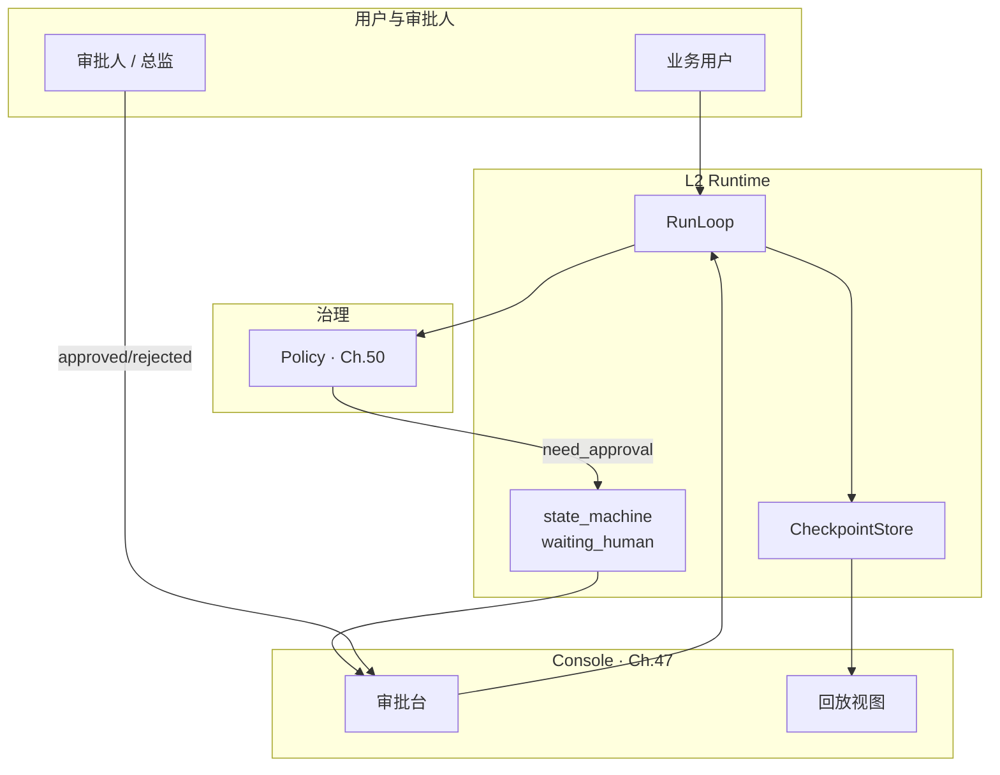
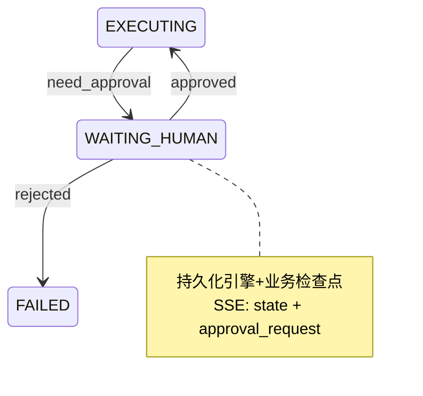
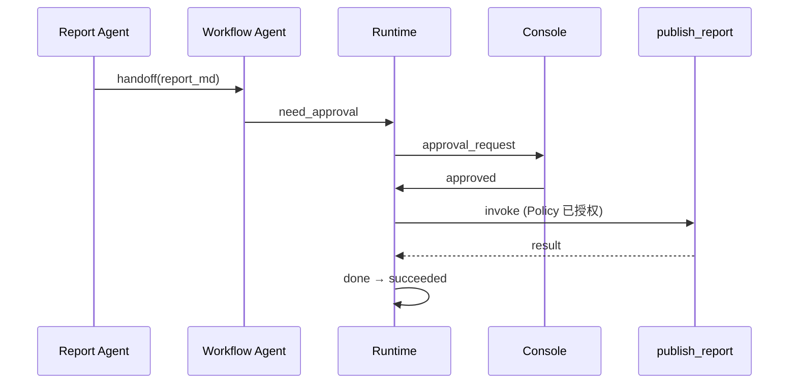
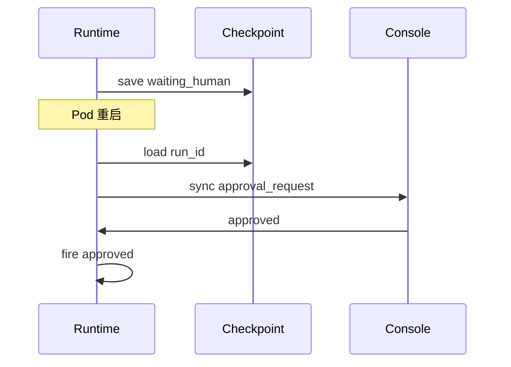
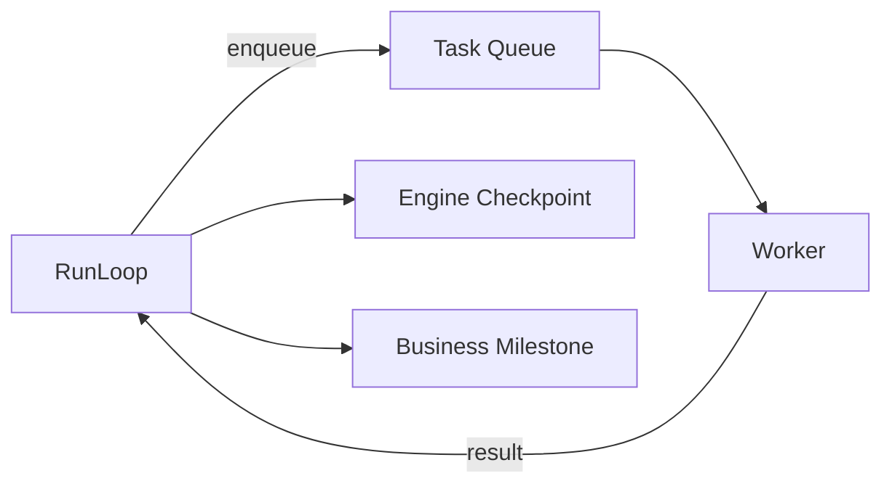
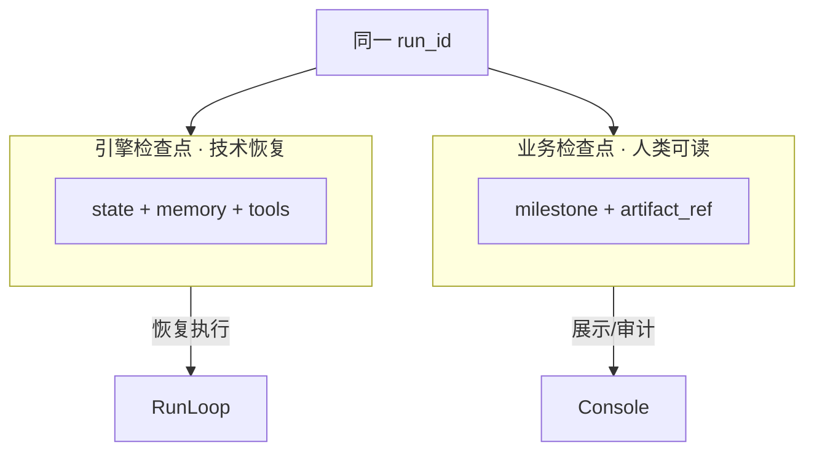

# Ch.30 Human-in-the-loop 与长任务

> **本章目标**：读者学完能说明 HITL 在企业 Agent 中的设计目标、`waiting_human` 与审批模式如何接入 Ch.22 状态机，以及打断/暂停/恢复、业务回放、异步队列与 **引擎/业务两类检查点** 的分工；并能对照 `projects/multi-agent-workflow/` 跑通「报告→审批」链路。  
> **关键议题**：审批、打断、回放、异步队列、检查点、waiting_human  
> **前置阅读**：[Ch.22 Agent Runtime](ch22-agent-runtime.md)、[Ch.28 多 Agent 协作](ch28-agent.md)、[Ch.38 Agent Trace 与会话回放](../part07-observability-eval/ch38-trace.md)  
> **估计阅读**：约 90 min（含实战项目）  
> **mini-platform 关联**：`core/runtime/state_machine.py`（`waiting_human`）、`core/runtime/checkpoint.py`  
> **实战项目**：`projects/multi-agent-workflow/`（报告生成后进入审批）  
> **按角色推荐阅读**：CTO / 合规负责人 ⇒ 章头 + §1 + §4 + 本章小结 ｜ 架构师 ⇒ §1–§5 ｜ 工程师 ⇒ 全章 + 运行实战项目

Ch.22 将 **`waiting_human`** 定义为 Run 六态之一：执行 **有意暂停**，等待 Console 或人工回调 [1]。Ch.28 的多 Agent 链路在 Report Agent 产出草稿后，山岚运营总监须在 Console **批准** 后才会进入对外发送或归档。但这里还有两个问题没有回答：

**高风险副作用之前，平台如何可拦截、可追责、可恢复？一次跨越数小时的季度分析，如何在不占用 HTTP SSE 连接的前提下，把「等机器」与「等人」统一纳入同一 `run_id` 生命周期？**

Amershi 等人在交互式机器学习研究中强调，人应是有控制权的协作者，而非被动标注机 [2]——这一原则直接映射到企业 Agent：**高风险副作用之前必须可拦截、可追责、可恢复**。若缺少 HITL，Agent 可能把未经法务预审的「竞品贬损表述」直接推送至区域经理群——合规与品牌风险不可接受。

长任务方面，一次季度分析可能跨越 **数小时**（外部 A2A Task、批处理 SQL、人工反复修改），不能长期占用 **HTTP 连接 / SSE 流** 与同步 Worker；需要 **异步队列 + 检查点** 将「等机器」与「等人」统一纳入同一 `run_id` 生命周期。

**两类检查点**（Ch.22 §4 已预告）：**引擎检查点** 保存 Run 状态、Memory、Tool 结果，供进程崩溃恢复；**业务检查点** 标记流程里程碑（如「报告 v2 待总监审批」），供 Console 展示与 SLA 报表。二者引用同一 `run_id`，但 payload 字段与读取方不同——混淆会导致「Console 显示已审批，Runtime 却无 Memory 恢复」类事故。

本章依次讨论 HITL 设计目标（§1）、审批模式与 `waiting_human`（§2）、打断暂停恢复（§3）、业务回放与审计（§4）、异步队列长任务与两类检查点（§5），并以实战项目收束（§6）。

---

### HITL 是企业设计目标

**本节要回答的问题**：HITL 在企业 Agent 中解决什么问题？与「全自动 Agent」的边界在哪里？

HITL（Human-in-the-loop）不是「模型不够可靠时的临时补丁」，而是 **治理、合规与组织授权** 的一等功能。金融、医疗、零售促销等领域监管或内控要求：**特定决策须可追溯的人工确认** [3][4]。

#### 企业诉求矩阵

下表列出企业引入 HITL 的典型诉求及无 HITL 时的风险：


| 诉求 | HITL 作用 | 无 HITL 的风险 |
| --- | --- | --- |
| **授权** | 金额、折扣、对外发布须人批 | 越权自动化 |
| **质量** | 报告、代码、客服话术复核 | 品牌与事实错误 |
| **合规** | 隐私、反垄断、广告法 | 监管处罚 |
| **学习** | 人修正进入评测与微调闭环 | 错误重复放大 |
| **信任** | 用户知「有人把关」 | 采纳率低 |


#### HITL 在平台架构中的位置

下图展示 HITL 在 Console、Runtime、Policy 之间的位置。审批是 Run 的暂停，不是新会话：




#### 与「全自动 Agent」的边界

下表对比全自动与 HITL 介入点的典型分界。生产环境对写操作默认 `need_approval`，而非默认放行：


| 全自动 | HITL 介入点 |
| --- | --- |
| 只读查询、内部预览 | 可选 Reviewer Agent |
| 写工单、改主数据 | Policy 触发 `waiting_human` |
| 对外邮件、PR、合同 | 强制人工批准 |
| 自动化回归测试环境 | 可关闭 HITL（环境级开关） |


#### 设计原则

1. **默认安全**：生产环境对写操作默认 `need_approval`，而非默认放行。  
2. **同一 run_id**：审批是 Run 的暂停，不是新会话。  
3. **可配置阈值**：按工具、租户、金额字段动态 Policy（Ch.50）。  
4. **超时即策略**：审批 SLA 超时自动 `rejected` 或升级，禁止无限挂起。  
5. **可观测**：每个 HITL 节点有 Trace span 与工单 ID。

#### 常见误区

下面三条误区在 HITL 落地时最常见：

**误区 1：HITL = 聊天里多问用户几句。** 澄清问题（Question Agent）是 **任务输入补全**；HITL 是 **对 Agent 拟执行动作的授权**，二者状态迁移不同。

**误区 2：审批在 Agent 应用里做 if/else。** 须进入 Run 六态 `waiting_human`，否则检查点、SSE、审计链断裂。

**误区 3：拒绝审批 = 静默结束。** 应触发 `rejected` → `failed`，并返回结构化原因，供用户修正 input 后 **新 Run** 或 **带 revision 的重试**。

---

### 审批模式与 waiting_human

**本节要回答的问题**：`waiting_human` 如何接入 Ch.22 状态机？有哪些审批模式？Console 与 Runtime 的契约是什么？

Ch.22 状态机已定义：`executing` --`need_approval`--> `waiting_human` --`approved`--> `executing`；`waiting_human` --`rejected`--> `failed` [5]。本节展开 **审批模式** 与 Console 契约。

#### 状态机片段

下图展示审批相关的状态迁移。进入 `waiting_human` 时须持久化引擎与业务检查点，并推送 SSE `approval_request`：




#### 审批模式

下表对比常见审批模式。山岚「报告→审批」采用 **后置审批**：Report Agent 调用 `render_report` 生成 Markdown 草稿并存 Memory；Runtime 在工具成功后触发 `need_approval`，Console 展示报告预览；总监 `approved` 后 **才** 由 `workflow_agent` 调用 `publish_report` 等发布类工具——**草稿 artifact 已生成，发布类副作用尚未执行**。


| 模式 | 行为 | 适用 |
| --- | --- | --- |
| **前置审批** | 工具执行 **前** 暂停，展示拟调用 args | 大额转账、删库类 |
| **后置审批** | 草稿 / 报告 artifact 已生成，发布类副作用尚未执行 | 报告发送、邮件群发 |
| **分级审批** | 多级 `waiting_human` 链 | 经理 → 总监 → 法务 |
| **会签 / 或签** | 多人工单，Policy 定义通过规则 | 采购、合同 |
| **Reviewer Agent + 人** | Agent 先筛，高风险才升级人 | 降本增效 |


#### SSE 与 Console 事件

Console 通过以下 SSE 事件感知审批状态。`approval_request` 携带待办详情与 artifact 引用：


| 事件 | 含义 | 典型字段 |
| --- | --- | --- |
| `state` | 进入/离开 `waiting_human` | `state`, `run_id` |
| `approval_request` | 待办详情 | `approval_id`, `title`, `artifact_ref`, `requested_actions`；生产可加 `expires_at` |
| `approval_result` | 审批结论 | `decision`, `comment`, `approver_id` |


```
event: state
data: {"run_id":"run-8f3a","state":"waiting_human","step_index":4}

event: approval_request
data: {"approval_id":"ap-001","run_id":"run-8f3a","title":"Q1 华东毛利报告发布","artifact_ref":"mem://run-8f3a/report_md","requested_actions":["publish_report"]}

event: approval_result
data: {"run_id":"run-8f3a","decision":"approved","approver_id":"u-director-001","comment":"口径已确认"}
```

Demo 的 `run_loop._enter_waiting_human` 当前推送 `approval_id` / `title` / `artifact_ref` / `requested_actions`，**不含** `expires_at`（由 Console SLA 策略在生产环境填充）。`approve()` 后推送 `approval_result`。

#### HTTP 审批回调

```
POST /runs/{run_id}/approvals/{approval_id}
Content-Type: application/json

{
  "decision": "approved",
  "comment": "口径已与财务确认",
  "approver_id": "u-director-001"
}
```

Runtime 校验：Run 当前须为 `waiting_human`；`approval_id` 匹配；审批人角色通过 Policy。成功后 `fire("approved")`，从 **引擎检查点** 恢复 Planner 上下文继续执行。**同一 `approval_id` 重复 `approved` 须幂等**，不得重复执行 `publish_report`。

#### Policy 触发 `need_approval`

下表列出 Policy 触发 `need_approval` 的典型条件：


| 触发条件 | 示例 |
| --- | --- |
| 工具标签 `requires_approval` | `publish_report`, `send_email` |
| 参数阈值 | `discount_rate > 0.15` |
| 数据域 | 含 `pii:true` |
| Reviewer Agent `escalate` | 合规分 < 0.7 |


#### 超时与升级

审批 SLA 超时须配置明确策略，禁止无限挂起。配置存 L1，按租户覆盖：


| 策略 | 行为 |
| --- | --- |
| `auto_reject` | SLA 到期 → `rejected` |
| `escalate` | 转上级审批人，新 `approval_id` |
| `remind` | 通知未改变状态 |


#### 审批数据模型（ApprovalRequest）

**生产建议模型**（当前 Demo **未** 实现 `core/runtime/approval.py`）。Console 列表页按 `status=pending` 查询：


| 字段 | 说明 |
| --- | --- |
| `approval_id` | 与工单系统对齐 |
| `run_id` / `step_index` | 关联 Run |
| `type` | `pre_tool` / `post_artifact` |
| `artifact_ref` | 报告、拟执行 args 的 Memory 引用 |
| `requested_actions` | 批准后允许的工具列表 |
| `expires_at` | SLA |
| `status` | `pending` / `approved` / `rejected` / `expired` |


审批人 **不可** 修改 `artifact` 正文时，应走「驳回 + 新 Run」或「带 revision 的 replanning」策略，避免审计链断裂。**审批的是 artifact 与下一步动作，不是整段聊天。**

#### 后置审批时序（报告→发布）

下图展示山岚「报告→审批→发布」的后置审批时序：



---

### 打断暂停恢复

**本节要回答的问题**：除审批外，用户与运维如何 Cancel、Pause、Resume？进程重启后如何恢复 `waiting_human`？

除审批外，用户与运维还需 **主动打断**（Cancel）、**暂停**（Pause，非标准状态扩展）与 **恢复**（Resume）。本书以 **Cancel** 为一等能力；Pause 可作为 `waiting_human` 的子类型或扩展标签。

#### Cancel（取消 Run）

```
POST /runs/{run_id}/cancel
```

Runtime 行为：

1. 若 `planning` / `executing`：停止 Planner 与进行中的 Tool（可 cancellation token）  
2. 若 `waiting_human`：关闭审批工单，迁移至 `failed`（`reason_code=user_cancel`）  
3. 写检查点终态，SSE 推送 `state: failed`  
4. 已完成的 Tool 副作用 **不** 自动回滚；需 compensating transaction（Saga，Part VIII）

本书 Run **六态** 不含 `cancelled` 终态；Cancel 统一迁移至 `failed`，并在错误体或 checkpoint 中写入 `reason_code="user_cancel"`。若未来增加 `cancelled`，须同步更新 Ch.22 状态机、SSE 契约、前端映射与测试。

**与审批超时区别**：`cancel` 是主动放弃任务；`auto_reject` 是审批 SLA 到期。二者终态均可为 `failed`，但 `approval_result.reason_code` 须区分 `user_cancel` / `approval_expired`，供报表统计。

#### 用户打断 vs 审批拒绝

下表对比用户 Cancel 与审批 Reject 的触发者、状态迁移与典型意图：


| 动作 | 触发者 | 迁移 | 典型意图 |
| --- | --- | --- | --- |
| `rejected` | 审批人 | `waiting_human` → `failed` | 内容不合规 |
| `cancel` | 用户/运维 | 非终态 → `failed`（`reason_code=user_cancel`） | 不再等待结果 |


#### 暂停与恢复（长编辑场景）

总监在审批界面 **暂存修改意见** 但不提交：Console 可发 `POST .../approvals/{id}/hold`，Run 保持 `waiting_human`，业务检查点记录 `revision_draft`。用户侧 **Resume** 即继续编辑或提交 `approved`/`rejected`——**不** 新开 Run。

#### 进程级恢复

Pod 重启时：

1. 加载引擎检查点  
2. 若 `state=waiting_human`，**不** 自动 `approved`  
3. 重新注册审批工单到 Console（幂等 `approval_id`）  
4. SSE 支持 `Last-Event-ID` 续推（Ch.22）

下图展示 `waiting_human` 状态下 Pod 重启后的恢复流程：



---

### 业务回放与审计

**本节要回答的问题**：合规与客诉场景下，如何证明「谁批准、基于什么数据、发布了什么」？

合规与客诉场景要求：**证明某次对外发布的内容，在何时由谁批准，基于哪些数据** [4]。Ch.38 Trace 提供技术回放；本节强调 **业务回放** 语义。

#### 回放层次

下表对比 SSE 事件流、Tool Call 记录、Trace 树与业务回放包的层次与读取方：


| 层次 | 内容 | 读取方 |
| --- | --- | --- |
| **SSE 事件流** | state / action / result / approval | 前端进度 |
| **Tool Call 记录** | 每次 invoke 参数与输出 | 技术审计 |
| **Trace 树** | 跨服务 span | SRE |
| **业务回放包** | 报告版本 + 审批记录 + 数据快照引用 | 合规 / 法务 |


#### Export API 轮廓

```
GET /runs/{run_id}/export?format=bundle

Response 200:
{
  "run_id": "run-8f3a",
  "milestones": [...],
  "approvals": [...],
  "tool_calls": [...],
  "artifacts": [{"ref":"mem://...","sha256":"..."}],
  "data_lineage": [{"semantic_layer_version":"2026Q1", ...}]
}
```

Bundle 用于监管问询 **72 小时内** 还原「谁批准、基于什么数据、发布了什么」；不包含完整模型原始 CoT（若 Policy 禁止存储），但须含 Tool args 与审批 comment。

#### 业务回放包（Export Bundle）

下表列出 Export Bundle 的核心字段：


| 字段 | 说明 |
| --- | --- |
| `run_id` | 主键 |
| `milestones[]` | 业务检查点列表 |
| `artifacts[]` | 报告、图表 hash |
| `approvals[]` | 决策、人、时间、comment |
| `data_lineage[]` | SQL / 语义层版本 / 外部 Task id |
| `policy_decisions[]` | 自动拦截记录 |


Console「回放」视图按 **时间线** 渲染：用户 input → Handoff → SQL → 报告 v1 → 审批请求 → 批准 → 发布。

#### 不可篡改性

- 冷存储 **追加写**（Ch.38 PostgreSQL）  
- 关键 artifact 存 **内容寻址**（hash 命名）  
- 审批记录含 `approver_id` 与 SSO 会话 id

#### 与评测闭环

人修正（`rejected` + comment）应进入 Ch.41 评测集：**同类 input 下次应触发更早 HITL 或更好草稿**，形成组织学习闭环 [2]。

#### 监管问询应答剧本

下表列出监管问询与回放包中对应证据的映射：


| 问询 | 回放包中证据 |
| --- | --- |
| 「谁批准对外发布？」 | `approvals[].approver_id`, `approved_at` |
| 「依据什么数据？」 | `data_lineage[]`, Tool Call SQL hash |
| 「模型是否自动决定发布？」 | `state=waiting_human` 时间线 + 无 `done` 直至 `approved` |
| 「能否重现报告正文？」 | `artifacts[].sha256` 对应冷存储对象 |


平台 SRE 与合规共建 **Export Runbook**：含 API 示例、权限（仅审计角色可 `/export`）、72h 内响应 SLA。

---

### 异步队列长任务与两类检查点

**本节要回答的问题**：分钟级以上的长任务如何与 HITL 正交组合？引擎检查点与业务检查点各管什么？

超过 **分钟级** 的任务（批处理 SQL、外部 A2A Task、大模型长生成）不应阻塞同步 Worker 线程；**异步队列** 将「执行中」与「等待结果」解耦，同时 **引擎检查点** 保证可恢复，**业务检查点** 保证 Console 可读。

#### 长任务模式

下图展示 RunLoop 经异步队列提交长任务、Worker 写回结果并更新两类检查点的模式：




下表说明长任务各阶段与 Run 状态的对应关系：


| 阶段 | Run 状态 | 说明 |
| --- | --- | --- |
| 提交异步 Tool | `executing` | Tool Call `status=running` |
| Worker 执行 | `executing` | 引擎检查点含 `pending_async` |
| 外部长等待 | `executing`（Tool Call `status=running`）+ 业务 milestone | A2A polling；**不**新增 Run 态 `waiting_external` |
| 需人审批 | `waiting_human` | 与异步正交 |
| 完成 | `succeeded` | 合并 async result |


#### 引擎检查点（Engine Checkpoint）

Ch.22 §4 定义：每次状态迁移、Tool result、进入/离开 `waiting_human` 时写入 [5]。**Pod 重启** 只依赖引擎检查点即可 **继续执行**，不要求 Console 在线：


| 字段 | 用途 |
| --- | --- |
| `state`, `step_index`, `history` | 状态机恢复 |
| `memory_refs` | Planner 上下文 |
| `tool_calls` | 含 `running` 异步调用 |
| `handoff_stack` | Ch.28 |
| `active_agent_id` | 多 Agent |


#### 业务检查点（Business Milestone）

**不替代** 引擎检查点；供产品与合规 **读懂进度**。Console 进度条展示 milestone，而非暴露 `step_index`：


| 字段 | 示例 |
| --- | --- |
| `milestone_id` | `ms-report-draft` |
| `label` | 「报告草稿已生成，待审批」 |
| `artifact_ref` | `mem://.../report_md` |
| `created_at` | SLA 起算 |
| `metadata` | `version:2`, `author_agent:report_agent` |


写入时机：Report 生成后、每次审批前后、发布后。

#### 两类检查点关系

下图说明同一 `run_id` 下引擎检查点与业务检查点的分工——前者恢复执行，后者供 Console 展示与审计：





#### 队列选型建议

- **Redis Stream / SQS / Kafka**：按企业标准；message 含 `run_id`, `tool_call_id`  
- **幂等**：Worker 以 `tool_call_id` 去重  
- **嵌套超时**：队列 visibility timeout < Run 超时 < 业务 SLA

#### `waiting_human` 与异步并存

典型序列：异步 SQL 完成 → 写业务 milestone「数据就绪」→ Report Agent 生成 → `need_approval` → `waiting_human`。引擎检查点在每一步保存 **完整 Planner 上下文**；业务检查点只追加 **里程碑** 供总监理解「卡在哪」。

#### 山岚长任务示例时间线

下表展示山岚 Q1 分析从 T0 到 T5 的完整时间线。T4–T48h 期间 HTTP SSE 可断开；进程重启靠 T3 引擎检查点 + T4 `waiting_human` 恢复，而非从 T0 重跑 SQL：


| 时刻 | 事件 | 引擎检查点 | 业务 milestone |
| --- | --- | --- | --- |
| T0 | 用户发起 Q1 分析 Run | `planning` | 「任务已创建」 |
| T1 | 异步 SQL 入队 | `executing` + pending tool | 「查数中」 |
| T2 | SQL 完成 | Tool result 写入 | 「数据就绪」 |
| T3 | Report 生成 | Memory ref | 「报告草稿」 |
| T4 | `need_approval` | `waiting_human` | 「待总监审批」 |
| T48h | 总监批准 | `executing` | 「已批准」 |
| T5 | 发布完成 | `succeeded` | 「已发布」 |


---

### 实战项目：报告→审批

当前 `projects/multi-agent-workflow/` 在 **`render_report` 成功后** 进入 Run 六态 `waiting_human`，SSE 推送 `approval_request`；读者在 **另一终端** 手动调用 `loop.approve(run_id)` 与 `loop.resume(run_id)` 后继续发布。

!!! warning "审批通过不是新 Run"
    审批结论应在同一 `run_id` 上恢复执行；**不要** 审批通过后重新 POST `/run`，否则可能重复发布副作用。

#### 3.1 mini-platform 中的实现路径

**当前 Demo：**

```text
mini-platform/
├── core/runtime/
│   ├── run_loop.py         # need_approval / approve / resume
│   └── approval.py         # ApprovalRequest 模型
└── projects/multi-agent-workflow/
    └── run.py              # start → waiting_human；approve 子命令
```

#### 3.2 可运行代码与配置

```bash
# 终端 1
python3 projects/multi-agent-workflow/run.py start

# 终端 2 — 手动 approve（可省略 --run-id，读 .last_run_id）
python3 projects/multi-agent-workflow/run.py approve
```

`approve` 内部调用 `RunLoop.approve()` 后 `RunLoop.resume()`，继续执行 `publish_report` 直至 `succeeded`。预期 SSE 在 `start` 末尾见 `approval_request`；`approve` 后见 `approval_result`，终态为 `succeeded`。

检查点默认写入 `projects/multi-agent-workflow/.checkpoints/`（与 Ch.22 / Ch.27 一致；生产可通过 `CHECKPOINT_DIR` 环境变量覆盖）。

#### 3.3 生产化 checklist


| 能力 | 说明 | 本章 Demo |
| --- | --- | --- |
| `waiting_human` 状态迁移 | `state_machine.py` + `run_loop.py` | ✓ |
| `approval_request` SSE | `run_loop._enter_waiting_human` | ✓ |
| `approval_result` SSE | `run_loop.approve` / `reject` | ✓ |
| `ApprovalRequest` 模型 | `approval.py` | ✓ |
| 手动 `approve()` + `resume()` | `run.py approve` | ✓ |
| 引擎检查点 @ waiting_human | `checkpoint.py` + `.checkpoints/` | ✓ |
| 审批 HTTP 回调 / Console | 生产扩展 | ☐ |
| 业务 milestone API | 生产扩展 | ☐ |

#### 3.4 常见问题

**问题 1：只有业务 milestone，无引擎检查点**  
现象：Console 显示「待审批」，重启后 Planner 失忆，批准后报告重生成口径漂移。修复：进入 `waiting_human` 时必须写 **完整** 引擎检查点。

**问题 2：审批通过后重新 POST `/run`**  
现象：重复发布两封邮件。修复：同一 `run_id` 上 `approved` 恢复；发布工具须幂等。

**问题 3：异步 SQL 未完成就 `need_approval`**  
现象：总监批准了空数据报告。修复：业务规则：仅 `milestone=data_ready` 后才允许 Report；Report 后才有 `need_approval`。

**问题 4：审批超时仍显示 pending**  
现象：工单堆积。修复：SLA job 触发 `auto_reject` 或 `escalate`，SSE 推送终态。

#### 运行故障排查

| 现象 | 可能原因 | 定位 |
| --- | --- | --- |
| 重复 `approved` 导致双发布 | 回调未幂等 | 同一 `approval_id` 只执行一次 `publish_report` |
| 审批通过但 Run 仍 `waiting_human` | `run_id` / `approval_id` 不匹配 | 对照检查点与 Console 工单 |
| Cancel 后 Console 仍显示 pending | 审批工单未关闭 | Cancel 路径须关闭工单并写 `reason_code` |
| 审批人无权限 | Policy 角色校验失败 | 403 + 审计日志 |
| Pod 重启后重复弹审批 | 工单注册未幂等 | 同一 `approval_id` 重新 sync，不 duplicate 执行 |

#### 与 Ch.28 多 Agent 的关系

`multi-agent-workflow` 中审批挂在 **Workflow Agent 外层 Run**（单一 `run_id`）：Report Agent 调用 `render_report` 成功后，**RunLoop 直接** 触发 `need_approval` 进入 `waiting_human`（无需 Handoff 回 Workflow）；`approve()` 将 `active_agent_id` 切回 `workflow_agent` 后 `resume()` 执行 `publish_report`。Handoff 栈与审批状态在同一检查点内，而非 Report Agent 独立 Run。

分级审批：报告含「竞品对比」→ 经理 `waiting_human` → 法务 `waiting_human` → 双批准后发布。引擎检查点在 **每一级** 保存完整上下文；业务 milestone 记录 `approval_level: 1/2`。

#### 合规场景对照

下表列出各行业典型 HITL 点与平台能力的对应关系：


| 行业 | 典型 HITL 点 | 平台能力 |
| --- | --- | --- |
| 金融 | 信贷建议书发布 | 后置审批 + Export Bundle |
| 医疗 | 辅助诊断文案 | Disclaimer + 人批 |
| 零售 | 促销短信 | 金额阈值 Policy |
| 政务 | 对外公告 | 多级会签 |


NIST AI RMF 强调 **human oversight** 应可配置、可记录 [4]——`approval_request` / `approval_result` 即 oversight 的结构化载体。

#### 长任务 Worker 与 RunLoop 分工

异步 Worker **不** 持有 Run 状态机；只执行 `tool_call_id` 对应 handler 并把结果 **写回队列**。RunLoop 读取结果后触发 `next_step` 或 `need_approval`。Worker 崩溃可换实例重试，依赖 `tool_call_id` 幂等；RunLoop 崩溃靠引擎检查点恢复，二者正交。

#### 环境变量与部署（容器/宿主机）

下表列出 HITL 与长任务相关的环境变量。与 Ch.22 一致：路径类配置用环境变量，保证容器与宿主机同一套 `run.py` 可运行：


| 变量 | 说明 |
| --- | --- |
| `CHECKPOINT_DIR` | 引擎检查点目录，容器卷挂载 |
| `APPROVAL_WEBHOOK_BASE` | Console 回调 Runtime 基址 |
| `ASYNC_QUEUE_URL` | Redis/SQS 连接 |
| `HITL_DEFAULT_SLA_HOURS` | 默认审批超时 |

---

## 本章小结

### 关键结论

1. **HITL 是治理目标**，不是模型能力不足时的权宜之计。  
2. **`waiting_human` 是 Run 六态中的暂停状态**，须与 Policy、Console、检查点一体化。  
3. **前置/后置/分级审批** 覆盖不同风险。报告类场景常用 **后置审批**：指 `render_report` 等工具已生成 **draft artifact**（如 `report_md`），但 **`publish_report` 等发布类副作用尚未执行**；Runtime 进入 `waiting_human` 等待人工确认后，才在同一 `run_id` 上恢复并 invoke 发布工具。只读查询类副作用不应依赖「后置审批」掩盖风险。  
4. **引擎检查点** 负责恢复执行；**业务检查点** 负责可读进度与合规回放——不可混为一谈。  
5. **长任务** 用异步队列 + `running` Tool Call，与 HITL 正交组合。

### 上线检查清单

- 写操作是否默认 Policy 可触发 `need_approval`？  
- 审批是否在同一 `run_id` 上恢复，而非新开会话？  
- `waiting_human` 时引擎检查点是否含 Memory 与 Tool 历史？  
- 是否提供 Export Bundle 与审批人 identity 审计？  
- 异步任务是否与 Run/审批 SLA 嵌套超时一致？

### 本书延伸阅读

- [Ch.22 Agent Runtime](ch22-agent-runtime.md)  
- [Ch.28 多 Agent 协作](ch28-agent.md)  
- [Ch.38 Agent Trace 与会话回放](../part07-observability-eval/ch38-trace.md)  
- [Ch.47 Console 与审批台](../part09-frontend-multimodal/ch47-ui.md)  
- [Ch.50 Policy 与权限](../part10-security-org/ch50.md)  
- `mini-platform/projects/multi-agent-workflow/README.md`

---

## 参考文献

[1] Amershi, S., et al. (2014). Power to the people: The role of humans in interactive machine learning. *AI Magazine*, 35(4), 105–120. [https://doi.org/10.1609/aimag.v35i4.2513](https://doi.org/10.1609/aimag.v35i4.2513)

[2] Mosqueira-Rey, E., et al. (2023). Human-in-the-loop machine learning: A state of the art. *Artificial Intelligence Review*, 56, 3005–3054. [https://doi.org/10.1007/s10462-022-10397-w](https://doi.org/10.1007/s10462-022-10397-w)

[3] EU AI Act. (2024). *Regulation (EU) 2024/1689*. 高风险 AI 系统人类监督要求。 [https://eur-lex.europa.eu/legal-content/EN/TXT/?uri=CELEX:32024R1689](https://eur-lex.europa.eu/legal-content/EN/TXT/?uri=CELEX:32024R1689)

[4] NIST. (2023). *Artificial Intelligence Risk Management Framework (AI RMF 1.0)*. [https://www.nist.gov/itl/ai-risk-management-framework](https://www.nist.gov/itl/ai-risk-management-framework)

[5] Enterprise Agent Platform Book. Ch.22 Agent Runtime · `core/runtime/state_machine.py`.

[6] Shneiderman, B. (2022). Human-centered AI. *Oxford University Press*. （人机协作授权原则）

[7] LangChain. (n.d.). *Human-in-the-loop*. LangGraph. [https://docs.langchain.com/oss/python/langgraph/interrupts](https://docs.langchain.com/oss/python/langgraph/interrupts)

[8] OpenAI. (n.d.). *Agents SDK — Guardrails*. [https://openai.github.io/openai-agents-python/](https://openai.github.io/openai-agents-python/)

[9] Temporal. (n.d.). *Workflow persistence*. （长任务与 checkpoint 工业参考）[https://docs.temporal.io/workflows](https://docs.temporal.io/workflows)

[10] Ch.38 Agent Trace. *Enterprise Agent Platform Book*, Part VII.
