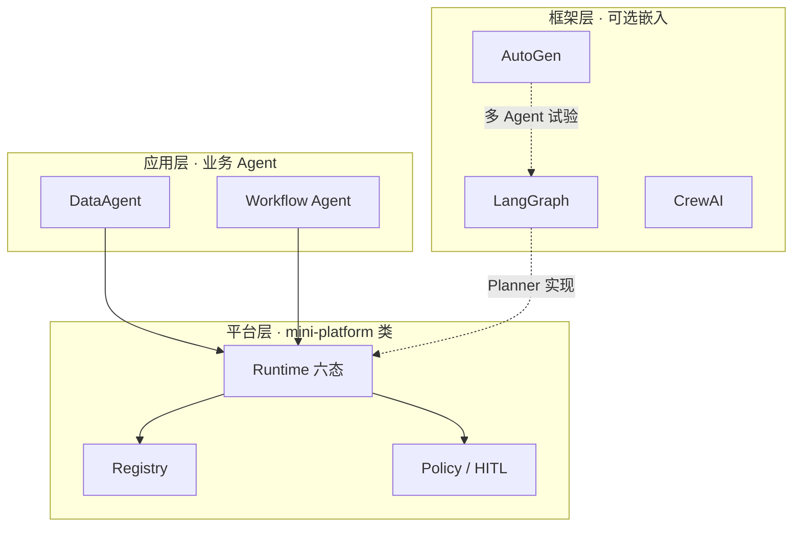
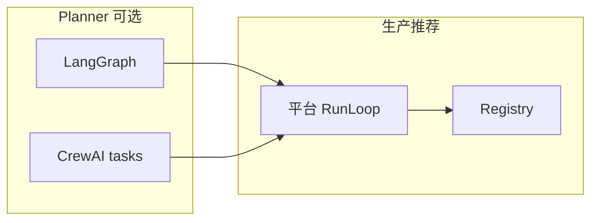
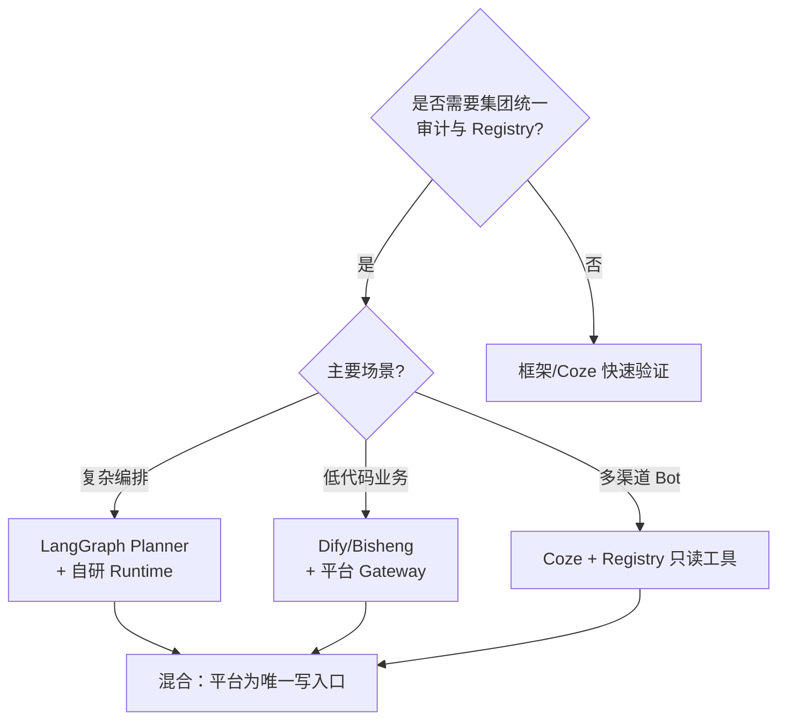
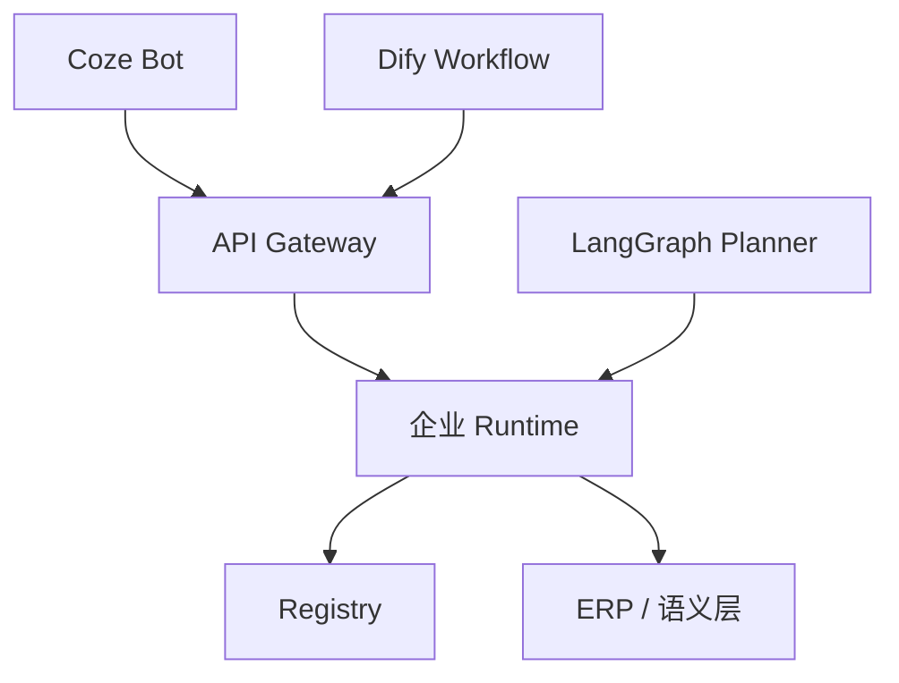

# Ch.31 框架横向对标

> **本章目标**：读者学完能在 **框架 / 平台 / 应用** 三层模型下对照 LangGraph、AutoGen、CrewAI 与 Dify、Coze、Bisheng 的能力边界，给出企业 **自研、采购、混合** 的决策依据，并将 Part V 各实战项目映射到框架能力矩阵。  
> **关键议题**：LangGraph、AutoGen、CrewAI、Dify、Coze、Bisheng；能力矩阵；自研 vs 采购  
> **前置阅读**：[Ch.22 Agent Runtime](ch22-agent-runtime.md)–[Ch.30 Human-in-the-loop](ch30-human-in-the-loop.md)、[Ch.02 §2.2](../part01-overview/ch02-agent.md)  
> **估计阅读**：约 90 min（对照表 + 决策练习）  
> **mini-platform 关联**：全书参考实现；**本章不新增代码模块**  
> **实战项目**：无独立 `projects/`；以 Part V 实战项目 `multi-agent-workflow` 与框架能力对照（§6）  
> **按角色推荐阅读**：CTO / 采购决策 ⇒ 全章 ｜ 架构师 ⇒ §1–§5 ｜ 工程师 ⇒ §2–§3 + §6 对照表

Part V 用 `mini-platform` 自底向上搭建了 Agent Runtime、Tool Registry、MCP 适配、多 Agent Handoff 与 HITL——这是 **平台层** 能力。业界同时存在大量 **框架**（嵌入应用代码的库）与 **应用平台**（低代码 Console + 托管运行时）。企业常见问题是：「我们已有 Dify，还要不要做 Ch.22 这类 Runtime？」「LangGraph 能否替代 Run 六态？」「Coze .bot 与山岚 DataAgent 是什么关系？」

**本书答案**：框架与平台 **分层共存**——框架擅长 **Planner 编排与快速试验**；平台擅长 **统一 `/run`、治理、审计、多租户与 L3 协议**。混淆层级会导致重复建设或治理黑洞 [1][2]。

「山岚集团」技术委员会评审：数据团队已在 Jupyter 里用 **LangGraph** 做 SQL 实验；市场部在 **Coze** 上搭了活动文案 Bot；集团 IT 正在建 **mini-platform** 类企业 Agent 平台。本章给出 **能力矩阵** 与 **混合架构**：实验在框架，生产入口走平台 Gateway；Coze Bot 通过 MCP 或 HTTP Tool **登记** 进 Registry，而非 Parallel 另一套审计链。

本章依次 **框架 / 平台 / 应用三层再述**（§1），开源 Agent **框架** LangGraph / AutoGen / CrewAI（§2），**应用平台** Dify / Coze / Bisheng（§3），**能力矩阵**（§4），**自研采购混合** 策略（§5），**Part V 实战项目与框架对照**（§6）。本章 **不新增** `mini-platform` 代码模块。

---

### 框架、平台、应用三层再述

Ch.02 提出 L1/L2/L3 **平台 API 分层**；本节从 **产品形态** 再述 **框架 / 平台 / 应用** 三层，避免与 L1–L3 混淆：


| 概念 | 是什么 | 谁维护 | 典型产物 |
| --- | --- | --- | --- |
| **框架** | 嵌入业务的 Agent 库 | 开发团队引依赖 | LangGraph graph、CrewAI crew |
| **平台** | 企业统一 Agent 运行时 + 管控 | 平台团队 | `/run`、Registry、Policy、Console |
| **应用** | 面向岗位的业务 Agent | 业务线 + 平台 | DataAgent、Workflow Agent |





#### 映射关系


| 本书模块 | 层级 | 框架中近似物 |
| --- | --- | --- |
| Run 六态 / SSE | 平台 | LangGraph `stream_mode` 需 **折叠** |
| Tool Registry | 平台 | 框架 `tools=[]` 散落定义 |
| MCP / A2A 适配 | 平台 L3 | 框架 MCP 插件（实验） |
| Planner / 图 | 框架 或 平台内 Planner 服务 | LangGraph StateGraph |
| Console / 审批 | 平台 + 应用 | Dify Workflow UI |


#### 硬边界（再次强调）

1. **生产写操作** 必须经平台 Policy 与 Registry，无论 Planner 用何种框架实现。  
2. **框架状态** 不等于 **Run 六态**；对外 SLA 只认 Run。  
3. **应用平台**（Dify/Coze）若作为 **生产入口**，须接入企业 Registry/Gateway，而非长期孤岛。

#### 常见误区

**误区 1：买了 Dify 就等于有 Ch.22 Runtime。** 低代码平台自带运行时，但是 **供应商边界** 内的；企业级多租户、合规 Trace、与 HR/ERP 深度集成仍可能要 **平台层自研或扩展**。

**误区 2：LangGraph 可以跳过 Tool Registry。** 开发环境可以；生产环境不行——版本、审计、MCP 登记无法只在 notebook 里维护。

**误区 3：每个业务线选一个框架。** 框架可以多样，**平台接口应统一**（`/run`、`context` 形状、错误码）。

---

### LangGraph / AutoGen / CrewAI

三类 **开源 Agent 框架** 代表不同抽象：图状态机（LangGraph）、对话式多 Agent（AutoGen）、角色化 Crew（CrewAI）。本节从 **Planner 与多 Agent** 能力对标，不评价模型效果。

#### LangGraph

- **核心**：有向图 + 状态对象 + `checkpointer` 持久化 [3][4]  
- **强项**：复杂分支、循环、Human interrupt（`interrupt()` 与 Ch.30 HITL 概念相近）[7]  
- **弱项**：企业级多租户 Registry、统一 SSE 契约需自建  
- **与本书**：推荐作为 **Planner 实现** 嵌入 L2；`thread_id` 映射 `run_id`；图节点状态 **折叠** 为 Run 六态 SSE

**山岚落地示例**：Data Agent 的 Planner 用 LangGraph 定义「选表 → 生成 SQL → 执行 → 反思」子图；子图内部可 `interrupt()` 等待人改 SQL（映射 `waiting_human`）；子图 **结束** 时向 Workflow Agent 返回 `metrics_json`，外层 Run 仍是一个 `run_id`。

```python
# 概念示例：LangGraph 作为 Planner 插件，非独立 Run
def next_step(ctx: PlannerContext) -> PlannerOutput:
    graph = build_sql_graph(registry=ctx.registry)
    thread_id = ctx.run_id  # 与 Run 对齐
    for event in graph.stream(ctx.input, config={"thread_id": thread_id}):
        emit_to_runtime_sse(event)  # 折叠为 state/action/result
    return graph.get_final_output()
```


| 本书能力 | LangGraph 对照 |
| --- | --- |
| Run 六态 | 自定义 `stream_mode` 映射层 |
| 检查点 | `MemorySaver` / Postgres checkpointer |
| Tool Call | `ToolNode` → 应转 Registry `invoke` |
| HITL | `interrupt` → 映射 `waiting_human` |


#### AutoGen

- **核心**：多 Agent **对话** 编排（`AssistantAgent`, `UserProxy`）[5][9]  
- **强项**：快速试验、代码执行、GroupChat  
- **弱项**：对话式 trace 冗长；生产 Handoff 契约需约束  
- **与本书**：适合 **研发阶段** 多 Agent 探索；生产建议转为 Ch.28 **Handoff Tool** 而非自由群聊

**架构提示**：AutoGen 向 **AgentChat / Core** 分层演进 [5]；企业评估时关注 **是否支持显式 task 委托** 而非仅 GroupChat 轮询。实验代码宜放在隔离 Lab；生产 Handoff 契约以 `projects/multi-agent-workflow/lib/` 为准。

| 本书能力 | AutoGen 对照 |
| --- | --- |
| 多 Agent | GroupChat / Swarm 风格 |
| Handoff | 需封装为显式 delegate，非 `@agent` 聊天 |
| Registry | `register_function` 局部，应迁平台 |


#### CrewAI

- **核心**：**Role / Task / Crew** 声明式，强调岗位叙事 [6]  
- **强项**：与 Ch.28 角色分工叙事接近；上手快  
- **弱项**：深度定制 Runtime、Policy 钩子有限  
- **与本书**：Crew 定义可 **导入** 为 Workflow Agent 配置（YAML），执行仍走 RunLoop


| 本书能力 | CrewAI 对照 |
| --- | --- |
| 角色分工 | `Agent(role=...)` |
| 任务链 | `Task` 依赖 DAG |
| HITL | 企业版/自定义 callback → 映射审批 |


#### 三框架横表


| 维度 | LangGraph | AutoGen | CrewAI |
| --- | --- | --- | --- |
| 抽象 | 状态图 | 对话 | 角色 Crew |
| 多 Agent | 子图 / handoff | GroupChat | Crew |
| 持久化 | 一等 checkpointer | 会话历史 | 任务 output |
| HITL | interrupt | human_input_mode | callback |
| 生产平台化 | 中（需包装） | 低–中 | 中 |
| 与 Registry 集成 | 需适配层 | 需适配层 | 需适配层 |




---

### Dify / Coze / Bisheng

三类 **应用导向平台** 提供 Workflow、RAG、Bot 托管与运维 UI。与 **mini-platform** 对比时，应看 **开放集成** 与 **治理深度**，而非仅看画布易用性。

#### Dify

- **定位**：开源 LLM 应用平台，Workflow + RAG + Agent 节点 [8]  
- **强项**：可视化编排、插件生态、可自托管  
- **企业缺口**：与现有 IAM、细粒度 Policy、集团级 Trace 需 **API 集成**  
- **混合用法**：Dify Workflow **输出** 调用企业 `POST /agents/{id}/run`；或 Dify 作为 **L1 实验环境**，成熟 Agent 迁移到平台 `agent_id`

**山岚用法**：市场部在 Dify 搭活动文案 Workflow；当 Workflow 节点需 **真实库存** 时，调用 `sql_executor` 的 **HTTP 代理**（Registry 暴露），而非 Dify 内置 SQL 插件直连库——口径与 Ch.33 语义层一致。发布前 **人工节点** Webhook 到平台 `approved`，与 Ch.30 对齐。

| 本书模块 | Dify 对照 |
| --- | --- |
| Workflow | Dify Workflow 画布 |
| Tool | Dify Tools / 自定义 API |
| RAG | Dify Knowledge（Part VI 数据篇） |
| HITL | Workflow 人工节点 → 应对接 `waiting_human` |


#### Coze（扣子）

- **定位**：字节跳动 **Bot 平台**，国内生态、插件与发布渠道 [10]  
- **强项**：快速上线营销/客服 Bot、多渠道发布  
- **企业缺口**：数据驻留、VPC、与内部语义层直连需企业版或网关  
- **混合用法**：Coze **插件** 调用山岚 Registry 暴露的 **只读** 工具；敏感写操作回平台 HITL

**插件契约**：Coze 插件 API 应映射为 Registry `invoke` 的 HTTP  façade；请求头携带 `tenant_id`、`user_id`，与 Ch.22 `context` 一致。禁止在插件内硬编码数据库连接串——与 Ch.23「Agent 硬编码工具 import」踩坑同构。

| 本书模块 | Coze 对照 |
| --- | --- |
| Bot | 应用层单 Agent |
| 插件 | 近似 Tool，须登记 |
| 工作流 | Coze Workflow |
| 审计 | 依赖导出 + 平台 Trace 合并 |


#### Bisheng

- **定位**：开源 **企业级** LLM DevOps 平台，偏国产化栈 [11]  
- **强项**：与国产模型、知识库、流程编排组合；政企部署案例  
- **企业缺口**：与 Part V 细粒度 Run 模型对齐需定制  
- **混合用法**：Bisheng 作 **管控 + 知识** 层，Agent 执行仍接统一 Runtime

**政企常见架构**：Bisheng 管 **知识库与流程审批 UI**；执行节点 HTTP 调用集团 `workflow_agent` Run；双写 Trace：Bisheng 实例 ID 映射 `run_id` 写入 Observability 关联表，方便 Console 统一搜索。

| 本书模块 | Bisheng 对照 |
| --- | --- |
| 流程编排 | Bisheng flow |
| 知识库 | RAG 管道 |
| 模型路由 | 内置 + 可接 Ch.45 Gateway |


#### 三平台横表


| 维度 | Dify | Coze | Bisheng |
| --- | --- | --- | --- |
| 部署 | 开源自托管 / 云 | 公有云为主 | 开源自托管 |
| 目标用户 | 产品 / 开发 | 运营 / 开发 | 政企 IT |
| Workflow | 强 | 强 | 强 |
| 企业 IAM | 可集成 | 企业版 | 偏政企 |
| 作为生产唯一运行时 | 中小可行 | 视合规 | 政企常见 |
| 与统一 Registry 并存 | 推荐混合 | 推荐混合 | 推荐混合 |


---

### 能力矩阵

下表将 **Part V 平台能力** 与框架/平台 **原生支持度** 对照：● 原生强 ◐ 可集成 ○ 弱/需自建。


| 能力 | mini-platform | LangGraph | AutoGen | CrewAI | Dify | Coze | Bisheng |
| --- | --- | --- | --- | --- | --- | --- | --- |
| Run 六态 + SSE | ● | ◐ | ○ | ○ | ◐ | ○ | ◐ |
| Tool Registry + 版本 | ● | ◐ | ◐ | ◐ | ◐ | ◐ | ◐ |
| MCP L3 适配 | ● | ◐ | ◐ | ○ | ◐ | ◐ | ◐ |
| A2A / Agent Card | ● | ○ | ◐ | ○ | ○ | ○ | ○ |
| 多 Agent Handoff | ● | ◐ | ◐ | ● | ◐ | ◐ | ◐ |
| HITL `waiting_human` | ● | ◐ | ◐ | ◐ | ◐ | ○ | ◐ |
| 引擎/业务双检查点 | ● | ◐ | ○ | ○ | ○ | ○ | ◐ |
| Policy / 租户隔离 | ● | ○ | ○ | ○ | ◐ | ◐ | ◐ |
| Trace / 合规回放 | ● | ◐ | ◐ | ○ | ◐ | ○ | ◐ |
| 低代码 Console | ○ | ○ | ○ | ○ | ● | ● | ● |
| 快速 Bot 上线 | ○ | ○ | ◐ | ◐ | ● | ● | ◐ |


**解读**：

- **自研平台** 在治理列（Policy、Trace、Registry）全面 ●，Console 可采购补充。  
- **LangGraph** 最适合作为 **Planner 引擎** 嵌入，而非替代整平台。  
- **Dify/Coze/Bisheng** 在低代码与 Bot 渠道 ●，但 Run 六态与集团 Registry 通常需 **混合**。  
- **AutoGen** 适合创新 Lab；生产 Handoff 应收敛到 Ch.28 契约。

#### 选型决策树



---

### 自研、采购与混合

没有「永远自研」或「永远采购」；山岚类零售集团常见 **混合** 路径。

#### 自研（Build）


| 适用 | 说明 |
| --- | --- |
| 统一 `/run` 与 Run 六态 | 合规、SLA、多 Agent 审计 |
| Tool Registry + MCP/A2A | 工具资产化 |
| Policy / HITL / Trace | 监管与内控 |
| 与 ERP/语义层深度集成 | 定制连接器 |


**成本**：平台团队、6–18 个月 MVP、持续 SRE。

#### 采购（Buy）


| 适用 | 说明 |
| --- | --- |
| 营销 Bot、活动页 | Coze / Dify 快速发布 |
| 标准 RAG 知识问答 | Dify / Bisheng 知识库 |
| 非核心只读助手 | 供应商 SaaS |


**风险**：数据出境、版本锁定、与集团 IAM 不一致。

#### 混合（Blend）——本书推荐


| 层 | 策略 |
| --- | --- |
| **平台内核** | 自研或深度定制（Ch.22–30） |
| **Planner** | LangGraph / CrewAI 嵌入 |
| **Console** | 自研 + 或采购 Dify UI 组件 |
| **边缘 Bot** | Coze 发布，经 Gateway 调平台只读 API |
| **实验** | AutoGen Lab，成熟后迁移 `agent_id` |





#### 组织与治理


| 角色 | 职责 |
| --- | --- |
| 平台委员会 | 框架白名单、Registry 上架 |
| 业务线 | 应用 Agent 需求、评测 |
| 安全 | Policy 规则、Coze 数据审查 |
| 采购 | 企业版 Coze/Dify 合同与 SLA |


#### TCO 提示

- **重复 Runtime** 最贵：Dify 一套、自研一套，审计双倍。  
- **Registry 统一** 最省钱：工具只登记一次。  
- **框架锁定** 可通过 Planner 接口抽象缓解：L2 只依赖 `next_step()` 契约（Ch.25）。

#### RFP 问题清单（框架 / 平台采购）

向供应商或内部团队评估时，可直接引用 Part V 能力：


| # | 问题 | 期望 |
| --- | --- | --- |
| 1 | 是否支持稳定 `/run` API 与 `run_id` 全链路审计？ | 是 |
| 2 | 工具调用是否可强制走 central Registry？ | 是 |
| 3 | MCP Server 工具是否可登记版本？ | 是 |
| 4 | 人工审批是否引擎级挂起，而非 UI 假按钮？ | 是 |
| 5 | 检查点能否恢复 Planner 完整上下文？ | 是 |
| 6 | 多 Agent 是否同一 Run 可 Handoff？ | 是或等效 |
| 7 | Trace 能否 export 合规包？ | 是 |
| 8 | 低代码 Workflow 写 ERP 是否经 Policy？ | 必须 |

#### 团队技能与组织匹配


| 团队现状 | 推荐路径 |
| --- | --- |
| 强 Java 平台、弱 Python | 平台自研；Planner 可外包 LangGraph 顾问 |
| 强 Python 数据、无 SRE | LangGraph + 托管 Dify；逐步补 Runtime |
| 市场主导、IT 弱 | Coze 试点 + 平台只读 Gateway |
| 政企合规 | Bisheng + 自研 Policy/Trace |

---

### Part V 实战项目与框架能力对照

本节 **不新增代码**；将 Part V `projects/` 与框架/平台能力对照，供读者迁移与采购决策。结构同实战章节 **3.1–3.4**。

#### 3.1 实战项目一览

Part V 实战项目为 **`projects/multi-agent-workflow/`**：同一 `run_id` 内串联 Ch.22–Ch.30 能力。各章 **独立验证** 仍可通过 `core/` 模块与 `tests/test_*.py` 单测完成。

| 项目 / 读码入口 | 章节 | 平台能力点 |
| --- | --- | --- |
| **`multi-agent-workflow`** | Ch.22–Ch.30 | Part V 统一 Run 链（`start` → `waiting_human` → `approve` → `succeeded`） |
| `core/runtime/` · `run_loop.py` | Ch.22 | Run 六态、SSE、检查点、`approve`/`resume` |
| `core/registry/` · `projects/multi-agent-workflow/lib/registry_setup.py` | Ch.23 | ToolSpec、schema 校验、`invoke` |
| `tools/mcp_db/` · `tests/test_mcp_db.py` | Ch.24 | MCP Server/Client、Registry 桥接 |
| `projects/multi-agent-workflow/lib/planner.py` · `core/planner/` | Ch.25–Ch.26 | MultiAgentPlanner；ReAct/P&E 接口与增强开关 |
| `working_snapshot` · `.checkpoints/` | Ch.27 | Working Memory 检查点持久化 |
| `handoff@v1` · Handoff 栈 | Ch.28 | 多 Agent 同一 `run_id` |
| `core/protocol/` · `tests/test_mcp_db.py` | Ch.29 | ProtocolAdapter → Registry |
| `run.py approve` | Ch.30 | `waiting_human`、跨终端手动审批 |

**运行实战项目：**

```bash
cd mini-platform
python3 projects/multi-agent-workflow/run.py start
python3 projects/multi-agent-workflow/run.py approve   # 另开终端，或 start --interactive
pytest tests/test_multi_agent_workflow_run.py tests/test_registry.py tests/test_mcp_db.py -q
```


#### 3.2 与各框架/平台的迁移对照


| 实战能力 | LangGraph 迁移提示 | CrewAI 迁移提示 | Dify 迁移提示 |
| --- | --- | --- | --- |
| Run 六态 | 自定义 `stream writer` 映射 SSE | Crew kickoff 外包 RunLoop | Workflow 结束节点 → HTTP 调 `/run` 状态 |
| Registry invoke | `ToolNode` 内调 HTTP Registry | `@tool` 转登记 | Dify Tool → 企业 API |
| Handoff 链 | 子图 + `Command` | Agent delegation | 子 Workflow + HTTP |
| `waiting_human` | `interrupt()` | `human_input` callback | 人工节点 Webhook |
| 检查点 | Postgres checkpointer | 任务 output 文件 | Dify 运行历史（非引擎级） |


**结论**：`core/runtime` 与 `core/registry` 是 **平台内核**，无框架原生等价物；`multi-agent-workflow` 实战项目在 **同一 `run_id`** 内串联验证各章能力。Handoff **角色链** 可用 CrewAI 表达 **配置**，但 **审批与 run_id** 仍须接 Ch.30 平台 Runtime。

#### 3.3.1 迁移路径（三阶段）

| 阶段 | 动作 | 风险 |
| --- | --- | --- |
| **P0 对齐** | 框架 Tool 改调 Registry HTTP | 低 |
| **P1 折叠** | LangGraph/Dify 输出映射 SSE 六态 | 中 |
| **P2 收编** | Coze Bot 写操作回平台 HITL | 需变更管理 |

Part V 读者 **跑通实战项目**（`start` → `waiting_human` → `approve`），并按上表各章读码路径与 `tests/test_*.py` 单测加深后，可用 §3.2 迁移表评估现有 LangGraph POC 离生产还差哪些 **☐ checklist** 项。

#### 3.3 Part V 能力 vs 采购平台 checklist


| Part V 能力 | 上线检查 | Dify | Coze | Bisheng |
| --- | --- | --- | --- | --- |
| 统一 `run_id` 审计 | 合规必问 | 能否导出 run 级日志 | 是否仅会话级 | 流程实例 ID 映射 |
| Registry 版本 pin | 数据口径 | 自定义 Tool 版本 | 插件版本 | 组件版本 |
| MCP 企业 Server | 工具生态 | 支持 MCP 插件 | 部分插件 | 可扩展 |
| HITL 与 IAM 打通 | 审批 | Webhook+IAM | 有限 | 流程审批 |
| 多 Agent Handoff 栈 | 复杂分析 | 子流程 | Bot 链 | 子图 |
| 双检查点恢复 | 长任务 | 需评估 | 弱 | 部分 |


#### 3.4 踩坑记录（跨框架）

**踩坑 1：用 Dify 跑通 Demo 后直接生产写 ERP**  
现象：无 Policy/HITL，误改主数据。修复：写操作 **必须** 经企业 Runtime + Registry；Dify 仅只读或审批后回调。

**踩坑 2：LangGraph checkpointer 当唯一审计**  
现象：合规要求 Tool 版本与审批人，图状态里没有。修复：引擎检查点 + Export Bundle（Ch.30）为准；LangGraph 为 Planner 内部。

**踩坑 3：Coze Bot 与 DataAgent 各维护 SQL**  
现象：口径不一致。修复：SQL 只存在于 Registry `sql_executor@v*`；Coze 插件调平台 API。

**踩坑 4：AutoGen GroupChat 生产失控**  
现象：Token 爆炸、互相调用无审计。修复：Lab 限定；生产改 Ch.28 Handoff + `max_steps`。

#### Part V 章节与框架映射总表


| 章节 | 核心能力 | 最邻近框架概念 | 能否用框架替代平台 |
| --- | --- | --- | --- |
| Ch.22 Runtime | Run 六态 | LangGraph compile | 否（需包装层） |
| Ch.23 Registry | ToolSpec | LangChain `@tool` | 否 |
| Ch.24 MCP | L3 工具 | MCP SDK in app | 部分（须登记） |
| Ch.25 Planner | 编排 | LangGraph nodes | 可嵌入 |
| Ch.26 Workflow | 反思策略 | LangGraph loop | 可嵌入 |
| Ch.27 Memory | 长期记忆 | LangGraph store | 可嵌入 + 平台 ID |
| Ch.28 多 Agent | Handoff | CrewAI / AutoGen | 配置可，Run 不可 |
| Ch.29 协议 | 适配层 | 各 SDK | 否 |
| Ch.30 HITL | waiting_human | LangGraph interrupt | 映射可，审计靠平台 |

#### 给 CTO 的一页决策摘要

1. **内核**：自研或深度定制 Runtime + Registry（`core/runtime`、`core/registry`；经 `multi-agent-workflow` 实战项目验证）。  
2. **Planner**：LangGraph 或 CrewAI 均可，通过 `next_step()` 接口接入。  
3. **Console**：可采购 Dify/Bisheng 模块，审批须回写 `approved`。  
4. **边缘 Bot**：Coze 可用，写操作回平台。  
5. **Lab**：AutoGen 自由度高，禁止直连生产 ERP。

#### 与 Part I 三层 API 的对照

| Ch.02 层 | 框架/平台通常覆盖 | 本书 mini-platform |
| --- | --- | --- |
| L1 管控 | Dify/Bisheng 部分 | Agent/Tool 登记 Git |
| L2 运行时 | 各框架内置 | Ch.22 RunLoop |
| L3 协议 | MCP 插件散落 | Ch.29 统一适配 |

采购评估时问：**供应商产品占哪几层？缺哪层需自研？** 避免「买了应用平台却以为买了 L2 内核」。

#### CrewAI 与 Ch.28 角色 YAML 示例

CrewAI 的 `Agent(role=..., goal=...)` 可 **导出** 为平台 L1 AgentSpec YAML，由 `workflow_agent` 加载——执行时不跑 Crew 运行时，而跑 RunLoop Handoff 链。这样业务人员仍可用 Crew 文档化角色，SRE 只维护一套 Run 六态。

```yaml
# projects/multi-agent-workflow/lib/crew_export/data_agent.yaml（概念）
agent_id: data_agent
description: 执行只读 SQL，连接语义层
tools_allowlist: [sql_executor]
handoff_input_schema: { "$ref": "#/QuerySpec" }
```

---

## 本章小结

### 关键结论

1. **框架 / 平台 / 应用** 三层分立；L2 平台内核不宜用低代码平台整体替代。  
2. **LangGraph** 宜作 Planner；**AutoGen** 宜作 Lab；**CrewAI** 宜作角色配置——均须接 Registry。  
3. **Dify / Coze / Bisheng** 在低代码与 Bot 渠道强，治理列需 **混合架构**。  
4. **能力矩阵** 显示：治理与协议是自研平台差异点；Console 可采购。  
5. Part V **`core/runtime` + `core/registry` 是平台内核**；`multi-agent-workflow` 实战项目覆盖 Ch.22–Ch.30 各章能力验证。角色链可部分用框架表达，HITL 仍靠 Ch.30。

### 上线检查清单

- 是否只有一个 **生产写入口** Runtime？  
- 框架/低代码是否仅调用已登记 Tool？  
- Coze/Dify 数据路径是否经安全评审？  
- Planner 是否可替换而不改 Run 契约？  
- Part V 能力是否在采购 RFP 中有 **逐项对标**？

### 本书延伸阅读

- [Ch.22 Agent Runtime](ch22-agent-runtime.md)  
- [Ch.25 Planner 与编排模式](ch25-planner.md)  
- [Ch.28 多 Agent 协作](ch28-agent.md)  
- [Ch.45 vLLM + LiteLLM 模型路由网关](../part08-deployment/ch45-llm.md)  
- [Ch.47 Console 与审批台](../part09-frontend-multimodal/ch47-ui.md)  
- `mini-platform/projects/multi-agent-workflow/README.md`  
- Part VI 数据与 RAG 章节（Dify/Bisheng 知识库对照）

---

## 参考文献

[1] Gartner. (2024). *Market guide for AI agents*. （企业 Agent 平台 vs 点工具）

[2] NIST. (2023). *AI RMF 1.0*. [https://www.nist.gov/itl/ai-risk-management-framework](https://www.nist.gov/itl/ai-risk-management-framework)

[3] LangChain. (n.d.). *LangGraph*. [https://docs.langchain.com/oss/python/langgraph/overview](https://docs.langchain.com/oss/python/langgraph/overview)

[4] LangChain. (n.d.). *Persistence*. LangGraph. [https://docs.langchain.com/oss/python/langgraph/persistence](https://docs.langchain.com/oss/python/langgraph/persistence)

[5] Microsoft. (n.d.). *AutoGen*. [https://microsoft.github.io/autogen/](https://microsoft.github.io/autogen/)

[6] CrewAI. (n.d.). *Documentation*. [https://docs.crewai.com/](https://docs.crewai.com/)

[7] LangChain. (n.d.). *Interrupts*. LangGraph. [https://docs.langchain.com/oss/python/langgraph/interrupts](https://docs.langchain.com/oss/python/langgraph/interrupts)

[8] Dify. (n.d.). *Documentation*. [https://docs.dify.ai/](https://docs.dify.ai/)

[9] Wu, Q., et al. (2024). AutoGen. arXiv:2308.08155. [https://arxiv.org/abs/2308.08155](https://arxiv.org/abs/2308.08155)

[10] Coze. (n.d.). *Coze 开放平台文档*. [https://www.coze.cn/docs](https://www.coze.cn/docs)

[11] Bisheng. (n.d.). *DataElem Bisheng*. [https://github.com/dataelement/bisheng](https://github.com/dataelement/bisheng)

[12] Enterprise Agent Platform Book. Part V · Ch.22–Ch.30.

[13] Google. (2025). *A2A Protocol*. [https://google.github.io/A2A/](https://google.github.io/A2A/)

[14] Model Context Protocol. (2024). *Specification*. [https://modelcontextprotocol.io/specification/2024-11-05](https://modelcontextprotocol.io/specification/2024-11-05)
