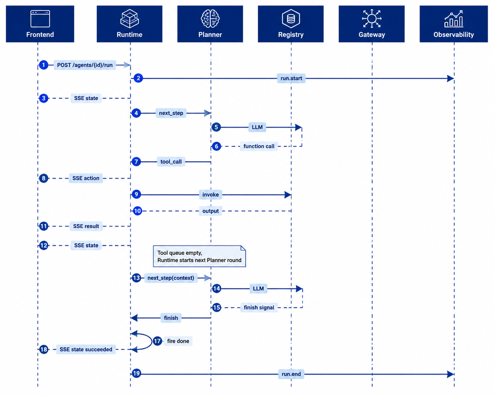

# Chapter 22 Agent Runtime

---
A production Agent is not a single model call. It is a task chain that can be observed, paused, resumed, audited, and recovered. The model proposes steps, Runtime advances state and executes authorized tools, the frontend displays progress, and the audit system reconstructs each action after the fact. Without a clear Runtime contract, a long-running task cannot reliably resume after a page refresh, and the system cannot decide whether a tool failure should be retried, escalated to human approval, or terminated.

This chapter focuses on three objects: Run, Step, and Tool Call. A Run is one auditable task. A Step is one Planner decision round. A Tool Call is one actual execution with potential side effects. These objects are intentionally separate because enterprise tasks often cross systems, wait for approvals, and need replay. If the platform records only a chat session, auditors cannot tell whether the third tool call was approved. If every tool call becomes a separate task, the original business task cannot be resumed after human review.

Consider a DataAgent task: the user asks for last week's sales decline in East China, the system queries sales data, identifies abnormal SKUs, and may generate a report for manual verification. The frontend may only show Planning, Executing, and Waiting for approval. Behind those states are multiple model calls, SQL executions, validation checks, checkpoints, and possibly approval callbacks. Runtime is the layer that turns this chain into one observable and recoverable Run.

The Runtime boundary matters because Planner, Registry, Gateway, Console, and Policy each own different responsibilities. Planner proposes the next step. Registry finds and invokes tools. Gateway calls models. Console renders progress. Policy decides whether an action is allowed. Runtime connects them into a controlled execution chain: state transition, event stream, checkpoint, failure classification, and recovery path.

---
## 22.1 Runtime Object Model

### 22.1.1 Run / Step / Tool Call Responsibilities

The most common mistake in Runtime design is to conflate session, reasoning rounds, and tool calls into a single object. Sessions are UI-oriented and identify the chat surface the user is using. Runs are task-oriented and define the boundary of one auditable task. Steps are reasoning-oriented and record each Planner decision round. Tool Calls are side-effect-oriented and record which tool was executed, with which arguments, by which Run, and with what result.

Tasks like financial analysis, customer service tickets, and contract review often span multiple systems. If you only record a session ID, auditors cannot verify whether the third tool call was ever approved. If every tool call is treated as a new task, then after human review, the original task cannot be resumed. The layered design of Run / Step / Tool Call is meant to simultaneously satisfy task-level SLA, inference traceability, and side-effect audit requirements.

*Table 22-1: Responsibility boundaries of Run, Step, and Tool Call. Source: Compiled by this book.*

| Object    | Represents                  | Main Fields                                  | Typical Use Cases              |
|-----------|----------------------------|----------------------------------------------|------------------------------|
| Run       | A single auditable task     | `run_id`, `agent_id`, `input`, `context`, `state` | SLA, checkpoints, approval, audit |
| Step      | One round of Planner decision | `run_id`, `step_index`, `planner_output`     | Organizing multi-round planning and tool feedback |
| Tool Call | One actual tool execution   | `tool_call_id`, `tool`, `args`, `status`, `output` | Playback, idempotency, error categorization |

The relationship between these three objects is straightforward: one Run contains multiple Steps; one Step can generate zero, one, or multiple Tool Calls. The Planner only proposes tool call intentions; actual execution must be carried out by Runtime through the Registry.

### 22.1.2 `/run` Request Contract

Each `POST /agents/{agent_id}/run` corresponds to one Run. For long-running tasks waiting for approval, the same `run_id` is retained. Do not open a new chat window or create a new task ID.

```json
{
  "input": "What were the main SKUs driving last week's sales decline in East China?",
  "context": {
    "user_id": "u-ops-001",
    "tenant_id": "demo-retail",
    "scope": ["sales_region:east"]
  },
  "options": {
    "idempotency_key": "optional-client-key",
    "max_steps": 20
  }
}
```

The `context` must be passed through unchanged to the Policy and tool layers. The `idempotency_key` is used for client retries to avoid repeating side-effect-inducing actions like sending emails, creating tickets, or writing to databases. `max_steps` acts as a deadlock protection measure, preventing the model from repeatedly trying the same category of tool calls.

### 22.1.3 Runtime and Adjacent Components

Runtime does not replace Planner, Tool Registry, or Policy. Its responsibility is to advance Run state, execute authorized tools, push events, write checkpoints, and select recovery paths on failure.

*Table 22-2: Division of responsibilities between Runtime and adjacent components. Source: Compiled by this book.*

| Component     | What Runtime Does                       | What the Component is Responsible For       |
|---------------|---------------------------------------|---------------------------------------------|
| Planner       | Calls `next_step()`, receives structured decisions | Generates next-step plans, does not execute tools directly |
| Tool Registry | Finds handlers by tool name and version | Manages tool schemas, versions, and descriptions |
| Policy        | Requests rulings before high-risk actions | Authorization, approval policies, risk evaluation |
| Memory        | Reads/writes context visible to Planner | Long/short-term memory, summaries, retrieval |
| Console       | Pushes status and approval events     | Displays progress, accepts human approval callbacks |

Industry commonly decomposes Agent capabilities into planning, memory, tool use, and other modules (Wang et al. 2024). Runtime is the execution layer that connects these modules, ensuring they operate along a unified task lifecycle instead of independently advancing their own states.

Delegating Runtime individually to each business Agent may seem flexible but can quickly spiral out of control. One team treats a tool timeout as failure, another retries three times for the same timeout; one team reruns tasks after frontend disconnect, another resumes from checkpoints; the security team wants to audit similar high-risk tool calls but finds every Agent logs different fields. The value of platform-level Runtime is here: it fixes states, events, error codes, and recovery semantics so business Agents only focus on task logic.

---
## 22.2 Run Six-State Machine

### 22.2.1 State Definitions

The Run six states represent the lifecycle exposed externally by the Runtime. Internally, the orchestration framework may have more nodes and subgraphs, but the Console, SLA, alerts, checkpoints, and auditing should all adhere to the Run six states.

*Table 22-3: Meaning and typical transitions of the Run six states. Source: Compiled by this book.*

| State           | Meaning                                               | Typical Transitions                                   |
|-----------------|-------------------------------------------------------|-----------------------------------------------------|
| `pending`       | Run has been created but planning has not started     | `start`                                             |
| `planning`      | Planner is generating the next-step decision          | `plan_ready`, `plan_error`                           |
| `executing`     | Runtime is executing tools or preparing for next planning round | `next_step`, `done`, `need_approval`, `exec_error` |
| `waiting_human` | Execution is intentionally paused, awaiting human approval or callback | `approved`, `rejected`                               |
| `succeeded`     | Planner has finished, and no unfinished Tool Calls remain | Terminal state                                      |
| `failed`        | Unrecoverable error, approval rejected, cancellation, or retries exhausted | Terminal state                                      |

`waiting_human` is not a deadlock but a deliberate pause state entered by the Runtime. In compliance scenarios, approval waiting times often need to be separately tracked rather than simply counted as model or tool execution delay.

This distinction matters for long-running tasks. Approval waits can last hours or even days, but the Runtime must preserve the original Run's identity, context, and checkpoints. Otherwise, recreating the task after approval would lose prior tool results and split the audit trail into two separate records.

The same `run_id` spanning waiting, approval, resumption, and final export is what aligns business responsibility with technical execution. Traceability is the core difference between Runtime and ordinary chatbot backends.

### 22.2.2 Transition Diagram


*Figure 22-1: Run six-state machine. Source: Original illustration by this book. Alt text: The state machine contains six nodes: pending, planning, executing, waiting_human, succeeded, and failed. Arrows indicate valid transitions from creation, planning, execution, human waiting, and success or failure.*

The key rule in Figure 22-1 is that terminal states can only be triggered by the Runtime. The model may state in text that the task is complete, and the Planner may return an end intent, but the Runtime must confirm the tool queue is empty, approvals are complete, and failures are handled before transitioning to `succeeded`.

### 22.2.3 Difference from Orchestration Graph States

Chapter 25 will discuss the Planner and orchestration patterns. Orchestration graph states belong to the Planner's internal implementation, such as a particular LangGraph node, subgraph, or routing branch. The Run six states belong to the platform contract and are visible to the frontend, auditing, and alerts. The two should not be mixed.

If internal orchestration nodes are directly exposed to the frontend, users will see many technical states unrelated to business. If Run six states are folded inside the Planner, the Runtime cannot independently handle cancelation, approval, retries, and recovery. Thus, internal orchestration can be complex, but the external lifecycle must remain stable.

---
## 22.3 Execution Loop and Event Flow

### 22.3.1 Main Loop

The Runtime's main loop can be summarized in four steps: create a Run, invoke the Planner, execute tools, then either continue planning based on results or enter a terminal state.

```text
create run -> planning
while run is not terminal:
  planner_output = planner.next_step(context)
  if planner_output asks for tools:
      validate policy and tool schema
      emit action event
      execute tool through registry
      emit result event
      update checkpoint
  elif planner_output asks to finish and no tool is pending:
      mark succeeded
  elif approval is required:
      mark waiting_human
  else:
      classify error and recover or fail
```

There are two boundaries in this pseudocode. First, the Planner only returns decisions and does not drive the state machine. Second, any tool invocation must first pass schema validation, permission checks, and idempotency control before entering the executor.

The main loop also needs to avoid turning repeated model deliberation into an infinite loop. Each Step should consume from a shared budget: model call count, tool call count, total elapsed time, and context length are all accounted against the same Run. The budget gives failure a termination point. Without budgeting, the Runtime can get stuck in loops caused by repeated tool argument revisions, unsatisfactory retrieval results, or Planner indecision.

### 22.3.2 End-to-End Timing Sequence



*Figure 22-2: End-to-end Run Sequence. Source: Created by the book authors. Alt text: Sequence diagram illustrating call order among Client, Runtime, Planner, Tool Registry, and Model Gateway, from /run request through state transitions, tool invocations, event streaming, and final return.*

Figure 22-2 shows the execution chain from the Runtime's perspective. ReAct organizes reasoning and acting into interleaved trajectories (Yao et al. 2023). In engineering terms, actions must be logged as Tool Call records, and observations as tool result events. The OpenAI Agents SDK's streaming runtime also distinguishes tool call and tool return events (OpenAI n.d.). In all cases, the frontend and auditing systems need to see execution progress rather than only the final text output.

### 22.3.3 SSE Events

Token streams from chat models only indicate text generation, not which tool the system executed. Agent Server-Sent Events (SSE) should at minimum include three event types.

*Table 22-4: Agent SSE Event Types. Source: Compiled by the book authors.*

| Event              | Meaning                        | Key Fields                                  |
|--------------------|-------------------------------|---------------------------------------------|
| `state`            | Run state change or terminal   | `run_id`, `state`, `step_index`, `answer`  |
| `action`           | About to execute a tool        | `tool_call_id`, `tool`, `version`, `args`  |
| `result`           | Tool execution completed       | `tool_call_id`, `status`, `output`, `error`|
| `approval_request` | Entering human approval wait   | `approval_id`, `title`, `artifact_ref`, `requested_actions` |

`action` and `result` must always appear in pairs. Without a `result` following an `action`, audits cannot verify if side effects actually occurred. When entering `waiting_human` state, the Runtime must push an approval event, and the Console sends back the manual callback to Runtime.

```text
event: state
data: {"run_id":"run-8f3a","state":"planning","step_index":0}

event: action
data: {"run_id":"run-8f3a","tool_call_id":"tc-1","tool":"sql_executor","args":{"sql":"..."}}

event: result
data: {"run_id":"run-8f3a","tool_call_id":"tc-1","status":"succeeded","output":{"rows":[...]}}

event: state
data: {"run_id":"run-8f3a","state":"succeeded","answer":"Top 3 declining SKUs in East China are..."}
```

SSE uses the `text/event-stream` format, with event format and reconnection semantics defined by the HTML Living Standard (WHATWG n.d.). Clients should reconnect with `Last-Event-ID` after disconnect. The server must resume pushing from event logs or checkpoints rather than re-triggering `/run` to avoid causing side effects.

### 22.3.4 Trace and `run_id`

The Runtime also writes the execution process to a Trace system. A task might pass through frontend, Runtime, LLM Gateway, Tool Registry, and external SQL services. To locate a slow step, the platform needs to connect spans across these services using the same trace-id.

`run_id` and trace-id serve different purposes. `run_id` targets business tasks, used in Console, approvals, checkpoints, and audit export. Trace-id targets observability, used for performance analysis, call topology, and alerting. They can be mapped at the Observability layer but should not be merged into a single field; otherwise, business recovery semantics will be compromised by sampling, expiration, and link reconstruction policies. Distributed tracing can follow the W3C `traceparent` header and OpenTelemetry standards (W3C 2021; OpenTelemetry n.d.).

When troubleshooting incidents, both IDs appear together. Customer support uses `run_id` to locate the user-visible task; SRE uses trace-id to locate slow calls and error spans. Clearly mapping both IDs lets teams move from user feedback to system calls, then back from system calls to business tasks.

---
## 22.4 Checkpoints and Recovery

### 22.4.1 Checkpoint Contents

A checkpoint is a restartable snapshot of a Run. After a process crash, redeployment restart, or node migration, the new process reads the checkpoint and should be able to continue from the most recent valid state, instead of requiring the user to resubmit their request.

*Table 22-5: Essential fields for Runtime checkpoints. Source: compiled in this book.*

| Category          | Field                            | Why Needed                                    |
|-------------------|---------------------------------|-----------------------------------------------|
| Runtime State     | `run_id`, `state`, `step_index`, `history` | Restore state machine and migration history  |
| Request Context    | `input`, `context`, `options`     | Preserve permissions, tenant info, and task semantics |
| Tool Records      | Unfinished calls, references to completed results, error codes | Avoid duplicate side effects, reconstruct Planner input |
| Memory References | Session keys, summaries, retrieval fragment references | Prevent loss of context after Planner recovery |
| Event Position    | Last sent SSE event id            | Support incremental push after disconnection |

Saving only `state=executing` is insufficient. For example, if a business analysis task has already obtained a SQL result and the Pod restarts before the next planning round, without saving tool results and Memory references, the Planner might re-select tables or recompute metrics upon recovery, causing inconsistency before and after recovery.

### 22.4.2 When to Write Checkpoints

By default, enterprises should write checkpoints at three key moments: after a successful state transition, after Tool `result` is persisted, and when entering or leaving `waiting_human` state. Writing too infrequently widens the crash vulnerability window; writing too frequently increases storage pressure. For high-QPS short tasks, sampling strategies can be considered, but tool call results with side effects should never be skipped.

Storage can be layered: store online state in Redis or other low-latency KV stores with TTL aligned to the Run's max duration; store audit archives in PostgreSQL or object storage using append-only writes to support replay and export. Local development can simulate this using SQLite or file directories.

### 22.4.3 Recovery Process

The recovery process should also obey the state machine constraints.

1. Load the most recent checkpoint by `run_id`, confirming the state is not terminal.
2. Replay state history and Tool Call result references to reconstruct Planner-visible context.
3. If the state is `waiting_human`, wait for Console callback and do not automatically continue execution.
4. If there are unfinished tool calls, first query the idempotency key's execution status, then decide whether to resend the `result` event, retry, or fail.
5. On client reconnect, send only missed events based on the `Last-Event-ID`.

Frameworks like LangGraph also persist graph execution state (LangChain n.d.). The difference emphasized here is that Runtime checkpoints use platform-level `run_id` as the primary key, serving the `/run` contract and the six states of Run, rather than binding to internal node names within a specific orchestration framework.

The worst recovery failure is losing track of whether a write tool already executed and then executing it again. Write-action tools must therefore be designed with idempotency semantics alongside checkpoints. Actions such as creating tickets, sending emails, or writing approval records should be executed with an `idempotency_key` and store the tool-side returned business ID after execution. On recovery, query this business ID or idempotency key first, instead of directly invoking the tool again.

Event ordering creates another recovery problem. A tool result may have been persisted before the SSE event reaches the frontend, or the frontend may have received the `action` event before the server restarts while writing the `result`. Event logs and checkpoints need to be designed together so the `action`, `result`, and state transition for the same `tool_call_id` can be replayed in order. Otherwise, the user interface may show a stalled task while the audit record shows that the tool already ran.

---
## 22.5 Failure Classification, Timeouts, and Cancellation

### 22.5.1 Error Codes and Recovery Strategies

A runtime cannot simply retry all failures blindly. Model timeouts, tool unavailability, parameter errors, context overflows, policy denials, and infinite loops each have different responsible parties and require different recovery paths.

*Table 22-6: Runtime Failure Classification and Recovery Strategies. Source: Compiled by this book.*

| Failure Type       | `code`               | Default Handling                                  |
|--------------------|----------------------|--------------------------------------------------|
| Model Timeout      | `MODEL_TIMEOUT`       | Limited retries, switch to backup model if needed|
| Tool Unavailable   | `TOOL_UNAVAILABLE`    | Retry if idempotent; otherwise, query execution status |
| Tool Parameter Error | `TOOL_ARGUMENT_INVALID` | Report schema error to Planner; retry up to a fixed limit |
| Context Overflow   | `CONTEXT_OVERFLOW`    | Compress history, trim low-priority segments, or fail |
| Infinite Loop      | `LOOP_DETECTED`       | Fail immediately; log duplicate parameter summary |
| Policy Denied      | `POLICY_DENIED`       | Enter manual approval or fail                    |
| Tool Not Registered| `TOOL_NOT_FOUND`      | Feedback to Planner for correction; stop if persists |

Parameter errors normally should not cause an immediate Run termination. For example, if the Planner omits `tenant_id` when generating SQL tool parameters, the Registry can write the schema error into the `result` event and provide it as input for the next Planner round. Only after exhausting retry budget does the Runtime escalate to failure migration. By contrast, policy denial and infinite loops should not be retried blindly, as that increases risk or overloads shared resources.

### 22.5.2 Three Levels of Timeout

The Runtime needs to support at least three timeout levels: overall Run timeout, Tool Call timeout, and LLM request timeout. The Run timeout determines whether the entire task goes to failure or an asynchronous queue; Tool Call timeout determines whether retry by idempotency key applies; LLM timeout is handled by the Gateway's model routing and retry policy. Approval waiting typically uses a separately configured `approval_timeout_s`, which is not equivalent to model or tool timeouts.

These timeout levels should not be collapsed into one global configuration. Run timeout is tied to user promise and business workflow, and may last minutes, hours, or even days. Tool Call timeout is tied to external systems and idempotency semantics, so it usually needs per-tool configuration. LLM request timeout is tied to model service stability and is usually handled by the Gateway and model routing. Merging the three creates two common failures: long tasks get killed by model-timeout logic, or short tools fail too late because they inherit a long Run-level deadline.

Timeout results must also enter the state machine and event stream. Telling the user that the task failed is insufficient; the frontend and audit record need to distinguish model timeout, tool timeout, approval timeout, and overall Run timeout. Clear error codes allow later evaluation to separate model capability issues, tool stability issues, and workflow-design issues.

### 22.5.3 Cancellation Semantics

Cancellation can be triggered by the user, Console, or upstream processes. Upon cancellation, the Runtime should stop any not-yet-started tool queues, attempt to cancel ongoing invocations, write a `failed` state with the `RUN_CANCELLED` code, and log the `cancelled_at` timestamp. This book does not treat `cancelled` as a seventh Runtime state in order to keep the six-state contract stable. If cancellation is modeled as a separate state in the future, the state machine, SSE, checkpoints, and frontend display must be updated together.

Cancellation is not task deletion. Tool calls that have already executed may have produced external side effects, such as creating tickets, sending emails, writing approval records, or triggering data exports. Runtime can stop later actions and mark in-flight calls as cancellation requested, but completed actions need compensation steps or human handling. The cancellation event must enter Trace so reviewers can tell whether the user cancelled before result generation or after an external action had already run.

---
## 22.6 Runtime Code Boundary

### 22.6.1 Runtime Implementation Entry Point

The chapters in Part V share the demonstration located in `projects/multi-agent-workflow/`, which runs the six-state machine, Registry tool calls, Handoff, and `waiting_human` features. The `core/runtime/` directory contains the platform modules. When reading the code, it's best to start with the state machine, model objects, and main loop.

```text
mini-platform/core/runtime/
├── state_machine.py
├── run_models.py
├── run_loop.py
├── handoff_tool.py
├── approval.py
├── checkpoint.py
└── stub_planner.py

projects/multi-agent-workflow/
├── run.py
└── README.md
```

Run commands are as follows:

```bash
cd mini-platform
python3 projects/multi-agent-workflow/run.py start
python3 projects/multi-agent-workflow/run.py approve
```

Automated tests can be run with:

```bash
pytest tests/test_multi_agent_workflow_run.py tests/test_runtime.py -q
```

When reading this project, it is not recommended to start from the business demo entry point. A more stable approach is to first look at `state_machine.py` to understand the six states and transitions; then read `run_models.py` to grasp the `RunContext` and `ToolCallRecord`; finally, review `run_loop.py` to see how state transitions, tool executions, checkpoints, and approval resumes are connected together. This prevents mistaking business steps in the demo for generic runtime capabilities when reading the code.

### 22.6.2 Runtime Demo Scope and Evolution

The demo covers the state machine, RunLoop, Registry invocation, SSE events, checkpoints, and manual approval. The production version still requires adding an HTTP `/run` service, OpenTelemetry tracing spans, three-level timeouts, persistent event logs, distributed locking, tool idempotency, and audit exports.

The demo already covers Run six states, Tool Call execution, checkpoints, SSE, human approval, and basic logs, but each capability needs production hardening. Run six states need to stay consistent across the HTTP API, SSE stream, and checkpoint store. Tool Call execution needs permission checks, idempotency, timeouts, and circuit breaking. Checkpoints should move beyond files or lightweight local storage into online state storage plus audit archives. SSE needs `Last-Event-ID` and persistent event logs to handle reconnects. Human approval needs integration with Console, Policy, and ticketing systems. Observability needs trace IDs, spans, metrics, and alerts rather than plain logs.

The initial version of the Runtime does not need to implement all production capabilities at once but must not miss these three bottom lines: the state machine must not be bypassable by model text, Tool Calls must have paired `action` and `result` records, and checkpoints must be able to restore the Planner-visible context.

If only one acceptance scenario can be chosen, it is recommended to select "process restart after tool execution." This scenario tests the state machine, Tool Call records, checkpoints, idempotency, and SSE reconnection all at once: after recovery, tools must not be executed repeatedly, the frontend should continue to receive subsequent events, and the final state should be consistent with the pre-restart state.

---
## 22.7 Runtime Resource Isolation and Concurrency Control

Resource isolation is often underestimated when Runtime enters production. In development, a Run usually comes from one user and calls only a few tools. After launch, the same tenant may start conversations, batch jobs, and background retries at the same time, while different tenants compete for model quota, tool connection pools, database query capacity, and queue workers. A Runtime that only keeps a state machine without resource boundaries can let one long task slow down the whole platform.

Resource isolation should cover four layers. Tenant and user concurrency limits prevent one caller from occupying the execution queue. Tool-level throttling recognizes that CRM, ticketing, database, and file parsing services have different capacities and should not share one retry policy. Model-level budget control puts context length, output tokens, retry count, and concurrent requests into one budget. Run-level timeout and cancellation ensure that background tool calls, streaming output, and temporary artifacts are cleaned up after the user cancels a task.

Concurrency control also depends on idempotency. Page refreshes, frontend reconnects, approval callback replays, and queue consumer restarts can submit the same Step more than once. Runtime needs idempotency keys for Tool Calls, approval events, and recovery actions. It cannot rely on "the previous attempt did not report an error." If an inventory deduction, email send, or ticket creation tool runs twice, no model explanation can repair the business side effect.

## 22.8 Event Replay and State Repair

Runtime state should not live only in memory. Long tasks, human approval, tool callbacks, and frontend disconnections can make one Run cross several process lifetimes. A steadier design records key state changes as events: Run creation, Step start, tool request, tool result, model output, approval suspension, approval resume, cancellation, failure, and completion. Checkpoints store recoverable snapshots; the event log explains why the state changed.

Event replay serves two scenarios. Incident review needs to know what happened before an incorrect answer, rather than only inspect the final message. State repair needs to load the nearest checkpoint after restart and then apply subsequent events. If events and snapshots disagree, Runtime should enter repair instead of continuing execution blindly. Repair may roll back to a safe state or mark the Run for human handling.

This mechanism adds storage and implementation cost, but it clarifies Runtime's responsibility. Runtime is more than a loop that calls models and tools; it is the ledger of Agent behavior. Chapter 38 can build diagnostic Trace views on top of events, Chapter 30 can connect approval events to recovery, and Chapter 39 can sample failed events for evaluation.

## 22.9 Division of Labor Between Runtime and Queue Systems

Long tasks usually need queues, but queues do not replace Runtime. The queue schedules execution units, controls concurrency, and handles worker failure. Runtime preserves task meaning, state transitions, tool results, and user-visible progress. If business state exists only inside queue messages, expiration, retry, or dead-letter handling makes it hard to reconstruct what the user saw. If Runtime does not know which Step the queue is executing, it cannot provide stable progress to the frontend.

A clear division is: Runtime creates the Run and Step; the queue receives only a reference to an executable Step; the Worker executes and writes the result back; Runtime decides the next state. Queue retries use Step idempotency keys, and Workers do not directly advance business state. With this model, Runtime still knows whether a Step is waiting, running, failed, retryable, or waiting for human handling even if a Worker crashes.

This separation supports later expansion. Low-risk synchronous tasks can stay outside the queue, expensive parsing and report generation can run asynchronously, and high-risk write operations can enter the queue only after approval. Runtime is the semantic layer for execution; the queue is execution infrastructure. Keeping them separate prevents a technical component change from breaking the Agent state model.

Runtime should expose stable progress instead of leaking queue internals. Users need to know whether a task is parsing, waiting for a tool, waiting for approval, generating a report, or recovering from failure. They do not need to know which topic or worker is processing the message. Stable progress reduces duplicate submissions, because users can see the task is alive instead of refreshing or starting the same request again.

Runtime APIs should therefore treat state query, event subscription, and cancellation as foundation capabilities. The frontend should not re-submit a task to check progress, and external systems should not replay a request to probe completion. Stable control APIs remove many "random" runtime problems that are actually repeated submissions, reconnects, or unclear state.

Runtime states must reflect real failure paths. Model errors, tool timeouts, user cancellation, approval suspension, and partially successful external systems all lead to different recovery decisions. A platform with only `running` and `failed` cannot distinguish retryable failure, business rejection, human wait, and system cancellation. The event stream is also more than frontend animation. SSE events are replayable execution records: which decision the Planner made, when a tool started and ended, why approval was requested, and where the final artifact is stored. The frontend uses those events for progress, the audit system uses them for reconstruction, and the evaluation pipeline can use them for failure analysis.

After Runtime becomes a platform capability, Agent applications become lighter. Applications define tasks and tools; Runtime owns execution semantics, states, checkpoints, timeouts, and events. Customer service, DataAgent, contract review, and report generation can then share the same state, approval, and recovery mechanism, while business differences stay in tools and policies. This reuse lowers the launch risk for each new Agent because teams no longer need to rebuild fragile execution scripts.

Runtime operation also needs continuous state-distribution monitoring. A large number of Runs stuck in `waiting_human` usually points to unclear approval responsibility or notification flow. Many Runs terminated by `max_steps` indicate Planner loops or poor tool feedback design. Frequent user cancellation may indicate weak frontend progress visibility or mismatched expectations. These states are not log noise; they are direct signals of platform quality. Timeout and cancellation should also remain explicit semantics. After the user cancels a Run, Runtime must decide whether completed tool actions need compensation, whether queued work should be removed, and whether generated artifacts should be retained.

Checkpoint contents need to be recoverable without turning Runtime into a new data exposure surface. Planner-visible context, tool result summaries, artifact references, approval state, and error classification usually need to be saved. Large raw datasets and sensitive records should stay in controlled storage and be recovered by reference. A recovery design built only for convenience can leak data through checkpoint stores, exports, or debug views. The same principle applies to tenant and business context: Runtime should record the organization, role, policy version, and data scope in effect when the Run started, rather than storing `user_id` alone. Otherwise, approval, audit, and replay can lose the permissions context that made the original execution valid.

Event ordering requires explicit design. Network reconnects can cause duplicate SSE delivery, and backend recovery can replay historical events. Runtime should assign a monotonically increasing sequence to each event and let clients apply events in order. Without event sequence numbers, the frontend timeline may occasionally appear out of order, and user-visible state can diverge from backend state. Tool idempotency keys should also be managed by Runtime rather than by the model or scattered business code. A practical key can combine `run_id`, `tool_call_id`, tool name, and business idempotency fields so retries, service restarts, and event replay do not create duplicate side effects.

Long-running Runs need retention and cleanup rules. Runs waiting for approval may need to stay online longer. Failed Runs may move quickly to audit archives. User-cancelled Runs need queue cleanup and temporary artifact cleanup. If cleanup is absent, Runtime data grows without bound; if cleanup happens too early, recovery and audit become unreliable. Runtime storage should also support audit queries from the beginning: lookup by `run_id`, user history, tool invocation history, long-suspended Runs, and status distribution are all routine operational needs. Storing each chat as one JSON blob makes these queries difficult later.

Developers and operators need a controlled debugging entry point. A Run's state machine, event stream, tool calls, and checkpoints should be viewable on a timeline in the console. Without that view, developers must reconstruct failures from scattered logs, and business teams cannot understand why a task paused or failed. Repair tools require even more care. Production systems will eventually see Runs stuck in intermediate states, duplicated events, or lost tool callbacks. An administrator repair path is useful, but every repair must record the reason, operator, previous state, new state, and affected scope. Unrecorded manual repair breaks Runtime's role as the source of truth.

Multi-tenant Runtime requires resource isolation. One tenant's batch of long tasks should not consume all workers, and high-risk tasks waiting for approval should not block low-risk read-only tasks. Queue priority, concurrency, and budgets should be configured by tenant and task class. Synchronous HTTP requests are suitable for starting a task and returning `run_id`; long execution should move to queues or background workers. Binding a long task to a single HTTP request makes recovery difficult after client disconnects or gateway timeouts.

---
## Chapter Recap

Runtime turns one Agent interaction into an observable, recoverable, and auditable Run. Run, Step, and Tool Call correspond to task, reasoning iteration, and actual tool execution, and they should not be mixed. The six-state machine is the platform's external contract, while orchestration graph states belong to Planner internals. `succeeded` can only be set by Runtime; model text or a Planner finish intent cannot decide the final state. Agent SSE should express the execution chain through `state`, `action`, `result`, and approval events instead of only token streams. Checkpoints need enough state, context, tool results, Memory references, and event positions to support recovery, reconnection, audit replay, and evaluation.

## References

Wang, L., Ma, C., Feng, X., et al. (2024). A survey on large language model based autonomous agents. *Frontiers of Computer Science*, 18(6), 186345. [https://doi.org/10.1007/s11704-024-40231-1](https://doi.org/10.1007/s11704-024-40231-1)

Yao, S., Zhao, J., Yu, D., et al. (2023). ReAct: Synergizing reasoning and acting in language models. *ICLR*. [https://arxiv.org/abs/2210.03629](https://arxiv.org/abs/2210.03629)

OpenAI. (n.d.). *Streaming*. OpenAI Agents SDK. [https://openai.github.io/openai-agents-python/streaming/](https://openai.github.io/openai-agents-python/streaming/)

WHATWG. (n.d.). *HTML Living Standard: Server-sent events*. [https://html.spec.whatwg.org/multipage/server-sent-events.html](https://html.spec.whatwg.org/multipage/server-sent-events.html)

OpenTelemetry. (n.d.). *Tracing API*. [https://opentelemetry.io/docs/specs/otel/trace/api/](https://opentelemetry.io/docs/specs/otel/trace/api/)

W3C. (2021). *Trace Context*. [https://www.w3.org/TR/trace-context/](https://www.w3.org/TR/trace-context/)

LangChain. (n.d.). *Persistence*. LangGraph. [https://docs.langchain.com/oss/python/langgraph/persistence](https://docs.langchain.com/oss/python/langgraph/persistence)
