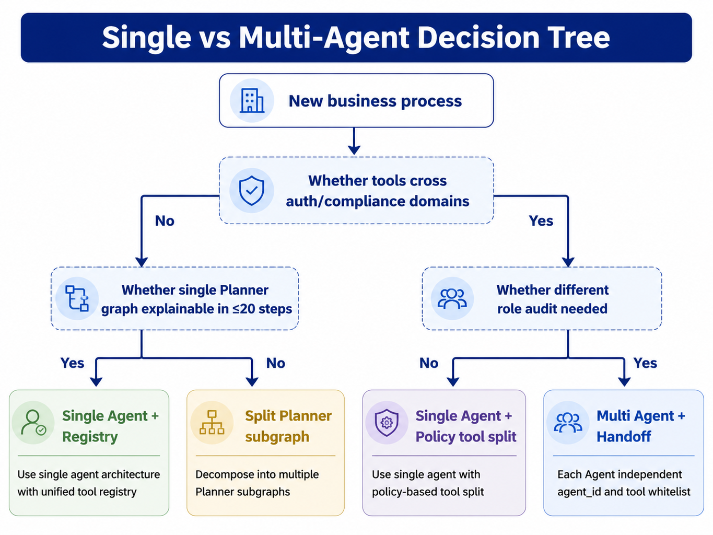
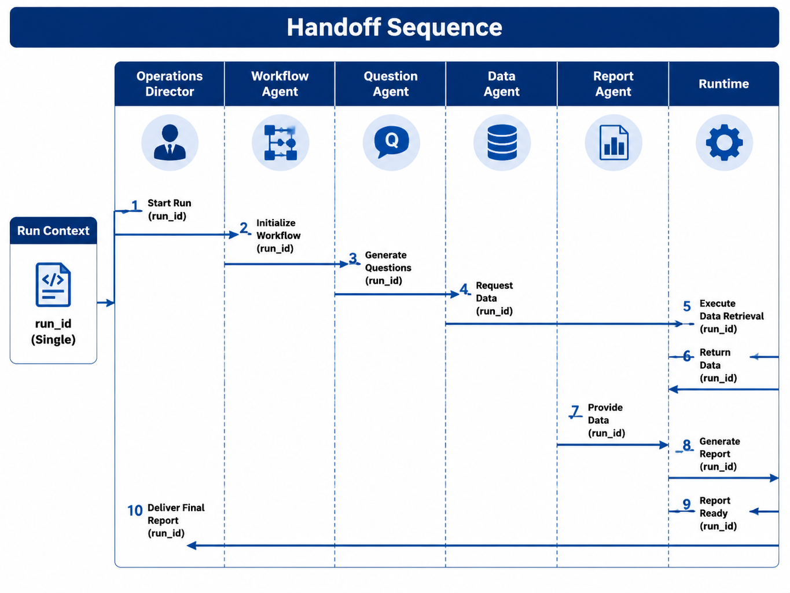

# Chapter 28 Multi-Agent Collaboration

---

The core value of multi-Agent design is to put different responsibilities, permissions, and deliverables into one auditable Run. A single DataAgent can query data, explain results, and draft a report. When the task also includes clarification, fact checking, report generation, compliance review, and external vendor capabilities, a single Agent starts to carry too much prompt burden, too many tool permissions, and too much responsibility. A platform-level multi-Agent design has to answer six questions: when to split, how to assign roles, how to hand off control, how to discover capabilities, how to handle conflicts, and how the design lands in the mini-platform.

Chapter 25 discusses orchestration inside a single Agent, where a Planner can use ReAct, Plan-and-Execute, or a state graph to choose the next tool call. Chapter 26 covers self-correction inside one Agent. Those chapters answer how one Agent completes a task. This chapter starts from a different problem: when a task naturally crosses several specialized roles, the platform still needs one state model, one approval chain, and one audit trail.

Take an example of a business analysis request. The operations leader inputs: "Explain the Q1 gross margin decline in East China and provide actionable recommendations." If this is handed off to one Agent alone, it must clarify metric definitions, execute SQL queries, generate reports, and determine which conclusions require compliance review. While this approach may work in a demo, the production environment faces several issues: SQL tool permissions get mixed in with report generation logic; the prompt becomes overloaded with multiple role responsibilities; it's difficult to separate report drafts and data verification for auditing; and compliance review is hard to insert at the appropriate step.

A more reliable approach is to place the task in an outer Workflow Run. A Workflow Agent receives the user input and chooses the next role; a Question Agent clarifies definitions; a Data Agent calls the semantic layer or SQL tools; a Report Agent drafts the report; a Reviewer or Policy Agent decides if manual confirmation is needed. These are not five separate `/run` services started independently, but rather five sequential processing stages under the same `run_id`. The runtime still maintains six states, checkpoints, tool calls, and approvals. The handoff merely transfers control and context to the next participant.

Multi-Agent orchestration is therefore not the default architecture. It adds overhead in routing, communication, checkpoints, observability, and failure recovery. Only when these costs bring clear advantages like permission isolation, organizational role separation, or parallel expertise does decomposition make sense. This chapter's focus is to transform "multiple Agents" into a platform contract, instead of a loose collection of model chats.

Multi-Agent collaboration is often presented as several roles discussing a problem together. Enterprise platforms care more about how responsibility is split. One Agent can perform business analysis, report writing, and compliance review, but once it owns query permission, explanation authority, approval influence, and outbound delivery, too much risk concentrates in one prompt and one tool set. Splitting into several Agents separates responsibilities, permissions, and deliverables while keeping them inside the same auditable Run.

A business analysis flow shows the value of this split. An Analysis Agent handles queries and attribution, a Report Agent organizes material, and a Compliance Agent checks sensitive fields and publication rules. Their tool permissions, inputs, and outputs differ. If collaboration only means forwarding chat messages, the platform still cannot explain which Agent made which decision, who approved outbound content, or which artifact entered the business process. Multi-Agent design has production value when a task crosses professional roles, tool permissions, or responsibility boundaries. For low-risk tasks with one permission domain and one deliverable, it usually adds state, communication, and debugging cost.
## 28.1 When Multiple Agents Are Needed

To decide whether to split Agents, first check if a single Agent is already overloaded. Overload usually appears when one Agent carries several distinct responsibilities: it needs to use unrelated tools, switch between permission domains, produce different types of deliverables, or let different teams own intermediate results. As long as these boundaries can still be clearly expressed by a single Planner, a clear Tool Registry, and a state diagram, there is no rush to split.

*Table 28-1: Signals for Choosing Single Agent vs. Multiple Agents. Source: compiled by author.*

| Judgment Dimension | Single Agent More Suitable | Multiple Agents More Suitable |
|---|---|---|
| Tool Permissions | Tools belong to the same authentication domain | SQL, report, and external SaaS permissions differ |
| Prompt Roles | One system prompt covers the task | Clarification, data querying, writing, review require different prompts |
| Audit Responsibility | Tool Call replay suffices to explain process | Different teams responsible for different intermediate outputs |
| Parallel Needs | Steps are naturally sequential | Multiple data sources, regions, or external Agents can work in parallel |
| Deliverable Forms | Only one final answer needed | Reports, attachments, approval comments, or external artifacts required |

A typical scenario where a single Agent suffices is a one-off read query with a brief explanation. For example, when a user asks "What were the top 10 SKUs for East China sales last week?", the Planner just selects tables, generates SQL, runs the query, and explains. Splitting into Question Agent, SQL Agent, Report Agent only lengthens the process.

Multiple Agents are better suited for cross-role tasks. For example, the same business analysis may require a Data Agent to access the warehouse, a Report Agent to access a document renderer, and a Reviewer who can only read drafts and evidence but cannot directly access PII tables. Here splitting is not to complicate architecture, but to separate tool whitelists, output formats, and responsibility boundaries.



*Figure 28-1: Single vs. Multiple Agent Decision Tree. Source: drawn by author. Alt text: A decision tree branching on whether a single Agent is overloaded, whether specialization is needed, and whether parallelism is required, leading to the conclusion to keep a single Agent or split into multiple Agents.*

It is also important to distinguish multiple Agents from Agentic Workflows. Reflection, search, and self-correction discussed in Chapter 26 can happen within a single Agent. Multiple Agents imply multiple `agent_id`s in the platform, each with independent configuration, tool permissions, and input-output contracts. The former enhances single-task quality; the latter aligns organizational and permission boundaries.

A common misconception is that multiple Agents mean "multiple models freely discussing." Production platforms cannot allow Agents to bypass the Runtime and send arbitrary messages to each other. Every handoff must correlate the `run_id`, `step_index`, input payload, output result, and failure reasons. Without this, apparent flexibility actually breaks the audit trail.

Another misconception is using multiple Agents to cover up tool governance problems. If the SQL tool schema frequently drifts, metrics have no versioning, or report templates are unstable, splitting into more Agents only scatters the issues. Before multiple Agents, there must be a stable Tool Registry, semantic layer versioning, and tracing. Otherwise, each Agent patches holes with its own interpretation, resulting in a seemingly collaborative but actually non-reproducible task chain.

---

## 28.2 Role Assignment

The first step in multi-Agent design is defining roles. Role definitions constrain each Agent's inputs, outputs, tool permissions, and scope of responsibility. A well-designed role should enable the business side to clearly say "who is responsible for this step" and enable the platform to say "what tools are allowed to be called at this step."

*Table 28-2: Common Agent Roles and Responsibility Boundaries. Source: Compiled by this book.*

| Role | Primary Responsibility | Typical Output | Tool Permissions |
|---|---|---|---|
| Workflow / Router | Receive tasks, select the next Agent | `handoff` target, routing reasons | Routing tables, Agent Catalog |
| Question / Clarifier | Clarify scope and fill missing slots | `query_spec` | Low-risk knowledge retrieval |
| Data / Executor | Execute queries and fact generation | SQL results, metrics JSON, evidence citations | Semantic layer, SQL, read-only data tools |
| Report / Synthesizer | Generate report drafts | Markdown, PPT outlines, summaries | Document rendering, templates |
| Reviewer / Policy | Quality and compliance checks | Approve, reject, manual approval requests | Rules, evaluators, approval interfaces |

Router and Planner roles are often confused. The Router selects "which Agent will handle it," while the Planner chooses "which tool the current Agent invokes." A Workflow Agent can embed a lightweight Router, while a Data Agent itself still maintains a Planner internally. This avoids a global Planner needing to understand all tools and all roles at once, while allowing the Data Agent's planning logic to stay focused.

After role division, there should still be only one external entry point. Users see an operational analysis Agent or DataAgent, not manually selecting among five sub-Agents. Internal roles may be shown in debug interfaces, but the business entry must remain stable. For users, the platform delivers a single traceable task, not a collection of components they need to orchestrate themselves.



*Figure 28-2: Handoff Sequence. Source: drawn by this book. Alt text: Sequence diagram showing the main Agent completing part of a task, packaging the task context and state to hand off to a specialized Agent, who processes it and returns it; arrows mark handoff points and context transfer.*

In the six states of Run, multi-Agent switching should not change the state model. `planning` indicates the currently active Agent is making decisions; `executing` indicates the Agent is calling tools or initiating Handoff; `waiting_human` means Reviewer or Policy requests manual approval; `succeeded` means the Workflow has completed aggregation. At checkpoints, `active_agent_id` and the Handoff stack need to be recorded to know which role currently holds control after recovery.

Role design must also control the boundaries of "shared knowledge." The Report Agent needs to know the metrics and evidence output by the Data Agent but does not need database connection details; the Reviewer needs to see the report drafts, citations, and risk tags but should not have report writing permissions; the Workflow Agent must know each Agent's capabilities and status but should not inherit all sub-Agents' tool whitelists. Encoding these boundaries in the AgentSpec is far more reliable than repeatedly reminding in Prompts "do not access these tools."

In organizational collaboration, roles correspond to responsible parties. Data Agent metric errors should be traceable back to the semantic layer or query tools maintained by the data team; Report Agent expression issues should be linked to report templates and generation strategies; Reviewer rejections must be traceable to rule versions or approval comments. A multi-Agent platform that cannot map technical roles to organizational responsibilities will struggle to truly enter operational business workflows.

---

## 28.3 Handoff Contract

Handoff is a structured transfer of control. It is neither forwarding the user's original input to another agent nor starting a new task with a different agent. The platform should implement Handoff as a special Tool Call: the Runtime records the call, the Policy can intercept it, checkpoints can restore it, and the Trace can replay it.

*Table 28-3: Minimum Fields for Handoff. Source: Compiled by this book.*

| Field | Description |
|---|---|
| `from_agent_id` | Originating agent |
| `to_agent_id` | Receiving agent |
| `handoff_id` | Unique ID, recorded in the Tool Call log |
| `payload` | Structured context visible to the next agent |
| `reason` | Routing reason, used for troubleshooting and auditing |
| `return_policy` | Whether returning to the previous agent after completion is allowed |

The granularity of the payload must be carefully controlled. The `query_spec` output by the Question Agent can be passed by value since it usually contains only metrics, time periods, regions, and filters. Large outputs from the Data Agent should not be fully embedded in the Handoff; instead, they should be stored in Memory, object storage, or result tables, passing only a `result_ref`, schema, sample, and hash to the Report Agent. This reduces checkpoint size and prevents intermediate agents from modifying the original result.

Complex workflows may require a Handoff stack. For example, when the Report Agent is drafting and finds the scope incomplete, it can return control to the Question Agent to fill the gaps, then resume at the Report Agent. Stack depth must have an upper limit and be linked with `max_steps`. Otherwise, looping between A and B can cause the Run to time out before failing.

Internal Handoff and external agent delegation must also be differentiated. Internal Handoff only requires locating platform configurations by `agent_id`; external delegation must go through the A2A, Agent Card, TLS, mTLS, and outbound Policy described in Chapter 29. Both appear as Tool Calls in Runtime, but have different adaptation layers and security requirements.

Errors in Handoff must be structured as well. Cases such as the target agent not existing, payload schema violations, target queue timeouts, tenant mismatches, or failures to parse return results should all have clear error codes and recovery strategies. The Workflow Agent can decide to clarify, retry, degrade, or fail depending on the error type. Writing errors only as natural language makes retries, alerts, and analytics difficult.

Idempotency is another fundamental requirement for Handoff. When Runtime retries a Handoff, it must not cause the target agent to write duplicate reports, create duplicate tickets, or initiate duplicate external calls. The `handoff_id`, `idempotency_key`, and payload hash should all be recorded in the Tool Call log. This way, if the process crashes after Handoff, recovery can determine whether the handoff has already been received by the target agent.

---

## 28.4 Routing and Capability Discovery

The routing of Workflow Agents should not rely on the model's on-the-fly guessing. Production systems typically use hybrid routing: rules first filter out high-certainty paths, classification models handle natural language variants, the Agent Catalog provides candidate capabilities and permission filtering, and low-confidence cases are handed off to a Question Agent for clarification.

*Table 28-4: Applicable Boundaries for Routing Strategies. Source: Compiled for this book.*

| Strategy                 | Suitable Scenario                  | Main Risk                       |
|--------------------------|----------------------------------|--------------------------------|
| Rule-based Routing       | High-certainty keywords, fixed flow | Insufficient coverage           |
| Classification Model     | Diverse user expressions, stable labels | Requires evaluation and confidence thresholds |
| Agent Card / Catalog Match | Large number of Agents, frequent capability changes | Metadata drift                 |
| Hybrid Routing           | Typical enterprise production    | Higher implementation and testing cost |

The Agent Catalog is the infrastructure foundation for routing. Each Agent must at least declare `agent_id`, capability description, input/output schema, tool whitelist, SLA, tenant scope, and version. The Router first filters by tenant and permissions, then chooses candidates by task intent, and finally records `route_label`, candidate list, final `chosen_agent_id`, and routing reasons.

When routing fails, the platform must have clear fallback paths. If no candidate Agents exist, enter clarification; if the target Agent times out, retry using idempotency keys; if queues are too long, select backup Agents or return an explainable delay; if the model routing confidence is low, direct SQL access is prohibited. Directly routing low-confidence queries to data tools remains one of the easiest causes of permission incidents in multi-Agent systems.

Routing itself also requires evaluation. Historic user queries, expected Agents, rejected routing samples, and boundary cases can form a test set to run regression tests after each rule or AgentSpec change. Evaluation should cover accuracy and high-risk misroutes. For example, "Help me write a sales review" may route to the Report Agent, but "Find sales details by customer phone number" should never bypass permissions to go directly to the Data Agent, even if it contains the keyword "sales."

As the number of Agents increases, maintaining the Catalog becomes more costly than the routing algorithm itself. Expired Agents, duplicate capabilities, ownerless Agents, and chronically failing external Agents should be removed from candidates or downgraded. Otherwise, the Router may pick from a pool of seemingly available Agents but actually hit unmaintained legacy capabilities.

The Router must also treat "reject routing" as a first-class outcome. When user queries lack time ranges, have ambiguous metric definitions, cross tenant boundaries, or when the target Agent is not enabled in the current environment, the best action is often not to force selecting an Agent but to return a clarification or rejection. Many production incidents do not stem from the model failing to understand the question entirely but from the system choosing a seemingly close capability under low confidence. For Data Agents, such errors can directly lead to erroneous SQL or unauthorized queries.

Routing outputs should also be captured in Trace instead of printed only in logs. The Trace should retain at least candidate Agents, filtering reasons, final selection, routing confidence, routing rule version, and Catalog version. This enables the platform to explain why a "report Agent" was not called, whether due to tool whitelist filtering, tenant permission filtering, or misclassification by the model. Routing is the entry decision for multi-Agent invocation; without visibility, troubleshooting downstream becomes extremely difficult.

---

## 28.5 Conflict Arbitration and Consistency

Once multiple agents operate in parallel, conflicts inevitably arise. Two Data Agents might return different figures for the same SKU; a Report Agent might confuse gross profit with GMV; a Reviewer might reject conclusions in a report; two agents might even write to the same work order simultaneously. The platform cannot simply delegate resolving these issues to a final LLM to "integrate everything."

Conflict resolution first requires defining an authoritative source. Financial figures should be based on the semantic layer and versioned datasets; document conclusions must retain source references and timestamps; the final report should have only one author; Reviewers can tag and return reports but should not silently overwrite the main text. Before merging parallel results, the Workflow Agent must verify metric IDs, semantic layer versions, time ranges, filter criteria, and artifact hashes.

*Table 28-5: Types of Conflicts and Resolution Approaches. Source: Compiled by this book.*

| Conflict Type       | Detection Signal                          | Resolution Method                        |
|---------------------|------------------------------------------|----------------------------------------|
| Factual Conflict    | Different metrics returned for same `query_spec` | Use authoritative source or escalate to human arbitration |
| Definition Conflict | Inconsistent metric, time, or filter conditions | Return to Data Agent for regeneration   |
| Narrative Conflict  | Reviewer opposes Report conclusions       | Log annotations and request revision    |
| Resource Conflict   | Same artifact written by multiple Agents  | Single-author rule and optimistic locking |
| Handoff Loop       | Same payload circulating repeatedly among Agents | Detect via stack depth and payload hash |

Consistency contracts must be encoded into the platform itself instead of embedded in prompts. Handoff payloads should carry `semantic_layer_version`; Registry tools should support `idempotency_key`; events within a Run should be ordered by `step_index`; external Agent responses should record `external_task_id` and artifact hash. This enables the Trace playback in Chapter 38 to clearly show what each Agent received, did, and returned at each step.

Parallel collaboration especially needs to avoid producing an "average answer." If two Data Agents return differing numbers, the Report Agent should not simply merge them into an apparently neutral conclusion; if the Reviewer identifies compliance risks, the Workflow Agent should not proceed just because the report wording is fluent. The platform must allow outputs like "Inconsistent, cannot auto-complete," which better align with enterprise requirements than confidently producing an incorrect report.

Conflict data can also be leveraged to improve the system. Frequent definition conflicts indicate unclear semantic layer definitions; frequent Reviewer rejections show instability in report templates or prompts; frequent Handoff loops reveal unclear routing boundaries. One key value of multiple Agents is to make these issues explicit in Traces and metrics, instead of hiding all errors inside a black-box Agent's final response.

---

## 28.6 Operating Boundaries for Multi-Agent Collaboration

The practical project for this chapter is located at `projects/multi-agent-workflow/`. It completes the Workflow, Data, Report, and approval chain using the same `run_id`. Handoff is executed as a `handoff@v1` Tool Call, and checkpoints save the `active_agent_id` and `handoff_stack`. This is not a full production Router, nor does it integrate external A2A Agents, but it is sufficient to demonstrate the minimal closed loop of multiple Agents within the platform.

```text
mini-platform/
├── projects/multi-agent-workflow/lib/
│   ├── registry_setup.py
│   └── planner.py
├── core/runtime/
│   ├── run_loop.py
│   └── handoff_tool.py
└── projects/multi-agent-workflow/
    ├── run.py
    └── README.md
```

Run the program as follows:

```bash
cd mini-platform
python3 projects/multi-agent-workflow/run.py start
python3 projects/multi-agent-workflow/run.py approve
```

The expected event flow should show `handoff`, switching of `active_agent_id`, the Data phase calling `mcp_db_query_sales`, the `waiting_human` status after report generation, and `approval_result` after approval passes. If each sub-Agent starts its own `/run` process separately, approval, recovery, and replay will break, which contradicts the design of this chapter.

The first production-grade version can be advanced in four steps. First, convert internal Handoff into a Tool Call, and enable checkpoints to recover the `active_agent_id`. Next, establish an Agent Catalog and a tool whitelist so the Router has an auditable candidate set. Then, complete routing evaluation, conflict detection, and Handoff loop detection. Finally, integrate external A2A Agents, since external protocols introduce authentication, outbound desensitization, timeout nesting, and vendor version management.

This order matters. Many teams integrate external Agents first, and then try to patch internal state and auditing later. As a result, external tasks run but cannot be explained, canceled, or recovered. Building an internally testable minimum closed loop with Handoff first allows all subsequent protocol integrations to remain within the same Runtime model.

Acceptance testing can be designed with three types of cases. The first type covers the normal flow: from Workflow to Data to Report to approval, confirming that `run_id` remains consistent. The second type covers recovery flow: killing the process after Handoff and confirming the checkpoint restores the correct `active_agent_id`. The third type covers failure flows: constructing cases such as target Agent not existing, payload schema errors, and Handoff loops, confirming the system outputs structured errors instead of waiting indefinitely.

Post-launch, watch operational metrics instead of relying on single demo runs. An abnormal rise in Handoff count indicates the Router may be oscillating between multiple Agents; a sudden increase in Question Agent hit rate might indicate upstream input getting ambiguous or routing rules expiring; an increase in Reviewer rejection rate may be due to Report Agent template drift; a large cross-agent payload per run might mean the Data Agent is stuffing large results directly into the Handoff. Incorporating these metrics into the observability system from Chapter 38 is essential for moving multi-Agent systems from runnable demos to operated systems.

---

## 28.7 Production Boundaries for Multi-Agent Collaboration

Multi-Agent collaboration is often misused as several personas chatting with each other. In production, a role is a responsibility boundary, not a character setting. A DataAgent handles query and analysis, a Reviewer Agent checks evidence, and a Workflow Agent advances approval. They exchange structured state through the Handoff contract. If the platform only forwards one Agent's natural-language answer to the next Agent, the chain quickly loses permission context, evidence references, and error categories.

Shared state should stay small. When every Agent can see the full context, sensitive information spreads to roles that do not need it, and a wrong assumption can be reinforced across the whole chain. A steadier pattern is to pass the minimum handoff material: the objective, completed steps, evidence references, unresolved questions, allowed tools, and current risk level. Raw data should still be read through controlled references instead of being freely copied through messages.

Conflict arbitration belongs in the platform. When two Agents produce different conclusions, the system should first inspect evidence, tool outputs, permissions, and evaluation rules. Only open-ended judgment should move to a model judge or human review. If one Agent attributes gross margin decline to pricing while another attributes it to fulfillment delay, the platform should return to SQL results, Python analysis, and chart evidence instead of ask the two Agents to debate again.

Observability also needs layers. Run-level Trace records the overall task, Agent spans record role decisions, and Tool Calls record actual side effects. With these three layers, an incident review can determine whether the router chose the wrong Agent, the Handoff payload lost a field, or a downstream tool returned the wrong result. Without them, multi-Agent design only magnifies the debugging problems of a single Agent.

## 28.8 Shared State and Responsibility Boundaries

Shared state is the easiest place for multi-Agent systems to lose control. If every Agent can read and write the same context, collaboration may look smooth at first, but responsibility soon becomes unclear. One Agent changes the task objective, another Agent calls tools based on that changed objective, and the final error becomes hard to attribute. Production systems should not use a single editable blackboard for every role. They should separate task context, collaboration messages, tool results, approval state, and final artifacts.

Shared state needs write permissions. A Planner Agent can update the plan, an execution Agent can append tool observations, and a reviewer can change approval state, but none of them should silently overwrite the original user intent. When the task objective must change, the system should create a new task version and record who changed it, why, and what the change affected. This is more complex than a single context object, but it turns multi-Agent collaboration into controlled transfer instead of informal conversation.

Responsibility boundaries must appear in Trace. Each Agent's input, output, visible context, and tool calls should be replayable on their own. When something goes wrong, the platform should be able to tell whether the routing Agent assigned the wrong role, a specialist Agent misread a business rule, or an execution Agent called the wrong tool. Without this separation, a multi-Agent system is only a single Agent with extra role names around it.

## 28.9 Handoff Failure Recovery

Handoff failure is more than a missing message. In practice, the receiving Agent may not understand the handoff content, may lack the required permission, may not be able to retrieve upstream evidence, or may receive a task that does not match its capability. If a sales-lead analysis Agent hands work to a contract review Agent with only "please continue," the receiving Agent cannot know which contract to review, which customer is involved, or which approval boundary applies.

The platform should treat Handoff as a structured contract. The payload should include the task objective, current state, completed steps, unfinished steps, evidence references, permission context, failure history, and expected output. If the receiving Agent finds the contract incomplete, it should reject the handoff with a repairable reason instead of guessing. That rejection also belongs in the Runtime state machine, otherwise the task may loop across Agents without a clear owner.

Recovery usually falls into three paths. If context is missing, return to the upstream Agent to fill evidence. If permission is insufficient, move to HITL or degrade to read-only advice. If capability does not match, ask the routing Agent to choose again. In every case, the original Handoff and the repaired Handoff should both be preserved so Chapter 38 diagnostics can identify exactly which transfer failed.

## 28.10 Minimum Viable Multi-Agent Shape

Multi-Agent should not become the default architecture. Many tasks are better served by one Agent with a clear tool chain. Splitting roles too early adds Handoff, state synchronization, and audit cost before the team has proved value. Before adopting multi-Agent design, the team should confirm that the task has real specialization, permission differences, or parallel processing needs. A task that requires data analysis, contract review, and customer communication, each maintained by a different responsible team, has a stronger case.

The minimum viable shape can start with two Agents: one for planning and routing, one for bounded specialist execution. The routing Agent does not operate high-risk tools directly, and the execution Agent handles only tasks within its declared boundary. Every transfer goes through structured Handoff, and every result returns to Runtime for aggregation. This simple shape is enough to test role boundaries, shared state, and Trace quality.

After the two-Agent boundary is stable, the platform can add more specialist Agents. Starting with a complex organization chart usually burdens the system before it has shown value. Multi-Agent engineering should make responsibilities easier to locate. It should not manufacture a new layer of operational complexity.

The design also needs exit criteria. If routing almost always chooses the same execution Agent, or if Handoff failure is higher than single-Agent tool-call failure, the split is not paying for itself. The platform should compare single-Agent and multi-Agent paths on cost, latency, error localization, and human intervention. When the data fails to support the split, a specialist Agent can be merged back into the main flow, a Handoff can become a normal tool call, or a collaboration role can be enabled only for high-risk cases.

This ability to contract the architecture matters. Teams are more willing to try multi-Agent patterns when failed experiments can return to a simpler design. During contraction, historical Trace must remain explainable. Old Runs that contain Agent roles, Handoff events, and shared state still need to be auditable and replayable. The architecture can simplify; historical evidence cannot disappear.

Operational metrics should include routing accuracy, Handoff rejection rate, repeated collaboration count, human arbitration count, and final task completion rate. If these metrics do not outperform the single-Agent path over time, the platform should simplify first. Adding more roles rarely fixes a collaboration model whose boundaries are already unclear.

This principle keeps collaboration architecture from becoming a new source of complexity. The Handoff contract is the center of multi-Agent collaboration. It should carry the task objective, evidence already used, completed actions, unresolved questions, permission scope, and expected artifact. If these fields are missing, the downstream Agent will reconstruct context by guessing, and collaboration quality will decline.

Conflict arbitration also needs a defined path before launch. When two Agents reach different conclusions, the system should know whether a rule decides the result, whether a higher-authority Agent reviews it, or whether the case enters human arbitration. Without that path, multi-Agent systems produce more answers that sound reasonable but contradict each other.

Production collaboration still returns to Runtime. After shared state, event streams, approval, and Trace are unified, multiple Agents are truly dividing work inside one task. Without those platform capabilities, they are only chatbots calling one another. Shared state needs write rules: an analysis Agent's intermediate conclusion, a report Agent's draft, and a compliance Agent's rejection can all affect later actions. The platform should distinguish facts, assumptions, recommendations, and approval results instead of treating every message as equally trusted context.

Routing also needs to be explainable. A task may be assigned to an Agent because of domain, permission, load, cost, or user preference, and that reason belongs in Trace. If the router only returns a target Agent, a failed run cannot show whether the fault was routing, target capability, or incomplete context transfer.

Permissions in multi-Agent collaboration should be recalculated per task instead of added together. One Agent may have data-query permission while another has outbound-send permission, but their combination should not automatically allow sensitive data to be queried and sent out. At Handoff time, the platform must recalculate what the receiving Agent can see and what actions it can take. Failure paths also need exits. If the target Agent is unavailable, handoff information is incomplete, multiple Agents keep rejecting one another, or conclusions cannot be reconciled, Runtime should stop the loop and expose a human entry point.

Organizationally, multi-Agent systems often map to multiple teams. The data team may maintain the analysis Agent, the content team may maintain the report Agent, and the security team may maintain the compliance Agent. A unified release and regression mechanism is required so one Agent upgrade does not break the entire collaboration chain.

Collaboration messages should use a standard format. If one Agent outputs only natural language, the next Agent cannot consume it reliably. If the output carries task status, evidence references, artifact links, risk level, and open items, the downstream Agent can continue the work and Runtime can audit it. Capability discovery also cannot depend on description similarity alone. An Agent that says it can perform financial analysis still needs the required data permission, tool permission, current capacity, version status, and evaluation record. The router should consider these runtime signals, otherwise it will assign work to an Agent that looks suitable in text but is unavailable in practice.

Human roles need explicit placement. Some transfers require business-owner confirmation, some conflicts require data-owner arbitration, and some outbound artifacts require compliance approval. Human participation is not a last-resort patch after collaboration fails; in many workflows it is a normal node in the state chain. Runtime should place human nodes and Agent nodes in the same state model.

Shared Memory needs special caution. Sharing task context across Agents can improve efficiency, but sharing long-term memory expands the pollution surface. A temporary assumption from an analysis Agent should not be stored as a long-term fact for the report Agent, and a compliance rejection should record the artifact and time range it applies to. The more state is shared, the more important type labels become.

Cost also rises quickly. Each Handoff may trigger model calls, tool calls, and context transfer. The platform should track cost and contribution by role, identifying which Agents reduce risk and which Agents only add process. Without cost and quality data, multi-Agent design easily becomes a complex demonstration instead of an operating capability.

Enterprise rollout can start with a few fixed collaboration chains. For example, "analysis Agent produces results, report Agent organizes materials, compliance Agent checks outbound content" is easier to govern than open-ended Agent group chat. After fixed chains run steadily, dynamic routing and capability discovery can be introduced gradually.

Evaluation must cover the collaboration chain instead of isolated roles. An analysis Agent may perform well alone, and a report Agent may perform well alone, but the report can still cite analysis results incorrectly after Handoff. Evaluation samples should include transfer information, conflicting conclusions, permission differences, and manual approval so the team can observe whether the whole chain completes the task.

Agent-to-Agent communication also needs Prompt Injection controls. If one Agent reads a malicious instruction from an untrusted document, it must not pass that instruction to another Agent as a system-level requirement. The Handoff contract should distinguish untrusted evidence, model conclusions, and platform instructions. Downstream Agents should treat upstream output as bounded input, not as commands to obey.

Multi-Agent architecture must prevent responsibility dilution. When the final report is wrong, every Agent cannot claim it was only an intermediate participant. The Run record should state each Agent's responsibility, input, output, and approval status, and identify which Agent or person confirmed the final artifact. Clear responsibility is what lets collaboration enter production.

During organizational rollout, multi-Agent patterns can first serve back-office processes such as analysis, review, and report drafting. These flows carry lower risk than direct external-customer interaction. After the back-office path accumulates enough Trace and evaluation data, external interaction can be considered. Multi-Agent chains also need version-combination tracking. If the analysis Agent is upgraded while the report Agent still expects the old output format, or if the compliance Agent adds a new check that the old report template cannot represent, the chain may fail even though each Agent is individually healthy. Recording the exact Agent version combination used by each Run makes regression and rollback possible.

## 28.11 Version Combinations And Collaboration Acceptance

When multi-Agent collaboration goes live, the acceptance target should be the Agent version combination. Analysis Agent, report Agent, compliance Agent, Router, Handoff schema, and shared-state model can each change the whole chain. Passing tests for one Agent does not prove the combined task still works. The platform should record an agent version set for each Run: participating Agents, their versions, Catalog version, Router version, Handoff schema version, and policy version. When a problem appears, the team can tell whether one role regressed or the version combination is incompatible.

Collaboration acceptance should include transfer samples. Normal samples verify that a task routes to a specialist Agent and returns to Runtime for aggregation. Failure samples cover missing target Agent, insufficient permission, missing payload fields, expired evidence references, and Handoff loops. Conflict samples verify whether the system moves to authoritative sources, rule arbitration, or human review when Agents disagree. Acceptance should not be based on Agents talking to each other; it should inspect whether each transfer preserves goal, evidence, permission, risk, and expected artifact.

Version combinations also decide rollback. If a report Agent upgrade cannot consume old DataAgent output, the platform can roll back only the report Agent or pin a compatible pair. If a Router upgrade causes misrouting, rolling back the Router is better than rolling back every specialist Agent. If a Handoff schema change drops fields, the fix may be schema rollback or a compatibility layer. Once these relationships enter release records, multi-Agent becomes a governed platform capability instead of a set of temporary bot integrations.

The first multi-Agent version does not need many roles. It needs version combinations, Handoff contracts, and collaboration acceptance to work first. If the team can explain why each Agent was selected, what it saw, what it returned, and who accepted the final result, the system has a foundation for expansion.

## 28.12 Collaboration Operating Ledger and Exit Review

Multi-Agent collaboration needs an operating ledger. For each Run, the ledger records the routing reason, participating Agents, version combination, Handoff count, shared-state writes, conflict arbitration result, human intervention points, and the person or Agent that accepted the final artifact. Its purpose is to turn collaboration quality into reviewable evidence. A completed task does not prove the multi-Agent design paid off; a single Agent might have completed it as well. A failed task does not automatically discredit the pattern; the Handoff contract may have missed a field, or the router may not have received capability status. The ledger lets teams compare single-Agent and multi-Agent paths on error localization, permission isolation, cost, latency, and human review.

Exit review should also be designed up front. If a specialist Agent is almost always called by the same upstream role and does not reduce human rework, it can be merged back into a regular tool chain. If one Handoff type is often rejected for missing evidence, the upstream output contract should be tightened. If several Agents often produce conflicting conclusions, the platform should inspect authoritative sources and arbitration rules before adding another coordination Agent. Exit is not a project failure. It is how the architecture returns to a shape that matches the task.

The ledger also helps with organizational ownership. When different teams maintain different Agents, releases, sample review, and incident handling can scatter. The ledger should state which team owns each role's input, output, and tool permissions, which tasks require business-owner acceptance, and which conflicts move to a data owner or compliance owner. Multi-Agent collaboration should not distribute responsibility into untraceable role dialogue. It should place responsibility back into auditable operating records.

## 28.13 Audit Boundaries For Shared State Across Agents

Shared state is often the hard part of multi-Agent collaboration. One Agent writes a task summary and another continues execution. One Agent drafts a report and another adds charts. One Agent interprets user intent and another invokes tools. If these handoffs rely only on natural-language messages, later review cannot tell which facts were confirmed, which were upstream inferences, and which state downstream Agents were allowed to use. Shared state needs source, version, expiry, and owner.

The platform can separate shared state into three classes. The first is factual state, such as queried data, confirmed customer identity, or approved actions. A reader may continue from it while preserving evidence. The second is inferred state, such as an upstream Agent's interpretation of user intent. The reader should verify it before high-risk actions. The third is draft state, such as report paragraphs, chart suggestions, or tool parameters. The reader can edit it but should not treat it as confirmed output. This classification prevents temporary inference from becoming business fact.

Shared-state audit should enter Trace. Each write, read, overwrite, and expiration should record Agent, Run, version, and reason. If a downstream Agent takes a wrong action because upstream state was wrong, review should show where the error began to spread. Multi-Agent systems then become accountable task networks instead of several models working together loosely.

## 28.14 Failure Attribution In Multi-Agent Tasks

After a multi-Agent task fails, the platform should attribute the failure to a concrete link. The issue may come from upstream intent misunderstanding, expired shared state, insufficient downstream permission, missing handoff fields, incorrect reuse of tool results, or several Agents editing the same Artifact at once. If review only sees a failed final task, the team blames unstable collaboration without knowing whether to repair Planner, Runtime, state protocol, permission, or frontend.

Failure attribution needs a cross-Agent event chain. Each handoff should record sender, receiver, task goal, state version, evidence reference, permission scope, acceptance result, and following action. If the downstream Agent rejects the handoff, it should state why: insufficient evidence, permission mismatch, expired state, budget exhaustion, or need for human confirmation. Rejecting a handoff is not necessarily failure. It can be the governance action that prevents error propagation.

Multi-Agent failure samples should enter evaluation. The platform can split samples into single-Agent capability, handoff contract, and shared-state tests. Single-Agent tests check whether each Agent can complete its own task. Handoff tests check whether transferred information is sufficient. Shared-state tests check whether concurrency, overwrite, and expiry are controlled. Multi-Agent quality can then improve through regression and still use end-to-end demos as acceptance evidence.

## 28.15 Minimum responsibility matrix for multi-Agent collaboration

Before multi-Agent collaboration enters production, the platform needs a minimum responsibility matrix. It does not have to be a table, but it should answer several questions: who owns the final task result, who owns intermediate evidence, who can modify shared state, who can cancel the task, who handles remote-Agent failure, and who responds to user disputes. Without this responsibility description, multi-Agent systems tend to shift blame during incidents because each Agent completed only a local part of the work.

The responsibility matrix should align with Trace. When a Handoff happens, Trace should record handoff reason, transferred content, receiving Agent, permission context, shared-state version, and returned result. If the receiver changes the plan or creates an artifact, the original Agent should see a change summary. Users still experience one task, while the platform can separate each Agent's contribution and boundary.

A first multi-Agent system should avoid complex autonomy. A steadier version limits Agent count, shared state, and automatic write actions, and makes every Handoff an auditable event. After the responsibility matrix, replay samples, and failure recovery are stable, the platform can expand collaboration scope.

## 28.16 Release review for multi-Agent collaboration

Before a multi-Agent workflow is released, the review target is task accountability during execution, not whether several Agents can be invoked. A cross-Agent task usually includes routing, plan decomposition, state writes, capability calls, Handoff, artifact merge, and user confirmation. If any link lacks version, permission, or evidence, the final failure is often pushed onto the last Agent in the chain. Release review should use representative tasks: cross-department material collection, data analysis followed by report generation, pre-approval risk checks, and external-system write operations. Each task should exercise success, rejection, timeout, and human-intervention paths. The reviewer should be able to locate task owner, state owner, evidence owner, and recovery owner in Trace.

Handoff failure deserves direct review. The receiver may lack permission, shared state may have expired, upstream evidence may miss pages, a downstream tool may be in maintenance, or two Agents may edit the same artifact at the same time. The platform should not collapse all of these cases into "child Agent failed." Failure reasons should become routable signals: missing permission starts authorization, expired state asks the upstream Agent to refresh, weak evidence requires human confirmation, tool unavailability moves the task to queueing or degradation, and artifact conflict goes to a named owner. Multi-Agent collaboration becomes recoverable only when abnormal paths have this level of structure.

Release review should also test shared-state contamination. Inferences, drafts, and temporary tool outputs written by one Agent should not become confirmed facts for another Agent. State type, expiry time, evidence reference, and write permission can limit propagation. If a task needs memory shared across Agents, the review should inject incorrect state and observe whether downstream Agents re-check it. A workflow that accepts the bad state and writes to an external system should stay out of automated release. Mature multi-Agent platforms can divide complex work naturally, but the first release should stay restrained: every collaboration should be explainable, pausable, and replayable before autonomy expands.

## 28.17 User-visible commitments for collaborative tasks

To users, multi-Agent collaboration is still one task. They should not need to understand how many Agents are involved, which Agent is waiting, or which Agent owns which tools. The platform should translate collaboration into user-visible commitments: who owns the task, which stage it is in, which materials are confirmed, which actions are waiting, and which results need human review. If the backend collaboration is complex while the frontend only says "processing", users will resubmit, bypass the system, or return to manual workflows.

User-visible commitments should match the responsibility matrix. The task owner owns the final result, the state owner explains progress, the evidence owner explains material sources, and the recovery owner handles failure paths. The frontend can compress these responsibilities into a small set of stable states, such as collecting material, analyzing, waiting for another Agent, waiting for human confirmation, merging artifacts, and completed with degradation. These states do not need to expose implementation detail, but they should tell users whether they can add material, cancel, inspect interim artifacts, or wait for asynchronous notice.

Collaborative tasks should also explain partial completion. In cross-department material collection, the finance Agent may have verified numbers while the legal Agent is still reviewing clauses. In report generation, DataAgent may have produced charts while the risk Agent has not finished review. The platform should not show all of these as failure, and it should not claim completion too early. A better response shows confirmed evidence, unfinished steps, and the next action together, so users can decide whether to use a draft, wait for the complete result, or move to human handling.

A first version can define commitment templates for frequent collaborative tasks. Each template records task type, maximum wait time, cancellable stages, viewable artifacts, human takeover entry, and recovery action after failure. Multi-Agent collaboration then becomes understandable to users as the backend grows more capable. As collaboration grows, the platform has to translate internal responsibility into external commitments, or users still see opaque automation.

## 28.18 Responsibility recovery after Handoff failure

Handoff failure in multi-Agent collaboration is harder to explain than single-Agent failure. The upstream Agent may already have made a judgment, while the downstream Agent fails to carry the context. The user sees one task failure. The platform should record responsibility transfer at the Handoff point: transfer reason, transferred material, expected action, receiver capability, timeout, and failure handling. Without these fields, review cannot tell whether the problem came from upstream planning, downstream capability, shared state, or incomplete user input.

Responsibility recovery needs a default path. If the receiving Agent cannot handle the task, the platform should return the task upstream, route to human review, degrade to a draft, or ask the user for more information. It should not let the task bounce among Agents. Each transfer should consume budget and add state records. After a threshold, Runtime should stop automatic Handoff and provide an explainable state. Multi-Agent collaboration should not expand cost simply because another Agent can try.

A first version can define three Handoff states: accepted, rejected, and failed after acceptance. Accepted means responsibility moved. Rejected means the upstream Agent remains responsible. Failed after acceptance means the receiving Agent owns the recovery path. Trace stores each state change and material snapshot. Teams can then reduce multi-Agent problems to concrete responsibility points instead of treating every failure as collaboration complexity.

## 28.19 Shared-state audit for multi-Agent collaboration

When shared-state audit for multi-agent collaboration reaches production, the platform needs a shared evidence standard for handoff record, shared state, task owner, tool permission, conflict decision, user-facing explanation, and final artifact. This standard is not paperwork for its own sake. It lets business, platform, data, security, and operations teams discuss the same facts. Without this material, incident review depends on memory and personal judgment. With it, the team can see which inputs were valid, which actions executed, which artifacts can still be used, and which results need correction or withdrawal.

This evidence should connect to Chapter 22 on Runtime, Chapter 29 on protocol interoperability, and Chapter 38 on Trace. The upstream chapters provide the capability base, downstream chapters consume the runtime result, and this chapter explains how the middle layer is verified. If a capability looks complete inside one chapter but cannot enter Trace, Eval, release records, or the compliance evidence package, the production system still has a break in the chain. Readers should treat cross-chapter interfaces as engineering contracts, not as a reading order.

Common risks include Agents overwriting shared state, no owner after handoff, conflicting conclusions from two Agents, and users not seeing the ownership change. A successful demo rarely exposes these problems because demo samples are usually clean, short, and direct. Real business traffic brings stale data, abnormal input, permission changes, user withdrawal, budget limits, and long-running state. If the platform does not turn those situations into samples and ledgers, later scenarios will hit the same class of issues again.

Agents overwriting shared state should be turned into a tracked review item when it appears repeatedly. The operating record should at least state owner, version, sample, affected scope, action, and review time. It does not need to become a long process report, but it must be clear enough for a later maintainer to understand the decision. For high-risk capability, the record should also state which conditions allow wider use and which failures require degradation or withdrawal.

A first version can build this habit in a few representative scenarios. It is better to make high-traffic, high-risk, externally visible paths solid first, then copy the sample, ledger, and review method to related capabilities in other chapters. This makes the chapter read like engineering guidance: it explains how the capability is integrated, validated, operated, and retired.

## 28.20 User-visible boundaries in collaboration paths

Multi-Agent collaboration needs user-visible boundaries. Users may not care how many Agents run internally, but they need to know whether the task has been handed off, who currently handles it, what information is passed, and which actions still wait for confirmation. If collaboration happens only in the backend, users may interpret a handoff as a stuck system or continue sending instructions to the wrong context after responsibility changes.

The user-visible boundary should align with backend Trace. Frontend states such as transferred to data-analysis Agent, waiting for approval, or tool execution failed should map back to events. For cross-team or high-risk tasks, handoff should also preserve the previous Agent conclusion, next Agent input, shared-state summary, and withdrawable actions. Collaboration then becomes an explainable process instead of automation hidden behind conversation.

## Chapter Recap

Multi-Agent value comes from responsibilities, permissions, and organizational division of labor, not from model count. Router and Planner operate at different levels: the Router selects the Agent, while the Planner selects tools for the active Agent. Handoff should be a structured Tool Call inside the same `run_id`; child Agents should not start independent tasks. Agent Catalog, tool whitelists, routing Trace, conflict detection, and authoritative-source policy are the prerequisites for a governable multi-Agent system.

## References

Li, G., et al. (2024). CAMEL: Communicative agents for "mind" exploration of large language model society. *NeurIPS*. arXiv:2303.17760. [https://arxiv.org/abs/2303.17760](https://arxiv.org/abs/2303.17760)

Qian, C., et al. (2024). ChatDev: Communicative agents for software development. arXiv:2307.07924. [https://arxiv.org/abs/2307.07924](https://arxiv.org/abs/2307.07924)

Google. (2025). *Agent2Agent (A2A) Protocol*. [https://google.github.io/A2A/](https://google.github.io/A2A/)

Microsoft. (n.d.). *AutoGen*. [https://microsoft.github.io/autogen/](https://microsoft.github.io/autogen/)

Wu, Q., et al. (2024). AutoGen: Enabling next-gen LLM applications via multi-agent conversation. arXiv:2308.08155. [https://arxiv.org/abs/2308.08155](https://arxiv.org/abs/2308.08155)

OpenAI. (2024). *Swarm*. [https://github.com/openai/swarm](https://github.com/openai/swarm)

Hong, S., et al. (2024). MetaGPT: Meta programming for a multi-agent collaborative framework. *ICLR*. arXiv:2308.00352. [https://arxiv.org/abs/2308.00352](https://arxiv.org/abs/2308.00352)

Wang, L., et al. (2024). A survey on large language model based autonomous agents. *Frontiers of Computer Science*, 18(6), 186345. [https://doi.org/10.1007/s11704-024-40231-1](https://doi.org/10.1007/s11704-024-40231-1)

Model Context Protocol. (2024). *Specification* (2024-11-05). [https://modelcontextprotocol.io/specification/2024-11-05](https://modelcontextprotocol.io/specification/2024-11-05)

Yao, S., et al. (2023). ReAct: Synergizing reasoning and acting in language models. arXiv:2210.03629. [https://arxiv.org/abs/2210.03629](https://arxiv.org/abs/2210.03629)
