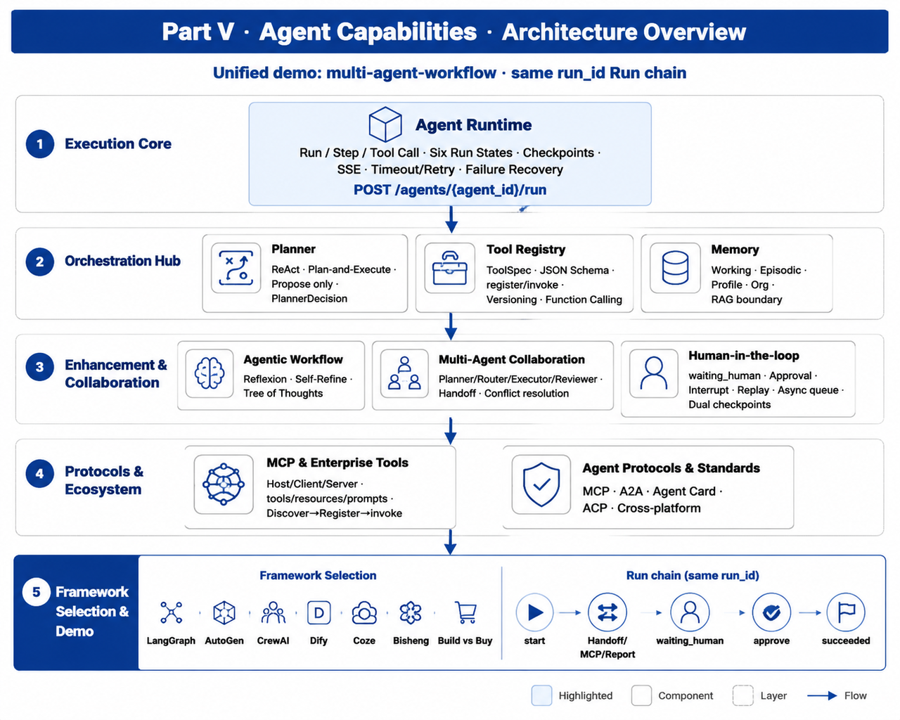

# Part V Agent Capability Encyclopedia

## Goals of this part

Part V defines the platform capabilities that turn an Agent from a demo into an operable system: Runtime, Registry, MCP, Planner, Workflow, Memory, multi-Agent collaboration, protocols, HITL, and framework selection. The chapters share a common run-chain perspective so that execution, approval, replay, and audit stay connected.

**Unified Practical Project**: `mini-platform/projects/multi-agent-workflow/` - Chapters 22 to 30 share **the same `run_id`** run chain (`start` -> Handoff / MCP / Report -> `waiting_human` -> `approve` -> `succeeded`). For capabilities such as Registry and MCP in each chapter, see the unit tests `tests/test_registry.py` and `tests/test_mcp_db.py`.

## Chapters in This Part

- [Chapter 22 Agent Runtime](ch22-agent-runtime.md) - Six run states, task execution, checkpoints, failure recovery, timeout retry
- [Chapter 23 Tool Registry & Function Calling](ch23-tool-registry-function-calling.md) - Capability registration, schema, version governance, invocation contracts
- [Chapter 24 MCP and Enterprise Tool Ecosystem](ch24-mcp.md) - Host-client-server architecture, tools/resources/prompts, enterprise integration
- [Chapter 25 Planner and Orchestration Patterns](ch25-planner.md) - ReAct, Plan-and-Execute, state machines, workflow trade-offs
- [Chapter 26 Agentic Workflow](ch26-agentic-workflow.md) - Reflexion, Self-Refine, Tree of Thoughts, critique of AutoGPT paradigm
- [Chapter 27 Memory Systems](ch27-memory.md) - Short-term/long-term/user profile/enterprise context; mem0, Letta comparisons
- [Chapter 28 Multi-Agent Collaboration](ch28-agent.md) - Planner/Router/Executor/Reviewer roles; communication protocols; conflict arbitration
- [Chapter 29 Agent Protocols and Standards](ch29-agent.md) - MCP, A2A, Agent Card, ACP; cross-platform collaboration
- [Chapter 30 Human-in-the-loop and Long-running Tasks](ch30-human-in-the-loop.md) - Approval, interruption, replay, asynchronous queue, checkpoints
- [Chapter 31 Cross-framework Comparisons](ch31.md) - LangGraph, AutoGen, CrewAI, Dify, Coze, Bisheng; self-developed vs off-the-shelf solutions

## Reading path

Read Chapter 22 first because Runtime state is the execution base for later chapters. Chapters 23 to 30 can then be read as platform capabilities around tools, protocols, planning, workflow, memory, collaboration, and approval. Chapter 31 should be read after the core platform concepts are clear, otherwise framework comparison can easily become a feature-list exercise.
