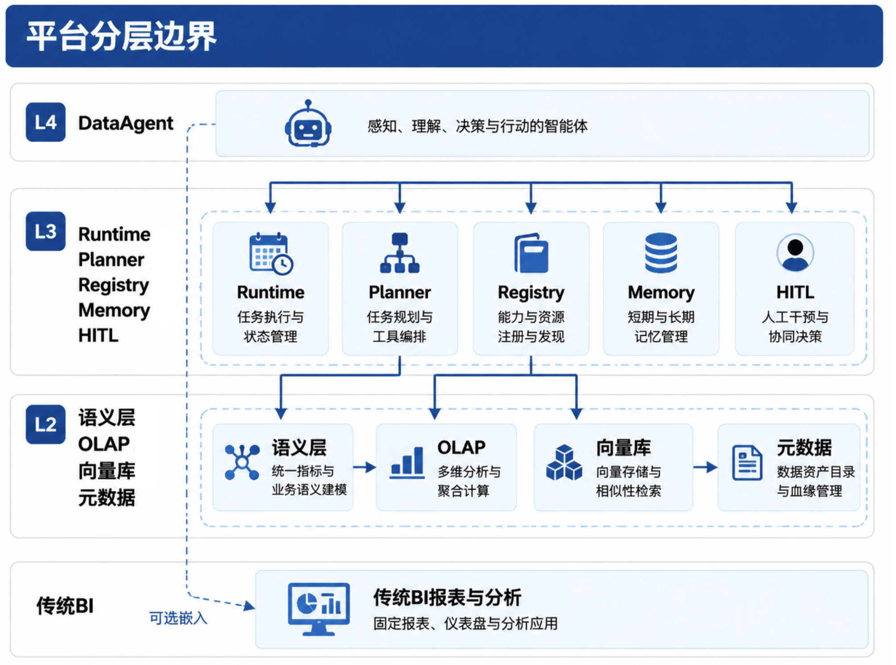

# 第32章 DataAgent 产品形态

---

## 场景引入

Part V 建立了 Agent 平台的运行底座：Runtime 负责 Run 六态和检查点，Registry 负责工具注册和调用审计，Planner 决定下一步工具，Memory 保存多轮上下文，HITL 让高风险任务暂停等待人工确认。进入 Part VI 后，问题变成：这些能力如何组合成一个面向业务人员的数据产品。

本书把这类产品称为 DataAgent。它运行在 Agent 平台之上，面向经营、财务、供应链、市场等业务场景，帮助用户用自然语言发起问数、分析和报告任务。Gateway、语义层或 SQL 插件只覆盖其中一段；DataAgent 把自然语言问题、语义层、SQL 执行、Python 分析、图表、报告和审批串起来，形成面向业务的数据 Agent。

一个常见问题足以暴露边界：“上周华东区销售相对前周明显下滑，主要 SKU 是哪些？和品类结构有没有关系？”如果只做 NL2SQL，系统可能生成一条查询 Top SKU 的 SQL。但合格的 DataAgent 还要先判断“销售”指运营 GMV 还是财务 GMV，确认“华东区”对应哪个组织层级，决定是否需要先查 SKU 再用 Python 做品类贡献度分析，并在回答中说明数据时间、指标版本和证据来源。用户继续追问“那华北呢”时，系统还要复用上一轮的时间、指标和对比方式，只替换区域。

一家零售企业的经营会曾经暴露过这个问题。运营负责人在会前问系统：“上周华东销售掉得最厉害的 SKU 是哪些，顺便看一下是不是品类结构的问题。”试点系统很快给出一张 Top SKU 表，SQL 也能执行，看起来像一次成功问数。会议上，品类经理指出其中两个 SKU 已经进入清仓策略，和正常销售放在一起比较会误导判断；财务 Controller 发现系统使用的是不含退货的销售额，而周会一直使用运营 GMV；区域负责人又补充说，华东本周组织口径已经调整，两个门店被划到了华中。一个看似正确的 SQL，最后变成了一次口径争议。

这个例子说明 DataAgent 的难点不止写 SQL。SQL 只是中间动作，真正要完成的是一段数据任务：理解用户想做查询还是诊断，确认指标和组织口径，决定是否需要多步分析，执行后保留证据，并把结果组织成业务能采纳的解释。DataAgent 如果只返回数字，就无法回答“为什么这个数字可信”；如果只返回解释，又无法让用户追溯到查询、指标版本和数据时间。

DataAgent 面向完整数据任务链。它需要把 Question Frame、语义层、NL2SQL、Python 分析、图表、报告、审批和 Trace 放在同一次 Run 中处理。自然语言入口只是用户看到的第一层，底层真正重要的是任务状态、工具调用、证据引用和失败降级。用户问“那华北呢”时，系统要继承上一轮的指标、时间、对比方式和分析路径，只替换区域并重新执行。

Part VI 会沿着这条链路展开。本章先界定 DataAgent 的产品形态，说明它与 NL2SQL、ChatBI 和 BI Copilot 的差别；第33章讨论语义层如何把业务词绑定到可信口径；第34章讨论 NL2SQL 如何进入受控执行；第35章把复杂分析交给 Python 或专用分析工具；第36章再讨论图表、报告和证据叙事。读者可以把这几章看成一次经营分析 Run 的不同阶段，这些阶段共同组成同一条数据任务链。

DataAgent 与普通聊天机器人的差异就在这里。DataAgent 的输出是一条可回放的数据任务链；停留在“看起来合理的解释”，很快会在口径争议和审计复盘中失效。每个关键结论应能指回 SQL 结果、语义层指标、Python artifact 或报告证据。第33章至第36章会沿这条链路展开：语义层、NL2SQL、Text-to-Python、可视化与报告。

## 32.1 DataAgent 覆盖完整数据任务链路

NL2SQL 是 DataAgent 的核心能力之一。没有把自然语言问题转成可执行查询的能力，DataAgent 很难完成自助问数。但企业问数最常见的失败，往往是业务口径错、权限边界错、上下文丢失或结论没有证据，SQL 语法只是其中一类问题。

公开 Text-to-SQL 评测通常给出问题和数据库 schema，评价模型生成 SQL 的正确性。Spider、BIRD、Spider 2.0 等基准推动了 NL2SQL 能力进步，但企业场景还多了语义层、权限、口径版本、多轮澄清和证据展示。一个模型在基准上表现好，只说明它更会写 SQL；要证明它能在企业数据体系中稳定回答业务问题，还要看这些运行约束。

*表32-1：只做 NL2SQL 与生产级 DataAgent 的差异。来源：本书整理。*

| 环节 | 只做 NL2SQL | 生产级 DataAgent |
|---|---|---|
| 问题理解 | 模型直接猜字段和指标 | 先形成 Question Frame |
| 口径绑定 | 依赖 Prompt 中的说明 | 绑定语义层 Metric 和版本 |
| 执行 | 生成 SQL 后直接运行 | 经 Registry、Policy 和只读执行器 |
| 多轮追问 | 每轮重新理解 | Working Memory 复用已确认上下文 |
| 复杂分析 | 尽量塞进一条 SQL | SQL 取数后交给 Python 沙箱 |
| 交付 | 返回数字或表格 | 生成带 EvidenceRef 的图表和报告 |

DataAgent 由三层能力叠加而成。第一层是问数链路：理解问题、生成查询、执行并解释。第二层是分析链路：在查询结果上做统计、分解、对比和归因。第三层是交付链路：把结果整理成图表、报告、审批记录和可回放 artifact。NL2SQL 只覆盖第一层中的一段。

DataAgent 要沿用数据平台的口径和权限体系。指标定义、数据新鲜度、血缘、权限和脱敏仍然来自数据平台与语义层；Agent 平台负责运行时、工具调用、审计和恢复；DataAgent 应用负责问题理解、任务分型、报告模板和领域策略。三者分清，系统才有产品体验，也具备进入生产的条件。

这条边界还决定了产品失败时的处理方式。NL2SQL 写错 SQL，可以让 Planner 修正或重新生成；语义层找不到指标，应澄清或拒答；权限不允许访问明细，应返回聚合结果或提示无权限；数据新鲜度不足，应在回答中标注或暂停报告生成。把这些问题交给“模型再想一想”，只会把流程缺口包装成一段流畅解释。

DataAgent 第一版不必追求“什么都能答”。更合理的目标，是在一个清晰主题域内，把指标口径、查询执行、证据展示和多轮追问做稳。用户宁可看到“这个指标需要确认口径”，也不要看到一个没有证据但表达流畅的数字。

---

## 32.2 ChatBI、BI Copilot 与 DataAgent

业界常把“对话查数”都叫 ChatBI，但不同产品形态的工程边界差别很大。ChatBI 通常围绕自然语言查数，重点是把用户问题转成报表或查询结果。BI Copilot 嵌入在既有 BI 产品里，帮助用户改筛选、改图表、解释当前仪表盘。DataAgent 则运行在通用 Agent 平台上，可以跨数据源、跨工具、跨审批流程完成数据任务。

*表32-2：三类产品形态的边界。来源：本书整理。*

| 形态 | 典型交互 | 数据范围 | 平台关系 | 适合场景 |
|---|---|---|---|---|
| ChatBI | 对话窗口查数 | 单库或单主题 | 常是独立工具 | 轻量自助查询 |
| BI Copilot | BI 内改图、解释报表 | 当前报表或数据集 | 依附 BI 产品 | 已有 BI 用户提效 |
| DataAgent | 数据任务型 Agent | 语义层、多源、权限上下文 | 共享 Runtime、Registry、Trace | 问数、分析、报告和审批 |

BI Copilot 的优势是贴近已有报表。用户不必离开仪表盘，就能问“这个图为什么下滑”或“换成按品类展示”。它的上下文通常受当前报表或数据集限制，跨主题口径治理、长任务编排和多 Agent 审批往往要交给更上层的数据任务入口。

DataAgent 更像一个数据任务入口。它可以从自然语言开始，调用语义层和 SQL 工具，必要时使用 Python 沙箱，最终生成报告并进入审批。正式指标看板仍由 BI 承载，数据建模仍由数据平台维护；DataAgent 负责探索性问数、临时分析和报告初稿。当分析结果稳定后，再沉淀回 BI 数据集或报表。

这种边界对产品路线很重要。如果企业只有一个单主题数据集，先做 ChatBI 或 BI Copilot 可能更快。如果目标是跨业务域的经营分析，且需要审计、审批和多轮任务，DataAgent 才是更合适的形态。

采购或自研评估时，可以用三个问题快速判断产品真实边界：回答中的指标能否指回语义层版本，执行过程能否回放到 SQL、参数和权限上下文，多轮追问是否复用结构化 Frame，而非只把聊天历史塞回模型。答不上这三个问题的系统，更接近对话式 BI 插件，还没有达到平台化 DataAgent。

---

## 32.3 四种产品形态

本书把 DataAgent 产品形态分成四档：问数、分析、报告和任务工作台。它们更像一条产品成熟度路径，而非四个互斥 SKU。多数企业应先把问数做可信，再叠加分析和报告，最后把高频流程沉淀成任务工作台。

*表32-3：DataAgent 四种产品形态。来源：本书整理。*

| 形态 | 用户诉求 | 典型输出 | 核心依赖 |
|---|---|---|---|
| 问数 | “上周华东 GMV 多少？” | 表格、数字、简短解释 | 语义层、NL2SQL、只读 SQL |
| 分析 | “下滑主要来自哪些品类？” | 分解、贡献度、统计摘要 | SQL 取数、Python 沙箱 |
| 报告 | “给经营会一份复盘” | 图表、洞察、报告草稿 | EvidenceRef、图表渲染、模板 |
| 任务工作台 | “每月自动生成并送审” | 可回放 Run 链和审批记录 | Runtime、HITL、多 Agent Handoff |

问数形态最容易验证底座。它要求语义层能把业务词绑定到指标，NL2SQL 能生成正确查询，执行器能安全返回结果，回答能说明口径和数据时间。没有这一步，直接做报告容易把错误数字包装得更漂亮。

分析形态引入 Python 或专用分析服务。结构贡献、异常检测、简单预测、价格和销量拆解等问题，通常需要 SQL 与分析代码配合。DataAgent 应先用 SQL 取得受控数据，再把中间结果传给沙箱分析，不要让模型在 Prompt 中口算。

报告形态要求证据引用。报告中的每个数字、趋势和结论，都应能指回查询结果、图表数据或分析 artifact。否则报告语言越流畅，风险越大。第36章会把 EvidenceRef、图表和叙事组织作为重点。

任务工作台是成熟形态。它把 DataAgent 从一次问答变成可运营流程，例如每周经营简报、月度复盘、异常归因和送审。此时 Run 检查点、审批、定时任务、多 Agent 协作和 Trace 回放都成为产品的一部分。

四种形态的推进节奏应服从数据底座成熟度。如果语义层只覆盖少量核心指标，先做问数更合适；如果查询结果稳定但业务经常需要二次加工，可以增加 Python 分析；如果报告模板和证据引用已经稳定，再进入报告形态；当报告流程反复发生，才值得做定时、审批和任务工作台。反过来，如果语义层还不稳定就直接做自动月报，系统会把口径问题放大成组织问题。

---

## 32.4 Question Frame 与任务规划

DataAgent 在生成 SQL 前，应先把用户问题转成 Question Frame。这个 Frame 不面向用户展示，主要作为 Planner、语义层、Memory 和执行工具之间的契约。一个典型 Frame 包含指标、维度、时间、主体、任务类型、粒度和路径。

```yaml
intent: diagnose
metrics: [gmv]
dimensions:
  region: EAST
time:
  primary: last_week
  compare_to: prior_week
grain: sku
task_type: diagnose
path: sql_then_python
semantic_view: sales_ops
```

上面这段 Frame 仍然不是最终 SQL。`metrics: [gmv]` 只是用户口语层面的 token，第33章的语义层 Linker 还要把它绑定到具体 `metric_id@version`。`path: sql_then_python` 表示先查数，再做品类贡献度或结构分析。这个结构化中间层能让系统在多轮追问中继承上下文，也能让检查点恢复后继续执行。

*表32-4：任务类型与首选路径。来源：本书整理。*

| 任务类型 | 用户问法 | 首选路径 |
|---|---|---|
| 查询 | “上周华东 GMV” | 语义层 + NL2SQL |
| 对比 | “华东和华北同比” | SQL 聚合或多列查询 |
| 诊断 | “哪些 SKU 导致下滑” | SQL 取数 + Python 分解 |
| 归因 | “价格还是销量导致” | Python 贡献度分析 |
| 报告 | “写一份经营复盘” | 分析结果 + 图表 + 模板 |

Question Frame 还决定是否需要追问。缺少时间、指标或主体时，系统如果继续执行，后续 SQL 很容易建立在错误假设上。如果语义层中同时存在运营 GMV 和财务 GMV，且用户没有明确上下文，DataAgent 可以根据角色默认选择，但必须在回答中写出指标 title 和版本；如果默认策略不足以支撑结论，就应进入澄清。


*图32-1：Planner 路径选择。来源：本书自绘。Alt text：决策树从问题类型分支，分别选择 NL2SQL、多步分析、Text-to-Python 等路径。*

Frame 必须进入 Working Memory 和检查点。用户追问“那华北呢”时，系统应继承指标、时间和对比基线，只替换区域；Pod 重启后，Runtime 也应恢复到相同的 Frame。否则 DataAgent 会退化成每轮独立聊天，前后数字和口径很容易漂移。

Frame 还可以降低前端复杂度。前端不需要理解所有指标和表结构，只需要把用户输入、澄清回答和展示偏好传给 DataAgent。DataAgent 在后台维护 Frame，决定是否继续追问、查数、分析或生成报告。这样产品体验可以保持自然语言入口，工程实现却有结构化契约支撑。

对运营类用户来说，Frame 最好留在后台，不要变成一张让人填写的表单。系统可以在必要时提出一个简短澄清问题，例如“这里的销售额使用运营 GMV 还是财务 GMV？”一旦用户确认，后续同类问题就可以根据 Profile 或组织默认策略减少重复澄清。人机交互要克制：该问时问，不该问时用可解释默认值。

---

## 32.5 经营分析复合场景

Part VI 使用一个匿名化经营分析场景贯穿各章。运营负责人在周会前需要解释华东区域销售下滑，财务 Controller 需要确认指标口径，品类经理需要查看结构变化。DataAgent 负责把这个问题拆成可执行链路。

*表32-5：华东下滑场景与 Part VI 章节映射。来源：本书整理。*

| 步骤 | 章节 | 关键动作 | 产物 |
|---|---|---|---|
| 问题建模 | 第32章 | 生成 Question Frame | `task_type=diagnose` |
| 口径绑定 | 第33章 | Schema Linking 与消歧 | `gmv_ops@2025Q1` |
| 查询执行 | 第34章 | 编译并执行只读 SQL | Top SKU 结果 |
| 分析计算 | 第35章 | Python 品类贡献度 | `category_contrib.json` |
| 报告生成 | 第36章 | 图表和洞察组织 | EvidenceRef 报告 |
| 人工确认 | 第30章 | Controller 审批 | `waiting_human` 到 `approve` |

一次成功问数的 SSE 事件可以保持与第22章一致。前端可能先收到 `state=running`，再收到 `action=sql_executor`，随后是 `result` 和最终 `state=succeeded`。DataAgent 可以在这些平台事件之上展示业务回答，状态名仍沿用 Runtime，便于后续 Trace 和前端组件复用。

用户可见回答也要带证据信息。例如“华东运营 GMV 较前周下降 12.3%，主要来自三个 SKU。指标为运营 GMV `gmv_ops@2025Q1`，数据截至 2025-06-14 06:00。”这句话不需要暴露所有 SQL，但要让用户知道用了哪个口径、数据是否新鲜、结论来自哪次查询。

这个场景也展示了 DataAgent 的失败路径。如果语义层中没有“运营 GMV”，系统应停在澄清或拒答；如果 SQL 执行超时，应返回任务失败并保留 Trace；如果 Python 分析发现样本量不足，应降低结论强度；如果报告要发给外部对象，应进入 HITL。失败路径写清楚，产品才不会在异常时退化成“模型编一个解释”。

---

## 32.6 与数据平台、BI、Agent 平台的边界

DataAgent 位于业务应用层，向下复用数据平台和 Agent 平台能力。边界清晰，系统才不会在早期演示成功后变成技术债。



*图32-2：DataAgent 与平台分层边界。来源：本书自绘。Alt text：分层图区分 DataAgent 专属能力与平台共享能力，箭头表示 DataAgent 复用平台能力而非自建。*

Agent 平台提供 Runtime、Registry、Trace、HITL 和 Policy。DataAgent 沿用这套 Run 状态和工具调用链，SQL 执行器、Python 沙箱、图表渲染器都作为 Registry 工具被调用。这样其它 Agent 也能复用，审计也能统一。

数据平台提供湖仓、OLAP、元数据、质量、新鲜度和语义层。DataAgent 可以消费这些能力；长期直连 ODS 物理表会让口径、权限、血缘和质量成本集中爆发。早期演示看似更快，生产阶段往往更难收拾。

BI 仍然有价值。固定看板、正式财务报表和高频指标监控，适合继续由 BI 承载。DataAgent 更适合探索性问题、临时分析、报告初稿和多轮任务。二者共享语义层，避免同一个指标在 BI 和 DataAgent 中有两套定义。

DataAgent 项目需要三类团队同时在场。数据平台团队提供指标和质量元数据，Agent 平台团队提供运行时和工具治理，业务团队提供术语、默认口径和报告模板。缺少任何一方，产品都会在某个环节失真：模型能写 SQL 但口径不准，或者口径准确但用户体验像内部工具。

---

## 32.7 产品成功标准

DataAgent 的成功要看 SQL exact match，也要看任务是否可信、可用和可治理。可信指口径正确、证据可追溯、权限不越界；可用指业务人员愿意反复使用，延迟和交互成本可接受；可治理指任意回答都能回放 Run、SQL、指标版本、审批链和 artifact。

第一阶段可以选择准确优先。缺槽位时追问，语义层不可用时拒答，高风险报告进入人工确认。这样会牺牲一些首问解决率，但能建立信任。概念验证阶段可以适当扩大覆盖；进入生产后，系统要标注哪些结果未经过语义层或人工确认，把试点策略留在试点环境里。

上线后应按角色看指标。业务用户看首问解决率、多轮完成率和回答可读性；数据负责人看语义层覆盖率、指标版本和血缘可见性；平台负责人看单 Run 成本、工具复用和错误恢复；合规和内审看权限违规、审批记录和 Trace 完整性。只有这些指标一起改善，DataAgent 才算进入可运营阶段。

成功标准还要分阶段。问数阶段先看口径一致性、SQL 成功率和拒答质量；分析阶段增加 artifact 可复现和 Python 沙箱安全；报告阶段增加证据引用率和人工退回率；任务工作台阶段增加定时任务成功率、审批时长和异常恢复。把所有指标一次性压到第一版，会让团队失去重点。

还要警惕一个产品陷阱：把“用户喜欢自然语言入口”理解成“用户不关心证据”。业务人员可以接受系统用自然语言交互，但在关键数字上仍然需要口径、数据时间和可追溯来源。DataAgent 的信任来自证据，不来自回答语气。

## 32.8 DataAgent 的能力发布路径

DataAgent 的发布不适合按“大而全助手”推进。更稳妥的方式，是按能力层逐步放开，并为每一层设置明确的准入和回退。第一层是只读问数，只允许访问语义层覆盖的核心指标和稳定数据集；第二层是受控分析，在查询结果上调用 Python 沙箱或专用分析工具；第三层是报告生成，要求每个结论都有 EvidenceRef；第四层才是任务工作台，把定时、审批、复盘和多 Agent 协作纳入产品流程。

每一层的发布标准不同。只读问数关注指标绑定、SQL 正确率、权限拒绝和拒答质量；受控分析关注样本量、分析代码、数值校验和产物审计；报告生成关注证据引用、表达强度、人工退回和版本管理；任务工作台关注 Run 恢复、HITL 时长、失败补偿和运营指标。把这些标准混在一起，会让团队不知道第一版到底要证明什么。

发布路径还要保留回退。某个场景进入报告形态后，如果证据引用率下降或人工退回率升高，可以退回分析形态；某个分析任务如果 Python 产物无法复现，可以退回只读问数；某个问数主题如果语义层覆盖不足，可以只开放给内部测试。产品形态会随着可信度调整自动化程度，而不是一路向上升级。

## 32.9 典型失败模式与产品降级

DataAgent 的失败模式通常跨越多个层次。用户问题缺少口径、语义层没有覆盖指标、NL2SQL 生成了可执行但错误的查询、Python 分析样本量不足、报告结论强于证据、审批人无法判断风险，都可能让一次数据任务失败。产品设计要把这些失败转成用户可理解的状态；统一返回“系统错误”，只会让用户重新回到人工问数。

缺少口径时，系统应发起澄清，并把澄清结果写入 Question Frame；语义层无覆盖时，系统可以提示当前不支持该指标，并建议可用口径；SQL 失败时，系统应区分权限拒绝、资源超限、字段不存在和数据为空；Python 分析失败时，可以退回查询结果和可解释摘要；报告证据不足时，可以生成带限制说明的草稿，避免把薄弱证据写成确定结论。

降级的目的，是在证据不足时保留可信范围。一个只返回受控查询结果的 DataAgent，比一个自动生成完整但无法追溯报告的系统更适合进入生产。第33章到第36章分别处理语义层、查询、分析和报告，本章先把降级原则讲清楚：后续章节会把这些技术模块串成一条可恢复的数据任务链。

## 32.10 与组织流程的结合方式

DataAgent 面向业务人员，也要嵌入组织流程。经营分析、财务复盘、供应链异常和市场投放评估，往往都有既定的指标口径、审阅责任和发布路径。DataAgent 进入这些流程时，要先明确谁可以提问、谁可以查看明细、谁负责确认口径、谁可以发布报告、谁处理争议。没有这些角色分工，自然语言入口会放大原有的数据治理问题。

组织流程还决定默认策略。同一个“销售额”问题，在运营周会、财务关账和销售日报里可能使用不同口径；同一个区域经理，在自己负责区域可以查看明细，在其他区域只能看汇总。DataAgent 要读取用户角色、业务域、默认指标和权限策略，再把这些信息交给模型和执行层。模型负责把问题转成任务，平台负责决定任务能否执行。

第一版产品可以选择一个组织流程做深。例如围绕周经营会，固定支持会前问数、异常归因、报告草稿、Controller 复核和会后问题沉淀。这个范围比“所有人都能随便问数据”更窄，但更容易形成可复用链路：Question Frame、语义层、SQL、Python、报告、HITL 和 Trace 都能在一个真实流程中被验证。

把组织流程做深，可以避开“万能问数框”的陷阱。万能入口在演示时很吸引人，生产时却会把数据仓库里所有未治理的问题暴露给业务用户。围绕周经营会做产品，系统就知道哪些指标是核心指标，哪些维度可以下钻，哪些结论需要 Controller 复核，哪些报告只能作为会前材料草稿。范围变窄之后，产品反而更容易做出稳定体验。

组织流程也决定答案的交付形式。经营会需要的是可以放进会议材料的图表和行动项，财务复盘需要的是可审计的口径说明和审批记录，供应链异常需要的是责任人、缺货原因和后续跟进。DataAgent 要根据流程把结果送到合适的位置：报告草稿、任务看板、审批流、会议材料或 BI 收藏视图。所有结果都压成聊天气泡，业务用户很难把它纳入日常工作。

流程结合还会影响系统默认值。经营周会默认看上周和前周，财务关账默认看会计期间，供应链异常默认看仓库和履约节点。用户在这些流程中提问时，DataAgent 可以少问一些澄清问题，但必须把默认值写入 Question Frame 和回答脚注。默认值来自组织流程给出的上下文，不能被当成模型猜出来的偏好。这个差别决定了系统能否在多人协作场景中解释自己的选择。

当 DataAgent 进入固定流程后，它也要支持任务交接。运营负责人提出问题，数据分析师补充口径，财务 Controller 确认指标，区域经理补充原因，最后材料进入会议。一次 Run 可能跨越多个角色，只保存最初提问者和最终答案，会丢掉最关键的责任信息。谁确认了哪个口径、谁退回了哪段解释、谁批准了报告发布，都应成为任务记录的一部分。否则 DataAgent 只能做个人助手，无法成为组织流程中的工作系统。

## 32.11 第一版 MVP 的范围控制

DataAgent 第一版最容易失败在范围过宽。自然语言入口会让业务方期待它回答所有数据问题，平台工程如果照这个期待铺开，很快会被口径、权限和性能问题拖住。MVP 应选择一个业务域、少量核心指标、一组稳定维度和一条明确任务链路。比如只覆盖经营周会中的销售、订单、库存和品类结构，而不同时覆盖财务关账、客服质检和供应链调度。

范围控制要写进产品边界。支持的指标、默认时间粒度、可访问角色、数据新鲜度、可生成报告类型和必须人工复核的动作，都应在上线前明确。用户问到范围外问题时，系统可以解释当前不支持，并提示可用路径。让模型自由发挥，短期看似覆盖更广，长期会破坏用户对数字的信任。拒答质量是 DataAgent MVP 的一部分，它也能帮助团队识别下一轮扩展需求。

MVP 还要控制自动化程度。第一版可以先让报告进入人工复核，暂缓自动发布；可以先让 Python 分析输出候选结论，暂不直接写入决策建议；可以先把多 Agent 协作限制在后台角色，少暴露复杂的协作界面。自动化程度应随证据链和运营指标逐步提高。

第一版还要明确“答不出来”时的用户体验。一个好的 MVP 会稳定告诉用户当前支持哪些指标、哪些时间范围、哪些角色权限和哪些报告模板。用户问到范围外问题时，系统给出可用替代路径，例如“当前只支持经营 GMV 和订单量，不支持财务收入”，或者“当前能查看区域汇总，门店明细需要申请权限”。这种拒答看起来保守，却能保护用户对系统的信任。

MVP 的成功不能只交给首问解决率判断。如果为了提高首问解决率而减少澄清、弱化权限提示、隐藏数据新鲜度，系统很快会在正式会议里失去信用。更合理的指标组合，是看核心问题的完成率、关键口径的正确率、人工退回原因、报告证据完整度和用户复用率。首问没有直接回答，但通过一次澄清得到可审计结果，仍然应该被视为高质量完成。

## 32.12 DataAgent 的验收样本

DataAgent 的验收样本应来自真实业务问题。只从数据库 schema 反推题目，容易得到一批语法干净但脱离业务场景的样本。样本需要覆盖简单问数、多轮追问、指标消歧、权限拒绝、数据为空、查询超时、Python 分析、报告生成和人工复核。每个样本都要有期望行为：应该回答、应该澄清、应该拒答、应该降级，还是应该转人工。

验收时要看最终文本，也要看中间过程。团队要检查 Question Frame 是否正确，语义层绑定是否正确，SQL 是否只读且受权限约束，Python 产物是否可复现，报告结论是否有 EvidenceRef，Trace 是否能回放关键步骤。一个回答语言顺畅但 Frame 错误的样本，应判为失败；一个回答较短但证据完整、边界清楚的样本，反而更适合进入生产。

这些样本会成为后续第33章至第38章的共同基准。语义层改动要跑它们，NL2SQL 发布要跑它们，Python 沙箱策略调整要跑它们，报告模板更新也要跑它们。DataAgent 的产品质量来自这些样本在全链路中持续通过，单个模块的指标只能说明局部状态。

验收样本还要覆盖组织角色。运营负责人、区域经理、财务 Controller 和数据平台工程师看到同一个问题时，能访问的数据层级、默认口径和可执行动作可能不同。样本如果只用一个管理员账号测试，就会错过权限裁剪、默认策略和回答措辞的差异。生产级 DataAgent 的验收，应该至少包含业务角色、管理角色和受限角色三类用户。

样本维护本身也要进入运营节奏。每次线上争议、人工退回或用户修改，都可以沉淀成新的验收样本。这样样本集会逐渐贴近真实业务语言，逐步摆脱工程师编写的标准问句。DataAgent 的长期改进靠持续回归，把真实失败转化为可测试的任务样本。

这些样本还应保留业务上下文。单独保存一句“上周销售为什么下降”没有太大价值，因为它缺少角色、数据域、默认口径和交付物要求。更有用的样本会记录提问者角色、会议场景、指标版本、可访问 View、期望澄清和最终交付形式。这样回归时才能发现系统是否真的理解了业务任务，还是只生成了一段相似回答。

验收结果也要分层记录。一个样本可能在语义层绑定上通过，在 SQL 执行上通过，却在报告解释上失败；也可能 SQL 失败，但拒答和降级路径是正确的。把这些状态拆开，团队才能知道下一步该修语义层、NL2SQL、报告模板还是前端交互。DataAgent 的样本库要服务工程排障；如果只产出一个总体分数，团队很难定位责任层。

样本还要定期清理。已经不再使用的指标、废弃的组织口径、下线的报告模板，都应从默认回归集中移出或标注为历史样本。否则评测会拖住产品演进，也会让团队为了兼容旧行为而保留错误默认值。真正有价值的样本库，应该同时支持历史复现和当前发布判断。

---

## 本章小结

DataAgent 覆盖的范围大于 NL2SQL。NL2SQL 解决的是自然语言到查询语句的转换，生产级 DataAgent 还要处理语义层、只读执行、Memory、分析、报告、审批和审计。ChatBI 与 BI Copilot 更偏向问数入口和报表辅助，DataAgent 则面向跨系统、长任务和可回放的数据工作流。

从建设顺序看，问数、分析、报告和任务工作台应当逐层推进。语义层还不稳定时，直接生成完整报告只会把口径冲突、权限缺口和执行风险放大。Question Frame 因此要成为中间契约，写入 Memory 和检查点，让后续 SQL、Python、图表和报告都能追溯到同一个问题定义。

DataAgent 应复用数据平台与 Agent 平台已有能力，包括语义层、Registry、Runtime、Policy、Trace 和 HITL。自建孤立 SQL 插件短期看更快，长期会让权限、审计、评测和版本管理分散在多个实现里，难以进入企业级运行。


## 参考文献

Liu, X., Shen, S., Li, B., Ma, P., Jiang, R., Zhang, Y., Fan, J., Li, G., Tang, N., & Luo, Y. (2025). A survey of Text-to-SQL in the era of LLMs: Where are we, and where are we going? *IEEE Transactions on Knowledge and Data Engineering*, 37(10), 5735-5754. [https://doi.org/10.1109/TKDE.2025.3592032](https://doi.org/10.1109/TKDE.2025.3592032)

Tang, Z., Wang, W., Zhou, Z., Jiao, Y., Xu, B., Niu, B., Zhou, X., Li, G., He, Y., Zhou, W., et al. (2025). LLM/Agent-as-Data-Analyst: A survey. arXiv:2509.23988. [https://arxiv.org/abs/2509.23988](https://arxiv.org/abs/2509.23988)

Lei, F., Chen, J., Ye, Y., Cao, R., Shin, D., Su, H., Suo, Z., Gao, H., Hu, W., Yin, P., Zhong, V., Xiong, C., Sun, R., Liu, Q., Wang, S., & Yu, T. (2024). Spider 2.0: Evaluating language models on real-world enterprise text-to-SQL workflows. *ICLR 2025*. arXiv:2411.07763. [https://arxiv.org/abs/2411.07763](https://arxiv.org/abs/2411.07763)

Huo, N., Xu, X., Li, J., Jacobsson, P., Lin, S., Qin, B., Hui, B., Li, X., Qu, G., Si, S., Han, L., Alexander, E., Zhu, X., Qin, R., Yu, R., Jin, Y., Zhou, F., Zhong, W., Chen, Y., Liu, H., Ma, C., Ozcan, F., Papakonstantinou, Y., & Cheng, R. (2026). BIRD-INTERACT: Re-imagining Text-to-SQL evaluation via lens of dynamic interactions. *ICLR 2026*. arXiv:2510.05318. [https://arxiv.org/abs/2510.05318](https://arxiv.org/abs/2510.05318)

Cube. (2025). *Introduction: Cube semantic layer*. Cube Documentation. [https://cube.dev/docs/product/introduction](https://cube.dev/docs/product/introduction)

Microsoft. (2024). *Copilot in Power BI*. Microsoft Learn. [https://learn.microsoft.com/en-us/power-bi/create-reports/copilot-introduction](https://learn.microsoft.com/en-us/power-bi/create-reports/copilot-introduction)
