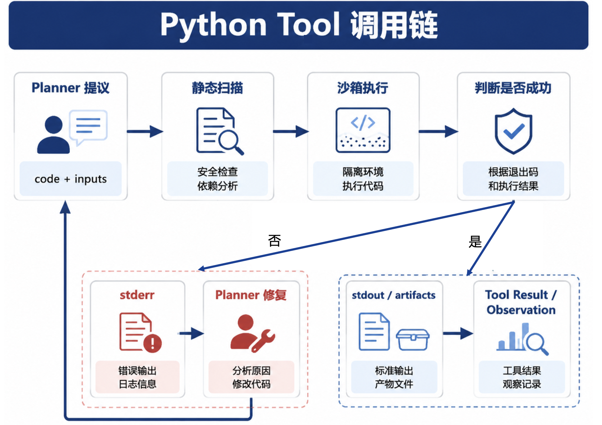

# 第35章 Text-to-Pandas / Text-to-Python

---

第34章解决的是结构化取数。华东下滑案例中，`sql_executor` 已经拿到 Top SKU、上周 GMV、前周 GMV 和差额。业务用户继续问：“和品类结构有没有关系？”这个问题不再只是取数。系统需要把 SKU 粒度结果按品类汇总，计算差额贡献，判断 Top 品类是否集中，并为第36章图表准备数据。这类分析可以硬写 SQL，但 SQL 往往会变得很长，且中间步骤不易解释。Python 更适合表达 DataFrame 变换、贡献度、统计检验、简单建模和临时文件探查。Text-to-Python 负责把这类分析意图转成可执行代码，并交给安全沙箱运行。沙箱边界必须先讲清楚。Python 不能成为第二套查询引擎，也不能成为绕过语义层的捷径。它只能读取 Registry 注入的 `dataframe_ref`，也就是上游 `sql_executor` 已经裁剪、授权、带有口径版本和 hash 的结果集。若需要重新取数，Planner 应回到 `sql_executor`，不要让 Python 代码直连数据库。

很多团队第一次把 Python 接进 DataAgent，是因为 SQL 已经表达不动业务追问。用户拿到“华东 GMV 下降 12%”后，会继续问“是不是价格造成的”“如果去掉新品影响还剩多少”“下滑集中在少数 SKU 还是长尾一起下滑”。这些问题需要临时列、分组贡献、分位数、相关性、异常值和可视化前处理。让模型继续硬写多层 SQL，结果往往可读性差、调试困难，中间结果也很难展示给业务用户。Python 的优势是把分析步骤显式展开，让一次探索变成可检查的计算过程。

但这个优势也带来新的风险。自然语言生成的 Python 代码一旦运行，就不再是文本建议，而是对数据和运行环境的真实操作。它可能读错列、重复聚合、把金额当字符串、把空值当 0，也可能在异常日志中打印敏感字段。更严重的是，如果沙箱可以访问网络、环境变量或宿主文件，模型生成代码就可能绕过语义层和权限系统。DataAgent 接入 Python 时，真正要设计的是“受控分析能力”，不是“给模型一个 notebook”。

因此，本章把 SQL、Python 和报告层拆成三段责任。SQL 负责权威取数和权限过滤，Python 负责在已授权窄表上做二次分析，报告层负责把结果组织成可读材料。每段之间都要传递引用和 hash：SQL 产出 `dataframe_ref`，Python 产出 `artifact_ref` 和结构化指标，报告只引用这些结果。这样业务用户看到一句“日化品类贡献了主要下滑”时，平台能回到具体 SQL、具体 DataFrame、具体 Python 代码和具体输出文件。这条链路还支持失败恢复。Python 第一次执行失败，系统可以根据错误信息修正列名或类型转换；如果发现 `dataframe_ref` 不包含所需字段，就回到 SQL 阶段补取数；如果内存超限，就改成分块计算、预聚合或离线任务。失败不应该被包装成“模型分析失败”这一句话。平台要让用户和工程师知道，问题发生在取数、沙箱执行、代码生成、产物写入还是报告解释。

---

## 35.1 SQL 与 Python 的边界

SQL 仍然是权威取数层。Metric 聚合、Join、租户过滤、行级权限和默认 filters 应在语义层和 `sql_executor` 中完成。Python 处理的是已经授权、已经裁剪的结果集。这个边界能保证数字口径可追溯，也能避免模型生成代码扫描生产库。

*表35-1：SQL 与 Python 的适用边界。来源：本书整理。*

| 任务 | 首选路径 | 原因 |
|---|---|---|
| 单指标聚合 | SQL | 口径清晰、执行可控 |
| Top SKU 查询 | SQL | 分组、排序、Limit 足够表达 |
| 品类贡献度 | SQL 取数 + Python | 中间计算和解释更清晰 |
| 价格/销量分解 | Python | 多步公式和临时列较多 |
| 临时 CSV 探查 | Python 沙箱 | 数据未入仓，需限大小和权限 |
| 报告图表前处理 | Python + chart renderer | 产出聚合 JSON 或图表 spec |

在华东案例中，Top SKU 列表由 SQL 完成；“品类结构有没有关系”由 Python 完成。Planner 在 Question Frame 中标记 `path: sql_then_python`，上游 SQL 产出一个窄表，包含 `sku_id`、`category`、`gmv_last_week`、`gmv_prior_week`、`gmv_delta` 和 `region_code`。Python 只在这张窄表上做计算。这条边界也能帮助排错。若 Python 结果与 SQL 汇总不一致，团队先查 `dataframe_ref`、`content_hash` 和 `metric_context`；若发现 Python 使用了错误列或重复聚合，就修 Python；若发现上游 SQL 口径错，就回到第33章和第34章。没有这个分层，Notebook、SQL 和报告会互相甩锅。SQL 与 Python 的边界还影响成本。在线 OLAP 适合做过滤、聚合和排序；Python 沙箱适合在较小结果集上做二次计算。若一个任务需要上千万行明细进入 pandas，说明它不应走交互式 DataAgent，而应转成离线任务、预聚合表或专用特征服务。自然语言入口不能改变计算系统的物理限制。Python 也不应替代正式建模流程。一次性贡献度、探索性分布检验、简单回归可以放在沙箱里；长期使用的归因模型、预测模型和风险评分，应沉淀到数据平台或模型服务中。DataAgent 可以把沙箱结果作为原型和证据，但不能把临时代码变成生产模型。对业务用户来说，SQL 与 Python 的差异不必暴露成技术选项。用户只需要继续追问“按品类看”“是不是价格导致”，Planner 决定路径。产品界面可以展示“已基于上一步结果做二次分析”，并在证据区域列出上游 SQL 和 Python artifact。

这个产品表达很重要。用户不需要看到完整 notebook 才能信任结果，但需要知道系统没有重新访问未经授权的数据，也没有凭空计算数字。界面可以展示上游结果集大小、字段列表、Python 步骤摘要、关键输出和运行时间；需要审计时，再展开代码、依赖版本和 artifact hash。这样既保留业务体验，也保留工程证据。Python 沙箱还要区分探索和生产。一次临时分析可以允许模型生成少量 pandas 代码，产出图表前处理和说明；如果同类分析每周都出现，就应沉淀成受管工具或模板。比如价格销量分解、贡献度 waterfall、异常值剔除、留存分群，都可以先在沙箱中验证，再固化成版本化函数。这样模型负责选择和填充参数，平台负责稳定计算和测试，风险会比每次重新生成代码低得多。

这种沉淀路径也能提高可解释性。临时代码通常只对当前问题成立，变量名、异常处理和中间输出都不够稳定；模板化工具可以预先写好单元测试、输入 schema、边界条件和说明文档。用户仍然用自然语言提问，Planner 在背后选择模板或沙箱路径。随着高频任务沉淀，沙箱会从默认执行入口变成探索和长尾分析入口，生产风险也随之下降。沙箱执行结果要面向报告层设计。很多系统只保存 stdout 或最终图片，后续报告只能从文本里抽数字。更稳的做法是让 Python 输出结构化 artifact：指标表、图表数据、统计检验结果、警告列表、代码 hash 和输入 DataFrame hash。报告层只引用这些字段，不重新计算，也不从模型解释里提取数字。这样第36章的图表和报告才能稳定追溯到第35章的计算产物。

异常处理也要进入用户体验。若代码因为列不存在失败，系统可以告诉用户“上一步结果不包含品类字段，需要重新取数”；若因为数据量过大失败，可以提示转为离线分析；若因为权限导致某列被脱敏，可以说明当前角色只能看到聚合结果。把所有失败都包装成“Python 执行失败”，会让业务用户无从修正，也会让工程团队失去定位线索。

---

## 35.2 沙箱安全

模型生成的 Python 代码必须默认不可信。它可能导入网络库、读取宿主文件、安装包、写日志、创建大文件，或在异常处理中泄露敏感字段。生产环境不能靠 Prompt 告诉模型“不要这样做”，而要把限制写进 Tool 和运行环境。沙箱安全的核心是默认隔离。代码看到的是受控目录、受控依赖、受控数据引用和受控环境变量；它没有理由知道数据库连接串、对象存储凭证、内部服务地址和用户完整会话。即使模型生成了危险代码，运行环境也应让它失败在边界内，并把失败原因记录到 Trace。Prompt 规则可以减少错误生成，运行边界负责兜住剩余风险。

依赖管理同样属于沙箱边界。很多 Python 分析看起来只需要 pandas，实际模型可能生成 `requests`、`openpyxl`、`statsmodels`、`seaborn`、`prophet` 等导入。平台不能在执行时临时安装包，也不能让模型通过错误提示一步步试探环境。比较稳的做法是按任务类型定义依赖 profile：基础 DataFrame 变换、统计检验、图表前处理各自有白名单；超出白名单的导入直接失败，并提示是否转人工或转离线分析。

资源限制也要和用户体验相连。内存超限、CPU 超时、输出文件过大、图表点数过多，都不应只作为技术异常返回。平台可以把它们翻译成分析建议：缩小时间范围、先按品类聚合、改用离线任务、减少导出列、使用抽样预览。这样用户理解失败来自计算边界，而非模型“不会分析”。对工程团队来说，这些失败样例也能反过来指导哪些分析模板值得固化。沙箱结果还要有保留策略。临时代码、输入 DataFrame、输出 artifact、错误日志和图表文件都可能含有敏感数据。系统应区分会话内临时产物、报告引用产物和审计保留产物：前者可以短期清理，后者要跟随报告生命周期，审计产物按合规要求留存。把所有中间文件永久保留，会扩大泄露面；全部立即删除，又会让报告无法复核。

Text-to-Python 的质量评估也要分层。第一层看代码是否通过静态审计和沙箱执行，第二层看输出结构是否符合契约，第三层看结论是否被上游数据支持，第四层看业务用户是否采纳。只看代码运行成功，会漏掉重复聚合、列含义误读和统计口径错误；只看最终报告，又很难定位错误来自 SQL、Python 还是文字解释。评估链路要能回到每一段计算。团队还要为 Python 能力设置默认边界。交互式 DataAgent 适合处理几千到几十万行的裁剪结果，超过这个范围就要转预聚合、离线队列或专用服务；涉及预测、优化和长期评分的任务要进入模型治理；涉及个人信息和合同明细的任务要先做脱敏或审批。自然语言问题可以很开放，执行系统的边界需要写得很具体。沙箱应满足几个最低要求：默认关闭网络；只挂载 Run 临时目录；用 cgroup 或等价机制限制 CPU、内存和时间；依赖包走白名单；禁止 `subprocess`、`socket`、数据库连接库和任意文件系统访问；Run 结束销毁临时目录。PII 列应在进入沙箱前脱敏，不能指望 Python 代码自己打码。
```yaml
allowed_imports: [pandas, numpy, scipy, sklearn, matplotlib]
max_memory_mb: 512
max_cpu_seconds: 30
max_python_retries: 2
network: false
```

Docker 是较现实的默认选择，科学计算生态完整，隔离和资源控制成熟。WASM 或 Pyodide 启动更轻，但科学计算包受限，适合边缘或实验场景。远程 Jupyter Kernel 开发体验好，但多租户隔离和审计难度高，不适合作为生产默认执行环境。静态审计是第一道门。代码进入沙箱前，应解析 AST，检查 import、文件访问、网络访问、进程调用、动态执行和危险路径。静态审计不能替代容器隔离，但能拦截大量模型误生成的危险代码。容器隔离则负责处理静态扫描漏掉的行为。依赖管理也要固定。沙箱镜像应预装一组版本明确的包，例如 pandas、numpy、scipy、scikit-learn 和 matplotlib；每次 Run 记录镜像版本和包版本。模型生成 `pip install` 的需求应被拒绝。否则同一段代码在不同时间运行，可能因为包版本变化得到不同结果。

文件系统要按 Run 隔离。输入只读挂载，输出写到 Run artifact 目录，临时文件有配额，Run 结束后按策略清理。图表库常会写配置文件或字体缓存，应把这些路径显式指向 Run 临时目录，避免污染宿主环境。对多租户平台来说，这些细节比代码本身更容易造成事故。沙箱还需要处理资源滥用。模型可能生成死循环、笛卡尔展开、全量 pivot 或高阶模型训练。CPU、内存、时间和输出大小都要有硬限制，超限时返回结构化错误。Planner 可以据此要求用户缩小范围，或改为离线任务，而非继续重试同一段代码。

---

## 35.3 代码生成、执行与自修复

一次 Python Tool 调用可以拆成五步。Planner 准备列摘要、`dataframe_ref` 和分析目标；Gateway 生成 Python 代码；Tool 做静态审计；沙箱执行代码并回收 stdout、stderr 和 artifact；Registry 把结构化 Observation 返回 Planner。



*图35-1：Python Tool 沙箱执行流程。来源：本书自绘。Alt text：流程从生成代码、静态审计、注入只读数据、在受限沙箱执行、回收产物与日志，到超时或越权即终止。*

列名错误、类型转换错误和轻微语法错误可以自修复。例如模型误用了 `gmv_change`，而输入列只有 `gmv_delta`，沙箱返回 `KeyError` 和可用列列表，Planner 可以让 Gateway 修正后重试。重试次数要独立于第34章的 SQL 重试，通常 1 到 2 次即可。越权和危险行为不能自修复。代码试图 import `socket`、调用 `subprocess`、访问数据库连接或读取宿主目录时，应直接失败并写审计。否则模型可能通过重试逐步摸索出可用路径。安全失败与普通代码错误要分开处理。Observation 也要分层。Planner 需要异常栈、可用列、stdout 摘要和 artifact 列表；用户只需要看到“分析失败，原因是缺少字段”这类简短说明；审计需要保存代码 hash、输入 hash、依赖版本、资源用量和退出原因。不要把完整 stderr 原样展示给用户。

生成代码时，Prompt 应只包含列摘要、样例行和任务目标。不要把完整 DataFrame 放入上下文，也不要让模型看到敏感列。列摘要应包括字段名、类型、少量统计和脱敏样例，这足以让模型写出 groupby、pivot、pct_change 之类代码。完整数据由 `dataframe_ref` 在沙箱内读取。自修复要保持同一输入。第一次执行失败后，Planner 可以让模型改代码，但不能换掉 `dataframe_ref`、`content_hash` 或 `metric_context`。否则第二次成功结果可能不再对应第一次的证据链。若修复需要新增字段或重新取数，应回到 `sql_executor` 产生新的 artifact，并记录新的上游关系。解释阶段不能让模型凭代码意图写结论。模型应读取 stdout 或产物 JSON 中的数字，再组织语言。代码里没有输出的数字，不应出现在回答中；异常栈里出现的字段，也不应被当作分析结果。这个约束会减少“代码失败但回答看起来成功”的情况。

---

## 35.4 SQL + Python + 图表链路

Python 不读取聊天历史，它读取上游工具产物。`sql_executor` 返回 `dataframe_ref`、列摘要、行数、`content_hash` 和 `metric_context`。Python 读取 `dataframe_ref`，输出统计 JSON、图表数据或中间 artifact。第36章的 `chart_renderer` 再把这些产物转成可视化和报告 EvidenceRef。


*图35-2：分析 Tool 链时序。来源：本书自绘。Alt text：时序图展示 Planner 先用 SQL 取数、再调 Python Tool 做统计建模、最后生成图表产物，箭头表示 SQL 与 Python 工具在一次分析中接力协作。*

`dataframe_ref` 说明 Python 读的是哪份数据，`content_hash` 说明这份数据是否被替换，`metric_context` 说明数字按什么口径计算。三者一起构成 SQL 和 Python 之间的合同。缺少其中任何一个，报告里的百分比都无法回到原始证据。一个简化的品类贡献度脚本如下。
```python
import json
import pandas as pd

df = pd.read_parquet(inputs["dataframe_ref"])
by_cat = (
    df.groupby("category", as_index=False)["gmv_delta"]
    .sum()
    .assign(share_of_decline=lambda x: x["gmv_delta"] / x["gmv_delta"].sum())
    .sort_values("gmv_delta")
)
result = {
    "metric": "gmv_ops@2025Q1",
    "categories": by_cat.to_dict(orient="records"),
    "top3_share": float(
        by_cat.nsmallest(3, "gmv_delta")["gmv_delta"].sum()
        / by_cat["gmv_delta"].sum()
    ),
}
print(json.dumps(result, ensure_ascii=False))
```

Planner 根据 Python 输出写出结论时，不能重新计算数字。它应引用 stdout 或 artifact 中的结果，例如“休闲零食、乳品、饮料三类占华东运营 GMV 下滑差额的 58%”。如果用户追问“58% 怎么来的”，系统能打开上游 Parquet hash、Python 代码 hash 和 `category_contrib.json`。链路中每一步都要保留输入输出摘要。SQL Tool 记录查询、行数和 Parquet hash；Python Tool 记录代码、stdout、artifact 和资源用量；Chart Tool 记录 chart spec、数据引用和渲染产物。这样第36章生成报告时，不需要重新运行所有工具，也能把证据链接挂到图表和结论上。如果 Python 分析需要多个输入，例如销售结果和竞品价盘，平台要分别记录每个输入的来源、hash、权限和新鲜度。多输入分析的结论只能在这些输入共同覆盖的范围内成立。若竞品价盘是用户上传的临时文件，报告中就应标注它不是企业数仓口径。当 Python 输出图表数据时，也要区分展示用和计算用字段。展示用字段可以重命名和格式化，计算用字段应保留原始数值。否则第36章的图表和报告可能只拿到格式化后的百分比字符串，无法继续排序、过滤或做证据校验。

---

## 35.5 产物管理与证据回链

Python 产物可以是统计 JSON、图表数据、PNG、CSV 摘要或 Notebook 片段。无论形式如何，都应绑定输入 hash、Metric 版本、代码 hash、运行环境和生成时间。产物 URL 要有 TTL，敏感产物要按租户和权限控制访问。产物不是长期事实表。一次 Run 中生成的 `category_contrib.json` 只对当次输入、当次指标版本和当次代码有效。下周复用时，必须重新绑定新的输入和 Metric 版本。长期沉淀对象应是语义层指标、报告模板、分析 Playbook 或评测样本，不是某次沙箱输出。Notebook 协作要谨慎。业务用户可以下载或查看分析过程，但下载后的 Notebook 不应再回灌平台成为权威结果。否则平台无法保证后续手工修改仍然符合权限、口径和证据要求。生产报告应引用平台产物和 Trace，而非引用用户本地改过的脚本。

证据回链也要覆盖图表。第36章生成图表时，应把 chart spec 绑定到 Python artifact 和上游 SQL result。图表标题和注释中应出现指标 title 或 `metric_id@version`，避免用户截屏后丢失口径。对外报告则需要更完整的 EvidenceRef。产物生命周期还关系到合规删除。用户删除上传文件、租户下线、报告撤回或合规要求清理数据时，平台要能找到由该输入派生的 Python artifact 和图表。只保存最终图片而不保存 provenance，会让清理变得不完整。Run artifact 应支持按输入 hash 或租户追踪派生产物。Notebook 预览可以作为协作界面，但要明确它是只读复盘，不是生产执行入口。用户可以查看代码和中间表，提出修改意见；重新执行仍应由 Planner 生成新的 Tool Call。分析过程可以透明展示，事实来源仍要留在平台内。

如果分析师确实需要接管代码，平台可以把当前 Run 导出成“复盘包”：输入 schema、样例数据、代码、artifact 元数据和评测断言。复盘包用于离线排查，不直接写回生产结果。分析师改好后，应把稳定逻辑提交为 Playbook 或固定 Tool，再通过评测和权限审查进入主链路。对长期复用的分析，应把沙箱代码提升为受版本管理的分析工具。比如“量价 waterfall”如果每周都用，就不应每次让模型重新生成一段 pandas，而应沉淀成 `price_volume_decomposition@v1` Tool。Text-to-Python 适合探索和补位，稳定流程应逐步产品化。

---

## 35.6 Python 沙箱与 DataAgent 执行链路

`python_sandbox` 是 Registry Tool，不是用户直接访问的 Notebook。Planner 传入代码、输入引用、租户和 Metric context；Tool 返回 stdout、artifact、provenance 和结构化错误。目录可以按执行入口、runner、静态扫描和策略文件拆分。
```text
mini-platform/tools/python_sandbox/
├── handler.py
├── runner/docker_runner.py
├── static_scan.py
└── policy.yaml
```

生产实现至少要记录这些字段：代码 hash、`dataframe_ref`、`content_hash`、`metric_context`、stdout 摘要、artifact URI、资源用量、退出状态和错误类型。这样第38章 Trace 能把 Python 分析放回完整 Run 链中。早期可以先支持 pandas、numpy、matplotlib 和固定输入格式。后续再加入 polars、scipy、sklearn、Notebook 预览和更多图表产物。不要一开始允许任意包安装。依赖越开放，安全和复现越难。常见故障包括沙箱超时、内存溢出、matplotlib 后端配置错误、非白名单包、KeyError 和 SQL/Python 汇总不一致。每类故障都要有明确处理：能修复的返回可用列和提示，不能修复的进入失败或人工确认。尤其是汇总不一致，必须区分四舍五入误差和真实口径漂移。

评测集也要覆盖 Python 链路。样本应包括正确贡献度、缺列、空数据、异常值、单位变化、截断输入、越权代码和图表证据缺失。评测不只看代码能否运行，还要看输出数字是否来自输入、是否保留 Metric context、是否在不确定时降低结论强度。上线前可以做一次端到端演练：SQL 取出华东 SKU 宽表，Python 计算品类贡献，Chart Tool 生成条形图，报告引用 EvidenceRef。演练中故意触发 KeyError、超时、非白名单 import 和内容 hash 不匹配，确认系统能分别返回自修复、失败、拒绝和重取数。这样比单独测试一段 pandas 代码更接近生产。运行后还要关注指标。Python Tool 的重试率、超时率、内存失败率、artifact 平均大小、SQL/Python 汇总不一致率，都是沙箱健康度信号。若某类分析经常失败，就应考虑把它沉淀为固定 Tool 或回到数据平台预计算。

沙箱运营还要有清理策略。Run 临时目录、图表缓存、stdout、stderr、Notebook 预览和中间 Parquet 都会占用存储。平台应按租户、Run 类型和合规要求设置 TTL，并在 Trace 中保留足够的元数据用于回放。原始敏感数据可以按较短 TTL 清理，保留 hash、schema、Metric context 和代码 hash，以便解释报告来源。团队协作上，分析脚本的改进应进入评审流程。数据分析师发现模型生成的贡献度代码不稳定，可以把稳定版本提交为 Playbook 或固定 Tool；平台团队再为它增加 schema、测试和权限。这样 Text-to-Python 不会无限生成临时代码，高频分析会逐步沉淀成可治理资产。

用户体验要避免把沙箱细节暴露给业务人员。界面可以显示“正在做品类贡献度分析”“分析结果来自上一步 SQL 结果”，但不需要让用户选择 pandas 还是 polars。技术细节应留在证据面板和 Trace 中，业务主界面只展示结论、口径和可追溯入口。验收时应同时看正确性和隔离性。正确性用固定输入验证贡献度、占比和排序；隔离性用恶意样例验证网络、文件、进程和非白名单包都被拒绝。只有这两类测试同时通过，Text-to-Python 才能进入 DataAgent 主链路。权限变更后还要能重放检查。用户角色、租户范围或脱敏策略调整时，旧 Run 的 Python 产物不能被新的权限自动继承。平台应按当时的权限上下文回放历史证据，并按当前权限决定是否允许再次查看或下载产物。这条规则对报告复用尤其重要。报告可以保留结论摘要，但重新打开底层明细、图表数据或 Notebook 预览时，仍要经过当前用户权限校验。审计导出也应只包含授权范围内的产物引用和摘要，避免把沙箱临时目录整体打包给用户。
必要时还要保留审批记录，说明谁在什么权限下查看过这些产物。

---

## 35.7 Python 分析链路的生产边界

Text-to-Python 的价值在于补足 SQL 不擅长的分析环节，例如贡献度拆解、分组对比、异常检测和报告前的数据整形。但它不能变成一个自由代码执行入口。生产环境必须把代码生成、数据输入、执行沙箱、产物保存和审计记录拆开，每一步都有边界。数据输入应优先使用受控 `data_ref`，而非把大表直接塞进 prompt 或浏览器。SQL 工具输出的结果先进入对象存储或临时数据集，Python 沙箱只拿到授权后的引用、字段 schema 和行数限制。这样既能避免上下文膨胀，也能在用户重新打开报告时重新校验权限。若把完整明细写进消息流，后续脱敏、删除和审计都会很难处理。

代码执行要默认不可信。沙箱应限制文件系统、网络、运行时长、内存、CPU 和可导入库。模型生成的代码即使来自内部 prompt，也可能出现死循环、读取环境变量、访问外网或输出敏感字段。平台应把这些行为作为安全事件记录，而非简单返回执行失败。高风险代码还可以进入人工复核，特别是涉及导出、写文件和调用外部服务时。产物也要进入证据链。Python 输出的图表、数据摘要、异常列表和中间结果，都应带上输入数据版本、代码 hash、执行时间、依赖版本和 trace ID。报告生成时引用的是这些产物，而非模型重新描述一遍计算过程。这样业务质疑“贡献度为什么这么算”时，平台能回到代码和数据，而非只看最终文字。

## 35.8 Python 分析结果的可解释性

Python 沙箱常被用来完成 SQL 之后的分析步骤，但它的输出如果缺少解释，业务用户仍然无法信任。贡献度、环比、异常检测、聚类和排序都需要说明计算口径。平台不必把每一行代码展示给用户，却要能把输入数据、核心计算、输出字段和结论之间的关系讲清楚。最小解释单元可以围绕分析产物组织。一个贡献度表应说明基准期、对比期、分母、贡献度公式和排序方式；一个异常点列表应说明阈值、样本范围、是否排除节假日或缺失数据；一个聚类结果应说明特征列、标准化方式和聚类数来源。模型生成的文字解释必须引用这些结构化元数据，不能只根据图表形状写一段看似合理的分析。

代码自修复也要保留证据。模型第一次生成的代码、执行错误、修复后的代码和最终结果，构成一条重要链路。若只保存最终代码，团队无法判断模型常犯什么错误；若只保存错误文本，又无法复现修复是否引入新问题。平台可以保存代码 hash、错误类型、修复轮次和关键 diff 摘要，敏感数据仍通过 `data_ref` 管理。Python 分析还应和第36章报告产物解耦。沙箱负责生成可验证的中间产物，报告层负责把产物组织成业务叙述。报告不能重新计算，也不应修改沙箱输出的事实字段。这样业务用户可以编辑表达，但不能无意中改变计算结果。需要改变计算时，应回到沙箱重新执行，并生成新的产物版本。

## 35.9 分析代码的发布门禁

Text-to-Python进入生产后，门禁对象是一类分析能力，而不是某一段生成代码。平台要验证模型能否在受控数据集上生成可执行代码，能否在失败时收敛，能否避免访问禁止资源，能否把结果写成可追溯产物。只要其中一项缺失，Python 沙箱就会从分析工具变成风险入口。第一类门禁是安全门禁。生成代码不能访问网络，不能读取环境变量，不能写任意路径，不能导入未批准库，也不能把原始明细写入日志。沙箱可以用静态扫描拦截明显危险模式，再用运行时限制兜底。静态扫描不需要追求完美，但要覆盖高风险行为，例如 `open()` 访问敏感路径、网络请求、子进程调用和大规模文件写入。第二类门禁是质量门禁。同一组输入数据，模型应稳定生成相近的分析步骤和结果。若每次执行都产生不同分组、不同阈值或不同排序方式，报告层就无法复核。平台可以把常见分析任务做成少量模板：贡献度分析、趋势对比、异常点检测、分布分析。模型负责填充参数和解释结果，而非每次从零发明算法。

第三类门禁是资源门禁。Python 分析很容易因为大表、复杂循环或错误 join 拖垮执行环境。沙箱要限制输入行数、运行时长、内存和输出大小，并在超限时返回结构化错误。用户看到的应是“当前范围过大，需要缩小时间或维度”，而非一个内部超时栈。资源门禁的错误也应进入评测集，帮助团队识别哪些问题需要先回到 SQL 聚合，而非交给 Python 明细计算。

## 35.10 与报告层的接口契约

Python 沙箱输出给报告层的内容应尽量结构化。至少包括结果表引用、图表候选、核心指标、异常点、计算说明、代码版本和输入数据引用。报告层可以选择如何组织文字，但不能篡改这些事实字段。若业务用户在报告中修改了结论，系统应记录为人工编辑，而非回写沙箱结果。这个接口还要支持多轮分析。用户可能先问“哪些 SKU 拉低毛利”，再追问“排除促销品后还成立吗”。第二轮不应重新从原始问题开始，而应继承上一轮的数据引用、过滤条件和分析产物，再生成新的沙箱任务。继承关系进入 Trace 后，报告才能说明两版结论差异来自哪些条件变化。在团队协作场景中，沙箱产物还要可共享但不可越权。财务分析师可以分享报告摘要给区域负责人，但区域负责人未必能查看完整明细数据。`data_ref` 和 artifact 权限应分别校验：能看报告，不等于能下载输入数据；能看图表，不等于能查看所有行级结果。这个边界处理不好，DataAgent 会通过报告协作绕过数据权限。

## 35.11 沙箱执行的审计边界

Text-to-Python 一旦接入生产数据，沙箱就不能只理解为容器隔离。真正需要审计的是一次代码执行从哪里读取数据、生成了哪些中间对象、访问了哪些库、消耗了多少资源、产出了哪些文件，以及这些产物最后是否进入用户可见报告。只限制文件系统和网络访问还不够，平台还要限制数据引用方式。模型生成的代码不应直接拼接任意路径或连接字符串，而应通过受控的数据句柄读取上游查询结果。这样可以把数据权限延续到 Python 执行层，避免绕过 SQL 层的权限控制。

沙箱执行还要保留代码版本和环境版本。很多分析差异来自依赖库升级、随机种子、缺失值处理或时区设置，而非模型推理差异。Trace 中至少要记录 Python 代码、输入数据摘要、依赖环境、资源配额、执行时长、异常堆栈和产物清单。对于包含采样、聚类、回归或异常检测的代码，还要记录随机种子和主要参数。没有这些记录，用户追问“这张图为什么和上周不一样”时，平台很难给出可信解释。

审计边界也包括失败后的清理。执行失败时，平台不能把半成品图表、临时文件或截断数据继续交给报告层。失败产物应当标记为不可发布，只能用于调试和评测。成功产物进入报告层前，也要经过基本一致性检查：图表引用的数据列是否存在，统计结论是否来自同一份 DataFrame，EvidenceRef 是否指向上游 SQL 或文件解析结果。这个检查不需要复杂，但必须稳定执行。它把第34章的查询证据和第36章的报告证据连成一条链。

## 35.12 分析代码的复用与退役

企业里的 Text-to-Python 不应每次都从零生成代码。对于高频分析任务，平台可以把经过复核的代码片段沉淀为受控模板，例如同比环比、分组贡献、漏斗转化、异常点检测和 cohort 分析。模型在运行时选择模板并填入参数，比直接生成整段代码更容易审计，也更容易形成评测样本。模板目的在于把常见任务的风险降下来，把模型能力留给真正需要灵活分析的部分，限制能力只是手段之一。

复用机制也需要退役策略。业务口径变化后，旧模板可能仍然能运行，却会产出不再适用的结论。平台应当把模板和语义层版本、数据域、适用指标绑定，并在上游口径变化时触发复核。对于长时间未使用、失败率升高或人工复核多次拒绝的模板，应当进入观察或下线状态。否则代码资产会越来越多，长期维护成本反而抵消了自动分析带来的收益。Text-to-Python 的工程边界最终落在两个问题上：代码是否可以解释，产物是否可以追溯。只要这两个问题没有答案，自动分析就不适合直接进入报告和决策流程。平台可以先把它作为分析助理使用，由人确认代码和图表；当模板、沙箱、Trace 和评测逐步稳定后，再扩大到更多自动生成场景。这个节奏比一次性追求全自动更接近生产系统的演进方式。

## 35.13 分析结果的数值校验

Python 分析层容易产生看似合理但数值错误的结果。错误可能来自重复行、缺失值填补、类型转换、排序截断、时区处理、分母选择或采样逻辑。模型生成的代码越灵活，这类错误越难只靠语法检查发现。平台需要在执行后增加数值校验，而非只检查代码是否运行成功。数值校验可以从简单规则做起：输入行数和输出行数是否符合预期，关键列是否存在缺失，金额汇总是否与 SQL 结果一致，分组比例是否在合理范围内，图表数据点是否来自同一时间窗口。对于高风险分析，还要把关键计算拆成可复核的中间结果，让人工或评测脚本能够检查。模型可以生成分析代码，但平台要负责判断结果是否能进入报告。这项工作会让 Text-to-Python 更像数据工程，而非代码生成。它把自动分析纳入可测试链路，也为第36章的报告层提供更可靠的 EvidenceRef。没有数值校验，报告写得越自然，错误越不容易被读者发现。

从团队协作看，Text-to-Python 最容易跨过数据平台、模型平台和安全团队的边界。数据团队关心输入数据是否授权，模型团队关心代码是否生成正确，安全团队关心沙箱是否隔离，业务团队关心结果是否能解释。平台要把这些关注点合并成一条执行记录：输入引用、生成代码、静态审计、运行结果、artifact、报告引用和用户反馈。缺少其中任一环，排障都会回到人工猜测。生产环境还需要定义哪些问题适合拒绝。用户要求读取本地文件、访问外部 URL、安装新包、处理超大明细、生成长期预测模型，系统可以解释当前 DataAgent 不处理这类任务，并给出替代路径。明确拒绝比勉强执行更可靠，因为 Python 沙箱的价值在于受控分析，不在于满足所有计算请求。

## 35.14 分析产物的复核与发布责任

Text-to-Pandas 和 Text-to-Python 产出的结果，通常比一条 SQL 查询更难复核。SQL 至少可以回到表、字段和过滤条件；Python 分析可能包含数据清洗、异常值处理、分组聚合、模型拟合和图表生成。平台不能只保存最终图表或一句解释，而要保存输入数据引用、代码版本、运行环境、随机种子、依赖版本、执行日志和输出 artifact。缺少这些材料，报告读者看到的是结论，复盘人员却无法判断结论如何得出。

复核责任应按产物类型划分。平台团队负责沙箱、权限、依赖、资源和执行证据；数据团队负责输入数据和指标口径；业务 reviewer 负责结论是否符合场景；安全团队关注导出和敏感字段。若一个 Python 分析产物要进入正式报告，至少需要确认数据来源、代码可回放、图表解释与证据一致、敏感数据没有外泄。这个过程可以先做得轻，但不能完全依赖用户肉眼检查图表。

发布后也要保留更正路径。分析代码可能后来发现处理口径错误，或者输入数据被修正。平台应能找到受影响的 artifact，并把它们标记为需复核，而不是让旧报告继续流通。DataAgent 的 Python 能力越强，越需要产物治理；否则系统会快速生成大量看起来专业、实际难以追踪的分析材料。

## 35.15 分析产物的更正、撤回与再发布

Python 分析产物进入报告或会议材料后，后续仍可能被更正。常见原因包括上游数据回补、指标口径调整、代码模板发现缺陷、异常值处理规则改变，或者业务 reviewer 发现某个假设不成立。平台不能只在新 Run 中修复问题，还要能定位已经引用旧产物的报告、图表和导出文件。否则同一错误会在已经发布的材料中继续流通。

更正流程应先冻结受影响产物，再生成新版本。冻结不是删除，它表示旧产物不再适合作为当前结论依据，但仍可用于审计和复盘。新版本需要重新绑定输入数据、代码 hash、依赖版本、Metric context 和 EvidenceRef，并说明和旧版本的差异。若差异只影响图表展示，可以局部替换；若差异影响关键结论，报告应进入重新复核或撤回状态。

撤回动作也要有边界。内部草稿可以直接标记为过期，已发布报告需要通知接收者，外部导出材料需要记录处理方式。对于已经进入审批、工单或会议纪要的结论，平台还要保留后续补偿动作，例如重新生成材料、补充说明或创建复查任务。这样 Python 分析层不会只负责生成产物，也能支撑产物出错后的处理。

再发布应尽量复用原有任务链。系统可以从旧 Run 复制用户问题、Question Frame、输入引用和报告模板，但必须重新执行受影响的 SQL 或 Python 步骤，并生成新的 artifact 版本。复用上下文能减少人工重做，重新执行又能保证证据有效。这个流程把 Text-to-Python 从临时代码能力推进到可维护的分析生产线。

## 35.16 分析沙箱的资源与依赖治理

Text-to-Python 的风险不只来自代码是否恶意，也来自资源和依赖是否可控。一个普通用户请求可能生成全表 `merge`、高基数 groupby、循环绘图、递归读取文件或安装额外包。即使代码没有网络访问，也可能耗尽内存、占满 CPU、生成巨大的中间文件，或者因为依赖版本差异导致结果不可复现。沙箱治理要同时限制执行时间、内存、CPU、磁盘、输出大小和依赖集合，并把这些限制写入运行证据。

资源限制要和任务类型绑定。一次交互式探索应优先返回小样本、摘要或可视化草稿；一次异步报告可以使用更长运行时间，但仍要有中间 checkpoint；一次评测批跑可以排队执行，却不能影响在线查询。平台不能把所有 Python 任务放进同一资源池。否则用户的一次复杂分析会拖慢其他人的普通问数。执行器应在提交前根据 `dataframe_ref` 的行数、列数、数据类型、预估 join 规模和图表数量做粗略预算，超出阈值时要求用户缩小范围、转异步或申请审批。

依赖治理同样重要。允许模型自由安装包，会让复现和安全都失控；完全禁止常用依赖，又会让分析能力过弱。早期可以维护少量白名单环境，例如基础统计、时间序列、可视化和表格处理环境，每个环境固定 Python 版本、包版本和系统库。生成代码必须声明目标环境，执行结果也要记录环境 id。若用户需要新依赖，平台应走环境发布流程：评估许可证、安全漏洞、资源特征、样本回放和回滚方式，而不是在 Run 中临时安装。

沙箱还要处理输出治理。Python 可以生成图表、CSV、HTML、图片、模型文件和日志。不是所有输出都适合进入报告或被用户下载。平台应按输出类型限制大小、脱敏字段、可下载范围和保留时间。图表可以进入报告草稿，明细 CSV 可能需要审批，HTML 输出要经过安全渲染，模型文件通常不应从普通 DataAgent 任务导出。这样 Text-to-Python 会成为受控分析能力，而不是让模型拥有一个隐藏的通用计算环境。

## 35.17 沙箱执行回放与数据依赖快照

Text-to-Python 的可复核性不能只依赖代码文本。相同代码在不同数据快照、不同依赖版本、不同随机种子或不同资源限制下，都可能得到不同结果。生产平台需要把一次 Python 执行拆成可回放材料：用户问题、Question Frame、SQL 结果引用、`dataframe_ref`、数据快照时间、代码 hash、执行环境、依赖版本、随机种子、资源限制、输出 artifact 和错误日志。缺少其中几项，后续复盘就只能靠人回忆当时发生了什么。

数据依赖快照要控制粒度。对于小型聚合结果，可以保存完整 dataframe hash 和脱敏样例；对于大表结果，应保存查询版本、输入分区、过滤条件、行列统计、关键字段分布和内容指纹。平台不一定要复制全部明细，但必须能证明当时输入数据的范围和形态。若后续数据回补导致结果变化，复盘人员要能判断变化来自输入数据，还是来自分析代码、依赖库或图表渲染。

回放也要受权限控制。原始执行者可能有权查看明细，复盘人员未必有权访问全部字段。平台可以把回放分成两层：工程回放用于复现错误，使用脱敏数据和结构指纹；业务复核用于确认结论，使用有权限的聚合结果和 EvidenceRef。若需要访问敏感明细，应进入审批流程，而不是把旧 Run 的数据暴露给所有排障人员。这样既能保留可复现性，也不会让审计材料变成新的泄露入口。

早期可以先覆盖高风险分析任务。凡是进入正式报告、审批材料或外部导出的 Python artifact，都保存回放包；交互式探索可以只保存轻量证据。回放包通过 Trace 与第36章报告层连接，通过第38章可观测链路进入事故复盘，通过第39章评测集成为回归样本。DataAgent 的 Python 能力越接近自动分析生产线，越需要这种数据依赖纪律。

## 35.18 分析代码的执行凭证

Python 分析沙箱进入生产后，新增能力不能只看功能是否可用，还要看运行证据能否被不同角色复用。平台需要把代码版本、依赖快照、输入数据、资源限制、输出 artifact 和复核记录记录成稳定字段，并和发布单、Trace、评测样本以及事故记录关联起来。这样一次线上问题发生后，团队可以沿着同一组事实判断影响范围、责任归属和修复顺序，而不是在模型日志、业务日志和人工说明之间来回拼接。

这类证据还要服务相邻章节的能力。它和第34章 NL2SQL、第36章报告和第52章合规相连：上游能力提供输入假设，下游能力使用执行结果，治理能力负责保存证据和复审结论。若这些材料没有统一编号和版本，章节里讨论的工程能力在生产中会被拆散。业务 owner 只能看到用户投诉，平台 owner 只能看到系统错误，安全或合规团队只能看到事后说明，最后很难判断问题到底来自数据、模型、工具、流程还是组织责任。

生产环境中常见的风险包括Notebook 风格代码进入生产、临时文件无法追踪、依赖升级导致结果变化。这些问题在演示阶段不明显，因为演示通常只覆盖成功路径；上线后，用户会带来边界问题、重复请求、权限变化和长时间运行状态。平台团队应把失败样本纳入发布节奏，记录哪些样本需要阻断发布，哪些样本可以通过降级处理，哪些样本需要业务 owner 接受剩余风险。

分析沙箱应把每次执行变成可回放凭证，支持数值复核和产物撤回。这份记录不需要复杂，但要包含时间、版本、owner、样本、处置动作和下次复查条件。没有这些字段，复盘会停留在口头经验；有了这些字段，平台才能把一次问题转成后续发布、评测和培训材料。

早期平台可以从少量高风险场景开始。先选择调用量高、业务影响大或涉及敏感数据的路径，要求每次变更都留下证据包，再逐步推广到普通场景。这样章节里的能力不会停留在概念层，而会成为可运行、可解释、可退回的工程系统。

## 本章小结

SQL 与 Python 在 DataAgent 中承担不同职责。SQL 负责从权威数据源取数，Python 负责在已授权结果集上做二次分析、临时计算和可视化准备。Python 沙箱必须无网络、限资源、白名单依赖，并禁止直连生产库。`dataframe_ref`、`content_hash` 和 `metric_context` 是 SQL 与 Python 之间的证据合同。Python 产物只在当前 Run、当前输入和当前依赖版本下可信，若要长期复用，应沉淀回语义层、模板或 Playbook。图表和报告也必须引用上游 SQL 与 Python artifact，不能让模型凭记忆改写数字。

## 参考文献

Tang, Z., et al. (2025). LLM/Agent-as-Data-Analyst: A survey. arXiv:2509.23988. [https://arxiv.org/abs/2509.23988](https://arxiv.org/abs/2509.23988)

OpenAI. (2023). *Introducing ChatGPT Code Interpreter*. OpenAI Blog. [https://openai.com/index/chatgpt-code-interpreter/](https://openai.com/index/chatgpt-code-interpreter/)

PandasAI. (2024). *PandasAI documentation*. [https://docs.pandas-ai.com/](https://docs.pandas-ai.com/)

WebAssembly Community. (2024). *WebAssembly System Interface (WASI)*. [https://github.com/WebAssembly/WASI](https://github.com/WebAssembly/WASI)

Jupyter Development Team. (2024). *Jupyter Kernel Gateway*. [https://jupyter-kernel-gateway.readthedocs.io/](https://jupyter-kernel-gateway.readthedocs.io/)

Li, J., et al. (2023). Chain-of-code: Reasoning with language model-generated programs. arXiv:2312.05567.
