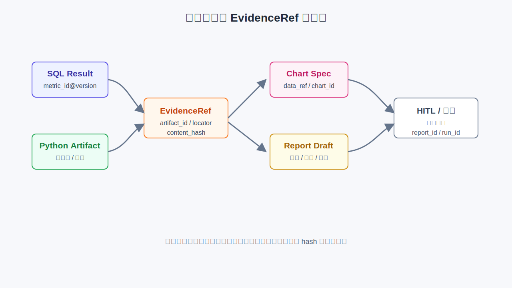

# 第36章 数据分析、可视化与报告

---

第34章和第35章已经完成取数与分析：系统知道华东上周运营 GMV 下降，知道 Top SKU，也知道若按品类汇总，几个品类贡献了主要跌幅。业务用户需要的是一份能拿来讨论的经营材料，而不是 SQL 或 Python stdout。

经营材料与聊天回答不同。它要说明发生了什么，证据来自哪里，哪些是事实，哪些是推断，哪些建议需要人工确认。Controller 审批时，要能点开脚注看到原始查询、Python 产物、指标版本和数据新鲜度。否则报告语言越流畅，风险越大。

这层表达能力接住第34章和第35章的结果，把表格、统计、图表和证据组织成报告。第30章定义 HITL 状态机，第48章定义前端渲染和交互，第39章定义评测流水线；本章定义 DataAgent 输出应该长什么样。

很多 DataAgent 原型在取数阶段表现不错，到了交付阶段又退回“聊天机器人”。系统能查出数字，却把所有结果写成一段段自然语言；能画图，却没有说明图表口径；能生成建议，却没有标出哪些建议需要业务确认。业务用户第一次看会觉得方便，第二次带进会议就会遇到问题：财务问数字来自哪版指标，运营问为什么选这几个 SKU，区域经理问能否把报告转发出去，审计问图表是否含有未授权字段。如果表达层没有证据、版本和责任，前面的 SQL 和 Python 做得再严谨，最终材料也很难进入业务流程。

报告生成的难点在于它同时面向两类读者。业务负责人需要快速知道发生了什么、影响多大、下一步谁处理；平台和审计人员需要知道证据来自哪里、计算是否可复现、哪些结论只是推断。写给前者的材料要简洁，写给后者的证据要完整。DataAgent 的表达层要把这两件事放在同一个产物里：正文面向业务阅读，EvidenceRef、图表数据引用、SQL/Python artifact 和指标版本面向复核。只有这样，报告才能既可读，又能经得起追问。

还有一个常见误区，是把“洞察”当成更会写的摘要。真正的洞察要改变用户下一步行动：是继续查门店，还是找品类经理；是先确认数据质量，还是进入补货审批；是把报告保存为周会材料，还是只作为临时分析。模型可以帮助组织语言，但行动意义来自证据结构、业务上下文和审批边界。本章讨论的图表、报告和建议，都是为了让用户知道哪些内容可以直接采用，哪些内容还要验证。

因此，表达层是 DataAgent 的业务交付层，不能被当成最后的润色层。它要接住上游计算结果，限制模型重新编造数字，选择合适图表，生成可编辑报告，并把用户反馈送回评估体系。第36章之后再看第48章的 Generative UI，就会发现前端交互承接报告证据、图表状态、审批动作和用户编辑，装饰性只是很小的一部分。

---

## 36.1 从结果到洞察

洞察不能停留在把数字换成自然语言。复述数字只是“华东运营 GMV 下降 12.3%”；洞察要继续回答：下降集中在哪里，和哪些结构变化相关，是否值得进一步行动。一个可用的洞察通常包含比较对象、差异幅度、集中度、证据和不确定性。

*表36-1：复述、洞察和建议的区别。来源：本书整理。*

| 类型 | 示例 | 作用 |
|---|---|---|
| 复述 | 华东运营 GMV 下降 12.3% | 告诉用户发生了什么 |
| 洞察 | SKU-A/B/C 贡献下滑差额的 58% | 说明问题集中在哪里 |
| 推断 | 日化品类占比上升，可能与促销结束有关 | 提出需要验证的方向 |
| 建议 | 品类经理评估 SKU-A 促销和补货策略 | 进入业务动作和审批 |

Planner 生成洞察时，不应让模型重新计算贡献度。贡献度、占比、同比和环比应由 SQL 或 Python 预先算出。模型负责组织语言、分级和关联证据。若 Python 产物没有给出“58%”，报告里就不应出现这个数字。

洞察还要区分事实、推断和假设。事实直接来自聚合或脚本；推断基于证据但仍需业务确认；假设只是待验证方向。把这三类混在一起，会让报告看起来果断，实际难以审批。

洞察生成还要控制数量。一份经营会材料不应把所有异常都列出来，而应围绕问题主线选择 3 到 5 条关键结论。华东下滑案例的主线是区域 GMV 下滑，因此 Top SKU、品类贡献、数据质量和待验证原因足够；如果再加入门店、渠道、会员和天气，报告会变成发现堆砌。DataAgent 应帮助用户收敛，不是展示它能找到多少模式。

洞察文本也要避免绝对化。没有促销日历证据时，不能写“促销结束导致下滑”；只能写“下滑时点与促销结束可能相关，需对照促销日历确认”。这种措辞看似保守，但它让 Controller 知道哪些结论可以直接引用，哪些需要后续核查。

洞察还要保留分析路径。一个结论如果来自 SQL 聚合，就应引用查询和指标版本；如果来自 Python 贡献度计算，就应引用相应 artifact；如果来自业务知识或外部解释，就应标明来源和待确认状态。没有路径的结论，即使语言很专业，也只是模型生成的判断。生产报告宁可少写几条，也要让每一条都能回到证据。

报告结构也要服务复核。经营材料通常需要先给结论，再给证据和待办；技术复盘材料则需要先给数据范围、方法和限制，再给结论。DataAgent 不宜用同一个模板覆盖所有场景。系统可以按任务类型选择结构：异常分析报告强调影响范围、主要贡献项、待验证原因和责任人；指标口径报告强调定义、数据源、计算方式和适用边界；管理层周报强调趋势、风险和行动项。结构合适，用户才不会在一堆正确数字里找不到重点。

图表是报告里最容易被误读的部分。模型可以建议图表类型，但图表标题、坐标轴、单位、排序、过滤条件和数据范围必须由结构化字段生成。一个柱状图如果没有说明“按 GMV 差额排序”还是“按差额贡献率排序”，会议上就可能被解读成不同含义。图表越简洁，背后的数据契约越要清楚；否则“好看”会掩盖口径缺失。

报告还要能被编辑。业务负责人会改标题、删掉不适合外发的段落、要求换成更符合组织语言的表达。可编辑并不意味着事实可以随意改。系统应把事实字段和表述字段分开：事实字段来自 SQL/Python artifact，用户修改后要标记为人工编辑；表述字段可以自由调整，但不能脱离 EvidenceRef 发布。这样既尊重业务写作习惯，又不让编辑过程破坏可追溯性。

最终，DataAgent 的表达层要给用户一种明确感：哪些内容已经由数据支持，哪些内容只是推断，哪些动作需要人批准。这样的材料不一定最炫，但最适合进入企业流程。它让会议讨论聚焦在业务判断，而不是反复追问“这个数字从哪里来”。

---

## 36.2 图表选型

图表服务于比较意图。趋势用折线，排名和贡献用横向条形，构成用堆叠条或面积，分布用直方图或箱线图，相关关系用散点。DataAgent 不应因为模型觉得“更好看”就选择 3D 柱状、过多颜色或十几个扇区的饼图。

图表选择还应考虑后续传播。交互页面可以允许 hover、筛选和下钻，导出报告需要在静态页面里说清楚口径。很多经营材料会被截图转发，一旦图表离开系统界面，EvidenceRef 和上下文更容易丢失。因此导出版本应把关键口径、时间范围和数据来源压进图表附近，而不是只放在页面底部的技术附录里。

自动 EDA 的位置也要讲清楚。它适合帮助系统发现数据质量、分布偏移、异常值和候选模式，但它不应把所有发现都推给业务用户。一个字段缺失率升高，可能是上游同步问题，也可能是业务流程改变；一个门店异常值，可能是促销活动，也可能是录入错误。DataAgent 可以把这些发现放进“质量提示”或“待验证线索”，不要把它们包装成已经成立的业务结论。

报告中的建议也要受控。系统可以建议“请品类经理确认 SKU-A 促销结束影响”，这是一条调查任务；如果写成“立即恢复 SKU-A 促销”，就进入业务决策。建议要标出责任角色、证据来源、风险等级和是否需要审批。这样用户能把建议转成工单、会议议题或审批动作，平台也能记录建议是否被采纳、被修改或被拒绝。

报告质量的评估要覆盖编辑后的版本。初稿可能证据完整，用户编辑后删掉脚注；初稿措辞保守，用户改成确定性结论；初稿图表引用正确，用户复制到外部文档后丢失上下文。平台至少要在保存、提交审批和导出三个时点做校验，确保核心 EvidenceRef、数据范围、指标版本和风险提示没有被破坏。否则评估只证明模型初稿合格，不能证明最终交付物合格。

报告发布后的反馈也要进入学习链路。业务用户删除了哪类段落，保留了哪类图表，人工补充了哪些解释，审批人驳回了哪些建议，这些都能反映报告模板和洞察策略是否合适。平台可以把编辑行为转成模板优化信号，把被驳回的结论转成评估样本，把被采纳的行动建议转成后续任务。表达层由此不只是输出终点，也成为 DataAgent 持续改进的入口。

在企业里，一份报告常常会被二次传播。它可能进入飞书、邮件、PPT、BI 看板或工单系统。每次传播都要保留最小上下文：报告版本、数据范围、生成时间、责任人和证据入口。若二次传播只带走一张图或一句结论，后续讨论很容易脱离原始证据。DataAgent 的导出设计要预先考虑这种传播路径。

华东案例中，Top SKU 贡献更适合横向条形图。条形图可以清楚展示哪些 SKU 的差额最大，且容易绑定到行级 EvidenceRef。若要展示品类占比变化，可以用堆叠条或并列条形。若要看多周走势，再使用折线。

图表 spec 是受控产物，不是图片提示词。`x_field`、`y_field`、排序、聚合和颜色字段都必须存在于输入 schema 或 Python artifact 中。`chart_renderer` 应校验字段存在、数据引用一致、Metric 版本可见，并返回 `chart_id`、`data_ref` 和证据 hash。第48章前端负责渲染和交互，不能让模型直接生成不可追溯图片。

自动可视化工具如 LIDA 提供了“摘要数据、枚举目标、生成图表、评估结果”的思路。DataAgent 可以借鉴这种多阶段方法，但在企业场景中应更保守：先用规则确定图表类型，再让模型补全 spec，然后用 schema 和 EvidenceRef 校验。

图表还要符合报告阅读场景。经营会材料通常需要快速比较，标题、坐标轴、单位和口径要直接可见；交互式探索页可以允许筛选和下钻，但导出的 PDF 或截图必须保留足够上下文。图表标题中写明“运营 GMV `gmv_ops@2025Q1`”，比只写“GMV 差额贡献”更适合审计和转发。

颜色和排序也应受控。正负差额应使用一致的颜色语义，排名图应明确按差额绝对值还是贡献比例排序，Top-N 之外是否合并为“其他”也要写清。模型如果随意选择颜色和排序，会让同一类报告在不同周之间难以比较。

---

## 36.3 自动 EDA 与异常发现

自动 EDA 不应把 profiling 报告原样塞给用户，而应在诊断类任务中生成少量结构化信号，例如缺失率、异常值、分布偏移、Top 变化和样本量风险。华东下滑场景中，如果 SKU 空值率略高，报告就应提示 Top SKU 排序可能受影响。

自动 EDA 要标注方法。比如“SKU-A 低于前周均值 2.4 个标准差”比“AI 发现异常”更可信。统计方法、阈值、输入数据和 hash 都应写入 artifact，供报告引用。没有方法说明的异常提醒，很容易变成另一种模型幻觉。

EDA 的级别也要控制。普通查数可以关闭自动 EDA；诊断任务可以自动跑轻量 EDA；订阅式任务工作台才适合主动异常发现。过度 EDA 会让简单问题变慢，也会让报告充满边缘信号，反而影响业务判断。

自动 EDA 的发现不应自动升级为洞察。缺失率、离群点、分布偏移只是候选信号，Planner 要判断它们是否与用户问题相关。华东下滑问题中，SKU 空值率略高会影响 Top SKU 排序，值得写入质量提示；某个无关字段的异常则不应进入执行摘要。否则报告会把数据质量噪声误当成业务发现。

当 EDA 发现严重质量问题时，系统应降低交付级别。轻微质量告警可以在报告中加脚注；严重质量失败应拒绝生成正式报告或进入 HITL。表达层不能把上游质量风险“润色”掉，因为业务用户往往只看到最终材料。

---

## 36.4 EvidenceRef 与报告结构

EvidenceRef 是 DataAgent 报告的核心契约。它把一句洞察绑定到产生这句话的数据来源：哪个 Tool、哪个 artifact、哪一行或哪段聚合、哪个 Metric 版本、哪个 content hash。报告可以修改措辞，但不能丢掉证据引用。



*图36-1：报告产物与 EvidenceRef 证据链。来源：本书自绘。Alt text：图中展示 SQL 结果、Python artifact、EvidenceRef、图表 spec、报告草稿和 HITL 发布之间的引用关系，强调关键洞察必须保留 artifact、locator、content hash 和指标版本。*

```json
{
  "ref_id": "ev_002",
  "source_tool": "python_sandbox@v1",
  "artifact_id": "df_sku_contrib",
  "locator": "row:sku_id=SKU-A",
  "metric_id": "gmv_ops",
  "metric_version": "2025Q1",
  "content_hash": "sha256:8f3a2b1c"
}
```

用户点击脚注时，前端应根据 `artifact_id` 和 `locator` 找到对应行或聚合结果，校验 content hash，再展示 Metric 版本、数据时间和来源 Tool。只有“依据：Python 分析结果”这种自由文本，不具备审计价值。

报告结构可以保持稳定。经营分析报告通常包括执行摘要、问题与口径、数据概览、发现、建议和附录。执行摘要控制在 3 到 5 条，每条都带 EvidenceRef；问题与口径展示 Question Frame、指标版本和时间范围；附录保留 Run ID、SQL hash、Python hash、新鲜度和完整证据列表。

经营会、监管报送和对外材料应进入 HITL。DataAgent 可以生成报告初稿，但发布前需要 Controller、法务或业务 owner 确认。HITL 不只负责“点通过”，还要把驳回原因、批注和修改记录写入 Trace，成为后续评测样本。

报告编辑要保护证据链。用户可以改标题、调整措辞、删除段落或要求重画图，但不能让一条洞察保留原结论却丢失 EvidenceRef。若编辑后的句子不再被原证据支持，系统应要求重新绑定证据或把该句标为人工补充。人可以改稿，可追溯性不能被改掉。

EvidenceRef 还要支持版本固定。报告发布后，上游 artifact 可能被清理或重算，语义层 Metric 也可能升级。已发布报告应继续指向当时的 artifact hash 和 Metric 版本，而不是自动追随最新数据。若用户选择刷新报告，应生成新的 Run 和新的 EvidenceRef。

附录并不是可有可无的工程垃圾箱。正式报告至少要保留 Run ID、指标版本、SQL hash、Python hash、图表 data_ref、新鲜度和质量状态。业务用户平时不一定打开附录，但一旦出现争议，附录决定了报告能否被复盘。

---

## 36.5 行动建议与业务反馈

Agent 不能替业务做决定。报告中的建议应写成“谁需要评估什么”，不要直接下达业务动作。补货、调价、促销和渠道调整都涉及库存、毛利、供应链和组织责任，DataAgent 只能基于证据提出选项。

建议应分级。观察只陈述事实，推断说明可能原因，建议提出可执行动作并标记审批状态。华东案例中，“SKU-A 贡献下滑 32%”是事实；“可能与促销结束有关”是推断；“品类经理评估 SKU-A 促销和补货策略”才是建议。

业务反馈要回到评测和模板。用户采纳、驳回、延后或修改建议，都应写入 Eval 和 Playbook 候选池。高采纳率建议可以沉淀为标准分析流程；高驳回率建议说明模型过度推断、证据不足或报告模板不适合当前业务。

建议也要有责任主体。写“建议优化促销策略”太空泛；写“建议品类经理核对 SKU-A 促销结束日和补货变化”更可执行。责任主体可以来自组织上下文或人工选择，不能由模型随意编造。如果平台不知道责任人，应写“需业务 owner 指派”，而不是虚构一个部门。

建议还要标出前置条件。比如“评估补货策略”只有在库存数据、促销日历和毛利口径都齐全时才成立；如果当前 Run 只覆盖销售额，就应把建议写成“补充库存和促销日历后再判断”。这类限制会让报告显得克制，但能减少会议上反复追问“依据在哪里”的情况。

反馈结果可以反向改进报告模板。某类建议反复被驳回，可能说明它超出 DataAgent 证据范围；某类洞察反复被采纳，可以沉淀为 Playbook 和固定图表。DataAgent 的报告能力不能停在一次性生成文本上，它需要通过反馈持续校准哪些表达对业务有用。

---

## 36.6 输出质量评估

DataAgent 的评估不能停在 SQL exact match。用户抱怨最多的，往往是图表不对题、结论没有依据、该追问时没有追问、报告口径不清。输出评估应覆盖答案、洞察、图表、报告、拒答和追问。

*表36-2：DataAgent 输出评估维度。来源：本书整理。*

| 维度 | 检查内容 |
|---|---|
| 答案 | 数值容差、排序一致、口径脚注 |
| 洞察 | 每条 insight 是否有合法 EvidenceRef |
| 图表 | 图表类型是否匹配意图，字段是否来自 schema |
| 报告 | Run ID、Metric 版本、新鲜度、附录是否完整 |
| 交互 | 口径歧义时是否追问，证据不足时是否拒写 |

groundedness 是核心指标。规则校验先检查 `locator`、`content_hash`、Metric 版本和 artifact 是否存在；LLM-as-Judge 可以辅助判断叙事是否贴合证据，但不能替代 hash 和 locator 的硬校验。报告里的每条洞察都应经得起点击和回放。

负样本很重要。评测集中应包含没有 EvidenceRef 的洞察、图表字段不存在、模型心算贡献度、推断写成事实、缺少口径版本等坏例。没有这些负样本，系统很容易在演示中表现良好，在真实报告中失控。

线上信号也要纳入评估。人工改报告率、审批驳回率、图表重生成率、用户负面反馈、建议采纳率，都能反映表达层质量。SQL 正确但报告频繁被驳回，说明问题不在取数，而在洞察组织、口径说明或建议边界。

评测还要覆盖编辑后的报告。很多系统只评估初稿，却忽略人工修改后证据是否仍然有效。报告编辑器应在保存时重新校验 EvidenceRef：引用是否存在、hash 是否一致、句子是否仍有证据、图表字段是否仍匹配数据。编辑后的产物才是最终交付物，不能只保证初稿合格。

LLM-as-Judge 可以评估语言清晰度和洞察相关性，但不能替代硬校验。数值、排序、证据定位、Metric 版本和数据新鲜度都应由规则或程序检查。模型评审适合辅助发现“这段话是否像业务报告”，不适合决定“这个 58% 是否来自数据”。

---

## 36.7 华东下滑报告样例

下面是华东下滑 Run 的报告骨架。示例数据仅用于说明结构，金额单位和小数位应由报告模板统一处理。

标题：华东区上周运营 GMV 下滑复盘（待 Controller 确认）

Run ID：`run-8f3a`

指标：运营 GMV `gmv_ops@2025Q1`

数据截至：2025-06-14 06:00

执行摘要

- 华东上周运营 GMV 较前周下降 12.3%，区域差额约 -1,310 万。[`ev_001`]
- SKU-A、SKU-B、SKU-C 合计贡献下滑差额的 58%；SKU-A 单 SKU 贡献 32%。[`ev_002`]
- 日化品类占比上升 4 个百分点，与 Top 下滑 SKU 品类一致。该项为推断，需品类经理确认。[`ev_004`]
- `sku_id` 空值率略高，Top SKU 排序仅供参考。[`ev_005`]

发现

事实：SKU-A 差额 -420 万，占区域下滑 32%。

推断：日化品类占比上升，可能与促销结束或结构迁移相关。

假设：是否存在跨区窜货，当前 Run 未引入渠道明细，暂不下结论。

建议

建议品类经理对 SKU-A 做促销 post-mortem，核对促销结束日、补货和陈列变化。该建议需要 Controller 审批后进入后续任务。

附录

附录应包含 Semantic SQL hash、Python 脚本 hash、Metric 版本、新鲜度、质量告警、EvidenceRef 列表和报告审批记录。读者不一定每次打开附录，但审计和复盘必须能打开。

如果 Controller 驳回报告，系统应保留驳回意见。例如“日化品类结构迁移缺少促销日历证据”，这条意见可以成为下一轮 Run 的补数任务，也可以进入评测集，防止模型以后把同类推断写成事实。报告不是终点，它是数据任务进入组织流程的接口。

如果报告被批准，发布事件也要进入 Trace。在线页、PDF、导出文件和通知消息都应绑定同一个 `report_id` 和 `run_id`。后续有人转发 PDF 时，页脚中的 Run ID 能把静态文件带回平台证据链。

---

## 36.8 表达层与 DataAgent 报告产物

表达层可以拆成两个 Tool 和一个模板目录：`chart_renderer` 负责图表 spec 生成与校验，`report_renderer` 或 DataAgent 模板负责报告产物，`core/eval/` 负责输出评估。图表和报告都只读上游 artifact，不重新计算核心数字。

```text
mini-platform/tools/chart_renderer/
├── handler.py
└── spec_schema.json

mini-platform/agents/data_agent/templates/
└── weekly_ops.md
```

上线前至少检查四件事：图表 `data_ref` 与 SQL/Python artifact 同源，所有洞察都有 EvidenceRef，对外报告默认进入 HITL，报告页脚包含 Run ID 和 `metric_id@version`。这些要求看似琐碎，但缺少其中任何一个，报告就很难回放。

模板也要限制信息密度。执行摘要不要超过 5 条，图表不要一次堆满页面，推断和假设要标注。DataAgent 报告的目标是帮助业务开会和决策，不是展示系统能生成多少文字。

实现上，`chart_renderer`、报告模板和 Eval 不应各自维护证据字段。EvidenceRef schema 应集中定义，并在 Tool Result、报告 artifact、前端脚注和评测器之间复用。字段一旦分叉，最容易出现图表能追溯、报告不能追溯，或报告引用的证据无法在前端打开。

第一版落地可以只支持一种报告模板和两三种图表。范围窄一些，证据链和 HITL 做扎实，比同时支持 PPT、PDF、网页和多种图表更重要。表达层的复杂度来自证据和编辑，不来自文件格式数量。

报告发布后还要支持撤回。数据质量回滚、指标口径修订、审批意见变化或权限范围调整，都可能要求撤回已发布材料。撤回不应删除历史证据，而应标记报告状态、保留撤回原因，并阻止旧链接继续作为有效结论传播。若报告已通知多人，撤回事件也应通知原接收者，并在报告页显示最新状态；这类状态同步同样要进入审计记录。

---

## 36.9 报告产物的复核与发布边界

DataAgent 的报告不是聊天回答的长版本。它进入经营会、周报或审批流程后，就变成可传播的业务产物。平台要区分草稿、已复核、已发布和已归档状态，并记录每个状态的责任人和证据版本。没有这个生命周期，用户很难判断一份报告是模型刚生成的建议，还是已经经过业务负责人确认的结论。

图表解释要和数据证据绑定。模型可以生成自然语言归因，但每个关键判断都应能回到 EvidenceRef：SQL 查询、Python 计算、图表参数、时间范围、指标口径和数据快照。若报告写“华东下滑主要来自某品类”，却没有对应的贡献度计算和图表引用，这句话就不应进入已发布版本。

人工复核不是简单润色。复核人要检查结论是否被证据支持，建议是否可执行，是否遗漏明显业务约束，是否包含敏感字段或不该公开的内部判断。复核意见也应进入 trace，后续评测可以区分模型原始错误、证据不足和人工改写。这样报告质量改进才有方向。

报告模板要避免把所有任务写成同一种结构。异常诊断、经营复盘、合规说明和行动计划需要不同的章节组织。平台可以维护模板库，但模板版本要和 Agent、语义层、图表组件一起记录。报告发布后，模板升级不应改变历史报告的可回放内容。

## 36.10 报告质量的评测样本

报告质量不能只靠人工读感判断。DataAgent 报告应建立专门的评测样本，覆盖结论正确性、证据完整性、表达适配、行动建议和安全合规。每条样本都应包含用户问题、允许使用的数据域、期望证据、禁止出现的敏感内容和人工认可的结论边界。这样模型改动、模板改动和图表组件改动才能被同一套样本回归。

评测时要把事实错误和表达问题分开。事实错误包括指标口径用错、贡献度计算错误、时间范围错误、引用证据缺失。表达问题包括结论过度确定、行动建议无法执行、面向对象不合适、报告结构混乱。两类问题的修复路径不同：事实错误通常回到语义层、SQL、Python 或图表契约；表达问题才回到模板、prompt 和模型裁判。

报告还要接受安全评测。经营报告可能包含敏感字段、内部判断、未公开计划或对外不宜传播的结论。平台应检查报告中是否出现明细数据、个人信息、未脱敏客户名称、未经批准的导出链接和高风险建议。对于可发布报告，最好在人工复核卡片里明确“可内部流转”“可跨部门流转”“可对外披露”的边界。

评测结果应进入模板治理。若多条样本都显示报告缺少证据脚注，就应调整模板结构；若模型经常把相关性写成因果，就应调整结论段约束；若行动建议经常超出用户权限，就应让 Policy 和 HITL 更早介入。报告质量集中体现 DataAgent 全链路质量，不能按末端润色问题处理。

## 36.11 报告发布后的运营反馈

报告发布不是链路终点。业务用户会继续评论、转发、复制图表、要求补充维度，或者在会议中指出结论不符合现场情况。这些反馈如果只停留在聊天记录里，就无法改善后续 Agent。平台应把反馈分成事实纠错、表达修改、行动建议调整和权限问题几类，分别回流到语义层、分析链路、报告模板和安全策略。

事实纠错优先级最高。用户指出某个指标口径错误、某张图表分母不对、某个异常点被误判时，平台应要求补证据，并把样本加入评测集。表达修改可以进入模板优化，但不能直接改变事实计算。行动建议调整则要看用户角色和业务流程，不能把一次会议上的意见自动升级为全局规则。

报告的传播范围也要运营。内部经营会报告、跨部门复盘、对外披露材料，对证据和措辞的要求不同。DataAgent 可以生成多个发布版本，但每个版本都要记录删减了哪些字段、保留了哪些证据、谁批准了发布。若同一份报告被复制到不同渠道而没有版本记录，后续很难追踪责任。

运营反馈还会暴露产品体验问题。用户频繁要求“展开明细”，说明图表摘要不足；频繁要求“换个口径”，说明语义层入口不清；频繁要求“帮我发给谁”，说明报告和工作流系统需要连接。第36章的报告层因此是 DataAgent 从分析走向业务动作的接口，不能作为单独的写作模块处理。

## 36.12 报告层的降级策略

报告生成失败时，系统不应直接丢失前面的分析成果。若模型无法生成完整报告，但 SQL、Python 和图表产物已经完成，前端可以降级展示证据面板和数据摘要；若图表生成失败，但计算结果可用，可以先展示表格和文字说明；若证据不足，应生成“待补证据”的草稿，而不是强行给出结论。

降级策略要避免伪装成功。报告没有通过复核时，状态应保持 draft 或 needs_review；证据缺失时，标题和正文都要明确标注。用户可以继续编辑，但系统不能把它当成已发布报告。这个边界对管理层尤其重要，因为报告格式越完整，越容易让读者误以为结论已经被验证。

降级产物同样要进入 Trace。一次失败报告可能包含已经完成的 SQL、Python 产物、图表草稿和模型错误。保留这些中间状态，后续团队才能判断该修模型、修模板、补数据，还是调整权限。没有降级记录，失败只会表现为“生成失败”，丢掉大量可用于改进的证据。

## 36.13 EvidenceRef 的发布责任

EvidenceRef 是报告进入业务流转的前提，不能被当作报告里的装饰字段。报告中每个结论都应该能回到具体证据：SQL 查询、Python 产物、图表规格、指标版本、数据新鲜度和人工复核记录。读者在实现报告层时，不能只把 EvidenceRef 设计成一个链接列表。它需要承担发布责任，说明结论来自哪一次 Run、使用哪一版语义层、经过哪些校验、是否存在权限裁剪，以及用户看到的内容是否经过脱敏。

发布前的复核也要围绕 EvidenceRef 展开。复核人不可能逐字检查所有自然语言，但可以检查结论和证据是否一致。比如报告说“华东收入下滑主要来自渠道 A”，EvidenceRef 应当能指向渠道维度分解、时间窗口、收入指标定义和异常检测结果。如果证据只支持“华东收入下滑”，却不支持“主要来自渠道 A”，报告层就应当降低表述强度，把结论改成“渠道 A 是候选原因之一”。这种克制来自生产系统对证据等级的尊重，并非写作保守。

EvidenceRef 还要服务后续反馈。业务用户指出报告结论有误时，平台需要知道错误发生在数据、分析、图表选择、文本解释还是行动建议。若每个结论都有证据引用，反馈就可以精确回写到对应环节。第38章的 Trace 负责保存运行过程，第39章的 Eval 负责把问题沉淀为样本，报告层则负责把用户可见结论和底层证据对齐。三者合在一起，才能把一次错误报告变成可修复的工程问题。

## 36.14 报告发布后的运营闭环

报告生成并不是链路终点。企业里的报告会被转发、评论、下载、复制到会议材料，也可能触发审批、工单或销售行动。平台如果只记录生成成功，就无法判断报告是否真正产生价值。更完整的运营闭环应当记录阅读、追问、订阅、人工修订、结论采纳和后续动作。这里不需要把所有行为都做成复杂指标，但至少要能区分“用户打开后关闭”“用户继续追问”“用户把报告发布给团队”这几种状态。

运营数据反过来影响报告生成策略。经常被追问的段落，说明解释粒度可能不足；经常被人工删除的行动建议，说明建议生成边界过宽；经常被复制的图表，说明它适合沉淀为固定模板。平台可以把这些反馈进入评测样本和模板治理，而不是只作为产品埋点。这样报告层就能从一次性文本生成，变成持续改进的分析产品。

报告发布还要保留版本。业务用户在不同时间看到的报告可能不同，因为数据刷新、语义层调整、分析代码更新或人工复核修改都会改变内容。平台应当保存发布版本、草稿版本和修订记录，避免同一个链接在事后呈现出不同结论却没有说明。对于被用于决策或合规审查的报告，版本记录比语言流畅度更重要。DataAgent 的报告层只有具备这种发布纪律，才适合进入企业里的正式协作流程。

## 36.15 报告语言的约束表达

报告层最容易出现的质量问题，是把不确定结论写成确定判断。模型擅长生成流畅解释，但业务报告需要区分事实、推断、假设和建议。事实来自数据结果，推断来自分析方法，假设需要后续验证，建议则涉及业务动作。四类内容如果混在一起，读者会误以为每句话都有同等证据。

平台可以通过输出结构约束报告语言。每个结论标注证据来源，每个推断标注依赖条件，每个建议标注前置假设和风险。对于证据不足的内容，报告应使用“候选原因”“需要进一步确认”“当前数据支持的解释”这类克制表达，而不是写成确定结论。这里的目标是让读者能判断哪些内容可以直接使用、哪些内容需要复核，而不是单纯让文字变得保守。

报告语言约束也能反向帮助评测。评测不只看报告是否通顺，还要看证据等级是否匹配表达强度。一个没有证据支撑的强结论，应被判为质量问题；一个证据不足但明确提示限制的回答，则可能是合格降级。这样报告层的评测才符合企业使用方式。

表达层上线后，团队要定期抽读真实报告。抽读时不只看语言是否顺畅，还要看结论是否紧扣问题、图表是否支持结论、EvidenceRef 是否可打开、编辑后的版本是否仍保留证据。这个人工抽读可以和第40章的在线评测结合起来，把被驳回的报告、被大量修改的段落和被频繁删除的图表变成改进样本。

一个成熟的 DataAgent 报告系统，会让用户逐渐减少手工查证成本。用户仍然可以质疑结论，但质疑时能很快看到数据来源、计算过程和责任人。做到这一点，报告层会成为企业数据工作流的一部分，远超模型写作能力本身。

## 本章小结

表达层把 SQL 和 Python 结果组织成可讨论、可审批、可追溯的业务材料。洞察不能停留在复述数字，而要说明集中度、结构变化和行动意义。图表 spec 也必须绑定输入数据和证据 hash，避免生成不可追溯的图片。

EvidenceRef 是报告可信的核心契约。每条关键洞察都应能点击回证据，报告、图表、拒答和追问也要进入输出评估。只看 SQL 正确率无法判断 DataAgent 是否真的完成了业务分析任务。


## 参考文献

Dibia, V. (2023). LIDA: A tool for automatic generation of grammar-agnostic visualizations and infographics using large language models. *ACL Demo*. arXiv:2303.02927. [https://arxiv.org/abs/2303.02927](https://arxiv.org/abs/2303.02927)

Tang, Z., et al. (2025). LLM/Agent-as-Data-Analyst: A survey. arXiv:2509.23988. [https://arxiv.org/abs/2509.23988](https://arxiv.org/abs/2509.23988)

Wilke, C. O. (2019). *Fundamentals of Data Visualization*. O'Reilly.

Huo, N., et al. (2026). BIRD-INTERACT: Re-imagining Text-to-SQL evaluation via lens of dynamic interactions. *ICLR 2026*. arXiv:2510.05318. [https://arxiv.org/abs/2510.05318](https://arxiv.org/abs/2510.05318)

Es, S., et al. (2024). RAGAS: Automated evaluation of retrieval augmented generation. *EACL*. arXiv:2309.15217.

Vega-Altair Contributors. (2024). *Vega-Lite*. [https://vega.github.io/vega-lite/](https://vega.github.io/vega-lite/)
