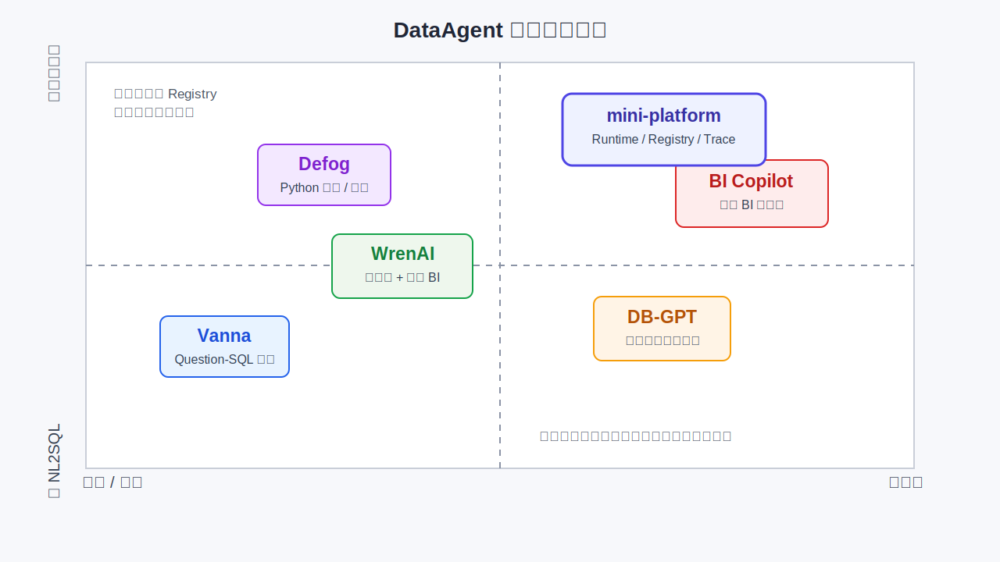

# 第37章 DataAgent 对标与生态

---

本章对 DataAgent 相关产品和开源生态做对标，说明 BI Copilot、Notebook Agent、语义层工具和分析工作台各自适合的边界。这个领域产品形态分化严重：有的强在问数，有的强在 Notebook 协作，有的更接近语义层工具。直接比较“谁更好”没有意义，应先看它覆盖 DataAgent 链路的哪一段。本章把 DB-GPT、ChatBI 等主流开源方案与商业产品按能力维度拉成对照，帮助团队判断该自建、采购还是组合。Part VI 前五章分别定义产品边界（第32章）、语义层（第33章）、NL2SQL（第34章）、Python 分析（第35章）与表达层评估（第36章）。读者若已跟随 [第32章 §4 华东下滑案例](ch32-dataagent.md) 走完一条 Run 链，会自然产生一个问题：业界已有大量 DataAgent / Text-to-SQL 产品，多业务线场景该自建、采购还是混合？

采购和自研通常需要拆开判断。较稳妥的路线，是把外部产品放回 Part V 的 Runtime、Registry、Trace 和 Policy 之下，再判断它覆盖 DataAgent 链路的哪一段。后面的内容先解释生态为什么分化，再对照主流方案的能力覆盖、ChatBI 与 DataAgent 的边界，以及评估集如何支撑选型后的持续改进。DataAgent 生态很热，但产品形态差异很大。有的工具更像 BI Copilot，强在指标问答和图表生成；有的更像 Notebook Agent，强在探索式分析；有的围绕语义层做 Text-to-SQL；还有的把数据接入、权限、审计和工作流都打包成平台。直接比较“谁更好”没有意义，企业应先判断它覆盖 DataAgent 链路的哪一段。

采购评审时，演示最容易集中在少数漂亮问题上。用户输入自然语言，系统生成 SQL、图表和解释，现场效果很好。真正进入生产后，团队要看语义层如何维护、权限如何注入、SQL 失败如何恢复、指标口径如何审计、版本升级如何回滚，以及结果能否进入企业已有的 BI 和流程系统。自研、采购和混合路线都可能成立。关键是不要让外部产品吞掉平台责任。即使用商业产品承担问数界面或 Notebook 协作，Runtime、Registry、Trace、Policy、Eval 和数据权限仍要有企业自己的事实来源。否则产品替换、供应商调整或核心场景扩展时，已有资产很难迁出。

## 37.1 DataAgent 生态的分化来源

市场上很难找到一个可直接采购上线的标准 DataAgent 产品。DataAgent 同时牵涉对话入口、Text-to-SQL 技术、企业部署合规和组织级数据治理。多数产品只从其中一条轴线起步，其余能力靠集成或外接补齐。四类分化轴如下：

*表37-1：DataAgent 生态各分化轴的典型产物与能力缺口。来源：本书整理。*

| 分化轴 | 典型产物 | 能力缺口 |
| --- | --- | --- |
| 入口 | ChatBI 对话框 | 缺平台治理（Runtime、Registry、Trace） |
| 技术路线 | Text-to-SQL 库（如 Vanna，见 §2 说明） | 缺语义层与 HITL |
| 部署 | SaaS Copilot | 缺私有化与多租户 |
| 组织 | 数据中台项目 | 缺 Agent Runtime 与 Run 六态 |

以零售经营分析场景为例：运营总监一句「上周华东 GMV 下滑 Top SKU」，背后至少需要 Question Frame 解析（第32章）、Metric 绑定与消歧（第33章）、只读 SQL 执行（第34章）、品类贡献度 Python（第35章）、图表与报告审批（第36章），还需要贯穿全程的 Run 审计与评估（第37章、第39章）。采购一个“对话查数”SaaS，通常只覆盖入口与 NL2SQL 演示；语义层口径、沙箱分析、人工审批仍须企业自建或二次集成。

产品比较不宜从功能清单开始。更可靠的顺序是先列出业务工作流：谁提问、用哪个指标口径、能否追问、是否要审批、报告发给谁、失败后谁修样本。只有这些约束明确后，Vanna、WrenAI、DB-GPT、Defog 或 BI Copilot 才能放到合适的位置。否则团队很容易买到一个演示效果很强的 NL2SQL 工具，却在上线时发现它没有 Metric 版本、没有 `tenant_id` 注入，也没有报告级证据。LLM/Agent-as-Data-Analyst 综述将分析 Agent 所需能力归纳为语义感知、工具链编排、自主流水线等多维组合 (Tang et al. 2025)。极少有单一产品一次覆盖这些能力。企业落地更常见的形态是：Part V 平台（第22章至第30章）加语义层（第33章），再配合第34章至第36章的专用工具，通过 Registry 统一审计。单个 ChatBI 产品通常覆盖不了这条链路。公开 benchmark 也在推动这一认知转变。Spider 2.0 (Lei et al. 2024) 与 BIRD-INTERACT (Huo et al. 2026) 把评测从“单句翻译 SQL”推向企业 workflow、多轮澄清与交互式纠错。这与第32章定义的诊断、对比、报告链路一致。产品若仍停留在“把自然语言变成一条 SELECT”，在华东下滑这类多步分析 Run 上很快会暴露边界。

### 37.1.1 产品选型与集成风险

部署一个 ChatBI 不等于部署 DataAgent 平台。ChatBI 往往是问数形态的子集（第32章 §2），缺少 `waiting_human` 审批链、Handoff 与跨 Agent 编排；经营月报 Run 链仍须 Part V Runtime。引入 DB-GPT 也不能替代 Part V 的平台能力。DB-GPT (eosphoros-ai 2024) 是开源 Agent 应用框架，自带 Runtime 壳与数据插件；若企业已建设 `core/runtime/` 与 `core/registry/`，再整包引入会形成双 Runtime（见第31章“低代码平台的边界风险”）。更稳的方式是接组件，不接平台壳。NL2SQL 演示准确率不足以支撑上线判断。华东案例在 Linking 阶段就存在 `gmv_tax_excluded` 与 `gmv_ops` 歧义（第33章 §4）；没有业务金标准集与口径脚注评估，上线后口径投诉率会掩盖 SQL 语法正确率。

---

## 37.2 开源框架与商业产品分类

Vanna、WrenAI、DB-GPT、Defog、Sherlock 和 Power BI Copilot 名字相近，但定位差异很大。Vanna 更像 Question-SQL 检索增强库，用向量库检索历史问题和 SQL，适合快速验证私有 schema 适配。WrenAI 把语义层和对话式 BI 放在一起，更接近 Metric 建模与问数一体化。DB-GPT 提供 Agent 应用框架和数据插件模板，适合从零搭建数据应用，但容易与 Part V 的企业 Runtime 形成双运行时。Defog 偏 Text-to-Python 和自动报告，适合分析与叙事链路。Sherlock 更像研究型深度分析 Agent 原型，可以参考推理链，但企业治理能力较弱。Power BI Copilot 是 BI 产品内置 Copilot，适合改图表和筛选，不应直接等同于平台化 DataAgent。后续对比不以“谁更好”为主线，而看它们分别落在平台哪一层。能作为工具的进入 Registry，能作为语义层后端的进入第33章，能提供评测样例的进入第39章；只有承担 Run 状态、权限、审计和恢复责任的部分，才有资格进入平台内核。

### 37.2.1 生态地图

如果从“偏库还是偏平台”和“偏 NL2SQL 还是偏完整任务”两个维度看，这几类产品的落点并不一样。Vanna 更接近 Question-SQL 检索增强库，适合快速适配私有 schema；WrenAI 处在语义层与对话式 BI 的中间位置，更容易和第33章的 Metric 建模发生关系；Defog 更靠近 Python 分析和报告生成，和第35章、第36章重叠；DB-GPT 更像开源平台壳，提供 Agent 应用框架和数据插件模板；Power BI Copilot 则是嵌入 BI 产品内部的 Copilot，不应直接等同于企业级 DataAgent。

*图37-1：DataAgent 生态能力地图。来源：本书自绘。Alt text：图中以偏库到偏平台、偏 NL2SQL 到偏完整任务两个维度放置 Vanna、WrenAI、DB-GPT、Defog、BI Copilot 和本书 mini-platform，说明各方案覆盖的能力边界。*

这种定位比简单打分更重要。若企业缺的是语义层，WrenAI 或 Cube 类能力值得重点验证；若缺的是历史 Question-SQL 检索增强，Vanna 更像一个可包装进 `tools/sql_executor/` 的训练或检索组件；若缺的是 Text-to-Python 与报告模板，Defog 的思路可以参考，但沙箱、权限和报告审批仍应回到企业平台；若企业已经有第22章至第30章的 Runtime、Registry、Trace 和 Policy，则引入 DB-GPT 这类平台型项目要格外谨慎，避免形成第二套 Runtime。mini-platform 在这张地图里的角色，是提供一套固定接口和责任边界的参照实现，而不是参与产品竞争。外部组件可以进入体系，但进入方式应是 Registry Tool、语义层后端、NL2SQL 训练管线或报告模板，而非绕过 Part V 平台直接接管任务状态。

---

## 37.3 主流开源方案对比（DB-GPT、Vanna、WrenAI、Defog、Sherlock）

§2 已说明各开源项目的基本定位。本节进一步回答它们分别覆盖 Part VI 哪几章的能力，以及与 mini-platform 模块如何对照。

*表37-2：DB-GPT、Vanna、WrenAI 等开源方案按能力维度的对照。来源：本书整理。*

| 能力 / 章节 | DB-GPT | Vanna | WrenAI | Defog | Sherlock | mini-platform（书中模块） |
| --- | --- | --- | --- | --- | --- | --- |
| Agent Runtime (第22章) | 自有 | 无 | 部分 | 部分 | 实验 | ✓ `core/runtime/` |
| Tool Registry (第23章) | 部分 | 无 | 部分 | 部分 | 无 | ✓ `core/registry/` |
| 语义层 (第33章) | 可接 | 弱 | 强 | 中 | 弱 | `infra/semantic_layer/` · `agents/data_agent/linker.py` |
| NL2SQL (第34章) | ✓ | 强 | ✓ | 中 | 中 | `tools/sql_executor/` |
| Python 沙箱 (第35章) | ✓ | 弱 | 弱 | 强 | 中 | `tools/python_sandbox/` |
| 报告/图表 (第36章) | 部分 | 弱 | 中 | 强 | 中 | `tools/chart_renderer/` · `agents/data_agent/templates/` |
| HITL / 多租户 | 弱 | 弱 | 中 | 中 | 弱 | ✓ Part V Run 链 · `core/policy/` |
| 企业 Eval (第36章至第39章) | 部分 | 弱 | 中 | 中 | 研究 | `core/eval/` · 第39章 |

!!! note "mini-platform 落地状态"
    表中 Part V 模块（`core/runtime/`、`core/registry/` 等）与 `mini-platform/projects/multi-agent-workflow/` 已在仓库中存在。
    Part VI 列（`tools/sql_executor/`、`tools/python_sandbox/`、`infra/semantic_layer/client.py` 等）为书中目标契约，随 Part VI 工程迭代合入；选型评估应以实际验证为准，不能假定仓库已包含全部目录。

*能力评分只用于方向性对照，不代表精确的版本打分。表中信息按 2025-06 的公开资料做过一次核对。*

### 37.3.1 各方案选型要点

Vanna (vanna-ai 2024) 以向量检索历史 SQL 与库表 schema 片段见长，适合私有 schema 的快速适配。华东案例若只用 Vanna，可较快生成 Top SKU 查询，但 GMV 歧义消歧（`gmv_ops` vs `gmv_tax_excluded`）与 View 级权限须外接 `infra/semantic_layer/` 与 `core/policy/`，否则难进生产。WrenAI (Canner 2024) 强调语义层与对话式 BI，与第33章路线最接近。`sales_ops` View 与 Metric 版本策略可直接类比。WrenAI 仍须接企业 `core/runtime/` 与第30章 HITL；多 Agent 治理不宜与 Part V 双轨并行。DB-GPT (eosphoros-ai 2024) 提供 Agent 应用壳与数据插件。若企业已有第22章至第30章平台，更可靠的做法是让 NL2SQL 训练或插件逻辑经 Registry 注册为 Tool，不引入第二套 Runtime（与 [第31章](../../part05-agent-capabilities/ch/ch31.md) 框架对标结论一致）。Defog (Defog.ai 2024) 偏 Text-to-Python 与自动报告，与第35章至第36章的 `python_sandbox` + `chart_renderer` 组合高度重叠。华东经营下滑分析场景的品类贡献度步骤可对标 Defog 强项；取数仍应走 `sql_executor` 只读链路。Sherlock 属研究型深度分析 Agent 原型，在复杂推理链设计上有参考价值，但通常缺少企业级 Runtime、行级权限与评估流水线。不建议整包替换 Part V 平台；Planner 多步推理策略可借鉴，实现仍应回到 `core/planner/`。对标开源方案时，最容易低估的是集成后的运行责任。引入第二套 Runtime，Trace 会分裂；绕过企业语义层，指标口径会分裂；让供应商工具直接执行 SQL，Policy 责任会分裂。比较表只能说明能力覆盖，不能替代架构判断。进入生产链路的外部组件，应先被包装成 Registry Tool，再接受同一套审计、限权、成本和 Eval 规则。

!!! note "对标不等于采购建议"
    上表随社区版本变化；选型时须完成实际验证与安全审计，本章仅提供能力映射与 mini-platform 模块对照。

---

## 37.4 ChatBI、BI Copilot、DataAgent 的产品差异

三类产品名称相近，职责边界不同：

*表37-3：ChatBI、BI Copilot、DataAgent 三类产品的差异。来源：本书整理。*

| 维度 | ChatBI | BI Copilot (Microsoft 2024) | DataAgent（本书） |
| --- | --- | --- | --- |
| 定位 | 对话查数 | BI 内嵌助手 | 平台托管数据任务 Agent |
| 语义层 | 不定 | 依赖 BI 数据集 | 强制 第33章 · `infra/semantic_layer/` |
| 多步分析 | 弱 | 中 | Planner 链第34章至第36章 · `sql_executor` → `python_sandbox` → `chart_renderer` |
| 审批 | 通常不支持 | 通常不支持 | HITL 第30章 · 报告级 `waiting_human` |
| 与 ERP/Agent 编排 | 弱 | 弱 | Handoff 第28章 · `agents/data_agent/` |
| 评测 | 依厂商 | 依厂商 | Spider 2.0 / BIRD-INTERACT + 业务金标准集 · `core/eval/` |

ChatBI 适合“单轮问数、用户规模小、合规要求低”的场景；一旦需要多轮澄清、Python 分析、报告审批与 Run 审计，即进入 DataAgent 范畴（第32章 四种产品形态）。BI Copilot 降低已有 BI 用户的操作门槛，但口径通常绑定在 BI 数据集内，难以成为集团级 Metric 权威源。更稳的行业策略是：Tableau Copilot 做分析师辅助，覆盖库存和固定看板；DataAgent 做经营问数与月报 Run 链，覆盖华东下滑诊断、Controller 审批发布。二者可以并存，但口径必须统一到语义层 `infra/semantic_layer/models/`（第33章 经营分析样例），避免 Copilot 与 Agent 各说各的 GMV。

---

## 37.5 自研、采购与混合路线

### 37.5.1 四条建设路线的适用条件

*表37-4：自建、采购等四条路线的适用场景与风险。来源：本书整理。*

| 路线 | 适用 | 风险 |
| --- | --- | --- |
| 采购 SaaS ChatBI | 要快、用户少、可接受数据出境 | 口径不可控、难接 HITL 与 Eval |
| 采购 + 自建语义层 | 有中台与 Cube/dbt 基础 | 两套平台集成成本高 |
| 混合：平台自研 + 组件 | 有 Part V 团队 | 需架构纪律，禁止双 Runtime |
| 全自研 | 强合规、长期 ROI、定制深 | 初期交付慢 |

与 [第31章](../../part05-agent-capabilities/ch/ch31.md) 框架对标结论一致，Runtime、Registry、Observability 宜自研或统一于 Part V；NL2SQL 可接 Vanna 训练管线，包装为 `tools/sql_executor/` 的后端能力；语义层可用 Cube 或 Wren 引擎，由 `infra/semantic_layer/client.py` 统一 `resolve_metric()` 与 `compile_query()` 接口。外部组件经 Registry 的 HTTP 代理调用，业务代码不直连第三方 SDK。该类场景适合混合路线：Part V 与 DataAgent 应用（`agents/data_agent/`）自研；语义层基于 Cube 风格 YAML 托管在 `infra/semantic_layer/models/`；NL2SQL 可借鉴 Vanna 的 question-SQL 检索增强 `sql_executor` 生成阶段，但执行与 Policy 不外包。组织分工也要写进选型方案。平台团队负责 Runtime、Registry、Trace、Policy 与 Eval 流水线；数据团队负责语义层、指标版本、样本集和血缘；业务团队负责金标准问法、报告验收和建议采纳反馈。采购组件可以减少某一段实现成本，但这些职责仍要留在企业内部。职责不清时，系统出了错会变成「模型问题」「数据问题」「供应商问题」之间来回转移。

### 37.5.2 自研、采购与混合路线的决策表

自研和采购的判断，最终落在几条责任边界如何组合。NL2SQL 引擎可以自研 Planner、Gateway 和 `sql_executor`，也可以把 Vanna 式训练或检索能力包装成 Registry Tool；无论采用哪条路，执行、权限、审计和错误反馈都应留在平台内。语义层可以基于 Cube、Wren 等开源引擎，也可以从自研 YAML 起步，但 `resolve_metric()`、`compile_query()` 和 `trusted_context()` 的接口要由企业掌握。前端同样可以分层处理。经营问数和报告 Run 适合走第48章的 Generative UI 与报告审批链；已有 BI 场景可以嵌入 Power BI Copilot 或 Tableau Copilot，但口径应回写语义层，不能让 BI 数据集和 DataAgent 各自维护 GMV。Python 分析可以参考 Defog 的报告思路，但沙箱、权限、artifact 和 EvidenceRef 仍应由 `tools/python_sandbox/` 与第36章的表达层契约承接。采购决策的底线是：任何引入方案不得绕过 `tenant_id` 注入、只读执行、`metric_id@version` 审计三件套（第34章 §5）。否则华东案例可在演示环境跑通，生产环境却无法通过安全评审。选型文档要写清楚哪些能力外采、哪些能力保留、外采能力怎样进入 Registry 和 Trace；是否采用某个产品只是这些边界确定后的结果。

---

## 37.6 评估与持续改进

选型回答“买什么”；Eval 回答“买或建之后有没有变好”。DataAgent 的 Eval 须公开 benchmark 与业务金标准集双轨并行。前者保证技术回归，后者保证口径与叙事贴合业务真实问法。

### 37.6.1 离线 Eval

公开集 Spider 2.0、BIRD、BIRD-INTERACT 用于技术回归；含义见 [第32章 §1](ch32-dataagent.md)。业务金标准集 用于口径与叙事，二者不可互相替代。

*表37-5：DataAgent 离线评测各层级的数据集与对应模块。来源：本书整理。*

| 层级 | 数据集 | 章节 | mini-platform |
| --- | --- | --- | --- |
| SQL 正确性 | BIRD、Spider 2.0 (Lei et al. 2024) | 第39章 | `core/eval/` SQL 子集 |
| 多轮交互 | BIRD-INTERACT (Huo et al. 2026) | 第39章 | 澄清 / ASK 场景回放 |
| 洞察与报告 | 业务金标准集（≥50 条） | 第36章 §6 | 口径脚注、EvidenceRef 覆盖率 |

业务金标准集应包含华东下滑 变体问法（如「销售额」vs「GMV」、「华东」vs「苏皖大区」），每条标注期望 `metric_id@version` 与是否触发 HITL。Eval 失败样本直接回流 `infra/semantic_layer/` Glossary 与 Prompt 版本。

### 37.6.2 在线指标

在线指标要服务具体改进，而非只做增长看板。首问解决率反映产品可用性，但需要结合 Trace 判断是否靠错误答案“解决”；口径投诉率直接指向语义层、Glossary 和 Metric 版本；审批通过率反映报告模板、EvidenceRef 和 HITL 质量；Run 成本则把模型选型、重试、Python 分析和图表生成拉回第41章的成本治理。四类指标要按 Agent、租户、版本和任务类型拆开，否则平均数会掩盖真实问题。

持续改进的链路是：Eval 失败样本进入语义层、Glossary、Prompt 或 Tool 版本修订，再通过回归评测确认效果 (Liu et al. 2025)。与第31章的框架对标后迭代相同，DataAgent 迭代以业务样本为主、公开榜为辅。Spider 2.0 高分但华东案例口径脚注缺失，仍视为发布阻塞项。失败样本要进入明确队列。口径绑定错，优先修 Glossary、Metric alias 或 View 权限；SQL 结构错，回到 schema linking、历史 Question-SQL 或 `sql_executor` 校验；图表字段不存在，修 `chart_renderer` spec 校验；报告话术夸大或缺 EvidenceRef，修模板和输出 Eval。这样做比笼统地「优化 prompt」慢一点，但每次改动都有归属，也能解释下一版为什么更好。 [第39章](../../part07-observability-eval/ch/ch39-dataagent-eval-benchmark.md) 与第50章提供平台级 Eval 与 Policy 自动化；Part VI 强调，业务样本不可只用公开 benchmark 替代。

## 37.7 企业选型最终要落到责任边界

### 37.7.1 选型结论最终要落到谁负责

CTO 和数据负责人做 DataAgent 选型时，最容易被演示效果牵着走。一个演示可以在固定 schema 上生成漂亮 SQL，也可以把图表和解释包装得很完整，但它未必回答了生产问题：谁拥有指标口径，谁限制 SQL 权限，谁在模型答错后修样本，谁能复现一个月前的报告。选型会议如果只比较功能截图，就会把这些责任问题推迟到上线前夕。平台边界要先说清楚。企业是否强制语义层，禁止 Agent 长期直连物理表？是否已有 Agent Runtime、Registry 和 Trace，而非停留在一个 Chat UI？NL2SQL 是否只读、是否注入 `tenant_id`、是否把 `metric_id@version` 写入审计？复杂分析是否进入沙箱 Python，还是把所有归因都塞进 SQL？对外报告是否经过 HITL 和 evidence 检查？这些问题决定外部产品能不能进入平台，采购选择只是后续动作。

运营证据也要进入评审。试点通过以后，团队至少要拿出三类样本：公开 benchmark 的回归结果、业务金标准问数集、线上用户反馈闭环。公开 benchmark 可以暴露技术能力下限，业务金标准集能暴露口径和叙事问题，线上反馈能暴露采纳率、投诉率和成本变化。三类证据缺一类，选型结论都会偏。Spider 2.0 或 BIRD-INTERACT 的抽测结果可以进入技术评审，但华东下滑、门店毛利、月末关账这类内部样本才决定系统是否可用 (Lei et al. 2024; Huo et al. 2026)。

接入方式决定后续能不能治理。外部组件如果以 Registry Tool 的形式接入，平台仍能统一审计、Trace、Policy 和成本归因；如果它自带 Runtime、权限系统和日志系统，企业就会得到第二套平台。第二套平台在试点时不明显，生产时会在事故复盘里暴露：Trace 断在外部服务，权限策略分散在两个地方，用户反馈不知道回到哪个样本库。第31章讨论框架选型时已经给出相同结论：可以借能力，不能让平台边界被组件拆散。选型评审的输出不应只是一句“采用某产品”，还应包括一张责任分配表：哪些能力由外部产品提供，哪些能力由 `core/runtime/`、`core/registry/`、`infra/semantic_layer/`、`tools/sql_executor/`、`core/policy/` 和 `core/eval/` 保留；哪些数据会出域，哪些日志进入企业 Trace；失败样本由谁标注，下一版由谁回归。责任表说清楚后，采购、开源集成和自研才有共同语言。

### 37.7.2 走读：示例「华东下滑」案例贯穿 Part VI 六章

以下沿用 [第32章 §4](ch32-dataagent.md) 运营总监原话：「上周华东区销售相对前周明显下滑，主要 SKU 是哪些？和品类结构有没有关系？」

*表37-6：华东下滑案例贯穿 Part VI 六章各步骤与模块。来源：本书整理。*

| 章 | 本步做什么（白话） | mini-platform 模块 |
| --- | --- | --- |
| 第32章 | 把原话解析成 Question Frame：诊断任务、华东、上周 vs 前周、按 SKU 看 | `agents/data_agent/` |
| 第33章 | 把「GMV」绑定为 `gmv_ops@2025Q1`，「华东」展开为 `EAST`，输出可编译的 Linked Schema | `infra/semantic_layer/` · `linker.py` |
| 第34章 | 编译 Semantic SQL，服务端加 `tenant_id`，只读执行，取 Top SKU 宽表 | `tools/sql_executor/` |
| 第35章 | 读 SQL 结果文件，算各品类对下滑差额的贡献度 | `tools/python_sandbox/` |
| 第36章 | 画 SKU 贡献条形图，写经营会报告初稿，等人审批后发布 | `chart_renderer/` · `templates/` |
| 第37章 | 用业务金标准集与开源对标做 Eval，驱动下一版改 Glossary / Prompt | `core/eval/` |

六章串联的是同一条 Run（如 `run-8f3a`）：第32章至第33章在 Planner 启动前完成理解与 Linking；第34章至第36章在 Planner 循环内按序调用 Tool；第37章定义上线后如何用 Eval 证明较上季度改进，并约束下一版是否引入 Vanna / Wren 等组件。上述问题把本章收束到一个判断：DataAgent 选型要确认业务链路中哪些环节可以外采，哪些环节必须受企业平台控制。Runtime、语义层、执行权限、Trace、HITL 和 Eval 的责任边界清楚时，外部组件可以进入体系；这些边界不清楚时，组件越多，故障归因越困难。

---

## 37.8 生态对标中的平台责任

DataAgent 生态对标不能停留在功能清单。开源框架、ChatBI 产品、BI Copilot 和企业内部平台都可能支持自然语言问数，但它们承担的责任不同。有些产品主要解决交互体验，有些框架主要提供生成 SQL 的链路，有些平台则要负责语义层、权限、执行、Trace、评测和发布治理。对标时如果只比较“能否问数”“是否支持图表”“是否支持多轮”，会低估生产化差异。

平台责任可以从三个问题判断。第一，系统是否知道自己基于什么口径回答。没有语义层和指标版本，回答正确也难以复核。第二，系统是否知道自己能执行什么。没有权限和工具治理，自然语言入口可能绕过原有数据边界。第三，系统是否知道自己错在哪里。没有 Trace 和评测，错误只能靠用户反馈和人工排查。一个 DataAgent 产品若无法回答这三个问题，就更适合作为试点工具，而非核心数据入口。生态对标还要考虑迁移成本。企业可能先采购一个 ChatBI 产品验证需求，再逐步把语义层、评测样本和运行日志迁回内部平台。也可能先自研核心 Runtime，再接入外部可视化或 BI Copilot。无论路线如何，关键是不要把核心证据资产锁在无法导出的系统里。问题样本、SQL、指标口径、Trace 和用户反馈，是 DataAgent 平台长期演进的资产。

## 37.9 选型后的持续评估

DataAgent 选型需要在运行中持续验证，采购结束只是第一道门。上线初期应关注基本可用性：问题覆盖率、SQL 成功率、权限拒绝、响应时间和人工介入次数。进入稳定期后，更应关注业务信任：答案被采纳的比例、用户追问的类型、人工修订的原因、指标口径争议和事故复盘结果。只看调用量会误判系统价值，因为用户可能频繁调用一个并不可信的入口。持续评估还要把产品体验和工程质量分开。界面顺畅、图表漂亮、回答自然，不能证明底层口径正确；SQL 准确、证据完整，也不代表用户愿意在业务流程中使用。平台团队需要同时观察两类指标：一类衡量用户是否愿意用，另一类衡量系统是否可治理。两类指标出现矛盾时，要优先保护可信边界，再改进体验。本章放在 DataAgent 主体章节之后，是为了帮助读者形成判断框架，而不是给出某个产品排名。企业最终需要的是一套能把自然语言、指标口径、执行系统、证据链和组织责任连起来的平台能力；会写 SQL 的模型只是其中一个组件。

## 37.10 生态能力的组合路线

企业不必在自研和采购之间做绝对选择。比较常见的路线是用商业产品验证交互和业务需求，用开源框架验证技术可行性，再把语义层、权限、Trace、Eval 和工具治理逐步沉淀到内部平台。也可以反过来，先建设内部 Runtime 和治理能力，再接入外部 BI、可视化或数据目录产品。路线不同，但核心原则相同：共享证据资产要留在企业可控范围内。组合路线要避免重复建设。若商业产品已经提供成熟图表和报告体验，内部平台可以先聚焦语义层和运行治理；若内部已有强大的数据目录和权限系统，DataAgent 应优先复用它们，而非另建一套轻量目录。生态对标的意义，是帮助团队决定哪些能力买、哪些能力接、哪些能力必须自己掌握。这种组合思路也适合早期平台路线。读者不需要一开始就实现所有模块，但需要理解每个模块的责任和替换边界。只要边界清楚，后续引入新产品或替换旧框架时，平台主线不会被打断。

## 37.11 对标结论的复审方式

对标结论也需要复审。产品能力、开源项目活跃度、协议支持和商业条款都会变化，正文不能把某个时间点的判断写成永久结论。更稳妥的写法是说明判断维度和适用条件，而非给出绝对排名。比如某产品适合快速验证 ChatBI 场景，某框架适合研究型链路，某内部平台适合承接权限和审计，这些结论比“谁更好”更有生命力。复审时要检查每个对标项是否服务本书主线。与平台责任、语义层、工具治理、Trace、Eval 无关的功能比较，可以删减；能帮助读者做工程取舍的差异，应保留并补充理由。这样第37章才不会像产品清单，而能成为 DataAgent 平台路线的收束章节。开源框架适合快速验证能力，但也要评估维护成本。社区活跃度、连接器质量、语义层模型、权限设计和可观测能力都会影响长期使用。一个框架能跑通 demo，不代表它能承载多业务线的生产问数。

商业产品评估则要看集成深度。它是否能接入企业 IAM、数据目录、审计平台和评测体系，是否能导出运行日志和语义资产，是否支持私有化或数据驻留要求。这些问题比界面是否漂亮更影响上线范围。生态对标应先画清责任地图：哪些能力采购，哪些能力自研，哪些能力暂时试点，哪些能力必须进入统一平台。责任地图清楚后，团队才不会被产品功能列表牵着走。对标时还要区分“产品能力”和“平台能力”。产品能力包括自然语言问数、图表生成、Notebook 协作和数据解释；平台能力包括权限、审计、评测、Trace、语义资产迁移和运行恢复。商业产品往往在产品体验上成熟，企业仍要确认平台能力是否能接入自己的治理体系。

试点范围决定评估结论。只用只读、低风险、少量指标的问题测试，会高估产品；加入跨表 Join、权限过滤、口径冲突、SQL 失败恢复和报告发布审批后，差异会更明显。企业评估 DataAgent 生态时，应同时准备简单样本和高风险样本。混合路线需要明确事实来源。外部产品可以负责交互和部分分析，自研平台可以负责语义层、权限、审计和评测。若两边都维护指标定义、用户权限和运行日志，长期一定会出现不一致。事实来源越早确定，后续扩展越顺。供应商退出机制也要写进评估。语义模型、问答日志、用户反馈、评测结果、Notebook 产物和配置能否导出，决定后续迁移成本。一个产品功能强但资产难以迁出，只适合限定在非核心场景。

生态还会快速变化。今天缺少的能力，半年后可能已有成熟方案；今天领先的产品，也可能因价格、合规或维护节奏变化而不再适合。对标材料应定期更新，并和企业自己的平台成熟度一起复盘。产品对标还要看数据准备成本。有些 DataAgent 工具要求先建设语义层，有些依赖训练样本，有些需要把数据同步到厂商环境，有些只能连接少数数据库。演示中这些准备工作通常不可见，采购时必须算进总成本。一个工具接入很快，但长期语义维护成本很高，未必适合多业务线。

Notebook Agent 和 BI Copilot 的用户群也不同。Notebook 更适合数据分析师探索、写代码和保留中间过程；BI Copilot 更适合业务用户问指标、看图和追问。把 Notebook Agent 推给业务用户，学习成本会高；把 BI Copilot 当成复杂分析工作台，又可能限制分析深度。产品形态要和目标用户匹配。开源方案的优势是可控和可改，代价是集成和运维责任回到企业。连接器、权限、语义层、模型适配、UI、Trace 和评测都要自己补齐。商业产品的优势是完整体验，代价是资产迁移、定制边界和供应商依赖。对标时要把这些代价写在同一页，而非只比较功能勾选。生态评估还要纳入安全审查。产品是否保存用户问题，是否把 schema 发送给外部模型，是否能关闭训练使用，是否支持私网和审计导出，都会影响可上线范围。很多工具适合内部低风险探索，却不适合处理客户明细、财务数据或受监管流程。

试点结束时，团队应输出可复用结论：适用场景、不可用场景、接入成本、治理缺口、迁移风险和下一步路线。没有这份结论，试点成功也很难转成平台决策；下一轮团队还会重新做相同评估。DataAgent 生态的选择会随着企业成熟度变化。早期采购产品加速试点合理，中期沉淀语义层和评测体系必要，后期可能形成自研平台和外部产品混合。路线变化通常说明平台责任逐步变清晰，并不必然意味着早期试点失败。DataAgent 产品还要看解释层质量。有些产品能生成正确 SQL，却无法把结果解释成业务语言；有些产品图表好看，但不能说明数据来源和口径。企业用户需要的是可用结论，也需要能继续执行的查询。对标时应让业务用户阅读报告，判断是否能进入会议或流程。

评估还要包含权限错配样本。让无权限用户尝试查询敏感指标，让区域用户查询全国明细，让外部模型路径处理内部数据，观察产品如何拒绝和记录。很多系统在正常问数上表现不错，在权限边界上才暴露生产差距。生态中的语义层工具值得单独评估。它们不一定提供完整 Agent 体验，但能为 NL2SQL 提供稳定指标、维度和权限。企业已有 BI 和指标平台时，语义层工具可能比完整 DataAgent 产品更容易接入现有架构。选择时要看缺口在哪里，而非默认采购端到端产品。对标结果还要影响后续架构。若商业产品强在 UI 和问数，企业可以把它放在入口层；若开源框架强在 SQL 生成，可以作为引擎组件；若内部平台强在权限和 Trace，就应作为底座。把能力拆开，组合路线会比单一产品替换更灵活。

对标材料还应记录用户学习成本。业务用户是否能理解系统给出的口径、是否会正确追问、是否知道何时需要人工复核，都会影响产品价值。一个功能强但需要大量培训的系统，可能只适合分析师；一个功能相对窄但交互清楚的系统，可能更适合大规模业务用户。生态选择也要考虑已有组织流程。企业已经有成熟 BI、数据目录和审批系统时，DataAgent 应接入这些流程；若产品要求用户迁移到全新工作台，推广成本会明显增加。技术能力相近时，能融入现有流程的方案更容易真正落地。

## 37.12 生态选型的年度复审与替换路径

DataAgent 生态变化很快，年度复审应成为选型流程的一部分。开源项目可能更新语义层支持、引入新的连接器或停止维护；商业产品可能调整价格、日志导出能力、私有化策略和数据驻留条件；企业内部平台也会随着 Runtime、Registry、Trace 和 Eval 成熟而改变边界。一次选型结论只能说明当时的适用条件，不能替代长期复审。

复审时应先看平台资产是否仍在企业可控范围内。业务金标准样本、语义层定义、SQL 生成记录、用户反馈、Trace、报告模板和评测结果，最好能独立于某个供应商存在。若这些资产被锁在外部产品里，替换路径会非常困难。企业可以采购交互体验、SQL 生成能力或报表能力，但核心证据资产应能导出、回放和迁移。否则产品越成功，后续迁移成本越高。

替换路径要提前设计。一个外部 NL2SQL 组件如果效果下降，平台应能切回内部执行器或另一个 Registry Tool；一个 BI Copilot 如果无法导出日志，平台应限制它参与高风险报告；一个开源框架如果停止维护，平台应保留 ToolSpec、语义层和评测样本，避免业务链路整体失效。替换不一定立即发生，但接口和证据必须提前准备。

年度复审还要看组织协作。采购团队关注合同和价格，数据团队关注语义层和权限，平台团队关注 Trace、Registry 和 SLO，业务团队关注采纳和报告质量，安全合规团队关注数据出境和审计。复审结论应说明下一年哪些能力继续外采，哪些能力沉淀到内部平台，哪些能力暂缓，哪些能力退出默认候选集。这样生态选型才会成为平台路线的一部分，而不是一次采购决策。

## 37.13 DataAgent 运行复盘与主线回写

DataAgent 上线后的复盘要回到整条任务链。一次问数失败可能来自语义层口径、NL2SQL 生成、权限过滤、查询执行、Python 计算、图表解释、报告表达或前端交互。若复盘只看最终答案是否正确，团队会错过许多平台问题：指标名称被用户误解，SQL 执行成功但扫描过大，图表结论没有引用 EvidenceRef，报告发布时权限变化，人工复核意见没有回写评测集。DataAgent 的价值在于把这些问题串在同一条证据链里。

复盘材料应保存任务目标、用户角色、语义层版本、生成 SQL、执行计划、结果摘要、Python 代码片段、图表规格、EvidenceRef、人工修改和发布动作。涉及敏感字段时，可以保存字段级指纹和脱敏摘要，但要能解释错误来源。每次复盘都要产生回写动作：语义层补口径，评测集补样本，权限策略补边界，报告模板补证据提示，前端组件补异常文案。没有回写动作的复盘只是事故记录，无法让下一次 DataAgent 更稳。

主线回写还要服务全书结构。第33章解释语义层，第34章解释 NL2SQL，第35章解释 Python 执行，第36章解释报告表达，第38章解释 Trace，第39章解释 Eval。第37章应把这些能力放在一个运行视角下复盘，让读者看到一条可验证、可恢复、可持续改进的问数链路。这样 DataAgent 才能成为全书主线，而不是几个数据功能的并列集合。

## 37.14 DataAgent 的业务验收样本

DataAgent 的业务验收不能只看 SQL 是否执行成功。业务用户关心的是指标是否用对、解释是否可信、图表是否表达清楚、报告是否能进入会议或审批。验收样本应包含真实问题、业务背景、期望指标、可接受口径、应拒绝的错误口径、图表要求、证据要求和人工复核标准。这样平台才能判断 DataAgent 是否真正支持业务工作。

验收样本要覆盖争议场景。销售额和回款额混用、自然月和财务月混用、客户归属变更、异常值影响趋势、权限导致数据缺失、结果为空但原因不同，这些都比普通查询更能检验 DataAgent。样本中要明确系统应该澄清、拒答、降级还是生成报告。若系统在争议口径下仍然直接给结论，说明语义层、Prompt 或审批边界还不够稳。

业务验收还要回写平台路线。样本反复失败在指标解释上，就优先补语义层；失败在查询性能上，就优化数据产品和 OLAP；失败在表达上，就改报告模板和 EvidenceRef；失败在权限上，就补策略和用户提示。DataAgent 的主线价值，就在于把业务验收和平台建设连接起来。

## 37.15 生态选型后的替换演练

DataAgent 生态选型不能只讨论引入，也要讨论替换。开源框架、商业产品、语义层组件、NL2SQL 模块和可视化组件都可能因为成本、质量、合规、维护或供应商变化而被替换。若第一天没有设计替换路径，后续平台会被某个工具的状态模型、配置格式或数据存储绑定，迁移成本会越来越高。

替换演练可以从低风险链路开始。团队选择一个典型问数任务，记录问题、语义层输入、SQL、执行结果、报告 artifact、Trace 和评测样本，再用候选方案跑同一条链路。比较时应优先看接口契约、错误类型、权限裁剪、证据记录和回滚方式是否兼容，答案表达是否更漂亮放在后面。若替换后 Trace 断裂或权限语义改变，就要先补适配层。

早期生态治理可以要求每个外部能力都有退出说明：数据如何导出，配置如何迁移，历史 Run 如何保留，评测样本如何复用，用户入口如何切换。这样生态选型会更稳健，平台也能在技术路线变化时保留主动权。

## 37.16 生态组件的灰度准入样本

生态组件进入 DataAgent 链路前，应先通过灰度准入样本。准入样本和普通 benchmark 不同，它关注组件能否进入企业平台的运行模型。样本应覆盖至少四类任务：常规问数、口径争议、权限边界和失败恢复。常规问数验证组件是否能接住核心指标；口径争议验证它是否会在多个 Metric 之间静默选择；权限边界验证它是否尊重租户、角色和数据域；失败恢复验证它在 SQL 错误、空结果、超时和证据不足时能否把状态交回 Runtime。

灰度样本要和组件责任绑定。若引入的是 NL2SQL 组件，样本应重点检查 Linked Schema、SQL 只读、成本阈值、错误码和 SQL artifact；若引入的是语义层组件，样本应检查 Metric 版本、维度映射、别名冲突和废弃口径；若引入的是报告或可视化组件，样本应检查图表引用、EvidenceRef、发布状态和人工复核。每类组件都要证明自己能把结果写回 Trace 和 Eval，而不是只在自己的控制台里显示成功。

灰度还要有退出条件。一个组件在低风险样本上表现好，不代表能进入所有业务域。若权限拒绝样本失败、语义版本无法导出、Trace 无法关联、错误码无法映射或 owner 不清楚，组件应停留在试点状态。通过灰度后，也不应直接进入默认路由。平台可以先限制租户、数据域、问题类型和调用量，并持续观察失败样本和用户修正。只有当组件在真实流量中稳定留下证据，才适合扩大范围。

准入样本会改变生态对标的写法。第37章不应只告诉读者哪些产品功能强，还要说明这些产品进入企业平台前要经过哪些样本。读者可以据此把采购演示、开源试用和内部自研放到同一套证据标准下比较。组件能否进入 DataAgent，不取决于演示效果，而取决于它能否承接企业的口径、权限、运行证据和回退责任。

## 37.17 生态组合的运行成本归因

DataAgent 生态组件组合后，成本归因会变得更难。一个用户问题可能同时调用语义层、NL2SQL、OLAP 引擎、Python 沙箱、图表生成、报告模板和 LLM 评审器。若平台只统计最终模型调用成本，就会低估真实消耗；若只统计数据查询成本，又会忽略重试、人工复核和报告重写带来的费用。生态选型进入生产后，成本要按任务链路归因。

成本归因应覆盖组件、租户、任务类型和失败路径。组件维度告诉团队哪个生态能力最贵；租户维度支持配额和计费；任务类型维度帮助判断哪些场景适合同步回答，哪些应转异步报告；失败路径维度则暴露“失败后更贵”的问题，例如 SQL 反复修正、图表多次重绘、报告多次人工退回。没有这些拆分，团队会把成本问题归结为模型价格，实际瓶颈可能在数据扫描、沙箱执行或报告返工。

运行成本还要和质量证据一起看。一个组件成本低，但经常产生错误 SQL 或不可复核图表，后续人工成本会抵消账面优势；一个组件成本高，但能减少人工复核和会议争议，可能适合高价值场景。DataAgent 选型不能只比较单次调用价格，应比较任务完成成本、争议处理成本和替换成本。这样自研、采购和混合路线的判断会更接近真实生产。

早期可以为核心问数任务建立成本账本。账本记录用户问题、组件调用、查询扫描、模型调用、沙箱执行、报告生成、人工复核和最终接受情况。每次生态组件变更后，都用同一组任务比较成本和质量。这样第37章的生态对标会落到运行经济性，而不是停留在功能清单和演示效果。

## 37.18 DataAgent 运行成本的业务归因

DataAgent 成本往往跨越多个系统：模型调用、SQL 查询、向量检索、Python 沙箱、报告生成、缓存、Trace 存储和人工复核。若成本只在基础设施层汇总，业务团队只能看到总账，无法判断哪些任务值得优化，哪些任务应限制，哪些任务需要迁移到异步。运行成本要回到业务任务和用户承诺上。

成本归因应按 Run 汇总。每次 DataAgent 任务记录模型 token、工具调用次数、查询耗时、扫描数据量、Python 执行资源、artifact 存储、人工复核和失败重试。平台再按租户、业务线、任务类型和产物类型聚合。这样团队能发现某类报告成本高是因为数据扫描大、模型上下文长、重试多，还是人工复核占用多。

早期可以给 DataAgent 输出成本摘要。用户不一定需要看到详细账单，但业务 owner 和平台团队需要知道每类任务的单位成本、成功率和采纳率。若一个任务成本高且采纳率低，应优化或下线；若成本高但支撑关键流程，应设置预算和审批。成本治理的重点是解释资源投入和业务价值，而不是压低所有调用。

## 37.19 生态组件替换后的验证窗口

DataAgent 生态组件进入生产后，新增能力不能只看功能是否可用，还要看运行证据能否被不同角色复用。平台需要把替换原因、兼容范围、样本回放、成本变化、功能缺口和撤回条件记录成稳定字段，并和发布单、Trace、评测样本以及事故记录关联起来。这样一次线上问题发生后，团队可以沿着同一组事实判断影响范围、责任归属和修复顺序，而不是在模型日志、业务日志和人工说明之间来回拼接。

这类证据还要服务相邻章节的能力。它和第32章总体架构、第38章 Trace 和第41章成本治理相连：上游能力提供输入假设，下游能力使用执行结果，治理能力负责保存证据和复审结论。若这些材料没有统一编号和版本，章节里讨论的工程能力在生产中会被拆散。业务 owner 只能看到用户投诉，平台 owner 只能看到系统错误，安全或合规团队只能看到事后说明，最后很难判断问题到底来自数据、模型、工具、流程还是组织责任。

生产环境中常见的风险包括新组件指标更好但证据字段缺失、接口语义不兼容、供应商能力改变责任边界。这些问题在演示阶段不明显，因为演示通常只覆盖成功路径；上线后，用户会带来边界问题、重复请求、权限变化和长时间运行状态。平台团队应把失败样本纳入发布节奏，记录哪些样本需要阻断发布，哪些样本可以通过降级处理，哪些样本需要业务 owner 接受剩余风险。

生态替换应先进入灰度域，再按样本和运行成本决定是否扩大。这份记录不需要复杂，但要包含时间、版本、owner、样本、处置动作和下次复查条件。没有这些字段，复盘会停留在口头经验；有了这些字段，平台才能把一次问题转成后续发布、评测和培训材料。

早期平台可以从少量高风险场景开始。先选择调用量高、业务影响大或涉及敏感数据的路径，要求每次变更都留下证据包，再逐步推广到普通场景。这样章节里的能力不会停留在概念层，而会成为可运行、可解释、可退回的工程系统。

## 37.20 对标结论的试运行验证

DataAgent 生态对标不能只停在功能矩阵。一个产品支持 NL2SQL、图表生成、知识库或工作流，并不代表它能进入企业生产环境。试运行要选真实业务问题，接入真实权限和语义层，用 Trace 记录每一步，再让业务 reviewer 判断结果是否可采纳。只有这样，功能对标才会转成平台选型判断。

试运行还要观察不可见成本。某个产品可能生成答案快，但需要大量人工修订；某个框架可能接入灵活，但所有治理都要自研；某个商业产品可能界面完整，但 Trace、权限或私有部署能力不满足要求。对标结论应把这些成本写清楚，避免采购或自研路线只被演示效果影响。

早期可以把生态对标写成试运行协议：任务样本、接入范围、成功标准、失败样本、人工成本、平台缺口和替换难度。这样第37章会服务前面的 DataAgent 主线，也能为后续采购、自研或混合路线提供依据。

## 本章小结

DataAgent 生态可以从入口形态、技术路线、部署方式和组织治理四个维度观察。Vanna、WrenAI、DB-GPT、Defog、Sherlock 等项目各有长处，但更适合作为 Registry 中的组件或参考实现，而非直接替代企业平台。ChatBI 可以作为 DataAgent 的早期子集存在，BI Copilot 也可以并行服务报表开发，但指标口径必须回到 `infra/semantic_layer/` 统一。选型时要看架构边界、语义层接入、Eval、HITL 和 Trace，不能只看 NL2SQL 演示是否顺滑。采购或自研的底线是 tenant 注入、只读执行、`metric_id@version` 审计和可复现 Run。生态对标的价值，也在于帮助团队发现真实业务链路里的缺口，而非把产品清单写成能力覆盖表。

## 参考文献

Liu, X., et al. (2025). NL2SQL survey. *IEEE TKDE*. [https://doi.org/10.1109/TKDE.2025.3592032](https://doi.org/10.1109/TKDE.2025.3592032)Tang, Z., et al. (2025). LLM/Agent-as-Data-Analyst: A survey. arXiv:2509.23988. [https://arxiv.org/abs/2509.23988](https://arxiv.org/abs/2509.23988)Lei, F., et al. (2024). Spider 2.0. *ICLR 2025*. arXiv:2411.07763. [https://arxiv.org/abs/2411.07763](https://arxiv.org/abs/2411.07763)Huo, N., et al. (2026). BIRD-INTERACT. *ICLR 2026*. arXiv:2510.05318. [https://arxiv.org/abs/2510.05318](https://arxiv.org/abs/2510.05318)eosphoros-ai. (2024). *DB-GPT*. GitHub. [https://github.com/eosphoros-ai/DB-GPT](https://github.com/eosphoros-ai/DB-GPT)Canner. (2024). *WrenAI*. GitHub. [https://github.com/Canner/WrenAI](https://github.com/Canner/WrenAI)vanna-ai. (2024). *Vanna*. GitHub. [https://github.com/vanna-ai/vanna](https://github.com/vanna-ai/vanna)Defog.ai. (2024). *Defog*. [https://github.com/defog-ai/defog](https://github.com/defog-ai/defog)Microsoft. (2024). *Copilot in Power BI*. [https://learn.microsoft.com/en-us/power-bi/create-reports/copilot-introduction](https://learn.microsoft.com/en-us/power-bi/create-reports/copilot-introduction)Cube. (2025). Semantic layer docs. [https://cube.dev/docs/product/introduction](https://cube.dev/docs/product/introduction)
