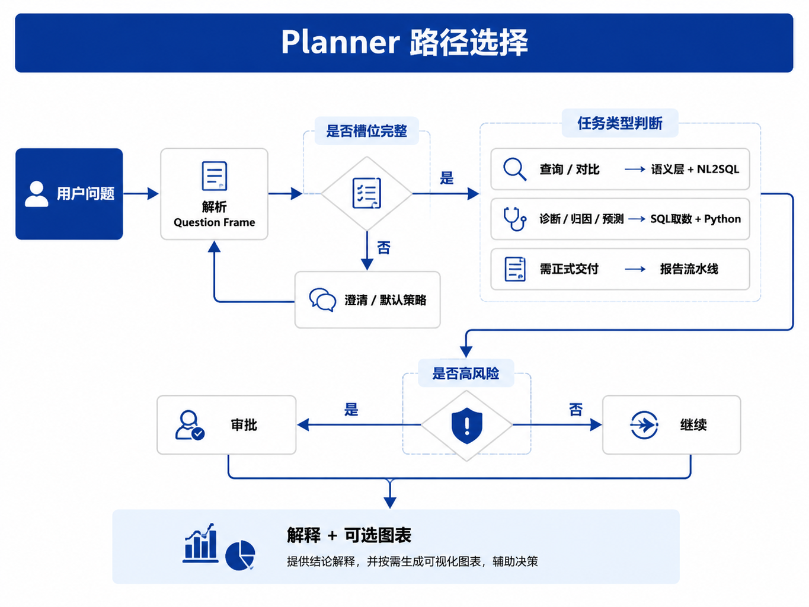

# Ch.32 DataAgent 产品形态

> **本章目标**：读者学完能用一句话区分 **DataAgent、ChatBI、BI Copilot**，说明 DataAgent 为何不能等同于 NL2SQL，归纳 **问数 / 分析 / 报告 / 任务工作台** 四种产品形态及与 Agent 平台、数据平台的边界，并对照 [Ch.04 §2.2](../part01-overview/zh/ch04.md) 列出 Part VI 六章阅读地图。  
> **关键议题**：NL2SQL → 数据任务 OS；ChatBI 对标；四种产品形态；问题理解与任务规划  
> **前置阅读**：[Ch.04 平台参考架构总览](../part01-overview/zh/ch04.md)、[Ch.25 Planner 与编排模式](../part05-agent-capabilities/ch25-planner.md)、[Ch.27 Memory 系统](../part05-agent-capabilities/ch27-memory.md)  
> **估计阅读**：约 75 min  
> **mini-platform 关联**：`agents/data_agent/` · `core/runtime/` · `core/planner/` · `infra/semantic_layer/`  
> **按角色推荐阅读**：CTO / 产品负责人 ⇒ 章头 + §1 + §2 + §5 + 本章小结 ｜ 架构师 ⇒ §1–§5 ｜ 数据智能工程师 ⇒ 全章 + 对照 Ch.04 时序图

Part V 介绍了 Agent 平台的 **执行底座**。读 Part VI 前，先弄清这些 Part V 组件各管什么（细节见对应章节，此处只列职责）：

| 组件 | 职责（白话） |
| --- | --- |
| **Runtime**（Ch.22） | 维护 Run 状态（运行中、失败、等人审批等） |
| **Registry**（Ch.23） | 注册 `sql_executor` 等 Tool，统一调用与审计 |
| **Planner**（Ch.25） | 决定下一步调哪个 Tool、写什么 SQL/Python |
| **Memory**（Ch.27） | 多轮对话里记住已确认的 Question Frame |
| **HITL**（Ch.30，Human-in-the-Loop） | 高风险结论（如对外报告）暂停 Run，等人点「通过/驳回」 |

Part V 没有单独展开：**这些底座如何组成面向业务的数据问数应用**——即本书所称 **DataAgent**。

[Ch.04 §2.2](../part01-overview/zh/ch04.md) 以运营总监的问法「上周华东区销售下滑的主要 SKU 是什么」为例，说明一次问数 Run 的链路：请求经 `POST /agents/data-agent/run` 进入 Runtime，单次 Run 中会 **调用** Gateway、向量库、语义层、OLAP 等组件（时序图共 **9 个环节**，见下表）。本书所称 **DataAgent**，指这类跑在 Agent 平台之上的 **问数与分析业务 Agent**（L4 应用层）——它不是 Gateway 或语义层本身，而是 **注册在平台上、编排上述组件完成数据任务** 的产品形态 [2]。

| 环节 | 组件（Ch.04 时序） |
| --- | --- |
| 1 | 前端接收用户输入 |
| 2 | Runtime 启动 Run |
| 3 | Observability 记录 span |
| 4 | 向量库检索表元数据 |
| 5 | Gateway + 模型生成 SQL |
| 6 | 语义层校验口径 |
| 7 | OLAP 执行查询 |
| 8 | Gateway 解读结果 / 图表指令 |
| 9 | 前端 SSE 渲染 + Obs 结束 |

*环节 5（Gateway 生成 SQL）与 6（语义层校验）在 Planner 循环内可能交错执行；表中顺序与 [Ch.04](../part01-overview/zh/ch04.md) 时序图一致，便于对照。*

许多团队仍把 DataAgent 等同于 NL2SQL。若产品边界只停在「自然语言 → SQL」，往往会重复 Ch.03 的教训：口径不一致、字段歧义、权限与审计不足，事后才补语义层与平台治理。Part VI 从本章起沿 **数据智能主线** 展开：先定产品形态与边界，再逐章介绍语义层（Ch.33）、NL2SQL（Ch.34）、Python 分析（Ch.35）、可视化与报告（Ch.36）、生态选型（Ch.37）。

本章依次介绍：DataAgent 为何不只是 NL2SQL，以及与 ChatBI、BI Copilot 的差异（§1）；四种产品形态（§2）；用户问题理解与任务规划（§3）；山岚集团经营分析主线案例（§4）；与数据平台、BI、Agent 平台的边界（§5）；产品成功标准（§6）；Part VI 模块地图与本章收束（§7）；并以本章小结收束。

---

### 为什么 DataAgent 不只是 NL2SQL

**NL2SQL**（Natural Language to SQL）指将自然语言问题翻译为 SQL 的任务。LLM 时代的综述将其生命周期概括为 **模型、数据、评测与错误分析** 四个维度 [1]。

!!! note "Spider / BIRD 是什么？"
    **Spider**、**BIRD** 是 Text-to-SQL **公开评测集**：给模型一道自然语言问句和数据库 schema，看生成的 SQL 是否正确。**Spider 1.0** 偏单轮、schema 较简；**Spider 2.0** [3] 模拟企业库（上千列、多步 workflow）。**BIRD-INTERACT** [5] 进一步要求 **多轮澄清**（该追问时是否追问）。高 benchmark 分 **不能** 替代语义层与业务 Eval——企业生产还须评口径、权限与报告证据引用（Ch.36–37、Ch.39）。

NL2SQL 是 DataAgent 的 **核心能力之一**，但不是全部。以山岚运营总监问「华东上周 GMV 多少」为例，一次 **可信** 的企业问数至少还要：

| 环节 | 若只做 NL2SQL | 生产级 DataAgent 还需 |
| --- | --- | --- |
| 理解问题 | 模型自行猜 GMV 口径 | Question Frame + 语义层消歧（Ch.33） |
| 取数 | 生成 SQL | 语义层编译 + 只读执行 + `tenant_id` 注入（Ch.34） |
| 解释 | 返回数字 | 口径脚注 + 新鲜度（Ch.33 §5） |
| 多轮 | 每轮重问 | Memory 保留已确认 Frame（Ch.27） |
| 复杂分析 | 一条 SQL 硬算 | Python 沙箱（Ch.35） |
| 正式交付 | 无 | 报告 + HITL（Ch.36、Ch.30） |

下表对比「只做 NL2SQL」与「生产级 DataAgent」的能力覆盖：

| 能力 | 只做 NL2SQL | 生产级 DataAgent |
| --- | --- | --- |
| 自然语言 → SQL | ✓ | ✓ |
| 指标口径统一 | 通常无 | 依赖语义层（Ch.33） |
| 多轮追问与上下文 | 弱 | Memory + Planner（Ch.25、Ch.27） |
| 权限与审计 | 常缺失 | Policy + Obs（Ch.38、Ch.50） |
| 复杂分析（统计/建模） | 不支持 | Text-to-Python（Ch.35） |
| 可视化与报告 | 弱 | Ch.36 + Generative UI（Ch.48） |
| 人工审批高风险结论 | 无 | HITL（Ch.30） |
| 评测与持续改进 | 仅 SQL 准确率 | Ch.36–37、Ch.39 |

固定 DAG 工作流（Ch.31 低代码 Workflow）适合 **确定性流水线**；DataAgent 默认 **ReAct / Plan-and-Execute 动态选路**（Ch.25）——**ReAct** 即 Planner **多步调用 Tool、根据 Observation 调整下一步**（如 SQL 报错后修订再执行），二者可组合——Workflow 节点通过 Registry 调用 `sql_executor`，口径仍走 Ch.33 语义层。

#### ChatBI、BI Copilot、DataAgent 的区别

业界常把「对话查数」类产品混称为 ChatBI。本书用下表区分三档，便于采购与自研决策：

| 维度 | **ChatBI** | **BI Copilot** | **DataAgent**（本书定义） |
| --- | --- | --- | --- |
| **典型形态** | 对话窗口 + NL2SQL | 嵌入 Tableau/Power BI/帆软的 Copilot 插件 | 平台托管的 **数据任务 Agent** |
| **数据范围** | 多为单库/单主题 | 当前报表/数据集上下文 | 语义层 + 多源 + 权限上下文 |
| **编排深度** | 单轮或浅多轮 | 以「改图表/改筛选」为主 | Planner 驱动多步：澄清→取数→分析→报告 |
| **平台关系** | 常是独立 SaaS 或 BI 附属功能 | BI 产品内置 | 跑在 **Agent 平台** 上，共享 Registry / Runtime / Obs |
| **扩展路径** | 难接企业审批、多 Agent | 受 BI 产品边界限制 | 可 Handoff（多 Agent 任务移交，Ch.28）到财务 Agent、HITL（Ch.30） |
| **本书定位** | DataAgent 的 **早期子集**（见术语表） | 增强型 BI 交互 [8] | Part VI **主线**，贯穿 Ch.32–37 |

**BI Copilot** 降低已有 BI 用户的学习成本，但在 **跨主题口径治理、长任务、跨系统编排** 上通常弱于平台化 DataAgent。山岚零售板块先在 Tableau 上试点 Copilot 查库存，财务板块要求 GMV 口径与 ERP 一致——Copilot 无法统一语义层，最终仍要在 Agent 平台侧落地 DataAgent。

#### 常见误区

**误区 1：Spider 1.0 / BIRD 高分等于产品成功。**  
Spider 1.0 等早期基准以 **单轮、相对简化的 schema** 为主；Spider 2.0 在 **上千列、多 dialect、多步 workflow** 场景下，前沿模型成功率仍远低于 Spider 1.0 [3]。BIRD-INTERACT 进一步要求 **多轮澄清与 Agent 式交互** [5]。企业生产还须评口径一致性、权限、报告 **证据锚定**——即每条结论能指回查询结果（Ch.36 称 **groundedness / EvidenceRef**）——高 benchmark 分不能替代语义层与 Eval 体系。

**误区 2：DataAgent = 在 Dify 里接一个 SQL 插件。**  
低代码 Workflow 可快速 demo，但若 SQL 直连物理库、绕过 Registry 与 Policy，会与 Ch.02 平台五要素冲突。Ch.31 建议：Workflow 节点 **经 Registry 代理** 调用 `sql_executor`（与直接 import 库函数相比，多一层审计与 Policy），口径仍走 Ch.33 语义层。

**误区 3：先做 Agent 界面，数据底座以后再说。**  
Ch.03 指出：缺少语义层与权限上下文的 DataAgent，往往 **回答流畅但数字不可信**。AI 原生不能替代数据治理；它只在 **数据底座可靠** 的前提下提供新的交互方式。

!!! warning "NL2SQL 是必要非充分条件"
    没有 NL2SQL 做不成问数；只有 NL2SQL 做不成 **企业级 DataAgent**。Part VI 后续章节补语义层、安全执行、分析与报告——本章先建立这一预期。

---

### 四种产品形态：问数、分析、报告、任务工作台

本书将 DataAgent 产品形态归纳为四档。它们 **不是互斥 SKU**，而是 **同一主线上的成熟度阶梯**——多数企业按 **问数 → 分析 → 报告 → 任务工作台** 逐步叠加能力（下表从左到右对应这一顺序）。

| 形态 | 用户诉求 | 典型输出 | 主要工具链 | 依赖平台能力 |
| --- | --- | --- | --- | --- |
| **问数** | 「上周华东 GMV 多少？」 | 表格 + 一句话结论 | 语义层 + NL2SQL + 安全 SQL | Ch.33–34、Registry `sql_executor` |
| **分析** | 「下滑 SKU 的品类结构有何异常？」 | 统计摘要、分布图 | SQL 取数 + Python 沙箱（Ch.35） | Planner 多步、沙箱 Policy |
| **报告** | 「给经营会一份华东下滑复盘」 | 结构化 PDF / 在线报告 | 洞察 + 图表 + 叙事（Ch.36） | Memory 口径、Generative UI（Ch.48） |
| **任务工作台** | 「每月自动生成经营简报并送审」 | 可回放 Run 链 + 审批记录 | Plan-and-Execute（Ch.25）+ HITL（Ch.30） | Runtime 检查点、Obs 回放 |

**问数** 是 **第一种产品形态**（Ch.32 §2）：先验证语义层与 NL2SQL 能否闭环，再叠分析、报告。**分析** 引入 Python，解决 SQL 表达不了的统计与临时计算。**报告** 要求 **证据引用**——每个结论能指回查询结果，避免 **报告内容缺乏数据依据**。**任务工作台** 把 DataAgent 从「问答」升级为 **数据任务 OS**（长任务编排 + 审批的工作台形态）：长任务、定时、审批、跨 Agent 协同（Ch.28 Handoff 到财务复核）。工业界 NL2SQL 亦向 **多 Agent 流水线**（上下文检索、Schema 剪枝、候选生成与校验等）演进 [4]。

山岚路径：Q1 上线 **问数**（运营总监自助查 GMV）；Q2 加 **分析**（品类结构 + 同比）；Q3 试点 **报告**（周报模板 + 人工确认）；Q4 探索 **任务工作台**（月报 Run 链 + `waiting_human`）。Part VI 各章按此顺序提供工程细节。

#### 设计取舍：先问数还是先报告？

| 方案 | 优势 | 代价 | 适用 |
| --- | --- | --- | --- |
| 先问数、后报告 | 语义层与 SQL 质量可测；失败面小 | 业务方初期感知不够直观 | 数据底座尚在治理期 ⭐ |
| 先做报告概念验证 | 决策层可见度高 | 易掩盖口径与权限问题 | 争取预算的试点（须标注风险） |
| 四形态同步建设 | 体验完整 | 工程与 Eval 成本极高 | 仅大型平台团队 |

mini-platform 模块递进：**Ch.33–34** 构成问数闭环（`infra/semantic_layer/` + `tools/sql_executor/`）；**Ch.35–36** 叠加分析与图表（`tools/python_sandbox/` + `tools/chart_renderer/`）；**Ch.28、Ch.30** 与 Part V Run 链覆盖任务工作台式 Handoff 与审批。

---

### 用户问题理解与任务规划

运营总监的原话往往会存在 **语义指代不清** 的问题：「销售怎么样？」——缺少指标（GMV 还是销量）、时间（本周还是本财年）、主体（全集团还是华东）、对比基线（同比还是环比）。若把原句直接交给 NL2SQL 模型，常见结果是 **在未澄清的情况下自行选定某一指标口径**，并给出错误但流畅的数字。

DataAgent 在生成 SQL 之前，需要 **问题理解与任务规划** 阶段——这与 **BIRD-INTERACT** 等基准强调的 **歧义澄清与多轮交互** 一致 [5]（见 §1 说明）。它与 Ch.25 通用 Planner 的分工是：**Ch.25 定义逐步编排与 Tool Call 协议**；**本节定义数据任务的槽位填充与 SQL / Python / 报告路径选择**。二者在业务 Planner（可基于 Part V 的 `MultiAgentPlanner` 扩展，支持多 Agent 协作）中合并；语义层映射见 [Ch.33](ch33.md)，SQL / Python 工具链见 Ch.34–35。

#### 走读：华东下滑原话如何变成 Question Frame

**用户输入**（Ch.04 / 本章 §4 同一案例）：

> 上周华东区销售相对前周明显下滑，主要 SKU 是哪些？和品类结构有没有关系？

Planner 解析过程（示意）：

| 步骤 | 动作 | 本例输出 |
| --- | --- | --- |
| 1 意图识别 | 判断任务类型 | `task_type: diagnose`（诊断 + 对比） |
| 2 槽位抽取 | 从原话填 Frame | 指标=GMV（口语）、主体=华东、时间=上周 vs 前周、粒度=SKU |
| 3 歧义检查 | 指标是否明确 | 「销售」→ Glossary 命中多条 Metric → 运营总监默认 `gmv_ops`（Ch.33 §4） |
| 4 路径选择 | 能否一条 SQL 完成 | 取数走 SQL；品类结构 → `path: sql_then_python` |
| 5 持久化 | 写入 Working Memory | 供「那华北呢」继承指标与时间 |

结构化 **问题帧（Question Frame）** 是 Planner 与语义层、NL2SQL 之间的契约：

| 槽位 | 说明 | 语义层映射 |
| --- | --- | --- |
| **指标** | GMV、毛利率、库存周转 | Metric 定义 + 口径版本 |
| **维度** | 区域、品类、渠道 | Dimension + 层级 |
| **时间** | 上周、YTD、2024Q4 | 时间粒度与日历 |
| **主体** | 华东区、SKU、门店 | 过滤实体 + Schema Linking |

Question Frame 写入 Working Memory（Ch.27），供多轮追问「那华北呢」时 **继承指标与时间、替换主体**。

`metrics` 槽位存的是 **Planner 从原话推断的口语 token**（本例用户说「销售」，归一为 `gmv`），**不是**语义层 `metric_id`；Ch.33 Linker 消歧后才绑定为 `gmv_ops@2025Q1`。

```yaml
# Question Frame 示例（Planner ↔ Memory 契约）
intent: diagnose
metrics: [gmv]                    # 口语 token；Linker 绑定 gmv_ops@2025Q1
dimensions:
  region: EAST
time:
  primary: last_week
  compare_to: prior_week
grain: sku
task_type: diagnose
path: sql_then_python             # sql | python | report
semantic_view: sales_ops          # 登录身份绑定的语义层 View（IAM 注入，见 Ch.50）
```

与 [Ch.27 Memory](../part05-agent-capabilities/ch27-memory.md) 检查点的对应关系（**必持久**字段须写入 `working.question_frame`，供多轮追问与 Run 恢复）：

| Question Frame 字段 | Memory / 检查点 |
| --- | --- |
| `metrics`, `dimensions`, `time` | `working.question_frame` |
| `task_type`, `path`, `intent` | `working.question_frame` |
| `grain`, `semantic_view` | `working.question_frame` |

#### 意图识别、范围界定与必要追问

| 阶段 | 输入 | 输出 | 示例 |
| --- | --- | --- | --- |
| **意图识别** | 用户自然语言 | 任务类型（初判） | 「下滑 SKU」→ 诊断类 |
| **范围界定** | 意图 + Org 上下文（Ch.27） | 待填槽位列表 | 缺 `time_range`、`region` |
| **必要追问** | 缺槽位 + 策略 | 澄清问题或默认策略 | 「您指运营 GMV 还是不含税 GMV？」 |

澄清轮数须设上限：受 Ch.22 Run 的 `max_steps` 与产品 SLA 约束。对高阶用户，可依据 **用户画像**（Ch.27 Profile）预填默认策略（如同比基线、表格展示）；对 **存在歧义的指标**，须 **向用户确认** 或 **引用语义层默认口径并在回答中明示**（Ch.33），**不得在未告知用户的情况下自行假定并出数**。

#### 任务分型与路径选择

| 任务类型 | 典型问法 | 首选路径 | 备选 |
| --- | --- | --- | --- |
| **查询** | 「上周华东 GMV」 | 语义层 + NL2SQL | — |
| **对比** | 「华东 vs 华北同比」 | NL2SQL（多列/子查询） | Python 透视 |
| **诊断** | 「为何 SKU X 下滑」 | SQL 取数 + Python 分解 | Reflexion 自改进（Ch.26，失败样本沉淀为 Playbook） |
| **归因** | 「下滑主要因价格还是量」 | Python 贡献度分析 | 预定义归因模型 |
| **预测** | 「下月 GMV 走势」 | Python 时序（须标注不确定性） | 专用预测服务 |

Planner 路径选择可概括为：



**报告路径** 通常在用户显式要求「报告 / 复盘 / 给老板」或任务工作台场景触发；日常问数走 SQL + 轻量解读（Ch.34 §6）即可，避免过度生成长报告。

#### 常见失败模式

| 失败模式 | 现象 | 缓解 |
| --- | --- | --- |
| **未经确认即出数** | 未问清口径直接返回结果 | 缺槽位时发起追问，或 **引用语义层默认 Metric 并明示 `title`** |
| **过度澄清** | 三轮对话才到 SQL | Profile 预填 + 默认策略 |
| **路径错配** | 复杂归因硬用一条 SQL 完成 | 任务分型表 + Python 分支 |
| **帧丢失** | 第二轮追问丢失同比 | Working Memory 持久 Question Frame |

---

### 山岚集团经营分析主线案例

山岚集团是本书虚构的 **零售 + 制造 + 金融 + 物流** 综合企业。Part VI 以 **经营分析** 为主线：运营总监、财务 Controller、品类经理在同一 DataAgent 上完成从 **自助问数** 到 **月度经营复盘** 的闭环。**读者按 Ch.32→37 顺序阅读，即跟随同一条 Run 链加深工程细节**。

#### 场景：华东区销售下滑

**触发**：运营总监在 Console 输入：

> 上周华东区销售相对前周明显下滑，主要 SKU 是哪些？和品类结构有没有关系？

**Run 链（逐步）**：

| 步骤 | 章节 | 做什么 | 本例关键输出 |
| --- | --- | --- | --- |
| 1 | Ch.32 §3 | 解析 Question Frame | `task_type=diagnose`, `path=sql_then_python` |
| 2 | Ch.33 | Schema Linking + 消歧 | `gmv_ops@2025Q1`, `region=EAST`, `grain=sku` |
| 3 | Ch.34 | 语义层编译 + 只读 SQL | Top SKU 宽表 → `sql_result.parquet` |
| 4 | Ch.35 | Python 品类贡献度 | `category_contrib.json` |
| 5 | Ch.36 | 图表 + 洞察 + 报告 | Vega-Lite 条形图 + EvidenceRef |
| 6 | Ch.30 | Controller 审批（报告级） | `waiting_human` → `approve` |

与 Ch.04 时序图对照：

| 时序步骤 | Part VI 章节 | 平台组件 |
| --- | --- | --- |
| 用户输入 | Ch.32 §3 | 前端 · Runtime |
| 向量检索表元数据 | Ch.33 Schema Linking | 向量库 · Ch.18 |
| 语义层校验口径 | Ch.33 | `infra/semantic_layer/` |
| LLM 生成 SQL | Ch.34 | Planner · Gateway |
| 执行与解释 | Ch.34–36 | Registry · OLAP |
| 图表与 SSE | Ch.36 · Ch.48 | Generative UI |
| Trace 与 Eval | Ch.36–37 · Ch.39 | Obs · Eval |

Ch.32 不要求实现细节，只建立 **地图**；工程路径自 [Ch.33](ch33.md) 语义层与 Linking 起逐章展开。

#### 问数成功时的 SSE 事件（示意）

以下 **`state` / `action` / `result`** 与 [Ch.22](../part05-agent-capabilities/ch22-agent-runtime.md) Run 进度事件一致（`multi-agent-workflow` Demo 可对照）。DataAgent 问数可在 `result` 之后由 Gateway 推送业务文案或 `artifact` 扩展事件；**不要**与 Ch.22 平台事件混用 `run_started`、`message_delta` 等前端展示层命名。

用户提交华东下滑问题后，前端经 SSE 可能依次收到：

```text
event: state
data: {"run_id":"run-8f3a","state":"running"}

event: action
data: {"tool":"sql_executor","step":2}

event: result
data: {"tool":"sql_executor","status":"ok","artifact_id":"sql_result","rows":10}

event: state
data: {"run_id":"run-8f3a","state":"succeeded"}
```

用户可见回复（可由 Gateway 在终态前推送）：「华东运营 GMV 较前周下降 12.3%（运营 GMV · `gmv_ops@2025Q1`）。数据截至 2025-06-14 06:00 同步。」

报告级交付在 [Ch.36](ch36.md) 进入 `waiting_human`。

---

### DataAgent 与数据平台、BI、Agent 平台的边界

DataAgent 位于 **L4 业务应用层**（Ch.04），向下依赖 L3 Agent 核心与 L2 数据层：


#### 与 Agent 平台的边界（Ch.02 再述）

| 能力 | 归属 | 说明 |
| --- | --- | --- |
| Run 六态、检查点、SSE | **Agent 平台** | DataAgent 是 Runtime 上的一种 Agent |
| `sql_executor` / `python_sandbox` 注册 | **Agent 平台** Registry | 多 Agent 可复用 |
| Question Frame 解析、报告模板 | **DataAgent 应用** | 经营分析专属 |
| Schema Linking 提示与消歧策略 | **DataAgent 应用** | 算法可插件化，但业务词表属应用 |
| 语义层指标定义 | **数据平台** | Cube / MetricFlow（Ch.15、Ch.33） |
| 表级 ACL、脱敏 | **数据平台 + Policy** | Ch.34、Ch.50 |

规则与 Ch.02 一致：**多 Agent 共享的能力上收平台；只服务经营分析场景的留 DataAgent 应用**。灰色地带（如 Prompt 模板）由架构委员会按季度裁定。

#### 与传统 BI 的边界

| 维度 | 传统 BI | DataAgent |
| --- | --- | --- |
| 交互 | 拖拽、固定报表 | 自然语言 + 动态规划 |
| 口径 | 语义层/数据集（人工建模） | **同一语义层**，Agent 消费 |
| 受众 | 分析师为主 | 业务人员自助 + 分析师复核 |
| 关系 | 并存 | DataAgent **不替代** BI 建模；可 **引用** BI 数据集或通过语义层对齐 |

山岚策略：**财务正式报表仍走 BI 固化看板**；DataAgent 负责 **探索性问数与初稿报告**，经 HITL 确认后可导出 BI 数据集。

#### 与数据平台的边界

数据平台（Part III）提供湖仓、OLAP、元数据、质量、**语义层定义**。开源语义层（如 Cube）将指标、维度与访问策略 **集中建模**，供 BI 工具与 AI Agent 经统一 API 消费 [6]。DataAgent **不重复建设** 这些能力，而是：

- 通过 **语义层 API** 解析指标与维度（Ch.33）；
- 通过 **Registry 工具** 执行受控 SQL / Python（Ch.34–35）；
- 通过 **Metadata** 展示血缘与新鲜度提示（Ch.33 §5）。

若语义层缺失，DataAgent 不应 **长期直连 ODS 物理表**——Ch.03 已说明这是技术债。

---

### 产品成功标准

产品成功 **不能** 只看 NL2SQL 准确率。本书从 **可信、可用、可治理** 三维给出可度量标准：

| 维度 | 指标示例 | 目标方向 |
| --- | --- | --- |
| **可信** | 口径一致性、证据引用率、拒答准确率 | 错答宁可少说 |
| **可用** | 首问解决率、多轮完成率、P95 延迟 | 业务愿反复用 |
| **可治理** | 审计覆盖率、HITL 采纳率、权限违规次数 | 监管可回放 |

#### 分角色成功标准

| 角色 | 关心什么 | 「成功」的可观察信号 |
| --- | --- | --- |
| **CTO / 平台负责人** | 复用与成本 | 多 Agent 共用 Registry / Gateway；单 Run 成本可核算（Ch.41） |
| **数据负责人** | 口径与质量 | 100% 查询走语义层；血缘可追溯（Ch.15） |
| **业务用户** | 速度与信任 | 多数问数无需人工改 SQL（须按企业基线校准）；结论带数据来源与 `metric_id@version` |
| **合规 / 内审** | 权限与记录 | 任意回答可还原 Run + SQL + 审批链（Ch.38） |

#### 设计取舍：准确优先还是覆盖优先？

| 方案 | 优势 | 代价 | mini-platform 选择 |
| --- | --- | --- | --- |
| **准确优先** | 信任高、合规友好 | 拒答多、首问解决率下降 | ⭐ 默认：缺槽位澄清 |
| **覆盖优先** | 概念验证阶段观感好 | 口径偏差、审计风险 | 仅试点，须标注风险 |
| **人机协同** | 平衡信任与效率 | 需 HITL 产品化 | 月报、对外报告场景 |

#### 设计取舍：单 Agent 还是多 Agent？

| 方案 | 优势 | 代价 | 适用 |
| --- | --- | --- | --- |
| 单 Agent 承担全部能力 | 部署简单 | Prompt 与工具膨胀 | 先做问数时 |
| Router + 专 Agent（Ch.28） | 口径隔离、可 Handoff | 编排复杂 | 经营 + 财务双域 ⭐ |

山岚 **先做问数** 时用 **单 Agent**；进入 **任务工作台** 阶段后再拆 **运营 DataAgent + 财务 Reviewer Agent**（Part V [Ch.28 Handoff](../part05-agent-capabilities/ch28-agent.md) 与 `projects/multi-agent-workflow/` 覆盖 Handoff 机制，Ch.34 起接入 `sql_executor`）。

---

### Part VI 模块地图与本章收束

!!! note "目录说明"
    下表 **Part VI** 路径（`agents/data_agent/`、`tools/sql_executor/` 等）为 **书中目标契约**，随 Part VI 工程迭代合入。**Part V** 模块（`core/runtime/`、`core/registry/` 等）与 `mini-platform/projects/multi-agent-workflow/` **已在仓库中存在**。

以下路径为 mini-platform 中 DataAgent 相关 **模块布局**；接口与 Tool 契约随 Ch.33–36 各章展开。DataAgent **不复制** Runtime：经 `/run` 启动 Run，Planner 调用 Registry 工具——与 Ch.25 `MultiAgentPlanner` 一致。Run 六态、Registry、HITL 等平台契约见 Part V（[Ch.22–30](../part05-agent-capabilities/ch22-agent-runtime.md)；对照 `mini-platform/projects/multi-agent-workflow/README.md`）。

#### 7.1 DataAgent 模块地图

| 路径 | 职责 | 对应章节 |
| --- | --- | --- |
| `agents/data_agent/` | AgentSpec、Question Frame、Linker | Ch.32–33 |
| `infra/semantic_layer/` | 指标、View、口径解析 | Ch.33 |
| `tools/sql_executor/` | 只读 SQL、校验与执行 | Ch.34 |
| `tools/python_sandbox/` | 分析沙箱 | Ch.35 |
| `tools/chart_renderer/` | 图表 spec | Ch.36 |
| `agents/data_agent/templates/` | 报告模板 | Ch.36 |

企业级 Policy（行级权限、脱敏）与平台 Eval 流水线分别见 **Ch.50**（`core/policy/`）、**Ch.39**（`core/eval/`）。

#### 7.2 生产化 checklist（产品形态层）

- [ ] 是否定义当前目标形态（问数 / 分析 / 报告 / 工作台）？
- [ ] 是否承诺长期 **不直连物理表**（语义层 Ch.33）？
- [ ] Question Frame 是否进入 Memory 与检查点（Ch.27）？
- [ ] 成功标准是否含 **可信 + 可用 + 可治理**（§6），而非仅 SQL EM？

#### 7.3 实务注意

1. **跳过 Part V 平台契约，直接编写 NL2SQL 原型。**  
   无 Registry / HITL / Trace，后期补治理成本翻倍。应先理解 Part V Run 链与 Registry 集成，再按 Ch.33→34 实现语义层与 `sql_executor`。

2. **Question Frame 只写在 Prompt，未写入 Memory。**  
   多轮「那华北呢」会丢失同比。应将 Frame 结构化并写入检查点（Ch.27）。

3. **只关注 SQL EM，忽视业务可用性。**  
   缺少澄清、报告与审批环节。应按 §6 三维成功标准，并引入 Ch.36 输出 Eval。

4. **Gateway 超时或语义层不可用，仍向用户返回结果。**  
   Gateway 超时应使 Run 进入 `failed` 并提示重试；语义层不可用时应拒答或转 HITL，**不得**降级为直连物理表（Ch.33）。

---

## 本章小结

### 关键结论

1. **DataAgent ≠ NL2SQL**：NL2SQL 是问数核心能力；生产级还需语义层、安全执行、分析、报告、HITL 与 Eval。  
2. **ChatBI 是 DataAgent 的早期子集**：BI Copilot 增强 BI 交互；平台化 DataAgent 共享 Runtime / Registry / Obs，可演进为 **数据任务 OS**。  
3. **四种形态**（问数 → 分析 → 报告 → 任务工作台）是成熟度阶梯；山岚华东下滑案例贯穿 Part VI 六章。  
4. **问题理解与任务规划** 必须在 SQL 之前：Question Frame、任务分型、路径选择；与 Ch.25 Planner 分工明确。  
5. **边界清晰**：语义层归数据平台，执行治理归 Agent 平台，Question Frame / 报告模板归 DataAgent 应用。

### 上线检查清单

- [ ] 能否用一句话区分 DataAgent、ChatBI、BI Copilot？  
- [ ] 是否定义了当前阶段的目标形态（问数 / 分析 / 报告 / 工作台）？  
- [ ] 是否承诺 **不长期直连物理表**？  
- [ ] Question Frame 是否进入 Memory 与检查点？  
- [ ] 成功标准是否包含 **可信 + 可用 + 可治理**，而非仅 SQL EM？

### 本书延伸阅读

- [Ch.04 平台参考架构总览](../part01-overview/zh/ch04.md) — DataAgent 端到端时序  
- [Ch.03 AI 原生业务系统](../part01-overview/zh/ch03-ai-agent.md) — 数据底座护城河  
- [Ch.25 Planner](../part05-agent-capabilities/ch25-planner.md) · [Ch.27 Memory](../part05-agent-capabilities/ch27-memory.md)  
- [Ch.33 语义层工程](ch33.md) · [Ch.34 NL2SQL 工程化](ch34-nl2sql.md)  
- [Ch.37 DataAgent 对标与生态](ch37-dataagent.md)  
- `mini-platform/projects/multi-agent-workflow/README.md` — Part V Run 底座  
- [附录 B 术语表](../appendix/appendix-b.md) — DataAgent、ChatBI、NL2SQL、Semantic Layer

---

## 参考文献

[1] Liu, X., Shen, S., Li, B., Ma, P., Jiang, R., Zhang, Y., Fan, J., Li, G., Tang, N., & Luo, Y. (2025). A survey of Text-to-SQL in the era of LLMs: Where are we, and where are we going? *IEEE Transactions on Knowledge and Data Engineering*, 37(10), 5735–5754. [https://doi.org/10.1109/TKDE.2025.3592032](https://doi.org/10.1109/TKDE.2025.3592032)（预印本：arXiv:2408.05109；手册：[NL2SQL Handbook](https://github.com/HKUSTDial/NL2SQL_Handbook)）

[2] Tang, Z., Wang, W., Zhou, Z., Jiao, Y., Xu, B., Niu, B., Zhou, X., Li, G., He, Y., Zhou, W., et al. (2025). LLM/Agent-as-Data-Analyst: A survey. arXiv:2509.23988. [https://arxiv.org/abs/2509.23988](https://arxiv.org/abs/2509.23988)

[3] Lei, F., Chen, J., Ye, Y., Cao, R., Shin, D., Su, H., Suo, Z., Gao, H., Hu, W., Yin, P., Zhong, V., Xiong, C., Sun, R., Liu, Q., Wang, S., & Yu, T. (2024). Spider 2.0: Evaluating language models on real-world enterprise text-to-SQL workflows. *ICLR 2025*. arXiv:2411.07763. [https://arxiv.org/abs/2411.07763](https://arxiv.org/abs/2411.07763)

[4] Talaei, S., Pourreza, M., Chang, Y.-C., Mirhoseini, A., & Saberi, A. (2024). CHESS: Contextual harnessing for efficient SQL synthesis. arXiv:2405.16755. [https://arxiv.org/abs/2405.16755](https://arxiv.org/abs/2405.16755)

[5] Huo, N., Xu, X., Li, J., Jacobsson, P., Lin, S., Qin, B., Hui, B., Li, X., Qu, G., Si, S., Han, L., Alexander, E., Zhu, X., Qin, R., Yu, R., Jin, Y., Zhou, F., Zhong, W., Chen, Y., Liu, H., Ma, C., Ozcan, F., Papakonstantinou, Y., & Cheng, R. (2026). BIRD-INTERACT: Re-imagining Text-to-SQL evaluation via lens of dynamic interactions. *ICLR 2026*. arXiv:2510.05318. [https://arxiv.org/abs/2510.05318](https://arxiv.org/abs/2510.05318)

[6] Cube. (2025). *Introduction — Cube semantic layer*. Cube Documentation. [https://cube.dev/docs/product/introduction](https://cube.dev/docs/product/introduction)

[7] Pourreza, M., & Rafiei, D. (2023). DIN-SQL: Decomposed in-context learning of text-to-SQL with self-correction. *NeurIPS*. arXiv:2304.11015. [https://arxiv.org/abs/2304.11015](https://arxiv.org/abs/2304.11015)（分解式 in-context 与自校正；Ch.34 展开）

[8] Microsoft. (2024). *Copilot in Power BI*. Microsoft Learn. [https://learn.microsoft.com/en-us/power-bi/create-reports/copilot-introduction](https://learn.microsoft.com/en-us/power-bi/create-reports/copilot-introduction)

[9] Yao, S., Zhao, J., Yu, D., Du, N., Sha, N., Narasimhan, K., & Cao, Y. (2023). ReAct: Synergizing reasoning and acting in language models. *ICLR*. arXiv:2210.03629. [https://arxiv.org/abs/2210.03629](https://arxiv.org/abs/2210.03629)（Planner 逐步编排基础；Ch.25 详述）
