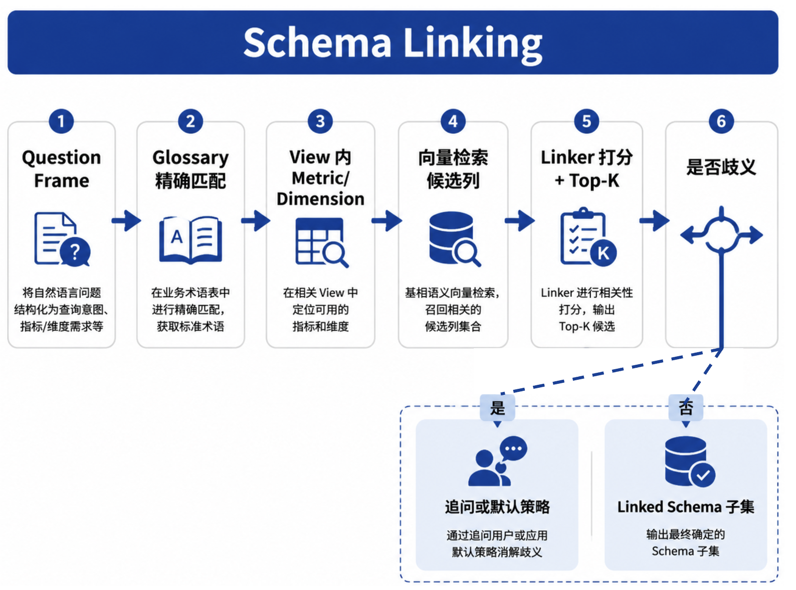
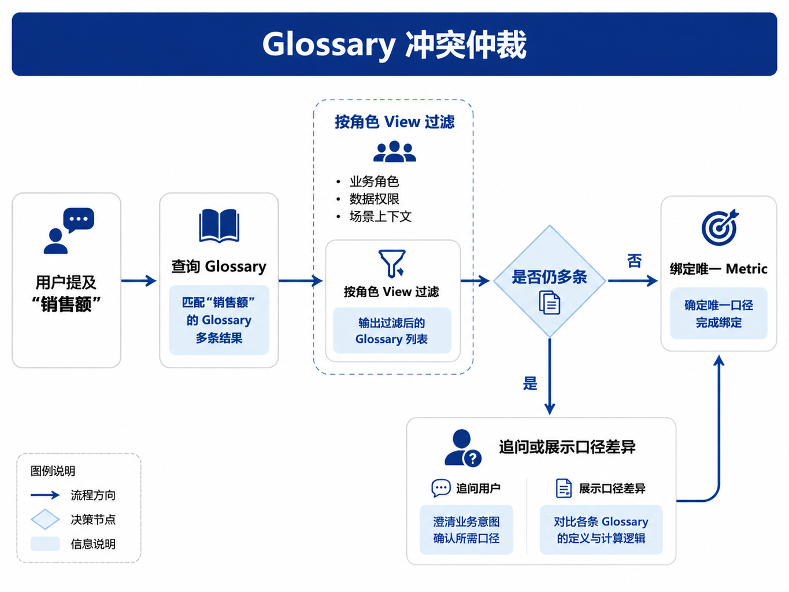

# Ch.33 语义层工程

> **本章目标**：读者学完能说明 **语义层** 在 DataAgent 中的职责边界，设计指标/维度/业务术语与口径版本策略，描述 Schema Linking 与消歧流程，并将权限、血缘、质量与新鲜度纳入 **可信上下文**，对照山岚指标体系样例与 `infra/semantic_layer/` 模块。  
> **关键议题**：指标口径、维度关系、Schema Linking、消歧、可信上下文  
> **前置阅读**：[Ch.32 DataAgent 产品形态](ch32-dataagent.md)、[Ch.15 元数据与指标](../part03-data-infra/ch15.md)（建设侧，撰写中）、[Ch.18 向量数据库](../part04-vector-knowledge/ch18.md)、[Ch.27 Memory](../part05-agent-capabilities/ch27-memory.md)  
> **估计阅读**：约 80 min  
> **mini-platform 关联**：`infra/semantic_layer/` · `infra/metadata/` · `agents/data_agent/linker.py`  
> **按角色推荐阅读**：数据负责人 ⇒ §1–§4 + 山岚样例 ｜ 架构师 ⇒ 全章 ｜ 工程师 ⇒ §3–§7 + Cube/MetricFlow 文档

!!! note "Ch.15 建设侧章节（撰写中）"
    [Ch.15 元数据与指标](../part03-data-infra/ch15.md) 从 **数据平台** 视角介绍 Cube、MetricFlow 等的建设与发布流程，**当前为占位章节**。本章从 **DataAgent 消费侧** 展开；数据平台交付物最低要求见 §2「建设侧最小清单」。

[Ch.32](ch32-dataagent.md) 指出：DataAgent 不能长期 **直连 ODS 物理表**；指标口径须由 **语义层** 统一定义。Ch.04 时序图中，Runtime 在生成 SQL 前会 **调用语义层校验口径**——若缺少这一环，NL2SQL 语法再正确，也可能 **答错业务问题**（例如把运营 GMV 当成财务 GMV）。

Part III [Ch.15](../part03-data-infra/ch15.md) 从 **数据平台** 视角介绍 Cube、MetricFlow、Feast 等如何 **建设** 语义层；**本章** 从 **DataAgent 消费** 视角展开：Planner 如何把用户口语映射到标准 Metric、Schema Linking 如何在数百张表中剪枝、以及如何把血缘/质量/新鲜度作为 **可信上下文** 注入 Run。全书以 [Ch.32 §4 华东下滑案例](ch32-dataagent.md) 为主线贯穿本章各节。

本章依次介绍：语义层为何是 DataAgent 地基（§1）；指标、维度与业务术语（§2）；Schema Linking 与消歧（§3）；指标冲突、版本与适用范围（§4）；权限、血缘、质量与新鲜度（§5）；山岚指标体系样例（§6）；并以 **mini-platform 工程路径：语义层与 Linking** 收束（§7）。

---

### 语义层为什么是 DataAgent 地基

**语义层（Semantic Layer）** 是在物理表之上、面向业务的 **指标与维度抽象**——集中定义 Measure、Dimension、Join 路径与访问策略，经 SQL/REST/GraphQL 等 API 对外暴露 [1][2]。

以山岚零售板块为例：物理层有 `orders_fact`、`returns_fact`、`promo_adjustments` 等多张表；业务方只说「上周华东 GMV」。若没有语义层，NL2SQL 模型每次都要自己猜 **用哪张表、是否含税、是否扣退货、如何 Join 区域维**——三类问题 Prompt 无法稳定替代：

| 问题 | 无语义层时的表现 | 语义层提供的答案 |
| --- | --- | --- |
| **口径** | 「销售额」含税/不含税、是否含退货各说各话 | 标准 Metric `gmv_tax_excluded` / `gmv_ops` + `title` 文档 |
| **Join** | 模型自行推断 JOIN，产生笛卡尔积或丢行 | 预建模 `orders` ↔ `regions` 路径 |
| **权限** | 同一 SQL 模板越权看 PII | 行级/列级策略在语义层 View 内强制执行 [1] |

LLM 时代 NL2SQL 综述将 **自然语言与 schema 的对齐** 列为模型侧核心挑战 [3]；**Spider 2.0** [4] 等公开评测表明，在 **上千列、多 dialect** 的企业库上，仅靠把全库 DDL 塞进模型上下文无法稳定生产（Spider 含义见 [Ch.32 §1](ch32-dataagent.md)）。语义层把 **业务稳定、物理易变** 的部分沉淀在数据平台；DataAgent 的 Planner 主要做 **Question Frame → Metric/Dimension 映射**，而不是每次从物理表重新推断 Join 路径。

#### 与相邻概念的边界

| 概念 | 语义层做什么 | 不做什么 |
| --- | --- | --- |
| **Ch.15 数据平台** | 建设、发布、治理 Metric 模型 | 不驱动 Run 六态 |
| **Ch.27 Memory** | 提供 **权威口径定义**（经 API 读取） | 不存用户「偏好同比」类 Profile；**不** 用 Memory 替代 Metric 数学定义 |
| **Ch.34 NL2SQL** | 输出 **Semantic SQL** 或物理 SQL | 不定义 GMV 是否含税 |
| **Ch.18 向量库** | Schema Linking 检索 **候选** 表/列 | 不替代 Metric 定义 |

!!! warning "Memory 不能替代语义层"
    Memory 可记录用户 **已确认的** 时间范围与展示偏好；**指标数学定义** 必须来自语义层版本，否则跨会话仍会口径漂移。

#### 常见误区

**误区 1：语义层 = 给表写中文 COMMENT。**  
COMMENT 缺少 Join 图、聚合逻辑与版本治理；DataAgent 需要的是 **可执行 Metric**，不是注释。

**误区 2：每个 Agent 自建 YAML 口径。**  
与 Ch.02「多 Agent 共享能力上收平台」冲突；ChatBI 插件各维护一套 GMV 定义是典型反模式。

**误区 3：语义层建好就一劳永逸。**  
组织合并、会计政策变更须 **版本化** Metric（§4）；否则 Agent 会用旧定义答新问题。

---

### 指标、维度、业务术语与口径

语义层模型由 **Measure、Dimension、Hierarchy、View、Business Glossary** 等对象组成；DataAgent 通过 Question Frame 与 Linker 引用它们，而不是直接引用物理列名。

#### 核心对象

| 对象 | 定义 | DataAgent 用法 |
| --- | --- | --- |
| **Measure（指标）** | 可聚合度量，如 `sum(amount_ex_tax)` | Question Frame 的「指标」槽位 |
| **Dimension（维度）** | 切片属性，如 `region_code`, `sku` | 过滤、分组、下钻 |
| **Hierarchy** | 维度层级，如 国家→大区→门店 | 「华东」展开为 `region_code = 'EAST'` 及下属门店 |
| **View** | 面向角色的指标/维度子集 [1] | 限制 Linker 与 Planner 可见范围 |
| **Business Glossary** | 业务术语 ↔ Metric 映射 | 「营业额」「GMV」→ 候选 Metric 列表（可能多条） |

Cube、MetricFlow 等开源实现将上述对象编码为 **数据模型文件**（YAML/JS），编译为 **Semantic SQL** 或带 `MEASURE()` 扩展的 SQL API [1][2]。

#### 口径文档要素

每个 Metric 发布时，数据平台应至少提供以下字段——DataAgent 在 Linking、回答脚注与 Trace 中引用：

| 字段 | 示例 | 用途 |
| --- | --- | --- |
| `name` | `gmv_tax_excluded` | 程序 ID |
| `title` | 不含税 GMV | UI / Agent 展示（回答中须可见） |
| `definition` | `sum(order_amount_ex_tax)` | 审计与 Eval |
| `owner` | 财务数据组 | 变更审批 |
| `version` | `2025Q1` | 与 Ch.34 SQL 审计关联；完整记法 `gmv_tax_excluded@2025Q1` |
| `filters` | 排除内部订单 | 语义层编译时注入的默认 WHERE |

#### Planner 该看见多少语义层信息？

山岚数据仓约有 **400 张物理表**。若把全部 `CREATE TABLE`（DDL）塞进 Planner 调模型时的 prompt，单次请求可能超过上下文上限（Ch.27），也会把模型带向无关表（如 `finance_ledger`）。

DataAgent 采用 **分层裁剪**：prompt 里只放 **本轮决策所需的最小摘要**；Metric 的权威定义仍在 `infra/semantic_layer/` API，Memory 存 Question Frame 与已确认口径，**不** 替代语义层。

**第一层：角色 View 摘要（固定、较短）**

用户登录时 IAM 绑定 View。运营总监绑定 `sales_ops`，Planner 始终可见该 View 的成员清单，例如：

```yaml
# 注入 Planner 的 View 摘要（示意，非完整模型文件）
view: sales_ops
role: ops_director
metrics:
  - gmv_tax_excluded   # 不含税 GMV（财务口径，运营 View 内只读引用）
  - gmv_ops            # 运营 GMV（含促销口径）
  - order_count
dimensions: [region_code, category, sku, week, channel]
```

**第二层：本问候选 Metric（Linking 之后、随 Question Frame 变化）**

用户问「上周华东 GMV 下滑 Top SKU」时，Linker 已把口语「GMV」收窄为具体 Metric。若 Glossary 仍歧义，走 §4 追问，**不** 把两个 GMV 都当作默认。Planner prompt **额外** 附带本问选定 Metric 的 `title`、`version` 与 `default_filters`：

```json
{
  "candidate_metrics": [{
    "metric_id": "gmv_ops",
    "title": "运营 GMV",
    "version": "2025Q1",
    "default_filters": ["include_promo_adjustments", "partial_return_netting"]
  }]
}
```

**不注入的内容**：全库 DDL、未选中的 Metric 完整定义、其他角色 View 的成员、物理表 Join 细节（由 `compile_query()` 在 Ch.34 前完成）。

#### 设计取舍：Cube vs MetricFlow vs 自研 YAML

**Cube** [1] 与 **MetricFlow**（dbt 语义层 [2]）是两类常见的 **开源语义层产品**——把 Metric、Dimension、View 写成 YAML/JS，经 API 编译为 SQL。DataAgent 不绑定某一产品，但 mini-platform 采用 **Cube 协议兼容客户端**，便于读者对照文档与社区示例。

| 方案 | 优势 | 代价 | 适用 |
| --- | --- | --- | --- |
| **Cube** | 成熟 API、Agent 文档完善 [1] | 学习曲线 | 已有 Cube 的团队 ⭐ |
| **MetricFlow / dbt Semantic Layer** | 与 dbt 血缘一体 [2] | 与 dbt 技术栈绑定 | dbt 中心化企业 |
| **自研 YAML + 轻量 API** | 完全可控 | 维护成本高 | 团队极小、语义层刚起步 |

mini-platform 在 `infra/semantic_layer/` 采用 **Cube 协议兼容客户端**，与 Ch.33–34 问数闭环衔接。

#### 建设侧最小清单（数据平台交付）

数据平台团队至少应交付：**Metric 定义与版本**、**View 按角色划分**、**Join 图**、**Glossary**、**发布/审批流程**。DataAgent 消费侧只依赖上述产物的 **稳定 API**，不替代建设流程。

---

### 模式链接（Schema Linking）与字段消歧

**模式链接（Schema Linking）** 将 Question Frame 中的口语槽位 **链接** 到语义层 Metric、Dimension 及物理 schema 元素 [3]。企业库常有 **数百表、上千列**——不能整库 DDL 塞进 prompt（§2 已述）。DataAgent 的 Linking 在 **Glossary → View → 向量检索** 三阶段完成；这与 NL2SQL 论文里 **「先缩小 schema 再写 SQL」** 的思路一致（如 CHESS 的 Schema 选择步骤 [5]，详见 [Ch.34 §2](ch34-nl2sql.md)）。



#### 走读：Ch.32「华东下滑 Top SKU」如何完成 Linking

以下沿用 [Ch.32 §4](ch32-dataagent.md) 运营总监原话：「上周华东区销售相对前周明显下滑，主要 SKU 是哪些？」Planner 已解析出 Question Frame：

```yaml
# Question Frame（Planner ↔ Memory 契约，Ch.32 §3）
metrics: [gmv]                    # 口语，尚未绑定 metric_id
subject: { region: 华东 }
time: { grain: week, range: last_week, compare: prior_week }
group_by: [sku]
task_type: diagnose
semantic_view: sales_ops          # 登录身份绑定的 View（IAM，Ch.50）
```

Linker 逐步处理：

| 步骤 | 组件 | 山岚本例 | 输出 |
| --- | --- | --- | --- |
| 1 | Glossary | 「销售」「GMV」→ 命中 2 条 Metric | `gmv_tax_excluded`, `gmv_ops` |
| 2 | View 过滤 | 两条均在 `sales_ops` 内 | 仍 2 条 → **歧义** |
| 3 | 消歧（§4） | 运营总监 + 诊断场景 → 选用 `gmv_ops`，**回答须写 `title`** | `gmv_ops@2025Q1` |
| 4 | Hierarchy | 「华东」→ `region_code = 'EAST'` | filter 就绪 |
| 5 | 向量检索（Ch.18） | 在 **View 允许范围内** 确认 `sku` 维 | `orders.sku_id` |
| 6 | 输出 | 交给 Ch.34 `compile_query()` | Linked Schema 子集 |

若步骤 3 两条 Metric 得分接近且 **无** 角色默认，Runtime 进入 **ASK**（Ch.32 §3），**不** 在未澄清时生成 SQL。

Linker 最终输出（示意）：

```json
{
  "metrics": [{"metric_id": "gmv_ops", "version": "2025Q1", "title": "运营 GMV"}],
  "dimensions": ["region_code", "sku"],
  "filters": [{"field": "region_code", "op": "eq", "value": "EAST"}],
  "time_range": {"start": "2025-06-09", "end": "2025-06-15", "grain": "week"},
  "view": "sales_ops",
  "linked_tables": ["analytics.orders_fact"]
}
```

#### Linking 信号来源

| 信号 | 权重 | 说明 |
| --- | --- | --- |
| 业务术语表 | 高 | 「营业额」→ 候选 Metric 列表（可能多条） |
| 语义层 View | 高 | 只允许 View 内成员；跨 View 混 Join 禁止 |
| 列名/Comment 向量相似度 | 中 | 在 **View 允许范围内** 召回候选列 |
| 历史 Run 成功 SQL | 中 | **情景记忆（Episodic Memory，Ch.27）** 中的历史 SQL 片段；**须校验 `metric_version` 与当前 Frame 一致** |
| 模型未经约束的推断 | 低（需校验） | 须过 `sql_executor` Schema 校验（Ch.34） |

!!! warning "历史 SQL 与 Metric 版本"
    Linking 引用 **情景记忆（Episodic Memory）** 中的历史 SQL 时，必须校验 **与当前 Question Frame 的 Metric 版本一致**，否则可能链接到已废弃列或旧口径。

#### 消歧策略

| 策略 | 何时使用 | 风险 |
| --- | --- | --- |
| **追问** | 两个 Metric 得分接近 | 增加轮次 |
| **角色默认** | 财务 Controller vs 运营总监 View 不同 | 须审计默认来源 |
| **语义层默认 Metric** | 集团标准口径已发布 | 用户可能不知用的是默认 |
| **拒答** | 无法安全链接 | 体验下降但可信 |

山岚规则：**GMV 存在歧义时，须在回答中显式写出语义层 `title` 字段**（如「运营 GMV」），**不得**未经说明即选用另一口径。

#### 失败模式

| 失败模式 | 现象 | 缓解 |
| --- | --- | --- |
| **Link 到废弃列** | 元数据未同步 | 与 DataHub 等元数据服务同步列状态 [Ch.15] |
| **跨 View 混 Join** | SQL 合法但口径错 | Linker 限制：**只允许同一 View 内的表与 Join** |
| **向量召回噪声** | 链接到同名不同义列 | Rerank + 术语表优先 |

---

### 指标冲突、版本与适用范围

§2–§3 解决的是「用户说的词，对应语义层里的哪一个字段、哪一个 Metric」。本节解决 **第二个问题**：即便词对上了，**企业里往往不止一个合法口径**——DataAgent 必须知道 **用的是哪一个、何时生效、对谁有效**，并在有歧义时 **问清楚或写清楚**，而不是替用户做决定。

#### 为什么同一句话会对应多个 Metric？

在山岚集团，运营总监说「上周 GMV 多少」，Glossary 至少可能命中两条定义：

| 用户口语 | 可能对应的 Metric | 差异 |
| --- | --- | --- |
| GMV、销售额 | `gmv_tax_excluded`（财务） | 不含税、不含退货 |
| GMV、营业额 | `gmv_ops`（运营） | 含促销口径、含部分退单调整 |

若 DataAgent 不处理这种 **指标冲突**，就会出现：SQL 语法正确、数字也能算出来，但 **答的不是用户心里那一套口径**——比 Link 错误更隐蔽，也更难在事后解释。

除「财务 vs 运营」外，常见冲突还包括：

- **组织变更**：「华东」在旧组织树与新区域划分中对应不同 `region_code` 集合；
- **集团 vs 子公司**：全球统一 Metric 与本地化 Metric 并存；
- **口径升级**：2024 年与 2025 年 GMV 定义调整，历史对比须标明版本。

#### 版本与适用范围：Agent 必须携带的两类元数据

语义层对每个 Metric 不只给一个 ID，还要回答 **「这是哪一版、谁能用」**。DataAgent 在 Run 中应持久化并在回答里体现：

| 概念 | 含义 | 山岚示例 |
| --- | --- | --- |
| **`metric_id`** | 指标唯一标识 | `gmv_ops` |
| **`version`** | 口径定义版本 | `2025Q1`（完整记法：`gmv_ops@2025Q1`） |
| **生效时间** | 版本适用的会计/业务期间 | `valid_from` / `valid_to` 对齐财季 |
| **适用范围** | 租户、事业部、国家等边界 | `tenant_id=shanlan-retail`；财务 View 仅 Controller 可见 |
| **兼容映射** | 新旧版本换算关系 | 旧版 GMV × 系数 → 新版（须文档化，禁止 Agent 心算） |

**版本** 解决「同一 Metric 随时间演变」；**适用范围** 解决「同一 Metric 在不同角色/区域下是否可见、是否同一套 filters」。二者写入 Trace（Ch.38），用户追问「你刚才用的哪个 GMV」时才能回放。

#### 冲突时怎么办：先收窄，再追问

当 Glossary 中「销售额」命中多条 Metric 时，DataAgent 按以下顺序仲裁（与 §3 消歧策略衔接）：

1. **按角色 View 过滤**：Controller 默认走 **财务 View** `finance_control`，运营总监默认走 **运营 View** `sales_ops`（登录时 IAM 注入 `semantic_view`，Ch.50）；
2. **若仍有多条**：向用户 **展示口径差异** 并追问（如「您指不含税 GMV 还是运营 GMV？」），或引用 **语义层已发布的默认 Metric** 并在回答中 **明示** `title` 字段；
3. **禁止**：未经说明即选用其中一条——这与 Ch.32 §3「未经确认即出数」同属一类失败。



**山岚落地规则**：GMV 存在歧义时，回答须写出语义层 `title`（如「运营 GMV」）；Run 审计须含 `metric_id@version`，便于与财务正式报表对账。

#### 设计取舍：企业是强制单一口径，还是允许多口径并存？

| 方案 | 优势 | 代价 | 适用 |
| --- | --- | --- | --- |
| **强制单一口径** | 全公司数字一致 | 业务方抵触，推行难 | 口径治理初期、强监管行业 |
| **多 Metric 并存 + 显式选择** | 尊重财务/运营差异 | 对话与 UI 更复杂 | 山岚等成熟企业 ⭐ |
| **后台统一、前台别名** | 用户感知简单 | 易隐藏口径差异 | 仅短期试点，长期风险高 |

山岚采用 **多口径并存 + 显式选择**：财务与运营各维护 View，DataAgent **不合并** 两套定义，而是在回答与 Trace 中 **写清用的是哪一套**。

---

### 权限、血缘、质量与数据新鲜度

Metric 定义回答「数字怎么算」；用户还需要知道：**我能不能看、数据从哪来、质量是否可靠、同步到什么时候**。四类信号合称 **可信上下文（Trusted Context）**，由 `infra/semantic_layer/client.py` 的 `trusted_context()` 与 `infra/metadata/` 共同组装，随 `compile_query()` 返回 Planner。

| 维度 | 来源 | DataAgent 用法 |
| --- | --- | --- |
| **权限** | 语义层 RBAC / OPA [1] | 执行前强制；越权拒答 |
| **血缘** | OpenLineage / DataHub [Ch.15] | 回答脚注「数据来自 orders_fact v3」 |
| **质量** | Great Expectations / dbt tests | 质量告警时在回答中加免责声明 |
| **新鲜度** | 分区 `max(_loaded_at)` | 「截至 2025-06-14 06:00 同步」 |

#### `trusted_context()` 返回示例

华东下滑案例在 Linking 完成后，`trusted_context()` 可能返回：

```json
{
  "permission": {
    "view": "sales_ops",
    "denied": false,
    "policy_ref": "opa/data-agent/sales_ops"
  },
  "lineage": {
    "tables": ["analytics.orders_fact"],
    "pipeline": "etl_orders",
    "model_version": "v3"
  },
  "quality": {
    "status": "warn",
    "failed_checks": ["null_rate_sku_id"],
    "message": "SKU 空值率略高于阈值"
  },
  "freshness": {
    "orders_fact": {
      "max_loaded_at": "2025-06-14T06:00:00Z",
      "sla_hours": 2,
      "delay_hours": 2
    }
  }
}
```

Planner 将上述信号 **翻译为自然语言脚注**（写入最终 `answer`，非 SSE 原始事件）：

> 华东上周 **运营 GMV**（`gmv_ops@2025Q1`）较前周下降 12.3%。数据来自 `orders_fact v3`（血缘节点 `etl_orders`），截至 **2025-06-14 06:00** 同步；SKU 空值率略高，下钻 Top SKU 结论仅供参考。

若 `freshness.delay_hours` 超过 SLA，Policy 可 **拒答**，或 Run 进入 **`waiting_human`** 等人确认是否仍要展示（HITL，Ch.30）。多源表场景建议 **取各源最差新鲜度标注**，或 **分别标注各表同步时间**，避免混表误导用户。

#### 与 Ch.27 企业上下文的分工

Planner 调模型时携带的上下文，本书称为 **context bundle**（上下文包）——把 Question Frame、语义层摘要、可信上下文等 **拼成一次 prompt**，但 **不同来源的字段不混名**（Ch.27 命名空间分离），避免 Memory 里的「用户偏好同比」覆盖语义层里的 Metric 定义。

| 类型 | 示例 | 存储 / 读取 |
| --- | --- | --- |
| **Org 上下文** | 华东区门店列表 | Memory Org + MDM |
| **语义层版本** | `gmv_ops@2025Q1` 定义 | `infra/semantic_layer/` API |
| **质量/新鲜度** | `orders_fact` 延迟 2h | `infra/metadata/` |

Memory 记录用户 **已确认** 的时间范围与展示偏好；**指标数学定义与版本** 始终从语义层 API 读取，不写入 Memory 长期替代。

---

### 山岚集团指标体系样例

以下为 **教学用精简模型**（非完整生产模型），与 §3–§5 华东案例一致。

#### View：`sales_ops`（运营总监）

| Metric | 维度 | 说明 |
| --- | --- | --- |
| `gmv_ops` | region, category, sku, week | **运营 GMV**（华东下滑案例默认选用） |
| `gmv_tax_excluded` | region, category, sku, week | 不含税 GMV（与财务对齐时引用） |
| `order_count` | region, channel | 订单量 |
| `yoy_gmv` | region, category | 同比（预计算 Measure） |

#### View：`finance_control`（Controller）

| Metric | 说明 |
| --- | --- |
| `gmv_tax_excluded` | **filters 含内部订单排除**；与运营 View 同 ID、不同 filters |
| `gross_margin` | 含 COGS Join，仅财务角色可见 |

#### Glossary 片段

| 业务术语 | 处理方式 |
| --- | --- |
| 销售额、营业额、GMV | 命中 `gmv_tax_excluded` **与** `gmv_ops` → **须消歧或按角色默认**（§4） |
| 华东 | `region_code = 'EAST'`（Hierarchy 展开） |

对应 [Ch.32 §4](ch32-dataagent.md) 华东下滑案例：Linker 绑定 `gmv_ops@2025Q1` + `region=EAST` + `grain=sku` + `time=last_week`，再交 Ch.34 生成 Semantic SQL；回答脚注含 §5 可信上下文。

#### Cube 风格配置示例

以下片段说明 **Measure / Dimension / View 与 DataAgent 的映射关系**；完整 Cube 项目配置请参阅 [Cube 官方文档](https://cube.dev/docs/product/data-modeling/overview)。

```yaml
# infra/semantic_layer/models/gmv.cube.yml（接口契约示例）
cubes:
  - name: orders
    sql_table: analytics.orders_fact
    measures:
      - name: gmv_tax_excluded
        sql: "{CUBE}.amount_ex_tax"
        type: sum
        meta:
          version: "2025Q1"
          owner: finance-data
      - name: gmv_ops
        sql: "{CUBE}.amount_ops"
        type: sum
        meta:
          version: "2025Q1"
          owner: ops-data
    dimensions:
      - name: region_code
        sql: "{CUBE}.region_code"
        type: string
      - name: sku
        sql: "{CUBE}.sku_id"
        type: string
views:
  - name: sales_ops
    cubes:
      - join_path: orders
        includes:
          - gmv_ops
          - gmv_tax_excluded
          - region_code
          - sku
```

---

### mini-platform 工程路径：语义层与 Linking

!!! note "目录说明"
    下列 `infra/semantic_layer/client.py`、`agents/data_agent/linker.py` 等为 **Part VI 目标架构（书中契约）**；仓库中 `infra/semantic_layer/` 尚处占位阶段，完整实现随 Part VI 工程迭代合入。接口形状可先对照本章 JSON 示例与 Part V `mini-platform/projects/multi-agent-workflow/`。

本章描述 **语义层客户端与 Schema Linking** 的目标接口与目录布局。

#### 7.1 目录与接口

```
mini-platform/infra/semantic_layer/
├── client.py              # resolve_metric(), compile_query(), trusted_context()
├── models/                # 山岚 gmv / sales_ops View YAML
└── __init__.py

mini-platform/agents/data_agent/
└── linker.py              # Glossary + 向量 Linking → Linked Schema

mini-platform/infra/metadata/   # 新鲜度、血缘
```

建议阅读顺序：`models/` → `client.py` → `linker.py`。

`resolve_metric("GMV", view="sales_ops")` 在 **存在歧义** 时返回候选列表；**消歧后** 预期：

```json
{
  "metric_id": "gmv_ops",
  "title": "运营 GMV",
  "version": "2025Q1",
  "view": "sales_ops"
}
```

`compile_query()` 输入/输出示例（与 [Ch.34 Semantic SQL](ch34-nl2sql.md) 衔接）：

**输入**

```json
{
  "metrics": ["gmv_ops"],
  "dimensions": ["region_code", "sku"],
  "filters": [{"field": "region_code", "op": "eq", "value": "EAST"}],
  "time_range": {"start": "2025-06-09", "end": "2025-06-15", "grain": "week"},
  "view": "sales_ops",
  "tenant_id": "shanlan-retail"
}
```

**输出**

```json
{
  "semantic_sql": "SELECT ... /* 语义层编译，含默认 filters 与 Join */",
  "metric_context": [{"metric_id": "gmv_ops", "version": "2025Q1"}],
  "linked_tables": ["analytics.orders_fact"],
  "trusted_context": "见 §5「trusted_context() 返回示例」走读"
}
```

Planner 或 Gateway 只能在 **`linked_tables` 列表内的表** 上改写 SQL，不得重写 Measure 聚合逻辑。§2 的 View 摘要、§5 的 `trusted_context` 与 Question Frame 一并进入 Planner **context bundle（上下文包，Ch.27）**，各字段 **不混命名空间**。

#### 7.2 生产化 checklist

- [ ] 100% 生产查询经语义层 View；物理表访问仅限沙箱环境
- [ ] Metric 变更有版本号与审批记录
- [ ] Linking 日志含候选分数与最终选择理由
- [ ] 权限在语义层与 Policy 双重校验
- [ ] 新鲜度超 SLA 时拒答或 HITL
- [ ] 与 Ch.38 Trace 关联 `metric_id@version`

**语义层 API 常见故障（排查）**

| 现象 | 可能原因 | 处理 |
| --- | --- | --- |
| `compile_query` 超时 | Cube/MetricFlow 冷启动或 View 过大 | 缓存 View 摘要；按 Question Frame 动态子 View |
| View 为空 / 403 | IAM 未注入 `semantic_view` | 检查登录身份与 Ch.50 Policy |
| Glossary 命中多条 Metric | 「销售」「GMV」等同义词 | 走 §4 消歧或 ASK 澄清 |
| Linking 候选与 Episodic SQL 不一致 | 历史 SQL 口径版本过期 | 校验 `metric_version` 与当前 Frame 一致 |

#### 7.3 实务注意

1. **View 过大，Linking 仍超出上下文长度限制。**  
   改为按意图动态子 View + 向量 Top-K 列（诊断类任务仅暴露 `sku`、`category` 等维，隐藏财务专用列）。

2. **财务与运营同 ID 不同 filters，用户无感知。**  
   回答须 **显式口径脚注**（`title` + `metric_id@version`）；Eval 检查 **口径脚注覆盖率**。

3. **ETL 延迟未接入，Agent 仍返回 T-0 数据。**  
   `infra/metadata/` 新鲜度须接入 `trusted_context()`，并在回答中体现。

---

## 本章小结

### 关键结论

1. **语义层是 DataAgent 地基**：山岚 GMV 须经 `gmv_ops` / `gmv_tax_excluded` 等 Metric 定义口径与 Join；NL2SQL 在其上生成 SQL，而非替代它。  
2. **Schema Linking** = Glossary + View + 向量检索 + 消歧；华东案例须先绑定 Metric 再交 Ch.34 [5]。  
3. **Metric 须版本化、分 View、分角色**；GMV 歧义时 **追问或写清 `title`**，Run 审计含 `metric_id@version`。  
4. **可信上下文** = 权限 + 血缘 + 质量 + 新鲜度；`trusted_context()` 输出须进入回答脚注与 Trace。  
5. **Ch.15 建设、Ch.33 消费**：DataAgent 通过 `infra/semantic_layer/` 调用，不重复造 Metric 平台。

### 上线检查清单

- [ ] 每个口语指标能否映射到唯一 Metric 或明确追问？  
- [ ] Run 审计是否含 `metric_id@version`？  
- [ ] 延迟/质量异常是否有拒答或免责声明策略？  
- [ ] Memory 与语义层职责是否分离？

### 本书延伸阅读

- [Ch.32 DataAgent 产品形态](ch32-dataagent.md) · [Ch.34 NL2SQL 工程化](ch34-nl2sql.md)  
- [Ch.15 元数据与指标](../part03-data-infra/ch15.md) · [Ch.18 向量库](../part04-vector-knowledge/ch18.md)  
- [Ch.27 Memory](../part05-agent-capabilities/ch27-memory.md) · [Ch.50 Policy](../part10-security-org/ch50.md)

---

## 参考文献

[1] Cube. (2025). *Introduction — Cube semantic layer*. [https://cube.dev/docs/product/introduction](https://cube.dev/docs/product/introduction)

[2] dbt Labs. (2024). *About MetricFlow*. dbt Developer Hub. [https://docs.getdbt.com/docs/build/about-metricflow](https://docs.getdbt.com/docs/build/about-metricflow)

[3] Liu, X., et al. (2025). A survey of Text-to-SQL in the era of LLMs. *IEEE TKDE*, 37(10), 5735–5754. [https://doi.org/10.1109/TKDE.2025.3592032](https://doi.org/10.1109/TKDE.2025.3592032)

[4] Lei, F., et al. (2024). Spider 2.0: Evaluating language models on real-world enterprise text-to-SQL workflows. *ICLR 2025*. arXiv:2411.07763. [https://arxiv.org/abs/2411.07763](https://arxiv.org/abs/2411.07763)

[5] Talaei, S., et al. (2024). CHESS: Contextual harnessing for efficient SQL synthesis. arXiv:2405.16755. [https://arxiv.org/abs/2405.16755](https://arxiv.org/abs/2405.16755)

[6] Tang, Z., et al. (2025). LLM/Agent-as-Data-Analyst: A survey. arXiv:2509.23988. [https://arxiv.org/abs/2509.23988](https://arxiv.org/abs/2509.23988)

[7] Huo, N., et al. (2026). BIRD-INTERACT: Re-imagining Text-to-SQL evaluation via lens of dynamic interactions. *ICLR 2026*. arXiv:2510.05318. [https://arxiv.org/abs/2510.05318](https://arxiv.org/abs/2510.05318)

[8] OpenLineage. (2024). *OpenLineage documentation*. [https://openlineage.io/docs/](https://openlineage.io/docs/)
