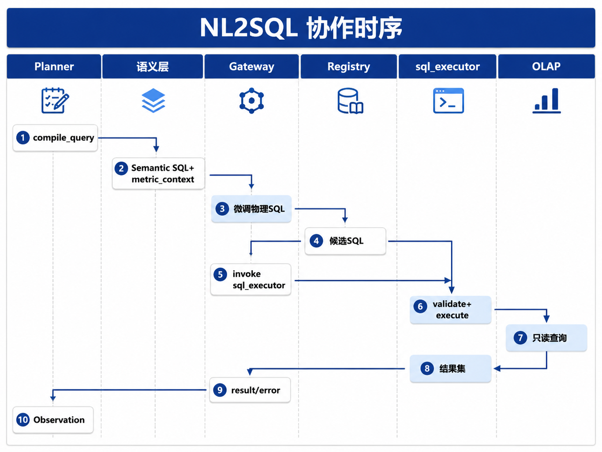

# Ch.34 NL2SQL 工程化

> **本章目标**：读者学完能描述 DataAgent 中 **NL2SQL 流水线** 各阶段职责，对照 **分步生成、大库剪枝、示例驱动、开源专训** 等工程路线（§2 详述 DIN-SQL、CHESS、DAIL-SQL、CodeS 等代表工作）做技术选型，并设计 **Schema 剪枝 → 生成 → 校验 → 安全执行 → 业务解释** 的 Registry 集成方案。  
> **关键议题**：NL2SQL 分步生成（DIN-SQL 等）、大库剪枝流水线（CHESS 等）、示例驱动与开源专训（DAIL-SQL、CodeS）；SQL 生成、纠错、安全执行  
> **前置阅读**：[Ch.33 语义层工程](ch33.md)、[Ch.25 Planner](../part05-agent-capabilities/ch25-planner.md)、[Ch.23 Registry](../part05-agent-capabilities/ch23-tool-registry-function-calling.md)、[Ch.12 OLAP](../part03-data-infra/ch12-olap.md)  
> **估计阅读**：约 85 min  
> **mini-platform 关联**：`tools/sql_executor/` · `core/planner/` · `infra/semantic_layer/`  
> **按角色推荐阅读**：工程师 ⇒ 全章 ｜ 架构师 ⇒ §1–§5 ｜ 安全 ⇒ §5 + Ch.50

[Ch.33](ch33.md) 将用户口语映射为 **标准 Metric 与 Linked Schema**；本章回答：**在 Linked Schema 约束下，如何生成可执行、可审计、可纠错的 SQL，并把结果翻译成业务结论**。

NL2SQL 在 DataAgent Run 中位于 **Planner 循环**（[Ch.25](../part05-agent-capabilities/ch25-planner.md)）内：Planner 调用 `sql_executor` Tool（经 [Ch.23 Registry](../part05-agent-capabilities/ch23-tool-registry-function-calling.md)），Tool 内部完成 **生成/校验/执行**，或分步暴露给 Planner。**ReAct**（Ch.25）指 Planner **根据 Tool 返回的错误信息（Observation）修订 SQL 再试**，而不是一次生成就结束。Ch.25 强调 Planner **只提议、不执行**——物理 SQL 执行与副作用由 Runtime + Registry 负责。

全书以 [Ch.32 §4 华东下滑案例](ch32-dataagent.md) 为主线：运营总监问「上周华东区销售相对前周明显下滑，主要 SKU 是哪些？」——Ch.33 Linker 已绑定 `gmv_ops@2025Q1`、`region_code = 'EAST'`、`grain = sku`、`time = last_week`；本章承接该 Linked Schema，走完 **编译 → 校验 → 执行 → 解释** 全链。

本章依次介绍：NL2SQL 在 DataAgent 中的位置（§1）；SQL 生成主流范式（§2）；Schema 选择、Join 与条件补全（§3）；校验、修复与执行前审查（§4）；只读、安全与资源保护（§5）；从 SQL 结果到业务解释（§6）；并以 **mini-platform 工程路径：sql_executor** 收束（§7）。

---

### NL2SQL 在 DataAgent 中的位置

DataAgent 的 NL2SQL 不是单次「prompt → SQL」，而是 **语义层编译、Planner 补全、Registry 执行、Observation 反馈** 的协作环。山岚华东下滑案例在平台中的调用顺序如下：



| 阶段 | 负责模块 | 输入 | 输出 |
| --- | --- | --- | --- |
| 语义编译 | `infra/semantic_layer/` | Linked Schema JSON | Semantic SQL、`metric_context` |
| SQL 生成 | Planner + Gateway | Semantic SQL 或 Question Frame | 物理 SQL 候选 |
| 执行治理 | `sql_executor` + Policy | SQL + `tenant_id` | 结果集 / 结构化错误 |
| 解释 | Planner + Gateway | Top-K 行 + `metric_context` | 自然语言 + 表格摘要 |

**Spider 2.0** [3] 是企业级 Text-to-SQL **公开评测集**（上千列、多步 workflow），说明单轮「prompt → SQL」成功率远低于早期 Spider 1.0——DataAgent 默认 **ReAct + 执行反馈**（Ch.25）：华东案例若首轮 SQL 列名写错，Planner 根据 Observation 修订后重试，而非直接拒答用户。

#### 走读：华东下滑案例进入 NL2SQL 流水线

Ch.33 Linker 已输出 Linked Schema（§3 走读）；Planner 将其交给 `compile_query()`：

**输入（来自 Ch.33）**

```json
{
  "metrics": [{"metric_id": "gmv_ops", "version": "2025Q1", "title": "运营 GMV"}],
  "dimensions": ["region_code", "sku"],
  "filters": [{"field": "region_code", "op": "eq", "value": "EAST"}],
  "time_range": {"start": "2025-06-09", "end": "2025-06-15", "grain": "week"},
  "compare_to": {"start": "2025-06-02", "end": "2025-06-08"},
  "view": "sales_ops",
  "tenant_id": "shanlan-retail"
}
```

**处理**：`infra/semantic_layer/client.py` 的 `compile_query()` 注入 Metric 默认 filters（`include_promo_adjustments`、`partial_return_netting`）、Join 路径，以及 **时间维表（time spine，预定义的周/日粒度日历）**。

**输出（Semantic SQL，示意）**

```sql
-- 语义层编译产物；Measure 聚合逻辑由 Ch.33 定义，Planner 不得改写
SELECT
  o.sku_id AS sku,
  SUM(CASE WHEN o.order_week = '2025-W24' THEN o.amount_ops ELSE 0 END) AS gmv_last_week,
  SUM(CASE WHEN o.order_week = '2025-W23' THEN o.amount_ops ELSE 0 END) AS gmv_prior_week
FROM analytics.orders_fact AS o
WHERE o.tenant_id = 'shanlan-retail'
  AND o.region_code = 'EAST'
  AND o.order_week IN ('2025-W23', '2025-W24')
  AND o.is_internal = false          -- gmv_ops 默认 filter
GROUP BY o.sku_id
ORDER BY (gmv_last_week - gmv_prior_week) ASC
LIMIT 50
```

Planner 将上述 SQL 与 `metric_context` 一并写入 Tool Call，经 Registry 调用 `sql_executor@v2`；执行成功后，Registry 把结果集作为 **Observation**（Tool 执行结果，返回给 Planner 做下一步）返回 Top 10 SKU 行，供 §6 生成业务解释。

#### 与 Ch.33 的分工

| 模块 | 职责 | 华东案例中的动作 |
| --- | --- | --- |
| **Ch.33** | Metric 是什么、Link 到哪张表 | 绑定 `gmv_ops@2025Q1`，展开 `华东 → EAST` |
| **Ch.34** | Ch.33 已 Link 好后，**SQL 如何生成、校验并执行** | 编译、校验、`tenant_id` 注入、执行、自修复 |
| **Ch.50** | 行级访问控制（ACL）、脱敏、审计 | 执行前 Policy 二次校验 |

#### Semantic SQL 在本书中的含义

**Semantic SQL（语义 SQL）** 指：SQL 里的 **聚合口径、Join、默认 filters** 已由语义层（Ch.33）写好，Planner **不能** 自己发明 `SUM(amount)` 算不算 GMV。

语义层返回的可执行意图有两种常见形态：

1. **结构化查询对象**（`metric_ids`、dimensions、filters、time_range），由 `compile_query()` 编译为方言 SQL；  
2. **已编译的只读 SQL 字符串**（带语义层生成的 JOIN 与默认 filters）。

Planner 与 Gateway 只负责在 Linked Schema 约束下 **补全或微调物理 SQL**（例如追加 `ORDER BY`、调整 `LIMIT`），**不得**绕过语义层重新定义 Measure 聚合逻辑。山岚与 mini-platform 默认走 **语义层编译路径**——运营总监看的是 `gmv_ops`，不是 Planner 临时 `SUM()` 出来的列。

---

### SQL 生成主流范式

Ch.33 已把「华东 GMV 下滑 Top SKU」链接到 `gmv_ops` 和少数几张表。**生成 SQL** 仍有多种工程路线——不是「一个 prompt 写到底」，而是看企业有没有历史 SQL、schema 有多大、能不能用闭源 API。近年综述按 **模型、数据、评测、错误分析** 梳理 NL2SQL 全生命周期 [1]；本书归纳四类常见做法，DataAgent 可按场景组合，而非押注单一方案：

| 范式 | 代表工作 | 白话说明 | 适用 |
| --- | --- | --- | --- |
| **Example-driven（示例驱动）** | DAIL-SQL [4] | 从库里找 **相似的历史问句和 SQL**，当作示例喂给模型 | 企业已积累大量 Question-SQL 对 |
| **Decomposed（分步拆解）** | DIN-SQL [5] | 先 Link 字段 → 再判断查询类型 → 再写 SQL → 错了再改 | schema 复杂、需要可解释步骤 |
| **Multi-step pipeline（多步流水线）** | CHESS [6] | **先缩小表/列范围，再写 SQL，再校验**；论文里拆成 4 个角色 | 上千列、全集团大库 |
| **Open LLM（开源模型专训）** | CodeS [7] | 用 SQL 语料 **预训练/微调** 开源模型，少依赖闭源 API | 私有化、降 API 成本 |

!!! note "CHESS 是什么？"
    **CHESS**（Talaei 等，2024 [6]）是一篇 **企业级 NL2SQL 流水线** 论文的简称。它要解决的问题与 Ch.33 相同：**表太多、列太多，不能整库 DDL 塞进 prompt**。论文把过程拆成四步——下文用 **IR / SS / CG / UT** 指这四步，并对照华东案例说明在 DataAgent 里各对应什么；**理解「先剪枝、再生成、再校验」即可**，无需逐字记忆缩写。

!!! note "DAIL-SQL、CodeS 是什么？"
    **DAIL-SQL** [4]：用 **历史相似问句及其 SQL** 当作示例（in-context learning），帮助模型写新 SQL——适合企业已积累大量 Question-SQL 对的场景。  
    **CodeS** [7]：用 SQL 语料 **预训练/微调开源模型**，减少对闭源 API 的依赖——适合私有化部署（与 [Ch.45 LLM 网关](../part08-deployment/ch45-llm.md) 配合）。二者与 DIN-SQL、CHESS **可组合**，不是四选一。

#### DIN-SQL：分四步写 SQL（映射华东案例）

**DIN-SQL**（Pourreza & Rafiei，2023 [5]）代表 **分步拆解** 路线：不让模型一步完成 Link + 分类 + 生成 + 纠错，而是拆开做，出错时知道回退到哪一步。山岚华东下滑问法可逐步对应：

| DIN-SQL 步骤 | 华东案例 | DataAgent 落点 |
| --- | --- | --- |
| 1. Schema Linking | 「销售」→ `gmv_ops`，「华东」→ `EAST` | Ch.33 Linker（本章复用结果） |
| 2. Query Classification | 诊断 + 周对比 + SKU 粒度 → JOIN/聚合类 | Planner Question Frame `task_type: diagnose` |
| 3. SQL Generation | 生成周对比 + `GROUP BY sku` | `compile_query()` 或 Gateway 微调 SQL |
| 4. Self-correction | 列名 `sku` vs `sku_id` 报错后修订 | §4 自修复循环 |

**输入（Planner 交给 Gateway 的生成提示摘要）**

```yaml
question: 上周华东区销售相对前周明显下滑，主要 SKU 是哪些？
linked_schema:
  metric: gmv_ops@2025Q1
  dimensions: [sku]
  filters: [{field: region_code, value: EAST}]
  time: {range: last_week, compare: prior_week}
semantic_sql: "SELECT ... /* 见 §1 编译产物 */"
dialect: duckdb
```

**输出**：Gateway 返回与 Semantic SQL 等价的物理 SQL；若偏离 Linked Schema，§4 AST 与 Schema 校验会拦截。

#### 大库先剪枝再生成：CHESS 四步与 DataAgent 对照

当 schema 从山岚零售的几十张表 **扩展到全集团上千列** 时，仅靠 Ch.33 View 有时仍不够——需要更重的 **剪枝流水线**。CHESS 论文 [6] 把这一过程拆成四步；缩写 IR / SS / CG / UT 分别表示：

| 步骤（缩写） | 论文里做什么 | 华东案例在 DataAgent 里对应什么 |
| --- | --- | --- |
| **IR**（检索） | 查真实库值、文档片段，确认过滤条件合法 | 确认 `EAST` 在 `region_code` 域内存在 |
| **SS**（Schema 选择 / 剪枝） | 从上千列里 **只挑本问相关的表和列** | Ch.33 View `sales_ops` 已把候选收窄至 `orders_fact` 等 |
| **CG**（候选生成） | 在剪枝后的 schema 上 **写 SQL、迭代修改** | `compile_query()` + Gateway 微调 |
| **UT**（校验） | 像单元测试一样检查 SQL 是否合理 | `sql_executor` 的 AST 校验 + EXPLAIN 成本检查 |

**IR / SS / CG / UT 是论文里的四步标签**；落地时把握原则即可：**大库 NL2SQL 须先缩小 schema，再写 SQL，再执行前校验**。华东下滑案例规模下，**语义层 View（Ch.33）+ `compile_query()`** 已覆盖剪枝与生成的主要工作；schema 扩展到全集团上千列时，再考虑按 CHESS 思路拆成更重的流水线。

**CodeS** [7] 走另一条路：不强调多 Agent，而是 **训练更擅长写 SQL 的开源模型**，适合不能依赖闭源 API 的部署，可与 [Ch.45 LLM 网关](../part08-deployment/ch45-llm.md) 私有化配合。

#### 设计取舍：单模型 vs 多步流水线

| 方案 | 优势 | 代价 | mini-platform |
| --- | --- | --- | --- |
| **单 LLM + 语义层编译** | 链路短、易调试 | 超大 schema 下 Link 易漏 | 华东案例规模 ⭐ |
| **CHESS 式多步剪枝流水线** | 大库准确率高 | 延迟与 token 多 | 问数进阶路径 |
| **CodeS 本地模型** | 隐私、成本可控 | GPU 运维 | 与 Ch.45 网关配合 |

山岚零售板块采用 **语义层编译为主 + Gateway 轻量微调**；若 schema 扩展到全集团上千列，再叠加 **先剪枝、再生成、再校验** 的多步流水线（CHESS 论文 [6] 是这一路的参考实现）。

---

### Schema 选择、Join 路径与条件补全

Ch.33 的 **Linked Schema** 已告诉系统「本问用哪几个 Metric、哪几张表」。进入 §2 的 SQL 生成前，还须完成三件事——**都不能交给 LLM 凭记忆完成**：

1. **剪枝**：prompt 里只保留本问相关的表/列，不塞全库 DDL；  
2. **Join**：只允许语义层预定义的路径，防止 GMV 因错误 Join 算翻倍；  
3. **条件补全**：`tenant_id`、时间范围、Metric 默认 filters 由 **服务端追加**。

#### Schema 剪枝

**输入**：Ch.33 的 Linked Schema 子集 + 当前用户 **View 允许访问的表/列范围**（即 `sales_ops` View 成员，不是全库）。

**处理**：按 Glossary 命中 > 语义层 Join 图 > 向量相似度（Ch.18）优先级，将进入 prompt 的表列限制在配置上限内（如 N≤8 表、M≤120 列）[6]。

**输出（华东案例剪枝结果）**

```json
{
  "tables": ["analytics.orders_fact"],
  "columns": ["sku_id", "region_code", "amount_ops", "order_week", "tenant_id"],
  "join_paths": [],
  "prompt_token_estimate": 420
}
```

华东诊断问法只需单表 `orders_fact`；若用户追问「和品类结构有没有关系」，Linker 扩展维度 `category` 后，剪枝结果追加 `category_id` 列，**仍不** 把全库 400 张表 DDL 塞进 prompt。

#### Join 路径

语义层预定义 Join 时，Planner **不得** 自行臆造新的 Join 路径；仅允许：

- View 内 `join_path`；  
- 或语义层 API 返回的 **合法 Join 列表**。

否则易出现 **Fan-out 重复计数**（同一订单因错误 Join 被加两次，GMV 翻倍）。华东案例当前为单表聚合；若误 Join `promo_adjustments` 而不经语义层路径，GMV 可能被重复累加——`sql_executor` 的 Schema 校验应拒绝 **未出现在 Ch.33 `linked_tables` 列表里的表**。

#### 条件补全：服务端注入

DataAgent 须 **服务端注入** 关键谓词，而非依赖 LLM 记忆：

| 条件 | 注入方 | 华东案例 |
| --- | --- | --- |
| `tenant_id` | Policy / `sql_executor` | `shanlan-retail`（不可被 LLM 覆盖） |
| 时间范围 | Question Frame + 语义层 **时间维表（time spine）** | `2025-06-09`–`2025-06-15` vs 前周 |
| 默认 filters | Metric 定义 [Ch.33] | `is_internal = false`（`gmv_ops`） |
| 行级 ACL | Policy [Ch.50] | 运营总监仅 `sales_ops` View |

**注入前后对比（示意）**

```sql
-- LLM 候选（缺少 tenant_id，将被拒绝）
SELECT sku_id, SUM(amount_ops) FROM analytics.orders_fact
WHERE region_code = 'EAST' GROUP BY sku_id;

-- sql_executor 追加后（可执行）
SELECT sku_id, SUM(amount_ops) FROM analytics.orders_fact
WHERE tenant_id = 'shanlan-retail'   -- 服务端注入
  AND region_code = 'EAST'
  AND order_week BETWEEN '2025-W23' AND '2025-W24'
  AND is_internal = false
GROUP BY sku_id;
```

!!! warning "LLM 生成的 WHERE 不可信"
    `tenant_id` 与 ACL 须在 **执行层** 强制追加；即使用户在对话中声称「查全集团」，Policy 仍按 IAM 绑定的 `tenant_id` 过滤。[Ch.50](../part10-security-org/ch50.md) 展开行级权限与脱敏。

---

### SQL 校验、修复与执行前审查

物理 SQL 在触及 OLAP 之前，须通过 **五层校验**；失败后进入 **自修复循环**：执行报错 → Planner 收到 Observation → 修订 SQL → 再试（与 Ch.25 ReAct 一致；DIN-SQL、CHESS 论文称之为 execution-guided correction [5][6]）。

#### 校验层次

**AST**（Abstract Syntax Tree，抽象语法树）指把 SQL 解析成树结构后做规则检查——例如识别 `DELETE` 语句并拒绝，而不只是字符串匹配 `SELECT`。

| 层次 | 检查项 | 工具 | 华东案例 |
| --- | --- | --- | --- |
| **语法** | dialect 合法 | **sqlglot**（Python SQL 解析库）/ EXPLAIN | DuckDB 方言解析 |
| **语义** | 仅 SELECT；禁 DDL/DML | AST 遍历 | 拒绝 `DELETE` |
| **Schema** | 表列存在于 Linked 集 | Catalog | 拒绝引用 `finance_ledger` |
| **成本** | 估算扫描行数 / JOIN 宽度 | EXPLAIN + 阈值 | 缺 `order_week` 过滤则拒跑 |
| **策略** | 必含 `tenant_id` | Policy 规则 | 无 `tenant_id` → 400 |

#### 走读：首轮 SQL 报错与自修复

假设 Gateway **微调 SQL** 时误写列名 `sku`（物理列为 `sku_id`），流水线如下：

| 步骤 | 组件 | 动作 | 输出 |
| --- | --- | --- | --- |
| 1 | `sql_executor` | AST 只读校验通过 | 进入 EXPLAIN |
| 2 | OLAP | 执行 | `column "sku" not found` |
| 3 | Registry | 包装错误 | `TOOL_EXECUTION_ERROR`（[Ch.23](../part05-agent-capabilities/ch23-tool-registry-function-calling.md)） |
| 4 | Planner | Observation | 结构化错误 + 建议检查 Linked Schema |
| 5 | Gateway | 修订 SQL | `sku` → `sku_id` |
| 6 | `sql_executor` | 重试（`retry=1`） | 返回 Top 10 SKU 行 |

**Observation 示例（Planner 可见，含结构化错误）**

```json
{
  "status": "error",
  "code": "TOOL_EXECUTION_ERROR",
  "message": "column \"sku\" not found",
  "hint": "linked_columns contains sku_id, not sku",
  "sql_hash": "a3f8c2...",
  "retry_count": 1,
  "max_sql_retries": 3
}
```

终端 UI 对用户展示脱敏后的「查询失败，正在重试」；Planner 侧保留完整 `hint` 供修订。**BIRD-INTERACT** [8] 是含多轮澄清的 Text-to-SQL 评测集——华东案例的自修复是其 **执行反馈** 部分的缩影（含义见 [Ch.32 §1](ch32-dataagent.md)）。

自修复须设上限：

1. 重试次数 ≤ `max_sql_retries`（独立于 `max_steps`）；  
2. **`max_sql_retries` 与 `max_steps` 均耗尽** → Run 进入 `failed`（或 Policy 配置为 `waiting_human` 转人工改 SQL）；  
3. `permission denied` 等越权错误 **不得** 重试，应回退 Ch.33 重 Link 或直接拒答。

#### 执行失败：排查与修复

| 现象 / 错误 | 常见原因 | 用户可见行为 | Planner 修复策略 |
| --- | --- | --- | --- |
| `column not found` | Schema Link 错误 | 拒答或自修复中 | 回退 Ch.33 重 Link；对照 `linked_columns` |
| `statement timeout` / `timeout` | JOIN 规模过大、缺分区 | Run `failed`，提示简化 | 限表数 + 强制 `time_range` |
| Gateway `RateLimitError` | 自修复多轮 LLM | 重试后 `failed` | `max_sql_retries` + 指数退避 |
| `permission denied` | 越权表 | 拒答 + 审计 | 回退 Ch.33；**勿**重试越权 |
| 结果为空 | 口径 filters 过严 | 「无数据」解释 | 提示检查 `time_range` 与 `gmv_ops` filters |

`max_sql_retries` 与 `max_steps` 均耗尽 → Run `failed`（或 Policy 配置 `waiting_human`）。

---

### 只读、安全、限流与资源保护

生产 `sql_executor` 的最低安全基线如下；华东案例的所有查询均须满足，无「内网可放宽」例外。

| 控制 | 要求 |
| --- | --- |
| **只读** | 允许 `SELECT` 及只读 `WITH ... SELECT`、`UNION ALL`（只读分支）、窗口函数；**禁止** 一切 DML/DDL、`SELECT INTO`、文件导出；`WITH` 子句内不得含写操作 |
| **连接** | 只读账号 / 只读副本 |
| **结果集** | `LIMIT` + 最大行数 + 最大字节 |
| **超时** | 语句级 + Run 级 |
| **并发** | 每租户 QPS / 并行 Run 上限 |
| **脱敏** | PII 列 Policy 掩码 [Ch.50] |
| **审计** | 记录 SQL 哈希、用户、`metric_id@version` |

```yaml
# tools/sql_executor/policy.yaml
allow_statements: [SELECT]
max_rows: 10000
max_bytes: 5MB
statement_timeout_ms: 30000
require_tenant_predicate: true
deny_tables: [raw_pii, admin]
```

#### 权限与脱敏：谁在哪一层生效？

SQL 安全不只有 `policy.yaml` 里的「禁 DDL、限行数」。山岚华东案例还涉及 **谁能看华东数据、手机号要不要打码**——分两层配置，**都在执行前生效**，Planner 生成的 SQL 不能绕过：

| 层级 | 配置位置 | 做什么 | 华东示例 |
| --- | --- | --- | --- |
| **执行基线** | `tools/sql_executor/policy.yaml` | 只读、超时、`tenant_id` 必填、禁访问 `raw_pii` | 无 `tenant_id=shanlan-retail` → 拒跑 |
| **企业策略** | `core/policy/` + [Ch.50](../part10-security-org/ch50.md) | 行级权限（RLS）、字段脱敏 | 运营总监不能 SELECT 财务专用列；`phone` 返回掩码 |

**IAM**（身份与访问管理）决定用户绑定的 `semantic_view` 与租户；**OPA**（Open Policy Agent，策略引擎）在 Registry 调用 `sql_executor` **之前** 校验本次 SQL 是否越权——与 `policy.yaml` 的 AST 校验 **串联**，不是二选一。详述见 Ch.50；本章只要求：`sql_executor` **不得** 单独承担全部权限逻辑。

#### 设计取舍：Semantic SQL 先编译 vs 直接物理 SQL

| 方案 | 优势 | 代价 | 华东案例 |
| --- | --- | --- | --- |
| **Semantic SQL → 编译** | 口径强制 [Ch.33]；`gmv_ops` filters 不可绕过 | 依赖语义层可用 | 运营总监默认路径 ⭐ |
| **物理 SQL + 事后审计** | 灵活 | 口径漂移风险 | 仅沙箱或财务专用 View |

财务 Controller 查 **不含税 GMV** 时，语义层切换 Metric 为 `gmv_tax_excluded@2025Q1`（Ch.33 `finance_control` View），编译路径不变——**换 Metric，不换流水线**。运营场景 **不** 用 `gmv_tax_excluded` 代替 `gmv_ops`。

---

### 从 SQL 结果到业务解释

NL2SQL 的 **用户可见价值** 不是 SQL 字符串，而是 **可决策的业务结论**。`sql_executor` 返回结果集后，Planner 应完成四件事：

1. **摘要**：Top-K 行 + 关键聚合（避免 1 万行进 prompt）；  
2. **口径脚注**：`gmv_ops@2025Q1`（运营 GMV）；  
3. **新鲜度**：来自 Ch.33 **可信上下文（Ch.33 §5）**；  
4. **不确定性**：样本过小则拒绝对因。

#### 走读：华东案例从结果集到回答

**输入（`sql_executor` result，节选）**

```json
{
  "rows": [
    {"sku": "SKU-A", "gmv_last_week": 1200000, "gmv_prior_week": 2100000, "delta_pct": -0.429},
    {"sku": "SKU-B", "gmv_last_week": 980000, "gmv_prior_week": 1100000, "delta_pct": -0.109}
  ],
  "row_count": 10,
  "truncated": false,
  "metric_context": [{"metric_id": "gmv_ops", "version": "2025Q1", "title": "运营 GMV"}],
  "sql_hash": "b7e2a1...",
  "freshness": {"orders_fact": {"max_loaded_at": "2025-06-14T06:00:00Z"}}
}
```

**处理**：Planner 计算华东整体周环比、SKU 贡献度排序，引用 `trusted_context` 脚注。

**输出（用户可见 `answer` 摘要）**

> 华东上周 **运营 GMV**（`gmv_ops@2025Q1`）较前周下降 12.3%。下滑贡献最高的 SKU 为 **SKU-A**（占区域跌幅约 32%）、SKU-B（约 11%）。数据来自 `orders_fact v3`，截至 **2025-06-14 06:00** 同步。

| 输出类型 | 华东案例示例 |
| --- | --- |
| 表格 | Top 10 SKU + 两周 GMV 与 `delta_pct` |
| 一句话 | 「SKU-A 占华东下滑 32%」 |
| 引用 | `run_id` / `sql_hash` / `gmv_ops@2025Q1` |

轻量解释在本章收束；**报告级叙事**（经营会复盘、人工审批后再发布）在 [Ch.36](ch36.md) 与 [Ch.30 HITL](../part05-agent-capabilities/ch30-human-in-the-loop.md)。若用户追问「和品类结构有没有关系」，Planner 扩展 Question Frame 维度后 **重新走本章流水线**（Ch.35 Python 贡献度分析与之衔接）。

---

### mini-platform 工程路径：sql_executor

!!! note "目录说明"
    下列 `tools/sql_executor/` 为 **Part VI 目标架构（书中契约）**；当前仓库 **尚未合入** 该目录。**Part V** 模块（`core/runtime/`、`core/registry/` 等）与 `mini-platform/projects/multi-agent-workflow/` 已在仓库中存在；Tool Call 与 Observation 形状可先对照 Part V Demo。

本章描述 **`sql_executor` Tool** 的只读 SQL 校验与执行契约；Planner 生成逻辑在 `core/planner/` 与 `agents/data_agent/`。企业 Policy 详述见 [Ch.50](../part10-security-org/ch50.md)。

#### 7.1 目录与 Tool 契约

```
mini-platform/tools/sql_executor/
├── handler.py             # Registry Tool 入口
├── validate.py            # AST + Policy
├── runner.py              # DuckDB/Postgres 只读
└── policy.yaml
```

**ToolSpec**（核心字段）：

```yaml
tool_id: sql_executor
version: v2
description: 只读 SQL；须含 tenant_id；结果截断
input_schema:
  type: object
  required: [sql, tenant_id, metric_context]
  properties:
    sql:
      type: string
    tenant_id:
      type: string
    metric_context:
      type: array
      items:
        type: object
        required: [metric_id, version]
```

**华东案例 Tool Call 示例**

```json
{
  "tool": "sql_executor",
  "version": "v2",
  "arguments": {
    "sql": "SELECT sku_id, ... /* §1 编译产物 */",
    "tenant_id": "shanlan-retail",
    "metric_context": [{"metric_id": "gmv_ops", "version": "2025Q1"}]
  }
}
```

**AST 只读校验**（使用 **sqlglot** 库把 SQL 解析为语法树后检查；`pip install sqlglot`，Python ≥3.10；可独立于 OLAP 单测）：

```python
import sqlglot
from sqlglot import exp

def assert_readonly(sql: str) -> None:
    """Reject any non-SELECT statement before execution."""
    tree = sqlglot.parse_one(sql, read="duckdb")
    if not isinstance(tree, exp.Select) and not (
        isinstance(tree, exp.Union)
        and all(isinstance(b, exp.Select) for b in tree.find_all(exp.Select))
    ):
        raise ValueError("only read-only SELECT allowed")
```

#### 7.2 生产化 checklist

- [ ] AST 层禁写操作  
- [ ] `tenant_id` 服务端注入且不可被 LLM 覆盖  
- [ ] EXPLAIN 超阈值拒跑  
- [ ] 错误信息脱敏（终端 UI）；Planner Observation 可含结构化错误  
- [ ] Trace 存 SQL 哈希与 `metric_id@version`（Ch.38）  
- [ ] 华东类诊断问法回归：周对比 + SKU 粒度 + `gmv_ops` 脚注

#### 7.3 实务注意

1. **EXPLAIN 通过，但执行仍扫描全表。**  
   须增加 **执行超时** 与 **结果集上限**；华东案例若去掉 `order_week` 过滤，成本校验应拒跑。

2. **自修复陷入无限循环。**  
   `max_sql_retries=3` 须独立计数；超限后 Run 进入 `failed` 或 `waiting_human`。

3. **基准测试分数高，生产环境却频繁失败。**  
   须在 Spider 2.0 类场景回归 [3]——多表文档、方言差异、长链路自修复。

4. **运营与财务 Metric 混用。**  
   回答脚注须写 `title`（运营 GMV）与 `gmv_ops@2025Q1`；Eval 检查 **口径脚注覆盖率**（Ch.39）。

---

## 本章小结

### 关键结论

1. NL2SQL 是 **Planner + sql_executor + 语义层** 的协作，不是单次 prompt；华东案例自 `compile_query()` 到业务解释须全链可审计。  
2. **分步生成 / 大库剪枝 / 开源专训** 代表 DIN-SQL、CHESS、CodeS 等工程路线 [5][6][7]；山岚华东案例以语义层编译为主。  
3. **Join 与 tenant 条件** 应语义层与 Policy 强制，不能信任 LLM 生成的 WHERE。  
4. **执行反馈** 驱动自修复；`max_sql_retries` 独立计数，越权错误不重试。  
5. 用户交付物是 **带 `gmv_ops@2025Q1` 口径脚注的解释**，SQL 仅中间产物。

### 上线检查清单

- [ ] 是否禁止 DDL/DML？  
- [ ] 失败 SQL 能否在 Trace 中完整回放？  
- [ ] 是否在 Spider 2.0 / BIRD-INTERACT 类场景做过抽检 [3][8]？  
- [ ] 运营场景是否默认 `gmv_ops` 且脚注含 `title`？

### 本书延伸阅读

- [Ch.33 语义层](ch33.md) · [Ch.35 Text-to-Python](ch35-text-to-pandas-text-to-python.md)  
- [Ch.25 Planner](../part05-agent-capabilities/ch25-planner.md) · [Ch.50 Policy](../part10-security-org/ch50.md)  
- [Ch.39 离线评估](../part07-observability-eval/ch39-dataagent-eval-benchmark.md)

---

## 参考文献

[1] Liu, X., et al. (2025). A survey of Text-to-SQL in the era of LLMs. *IEEE TKDE*, 37(10), 5735–5754. [https://doi.org/10.1109/TKDE.2025.3592032](https://doi.org/10.1109/TKDE.2025.3592032)

[2] Tang, Z., et al. (2025). LLM/Agent-as-Data-Analyst: A survey. arXiv:2509.23988. [https://arxiv.org/abs/2509.23988](https://arxiv.org/abs/2509.23988)

[3] Lei, F., et al. (2024). Spider 2.0. *ICLR 2025*. arXiv:2411.07763. [https://arxiv.org/abs/2411.07763](https://arxiv.org/abs/2411.07763)

[4] Gao, D., et al. (2023). Text-to-SQL empowered by large language models: A benchmark evaluation. *VLDB*. arXiv:2305.03111.（DAIL-SQL 等 ICL 方法；仍广泛引用）

[5] Pourreza, M., & Rafiei, D. (2023). DIN-SQL. *NeurIPS*. arXiv:2304.11015. [https://arxiv.org/abs/2304.11015](https://arxiv.org/abs/2304.11015)

[6] Talaei, S., et al. (2024). CHESS. arXiv:2405.16755. [https://arxiv.org/abs/2405.16755](https://arxiv.org/abs/2405.16755)

[7] Li, H., et al. (2024). CodeS: Towards building open-source language models for text-to-SQL. *SIGMOD 2024*. arXiv:2402.16347. [https://arxiv.org/abs/2402.16347](https://arxiv.org/abs/2402.16347)

[8] Huo, N., et al. (2026). BIRD-INTERACT. *ICLR 2026*. arXiv:2510.05318. [https://arxiv.org/abs/2510.05318](https://arxiv.org/abs/2510.05318)
