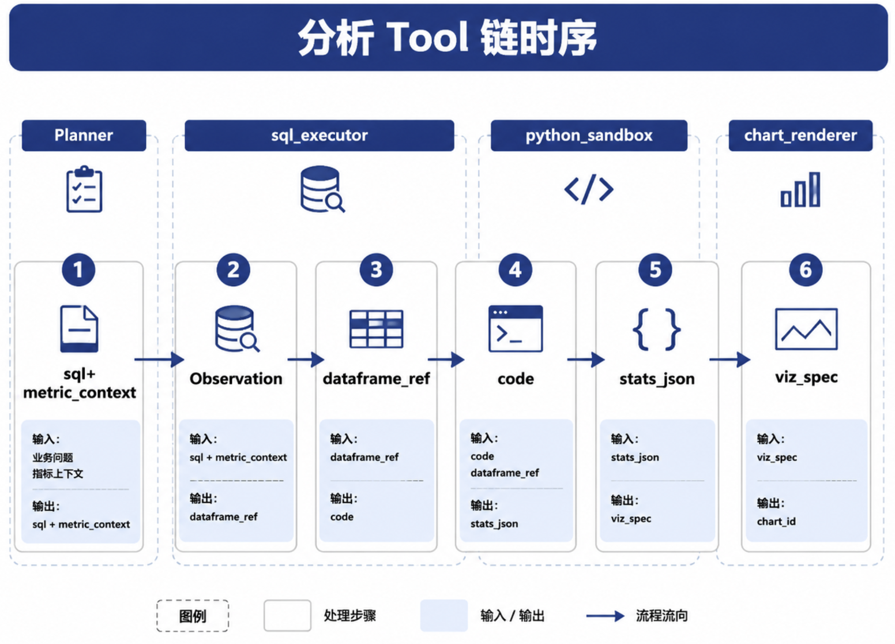

# Ch.35 Text-to-Pandas / Text-to-Python

> **本章目标**：读者学完能说明 **何时用 SQL、何时用 Python**，设计 DataAgent 的 **Python 分析沙箱** 与 Registry 集成，并描述 **SQL 取数 → Python 分析 → Tool Result 写入 Observation** 的协同链路。  
> **关键议题**：Code Interpreter 范式、Python 沙箱、SQL + Python 协同；与 PandasAI 等产品的边界  
> **前置阅读**：[Ch.34 NL2SQL 工程化](ch34-nl2sql.md)、[Ch.25 Planner](../part05-agent-capabilities/ch25-planner.md)、[Ch.50 Policy](../part10-security-org/ch50.md)  
> **估计阅读**：约 75 min  
> **mini-platform 关联**：`tools/python_sandbox/` · `tools/sql_executor/`  
> **按角色推荐阅读**：数据科学家 ⇒ 全章 ｜ 平台工程师 ⇒ §4–§7 ｜ 安全 ⇒ §4 + Ch.50

[Ch.34](ch34-nl2sql.md) 解决 **结构化取数**：Planner 经 `sql_executor` 拿到 Top SKU 表格与聚合摘要。山岚华东下滑案例中，运营总监追问「**和品类结构有没有关系**」——这类 **品类贡献度**、**价格/销量分解**、**结构变化率** 往往 **难以用一条 SQL 表达**，或在仓内反复试算 **成本过高**。DataAgent 的 **分析形态**（[Ch.32 §2](ch32-dataagent.md)）在此引入 **Text-to-Python** 路径：LLM 生成 pandas 代码，在 **隔离沙箱** 内对 SQL 结果集做二次计算。

**Text-to-Python** 指将自然语言分析意图翻译为 Python（常见为 pandas）代码并执行；**Text-to-Pandas** 是其子集，专指 DataFrame 变换。

!!! note "Code Interpreter 与 PandasAI 是什么？"
    **Code Interpreter**（OpenAI，2023 [2]）指：用户用自然语言描述分析需求 → LLM **生成 Python** → 在 **隔离环境执行** → 把 stdout/图表 **作为 Tool Result 返回**。DataAgent 用 `python_sandbox` Registry Tool 复现这一范式，而非让用户直连 Notebook。  
    **PandasAI** [4] 是开源库，封装「自然语言 → pandas 代码」——适合 demo，但 **企业场景须禁止直连生产库**；取数仍走 `sql_executor`，Python 只读 `dataframe_ref`。

LLM/Agent-as-Data-Analyst 综述将 **多步编排的分析流水线** 列为分析 Agent 的设计目标 [1]。本章说明如何在 **企业 Agent 平台** 上落地：经 Registry 注册 `python_sandbox`，全链路可 Trace。

Part VI 主线沿用 [Ch.32 §4 华东下滑案例](ch32-dataagent.md)：Linker 已绑定 **`gmv_ops@2025Q1`**（运营 GMV，见 [Ch.33 §4](ch33.md)），`sql_executor` 产出 SKU×品类宽表后，本章负责 **Python 分解与统计**，再交 [Ch.36](ch36.md) 出图。

本章依次介绍：为什么 SQL 不够（§1）；Python 适合哪些任务（§2）；DataFrame、统计与建模（§3）；沙箱与安全（§4）；代码生成、执行、纠错与解释（§5）；SQL + Python 协同链路（§6）；并以 **mini-platform 工程路径：python_sandbox** 收束（§7）。

---

### 为什么 SQL 不够

哪些需求应离开 SQL 引擎、改走 Python？

SQL 仍是 **权威取数层**（Ch.34）：Metric 聚合、Join、租户过滤须在语义层与 `sql_executor` 内完成。Python 处理 **SQL 结果集或采样**，不应默认 **直连生产库做全表 scan**。下表对照山岚华东案例中 **SQL 能做什么、Python 补什么**：

| 场景 | 山岚华东案例中的具体需求 | SQL 的局限 | Python 的优势 |
| --- | --- | --- | --- |
| **贡献度/分解** | 「下滑差额里，各品类占多少？」 | 多步中间表、窗口嵌套冗长 | pandas 透视、自定义贡献度公式 |
| **结构变化率** | 「品类 GMV 占比是否相对前周偏移？」 | 占比变化需多 CTE 自连接 | 一行 `pct_change` + groupby |
| **统计检验** | 「Top 3 SKU 下滑是否显著？」 | 方言统计函数不一 | scipy/statsmodels 一致 API |
| **价格/销量分解** | 「SKU-A 下滑因量价哪一侧？」 | 需预建模分解列 | 沙箱内按列做 waterfall 逻辑 |
| **临时 CSV** | 用户上传竞品价盘探查 | 未入仓 | 沙箱内加载（Policy 限大小） |
| **可视化探索** | 品类贡献横向条形图 | 仓内绘图受限 | matplotlib/plotly → Ch.36 |

#### 走读：华东案例哪一步必须上 Python？

运营总监原话（[Ch.32 §4](ch32-dataagent.md)）：「上周华东区销售相对前周明显下滑，主要 SKU 是哪些？**和品类结构有没有关系？**」

| 子问题 | 首选路径 | 理由 |
| --- | --- | --- |
| Top 下滑 SKU 列表 | `sql_executor` | 语义层 `gmv_ops` + `region=EAST` + 周对比，一条 Semantic SQL 可完成 |
| 品类贡献度、结构偏移 | `python_sandbox` | 需在 SKU 粒度结果上 **按品类聚合差额并算占比**，SQL 可行但难维护、难审计中间步骤 |
| 经营会条形图 | `chart_renderer`（Ch.36） | 读 Python 输出的 `viz_spec` 或聚合 JSON |

Planner 在 Question Frame 中标记 `path: sql_then_python`（[Ch.32 §3](ch32-dataagent.md)）：**先 SQL 取数，再 Python 分析**，口径始终来自 **`gmv_ops@2025Q1`**。

#### 常见误区

**误区 1：凡复杂分析都上 Python。**  
能一条 Semantic SQL 完成的，优先 SQL——成本低、易审计。华东案例的 Top SKU 表 **不应** 为了「用 Python」而绕过 SQL。

**误区 2：Python 沙箱 = Jupyter 给业务用。**  
企业须 **无网络、无密钥、包白名单**（§4）；沙箱 **不持有** 数据库连接字符串。

**误区 3：Python 输出无需证据锚定（groundedness）。**  
图表与结论须引用 **输入 DataFrame 摘要 hash** 与 **`metric_context`**（Ch.36）；禁止 Planner 凭模型记忆编造数字。

!!! warning "禁止沙箱直连生产库"
    Python Tool 仅接受 Registry 注入的 `dataframe_ref`；静态扫描须拒绝 JDBC、`sqlalchemy` 连接串及任意 `socket` 调用。

---

### Python 适合哪些分析任务

Planner 如何决定调用 `python_sandbox`？

与 [Ch.32 §3](ch32-dataagent.md) 任务分型对齐。山岚华东案例在 Linking 完成后，Planner 按 **任务类型 + SQL 单步可否表达** 选路：

| 任务类型 | 华东案例问法 | 典型操作 | Tool 选择 |
| --- | --- | --- | --- |
| **查询** | 「上周华东运营 GMV 多少？」 | 单 Metric 聚合 | 仅 `sql_executor` |
| **对比** | 「华东 vs 华北同比」 | 多列 pivot | 优先 SQL；异构粒度时 Python |
| **诊断** | 「主要下滑 SKU 是哪些？品类有无关系？」 | 贡献度、结构率 | **SQL 聚合 + Python 分解** ⭐ |
| **归因** | 「下滑主要因价格还是量？」 | 量价 waterfall | Python 贡献度分析 |
| **预测（探索）** | 「下月 GMV 走势？」 | 简单时序外推 | Python + 不确定性声明 |
| **数据清洗（临时）** | 上传 CSV 探查 | 仅沙箱内 | 仅 `python_sandbox` |

**Planner 路径规则（简化）**：Question Frame 的 `task_type` ∈ {诊断, 归因, 预测}，且 Gateway 判断 **SQL 单步无法表达** 或 **仓内试算成本过高** → 调用 `python_sandbox@v1`；`metric_context` 须与上游 `sql_executor` **完全一致**（华东运营场景为 `gmv_ops@2025Q1`）。**查询/对比** 类任务通常仅走 `sql_executor`；**诊断/归因** 类典型链为 `sql_executor` 取宽表 → `python_sandbox` 分解 → `chart_renderer` 出图（三步 Tool 时序见 §6 走读）。

---

### DataFrame、统计、建模与临时计算

沙箱内允许哪些库与操作？输入数据从哪来？

#### 推荐栈

| 层级 | 库 | 用途 |
| --- | --- | --- |
| 表格 | pandas, polars | DataFrame 读写与变换 |
| 统计 | numpy, scipy | 描述统计、检验 |
| 建模 | sklearn（受限） | 原型回归/分类 |
| 可视化 | matplotlib（`MPLBACKEND=Agg`） | 输出 PNG 或 Vega spec → Ch.36 |

#### 输入数据形态

| 来源 | 进入沙箱方式 | 华东案例 |
| --- | --- | --- |
| `sql_executor` 结果 | Parquet/CSV 片段 ≤ `max_rows` | SKU×品类宽表，`gmv_last_week`、`gmv_prior_week`、`gmv_delta` |
| 用户上传 | 病毒扫描 + 大小上限 | 竞品价盘（须 Policy 批准） |
| 语义层导出 | 经 Policy 批准 | 一般不直出；仍走 SQL |

**Registry 契约**：沙箱 **不持有** 数据库连接字符串。若 Python 逻辑需要第二遍取数，Planner 须 **回到 `sql_executor`**（保持审计链），不得让 LLM 在代码里写连接串。

#### 华东宽表字段（示意）

`sql_executor` 写入 Parquet 后，Python 侧可见列（Planner prompt 中只给 **列名摘要**，不给全量数据）：

| 列 | 说明 |
| --- | --- |
| `sku_id` | SKU 标识 |
| `category` | 品类 |
| `gmv_last_week` | 上周运营 GMV（`gmv_ops`） |
| `gmv_prior_week` | 前周运营 GMV |
| `gmv_delta` | 差额 = last − prior |
| `region_code` | 固定 `EAST`（SQL 已过滤） |

---

### 沙箱、安全与资源隔离

生产 Python 沙箱的最低要求是什么？

**沙箱（Sandbox）** 指与宿主进程隔离的短生命周期执行环境：代码在其中运行，无法访问生产网络与密钥。DataAgent 默认 **Docker 容器**（mini-platform 亦支持 WASM 实验，见下表）。

| 控制 | 说明 |
| --- | --- |
| **隔离** | Docker / gVisor / WASM [3] |
| **网络** | 默认 off |
| **文件系统** | Run 临时目录，Run 结束销毁 |
| **CPU/内存** | cgroup 限制 |
| **时间** | `exec_timeout` ≤ 60s |
| **包** | 白名单 `allowed_imports` |
| **禁止** | `os.system`、任意 `import socket`、JDBC 连接 |

```yaml
# tools/python_sandbox/policy.yaml
allowed_imports: [pandas, numpy, scipy, sklearn, matplotlib]
max_memory_mb: 512
max_cpu_seconds: 30
max_python_retries: 2
network: false
```

[Ch.50](../part10-security-org/ch50.md) 要求：**PII 列须在进沙箱前脱敏**；`tenant_id` 由 Registry 注入到 Tool 参数，LLM 生成的代码不得改写。

#### 设计取舍：Docker vs WASM

| 方案 | 优势 | 代价 | 适用 |
| --- | --- | --- | --- |
| **Docker** | 科学计算生态完整 | 启动慢、运维重 | 生产默认 ⭐ |
| **WASM (Pyodide)** | 轻量、启动快 | 科学计算包受限 | 边缘/实验 |
| **远程 Jupyter Kernel** | 开发体验好 | 多租户隔离难 | 企业慎用 [6] |

mini-platform 默认 **Docker + WASM 实验**（兼容容器与宿主机挂载 Run 临时目录）。

---

### 代码生成、执行、纠错与解释

Python Tool 的一次调用包含哪些步骤？

**Observation** 指 Registry 将 Tool 执行结果结构化返回 Planner 的载荷（Ch.25）；Python 沙箱的 stdout、artifacts 与 provenance 均写入 Observation，供下一轮推理或最终回答使用。


| 阶段 | 要点 |
| --- | --- |
| **生成** | Gateway 产出代码；须含注释说明分析意图（如「按品类汇总 gmv_delta」） |
| **静态检查** | AST（语法树）黑名单；禁止写 `/etc`、禁止 `subprocess` |
| **执行** | 捕获 stdout、stderr、异常栈 |
| **纠错** | `max_python_retries`（见 `policy.yaml`，独立于 Ch.34 `max_sql_retries`） |
| **解释** | Planner 用 **执行输出** 生成自然语言，禁止编造数字 |

平台化时须 **经 Registry Tool** 调用 Python，保留 Trace——见章首 Code Interpreter / PandasAI 说明 [4]。

#### 纠错示例（华东品类贡献度）

若 LLM 首次生成代码误用列名 `gmv_change`（应为 `gmv_delta`），沙箱返回结构化错误：

```json
{
  "status": "error",
  "stderr": "KeyError: 'gmv_change'",
  "retry_count": 1,
  "hint": "available_columns: [sku_id, category, gmv_last_week, gmv_prior_week, gmv_delta, region_code]"
}
```

Planner 将 Observation 喂回 Gateway，第二次生成修正列名；超过 `max_python_retries` 后 Run 进入 `failed` 或 `waiting_human`（Ch.30）。

---

### SQL + Python 的协同链路

一次 Run 内，`sql_executor`、`python_sandbox`、`chart_renderer` 如何串联？

**dataframe_ref** 指向对象存储或 Run 临时存储中的 **Parquet/CSV 片段 URI**（含 TTL）。宽表 **不进 prompt 全量**（Ch.27 truncate 原则）；Planner 只持有 ref、行数、列摘要与 `content_hash`。

#### 走读：华东「品类结构」完整三步链

以下沿用 `run_id=run-8f3a`，Metric 口径 **`gmv_ops@2025Q1`**，租户 `shanlan-retail`。

**步骤 1 · `sql_executor` 取 SKU 宽表**

Planner → Registry 调用：

```json
{
  "sql": "SELECT sku_id, category, gmv_last_week, gmv_prior_week, (gmv_last_week - gmv_prior_week) AS gmv_delta FROM ... WHERE region_code = 'EAST' AND tenant_id = :tenant /* 语义层编译 */",
  "tenant_id": "shanlan-retail",
  "metric_context": [
    {"metric_id": "gmv_ops", "version": "2025Q1", "title": "运营 GMV"}
  ]
}
```

Registry → Planner **Observation**（核心字段）：

```json
{
  "status": "ok",
  "artifact_id": "sql_result",
  "row_count": 847,
  "columns": ["sku_id", "category", "gmv_last_week", "gmv_prior_week", "gmv_delta", "region_code"],
  "dataframe_ref": "file:///runs/run-8f3a/artifacts/sql_result.parquet",
  "content_hash": "sha256:a1b2c3d4e5f6...",
  "metric_context": [{"metric_id": "gmv_ops", "version": "2025Q1"}],
  "summary": {"total_gmv_delta": -1280000, "top_sku": "SKU-A"}
}
```

**步骤 2 · `python_sandbox` 品类贡献度**

Planner 将 **同一 `dataframe_ref`** 与 **`metric_context`** 传入 Python Tool（`inputs` 由 Registry 注入；LLM 生成的 `code` 仅引用键名）：

```json
{
  "code": "import pandas as pd\nimport json\n\ndf = pd.read_parquet(inputs['dataframe_ref'])\n# 按品类汇总运营 GMV 下滑差额（gmv_ops 口径，已由 SQL 保证）\nby_cat = df.groupby('category', as_index=False)['gmv_delta'].sum()\nby_cat['share_of_decline'] = by_cat['gmv_delta'] / by_cat['gmv_delta'].sum()\nby_cat = by_cat.sort_values('gmv_delta')\nresult = {\n  'metric': 'gmv_ops@2025Q1',\n  'categories': by_cat.to_dict(orient='records'),\n  'top3_share': float(by_cat.nsmallest(3, 'gmv_delta')['gmv_delta'].sum() / by_cat['gmv_delta'].sum())\n}\nprint(json.dumps(result, ensure_ascii=False))",
  "inputs": {
    "dataframe_ref": "file:///runs/run-8f3a/artifacts/sql_result.parquet"
  },
  "tenant_id": "shanlan-retail",
  "metric_context": {
    "metric_id": "gmv_ops",
    "version": "2025Q1",
    "title": "运营 GMV"
  }
}
```

Registry → Planner **Observation**：

```json
{
  "status": "ok",
  "stdout": "{\"metric\": \"gmv_ops@2025Q1\", \"categories\": [{\"category\": \"休闲零食\", \"gmv_delta\": -420000, \"share_of_decline\": 0.328}, {\"category\": \"乳品\", \"gmv_delta\": -310000, \"share_of_decline\": 0.242}], \"top3_share\": 0.58}",
  "artifacts": [
    {
      "type": "stats_json",
      "artifact_id": "category_contrib",
      "uri": "file:///runs/run-8f3a/artifacts/category_contrib.json"
    }
  ],
  "provenance": {
    "dataframe_ref": "file:///runs/run-8f3a/artifacts/sql_result.parquet",
    "content_hash": "sha256:a1b2c3d4e5f6...",
    "metric_context": {"metric_id": "gmv_ops", "version": "2025Q1"}
  }
}
```

Planner 据此生成有证据锚定的结论（示例）：「休闲零食、乳品、饮料三类占华东 **运营 GMV**（`gmv_ops@2025Q1`）下滑差额的 **58%**。」

**步骤 3 · `chart_renderer`（Ch.36）**

Planner 将 Python 产物的 `artifact_id` 与聚合 JSON 转为图表 spec：

```json
{
  "chart_type": "bar_horizontal",
  "title": "华东品类 GMV 下滑贡献（运营 GMV · gmv_ops@2025Q1）",
  "data_ref": "file:///runs/run-8f3a/artifacts/category_contrib.json",
  "encoding": {
    "y": "category",
    "x": "gmv_delta",
    "sort": "ascending"
  },
  "evidence": {
    "source_tool": "python_sandbox@v1",
    "upstream_ref": "file:///runs/run-8f3a/artifacts/sql_result.parquet",
    "content_hash": "sha256:a1b2c3d4e5f6...",
    "metric_id": "gmv_ops",
    "metric_version": "2025Q1"
  }
}
```

`evidence` 为 **chart 级简化溯源**（绑定 upstream hash 与 Metric）；报告级结构化引用见 [Ch.36](ch36.md) **EvidenceRef**。

`chart_renderer` 返回 `chart_id`，前端经 SSE（Ch.48）渲染；Trace 保留三步 Tool 链。



#### 完整 Python 示例（品类贡献度）

以下为步骤 2 的可读版脚本（与 Tool 输入 JSON 中 `code` 字段等价）：

```python
import json

import pandas as pd

# dataframe_ref 由 Registry 注入 inputs，非 LLM 构造路径
df = pd.read_parquet(inputs["dataframe_ref"])

by_cat = (
    df.groupby("category", as_index=False)["gmv_delta"]
    .sum()
    .assign(share_of_decline=lambda x: x["gmv_delta"] / x["gmv_delta"].sum())
    .sort_values("gmv_delta")
)

result = {
    "metric": "gmv_ops@2025Q1",
    "categories": by_cat.to_dict(orient="records"),
    "top3_share": float(
        by_cat.nsmallest(3, "gmv_delta")["gmv_delta"].sum()
        / by_cat["gmv_delta"].sum()
    ),
}
print(json.dumps(result, ensure_ascii=False))
```

#### 失败模式

| 模式 | 现象 | 缓解 |
| --- | --- | --- |
| Python 重复拉全表 | 沙箱内尝试 JDBC | 仅允许 `dataframe_ref`；静态扫描拒绝连接库 |
| SQL 与 Python 口径不一致 | Python 重算 GMV 加总与 SQL 不符 | 两 Tool 共用同一 `metric_context`；Eval 容差对比 |
| 自修复轮次过多 | 同一 KeyError 循环 | `max_python_retries` 独立计数 |
| ref 进 prompt 全量 | 上下文爆炸 | Ch.27 truncate；只传列摘要 + hash |
| 图表无证据 | 结论无法点击溯源 | `evidence` 绑定 upstream hash（Ch.36） |

---

### mini-platform 工程路径：python_sandbox

!!! note "目录说明"
    下列 `tools/python_sandbox/` 为 **Part VI 目标架构（书中契约）**；当前仓库 **尚未合入** 该目录。**Part V** 模块与 `mini-platform/projects/multi-agent-workflow/` 已在仓库中存在；Tool Call 协议与 Observation 形状可先对照 Part V Demo；华东品类贡献度 JSON 见本章 §6 走读。

本章描述 **`python_sandbox` Tool** 与 SQL→Python 协同的设计与接口。

#### 7.1 目录与 Tool 契约

```
mini-platform/tools/python_sandbox/
├── handler.py              # Registry Tool 入口
├── runner/docker_runner.py # Docker 隔离执行
├── static_scan.py          # AST 黑名单
└── policy.yaml
```

**ToolSpec**（核心字段）：

```yaml
tool_id: python_sandbox
version: v1
description: 隔离执行 pandas 分析；inputs 由 Registry 注入
input_schema:
  type: object
  required: [code, inputs, tenant_id, metric_context]
```

**输入**（Planner → Registry → `python_sandbox`，华东品类贡献度）：

```json
{
  "code": "import pandas as pd\nimport json\n\ndf = pd.read_parquet(inputs['dataframe_ref'])\nby_cat = df.groupby('category')['gmv_delta'].sum().sort_values()\nprint(json.dumps({'top_categories': by_cat.head(10).to_dict()}, ensure_ascii=False))",
  "inputs": {
    "dataframe_ref": "file:///runs/run-8f3a/artifacts/sql_result.parquet"
  },
  "tenant_id": "shanlan-retail",
  "metric_context": {
    "metric_id": "gmv_ops",
    "version": "2025Q1",
    "title": "运营 GMV"
  }
}
```

**输出**（Registry → Planner Observation）：

```json
{
  "status": "ok",
  "stdout": "{\"top_categories\": {\"休闲零食\": -420000, \"乳品\": -310000}}",
  "artifacts": [
    {"type": "stats_json", "artifact_id": "category_contrib", "uri": "file:///runs/run-8f3a/artifacts/category_contrib.json"}
  ],
  "provenance": {
    "dataframe_ref": "file:///runs/run-8f3a/artifacts/sql_result.parquet",
    "content_hash": "sha256:a1b2c3d4e5f6...",
    "metric_context": {"metric_id": "gmv_ops", "version": "2025Q1"}
  }
}
```

`inputs` 由 Registry 注入；LLM 生成的 `code` **仅引用 `inputs` 键名**，不得自行构造 JDBC 连接或绝对路径外的 URI。

#### 7.2 生产化 checklist

- [ ] 网络 off、包白名单  
- [ ] 内存/CPU/时间三限  
- [ ] 代码与 stderr 进 Trace  
- [ ] 产物 URL 带 TTL  
- [ ] 与 `sql_executor` 共用 `tenant_id` 与 **`metric_context`（gmv_ops@2025Q1）** 审计  
- [ ] Eval 对比 SQL 聚合与 Python 复算容差  

#### 7.3 实务注意

1. **matplotlib 向 `/tmp` 写入大量临时文件，占满磁盘空间。**  
须指定 `MPLCONFIGDIR` 到 Run 临时目录并设置配额。

2. **LLM 生成 `pip install` 语句。**  
静态扫描应拒绝 `subprocess` 调用。

3. **Python 汇总结果与 SQL 不一致。**  
Eval 应对比 SQL 聚合与 Python 复算，并设置合理容差；强制传入 `metric_context` 防止口径漂移。

#### 7.4 运行环境与常见故障

**运行环境**：Python ≥ 3.11；沙箱镜像预装 `pandas>=2.2`、`pyarrow>=15`、`numpy`、`scipy`、`scikit-learn`、`matplotlib`（`MPLBACKEND=Agg`）；与 `sql_executor` 共用 Run 临时目录挂载（容器/宿主机兼容）。

| 现象 | 常见原因 | 缓解 |
| --- | --- | --- |
| 沙箱 30s 被杀 | 死循环 / 全量 pivot | cgroup 时间限制；Planner 提示缩小数据 |
| `MemoryError` | DataFrame 超 `max_rows` | `sql_executor` 截断；policy `max_memory_mb` |
| 图表生成失败 | matplotlib 无 Agg 后端 | 镜像内 `MPLBACKEND=Agg`；`MPLCONFIGDIR` 指向 Run 临时目录 |
| GMV 与 SQL 不一致 | Python 重复聚合口径 | Eval 容差对比；强制传入 `metric_context` |
| `ImportError` | 非白名单包 | 静态扫描拒绝；Observation 提示可用库列表 |
| `KeyError` 列名 | LLM 幻觉列名 | Observation 返回 `available_columns`；`max_python_retries` |

---

## 本章小结

### 关键结论

1. **SQL 优先，Python 补位**：华东案例 Top SKU 用 SQL；品类贡献度用 Python；口径统一为 **`gmv_ops@2025Q1`**。  
2. **沙箱必须隔离、无网、白名单**；Docker 为默认生产路径；禁止直连生产 DB。  
3. **SQL → Python → 图表** 经 **`dataframe_ref` + `metric_context`** 串联，Observation 含 `provenance` 与 `content_hash`，全链路可 Trace。  
4. Code Interpreter 范式须 **纳入 Registry 统一管理**，不得通过 **绕过平台的独立 Notebook 脚本** 执行。

### 上线检查清单

- [ ] 沙箱能否在 30s 内杀掉死循环？  
- [ ] 是否禁止沙箱直连生产 DB、仅接受 `dataframe_ref`？  
- [ ] Python 结论是否引用上游 SQL 的 **`metric_id@version`** 与 `content_hash`？  
- [ ] `max_python_retries` 是否与 `max_sql_retries` 独立计数？

### 本书延伸阅读

- [Ch.34 NL2SQL](ch34-nl2sql.md) · [Ch.36 可视化与报告](ch36.md)  
- [Ch.33 语义层](ch33.md) · [Ch.50 Policy](../part10-security-org/ch50.md)  
- [Ch.48 Generative UI](../part09-frontend-multimodal/ch48-generative-ui.md)

---

## 参考文献

[1] Tang, Z., et al. (2025). LLM/Agent-as-Data-Analyst: A survey. arXiv:2509.23988. [https://arxiv.org/abs/2509.23988](https://arxiv.org/abs/2509.23988)

[2] OpenAI. (2023). *Introducing ChatGPT Code Interpreter*. OpenAI Blog. [https://openai.com/index/chatgpt-code-interpreter/](https://openai.com/index/chatgpt-code-interpreter/)

[3] WebAssembly Community. (2024). *WebAssembly System Interface (WASI)*. [https://github.com/WebAssembly/WASI](https://github.com/WebAssembly/WASI)

[4] PandasAI. (2024). *PandasAI documentation*. [https://docs.pandas-ai.com/](https://docs.pandas-ai.com/)

[5] Li, J., et al. (2023). Chain-of-code: Reasoning with language model-generated programs. arXiv:2312.05567.（代码生成与执行分离思路）

[6] Jupyter Development Team. (2024). *Jupyter Kernel Gateway*. [https://jupyter-kernel-gateway.readthedocs.io/](https://jupyter-kernel-gateway.readthedocs.io/)（对比：企业慎用多租户 Kernel）

[7] Liu, X., et al. (2025). NL2SQL survey. *IEEE TKDE*. [https://doi.org/10.1109/TKDE.2025.3592032](https://doi.org/10.1109/TKDE.2025.3592032)

[8] OpenAI. (2024). *Structured outputs*. Platform docs.（Tool 输出 schema 约束）
