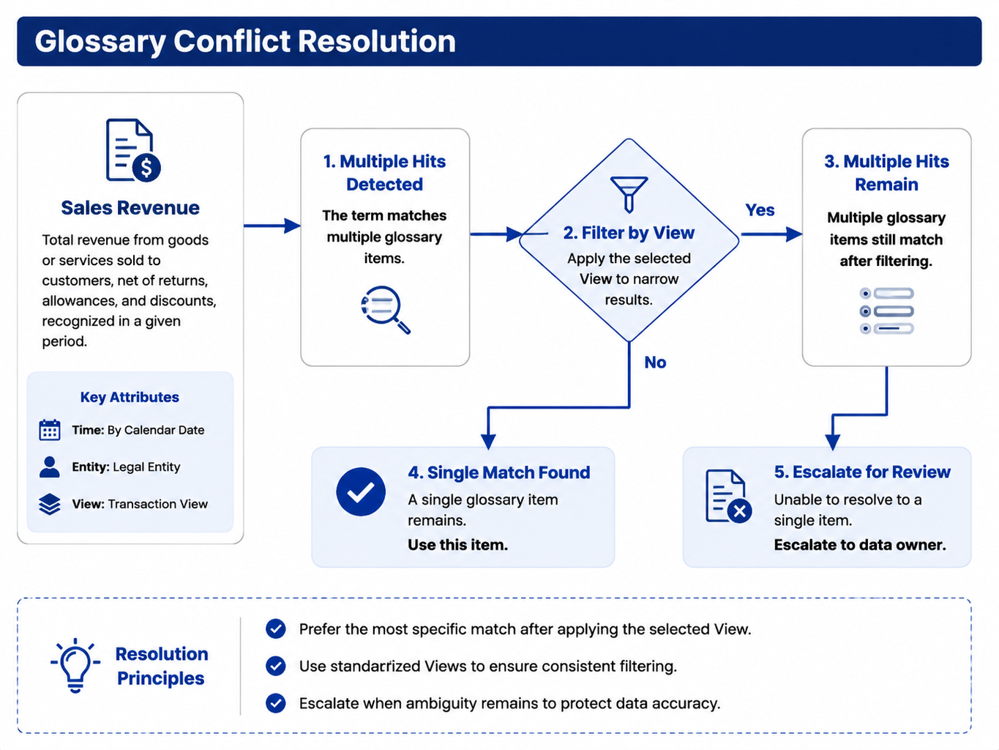

# Chapter 33 Semantic Layer Engineering

---
## Scene Introduction

Chapter 32 has already explained that DataAgent cannot maintain a long-term direct connection to ODS physical tables. When a user asks, "What were the main SKUs driving the sales decline in East China last week?" DataAgent cannot simply hand over the terms "sales," "East China," and "last week" to the model for free interpretation. "Sales" might mean operational GMV, or financial GMV excluding tax; "East China" might come from organizational master data or from historical regional divisions; "last week" might be based on the natural calendar week or the company's financial week.

The purpose of the semantic layer is to fix these easily drifting business definitions. The data platform team maintains metrics, dimensions, joins, default filters, permissions, and versions in the semantic layer; DataAgent calls the semantic layer at runtime, binding the spoken slots in the Question Frame to executable entities. This way, the model is responsible for planning and expression, while the semantic layer ensures factual consistency.

The most common data dispute in an operating meeting is often "how exactly was this number calculated?" The same word, "sales," may mean promotional-adjusted GMV for operations, tax-excluded revenue for finance, return-adjusted sales for a regional team, or payment-time GMV for an e-commerce team. Each definition can be valid in its own setting. If DataAgent relies only on table names and column comments, it compresses these differences into one seemingly definite field.

The semantic layer solves the risk of SQL that is syntactically correct but wrong for the business. It organizes metrics, dimensions, join paths, permissions, versions, and default filters above physical tables into a machine-executable business model. DataAgent can use models to understand user language and choose candidates, but the final definition must come from Metric, Dimension, View, and Glossary objects in the semantic layer.

This chapter focuses on DataAgent's consumer side. Chapter 15 discusses metadata and metric construction from the data platform perspective; this chapter explains how DataAgent reads the semantic layer during a Run, disambiguates terms, and carries trusted context into answers and Trace.

---
## 33.1 Semantic Layer as the Trusted Foundation for Data Questions

The semantic layer is a business abstraction built on top of physical tables. It centrally defines Measures, Dimensions, Hierarchies, Views, Join paths, and access policies, and exposes them to upper-layer applications via SQL, REST, GraphQL, or product APIs. Solutions like Cube, MetricFlow, and the dbt Semantic Layer fall into this category.

Without a semantic layer, DataAgent faces three major instability issues when generating SQL. First, the metric definitions are unstable: for example, whether sales revenue includes tax, excludes returns, or accounts for promotional adjustments. Second, Join paths are unstable: the model may guess wrong on fact-to-dimension table relationships, causing duplicates or missing rows. Third, security is unstable: a single physical table may contain both publicly available metrics and sensitive fields, and naïve table selection risks unauthorized exposure.

*Table 33-1: Risks without a semantic layer vs. constraints the semantic layer provides. Source: Compiled by the author.*

| Issue           | Risk Without Semantic Layer                     | Semantic Layer Constraint                  |
|-----------------|------------------------------------------------|--------------------------------------------|
| Metric Definition | Model guesses GMV definition independently      | Metric definitions and versioning           |
| Join Path       | Arbitrary physical table Joins                   | Pre-modeled relationships and Views         |
| Permissions     | Direct exposure of sensitive columns            | Row and column permissions, role-based Views |
| Data Freshness  | No knowledge of data sync time                    | Metadata and quality signals                  |

The semantic layer goes beyond writing Chinese comments on tables. Comments can help the model understand column names but cannot express aggregation formulas, default filters, versions, permissions, or the Join graph. DataAgent needs executable Metrics, not descriptive text.

The semantic layer also cannot be replaced by Memory. Memory can record that a user last confirmed "show year-over-year" or "default view East China," but the mathematical definitions of metrics must come from semantic layer versions. If GMV formulas are hardcoded in long-term Memory, organizational changes or accounting policies shifts will cause DataAgent to keep using outdated definitions.

The value of the semantic layer also lies in cross-product consistency. If BI dashboards, DataAgent Q&A, scheduled reports, and alerting systems each maintain separate metric definitions, short-term development is faster, but long-term reconciliation is painful. A platform-level DataAgent should consume a unified semantic layer rather than duplicating an Agent-specific YAML file just because the model "understands it better." Agents may have their own prompt and query strategies, but should not redefine GMV formulas.

Clear division of roles between the construction and consumption sides is high-risk. The data platform team is responsible for model publishing, metric approval, lineage, and quality. The DataAgent team is responsible for mapping user language onto these models and explaining results to business users. DataAgent can provide feedback to the data platform on "which terms are often ambiguous," "which metrics lack titles," "which Views are too large causing linking noise," but should not bypass the data platform to directly modify tables or change definitions.

---
## 33.2 Metric, Dimension, View, and Glossary

When DataAgent consumes the semantic layer, it most commonly interacts with four types of objects. A **Metric** defines an aggregatable measure, such as operational GMV, order volume, or gross margin rate. A **Dimension** defines slicing attributes, such as region, category, channel, or SKU. A **View** defines the set of metrics and dimensions visible to a certain type of user. A **Glossary** defines mappings from business terms to semantic objects. For example, "revenue," "sales," and "GMV" might correspond to multiple different metrics.

*Table 33-2: Semantic layer objects and their usage in DataAgent. Source: Compiled by the authors.*

| Object   | Purpose                         | DataAgent Usage                             |
|----------|--------------------------------|--------------------------------------------|
| Metric   | Metric formula, default filters, versions | Bound to the metric slot in the Question Frame |
| Dimension| Filtering, grouping, drill-down fields       | Bound to dimensions like time, region, SKU |
| View     | Role- or scenario-based visibility scope     | Restricts objects visible to the Planner   |
| Glossary | Business term mappings                      | Converts user colloquial terms into candidate metrics |

Each Metric should have at least a programmatic ID, a display title, a definition, an owner, version, and default filters. The display title is important because it appears in user-facing answers. For example, DataAgent should say "Operational GMV `gmv_ops@2025Q1` decreased by 12.3%" rather than only "GMV decreased by 12.3%." This lets users know which calculation perspective the system is using.

Planners should not see the entire repository's DDL. A safer approach is layered pruning: after login, users receive a View summary based on their role; the Linker recalls a few candidate Metrics and Dimensions based on the question; joins, default filters, and SQL compilation remain inside semantic layer APIs. This controls context length and prevents the model from making erroneous associations after seeing unrelated tables.

```yaml
view: sales_ops
metrics:
  - gmv_ops
  - gmv_tax_excluded
  - order_count
dimensions:
  - region_code
  - category
  - sku
  - week
```

The above summary only tells the Planner "which objects are available for planning in the current role." It is not the full semantic layer model and does not include all physical join details. The full definition is still held by the API under `infra/semantic_layer/`.

The granularity of a View should suit the role, not the database structure. An Operations Director needs visibility into region, category, SKU, channel, and operational GMV; a Financial Controller needs to see gross margin, cost, and tax-excluded revenue; a Store Manager might only see their own store. A View too large causes a flood of Linker candidates; too small causes frequent refused answers. The View's design should be continuously adjusted based on business roles and common questions.

The Glossary is not a one-time dictionary. Business terms evolve; users employ abbreviations, aliases, and colloquial expressions. For example, "revenue," "sales," "turnover," and "GMV" might mean different things in different companies. The Glossary should record synonyms, applicable scope, candidate Metrics, and default strategies, and feed high-frequency clarification questions back into the data governance process. Without a Glossary, the model guesses business meanings from table and column names alone, leading to poor stability.

Metric `title` and `description` are runtime fields as well as documentation fields. They enter DataAgent's answers, follow-up questions, and trace logs. Titles that are too engineering-like, such as `gmv_ops_v2`, confuse business users; descriptions that are too marketing-like fail audit requirements. A better practice is a short title plus precise definition, for example: "Operational GMV: includes promotional adjustments, counted by order creation time, deducts some returns." Such text disambiguates the model and explains to users.

---
## 33.3 Schema Linking and Field Disambiguation

Schema Linking is the process of binding the natural language slots in a Question Frame to semantic layer objects and the necessary physical schema. For example, when a user says "sales decline," the Frame might only contain `metrics: [gmv]` and `task_type: diagnose`; the Linker must further determine which Metric this `gmv` refers to, which version, and what dimensions and filters apply.


*Figure 33-1: Schema Linking flow. Source: drawn by the author. Alt text: The process starts from the user query, through term recognition, candidate field recall, scoring by signal, disambiguation confirmation, and outputs a Linked Schema bound to specific Metrics and fields.*

The Linking process typically proceeds in three steps. The first step uses a Glossary to find candidate objects, for example, "sales" or "GMV" hitting on both Operations GMV and Finance GMV. The second step uses Views to filter out objects that the current user is unauthorized to access or that are not applicable in the current context. The third step recalls candidate fields within allowed scope via vector retrieval, historical successful Runs, and column annotations, then reranks them by rules or model.

*Table 33-3: Sources of Linking signals. Source: compiled by the author.*

| Signal             | Priority | Description                            |
|--------------------|----------|------------------------------------|
| Glossary           | High     | Business terms mapped to candidate Metrics |
| View               | High     | Visibility scope for roles and tenants      |
| Vector Retrieval   | Medium   | Recall fields within allowed scope           |
| Historical Success Run | Medium | Requires validation of Metric version       |
| Model Free Inference | Low      | Must pass schema validation                |

Continuing the "East China decline" example from Chapter 32, the Linker will first recognize "sales" as a GMV candidate, then narrow down using the `sales_ops` View and the user's role. If two legitimate definitions remain, it may prompt the user for clarification or use role defaults, clearly indicating this in the response. Subsequently, "East China" is mapped through the organizational hierarchy to `region_code = 'EAST'`, and "SKU" is bound to the product dimension allowed by the current View.

```json
{
  "metrics": [{"metric_id": "gmv_ops", "version": "2025Q1", "title": "Operations GMV"}],
  "dimensions": ["region_code", "sku"],
  "filters": [{"field": "region_code", "op": "eq", "value": "EAST"}],
  "time_range": {"grain": "week", "range": "last_week"},
  "view": "sales_ops"
}
```

Linking failures typically do not appear as SQL syntax errors, but as queries that are legal but have incorrect definitions. For example, linking to deprecated columns, combining fields across Views, or conflating same-named but semantically different fields as one dimension. DataAgent should record candidates, scores, final choices, and disambiguation reasons in Trace logs to support replay as detailed in Chapter 38.

Linking also requires an evaluation dataset. Samples should include real user wording, abbreviations, typos, cross-department terminology, and boundary cases requiring refusal, alongside engineer-crafted standard questions. Each sample should be annotated with the expected Metric, Dimension, View, whether clarification is needed, and error candidates that must not be used. This enables detecting cases where the model appears to generate correct SQL syntax but actually selects the wrong definition.

Historical successful Runs can assist Linking, but must include version validation. Just because a user successfully queried "East China sales" last month using `gmv_ops@2025Q1` does not mean all "East China sales" queries this year should reuse that definition. If the semantic layer updates to `2025Q2`, past Runs can only serve as candidate signals, not direct binding results.

Vector retrieval also requires scope restriction. Putting all column names and comments into a vector database makes it easy to recall similar fields; however, if filtering by View, tenant, and permissions is not first applied, the model may see fields it shouldn't. The correct order is to first filter by visibility scope, then recall and rerank candidates within that scope. Retrieval is an aid to disambiguation, not a permission system.

---
## 33.4 Metric Conflicts, Versions, and Scope of Applicability

Multiple legitimate metric definitions often coexist within enterprises. For example, the finance team may maintain a tax-excluded GMV, while the operations team tracks an operational GMV that includes promotional adjustments; headquarters may use a group-level standard, whereas regional teams use local definitions; the definitions for 2024 and 2025 might also differ. DataAgent cannot hide these conflicts.



*Figure 33-2: Glossary multi-metric disambiguation process. Source: drawn by the authors. Alt text: When one term matches multiple metrics, the process narrows candidates step-by-step according to view scope, user role, and historical preferences, asking the user if necessary.*

*Table 33-4: Handling strategies for metric conflicts. Source: compiled by the authors.*

| Situation | Handling Approach | User-Visible Expression |
|---|---|---|
| Unique after View filtering | Auto-select | Show metric title and version |
| Multiple remain within same View | Ask user or use default metric | Indicate default source |
| Metric versions span different periods | Match by effective date | Mark as `metric_id@version` |
| No safe match | Refuse to answer or escalate to human | Explain lack of available definition |

Versioning addresses the issue of a single metric evolving over time, while scope of applicability addresses which users the metric is valid for. A Run must at least record the `metric_id`, `version`, effective time, View, tenant, and default filters. When users ask, "Which GMV did you just use?", the system should be able to answer directly rather than re-explaining in natural language.

Enforcing a single company-wide standard reduces dialogue complexity but is often unrealistic for enterprises with multiple business lines. Allowing multiple standards to coexist requires making the selection process explicit. An even more dangerous practice is multiple standards coexisting in the backend while the frontend shows only a single label like "Sales." This may seem simpler for users initially but will prevent DataAgent from reconciling with official reports over time.

Metric version changes must affect DataAgent behavior. When new versions go live, the system cannot simply overwrite old definitions because historical reports need to be reproducible and incomplete Runs may still use old versions. A safer approach is to maintain both old and new versions during a transition period; the semantic layer returns version effective dates, and the Planner selects versions based on the query's time range and current View. When comparing across versions, the system should mark "Definition changed" and require manual confirmation if needed.

User default strategies must also be auditable. For example, an operations director defaults to operational GMV, while a financial controller defaults to financial GMV. Such defaults reflect organizational policy, not model preference. The source, version, and applicable role should be written into Trace. Otherwise, when the same term "Sales" returns different values for different users, the platform cannot explain the sources of discrepancies.

When conflicts cannot be resolved, refusing to answer is better than providing incorrect answers. DataAgent can say, "There are currently two definitions for Sales in the semantic layer; please choose operational GMV or financial GMV," optionally with a brief explanation of differences. After the user selects, the system continues execution. This extra interaction step avoids burying definition conflicts in the final numbers.

---
## 33.5 Trusted Context: Permissions, Lineage, Quality, and Freshness

Metric definitions answer the question "How is the number calculated?" Trusted context answers "Can the user see it? Where does the data come from? What is the quality? Until when is it synchronized?" DataAgent should return numbers together with these signals as footnotes or trace data when necessary.

*Table 33-5: Sources and Uses of Trusted Context. Source: Compiled by the author.*

| Dimension | Source | DataAgent Usage |
|---|---|---|
| Permissions | Semantic layer RBAC, Policy | Intercept unauthorized queries before execution |
| Lineage | OpenLineage, DataHub, Metadata services | Explain data origin and model versions |
| Quality | dbt tests, Great Expectations | Reduce confidence in conclusions under quality anomalies |
| Freshness | Partition time, synchronization task status | Indicate data cut-off time or refuse to answer |

In an East China downturn analysis, `trusted_context()` might return references to Views, policies, underlying tables, model versions, quality status, and the latest sync time. The Planner does not need to show all this raw JSON to the user but should convert it into concise natural language footnotes. For example: "Data sourced from `orders_fact v3`, synchronized until 2025-06-14 06:00; SKU null rate slightly high, drill-down conclusions are for reference only."

If freshness exceeds SLA, the system can refuse to answer, suggest retrying, or escalate to human-in-the-loop (HITL) confirmation of whether to show results. For multi-source queries, avoid labeling only the fastest data source; a more reliable approach is to use the worst freshness or to explicitly label synchronization times for key data sources.

Trusted context should be named separately from Memory. Memory may record user preferences for year-over-year comparison display; Org Context may record regional or organizational definitions; the semantic layer defines Metric definitions and versions; Metadata services track quality and freshness. Mixing these diverse sources into a single "context" field risks models mistaking preferences for facts or old memories for official definitions.

The presentation of trusted context in responses should be layered. Regular queries do not require a full lineage graph but should at least state metric definitions and data timestamps; quality anomalies should add a cautionary note; formal reports should include lineage, quality status, and executed SQL in appendices or audit dashboards. Showing too much information can distract business users, while showing too little weakens trust. Product layouts can put brief footnotes inline and full evidence in expandable areas.

Quality signals must also affect conclusion confidence. If SKU null rate is slightly elevated, the system can still answer top category queries but should weaken SKU-level conclusions; if the fact table delay exceeds SLA, the system should refuse to generate "latest" conclusions; if an upstream job in the lineage failed, the report should go to human review. Trusted context is not decoration; it changes whether the Planner proceeds, how it expresses results, and whether HITL is required.

Multi-source queries require particular caution. A question may read from orders, returns, and promotions tables simultaneously. Each data source has different freshness and quality status, so the response cannot show only the best state. For operational analysis, the most conservative sync time should typically be used, or explicitly state: "Order data as of 06:00, return data as of 04:00." This prevents users from mistaking mixed definitions as a single consistent timestamp.

---
## 33.6 Semantic Layer Interface and DataAgent Query Chain

In the mini-platform, the semantic layer target interface is located at `infra/semantic_layer/`, while the DataAgent's Linker is located at `agents/data_agent/`. Some implementations in the current repository remain target contracts; this chapter focuses on the interface shape and dependency direction.

```text
mini-platform/infra/semantic_layer/
├── client.py
├── models/
└── __init__.py

mini-platform/agents/data_agent/
└── linker.py
```

`resolve_metric()` is responsible for parsing the colloquial metric into candidate Metrics; `compile_query()` compiles disambiguated Metrics, Dimensions, filters, and time ranges into executable queries; `trusted_context()` returns permissions, lineage, quality, and freshness information. The Planner can read the results but cannot override the Measure aggregation logic.

```json
{
  "metrics": ["gmv_ops"],
  "dimensions": ["region_code", "sku"],
  "filters": [{"field": "region_code", "op": "eq", "value": "EAST"}],
  "time_range": {"start": "2025-06-09", "end": "2025-06-15", "grain": "week"},
  "view": "sales_ops",
  "tenant_id": "demo-tenant"
}
```

For production deployment, at least four things must be ensured. First, production queries go through semantic layer Views so that DataAgent does not directly connect to physical tables long-term. Second, Metric changes have versioning, owners, and approval records. Third, Linking logs retain candidates and final selection rationales. Fourth, freshness or quality anomalies can affect answers rather than only being logged in the backend.

Common failures also cluster around these boundaries. When Views are too large, Linking still exceeds context limits and must generate sub-Views by intent; when IAM does not inject `semantic_view`, the request should be rejected rather than degraded to full database access; when versioning of Metrics in historically successful SQL is expired, it cannot be reused directly; for Cube or MetricFlow cold start timeouts, the Run should fail or retry instead of allowing the model to bypass the semantic layer and write physical SQL directly.

The initial implementation can first deliver a narrow interface rather than trying to ship the full semantic layer product in one go. The first version only needs to support core Metrics, common Dimensions, role-based Views, Glossary, and `compile_query()`; after stabilizing the query count pipeline, more lineage, quality, and complex Join capabilities can be integrated. The interface should remain stable, while the underlying implementation can gradually migrate from self-developed YAML to Cube or MetricFlow.

Testing should also focus on the interfaces. `resolve_metric()` tests disambiguation and rejection scenarios, `compile_query()` tests default filtering and View restrictions, `trusted_context()` tests quality and freshness anomaly cases, and Linker tests candidate recall and version consistency. Simply testing whether the final SQL executes does not cover the most high-risk risks of the semantic layer.

---
## 33.7 Acceptance Criteria for Semantic Layer in the Production Chain

After the semantic layer enters the DataAgent production chain, it is no longer only a metric dictionary. It serves NL2SQL, permission filtering, result explanation, lineage tracking, and evaluation sample construction. A metric is usable only when its formula compiles and its version, scope, dimension constraints, freshness, and owner are clear. Otherwise, even if the model finds the metric name, it cannot know whether the metric fits the current question.

The relation between semantic layer and NL2SQL should remain one-way. NL2SQL may select metrics, dimensions, and filters from the user question, but definitions must come from registered Metrics. The execution engine may compile SQL, but sensitive detail access still passes through semantic layer Views and Policy. This makes the first version more conservative, yet it removes many failures where SQL runs successfully but the business rejects the result.

Permissions should also enter early. If the model first sees the full schema and permissions are filtered only before execution, sensitive table names, field names, and business meanings may already have entered context and Trace. A better design generates a user-scoped Linked Schema first, then passes it to NL2SQL. The model can only produce queries inside the allowed range, while Policy still performs a second check before execution.

Acceptance also includes whether the explanation can be reviewed by business users. Many semantic-layer tests only check that SQL compiles or that a metric returns a number. DataAgent also needs to show metric title, version, default filters, and data time to users. When a business user sees "Operational GMV `gmv_ops@2025Q1`," they should understand why it differs from financial revenue. When an auditor replays a Run, the same version should explain why it was valid at that time.

## 33.8 Regression Governance for Semantic Layer Changes

Once the semantic layer is in production, it should be released like software. A metric formula, dimension enumeration, field alias, or business term change can affect NL2SQL generation, historical report replay, evaluation results, and user understanding. The platform should treat semantic changes as versioned objects with review, regression, canary rollout, and rollback.

Seemingly equivalent business words are especially risky. Operations may rename "GMV" to "transaction amount"; finance may redefine "net revenue" after rebates; regional teams may change "East China" from a sales organization to a fulfillment organization. The model does not know the organizational meaning behind such changes. It only selects from visible context. Glossary aliases, Metric versions, and View applicability should therefore be published together.

Regression samples should cover three groups. Stable questions should keep the same business meaning or explicitly mark that a definition changed. Boundary questions should refuse or clarify when the request is outside the current permission, time range, or organization scope. Explanation questions should still show the metric version, filter conditions, and data snapshots after the change. This governance increases release cost, but it prevents the more expensive situation where a system returns SQL that works while the business says the answer is wrong.

## 33.9 Joint Design of Semantic Layer and Permissions

The semantic layer is often treated as data modeling, while permissions are treated as security. DataAgent makes these two designs inseparable. The fields, metrics, and dimensions visible to the model already shape possible SQL generation. If permissions only block execution at the end, the model may still expose unauthorized field meanings through prompts, traces, or error messages.

The safer design creates a semantic view scoped by user, tenant, data domain, and time window before NL2SQL runs. Scope pruning should remove tables, fields, explanations, examples, and dimension values that imply unavailable data. If a user cannot see customer phone numbers, the schema context should not include descriptions or examples that disclose what the field means. If a tenant cannot access a region, dimension values and sample questions should shrink accordingly.

This affects caching. Many systems want to cache schema context to reduce latency, but semantic context is permission-bound. The platform can cache public metric definitions and field metadata; the final Linked Schema sent to the model should still be generated per tenant, role, data domain, and time range, with a version recorded in Trace. Trace should say which semantic view a Run used, rather than only "semantic layer enabled."

Permission handling also needs business-facing explanations. If the user cannot view details, a technical error is not enough. The answer should explain which aggregate level remains available, how to request permission, or when to transfer to human review. In this role, the semantic layer describes visible capability: what the model and user can ask under the current authority.

## 33.10 Release Discipline for Semantic Layer Changes

Metric definitions, dimension hierarchies, synonyms, field aliases, and permission tags all change the candidate space for NL2SQL and the explanation layer for reports. Many DataAgent incidents are not caused by a weaker model. They come from semantic-layer changes that evaluation did not cover: an order date becomes a shipment date, a refund condition changes, or one business word is reused across data domains.

Semantic releases should pass three types of checks. Static checks verify that referenced fields exist, aggregation functions match field types, time grains can drill down, and permission tags are complete. Regression checks replay historical high-frequency questions, incident questions, and business-review questions, comparing generated SQL, execution results, explanation text, and EvidenceRef changes. Impact checks list the Agents, reports, data products, and evaluation sets affected by the change.

Canary rollout should compare more than whether the answer looks correct. The platform should record old and new schema-linking results, SQL diffs, execution latency, row counts, and metric explanation diffs for the same sample set. When numbers change, reviewers need to know whether the cause is a definition change, data refresh, permission shrinkage, or generation error. Without this release discipline, Chapter 34 NL2SQL validation, Chapter 38 Trace replay, and Chapter 39 evaluation can only show symptoms, not root causes.

## 33.11 Semantic Layer in Incident Review

When DataAgent gives a wrong answer, teams often blame the model first. In production, the semantic layer should be investigated early. A complete review starts from the original user question and checks term recognition, data domain selection, metric matching, dimension filtering, permission pruning, SQL generation, and report explanation. If any step lacks version evidence, the review becomes guesswork.

Incident review should distinguish wrong definitions from insufficient coverage. Wrong definitions require fixing metrics or field relationships and rerunning historical samples. Insufficient coverage requires adding synonyms, business terms, example questions, or data-domain descriptions. Prompt adjustments can make the model more cautious, but metric governance and permission rules still belong in the semantic layer.

The source of a fix should also be recorded: business review, online complaint, evaluation failure, or data quality alert. The source affects confidence and release speed. In the Chapter 32 architecture, the semantic layer sits between user questions and execution. In Chapter 38 Trace, it becomes intermediate evidence for every Run. Together, these views make semantic layer a governance entry point, rather than only a query knowledge base.

## 33.12 Semantic Layer and Data Quality Coupling

The semantic layer exposes data quality status, while the data platform remains responsible for quality governance. If a user asks why monthly revenue declined while detail tables are delayed, dimension tables are missing, metrics failed refresh, or outliers remain unresolved, DataAgent should not give a confident explanation. The semantic layer should pass freshness, quality rules, anomaly alerts, and applicability into NL2SQL and reporting so the answer becomes cautious when evidence is weak.

Quality status also affects query generation. If a metric did not refresh today, the system can use the last complete period or ask whether the user accepts incomplete data. Silently mixing fresh and stale data makes results hard to review. If a dimension is unstable, the system should avoid making it the sole basis for attribution. Once quality constraints enter context, the model has a chance to generate a suitable query and explanation.

The user-facing wording matters. Backend alerts can say partition delay, uniqueness check failed, foreign key missing, or null rate exceeded. Business users need impact language, such as "Order data is synchronized to 06:00, but return data is synchronized to 04:00, so this gross-margin analysis should not be used for closing." This tells users how far the result can be trusted while preserving evidence.

Quality status can also change automation level. When freshness is normal, metric versions are stable, and permissions are clear, DataAgent may complete read-only questions automatically. When quality is abnormal but still usable, the system can produce a draft with limitations. When quality is severely abnormal, it should refuse to produce a formal conclusion and transfer the issue to a data owner or wait for refresh. DataAgent becomes credible only when it adjusts task path according to evidence strength.

From an operating perspective, the semantic layer team needs a stable feedback entry point. If users report definition disputes, DataAgent should record the Metric, View, user role, and original phrasing. After the data team fixes the definition or quality issue, the affected acceptance samples should show the change. Semantic-layer maintenance then becomes part of DataAgent production operations, not background documentation.

---
## Chapter Recap

The semantic layer is the foundation for trusted DataAgent querying. It manages metrics, dimensions, joins, permissions, versions, and trusted context. DataAgent should consume Metric, Dimension, View, and Glossary objects instead of sending full database DDL to the model. Schema Linking must disambiguate among Glossary, View, retrieval signals, and historical Runs, with the final selection written into Trace. Metric conflicts should remain visible: Runs and answers need `metric_id@version`, View, and default-source evidence.

Permissions, lineage, quality, and freshness are part of trusted context. They should appear in answer footnotes and audit replay when relevant. The semantic layer also needs release discipline: versioned changes, regression samples, canary comparison, incident feedback, and quality-state coupling. Without that discipline, DataAgent may still produce fluent answers, but the numbers will not stand up in business review.

## References

Cube. (2025). *Introduction: Cube semantic layer*. [https://cube.dev/docs/product/introduction](https://cube.dev/docs/product/introduction)

dbt Labs. (2024). *About MetricFlow*. dbt Developer Hub. [https://docs.getdbt.com/docs/build/about-metricflow](https://docs.getdbt.com/docs/build/about-metricflow)

Liu, X., et al. (2025). A survey of Text-to-SQL in the era of LLMs. *IEEE TKDE*, 37(10), 5735-5754. [https://doi.org/10.1109/TKDE.2025.3592032](https://doi.org/10.1109/TKDE.2025.3592032)

Lei, F., et al. (2024). Spider 2.0: Evaluating language models on real-world enterprise text-to-SQL workflows. *ICLR 2025*. arXiv:2411.07763. [https://arxiv.org/abs/2411.07763](https://arxiv.org/abs/2411.07763)

Talaei, S., et al. (2024). CHESS: Contextual harnessing for efficient SQL synthesis. arXiv:2405.16755. [https://arxiv.org/abs/2405.16755](https://arxiv.org/abs/2405.16755)

OpenLineage. (2024). *OpenLineage documentation*. [https://openlineage.io/docs/](https://openlineage.io/docs/)
