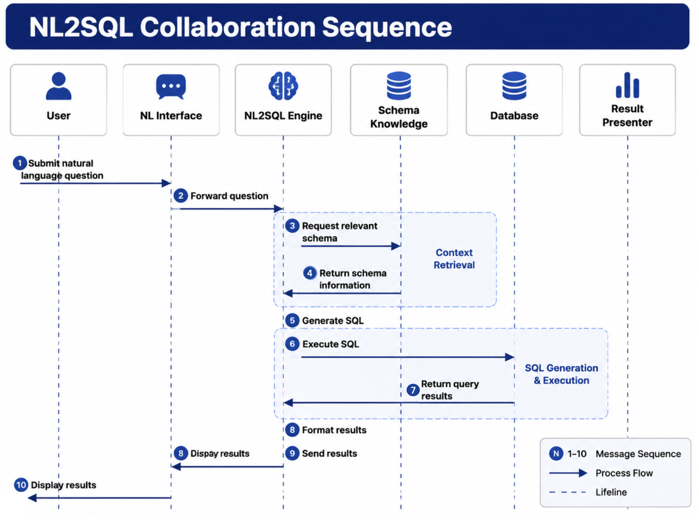

# Chapter 34 Engineering NL2SQL

---
## Scene Introduction

Chapter 33 binds the question "Which were the main SKUs driving last week's sales decline in East China?" to the view `gmv_ops@2025Q1`, with `region_code = EAST`, `grain = sku`, and the current user's `sales_ops` view. The challenge this chapter addresses is: under these constraints, how does DataAgent generate SQL that is executable, auditable, and fixable?

If NL2SQL is simplified to just "the model writes SQL," the system will quickly run into production issues. The model might omit the `tenant_id`, refer to tables outside the Linked Schema, misuse SKU fields, generate a full-database-scan join, or produce conclusions without clear data definitions even if the SQL runs correctly. What DataAgent needs is an engineering pipeline, not a pretty piece of SQL code.

Production incidents rarely appear as pure SQL syntax errors. More often, the SQL runs and the chart renders, but the result drifts away from business rules. One model treats `order_amount` as sales without using the semantic-layer definition `amount_ops`; another forgets to include `tenant_id` until the executor blocks it; a third creates a wide join over two years of order detail to answer a simple SKU question. To users, these should not be explained as model instability. They show that NL2SQL has not been placed inside a governed execution chain.

This chapter places NL2SQL back into the context of the Agent platform. The Planner is responsible for proposing the next action; the semantic layer handles data definitions and joins; the Registry manages tool invocation auditing; the `sql_executor` handles read-only validation and execution; and Observation structures error feedback back to the Planner. What users ultimately see are business explanations, while SQL remains an intermediate artifact.

---
## 34.1 Responsibilities of NL2SQL in DataAgent Run

DataAgent's NL2SQL lives inside the Planner loop. After the Planner obtains the Question Frame and Linked Schema, it can either call the semantic layer to compile the query or request the Gateway to generate or fine-tune the SQL within constraints. When executing the query, the SQL must go through the `sql_executor` in the Registry; neither the model nor the Planner can directly connect to the database.



*Figure 34-1: NL2SQL collaboration sequence. Source: Created by the authors. Alt text: A sequence diagram showing the call order among Planner, semantic layer, Registry, sql_executor, and model gateway, from compiling Linked Schema to SQL execution, observation feedback, and result interpretation.*

A typical invocation can be broken into four stages. The first stage is semantic compilation, which converts Metrics, Dimensions, filters, and time ranges into Semantic SQL or a structured query object. The second stage is SQL generation, which augments sorting, grouping, LIMIT clauses, or specific SQL dialects under semantic layer constraints. The third stage is execution governance, where `sql_executor` performs read-only checks, permission checks, cost estimation, and executes the query. The fourth stage is business interpretation, where the Planner generates an answer based on results, metric context, and trusted context.

In this book, Semantic SQL refers to the SQL or query object where the semantic layer determines aggregation granularity, JOIN paths, and default filters. The Planner may adjust presentation details like `ORDER BY` and `LIMIT`, but it cannot redefine the core formula of a metric like `gmv_ops`. The operations director sees the operational GMV as defined by the semantic layer, not a temporary sum like `SUM(amount)` generated by the model.

This boundary must be reflected at the interface. The semantic layer can return executable SQL or a structured query object; regardless, Metric aggregations, default filters, and JOIN paths should be marked as immutable areas. If the Planner needs to extend the query, it should apply through semantic layer APIs to add new dimensions or filters rather than directly edit aggregation expressions. This ensures the SQL can self-repair without breaking the metric definitions.

---
## 34.2 From Linked Schema to SQL

Continuing with the East China sales decline case, the Linker has output the following constraints.

```json
{
  "metrics": [{"metric_id": "gmv_ops", "version": "2025Q1", "title": "Operations GMV"}],
  "dimensions": ["region_code", "sku"],
  "filters": [{"field": "region_code", "op": "eq", "value": "EAST"}],
  "time_range": {"start": "2025-06-09", "end": "2025-06-15", "grain": "week"},
  "compare_to": {"start": "2025-06-02", "end": "2025-06-08"},
  "view": "sales_ops",
  "tenant_id": "demo-tenant"
}
```

During semantic layer compilation, default filters, time dimension tables, join paths, and metric aggregation logic are injected. The `tenant_id` and row-level permissions are enforced and appended at the execution layer or by Policy, and should not rely on the model to remember. A simplified SQL query might look like this:

```sql
SELECT
  o.sku_id AS sku,
  SUM(CASE WHEN o.order_week = '2025-W24' THEN o.amount_ops ELSE 0 END) AS gmv_last_week,
  SUM(CASE WHEN o.order_week = '2025-W23' THEN o.amount_ops ELSE 0 END) AS gmv_prior_week
FROM analytics.orders_fact AS o
WHERE o.tenant_id = 'demo-tenant'
  AND o.region_code = 'EAST'
  AND o.order_week IN ('2025-W23', '2025-W24')
  AND o.is_internal = false
GROUP BY o.sku_id
ORDER BY (gmv_last_week - gmv_prior_week) ASC
LIMIT 50;
```

The key point of this SQL is not the syntax, but its origin. The `amount_ops` comes from the definition of `gmv_ops`; `is_internal = false` comes from the metric's default filter; the time range comes from the Question Frame; `tenant_id` comes from IAM and Policy. If the model generates similar SQL on its own, it must go through the same validation.

In a large schema, pruning happens before generation. The prompt should only include a small subset of tables and columns relevant to the current question, not the entire database DDL. Frameworks like CHESS emphasize a workflow of first retrieving, then selecting the schema, then generating, then validating. The underlying principle aligns with this book's: large-scale NL2SQL must first reduce the context window, then have the model write SQL.

Pruning results must also be recorded for auditing. Which tables, columns, and candidate schemas were used or excluded in a query determines what SQL the model can generate. If a user questions "Why wasn't the returns table queried?", the platform should be able to explain that the current Question Frame does not include returns analysis, or the active View forbids access to returns details. Without pruning records, it is very difficult to trace whether erroneous SQL resulted from a linking error, pruning error, or model generation error.

---
## 34.3 Generation Route Selection

NL2SQL engineering does not have a single fixed route. Enterprises can select a combined approach based on historical SQL, schema size, localization requirements, and latency budgets.

*Table 34-1: Common SQL Generation Routes. Source: Compiled by this book.*

| Route            | Approach                                       | Applicable Scenario                         |
|------------------|-----------------------------------------------|---------------------------------------------|
| Example-Driven   | Retrieve similar historical questions and SQL as examples | Large accumulation of questions and SQL    |
| Stepwise Decomposition | Linking first, then classification, generation, and fixing | Complex schema, requiring interpretability |
| Large Schema Pruning | Narrow down tables and columns first, then generate and verify | Thousands of columns, cross-domain data warehouse |
| Open Source Model Training | Train or fine-tune models with SQL corpora       | Localization and cost sensitivity           |

In the East China case, the scale is small, so semantic layer compilation plus light Gateway fine-tuning is sufficient. For a group-wide data warehouse, a single View may still contain many tables and columns, requiring a heavier pruning pipeline. If an enterprise cannot send schema and questions to a closed-source model, it can integrate a local SQL-specialized model through the LLM Gateway in Chapter 45.

When selecting routes, avoid two extremes. One is using one giant prompt for all questions, letting the model resolve metrics, fields, joins, and security itself. The other is over-fragmenting the flow, causing a simple query to trigger a dozen model calls. The first version can prioritize semantic layer compilation, accumulate error samples, and then decide whether more complex pipelines are needed.

After accumulating error samples, the generation route can be gradually upgraded. Repeated column name errors indicate linked schema or field aliasing needs strengthening; repeated join errors indicate semantic layer join graph or compiler issues; repeated failure to generate SQL for complex attribution problems means switching to the Python analysis in Chapter 35 instead of forcing the model to write more complex SQL. NL2SQL improvements should not rely solely on prompt tweaks but return to semantic layer, linker, executor, and evaluation datasets.

Historical SQL examples also require caution. Similar questions can provide good examples, but historical SQL may contain old metric versions, outdated field names, or overly broad permissions. After retrieving examples, `metric_id@version`, Views, tenant scope, and dialect should be checked before including them in the model context. Otherwise, example-driven methods may replicate historical technical debt into new runs.

Dialect is also part of route selection. DuckDB, Postgres, Trino, Snowflake, and BigQuery differ in date functions, window functions, Limit syntax, JSON fields, and identifier escaping. DataAgent should not let the model guess the dialect but have the semantic layer or executor explicitly pass the `dialect`. SQL generation, AST parsing, EXPLAIN, and execution must use the same dialect configuration or else local verification may pass but online execution fail frequently.

Caching can reduce latency but must not break auditing. Semantic layer compilation results, schema pruning results, and historical example retrieval results can be cached; final SQL results can also be cached by tenant, metric version, time range, and permission context. Cache keys must include `metric_id@version`, View, tenant, filters, and data freshness, otherwise users may receive outdated metrics or results from other authorization domains.

---
## 34.4 Pre-Execution Validation and Self-Healing

Before SQL reaches the OLAP system, it must pass at least four types of validation. Syntax validation ensures dialect correctness; read-only validation rejects DDL, DML, export, and write operations; schema validation confirms table columns belong to the Linked Schema and Views; cost validation uses EXPLAIN, partition filters, and row count thresholds to prevent runaway queries. Policy validation also verifies `tenant_id`, row-level permissions, and field masking.

*Table 34-2: SQL Validation Layers. Source: Compiled by this book.*

| Validation Layer | Primary Issues | Failure Handling |
|---|---|---|
| Syntax | Invalid dialect, incorrect column references | Return structured error to Planner |
| Read-Only | DDL, DML, export, write operations | Reject immediately, no retries |
| Schema | Table columns not in Linked Schema | Fallback to relinking or fix SQL |
| Cost | Missing partitions, overly broad joins | Reject execution or require query narrowing |
| Policy | Unauthorized access, missing tenant filters | Deny response and audit |

Self-healing is only suitable for fixable errors. For example, if the column name `sku` is mistakenly written as `sku_id`, the Planner can retry based on Observations and the Linked Schema. Unauthorized errors, sensitive field access, or missing permissions should not be retried, as the model must not circumvent security boundaries through repeated attempts.

```json
{
  "status": "error",
  "code": "TOOL_EXECUTION_ERROR",
  "message": "column \"sku\" not found",
  "hint": "linked_columns contains sku_id, not sku",
  "sql_hash": "a3f8c2",
  "retry_count": 1,
  "max_sql_retries": 3
}
```

Retry counts should be managed independently from the Run's `max_steps`. Once `max_sql_retries` is exhausted, the Run should enter the `failed` state or, if configured, enter manual repair. The Planner must not loop infinitely on erroneous SQL, nor obscure failures as "temporarily no data."

The design of Observations directly affects self-healing quality. Errors given to the Planner should not be just raw database errors but also include useful repair clues, such as candidate columns, permitted tables, current dialect, failure stage, and retry allowance. Errors shown to users should be more restrained to avoid exposing table structures or permission details. One error object can simultaneously serve Planner, user, and audit needs, but its fields should be layered accordingly.

Self-healing must also prevent calibration drift. When the Planner repairs SQL, it should only change column names, aliases, dialect functions, ordering, or Limit clauses. If the fix requires changing metrics, expanding views, or removing default filters, it should return to Chapter 33 for relinking or enter manual confirmation. SQL running successfully does not guarantee the business logic remains correct.

Failure classification should be incorporated into the evaluation framework. Syntax errors, column name errors, permission errors, timeouts, empty results, and explanation errors correspond to different repair paths. Grouping all as "SQL failures" will lead teams to keep tweaking prompts blindly; separating categories clarifies whether to revise Linker, semantic layer, executor, or response templates. The DataAgent Eval in chapter 39 will continue using these error tags.

Pre-execution review should also handle temporal semantics. Terms like "last week," "this quarter," "same period last year" should not be resolved into date strings by the model on the fly, but uniformly handled by Question Frames and time dimensional tables. Different companies may have varying week start days, fiscal months, and holiday adjustments. If time ranges are freely generated by the model, the SQL may seem valid but the business meaning could be off by a week.

---
## 34.5 Read-Only Execution and Resource Protection

The default posture of the `sql_executor` should be conservative. Allow read-only `SELECT`, read-only CTEs, window functions, and limited `UNION ALL`. Disallow DDL, DML, `SELECT INTO`, file exports, and external functions. The execution account should be read-only, ideally connected to a read-only replica.

Resource protection is equally important. Each query must have statement timeouts, maximum row count, maximum byte size, concurrency limits, and tenant-level QPS limits. When the result set is too large, return samples, statistical summaries, and artifact references instead of stuffing all rows into the model context. What the Planner needs is only the information necessary for interpretation; what auditing needs are the result references and SQL hash. Both do not need to enter the Prompt.

Permissions and data masking are handled in two layers. The `sql_executor` enforces baseline policies, such as read-only mode, timeouts, table blacklists, and requiring tenant predicates. Enterprise policies handle row-level permissions, column-level masking, and role scopes. These form a chain, not an either-or choice. Even if the SQL looks read-only, if the user lacks permission for the current View, execution should be denied.

```yaml
allow_statements: [SELECT]
max_rows: 10000
max_bytes: 5MB
statement_timeout_ms: 30000
require_tenant_predicate: true
deny_tables: [raw_pii, admin]
```

Execution protection cannot rely solely on string matching. A SQL parser should generate an AST to determine the statement type, table references, function calls, and subqueries. The `WITH` clause might also contain write operations or dangerous expressions; seeing the statement start with `WITH` cannot grant a free pass.

Cost protection is especially high-risk in DataAgent. Business users' natural language queries often don't proactively restrict partitions, row counts, or join scopes. The model may generate wide-table queries to answer "why the drop". The executor should estimate scanned rows, join width, and result size during the EXPLAIN phase. If thresholds are exceeded, the Planner should narrow the time range, reduce granularity, or route to offline jobs. A single ad hoc query must not cripple production OLAP.

Result protection also needs proper design. Top-K results can go directly into the model context; full results should be saved as artifacts, passing only references, schema, samples, and hash. When full data is needed for reports or downstream Python analysis, controlled tools should read the artifact, rather than giving the model all detail. This controls token usage and reduces sensitive data leakage risk.

Audit logs must include at least SQL hash, normalized SQL, parameters, user, tenant, Metric version, View, execution time, scan volume, returned row count, and result artifact. External displays do not need all these fields, but internal replay and cost governance require them. Chapter 38's Trace will continue to use this information.

Rate limiting must differentiate by tenant and task type. Ordinary queries can run on online OLAP; complex diagnostics or wide-table exports should enter asynchronous jobs or offline queues. High-priority users do not get to bypass resource protections; they only have different queue priorities or higher quotas. Otherwise, DataAgent's natural language entry becomes a backdoor bypassing data platform governance.

Result truncation must be visible to users. If only the top 50 rows are returned, the answer must not imply it covers all SKUs; if the result set is sampled, conclusions must be limited to that sample. Truncation markers, total row counts, and sorting bases should all be inputs to the Planner. Many misinterpretations are not SQL errors but models not realizing the data they see is truncated.
## 34.6 From Results to Business Explanation

Users don't care whether the SQL is well-written; they care whether the conclusions are trustworthy. After `sql_executor` returns results, the Planner should first produce a result summary: top-K rows, key differences, aggregated values, whether results are truncated, and whether the sample size is sufficient. Then it should merge the `metric_context`, data freshness, and evidence references into a readable response.

```json
{
  "rows": [
    {"sku": "SKU-A", "gmv_last_week": 1200000, "gmv_prior_week": 2100000, "delta_pct": -0.429},
    {"sku": "SKU-B", "gmv_last_week": 980000, "gmv_prior_week": 1100000, "delta_pct": -0.109}
  ],
  "row_count": 10,
  "truncated": false,
  "metric_context": [{"metric_id": "gmv_ops", "version": "2025Q1", "title": "Operating GMV"}],
  "sql_hash": "b7e2a1",
  "freshness": {"orders_fact": {"max_loaded_at": "2025-06-14T06:00:00Z"}}
}
```

A user-facing answer might be:

> Operating GMV in East China (`gmv_ops@2025Q1`) declined by 12.3% last week compared to the prior week. The SKU contributing most to the drop is SKU-A, accounting for about 32% of the regional decline; SKU-B contributes about 11%. Data is from `orders_fact v3`, synchronized as of 06:00 on 2025-06-14.

This response contains the conclusion, the scope of metrics, evidence, and freshness. It does not display the full SQL, but the Trace keeps the SQL hash, parameters, metric version, and result references. When the user follows up with "Does it relate to category structure?", the Planner can expand the Question Frame and proceed into the Python analysis path described in Chapter 35.

If the result is empty, the DataAgent should not simply respond "No issues." It must distinguish between truly no data, overly strict filters, default filter exclusions due to the metric definition, data not yet synced, or lack of user permissions. Different reasons require different responses and next steps.

Business explanations should avoid over-attribution. The SQL result can tell the user which SKUs declined but cannot automatically prove causation. If the user asks "Is it caused by category structure?", the system should enter the analysis path in Chapter 35 instead of making a causal judgment based only on Top SKU rankings. NL2SQL handles data retrieval and initial summarization; attribution, forecasting, and complex statistics require more explicit analysis steps.

During multi-turn questioning, SQL results should enter Working Memory along with the Question Frame. If the user asks, "What about North China?", the Planner can reuse metrics, time filters, and query structure but replace the region; if the user asks to see results "by category," the Planner adds dimensions and re-executes. This maintains context continuity while avoiding using the previous SQL text as the sole basis.

Explanation should also preserve the ability to say "I don't know." If SQL only returns declining SKUs, the system should not answer "The reason is pricing." If the data lacks promotion fields, it cannot judge the promotional impact. A trustworthy DataAgent will clearly state: "This query only identifies declining SKUs; to determine category structure or pricing effects requires further analysis." This boundary explanation is more valuable than forcibly providing conclusions.

The reporting pipeline will reuse the results of this chapter. Chapter 36, when generating charts and reports, should not rerun SQL with unclear metric definitions but use the result artifact, SQL hash, and metric context produced here. This ensures every conclusion in a report can trace back to the original query rather than recalculating numbers anew at report generation.

---
## 34.7 From SQL Generation to a Controlled Execution Chain

`sql_executor` is a Registry Tool. Its inputs include SQL, tenant, Metric context, and an optional Linked Schema summary; outputs include result summary, artifact references, SQL hash, execution statistics, and structured errors. The Planner only uses it through Tool Call and does not connect directly to the database.

```text
mini-platform/tools/sql_executor/
├── handler.py
├── validate.py
├── runner.py
└── policy.yaml
```

Core read-only validation can be implemented using parsing libraries like `sqlglot`. Example code is as follows.

```python
import sqlglot
from sqlglot import exp

def assert_readonly(sql: str) -> None:
    tree = sqlglot.parse_one(sql, read="duckdb")
    if not isinstance(tree, exp.Select):
        raise ValueError("only read-only SELECT allowed")
```

The real implementation is stricter than this example: handling CTEs, UNION, subqueries, functions, export statements, and dialect differences; validating whether table columns belong to the Linked Schema; running EXPLAIN before execution; truncating results after execution and writing artifacts. This example only illustrates the general direction of AST validation.

The directory structure should also separate generation from execution. The `agents/data_agent/` can handle Question Frame, SQL generation prompts, and explanation templates; `tools/sql_executor/` handles validation, execution, and result packaging only; `infra/semantic_layer/` is responsible for Metric compilation. Mixing these in a single module may expedite short-term implementation but makes it difficult long-term to swap databases, change execution strategies, or integrate new semantic layers.

The rollout can start with a narrow closed loop. Initially support single View, a small number of Metrics, read-only SELECT, and fixed dialect; then add multi-dialect support, EXPLAIN cost, artifacts, automatic error correction, and evaluation suites. Do not promise "arbitrary natural language generates arbitrary SQL" from day one. DataAgent's reliability comes from a controlled scope, not covering all queries.

The first regression sets can be small but must cover key boundaries: correct queries, ambiguous metrics, missing time filters, unauthorized tables, timeout queries, empty results, truncated results, column name errors, and dialect errors. Each sample must have expected behavior, which does not have to be success. Rejections, follow-up questions, failures, and handoffs to manual operations are also correct results.

Execution logs should also serve product improvement. Frequent column name errors indicate deficiencies in Glossary or View design; frequent timeouts suggest the default time range or query templates need tightening; frequent empty results may mean metric filters or data freshness warnings are unclear. NL2SQL is not a one-time model capability but an engineering system requiring continuous operation.

Before launch, prepare at least three types of regressions. The first type covers normal queries, e.g., East China weekly comparison of Top SKUs, verifying results include `gmv_ops@2025Q1`. The second type involves safe rejections, e.g., DDL, DML, missing tenant filters, accessing forbidden tables. The third type covers self-corrections, e.g., column name errors, dialect errors, and fixable aggregation errors. Only if both success and failure paths are testable can NL2SQL be production-ready.

---
## 34.8 Failure Replay and Quality Loop for NL2SQL

After NL2SQL goes online, failures spread across several layers. The user question may be ambiguous, the semantic layer may lack the term, the model may select the wrong field, the SQL may execute with the wrong business definition, or the explanation may turn correlation into causation. The platform must record these failures separately. A single "query failed" label gives the team no guidance on whether to fix the Linker, semantic layer, SQL generator, executor, or answer template.

A replayable NL2SQL Run should store a summary of the user question, Linked Schema version, candidate metrics and fields, generated SQL, pre-execution validation result, resource usage, result summary, and explanation text. Sensitive raw data does not need to be retained forever, but reference IDs, field names, row counts, aggregation method, and error codes should be preserved. When a business user challenges a result, the platform should return to the semantic version and evidence used at that time rather than rerunning against changed data.

Self-repair also needs a boundary. Missing columns, type mismatch, and time-window formatting can usually be repaired once with structured error feedback. Permission denial, resource-limit rejection, cross-tenant access, and write requests should stop immediately. Otherwise, the model treats safety controls as ordinary errors and searches for alternate paths. Chapter 50 Policy takes precedence over self-repair.

The evaluation set should contain real business language alongside standard SQL exercises. Samples should include colloquial metrics, time expressions, regional aliases, permission differences, empty results, ambiguous questions, and situations that require clarification. Each failed sample should be attributable to semantic layer, generation model, execution validation, or explanation layer.

## 34.9 Canary Release for the Query Chain

NL2SQL should be released as a query chain. A complete chain includes question understanding, semantic linking, SQL generation, pre-execution validation, read-only execution, result explanation, and frontend display. Changing any link can change the final answer. Canary rollout should therefore publish the chain instead of replacing only a prompt or model.

Canary samples should include real user questions. Public benchmarks help measure SQL generation capability, but production rollout also needs metric aliases, organization definitions, permission differences, empty results, timeouts, clarification, and explanation quality. During canary, the platform can run old and new chains side by side on a small tenant group or shadow traffic, comparing generated SQL, execution result, referenced metrics, and explanation text. Differences are not automatically wrong, but high-impact differences must be explained.

Release records should separate model changes from platform changes. Model replacement, prompt edits, Linker adjustment, semantic-layer updates, and executor-threshold changes all affect the answer, but the risk source differs. The release note should state which layer changed and which sample set proves the risk is controlled. For high-value domains, the new chain can generate suggested SQL and explanations in Trace without changing user-visible answers until data owners and business reviewers approve the difference profile.

## 34.10 Interactive Recovery After Query Failure

After an NL2SQL failure, a technical error message rarely helps the user continue. Different failures need different recovery paths. Ambiguous questions should enter clarification. Missing permission should offer an application path or aggregate-level fallback. SQL syntax errors can self-repair. Resource limit failures should ask the user to narrow time range or granularity. Empty results should explain filters, freshness, and permissions.

Clarification should be structured. If the user asks "How were sales last week?", the system may ask for region, channel, metric definition, or comparison baseline. Each clarification item should come from a semantic-layer dimension or Metric, not from temporary model improvisation. Once the user chooses, the new condition must enter the Question Frame and Trace. Otherwise, replay cannot reconstruct the final query.

Empty results require careful interpretation. They may mean true absence of business data, over-restrictive filters, permission pruning, wrong time windows, or delayed data. The platform should record execution result, filter conditions, freshness, and permission hits separately before the answer layer writes user-facing text. Otherwise, the model may treat an empty result as a business anomaly.

Recovery also has a cost boundary. Automatically widening the time range, rewriting SQL, and switching models after every failure may improve apparent success rates while increasing warehouse scan cost. Production systems should limit self-repair rounds and query budget. After the limit, the user should see a concrete next step: narrow scope, request permission, wait for data refresh, or transfer to human analysis.

## 34.11 Minimum Evidence Package for Failure Replay

Failure replay needs evidence beyond the final SQL. A failure often crosses semantic layer, generator, validator, executor, and explanation layers. The minimum evidence package should include the original user question, session context, semantic-layer version, Linked Schema, candidate metrics and fields, model output or tool arguments, validation errors, execution plan, database response, explanation text, and user-visible result. The goal is not to store everything, but to preserve inputs and outputs at every responsibility boundary.

The replay package should answer three questions. For generation: did the model select the wrong table, omit filters, misunderstand time, or map a business term to the wrong metric? For platform controls: did the semantic layer provide enough context, did permission pruning hide required fields, or did SQL validation allow a dangerous query? For interaction: did the user omit a required condition, did the system ask clarification, and did the user accept a degraded answer?

When failures enter the evaluation set, keep the failure type. Field disambiguation failure, time-window error, permission rejection, empty result, resource overrun, and explanation inconsistency belong to different owners. Averaging them into one accuracy score hides the real risk. Chapter 39 evaluation and Chapter 38 Trace should both reuse this evidence model.

## 34.12 Production Degradation Strategy for Query Chains

Production NL2SQL should treat failure as a normal path. Low-risk failures can ask the user to add time range, business domain, or metric definition. Medium-risk failures can return candidate query explanations and request confirmation before execution. High-risk failures must stop execution and hand the reason to a reviewer or data owner. The risk level depends on permission, data sensitivity, estimated scan size, historical failure type, user intent, and model confidence.

Degradation belongs in Runtime as well as frontend messages. The frontend can show clarification panels and alternative actions, but backend state decides whether execution continues. If a query moves from `running` to `waiting_human`, Trace should record the pause point, approver, approval basis, and resumed SQL. Otherwise, a human confirmation button adds little audit value.

Some scenarios need partial success. An operating analysis may successfully query sales and inventory while customer-service data is delayed. The system does not need to mark the whole Run as failed, but it also cannot provide full attribution. A better response lists completed evidence, missing evidence, and the next recommended step. This mirrors real business work better than a binary success/failure outcome.

## 34.13 Layered Release of SQL Generation Capability

SQL generation capability should open in layers. The first layer supports read-only single-metric queries with one time window and a small set of dimensions. The second layer adds grouping, sorting, period-over-period comparison, and simple attribution. The third layer considers multi-table joins, window functions, subqueries, and complex analysis. Layering lets the team verify semantic layer, validator, resource controls, and user recovery before taking on all SQL risks.

Each layer needs exit criteria. Single-metric queries should be stable before multi-dimensional grouping opens. Resource protection should be stable before wider time ranges open. Failure replay should be reliable before expanding to more domains. If one layer shows frequent failures, the platform should narrow capability instead of giving the model more freedom.

Layered release also helps evaluation. Different layers use different samples and metrics, so simple questions do not hide complex failures. Chapter 39 can report accuracy, execution success, clarification rate, and human-intervention rate by query layer. Business stakeholders also get clearer expectations: first, core metrics can be queried, traced, and refused correctly; second, common comparisons and grouping become stable; third, complex diagnosis enters the analysis chain.

Every layer increase should include user education. Users of the first layer need to understand metric footnotes and refusal reasons. Users of the second layer need to understand period comparisons, grouping, truncation markers, and sorting. Users of the third layer need to understand that complex diagnosis requires more evidence and SQL rankings do not prove causality. Good UI can place this education inside task templates and result explanations.

NL2SQL maturity ultimately depends on operating discipline. Models may improve, but production systems still need semantic constraints, pre-execution validation, resource budgets, error classification, Trace replay, and canary release. Without those controls, stronger generation only makes the system more willing to answer, not more trustworthy.

---
## Chapter Recap

NL2SQL in DataAgent is a collaboration among semantic layer, Planner, Registry, and `sql_executor`; it is not a one-prompt SQL generator. Before SQL generation, Linked Schema and View pruning should constrain the model context. Before execution, SQL must pass syntax, read-only, schema, cost, and Policy validation. Self-repair applies only to fixable errors such as syntax, field names, dialect functions, or aggregation details; unauthorized access and sensitive fields should be rejected.

The user value is a business explanation with scope, freshness, and evidence. SQL is an intermediate artifact. Production readiness depends on failure replay, canary release, interactive recovery, evidence packages, degradation strategy, and layered release of SQL capability. With these controls, DataAgent can grow from demo querying into enterprise querying without losing auditability.

## References

Liu, X., et al. (2025). A survey of Text-to-SQL in the era of LLMs. *IEEE TKDE*, 37(10), 5735-5754. [https://doi.org/10.1109/TKDE.2025.3592032](https://doi.org/10.1109/TKDE.2025.3592032)

Tang, Z., et al. (2025). LLM/Agent-as-Data-Analyst: A survey. arXiv:2509.23988. [https://arxiv.org/abs/2509.23988](https://arxiv.org/abs/2509.23988)

Lei, F., et al. (2024). Spider 2.0: Evaluating language models on real-world enterprise text-to-SQL workflows. *ICLR 2025*. arXiv:2411.07763. [https://arxiv.org/abs/2411.07763](https://arxiv.org/abs/2411.07763)

Gao, D., et al. (2023). Text-to-SQL empowered by large language models: A benchmark evaluation. *VLDB*. arXiv:2305.03111.

Pourreza, M., & Rafiei, D. (2023). DIN-SQL: Decomposed in-context learning of text-to-SQL with self-correction. *NeurIPS*. arXiv:2304.11015. [https://arxiv.org/abs/2304.11015](https://arxiv.org/abs/2304.11015)

Talaei, S., et al. (2024). CHESS: Contextual harnessing for efficient SQL synthesis. arXiv:2405.16755. [https://arxiv.org/abs/2405.16755](https://arxiv.org/abs/2405.16755)

Li, H., et al. (2024). CodeS: Towards building open-source language models for text-to-SQL. *SIGMOD 2024*. arXiv:2402.16347. [https://arxiv.org/abs/2402.16347](https://arxiv.org/abs/2402.16347)
