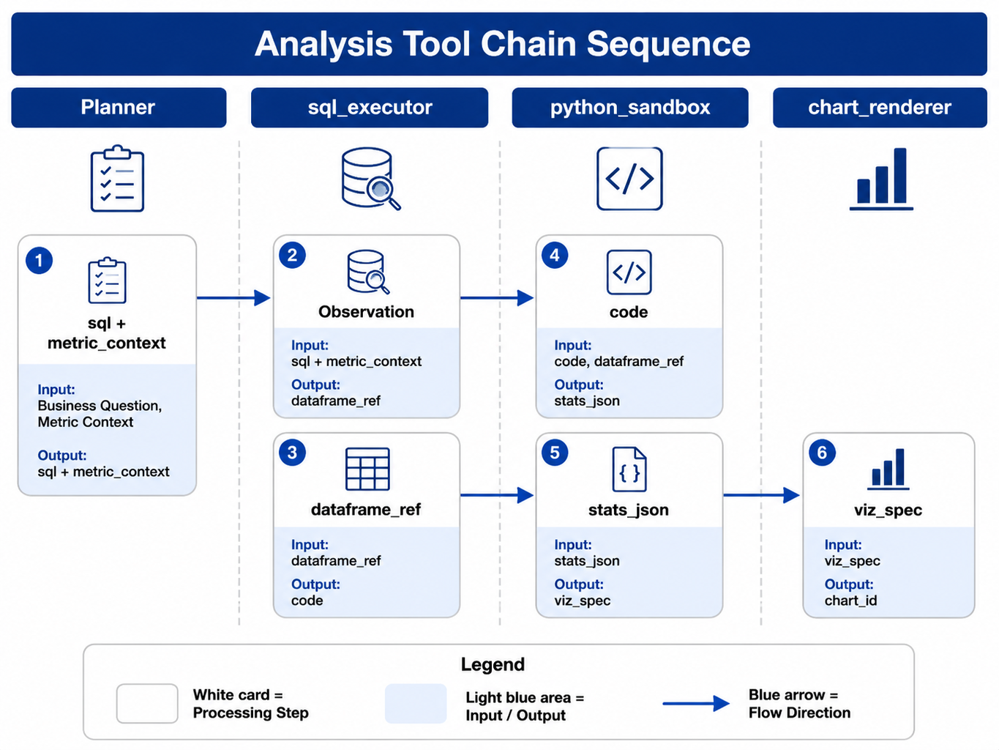

# Chapter 35 Text-to-Pandas / Text-to-Python

---

Chapter 34 addresses structured data retrieval. In the East China decline case, the `sql_executor` has already obtained the Top SKUs, last week's GMV, the GMV from the week before last, and the difference. Business users continue to ask, "Is this related to the category structure?" This question goes beyond simple data extraction. The system needs to aggregate SKU-level results by category, calculate contribution to the difference, determine whether the Top categories are concentrated, and prepare data for the charts in Chapter 36.

This kind of analysis can be hard-coded in SQL, but SQL queries often become very long and intermediate steps are difficult to explain. Python is better suited for expressing DataFrame transformations, contribution calculations, statistical tests, simple modeling, and ad hoc file exploration. The value of Text-to-Python is enabling the Planner to generate this analysis code from natural language and execute it safely within a sandbox.

The sandbox boundaries must be clearly defined upfront. Python is not a second query engine, nor a shortcut to bypass the semantic layer. It can only read `dataframe_ref` objects injected from the Registry, meaning result sets that have already been trimmed, authorized, versioned by reporting standard, and hashed by upstream `sql_executor`. If new data retrieval is necessary, the Planner should go back to `sql_executor` instead of accessing the database directly from Python code.

## 35.1 The Boundary Between SQL and Python

SQL remains the authoritative layer for data retrieval. Metric aggregations, joins, tenant filtering, row-level permissions, and default filters should be implemented in the semantic layer and `sql_executor`. Python operates on the authorized and pre-filtered result sets. This boundary ensures traceability of metrics and prevents models from generating code that scans production databases.

*Table 35-1: Suitable Boundaries Between SQL and Python. Source: Compiled for this book.*

| Task | Preferred Approach | Reason |
|---|---|---|
| Single metric aggregation | SQL | Clear metric definitions, controllable execution |
| Top SKU query | SQL | Grouping, sorting, and limit suffice |
| Category contribution | SQL data retrieval + Python | Intermediate calculations and explanations are clearer |
| Price/sales decomposition | Python | Multiple-step formulas and many temporary columns |
| Temporary CSV exploration | Python sandbox | Data not yet warehoused, size and permissions need limiting |
| Preprocessing report charts | Python + chart renderer | Produce aggregated JSON or chart specifications |

In the East China case, the top SKU list is generated by SQL, while "whether category structure matters" is done by Python. The Planner marks `path: sql_then_python` in the Question Frame. Upstream SQL outputs a narrow table with `sku_id`, `category`, `gmv_last_week`, `gmv_prior_week`, `gmv_delta`, and `region_code`. Python performs calculations only on this narrow table.

This boundary also aids troubleshooting. If Python results differ from SQL aggregates, the team first checks `dataframe_ref`, `content_hash`, and `metric_context`. If Python uses wrong columns or duplicates aggregations, fix Python code; if upstream SQL metrics are incorrect, revisit Chapters 33 and 34. Without this layered structure, Notebooks, SQL, and reports would blame each other endlessly.

The boundary between SQL and Python also affects costs. Online OLAP fits filtering, aggregation, and sorting; Python sandbox is suited for secondary calculations on smaller result sets. If a task requires tens of millions of detail rows loaded into pandas, it means it should not run as interactive DataAgent queries but be converted to offline jobs, pre-aggregated tables, or dedicated feature services. Natural language interfaces cannot circumvent physical limitations of compute systems.

Python should not replace formal modeling workflows either. One-off contribution analysis, exploratory distribution tests, and simple regressions can go into sandboxes; long-term attribution models, predictive models, and risk scores should be developed and deployed in data platforms or model services. DataAgent can treat sandbox results as prototypes and evidence but must not turn temporary code into production models.

For business users, the difference between SQL and Python should not be exposed as a technical choice. Users simply ask follow-ups like "by category" or "is it due to price," and the Planner chooses the path. The product interface can show "secondary analysis based on previous results," listing the upstream SQL and Python artifacts in the evidence section.

---

## 35.2 Sandbox Security

Python code generated by models must be considered untrusted by default. It may import network libraries, read host files, install packages, write logs, create large files, or leak sensitive fields in exception handling. Production environments cannot rely on prompts telling the model "don't do this." Restrictions must be enforced within the Tools and runtime environment.

The sandbox should meet several minimum requirements: network disabled by default; only mount a temporary Run directory; use cgroups or equivalent mechanisms to limit CPU, memory, and execution time; whitelist allowed dependencies; forbid `subprocess`, `socket`, database connection libraries, and arbitrary filesystem access; destroy the temporary directory when the Run finishes. PII columns must be desensitized before entering the sandbox. Do not expect Python code to mask sensitive data itself.

```yaml
allowed_imports: [pandas, numpy, scipy, sklearn, matplotlib]
max_memory_mb: 512
max_cpu_seconds: 30
max_python_retries: 2
network: false
```

Docker is the more realistic default choice because it has a complete scientific computing ecosystem, mature isolation, and resource controls. WASM or Pyodide start faster but have limited scientific computing packages, suited for edge or experimental scenarios. Remote Jupyter Kernels offer a good development experience, but multi-tenant isolation and auditing are difficult, making them unsuited as the default production execution environment.

Static auditing is the first line of defense. Before code enters the sandbox, parse its AST to check imports, file access, network access, process spawns, dynamic execution, and dangerous paths. Static auditing cannot replace container isolation but can catch many dangerous coding errors generated by the model. Container isolation handles behaviors missed by static scanning.

Dependency management must be fixed. Sandbox images should preinstall a fixed set of versioned packages such as pandas, numpy, scipy, scikit-learn, and matplotlib; each Run must record the image and package versions. Model-generated `pip install` requests must be rejected. Otherwise, the same code may produce different results over time due to library version changes.

Filesystem access must be isolated per Run. Inputs are mounted read-only, outputs are written to Run artifact directories, temporary files have quotas, and cleanup policies delete files after Run completion. Chart libraries often write config files or font caches; these paths must explicitly point to the Run temporary directory to avoid polluting the host environment. For multi-tenant platforms, these details are often a greater source of incidents than the code itself.

The sandbox must also handle resource abuse. Models may generate infinite loops, Cartesian product expansions, full pivots, or high-level model training. Hard limits must be imposed on CPU, memory, execution time, and output size, returning structured errors on overage. The planner can then require users to narrow scope or switch to offline tasks instead of continuously retrying the same code.

---

## 35.3 Code Generation, Execution, and Self-Repair

A single Python Tool invocation can be broken down into five steps. The Planner prepares the column summary, `dataframe_ref`, and analysis objective; the Gateway generates Python code; the Tool performs static auditing; the sandbox executes the code and collects stdout, stderr, and artifacts; the Registry returns the structured Observation back to the Planner.


*Figure 35-1: Python Tool sandbox execution flow. Source: original drawing for this book. Alt text: The process flows from code generation, static auditing, injecting read-only data, executing in a restricted sandbox, collecting artifacts and logs, to termination upon timeout or permission violation.*

Column name errors, type conversion errors, and minor syntax errors can be self-repaired. For example, if the model mistakenly uses `gmv_change` but the input columns only have `gmv_delta`, the sandbox will return a `KeyError` and a list of available columns. The Planner can then prompt the Gateway to fix and retry. The retry count should be independent of SQL retries covered in Chapter 34, typically limited to 1 or 2 attempts.

Privilege violations and dangerous behaviors cannot be self-repaired. If code tries to import `socket`, call `subprocess`, access database connections, or read the host directory, it should fail immediately and write an audit record. Otherwise, the model might discover usable paths by trial and error through retries. Security failures must be handled separately from ordinary code errors.

Observations should also be layered. The Planner needs exception stack traces, available columns, stdout summaries, and artifact lists; users should only see concise messages such as "Analysis failed due to missing fields"; audits must preserve code hash, input hash, dependency versions, resource usage, and exit reasons. Do not display full stderr logs directly to users.

When generating code, the prompt should only include column summaries, sample rows, and task objectives. Avoid including the full DataFrame in context and do not expose sensitive columns to the model. The column summary should include field names, types, a small amount of statistics, and anonymized samples, enough for the model to produce code such as groupbys, pivots, or pct_change. Full data is read inside the sandbox via `dataframe_ref`.

Self-repair must maintain the same input context. After the first execution failure, the Planner can ask the model to modify the code but must not replace `dataframe_ref`, `content_hash`, or `metric_context`. Otherwise, a second success might not correspond to the evidence chain of the first attempt. If a fix requires adding new fields or re-querying data, it should return to the `sql_executor` to produce new artifacts and record new upstream relationships.

In the explanation phase, the model must not write conclusions based solely on code intent. The model should read numbers from stdout or JSON artifacts and then generate natural language descriptions. Numbers not output by the code should not appear in the answer; fields shown only in exception traces should not be treated as analysis results. This constraint reduces cases where the code fails but the answer appears successful.

---

## 35.4 SQL + Python + Chart Workflow

Python's input is not a chat history segment but the output from upstream tools. The `sql_executor` returns `dataframe_ref`, column summaries, row counts, `content_hash`, and `metric_context`. Python reads `dataframe_ref` and outputs statistical JSON, chart data, or intermediate artifacts. Chapter 36's `chart_renderer` then converts these outputs into visualizations and report EvidenceRef.



*Figure 35-2: Timing sequence of the analytical tool chain. Source: drawn by the author. Alt text: A sequence diagram showing the Planner first uses SQL to fetch data, then invokes the Python Tool for statistical modeling, and finally generates chart artifacts. Arrows indicate the relay collaboration between the SQL and Python tools in one analysis.*

`dataframe_ref` specifies which data Python reads; `content_hash` indicates whether that data has been replaced; and `metric_context` defines the accounting metric. Together, these three form a contract between SQL and Python. Missing any of them means the percentages in the report cannot be traced back to the original evidence. A simplified category contribution script example is shown below.

```python
import json
import pandas as pd

df = pd.read_parquet(inputs["dataframe_ref"])
by_cat = (
    df.groupby("category", as_index=False)["gmv_delta"]
    .sum()
    .assign(share_of_decline=lambda x: x["gmv_delta"] / x["gmv_delta"].sum())
    .sort_values("gmv_delta")
)
result = {
    "metric": "gmv_ops@2025Q1",
    "categories": by_cat.to_dict(orient="records"),
    "top3_share": float(
        by_cat.nsmallest(3, "gmv_delta")["gmv_delta"].sum()
        / by_cat["gmv_delta"].sum()
    ),
}
print(json.dumps(result, ensure_ascii=False))
```

When the Planner writes conclusions based on Python output, it must not recalculate numbers. It should reference results from stdout or artifacts, such as "The top three categories, snacks, dairy, and beverages, account for 58% of the East China operational GMV decline difference." If users ask "How is 58% calculated?", the system can open the upstream Parquet hash, Python code hash, and `category_contrib.json`.

Each step in the workflow must retain input and output summaries. The SQL Tool records the query, row count, and Parquet hash; the Python Tool records code, stdout, artifacts, and resource usage; the Chart Tool records chart specs, data references, and rendering artifacts. This way, when generating reports in Chapter 36, tools don't need to be rerun, yet evidence links can still be attached to charts and conclusions.

If Python analysis requires multiple inputs, such as sales results and competitive pricing data, the platform must separately record each input's source, hash, permissions, and freshness. Conclusions from multi-input analyses only hold within the intersection covered by all inputs. If competitive pricing is a temporary file uploaded by a user, the report should note it is not according to enterprise data warehouse standards.

When Python outputs chart data, it's also important to distinguish display fields from calculation fields. Display fields can be renamed or formatted, but calculation fields should keep raw values. Otherwise, Chapter 36's charts and reports may only receive formatted percentage strings, making it impossible to sort, filter, or verify evidence further.

---

## 35.5 Artifact Management and Evidence Traceability

Python artifacts can be statistical JSON files, chart data, PNG images, CSV summaries, or notebook snippets. Regardless of the form, they should be bound to input hashes, Metric versions, code hashes, execution environments, and generation timestamps. Artifact URLs must have TTL (time-to-live), and sensitive artifacts should have tenant- and permission-based access controls.

Artifacts are not long-term fact tables. For example, a `category_contrib.json` generated in a single Run applies only to that specific input, metric version, and code version. When reused next week, it must be rebound with the new input and Metric version. Semantic layer metrics, report templates, analysis playbooks, and evaluation samples can be preserved long-term; a sandbox output from a single Run should not become a fact table.

Notebook collaboration requires caution. Business users may download or view the analysis process, but downloaded notebooks should not be re-ingested into the platform as authoritative results. Otherwise, the platform cannot guarantee that subsequent manual edits comply with permission policies, definitions, and evidence requirements. Production reports should reference platform-managed artifacts and traces, instead of locally modified user scripts.

Evidence traceability must also cover charts. When generating charts in Chapter 36, the chart specification should be bound to the Python artifact and the upstream SQL result. Chart titles and annotations should include the metric title or `metric_id@version` to prevent loss of definition if users screenshot charts. External reports require a more complete EvidenceRef.

Artifact lifecycle management also concerns compliant deletion. When a user deletes an uploaded file, a tenant is decommissioned, reports are withdrawn, or compliance demands data cleanup, the platform must locate Python artifacts and charts derived from that input. Saving only final images without provenance makes cleanup incomplete. Run artifacts should support tracing derivative artifacts by input hash or tenant.

Notebook previews can serve as collaborative interfaces but should be clearly read-only retrospectives, not production execution entry points. Users may view code and intermediate tables and propose modifications; actual re-execution should be performed by the Planner generating new Tool Calls. This preserves analytic transparency without letting manual notebooks become fact sources outside the platform.

For analyses reused long-term, sandbox code should be promoted to version-controlled analytic tools. For example, if the "volume-price waterfall" is used weekly, the model shouldn't regenerate a pandas snippet every time; it should be formalized as a `price_volume_decomposition@v1` Tool. Text-to-Python is suitable for exploration and gap-filling, while stable processes should gradually be industrialized.

---

## 35.6 Python Sandbox and DataAgent Execution Chain

`python_sandbox` is a Registry Tool, not a notebook accessed directly by users. The Planner passes in code, input references, tenant and metric context; the Tool returns stdout, artifacts, provenance, and structured errors. The directory can be split by execution entry, runner, static scan, and policy files.

```text
mini-platform/tools/python_sandbox/
├── handler.py
├── runner/docker_runner.py
├── static_scan.py
└── policy.yaml
```

The production implementation must at least record these fields: code hash, `dataframe_ref`, `content_hash`, `metric_context`, stdout summary, artifact URI, resource usage, exit status, and error type. This allows Chapter 38 Trace to place Python analysis back into the complete Run lineage. The first version can initially support pandas, numpy, matplotlib, and fixed input formats. Later add polars, scipy, sklearn, notebook previews, and more chart artifacts. Do not allow arbitrary package installation from the start. The looser the dependencies, the harder it is to ensure security and reproducibility.

Common failures include sandbox timeouts, out-of-memory, matplotlib backend misconfiguration, non-whitelisted packages, KeyError, and mismatch between SQL/Python aggregation. Each failure type must have clear handling: fixable errors return available columns and hints; unfixable errors result in failure or manual confirmation. For aggregation mismatches, distinguish rounding errors from true scope drift.

The evaluation dataset should also cover the Python pipeline. Samples should include correct contribution, missing columns, empty data, outliers, unit changes, truncated inputs, unauthorized code, and missing chart evidence. Evaluation checks whether the code runs and whether output numbers derive from input, retain Metric context, and reduce conclusion strength under uncertainty.

Before launch, an end-to-end rehearsal is advisable: SQL extracts East China SKU wide table, Python calculates category contribution, Chart Tool generates bar chart, report references EvidenceRef. During rehearsal, deliberately trigger KeyError, timeout, non-whitelist import, and content hash mismatch, confirming the system returns self-repair, failure, rejection, and refetching accordingly. This approach more closely simulates production than just testing a pandas snippet.

After deployment, monitor metrics closely. Python Tool retry rate, timeout rate, memory failure rate, average artifact size, and SQL/Python aggregation inconsistency rate all signal sandbox health. If a certain analysis frequently fails, consider hardcoding it as a fixed Tool or precomputing it in the data platform.

Sandbox operations require cleanup policies. Run temporary directories, chart caches, stdout, stderr, notebook previews, and intermediate Parquet files all consume storage. The platform should set TTL by tenant, Run type, and compliance needs, retaining sufficient metadata in Trace for replay. Raw sensitive data can be cleared with shorter TTL, keeping hashes, schema, Metric context, and code hash for report explanation.

For team collaboration, analytical script improvements should enter a review workflow. When data analysts find model-generated contribution code unstable, they can submit stable versions as Playbooks or fixed Tools; the platform team then adds schema, tests, and permissions. In this way, Text-to-Python does not generate limitless temporary code but gradually matures frequent analyses into governable assets.

Finally, the user experience should avoid exposing sandbox details to business users. The UI can display "Performing category contribution analysis" or "Analysis results based on previous SQL output" but need not let users choose pandas vs polars. Technical details stay in the evidence panel and Trace; the business interface only shows conclusions, scope, and traceable entry points.

Acceptance testing should verify both correctness and isolation. Correctness validates contribution, proportions, and ranking with fixed inputs; isolation tests that malicious samples are blocked from network, file, process, and non-whitelist packages. Only if both pass can Text-to-Python enter the main DataAgent pipeline.

After permission changes, replay and verification remain necessary. When user roles, tenant scopes, or masking policies change, prior Runs' Python artifacts must not be automatically inherited under new permissions. The platform should replay historical evidence with the original permission context but decide access to re-view or download artifacts according to current permissions. This rule is especially important for report reuse. Reports can keep conclusion summaries, but reopening underlying details, chart data, or notebook previews requires current user permission checks. Audit exports should only include artifact references and summaries within the authorized scope, avoiding packaging sandbox temporary directories wholesale for users. When necessary, keep approval logs indicating who viewed these artifacts and under what permissions.

---

## 35.7 Production boundary of the Python analysis chain

Text-to-Python fills the analysis gap that SQL does not handle well: contribution decomposition, group comparison, anomaly detection, and report-ready reshaping. It must not become a free code execution entry point. Production systems should separate code generation, data input, sandbox execution, artifact persistence, and audit records, with a boundary at every step.

Data input should use controlled `data_ref` objects, not large tables pasted into prompts or browser state. The SQL tool writes authorized results to object storage or a temporary dataset. The Python sandbox receives only the authorized reference, field schema, row limit, and metric context. This controls context size and lets the platform re-check permissions when a user reopens a report.

Generated code is untrusted. Attempts to access the network, environment variables, arbitrary files, or external services should be logged as security events instead of ordinary execution failures. For high-risk behavior such as export, file write, or external service calls, the system can require human review. Artifacts produced by Python should carry input version, code hash, execution time, dependency version, and Trace ID. Report generation should reference those artifacts, not ask the model to reconstruct the calculation from memory.

## 35.8 Explainability of Python Analysis Results

Python sandbox output still needs a business explanation. A contribution table should state the baseline period, comparison period, denominator, contribution formula, and sorting rule. An anomaly list should state the threshold, sample range, and whether holidays or missing data were excluded. A clustering result should state feature columns, normalization method, and how the cluster count was chosen. The model does not need to expose every line of code to users, but it must explain how input data, core computation, output fields, and conclusion relate. Written explanations should cite structured metadata from the artifact instead of inferring from chart shape alone.

Self-repair also needs evidence. The first generated code, execution error, repaired code, and final result form a useful chain. The platform can store code hash, error type, repair round, and key diff summary while keeping sensitive data behind `data_ref`. This lets the team study recurring code-generation errors without storing full raw data.

Python analysis should remain separate from the report layer. The sandbox creates verifiable intermediate artifacts. The report layer organizes them into business narrative. Reports should not recalculate facts or modify sandbox output fields. If the calculation changes, the system should run a new sandbox task and produce a new artifact version.

## 35.9 Release Gates for Analysis Code

Once Text-to-Python enters production, the gate is not one code snippet. It is an analysis capability class. The platform needs to verify that the model can generate executable code on controlled datasets, converge after fixable failures, avoid forbidden resources, and write traceable artifacts. Without those properties, the Python sandbox becomes a risk surface instead of an analysis tool.

The first gate is security. Generated code cannot access the network, read environment variables, write arbitrary paths, import unapproved libraries, or dump raw details into logs. Static scanning can block obvious patterns such as sensitive `open()` paths, network calls, subprocess invocation, and large file writes. Runtime isolation then handles behavior that static scanning misses.

The second gate is quality. Given the same input, the model should produce similar analytical steps and results. If each run chooses different groups, thresholds, or sort rules, the report layer cannot review the result. Common tasks such as contribution analysis, trend comparison, anomaly detection, and distribution analysis can be turned into templates. The model fills parameters and explains results instead of inventing a new algorithm every time.

The third gate is resource control. Python analysis can exhaust memory through large tables, joins, loops, or plotting. The sandbox should limit input rows, runtime, memory, and output size. Over-limit errors should return structured messages such as "narrow the time range or dimension," not internal stack traces.

## 35.10 Interface Contract with the Report Layer

Python sandbox output should be structured for the report layer. At minimum, it should include result table references, chart candidates, core metrics, anomaly points, calculation notes, code version, and input data references. The report layer can decide how to write the text, but it must not overwrite these factual fields. If a business user edits a report conclusion, the system should record that as a manual edit instead of changing the sandbox result.

The interface should support multi-turn analysis. A user may first ask which SKUs reduced margin, then ask whether the conclusion still holds after excluding promotions. The second round should inherit the prior data reference, filters, and analysis artifact, then generate a new sandbox task. Trace should record the inheritance so the report can explain why two versions differ.

Artifacts also need permission-aware sharing. A finance analyst may share a report summary with a regional owner who cannot view full detail. Report access, chart access, and input data access should be checked separately. Being allowed to read the report does not automatically grant permission to download the underlying DataFrame.

## 35.11 Audit Boundary for Sandbox Execution

Once Text-to-Python touches production data, sandbox audit is more than container isolation. The platform must record which data was read, which intermediate objects were produced, which libraries were accessed, which resources were consumed, which files were created, and whether those artifacts entered a user-visible report. Data access should use controlled handles. Model-generated code should not stitch together arbitrary paths or connection strings. It should read upstream query results through platform-provided references, preserving SQL-layer permissions into Python execution.

Trace should record Python code, input data summary, dependency environment, resource quota, runtime, exception stack, and artifact list. For sampling, clustering, regression, or anomaly detection, record random seed and key parameters. Failed executions should mark partial artifacts as non-publishable. Successful artifacts should pass basic consistency checks before the report layer uses them: chart columns exist, statistics come from the same DataFrame, and EvidenceRef points to upstream SQL or file parsing.

## 35.12 Reuse and Retirement of Analysis Code

Enterprise Text-to-Python should not regenerate code from scratch for every frequent analysis. Reviewed snippets can be promoted into controlled templates: period comparison, group contribution, funnel conversion, anomaly detection, cohort analysis, and similar tasks. Letting the model choose a template and fill parameters is easier to audit than generating a full program each time.

Reuse also needs retirement. When business definitions change, an old template may still run while producing outdated conclusions. Templates should be bound to semantic-layer versions, data domains, and applicable metrics. Upstream definition changes should trigger review. Templates with long-term disuse, rising failure rates, or repeated manual rejection should enter watch or retirement.

The engineering boundary is simple: can the code be explained, and can the artifact be traced? If either answer is no, the analysis should not directly enter reports or decisions. The platform can start with analyst review, then expand automation as templates, sandbox controls, Trace, and evaluation become stable.

## 35.13 Numeric Validation of Analysis Results

Python analysis can produce plausible but wrong numbers. Errors may come from duplicated rows, missing-value handling, type conversion, sorting truncation, timezone handling, denominator selection, or sampling. Flexible model-generated code makes these errors hard to catch through syntax checks alone. The platform needs post-execution numeric validation.

Start with simple rules: input and output row counts fit expectations, required columns exist, key columns have acceptable missing rates, monetary totals reconcile with SQL results, grouped percentages stay in valid ranges, and chart points come from the same time window. For high-risk analysis, expose key intermediate results so humans or evaluation scripts can check them.

This makes Text-to-Python closer to data engineering than code generation. The model can generate analysis code, but the platform decides whether the result is strong enough to enter a report. Numeric validation gives Chapter 36 a more reliable EvidenceRef. Without it, a natural-sounding report can hide calculation errors.

Some requests should still be refused. Reading local files, opening external URLs, installing packages, processing huge details, or building long-term forecasting models may fall outside the controlled analysis boundary. The system should explain the current DataAgent scope and offer a safer path. The value of Python sandboxing is controlled analysis, not satisfying every compute request.

---

## 35.14 Review and publication responsibility for analysis artifacts

Results produced by Text-to-Pandas and Text-to-Python are usually harder to review than one SQL query. SQL can be traced back to tables, fields, and filters. Python analysis may include cleaning, outlier handling, aggregation, model fitting, and chart generation. The platform should not keep only the final chart or one explanation. It should keep input data references, code version, runtime environment, random seed, dependency versions, execution logs, and output artifact. Without those materials, readers see a conclusion while reviewers cannot tell how it was produced.

Review responsibility should follow artifact type. The platform team owns sandboxing, permission, dependencies, resources, and execution evidence. The data team owns input data and metric definitions. Business reviewers own whether the conclusion fits the scenario. Security teams review export and sensitive fields. If a Python analysis artifact enters an official report, the platform should verify data source, replayable code, chart explanation, evidence consistency, and sensitive-data handling. This process can start lightweight, but it cannot rely only on a user visually inspecting a chart.

Published artifacts also need a correction path. Later, the team may discover a processing error or a corrected input dataset. The platform should locate affected artifacts and mark them for review instead of letting old reports continue to circulate. The stronger DataAgent's Python capability becomes, the more artifact governance it needs. Otherwise the system will quickly generate many polished analysis materials that are difficult to trace.

## 35.15 Correction, withdrawal, and republication of analysis artifacts

Python analysis artifacts can need correction after they enter reports or meeting material. Common causes include late upstream data, metric-definition changes, defects in a code template, new outlier handling rules, or a business reviewer finding that an assumption no longer holds. The platform should fix the new Run and also locate reports, charts, and exports that cited the old artifact. Otherwise the same error keeps circulating in published material.

The correction process should freeze affected artifacts before producing new versions. Freezing does not delete evidence. It marks the artifact as unsuitable for current conclusions while keeping it available for audit and review. The new version should bind input data, code hash, dependency version, Metric context, and EvidenceRef again, then state how it differs from the previous version. If the change affects only presentation, a local replacement may be enough. If it affects a key conclusion, the report should return to review or withdrawal state.

Withdrawal needs clear boundaries. Internal drafts can be marked expired. Published reports should notify recipients. Exported material should record how it was handled. If the conclusion already entered an approval, ticket, or meeting note, the platform should preserve the follow-up action: regenerated material, explanatory note, or review task. The Python analysis layer then supports error handling after publication along with artifact generation.

Republication should reuse the original task chain where possible. The system can copy the user question, Question Frame, input references, and report template from the old Run, but it must re-execute affected SQL or Python steps and produce a new artifact version. Reusing context reduces manual work. Re-execution keeps the evidence valid. This turns Text-to-Python into a maintainable analysis pipeline instead of a collection of temporary code snippets.

## 35.16 Resource and dependency governance for analysis sandboxes

The risk in Text-to-Python does not come only from malicious code. It also comes from uncontrolled resources and dependencies. An ordinary user request may generate a full-table `merge`, high-cardinality groupby, repeated chart rendering, recursive file reads, or an attempt to install a package. Even without network access, code can exhaust memory, saturate CPU, write large intermediate files, or produce different results under another dependency version. Sandbox governance should constrain execution time, memory, CPU, disk, output size, and dependency set, and those limits should become part of the execution evidence.

Resource limits should follow task type. An interactive exploration should prefer samples, summaries, or draft charts. An async report can run longer, but it still needs checkpoints. A batch evaluation job can wait in a queue, but it should not affect online question answering. The platform should not put every Python task into one shared pool. Otherwise one complex analysis can slow ordinary data questions for other users. Before submission, the executor can estimate cost from `dataframe_ref`: row count, column count, data types, expected join size, and number of charts. If the budget looks too high, the system can ask the user to narrow scope, move to async execution, or request approval.

Dependency governance matters for both safety and reproducibility. Allowing the model to install packages freely makes results hard to reproduce and expands the security surface. Blocking every useful package makes the feature too weak. A practical first version can maintain a few whitelisted environments: basic statistics, time-series analysis, visualization, and tabular processing. Each environment fixes Python version, package versions, and system libraries. Generated code declares the target environment, and the execution result records the environment id. If a user needs a new package, the platform should use an environment release process that reviews license, vulnerability status, resource behavior, sample replay, and rollback plan.

The sandbox also needs output governance. Python code can produce charts, CSV files, HTML, images, model files, and logs. These outputs do not have the same risk. A chart may enter a report draft. A detail-level CSV may require approval. HTML output needs safe rendering. Model files usually should not be exported from an ordinary DataAgent task. The platform should limit output size, masking, download permission, and retention by output type. This turns Text-to-Python into a controlled analysis capability instead of giving the model a hidden general-purpose compute environment.

These controls should be visible to users and reviewers. If an analysis was moved to async execution, the UI should show the reason. If a dependency is unavailable, the Agent should explain the supported environment instead of inventing an alternative result. If output was blocked because it contained sensitive detail, the report layer should receive a structured reason. Clear feedback helps users revise the task, while Trace keeps enough evidence for engineering review.

## 35.17 Sandbox replay and data dependency snapshots

The reviewability of Text-to-Python cannot depend on code text alone. The same code can produce different results under another data snapshot, dependency version, random seed, or resource limit. A production platform should package each Python execution as replay material: user question, Question Frame, SQL result reference, `dataframe_ref`, data snapshot time, code hash, execution environment, dependency versions, random seed, resource limits, output artifacts, and error logs. If several of these are missing, later review depends on memory instead of evidence.

Data dependency snapshots need the right granularity. For a small aggregated result, the platform can store a complete dataframe hash and masked examples. For a large table result, it should store query version, input partitions, filters, row and column statistics, key-field distributions, and content fingerprints. The platform does not always need to copy every detail row, but it must prove the scope and shape of the input data at execution time. If late data changes the result, reviewers should be able to tell whether the change came from input data, analysis code, dependency libraries, or chart rendering.

Replay must remain permission aware. The original user may have had detail-level access, while an engineer reviewing a failure may not. The platform can split replay into two layers: engineering replay that uses masked data and structural fingerprints to reproduce failures, and business review that uses authorized aggregates plus EvidenceRef to validate conclusions. Access to sensitive details should go through approval, not through unrestricted reuse of old Run data. This keeps reproducibility without turning audit material into a new leakage channel.

A first version can start with high-risk analysis tasks. Any Python artifact entering an official report, approval material, or external export should keep a replay package. Interactive exploration can keep lighter evidence. The replay package connects to the report layer in Chapter 36 through Trace, feeds incident review through the observability chain in Chapter 38, and becomes regression material for Chapter 39. The closer DataAgent's Python capability gets to an automated analysis pipeline, the more it needs this data-dependency discipline.

## 35.18 Execution credentials for analysis code

After Python analysis sandboxes reaches production, a successful demo is not enough evidence. The platform needs stable fields for code version, dependency snapshot, input data, resource limit, output artifact, and review record, and those fields should connect to release records, Trace, evaluation samples, and incident notes. When a production issue appears, teams can follow one set of facts to understand scope, ownership, and repair order instead of stitching together model logs, business logs, and verbal explanations.

This evidence also connects the surrounding chapters. It links to Chapter 34 on NL2SQL, Chapter 36 on reports, and Chapter 52 on compliance: upstream capabilities provide assumptions, downstream capabilities consume the result, and governance capabilities preserve evidence and review decisions. If these materials do not share identifiers and versions, the production system splits apart. Business owners see user complaints, platform owners see system errors, and security or compliance teams see explanations written after the fact. That separation makes it hard to decide whether the issue came from data, model behavior, tool contracts, workflow state, or organizational ownership.

Common production risks include notebook-style code entering production, temporary files that cannot be traced, and dependency upgrades changing results. These risks are less visible during demos because demos usually exercise the successful path. Production users bring boundary cases, repeated requests, permission changes, and long-running state. The platform team should turn such failures into release samples. Some samples should block launch, some can be handled by degradation, and some require the business owner to accept the remaining risk with a review date.

The analysis sandbox should turn each execution into a replayable credential that supports numeric review and artifact withdrawal. The record can stay compact, but it should include time, version, owner, sample, action, and the next review condition. Without those fields, review remains informal experience. With them, one production issue can become material for later releases, evaluation suites, and training.

A first platform version can start with a small set of high-risk paths. Choose flows with high traffic, high business impact, or sensitive data, require an evidence package for each change, and then expand the practice to ordinary scenarios. This keeps the capability at the engineering level: runnable, explainable, and recoverable.
## Chapter Recap

SQL is the authoritative source for data retrieval. Python handles secondary analysis and ad hoc computation on authorized SQL result sets. The Python sandbox needs no network access, constrained resources, whitelisted dependencies, no direct production database connection, and controlled data handles. `dataframe_ref`, `content_hash`, and `metric_context` are the evidence contract between SQL and Python.

Python artifacts are trustworthy only within the current Run, input, metric version, and dependency environment. Long-term reuse should move into semantic-layer definitions, templates, Playbooks, or fixed Tools. Charts and reports must cite upstream SQL and Python artifacts; the model should not rewrite numbers from memory. Production readiness depends on release gates, audit boundaries, code reuse and retirement, and numeric validation.

## References

Tang, Z., et al. (2025). LLM/Agent-as-Data-Analyst: A Survey. arXiv:2509.23988. [https://arxiv.org/abs/2509.23988](https://arxiv.org/abs/2509.23988)

OpenAI. (2023). *Introducing ChatGPT Code Interpreter*. OpenAI Blog. [https://openai.com/index/chatgpt-code-interpreter/](https://openai.com/index/chatgpt-code-interpreter/)

PandasAI. (2024). *PandasAI Documentation*. [https://docs.pandas-ai.com/](https://docs.pandas-ai.com/)

WebAssembly Community. (2024). *WebAssembly System Interface (WASI)*. [https://github.com/WebAssembly/WASI](https://github.com/WebAssembly/WASI)

Jupyter Development Team. (2024). *Jupyter Kernel Gateway*. [https://jupyter-kernel-gateway.readthedocs.io/](https://jupyter-kernel-gateway.readthedocs.io/)

Li, J., et al. (2023). Chain-of-code: Reasoning with Language Model-Generated Programs. arXiv:2312.05567.
